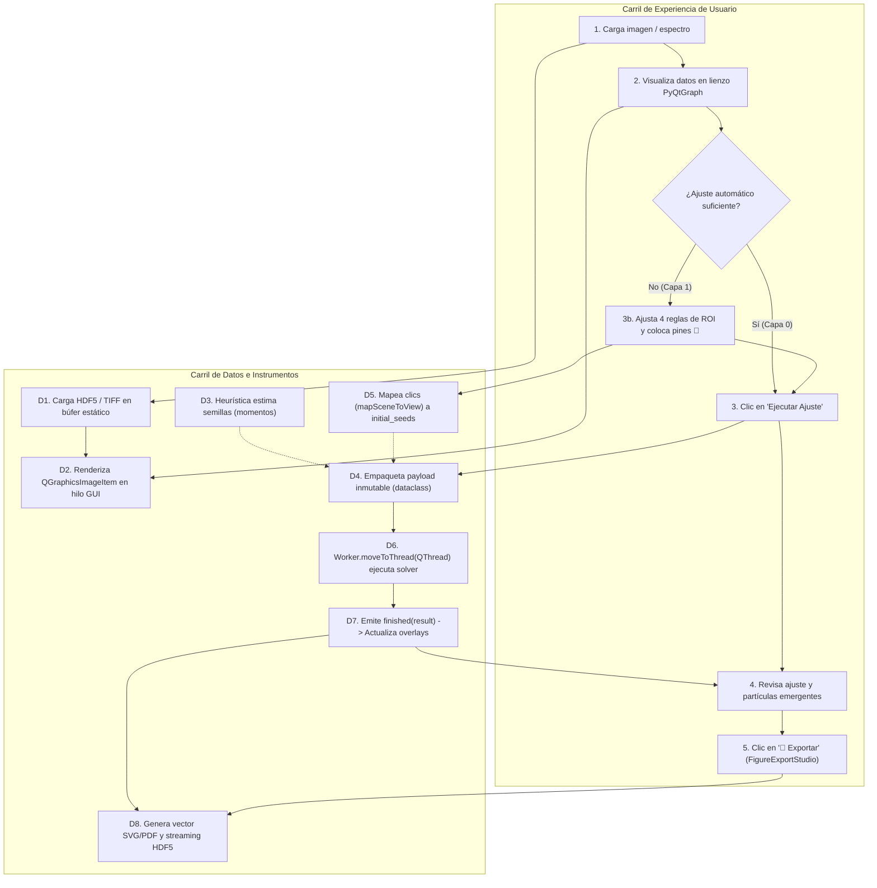

# Interactive Tool Design & Degree of Freedom (DoF) Audit Skill

This skill governs the systematic design, auditing, and refactoring of scientific user interface objects, analysis widgets, and interactive canvases in PyPrinting 3.0. It eliminates "black-box" magic buttons and prevents intimidating "cockpit" interfaces by enforcing **Graduated Control** and **Dual-Track Flowcharts**.

---

## The Core Philosophy: Graduated Control & DoF Inventory

Every scientific operation (spectral baseline subtraction, 2D Gaussian fitting, spatial clustering, reciprocal space mapping) possesses a finite set of mathematical and physical parameters. A robust scientific tool must neither hide these parameters behind an opaque single button nor demand that the operator manually enter 10 numbers before seeing a result.

Instead, the tool structures interaction into an **Automation Ladder**:

```
Layer 3: Algorithmic & Metrological Freedom  [Solvers, Loss functions, Tolerances]
   ▲
Layer 2: Parametric Bounds & Hard Constraints [Spinboxes, Locked PSF widths, Height limits]
   ▲
Layer 1: Visual & Gestual Guidance on Canvas [4-rule ROIs, Click-to-seed pins, Bounding boxes]
   ▲
Layer 0: Full-Auto Heuristics (Default)       [Moments, Percentiles, Automated peak finders]
─────────────────────────────────────────────────────────────────────────────────────────────
Fixed Invariants: Laboratory Gold Standards  [Hardcoded physics: BLAS NUFFT, AsLS, etc.]
```

---

## Step-by-Step Execution Protocol

Whenever designing a new tool or auditing an existing GUI component, execute the following 5 phases:

### Phase 1: Exhaustive DoF Inventory
List every free parameter of the underlying physical/mathematical model:
1. **Identify Spatial / Spectral Boundaries**: What is the region of interest ($X, Y, \lambda$)?
2. **Identify Model Coefficients**: What are the coordinates, amplitudes, widths, baselines, or polynomial orders?
3. **Identify Discrete Choices**: Number of components ($K$), background model (constant vs linear vs polynomial).
4. **Identify Numerical Solver Options**: Optimization algorithm (LM, Dogbox), loss metrics (L2, Cauchy, Huber).

### Phase 2: Classification into Invariants vs Customization Layers
Partition the DoF inventory into clear categories:
* **Fixed Invariants (Hardcoded)**: Parameters that represent established laboratory consensus and should NOT clutter the UI (e.g., using BLAS-accelerated Type 1 NUFFT for all non-uniform Fourier transforms, or setting `pdf.fonttype = 42`).
* **Layer 0 (Default Full-Auto)**: Sensible heuristics that execute automatically when the user loads data or clicks "Run" without manual setup.
* **Layer 1 (Visual / Gestual Controls)**: Canvas-level interactions:
  * *4 Mobile Boundary Rulers* (`pg.InfiniteLine`) for 2D spatial cuts.
  * *Draggable Bounding Box* (`pg.RectROI`) for sub-grid particle selection.
  * *1D Spectral Region* (`pg.LinearRegionItem`) for detector noise trimming.
  * *Click-to-Seed Pins* (`btn_pick_visual_seeds` / 📍 Centros Visuales) for initial guesses.
* **Layer 2 (Parametric Locks & Bounds)**: Exposed via collapsible drawers (`⚙️ Restricciones y Ajustes Avanzados`) for users needing to freeze parameters (e.g., locking $\sigma$ to `reserva/psf.tiff` or constraining background $\ge 0$).
* **Layer 3 (Algorithmic Solvers)**: Convergence tolerances, maximum iterations, and loss functions for edge-case diagnostics.

### Phase 3: Dual-Track Architectural Flowchart (Mermaid)
Construct a parallel flowchart explicitly contrasting the researcher's experience against the data/hardware execution:



### Phase 4: State Precedence & Bidirectional Synchronization
Enforce strict rules for multi-layered interactions:
1. **Precedence Hierarchy**:
   $$\text{User Visual Pin / Lock (Layers 1-2)} > \text{Automated Heuristic (Layer 0)}$$
   Manual intervention explicitly disables the corresponding heuristic estimator until `🗑️ Limpiar` is pressed.
2. **Absolute Coordinate Anchoring**:
   Visual seed coordinates must be maintained in **absolute sample coordinates** ($\mu\text{m}$ or nm), never relative pixel coordinates of a cropped bounding box.
3. **Signal Guarding**:
   Every bidirectional binding between a visual ROI handle and a `QDoubleSpinBox` must wrap updates in `blockSignals(True)`:
   ```python
   def _on_roi_changed(self):
       self.spinbox.blockSignals(True)
       self.spinbox.setValue(self.roi.value())
       self.spinbox.blockSignals(False)
   ```

### Phase 5: Fail-Soft Desescalation & FAIR Provenance
1. **Fail-Soft Desescalation**:
   If an automated Layer 0 calculation fails to converge, never pop up a fatal modal error. Automatically reveal the Layer 1 visual tools and prompt the operator:
   > *"Auto-fit did not converge due to low SNR or emitter overlap. Mode '📍 Visual Seeds' activated: click peak centers on the canvas to guide the solver."*
2. **Provenance Metadata**:
   Every exported HDF5/TXT record must stamp the source of each DoF:
   ```yaml
   dof_provenance:
     roi_source: "visual_interactive_rulers"
     center_source: "operator_visual_pins (3 seeds)"
     sigma_source: "locked_calibrated_psf"
     baseline_source: "auto_asls"
     active_layer: 1
   ```
3. **Export Studio Hook**:
   Ensure `FigureExportStudioDialog` (`analysis/figure_export_studio.py`) is wired to the primary visualization canvas.

---

## Deliverable Checklist for Code Reviews

When presenting a new UI tool or module design:
- [ ] Exhaustive DoF inventory documented in design notes.
- [ ] Explicit separation of Fixed Invariants vs Layers 0-3.
- [ ] Mermaid Dual-Track Flowchart included.
- [ ] Two-way ROI sync protected by `blockSignals(True)`.
- [ ] Absolute coordinate tracking for visual pins/markers.
- [ ] Fail-soft desescalation workflow implemented for solver convergence warnings.
- [ ] `FigureExportStudioDialog` available on the canvas.
