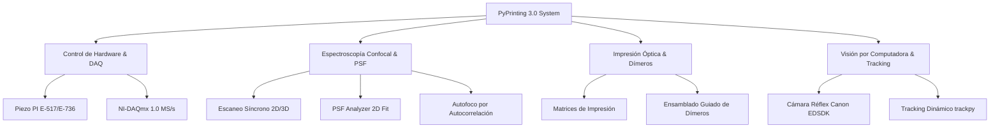

# Manual de Usuario: PyPrinting 3.0 🔬
**Sistema de Control, Espectroscopía Confocal, Caracterización de PSF y Nanofabricación Óptica**
*UNSAM — Nanofotónica*

---

## 📖 Índice

1. [Introducción, Fundamentos Físicos y Formulación Matemática](#1-introducción-fundamentos-físicos-y-formulación-matemática)
   - [1.1 Impresión Óptica Fototérmica y Ensamblado de Dímeros Plasmónicos](#11-impresión-óptica-fototérmica-y-ensamblado-de-dímeros-plasmónicos)
   - [1.2 Modelo Analítico Gaussiano 2D de 7 Parámetros](#12-modelo-analítico-gaussiano-2d-de-7-parámetros)
   - [1.3 Modelo Analítico Haz Vortex / Donut (Laguerre-Gauss $LG_{01}$)](#13-modelo-analítico-haz-vortex--donut-laguerre-gauss-lg_01)
   - [1.4 Métricas de Caracterización y Alineación Sub-nanométrica de PSF](#14-métricas-de-caracterización-y-alineación-sub-nanométrica-de-psf)
   - [1.5 Algoritmo de Estabilización Z por Autocorrelación](#15-algoritmo-de-estabilización-z-por-autocorrelación)
   - [1.6 Mapeo Físico de Coordenadas Piezoeléctricas PI](#16-mapeo-físico-de-coordenadas-piezoeléctricas-pi)
2. [Modos de Operación: Producción vs. Modo Seguro](#2-modos-de-operación-producción-vs-modo-seguro)
3. [Estructura de la Barra de Menús Principal](#3-estructura-de-la-barra-de-menús-principal)
4. [Flujos de Trabajo Experimentales (Protocolos Paso a Paso)](#4-flujos-de-trabajo-experimentales-protocolos-paso-a-paso)
   - [4.1 Mapeo Confocal 2D/3D y Ajuste de Partículas (PSF)](#41-mapeo-confocal-2d3d-y-ajuste-de-partículas-psf)
   - [4.2 Impresión Automatizada de Redes/Grillas de Nanopartículas](#42-impresión-automatizada-de-redesgrillas-de-nanopartículas)
   - [4.3 Fabricación Guiada de Nanodímeros Plasmónicos](#43-fabricación-guiada-de-nanodímeros-plasmónicos)
   - [4.4 Medición con Cámara y Alineación Óptica](#44-medición-con-cámara-y-alineación-óptica)
   - [4.5 Adquisición de Trazas Temporales y Calibración de Potencia BS](#45-adquisición-de-trazas-temporales-y-calibración-de-potencia-bs)
   - [4.6 Caracterización Analítica Avanzada de PSF (`psf_analyzer.py`)](#46-caracterización-analítica-avanzada-de-psf-psf_analyzerpy)
5. [Descripción Detallada de Docks, Ventanas y Controles](#5-descripción-detallada-de-docks-ventanas-y-controles)
   - [5.1 Dock: Confocal](#51-dock-confocal)
   - [5.2 Dock: Trace (Trazas Dobles y Ventana Power BS)](#52-dock-trace-trazas-dobles-y-ventana-power-bs)
   - [5.3 Dock: Focus z](#53-dock-focus-z)
   - [5.4 Dock: Shutters / Flipper / Láser 532](#54-dock-shutters--flipper--láser-532)
   - [5.5 Dock: Nanopositioning](#55-dock-nanopositioning)
   - [5.6 Archivo de Configuración Centralizada (`config.py`)](#56-archivo-de-configuración-centralizada-configpy)
   - [5.7 Ventana de Mediciones (Printing & Dimers)](#57-ventana-de-mediciones-printing--dimers)
   - [5.8 Ventana de Cámara Réflex Canon EOS 500D](#58-ventana-de-cámara-réflex-canon-eos-500d)
   - [5.9 Ventana de Analizador de Imágenes Estáticas](#59-ventana-de-analizador-de-imágenes-estáticas)
   - [5.10 Ventana de Caracterización de PSF (`psf_analyzer.py` — PSF Analyzer)](#510-ventana-de-caracterización-de-psf-psf_analyzerpy--psf-analyzer)
6. [Tabla de Atajos de Teclado (Shortcuts)](#6-tabla-de-atajos-de-teclado-shortcuts)
7. [Preguntas Frecuentes (FAQ)](#7-preguntas-frecuentes-faq)
   - [7.1 ¿Cómo se determina el centro de la partícula al realizar un escaneo confocal?](#71-cómo-se-determina-el-centro-de-la-partícula-al-realizar-un-escaneo-confocal)
   - [7.2 ¿Qué sucede exactamente en el sistema al ejecutar un escaneo desde el widget Confocal?](#72-qué-sucede-exactamente-en-el-sistema-al-ejecutar-un-escaneo-desde-el-widget-confocal)
   - [7.3 ¿Cómo funciona matemáticamente el casillero "Filtro (%)" de umbral de ruido?](#73-cómo-funciona-matemáticamente-el-casillero-filtro--de-umbral-de-ruido)
   - [7.4 ¿Qué métricas reporta el módulo PSF Analyzer y cómo interpretar los modelos Gaussiano vs. Donut?](#74-qué-métricas-reporta-el-módulo-psf-analyzer-y-cómo-interpretar-los-modelos-gaussiano-vs-donut)

---

## 1. Introducción, Fundamentos Físicos y Formulación Matemática

**PyPrinting 3.0** es una plataforma de software científico desarrollada en **Python 3 / PyQt6** diseñada para laboratorios de nanofotónica. La arquitectura automatiza experimentos de microscopía confocal láser, espectroscopía de fluorescencia/dispersión, nanofabricación fototérmica y caracterización fina de la Función de Punto de Dispersión (PSF).



### 1.1 Impresión Óptica Fototérmica y Ensamblado de Dímeros Plasmónicos
La **impresión óptica** logra la deposición espacialmente controlada de nanopartículas metálicas (Au, Ag) sobre sustratos dieléctricos impulsada por fuerzas ópticas de presión de radiación. Al iluminar una nanopartícula en su resonancia plasmónica ($LSPR$), la fuerza de gradiente $\mathbf{F}_{\text{grad}}$ domina atrayendo la partícula al foco focalizado:

$$\mathbf{F}_{\text{grad}} = \frac{1}{4} \varepsilon_m \operatorname{Re}(\alpha) \nabla |\mathbf{E}|^2$$

En el **ensamblado de nanodímeros plasmónicos**, la deposición de una segunda nanopartícula a distancias de sub-100 nm genera una fuerte acoplamiento fotónico de campo cercano (*hot-spot* plasmónico), intensificando la emisión Raman (SERS) y la fluorescencia local.

---

### 1.2 Modelo Analítico Gaussiano 2D de 7 Parámetros
Para caracterizar el perfil de excitación en el plano focal horizontal ($XY$), el sistema ajusta la distribución de intensidad normalizada $Z_n$ mediante una función Gaussiana 2D no lineal de 7 parámetros orientada en un ángulo $\theta$ (`scipy.optimize.curve_fit`):

$$G(x, y) = Z_{\text{offset}} + A \cdot \exp\left( -\left[ a(x - x_0)^2 + 2b(x - x_0)(y - y_0) + c(y - y_0)^2 \right] \right)$$

donde los coeficientes anisotrópicos son:

$$a = \frac{\cos^2\theta}{2\sigma_x^2} + \frac{\sin^2\theta}{2\sigma_y^2}, \quad b = -\frac{\sin(2\theta)}{4\sigma_x^2} + \frac{\sin(2\theta)}{4\sigma_y^2}, \quad c = \frac{\sin^2\theta}{2\sigma_x^2} + \frac{\cos^2\theta}{2\sigma_y^2}$$

El Ancho Completo a la Mitad del Máximo (FWHM) para cada eje principal es:

$$\text{FWHM}_x = 2\sqrt{2\ln 2} \cdot \sigma_x \approx 2.35482 \cdot \sigma_x, \quad \text{FWHM}_y = 2.35482 \cdot \sigma_y$$

---

### 1.3 Modelo Analítico Haz Vortex / Donut (Laguerre-Gauss $LG_{01}$)
Para caracterizar haces de fase espiral o donas de depleción en microscopía STED/confocal, se ajusta el perfil analítico Laguerre-Gauss $LG_{01}$:

$$I_{\text{donut}}(x, y) = Z_{\text{offset}} + A \cdot r_n^2(x, y) \cdot \exp\left( - r_n^2(x, y) \right)$$

donde la distancia radial elíptica normalizada es:

$$r_n^2(x, y) = \frac{(x - x_0)^2}{2\sigma_x^2} + \frac{(y - y_0)^2}{2\sigma_y^2}$$

---

### 1.4 Métricas de Caracterización y Alineación Sub-nanométrica de PSF
* **Calidad del cero central**:
  $$Q_{\text{cero}} = \frac{I_{\min}}{I_{\max}}$$
* **Uniformidad angular del anillo**:
  $$U_{\theta} = \frac{\sigma_{\theta}}{\bar{I}_{\text{anillo}}}$$
* **Desalineación espacial vectorial entre canales ($\Delta r_{\text{nm}}$)**:
  $$\Delta r_{\text{nm}} = \sqrt{(x_1 - x_2)^2 + (y_1 - y_2)^2} \times 1000 \quad [\text{nm}]$$
* **Coeficiente de Correlación de Pearson ($\text{PCC}$)**:
  $$\text{PCC} = \frac{\sum_{i,j} (Z_{1,ij} - \bar{Z}_1)(Z_{2,ij} - \bar{Z}_2)}{\sqrt{\sum_{i,j} (Z_{1,ij} - \bar{Z}_1)^2 \cdot \sum_{i,j} (Z_{2,ij} - \bar{Z}_2)^2}}$$
* **Error RMS & Chi-cuadrado reducido ($\chi^2_{\text{red}}$)**:
  $$\text{RMS} = \sqrt{\frac{1}{N}\sum_{i,j} \left(Z_{n,ij} - Z_{\text{fit},ij}\right)^2}, \quad \chi^2_{\text{red}} = \frac{1}{N - p} \sum_{i,j} \left(Z_{n,ij} - Z_{\text{fit},ij}\right)^2$$

---

### 1.5 Algoritmo de Estabilización Z por Autocorrelación
La deriva térmica del eje axial Z se corrige activamente mediante la autocorrelación de la curva de fototransmisión/dispersión capturada por el fotodiodo divisor de haz (BS):

$$C_Z(\Delta z) = \frac{\sum_{i} \left[I(z_i) - \bar{I}\right]\cdot\left[I_{\text{ref}}(z_i + \Delta z) - \bar{I}_{\text{ref}}\right]}{\sigma_I \cdot \sigma_{I_{\text{ref}}}}$$

El algoritmo busca el desplazamiento $\Delta z^*$ que maximiza $C_Z(\Delta z)$ y aplica el ajuste correctivo sobre la platina piezoeléctrica PI.

---

### 1.6 Mapeo Físico de Coordenadas Piezoeléctricas PI
La conversión entre las coordenadas relativas en píxeles $(x_o, y_o)$ del mapa confocal y la posición absoluta $(\mu\text{m})$ de la platina piezoeléctrica **Physik Instrumente (PI)** se rige por:

$$X_{\text{físico}} = X_{\text{ref}} - \frac{\text{Range}_x}{2} + \frac{dx}{2} + (x_o \cdot dx)$$

$$Y_{\text{físico}} = Y_{\text{ref}} - \frac{\text{Range}_y}{2} + \frac{dy}{2} + (y_o \cdot dy)$$

donde los tamaños de paso espacial son $dx = \frac{\text{Range}_x}{N_x}$ y $dy = \frac{\text{Range}_y}{N_y}$.

---

## 2. Lanzador Principal (`main.py`) y Modos de Operación

### 🏠 Lanzador Interactivo (`main.py`)
El punto de entrada principal para el laboratorio es **`main.py`**. Al ejecutarse, despliega una ventana de inicio titulada **"Bienvenidos al printing"** con un diseño moderno tipo tarjetas que permite lanzar los distintos módulos del sistema de forma independiente:

* **🔬 Microscopio Derecho** (`app.py`): Inicia la plataforma completa de microscopía confocal, espectroscopía, impresión óptica, dímeros y trazas.
* **🧬 PSF Analyzer** (`psf_analyzer.py`): Inicia el analizador analítico 2D de PSF (Gaussiana 7-param / Donut $LG_{01}$), mapas de residuales, perfiles 1D y falsos colores.
* **🖼️ Analizador de Imágenes** (`image_analyzer.py`): Inicia la herramienta gráfica de medición en imágenes estáticas, calibración $\mu\text{m/px}$ y tracking `trackpy`.
* **📷 Cámara Réflex Live View** (`camera.py` / `canon_test.py`): Inicia el control de cámara Canon EOS 500D, balance de blancos, paletas LUT y modulación láser.

### 🔴 Modo Producción (Hardware Real) vs. 🟢 Modo Seguro (`SAFE_MODE`)
En el encabezado del lanzador `main.py` se incluye una casilla interactiva **`Modo Seguro (Simulación)`**:
- **Desmarcada (Modo Producción)**: Conecta con la platina piezoeléctrica **Physik Instrumente (PI E-517/E-736)** vía USB, la tarjeta **National Instruments (NI-DAQmx PCIe/USB-6353)** y la cámara física Canon EOS.
- **Marcada (Modo Seguro)**: Permite ejecutar el 100% de los programas sin hardware conectado emulando el piezo PI, la tarjeta DAQmx y la transmisión de video sintética.

```powershell
# Lanzar Panel Principal de Inicio:
.\.venv\Scripts\python.exe main.py
```

---

## 3. Estructura de la Barra de Menús Principal

La barra superior de menús proporciona accesos directos globales a la gestión de archivos, herramientas avanzadas, mediciones y personalización de interfaz:

| Menú | Opción | Atajo | Función / Descripción |
|---|---|---|---|
| **Files** | `Seleccionar directorio` | `Ctrl + A` | Abre un cuadro de diálogo para seleccionar la carpeta base de trabajo donde se guardarán todos los datos. |
| **Files** | `Crear directorio diario` | `Ctrl + S` | Crea automáticamente una subcarpeta nombrada con la fecha actual (`YYYY-MM-DD`) dentro del directorio de datos. |
| **Files** | `Abrir directorio` | `Ctrl + D` | Abre la carpeta de trabajo actual directamente en el Explorador de archivos de Windows. |
| **Files** | `Cargar última posición` | — | Lee el archivo de sesión previa y posiciona la platina PI en las últimas coordenadas $(X, Y, Z)$ registradas. |
| **Tools** | `Cámara` | — | Despliega la ventana flotante de control Live View de la cámara Réflex Canon EOS 500D (`CameraWindow`). |
| **Tools** | `Analizador de Imágenes` | — | Abre la ventana flotante independiente del Analizador de Imágenes estáticas (`ImageAnalyzerWindow`). |
| **Tools** | `PSF Analyzer` | — | Abre la ventana flotante de caracterización analítica fina de PSF 2D (`PSFAnalyzerWindow`). |
| **Tools** | `Láser 532` | — | Despliega la ventana de control analógico de potencia/voltaje DAC para el láser verde de 532 nm. |
| **Tools** | `Load Grid` | — | Importa un archivo de coordenadas de grilla personalizada (`.txt`) para secuencias de impresión. |
| **Measurements** | `Printing` | — | Abre la ventana flotante de control de impresión automatizada de nanopartículas individuales. |
| **Measurements** | `Dimers` | — | Abre la ventana flotante para fabricación guiada de nanodímeros plasmónicos con barridos pre/post. |
| **Docks** | `Guardar configuración` | — | Memoriza la disposición geométrica y posiciones de todos los docks en la pantalla actual. |
| **Docks** | `Restaurar configuración` | — | Restablece los docks a su diseño y proporciones predeterminadas de fábrica. |

---

## 4. Flujos de Trabajo Experimentales (Protocolos Paso a Paso)

### 4.1 Mapeo Confocal 2D/3D y Ajuste de Partículas (PSF)

```
[Seleccionar Láser] ──> [Definir Rango X/Y y Píxeles] ──> [Start Scan] ──> [Cálculo CM / Gauss 2D] ──> [Go to NP1]
```

1. **Seleccionar Línea de Excitación**: En el panel **Confocal**, elija el láser deseado (`532 nm (green)` o `637 nm (red)`).
2. **Configurar Parámetros del Barrido**:
   * Ajuste el tamaño del área a escanear en `Range x (µm)` y `Range y (µm)` (ejemplo: $2 \times 2\ \mu\text{m}$).
   * Ingrese la resolución espacial en `Pixels x` y `Pixels y` (ejemplo: $34 \times 34$ píxeles).
3. **Seleccionar Modo de Escaneo y Proyección**:
   * `Scan Mode`: `Ramp` (barrido continuo por hardware) o `Step by step` (paso a paso).
   * `PSF Mode`: `x/y` (plano horizontal focal), `x/z`, `y/x`, `y/z` (cortes axiales).
4. **Ejecutar el Barrido**: Haga clic en **`Start Scan`**. La imagen fotónica se construirá en tiempo real en la pantalla central (`Viewbox`).
5. **Localizar el Centro de la Nanopartícula**:
   * En `method of center`, seleccione `center of gauss` o `center of mass`.
   * Presione **`Go to NP1`**. La platina piezoeléctrica moverá el haz láser exactamente a las coordenadas sub-nanométricas del pico ajustado.

---

### 4.2 Impresión Automatizada de Redes/Grillas de Nanopartículas

```
[Establecer Coordenada Ref.] ──> [Crear Grilla] ──> [Configurar Umbral e Intensidad] ──> [Imprimir] ──> [Ciclo Automatizado]
```

1. **Definir Posición de Origen (Referencia)**:
   * Mueva la platina al área limpia del sustrato donde comenzará la grilla.
   * Abra la ventana **Measurements** (`Measurements` $\rightarrow$ `Printing`).
   * En el Dock *Reference pos*, presione **`Set reference`**.
2. **Crear o Cargar la Grilla**:
   * **Opción A (Crear)**: En el Dock *Grid*, especifique `NPs/col` (ej. 5), `Columns` (ej. 5), `Dist NP (µm)` (ej. 5.0) y `Dist col (µm)` (ej. 5.0). Haga clic en **`Create Grid`**.
   * **Opción B (Cargar)**: Presione **`Load Grid`** o use la barra de menú `Tools` $\rightarrow$ `Load Grid` para importar una matriz `.txt`.
3. **Configurar Parámetros en el Panel Multicolumna (`Printing control`)**:
   * Defina el incremento de señal en `Umbral` (ej. `1.2` para un salto del 20%).
   * Defina el umbral inferior en `Umbral down` (para detectar desprendimiento o fotoblanqueamiento).
   * Ingrese el tiempo máximo en `T max (s)` (ej. `20` s).
   * Ingrese los puntos de promedio móvil en `Steps before` (ej. `10`) y `Steps after` (ej. `10`).
   * Active `Scan pre-print?` si requiere mapa confocal previo en cada celda.
4. **Iniciar la Secuencia Automática**:
   * Presione **`Imprimir folder`** para definir el directorio y luego **`Play ►`**.
   * El sistema ejecutará automáticamente para cada nodo:
     1. Movimiento a la celda objetivo.
     2. Ciclo de **Autofoco Z** para compensar deriva térmica.
     3. Apertura del obturador y trazado continuo.
     4. Cierre del obturador al detectar el salto de intensidad por encima del umbral.
     5. Conteo y salto automático al siguiente índice (`Next index ►`).

---

### 4.3 Fabricación Guiada de Nanodímeros Plasmónicos

```
[Mapear Partícula 1 (Pre-Scan)] ──> [Ajustar Centro Gaussiano] ──> [Aplicar Off-Set (dx, dy)] ──> [Imprimir Partícula 2] ──> [Post-Scan Caracterización]
```

1. Abra la ventana de mediciones en modo Dímeros (`Measurements` $\rightarrow$ `Dimers`).
2. Defina el desplazamiento requerido entre la primera y la segunda partícula en `dx (µm)` y `dy (µm)` (ej. $dx = 0.08\ \mu\text{m} = 80\ \text{nm}$).
3. Active `Scan pre-print?` (Pre-scan) y `Post scan?`.
4. Inicie el protocolo pulsando **`Dimers folder`** $\rightarrow$ **`Play ►`**.
5. **Flujo Interno Automatizado**:
   * **Center-Scan**: Barrido de la partícula inicial y cálculo de su centro $(x_1, y_1)$.
   * **Off-set Nanométrico**: Movimiento de la platina a $(x_1 + dx, y_1 + dy)$.
   * **Pre-Scan**: Mapeo de la zona previa.
   * **Impresión**: Exposición láser hasta detectar la unión de la segunda nanopartícula.
   * **Post-Scan**: Mapeo confocal final revelando el nanodímero plasmónico.

---

### 4.4 Medición con Cámara y Alineación Óptica

1. Abra la ventana flotante de cámara desde la barra de menú: `Tools` $\rightarrow$ `Cámara`.
2. **Seleccionar Modo de Imagen**:
   * `Color RGB`: Transmisión estándar en color para alineación óptica.
   * `Grises (Transmisión)`: Modo especializado en microscopía de transmisión con ajuste de contraste **CLim (Mín/Máx)** y falso color **LUT** (*Gris*, *Thermal*, *Viridis*, *Plasma*, *Inferno*, *Jet*).
3. **Control Live View & Captura**:
   * Haga clic en **`Iniciar Cámara`**.
   * Ajuste `ISO` (Auto, 100-3200) y tiempo de exposición `Obturación (Tv)`.
   * Presione **`Capturar Foto`** para guardar una imagen de alta resolución de 15 MP descargada a la PC.
4. **Seguimiento de Partículas (Tracking)**:
   * Abra el cuadro de diálogo de detección `trackpy`, ingrese el tamaño de partícula en $\mu\text{m}$ (convertido internamente a píxeles impares $\ge 3$) y ejecute el conteo en tiempo real.

---

### 4.5 Adquisición de Trazas Temporales y Calibración de Potencia BS

1. **Lectura de Trazas Dobles Simultáneas**:
   - En el Dock **Trace** (ubicado abajo de todo a todo el ancho):
     - Seleccione **Láser 1** (ej. `532 nm (green)`).
     - Seleccione **Láser 2** (ej. `637 nm (red)` o `"None"`).
     - Presione **`► Play / ■ Stop`** (o tecla **`F1`**).
     - Al presionar Play se abrirán en simultáneo los obturadores de los lásers seleccionados y se graficarán ambas trazas en paralelo.
     - Presione **`■ Stop`** (o **`F2`**). Los obturadores se cerrarán automáticamente y los datos se guardarán en `.txt`.
2. **Calibración de Potencia en el Plano Focal Trasero (`PowerBSWindow`)**:
   - Haga clic en el botón **`View Power BS`**. Se abrirá la ventana flotante de calibración.
   - Mientras la ventana permanezca abierta, la medición de potencia BS estará **activa automáticamente**.
   - Ingrese los mW medidos comercialmente en `High (mW)` y `Low (mW)` y presione **`Set High`** y **`Set Low`**.
   - Haga clic en **`Set Calibration`**. El sistema calculará `Slope` (mW/V) e `Intercept` (mW) y actualizará la lectura digital en mW e integrará el gráfico continuo **`Trace on BS`** abajo de los controles.

---

### 4.6 Caracterización Analítica Avanzada de PSF (`psf_analyzer.py`)

```
[Tools -> PSF Analyzer] ──> [Cargar Confocal .tiff] ──> [Elegir Modelo 2D / Donut] ──> [Aplicar Filtro %] ──> [Inspeccionar Métricas, Residuales y RGB]
```

1. Abra la ventana desde la barra de menú superior: `Tools` $\rightarrow$ `PSF Analyzer`.
2. **Cargar Imágenes Confocales**:
   - Haga clic en **`Cargar Confocal (.tiff)`** en el panel superior (**Confocal 1**, excitación verde) o en el panel inferior (**Confocal 2**, donut rojo).
3. **Seleccionar Modelo de Ajuste & Umbral de Ruido**:
   - Elija el modelo analítico en el combo: `Gaussiana 2D` o `Donut (Laguerre-Gauss)`.
   - Ajuste el porcentaje de umbral en `Filtro (%)` (por defecto 30%) y presione **`Enter`** o haga clic en **`Aplicar`**.
4. **Inspección en Visores Triples por Canal**:
   - Examine las 3 imágenes generadas en tiempo real: **Original / Filtrada** (con centro $x_0,y_0$ y elipse), **Modelo Ajustado (Fit $Z_{\text{fit}}$)** y **Mapa de Residuales (|Zn - Zfit|)** con sus respectivas barras laterales de escala Z dinámicas (`ColorBarItem`).
5. **Ajuste de Unidades y Visualización**:
   - Cambie las etiquetas graduadas de los ejes en `Unidades` (`micrómetros (µm)` vs `píxeles (px)`).
   - En la pestaña **Perfiles 1D**, elija el canal (`Confocal 1`, `Confocal 2`, `Ambas superpuestas`) y la orientación del corte pasante por el centro (`Horizontal`, `Vertical`, `Diagonal 45°`, `Diagonal 135°`).
   - En la pestaña **Superposición Falso Color**, seleccione el origen RGB (`Imágenes Originales`, `Originales con Filtro de Ruido`, `Modelos Ajustados (Fits)`).

---

## 5. Descripción Detallada de Docks, Ventanas y Controles

### 5.1 Dock: Confocal (`ConfocalFrontend`)

| Elemento | Tipo | Función / Descripción |
|---|---|---|
| **Láser Combo** | `QComboBox` | Selecciona la línea de excitación láser (`532 nm (green)`, `637 nm (red)`). |
| **Scan Mode Combo** | `QComboBox` | Selecciona entre barrido continuo `Ramp` o barrido paso a paso `Step by step`. |
| **PSF Mode Combo** | `QComboBox` | Selecciona el plano de proyección del barrido (`x/y`, `x/z`, `y/x`, `y/z`), ubicado al lado de `scan_mode`. |
| **Range x (µm)** | `QLineEdit` | Tamaño del campo de visión en el eje horizontal ($\mu\text{m}$). |
| **Range y (µm)** | `QLineEdit` | Tamaño del campo de visión en el eje vertical ($\mu\text{m}$). |
| **Pixels x / y** | `QLineEdit` | Resolución de la imagen (número de puntos por fila/columna). Recomendado: múltiplos de 16. |
| **`Start Scan`** | `QPushButton` | Inicia el barrido confocal síncrono en el plano y modo seleccionados. |
| **`Stop`** | `QPushButton` | Interrumpe inmediatamente el escaneo en curso y cierra el obturador láser. |
| **`Save Frame`** | `QPushButton` | Guarda las matrices de la imagen actual (`.tiff` y `.txt`) en el directorio de trabajo. |
| **`Go to NP1`** | `QPushButton` | Posiciona la platina en las coordenadas del pico ajustado para la Nanopartícula 1. |
| **`Go to NP2`** | `QPushButton` | Posiciona la platina en las coordenadas calculadas para la Nanopartícula 2 (si aplica). |
| **Filtro (%)** | `QLineEdit` | Porcentaje de umbral de intensidad para el filtro de fondo en la búsqueda del centro (por defecto 30%). Ubicado abajo de `Go to NP2`. |
| **Auto CM** | `QCheckBox` | Si está activo, tras un escaneo el piezo se desplaza automáticamente al centro de masa. |
| **Scan Image Combo** | `QComboBox` | Define el contraste dinámico (`NPs maximum`, `NPs minimum`, `choose`). |
| **Method Center Combo**| `QComboBox` | Algoritmo de ajuste de centro (`center of mass`, `center of gauss`, `two NP: center of gauss`, `donut (Laguerre-Gauss)`). |
| **`DRIFT measurement`**| `QPushButton` | Inicia la medición periódica de deriva espacial ajustando la posición Gaussiana a intervalos regulables. |

---

### 5.2 Dock: Trace (`TraceFrontend` — Trazas Dobles y Ventana Power BS)

| Elemento | Tipo | Función / Descripción |
|---|---|---|
| **Láser 1 Combo** | `QComboBox` | Selecciona la primera línea de excitación láser a monitorear. |
| **Láser 2 Combo** | `QComboBox` | Selecciona la segunda línea de excitación o `"None"` (al seleccionar None desactiva el 2do obturador y canal). |
| **`► Play / ■ Stop`** | `QPushButton` | Abre los obturadores de los lásers seleccionados e inicia/detiene el trazado simultáneo (Atajos **F1** / **F2**). |
| **PointLabel** | `QLabel` | Muestra en tiempo real las intensidades numéricas instantáneas en Volts ($I_{L1} \mid I_{L2}$). |
| **`Save trace`** | `QPushButton` | Guarda manualmente la traza temporal de ambos canales en un archivo `.txt`. |
| **`View Power BS`** | `QPushButton` | Abre la ventana flotante independiente de calibración de potencia y monitoreo `PowerBSWindow`. |
| **`Active Power BS`** | `QPushButton` *(En PowerBSWindow)* | Botón de alternancia de medición activa en tiempo real (mantenido encendido automáticamente al abrir la ventana). |
| **`High/Low (mW)`** | `QLineEdit` *(En PowerBSWindow)* | Ingreso de lecturas del medidor de potencia comercial para calibración de 2 puntos. |
| **`Set High/Low`** | `QPushButton` *(En PowerBSWindow)* | Asigna la lectura actual del fotodiodo BS al punto de calibración alto o bajo. |
| **`Set Calibration`**| `QPushButton` *(En PowerBSWindow)* | Calcula la pendiente `Slope` (mW/V) e intersección `Intercept` (mW). |
| **`Trace on BS`** | Plot *(En PowerBSWindow)* | Gráfica temporal continua dedicada del fotodiodo divisor colocada abajo de los controles. |

---

### 5.3 Dock: Focus z (`FocusFrontend`)

| Elemento | Tipo | Función / Descripción |
|---|---|---|
| **`Go to maximum (F8)`**| `QPushButton` | Realiza un barrido rápido en Z y desplaza la platina al pico de máxima intensidad óptica. |
| **`Lock Focus (F9)`** | `QPushButton` | Registra y congela el perfil de intensidad Z actual como firma de referencia de enfoque. |
| **`Autocorrelation ×2 (F10)`**| `QPushButton` | Correlaciona la señal Z actual con el perfil locked y ajusta el foco a la coincidencia óptima. |

---

### 5.4 Dock: Shutters / Flipper / Láser 532 (`ShuttersFrontend`)

| Elemento | Tipo | Función / Descripción |
|---|---|---|
| **Shutter 532 nm** | `QCheckBox` | Abre o cierra el obturador digital del láser verde de 532 nm (Canal DO 12, PD ai0). |
| **Shutter 637 nm** | `QCheckBox` | Abre o cierra el obturador digital del láser rojo de 637 nm (Canal DO 11, PD ai1). |
| **Shutter 592 nm** | `QCheckBox` | Abre o cierra el obturador digital del láser amarillo de 592 nm (Canal DO 10, PD ai3). |
| **Low power** | `QCheckBox` | Activa/Desactiva el atenuador óptico de baja potencia. |
| **Mirror up** | `QCheckBox` | Levanta o baja el espejo escamotearle del filtro Notch de 532 nm (*Flipper*). |
| **Láser 532 Voltage**| `QSlider` / `QDoubleSpinBox` | Control de voltaje analógico DAC ($1.0 - 5.0\ \text{V}$) para ajustar la potencia del láser verde continuo. |

---

### 5.5 Dock: Nanopositioning (`NanoFrontend`)

| Elemento | Tipo | Función / Descripción |
|---|---|---|
| **`Read position`** | `QPushButton` | Lee y actualiza la posición actual en tiempo real de los ejes X, Y, Z de la platina PI. |
| **Flechas $x, y, z$** | `QPushButton` | Movimientos incrementales relativos en dirección positiva o negativa ($\times 1$ y $\times 10$). |
| **step x/y [µm]** | `QLineEdit` | Tamaño del paso incremental para movimientos en el plano XY ($\mu\text{m}$). |
| **step z [µm]** | `QLineEdit` | Tamaño del paso incremental para el eje Z ($\mu\text{m}$). |
| **`Set reference`** | `QPushButton` | Guarda las coordenadas actuales como origen de referencia para el panel *Go to*. |
| **`Go to`** | `QPushButton` | Mueve la platina de forma absoluta a las coordenadas $(X, Y, Z)$ ingresadas en las casillas. |

---

### 5.6 Archivo de Configuración Centralizada (`config.py`)

Todos los valores predeterminados (*typical values*) que aparecen en los casilleros y parámetros editables de la interfaz gráfica se encuentran centralizados en [config.py](file:///c:/Users/josel/Documents/Obsidian_Vault/printing3/config.py). Esto permite adaptar los valores de inicio del sistema sin necesidad de modificar el código interno de la interfaz:

* **Parámetros Confocales**: `DEFAULT_CONFOCAL_RANGE_X` ($2.0\ \mu\text{m}$), `DEFAULT_CONFOCAL_PIXELS_X` ($34$), `DEFAULT_CONFOCAL_FILTER_PERCENT` ($30\%$), `DEFAULT_DRIFT_TOTAL_MINUTES` ($20\text{ min}$), `DEFAULT_DRIFT_REFRESH_SECONDS` ($40\text{ s}$).
* **Trazas & Calibración de Potencia BS**: `DEFAULT_TRACE_STEPS_BEFORE` ($10$), `DEFAULT_TRACE_STEPS_AFTER` ($10$), `DEFAULT_POWER_BS_HIGH_MW` ($3.3\ \text{mW}$), `DEFAULT_POWER_BS_LOW_MW` ($1.0\ \text{mW}$), `DEFAULT_POWER_BS_SLOPE` ($3.0\ \text{mW/V}$).
* **Nanoposicionador PI E-517**: `DEFAULT_NANO_STEP_XY` ($1.0\ \mu\text{m}$), `DEFAULT_NANO_STEP_Z` ($0.2\ \mu\text{m}$), `DEFAULT_NANO_GOTO_X/Y` ($50.0\ \mu\text{m}$), `DEFAULT_NANO_GOTO_Z` ($10.0\ \mu\text{m}$).
* **Grillas de Impresión y Dímeros**: `DEFAULT_GRID_NPS_COL` ($4$), `DEFAULT_GRID_COLS` ($4$), `DEFAULT_GRID_DIST_NP` ($3.0\ \mu\text{m}$), `DEFAULT_PRINTING_UMBRAL` ($1.2$), `DEFAULT_PRINTING_TMAX` ($20.0\text{ s}$), `DEFAULT_PRINTING_AUTOFOCUS_EVERY` ($2$).
* **Visión y Detección Trackpy**: `DEFAULT_CAMERA_FPS` ($30$), `DEFAULT_TRACKPY_DIAMETER_PX` ($11\text{ px}$), `DEFAULT_TRACKPY_SEPARATION_PX` ($8\text{ px}$), `DEFAULT_TRACKPY_MINMASS` ($100$).

---

### 5.7 Ventana de Mediciones (`MeasFrontend` — Printing & Dimers)

El panel **Printing control** cuenta con una disposición matricial de 4 columnas para máxima claridad visual:

| Elemento / Columna | Tipo | Función / Descripción |
|---|---|---|
| **`Imprimir/Dimers folder`** | `QPushButton` | Abre el cuadro de diálogo para definir la carpeta destino del experimento. |
| **NameDirValue** | `QLabel` | Muestra el estado del directorio (en verde si está listo, en rojo si falta configurar). |
| **Láser** | `QComboBox` | Selecciona la línea láser de excitación utilizada para la impresión óptica. |
| **Umbral** | `QLineEdit` | Factor multiplicativo del salto de intensidad para detectar la deposición ($I_{new} > \text{Umbral} \cdot I_{old}$). |
| **Umbral down** | `QLineEdit` | Umbral inferior de caída de señal para detectar desprendimiento o fotoblanqueamiento. |
| **T max (s)** | `QLineEdit` | Tiempo máximo de exposición láser permitido por celda antes de abortar. |
| **Steps before** | `QLineEdit` | Número de puntos promediados pre-exposición para calcular la línea base ($I_{old}$). |
| **Steps after** | `QLineEdit` | Número de puntos promediados tras el punto actual para evaluar la condición de umbral ($I_{new}$). |
| **Scan pre-print?** | `QCheckBox` | Habilita un barrido confocal de confirmación previa antes de abrir el obturador. |
| **Post scan?** *(Dimers)* | `QCheckBox` | Habilita un barrido confocal caracterizador tras completar la unión de la 2da partícula. |
| **`Play ►`** | `QPushButton` | Inicia la secuencia automatizada de impresión paso a paso a lo largo de la grilla. |
| **`Pause`** | `QPushButton` | Pausa temporalmente el avance automático manteniendo el índice actual. |
| **`Next index ►`** | `QPushButton` | Omite la celda actual y salta directamente al siguiente objetivo de la matriz. |
| **Total targets** | `QLabel` | Muestra el número total de partículas/nodos a fabricar en la grilla actual. |
| **Target Index** | `QLineEdit` | Muestra o permite editar manualmente el índice de partícula objetivo en ejecución. |
| **`Set reference` / `Go reference`** | `QPushButton` | Guarda o desplaza la platina al origen de coordenadas $(X_{ref}, Y_{ref}, Z_{ref})$. |
| **Autofocus every N** | `QLineEdit` | Frecuencia de ciclos de enfoque Z automático (ej. ejecutar autofoco cada 2 celdas). |
| **Shift x / y (µm)** | `QLineEdit` | Desplazamiento fino del haz óptico respecto al centro del mapa confocal. |
| **dx / dy (µm)** *(Dimers)* | `QLineEdit` | Separación nanometrada deseada entre la primera y la segunda nanopartícula del dímero. |

---

### 5.8 Ventana de Cámara Réflex Canon EOS 500D (`canon_test.py` / `canon_edsdk.py`)

| Elemento | Tipo | Función / Descripción |
|---|---|---|
| **`Iniciar Cámara`** | `QPushButton` | Abre la sesión EDSDK USB e inicia el flujo Live View nativo a 25 FPS ($1056 \times 704$). |
| **Modo Imagen** | `QComboBox` | Conmuta entre `Color RGB` y `Grises (Transmisión)` para microscopía de transmisión. |
| **Mín / Máx (CLim)** | `QSlider` | Deslizadores de intensidad mínima y máxima para ajustar el rango dinámico en modo grises. |
| **Colormap (LUT)** | `QComboBox` | Aplica paletas de falso color en tiempo real (*Gris Estándar*, *Thermal*, *Viridis*, *Plasma*, *Inferno*, *Jet*). |
| **Ganancia R / G / B** | `QSlider` | Deslizadores de balance de blancos para multiplicar canales cromáticos en modo RGB ($<1\text{ ms}$). |
| **ISO Speed** | `QComboBox` | Ajusta la sensibilidad ISO del sensor Canon (Auto, 100, 200, 400, 800, 1600, 3200). |
| **Obturación (Tv)** | `QComboBox` | Ajusta el tiempo de exposición del obturador mecánico (desde 1/10s hasta 10s). |
| **Zoom Mode** | `QComboBox` | Conmuta entre zoom digital ($1\times, 2\times$) y zoom por hardware ($5\times, 10\times$). |
| **`Capturar Foto`** | `QPushButton` | Dispara el obturador de 15 MP, descarga la imagen a la PC y reactiva el Live View sin bloqueos. |

---

### 5.9 Ventana de Analizador de Imágenes Estáticas (`image_analyzer.py`)

| Elemento | Tipo | Función / Descripción |
|---|---|---|
| **`📁 Abrir Foto`** | `QPushButton` | Carga archivos de imagen estáticos (`.png`, `.jpg`, `.bmp`, `.tif`, `.tiff` de 8/16/32 bits). |
| **Indicador de Escala** | `QLabel` | Muestra en **verde** (`Escala configurada: X.XXXXX µm/px`) o en **rojo** (`Escala no configurada`). |
| **`Configurar Escala`** | `QPushButton` | Abre el diálogo gráfico para trazar un trazo de longitud conocida en $\mu\text{m}$. |
| **`ROI detect`** | `QPushButton` | Permite definir un rectángulo de región de interés para restringir el análisis de partículas. |
| **`Detectar Partículas`**| `QPushButton` | Ejecuta el algoritmo `trackpy` especificando masa y diámetro en $\mu\text{m}$/píxeles. |
| **`Medir`** | `QPushButton` | Activa la herramienta de medición entre 2 puntos con soporte para Snap magnético (`Shift`). |
| **Reglas Tri-estado** | `QPushButton` | Alterna entre reglas invisibles, 1er par de ejes graduados y 2do par de ejes graduados en $\mu\text{m/px}$. |
| **`📷 Exportar Foto`** | `QPushButton` | Renderiza la imagen procesada junto a todas las capas de overlay y la guarda en disco. |

---

### 5.10 Ventana de Caracterización de PSF (`psf_analyzer.py` — PSF Analyzer)

| Elemento | Tipo | Función / Descripción |
|---|---|---|
| **`Cargar Confocal (.tiff)`** | `QPushButton` | Carga imágenes confocales individuales para el Canal 1 (excitación verde, arriba) o Canal 2 (donut rojo, abajo). |
| **`Modelo`** | `QComboBox` | Selecciona el modelo analítico de ajuste 2D (`Gaussiana 2D` o `Donut (Laguerre-Gauss)`). |
| **`Filtro (%)` + `Aplicar` / `Enter`** | `QLineEdit` + `QPushButton` | Porcentaje de umbral de filtrado de fondo ($Z_n < P/100 \implies Z_f = 0$). Presionar `Enter` o `Aplicar` recalcula inmediatamente los ajustes, residuales y métricas. |
| **Vistas Triples con Escala Z Dinámica** | `pg.PlotWidget` ($\times 3$) + `ColorBarItem` | Despliega 3 visores por canal con barras laterales de escala de intensidad Z dinámicas: **Original/Filtrada** (con centro $x_0,y_0$ y elipse), **Modelo Ajustado (Fit $Z_{\text{fit}}$)** y **Mapa de Residuales ($|Z_n - Z_{\text{fit}}|$)**. |
| **Disposición Geométrica** | `QSplitter` ($\times 2$) | Organiza los canales de forma vertical (Confocal 1 arriba, Confocal 2 abajo) y posiciona el panel de Resultados/Gráficos a la **derecha**. |
| **Selector de Unidades** | `QComboBox` | Alterna las etiquetas de los ejes graduados de todas las imágenes entre **micrómetros ($\mu\text{m}$)** y **píxeles ($\text{px}$)**. |
| **`Limpiar Canal 1` / `Canal 2`** | `QPushButton` | Vacía y reinicia los paneles del Canal 1 o Canal 2 de forma independiente. |
| **Canal y Dirección en Perfiles 1D** | `QComboBox` ($\times 2$) | Selecciona el canal a graficar (`Confocal 1`, `Confocal 2`, `Ambas superpuestas`) y la orientación del corte 1D pasante por $(x_0, y_0)$: `Horizontal`, `Vertical`, `Diagonal 45°` o `Diagonal 135°`. |
| **Modo de Falso Color RGB** | `QComboBox` | Elige el origen para la imagen compuesta RGB: `Imágenes Originales`, `Originales con Filtro de Ruido` o `Modelos Ajustados (Fits)`. |
| **Pestaña `Métricas de Ajuste`** | `QTableWidget` | Despliega la tabla comparativa con el ajuste no lineal de 7 parámetros y las métricas de alineación ($x_0, y_0$, radio $r_0$, elipticidad $a/b$, orientación $\theta$, calidad del cero $I_{\min}/I_{\max}$, uniformidad angular $\sigma_{\theta}/\bar{I}$, FWHM promedio, Error RMS, $\chi^2_{\text{red}}$, $R^2$ y desalineación dual $\Delta r_{\text{nm}}$). |

---

## 6. Tabla de Atajos de Teclado (Shortcuts)

| Tecla de Acceso Directo | Función Asociada | Módulo / Dock |
|---|---|---|
| **`Ctrl + A`** | Seleccionar directorio de trabajo base | Menú principal (`Files`) |
| **`Ctrl + S`** | Crear directorio diario automático (`YYYY-MM-DD`) | Menú principal (`Files`) |
| **`Ctrl + D`** | Abrir la carpeta del directorio actual en Explorer | Menú principal (`Files`) |
| **`Shift + Click/Arrastrar`** | Activar Snap magnético a partículas/referencia en mediciones | Cámara / Analizador de Imágenes |
| **`F1`** | Iniciar captura de Trazas dobles en tiempo real (Play) | Dock: Trace |
| **`F2`** | Detener captura de Trazas dobles y guardar datos (Stop) | Dock: Trace |
| **`F8`** | Ejecutar Autofoco Z (Go to maximum) | Dock: Focus z |
| **`F9`** | Congelar perfil de intensidad Z (Lock Focus) | Dock: Focus z |
| **`F10`** | Ejecutar corrección por autocorrelación Z ($\times 2$) | Dock: Focus z |

---

## 7. Preguntas Frecuentes (FAQ)

### 7.1 ¿Cómo se determina el centro de la partícula al realizar un escaneo confocal?

El cálculo del centro de la nanopartícula durante y al finalizar un escaneo confocal en **PyPrinting 3.0** (`confocal.py` y `psf.py`) se realiza mediante un pipeline de 4 pasos continuos:

1. **Normalización de la Imagen (`_norm_image`)**:
   Al completarse la matriz de fotodetector $Z$ ($N_x \times N_y$), el sistema normaliza la imagen entre $0.0$ y $1.0$:
   $$Z_n = \frac{Z - Z_{\min}}{Z_{\max} - Z_{\min}}$$
   Dependiendo de la opción en el combo `Scan Image`:
   - **`NPs maximum`**: Mantiene nanopartículas brillantes (dispersión/fluorescencia).
   - **`NPs minimum`**: Invierte la matriz ($|Z_n - 1|$) para nanopartículas oscuras (absorción).

2. **Filtrado por Umbral de Ruido (`_filter_image`)**:
   Para evitar que el ruido del fondo desvíe la localización del centro, se aplica un filtro umbral de intensidad al **30%** ($0.30$):
   $$\text{Si } Z_n < 0.30 \implies Z_f = 0.0$$
   Esto conserva únicamente el perfil luminoso correspondiente a la respuesta de la partícula (PSF).

3. **Algoritmo de Ajuste del Centro (Combo `method_center`)**:
   - **`center of mass` (Centro de Masa Ponderado)**: Utiliza `scipy.ndimage.measurements.center_of_mass(Zf)`. Calcula el centroide ponderado en píxeles:
     $$x_o = \frac{\sum x \cdot Z_f(x,y)}{\sum Z_f(x,y)}, \quad y_o = \frac{\sum y \cdot Z_f(x,y)}{\sum Z_f(x,y)}$$
   - **`center of gauss` (Ajuste Gaussiano 2D Sub-píxel — Recomendado)**: Toma el centro de masa como semilla e integra un ajuste por mínimos cuadrados no lineales (`scipy.optimize.curve_fit`):
     $$G(x,y) = Z_{\text{offset}} + A \cdot \exp\left(-\left[a(x-x_0)^2 + 2b(x-x_0)(y-y_0) + c(y-y_0)^2\right]\right)$$
     Devuelve las coordenadas $(x_0, y_0)$ con precisión sub-nanométrica.
   - **`two NP: center of gauss` (Doble Partícula / Nanodímeros)**: Identifica los dos picos locales mediante `skimage.feature.peak_local_max` y ajusta una función de dos gaussianas 2D superpuestas (`two_gaussian2D`) para obtener la posición exacta de ambas partículas $(x_1, y_1)$ y $(x_2, y_2)$.
   - **`donut (Laguerre-Gauss)` (Ajuste Haz Vortex / STED $LG_{01}$)**: Toma el centro de masa como semilla e integra el modelo analítico de haz Donut:
     $$I_{\text{donut}}(x, y) = I_{\text{offset}} + A \cdot r_n^2(x, y) \cdot \exp\left( - r_n^2(x, y) \right), \quad \text{donde } r_n^2(x, y) = \frac{(x - x_0)^2}{2\sigma_x^2} + \frac{(y - y_0)^2}{2\sigma_y^2}$$
     Ajusta por mínimos cuadrados no lineales (`scipy.optimize.curve_fit`) determinando las coordenadas sub-píxel $(x_0, y_0)$ del **mínimo nulo central del donut**.

4. **Conversión a Coordenadas Físicas ($\mu\text{m}$) (`_coords`)**:
   Convierte las coordenadas en píxeles $(x_o, y_o)$ a la posición absoluta en micrómetros de la platina piezoeléctrica **Physik Instrumente (PI)**:
   $$X_{\text{físico}} = X_{\text{origen}} - \frac{\text{Range}_x}{2} + \frac{dx}{2} + (x_o \cdot dx)$$
   $$Y_{\text{físico}} = Y_{\text{origen}} - \frac{\text{Range}_y}{2} + \frac{dy}{2} + (y_o \cdot dy)$$
   donde $dx = \frac{\text{Range}_x}{N_x}$ y $dy = \frac{\text{Range}_y}{N_y}$.

---

### 7.2 ¿Qué sucede exactamente en el sistema al ejecutar un escaneo desde el widget Confocal?

Al hacer clic en **`Start Scan`** en el widget **Confocal**, la interfaz (`Frontend`) y el hilo de control (`Backend`) ejecutan una secuencia coordinada de 4 etapas:

1. **Preparación e Inicio**:
   - Oculta los marcadores de centro de masa/gaussiano de escaneos anteriores en el visor central (`Viewbox`).
   - Captura el láser seleccionado (532 nm o 637 nm), el rango de escaneo (`Range x/y` en $\mu\text{m}$), la resolución (`Pixels x/y`), el modo de escaneo (`Ramp` o `Step by step`) y la proyección (`x/y`, `x/z`, `y/x`, `y/z`).
   - Llama a `start_scan_routines` en el backend.

2. **Adquisición de Datos y Barrido Óptico**:
   - **En modo `Ramp` (Barrido continuo por hardware — Alta velocidad)**:
     - Registra las coordenadas de origen $(X_{pos}, Y_{pos}, Z_{pos})$ de la platina PI.
     - Configura en el controlador PI un movimiento de rampa lineal síncrono para el eje rápido ($X$).
     - Llama a `open_shutter(laser)` activando la línea de excitación en la tarjeta National Instruments (NI-DAQ).
     - Ejecuta un bucle por líneas: mueve el eje lento ($Y$), dispara la rampa en $X$, lee síncronamente el fotodiodo mediante el reloj de hardware NI-DAQmx, construye la fila de imagen y emite `dataSignal` para actualizar la pantalla térmica en tiempo real.
   - **En modo `Step by step` (Barrido discreto punto por punto)**:
     - Mueve el piezo a cada par $(x_i, y_j)$, abre el obturador, lee $N$ muestras analógicas del fotodiodo, promedia el valor y actualiza el píxel.

3. **Cierre de Dispositivos y Cálculo del Centro**:
   - Al completar la última fila/píxel, detiene los timers de reloj y llama a `close_shutter(laser)` para proteger la muestra.
   - Ejecuta el cálculo de centro de partícula `_CMmeasure()` (normalización, umbral al 30%, ajuste gaussiano/CM y conversión a $\mu\text{m}$).
   - Coloca una marca gráfica (cruz o punto rojo) sobre el visor central en la posición exacta calculada.

4. **Posicionamiento Final y Guardado (`_post_scan_dispatch`)**:
   - **Posicionamiento PI**: Si `Auto CM` está marcado, mueve automáticamente la platina PI al centro calculado de la nanopartícula; de lo contrario, regresa el piezo al centro original del área escaneada $(X_{pos}, Y_{pos})$.
   - **Guardado**: Exporta automáticamente la imagen procesada a disco en formato `.tiff` dentro de la carpeta de trabajo.
   - **Notificación**: Emite `scandoneSignal` informando que el escaneo concluyó con éxito.

---

### 7.3 ¿Cómo funciona matemáticamente el casillero "Filtro (%)" de umbral de ruido?

El casillero **`Filtro (%)`** (tanto en el widget Confocal como en PSF Analyzer) realiza una operación de filtrado no lineal por umbralización sobre la matriz de intensidad normalizada $Z_n \in [0.0, 1.0]$:

$$Z_f[x, y] = \begin{cases} Z_n[x, y] & \text{si } Z_n[x, y] \ge \frac{P}{100} \\ 0.0 & \text{si } Z_n[x, y] < \frac{P}{100} \end{cases}$$

donde $P\%$ representa el porcentaje ingresado (por ejemplo, $P = 30\%$). 

* **Impacto en el Ajuste**: Todo valor con intensidad inferior al $30\%$ del rango dinámico pico-a-fondo se fuerza a $0.0$. Esto elimina las fluctuaciones de ruido aleatorio del fondo lejano, impidiendo que distorsionen los momentos de segundo orden o inflen falsamente el valor de los anchos de cintura ($\sigma_x, \sigma_y$).
* **Actualización Dinámica**: En PSF Analyzer, modificar el número y presionar **`Enter`** o hacer clic en **`Aplicar`** dispara inmediatamente el recálculo completo de $Z_f$, el fit 2D, el mapa de residuales y los perfiles 1D.

---

### 7.4 ¿Qué métricas reporta el módulo PSF Analyzer y cómo interpretar los modelos Gaussiano vs. Donut?

La ventana **PSF Analyzer** (`psf_analyzer.py`) genera un informe analítico multicanal comparando las siguientes métricas en la pestaña **`📊 Métricas de Ajuste`**:

1. **Coordenadas de Centro ($x_0, y_0$)**: Posición espacial ajustada sub-píxel en $\mu\text{m}$.
2. **Desalineación Vectorial Dual ($\Delta r_{\text{nm}}$)**: Distancia euclidiana entre el centro del haz de excitación (Canal 1) y el haz Donut (Canal 2):
   $$\Delta r_{\text{nm}} = \sqrt{(x_1 - x_2)^2 + (y_1 - y_2)^2} \times 1000 \quad [\text{nm}]$$
3. **Radio del Anillo Donut ($r_0$) & Elipticidad ($a/b$)**:
   - $r_0$: Radio promedio del anillo de máxima intensidad en el perfil donut.
   - $a/b$: Relación entre los semi-ejes mayor y menor. Un valor de $1.000$ indica una simetría circular perfecta.
4. **Orientación de Inclinación ($\theta$)**: Ángulo del eje principal de la elipse respecto al eje horizontal X (en grados °).
5. **Calidad del Cero Central ($I_{\min}/I_{\max}$)**: Intensidad residual en la dona de depleción respecto al pico. Un valor cercano a $0.0000$ refleja un cero físico de alta calidad para nanoscopía STED.
6. **Uniformidad Angular ($\sigma_{\theta}/\bar{I}$)**: Variación de intensidad a lo largo del anillo del donut. Un valor bajo representa un anillo homogéneo sin aberraciones de fase.
7. **Bondad de Ajuste ($R^2$, Error RMS y $\chi^2_{\text{red}}$)**:
   - $R^2$: Coeficiente de determinación (meta: $>0.90$).
   - $\text{RMS}$: Error cuadrático medio de residuales normalizados.
   - $\chi^2_{\text{red}}$: Chi-cuadrado reducido para evaluar el ajuste estadístico del modelo analítico.

---

*Manual de Usuario de PyPrinting 3.0 — UNSAM Nanofotónica.*
