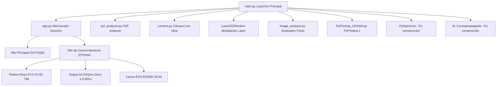

# Manual de Usuario Exhaustivo: PyPrinting 3.0 🔬
**Suite de Control, Espectroscopía Confocal, Caracterización de PSF y Nanofabricación Óptica**
*Laboratorio de Nanofotónica — Instituto de Nanosistemas (INS-UNSAM)*
*Autor Principal: José Luis González Peñafiel (Becario Doctoral CONICET)*

---

## 📖 Índice General

1. [Panel de Inicio Principal (`main.py` — "Bienvenidos al printing")](#1-panel-de-inicio-principal-mainpy--bienvenidos-al-printing)
   - [1.1 Visión General, Filosofía de Diseño y Arquitectura Multihilo](#11-visión-general-filosofía-de-diseño-y-arquitectura-multihilo)
   - [1.2 Selección Global de Modo Seguro (`SAFE_MODE`) vs. Modo Laboratorio Real](#12-selección-global-de-modo-seguro-safe_mode-vs-modo-laboratorio-real)
   - [1.3 Navegación e Índice de Módulos en Grilla Simétrica $3 \times 3$](#13-navegación-e-índice-de-módulos-en-grilla-simétrica-3-times-3)
2. [Fundamentos Físicos, Formulación Matemática & Mapeo de Hardware](#2-fundamentos-físicos-formulación-matemática--mapeo-de-hardware)
   - [2.1 Impresión Óptica Fototérmica de Nanopartículas Coloidales](#21-impresión-óptica-fototérmica-de-nanopartículas-coloidales)
   - [2.2 Ensamblado Guiado de Nanodímeros Plasmónicos y Campo Cercano](#22-ensamblado-guiado-de-nanodímeros-plasmónicos-y-campo-cercano)
   - [2.3 Modelo Analítico Gaussiano 2D Anisotrópico de 7 Parámetros](#23-modelo-analítico-gaussiano-2d-anisotrópico-de-7-parámetros)
   - [2.4 Modelo Analítico Haz Vortex / Donut (Laguerre-Gauss $LG_{01}$)](#24-modelo-analítico-haz-vortex--donut-laguerre-gauss-lg_01)
   - [2.5 Métricas Analíticas y Alineación Sub-nanométrica de PSF](#25-métricas-analíticas-y-alineación-sub-nanométrica-de-psf)
   - [2.6 Operación de Umbralización No Lineal de Ruido ($P\%$)](#26-operación-de-umbralización-no-lineal-de-ruido-p)
   - [2.7 Algoritmo de Estabilización Z Axial por Autocorrelación de Pearson](#27-algoritmo-de-estabilización-z-axial-por-autocorrelación-de-pearson)
   - [2.8 Mapeo Físico de Coordenadas y Calibración de Platina Piezoeléctrica PI](#28-mapeo-físico-de-coordenadas-y-calibración-de-platina-piezoeléctrica-pi)
3. [Módulo 1: Microscopio Derecho (`app.py` — PyPrinting 3.0 Suite Completa)](#3-módulo-1-microscopio-derecho-apppy--pyprinting-30-suite-completa)
   - [3.1 Menú Principal (`Files`, `Tools`, `Measurements`, `Help`)](#31-menú-principal-files-tools-measurements-help)
   - [3.2 Dock: Confocal (Mapeo 2D/3D & Algoritmos de Centrado)](#32-dock-confocal-mapeo-2d3d--algoritmos-de-centrado)
   - [3.3 Dock: Trace (Trazas Temporales & Calibración Power BS)](#33-dock-trace-trazas-temporales--calibración-power-bs)
   - [3.4 Dock: Focus z (Autofoco Axial Dinámico)](#34-dock-focus-z-autofoco-axial-dinámico)
   - [3.5 Dock: Shutters / Flipper / Láser 532](#35-dock-shutters--flipper--láser-532)
   - [3.6 Dock: Nanopositioning (Platina Piezoeléctrica PI)](#36-dock-nanopositioning-platina-piezoeléctrica-pi)
   - [3.7 Ventana de Mediciones (Printing Automatizado de Grillas & Dímeros)](#37-ventana-de-mediciones-printing-automatizado-de-grillas--dímeros)
4. [Módulo 2: PySpectrum *(En Construcción)*](#4-módulo-2-pyspectrum-en-construcción)
5. [Módulo 3: Microscopio Contrapropagante *(En Construcción)*](#5-módulo-3-microscopio-contrapropagante-en-construcción)
6. [Módulo 4: PyPrinting 2 (Legacy — `PyPrinting_UNSAM.py`)](#6-módulo-4-pyprinting-2-legacy--pyprinting_unsampy)
7. [Módulo 5: Cámara Live View (`camera.py`)](#7-módulo-5-cámara-live-view-camerapy)
8. [Módulo 6: Modulación Láser 532 nm (`Laser532Window`)](#8-módulo-6-modulación-láser-532-nm-laser532window)
9. [Módulo 7: PSF Analyzer (`psf_analyzer.py`)](#9-módulo-7-psf-analyzer-psf_analyzerpy)
10. [Módulo 8: Analizador de Imágenes Estáticas (`image_analyzer.py`)](#10-módulo-8-analizador-de-imágenes-estáticas-image_analyzerpy)
11. [Módulo 9: Documentación y Créditos del Autor](#11-módulo-9-documentación-y-créditos-del-autor)
12. [Tabla Completa de Parámetros Globales (`config.py`)](#12-tabla-completa-de-parámetros-globales-configpy)
13. [Flujos de Trabajo Experimentales (Protocolos Paso a Paso)](#13-flujos-de-trabajo-experimentales-protocolos-paso-a-paso)
14. [Tabla de Atajos de Teclado (Shortcuts)](#14-tabla-de-atajos-de-teclado-shortcuts)
15. [Guía de Resolución de Problemas y Diagnóstico (Troubleshooting)](#15-guía-de-resolución-de-problemas-y-diagnóstico-troubleshooting)
16. [Preguntas Frecuentes (FAQ)](#16-preguntas-frecuentes-faq)

---

## 1. Panel de Inicio Principal (`main.py` — "Bienvenidos al printing")

### 1.1 Visión General, Filosofía de Diseño y Arquitectura Multihilo
La suite **PyPrinting 3.0** está construida sobre una arquitectura modular desacoplada basada en **Python 3 / PyQt6** y **`pyqtgraph`**. Para evitar cuelgues de la interfaz gráfica durante operaciones de hardware de alta frecuencia (como el escaneo por rampa a $10\ \text{kHz}$ o la transmisión de video réflex), la aplicación utiliza un patrón **Frontend / Backend** con hilos dedicados (`QThread` y `moveToThread`).



---

### 1.2 Selección Global de Modo Seguro (`SAFE_MODE`) vs. Modo Laboratorio Real
En la barra superior del panel principal **`main.py`** se encuentra el selector interactivo **`Modo Seguro (Simulación)`**:

* **Modo Seguro Activado (`PYPRINTING_SAFE=1`)**:
  - Habilita la Capa de Abstracción de Hardware Mock (`nidaq._MockNITask` y `_MockPIStage`).
  - Genera ruido gaussiano síncrono con pulsos sintéticos de trigger para simular perfiles confocales 2D/3D y trazas temporales.
  - Habilita una cámara sintética basada en patrones fotónicos móviles para probar la interfaz gráfica sin instrumentos físicos.
* **Modo Laboratorio Real (`PYPRINTING_SAFE=0`)**:
  - Inicializa la comunicación por socket C/DLL con la controladora PI E-517/E-736.
  - Conecta la tarjeta **National Instruments PCIe-6323 / USB-6343** (Dispositivo `Dev1`).
  - Abre la sesión nativa **Canon EDSDK v13.x** para la cámara réflex.

---

### 1.3 Navegación e Índice de Módulos en Grilla Simétrica $3 \times 3$
El lanzador organiza los 9 módulos del laboratorio en una grilla simétrica de 3 filas y 3 columnas:

```
┌─────────────────────────┬─────────────────────────┬─────────────────────────┐
│ 🔬 Fila 1 - Columna 1   │ 🔮 Fila 1 - Columna 2   │ 🔍 Fila 1 - Columna 3   │
│ Microscopio Derecho     │ PySpectrum              │ Microscopio             │
│ (app.py)                │ (En construcción)       │ Contrapropagante (Const)│
├─────────────────────────┼─────────────────────────┼─────────────────────────┤
│ 🏛️ Fila 2 - Columna 1   │ 📷 Fila 2 - Columna 2   │ ⚡ Fila 2 - Columna 3   │
│ PyPrinting 2 (Legacy)   │ Cámara Live View        │ Modulación Láser        │
│ (PyPrinting_UNSAM.py)   │ (camera.py)             │ 532 nm (Laser532Window) │
├─────────────────────────┼─────────────────────────┼─────────────────────────┤
│ 🧬 Fila 3 - Columna 1   │ 🖼️ Fila 3 - Columna 2   │ 📚 Fila 3 - Columna 3   │
│ PSF Analyzer            │ Analizador de Imágenes  │ Documentación           │
│ (psf_analyzer.py)       │ (image_analyzer.py)     │ y Créditos del Autor    │
└─────────────────────────┴─────────────────────────┴─────────────────────────┘
```

---

## 2. Fundamentos Físicos, Formulación Matemática & Mapeo de Hardware

### 2.1 Impresión Óptica de Nanopartículas Coloidales
La **impresión óptica** logra la deposición espacial dirigida de nanopartículas coloidales metálicas (Au, Ag) desde una solución líquida sobre sustratos transparentes (vidrio o silicio). La interacción electromagnética está dominada por la fuerza de gradiente óptico $\mathbf{F}_{\text{grad}}$ y la fuerza de dispersión/absorción $\mathbf{F}_{\text{scat}}$:

$$\mathbf{F}_{\text{grad}} = \frac{1}{4} \varepsilon_m \operatorname{Re}(\alpha) \nabla |\mathbf{E}|^2$$

$$\mathbf{F}_{\text{scat}} = \frac{k^4}{6\pi} |\alpha|^2 \frac{n_m}{c} \mathbf{S}$$

donde $\alpha$ es la polarizabilidad polaritónica compleja de Clausius-Mossotti dada por:

$$\alpha = 3 V \frac{\varepsilon_p - \varepsilon_m}{\varepsilon_p + 2\varepsilon_m}$$

Al sintonizar la longitud de onda de excitación con la **Resonancia de Plasmón de Superficie Localizado (LSPR)** del oro ($\approx 532\ \text{nm}$), $\operatorname{Re}(\alpha)$ se maximiza, atrayendo fuertemente la nanopartícula hacia el punto de máxima intensidad en el centro de la cintura del haz focalizado ($\nabla |\mathbf{E}|^2$).

---

### 2.2 Ensamblado Guiado de Nanodímeros Plasmónicos y Campo Cercano
La fabricación de **nanodímeros plasmónicos** consiste en posicionar una segunda nanopartícula a una distancia gap sub-100 nm de una primera partícula previamente depositada. Al aproximarse a distancias nanométricas, el acoplamiento de campo cercano modifica la polarizabilidad efectiva $\alpha_{\text{eff}}$, creando un punto caliente plasmónico (*hot-spot*) que amplifica exponencialmente la intensidad Raman (SERS):

$$\mathbf{E}_{\text{local}} \propto \left( \frac{d}{r} \right)^{-3} \mathbf{E}_0$$

```
[Partícula 1 Deposita] ──> [Escaneo Confocal Local] ──> [Fit Gaussiano (x1, y1)] ──> [Offset Δx, Δy] ──> [Deposición Partícula 2]
```

---

### 2.3 Modelo Analítico Gaussiano 2D Anisotrópico de 7 Parámetros
Para caracterizar la distribución de intensidad fototérmica o de fluorescencia en el plano focal horizontal ($XY$), el sistema ajusta una Gaussiana 2D elíptica inclinada en un ángulo $\theta$ mediante mínimos cuadrados no lineales (`scipy.optimize.curve_fit`):

$$G(x, y) = Z_{\text{offset}} + A \cdot \exp\left( -\left[ a(x - x_0)^2 + 2b(x - x_0)(y - y_0) + c(y - y_0)^2 \right] \right)$$

Los coeficientes de la matriz cuadrática de rotación son:

$$a = \frac{\cos^2\theta}{2\sigma_x^2} + \frac{\sin^2\theta}{2\sigma_y^2}$$

$$b = -\frac{\sin(2\theta)}{4\sigma_x^2} + \frac{\sin(2\theta)}{4\sigma_y^2}$$

$$c = \frac{\sin^2\theta}{2\sigma_x^2} + \frac{\cos^2\theta}{2\sigma_y^2}$$

El Ancho Completo a la Mitad del Máximo (FWHM) a lo largo de los ejes principales de la elipse se calcula mediante:

$$\text{FWHM}_x = 2\sqrt{2\ln 2} \cdot \sigma_x \approx 2.354820 \cdot \sigma_x$$

$$\text{FWHM}_y = 2\sqrt{2\ln 2} \cdot \sigma_y \approx 2.354820 \cdot \sigma_y$$

$$\text{FWHM}_{\text{promedio}} = \frac{\text{FWHM}_x + \text{FWHM}_y}{2}$$

---

### 2.4 Modelo Analítico Haz Vortex / Donut (Laguerre-Gauss $LG_{01}$)
Para caracterizar haces con singularidad de fase espiral ($e^{i l \phi}$) o donas de depleción en nanoscopía STED, el módulo **PSF Analyzer** y el widget **Confocal** ajustan la distribución analítica Laguerre-Gauss de primer orden $LG_{01}$:

$$I_{\text{donut}}(x, y) = Z_{\text{offset}} + A \cdot r_n^2(x, y) \cdot \exp\left( - r_n^2(x, y) \right)$$

donde la distancia radial elíptica normalizada $r_n^2$ está definida por:

$$r_n^2(x, y) = \frac{(x - x_0)^2}{2\sigma_x^2} + \frac{(y - y_0)^2}{2\sigma_y^2}$$

---

### 2.5 Métricas Analíticas y Alineación Sub-nanométrica de PSF
El módulo **PSF Analyzer** computa cuantitativamente la calidad analítica de la PSF y la desalineación espacial entre el canal de excitación verde (Canal 1) y el donut rojo de depleción (Canal 2):

1. **Desalineación Vectorial Dual ($\Delta r_{\text{nm}}$)**:
   $$\Delta r_{\text{nm}} = \sqrt{(x_1 - x_2)^2 + (y_1 - y_2)^2} \times 1000 \quad [\text{nm}]$$
2. **Radio del Anillo Donut ($r_0$)**:
   $$r_0 = \sqrt{\sigma_x \cdot \sigma_y} \quad [\mu\text{m}]$$
3. **Elipticidad del Donut ($a/b$)**:
   $$\text{Elipticidad} = \frac{\sigma_x}{\sigma_y} \quad (\text{o viceversa si } \sigma_y > \sigma_x)$$
4. **Calidad del Cero Central ($I_{\min}/I_{\max}$)**: Intensidad residual en el nulo central dividida por la intensidad de pico del anillo. Un valor $<0.05$ representa un nulo óptico de alta calidad.
5. **Uniformidad Angular ($\sigma_{\theta}/\bar{I}$)**: Desviación estándar de la intensidad tomada circularmente a lo largo del anillo dividida por la intensidad media del anillo.
6. **Bondad de Ajuste Statistic ( $R^2$, $\text{RMS}$ y $\chi^2_{\text{red}}$ )**:
   $$R^2 = 1 - \frac{\sum (Z_i - Z_{\text{fit}, i})^2}{\sum (Z_i - \bar{Z})^2}$$
   $$\text{RMS} = \sqrt{\frac{1}{N} \sum_{i=1}^N (Z_i - Z_{\text{fit}, i})^2}$$
   $$\chi^2_{\text{red}} = \frac{1}{N - p} \sum_{i=1}^N \frac{(Z_i - Z_{\text{fit}, i})^2}{\sigma_{\text{ruido}}^2}$$

---

### 2.6 Operación de Umbralización No Lineal de Ruido ($P\%$)
El casillero **`Filtro (%)`** aplica un operador no lineal por corte de umbral sobre la matriz normalizada $Z_n \in [0.0, 1.0]$:

$$Z_f[x, y] = \begin{cases} Z_n[x, y] & \text{si } Z_n[x, y] \ge \frac{P}{100} \\ 0.0 & \text{si } Z_n[x, y] < \frac{P}{100} \end{cases}$$

> [!NOTE]
> Al ingresar un valor (ej. `30` para $30\%$) y presionar **`Enter`** o hacer clic en **`Aplicar`**, toda intensidad menor al $30\%$ del rango dinámico se fuerza a $0.0$, eliminando el ruido de fondo lejano e impidiendo la distorsión del ajuste gaussiano.

---

### 2.7 Algoritmo de Estabilización Z Axial por Autocorrelación de Pearson
Para corregir la deriva térmica del plano de enfoque axial ($Z$), el sistema adquiere un perfil de intensidad $I(z)$ y calcula el coeficiente de correlación cruzada normalizado de Pearson respecto a la firma congelada de referencia $I_{\text{ref}}(z)$:

$$R(\Delta z) = \frac{\sum_{i=1}^N (I(z_i + \Delta z) - \bar{I}) (I_{\text{ref}}(z_i) - \bar{I}_{\text{ref}})}{\sqrt{\sum_{i=1}^N (I(z_i + \Delta z) - \bar{I})^2 \sum_{i=1}^N (I_{\text{ref}}(z_i) - \bar{I}_{\text{ref}})^2}}$$

El valor $\Delta z_{\text{óptimo}}$ que maximiza $R(\Delta z)$ determina el desplazamiento de la platina PI en Z para re-enfocar la muestra con precisión nanométrica.

---

### 2.8 Mapeo Físico de Coordenadas y Calibración de Platina Piezoeléctrica PI
La transformación lineal entre las coordenadas en píxeles de la matriz de escaneo $(x_p, y_p) \in [0, N_x-1] \times [0, N_y-1]$ y las coordenadas físicas en micrómetros $(X, Y)$ enviadas a la controladora **PI E-517/E-736** es:

$$X_{\text{físico}} = X_{\text{centro}} - \frac{\text{Range}_x}{2} + \frac{dx}{2} + (x_p \cdot dx)$$

$$Y_{\text{físico}} = Y_{\text{centro}} - \frac{\text{Range}_y}{2} + \frac{dy}{2} + (y_p \cdot dy)$$

donde los pasajes de paso espacial por píxel son $dx = \frac{\text{Range}_x}{N_x}$ y $dy = \frac{\text{Range}_y}{N_y}$.

---

### 2.9 Arquitectura del Escaneo en Modo Ramp Adaptativo, Seguridad y Puntos de Onda (`Npoints`)

El **Modo Ramp** realiza un escaneo síncrono continuo por hardware utilizando el generador de funciones de la platina piezoeléctrica **Physik Instrumente (PI)** y la lectura por reloj de la tarjeta **National Instruments (NI-DAQmx)** a $10\ \text{kHz}$.

#### 1. Mecanismo de Seguridad Físico (Rango de Aceleración y Frenado)
Para evitar distorsiones o no-linealidades causadas por la inercia del actuador piezoeléctrico al inicio y final de cada línea, el sistema añade automáticamente un margen extra de aceleración/frenado del $33\%$ fuera del área de adquisición útil:

$$\text{Extra} = \frac{Range_X}{6}, \quad Range_{\text{total}} = Range_X + 2 \cdot \text{Extra} = 1.33333 \cdot Range_X$$

* **Clampeo Dinámico de Seguridad ($[0.0, 100.0]\ \mu\text{m}$)**:
  La posición de origen de la rampa $X_{\text{inicio}} = X_{\text{centro}} - \frac{Range_{\text{total}}}{2}$ está acotada por software:
  $$X_{\text{inicio, seguro}} = \max\left(0.0, \min\left(100.0 - Range_{\text{total}}, X_{\text{inicio}}\right)\right)$$
  Esto garantiza que el piezoeléctrico **nunca intente desplazarse a coordenadas negativas ($<0.0\ \mu\text{m}$) ni superiores a $100.0\ \mu\text{m}$**, protegiendo los actuadores mecánicos y evitando fallos de firmware.

#### 2. ¿Qué son los Puntos de Onda (`Npoints`) y el Tiempo de Servo (`WTRtime`)?
* **Puntos de Onda (`Npoints`)**: Son las muestras discretas generadas en la tabla de memoria RAM de la controladora PI (`pi.WAV_LIN`). La controladora lee estas muestras e interpola una señal analógica continua para el amplificador del piezo.
* **Capacidad Máxima de Hardware**: La memoria de la tabla de ondas en la controladora PI E-517/E-736 tiene un límite estricto de **$4096$ puntos por canal**.
* **Clampeo Adaptativo de Puntos**: Para evitar desbordamientos de buffer en resoluciones grandes ($400 \times 400\ \text{px}$ o superiores), el sistema acota automáticamente:
  $$N_{\text{points}} = \max\left(100, \min\left(4000, \text{int}\left( \frac{Range_{\text{total}}}{\Delta x} \right) \times 20\right)\right)$$
* **Tiempo de Servo (`WTRtime`)**: Es la constante del temporizador del generador de ondas (`pi.WTR(0, WTRtime, 0)`), definiendo el intervalo entre puntos de la tabla:
  $$WTRtime = \max\left(1, \text{int}\left( \frac{1}{f_{\text{ramp}} \cdot T_{\text{servo}} \cdot N_{\text{points}}} \right)\right)$$
  donde $T_{\text{servo}} = 50\ \mu\text{s}$ ($50 \times 10^{-6}\ \text{s}$).

#### 3. Velocidad Lineal de Escaneo ($v_{\text{scan}}$)
La velocidad de desplazamiento continuo del haz sobre la muestra durante la línea de rampa es:

$$v_{\text{scan}} = \frac{Range_{\text{total}}}{\tau / 2} = 2 \cdot Range_{\text{total}} \cdot f_{\text{ramp}} \quad [\mu\text{m/s}]$$

* Para un escaneo típico ($2 \times 2\ \mu\text{m}$, $34 \times 34\ \text{px}$), $v_{\text{scan}} \approx 0.44\ \mu\text{m/s}$.
* Para un escaneo amplio ($20 \times 20\ \mu\text{m}$, $400 \times 400\ \text{px}$), $v_{\text{scan}} \approx 125\ \mu\text{m/s}$.

#### 4. Límites Máximos de Medición Segura

| Modo de Escaneo | Rango Físico Máximo Útil ($Range_{\text{max}}$) | Excursión Total con Frenado | Resolución Máxima Segura | Tiempo Estimado |
|---|---|---|---|---|
| **Modo Ramp (Síncrono por Hardware)** | **$75.0\ \mu\text{m} \times 75.0\ \mu\text{m}$** | $100.0\ \mu\text{m}$ *(Límite PI)* | **$800 \times 800\ \text{px}$** | $\approx 4.2\ \text{minutos}$ |
| **Modo Step by Step (Paso a Paso Discreto)** | **$100.0\ \mu\text{m} \times 100.0\ \mu\text{m}$** | $100.0\ \mu\text{m}$ | **$1000 \times 1000\ \text{px}$** | $\approx 2.2\ \text{horas}$ |

---

### 2.10 Módulo de Microscopía Contrapropagante (`contrapropagante.py`)

El módulo **Microscopio Contrapropagante** está diseñado para experimentos de iluminación síncrona por arriba (objetivo derecho) y por abajo (objetivo invertido):

1. **Disposición Visual Horizontal**:
   - **Izquierda**: `Display Confocal TOP (Derecho)` con mapa de falso color, histograma LUT y marcas de centrado.
   - **Centro**: `Controles Compartidos` (menús desplegables de láseres duales TOP/BOT, parámetros de rango y píxeles, botón `Analyze with PSF Analyzer` y widget de centrado CM Dual con selector de preferencia TOP/BOT).
   - **Derecha**: `Display Confocal BOT (Invertido)` con mapa de falso color e histograma LUT.
2. **Adquisición Dual Síncrona**: Un único movimiento de la platina piezoeléctrica PI dispara las lecturas analógicas de dos fotodiodos independientes (Canal AI0 para TOP y Canal AI1 para BOT), generando dos imágenes confocales alineadas temporalmente.
3. **Caracterización de Centrado Sub-nanométrico y Vector Diferencia**:
   - Mide de forma independiente la posición central $(x_{\text{TOP}}, y_{\text{TOP}})$ y $(x_{\text{BOT}}, y_{\text{BOT}})$.
   - Calcula el vector diferencia $\mathbf{r}_{\text{TOP}} - \mathbf{r}_{\text{BOT}}$ en nanómetros ($\Delta x, \Delta y, \|\mathbf{\Delta r}\|$).
   - Permite conmutar la referencia de posición mediante el deslizador `TOP` / `BOT` y centrar la platina en la partícula de interés mediante `Go to NP`.
4. **Integración con PSF Analyzer**: Al presionar `📊 Analyze with PSF Analyzer`, se transfieren ambas imágenes confocales a la suite de caracterización 2D (`PSFAnalyzerWindow`), cargando TOP como Canal 1 y BOT como Canal 2 para la evaluación de perfiles 1D y superposición RGB.

---

## 3. Módulo 1: Microscopio Derecho (`app.py` — PyPrinting 3.0 Suite Completa)

### 3.1 Menú Principal (`Files`, `Tools`, `Measurements`, `Help`)
* **Menú `Files`**:
  - `Select Base Path (Ctrl+A)`: Selecciona la carpeta raíz de trabajo.
  - `Create Daily Dir (Ctrl+S)`: Crea automáticamente la subcarpeta del día (`YYYY-MM-DD`).
  - `Open Working Directory (Ctrl+D)`: Abre la carpeta actual en el Explorador de Windows.
* **Menú `Tools`**:
  - Acceso directo a la ventana de `Cámara`, `Analizador de Imágenes`, `PSF Analyzer` y `Modulación Láser 532 nm`.
* **Menú `Measurements`**:
  - `Printing`: Abre la ventana de impresión automatizada de grillas.
  - `Dimers`: Abre la ventana de ensamblado guiado de dímeros plasmónicos.

---

### 3.2 Dock: Confocal (Mapeo 2D/3D & Algoritmos de Centrado)
| Control | Tipo | Rango / Opciones | Descripción |
|---|---|---|---|
| **`Laser`** | `QComboBox` | `532 nm`, `637 nm`, `592 nm` | Línea de excitación láser para la iluminación confocal. |
| **`Range x / y`** | `QDoubleSpinBox` | $0.100 - 100.000\ \mu\text{m}$ | Dimensión física del área cuadrada/rectangular a escanear. |
| **`Pixels x / y`** | `QSpinBox` | $10 - 500$ | Resolución en píxeles de la matriz de adquisición confocal. |
| **`Scan mode`** | `QComboBox` | `Ramp`, `Step by step` | `Ramp`: Lectura síncrona continua a $10\ \text{kHz}$ por hardware NI-DAQ. `Step`: Paso a paso por software. |
| **`Scan projection`**| `QComboBox` | `x/y`, `x/z`, `y/z` | Plano ortogonal de escaneo confocal. |
| **`Scan Image`** | `QComboBox` | `NPs maximum`, `NPs minimum` | `NPs maximum`: Partículas brillantes (fluorescencia/scattering). `NPs minimum`: Partículas oscuras (absorción). |
| **`method_center`** | `QComboBox` | `center of mass`, `center of gauss`, `two NP: center of gauss`, `donut (Laguerre-Gauss)` | Algoritmo de centrado analítico para calcular la posición de la partícula. |
| **`Auto CM`** | `QCheckBox` | `True` / `False` | Si está marcado, desplaza automáticamente la platina PI al centro calculado tras finalizar el escaneo. |
| **`Filtro (%)`** | `QLineEdit` | $0.0 - 99.0\%$ | Porcentaje de umbral de filtrado de ruido para la eliminación de fondo. |
| **`Start Scan`** | `QPushButton` | Exec | Inicia la rutina de escaneo confocal síncrono. |

---

### 3.3 Dock: Trace (Trazas Temporales & Calibración Power BS)
* **Monitoreo de Fotoluminiscencia**:
  - Graficado temporal continuo de intensidad en Volts ($V$) emitidos por los fotodiodos.
  - Tecla **F1**: Inicia la adquisición continua (*Play*).
  - Tecla **F2**: Detiene la adquisición y guarda la traza en disco (*Stop & Save*).
* **Ventana `PowerBSWindow`**:
  - Monitoreo continuo de la potencia reflejada en el fotodiodo divisor (*Beam Splitter*).
  - Permite ingresar lecturas de potencia comercial (`High power`, `Low power`) y ejecutar **`Set Calibration`** para obtener la constante de conversión en $\text{mW/V}$.

---

### 3.4 Dock: Focus z (Autofoco Axial Dinámico)
| Control | Tecla | Función |
|---|---|---|
| **`Go to maximum`** | **F8** | Ejecuta un barrido axial rápido en Z y desplaza el piezo al pico de máxima intensidad. |
| **`Lock Focus`** | **F9** | Registra y congela el perfil $I_{\text{ref}}(z)$ como referencia de enfoque. |
| **`Autocorrelation ×2`**| **F10** | Ejecuta la correlación de Pearson y corrige la deriva axial en Z. |

---

### 3.5 Dock: Shutters / Flipper / Láser 532
* **`Shutter 532 nm`**: Abre/Cierra el obturador del láser verde.
* **`Shutter 637 nm`**: Abre/Cierra el obturador del láser rojo.
* **`Shutter 592 nm`**: Abre/Cierra el obturador del láser amarillo.
* **`Low power`**: Activa el atenuador óptico de baja potencia.
* **`Mirror up / down`**: Sube o baja el espejo del filtro Notch de 532 nm (*Flipper*).
* **`Láser 532 Voltage`**: Ajusta el voltaje analógico DAC ($1.0 - 5.0\ \text{V}$).

---

### 3.6 Dock: Nanopositioning (Platina Piezoeléctrica PI)
* Muestra la lectura continua en micrómetros ($X, Y, Z$) de los sensores capacitivos en bucle cerrado de la platina PI E-517/E-736.
* Botones de incremento relativo ($\pm 0.1\ \mu\text{m}$, $\pm 1.0\ \mu\text{m}$, $\pm 10.0\ \mu\text{m}$).

---

### 3.7 Ventana de Mediciones (Printing Automatizado de Grillas & Dímeros)
* **Pestaña `Printing` (Impresión de Grillas)**:
  - **`Create Grid`**: Define número de filas, columnas y espaciamiento en $\mu\text{m}$.
  - **`Set reference`**: Guarda las coordenadas origen $(X_0, Y_0, Z_0)$.
  - **`Umbral`**: Factor multiplicativo de salto de intensidad ($I_{\text{new}} > \text{Umbral} \cdot I_{\text{old}}$) para detectar la deposición fototérmica.
  - **`T max (s)`**: Tiempo límite de exposición por nodo antes de abortar.
  - **`Steps before / after`**: Número de puntos promediados para la línea base y la detección del salto.
  - **`Play ►`**: Inicia la secuencia automatizada de deposición nodo a nodo.
* **Pestaña `Dimers` (Ensamblado de Dímeros)**:
  - Permite ingresar `dx (µm)` y `dy (µm)` para controlar la separación nanometrada entre la partícula 1 y la partícula 2.

---

## 4. Módulo 2: PySpectrum *(En Construcción)*

El panel **`🔮 PySpectrum`** (Fila 1, Columna 2 del lanzador `main.py`) está reservado para la suite de espectrometría avanzada:

> [!WARNING]
> **ESTADO DEL MÓDULO: EN CONSTRUCCIÓN**
> 
> **Especificaciones de Diseño**:
> 1. **Control de Espectrómetros CCD/EMCCD**: Integración nativa para la adquisición de espectros de emisión, fluorescencia y dispersión Raman (extensión avanzada del software comercial *Andor Solis*).
> 2. **Nano-termometría Fotónica**: Rutinas automatizadas de medición de temperatura local basadas en la razón de intensidad de bandas de fluorescencia/luminiscencia (*Ratiometric Thermometry*).
> 3. **Espectroscopía de Scattering de Partícula Única**: Medición de espectros de dispersión de nanopartículas coloidales individuales mediante iluminación en campo oscuro.
> 4. **Mapeo Espectral Síncrono**: Escaneo coordinado entre platinas piezoeléctricas y adquisición continua de espectros (*Hyperspectral Imaging*).

---

## 5. Módulo 3: Microscopio Contrapropagante *(En Construcción)*

El panel **`🔍 Microscopio Contrapropagante`** (Fila 1, Columna 3 del lanzador `main.py`) está reservado para la plataforma de iluminación dual:

> [!WARNING]
> **ESTADO DEL MÓDULO: EN CONSTRUCCIÓN**
> 
> **Especificaciones de Diseño**:
> 1. **Microscopía Dual Simultánea**: Arquitectura adaptada para la observación e iluminación síncrona a través del objetivo superior (seco/inmersión) y el objetivo invertido de alta apertura numérica.
> 2. **Pinzas Ópticas y Trampas Fotónicas Contrapropagantes**: Excitación coordinada por haces láser contrapropagantes para la manipulación y atrapamiento óptico 3D en solución.
> 3. **Alineación Interferométrica**: Control fino de fase entre haces contrapropagantes.

---

## 6. Módulo 4: PyPrinting 2 (Legacy — `PyPrinting_UNSAM.py`)

El botón **`🏛️ Iniciar PyPrinting 2`** (Fila 2, Columna 1 del lanzador `main.py`) ejecuta la versión histórica del sistema situada en `../printing2/PyPrinting_UNSAM.py`:

* **Propósito**: Permite a los investigadores ejecutar secuencias de impresión antiguas, verificar compatibilidad de archivos de datos `.txt` legacy y comparar el desempeño de algoritmos de centrado preexistentes.

---

## 7. Módulo 5: Cámara Live View (`camera.py`)

El botón **`📷 Iniciar Cámara Live View`** (Fila 2, Columna 2 del lanzador `main.py`) abre la interfaz independiente de visión por computadora:

* **Soporte de Hardware**:
  - **Cámara Réflex Canon EOS 500D (EDSDK 64-bit)**: Transmisión Live View en tiempo real a 25 FPS ($1056 \times 704$).
  - **Cámaras USB OpenCV**: Control estándar UVC como alternativa de laboratorio.
* **Procesamiento de Video en Tiempo Real**:
  - **Modo Color RGB**: Deslizadores de balance de blancos para modificar la ganancia cromática de los canales R, G y B.
  - **Modo Grises (Transmisión)**: Ajuste fino de rango dinámico mediante deslizadores **CLim Mín / Máx**.
  - **Paletas LUT de Falso Color**: Aplica tablas de mapeo cromático en tiempo real (*Gris Estándar*, *Thermal*, *Viridis*, *Plasma*, *Inferno*, *Jet*).
  - **Controles Réflex**: Selección de velocidad de `Obturación (Tv)` y sensibilidad `ISO` (Auto, 100-3200).
* **Captura de Fotos de Alta Resolución**:
  - El botón **`Capturar Foto`** dispara la captura réflex a 15 Megapíxeles, descarga el archivo RAW/JPG a la PC y reanuda el flujo Live View sin congelar la pantalla.

---

## 8. Módulo 6: Modulación Láser 532 nm (`Laser532Window`)

El botón **`⚡ Iniciar Control Láser 532`** (Fila 2, Columna 3 del lanzador `main.py`) despliega la ventana flotante de modulación analógica:

* **Control de Potencia por Voltaje DAC**:
  - Deslizador horizontal y `QDoubleSpinBox` con precisión de 3 decimales para enviar voltaje analógico ($1.000\ \text{V} - 5.000\ \text{V}$) a la línea `Dev1/ao2` de la tarjeta NI-DAQmx.
  - Botones de acceso rápido preset: `1.0V`, `2.0V`, `3.0V`, `4.0V` y `5.0V`.
* **Accionamiento Directo del Shutter Verde (532 nm)**:
  - Botón de conmutación de estado:
    - **`► Abrir Shutter 532 nm (Cerrado)`** (Fondo verde `#2e7d32`): Ejecuta `open_shutter("532 nm (green)")`.
    - **`■ Cerrar Shutter 532 nm (Abierto)`** (Fondo rojo `#c62828`): Ejecuta `close_shutter("532 nm (green)")`.

---

## 9. Módulo 7: PSF Analyzer (`psf_analyzer.py`)

El botón **`📊 Iniciar PSF Analyzer`** (Fila 3, Columna 1 del lanzador `main.py`) abre la herramienta de análisis analítico 2D de la Función de Punto de Dispersión (PSF):

```
┌────────────────────────────────────────────────────────────────────────────────────────┐
│ Canal 1 (Excitación Verde)  │  Original / Filtrada   │  Modelo Fit 2D  │  Residuales   │
├─────────────────────────────┼────────────────────────┼─────────────────┼───────────────┤
│ Canal 2 (Donut STED Rojo)   │  Original / Filtrada   │  Modelo Fit 2D  │  Residuales   │
└─────────────────────────────┴────────────────────────┴─────────────────┴───────────────┘
```

* **Visualización Tri-Panel por Canal con Barras Z Dinámicas**:
  - Despliega por cada canal (Canal 1 excitación verde arriba, Canal 2 donut rojo abajo) tres visores gráficos con barras de escala de intensidad Z dinámicas (`ColorBarItem`): **Imagen Original/Filtrada** (con retículo pasante por $x_0, y_0$ y elipse de ajuste), **Modelo Ajustado (Fit 2D)** y **Mapa de Residuales ($|Z_n - Z_{\text{fit}}|$)**.
* **Actualización Dinámica del Filtro de Ruido (`Filtro (%)`)**:
  - Al modificar el casillero `Filtro (%)` y presionar **`Enter`** o hacer clic en **`Aplicar`**, el sistema recalcula en tiempo real la matriz filtrada $Z_f$, el ajuste gaussiano/donut 2D, el mapa de residuales y los perfiles 1D.
* **Perfiles 1D Interactivas y Falso Color RGB**:
  - Permite seleccionar la fuente de perfiles (`Confocal 1`, `Confocal 2`, `Ambas superpuestas`) y la orientación del corte pasante por el centro $(x_0, y_0)$: `Horizontal`, `Vertical`, `Diagonal 45°` o `Diagonal 135°`.
  - Permite seleccionar la fuente para la imagen compuesta RGB: `Imágenes Originales`, `Originales con Filtro` o `Modelos Ajustados (Fits)`.
* **Informe Completo de Métricas Sub-nanométricas**:
  - Tabla de resultados con $x_0, y_0$, radio $r_0$, elipticidad $a/b$, ángulo de orientación $\theta$, calidad del cero $I_{\min}/I_{\max}$, uniformidad angular $\sigma_{\theta}/\bar{I}$, FWHM promedio, Error RMS, $\chi^2_{\text{red}}$, $R^2$ y desalineación dual $\Delta r_{\text{nm}}$.

---

## 10. Módulo 8: Analizador de Imágenes Estáticas (`image_analyzer.py`)

El botón **`📐 Iniciar Analizador de Imágenes`** (Fila 3, Columna 2 del lanzador `main.py`) abre la herramienta de inspección gráfica sobre archivos en disco:

* **Formatos Soportados**: `.png`, `.jpg`, `.bmp`, `.tif`, `.tiff` (8, 16 y 32 bits por píxel).
* **Calibración de Escala Gráfica**: Diálogo interactivo para trazar un segmento sobre una barra de escala conocida e ingresar la longitud en micrómetros ($\mu\text{m}$), calculando la relación $\mu\text{m/px}$.
* **Reglas Tri-estado Overlaid**: Conmuta cíclicamente entre ocultar reglas, desplegar un primer par de ejes graduados en micrómetros sobre la imagen o desplegar un segundo par de ejes graduados.
* **Detección y Tracking de Partículas (`trackpy`)**: Algoritmo `trackpy.locate` para encontrar centroides de nanopartículas especificando el diámetro esperado y la masa mínima dentro de una Región de Interés (ROI).

---

## 11. Módulo 9: Documentación y Créditos del Autor

El panel **`📚 Documentación y Créditos`** (Fila 3, Columna 3 del lanzador `main.py`) agrupa la información institucional y accesos directos:

* **Botón `📘 Manual`**: Abre este manual de usuario ([MANUAL_USUARIO.md](file:///c:/Users/josel/Documents/Obsidian_Vault/printing3/MANUAL_USUARIO.md)).
* **Botón `📖 README`**: Abre el archivo de documentación técnica general ([README.md](file:///c:/Users/josel/Documents/Obsidian_Vault/printing3/README.md)).
* **Botón `🎓 Créditos`**: Despliega la ventana modal de créditos e filiación institucional:

```
─────────────────────────────────────────────────────────────
🔬 PyPrinting 3.0 — UNSAM Nanofotónica
Autor Principal: José Luis González Peñafiel
Cargo: Becario Doctoral CONICET
Institución: Instituto de Nanosistemas (INS-UNSAM)
Ubicación: San Martín, Buenos Aires, Argentina
Contacto: jose.lito.g.1999@gmail.com
GitHub: https://github.com/joselitog1999/pyprinting_3.0
─────────────────────────────────────────────────────────────
```

---

## 12. Tabla Completa de Parámetros Globales (`config.py`)

| Parámetro / Constante | Valor por Defecto | Descripción Técnica y Función en el Sistema |
|---|---|---|
| `SAFE_MODE` | `False` (o env `PYPRINTING_SAFE=1`) | Habilita la simulación completa de platina PI, NI-DAQmx y cámara. |
| `NIDAQ_DEVICE` | `"Dev1"` | Identificador del dispositivo National Instruments DAQmx. |
| `SHUTTERS` | `["532 nm (green)", "637 nm (red)", "592 nm (yellow)"]` | Nombres de las líneas de obturadores digitales. |
| `SHUTTER_CHANNELS` | `{"532 nm (green)": "line12", ...}` | Canales digitales DO en la tarjeta NI-DAQmx. |
| `SHUTTER_POLARITY` | `{"532 nm (green)": True, ...}` | Lógica de polaridad digital (True = TTL Alto abre shutter). |
| `FLIPPER_532_CHAN` | `"line4"` | Canal digital DO para la conmutación del espejo Notch 532 nm. |
| `FLIPPER_AO_UP/DOWN` | `5.0` / `0.0` | Voltaje analógico AO enviado para subir o bajar el espejo. |
| `LASER_532_V_MIN/MAX`| `1.0` / `5.0` | Rango de voltaje DAC de modulación analógica de potencia en `Dev1/ao2`. |
| `PD_CHANNELS` | `{"532 nm": 0, "637 nm": 1, "BS": 2, "592 nm": 3}` | Mapeo de entradas analógicas AI para fotodiodos. |
| `PD_CHANS_LIST` | `[0, 1, 2, 3]` | Lista ordenada de canales AI leídos en el buffer de adquisición. |
| `TRIGGER_CHANNELS` | `{"x": 4, "y": 5, "z": 6}` | Canales analógicos AI conectados a las salidas de posición del piezo PI. |
| `RATE_MULTICHANNEL` | `10000.0` Hz ($10\ \text{kHz}$) | Tasa de muestreo finita por canal en adquisición por rampa. |
| `CAMERA_INDEX` | `0` | Índice del dispositivo de video para fallback OpenCV USB. |
| `CAMERA_WIDTH/HEIGHT`| `1056` / `704` | Resolución de transmisión Live View de la cámara réflex Canon EOS. |
| `PIXEL_SIZE_UM` | `0.054` $\mu\text{m/px}$ | Factor de conversión de escala espacial cámara/muestra. |
| `PI_STAGE_RANGE_UM` | `100.0` $\mu\text{m}$ | Rango de desplazamiento físico máximo de la platina piezoeléctrica PI. |
| `DEFAULT_DATA_PATH` | `"C:\\Data"` | Directorio raíz por defecto para la exportación automática de mediciones. |

---

## 13. Flujos de Trabajo Experimentales (Protocolos Paso a Paso)

### 13.1 Protocolo A: Mapeo Confocal 2D/3D y Centrado de Nanopartícula Única
1. Inicie el **Microscopio Derecho** desde `main.py`.
2. En el menú `Files`, verifique o cree la carpeta del día (`Ctrl+S`).
3. En el Dock **Confocal**, configure:
   - `Laser`: `532 nm`
   - `Range x / Range y`: `10.0` $\mu\text{m}$
   - `Pixels x / Pixels y`: `50 x 50`
   - `Scan mode`: `Ramp`
   - `method_center`: `center of gauss`
   - `Auto CM`: Marcado (`Checked`)
4. Haga clic en **`Start Scan`**. El sistema ejecutará el barrido por hardware a $10\ \text{kHz}$, cerrará el obturador al finalizar, ajustará la Gaussiana 2D no lineal de 7 parámetros y desplazará la platina piezoeléctrica al centro $(x_0, y_0)$ exacto de la nanopartícula.

---

### 13.2 Protocolo B: Impresión Automatizada de Grillas Fototérmicas
1. Mueva la platina piezoeléctrica a una zona limpia del sustrato.
2. Abra `Measurements` $\rightarrow$ `Printing`.
3. En el panel *Reference pos*, presione **`Set reference`** para congelar el origen.
4. En el panel *Grid*, especifique `NPs/col: 5`, `Columns: 5`, `Dist NP: 5.0 µm` y presione **`Create Grid`**.
5. En *Printing control*, configure `Umbral: 1.2` (salto de intensidad del $20\%$), `T max: 20 s`, `Steps before: 10` y `Steps after: 10`.
6. Presione **`Imprimir folder`** para seleccionar la carpeta destino y luego **`Play ►`**. El sistema recorrerá automáticamente cada nodo, ejecutará el ciclo de autofoco Z, abrirá el obturador y lo cerrará inmediatamente al detectar la deposición de la nanopartícula.

---

### 13.3 Protocolo C: Caracterización Fina de PSF en `psf_analyzer.py`
1. Abra **PSF Analyzer** desde el lanzador `main.py` o desde `Tools` $\rightarrow$ `PSF Analyzer`.
2. Haga clic en **`Cargar Confocal (.tiff)`** en el Canal 1 y seleccione la imagen de excitación verde.
3. Cargue la imagen del donut rojo en el Canal 2.
4. Seleccione el modelo `Gaussiana 2D` para el Canal 1 y `Donut (Laguerre-Gauss)` para el Canal 2.
5. Ingrese `30` en `Filtro (%)` y presione **`Enter`**.
6. Inspeccione en la pestaña **`Métricas de Ajuste`** el valor de la desalineación espacial dual $\Delta r_{\text{nm}}$, el elipticidad $a/b$, la calidad del cero $I_{\min}/I_{\max}$ y el coeficiente $R^2$.

---

## 14. Tabla de Atajos de Teclado (Shortcuts)

| Tecla de Acceso Directo | Acción Asociada | Ámbito / Módulo |
|---|---|---|
| **`Ctrl + A`** | Seleccionar la carpeta raíz de trabajo | Menú principal (`Files`) |
| **`Ctrl + S`** | Crear subcarpeta diaria automática (`YYYY-MM-DD`) | Menú principal (`Files`) |
| **`Ctrl + D`** | Abrir la carpeta de trabajo actual en el Explorador | Menú principal (`Files`) |
| **`Shift + Click`** | Activar Snap magnético en herramientas de medición | Cámara / Analizador de Imágenes |
| **`F1`** | Iniciar adquisición continua de Trazas dobles (*Play*) | Dock: Trace |
| **`F2`** | Detener adquisición de Trazas y guardar datos (*Stop*) | Dock: Trace |
| **`F8`** | Ejecutar Autofoco Z al pico de intensidad (*Go to max*) | Dock: Focus z |
| **`F9`** | Congelar perfil Z actual como firma de referencia (*Lock*) | Dock: Focus z |
| **`F10`** | Ejecutar corrección de deriva Z por autocorrelación ($\times 2$) | Dock: Focus z |

---

## 15. Guía de Resolución de Problemas y Diagnóstico (Troubleshooting)

> [!CAUTION]
> Ante cualquier anomalía de hardware, asegúrese primero de verificar el indicador **`Modo Seguro (Simulación)`** en la esquina superior derecha del panel principal `main.py`.

### 15.1 La platina PI no responde o arroja error de comunicación
* **Causa**: La controladora PI E-517/E-736 no está encendida o los controladores USB/GPIB están ocupados.
* **Solución**: Verifique los cables físicamente, encienda la controladora y asegúrese de que no haya otra sesión de software abierta (como PyPrinting 2 o PI Terminal). Active el **Modo Seguro** en `main.py` para continuar trabajando en simulación.

### 15.2 La cámara réflex Canon no inicia Live View
* **Causa**: La cámara se apaga automáticamente por ahorro de energía o la sesión USB EDSDK se cerró incorrectamente.
* **Solución**: Apague y encienda la cámara Canon EOS 500D, verifique que el dial esté en modo **M (Manual)** y vuelva a presionar **`Iniciar Cámara`**.

### 15.3 El ajuste Gaussiano o Donut en PSF Analyzer devuelve valores irreales
* **Causa**: Ruido de fondo lejano distorsionando la optimización por mínimos cuadrados.
* **Solución**: Incremente el porcentaje en el casillero **`Filtro (%)`** (ej. de $10\%$ a $30\%$) y presione **`Enter`** para eliminar el fondo aleatorio.

---

## 16. Preguntas Frecuentes (FAQ)

### 16.1 ¿Cómo se determina la posición sub-píxel de una nanopartícula durante el escaneo confocal?
El sistema normaliza la matriz de intensidad entre $0.0$ y $1.0$, aplica el filtrado umbral no lineal al $30\%$ ($Z_f = 0$ si $Z_n < 0.30$) e integra un ajuste no lineal por mínimos cuadrados (`scipy.optimize.curve_fit`) sobre la función Gaussiana 2D anisotropica de 7 parámetros. Las coordenadas $(x_0, y_0)$ resultantes poseen precisión sub-nanométrica.

### 16.2 ¿Cómo funciona el botón de Shutter 532 nm en la ventana de Modulación Láser?
En la ventana flotante **`Laser532Window`** (accesible desde la Fila 2, Columna 3 del lanzador), el botón conmuta dinámicamente:
- **`► Abrir Shutter 532 nm (Cerrado)`** (Verde): Invoca `open_shutter("532 nm (green)")` enviando un nivel TTL alto a la tarjeta NI-DAQ.
- **`■ Cerrar Shutter 532 nm (Abierto)`** (Rojo): Invoca `close_shutter("532 nm (green)")` enviando un nivel TTL bajo.

---

*Manual de Usuario Exhaustivo de PyPrinting 3.0 — Laboratorio de Nanofotónica, Instituto de Nanosistemas (INS-UNSAM).*
