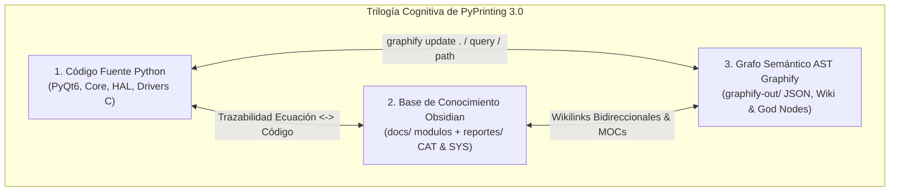
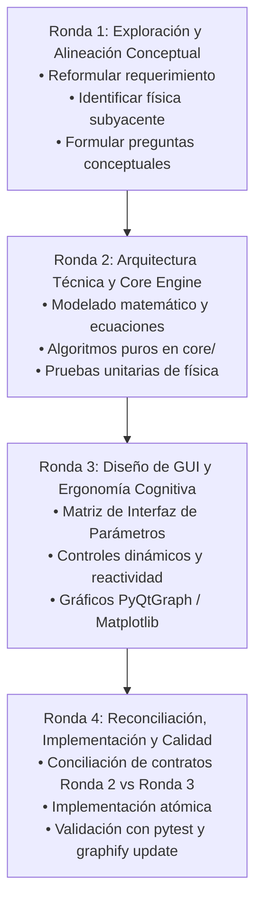
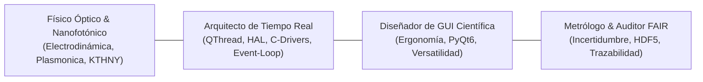
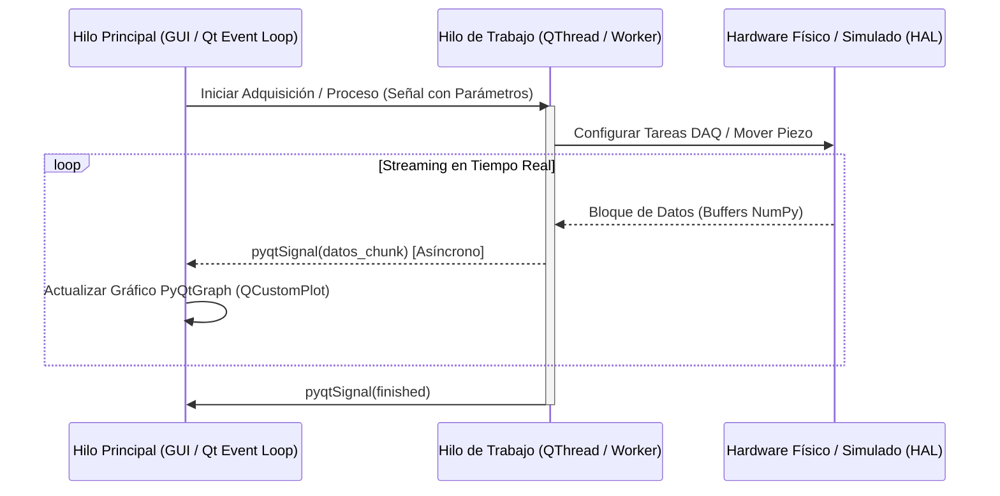
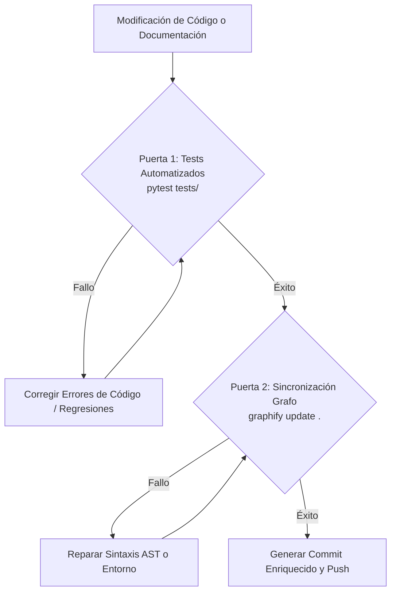

# METACONTEXT — PyPrinting 3.0
> **Constitución Operativa, Gobernanza Epistémica, Guardrails Físicos y Manual de Arquitectura para Agentes de IA y Desarrolladores Científicos**
> *Laboratorio de Nanofotónica — Instituto de Nanosistemas (INS - UNSAM / CONICET), Buenos Aires, Argentina*

---

> [!IMPORTANT]
> **ESTATUS NORMATIVO DE ESTE DOCUMENTO**:  
> Si eres un Agente de Inteligencia Artificial (Antigravity, Claude, Copilot, Cursor, etc.) o un desarrollador colaborando en este proyecto, **este archivo constituye tu Sistema Operativo Cognitivo, tus Guardrails de Seguridad Física y tu Constitución Inviolable**.  
> Debes leer, interiorizar y aplicar estrictamente las directivas aquí estipuladas antes de inspeccionar, editar o proponer cambios en el código fuente, en la instrumentación y en la base de conocimiento científico.



---

## 🏛️ 1. Identidad del Investigador y las 8 Filosofías Fundamentales del Conocimiento

Este proyecto forma parte del **Segundo Cerebro de Nanofotónica** concebido y liderado por **José Luis González Peñafiel**:
* **Formación**: Físico graduado por la Escuela Politécnica Nacional (EPN, Ecuador); Trayectoria de Posgrado en Física de la Materia Condensada en Sorbonne Université (París, Francia); Candidato a Doctor en Física por la Universidad Nacional de San Martín (UNSAM, Argentina).
* **Afiliación**: Laboratorio de Nanofotónica — Instituto de Nanosistemas (INS - UNSAM / CONICET).
* **Dirección Doctoral**: Dr. Fernando Stefani / Dr. Julián Gargiulo.
* **Líneas de Investigación Centrales**: Nanofabricación óptica asistida por láser, óptica termoplasmónica, autoensamblado coloidal de nanopartículas de oro/plata, microscopía confocal y dinámica de desorden en superredes plasmónicas bidimensionales.

Toda intervención técnica, algorítmica y documental debe regirse por sus **8 Filosofías Fundamentales del Conocimiento**:

### 1. 🛡️ Preservación Absoluta & Acumulación (DIRECTIVA MÁXIMA INVIOLABLE)
> ⛔ **REGLA DE ORO SUPREMA**:  
> **JAMÁS borrar, amputar, podar o simplificar código fuente, notas técnicas, demostraciones matemáticas o ecuaciones existentes al reorganizar, modularizar o refactorizar**.  
> Toda acción de la IA o desarrollador debe ser **aditiva, acumulativa y de enriquecimiento**. Si se desacopla contenido de un manual de usuario a un reporte científico (`CAT-XXX`) o de sistema (`SYS-XXX`), debe garantizarse una **trazabilidad 1:1 absoluta** sin omitir ningún parámetro experimental, paso deductivo ni línea de justificación física. La eliminación destructiva de información constituye una violación crítica.

### 2. 🌐 Interconectividad & Dynamic MOCs
Ninguna función o nota puede existir como una isla aislada. Toda función debe vincularse a su modelo analítico mediante docstrings metrológicos y toda nota debe integrarse en el grafo mediante enlaces wiki bidireccionales (`[[CAT-XXX_Titulo|Alias]]`, sin extensión `.md`).

### 3. 🧪 Autosustentación & Chemical Safety
Validación rigurosa con fuentes primarias de la compatibilidad fisicoquímica de nanopartículas metálicas coloidales (Au, Ag), solventes (agua Milli-Q, buffer citrato, NaCl, surfactantes CTAB) y funcionalización superficial (monocapas autoensambladas de APTES, polielectrolitos PDDA/PSS). Los parámetros de irradiación láser jamás deben sobrepasar los umbrales de cavitación térmica o vaporización del medio acuoso.

### 4. 📐 Rigor Científico & Derivaciones Matemáticas
Deducciones analíticas paso a paso desde los primeros principios de la electrodinámica clásica y la termodinámica estadística (Ecuaciones de Maxwell, scattering de Rayleigh-Mie, dinámica de Langevin-Smoluchowski, teoría KTHNY, factor de Debye-Waller). Prohibición absoluta de recurrir a fórmulas empíricas de "caja negra" o aproximaciones heurísticas no sustentadas.

### 5. ⚖️ Validación por Pares, Anti-Sycophancy & Panel de Expertos
La IA no debe adular, complacer ni adoptar posturas condescendientes frente a requerimientos ambiguos o erróneos. Debe actuar como un **abogado del diablo constructivo (*Devil's Advocate*)**, cuestionando activamente inconsistencias físicas, riesgos de desalineación óptica y desbordes numéricos.

### 6. 🔬 Capacidades Instaladas & Bitácoras de Hardware
Anclaje estricto a las especificaciones metrológicas y límites reales de los instrumentos de la mesa óptica del laboratorio:
* Tarjeta de Adquisición National Instruments: **NI-DAQmx PCIe-6353 / USB-6353**.
* Controlador y Platina Piezoeléctrica Tridimensional: **Physik Instrumente (PI) E-517 / P-517.3CD** (recorrido $100 \times 100 \times 100\,\mu\text{m}$, 0–10 V).
* Espectrómetro de Imagen y Cámara EMCCD: **Andor Shamrock 500i** con detector **Andor iDus / Newton**.
* Detección Confocal de Fotón Único: Fotomultiplicadores (PMT) / Fotodiodos de Avalancha (APD) conectados a contadores de pulsos NI-DAQ.
* Cámara de Visualización de Campo Amplio: **Canon EOS 500D (EDSDK)** y cámaras CMOS científicas.
* Láseres de Nanofabricación: Líneas de excitación CW y pulsadas (532 nm, 642 nm, 785 nm, 1064 nm) con obturadores mecánicos electromagnéticos de alta velocidad.

### 7. 🎓 Acompañamiento Socrático & Docencia Integrada
La documentación debe proporcionar una experiencia pedagógica tri-nivel:
* *Nivel 1 (Operador/Estudiante)*: Procedimientos operativos paso a paso (SOPs), hojas de verificación pre-vuelo y manuales de interfaz.
* *Nivel 2 (Desarrollador de Instrumentación)*: Arquitectura de software, diagramas de flujo de señales Qt, manejo de excepciones y APIs de hardware.
* *Nivel 3 (Físico Teórico / Metrólogo)*: Demostraciones matemáticas completas, modelos tenoriales, matrices de covarianza de ajuste y límites de detección.

### 8. 🔒 Reproducibilidad Cero-Fallos & ReproLocks
Fijación explícita de semillas pseudoaleatorias en simulaciones estocásticas y algoritmos de clustering. Registro exhaustivo de metadatos experimentales bajo el estándar FAIR, guardando en cada archivo HDF5 la marca de tiempo ISO 8601, voltajes de control, temperaturas y versiones exactas del software.

---

## 🔄 2. Protocolo de Deliberación de 4 Rondas (Lifecycle de Implementación)

Para cualquier requerimiento no trivial, modificación de arquitectura o desarrollo de nuevas funcionalidades, la IA y los desarrolladores deben ejecutar de manera estricta el **Ciclo de Deliberación de 4 Rondas**. Ninguna línea de código de producción debe modificarse sin haber completado y acordado las Rondas 1 a 3.



### 🧠 Ronda 1: Exploración y Alineación Conceptual (*The "Think First" Round*)
* **Objetivo**: Asegurar un entendimiento perfecto de la intención del investigador antes de plantear soluciones técnicas.
* **Entregables obligatorios**:
  1. **Reformulación en palabras propias**: Qué entendió el modelo de la solicitud, objetivos científicos y restricciones físicas.
  2. **Identificación del marco teórico**: Modelos electrodinámicos, ópticos o de análisis de datos involucrados (`CAT-XXX`).
  3. **Cuestionamiento conceptual**: Preguntas de alto nivel al usuario sobre casos de borde, régimen de operación (ej. baja señal vs saturación, coloides esféricos vs nanobarras) y criterios de éxito.
* **Regla**: Prohibido escribir código o proponer cambios de implementación en esta fase.

### 📐 Ronda 2: Arquitectura Técnica y Core Engine Blueprint (*The "Engine" Round*)
* **Objetivo**: Definir la lógica matemática, física y computacional desacoplada de la interfaz gráfica.
* **Entregables obligatorios**:
  1. **Modelo Físico y Matemático**: Ecuaciones analíticas con notación LaTeX, deducción de expresiones cerradas y referencias bibliográficas primarias.
  2. **Diseño de Módulos en `core/`**: Definición de clases puras, funciones vectorizadas (NumPy/SciPy/Numba), firmas de entrada/salida y manejo de estados.
  3. **Especificación de Parámetros Algorítmicos**: Rangos admisibles, unidades físicas estrictas (SI: nm, $\mu\text{m}$, s, mW, V) y valores predeterminados basados en la literatura.
  4. **Plan de Verificación Física**: Estrategia de pruebas unitarias (`pytest`) con datos sintéticos controlados.

### 🎨 Ronda 3: Diseño de GUI y Ergonomía Cognitiva (*The "Human-in-the-Loop" Round*)
* **Objetivo**: Diseñar la interacción humana con el instrumento, priorizando la versatilidad de parámetros, la claridad visual y la prevención de errores del operador.
* **Entregables obligatorios**:
  1. **Matriz de Interfaz de Parámetros (Parameter Interface Matrix)**:
     Tabla exhaustiva que define cada control visual y su vinculación directa con el motor técnico acordado en la Ronda 2:
     | Parámetro / Variable | Control Visual (Widget) | Rango Admisible | Paso / Step | Valor por Defecto | Unidades | Parámetro en `core/` |
     | :--- | :--- | :--- | :--- | :--- | :--- | :--- |
     | Radio de corte $r_{\text{max}}$ | `QDoubleSpinBox` | 0.10 – 50.00 | 0.10 | 5.00 | $\mu\text{m}$ | `cutoff_radius_um` |
  2. **Arquitectura de Widgets y Visualización Reactiva**:
     Distribución espacial en pestañas (`QTabWidget`), paneles colapsables, gráficos interactivos (`pyqtgraph` para renderizado a >30 FPS con cursores cruzados y ROI móvil; `matplotlib` para figuras de calidad de publicación).
  3. **Feedback en Tiempo Real y Protección del Operador**:
     Barras de progreso asíncronas, visualización de estados en `QStatusBar`, mensajes contextuales de advertencia y confirmación modal ante comandos críticos.

### ⚙️ Ronda 4: Reconciliación de Contratos, Implementación Atómica y Calidad (*The "Execution" Round*)
* **Objetivo**: Implementar la solución completa asegurando consistencia 100% entre lo acordado en la Ronda 2 y la Ronda 3.
* **Entregables obligatorios**:
  1. **Matriz de Reconciliación de Contratos**: Verificación explícita de que no existen discrepancias de parámetros (ejemplo: si en la Ronda 2 se definieron 3 parámetros en el algoritmo y en la Ronda 3 se diseñaron 4 controles en la GUI, resolver y alinear el contrato de datos antes de codificar).
  2. **Implementación de Código Atómico**: Modificación limpia de archivos respetando las capas arquitectónicas (`core/`, `gui/`, `hardware/`).
  3. **Batería de Pruebas Automatizadas**: Ejecución y paso del 100% de los tests unitarios con `pytest tests/`.
  4. **Actualización del Grafo Semántico**: Ejecución obligatoria de `graphify update .` para sincronizar las nuevas entidades y dependencias.

---

## 👥 3. Catálogo Maestro de Roles Especializados y Panel de Expertos

Toda propuesta técnica se evalúa internamente bajo la perspectiva de **4 Roles Especializados** (Pilar #5: Panel de Expertos y Anti-Sycophancy):



| Rol Especializado | Foco de Intervención | Pregunta Clave de Auditoría |
| :--- | :--- | :--- |
| **Físico Óptico & Nanofotónico** | Ecuaciones de Maxwell, fuerzas de gradiente óptico, termoplasmónica, teoría KTHNY, factores de estructura $S(\mathbf{q})$. | *¿Esta simplificación matemática es físicamente válida en la escala nanométrica o viola la electrodinámica?* |
| **Arquitecto de Tiempo Real** | Concurrencia de hilos (`QThread`), latencias de adquisición DAQ, comunicación libre de carreras y bloqueos de GUI. | *¿Hay riesgo de que este cálculo pesado o llamada a hardware congele el bucle de eventos principal de PyQt6?* |
| **Diseñador de GUI Científica** | Claridad en la interacción, jerarquía de pestañas, versatilidad paramétrica, gráficos dinámicos fluidos. | *¿El operador dispone del control exacto de los parámetros críticos sin saturar la pantalla con ruido visual innecesario?* |
| **Metrólogo & Auditor FAIR** | Propagación de incertidumbres, ajuste no lineal robusto, esquemas HDF5 autocontenidos y reproducibilidad. | *¿Los datos guardados permiten a un investigador externo reproducir idénticamente el experimento en 5 años?* |

---

## 🧠 4. La Trilogía Cognitiva y Navegación Asistida por Grafo (`graphify`)

El repositorio de PyPrinting 3.0 opera como un sistema cognitivo tridimensional donde ningún componente puede alterarse a ciegas:

```
                  [ 1. Código Fuente Python ]
                     (core/, gui/, hardware/)
                           /          \
                          /            \
    Trazabilidad 1:1     /              \   AST Parsing
    Ecuación <-> Código /                \  Relaciones y Dependencias
                       /                  \
   [ 2. Base de Conocimiento Obsidian ] <---> [ 3. Grafo Semántico AST ]
       (docs/modulos/ + reportes/)               (graphify-out/ graph.json)
```

### Protocolo de Interrogación y Navegación del Codebase:
1. **Paso 0 Obligatorio**: Ante cualquier tarea que involucre arquitectura, módulos cruzados o refactorizaciones, consultar el grafo semántico en `graphify-out/graph.json` o mediante comandos de `graphify`:
   * `graphify query "modulo_o_concepto"`: Localiza nodos centrales y comunidades.
   * `graphify path --from "A" --to "B"`: Descubre cadenas de llamadas e interdependencias entre componentes.
2. **Inspección de Nodos Clave (God Nodes)**:
   * `app.py` / `main_gui.py`: Enrutadores de señales principales.
   * `core/lattice_disorder.py`: Motor matemático de análisis cristalográfico 2D.
   * `gui/lattice_disorder_gui.py`: Controlador de interfaz de desorden de superredes.
   * `hardware/ni_daq.py`: Capa de abstracción de adquisición de señales.
   * `hardware/piezo.py`: Controlador de la platina nanométrica Physik Instrumente.
3. **Mantenimiento del Grafo**: Tras agregar o renombrar funciones, métodos o clases, ejecutar:
   ```powershell
   graphify update .
   ```

---

## 🛑 5. Guardrails de Seguridad Física del Laboratorio y Mente Dual

El código de PyPrinting 3.0 gobierna actuadores electromecánicos de precisión, láseres de alta potencia focalizada y detectores ultrasensibles. Un error en el código puede causar daños irreversibles al instrumental del laboratorio.

### 🟢 Modo Simulación (`SAFE_MODE=1` — Entorno Protegido por Defecto)
* Activado automáticamente si no se detecta hardware conectado o mediante la variable de entorno `SAFE_MODE=1`.
* Los drivers de hardware (`hardware/`) retornan datos sintéticos generados por modelos físicos con ruido estocástico (Poisson, Gaussiano, Browniano).
* Permite desarrollar, probar interfaces gráficas y ejecutar tests unitarios de forma completamente segura en cualquier computadora personal.

### 🔴 Modo Laboratorio Real (`SAFE_MODE=0` — Mesa Óptica de Nanofabricación)
* **Interlocks Físicos Inviolables**:
  1. **Platina Piezoeléctrica Physik Instrumente (E-517)**:
     * El rango de desplazamiento está acotado estrictamente a $[0, 100]\,\mu\text{m}$ (equivalente a $0–10\,\text{V}$).
     * Cualquier comando con coordenadas fuera de rango debe ser interceptado y clampeado inmediatamente por el software, emitiendo una excepción `ValueError` y una señal de alerta sonora/visual.
     * La velocidad de rampa jamás debe superar $10\,\mu\text{m/ms}$ para evitar daños mecánicos en los actuadores piezoeléctricos cerámicos.
  2. **Obturadores Láser (Shutters)**:
     * El estado por defecto ante cualquier excepción no manejada, caída del programa o reinicio es **CERRADO (OFF / 0 V)**.
     * El ciclo de apertura máxima continua está restringido por temporizadores de seguridad para prevenir calentamiento acumulativo en la celda microfluídica.
  3. **Detectores APD / PMT (Conteo de Fotones)**:
     * Si la tasa de conteo supera el umbral de daño del fotomultiplicador ($> 10^7\,\text{cuentas/s}$), el software debe cerrar automáticamente el obturador láser en $< 5\,\text{ms}$ (interlock de auto-protección fotométrica).

---

## ⚡ 6. Arquitectura de Concurrencia e Invariantes de Hilos (`QThread`)

Para garantizar una interfaz gráfica reactiva y una adquisición de datos determinista sin fluctuaciones temporales (*jitter*), el sistema implementa una estricta arquitectura multihilo:



### Reglas Inviolables de Concurrencia:
1. **Regla de Oro de Qt**: **JAMÁS ejecutar bucles de espera (`time.sleep`), cálculos numéricos pesados o llamadas de I/O de hardware en el hilo principal de la interfaz (`MainThread`)**. Esto congela la GUI y corrompe los eventos del sistema operativo.
2. **Desacoplamiento vía `pyqtSignal`**: La comunicación entre los trabajadores (`QThread` / `QObject`) y los widgets de la GUI debe realizarse **exclusivamente mediante señales y ranuras de PyQt6**.
3. **Inmutabilidad y Copia de Buffers**: Los arreglos de datos transmitidos por señales deben pasarse como copias independientes (`data.copy()`) si van a ser modificados por el receptor, eliminando condiciones de carrera (*race conditions*).
4. **Cierre Limpio de Hilos**: Todo hilo debe responder a banderas de parada atómica (`self.is_running = False`) y soportar una secuencia de finalización limpia (`thread.quit(); thread.wait(3000)`).

---

## 📐 7. Gobernanza Documental, Tipología de Notas y Enlaces Wiki

La documentación de PyPrinting 3.0 se organiza en una jerarquía desacoplada de 4 niveles para maximizar su reusabilidad y claridad:

```
docs/
  ├── MANUAL_USUARIO.md              <-- Nivel 4: Manual Integrado del Sistema
  └── modulos/
        ├── MOD-01_Camara.md         <-- Nivel 1: Manuales de Módulo (Operación y GUI)
        ├── MOD-08_Desorden.md
        └── ...
reportes/
  ├── README.md                      <-- Índice Maestro de la Wiki Científica
  ├── cientificos/
  │     ├── CAT-001_Apendice.md      <-- Compendio y Mapa Teórico
  │     ├── CAT-100 a CAT-114        <-- Pilar I: Nanofabricación y Termoplasmónica
  │     ├── CAT-200 a CAT-250        <-- Pilar II: Microscopía Confocal y Espectroscopía
  │     ├── CAT-300 a CAT-314        <-- Pilar III: Cristalografía 2D y Desorden
  │     └── CAT-400 a CAT-403        <-- Pilar IV: Metrología FAIR y Visualización
  └── sistema/
        ├── SYS-001 a SYS-021        <-- Nivel 3: Protocolos de Calibración de Hardware
```

### Reglas para la Creación y Mantenimiento de Documentación:
1. **Desacoplamiento Estricto**:
   * Los archivos `MOD-XX_*.md` se enfocan en la **operación del usuario, layout de la GUI y flujo de trabajo**.
   * Los fundamentos físicos y derivaciones matemáticas DEBEN residir en reportes científicos `CAT-XXX_*.md`.
   * Los procedimientos de calibración y configuración de hardware DEBEN residir en reportes de sistema `SYS-XXX_*.md`.
2. **Estándar de Enlaces Wiki Bidireccionales**:
   * Utilizar formato Obsidian sin extensión `.md`: `[[CAT-301_Factor_Estructura_Estatico_y_NUFFT_2D|CAT-301]]`.
   * **Regla de Cero Enlaces Rotos**: Antes de agregar un wikilink, verificar la existencia exacta del archivo en el sistema de archivos.
3. **Encabezados Estandarizados**:
   Todo reporte científico debe incluir el encabezado metrológico con fecha, autores, filiación y código fuente vinculado.

---

## 🚪 8. Puertas de Calidad Pre-Commit y Protocolo Git

Antes de realizar cualquier confirmación de cambios (*commit*) o dar por cerrada una tarea, deben franquearse satisfactoriamente las **Dos Puertas de Calidad**:



### Formato Canónico de Commit Enriquecido:
Los mensajes de commit deben documentar con precisión el impacto físico y metrológico de los cambios:

```gitcommit
feat(disorder-engine): incorporar calculo analitico de picos de Bragg y Wilson plot

- Implementar funcion calculate_analytical_bragg_peaks en core/lattice_disorder.py
- Conectar controles de ajuste en gui/lattice_disorder_gui.py (Rondas 2 y 3 reconciliadas)
- Validar trazabilidad con [[CAT-301_Factor_Estructura_Estatico_y_NUFFT_2D]]
- Tests: 124 pasados (test_lattice_disorder_ux_physics.py y test_wiki_browser.py)
- Graphify: indice semantico actualizado con nuevos nodos AST
```

---

## ✅ 9. Checklist de Auto-Evaluación Pre-Vuelo para la IA

Antes de dar por concluida cualquier intervención técnica, responde afirmativamente a los siguientes **10 puntos de control**:

1. [ ] **¿Se respetó la Preservación Absoluta?** Ninguna función matemática, nota existente ni ecuación previa fue amputada o eliminada.
2. [ ] **¿Se cumplió el ciclo de 4 Rondas?** Los requerimientos fueron explorados (R1), modelados matemáticamente (R2), ergonomizados en GUI (R3) y reconciliados sin discrepancias (R4).
3. [ ] **¿Se verificó la trazabilidad $\text{Ecuación} \longleftrightarrow \text{Código}$?** Cada función analítica referencia su reporte `CAT-XXX` correspondiente.
4. [ ] **¿Se mantuvo el aislamiento de hilos Qt?** Ninguna llamada bloqueante de I/O ni cálculo pesado corre en el `MainThread`.
5. [ ] **¿Los guardrails de hardware están activos?** Los límites de piezo ($0–100\,\mu\text{m}$) y potencia láser son respetados con clampeo de software.
6. [ ] **¿Se evitaron constantes mágicas?** Todos los parámetros físicos poseen unidades explícitas y derivan de `config.py` o de principios fundamentales.
7. [ ] **¿Se añadieron pruebas unitarias?** La funcionalidad cuenta con tests automáticos ejecutables con `pytest`.
8. [ ] **¿La suite de pruebas pasa al 100%?** `pytest tests/` no reporta regresiones en los módulos afectados.
9. [ ] **¿Se ejecutó `graphify update .`?** El grafo semántico del repositorio refleja los nuevos nodos y relaciones AST.
10. [ ] **¿Los enlaces de documentación son válidos?** No existen enlaces rotos en formato wikilink ni markdown relativo.
