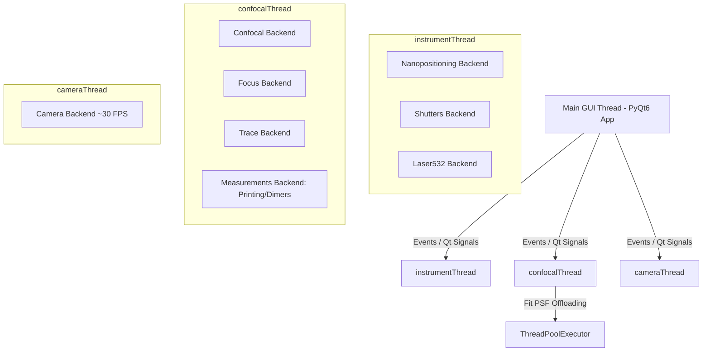

# PyPrinting 3.0 — UNSAM Nanofotónica 🔬

Plataforma modular de última generación desarrollada en **Python 3 / PyQt6** para **control de instrumentos, espectroscopía confocal, visión por computadora y nanofabricación asistida por luz** (impresión óptica de nanopartículas metálicas y ensamblado guiado de dímeros plasmónicos).

Esta versión (PyPrinting 3.0) refactoriza y moderniza por completo la arquitectura original de `printing2`:
* **Migración completa a PyQt6**.
* **Integración de visión por computadora y control de cámara en tiempo real (`camera.py`)**.
* **Modo Seguro (`SAFE_MODE`) con simulación completa de hardware** para desarrollo sin instrumentos físicos.
* **Configuración centralizada (`config.py`)** y desacoplamiento limpio multihilo.

El punto de entrada principal del sistema es **`app.py`**.

---

## 📁 Árbol de Organización del Proyecto (`printing3`)

```
printing3/
├── app.py                # 🚀 PUNTO DE ENTRADA PRINCIPAL. Orquestador PyQt6, GUI y gestión de QThreads.
├── config.py             # ⚙️ Configuración global, constantes de hardware, singleton PI y MOCKs (SAFE_MODE).
├── requirements.txt      # 📦 Lista de dependencias de Python para producción y desarrollo.
│
├── 🎛️ Capa de Control y Adquisición
│   ├── confocal.py       # Mapeo y escaneo confocal 2D/3D (Ramp/Step en XY, XZ, YZ) con ajuste PSF.
│   ├── measurements.py   # Motor unificado de mediciones automatizadas (Grillas de Impresión y Dímeros).
│   ├── focus.py          # Estabilización activa de foco Z (autofoco dinámico por autocorrelación).
│   ├── trace.py          # Adquisición de trazas temporales de fotoluminiscencia/fluorescencia.
│   ├── nanopositioning.py# Control manual y automatizado de la platina piezoeléctrica PI (3 ejes XYZ).
│   └── shutters.py       # Control de obturadores digitales (Verde/Rojo), flipper Notch y láser 532 nm.
│
├── 👁️ Visión por Computadora y Excitación Óptica
│   ├── camera.py         # Control de cámara (Canon EOS / USB OpenCV), overlay de platina y retículo láser.
│   └── (Laser532Window)  # Ventana de modulación de voltaje analógico para láser 532 nm (NI-DAQ ao2).
│
├── 🔌 Capa de Abstracción de Hardware (HAL)
│   └── nidaq.py          # Abstracción unificada de National Instruments (entradas/salidas analógicas/digitales).
│
├── 📐 Librerías Matemáticas y Algoritmos
│   ├── psf.py            # Ajuste Gaussiano 2D, Centro de Masa y resolución multi-partícula.
│   └── spiral.py         # Generación de matrices de escaneo helicoidal para búsqueda rápida.
│
└── 📋 Documentación y Configuración Auxiliar
    ├── README.md         # 📖 Documentación exhaustiva del sistema.
    ├── CLAUDE.md         # Guía de navegación del grafo de conocimiento.
    └── litellm_config.yaml # Configuración opcional de servicios auxiliares.
```

---

## ⚡ Novedades y Arquitectura en PyPrinting 3.0

### 1. 🛡️ Modo Seguro (`SAFE_MODE`) — Ejecución sin Hardware
`PyPrinting 3.0` permite ejecutar la aplicación completa en cualquier computadora personal sin necesidad de tener conectada la platina PI, la tarjeta NI-DAQmx ni la cámara física.

* **Activación por variable de entorno** (Recomendado):
  ```powershell
  $env:PYPRINTING_SAFE="1"; python app.py
  ```
* **Características del Modo Seguro**:
  * **`_MockPI`**: Simula el controlador piezoeléctrico PI E-517 manteniendo posiciones coherentes tras cada comando `MOV`.
  * **`MockTask`**: Genera señales analógicas sintéticas con ruido gaussiano y disparadores síncronos de foco.
  * **Cámara Sintética**: Genera una transmisión RGB en tiempo real con partículas fluorescentes animadas para probar detección y centrado.

---

### 2. 🧵 Modelo de Hilos y Concurrencia Optimizada
Para garantizar máxima fluidez en la GUI (60+ FPS), el backend se distribuye en tres hilos independientes `QThread` más un fondo de hilos (`ThreadPoolExecutor`):



---

## 🛠️ Funcionalidades Detalladas por Módulo

### 1. 🚀 Orquestador Principal (`app.py`)
* **Dock Layout Flexible**: Layout basado en `DockArea` con guardado y restauración del estado de los paneles.
* **Menú Integrado**:
  * `Files`: Directorios de trabajo, creación automática diaria (`YYYY-MM-DD`), restauración de última posición en `Last_position.txt`.
  * `Tools`: Acceso rápido a ventana de Cámara, Modulación Láser 532 nm y Carga de Grillas.
  * `Measurements`: Lanzamiento de módulos unificados de Impresión Óptica y Ensamblado de Dímeros.

### 2. 👁️ Visión por Computadora y Cámara (`camera.py`)
* **Flujo de Video en Tiempo Real**: Captura a ~30 FPS usando OpenCV / Canon EOS SDK.
* **Calibración Óptica**: Conversión directa píxel-micrón (`PIXEL_SIZE_UM = 0.059 µm/px`).
* **Overlay Interactivo**: Muestra la posición actual $(X,Y)$ de la platina PI sobre la imagen óptica de la muestra.
* **Modulación Láser 532 nm**: Control continuo de voltaje analógico (`Dev1/ao2` de 1.0 V a 5.0 V).

### 3. 🔬 Escaneo Confocal 2D/3D (`confocal.py`)
* **Barridos Síncronos**: Modos `Ramp` (hardware triggered) y `Step` (punto a punto).
* **Planos**: $XY$, $XZ$, $YZ$.
* **Centrado de Partícula**: Integración con `psf.py` para centrado automático Gaussiano 2D o Centro de Masa (CM) tras un escaneo.

### 4. 🎯 Impresión Óptica y Dímeros Unificados (`measurements.py`)
* Unifica los flujos de impresión de nanopartículas y fabricación de dímeros en un backend desacoplado.
* **Secuencia de Impresión**:
  $$\text{Posicionamiento} \longrightarrow \text{Autofoco Z} \longrightarrow \text{Monitoreo Traza} \longrightarrow \text{Pulso Laser/Shutter} \longrightarrow \text{Verificación Salto Intensidad}$$
* **Secuencia de Dímeros**:
  $$\text{Pre-Scan Partícula 1} \longrightarrow \text{Ajuste Gaussiano} \longrightarrow \text{Off-Set Nano-métrico} \longrightarrow \text{Impresión Partícula 2} \longrightarrow \text{Post-Scan Caracterización}$$

### 5. 🔍 Estabilización Z y Autofoco Activo (`focus.py`)
* **Algoritmos**: `Go to maximum`, `Lock` y `Autocorrelación ×2`.
* Realiza barridos rápidos en Z sobre el fotodiodo divisor de haz (`BS`) y aplica autocorrelación lineal para corregir la deriva térmica en Z antes de cada evento de fabricación.

### 6. 📈 Trazas Temporales (`trace.py`)
* Captura de intensidad luminosa en tiempo real vs. tiempo para estudios de fotoluminiscencia, parpadeo (*blinking*) y fotoblanqueamiento (*photobleaching*).

### 7. 🔌 Abstracción de Hardware y DAQ (`nidaq.py`)
* Manejo seguro de tareas `nidaqmx`:
  * `shutters`: Canales digitales DO para láser 532 nm (verde) y 637 nm (rojo).
  * `flipper`: Control analógico/digital para el espejo del filtro Notch 532 nm.
  * `photodiodes`: Lectura analógica AI multicanal a **1.0 MS/s**.

---

## ⌨️ Atajos de Teclado Globales

| Tecla | Acción |
|---|---|
| `F1` | Iniciar lectura de Traza temporal |
| `F2` | Detener Traza temporal |
| `F8` | Autofoco → Ir al máximo de intensidad en Z |
| `F9` | Autofoco → Modo Lock |
| `F10` | Autofoco → Autocorrelación $\times 2$ |
| `Ctrl + A` | Seleccionar directorio de trabajo |
| `Ctrl + S` | Crear directorio diario (`YYYY-MM-DD`) |
| `Ctrl + D` | Abrir carpeta de trabajo en el explorador del sistema |

---

## ⚙️ Configuración Global (`config.py`)

Para modificar parámetros de hardware o calibración óptica, edite `config.py`:

```python
SAFE_MODE     = False        # True para simulación, False para laboratorio real
PI_SERIAL     = "0119048050"  # Número de serie de la platina PI E-517
PIXEL_SIZE_UM = 0.059        # Calibración µm/píxel de la cámara
CAMERA_INDEX  = 1            # Índice OpenCV de la cámara (0, 1, 2...)
LASER_532_CHANNEL = "Dev1/ao2" # Canal de modulación analógica del láser 532 nm
```

---

## 📦 Instalación y Ejecución

### 1. Instalación de Dependencias
```powershell
pip install -r requirements.txt
```

### 2. Ejecución con Hardware Real (Laboratorio)
```powershell
python app.py
```

### 3. Ejecución en Modo Seguro (Desarrollo / Demostración)
```powershell
$env:PYPRINTING_SAFE="1"; python app.py
```
