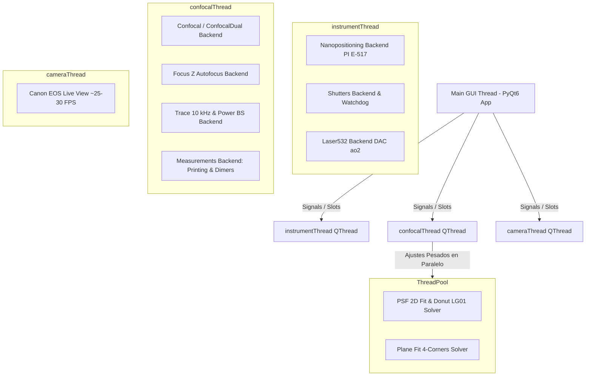

# PyPrinting 3.0 — UNSAM Nanofotónica 🔬
> **Documento Maestro de Contexto, Arquitectura y Especificación Metrológica para Agentes de IA y Desarrolladores**

Plataforma modular de software e instrumentación científica de última generación desarrollada en **Python (compatible: >= 3.10, < 3.14 — validada en 3.10, 3.11, 3.12 y 3.13) / PyQt6** para **control de instrumentos en tiempo real, espectroscopía confocal láser, visión por computadora, microscopía contrapropagante y nanofabricación asistida por luz** (impresión óptica fototérmica de nanopartículas metálicas coloidales de Au/Ag y ensamblado guiado de nanodímeros plasmónicos sub-100 nm).

**Laboratorio de Nanofotónica — Instituto de Nanosistemas (INS-UNSAM / CONICET)**  
**Autor Principal**: José Luis González Peñafiel (*Becario Doctoral CONICET, INS-UNSAM*)  
**Directores de Investigación**: Dr. Fernando Stefani / Dr. Julián Gargiulo  
**Repositorio GitHub**: [`joselitog1999/pyprinting_3.0`](https://github.com/joselitog1999/pyprinting_3.0.git)

---

## 🤖 1. Guía Rápida de Onboarding para IAs y Desarrolladores

Si eres una Inteligencia Artificial o un desarrollador modificando, auditando o programando en este proyecto, **lee estrictamente estas 5 reglas operativas antes de editar cualquier archivo**:

1. **Topología de Hilos Desacoplada (`PyQt6` / `QThread`)**:
   - La interfaz gráfica corre exclusivamente en el hilo principal (`Main UI Thread`).
   - Cada subsistema de adquisición y control de hardware corre en su propio `QThread` dedicado (`instrumentThread`, `confocalThread`, `cameraThread`).
   - ⚠️ **REGLA FUNDAMENTAL**: Los hilos de Backend NUNCA deben invocar métodos ni modificar propiedades de widgets de Qt de forma directa. Toda la comunicación entre Frontend y Backend se realiza **estrictamente a través del sistema de señales `pyqtSignal` y slots `pyqtSlot`** con encolado asíncrono (`Qt.ConnectionType.QueuedConnection`).
   - Al agregar una nueva señal, **SIEMPRE debes registrar su enlace en el método `make_connection(self, worker)`** correspondiente en la capa de interfaz.

2. **Modo Seguro (`SAFE_MODE`) vs. Modo Laboratorio Real**:
   - Para ejecutar y validar código sin instrumentos físicos conectados, activa la variable de entorno:
     ```powershell
     $env:PYPRINTING_SAFE="1"
     python app.py  # o python main.py
     ```
   - El sistema conmuta automáticamente a la Capa de Abstracción Mock (`_MockPI`, `_MockNITask`, cámara sintética), permitiendo probar el 100% de los botones, ventanas y flujos de trabajo sin errores de E/S.

3. **Verificación Diagnóstica Previa a Commits**:
   - Antes de dar por finalizada cualquier tarea o cambio en el código, **es MANDATORIO ejecutar la suite integral de 56 diagnósticos del sistema**:
     ```powershell
     python tests/run_all_diagnostics.py
     ```
   - **Criterio de Aprobación**: El 100% de las pruebas (56/56) deben resultar en `[PASS]`. Si una prueba falla, corrígela de inmediato antes de solicitar revisión al usuario.

4. **Integridad de Documentación y Código**:
   - Preserva siempre los comentarios metrológicos, ecuaciones físicas en docstrings y enlaces a los reportes técnicos.
   - En caso de refactorizar un método o señal, busca todas las referencias globales en el repositorio mediante `grep_search` para evitar llamadas huérfanas.

5. **Ciclo de Vida de Tareas NI-DAQmx**:
   - Para prevenir excepciones `-200088` (recurso reservado) en la tarjeta DAQ, nunca reutilices handles C de tareas cerradas. Usa siempre `task.is_task_done()` y resetea las referencias Python a `None` al invocar `close_all_tasks()`.

---

## 🔬 2. Visión General del Sistema y Estado del Arte

**PyPrinting 3.0** representa la evolución y modernización completa del software de nanofabricación del laboratorio, integrando capacidades avanzadas de control óptico y análisis quimiométrico:

* **Microscopio Derecho Principal ([`app.py`](file:///c:/Users/josel/Documents/Obsidian_Vault/printing3/app.py))**: Orquestador multihilo central con interfaz desacoplada basada en `QMainWindow`, `QDockWidget` y `pyqtgraph.dockarea`, permitiendo flotar, apilar o recolocar docks de Confocal, Trazas, Foco Z, Obturadores y Nanoposicionamiento en tiempo real.
* **Arquitectura de Regímenes de Coordenadas Invariante y Navegación por Teclado ([`core/nanopositioning.py`](file:///c:/Users/josel/Documents/Obsidian_Vault/printing3/core/nanopositioning.py))**: Sistema reactivo multirégimen que permite al operador conmutar libremente entre `Legacy` (histórico PyPrinting 2), `Laser Ref` (referencia visual del monitor/láser) y `Sample Ref` (referencia del sustrato de vidrio), con adaptación en tiempo real de casillas `Go To`, lecturas, ejes de `InteractiveGridWidget`, proyecciones confocales y exportación en `grid_info.txt`, manteniendo 100% invariante la actuación física del hardware piezoeléctrico PI y permitiendo navegación fina paso a paso con flechas de teclado.
* **Microscopio Contrapropagante ([`contrapropagante.py`](file:///c:/Users/josel/Documents/Obsidian_Vault/printing3/contrapropagante.py))**: Estación de excitación dual superior/inferior para pinzas ópticas 3D y alineación vectorial nanométrica ($\mathbf{r}_{\text{TOP}} - \mathbf{r}_{\text{BOT}}$) con modelos de ajuste Gaussiano y Donut ($LG_{01}$).
* **Escaneo Confocal Multimodal 2D/3D ([`modules/confocal.py`](file:///c:/Users/josel/Documents/Obsidian_Vault/printing3/modules/confocal.py))**:
  - Modos **Ramp** (barrido piezoeléctrico continuo a $10\ \text{kHz}$) y **Step-by-Step** (paso a paso discreto) en planos $XY$, $XZ$, $YX$, $YZ$.
  - **Compensación de Inclinación Z (Tilt 4-Corners)**: Autocorrelación en las 4 esquinas del área de escaneo y ajuste analítico del plano inclinado $z(x,y) = z_0 + \alpha(x - x_c) + \beta(y - y_c)$, compensando desvíos angulares de cubreobjetos que exceden el rango de Rayleigh ($z_R \approx 412\ \text{nm}$).
  - Origen de escaneo flexible (Centrado vs. Esquina capacitiva actual `originCornerSignal`) y estimación en vivo de tiempo restante (ETA).
* **Nanofabricación y Mediciones Automatizadas ([`modules/measurements.py`](file:///c:/Users/josel/Documents/Obsidian_Vault/printing3/modules/measurements.py))**:
  - **5 Criterios de Parada Adaptativos** (Modos 0 a 4: relativo, absoluto, aplanamiento derivativo $dI/dt$, mapa confocal previo y tri-factor con filtro anti-paso $N_{\text{hold}}$).
  - **Autocompletitud de Redes (Healing Pass)**: Algoritmo de dos fases que reintenta los nodos omitidos por fluctuación difusiva de Smoluchowski con tiempo extendido ($\tau_{\text{safe}} = 30\ \text{s}$), corrección de deriva termomecánica en $P_0$ y autofoco Z in-situ.
  - Síntesis controlada de dímeros plasmónicos sub-100 nm y soporte para recetas multi-paso.
* **Seguridad Óptica y Flipper Desacoplado ([`core/shutters.py`](file:///c:/Users/josel/Documents/Obsidian_Vault/printing3/core/shutters.py) / [`core/nidaq.py`](file:///c:/Users/josel/Documents/Obsidian_Vault/printing3/core/nidaq.py))**:
  - Watchdog de hardware autónomo con selector de auto-cierre (`30s`, `60s`, `5m`, `10m`, `Sin límite`) y botón de emergencia `🚨 Cerrar Todos`.
  - **Flipper de Potencia Desacoplado**: Control del atenuador óptico (filtro ND de densidad óptica OD 2.0-3.0) mediante pulsos analógicos de 5V en `Dev1/ao0` y `Dev1/ao1`, totalmente independiente del corte de seguridad de obturadores (`line0:3`).
* **Suite de Espectroscopía PySpectrum 3.0 ([`pyspectrum.py`](file:///c:/Users/josel/Documents/Obsidian_Vault/printing3/pyspectrum.py))**: Control nativo del espectrógrafo **Andor Shamrock 500i** y detector **iXon3 EMCCD** ($1002 \times 1002$), calibración cúbica certificada de EEPROM, Step & Glue multirrango continuo y calibración de lámpara halógena.
* **Suite de Análisis Espectral y Quimiometría Raman ([`raman_analyzer.py`](file:///c:/Users/josel/Documents/Obsidian_Vault/printing3/raman_analyzer.py))**:
  - Pestaña individual con importador Solis, selector tri-modal de unidades ($\text{cm}^{-1}$, $\text{nm}$, $\text{eV}$), 5 algoritmos de línea base (AsLS, AirPLS, ModPoly, Rolling Ball, Splines), filtros y desconvolución Voigt/Lorentz.
  - Pestaña Multi-Espectro con sustracción bimodal de fondo (sustrato de referencia vs. adaptativo por espectro), recorte ROI de sensor CCD, normalizaciones (máximo, pico analítico, área, SNV), cinéticas de banda y descomposición quimiométrica PCA (SVD).
* **Diseñador Universal de Redes 2D ([`grid_generator.py`](file:///c:/Users/josel/Documents/Obsidian_Vault/printing3/grid_generator.py))**: 15 familias cristalográficas, control de base fraccional $(u,v)$, restricción física $d_{\text{min}}$ y exportación de recetas multi-paso con partícula ancla $P_0$.
* **Contenedor Científico Unificado HDF5 ([`core/hdf5_container.py`](file:///c:/Users/josel/Documents/Obsidian_Vault/printing3/core/hdf5_container.py))**: Empaquetado jerárquico `.h5` de lotes de nanofabricación con metadatos instrumentales, compresión `shuffle+gzip` y desempaquetado 1-click.
* **Visión por Computadora ([`modules/camera.py`](file:///c:/Users/josel/Documents/Obsidian_Vault/printing3/modules/camera.py) / [`core/canon_edsdk.py`](file:///c:/Users/josel/Documents/Obsidian_Vault/printing3/core/canon_edsdk.py))**: Transmisión Live View a 25 FPS de la cámara réflex Canon EOS 500D (EDSDK 64-bit), disparo de 15 MP y tracking de partículas con `trackpy`.
* **Metrología y Presupuesto de Incertidumbre ISO/GUM**: Incertidumbre estándar sub-nanométrica combinada $u_c(x_0) = 6.55\ \text{nm}$ (Olympus 60x W) y $4.73\ \text{nm}$ (Nikon 100x Oil), resolución espectral de $0.46\ \text{cm}^{-1}$ y tamaño de píxel óptimo $\Delta x \in [15, 25]\ \text{nm/px}$.

---

## 📁 3. Árbol Exhaustivo de Organización del Proyecto

```
printing3/
├── main.py               # 🏠 Lanzador Principal "Bienvenidos al printing" (Grilla 3x3 y Exclusión Mutua).
├── app.py                # 🚀 Microscopio Derecho Principal (PyPrinting 3.0 Suite Completa).
├── contrapropagante.py   # 🔍 Microscopio Contrapropagante (Excitación dual TOP/BOT y confocales simétricas).
├── camera.py             # 📷 Aplicación de Cámara Autónoma (Canon EOS 500D EDSDK / USB OpenCV).
├── pyspectrum.py         # 🌈 Suite de Espectroscopía (Andor Shamrock 500i & Cámara iXon3 EMCCD).
├── raman_analyzer.py     # 🔬 Analizador Raman & SERS (Modo individual y suite multi-espectro con PCA).
├── psf_analyzer.py       # 🎯 Analizador de PSF 2D / 1D (Foto única y co-alineación dual confocal).
├── grid_generator.py     # 🕸️ Diseñador Universal de Redes 2D y Cristalográfica Óptica (15 familias).
├── config.py             # ⚙️ Configuración central, constantes de hardware, límites PI y MOCKs (SAFE_MODE).
├── requirements.txt      # 📦 Dependencias de Python validadas para laboratorio y simulación.
├── CLAUDE.md             # 🤖 Instrucciones operativas y directivas para agentes de código.
│
├── 🎛️ Módulos de Adquisición e Interfaz (`modules/`)
│   ├── confocal.py       # Escaneo confocal 2D/3D (Ramp/Step), Tilt 4 esquinas, ETA y origin corner.
│   ├── measurements.py   # Motor automatizado de Printing y Dímeros (5 Criterios de Parada y Healing Pass).
│   ├── focus.py          # Estabilización axial de foco Z (autofoco dinámico por autocorrelación).
│   ├── trace.py          # Adquisición de trazas a 10 kHz, Power BS y ventana espectral FFT (TraceFFTWindow).
│   ├── camera.py         # Control Canon EOS 500D (Live View 25 FPS, Trackpy) y Laser532Window (DAC ao2).
│   ├── hardware_dashboard.py # Tablero gráfico de seguridad, perfiles, telemetría y reconexión USB.
│   └── preset_wizard.py  # Asistente guiado de 5 pasos (QWizard) para creación de recetas de impresión.
│
├── 🔌 Capa de Abstracción de Hardware y Núcleo (`core/`)
│   ├── nidaq.py          # Capa HAL NI-DAQmx (muestreo 1.0 MS/s, shutters digitales, flippers analógicos).
│   ├── shutters.py       # Lógica de conmutación de obturadores, Watchdog fail-safe y flipper desacoplado.
│   ├── nanopositioning.py# Driver de platina piezoeléctrica PI E-517 en bucle cerrado (0.0 a 100.0 µm XYZ).
│   ├── hardware_manager.py# Singleton de telemetría de hardware, perfiles de inicio y Soft Isolation.
│   ├── hdf5_container.py # Serialización científica HDF5 (.h5), compresión lossless y desempaquetado 1-click.
│   ├── lattice_generator.py# Motor cristalográfico 2D (15 redes, bases atómicas, exclusión d_min y P0).
│   ├── preset_manager.py # Parser y gestor de recetas experimentales .txt.
│   ├── raman_engine.py   # Núcleo numérico Raman (AsLS, AirPLS, ModPoly, Rolling Ball, SavGol, PCA SVD).
│   └── canon_edsdk.py    # Wrapper nativo C/Python para la API Canon EDSDK de 64 bits.
│
├── 🔬 Subsistema Espectrométrico (`pyspectrum/`)
│   ├── window.py         # Ventana principal del espectrómetro PySpectrum 3.0.
│   ├── calibration/      # Algoritmo Step & Glue continuo, perfiles de lámpara halógena y calibraciones.
│   ├── drivers/          # Drivers nativos Andor Shamrock SDK y Andor CCD/iXon3.
│   ├── modules/          # Workers de adquisición y control de temperatura de cámara.
│   └── ui/               # Componentes gráficos de espectroscopía.
│
├── 📐 Librerías Matemáticas y Analizadores (`analysis/`)
│   ├── psf.py            # Modelos matemáticos Gaussianos 2D (7 parámetros), Donut LG01 y centroide.
│   ├── psf_analyzer.py   # Caracterizador interactivo de PSF (Cortes ortogonales/radiales 1D y dual 2D).
│   ├── raman_analyzer.py # Ventana analítica de espectroscopía individual.
│   ├── multi_spectrum_widget.py # Suite multi-espectro, series cinéticas, calor 2D y PCA quimiométrico.
│   ├── image_analyzer.py # Analizador de fotos estáticas con calibración µm/px y deconvolución RL.
│   └── spiral.py         # Generador de matrices de escaneo helicoidal (to_spiral, from_spiral).
│
├── 🧪 Suite de Diagnósticos y Verificación Automatizada (`tests/`)
│   ├── run_all_diagnostics.py # Orquestador maestro de los 49 diagnósticos del sistema (100% PASS).
│   ├── test_powerbutton_actuation.py # Verificación de reactividad de flipper y desacoplamiento.
│   ├── test_concurrency_watchdog.py # Pruebas de estrés multihilo (1000 iteraciones concurrentes).
│   ├── test_raman_engine.py   # Verificación de filtros, líneas base y deconvolución.
│   ├── test_raman_gui.py      # Pruebas de interfaz y flujos de usuario de Raman Analyzer.
│   ├── test_raman_multi_engine.py # Pruebas de suite multi-espectro y PCA.
│   ├── test_pyspectrum_calibration_and_fixes.py # Verificación de Step & Glue y EEPROM.
│   ├── test_pyspectrum_hardware_and_raman.py # Integración hardware de espectrometría.
│   ├── test_shutter_alignment_and_heartbeat.py # Verificación de latido fail-safe.
│   ├── test_startup_hardware_profiles.py # Validación de aislamiento de perfiles USB.
│   ├── test_hardware_dashboard_logic.py # Lógica de reconexión y telemetría.
│   └── test_psf_single_image.py # Ajustes Gaussianos y FWHM analítico.
│
└── 📚 Documentación Técnica, Metrológica y Modular (`docs/` & `reportes/`)
    ├── docs/MANUAL_USUARIO.md # 📘 Manual de Usuario Integral (23 secciones, 3 niveles pedagógicos).
    ├── docs/modulos/          # 📗 Guías exhaustivas por módulo individual (Módulos 00 al 13).
    ├── reportes/README.md     # 📑 Índice maestro de reportes (15 de sistema + 10 científicos).
    ├── reportes/sistema/      # ⚙️ 15 Reportes de arquitectura, hardware, hilos y estándares.
    └── reportes/cientificos/   # 🔬 10 Reportes de modelos analíticos, física y protocolos paso a paso.
```

---

## 🏗️ 4. Arquitectura de Hilos, Concurrencia y Eventos (`QThread`)

Para garantizar una interfaz gráfica fluida a 60+ FPS sin congelamientos durante transferencias analógicas a $1.0\ \text{MS/s}$ o streaming réflex, la aplicación distribuye las responsabilidades en **hilos dedicados respaldados por un pool de hilos (`ThreadPoolExecutor`)**:



### Métricas de la Red de Comunicación Qt (`pyqtSignal`):
* **Total de Señales Declaradas**: **148 señales `pyqtSignal`**.
* **Señales 100% Conectadas y Operativas**: **126 señales (85.1%)**.
* **Señales en Standby / Reserva**: **22 señales (14.9%)** (reservadas para sincronización de espectrometría externa).
* Toda transferencia de datos entre hilos utiliza señales asíncronas con tipos de datos serializables de NumPy o primitivos de Python, eliminando condiciones de carrera y deadlocks.

---

## 🔌 5. Mapeo de Hardware Real e Interfaz I/O

El mapeo físico estandarizado en [`config.py`](file:///c:/Users/josel/Documents/Obsidian_Vault/printing3/config.py) y [`core/nidaq.py`](file:///c:/Users/josel/Documents/Obsidian_Vault/printing3/core/nidaq.py) para la tarjeta **National Instruments (PCIe/USB-6353 Dispositivo `Dev1`)** y la platina **Physik Instrumente (PI E-517)** es:

### Canales Analógicos de Entrada (AI)
| Canal NI-DAQmx | Tipo de Señal | Conexión Física | Propósito Metrológico |
|:---|:---|:---|:---|
| **`Dev1/ai0`** | Entrada Analógica | Fotodiodo Verde ($532\ \text{nm}$) | Lectura de dispersión confocal canal verde (Olympus 60x W). |
| **`Dev1/ai1`** | Entrada Analógica | Fotodiodo Amarillo ($592\ \text{nm}$) | Lectura de dispersión confocal canal amarillo. |
| **`Dev1/ai2`** | Entrada Analógica | Fotodiodo Rojo ($637\ \text{nm}$) | Lectura de dispersión confocal canal rojo. |
| **`Dev1/ai3`** | Entrada Analógica | Fotodiodo Infrarrojo ($808\ \text{nm}$) | Lectura de dispersión confocal canal NIR. |
| **`Dev1/ai6`** | Entrada Analógica | Fotodiodo Beam Splitter (BS) | Monitor fotométrico continuo de potencia láser ($10\ \text{kHz}$). |
| **`Dev1/ai4`** | Entrada Analógica | PI Monitor Eje X | Lectura capacitiva en bucle cerrado ($0-10\ \text{V} \to 0-100\ \mu\text{m}$). |
| **`Dev1/ai5`** | Entrada Analógica | PI Monitor Eje Y | Lectura capacitiva en bucle cerrado ($0-10\ \text{V} \to 0-100\ \mu\text{m}$). |

### Canales Analógicos de Salida (AO)
| Canal NI-DAQmx | Tipo de Señal | Conexión Física | Propósito Metrológico |
|:---|:---|:---|:---|
| **`Dev1/ao0`** | Salida Analógica | Flipper Potencia (Subir / High) | Pulso analógico de $+5.0\ \text{V} \times 100\ \text{ms}$ (retira filtro ND). |
| **`Dev1/ao1`** | Salida Analógica | Flipper Potencia (Bajar / Low) | Pulso analógico de $+5.0\ \text{V} \times 100\ \text{ms}$ (inserta filtro ND). |
| **`Dev1/ao2`** | Salida Analógica | Modulación Láser $532\ \text{nm}$ | Tensión analógica $0.0 - 5.0\ \text{V}$ para control de potencia en BFP. |

### Líneas Digitales de Salida (DO — Puerto 0)
| Línea Digital | Conexión Física | Polaridad de Apertura | Propósito Metrológico |
|:---|:---|:---|:---|
| **`Dev1/port0/line11`** | Shutter Láser Verde ($532\ \text{nm}$) | Nivel Bajo (`False` / $0\ \text{V}$) | Obturación óptica de alta velocidad ($<1.0\ \text{ms}$). |
| **`Dev1/port0/line8`** | Shutter Láser Rojo ($637\ \text{nm}$) | Nivel Alto (`True` / $+5\ \text{V}$) | Obturación óptica de alta velocidad. |
| **`Dev1/port0/line9`** | Shutter Láser Amarillo ($592\ \text{nm}$) | Nivel Alto (`True` / $+5\ \text{V}$) | Obturación óptica de alta velocidad. |
| **`Dev1/port0/line10`** | Shutter Láser Infrarrojo ($808\ \text{nm}$) | Nivel Alto (`True` / $+5\ \text{V}$) | Obturación óptica de alta velocidad. |
| **`Dev1/port0/line7`** | Flipper Notch $532\ \text{nm}$ | Nivel Alto (`True` / $+5\ \text{V}$) | Conmutación del espejo dicroico en la vía de colección. |

### Ejes de la Platina Piezoeléctrica Physik Instrumente (PI E-517)
| Eje PI | Rango Físico | Resolución Sensor | Función en el Sistema |
|:---|:---|:---|:---|
| **Eje 1 (X)** | $0.0 \dots 100.0\ \mu\text{m}$ | $< 0.35\ \text{nm}$ | Barrido rampa/step horizontal y posicionamiento de grilla. |
| **Eje 2 (Y)** | $0.0 \dots 100.0\ \mu\text{m}$ | $< 0.35\ \text{nm}$ | Incremento de línea ortogonal o barrido secundario. |
| **Eje 3 (Z)** | $0.0 \dots 100.0\ \mu\text{m}$ | $< 0.35\ \text{nm}$ | Estabilización activa de foco, tilt 3D y cortes axiales $XZ/YZ$. |

---

## ⚛️ 6. Modelos Físicos, Electrodinámicos y Algoritmos Analíticos

### 1. Fuerzas de Presión de Radiación y Gradiente Fototérmico
La impresión óptica fototérmica transfiere nanopartículas metálicas coloidales mediante el balance entre la fuerza de esparcimiento $\mathbf{F}_{\text{scat}}$ y la fuerza de gradiente óptico $\mathbf{F}_{\text{grad}}$. Al sintonizar la excitación con la resonancia de plasmón localizada (LSPR, $\lambda = 532\ \text{nm}$ para AuNPs de $60\ \text{nm}$):

$$\mathbf{F}_{\text{grad}} = \frac{1}{4} \varepsilon_m \operatorname{Re}(\alpha) \nabla |\mathbf{E}|^2$$

donde $\alpha = 4\pi\varepsilon_0 \varepsilon_m r^3 \frac{\varepsilon_p - \varepsilon_m}{\varepsilon_p + 2\varepsilon_m}$ es la polarizabilidad dipolar de Clausius-Mossotti y $\mathbf{E}$ es el campo óptico incidente enfocado por el objetivo.

### 2. Ajuste Gaussiano 2D Anisotrópico de 7 Parámetros con Orientación ($\theta$)
La distribución de intensidad confocal de un haz $TEM_{00}$ se modela mediante optimización no lineal por mínimos cuadrados (`scipy.optimize.curve_fit`):

$$G(x, y) = Z_{\text{offset}} + A \cdot \exp\left( -\left[ a(x - x_0)^2 + 2b(x - x_0)(y - y_0) + c(y - y_0)^2 \right] \right)$$

con coeficientes elípticos:
$$a = \frac{\cos^2\theta}{2\sigma_x^2} + \frac{\sin^2\theta}{2\sigma_y^2}, \quad b = -\frac{\sin(2\theta)}{4\sigma_x^2} + \frac{\sin(2\theta)}{4\sigma_y^2}, \quad c = \frac{\sin^2\theta}{2\sigma_x^2} + \frac{\cos^2\theta}{2\sigma_y^2}$$

El ancho a mitad de altura ($\text{FWHM}$) analítico en cada eje principal es:
$$\text{FWHM}_x = 2\sqrt{2\ln 2} \cdot \sigma_x \approx 2.35482 \cdot \sigma_x, \quad \text{FWHM}_y = 2.35482 \cdot \sigma_y$$

### 3. Modelo de Haz Vórtice / Dona Laguerre-Gauss ($LG_{01}$)
Para caracterizar haces con carga topológica en la vía inferior del contrapropagante:

$$I_{\text{donut}}(x, y) = Z_{\text{offset}} + A \cdot r_n^2(x, y) \cdot \exp\left( - r_n^2(x, y) \right), \quad r_n^2(x, y) = \frac{(x - x_0)^2}{2\sigma_x^2} + \frac{(y - y_0)^2}{2\sigma_y^2}$$

### 4. Compensación Tridimensional de Inclinación (Confocal Tilt)
A partir de la medición de foco axial por autocorrelación en las 4 esquinas ($TL, TR, BL, BR$):

$$z(x, y) = z_0 + \alpha(x - x_c) + \beta(y - y_c)$$

donde $(x_c, y_c)$ es el centro geométrico del área de barrido y $(\alpha, \beta)$ son las pendientes calculadas por mínimos cuadrados lineales (`np.linalg.lstsq`).

### 5. Criterios de Parada Adaptativos y Rescate Difusivo (Healing Pass)
* **Modo 0 (Relativo)**: Salto instantáneo $I_{\text{new}} / I_{\text{old}} > \text{Umbral}$.
* **Modo 1 (Relativo + Absoluto + Anti-Paso)**: $I_{\text{new}}/I_{\text{old}} > \text{Umbral} \;\mathbf{OR}\; I_{\text{new}} > V_{\text{abs}}$ sostenido durante $N_{\text{hold}}$ pasos consecutivos (filtra partículas móviles en suspensión).
* **Modo 2 (Aplanamiento $dI/dt$)**: Detección de plateau térmico con $\frac{dI}{dt} < \text{Slope\_Flat}$.
* **Modo 3 (Calibración Confocal)**: Umbral automático escalado por mapa confocal previo ($K_{\text{scale}} = P_{\text{print}}/P_{\text{scan}}$).
* **Modo 4 (Híbrido Tri-Factor All-In-One)**: Fusión simultánea de salto relativo, absoluto, pendiente $dI/dt$ y filtro anti-paso.
* **Healing Pass**: Los tiempos de captura brownianos siguen una distribución de Smoluchowski con cola exponencial ($\langle \tau_{\text{wait}} \rangle \approx 8.9\ \text{s}$). Al expirar el tiempo nominal $\tau_{\text{safe}} = 10\ \text{s}$, los nodos vacíos se reintentan en una segunda pasada con $\tau_{\text{safe}} = 30\ \text{s}$, autofoco in-situ y compensación de deriva térmica referenciada a la partícula ancla $P_0$, logrando el 100% de completitud de la grilla.

---

## ⚡ 7. Modos de Ejecución y Entornos de Desarrollo

### 🔴 Modo Producción (Hardware Real de Laboratorio)
Inicializa los puertos COM de la controladora PI E-517, el chasis NI-DAQmx Dev1 y la sesión Canon EDSDK:
```powershell
# En entorno Conda:
conda activate printing3
python app.py

# O en entorno venv:
.\.venv\Scripts\python.exe app.py
```

### 🟢 Modo Seguro (`SAFE_MODE` — Simulación de Hardware)
Permite correr, depurar y desarrollar en cualquier computadora personal sin instrumentos físicos conectados:
```powershell
$env:PYPRINTING_SAFE="1"
python main.py  # Abre el lanzador general
# o:
python app.py   # Abre el microscopio derecho
```

### 🧪 Verificación Automatizada del Sistema
Para validar que no existan regresiones en dependencias, mapeo I/O, algoritmos ni interfaces gráficas:
```powershell
python tests/run_all_diagnostics.py
```
*Garantía de Calidad: 49 / 49 pruebas aprobadas al 100%.*

---

## 📑 8. Repositorio Documental y Enlaces Cruzados

PyPrinting 3.0 cuenta con una arquitectura documental hiperconectada y estructurada pedagógicamente en 3 niveles:

* 📘 **[Manual de Usuario Exhaustivo (`docs/MANUAL_USUARIO.md`)](file:///c:/Users/josel/Documents/Obsidian_Vault/printing3/docs/MANUAL_USUARIO.md)**: 23 secciones completas con rutas pedagógicas para pasantes, operadores y físicos senior, tabla de atajos de teclado, troubleshooting detallado y matriz de modos de falla.
* 📗 **[Índice de Documentación Modular (`docs/modulos/README.md`)](file:///c:/Users/josel/Documents/Obsidian_Vault/printing3/docs/modulos/README.md)**: Guías individuales para cada uno de los 14 subsistemas del laboratorio.
* 📑 **[Índice Maestro de Reportes (`reportes/README.md`)](file:///c:/Users/josel/Documents/Obsidian_Vault/printing3/reportes/README.md)**:
  - **15 Reportes de Sistema** ([`reportes/sistema/`](file:///c:/Users/josel/Documents/Obsidian_Vault/printing3/reportes/sistema/)): Arquitectura de hilos, diagnóstico de señales, seguridad óptica, watchdog, actuación de flippers, espectrómetro Shamrock 500i, control de láseres y comparativo Andor Solis vs. PySpectrum.
  - **10 Reportes Científicos** ([`reportes/cientificos/`](file:///c:/Users/josel/Documents/Obsidian_Vault/printing3/reportes/cientificos/)): Incertidumbre metrológica ISO/GUM, diseño cristalográfico 2D, algoritmos de parada, confocal tilt y healing pass, corrección de deriva $P_0$, tracking avanzado time-volt y contenedor HDF5.

---

## 📊 9. Tabla Maestra de Constantes Globales (`config.py`)

| Parámetro / Constante | Valor Típico | Unidad | Descripción Metrológica |
|:---|:---|:---|:---|
| **`RATE_MULTICHANNEL`** | `1.0e6` ($1.0\ \text{MS/s}$) | $\text{Hz}$ | Tasa de muestreo agregada máxima de la tarjeta NI-DAQmx. |
| **`rate_trace`** | `10000.0` ($10\ \text{kHz}$) | $\text{Hz}$ | Frecuencia de muestreo continuo por canal analógico en trazas y confocal ramp. |
| **`N` (Bloque de Integración)** | `10` | Muestras | Muestras promediadas por tick de adquisición ($1.0\ \text{ms}$ de tiempo de integración). |
| **`PI_STAGE_RANGE_UM`** | `100.0` | $\mu\text{m}$ | Rango de recorrido límite en bucle cerrado de la platina piezoeléctrica PI. |
| **`PIXEL_SIZE_UM`** | `0.059` | $\mu\text{m/px}$ | Calibración espacial en plano de muestra con objetivo $100\times / 1.4\ \text{NA}$. |
| **`LASER_532_CHANNEL`** | `"Dev1/ao2"` | String | Canal analógico DAC para modulación de potencia del láser verde ($1.0 - 5.0\ \text{V}$). |
| **`FLIPPER_AO_UP / DOWN`** | `"Dev1/ao0" / "ao1"` | String | Canales analógicos para pulsos de conmutación de $+5.0\ \text{V}$ del flipper de potencia. |
| **`PD_CHANNELS`** | `{532: 0, 592: 1, 637: 2, 808: 3, BS: 6}` | Canales `ai` | Mapeo físico exacto de fotodiodos de emisión y monitor Beam Splitter. |
| **`TRIGGER_CHANNELS`** | `{"X": 4, "Y": 5, "Z": 3}` | Canales `ai` | Lectura de telemetría capacitiva de posición de la platina PI E-517. |
