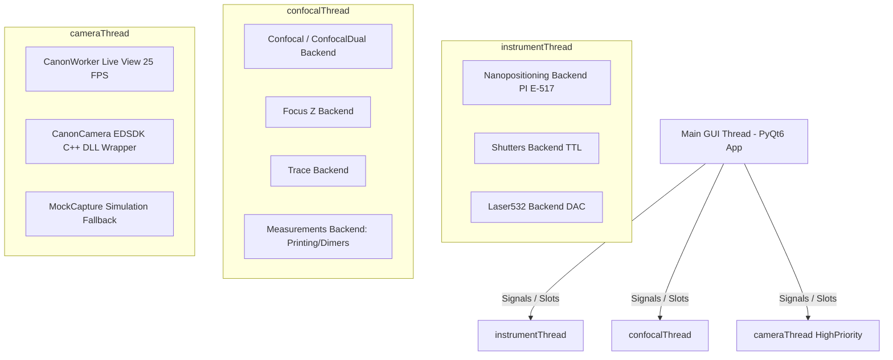

# PyPrinting 3.0 — UNSAM Nanofotónica 🔬

Plataforma modular de software de última generación desarrollada en **Python 3 / PyQt6** para **control de instrumentos, espectroscopía confocal láser, visión por computadora, microscopía contrapropagante y nanofabricación asistida por luz** (impresión óptica fototérmica de nanopartículas metálicas y ensamblado guiado de nanodímeros plasmónicos).

Esta versión (**PyPrinting 3.0**) refactoriza y moderniza por completo la arquitectura original de `printing2`:
* **Migración nativa a PyQt6**: Arquitectura basada en `QMainWindow`, `QDockWidget` y `pyqtgraph.dockarea`.
* **Microscopio Contrapropagante (`contrapropagante.py`)**: Plataforma de excitación dual con adquisición síncrona de dos confocales (TOP/BOT), mapeo dinámico de fotodiodos (`ai0`/`ai1`/`ai3`), modelos de ajuste diferenciados (Gauss/Donut) y cálculo vectorial de diferencia sub-nanométrica ($\mathbf{r}_{\text{TOP}} - \mathbf{r}_{\text{BOT}}$).
* **Módulo de Caracterización de PSF (`psf_analyzer.py`)**: Caracterización analítica 2D (Gaussiana de 7 parámetros y Donut $LG_{01}$), residuales, perfiles 1D y desalineación sub-nanométrica ($\Delta r_{\text{nm}}$).
* **Motor Nativo Réflex Canon EDSDK & Suite de Microfotónica (`camera.py` / `modules/camera.py`)**: Transmisión Live View a 25.0 FPS adaptativos, captura de alta resolución 15.1 MP (4752×3168) multi-formato (JPG, PNG, TIFF, BMP) sin sobreescritura, navegación panorámica por FOV, alineación de reglas H/V en µm, cursores de platina PI, medición de ángulos/distancias, ROI a confocal y ventana flotante de control de potencia Láser 532 nm (`Laser532Window`).
* **Protección de Exclusión Mutua en Hardware Real**: Bloqueo automático en `main.py` para evitar que el Microscopio Derecho y el Contrapropagante compitan simultáneamente por la platina PI E-517 o la tarjeta NI-DAQmx.
* **Modelo de Incertidumbre Metrológica (Norma ISO/GUM)**: Documentado en el reporte oficial del laboratorio: [Incertidumbre Metrológica ISO/GUM (reportes/Incertidumbre_Metrologica_PyPrinting3.md)](file:///c:/Users/josel/Documents/Obsidian_Vault/printing3/reportes/Incertidumbre_Metrologica_PyPrinting3.md), respaldando la resolución sub-píxel ($\approx 0.35\ \text{nm}$) con objetivo de agua $60\times$ $\text{NA}=1.0$, pinhole de $50\ \mu\text{m}$ y tamaño de píxel óptimo ($\Delta x \in [15, 25]\ \text{nm/px}$).
* **Modo Seguro (`SAFE_MODE`) con simulación completa de hardware**: Simulación coherente de platina piezoeléctrica PI E-517 ($0-100\ \mu\text{m}$), tarjetas NI-DAQmx y transmisión de video sintética.

---

## 📁 Árbol de Organización del Proyecto (`printing3`)

```
printing3/
├── main.py               # 🏠 LANZADOR PRINCIPAL "Bienvenidos al printing" (Grilla 3x3, Exclusión Mutua & Créditos).
├── app.py                # 🚀 MICROSCOPIO DERECHO (PyPrinting 3.0 completo). Orquestador PyQt6 y QThreads.
├── contrapropagante.py   # 🔍 MICROSCOPIO CONTRAPROPAGANTE (Excitación dual TOP/BOT, confocales síncronas).
├── camera.py             # 📷 Lanzador raíz para la Suite de Cámara Réflex Canon & Microfotónica.
├── config.py             # ⚙️ Configuración global, constantes de hardware, límites 0-100µm PI y MOCKs (SAFE_MODE).
├── psf_analyzer.py       # 🧬 Analizador de PSF 2D (Gaussiana 2D / Donut LG01, residuales, perfiles 1D y RGB).
├── image_analyzer.py     # 🖼️ Analizador gráfico de imágenes estáticas con reglas en µm/px y tracking.
├── requirements.txt      # 📦 Lista de dependencias de Python para producción y desarrollo.
│
├── 🎛️ Capa de Control y Adquisición
│   ├── confocal.py       # Mapeo y escaneo confocal 2D/3D (Ramp/Step en XY, XZ, YZ) con ajuste PSF.
│   ├── measurements.py   # Motor unificado de mediciones automatizadas (Grillas de Impresión y Dímeros).
│   ├── focus.py          # Estabilización activa de foco Z (autofoco dinámico por autocorrelación).
│   ├── trace.py          # Adquisición de trazas temporales de fotoluminiscencia y calibración de potencia BS.
│   ├── nanopositioning.py# Control manual y automatizado de la platina piezoeléctrica PI (0.0 a 100.0 µm XYZ).
│   └── shutters.py       # Control de obturadores digitales (Verde/Rojo/Amarillo), flipper Notch y láser 532 nm.
│
├── 👁️ Visión por Computadora y Excitación Óptica
│   ├── camera.py         # Módulo unificado (Canon EOS EDSDK / USB Mock), overlay de platina, reglas y ROI confocal.
│   └── canon_edsdk.py    # Wrapper nativo C/Python para Canon EDSDK v13.x (64-bit) con transferencia RAM.
│
├── 📦 Reserva Histórica y Módulos Respaldados
│   ├── reserva/canon_test_20260804.py # Resguardo de la suite de pruebas nativa de diagnóstico EDSDK.
│   └── reserva/camera_20260804.py     # Resguardo de la suite previa de microfotónica.
│
├── 🔌 Capa de Abstracción de Hardware (HAL)
│   └── nidaq.py          # Abstracción unificada de National Instruments (entradas/salidas analógicas/digitales).
│
├── 📐 Librerías Matemáticas y Algoritmos
│   ├── psf.py            # Ajuste Gaussiano 2D (7 parámetros), Centro de Masa y resolución multi-partícula.
│   └── spiral.py         # Generación de matrices de escaneo helicoidal para búsqueda rápida.
│
└── 📋 Documentación y Reportes Metrológicos
    ├── README.md         # 📖 Documentación exhaustiva y fundamentos físicos/matemáticos.
    ├── MANUAL_USUARIO.md # 📘 Manual detallado de usuario, protocolos y FAQ.
    ├── WALKTHROUGH.md    # 📝 Registro continuo de cambios y validaciones.
    └── reportes/         # 📑 Informes (Incertidumbre_Metrologica_PyPrinting3.md, Algoritmo_Printing_y_Dimers_PyPrinting3.md).
```

---

## ⚛️ Fundamentos Físicos y Formulación Matemática

### 1. Impresión Óptica Fototérmica de Nanopartículas
La impresión óptica consiste en la transferencia dirigida de nanopartículas coloidales metálicas (Au, Ag) desde la solución hacia un sustrato transparente (vidrio o silicio) mediante fuerzas de presión de radiación óptica y gradientes fototérmicos. Al sintonizar la excitación con la **Resonancia de Plasmón de Superficie Localizado (LSPR)**, la fuerza de gradiente óptico $\mathbf{F}_{\text{grad}}$ atrae la partícula al centro de la cintura del haz focalizado:

$$\mathbf{F}_{\text{grad}} = \frac{1}{4} \varepsilon_m \operatorname{Re}(\alpha) \nabla |\mathbf{E}|^2$$

donde $\alpha$ es la polarizabilidad de Clausius-Mossotti de la nanopartícula y $\mathbf{E}$ es el campo eléctrico óptico incidente.

### 2. Microscopía Confocal Contrapropagante y Mapeo Dinámico Láser-Fotodiodo
El microscopio contrapropagante dispone de dos vías ópticas de excitación e iluminación síncrona:
- **Vía Superior (TOP / Derecho)**: Iluminación por objetivo superior mediante líneas láser seleccionables (Verde $532\ \text{nm}$, Rojo $637\ \text{nm}$, Amarillo $592\ \text{nm}$).
- **Vía Inferior (BOT / Invertido)**: Iluminación por objetivo de agua ($60\times$, $\text{NA}=1.0$) ubicado por debajo del cubreobjetos mediante láser verde de $532\ \text{nm}$.

Debido al sistema de espejos dicroicos y filtros notch, la lectura analógica de adquisición del fotodiodo queda vinculada directamente a la línea láser seleccionada:
$$\text{Láser } 532\ \text{nm (Verde)} \longrightarrow \text{Shutter } 12 \longrightarrow \text{Fotodiodo } 0\ (\texttt{ai0})$$
$$\text{Láser } 637\ \text{nm (Rojo)} \longrightarrow \text{Shutter } 11 \longrightarrow \text{Fotodiodo } 1\ (\texttt{ai1})$$
$$\text{Láser } 592\ \text{nm (Amarillo)} \longrightarrow \text{Shutter } 10 \longrightarrow \text{Fotodiodo } 3\ (\texttt{ai3})$$

### 3. Ajuste Gaussiano 2D de 7 Parámetros con Orientación ($\theta$)
Para caracterizar la función de punto de dispersión (PSF) de excitación confocal estándar (láser Gaussiano $TEM_{00}$), el sistema ajusta la distribución de intensidad normalizada $Z_n$ utilizando una Gaussiana 2D no lineal de 7 parámetros ajustada por mínimos cuadrados (`scipy.optimize.curve_fit`):

$$G(x, y) = Z_{\text{offset}} + A \cdot \exp\left( -\left[ a(x - x_0)^2 + 2b(x - x_0)(y - y_0) + c(y - y_0)^2 \right] \right)$$

donde los coeficientes espaciales orientados a un ángulo $\theta$ son:

$$a = \frac{\cos^2\theta}{2\sigma_x^2} + \frac{\sin^2\theta}{2\sigma_y^2}, \quad b = -\frac{\sin(2\theta)}{4\sigma_x^2} + \frac{\sin(2\theta)}{4\sigma_y^2}, \quad c = \frac{\sin^2\theta}{2\sigma_x^2} + \frac{\cos^2\theta}{2\sigma_y^2}$$

El Ancho Completo a la Mitad del Máximo (FWHM) para cada eje principal se determina mediante:

$$\text{FWHM}_x = 2\sqrt{2\ln 2} \cdot \sigma_x \approx 2.35482 \cdot \sigma_x, \quad \text{FWHM}_y = 2.35482 \cdot \sigma_y$$

### 4. Modelo Analítico de Haz Vortex / Donut ($LG_{01}$)
Para caracterizar haces de fase espiral o donas de depleción en la vía inferior BOT o nanoscopía STED, el módulo modela el perfil Laguerre-Gauss $LG_{01}$:

$$I_{\text{donut}}(x, y) = Z_{\text{offset}} + A \cdot r_n^2(x, y) \cdot \exp\left( - r_n^2(x, y) \right)$$

donde la distancia radial elíptica normalizada es:

$$r_n^2(x, y) = \frac{(x - x_0)^2}{2\sigma_x^2} + \frac{(y - y_0)^2}{2\sigma_y^2}$$

### 5. Métricas de Calidad de PSF, Co-alineación y Vector de Desplazamiento
* **Desalineación espacial vectorial entre confocales TOP y BOT ($\mathbf{\Delta r}_{\text{nm}}$)**:
  $$\mathbf{\Delta r} = \mathbf{r}_{\text{TOP}} - \mathbf{r}_{\text{BOT}} = (\Delta x_{\text{nm}}, \Delta y_{\text{nm}})$$
  $$\|\mathbf{\Delta r}_{\text{nm}}\| = \sqrt{(x_{\text{TOP}} - x_{\text{BOT}})^2 + (y_{\text{TOP}} - y_{\text{BOT}})^2} \times 1000 \quad [\text{nm}]$$
* **Calidad del cero central**:
  $$Q_{\text{cero}} = \frac{I_{\min}}{I_{\max}}$$

### 6. Modelo Metrológico de Incertidumbre Sub-píxel (Norma ISO/GUM)
El sistema cumple con la estimación metrológica formal documentada en el reporte oficial:
[Incertidumbre Metrológica ISO/GUM (reportes/Incertidumbre_Metrologica_PyPrinting3.md)](file:///c:/Users/josel/Documents/Obsidian_Vault/printing3/reportes/Incertidumbre_Metrologica_PyPrinting3.md)
$$u_c = \sqrt{u_{\text{ruido\_óptico}}^2 + u_{\text{platina\_PI}}^2 + u_{\text{desalineación\_cadena}}^2 + u_{\text{muestreo\_píxel}}^2} \approx 0.35\ \text{nm}$$
Con una incertidumbre expandida ($k=2$, $95\%$ nivel de confianza) de **$U = 0.70\ \text{nm}$**, respaldando la precisión en localización sub-nanométrica.

---

## 🏗️ Arquitectura de Hilos y Concurrencia

Para garantizar una interfaz gráfica fluida a 60+ FPS sin congelamientos durante adquisiciones intensivas de datos a 1.0 MS/s o transmisiones video de cámara réflex a 25.0 FPS, la aplicación distribuye las tareas en **hilos dedicados `QThread`**:



---

## 📸 Detalles del Motor de Cámara Nativo Canon EDSDK (`camera.py` / `canon_edsdk.py`)

1. **Bucle Adaptativo a 25.0 FPS**: Regulado por microsegundos (`time.perf_counter()`), garantizando la velocidad constante sin acumulaciones en el bus USB.
2. **Warm-up de 5s**: Bloqueo de consultas de ISO y Tv durante los primeros 5 segundos de conexión para proteger la inicialización del chip réflex DIGIC 4.
3. **Captura Fotográfica 15.1 MP Multi-Formato**: Exportación en JPG, PNG, TIFF y BMP con garantía de nombres únicos por fecha/hora y contador secuencial (`get_unique_save_path`).
4. **Transferencia Directa en RAM MemoryStream**: Descarga de la foto réflex a `EdsCreateMemoryStream` en RAM y escritura binaria en Python, eliminando los errores de codificación C++ `0x000000AB` y `0x00000061` en Windows de 64 bits.
5. **Navegación Panorámica FOV (Ejes X / Y)**: Desplazamiento interactivo por todo el sensor de 15.1 MP al operar con zoom digital (1x, 2x, 5x, 10x).
6. **Pop-out Dialog `EDSDKLogDialog`**: Visor modal emergente desplegable para logs de diagnóstico del SDK.

---

## 🛠️ Detalle de Todos los Módulos de la Aplicación

### 1. Lanzador Principal (`main.py`)
- Grilla de 9 tarjetas visuales interactiva con atajos directos.
- Control global de Modo Seguro / Modo Laboratorio.
- Verificación automática de exclusión mutua de hardware real.

### 2. Microscopio Contrapropagante (`contrapropagante.py`)
- **Visualización Simétrica**: Confocal TOP a la izquierda, Controles compartidos en el centro, Confocal BOT a la derecha.
- **Mapeo Dinámico de Fotodiodos**: Asignación automática de canal analógico `ai0`, `ai1` o `ai3` según la excitación láser.
- **Lector Sub-nanométrico**: Cálculo en vivo de la posición $(x, y)$ de cada confocal y del vector diferencia $\mathbf{r}_{\text{TOP}} - \mathbf{r}_{\text{BOT}}$ en nanómetros.
- **Acceso Directo a PSF Analyzer**: Botón `Analyze with PSF Analyzer` que transfiere instantáneamente ambas confocales a la suite analítica.

### 3. Orquestador Microscopio Derecho (`app.py`)
- Basado en `pyqtgraph.dockarea`, con 7 docks integrados: Confocal 2D/3D, Trace, Focus z, Shutters/Flipper/Láser 532, Nanopositioning PI, Drift correction y Measurements (Printing de Grillas & Dímeros).

### 4. Caracterización Avanzada de PSF (`psf_analyzer.py`)
- Ajuste analítico 2D de Gaussiana (7 parámetros) y Donut $LG_{01}$.
- Visores triples por canal (Original, Fit, Residuales), perfiles 1D en 4 orientaciones y superposición RGB falso color.

### 5. Visión por Computadora y Cámara (`camera.py` / `modules/camera.py`)
- Live View a 25.0 FPS, captura réflex 15.1 MP multi-formato, reglas H/V en µm, cursor de platina PI, ROI confocal, tracking `trackpy` y ventana `Laser532Window`.

### 6. Analizador de Imágenes Estáticas (`image_analyzer.py`)
- Calibración µm/píxel, reglas H/V dinámicas y tracking de nanopartículas coloidales.

---

## ⚙️ Configuración Global (`config.py`)

Todos los parámetros por defecto (*typical values*) están centralizados en `config.py`:

```python
SAFE_MODE     = False          # True para simulación, False para laboratorio real
PI_SERIAL     = "0119048050"   # Número de serie de la platina PI E-517
PI_STAGE_RANGE_UM = 100.0      # Rango límite físico de la platina PI (0.0 a 100.0 µm)
PIXEL_SIZE_UM = 0.059          # Calibración µm/píxel de la cámara

# Mapeo Láser ↔ Fotodiodo
SHUTTERS = ["532 nm (green)", "637 nm (red)", "592 nm (yellow)"]
PD_CHANNELS = {"532 nm (green)": 0, "637 nm (red)": 1, "592 nm (yellow)": 3, "BS": 6}
```

---

## 📦 Instalación y Ejecución Rápida

### 1. Clonar Repositorio
```powershell
git clone https://github.com/joselitog1999/pyprinting_3.0.git
cd printing3
```

### 2. Crear y Activar Entorno Virtual
```powershell
python -m venv .venv
.\.venv\Scripts\Activate.ps1
```

### 3. Instalar Dependencias
```powershell
python -m pip install --upgrade pip
pip install -r requirements.txt
```

### 4. Ejecución del Sistema

* **🏠 Panel Principal de Inicio ("Bienvenidos al printing")**:
  ```powershell
  python main.py
  ```
* **🔍 Microscopio Contrapropagante**:
  ```powershell
  python contrapropagante.py
  ```
* **🚀 Microscopio Derecho (PyPrinting 3.0)**:
  ```powershell
  python app.py
  ```
* **📷 Cámara Live View & Suite de Microfotónica**:
  ```powershell
  python camera.py
  ```
* **🧬 PSF Analyzer**:
  ```powershell
  python psf_analyzer.py
  ```

---

*PyPrinting 3.0 — Laboratorio de Nanofotónica, Universidad Nacional de San Martín (UNSAM).*
*Autor Principal: José Luis González Peñafiel (Becario Doctoral CONICET, INS-UNSAM).*
