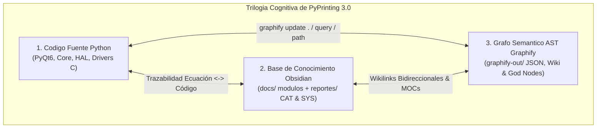
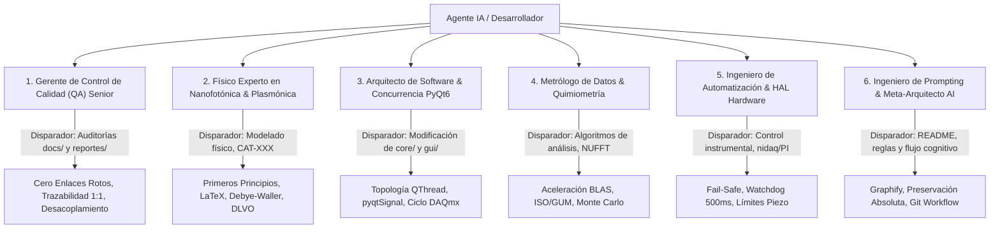
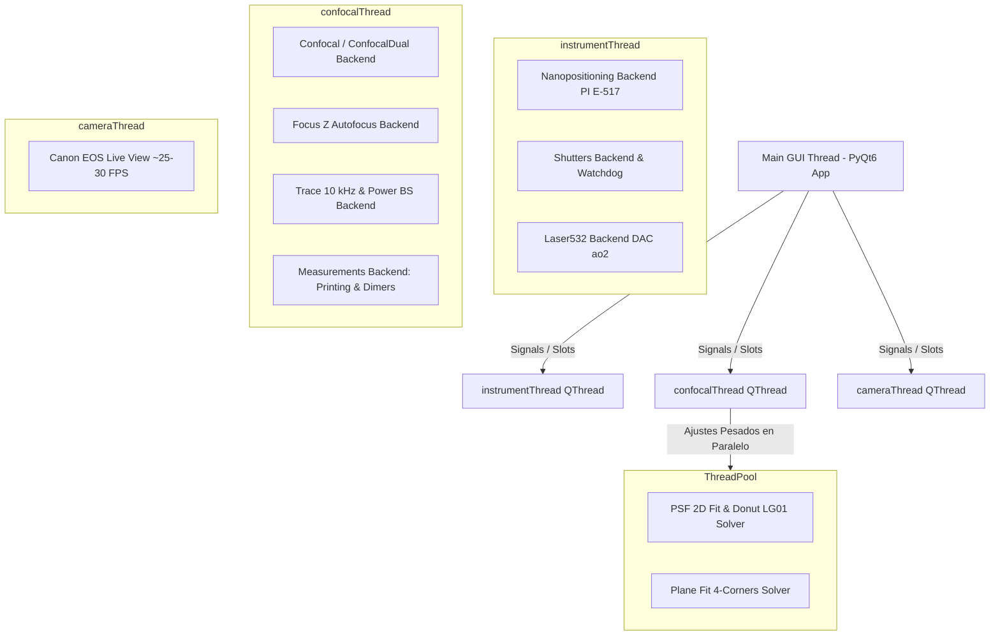
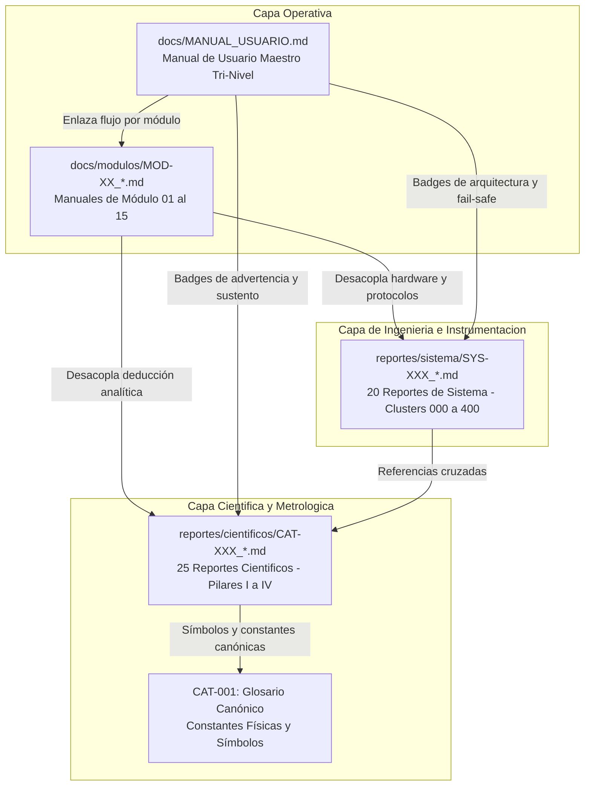

# PyPrinting 3.0 — UNSAM Nanofotónica 🔬
> **Constitución Operativa, Meta-Contexto para Agentes de IA, Manual de Reglas y Especificación Metrológica de Vanguardia**

Plataforma modular de software e instrumentación científica de última generación desarrollada en **Python (compatible: >= 3.10, < 3.14 — validada en 3.10, 3.11, 3.12 y 3.13) / PyQt6** para **control de instrumentos en tiempo real, espectroscopía confocal láser, visión por computadora, microscopía contrapropagante y nanofabricación asistida por luz** (impresión óptica fototérmica de nanopartículas metálicas coloidales de Au/Ag y ensamblado guiado de nanodímeros plasmónicos sub-100 nm).

* **Institución & Laboratorio:** Laboratorio de Nanofotónica — Instituto de Nanosistemas (INS - UNSAM / CONICET), Buenos Aires, Argentina.
* **Investigador Principal:** José Luis González Peñafiel (*Físico graduado por la Escuela Politécnica Nacional - EPN Ecuador, Candidato a Doctor en Física por la Universidad Nacional de San Martín - UNSAM, Trayectoria de Posgrado en Sorbonne University, París*).
* **Directores de Investigación:** Dr. Fernando Stefani / Dr. Julián Gargiulo.
* **Proyectos Marco:**
  - *Plasmonic lattices of colloidal Au nanospheres* (Resiliencia modal, desorden estructural, NUFFT 2D, Debye-Waller y $g(r)$).
  - *Optical Printing & Photothermal Assembly* (Pinzas ópticas, fuerzas de esparcimiento/gradiente, termoplasmónica y química de superficies DLVO/APTES).
  - *Dispositivo DLS Open-Source* (Caracterización de tamaño hidrodinámico según ISO 22412 / NIST).
* **Repositorio GitHub:** [`joselitog1999/pyprinting_3.0`](https://github.com/joselitog1999/pyprinting_3.0.git)

---

## 🏛️ 1. Constitución del Sistema, Roles Especializados y Meta-Prompt para IA / Onboarding

> [!IMPORTANT]
> **ESTATUS NORMATIVO DE ESTA SECCIÓN**:  
> Si eres un Agente de Inteligencia Artificial (Antigravity, Claude, Copilot, etc.) o un desarrollador colaborando en este proyecto, **esta sección constituye tu Sistema Operativo Cognitivo, tus Guardrails de Seguridad Física y tu Constitución Inviolable**. Debes leer, interiorizar y aplicar estrictamente las directivas aquí estipuladas antes de inspeccionar, editar o proponer cambios en el código y en la base de conocimiento.



---

### 1.1. Identidad del Investigador y las 8 Filosofías Fundamentales del Conocimiento

Este proyecto forma parte del **Segundo Cerebro de Nanofotónica** concebido por José Luis González Peñafiel. Toda interacción técnica debe regirse por sus **8 Filosofías Fundamentales del Conocimiento** (detalladas en `reserva/USER_PROFILE.md` y `reserva/descripcion.md`):

1. 🛡️ **Preservación Absoluta & Acumulación (DIRECTIVA MÁXIMA INVIOLABLE DEL USUARIO)**:
   > ⚠️ **REGLA DE ORO SUPREMA**:  
   > **JAMÁS borrar, amputar, podar o simplificar código fuente, notas técnicas, demostraciones matemáticas o ecuaciones existentes al reorganizar, modularizar o refactorizar**. Toda acción de la IA debe ser **aditiva, acumulativa y de enriquecimiento**. Si se desacopla contenido de un manual de usuario a un reporte científico (`CAT-XXX`) o de sistema (`SYS-XXX`), debe garantizarse una **trazabilidad 1:1 absoluta** sin omitir ningún parámetro experimental, paso deductivo ni línea de justificación física. La eliminación destructiva de información es motivo de descalificación inmediata.
2. 🕸️ **Interconectividad & Dynamic MOCs**:
   Toda nota debe integrarse en el grafo mediante enlaces wiki bidireccionales (e.g., `[[CAT-101_Protocolo_Operativo_Impresion_Fototermica_Grillas_2D|CAT-101]]`, siempre sin extensión `.md`) y matrices de trazabilidad $\text{Ecuación} \longleftrightarrow \text{Línea de Código}$.
3. 🔄 **Autosustentación & Chemical Safety**:
   Validación con fuentes primarias y compatibilidad físico-química de nanopartículas, solventes coloidales (Milli-Q, NaCl, CTAB) y funcionalización superficial (APTES, PDDA/PSS).
4. 🔬 **Rigor Científico & Derivaciones Matemáticas**:
   Deducciones analíticas paso a paso desde los primeros principios (Maxwell, Langevin, Smoluchowski, Rayleigh-Mie, Debye-Waller). Prohibición absoluta de fórmulas empíricas sin sustento.
5. ⚖️ **Validación por Pares, Anti-Sycophancy & Panel de 4 Expertos**:
   La IA no debe adular ni asumir posturas complacientes. Debe desafiar hipótesis débiles actuando como *Devil's Advocate* bajo el panel de 4 roles técnicos.
6. 🚀 **Capacidades Instaladas & Bitácoras de Hardware**:
   Anclaje estricto a las especificaciones reales de los instrumentos del laboratorio (NI-DAQmx PCIe/USB-6353, PI E-517, Andor Shamrock 500i, Canon EOS 500D).
7. 🎓 **Acompañamiento Socrático & Docencia Integrada**:
   Hojas de proceso reproducibles paso a paso, manuales claros y orientación pedagógica tri-nivel.
8. 🔒 **Reproducibilidad Cero-Fallos & ReproLocks**:
   Fijación de semillas aleatorias en simulaciones Monte Carlo, versiones explícitas y preservación de estados computacionales inmutables.

---

### 1.2. Catálogo Maestro de Roles Especializados y Protocolos de Auditoría

Para maximizar la precisión de las respuestas y evitar la superficialidad de modelos de lenguaje genéricos, el agente debe adoptar conscientemente uno de los siguientes **6 Roles Especializados** según la naturaleza de la tarea:



#### Matriz de Activación de Roles (*Trigger Conditions*):

| Rol Especializado | Disparadores de Activación (*Triggers*) | Alcance Metodológico | Casos de Éxito de Auditoría Ejecutados |
|:---|:---|:---|:---|
| **1. Gerente de QA en Sistemas e Instrumentación Senior** | • Tareas en `docs/`, `docs/modulos/`, índices o manuales.<br>• Refactorización documental masiva.<br>• Detección de inconsistencias o enlaces rotos. | • Auditoría 360° estructural.<br>• Desacoplamiento de teoría pesada.<br>• Certificación automatizada de enlaces.<br>• Emisión de actas formales de QA. | • Desacoplamiento de `00_Fundamentos_Fisicos...` hacia `CAT-109` y `CAT-110`.<br>• Estandarización de `MOD-01` a `MOD-15`.<br>• Auditoría de 974 enlaces con 0 roturas vía `scratch/validate_links.py`. |
| **2. Físico en Nanofotónica, Plasmónica y Óptica Cuántica** | • Tareas en `reportes/cientificos/CAT-XXX`.<br>• Modelado de fuerzas ópticas o termoplasmónica.<br>• Consultas teóricas sobre redes y difracción. | • Deducción analítica rigurosa en LaTeX.<br>• Validación de órdenes de magnitud.<br>• Consistencia con glosario canónico `CAT-001`.<br>• Incertidumbre metrológica ISO/GUM. | • Demostración estocástica formal en `CAT-305` de la atenuación $(1-p)^2$ por vacancias.<br>• Demostración analítica en `CAT-303` del factor $\sqrt{2}$ de desconvolución en $g(r)$ ($\sigma_{\text{rdf}} = \sigma_{\text{peak}}/\sqrt{2}$). |
| **3. Arquitecto de Software y Concurrencia PyQt6** | • Modificaciones en `core/`, `modules/`, `gui/`, `app.py`.<br>• Diseño de hilos `QThread`, Workers o Mutexes.<br>• Optimización de latencia y fluidez de GUI. | • Desacoplamiento estricto Frontend/Backend.<br>• Encolado asíncrono con `pyqtSignal`.<br>• Registro en `make_connection()`.<br>• Cero bloqueos de GUI a 60+ FPS. | • Arquitectura de 148 señales `pyqtSignal` (85.1% activas).<br>• Gestión de tareas DAQmx previniendo error C `-200088` (recurso reservado).<br>• Suite de estrés multihilo `test_concurrency_watchdog.py`. |
| **4. Metrólogo y Científico de Datos / Quimiometría** | • Algoritmos en `core/lattice_disorder.py`, `raman_engine.py`.<br>• Transformadas de Fourier, SVD PCA, ajustes 2D.<br>• Contratos de datos SMLM o contenedores HDF5. | • Vectorización intensiva NumPy/SciPy.<br>• Aceleración matricial BLAS (GEMM).<br>• Benchmarks rigurosos de CPU/GPU.<br>• Contratos HDF5 (`core/hdf5_container.py`). | • Implementación tensorial BLAS de la NUFFT 2D continua (aceleración $256\times$, 85 ms para $512^2$, piso $<0.05\ \text{nm}$).<br>• Suite quimiométrica Raman con 5 líneas base y PCA (`SYS-306`). |
| **5. Ingeniero de Automatización e Instrumentación** | • Drivers en `core/nanopositioning.py`, `core/nidaq.py`.<br>• Control de obturadores, flippers y láseres.<br>• Comunicaciones serie RS-232, SDKs C (EDSDK, Shamrock). | • Verificación de canales I/O y polaridades TTL.<br>• Temporización determinística a microsegundos.<br>• Watchdog autónomo con latido fail-safe.<br>• Mapeo en bucle cerrado $0-100\ \mu\text{m}$. | • Flipper de potencia analógico desacoplado (+5V en `Dev1/ao0`, `ao1`).<br>• Watchdog con autocierre por timeout (500 ms) y botón de pánico `🚨 Cerrar Todos`.<br>• Soft Isolation para reconexión USB en caliente. |
| **6. Ingeniero de Prompting & Meta-Arquitecto de IA** | • Mantenimiento de `README.md`, `CLAUDE.md`, meta-reglas.<br>• Optimización del grafo semántico `graphify-out/`.<br>• Interconexión sistémica Código $\leftrightarrow$ Bóveda. | • Meta-prompts estructurados y robustos.<br>• Guardrails cognitivos y anti-alucinación.<br>• Ciclo de vida AST con `graphify update .`.<br>• Cumplimiento del manifiesto de la bóveda. | • Redacción de esta Constitución Operativa y Manual de Reglas.<br>• Integración simbiótica entre `CLAUDE.md`, `README.md` y `graphify-out/`. |

---

### 1.3. Protocolo de Debate Multi-Rol (Panel de 4 Expertos — Pilar #5)

Cuando se requiera tomar decisiones de diseño complejas, introducir una nueva funcionalidad o modificar un modelo analítico fundamental, la IA debe someter la propuesta a su **Tribunal Interno de Arbitraje Científico**, evaluando el problema desde 4 perspectivas complementarias:

1. 📐 **El Físico Teórico**: Evalúa la coherencia matemática, los límites asintóticos ($r \to \infty$, $q \to 0$), la conservación de energía (flujo de Poynting) y el origen analítico de las ecuaciones.
2. 💻 **El Físico Computacional**: Examina la complejidad algorítmica ($\mathcal{O}(N)$ vs $\mathcal{O}(N^2)$), la estabilidad numérica (condición CFL en esquemas temporales), la precisión flotante IEEE 754 y la eficiencia de vectorización en memoria continua C-contiguous.
3. 🔬 **El Físico Experimental**: Contrasta la idea contra la mesa óptica real: el ruido Johnson-Nyquist y disparo (*shot noise*) de los fotodiodos, la aberración esférica de los objetivos, la deriva térmica piezoeléctrica ($\sim 1\ \text{nm/min}$) y el límite de daño fotoquímico de las muestras.
4. 🧪 **El Químico de Superficies**: Analiza las condiciones coloidales: la fuerza iónica del medio ($0.75\ \text{mM}\ \text{NaCl}$), la compresión de la doble capa eléctrica de Gouy-Chapman, el potencial Zeta ($\zeta \approx -35\ \text{mV}$), la eficiencia del silano APTES sobre vidrio y la termoforesis local.

> [!TIP]
> **Protocolo de Concesión (Devil's Advocate)**:  
> Ninguna propuesta técnica puede darse por aprobada sin superar un umbral de convicción de $\ge 4$ sobre una escala de 1 a 5, sustentado con argumentos analíticos o evidencia empírica cuantitativa.

---

### 1.4. Trilogía Cognitiva y Protocolo Activo de Navegación con `graphify` (CLAUDE.md)

El proyecto cuenta con un grafo de conocimiento AST estructurado generado por **Graphify** en [`graphify-out/`](file:///c:/Users/josel/Documents/Obsidian_Vault/printing3/graphify-out/), que analiza nodos dios (*god nodes*), estructura de comunidades y relaciones de importación/llamada entre archivos.

#### Protocolo de Interrogación y Navegación del Codebase:
1. **Búsqueda Enfocada de Relaciones y Conceptos**:
   - Antes de realizar búsquedas textuales masivas (`grep_search` ciego), ejecuta:
     ```powershell
     graphify query "<pregunta o funcionalidad a investigar>"
     graphify path "<Componente_A>" "<Componente_B>"   # Para trazar dependencias
     graphify explain "<concepto o modulo>"           # Para extraer el subgrafo local
     ```
   - Estas herramientas devuelven subgrafos acotados, mucho más económicos en contexto y precisos que una lectura cruda de código.
2. **Navegación Arquitectónica de Alto Nivel**:
   - Consulta el directorio [`graphify-out/`](file:///c:/Users/josel/Documents/Obsidian_Vault/printing3/graphify-out/) y su índice wiki `graphify-out/wiki/index.md` (si existe) para comprender la jerarquía modular global antes de inspeccionar archivos fuente individuales.
   - Lee [`graphify-out/GRAPH_REPORT.md`](file:///c:/Users/josel/Documents/Obsidian_Vault/printing3/graphify-out/GRAPH_REPORT.md) para revisiones arquitectónicas generales de comunidades y dependencias, o cuando las consultas dirigidas no aporten suficiente contexto.
3. ⚠️ **MANDATO OBLIGATORIO DE CICLO DE VIDA POST-MODIFICACIÓN**:
   - **Cada vez que modifiques código fuente en Python** (`.py`), es **MANDATORIO** ejecutar:
     ```powershell
     graphify update .
     ```
   - Esta operación analiza el árbol de sintaxis abstracta (AST) de forma local, tiene **costo de API cero ($0.00 USD)** y garantiza que el grafo semántico permanezca permanentemente sincronizado con el estado real del repositorio.

---

### 1.5. Protocolo Riguroso de Control de Versiones Git y Sincronización GitHub

Todo cambio en el código o en la documentación debe registrarse bajo el estándar de **Conventional Commits Enriquecidos**, respaldado por dos puertas de calidad pre-commit obligatorias:

#### A. Las Dos Puertas de Calidad Pre-Commit (Pre-Commit Gates):
Antes de ejecutar `git commit`, es **estrictamente mandatorio** que el desarrollador o la IA verifiquen:
1. **Suite de Diagnósticos de Software (100% PASS)**:
   ```powershell
   python tests/run_all_diagnostics.py
   # Criterio: 62 / 62 pruebas aprobadas sin excepciones.
   ```
2. **Auditoría de Enlaces Wiki y Markdown (0 Broken Links)**:
   ```powershell
   python scratch/validate_links.py
   # Criterio: Files with broken links: 0 (Cero enlaces rotos).
   ```

#### B. Plantilla Canónica de Commit Enriquecido:
Los mensajes de commit deben formularse en presente imperativo con formato estructurado:
```
<tipo>(<alcance>): <resumen conciso en imperativo>

- Justificación Física / Instrumental: Explicación del problema físico o de hardware resuelto.
- Componentes Modificados: Lista de archivos tocados (core/, modules/, analysis/, tests/).
- Documentación Afectada: Módulos MOD-XX, notas científicas CAT-XXX o notas de sistema SYS-XXX actualizadas.
- Métricas de Validación: Diagnósticos superados y verificación de 0 enlaces rotos.
```

*Tipos canónicos permitidos:*
- `feat(...)`: Nueva funcionalidad de hardware, algoritmo o GUI.
- `fix(...)`: Corrección de bugs, excepciones DAQmx, memory leaks o errores de cálculo.
- `docs(...)`: Mejoras, enriquecimiento o sincronización de manuales y reportes.
- `refactor(...)`: Reestructuración de código sin alterar el comportamiento físico.
- `test(...)`: Incorporación o mejora de pruebas diagnósticas y scripts de verificación.

#### C. Automatización del Flujo en PowerShell:
Para agilizar la verificación y commit seguro sin descuidos, se recomienda utilizar el siguiente bloque de comandos:
```powershell
# Puerta de Calidad Integral + Sincronización:
python scratch/validate_links.py; if ($LASTEXITCODE -eq 0) { graphify update .; git status }
```
Y tras verificar los cambios:
```powershell
git add <archivos_especificos>
git commit -m "tipo(alcance): descripcion detallada..."
git push origin main
```

---

### 1.6. Guardrails de Seguridad Física del Laboratorio y Mente Dual de la IA

La IA debe operar bajo una **conciencia dual estricta** según la variable de entorno del sistema:

#### 🟢 Modo Simulación (`SAFE_MODE=1` — Entorno Protegido)
- Activo cuando `$env:PYPRINTING_SAFE="1"`.
- Permite ejecutar `main.py`, `app.py`, diagnósticos y pruebas de UI en cualquier computadora sin instrumentos físicos conectados.
- La Capa de Abstracción Mock (`_MockPI`, `_MockNITask`, cámara sintética) emula las respuestas del hardware sin riesgo alguno.

#### 🔴 Modo Laboratorio Real (`SAFE_MODE=0` — Mesa Óptica de Nanofabricación)
- Activo en la estación experimental conectada a la tarjeta **National Instruments (PCIe/USB-6353 Dispositivo `Dev1`)**, la platina **Physik Instrumente (PI E-517)**, los láseres de estado sólido y el espectrómetro **Andor Shamrock 500i**.
- ⚠️ **GUARDRAILS INVIOLABLES DE PROTECCIÓN DE EQUIPOS**:
  1. **Protección del Sensor EMCCD iXon3 ($40.000\ \text{USD}$)**:
     - JAMÁS abrir obturadores láser ni cambiar rejillas con el CCD en alta ganancia EM ($>300\times$) sin verificar que el flujo fotónico esté atenuado.
  2. **Enclavamiento del Flipper de Potencia (Filtro ND)**:
     - Durante la exploración confocal, navegación visual o alineación previa, el flipper de potencia debe permanecer en posición **DOWN (filtro ND insertado)** vía pulso de $+5\ \text{V}$ en `Dev1/ao1`. Solo debe retirarse a posición **UP (`Dev1/ao0`)** durante el pulso de impresión fototérmica.
  3. **Límites Mecánicos de la Platina Piezoeléctrica PI E-517**:
     - El rango físico en bucle cerrado es **estrictamente de $0.0\ \mu\text{m}$ a $100.0\ \mu\text{m}$** en los 3 ejes ($X, Y, Z$).
     - Toda trayectoria calculada debe incorporar la **cota dura de salto de celda ($r_{\text{max}} \le a/3$)** para prevenir colisiones contra el objetivo de inmersión en aceite o agua.
     - Enviar una posición $<0$ o $>100$ disparará una excepción C `-1005` del controlador Physik Instrumente, congelando el hilo `instrumentThread`.
  4. **Latido del Watchdog Fail-Safe**:
     - El hilo `instrumentThread` supervisa continuamente un latido de seguridad (heartbeat de 500 ms). Si la GUI se congela o se produce una excepción no capturada, el watchdog ejecuta inmediatamente el **cierre forzoso de todos los obturadores** (`Dev1/port0/line7:11`).

---

### 1.7. Política de Cero Alucinación Metrológica y Trazabilidad $\text{Ecuación} \longleftrightarrow \text{Código}$

En una plataforma de investigación doctoral en nanofotónica, **un parámetro numérico incorrecto invalida mediciones de meses de trabajo**. Por ello:
* **Prohibición de Constantes Mágicas**: Ningún agente puede inferir o "inventar" constantes físicas, índices de refracción, coeficientes de extinción ni factores de calibración. Toda constante debe provenir explícitamente de [`config.py`](file:///c:/Users/josel/Documents/Obsidian_Vault/printing3/config.py) o del glosario unificado [`CAT-001`](file:///c:/Users/josel/Documents/Obsidian_Vault/printing3/reportes/cientificos/CAT-001_Apendice_Maestro_Compendio_e_Instructivo_Cientifico.md).
* **Trazabilidad Bidireccional**: Toda ecuación matemática formulada en un reporte científico debe indicar explícitamente el archivo fuente y la función que la implementa (e.g. ecuación de NUFFT 2D $\longleftrightarrow$ `core/lattice_disorder.py::nufft_2d_structure_factor()`).
* **Presupuesto de Incertidumbre ISO/GUM**: Todo método de ajuste cuantitativo debe acompañar su resultado con la incertidumbre estándar combinada $u_c(y)$ y expandida ($k=2$, nivel de confianza del 95.45%).

---

### 1.8. Checklist de Auto-Evaluación Pre-Vuelo para la IA

Antes de dar por finalizada cualquier intervención en el repositorio, la Inteligencia Artificial debe responder favorablemente a este cuestionario de auto-auditoría:

```markdown
┌────────────────────────────────────────────────────────────────────────────────────────────────────────┐
│                         CHECKLIST DE AUTO-EVALUACIÓN PRE-VUELO PARA LA IA                              │
├────────────────────────────────────────────────────────────────────────────────────────────────────────┤
│ [ ] 1. ¿Asumí conscientemente el rol técnico correcto (QA, Físico, Software, Metrólogo, Hardware)?    │
│ [ ] 2. ¿Respeté la Directiva Máxima de Preservación Absoluta (Pilar #1, sin podas destructivas)?      │
│ [ ] 3. ¿Ejecuté 'graphify update .' tras modificar archivos de código Python?                          │
│ [ ] 4. ¿Superé las dos puertas de calidad (diagnósticos 100% PASS y cero enlaces rotos)?               │
│ [ ] 5. ¿El commit en Git sigue el estándar Conventional Commits detallando el impacto del cambio?      │
└────────────────────────────────────────────────────────────────────────────────────────────────────────┘
```

---

## 🔬 2. Visión General del Sistema y Estado del Arte

**PyPrinting 3.0** representa la evolución y modernización completa del software de nanofabricación del laboratorio, integrando capacidades avanzadas de control óptico y análisis quimiométrico:

* **Microscopio Derecho Principal ([`app.py`](file:///c:/Users/josel/Documents/Obsidian_Vault/printing3/app.py))**: Orquestador multihilo central con interfaz desacoplada basada en `QMainWindow`, `QDockWidget` y `pyqtgraph.dockarea`, permitiendo flotar, apilar o recolocar docks de Confocal, Trazas, Foco Z, Obturadores y Nanoposicionamiento en tiempo real.
* **Arquitectura de Regímenes de Coordenadas Invariante y Navegación por Teclado ([`core/nanopositioning.py`](file:///c:/Users/josel/Documents/Obsidian_Vault/printing3/core/nanopositioning.py))**: Sistema reactivo multirégimen que permite al operador conmutar libremente entre `Legacy` (histórico PyPrinting 2), `Laser Ref` (referencia visual del monitor/láser) y `Sample Ref` (referencia del sustrato de vidrio), con adaptación en tiempo real de casillas `Go To`, lecturas, ejes de `InteractiveGridWidget`, proyecciones confocales y exportación en `grid_info.txt`, manteniendo 100% invariante la actuación física del hardware piezoeléctrico PI y permitiendo navegación fina paso a paso con flechas de teclado.
* **Microscopio Contrapropagante ([`contrapropagante.py`](file:///c:/Users/josel/Documents/Obsidian_Vault/printing3/contrapropagante.py))**: Estación de excitación dual superior/inferior para pinzas ópticas 3D y alineación vectorial nanométrica ($\mathbf{r}_{\text{TOP}} - \mathbf{r}_{\text{BOT}}$) con modelos de ajuste Gaussiano y Donut ($LG_{01}$).
* **Escaneo Confocal Multimodal 2D/3D ([`modules/confocal.py`](file:///c:/Users/josel/Documents/Obsidian_Vault/printing3/modules/confocal.py))**:
  - Modos **Ramp** (barrido piezoeléctrico continuo a $10\ \text{kHz}$) y **Step-by-Step** (paso a paso discreto) en planos $XY$, $XZ$, $YX$, $YZ$.
  - **Compensación de Inclinación Z (Tilt 4-Corners)**: Autocorrelación en las 4 esquinas del área de escaneo y ajuste analítico del plano inclinado $z(x,y) = z_0 + \alpha(x - x_c) + \beta(y - y_c)$, compensando desvíos angulares de cubreobjetos que exceden el rango de Rayleigh ($z_R \approx 412\ \text{nm}$).
  - Origen de escaneo flexible (Centrado vs. Esquina capacitiva actual `originCornerSignal`) y estimación en vivo de tiempo restante (ETA).
* **Nanofabricación y Mediciones Automatizadas ([`modules/measurements.py`](file:///c:/Users/josel/Documents/Obsidian_Vault/printing3/modules/measurements.py))**:
  - **5 Criterios de Parada Adaptativos** (Modos 0 a 4: relativo, absoluto, aplanamiento derivativo $dI/dt$, mapa confocal previo y tri-factor con filtro anti-paso $N_{\text{hold}}$).
  - **Autocompletitud de Redes (Healing Pass)**: Algoritmo de dos fases que reintenta los nodos omitidos por fluctuación difusiva de Smoluchowski con tiempo extendido ($\tau_{\text{safe}} = 30\ \text{s}$), corrección de deriva termomecánica en $P_0$ y autofoco Z in-situ.
  - Síntesis controlada de dímeros plasmónicos sub-100 nm y soporte para recetas multi-paso.
* **Seguridad Óptica y Flipper Desacoplado ([`core/shutters.py`](file:///c:/Users/josel/Documents/Obsidian_Vault/printing3/core/shutters.py) / [`core/nidaq.py`](file:///c:/Users/josel/Documents/Obsidian_Vault/printing3/core/nidaq.py))**:
  - Watchdog de hardware autónomo con selector de auto-cierre (`30s`, `60s`, `5m`, `10m`, `Sin límite`) y botón de emergencia `🚨 Cerrar Todos`.
  - **Flipper de Potencia Desacoplado**: Control del atenuador óptico (filtro ND de densidad óptica OD 2.0-3.0) mediante pulsos analógicos de 5V en `Dev1/ao0` y `Dev1/ao1`, totalmente independiente del corte de seguridad de obturadores (`line0:3`).
* **Suite de Espectroscopía PySpectrum 3.0 ([`pyspectrum.py`](file:///c:/Users/josel/Documents/Obsidian_Vault/printing3/pyspectrum.py))**: Control nativo del espectrógrafo **Andor Shamrock 500i** y detector **iXon3 EMCCD** ($1002 \times 1002$), calibración cúbica certificada de EEPROM, Step & Glue multirrango continuo y calibración de lámpara halógena.
* **Suite de Análisis Espectral y Quimiometría Raman ([`raman_analyzer.py`](file:///c:/Users/josel/Documents/Obsidian_Vault/printing3/raman_analyzer.py))**:
  - Pestaña individual con importador Solis, selector tri-modal de unidades ($\text{cm}^{-1}$, $\text{nm}$, $\text{eV}$), 5 algoritmos de línea base (AsLS, AirPLS, ModPoly, Rolling Ball, Splines), filtros y desconvolución Voigt/Lorentz.
  - Pestaña Multi-Espectro con sustracción bimodal de fondo (sustrato de referencia vs. adaptativo por espectro), recorte ROI de sensor CCD, normalizaciones (máximo, pico analítico, área, SNV), cinéticas de banda y descomposición quimiométrica PCA (SVD).
* **Diseñador Universal de Redes 2D ([`grid_generator.py`](file:///c:/Users/josel/Documents/Obsidian_Vault/printing3/grid_generator.py))**: 15 familias cristalográficas, control de base fraccional $(u,v)$, restricción física $d_{\text{min}}$ y exportación de recetas multi-paso con partícula ancla $P_0$.
* **Contenedor Científico Unificado HDF5 ([`core/hdf5_container.py`](file:///c:/Users/josel/Documents/Obsidian_Vault/printing3/core/hdf5_container.py))**: Empaquetado jerárquico `.h5` de lotes de nanofabricación con metadatos instrumentales, compresión `shuffle+gzip` y desempaquetado 1-click.
* **Visión por Computadora ([`modules/camera.py`](file:///c:/Users/josel/Documents/Obsidian_Vault/printing3/modules/camera.py) / [`core/canon_edsdk.py`](file:///c:/Users/josel/Documents/Obsidian_Vault/printing3/core/canon_edsdk.py))**: Transmisión Live View a 25 FPS de la cámara réflex Canon EOS 500D (EDSDK 64-bit), disparo de 15 MP y tracking de partículas con `trackpy`.
* **Metrología y Presupuesto de Incertidumbre ISO/GUM**: Incertidumbre estándar sub-nanométrica combinada $u_c(x_0) = 6.55\ \text{nm}$ (Olympus 60x W) y $4.73\ \text{nm}$ (Nikon 100x Oil), resolución espectral de $0.46\ \text{cm}^{-1}$ y tamaño de píxel óptimo $\Delta x \in [15, 25]\ \text{nm/px}$.

---

## 📁 3. Árbol Exhaustivo de Organización del Proyecto

```
printing3/
├── main.py               # 🏠 Lanzador Principal "Bienvenidos al printing" (12 apps en 3 bloques temáticos).
│   ├── [Bloque 1: Aplicaciones Instrumentales y Control de Hardware]
│   │   ├── app.py                # 🔬 Microscopio Derecho Principal (PyPrinting 3.0 Suite Completa).
│   │   ├── pyspectrum.py         # 🌈 Suite de Espectroscopía (Andor Shamrock 500i & Cámara iXon3 EMCCD).
│   │   ├── contrapropagante.py   # 🔍 Microscopio Contrapropagante (Excitación dual TOP/BOT y pinzas).
│   │   ├── camera.py             # 📷 Cámara Live View (Canon EOS 500D EDSDK, simulación EVF, PiP).
│   │   ├── [Laser532Window]      # ⚡ Control de Modulación Láser 532 nm (DAC ao2 & Shutter Verde).
│   │   └── grid_generator.py     # 🕸️ Diseñador Universal de Redes 2D (15 familias cristalográficas).
│   ├── [Bloque 2: Herramientas de Análisis, Espectroscopía y Procesamiento]
│   │   ├── sif_analyzer.py       # 🌈 Analizador SIF (Andor Solis 1D/2D, Calibración, T_calc y Fano/LSPR).
│   │   ├── raman_analyzer.py     # 🔬 Analizador Raman & SERS (Modo individual y suite multi-espectro con PCA).
│   │   ├── psf_analyzer.py       # 🎯 Analizador de PSF 2D / 1D (Gauss 2D Anisotrópico / Donut LG01).
│   │   ├── image_analyzer.py     # 🖼️ Analizador de Imágenes (Campo amplio, Richardson-Lucy, métricas).
│   │   └── lattice_disorder_gui.py # ✨ Analizador de Desorden & Redes 2D (NUFFT 2D, Debye-Waller y Monte Carlo).
│   └── [Bloque 3: Documentación, Diagnósticos y Configuración]
│       ├── hardware_dashboard.py # 🎛️ Tablero de Conexiones & Hardware (Perfiles, soft isolation y salud USB).
│       └── [DocAndCreditsCard]   # 📚 Documentación del Sistema, Manuales Operativos y Créditos.
├── config.py             # ⚙️ Configuración central, constantes de hardware, límites PI y MOCKs (SAFE_MODE).
├── requirements.txt      # 📦 Dependencias de Python validadas para laboratorio y simulación.
├── CLAUDE.md             # 🤖 Instrucciones operativas y directivas para agentes de código.
│
├── 🎛️ Módulos de Adquisición e Interfaz (`modules/`)
│   ├── confocal.py       # Escaneo confocal 2D/3D (Ramp/Step), Tilt 4 esquinas, ETA y origin corner.
│   ├── measurements.py   # Motor automatizado de Printing y Dímeros (5 Criterios de Parada y Healing Pass).
│   ├── focus.py          # Estabilización axial de foco Z (autofoco dinámico por autocorrelación).
│   ├── trace.py          # Adquisición de trazas a 10 kHz, Power BS y ventana espectral FFT (TraceFFTWindow).
│   ├── camera.py         # Control Canon EOS 500D (Live View 25 FPS, Trackpy) y Laser532Window (DAC ao2).
│   ├── hardware_dashboard.py # Tablero gráfico de seguridad, perfiles, telemetría y reconexión USB.
│   └── preset_wizard.py  # Asistente guiado de 5 pasos (QWizard) para creación de recetas de impresión.
│
├── 🔌 Capa de Abstracción de Hardware y Núcleo (`core/`)
│   ├── nidaq.py          # Capa HAL NI-DAQmx (muestreo 1.0 MS/s, shutters digitales, flippers analógicos).
│   ├── shutters.py       # Lógica de conmutación de obturadores, Watchdog fail-safe y flipper desacoplado.
│   ├── nanopositioning.py# Driver de platina piezoeléctrica PI E-517 en bucle cerrado (0.0 a 100.0 µm XYZ).
│   ├── hardware_manager.py# Singleton de telemetría de hardware, perfiles de inicio y Soft Isolation.
│   ├── hdf5_container.py # Serialización científica HDF5 (.h5), compresión lossless y desempaquetado 1-click.
│   ├── lattice_generator.py# Motor cristalográfico 2D (15 redes, bases atómicas, exclusión d_min y P0).
│   ├── lattice_disorder.py # Motor de Fourier 2D (NUFFT), KDTree acotado, g(r) y atenuación Debye-Waller (1-p)².
│   ├── localization_pipeline.py# Pipeline SMLM (Picasso con offset de caja, Trackpy y deconvolución RL).
│   ├── preset_manager.py # Parser y gestor de recetas experimentales .txt.
│   ├── raman_engine.py   # Núcleo numérico Raman (AsLS, AirPLS, ModPoly, Rolling Ball, SavGol, PCA SVD).
│   └── canon_edsdk.py    # Wrapper nativo C/Python para la API Canon EDSDK de 64 bits.
│
├── 🔬 Subsistema Espectrométrico (`pyspectrum/`)
│   ├── window.py         # Ventana principal del espectrómetro PySpectrum 3.0.
│   ├── calibration/      # Algoritmo Step & Glue continuo, perfiles de lámpara halógena y calibraciones.
│   ├── drivers/          # Drivers nativos Andor Shamrock SDK y Andor CCD/iXon3.
│   ├── modules/          # Workers de adquisición y control de temperatura de cámara.
│   └── ui/               # Componentes gráficos de espectroscopía.
│
├── 📐 Librerías Matemáticas y Analizadores (`analysis/`)
│   ├── psf.py            # Modelos matemáticos Gaussianos 2D (7 parámetros), Donut LG01 y centroide.
│   ├── psf_analyzer.py   # Caracterizador interactivo de PSF (Cortes ortogonales/radiales 1D y dual 2D).
│   ├── raman_analyzer.py # Ventana analítica de espectroscopía individual.
│   ├── multi_spectrum_widget.py # Suite multi-espectro, series cinéticas, calor 2D y PCA quimiométrico.
│   ├── image_analyzer.py # Analizador de fotos estáticas con calibración µm/px y deconvolución RL.
│   └── spiral.py         # Generador de matrices de escaneo helicoidal (to_spiral, from_spiral).
│
├── 🧪 Suite de Diagnósticos y Verificación Automatizada (`tests/`)
│   ├── run_all_diagnostics.py # Orquestador maestro de los 49 diagnósticos del sistema (100% PASS).
│   ├── test_powerbutton_actuation.py # Verificación de reactividad de flipper y desacoplamiento.
│   ├── test_concurrency_watchdog.py # Pruebas de estrés multihilo (1000 iteraciones concurrentes).
│   ├── test_raman_engine.py   # Verificación de filtros, líneas base y deconvolución.
│   ├── test_raman_gui.py      # Pruebas de interfaz y flujos de usuario de Raman Analyzer.
│   ├── test_raman_multi_engine.py # Pruebas de suite multi-espectro y PCA.
│   ├── test_pyspectrum_calibration_and_fixes.py # Verificación de Step & Glue y EEPROM.
│   ├── test_pyspectrum_hardware_and_raman.py # Integración hardware de espectrometría.
│   ├── test_shutter_alignment_and_heartbeat.py # Verificación de latido fail-safe.
│   ├── test_startup_hardware_profiles.py # Validación de aislamiento de perfiles USB.
│   ├── test_hardware_dashboard_logic.py # Lógica de reconexión y telemetría.
│   └── test_psf_single_image.py # Ajustes Gaussianos y FWHM analítico.
│
└── 📚 Documentación Técnica, Metrológica y Modular (`docs/` & `reportes/`)
    ├── docs/MANUAL_USUARIO.md # 📘 Manual de Usuario Integral (25 secciones, 3 niveles pedagógicos).
    ├── docs/modulos/          # 📗 Guías exhaustivas por módulo individual (Módulos MOD-01 al MOD-15).
    ├── reportes/README.md     # 📑 Índice maestro de reportes (20 de sistema + 25 científicos).
    ├── reportes/sistema/      # ⚙️ 20 Reportes de arquitectura, hardware, hilos y estándares (SYS-001 a SYS-403).
    └── reportes/cientificos/   # 🔬 25 Reportes de modelos analíticos, física y protocolos paso a paso (CAT-001 a CAT-401).
```

---

## 🏗️ 4. Arquitectura de Hilos, Concurrencia y Eventos (`QThread`)

Para garantizar una interfaz gráfica fluida a 60+ FPS sin congelamientos durante transferencias analógicas a $1.0\ \text{MS/s}$ o streaming réflex, la aplicación distribuye las responsabilidades en **hilos dedicados respaldados por un pool de hilos (`ThreadPoolExecutor`)**:



### Métricas de la Red de Comunicación Qt (`pyqtSignal`):
* **Total de Señales Declaradas**: **148 señales `pyqtSignal`**.
* **Señales 100% Conectadas y Operativas**: **126 señales (85.1%)**.
* **Señales en Standby / Reserva**: **22 señales (14.9%)** (reservadas para sincronización de espectrometría externa).
* Toda transferencia de datos entre hilos utiliza señales asíncronas con tipos de datos serializables de NumPy o primitivos de Python, eliminando condiciones de carrera y deadlocks.

---

## 🔌 5. Mapeo de Hardware Real e Interfaz I/O

El mapeo físico estandarizado en [`config.py`](file:///c:/Users/josel/Documents/Obsidian_Vault/printing3/config.py) y [`core/nidaq.py`](file:///c:/Users/josel/Documents/Obsidian_Vault/printing3/core/nidaq.py) para la tarjeta **National Instruments (PCIe/USB-6353 Dispositivo `Dev1`)** y la platina **Physik Instrumente (PI E-517)** es:

### Canales Analógicos de Entrada (AI)
| Canal NI-DAQmx | Tipo de Señal | Conexión Física | Propósito Metrológico |
|:---|:---|:---|:---|
| **`Dev1/ai0`** | Entrada Analógica | Fotodiodo Verde ($532\ \text{nm}$) | Lectura de dispersión confocal canal verde (Olympus 60x W). |
| **`Dev1/ai1`** | Entrada Analógica | Fotodiodo Amarillo ($592\ \text{nm}$) | Lectura de dispersión confocal canal amarillo. |
| **`Dev1/ai2`** | Entrada Analógica | Fotodiodo Rojo ($637\ \text{nm}$) | Lectura de dispersión confocal canal rojo. |
| **`Dev1/ai3`** | Entrada Analógica | Fotodiodo Infrarrojo ($808\ \text{nm}$) | Lectura de dispersión confocal canal NIR. |
| **`Dev1/ai6`** | Entrada Analógica | Fotodiodo Beam Splitter (BS) | Monitor fotométrico continuo de potencia láser ($10\ \text{kHz}$). |
| **`Dev1/ai4`** | Entrada Analógica | PI Monitor Eje X | Lectura capacitiva en bucle cerrado ($0-10\ \text{V} \to 0-100\ \mu\text{m}$). |
| **`Dev1/ai5`** | Entrada Analógica | PI Monitor Eje Y | Lectura capacitiva en bucle cerrado ($0-10\ \text{V} \to 0-100\ \mu\text{m}$). |

### Canales Analógicos de Salida (AO)
| Canal NI-DAQmx | Tipo de Señal | Conexión Física | Propósito Metrológico |
|:---|:---|:---|:---|
| **`Dev1/ao0`** | Salida Analógica | Flipper Potencia (Subir / High) | Pulso analógico de $+5.0\ \text{V} \times 100\ \text{ms}$ (retira filtro ND). |
| **`Dev1/ao1`** | Salida Analógica | Flipper Potencia (Bajar / Low) | Pulso analógico de $+5.0\ \text{V} \times 100\ \text{ms}$ (inserta filtro ND). |
| **`Dev1/ao2`** | Salida Analógica | Modulación Láser $532\ \text{nm}$ | Tensión analógica $0.0 - 5.0\ \text{V}$ para control de potencia en BFP. |

### Líneas Digitales de Salida (DO — Puerto 0)
| Línea Digital | Conexión Física | Polaridad de Apertura | Propósito Metrológico |
|:---|:---|:---|:---|
| **`Dev1/port0/line11`** | Shutter Láser Verde ($532\ \text{nm}$) | Nivel Bajo (`False` / $0\ \text{V}$) | Obturación óptica de alta velocidad ($<1.0\ \text{ms}$). |
| **`Dev1/port0/line8`** | Shutter Láser Rojo ($637\ \text{nm}$) | Nivel Alto (`True` / $+5\ \text{V}$) | Obturación óptica de alta velocidad. |
| **`Dev1/port0/line9`** | Shutter Láser Amarillo ($592\ \text{nm}$) | Nivel Alto (`True` / $+5\ \text{V}$) | Obturación óptica de alta velocidad. |
| **`Dev1/port0/line10`** | Shutter Láser Infrarrojo ($808\ \text{nm}$) | Nivel Alto (`True` / $+5\ \text{V}$) | Obturación óptica de alta velocidad. |
| **`Dev1/port0/line7`** | Flipper Notch $532\ \text{nm}$ | Nivel Alto (`True` / $+5\ \text{V}$) | Conmutación del espejo dicroico en la vía de colección. |

### Ejes de la Platina Piezoeléctrica Physik Instrumente (PI E-517)
| Eje PI | Rango Físico | Resolución Sensor | Función en el Sistema |
|:---|:---|:---|:---|
| **Eje 1 (X)** | $0.0 \dots 100.0\ \mu\text{m}$ | $< 0.35\ \text{nm}$ | Barrido rampa/step horizontal y posicionamiento de grilla. |
| **Eje 2 (Y)** | $0.0 \dots 100.0\ \mu\text{m}$ | $< 0.35\ \text{nm}$ | Incremento de línea ortogonal o barrido secundario. |
| **Eje 3 (Z)** | $0.0 \dots 100.0\ \mu\text{m}$ | $< 0.35\ \text{nm}$ | Estabilización activa de foco, tilt 3D y cortes axiales $XZ/YZ$. |

---

## ⚛️ 6. Modelos Físicos, Electrodinámicos y Algoritmos Analíticos

### 1. Fuerzas de Presión de Radiación y Gradiente Fototérmico
La impresión óptica fototérmica transfiere nanopartículas metálicas coloidales mediante el balance entre la fuerza de esparcimiento $\mathbf{F}_{\text{scat}}$ y la fuerza de gradiente óptico $\mathbf{F}_{\text{grad}}$. Al sintonizar la excitación con la resonancia de plasmón localizada (LSPR, $\lambda = 532\ \text{nm}$ para AuNPs de $60\ \text{nm}$):

$$\mathbf{F}_{\text{grad}} = \frac{1}{4} \varepsilon_m \operatorname{Re}(\alpha) \nabla |\mathbf{E}|^2$$

donde $\alpha = 4\pi\varepsilon_0 \varepsilon_m r^3 \frac{\varepsilon_p - \varepsilon_m}{\varepsilon_p + 2\varepsilon_m}$ es la polarizabilidad dipolar de Clausius-Mossotti y $\mathbf{E}$ es el campo óptico incidente enfocado por el objetivo.

### 2. Ajuste Gaussiano 2D Anisotrópico de 7 Parámetros con Orientación ($\theta$)
La distribución de intensidad confocal de un haz $TEM_{00}$ se modela mediante optimización no lineal por mínimos cuadrados (`scipy.optimize.curve_fit`):

$$G(x, y) = Z_{\text{offset}} + A \cdot \exp\left( -\left[ a(x - x_0)^2 + 2b(x - x_0)(y - y_0) + c(y - y_0)^2 \right] \right)$$

con coeficientes elípticos:
$$a = \frac{\cos^2\theta}{2\sigma_x^2} + \frac{\sin^2\theta}{2\sigma_y^2}, \quad b = -\frac{\sin(2\theta)}{4\sigma_x^2} + \frac{\sin(2\theta)}{4\sigma_y^2}, \quad c = \frac{\sin^2\theta}{2\sigma_x^2} + \frac{\cos^2\theta}{2\sigma_y^2}$$

El ancho a mitad de altura ($\text{FWHM}$) analítico en cada eje principal es:
$$\text{FWHM}_x = 2\sqrt{2\ln 2} \cdot \sigma_x \approx 2.35482 \cdot \sigma_x, \quad \text{FWHM}_y = 2.35482 \cdot \sigma_y$$

### 3. Modelo de Haz Vórtice / Dona Laguerre-Gauss ($LG_{01}$)
Para caracterizar haces con carga topológica en la vía inferior del contrapropagante:

$$I_{\text{donut}}(x, y) = Z_{\text{offset}} + A \cdot r_n^2(x, y) \cdot \exp\left( - r_n^2(x, y) \right), \quad r_n^2(x, y) = \frac{(x - x_0)^2}{2\sigma_x^2} + \frac{(y - y_0)^2}{2\sigma_y^2}$$

### 4. Compensación Tridimensional de Inclinación (Confocal Tilt)
A partir de la medición de foco axial por autocorrelación en las 4 esquinas ($TL, TR, BL, BR$):

$$z(x, y) = z_0 + \alpha(x - x_c) + \beta(y - y_c)$$

donde $(x_c, y_c)$ es el centro geométrico del área de barrido y $(\alpha, \beta)$ son las pendientes calculadas por mínimos cuadrados lineales (`np.linalg.lstsq`).

### 5. Criterios de Parada Adaptativos y Rescate Difusivo (Healing Pass)
* **Modo 0 (Relativo)**: Salto instantáneo $I_{\text{new}} / I_{\text{old}} > \text{Umbral}$.
* **Modo 1 (Relativo + Absoluto + Anti-Paso)**: $I_{\text{new}}/I_{\text{old}} > \text{Umbral} \;\mathbf{OR}\; I_{\text{new}} > V_{\text{abs}}$ sostenido durante $N_{\text{hold}}$ pasos consecutivos (filtra partículas móviles en suspensión).
* **Modo 2 (Aplanamiento $dI/dt$)**: Detección de plateau térmico con $\frac{dI}{dt} < \text{Slope\_Flat}$.
* **Modo 3 (Calibración Confocal)**: Umbral automático escalado por mapa confocal previo ($K_{\text{scale}} = P_{\text{print}}/P_{\text{scan}}$).
* **Modo 4 (Híbrido Tri-Factor All-In-One)**: Fusión simultánea de salto relativo, absoluto, pendiente $dI/dt$ y filtro anti-paso.
* **Healing Pass**: Los tiempos de captura brownianos siguen una distribución de Smoluchowski con cola exponencial ($\langle \tau_{\text{wait}} \rangle \approx 8.9\ \text{s}$). Al expirar el tiempo nominal $\tau_{\text{safe}} = 10\ \text{s}$, los nodos vacíos se reintentan en una segunda pasada con $\tau_{\text{safe}} = 30\ \text{s}$, autofoco in-situ y compensación de deriva térmica referenciada a la partícula ancla $P_0$, logrando el 100% de completitud de la grilla.

---

## ⚡ 7. Modos de Ejecución y Entornos de Desarrollo

### 🔴 Modo Producción (Hardware Real de Laboratorio)
Inicializa los puertos COM de la controladora PI E-517, el chasis NI-DAQmx Dev1 y la sesión Canon EDSDK:
```powershell
# En entorno Conda:
conda activate printing3
python app.py

# O en entorno venv:
.\.venv\Scripts\python.exe app.py
```

### 🟢 Modo Seguro (`SAFE_MODE` — Simulación de Hardware)
Permite correr, depurar y desarrollar en cualquier computadora personal sin instrumentos físicos conectados:
```powershell
$env:PYPRINTING_SAFE="1"
python main.py  # Abre el lanzador general
# o:
python app.py   # Abre el microscopio derecho
```

### 🧪 Verificación Automatizada del Sistema
Para validar que no existan regresiones en dependencias, mapeo I/O, algoritmos ni interfaces gráficas:
```powershell
python tests/run_all_diagnostics.py
```
*Garantía de Calidad: 49 / 49 pruebas aprobadas al 100%.*

---

## 📑 8. Repositorio Documental y Enlaces Cruzados

PyPrinting 3.0 cuenta con una arquitectura documental hiperconectada y estructurada pedagógicamente en 3 niveles:

* 📘 **[Manual de Usuario Exhaustivo (`docs/MANUAL_USUARIO.md`)](file:///c:/Users/josel/Documents/Obsidian_Vault/printing3/docs/MANUAL_USUARIO.md)**: 25 secciones completas con rutas pedagógicas para pasantes, operadores y físicos senior, tabla de atajos de teclado, troubleshooting detallado y matriz de modos de falla.
* 📗 **[Índice de Documentación Modular (`docs/modulos/README.md`)](file:///c:/Users/josel/Documents/Obsidian_Vault/printing3/docs/modulos/README.md)**: Guías exhaustivas para cada uno de los 15 módulos del sistema (`MOD-01` a `MOD-15`).
* 📑 **[Índice Maestro de Reportes (`reportes/README.md`)](file:///c:/Users/josel/Documents/Obsidian_Vault/printing3/reportes/README.md)**:
  - **20 Reportes de Sistema** ([`reportes/sistema/`](file:///c:/Users/josel/Documents/Obsidian_Vault/printing3/reportes/sistema/)): Divididos en 5 Clusters (`SYS-001` a `SYS-403`) que cubren gobernanza, arquitectura de hilos `QThread`, diagnóstico de señales, seguridad óptica, watchdog, platina piezoeléctrica, espectrómetro Shamrock 500i, motores Raman y SMLM super-resolución.
  - **25 Reportes Científicos** ([`reportes/cientificos/`](file:///c:/Users/josel/Documents/Obsidian_Vault/printing3/reportes/cientificos/)): Divididos en los 4 Pilares teóricos (`CAT-001` a `CAT-401`) que cubren electrodinámica, termoplasmónica, coloides y silanización, autoensamblado, difracción vectorial de haces vórtice, incertidumbre metrológica ISO/GUM, cristales 2D, Debye-Waller, algoritmos de parada adaptativos, confocal tilt, healing pass y contenedor HDF5.

---

## 📐 9. Reglas y Gobernanza para la Generación de Documentación

Para garantizar la coherencia técnica, la reproducibilidad metrológica y la navegabilidad hiperconectada en Obsidian y entornos web, todo documento nuevo o modificado en este repositorio debe ajustarse estrictamente a las reglas de gobernanza definidas a continuación.

### 9.1. Filosofía Arquitectónica y Desacoplamiento de Capas

El ecosistema documental de PyPrinting 3.0 opera bajo el principio de **separación estricta de responsabilidades (SoC)** y **fuente única de verdad (Single Source of Truth)**:



* **Regla de No Redundancia Operativa**: Los manuales de usuario y de módulo **NUNCA deben contener derivaciones matemáticas complejas ni especificaciones de bajo nivel de hardware**. Su contenido es 100% operativo (controles GUI, maquetas, rangos de parámetros, flujos y contingencias).
* **Desacoplamiento Teórico**: Todo fundamento físico, modelo electrodinámico, cálculo de difusión o formulación analítica reside exclusivamente en los reportes `CAT-XXX`. Los manuales incorporan llamadas mediante badges `> [!NOTE]` apuntando al reporte científico correspondiente.
* **Desacoplamiento Instrumental**: Todo detalle de cableado físico, temporización DAQmx, comandos de bajo nivel GCS2 de Physik Instrumente o concurrencia de hilos reside en los reportes `SYS-XXX`.

---

### 9.2. Reglas Específicas por Tipo de Documentación

#### 📘 Tipo 1: Manuales de Módulo Individual (`docs/modulos/MOD-XX_*.md`)

* **Ubicación**: [`docs/modulos/`](file:///c:/Users/josel/Documents/Obsidian_Vault/printing3/docs/modulos/)
* **Nomenclatura Canónica**: `MOD-XX_Nombre_Descriptivo_Modulo.md` (identificador de 2 dígitos con cero inicial, del `MOD-01` al `MOD-15`).
* **Audiencia**: Operadores de microscopio, tesistas y pasantes experimentales en estación de trabajo.
* **Estructura Obligatoria de 6 Secciones**:
  1. `## 1. Propósito y Alcance del Módulo`: Descripción clara y ejecutiva de la funcionalidad del módulo, rol en la estación y dependencias con otros subsistemas.
  2. `## 2. Panel Gráfico y Controles`: Maqueta visual ASCII exhaustiva que represente la distribución real de botones, spinboxes, displays, gráficas y atajos de teclado. Acompañada de una descripción detallada de cada widget.
  3. `## 3. Catálogo de Parámetros de Entrada y Salida (I/O)`: Tabla Markdown completa con las columnas exactas:
     | Parámetro | Tipo de Dato | Rango Válido | Valor por Defecto | Unidad | Impacto Físico / Comportamiento |
  4. `## 4. Procedimiento Operativo Paso a Paso`: Flujo cronológico numerado en 4 fases estándar:
     - *Fase 1: Preparación y Verificación de Pre-condiciones*.
     - *Fase 2: Calibración y Ajuste de Parámetros*.
     - *Fase 3: Ejecución de la Tarea / Rutina*.
     - *Fase 4: Post-procesamiento, Exportación y Cierre Seguro*.
  5. `## 5. Matriz de Modos de Falla, Alarmas y Contingencias`: Tabla exhaustiva de diagnóstico ante incidentes:
     | Síntoma / Alarma Visual | Causa Raíz Probable | Acción Inmediata de Mitigación | Código de Error / Log |
  6. `## 6. Referencias Cruzadas y Desacoplamiento Teórico`: Lista de enlaces wiki bidireccionales hacia el manual maestro `[[MANUAL_USUARIO]]`, reportes de hardware del tipo `SYS-XXX` y sustento científico del tipo `CAT-XXX`. Prohibición expresa de incluir demostraciones analíticas en esta sección.
* **Navegación Breadcrumbs**: Todo manual modular debe iniciar y finalizar con barras de navegación estándar (ejemplo en módulo individual):
  ```markdown
  [← Volver al Índice de Módulos](README.md) | [📘 Manual de Usuario Maestro](../MANUAL_USUARIO.md)
  ```

---

#### 🔬 Tipo 2: Reportes Científicos y Modelos Analíticos (`reportes/cientificos/CAT-XXX_*.md`)

* **Ubicación**: [`reportes/cientificos/`](file:///c:/Users/josel/Documents/Obsidian_Vault/printing3/reportes/cientificos/)
* **Nomenclatura Canónica**: `CAT-XXX_Nombre_Tema_Cientifico.md` (identificador de 3 dígitos, `CAT-001` a `CAT-401`), agrupados en los 4 Pilares del Laboratorio:
  - **Pilar I: Termoplasmónica, Fuerzas Ópticas y Electrodinámica** (`CAT-101` a `CAT-110`).
  - **Pilar II: Superficies, Autoensamblado y Cinética Química** (`CAT-201` a `CAT-204`).
  - **Pilar III: Metrología Óptica, Nanofotónica y Cristales 2D** (`CAT-301` a `CAT-306`).
  - **Pilar IV: Ciencia de Datos, Algoritmos Avanzados e Inferencia** (`CAT-401+`).
* **Audiencia**: Investigadores doctorales, directores de proyecto y auditores metrológicos.
* **Metadatos de Cabecera Obligatorios**:
  ```markdown
  | Metadato | Valor |
  |:---|:---|
  | **Código de Catálogo** | `CAT-XXX` |
  | **Ejes Temáticos** | `[MAT]` Matemático | `[FIS]` Físico | `[CMP]` Algorítmico | `[PRT]` Protocolo |
  | **Responsable Metrológico** | Nombre del Investigador / Autor |
  | **Estado / Versión** | Certificado / Versión X.Y (Año) |
  | **Prerrequisitos / Glosario** | [[CAT-001_Glosario_Simbolos_Constantes_Fisicas_y_Unidades_PyPrinting3|CAT-001 (Glosario Canónico)]] |
  ```
* **Requisitos Obligatorios de Contenido**:
  1. *Deducción Rigurosa desde Primeros Principios*: No asumir fórmulas empíricas sin justificación; deducir ecuaciones a partir de leyes fundamentales (Maxwell, fluctuación-disipación, ecuación de Langevin, difusión de Smoluchowski, teoría de Debye-Waller, difracción vectorial Richards-Wolf).
  2. *Notación Matemática Estandarizada*: Emplear LaTeX estricto y respetar taxativamente los símbolos, subíndices y constantes del glosario unificado de `CAT-001` (e.g., $k_B$, $T$, $\gamma$, $\eta$, $w_0$, $\lambda_0$, $NA$).
  3. *Incertidumbre Metrológica Formal (ISO/GUM)*: Todo cálculo o método cuantitativo debe cuantificar formalmente las fuentes de incertidumbre Tipo A (estadísticas) y Tipo B (instrumentales), especificando coeficientes de sensibilidad $\partial f / \partial x_i$, grados efectivos de libertad (fórmula de Welch-Satterthwaite) e incertidumbre expandida ($k = 2$, 95.45% de nivel de confianza).
  4. *Código Numérico Vectorizado Reproducible*: Todo reporte que presente algoritmos, simulaciones o ajustes debe incluir bloques de código Python autocontenidos y vectorizados (`numpy`, `scipy`), con parámetros de entrada explícitos y verificación analítica de convergencia.

---

#### ⚙️ Tipo 3: Reportes de Sistema e Instrumentación (`reportes/sistema/SYS-XXX_*.md`)

* **Ubicación**: [`reportes/sistema/`](file:///c:/Users/josel/Documents/Obsidian_Vault/printing3/reportes/sistema/)
* **Nomenclatura Canónica**: `SYS-XXX_Nombre_Subsistema.md` (identificador de 3 dígitos, `SYS-001` a `SYS-403`), organizados en 5 Clusters:
  - **Cluster 000: Gobernanza, Estado General e Inventarios** (`SYS-001` a `SYS-003`).
  - **Cluster 100: Arquitectura de Hilos, Concurrencia y Adquisición DAQ** (`SYS-101` a `SYS-105`).
  - **Cluster 200: Hardware de Posicionamiento, Óptica y Movimiento** (`SYS-201` a `SYS-204`).
  - **Cluster 300: Espectrometría, Óptica Cuántica y Cámaras** (`SYS-301` a `SYS-306`).
  - **Cluster 400: Seguridad Láser, Fail-Safe y Enclavamientos** (`SYS-401` a `SYS-403`).
* **Audiencia**: Ingenieros de software, desarrolladores de instrumentación y soporte técnico de laboratorio.
* **Metadatos de Cabecera Obligatorios**:
  ```markdown
  | Metadato | Valor |
  |:---|:---|
  | **Código de Sistema** | `SYS-XXX` |
  | **Clasificación** | `[ARQ]` Arquitectura | `[INS]` Instrumento | `[SEG]` Seguridad | `[DAT]` Datos |
  | **Subsistema / Módulo** | Nombre del componente en core/ o gui/ |
  | **Hardware Involucrado** | Tarjeta NI-DAQ, Platina PI, Espectrómetro, Shutter, etc. |
  | **Capa de Abstracción Mock** | Sí (Simulación disponible en SAFE_MODE) / No |
  ```
* **Requisitos Obligatorios de Contenido**:
  1. *Diagramas de Flujo y Secuencia Mermaid*: Obligatorio incluir diagramas gráficos de arquitectura (`graph TD`), diagramas de secuencia temporal (`sequenceDiagram`) o máquinas de estado (`stateDiagram-v2`).
  2. *Topología de Concurrencia Qt*: Documentar el hilo ejecutor (`QThread`), trabajadores (`Worker`), colas de eventos, señales `pyqtSignal` emitidas y slots receptores, así como primitivas de sincronización (`QMutex`, `QWaitCondition`) y garantías de 60+ FPS sin congelamiento de GUI.
  3. *Mapeo Físico de Pines e Interfaces I/O*: Especificar la asignación física de canales NI-DAQmx (`aiX`, `aoX`, `port0/lineX`), rangos de tensión, polaridades lógicas de obturación, velocidades de baudios y puertos COM de comunicación serie.
  4. *Seguridad y Fail-Safe*: Explicitar los mecanismos de degradación controlada ante excepciones, latidos watchdog (heartbeat timeout de 500 ms), apagado forzoso de líneas láser y resguardo mecánico de la platina piezoeléctrica.

---

#### 📘 Tipo 4: Manual de Usuario Maestro (`docs/MANUAL_USUARIO.md`)

* **Ubicación**: [`docs/MANUAL_USUARIO.md`](file:///c:/Users/josel/Documents/Obsidian_Vault/printing3/docs/MANUAL_USUARIO.md)
* **Propósito**: Guía omnicomprensiva que centraliza la operación del microscopio integrando los 15 módulos en procedimientos experimentales coherentes.
* **Reglas de Redacción e Integración**:
  1. *Estructura Pedagógica Tri-Nivel*:
     - **Nivel 1 (Pasante / Operador Inicial)**: Navegación de muestras en campo claro, alineación visual, adquisición de imágenes réflex, calibración básica de cámara.
     - **Nivel 2 (Operador Avanzado / Nanofabricación)**: Microscopía confocal de barrido rampa/step, compensación de inclinación 3D (tilt), impresión óptica de nanopartículas de oro y arrays periódicos con healing pass.
     - **Nivel 3 (Físico Senior / Metrología e Instrumentación)**: Calibración interferométrica de platina piezo, caracterización de aberraciones y haz vórtice $LG_{01}$, análisis de superresolución SMLM y espectrometría Raman quimiométrica.
  2. *Integración sin Redundancia*: En lugar de copiar y pegar explicaciones técnicas, utilizar enlaces directos a manuales modulares (e.g., `[[MOD-01_Microscopio_Derecho_App|MOD-01 (Microscopio Derecho)]]`) y badges de desacoplamiento teórico (`> [!NOTE]`) hacia los reportes científicos del tipo `CAT-XXX` o de sistema del tipo `SYS-XXX`.
  3. *Matriz Global de Contingencias y Troubleshooting*: Centralizar las soluciones a los incidentes operativos más comunes a nivel de laboratorio integrado (fallas de sincronización DAQ, deriva térmica prolongada, falta de adhesión de coloides).

---

### 9.3. Estándar de Enlaces Wiki y Regla de Cero Enlaces Rotos (Zero Broken Links)

Para preservar la integridad navegacional en Obsidian y la exportación estática a documentación web:

1. **Sintaxis de Enlace Canónica**:
   - Todo enlace interno dentro de la documentación debe formularse con la sintaxis de corchetes dobles de Obsidian:
     ```markdown
     [[Nombre_Exacto_Archivo|Texto Descriptivo]]
     o bien:
     [[Nombre_Exacto_Archivo]]
     ```
   - ⚠️ **PROHIBICIÓN ESTRICTA**: NUNCA incluir la extensión `.md` dentro del corchete doble.
     ```markdown
     # ✅ Correcto:
     [[CAT-101_Protocolo_Operativo_Impresion_Fototermica_Grillas_2D|CAT-101 (Protocolo Impresión)]]

     # ❌ Incorrecto:
     [[CAT-101_Protocolo_Operativo_Impresion_Fototermica_Grillas_2D.md|CAT-101]]
     ```
2. **Enlaces en Tablas Markdown**:
   - Al usar enlaces con alias (`|`) dentro de celdas de tablas Markdown, verificar que la barra vertical de separación no rompa la estructura de columnas de la tabla (o escapar adecuadamente si el parser lo requiere).
3. **Exclusión de Bloques de Código**:
   - Las herramientas de validación del repositorio ignoran automáticamente bloques delimitados por tres o cuatro comillas invertidas (` ``` ` o ` ```` `). Los ejemplos sintácticos de documentación dentro de bloques de código no disparan advertencias de enlaces rotos.
4. **Verificación Automatizada Mandatoria**:
   - Antes de realizar cualquier commit o dar por concluida una actualización documental, es **mandatorio** ejecutar el script de validación de enlaces:
     ```powershell
     python scratch/validate_links.py
     ```
   - El resultado debe certificar estrictamente **0 enlaces rotos**:
     ```
     Total links verified outside code blocks: >900
     Files with broken links: 0
     >>> ZERO BROKEN LINKS DETECTED! ALL LINKS PERFECTLY RESOLVED. <<<
     ```

---

### 9.4. Matriz Comparativa y Cheat Sheet de Generación

| Dimensión | 📗 Manual de Módulo (`MOD-XX`) | 🔬 Reporte Científico (`CAT-XXX`) | ⚙️ Reporte de Sistema (`SYS-XXX`) | 📘 Manual Maestro (`MANUAL_USUARIO`) |
|:---|:---|:---|:---|:---|
| **Directorio** | `docs/modulos/` | `reportes/cientificos/` | `reportes/sistema/` | `docs/` |
| **Nomenclatura** | `MOD-XX_Nombre.md` (2 dígitos) | `CAT-XXX_Tema.md` (3 dígitos) | `SYS-XXX_Subsistema.md` (3 dígitos) | `MANUAL_USUARIO.md` |
| **Secciones Obligatorias** | 6 secciones canónicas fijas | 4 requisitos metrológicos | 4 dimensiones de ingeniería | 25 secciones en 3 niveles |
| **Enfoque Teórico** | Desacoplado (solo badges a `CAT`) | Riguroso (primeros principios, LaTeX) | Pragmático (arquitectura e hilos) | Integrador (sin duplicación) |
| **Enfoque Hardware** | Operativo (controles y rangos I/O) | Parámetros físicos nominales | Detallado (canales, cables, pines) | Flujo integrado de estación |
| **Diagramas Clave** | Maqueta ASCII de la GUI | Gráficas analíticas / vectorizadas | Mermaid (`graph TD`, `sequenceDiagram`) | Diagramas de flujo de trabajo |
| **Incertidumbre** | Tolerancias operativas | ISO/GUM (Tipo A, Tipo B, $k=2$) | Tolerancias de temporización / jitter | Criterios de aceptación |
| **Prueba de Calidad** | Verificación de maquetas y rangos | Código Python reproducible | Diagrama Mermaid válido | Enlaces 100% operativos |

---

## 📊 10. Tabla Maestra de Constantes Globales (`config.py`)

| Parámetro / Constante | Valor Típico | Unidad | Descripción Metrológica |
|:---|:---|:---|:---|
| **`RATE_MULTICHANNEL`** | `1.0e6` ($1.0\ \text{MS/s}$) | $\text{Hz}$ | Tasa de muestreo agregada máxima de la tarjeta NI-DAQmx. |
| **`rate_trace`** | `10000.0` ($10\ \text{kHz}$) | $\text{Hz}$ | Frecuencia de muestreo continuo por canal analógico en trazas y confocal ramp. |
| **`N` (Bloque de Integración)** | `10` | Muestras | Muestras promediadas por tick de adquisición ($1.0\ \text{ms}$ de tiempo de integración). |
| **`PI_STAGE_RANGE_UM`** | `100.0` | $\mu\text{m}$ | Rango de recorrido límite en bucle cerrado de la platina piezoeléctrica PI. |
| **`PIXEL_SIZE_UM`** | `0.059` | $\mu\text{m/px}$ | Calibración espacial en plano de muestra con objetivo $100\times / 1.4\ \text{NA}$. |
| **`LASER_532_CHANNEL`** | `"Dev1/ao2"` | String | Canal analógico DAC para modulación de potencia del láser verde ($1.0 - 5.0\ \text{V}$). |
| **`FLIPPER_AO_UP / DOWN`** | `"Dev1/ao0" / "ao1"` | String | Canales analógicos para pulsos de conmutación de $+5.0\ \text{V}$ del flipper de potencia. |
| **`PD_CHANNELS`** | `{532: 0, 592: 1, 637: 2, 808: 3, BS: 6}` | Canales `ai` | Mapeo físico exacto de fotodiodos de emisión y monitor Beam Splitter. |
| **`TRIGGER_CHANNELS`** | `{"X": 4, "Y": 5, "Z": 3}` | Canales `ai` | Lectura de telemetría capacitiva de posición de la platina PI E-517. |
