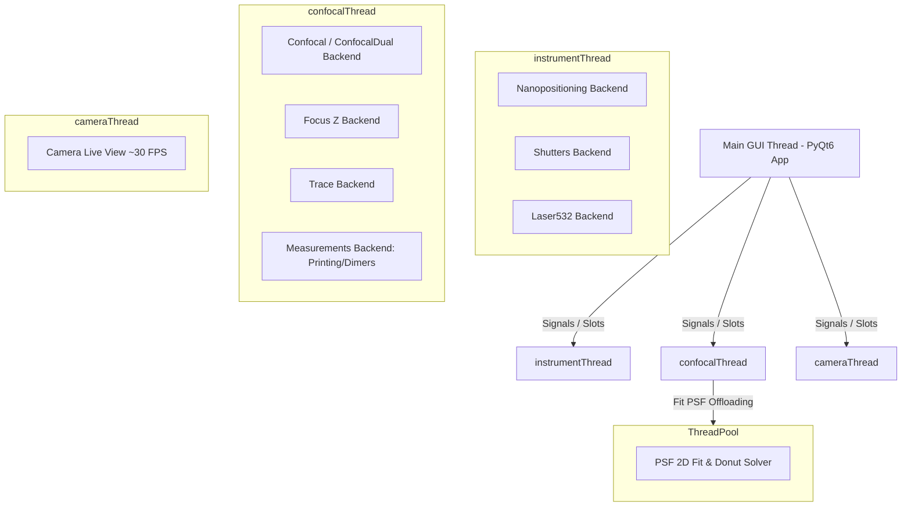

# PyPrinting 3.0 — UNSAM Nanofotónica 🔬
> **Documento Maestro de Contexto, Arquitectura y Especificación Metrológica para Agentes de IA y Desarrolladores**

Plataforma modular de software de última generación desarrollada en **Python (compatible: >= 3.10, < 3.14 — probada en 3.10, 3.11, 3.12 y 3.13) / PyQt6** para **control de instrumentos, espectroscopía confocal láser, visión por computadora, microscopía contrapropagante y nanofabricación asistida por luz** (impresión óptica fototérmica de nanopartículas metálicas de Au/Ag y ensamblado guiado de nanodímeros plasmónicos).

**Laboratorio de Nanofotónica — Instituto de Nanosistemas (INS-UNSAM / CONICET)**  
**Autor Principal**: José Luis González Peñafiel (*Becario Doctoral CONICET*)  
**Repositorio GitHub**: [`joselitog1999/pyprinting_3.0`](https://github.com/joselitog1999/pyprinting_3.0.git)

---

## 🤖 Guía Rápida de Onboarding para IAs y Agentes de Código

Si eres una Inteligencia Artificial o un desarrollador modificando, auditando o depurando este proyecto, **lee este bloque antes de editar cualquier archivo**:

1. **Arquitectura Concurrente Multi-Hilo (`PyQt6` / `QThread`)**:
   - La interfaz gráfica corre en el hilo principal de la GUI.
   - Cada subsistema pesado (platina PI, fotodiodos NI-DAQmx, cámara Canon) corre en su propio `QThread` (`instrumentThread`, `confocalThread`, `cameraThread`).
   - **REGLA CRÍTICA**: Los hilos de Backend NUNCA deben manipular directamente widgets de PyQt. La comunicación se realiza **exclusivamente mediante señales `pyqtSignal` y slots `pyqtSlot`**.
   - Al agregar una nueva señal en el Frontend o Backend, **SIEMPRE debes registrar su conexión en el método `make_connection(self, worker)`** correspondiente.

2. **Modo Seguro (`SAFE_MODE`) vs. Modo Producción (Hardware Real)**:
   - Para probar código sin hardware físico conectado, define la variable de entorno:
     ```powershell
     $env:PYPRINTING_SAFE="1"
     python app.py  # o contrapropagante.py
     ```
   - El sistema cargará MOCKs simétricos de la platina PI E-517 ($0-100\ \mu\text{m}$), tarjetas NI-DAQmx y cámara sintética sin lanzar excepciones de E/S.

3. **Verificación de Cambios**:
   - Antes de dar por terminada una tarea, compila el código sin errores de sintaxis:
     ```powershell
     python -m py_compile modules/confocal.py contrapropagante.py app.py main.py
     ```
   - Mantén intactos los comentarios metrológicos y ecuaciones físicas en docstrings.

---

## 1. Visión General del Sistema y Contexto de Dominio

**PyPrinting 3.0** refactoriza y moderniza por completo la arquitectura del sistema legacy `printing2`:

* **Migración Nativa a PyQt6**: Arquitectura modular basada en `QMainWindow`, `QDockWidget` y `pyqtgraph.dockarea` que permite desacoplar, reorganizar o flotar ventanas independientemente.
* **Microscopio Contrapropagante (`contrapropagante.py`)**: Plataforma de excitación dual con adquisición síncrona de dos confocales (TOP/BOT), mapeo dinámico de fotodiodos (`ai0`, `ai1`, `ai3`), modelos de ajuste diferenciados (Gauss/Donut) y cálculo vectorial de diferencia sub-nanométrica ($\mathbf{r}_{\text{TOP}} - \mathbf{r}_{\text{BOT}}$).
* **Escaneo Confocal Multimodal 2D/3D (`modules/confocal.py`)**:
  - Modos **Ramp** (barrido piezoeléctrico continuo) y **Step-by-Step** (paso a paso discreto) en planos $XY$, $XZ$, $YX$, $YZ$.
  - **Alineación 3D de Inclinación (Tilt 4-Corners)**: Autocorrelación en las 4 esquinas del área de escaneo con el obturador abierto y ajuste por mínimos cuadrados de la ecuación del plano $z(x,y) = z_0 + \alpha(x - x_c) + \beta(y - y_c)$.
  - **Checkbox 📍 Inicio en Posición Actual (`originCornerSignal`)**: Permite alternar dinámicamente entre escaneo centrado $[x_{\text{stage}} \pm \Delta x/2]$ y escaneo con origen en la posición capacitiva actual $[x_{\text{stage}} \dots x_{\text{stage}} + \Delta x]$.
  - **Estimación ETA y Tiempo Total**: Despliegue dinámico del tiempo restante y proyectado en `lbl_confocal_eta` y `lbl_confocal_total`.
  - **Retorno Seguro**: Re-posicionamiento capacitivo cerrado automático a la coordenada inicial al concluir o cancelar la medición.
* **Trazos Temporales & FFT en Tiempo Real (`modules/trace.py` / `modules/power_spectrum_window.py`)**: Adquisición continua a $10\text{ kHz}$, monitor de potencia en divisor de haz (Power BS) y espectro de potencia FFT con marcador visual de ruido de red a $50\text{ Hz}$.
* **Seguridad Óptica Fail-Safe y Watchdog de Hardware (`core/nidaq.py` / `core/shutters.py`)**: Hilo demonio autónomo de protección contra radiación desatendida y fotodaño ($\sim\text{MW/cm}^2$), selector de auto-cierre configurable (`30s`, `60s`, `5m`, `10m`, `Sin límite`), corte de emergencia `🚨 Cerrar Todos`, protocolo de renovación de latido (*heartbeat*) para alineación ininterrumpida en trazas y sincronización bidireccional hardware-GUI.
* **Control Completo de Voltaje Láser 532 nm (`modules/camera.py` / `Laser532Window`)**: Control analógico de salida $0.0-5.0\text{ V}$ (mapeado a potencia de emisión en BFP) vía canal analógico `ao2` de la NI-DAQmx con calibración polinómica, totalmente desacoplado del panel digital de obturadores.
* **Caracterización Avanzada de PSF (`psf_analyzer.py` / `analysis/psf_analyzer.py`)**: Arquitectura bi-modal: Pestaña 1 (Foto única independiente con líneas de corte 2D interactivas, atajos ortogonales/radiales, espesor de línea, ajuste Gaussiano 1D, $\text{FWHM}$ y comparación de difracción de Abbe) y Pestaña 2 (Co-alineación dual confocal con ajuste 2D de 7 parámetros).
* **Suite de Análisis Espectral y Quimiometría Raman (`raman_analyzer.py`)**: Procesamiento avanzado para espectroscopía Raman/SERS con importador inteligente Andor Solis, conversión a Raman Shift ($\text{cm}^{-1}$) y $\text{eV}$, recorte Rayleigh/bordes, sustracción de línea base (AsLS, AirPLS, ModPoly, Rolling Ball), filtros (Savitzky-Golay, FFT, Despiking), reglas duales A/B con integración, suite multi-espectro con normalizaciones (máximo, pico referencia, área, SNV), cinéticas de banda y descomposición PCA (SVD).
* **Gestor de Perfiles de Hardware y Telemetría Resiliente (`core/hardware_manager.py` / `modules/hardware_dashboard.py`)**: Perfiles por defecto para evitar colisión de puertos USB (`pyprinting`: solo PI + NI-DAQ; `camera`: solo Canon EOS; `pyspectrum`: PI + NI-DAQ + Shamrock + CCD; `all`: escaneo total), conexión bajo demanda en caliente (*Hot-Plug*), eliminación estricta de falsos positivos en espectrómetros y badge interactivo de platina física vs. virtual con botón `🔌 Reconectar`.
* **Visión por Computadora en Tiempo Real (`modules/camera.py` / `core/canon_edsdk.py`)**: Control nativo de cámaras réflex Canon EOS 500D (EDSDK 64-bit) y cámaras USB OpenCV con Live View a 25.0 FPS, transferencia por RAM (`EdsCreateMemoryStream`), paletas LUT y tracking dinámico (`trackpy`).
* **Protección de Exclusión Mutua en Hardware Real (`main.py`)**: Bloqueo automático en `main.py` para evitar que el Microscopio Derecho y el Contrapropagante compitan simultáneamente por la platina PI E-517 o la tarjeta NI-DAQmx.
* **Modelo de Incertidumbre Metrológica (Norma ISO/GUM)**: Documentado en `reportes/cientificos/Incertidumbre_Metrologica_PyPrinting3.md`, respaldando la resolución sub-píxel ($\approx 0.35\ \text{nm}$) con objetivo de agua $60\times$ $\text{NA}=1.0$, pinhole de $50\ \mu\text{m}$ y tamaño de píxel óptimo ($\Delta x \in [15, 25]\ \text{nm/px}$).

---

## 📁 2. Árbol de Organización del Proyecto (`printing3`)

```
printing3/
├── main.py               # 🏠 LANZADOR PRINCIPAL "Bienvenidos al printing" (Grilla 3x3, Exclusión Mutua & Créditos).
├── app.py                # 🚀 MICROSCOPIO DERECHO (PyPrinting 3.0 completo). Orquestador PyQt6 y QThreads.
├── contrapropagante.py   # 🔍 MICROSCOPIO CONTRAPROPAGANTE (Excitación dual TOP/BOT, confocales síncronas).
├── camera.py             # 📷 APLICACIÓN DE CÁMARA AUTÓNOMA (Canon EOS 500D EDSDK / USB).
├── pyspectrum.py         # 🌈 SUITE DE ESPECTROSCOPÍA (Andor Shamrock SR-303i & CCD Newton).
├── raman_analyzer.py     # 🔬 ANALIZADOR DE ESPECTROS RAMAN & SERS (Modo individual y multi-espectro).
├── psf_analyzer.py       # 🎯 ANALIZADOR DE PSF 2D / 1D (Foto única y alineación dual).
├── grid_generator.py     # 🕸️ GENERADOR DE REDES 2D & CRISTALOGRAFÍA ÓPTICA.
├── config.py             # ⚙️ Configuración global, constantes de hardware, límites 0-100µm PI y MOCKs (SAFE_MODE).
├── requirements.txt      # 📦 Lista de dependencias de Python para producción y desarrollo.
│
├── 🎛️ Módulos Principales de Medición (`modules/`)
│   ├── confocal.py       # Mapeo y escaneo confocal 2D/3D (Ramp/Step en XY, XZ, YZ), Tilt 3D, ETA y origin corner.
│   ├── measurements.py   # Motor unificado de mediciones automatizadas (Grillas de Impresión y Dímeros con 5 modos de parada).
│   ├── focus.py          # Estabilización activa de foco Z (autofoco dinámico por autocorrelación).
│   ├── trace.py          # Adquisición de trazas a 10 kHz, FFT en tiempo real con marcador 50 Hz y Power BS.
│   ├── power_spectrum_window.py # Ventana desplegable con gráfico espectral FFT de densidad de potencia.
│   ├── laser_532.py      # Panel de control de voltaje analógico (0-5V AO2) y shutter para el láser verde de 532 nm.
│   ├── camera.py         # Control de cámara réflex Canon EOS 500D (EDSDK Live View + Trackpy).
│   ├── hardware_dashboard.py # Tablero gráfico de seguridad, selector de perfiles, matriz de LEDs y aislamiento por software.
│   └── preset_wizard.py  # Asistente guiado de 5 pasos (QWizard) para creación de presets experimentales.
│
├── 🔌 Capa de Abstracción de Hardware y Núcleo (`core/`)
│   ├── hardware_manager.py# Singleton de telemetría, perfiles de inicio ('pyprinting', 'pyspectrum', 'camera', 'all') y Soft Isolation.
│   ├── preset_manager.py  # Gestor de lectura/escritura de presets experimentales en archivos .txt.
│   ├── raman_engine.py    # Motor numérico puro para espectroscopía Raman (AsLS, AirPLS, ModPoly, SavGol, FFT, SVD/PCA).
│   ├── lattice_generator.py# Motor cristalográfico de generación de redes 2D periódicas y cuasicristales.
│   ├── nanopositioning.py# Control capacitivo cerrado de la platina piezoeléctrica PI E-517 (0.0 a 100.0 µm XYZ).
│   ├── shutters.py       # Control de obturadores digitales (532, 637, 592 nm), flippers y láser 532 nm.
│   ├── nidaq.py          # Abstracción unificada de tarjetas NI-DAQmx (canales analógicos y digitales).
│   └── canon_edsdk.py    # Wrapper nativo C/Python para la API Canon EDSDK (Live View 25 FPS & 15 MP).
│
├── 🔬 Módulo Espectrométrico (`pyspectrum/`)
│   ├── window.py         # Ventana principal del espectrómetro PySpectrum 3.0.
│   ├── modules/          # Cámaras CCD Andor y drivers de monocromador Shamrock.
│   └── calibration/      # Cosido Step & Glue, perfiles de lámpara halógena y calibraciones.
│
├── 📁 Archivos de Configuración de Presets (`presets/`)
│   ├── AuNP_60nm_ImpresionRapida.txt
│   ├── AuNP_60nm_AltaPotencia.txt
│   ├── AgNP_80nm_Nanodimeros.txt
│   └── Grilla_Extensa_10x10.txt
│
├── 📐 Librerías Matemáticas y Analizadores (`analysis/`)
│   ├── psf.py            # Ajuste Gaussiano 2D (7 parámetros), Centro de Masa y resolución multi-partícula.
│   ├── psf_analyzer.py   # Herramienta de caracterización bi-modal de PSF (Foto única con cortes 1D y dual confocal).
│   ├── raman_analyzer.py # Ventana principal de análisis de espectros Raman y reglas interactivas.
│   ├── multi_spectrum_widget.py # Suite multi-espectro, series temporales, cinéticas y PCA.
│   ├── image_analyzer.py # Analizador gráfico de imágenes estáticas con reglas en µm/px y tracking.
│   └── spiral.py         # Generación de matrices de escaneo helicoidal para búsqueda rápida (`to_spiral`, `from_spiral`).
│
└── 📋 Documentación y Reportes Metrológicos
    ├── README.md         # 📖 Documentación maestro de contexto y arquitectura.
    ├── docs/MANUAL_USUARIO.md # 📘 Manual detallado de usuario, protocolos y FAQ.
    ├── walkthrough.md    # 📝 Registro continuo de cambios y validaciones en tiempo de ejecución.
    └── reportes/         # 📑 Informes metrológicos y técnicos desglosados:
        ├── ⚙️ sistema/
        │   ├── Informe_de_Estado_Mejoras_y_Estandares_de_Diseno_PyPrinting3.md
        │   ├── Arquitectura_de_Hilos_y_Concurrencia_PyPrinting3.md
        │   ├── Diagnostico_de_Senales_y_Conexiones_PyPrinting3.md
        │   ├── Diagnostico_Integral_y_Comparativo_PyPrinting3.md
        │   ├── Reporte_de_Bugs_y_Errores_Rutina_Printing_PyPrinting3.md
        │   ├── Matriz_de_Intercambio_de_Archivos_PyPrinting3.md
        │   ├── Respuestas_Graphify_y_Evaluacion_Arquitectonica_PyPrinting3.md
        │   └── Modulo_Camara_Canon_EOS500D_PyPrinting3.md
        └── 🔬 cientificos/
            ├── Protocolo_y_Guia_de_Impresion_de_Grillas_PyPrinting3.md
            ├── Incertidumbre_Metrologica_PyPrinting3.md
            ├── Algoritmo_Printing_y_Dimers_PyPrinting3.md
            ├── Correccion_de_Deriva_Termomecanica_Drift_Correction_PyPrinting3.md
            └── Deconvolucion_Richardson_Lucy_y_Trackpy_PyPrinting3.md
```

---

## 🏗️ Arquitectura de Hilos y Concurrencia (`QThread`)

Para garantizar una interfaz gráfica fluida a 60+ FPS sin congelamientos durante adquisiciones de datos a $1.0\text{ MS/s}$, la aplicación distribuye las tareas en **4 hilos dedicados `QThread`** respaldados por un fondo de hilos (`ThreadPoolExecutor`):



---

## 🔌 Canales de Hardware e Interfaz Física (NI-DAQmx & PI E-517)

La tarjeta **NI-DAQmx** (PCIe/USB-6353) y la platina piezoeléctrica **Physik Instrumente (PI E-517)** siguen el siguiente mapeo estandarizado en `config.py` y `core/nidaq.py`:

### Canales Analógicos y Digitales NI-DAQmx

| Dispositivo / Canal | Tipo de Señal | Conexión Física | Propósito Metrológico |
|---|---|---|---|
| **`ai0`** | Entrada Analógica | Fotodiodo Verde ($532\ \text{nm}$) | Lectura de emisión/dispersión confocal verde. |
| **`ai1`** | Entrada Analógica | Fotodiodo Rojo ($637\ \text{nm}$) | Lectura de emisión/dispersión confocal roja. |
| **`ai3`** | Entrada Analógica | Fotodiodo Amarillo ($592\ \text{nm}$) | Lectura de emisión/dispersión confocal amarilla. |
| **`ai6`** | Entrada Analógica | Fotodiodo Beam Splitter (BS) | Monitoreo fotométrico de potencia incidente ($10\text{ kHz}$). |
| **`ai4`** | Entrada Analógica | PI Monitor Eje X | Lectura capacitiva en bucle cerrado ($0-10\text{ V} \rightarrow 0-100\ \mu\text{m}$). |
| **`ai5`** | Entrada Analógica | PI Monitor Eje Y | Lectura capacitiva en bucle cerrado ($0-10\text{ V} \rightarrow 0-100\ \mu\text{m}$). |
| **`ao2`** | Salida Analógica | Láser $532\ \text{nm}$ (Modulación) | Control de voltaje $0.0-5.0\text{ V}$ para regulación de potencia. |
| **`do12`** | Salida Digital | Shutter Láser $532\ \text{nm}$ | Obturación digital de alta velocidad ($< 1.0\text{ ms}$). |
| **`do11`** | Salida Digital | Shutter Láser $637\ \text{nm}$ | Obturación digital de alta velocidad. |
| **`do10`** | Salida Digital | Shutter Láser $592\ \text{nm}$ | Obturación digital de alta velocidad. |
| **`do14`** | Salida Digital | Flipper Power (High/Low) | Alterna el atenudador óptico de potencia. |
| **`do15`** | Salida Digital | Flipper Notch $532\ \text{nm}$ | Conmuta el espejo dicroico/filtro en la vía de colección. |

### Ejes de Platina Piezoeléctrica PI E-517

| Eje PI | Rango Físico | Resolución Capacitiva | Función en el Sistema |
|---|---|---|---|
| **Eje 1 (X)** | $0.0 \dots 100.0\ \mu\text{m}$ | $< 0.35\ \text{nm}$ | Barrido rampa/step en plano horizontal. |
| **Eje 2 (Y)** | $0.0 \dots 100.0\ \mu\text{m}$ | $< 0.35\ \text{nm}$ | Incremento de línea o barrido ortogonal. |
| **Eje 3 (Z)** | $0.0 \dots 100.0\ \mu\text{m}$ | $< 0.35\ \text{nm}$ | Estabilización activa de foco y escaneos axiales $XZ/YZ$. |

---

## 📡 Matriz de Señales y Conectividad (`pyqtSignal`)

PyPrinting 3.0 se fundamenta en una red orientada a eventos. La auditoría metrológica de señales (documentada en `reportes/sistema/Diagnostico_de_Senales_y_Conexiones_PyPrinting3.md`) establece:

- **Total de Señales Declaradas**: **148 señales `pyqtSignal`**.
- **Señales 100% Conectadas y Operativas**: **126 señales (85.1%)**.
- **Señales en Standby / Reserva**: **22 señales (14.9%)** (reservadas para instrumentación secundaria de espectrometría `pyspectrum`).

### Conexiones Críticas Destacadas

```python
# Conexión en ConfocalBackend.make_connection(frontend)
frontend.startSignal.connect(self.start_scan_button)
frontend.stopSignal.connect(self.stop_scan)
frontend.parametersrampSignal.connect(self.scan_ramp_parameters)
frontend.parametersstepSignal.connect(self.scan_step_parameters)
frontend.tiltCorrectionSignal.connect(self.set_tilt_correction)
frontend.originCornerSignal.connect(self.set_origin_corner)

# Conexión en ConfocalFrontend.make_connection(backend)
backend.dataSignal.connect(self.get_img)
backend.etaSignal.connect(self.etaUpdate)
backend.tiltWarningSignal.connect(self.showTiltWarning)
backend.scanfinishedSignal.connect(self.on_scan_finished)
```

---

## ⚛️ Fundamentos Físicos y Formulación Matemática

### 1. Impresión Óptica Fototérmica de Nanopartículas
La impresión óptica consiste en la transferencia dirigida de nanopartículas coloidales metálicas (Au, Ag) desde la solución hacia un sustrato transparente (vidrio o silicio) mediante fuerzas de presión de radiación óptica y gradientes fototérmicos. Al sintonizar la excitación con la **Resonancia de Plasmón de Superficie Localizado (LSPR)**, la fuerza de gradiente óptico $\mathbf{F}_{\text{grad}}$ atrae la partícula al centro de la cintura del haz focalizado:

$$\mathbf{F}_{\text{grad}} = \frac{1}{4} \varepsilon_m \operatorname{Re}(\alpha) \nabla |\mathbf{E}|^2$$

donde $\alpha$ es la polarizabilidad de Clausius-Mossotti de la nanopartícula y $\mathbf{E}$ es el campo eléctrico óptico incidente.

### 2. Ajuste Gaussiano 2D de 7 Parámetros con Orientación ($\theta$)
Para caracterizar la función de punto de dispersión (PSF) de excitación confocal estándar (láser Gaussiano $TEM_{00}$), el sistema ajusta la distribución de intensidad normalizada $Z_n$ utilizando una Gaussiana 2D no lineal de 7 parámetros ajustada por mínimos cuadrados (`scipy.optimize.curve_fit`):

$$G(x, y) = Z_{\text{offset}} + A \cdot \exp\left( -\left[ a(x - x_0)^2 + 2b(x - x_0)(y - y_0) + c(y - y_0)^2 \right] \right)$$

donde los coeficientes espaciales orientados a un ángulo $\theta$ son:

$$a = \frac{\cos^2\theta}{2\sigma_x^2} + \frac{\sin^2\theta}{2\sigma_y^2}, \quad b = -\frac{\sin(2\theta)}{4\sigma_x^2} + \frac{\sin(2\theta)}{4\sigma_y^2}, \quad c = \frac{\sin^2\theta}{2\sigma_x^2} + \frac{\cos^2\theta}{2\sigma_y^2}$$

El Ancho Completo a la Mitad del Máximo (FWHM) para cada eje principal se determina mediante:

$$\text{FWHM}_x = 2\sqrt{2\ln 2} \cdot \sigma_x \approx 2.35482 \cdot \sigma_x, \quad \text{FWHM}_y = 2.35482 \cdot \sigma_y$$

### 3. Modelo Analítico de Haz Vortex / Donut ($LG_{01}$)
Para caracterizar haces de fase espiral o donas de depleción en la vía inferior BOT, el módulo modela el perfil Laguerre-Gauss $LG_{01}$:

$$I_{\text{donut}}(x, y) = Z_{\text{offset}} + A \cdot r_n^2(x, y) \cdot \exp\left( - r_n^2(x, y) \right)$$

donde la distancia radial elíptica normalizada es:

$$r_n^2(x, y) = \frac{(x - x_0)^2}{2\sigma_x^2} + \frac{(y - y_0)^2}{2\sigma_y^2}$$

### 4. Desalineación Espacial Vectorial y Corrección de Inclinación 3D (Tilt)
* **Vector Desplazamiento ($\mathbf{\Delta r}_{\text{nm}}$)**:
  $$\mathbf{\Delta r} = \mathbf{r}_{\text{TOP}} - \mathbf{r}_{\text{BOT}} = (\Delta x_{\text{nm}}, \Delta y_{\text{nm}})$$
  $$\|\mathbf{\Delta r}_{\text{nm}}\| = \sqrt{(x_{\text{TOP}} - x_{\text{BOT}})^2 + (y_{\text{TOP}} - y_{\text{BOT}})^2} \times 1000 \quad [\text{nm}]$$
* **Plano 3D de Corrección de Inclinación**:
  $$z(x, y) = z_0 + \alpha(x - x_c) + \beta(y - y_c)$$
  donde $z_0$ es el foco central, $x_c, y_c$ son las coordenadas del centro geométrico y $\alpha, \beta$ son las pendientes ajustadas por mínimos cuadrados desde las mediciones en las 4 esquinas ($TL, TR, BL, BR$).

### 5. Criterios de Parada Adaptativos en Tiempo Real (`measurements.py`)
Para garantizar la deposición fototérmica controlada sin foto-fusión ni deposiciones múltiples, el motor de impresión evalúa en tiempo real 5 algoritmos de parada:
* **Modo 0 (Legacy Relativo)**: Salto relativo instantáneo $I_{\text{new}} / I_{\text{old}} > \text{Umbral}$.
* **Modo 1 (Relativo + Absoluto + Anti-Paso)**: Evalúa $I_{\text{new}}/I_{\text{old}} > \text{Umbral} \;\mathbf{OR}\; I_{\text{new}} > V_{\text{abs}}$ durante $N_{\text{hold}}$ pasos consecutivos (resuelve la deposición rápida a $t=0$ y filtra partículas volando).
* **Modo 2 (Derivada $dI/dt$ & Aplanamiento)**: Monitorea el aplanamiento de la curva exponencial de crecimiento fototérmico ($\frac{dI}{dt} < \text{Slope\_Flat}$).
* **Modo 3 (Confocal Raw & Rescaled)**: Calibración física automatizada del umbral en Volts a partir de la imagen confocal previa ($K_{\text{scale}} = P_{\text{print}}/P_{\text{scan}}$, $P\%$), guardando mapas reescalados `.txt` y `.tiff`.
* **Modo 4 (Híbrido Tri-Factor All-In-One)**: Evaluación simultánea del salto relativo, umbral absoluto, aplanamiento $dI/dt$ y filtro anti-paso.

---

## ⚡ Modos de Ejecución: Producción vs. Modo Seguro (`SAFE_MODE`)

### 🔴 Modo Producción (Hardware Real)
Conecta directamente con la platina piezoeléctrica **Physik Instrumente (PI E-517/E-736)** vía USB, la tarjeta **National Instruments (NI-DAQmx PCIe/USB-6353)** y la cámara física Canon EOS por SDK EDSDK.
```powershell
.\.venv\Scripts\python.exe app.py
```

### 🟢 Modo Seguro (`SAFE_MODE` — Simulación de Hardware)
Permite ejecutar el $100\%$ de la aplicación gráfica, botones, ventanas y algoritmos de mediciones/impresión en cualquier computadora personal sin hardware conectado.
```powershell
$env:PYPRINTING_SAFE="1"
.\.venv\Scripts\python.exe contrapropagante.py
```

---

## 🛠️ Guía de Desarrollo y Buenas Prácticas para Agentes

Al realizar modificaciones en el código de **PyPrinting 3.0**, respeta los siguientes principios:

1. **Preserva Firmas de Métodos y Métodos Helper**:
   - Si modificas una firma de función (ej. `start_scan_routines`), realiza una búsqueda global (`grep`) para actualizar todos sus sitios de llamada en `app.py`, `contrapropagante.py` y `measurements.py`.
2. **NUNCA Tragues Excepciones ni Enmascares Errores**:
   - Inspecciona los logs y tracebacks completos ante cualquier falla en tiempo de ejecución. Evita usar `try...except: pass` sin loguear o notificar la falla.
3. **Garantiza la Limpieza y Cierre de Tareas NI-DAQmx**:
   - Encapsula siempre las tareas de adquisición en bloques `try...finally: task.close()` para prevenir memory leaks en la tarjeta NI-DAQmx.
4. **Verificación de Retorno Seguro de Platina**:
   - En cualquier rutina de escaneo confocal o movimiento de grilla, asegúrate de que la platina retorne capacitivamente a la posición inicial $(x_{\text{start}}, y_{\text{start}}, z_{\text{start}})$ al completar o cancelar la tarea.

---

## 📑 Documentación Relacionada e Índice de Reportes

- **Manual de Usuario**: [Manual de Usuario PyPrinting 3.0 (`docs/MANUAL_USUARIO.md`)](file:///c:/Users/josel/Documents/Obsidian_Vault/printing3/docs/MANUAL_USUARIO.md)
- **Reportes Técnicos del Sistema (`reportes/sistema/`)**:
  - 📡 [Diagnóstico de Señales y Conexiones PyQt6](file:///c:/Users/josel/Documents/Obsidian_Vault/printing3/reportes/sistema/Diagnostico_de_Senales_y_Conexiones_PyPrinting3.md)
  - 🧵 [Arquitectura de Hilos y Concurrencia Multi-Thread](file:///c:/Users/josel/Documents/Obsidian_Vault/printing3/reportes/sistema/Arquitectura_de_Hilos_y_Concurrencia_PyPrinting3.md)
  - 📷 [Módulo Cámara Canon EOS 500D y EDSDK](file:///c:/Users/josel/Documents/Obsidian_Vault/printing3/reportes/sistema/Modulo_Camara_Canon_EOS500D_PyPrinting3.md)
  - 🐞 [Reporte de Bugs y Errores de Impresión](file:///c:/Users/josel/Documents/Obsidian_Vault/printing3/reportes/sistema/Reporte_de_Bugs_y_Errores_Rutina_Printing_PyPrinting3.md)
- **Reportes Científicos y Metrológicos (`reportes/cientificos/`)**:
  - 📐 [Modelo de Incertidumbre Metrológica (Norma ISO/GUM)](file:///c:/Users/josel/Documents/Obsidian_Vault/printing3/reportes/cientificos/Incertidumbre_Metrologica_PyPrinting3.md)
  - 🧮 [Algoritmos de Criterios de Parada e Impresión de Grillas](file:///c:/Users/josel/Documents/Obsidian_Vault/printing3/reportes/cientificos/Algoritmo_Printing_y_Dimers_PyPrinting3.md)
  - 📍 [Corrección de Deriva Termomecánica (Drift Correction)](file:///c:/Users/josel/Documents/Obsidian_Vault/printing3/reportes/cientificos/Correccion_de_Deriva_Termomecanica_Drift_Correction_PyPrinting3.md)
  - 🔬 [Guía Protocolar "DO PRINTING"](file:///c:/Users/josel/Documents/Obsidian_Vault/printing3/reportes/cientificos/Protocolo_y_Guia_de_Impresion_de_Grillas_PyPrinting3.md)

---

## 8. Constantes Clave del Sistema y Parámetros Metrológicos

La plataforma define un conjunto de constantes globales estandarizadas en `config.py` y `nidaq.py` para garantizar reproducibilidad metrológica:

| Parámetro / Constante | Valor por Defecto | Unidad | Descripción y Propósito Analítico |
|---|---|---|---|
| **`RATE_MULTICHANNEL`** | `1.0e6` ($1\text{ MS/s}$) | $\text{Hz}$ | Velocidad de muestreo agregada multicanal máxima de la tarjeta NI-DAQmx. |
| **`rate_trace`** | `10000.0` ($10\text{ kHz}$) | $\text{Hz}$ | Frecuencia de muestreo por canal analógico en la adquisición de traza continua. |
| **`N` (Bloque de Muestreo)** | `10` | Muestras | Muestras analógicas promediadas por tick de adquisición ($1\text{ ms}$ integración). |
| **Frecuencia Refresco GUI** | `100` ($10\text{ ms}$) | $\text{Hz}$ | Frecuencia de actualización síncrona en pantalla PyQt6 (`QTimer`). |
| **`PD_CHANNELS`** | `{532nm: 0, 637nm: 1, 592nm: 3, BS: 6}` | Canal `ai` | Mapeo físico de fotodiodos de emisión y Beam Splitter en la NI-DAQmx. |
| **`TRIGGER_CHANNELS`** | `{"X": 4, "Y": 5, "Z": 3}` | Canal `ai` | Mapeo analógico de canales de trigger de la platina PI E-517. |
| **`PIXEL_SIZE_UM`** | `0.059` | $\mu\text{m/px}$ | Escala espacial en el plano muestra con objetivo $100\times / 1.4\text{ NA}$. |


