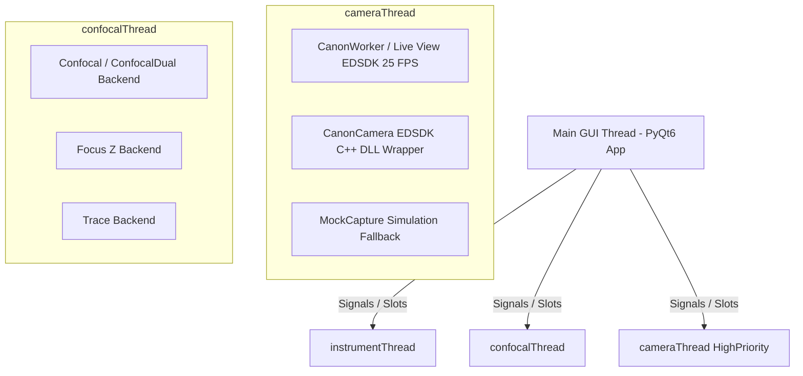

# PyPrinting 3.0 — UNSAM Nanofotónica 🔬

Plataforma modular de software de última generación desarrollada en **Python 3 / PyQt6** para **control de instrumentos, espectroscopía confocal láser, visión por computadora, microscopía contrapropagante y nanofabricación asistida por luz** (impresión óptica fototérmica de nanopartículas metálicas y ensamblado guiado de nanodímeros plasmónicos).

Esta versión (**PyPrinting 3.0**) refactoriza y moderniza por completo la arquitectura original de `printing2`:
* **Migración nativa a PyQt6**: Arquitectura basada en `QMainWindow`, `QDockWidget` y `pyqtgraph.dockarea`.
* **Microscopio Contrapropagante (`contrapropagante.py`)**: Plataforma de excitación dual con adquisición síncrona de dos confocales (TOP/BOT), mapeo dinámico de fotodiodos, modelos de ajuste diferenciados (Gauss/Donut) y cálculo vectorial de diferencia sub-nanométrica ($\mathbf{r}_{\text{TOP}} - \mathbf{r}_{\text{BOT}}$).
* **Módulo de Caracterización de PSF (`psf_analyzer.py`)**: Caracterización analítica 2D (Gaussiana de 7 parámetros y Donut $LG_{01}$), residuales, perfiles 1D y desalineación sub-nanométrica ($\Delta r_{\text{nm}}$).
* **Motor Nativo Réflex Canon EDSDK & Suite de Microfotónica (`camera.py` / `modules/camera.py`)**: Transmisión Live View a 25.0 FPS adaptativos, captura de alta resolución 15.1 MP (4752×3168) multi-formato (JPG, PNG, TIFF, BMP) sin sobreescritura, navegación panorámica por FOV, alineación de reglas H/V en µm, cursores de platina PI, medición de ángulos/distancias, ROI a confocal y ventana flotante de control de potencia Láser 532 nm (`Laser532Window`).
* **Protección de Exclusión Mutua en Hardware Real**: Bloqueo automático en `main.py` para evitar que el Microscopio Derecho y el Contrapropagante compitan simultáneamente por la platina PI E-517 o la tarjeta NI-DAQmx.
* **Modelo de Incertidumbre Metrológica (Norma ISO/GUM)**: Documentado en `reportes/Incertidumbre_Metrologica_PyPrinting3.md`, respaldando la resolución sub-píxel ($\approx 0.35\ \text{nm}$) con objetivo de agua $60\times$ $\text{NA}=1.0$, pinhole de $50\ \mu\text{m}$ y tamaño de píxel óptimo ($\Delta x \in [15, 25]\ \text{nm/px}$).
* **Modo Seguro (`SAFE_MODE`) con simulación completa de hardware**: Simulación coherente de platina piezoeléctrica PI E-517 ($0-100\ \mu\text{m}$), tarjetas NI-DAQmx y transmisión de video sintética.

---

## 📁 Árbol de Organización del Proyecto (`printing3`)

```
printing3/
├── main.py               # 🏠 LANZADOR PRINCIPAL "Bienvenidos al printing" (Grilla 3x3, Exclusión Mutua & Créditos).
├── app.py                # 🚀 MICROSCOPIO DERECHO (PyPrinting 3.0 completo). Orquestador PyQt6 y QThreads.
├── contrapropagante.py   # 🔍 MICROSCOPIO CONTRAPROPAGANTE (Excitación dual TOP/BOT, confocales síncronas).
├── camera.py             # 📷 Lanzador raíz para la Suite de Cámara Réflex Canon & Microfotónica.
├── config.py             # ⚙️ Configuración global, constantes de hardware, límites 0-100µm PI y MOCKs (SAFE_MODE).
├── psf_analyzer.py       # 🧬 Analizador de PSF 2D (Gaussiana 2D / Donut LG01, residuales, perfiles 1D y RGB).
├── requirements.txt      # 📦 Lista de dependencias de Python para producción y desarrollo.
│
├── 🎛️ Capa de Control y Adquisición
│   ├── confocal.py       # Mapeo y escaneo confocal 2D/3D (Ramp/Step en XY, XZ, YZ) con ajuste PSF.
│   ├── measurements.py   # Motor unificado de mediciones automatizadas (Grillas de Impresión y Dímeros).
│   ├── focus.py          # Estabilización activa de foco Z (autofoco dinámico por autocorrelación).
│   ├── trace.py          # Adquisición de trazas temporales de fotoluminiscencia y calibración de potencia BS.
│   ├── nanopositioning.py# Control manual y automatizado de la platina piezoeléctrica PI (0.0 a 100.0 µm XYZ).
│   └── shutters.py       # Control de obturadores digitales (Verde/Rojo/Amarillo), flipper Notch y láser 532 nm.
│
├── 👁️ Visión por Computadora y Excitación Óptica
│   ├── camera.py         # Módulo unificado (Canon EOS EDSDK / USB Mock), overlay de platina, reglas y ROI confocal.
│   ├── image_analyzer.py # Analizador gráfico de imágenes estáticas con reglas en µm/px y tracking.
│   └── canon_edsdk.py    # Wrapper nativo C/Python para Canon EDSDK v13.x (64-bit) con transferencia RAM.
│
├── 📦 Reserva Histórica y Módulos Respaldados
│   ├── reserva/canon_test_20260804.py # Resguardo de la suite de pruebas nativa de diagnostico EDSDK.
│   └── reserva/camera_20260804.py     # Resguardo de la suite previa de microfotónica.
│
├── 🔌 Capa de Abstracción de Hardware (HAL)
│   └── nidaq.py          # Abstracción unificada de National Instruments (entradas/salidas analógicas/digitales).
│
├── 📐 Librerías Matemáticas y Algoritmos
│   ├── psf.py            # Ajuste Gaussiano 2D (7 parámetros), Centro de Masa y resolución multi-partícula.
│   └── spiral.py         # Generación de matrices de escaneo helicoidal para búsqueda rápida.
│
└── 📋 Documentación y Reportes Metrológicos
    ├── README.md         # 📖 Documentación exhaustiva y fundamentos físicos/matemáticos.
    ├── MANUAL_USUARIO.md # 📘 Manual detallado de usuario, protocolos y FAQ.
    ├── WALKTHROUGH.md    # 📝 Registro continuo de cambios y validaciones.
    └── reportes/         # 📑 Informes metrológicos (Incertidumbre_Metrologica_PyPrinting3.md).
```

---

## 📸 Arquitectura y Estabilización de Cámara Canon EDSDK (`camera.py` / `canon_edsdk.py`)

Para llevar el flujo de trabajo de visión réflex a producción dentro de PyPrinting 3.0, se desarrolló y depuró inicialmente el módulo experimental `core/canon_test.py`. Tras resolver todas las restricciones del bus USB y los errores del SDK C++ de Canon, se fusionó con `modules/camera.py`.

### 1. Bucle Adaptativo Monodisparo & Regulación Estricta a 25.0 FPS
- **Warm-up Inicial de 5 Segundos**: Al conectar la cámara Canon EOS 500D por USB, el sistema aplica un bloqueo de 5 segundos en las consultas de ISO y Tv para permitir que el sensor CMOS y el chip DIGIC 4 completen la inicialización.
- **Temporización por Microsegundos (`time.perf_counter()`)**: Reemplazó los `QTimer` fijos acumulativos por un bucle monodisparo adaptativo (`_fetch_frame_adaptive`). El retardo se calcula dinámicamente en cada cuadro:
  $$\text{delay\_ms} = \max\left(1, \text{int}(40.0 - t_{\text{procesamiento\_ms}})\right)$$
  Manteniendo una velocidad constante de **25.0 FPS (40.0 ms por cuadro)** sin colapso de la cola de tramas ni aceleraciones bruscas.

### 2. Captura Fotográfica 15.1 MP Multi-Formato & Inmunidad a Sobreescritura
- **Resolución Máxima de 15.1 Megapíxeles (4752×3168)**:
  Soporta exportación en **JPG** (máxima resolución nativa), **PNG** (compresión sin pérdida), **TIFF** (metrología óptica) y **BMP** (mapa de bits sin comprimir).
- **Pausa Automática del Stream Live View**: Al obturar, la emisión de video se pausa 350 ms para liberar los recursos del procesador réflex DIGIC 4 antes de mover el espejo mecánico.
- **Transferencia a RAM mediante `EdsCreateMemoryStream` (Solución a Errores `0x000000AB` y `0x00000061`)**:
  En lugar de pedirle al SDK C++ de Canon que abra y cree archivos de disco (lo que provocaba fallos de codificación de ruta en Windows de 64 bits `0x000000AB`), los bytes de la foto se descargan directamente a la **memoria RAM** a un `MemoryStream`. Python escribe los datos al disco de forma binaria nativa (`open(path, 'wb').write(bytes)`).
- **Garantía de Nombres Únicos (`get_unique_save_path`)**:
  Cada foto se nombra con fecha y hora (`CANON_EOS500D_YYYYMMDD_HHMMSS.[ext]`). Si ya existe una foto con el mismo nombre, se añade automáticamente un contador numérico (`_01`, `_02`), impidiendo la sobreescritura accidental.

### 3. Seguridad ABI de 64 Bits & Notificación de Capacidad del Host PC
- **Tipado Estricto de Punteros `ctypes`**: Todas las llamadas C++ DLL de EDSDK tienen firmas definidas con `ctypes.c_void_p` (`EdsVolumeRef`, `EdsDirectoryItemRef`, `EdsStreamRef`), eliminando truncamientos de punteros de memoria en sistemas x64 (`OverflowError`).
- **Notificación de Capacidad Virtual (`EdsSetCapacity`)**: Antes de obturar con destino a la PC (`kEdsSaveTo_Host`), el software notifica a la cámara una capacidad virtual de 2 TB (`numberOfFreeClusters = 0x7FFFFFFF`, `bytesPerSector = 512`, `reset = 1`), asegurando que el obturador réflex se libere sin bloqueos.

### 4. Navegación Panorámica en el Campo de Visión (FOV Pan X/Y)
- **Control de Centro de ROI (`set_zoom_center(cx, cy)`)**: Al activar el zoom digital (1x, 2x, 5x, 10x), los deslizadores **Navegar FOV (Eje X)** y **Navegar FOV (Eje Y)** permiten desplazar el centro del recorte a cualquier posición del sensor de 15.1 MP.

### 5. Log de Diagnóstico EDSDK Emergente Desplegable (`EDSDKLogDialog`)
- El visor de logs y diagnósticos EDSDK se aloja en una ventana modal emergente desplegable que se abre mediante el botón `"📜 Ver Log de Diagnóstico EDSDK"`, manteniendo el panel de control limpio.

---

## ⚛️ Fundamentos Físicos y Formulación Matemática

### 1. Impresión Óptica Fototérmica de Nanopartículas
La impresión óptica consiste en la transferencia dirigida de nanopartículas coloidales metálicas (Au, Ag) desde la solución hacia un sustrato transparente (vidrio o silicio) mediante fuerzas de presión de radiación óptica y gradientes fototérmicos. Al sintonizar la excitación con la **Resonancia de Plasmón de Superficie Localizado (LSPR)**, la fuerza de gradiente óptico $\mathbf{F}_{\text{grad}}$ atrae la partícula al centro de la cintura del haz focalizado:

$$\mathbf{F}_{\text{grad}} = \frac{1}{4} \varepsilon_m \operatorname{Re}(\alpha) \nabla |\mathbf{E}|^2$$

donde $\alpha$ es la polarizabilidad de Clausius-Mossotti de la nanopartícula y $\mathbf{E}$ es el campo eléctrico óptico incidente.

### 2. Ajuste Gaussiano 2D de 7 Parámetros con Orientación ($\theta$)
Para caracterizar la función de punto de dispersión (PSF) de excitación confocal estándar (láser Gaussiano $TEM_{00}$), el sistema ajusta la distribución de intensidad normalizada $Z_n$ utilizando una Gaussiana 2D no lineal de 7 parámetros ajustada por mínimos cuadrados (`scipy.optimize.curve_fit`):

$$G(x, y) = Z_{\text{offset}} + A \cdot \exp\left( -\left[ a(x - x_0)^2 + 2b(x - x_0)(y - y_0) + c(y - y_0)^2 \right] \right)$$

donde los coeficientes espaciales orientados a un ángulo $\theta$ son:

$$a = \frac{\cos^2\theta}{2\sigma_x^2} + \frac{\sin^2\theta}{2\sigma_y^2}, \quad b = -\frac{\sin(2\theta)}{4\sigma_x^2} + \frac{\sin(2\theta)}{4\sigma_y^2}, \quad c = \frac{\sin^2\theta}{2\sigma_x^2} + \frac{\cos^2\theta}{2\sigma_y^2}$$

El Ancho Completo a la Mitad del Máximo (FWHM) para cada eje principal se determina mediante:

$$\text{FWHM}_x = 2\sqrt{2\ln 2} \cdot \sigma_x \approx 2.35482 \cdot \sigma_x, \quad \text{FWHM}_y = 2.35482 \cdot \sigma_y$$

---

## 🏗️ Arquitectura de Hilos y Concurrencia

Para garantizar una interfaz gráfica fluida a 60+ FPS sin congelamientos durante adquisiciones intensivas de datos a 1.0 MS/s o transmisiones video de cámara réflex a 25.0 FPS, la aplicación distribuye las tareas en **hilos dedicados `QThread`**:



---

## 📦 Instalación y Ejecución Rápida

### 1. Clonar Repositorio
```powershell
git clone https://github.com/joselitog1999/pyprinting_3.0.git
cd printing3
```

### 2. Crear y Activar Entorno Virtual
```powershell
python -m venv .venv
.\.venv\Scripts\Activate.ps1
```

### 3. Instalar Dependencias
```powershell
python -m pip install --upgrade pip
pip install -r requirements.txt
```

### 4. Ejecución del Sistema

* **🏠 Panel Principal de Inicio ("Bienvenidos al printing")**:
  ```powershell
  python main.py
  ```
* **📷 Cámara Live View & Suite de Microfotónica**:
  ```powershell
  python camera.py
  ```
* **🚀 Microscopio Derecho (PyPrinting 3.0)**:
  ```powershell
  python app.py
  ```

---

*PyPrinting 3.0 — Laboratorio de Nanofotónica, Universidad Nacional de San Martín (UNSAM).*
*Autor Principal: José Luis González Peñafiel (Becario Doctoral CONICET, INS-UNSAM).*
