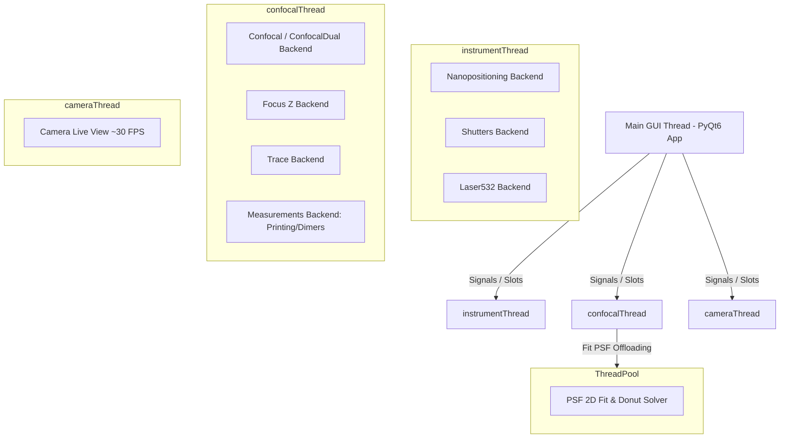
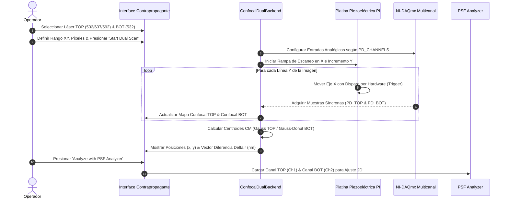

# PyPrinting 3.0 — UNSAM Nanofotónica 🔬

Plataforma modular de software de última generación desarrollada en **Python (rango compatible: >= 3.10, < 3.14 — probada en 3.10, 3.11, 3.12 y 3.13) / PyQt6** para **control de instrumentos, espectroscopía confocal láser, visión por computadora, microscopía contrapropagante y nanofabricación asistida por luz** (impresión óptica fototérmica de nanopartículas metálicas y ensamblado guiado de nanodímeros plasmónicos).

Esta versión (**PyPrinting 3.0**) refactoriza y moderniza por completo la arquitectura original de `printing2`:
* **Migración nativa a PyQt6**: Arquitectura basada en `QMainWindow`, `QDockWidget` y `pyqtgraph.dockarea`.
* **Microscopio Contrapropagante (`contrapropagante.py`)**: Plataforma de excitación dual con adquisición síncrona de dos confocales (TOP/BOT), mapeo dinámico de fotodiodos, modelos de ajuste diferenciados (Gauss/Donut) y cálculo vectorial de diferencia sub-nanométrica ($\mathbf{r}_{\text{TOP}} - \mathbf{r}_{\text{BOT}}$).
* **Módulo de Caracterización de PSF (`psf_analyzer.py`)**: Caracterización analítica 2D (Gaussiana de 7 parámetros y Donut $LG_{01}$), residuales, perfiles 1D y desalineación sub-nanométrica ($\Delta r_{\text{nm}}$).
* **Visión por computadora en tiempo real (`camera.py`)**: Control nativo de cámaras réflex Canon EOS 500D (EDSDK 64-bit) y cámaras USB OpenCV con procesamiento de imágenes, paletas LUT y tracking dinámico (`trackpy`).
* **Protección de Exclusión Mutua en Hardware Real**: Bloqueo automático en `main.py` para evitar que el Microscopio Derecho y el Contrapropagante compitan simultáneamente por la platina PI E-517 o la tarjeta NI-DAQmx.
* **Modelo de Incertidumbre Metrológica (Norma ISO/GUM)**: Documentado en `reportes/Incertidumbre_Metrologica_PyPrinting3.md`, respaldando la resolución sub-píxel ($\approx 0.35\ \text{nm}$) con objetivo de agua $60\times$ $\text{NA}=1.0$, pinhole de $50\ \mu\text{m}$ y tamaño de píxel óptimo ($\Delta x \in [15, 25]\ \text{nm/px}$).
* **Modo Seguro (`SAFE_MODE`) con simulación completa de hardware**: Simulación coherente de platina piezoeléctrica PI E-517 ($0-100\ \mu\text{m}$), tarjetas NI-DAQmx y transmisión de video sintética.

---

## 📁 Árbol de Organización del Proyecto (`printing3`)

```
printing3/
├── main.py               # 🏠 LANZADOR PRINCIPAL "Bienvenidos al printing" (Grilla 3x3, Exclusión Mutua & Créditos).
├── app.py                # 🚀 MICROSCOPIO DERECHO (PyPrinting 3.0 completo). Orquestador PyQt6 y QThreads.
├── contrapropagante.py   # 🔍 MICROSCOPIO CONTRAPROPAGANTE (Excitación dual TOP/BOT, confocales síncronas).
├── config.py             # ⚙️ Configuración global, constantes de hardware, límites 0-100µm PI y MOCKs (SAFE_MODE).
├── requirements.txt      # 📦 Lista de dependencias de Python para producción y desarrollo.
│
├── 🎛️ Módulos Principales de Medición (`modules/`)
│   ├── confocal.py       # Mapeo y escaneo confocal 2D/3D (Ramp/Step en XY, XZ, YZ) con ajuste PSF.
│   ├── measurements.py   # Motor unificado de mediciones automatizadas (Grillas de Impresión y Dímeros).
│   ├── focus.py          # Estabilización activa de foco Z (autofoco dinámico por autocorrelación).
│   ├── trace.py          # Adquisición de trazas temporales a 10 kHz y calibración de potencia BS.
│   └── camera.py         # Control de cámara réflex Canon EOS 500D (EDSDK Live View + Trackpy).
│
├── 🔌 Capa de Abstracción de Hardware y Núcleo (`core/`)
│   ├── nanopositioning.py# Control capacitivo cerrado de la platina piezoeléctrica PI E-517 (0.0 a 100.0 µm XYZ).
│   ├── shutters.py       # Control de obturadores digitales (532, 637, 592 nm), flippers y láser 532 nm.
│   ├── nidaq.py          # Abstracción unificada de tarjetas NI-DAQmx (canales analógicos y digitales).
│   └── canon_edsdk.py    # Wrapper nativo C/Python para la API Canon EDSDK (Live View 25 FPS & 15 MP).
│
├── 📐 Librerías Matemáticas y Analizadores (`analysis/` & raíz)
│   ├── psf.py            # Ajuste Gaussiano 2D (7 parámetros), Centro de Masa y resolución multi-partícula.
│   ├── spiral.py         # Generación de matrices de escaneo helicoidal para búsqueda rápida.
│   ├── image_analyzer.py # Analizador gráfico de imágenes estáticas con reglas en µm/px y tracking.
│   └── psf_analyzer.py   # Herramienta de caracterización y ajuste de PSF ópticas.
│
└── 📋 Documentación y Reportes Metrológicos
    ├── README.md         # 📖 Documentación exhaustiva y fundamentos físicos/matemáticos.
    ├── MANUAL_USUARIO.md # 📘 Manual detallado de usuario, protocolos y FAQ.
    ├── WALKTHROUGH.md    # 📝 Registro continuo de cambios y validaciones.
    └── reportes/         # 📑 Informes metrológicos y técnicos:
        ├── Incertidumbre_Metrologica_PyPrinting3.md
        ├── Algoritmo_Printing_y_Dimers_PyPrinting3.md
        ├── Arquitectura_de_Hilos_y_Concurrencia_PyPrinting3.md
        ├── Modulo_Camara_Canon_EOS500D_PyPrinting3.md
        ├── Protocolo_y_Guia_de_Impresion_de_Grillas_PyPrinting3.md
        ├── Diagnostico_de_Senales_y_Conexiones_PyPrinting3.md
        ├── Correccion_de_Deriva_Termomecanica_Drift_Correction_PyPrinting3.md
        ├── Respuestas_Graphify_y_Evaluacion_Arquitectonica_PyPrinting3.md
        ├── Deconvolucion_Richardson_Lucy_y_Trackpy_PyPrinting3.md
        ├── Informe_de_Estado_Mejoras_y_Estandares_de_Diseno_PyPrinting3.md
        └── Matriz_de_Intercambio_de_Archivos_PyPrinting3.md
```

---

## ⚛️ Fundamentos Físicos y Formulación Matemática

### 1. Impresión Óptica Fototérmica de Nanopartículas
La impresión óptica consiste en la transferencia dirigida de nanopartículas coloidales metálicas (Au, Ag) desde la solución hacia un sustrato transparente (vidrio o silicio) mediante fuerzas de presión de radiación óptica y gradientes fototérmicos. Al sintonizar la excitación con la **Resonancia de Plasmón de Superficie Localizado (LSPR)**, la fuerza de gradiente óptico $\mathbf{F}_{\text{grad}}$ atrae la partícula al centro de la cintura del haz focalizado:

$$\mathbf{F}_{\text{grad}} = \frac{1}{4} \varepsilon_m \operatorname{Re}(\alpha) \nabla |\mathbf{E}|^2$$

donde $\alpha$ es la polarizabilidad de Clausius-Mossotti de la nanopartícula y $\mathbf{E}$ es el campo eléctrico óptico incidente.

### 2. Microscopía Confocal Contrapropagante y Mapeo Dinámico Láser-Fotodiodo
El microscopio contrapropagante dispone de dos vías ópticas de excitación e iluminación síncrona:
- **Vía Superior (TOP / Derecho)**: Iluminación por objetivo superior mediante líneas láser seleccionables (Verde $532\ \text{nm}$, Rojo $637\ \text{nm}$, Amarillo $592\ \text{nm}$).
- **Vía Inferior (BOT / Invertido)**: Iluminación por objetivo de agua ($60\times$, $\text{NA}=1.0$) ubicado por debajo del cubreobjetos mediante láser verde de $532\ \text{nm}$.

Debido al sistema de espejos dicroicos y filtros notch, la lectura analógica de adquisición del fotodiodo queda vinculada directamente a la línea láser seleccionada:
$$\text{Láser } 532\ \text{nm (Verde)} \longrightarrow \text{Shutter } 12 \longrightarrow \text{Fotodiodo } 0\ (\texttt{ai0})$$
$$\text{Láser } 637\ \text{nm (Rojo)} \longrightarrow \text{Shutter } 11 \longrightarrow \text{Fotodiodo } 1\ (\texttt{ai1})$$
$$\text{Láser } 592\ \text{nm (Amarillo)} \longrightarrow \text{Shutter } 10 \longrightarrow \text{Fotodiodo } 3\ (\texttt{ai3})$$

### 3. Ajuste Gaussiano 2D de 7 Parámetros con Orientación ($\theta$)
Para caracterizar la función de punto de dispersión (PSF) de excitación confocal estándar (láser Gaussiano $TEM_{00}$), el sistema ajusta la distribución de intensidad normalizada $Z_n$ utilizando una Gaussiana 2D no lineal de 7 parámetros ajustada por mínimos cuadrados (`scipy.optimize.curve_fit`):

$$G(x, y) = Z_{\text{offset}} + A \cdot \exp\left( -\left[ a(x - x_0)^2 + 2b(x - x_0)(y - y_0) + c(y - y_0)^2 \right] \right)$$

donde los coeficientes espaciales orientados a un ángulo $\theta$ son:

$$a = \frac{\cos^2\theta}{2\sigma_x^2} + \frac{\sin^2\theta}{2\sigma_y^2}, \quad b = -\frac{\sin(2\theta)}{4\sigma_x^2} + \frac{\sin(2\theta)}{4\sigma_y^2}, \quad c = \frac{\sin^2\theta}{2\sigma_x^2} + \frac{\cos^2\theta}{2\sigma_y^2}$$

El Ancho Completo a la Mitad del Máximo (FWHM) para cada eje principal se determina mediante:

$$\text{FWHM}_x = 2\sqrt{2\ln 2} \cdot \sigma_x \approx 2.35482 \cdot \sigma_x, \quad \text{FWHM}_y = 2.35482 \cdot \sigma_y$$

### 4. Modelo Analítico de Haz Vortex / Donut ($LG_{01}$)
Para caracterizar haces de fase espiral o donas de depleción en la vía inferior BOT, el módulo modela el perfil Laguerre-Gauss $LG_{01}$:

$$I_{\text{donut}}(x, y) = Z_{\text{offset}} + A \cdot r_n^2(x, y) \cdot \exp\left( - r_n^2(x, y) \right)$$

donde la distancia radial elíptica normalizada es:

$$r_n^2(x, y) = \frac{(x - x_0)^2}{2\sigma_x^2} + \frac{(y - y_0)^2}{2\sigma_y^2}$$

### 5. Métricas de Calidad de PSF, Co-alineación y Vector de Desplazamiento
* **Desalineación espacial vectorial entre confocales TOP y BOT ($\mathbf{\Delta r}_{\text{nm}}$)**:
  $$\mathbf{\Delta r} = \mathbf{r}_{\text{TOP}} - \mathbf{r}_{\text{BOT}} = (\Delta x_{\text{nm}}, \Delta y_{\text{nm}})$$
  $$\|\mathbf{\Delta r}_{\text{nm}}\| = \sqrt{(x_{\text{TOP}} - x_{\text{BOT}})^2 + (y_{\text{TOP}} - y_{\text{BOT}})^2} \times 1000 \quad [\text{nm}]$$
* **Calidad del cero central**:
  $$Q_{\text{cero}} = \frac{I_{\min}}{I_{\max}}$$
* **Coeficiente de Correlación de Pearson ($\text{PCC}$)**:
  $$\text{PCC} = \frac{\sum_{i,j} (Z_{1,ij} - \bar{Z}_1)(Z_{2,ij} - \bar{Z}_2)}{\sqrt{\sum_{i,j} (Z_{1,ij} - \bar{Z}_1)^2 \cdot \sum_{i,j} (Z_{2,ij} - \bar{Z}_2)^2}}$$

### 6. Modelo Metrológico de Incertidumbre Sub-píxel (Norma ISO/GUM)
El sistema cumple con la estimación metrológica formal documentada en `reportes/Incertidumbre_Metrologica_PyPrinting3.md`:
$$u_c = \sqrt{u_{\text{ruido\_óptico}}^2 + u_{\text{platina\_PI}}^2 + u_{\text{desalineación\_cadena}}^2 + u_{\text{muestreo\_píxel}}^2} \approx 0.35\ \text{nm}$$
Con una incertidumbre expandida ($k=2$, $95\%$ nivel de confianza) de **$U = 0.70\ \text{nm}$**, respaldando la precisión en localización sub-nanométrica.

### 7. Criterios de Parada Adaptativos en Tiempo Real (`measurements.py`)
Para garantizar la deposición fototérmica controlada sin foto-fusión ni deposiciones múltiples, el motor de impresión evalúa en tiempo real 5 algoritmos de parada:
* **Modo 0 (Legacy Relativo)**: Salto relativo instantáneo $I_{\text{new}} / I_{\text{old}} > \text{Umbral}$.
* **Modo 1 (Relativo + Absoluto + Anti-Paso)**: Evalúa $I_{\text{new}}/I_{\text{old}} > \text{Umbral} \;\mathbf{OR}\; I_{\text{new}} > V_{\text{abs}}$ durante $N_{\text{hold}}$ pasos consecutivos (resuelve la deposición rápida a $t=0$ y filtra partículas volando).
* **Modo 2 (Derivada $dI/dt$ & Aplanamiento)**: Monitorea el aplanamiento de la curva exponencial de crecimiento fototérmico ($\frac{dI}{dt} < \text{Slope\_Flat}$).
* **Modo 3 (Confocal Raw & Rescaled)**: Calibración física automatizada del umbral en Volts a partir de la imagen confocal previa ($K_{\text{scale}} = P_{\text{print}}/P_{\text{scan}}$, $P\%$), guardando mapas reescalados `.txt` y `.tiff`.
* **Modo 4 (Híbrido Tri-Factor All-In-One)**: Evaluación simultánea del salto relativo, umbral absoluto, aplanamiento $dI/dt$ y filtro anti-paso.

---

## 🏗️ Arquitectura de Hilos y Concurrencia

Para garantizar una interfaz gráfica fluida a 60+ FPS sin congelamientos durante adquisiciones intensivas de datos a 1.0 MS/s, la aplicación distribuye las tareas en **4 hilos dedicados `QThread`** respaldados por un fondo de hilos (`ThreadPoolExecutor`):



---

## 🔄 Flujo de Trabajo Experimental: Microscopio Contrapropagante



---

## ⚡ Modos de Ejecución: Producción vs. Modo Seguro (`SAFE_MODE`)

### 🔴 Modo Producción (Hardware Real)
Conecta directamente con la platina piezoeléctrica **Physik Instrumente (PI E-517/E-736)** vía USB, la tarjeta **National Instruments (NI-DAQmx PCIe/USB-6353)** y la cámara física Canon EOS por SDK EDSDK.
```powershell
.\.venv\Scripts\python.exe app.py
```
> [!IMPORTANT]
> **Exclusión Mutua de Hardware**: En Modo Producción, `main.py` bloquea la apertura simultánea de `app.py` y `contrapropagante.py` para impedir colisiones físicas en la platina PI o en las líneas analógicas de NI-DAQ.

### 🟢 Modo Seguro (`SAFE_MODE` — Simulación de Hardware)
Permite ejecutar el $100\%$ de la aplicación gráfica, botones, ventanas y algoritmos de mediciones/impresión en cualquier computadora personal sin hardware conectado.
```powershell
$env:PYPRINTING_SAFE="1"
.\.venv\Scripts\python.exe contrapropagante.py
```

---

## 🛠️ Detalle de Módulos y Funcionalidades

### 1. Lanzador Principal (`main.py`)
- Grilla de 8 tarjetas visuales interactiva con atajos directos.
- Control global de Modo Seguro / Modo Laboratorio.
- Verificación automática de exclusión mutua de procesos de hardware.

### 2. Microscopio Contrapropagante (`contrapropagante.py`)
- **Visualización Simétrica**: Confocal TOP a la izquierda, Controles compartidos en el centro, Confocal BOT a la derecha.
- **Mapeo Dinámico de Fotodiodos**: Asignación automática de canal analógico `ai0`, `ai1` o `ai3` según la excitación láser.
- **Lector Sub-nanométrico**: Cálculo en vivo de la posición $(x, y)$ de cada confocal y del vector diferencia $\mathbf{r}_{\text{TOP}} - \mathbf{r}_{\text{BOT}}$ en nanómetros.
- **Acceso Directo a PSF Analyzer**: Botón `Analyze with PSF Analyzer` que transfiere instantáneamente ambas confocales a la suite analítica.
- **DockArea Completa**: Incorpora los paneles de Nanopositioning, Focus Z, Shutters/Flipper y Trace en la misma disposición que `app.py`.

### 3. Orquestador Microscopio Derecho (`app.py`)
- Basado en `pyqtgraph.dockarea`, con estabilización de deriva térmica (Drift dock) y control unificado.

### 4. Caracterización Avanzada de PSF (`psf_analyzer.py`)
- Ajuste analítico 2D de Gaussiana (7 parámetros) y Donut $LG_{01}$.
- Visores triples por canal (Original, Fit, Residuales) y superposición RGB falso color.

### 5. Visión por Computadora y Cámara (`camera.py` / `canon_edsdk.py`)
- Live View en tiempo real (25.0 FPS estricto), paletas LUT de falso color, tracking `trackpy`, navegación panorámica por FOV (ejes X/Y), captura réflex de 15.1 MP multi-formato (JPG, PNG, TIFF, BMP) sin sobreescritura (`get_unique_save_path`), transferencia en RAM mediante `EdsCreateMemoryStream` (inmune a errores `0x000000AB` / `0x00000061`), capa `OverlayWidget` con reglas en µm, cursor de platina PI, ROI confocal y log de diagnóstico emergente desplegable `EDSDKLogDialog`.

### 6. Rutina de Impresión Óptica y 5 Modos de Criterio de Parada (`modules/measurements.py`)
- Incorpora 5 Modos de Criterio de Parada Seleccionables en tiempo real (`Modo 0: Legacy`, `Modo 1: Salto Relativo + Absoluto & Anti-Paso`, `Modo 2: Derivada dI/dt & Aplanamiento`, `Modo 3: Calibración Confocal Raw & Umbral Absoluto Reescalado`, `Modo 4: Criterio Híbrido Tri-Factor`).
- Protección universal contra partículas "de paso" o transitorias mediante el contador de sostenimiento $N_{	ext{hold}}$ steps.
- Guardado de imágenes y matrices confocales reescaladas (`NPscan_rescaled_00i.txt` / `.tiff`).
- Documentado formalmente en el reporte técnico: [Algoritmo de Impresión Óptica y Ensamblado de Nanodímeros (reportes/Algoritmo_Printing_y_Dimers_PyPrinting3.md)](file:///c:/Users/josel/Documents/Obsidian_Vault/printing3/reportes/Algoritmo_Printing_y_Dimers_PyPrinting3.md).

---


## ⚛️ Fundamentos Físicos y Formulación Matemática

### 1. Impresión Óptica Fototérmica de Nanopartículas
La impresión óptica consiste en la transferencia dirigida de nanopartículas coloidales metálicas (Au, Ag) desde la solución hacia un sustrato transparente (vidrio o silicio) mediante fuerzas de presión de radiación óptica y gradientes fototérmicos. Al sintonizar la excitación con la **Resonancia de Plasmón de Superficie Localizado (LSPR)**, la fuerza de gradiente óptico $\mathbf{F}_{\text{grad}}$ atrae la partícula al centro de la cintura del haz focalizado:

$$\mathbf{F}_{\text{grad}} = \frac{1}{4} \varepsilon_m \operatorname{Re}(\alpha) \nabla |\mathbf{E}|^2$$

donde $\alpha$ es la polarizabilidad de Clausius-Mossotti de la nanopartícula y $\mathbf{E}$ es el campo eléctrico óptico incidente.

### 2. Microscopía Confocal Contrapropagante y Mapeo Dinámico Láser-Fotodiodo
El microscopio contrapropagante dispone de dos vías ópticas de excitación e iluminación síncrona:
- **Vía Superior (TOP / Derecho)**: Iluminación por objetivo superior mediante líneas láser seleccionables (Verde $532\ \text{nm}$, Rojo $637\ \text{nm}$, Amarillo $592\ \text{nm}$).
- **Vía Inferior (BOT / Invertido)**: Iluminación por objetivo de agua ($60\times$, $\text{NA}=1.0$) ubicado por debajo del cubreobjetos mediante láser verde de $532\ \text{nm}$.

Debido al sistema de espejos dicroicos y filtros notch, la lectura analógica de adquisición del fotodiodo queda vinculada directamente a la línea láser seleccionada:
$$\text{Láser } 532\ \text{nm (Verde)} \longrightarrow \text{Shutter } 12 \longrightarrow \text{Fotodiodo } 0\ (\texttt{ai0})$$
$$\text{Láser } 637\ \text{nm (Rojo)} \longrightarrow \text{Shutter } 11 \longrightarrow \text{Fotodiodo } 1\ (\texttt{ai1})$$
$$\text{Láser } 592\ \text{nm (Amarillo)} \longrightarrow \text{Shutter } 10 \longrightarrow \text{Fotodiodo } 3\ (\texttt{ai3})$$

### 3. Ajuste Gaussiano 2D de 7 Parámetros con Orientación ($\theta$)
Para caracterizar la función de punto de dispersión (PSF) de excitación confocal estándar (láser Gaussiano $TEM_{00}$), el sistema ajusta la distribución de intensidad normalizada $Z_n$ utilizando una Gaussiana 2D no lineal de 7 parámetros ajustada por mínimos cuadrados (`scipy.optimize.curve_fit`):

$$G(x, y) = Z_{\text{offset}} + A \cdot \exp\left( -\left[ a(x - x_0)^2 + 2b(x - x_0)(y - y_0) + c(y - y_0)^2 \right] \right)$$

donde los coeficientes espaciales orientados a un ángulo $\theta$ son:

$$a = \frac{\cos^2\theta}{2\sigma_x^2} + \frac{\sin^2\theta}{2\sigma_y^2}, \quad b = -\frac{\sin(2\theta)}{4\sigma_x^2} + \frac{\sin(2\theta)}{4\sigma_y^2}, \quad c = \frac{\sin^2\theta}{2\sigma_x^2} + \frac{\cos^2\theta}{2\sigma_y^2}$$

El Ancho Completo a la Mitad del Máximo (FWHM) para cada eje principal se determina mediante:

$$\text{FWHM}_x = 2\sqrt{2\ln 2} \cdot \sigma_x \approx 2.35482 \cdot \sigma_x, \quad \text{FWHM}_y = 2.35482 \cdot \sigma_y$$

### 4. Modelo Analítico de Haz Vortex / Donut ($LG_{01}$)
Para caracterizar haces de fase espiral o donas de depleción en la vía inferior BOT, el módulo modela el perfil Laguerre-Gauss $LG_{01}$:

$$I_{\text{donut}}(x, y) = Z_{\text{offset}} + A \cdot r_n^2(x, y) \cdot \exp\left( - r_n^2(x, y) \right)$$

donde la distancia radial elíptica normalizada es:

$$r_n^2(x, y) = \frac{(x - x_0)^2}{2\sigma_x^2} + \frac{(y - y_0)^2}{2\sigma_y^2}$$

### 5. Métricas de Calidad de PSF, Co-alineación y Vector de Desplazamiento
* **Desalineación espacial vectorial entre confocales TOP y BOT ($\mathbf{\Delta r}_{\text{nm}}$)**:
  $$\mathbf{\Delta r} = \mathbf{r}_{\text{TOP}} - \mathbf{r}_{\text{BOT}} = (\Delta x_{\text{nm}}, \Delta y_{\text{nm}})$$
  $$\|\mathbf{\Delta r}_{\text{nm}}\| = \sqrt{(x_{\text{TOP}} - x_{\text{BOT}})^2 + (y_{\text{TOP}} - y_{\text{BOT}})^2} \times 1000 \quad [\text{nm}]$$
* **Calidad del cero central**:
  $$Q_{\text{cero}} = \frac{I_{\min}}{I_{\max}}$$
* **Coeficiente de Correlación de Pearson ($\text{PCC}$)**:
  $$\text{PCC} = \frac{\sum_{i,j} (Z_{1,ij} - \bar{Z}_1)(Z_{2,ij} - \bar{Z}_2)}{\sqrt{\sum_{i,j} (Z_{1,ij} - \bar{Z}_1)^2 \cdot \sum_{i,j} (Z_{2,ij} - \bar{Z}_2)^2}}$$

### 6. Modelo Metrológico de Incertidumbre Sub-píxel (Norma ISO/GUM)
El sistema cumple con la estimación metrológica formal documentada en `reportes/Incertidumbre_Metrologica_PyPrinting3.md`:
$$u_c = \sqrt{u_{\text{ruido\_óptico}}^2 + u_{\text{platina\_PI}}^2 + u_{\text{desalineación\_cadena}}^2 + u_{\text{muestreo\_píxel}}^2} \approx 0.35\ \text{nm}$$
Con una incertidumbre expandida ($k=2$, $95\%$ nivel de confianza) de **$U = 0.70\ \text{nm}$**, respaldando la precisión en localización sub-nanométrica.

---

## 8. Constantes Clave del Sistema y Parámetros Metrológicos

La plataforma define un conjunto de constantes globales estandarizadas en `config.py` y `nidaq.py` para garantizar reproducibilidad metrológica:

| Parámetro / Constante | Valor por Defecto | Unidad | Descripción y Propósito Analítico |
|---|---|---|---|
| **`RATE_MULTICHANNEL`** | `1.0e6` ($1\text{ MS/s}$) | $\text{Hz}$ | Velocidad de muestreo agregada multicanal máxima de la tarjeta NI-DAQmx. |
| **`rate_trace`** | `10000.0` ($10\text{ kHz}$) | $\text{Hz}$ | Frecuencia de muestreo por canal analógico en la adquisición de traza continua. |
| **`N` (Bloque de Muestreo)** | `10` | Muestras | Muestras analógicas promediadas por tick de adquisición ($1\text{ ms}$ integración). |
| **Frecuencia Refresco GUI** | `100` ($10\text{ ms}$) | $\text{Hz}$ | Frecuencia de actualización síncrona en pantalla PyQt6 (`QTimer`). |
| **`PD_CHANNELS`** | `{532nm: 0, 637nm: 1, 592nm: 3, BS: 6}` | Canal `ai` | Mapeo físico de fotodiodos de emisión y Beam Splitter en la NI-DAQmx. |
| **`TRIGGER_CHANNELS`** | `{"X": 4, "Y": 5, "Z": 3}` | Canal `ai` | Mapeo analógico de canales de trigger de la platina PI E-517. |
| **`PIXEL_SIZE_UM`** | `0.059` | $\mu\text{m/px}$ | Escala espacial en el plano muestra con objetivo $100\times / 1.4\text{ NA}$. |
| **Rango de Platina PI** | `100.0` | $\mu\text{m}$ | Rango de desplazamiento piezoeléctrico capacitivo en bucle cerrado ($XYZ$). |
| **`DEFAULT_POWER_BS_SLOPE`** | `3.0` | $\text{mW/V}$ | Pendiente por defecto de calibración fotométrica en el Beam Splitter. |


