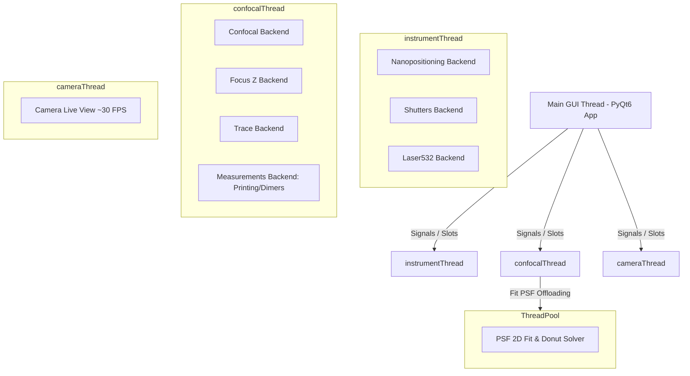
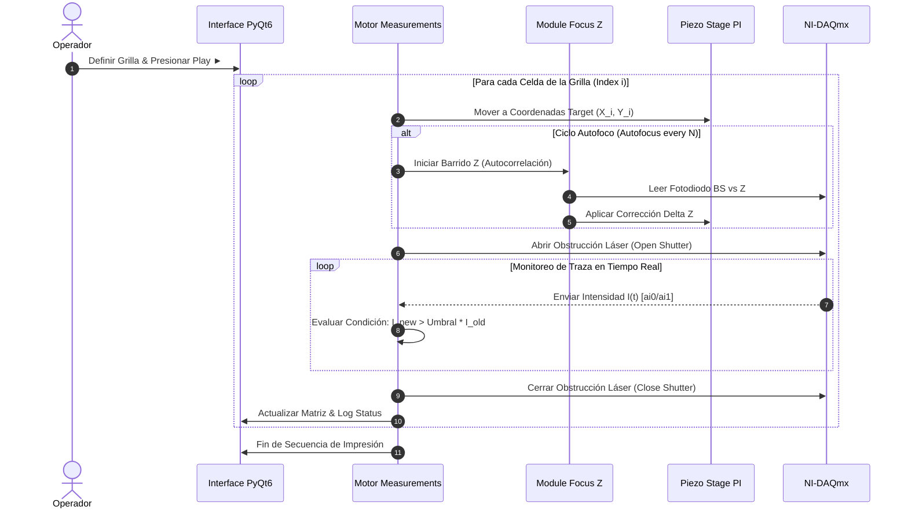

# PyPrinting 3.0 — UNSAM Nanofotónica 🔬

Plataforma modular de software de última generación desarrollada en **Python 3 / PyQt6** para **control de instrumentos, espectroscopía confocal láser, visión por computadora y nanofabricación asistida por luz** (impresión óptica fototérmica de nanopartículas metálicas y ensamblado guiado de nanodímeros plasmónicos).

Esta versión (**PyPrinting 3.0**) refactoriza y moderniza por completo la arquitectura original de `printing2`:
* **Migración nativa a PyQt6**: Arquitectura basada en `QMainWindow`, `QDockWidget` y `pyqtgraph.dockarea`.
* **Módulo de Caracterización de PSF (`psf_analyzer.py`)**: Caracterización analítica 2D (Gaussiana de 7 parámetros y Donut $LG_{01}$), residuales, perfiles 1D y desalineación sub-nanométrica ($\Delta r_{\text{nm}}$).
* **Visión por computadora en tiempo real (`camera.py`)**: Control nativo de cámaras réflex Canon EOS 500D (EDSDK 64-bit) y cámaras USB OpenCV con procesamiento de imágenes, paletas LUT y tracking dinámico (`trackpy`).
* **Modo Seguro (`SAFE_MODE`) con simulación completa de hardware**: Simulación coherente de platina piezoeléctrica PI E-517, tarjetas NI-DAQmx y transmisión de video sintética.
* **Configuración centralizada (`config.py`)**: Parametrización unificada de valores típicos (*typical values*) y desacoplamiento limpio multihilo.

El punto de entrada principal del sistema es **`app.py`**.

---

## 📁 Árbol de Organización del Proyecto (`printing3`)

```
printing3/
├── app.py                # 🚀 PUNTO DE ENTRADA PRINCIPAL. Orquestador PyQt6, GUI y gestión de QThreads.
├── config.py             # ⚙️ Configuración global, constantes de hardware, singleton PI y MOCKs (SAFE_MODE).
├── psf_analyzer.py       # 🧬 Analizador de PSF 2D (Gaussiana 2D / Donut LG01, residuales, perfiles 1D y RGB).
├── requirements.txt      # 📦 Lista de dependencias de Python para producción y desarrollo.
│
├── 🎛️ Capa de Control y Adquisición
│   ├── confocal.py       # Mapeo y escaneo confocal 2D/3D (Ramp/Step en XY, XZ, YZ) con ajuste PSF.
│   ├── measurements.py   # Motor unificado de mediciones automatizadas (Grillas de Impresión y Dímeros).
│   ├── focus.py          # Estabilización activa de foco Z (autofoco dinámico por autocorrelación).
│   ├── trace.py          # Adquisición de trazas temporales de fotoluminiscencia y calibración de potencia BS.
│   ├── nanopositioning.py# Control manual y automatizado de la platina piezoeléctrica PI (3 ejes XYZ).
│   └── shutters.py       # Control de obturadores digitales (Verde/Rojo), flipper Notch y láser 532 nm.
│
├── 👁️ Visión por Computadora y Excitación Óptica
│   ├── camera.py         # Control de cámara (Canon EOS / USB OpenCV), overlay de platina y retículo láser.
│   ├── image_analyzer.py # Analizador gráfico de imágenes estáticas con reglas en µm/px y tracking.
│   └── canon_edsdk.py    # Wrapper nativo en C/Python para Canon EDSDK v13.x (64-bit).
│
├── 🔌 Capa de Abstracción de Hardware (HAL)
│   └── nidaq.py          # Abstracción unificada de National Instruments (entradas/salidas analógicas/digitales).
│
├── 📐 Librerías Matemáticas y Algoritmos
│   ├── psf.py            # Ajuste Gaussiano 2D (7 parámetros), Centro de Masa y resolución multi-partícula.
│   └── spiral.py         # Generación de matrices de escaneo helicoidal para búsqueda rápida.
│
└── 📋 Documentación y Recursos
    ├── README.md         # 📖 Documentación exhaustiva y fundamentos físicos/matemáticos.
    ├── MANUAL_USUARIO.md # 📘 Manual detallado de usuario, protocolos y FAQ.
    ├── WALKTHROUGH.md    # 📝 Registro continuo de cambios y validaciones.
    └── CLAUDE.md         # 🧠 Guía de navegación del grafo de conocimiento.
```

---

## ⚛️ Fundamentos Físicos y Formulación Matemática

### 1. Impresión Óptica Fototérmica de Nanopartículas
La impresión óptica consiste en la transferencia dirigida de nanopartículas coloidales metálicas (Au, Ag) desde la solución hacia un sustrato transparente (vidrio o silicio) mediante fuerzas de presión de radiación óptica y gradientes fototérmicos. Al sintonizar la excitación con la **Resonancia de Plasmón de Superficie Localizado (LSPR)**, la fuerza de gradiente óptico $\mathbf{F}_{\text{grad}}$ atrae la partícula al centro de la cintura del haz focalizado:

$$\mathbf{F}_{\text{grad}} = \frac{1}{4} \varepsilon_m \operatorname{Re}(\alpha) \nabla |\mathbf{E}|^2$$

donde $\alpha$ es la polarizabilidad de Clausius-Mossotti de la nanopartícula y $\mathbf{E}$ es el campo eléctrico óptico incidentes.

### 2. Ajuste Gaussiano 2D de 7 Parámetros con Orientación ($\theta$)
Para caracterizar la función de punto de dispersión (PSF) de excitación confocal estándar (láser Gaussiano $TEM_{00}$), el sistema ajusta la distribución de intensidad normalizada $Z_n$ utilizando una Gaussiana 2D no lineal de 7 parámetros ajustada por mínimos cuadrados (`scipy.optimize.curve_fit`):

$$G(x, y) = Z_{\text{offset}} + A \cdot \exp\left( -\left[ a(x - x_0)^2 + 2b(x - x_0)(y - y_0) + c(y - y_0)^2 \right] \right)$$

donde los coeficientes espaciales orientados a un ángulo $\theta$ son:

$$a = \frac{\cos^2\theta}{2\sigma_x^2} + \frac{\sin^2\theta}{2\sigma_y^2}, \quad b = -\frac{\sin(2\theta)}{4\sigma_x^2} + \frac{\sin(2\theta)}{4\sigma_y^2}, \quad c = \frac{\sin^2\theta}{2\sigma_x^2} + \frac{\cos^2\theta}{2\sigma_y^2}$$

El Ancho Completo a la Mitad del Máximo (FWHM) para cada eje principal se determina mediante:

$$\text{FWHM}_x = 2\sqrt{2\ln 2} \cdot \sigma_x \approx 2.35482 \cdot \sigma_x, \quad \text{FWHM}_y = 2.35482 \cdot \sigma_y$$

### 3. Modelo Analítico de Haz Vortex / Donut ($LG_{01}$)
Para caracterizar haces de fase espiral o donas de depleción en microscopía STED, el módulo `psf_analyzer.py` modela el perfil Laguerre-Gauss $LG_{01}$:

$$I_{\text{donut}}(x, y) = Z_{\text{offset}} + A \cdot r_n^2(x, y) \cdot \exp\left( - r_n^2(x, y) \right)$$

donde la distancia radial elíptica normalizada es:

$$r_n^2(x, y) = \frac{(x - x_0)^2}{2\sigma_x^2} + \frac{(y - y_0)^2}{2\sigma_y^2}$$

### 4. Métricas de Calidad de PSF y Co-alineación Nanométrica
* **Calidad del cero central**:
  $$Q_{\text{cero}} = \frac{I_{\min}}{I_{\max}}$$
* **Uniformidad angular del anillo**:
  $$U_{\theta} = \frac{\sigma_{\theta}}{\bar{I}_{\text{anillo}}}$$
* **Desalineación espacial vectorial entre canales ($\Delta r_{\text{nm}}$)**:
  $$\Delta r_{\text{nm}} = \sqrt{(x_1 - x_2)^2 + (y_1 - y_2)^2} \times 1000 \quad [\text{nm}]$$
* **Coeficiente de Correlación de Pearson ($\text{PCC}$)**:
  $$\text{PCC} = \frac{\sum_{i,j} (Z_{1,ij} - \bar{Z}_1)(Z_{2,ij} - \bar{Z}_2)}{\sqrt{\sum_{i,j} (Z_{1,ij} - \bar{Z}_1)^2 \cdot \sum_{i,j} (Z_{2,ij} - \bar{Z}_2)^2}}$$
* **Error RMS & Chi-cuadrado reducido ($\chi^2_{\text{red}}$)**:
  $$\text{RMS} = \sqrt{\frac{1}{N}\sum_{i,j} \left(Z_{n,ij} - Z_{\text{fit},ij}\right)^2}, \quad \chi^2_{\text{red}} = \frac{1}{N - p} \sum_{i,j} \left(Z_{n,ij} - Z_{\text{fit},ij}\right)^2$$

### 5. Estabilización de Foco Z por Autocorrelación
La deriva térmica del eje axial Z se corrige activamente mediante la autocorrelación de la curva de fototransmisión/dispersión capturada por el fotodiodo divisor de haz (BS):

$$C_Z(\Delta z) = \frac{\sum_{i} \left[I(z_i) - \bar{I}\right]\cdot\left[I_{\text{ref}}(z_i + \Delta z) - \bar{I}_{\text{ref}}\right]}{\sigma_I \cdot \sigma_{I_{\text{ref}}}}$$

El algoritmo busca el desplazamiento $\Delta z^*$ que maximiza $C_Z(\Delta z)$ y aplica el ajuste correctivo sobre la platina piezoeléctrica PI.

---

## 🏗️ Arquitectura de Hilos y Concurrencia

Para garantizar una interfaz gráfica fluida a 60+ FPS sin congelamientos durante adquisiciones intensivas de datos a 1.0 MS/s, la aplicación distribuye las tareas en **4 hilos dedicados `QThread`** respaldados por un fondo de hilos (`ThreadPoolExecutor`):



---

## 🔄 Diagramas de Flujo de Trabajo Experimental

### 1. Protocolo de Impresión Óptica Automatizada


### 2. Caracterización en PSF Analyzer (`psf_analyzer.py`)
```mermaid
graph LR
    CargarConfocal[Cargar Confocal .tiff] --> FiltradoUmbral[Filtrado Umbral %]
    FiltradoUmbral --> SeleccionModelo{Seleccionar Modelo}
    SeleccionModelo -->|Gaussiana 2D| FitGauss[curve_fit 7 Parámetros]
    SeleccionModelo -->|Donut LG01| FitDonut[curve_fit Laguerre-Gauss]
    FitGauss --> GenResiduales[Generar Mapa |Zn - Zfit|]
    FitDonut --> GenResiduales
    GenResiduales --> RenderVistas[Renderizar Vistas Triples: Original, Fit, Residual]
    RenderVistas --> Metrics[Calcular Métricas: xo, yo, r0, θ, RMS, Chi2, R2, Δr]
    RenderVistas --> Profile1D[Generar Cortes 1D: H, V, D45, D135]
    RenderVistas --> OverlayRGB[Superposición Falso Color RGB]
```

---

## ⚡ Modos de Ejecución: Producción vs. Modo Seguro (`SAFE_MODE`)

### 🔴 Modo Producción (Hardware Real)
Conecta directamente con la platina piezoeléctrica **Physik Instrumente (PI E-517/E-736)** vía USB, la tarjeta **National Instruments (NI-DAQmx PCIe/USB-6353)** y la cámara física Canon EOS por SDK EDSDK.
```powershell
.\.venv\Scripts\python.exe app.py
```

### 🟢 Modo Seguro (`SAFE_MODE` — Simulación de Hardware)
Permite ejecutar el $100\%$ de la aplicación gráfica, botones, ventanas y algoritmos de mediciones/impresión en cualquier computadora personal sin hardware conectado.
```powershell
$env:PYPRINTING_SAFE="1"
.\.venv\Scripts\python.exe app.py
```

---

## 🛠️ Detalle de Módulos y Funcionalidades

### 1. Orquestador Principal (`app.py`)
* **Dock Layout Flexible**: Basado en `pyqtgraph.dockarea`, con guardado y restauración de geometrías personalizadas.
* **Menús Globale**:
  * `Files`: Directorios de trabajo, creación diaria (`YYYY-MM-DD`), restauración de última posición (`Last_position.txt`).
  * `Tools`: Acceso a Cámara Réflex, PSF Analyzer, Modulación Láser 532 nm y Carga de Grillas.
  * `Measurements`: Lanzamiento de módulos de Impresión Óptica y Ensamblado de Dímeros.

2. **Caracterización Avanzada de PSF (`psf_analyzer.py`)**
* **Ajuste Analítico 2D**: Modelos de Gaussiana 2D (7 parámetros) y Donut $LG_{01}$.
* **Visores Triples por Canal**: Muestra simultáneamente **Original / Filtrada**, **Modelo Ajustado (Fit)** y **Mapa de Residuales (|Zn - Zfit|)** con barras de escala Z dinámicas (`ColorBarItem`).
* **Disposición Vertical & Panel Derecho**: Confocal 1 arriba, Confocal 2 abajo, panel de métricas/perfiles/RGB a la derecha.
* **Unidades Configurables**: Conmutador dinámico de ejes entre micrómetros ($\mu\text{m}$) y píxeles ($\text{px}$).

3. **Visión por Computadora y Cámara (`camera.py` / `canon_edsdk.py`)**
* **Live View en Tiempo Real**: Flujo de video a ~30 FPS con paletas LUT (*Gris*, *Thermal*, *Viridis*, *Inferno*, *Jet*), contraste CLim y balance de blancos.
* **Tracking de Partículas**: Conteo y seguimiento dinámico mediante `trackpy` con calibración $\mu\text{m/píxel}$.
* **Disparo Réflex Native**: Fotografía de alta resolución (15 MP) descargada sin bloqueos.

4. **Escaneo Confocal 2D/3D (`confocal.py` & `psf.py`)**
* **Barridos Síncronos**: Modos `Ramp` (hardware triggered) y `Step by step`.
* **Proyecciones**: Planos $XY$, $XZ$, $YZ$.
* **Centrado Automático**: Algoritmos de Centro de Masa, Gaussiano 2D sub-píxel y Donut $LG_{01}$.

5. **Impresión Óptica y Dímeros (`measurements.py`)**
* Sequencia automatizada con compensación de deriva Z, control de obturación por salto de intensidad y pre/post barridos.

6. **Estabilización de Foco Z (`focus.py`)**
* Algoritmos de `Go to maximum`, `Lock Focus` y `Autocorrelation ×2`.

7. **Trazas Temporales y Potencia BS (`trace.py`)**
* Captura dual síncrona en tiempo real ($I_{L1} \mid I_{L2}$) y calibración de 2 puntos para el fotodiodo divisor (`PowerBSWindow`).

8. **Abstracción de Hardware DAQ (`nidaq.py`)**
* Tareas optimizadas `nidaqmx` para obturadores digitales, espejo flipper Notch y lectura analógica a **1.0 MS/s**.

---

## ⌨️ Tabla de Atajos de Teclado (Shortcuts)

| Tecla | Acción | Módulo / Dock |
|---|---|---|
| **`Ctrl + A`** | Seleccionar directorio base de trabajo | Menú principal (`Files`) |
| **`Ctrl + S`** | Crear directorio diario automático (`YYYY-MM-DD`) | Menú principal (`Files`) |
| **`Ctrl + D`** | Abrir la carpeta del directorio actual en Explorer | Menú principal (`Files`) |
| **`F1`** | Iniciar captura de Trazas dobles en tiempo real (Play) | Dock: Trace |
| **`F2`** | Detener captura de Trazas dobles y guardar datos (Stop) | Dock: Trace |
| **`F8`** | Ejecutar Autofoco Z (Go to maximum) | Dock: Focus z |
| **`F9`** | Congelar perfil de intensidad Z (Lock Focus) | Dock: Focus z |
| **`F10`** | Ejecutar corrección por autocorrelación Z ($\times 2$) | Dock: Focus z |
| **`Shift + Click/Arrastrar`** | Activar Snap magnético a partículas en análisis de imagen | Cámara / Analizador de Imágenes |

---

## ⚙️ Configuración Global (`config.py`)

Todos los parámetros por defecto (*typical values*) están centralizados en `config.py`:

```python
SAFE_MODE     = False          # True para simulación, False para laboratorio real
PI_SERIAL     = "0119048050"   # Número de serie de la platina PI E-517
PIXEL_SIZE_UM = 0.059          # Calibración µm/píxel de la cámara
CAMERA_INDEX  = 1              # Índice OpenCV de la cámara
LASER_532_CHANNEL = "Dev1/ao2" # Canal de modulación analógica del láser 532 nm

# Typical values iniciales
DEFAULT_CONFOCAL_RANGE_X = 2.0  # Rango inicial X en µm
DEFAULT_CONFOCAL_PIXELS_X = 34  # Resolución inicial X en píxeles
DEFAULT_CONFOCAL_FILTER_PERCENT = 30.0 # Umbral de corte de fondo %
```

---

## 📦 Instalación y Ejecución Rápida

### 1. Clonar Repositorio
```powershell
git clone https://github.com/joselitog1999/pyprinting_3.0.git
cd printing3
```

### 2. Crear y Activar Entorno Virtual
```powershell
python -m venv .venv
.\.venv\Scripts\Activate.ps1
```

### 3. Instalar Dependencias
```powershell
python -m pip install --upgrade pip
pip install -r requirements.txt
```

### 4. Ejecución del Sistema
* **Modo Seguro / Simulación (Sin Hardware)**:
  ```powershell
  $env:PYPRINTING_SAFE="1"; python app.py
  ```
* **Modo Laboratorio Real**:
  ```powershell
  python app.py
  ```
* **Herramientas Independientes**:
  ```powershell
  python psf_analyzer.py     # Ventana independiente PSF Analyzer
  python image_analyzer.py   # Analizador de Imágenes estáticas
  python canon_test.py       # Prueba de Cámara Réflex Canon EOS
  ```

---

*PyPrinting 3.0 — Laboratorio de Nanofotónica, Universidad Nacional de San Martín (UNSAM).*
