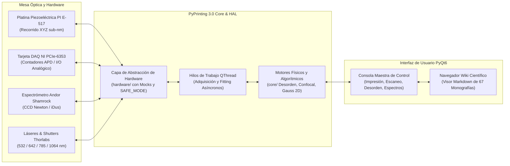

# PyPrinting 3.0 🔬
### Plataforma Modular de Nanofabricación Óptica, Microscopía Confocal y Caracterización Plasmónica
> **High-Precision Cyber-Physical Instrumentation & Analytical Crystallography for Optical Printing of Metallic Colloids & 2D Superlattices**

[](https://www.python.org/)
[](https://riverbankcomputing.com/software/pyqt/)
[](tests/)
[](#-arquitectura-del-sistema)
[](#-modos-de-ejecución-simulación-vs-laboratorio)
[](https://www.unsam.edu.ar/institutos/nanosistemas/)
[](reportes/README.md)

---

## 🏛️ Información Institucional y Autoría

* **Institución & Laboratorio:** Laboratorio de Nanofotónica — Instituto de Nanosistemas (INS - UNSAM / CONICET), Buenos Aires, Argentina.
* **Investigador Principal & Desarrollador Líder:** **Lic. José Luis González Peñafiel**  
  *Físico graduado por la Escuela Politécnica Nacional (EPN, Ecuador); Trayectoria de Posgrado en Física de la Materia Condensada en Sorbonne Université (París, Francia); Candidato a Doctor en Física por la Universidad Nacional de San Martín (UNSAM, Argentina).*
* **Directores de Investigación:** Dr. Fernando Stefani / Dr. Julián Gargiulo.
* **Proyectos Marco:**
  1. *Plasmonic Lattices of Colloidal Au Nanospheres*: Resiliencia modal, desorden estructural 2D, NUFFT bidimensional, factor de Debye-Waller analítico y transiciones topológicas tipo KTHNY.
  2. *Optical Printing & Photothermal Assembly*: Pinzas ópticas, fuerzas de esparcimiento/gradiente, termoplasmónica y química de superficies DLVO/APTES para ensamblado guiado de nanodímeros acoplados.
  3. *Dispositivo DLS Open-Source*: Caracterización fotométrica de tamaño hidrodinámico coloidal bajo norma ISO 22412 / NIST.

---

## 💡 ¿Qué es PyPrinting 3.0?

**PyPrinting 3.0** es una plataforma ciber-física modular de software e instrumentación científica de última generación desarrollada en **Python / PyQt6**. Integra en un único entorno de tiempo real el **control de instrumentos de laboratorio a escala nanométrica**, la **adquisición síncrona multicanal de fotones**, el **procesamiento espectroscópico confocal** y una suite completa de **cristalografía computacional y física del desorden en 2D**.

El sistema sustituye los antiguos scripts dispersos e instrumentación monolítica por una arquitectura robusta desacoplada en tres capas fundamentales (**HAL / Hardware**, **Core / Algoritmos Puros** y **GUI / Ergonomía Visual**), permitiendo operar tanto en la mesa óptica real del laboratorio como en modo simulación física integral sin hardware conectado.



---

## 🎯 ¿Para qué sirve? (Módulos y Aplicaciones)

PyPrinting 3.0 fue concebido para cubrir el ciclo completo de nanofabricación óptica y caracterización plasmónica:

### 1. 🖨️ Impresión Óptica Fototérmica de Nanopartículas (`MOD-06`, `MOD-07`)
* **Ensamblado Guiado por Luz**: Trampeo y deposición selectiva de nanopartículas coloidales metálicas individuales (Au, Ag de 40 a 200 nm de diámetro) sobre sustratos de vidrio funcionalizados químicamente (APTES, PDDA/PSS).
* **Fabricación de Dímeros Plasmónicos**: Posicionamiento óptico de precisión sub-100 nm para la creación de hetero-estructuras y pares acoplados con resonancias Fano y *hotspots* electromagnéticos.
* **Control en Lazo Cerrado**: Detección en milisegundos del salto fototérmico/dispersivo que indica la llegada de la partícula a la superficie, disparando el cierre inmediato del obturador láser.

### 2. 🔬 Microscopía y Espectroscopía Confocal Láser (`MOD-02`, `MOD-03`)
* **Escaneo Raster Tridimensional**: Barrido piezoeléctrico de la muestra sincronizado punto a punto con conteo de fotones de alta sensibilidad (detectores APD/PMT).
* **Ajuste Gaussiano 2D Anisotrópico**: Ajuste en tiempo real de perfiles de emisión/dispersión de 7 parámetros con orientación elipsoidal arbitraria ($\theta$) y resolución de inclinación tridimensional (*confocal tilt*).
* **Acoplamiento Espectroscópico**: Espectrometría confocal y dispersión Raman amplificada por superficie (SERS) mediante el espectrómetro Andor Shamrock 500i.

### 3. 🕸️ Cristalografía Bidimensional y Física del Desorden (`MOD-08`)
* **Análisis Topológico en Espacio Real**: Triangulación de Delaunay, diagramas de Voronoi, parámetro de orden orientacional local $\Psi_6$, función de distribución radial $g(r)$ y detección de defectos cristalográficos (dislocaciones y disclinaciones).
* **Difracción y Espacio Recíproco con NUFFT 2D**: Cálculo del factor de estructura estático $S(\mathbf{q})$ mediante transformadas de Fourier no uniformes sin necesidad de interpolar en grillas regulares.
* **Picos de Bragg Analíticos y Wilson Plot**: Extracción rigurosa del desplazamiento cuadrático medio atómico/coloidal $\langle u^2 \rangle$ y factor de Debye-Waller experimental.

### 4. 📐 Microscopía de Super-Resolución y Centroiding (`MOD-04`, `MOD-05`)
* Integración con librerías especializadas (**Picasso**, **Trackpy**) para localización sub-píxel de nanopartículas mediante ajuste MLE/Gaussiano, filtrado fotométrico multi-emisor y corrección de deriva mecánica (*drift correction*).

### 5. 🌊 Caracterización de Nanopartículas por DLS
* Medición de dispersión dinámica de luz para la determinación del radio hidrodinámico $R_H$ y polidispersidad coloidal conforme a las directrices de la norma **ISO 22412**.

### 6. 📚 Motor de Conocimiento y Wiki Científica Integrada
* Visor interactivo integrado en la propia GUI que permite a los operadores consultar en vivo **67 monografías científicas (`CAT-XXX`) y protocolos de sistema (`SYS-XXX`)**, con renderizado de ecuaciones matemáticas en LaTeX y diagramas de flujo.

---

## 🛠️ ¿Qué tecnologías y hardware utiliza?

### 🔌 Hardware Instrumental de Laboratorio Soportado
| Dispositivo / Instrumento | Fabricante / Modelo | Interfaz de Comunicación | Función en PyPrinting 3.0 |
| :--- | :--- | :--- | :--- |
| **Tarjeta DAQ Multifunción** | National Instruments PCIe-6353 / USB-6353 | `nidaqmx` (C-API nativa) | Conteo de pulsos APD, generación analógica piezo y control digital de shutters. |
| **Controlador Piezoeléctrico 3D** | Physik Instrumente (PI) E-517 / P-517.3CD | RS-232 / USB / Analógico 0–10 V | Posicionamiento nanométrico con precisión sub-manométrica en bucle cerrado (*capacitive sensors*). |
| **Espectrómetro y EMCCD** | Andor Shamrock 500i + iDus / Newton | Andor SDK (`pyAndorShamrock`, `atmcd32d`) | Espectroscopía óptica de campo oscuro, fluorescencia y dispersión Raman/SERS. |
| **Cámara Digital de Visualización** | Canon EOS 500D / CMOS Científica | Canon EDSDK / DirectShow / OpenCV | Visualización de campo amplio, seguimiento de foco macro y alineación inicial de muestras. |
| **Obturadores Láser Rápidos** | Thorlabs / Vincent Associates Uniblitz | Líneas digitales TTL (0–5 V) | Conmutación óptica ultrarrápida ($< 2\,\text{ms}$) para control fototérmico de impresión. |

### 💻 Stack de Software y Dependencias Científicas
* **Lenguaje Base**: Python `>= 3.10, < 3.14` (validado y testeado en 3.10, 3.11, 3.12 y 3.13).
* **Entorno Gráfico e Interactivo**: PyQt6, PyQtGraph (renderizado GPU por OpenGL), Matplotlib, QCustomPlot.
* **Cálculo Numérico y Optimización**: NumPy, SciPy (interpolación bivariada, optimización Levenberg-Marquardt), Numba (compilación JIT de kernels de desorden), scikit-image.
* **Librerías de Nanoscopía**: Picasso (SMLM), Trackpy (Particle tracking).
* **Almacenamiento y Gobernanza FAIR**: HDF5 (`h5py`) con esquemas jerárquicos estructurados y metadatos ISO 8601.
* **Grafo de Conocimiento**: `graphify-core` para análisis de árbol de sintaxis abstracta (AST) y navegación semántica del repositorio.

---

## 🚀 Innovaciones Tecnológicas y Científicas

1. **Guardrails Ciber-Físicos y Arquitectura Dual (`SAFE_MODE`)**:
   * Permite alternar instantáneamente entre el laboratorio real y un gemelo digital sintético (`SAFE_MODE=1`). Los límites de voltaje ($0–10\,\text{V}$) y recorrido del piezo ($0–100\,\mu\text{m}$) están físicamente protegidos por software para imposibilitar daños mecánicos.
2. **Concurrencia Asíncrona sin Congelamiento de Interfaz (`QThread`)**:
   * Aislamiento total de los hilos de adquisición de datos a alta frecuencia ($100\,\text{kS/s}$) del hilo principal de la GUI, asegurando una experiencia de usuario fluida a 60 FPS sin pérdida de muestras ni *UI freezing*.
3. **Ajuste Gaussiano 2D Anisotrópico con Corrección de Inclinación Tridimensional**:
   * Algoritmo de 7 parámetros libres capaz de resolver la orientación angular ($\theta$), la elipticidad del haz láser y desacoplar la inclinación del sustrato (*confocal tilt*) en tiempo real.
4. **Lazo Cerrado Adaptativo y Algoritmo de Rescate Difusivo (*Healing Pass*)**:
   * Protocolo automatizado que detecta anomalías en el trampeo de nanopartículas y aplica impulsos térmicos de rescate para asegurar factores de ocupación $>95\%$ en superredes periódicas.
5. **Cristalografía Bidimensional Analítica en Espacio Recíproco**:
   * Cálculo de picos de Bragg analíticos a partir de la matriz de red bidimensional sin depender de ajustes gaussianos espurios, permitiendo trazar curvas de Wilson reproducibles para extraer el desplazamiento cuadrático medio coloidal $\langle u^2 \rangle$.
6. **Ecosistema FAIR y Compendio de 67 Reportes Científicos**:
   * Toda constante, ecuación y parámetro del código cuenta con trazabilidad metrológica directa hacia las 67 monografías científicas (`CAT-XXX`) y reportes de sistema (`SYS-XXX`) incluidos en el repositorio.

---

## 🏗️ Arquitectura del Sistema

El árbol de directorios del proyecto sigue una estricta separación de responsabilidades:

```
printing3/
├── app.py                         # Lanzador maestro y orquestador principal
├── config.py                      # Tabla centralizada de constantes metrológicas y límites
├── requirements.txt               # Especificación determinista de dependencias
├── CLAUDE.md                      # Directivas de asistencia y ciclo de 4 rondas para agentes
├── METACONTEXT.md                 # Constitución operativa y manual de arquitectura para IAs y dev
│
├── core/                          # MOTORES CIENTÍFICOS Y FÍSICA PURA (Sin dependencias de GUI)
│   ├── lattice_disorder.py        # Cristalografía 2D, Voronoi, Delaunay, NUFFT, Bragg y Wilson
│   ├── confocal.py                # Algoritmos de escaneo confocal y ajuste gaussiano 2D
│   ├── printing.py                # Lógica de lazo cerrado de impresión óptica fototérmica
│   └── dls.py                     # Algoritmos de autocorrelación y tamaño hidrodinámico
│
├── gui/                           # INTERFAZ DE USUARIO (PyQt6 / PyQtGraph / Matplotlib)
│   ├── main_gui.py                # Ventana principal y ruteo de señales
│   ├── lattice_disorder_gui.py    # Controlador visual de análisis de desorden 2D
│   ├── wiki_browser.py            # Visor interactivo de reportes científicos Markdown
│   └── components/                # Widgets reutilizables, plots reactivos y diálogos
│
├── hardware/                      # CAPA DE ABSTRACCIÓN DE INSTRUMENTACIÓN (HAL)
│   ├── ni_daq.py                  # Driver para tarjetas National Instruments DAQmx
│   ├── piezo.py                   # Driver para platina piezoeléctrica Physik Instrumente E-517
│   ├── spectrometer.py           # Driver para Andor Shamrock 500i / EMCCD
│   └── camera_driver.py           # Driver para Canon EOS y cámaras CMOS
│
├── docs/                          # MANUALES DE USUARIO Y GUÍAS DE MÓDULOS
│   ├── MANUAL_USUARIO.md          # Manual unificado de operación de la plataforma
│   └── modulos/                   # MOD-01 a MOD-08 (guías operativas por módulo)
│
├── reportes/                      # SEGUNDO CEREBRO CIENTÍFICO (67 Monografías Peer-Reviewed)
│   ├── README.md                  # Índice y MOC general de la Wiki
│   ├── cientificos/               # CAT-001 a CAT-403 (Fundamentos teóricos y ecuaciones)
│   └── sistema/                   # SYS-001 a SYS-021 (Protocolos de calibración de hardware)
│
├── tests/                         # SUITE DE PRUEBAS AUTOMATIZADAS (Pytest)
│   ├── test_lattice_disorder.py
│   ├── test_lattice_disorder_ux_physics.py
│   └── test_wiki_browser.py
│
└── reserva/                       # ARCHIVO HISTÓRICO Y PRESERVACIÓN
    └── README_historico.md        # Copia íntegra preservada del README fundacional
```

---

## ⚡ Instalación y Guía Rápida (Quickstart)

### 1. Clonar el Repositorio
```bash
git clone https://github.com/joselitog1999/pyprinting_3.0.git
cd pyprinting_3.0
```

### 2. Configurar el Entorno Virtual (Recomendado: Python 3.11 o 3.12)
**Usando Conda:**
```bash
conda create -n pyprinting python=3.12 -y
conda activate pyprinting
pip install -r requirements.txt
```

**O usando `venv`:**
```bash
python -m venv .venv
# En Windows:
.venv\Scripts\activate
# En Linux/macOS:
source .venv/bin/activate
pip install -r requirements.txt
```

### 3. Modos de Ejecución: Simulación vs Laboratorio

#### 🟢 Modo Seguro / Simulación (`SAFE_MODE=1` — Sin Hardware Conectado)
Ideal para desarrollo, pruebas de algoritmos, análisis de datos y exploración de la interfaz:
```powershell
# En PowerShell (Windows):
$env:SAFE_MODE="1"; python app.py

# En Bash (Linux):
SAFE_MODE=1 python app.py
```

#### 🔴 Modo Laboratorio Real (`SAFE_MODE=0` — Mesa Óptica de Nanofabricación)
Exclusivo para la computadora conectada a la mesa óptica con instrumentos encendidos:
```powershell
$env:SAFE_MODE="0"; python app.py
```

### 4. Ejecutar la Batería de Pruebas
```bash
pytest tests/test_lattice_disorder.py tests/test_lattice_disorder_ux_physics.py tests/test_wiki_browser.py -v
```

---

## 🤖 Guía para Desarrolladores y Agentes de Inteligencia Artificial

Si eres un desarrollador que se incorpora al laboratorio o un agente de IA (Antigravity, Claude, Copilot), consulta los siguientes documentos de gobernanza:

* 📖 **[`METACONTEXT.md`](METACONTEXT.md)**: **Constitución Operativa y Manual de Arquitectura**. Contiene las 8 Filosofías Fundamentales del Conocimiento, la directiva inviolable de Preservación Absoluta, el protocolo de guardrails de hardware, el desacoplamiento de hilos Qt y la política de Cero Alucinación Metrológica.
* 🔄 **[`CLAUDE.md`](CLAUDE.md)**: **Protocolo de Deliberación de 4 Rondas**. Guía paso a paso para la implementación deliberativa de código:
  * *Ronda 1*: Exploración y alineación conceptual.
  * *Ronda 2*: Arquitectura técnica y motor analítico puro.
  * *Ronda 3*: Ergonomía de GUI, interactividad y matriz de parámetros.
  * *Ronda 4*: Reconciliación de contratos, implementación y calidad.
* 🌐 **[`reportes/README.md`](reportes/README.md)**: Catálogo y MOC de la Wiki Científica con 67 reportes analíticos (`CAT-XXX` y `SYS-XXX`).

---

## 📝 Cita y Referencia Académica

Si utilizas PyPrinting 3.0, sus algoritmos de cristalografía 2D o sus módulos de control de hardware en trabajos de investigación, tesis o publicaciones científicas, por favor cita:

```bibtex
@software{gonzalez_penafiel_pyprinting_2026,
  author       = {González Peñafiel, José Luis and Gargiulo, Julián and Stefani, Fernando},
  title        = {{PyPrinting 3.0: Modular Platform for Optical Printing, Confocal Nanoscopy, and 2D Plasmonic Lattice Disorder Analysis}},
  month        = sep,
  year         = 2026,
  publisher    = {Laboratorio de Nanofotónica, Instituto de Nanosistemas (INS - UNSAM / CONICET)},
  url          = {https://github.com/joselitog1999/pyprinting_3.0}
}
```

---

## 📄 Licencia y Reconocimientos

* **Licencia**: Código y algoritmos desarrollados con fines académicos y científicos. Consulta los términos de uso en la institución.
* **Agradecimientos**: Al Instituto de Nanosistemas (INS - UNSAM), al Consejo Nacional de Investigaciones Científicas y Técnicas (CONICET) de Argentina, a la Escuela Politécnica Nacional (EPN) de Ecuador y a Sorbonne Université.
