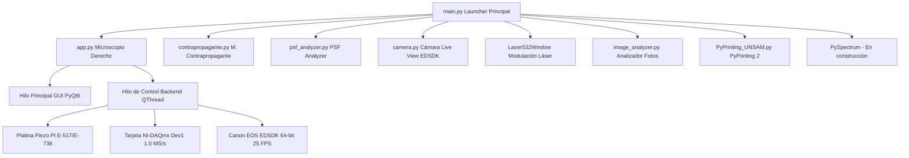

# Manual de Usuario Exhaustivo: PyPrinting 3.0 🔬
**Suite de Control, Espectroscopía Confocal, Caracterización de PSF y Nanofabricación Óptica**
*Laboratorio de Nanofotónica — Instituto de Nanosistemas (INS-UNSAM)*
*Autor Principal: José Luis González Peñafiel (Becario Doctoral CONICET)*

---

> [!TIP]
> 📂 **Documentación Modular Detallada**: Para consultar la ficha técnica, maqueta visual y especificación de controles I/O de cada módulo por separado, visitá la carpeta [**`docs/modulos/` (Índice de Módulos)**](file:///c:/Users/josel/Documents/Obsidian_Vault/printing3/docs/modulos/README.md).

## 📖 Índice General

0. [Compendio Teórico: Física de Pinzas Ópticas, Nanomateriales y Optical Printing](file:///c:/Users/josel/Documents/Obsidian_Vault/printing3/docs/modulos/00_Fundamentos_Fisicos_Optical_Printing_y_Nanomateriales.md)
1. [Panel de Inicio Principal (`main.py` — "Bienvenidos al printing")](#1-panel-de-inicio-principal-mainpy--bienvenidos-al-printing)
   - [1.1 Visión General, Filosofía de Diseño y Arquitectura Multihilo](#11-visión-general-filosofía-de-diseño-y-arquitectura-multihilo)
   - [1.2 Selección Global de Modo Seguro (`SAFE_MODE`) vs. Modo Laboratorio Real](#12-selección-global-de-modo-seguro-safe_mode-vs-modo-laboratorio-real)
   - [1.3 Navegación e Índice de Módulos en Grilla Simétrica $3 \times 3$](#13-navegación-e-índice-de-módulos-en-grilla-simétrica-3-times-3)
2. [Fundamentos Físicos, Formulación Matemática & Mapeo de Hardware](#2-fundamentos-físicos-formulación-matemática--mapeo-de-hardware)
   - [2.1 Impresión Óptica Fototérmica de Nanopartículas Coloidales](#21-impresión-óptica-fototérmica-de-nanopartículas-coloidales)
   - [2.2 Ensamblado Guiado de Nanodímeros Plasmónicos y Campo Cercano](#22-ensamblado-guiado-de-nanodímeros-plasmónicos-y-campo-cercano)
   - [2.3 Modelo Analítico Gaussiano 2D Anisotrópico de 7 Parámetros](#23-modelo-analítico-gaussiano-2d-anisotrópico-de-7-parámetros)
   - [2.4 Modelo Analítico Haz Vortex / Donut (Laguerre-Gauss $LG_{01}$)](#24-modelo-analítico-haz-vortex--donut-laguerre-gauss-lg_01)
   - [2.5 Métricas Analíticas y Alineación Sub-nanométrica de PSF](#25-métricas-analíticas-y-alineación-sub-nanométrica-de-psf)
   - [2.6 Operación de Umbralización No Lineal de Ruido ($P\%$)](#26-operación-de-umbralización-no-lineal-de-ruido-p)
   - [2.7 Algoritmo de Estabilización Z Axial por Autocorrelación de Pearson](#27-algoritmo-de-estabilización-z-axial-por-autocorrelación-de-pearson)
   - [2.8 Mapeo Físico de Coordenadas y Calibración de Platina Piezoeléctrica PI](#28-mapeo-físico-de-coordenadas-y-calibración-de-platina-piezoeléctrica-pi)
   - [2.9 Formulación Matemática y Análisis de los 5 Criterios de Parada (Modos 0 a 4)](#29-formulación-matemática-y-análisis-de-los-5-criterios-de-parada-modos-0-a-4)
   - [2.10 Control Adaptativo de Deriva Termomecánica ($\vec{v}_{\text{drift}}$) y Estimador de Tiempo Restante (ETA)](#210-control-adaptativo-de-deriva-termomecánica-vecv_textdrift-y-estimador-de-tiempo-restante-eta)
3. [Módulo 1: Microscopio Derecho (`app.py` — PyPrinting 3.0 Suite Completa)](#3-módulo-1-microscopio-derecho-apppy--pyprinting-30-suite-completa)
   - [3.1 Menú Principal (`Files`, `Tools`, `Measurements`, `Help`)](#31-menú-principal-files-tools-measurements-help)
   - [3.2 Dock: Confocal (Mapeo 2D/3D & Algoritmos de Centrado)](#32-dock-confocal-mapeo-2d3d--algoritmos-de-centrado)
   - [3.3 Dock: Trace (Trazas Temporales & Calibración Power BS)](#33-dock-trace-trazas-temporales--calibración-power-bs)
   - [3.4 Dock: Focus z (Autofoco Axial Dinámico)](#34-dock-focus-z-autofoco-axial-dinámico)
   - [3.5 Dock: Shutters / Flipper / Láser 532](#35-dock-shutters--flipper--láser-532)
   - [3.6 Dock: Nanopositioning (Platina Piezoeléctrica PI)](#36-dock-nanopositioning-platina-piezoeléctrica-pi)
   - [3.7 Ventana de Mediciones (Printing Automatizado de Grillas & Dímeros)](#37-ventana-de-mediciones-printing-automatizado-de-grillas--dímeros)
4. [Módulo 2: PySpectrum 3.0 (`pyspectrum.py` — Espectroscopía, Step & Glue y Mapeo Hiperespectral)](#4-módulo-2-pyspectrum-30-pyspectrumpy--espectroscopía-step--glue-y-mapeo-hiperespectral)
5. [Módulo 3: Microscopio Contrapropagante (`contrapropagante.py`)](#5-módulo-3-microscopio-contrapropagante-contrapropagantepy)
6. [Módulo 4: PyPrinting 2 (Legacy — `PyPrinting_UNSAM.py`)](#6-módulo-4-pyprinting-2-legacy--pyprinting_unsampy)
7. [Módulo 5: Cámara Live View (`camera.py` — Suite Canon EDSDK & Microfotónica)](#7-módulo-5-cámara-live-view-camerapy--suite-canon-edsdk--microfotónica)
8. [Módulo 6: Modulación Láser 532 nm (`Laser532Window`)](#8-módulo-6-modulación-láser-532-nm-laser532window)
9. [Módulo 7: PSF Analyzer (`psf_analyzer.py`)](#9-módulo-7-psf-analyzer-psf_analyzerpy)
10. [Módulo 8: Analizador de Imágenes Estáticas (`image_analyzer.py`)](#10-módulo-8-analizador-de-imágenes-estáticas-image_analyzerpy)
11. [Módulo 13: Suite de Análisis Espectral y Quimiometría Raman (`raman_analyzer.py`)](#11-módulo-13-suite-de-análisis-espectral-y-quimiometría-raman-raman_analyzerpy)
12. [Módulo 9: Documentación y Créditos del Autor](#12-módulo-9-documentación-y-créditos-del-autor)
13. [Módulo 11: Diseñador Universal de Redes Cristalinas 2D (`grid_generator.py`)](#13-módulo-11-diseñador-universal-de-redes-cristalinas-2d-grid_generatorpy)
14. [Módulo 12: Procedimientos Operativos Estandarizados (SOP) y Protocolos Paso a Paso](#14-módulo-12-procedimientos-operativos-estandarizados-sop-y-protocolos-paso-a-paso)
14. [Tabla Completa de Parámetros Globales (`config.py`)](#14-tabla-completa-de-parámetros-globales-configpy)
15. [Modelo Metrológico de Incertidumbre y Criterios Sub-píxel (Norma ISO/GUM)](#15-modelo-metrológico-de-incertidumbre-y-criterios-sub-píxel-norma-isogum)
16. [Protección de Exclusión Mutua en Hardware Real (Modo Laboratorio)](#16-protección-de-exclusión-mutua-en-hardware-real-modo-laboratorio)
17. [Tabla de Atajos de Teclado (Shortcuts)](#17-tabla-de-atajos-de-teclado-shortcuts)
18. [Guía de Resolución de Problemas y Diagnóstico (Troubleshooting)](#18-guía-de-resolución-de-problemas-y-diagnóstico-troubleshooting)
19. [Preguntas Frecuentes (FAQ)](#19-preguntas-frecuentes-faq)
20. [Guía de Referencia de Archivos y Reportes Metrológicos](#20-guía-de-referencia-de-archivos-y-reportes-metrológicos)

---

## 1. Panel de Inicio Principal (`main.py` — "Bienvenidos al printing")

### 1.1 Visión General, Filosofía de Diseño y Arquitectura Multihilo
La suite **PyPrinting 3.0** está construida sobre una arquitectura modular desacoplada basada en **Python 3 / PyQt6** y **`pyqtgraph`**. Para evitar cuelgues de la interfaz gráfica durante operaciones de hardware de alta frecuencia (como el escaneo por rampa a $10\ \text{kHz}$ o la transmisión de video réflex), la aplicación utiliza un patrón **Frontend / Backend** con hilos dedicados (`QThread` y `moveToThread`).



---

### 1.2 Selección Global de Modo Seguro (`SAFE_MODE`) vs. Modo Laboratorio Real
En la barra superior del panel principal **`main.py`** se encuentra el selector interactivo **`Modo Seguro (Simulación)`**:

* **Modo Seguro Activado (`PYPRINTING_SAFE=1`)**:
  - Habilita la Capa de Abstracción de Hardware Mock (`nidaq._MockNITask` y `_MockPIStage`).
  - Genera ruido gaussiano síncrono con pulsos sintéticos de trigger para simular perfiles confocales 2D/3D y trazas temporales.
  - Habilita una cámara sintética basada en patrones fotónicos móviles para probar la interfaz gráfica sin instrumentos físicos.
* **Modo Laboratorio Real (`PYPRINTING_SAFE=0`)**:
  - Inicializa la comunicación por socket C/DLL con la controladora PI E-517/E-736.
  - Conecta la tarjeta **National Instruments PCIe-6323 / USB-6343** (Dispositivo `Dev1`).
  - Abre la sesión nativa **Canon EDSDK v13.x** para la cámara réflex.

---

### 1.3 Navegación e Índice de Módulos en Grilla Simétrica $3 \times 3$
El lanzador organiza los 9 módulos del laboratorio en una grilla simétrica de 3 filas y 3 columnas:

```
┌─────────────────────────┬─────────────────────────┬─────────────────────────┐
│ 🔬 Fila 1 - Columna 1   │ 🔮 Fila 1 - Columna 2   │ 🔍 Fila 1 - Columna 3   │
│ Microscopio Derecho     │ PySpectrum              │ Microscopio             │
│ (app.py)                │ (En desarrollo)         │ Contrapropagante (Const)│
├─────────────────────────┼─────────────────────────┼─────────────────────────┤
│ 🏛️ Fila 2 - Columna 1   │ 📷 Fila 2 - Columna 2   │ ⚡ Fila 2 - Columna 3   │
│ PyPrinting 2 (Legacy)   │ Cámara Live View        │ Modulación Láser        │
│ (PyPrinting_UNSAM.py)   │ (camera.py)             │ 532 nm (Laser532Window) │
├─────────────────────────┼─────────────────────────┼─────────────────────────┤
│ 🧬 Fila 3 - Columna 1   │ 🖼️ Fila 3 - Columna 2   │ 📚 Fila 3 - Columna 3   │
│ PSF Analyzer            │ Analizador de Imágenes  │ Documentación           │
│ (psf_analyzer.py)       │ (image_analyzer.py)     │ y Créditos del Autor    │
└─────────────────────────┴─────────────────────────┴─────────────────────────┘
```

---

## 2. Fundamentos Físicos, Formulación Matemática & Mapeo de Hardware

### 2.1 Impresión Óptica Fototérmica de Nanopartículas Coloidales
La **impresión óptica** logra la deposición espacial dirigida de nanopartículas coloidales metálicas (Au, Ag) desde una solución líquida sobre sustratos transparentes (vidrio o silicio). La interacción electromagnética está dominada por la fuerza de gradiente óptico $\mathbf{F}_{\text{grad}}$ y la fuerza de dispersión/absorción $\mathbf{F}_{\text{scat}}$:

$$\mathbf{F}_{\text{grad}} = \frac{1}{4} \varepsilon_m \operatorname{Re}(\alpha) \nabla |\mathbf{E}|^2$$

$$\mathbf{F}_{\text{scat}} = \frac{k^4}{6\pi} |\alpha|^2 \frac{n_m}{c} \mathbf{S}$$

donde $\alpha$ es la polarizabilidad de Clausius-Mossotti dada por:

$$\alpha = 3 V \frac{\varepsilon_p - \varepsilon_m}{\varepsilon_p + 2\varepsilon_m}$$

Al sintonizar la longitud de onda de excitación con la **Resonancia de Plasmón de Superficie Localizado (LSPR)** del oro ($\approx 532\ \text{nm}$), $\operatorname{Re}(\alpha)$ se maximiza, atrayendo fuertemente la nanopartícula hacia el punto de máxima intensidad en el centro de la cintura del haz focalizado ($\nabla |\mathbf{E}|^2$).

---

### 2.2 Ensamblado Guiado de Nanodímeros Plasmónicos y Campo Cercano
La fabricación de **nanodímeros plasmónicos** consiste en posicionar una segunda nanopartícula a una distancia gap sub-100 nm de una primera partícula previamente depositada. Al aproximarse a distancias nanométricas, el acoplamiento de campo cercano modifica la polarizabilidad efectiva $\alpha_{\text{eff}}$, creando un punto caliente plasmónico (*hot-spot*) que amplifica exponencialmente la intensidad Raman (SERS):

$$\mathbf{E}_{\text{local}} \propto \left( \frac{d}{r} \right)^{-3} \mathbf{E}_0$$

```
[Partícula 1 Deposita] ──> [Escaneo Confocal Local] ──> [Fit Gaussiano (x1, y1)] ──> [Offset Δx, Δy] ──> [Deposición Partícula 2]
```

---

### 2.3 Modelo Analítico Gaussiano 2D Anisotrópico de 7 Parámetros
Para caracterizar la distribución de intensidad fototérmica o de fluorescencia en el plano focal horizontal ($XY$), el sistema ajusta una Gaussiana 2D elíptica inclinada en un ángulo $\theta$ mediante mínimos cuadrados no lineales (`scipy.optimize.curve_fit`):

$$G(x, y) = Z_{\text{offset}} + A \cdot \exp\left( -\left[ a(x - x_0)^2 + 2b(x - x_0)(y - y_0) + c(y - y_0)^2 \right] \right)$$

Los coeficientes de la matriz cuadrática de rotación son:

$$a = \frac{\cos^2\theta}{2\sigma_x^2} + \frac{\sin^2\theta}{2\sigma_y^2}, \quad b = -\frac{\sin(2\theta)}{4\sigma_x^2} + \frac{\sin(2\theta)}{4\sigma_y^2}, \quad c = \frac{\sin^2\theta}{2\sigma_x^2} + \frac{\cos^2\theta}{2\sigma_y^2}$$

El Ancho Completo a la Mitad del Máximo (FWHM) a lo largo de los ejes principales de la elipse se calcula mediante:

$$\text{FWHM}_x = 2\sqrt{2\ln 2} \cdot \sigma_x \approx 2.354820 \cdot \sigma_x, \quad \text{FWHM}_y = 2.354820 \cdot \sigma_y$$

---

### 2.4 Modelo Analítico Haz Vortex / Donut (Laguerre-Gauss $LG_{01}$)
Para caracterizar haces con singularidad de fase espiral ($e^{i l \phi}$) o donas de depleción en nanoscopía STED, el módulo **PSF Analyzer** y el widget **Confocal** ajustan la distribución analítica Laguerre-Gauss de primer orden $LG_{01}$:

$$I_{\text{donut}}(x, y) = Z_{\text{offset}} + A \cdot r_n^2(x, y) \cdot \exp\left( - r_n^2(x, y) \right)$$

donde la distancia radial elíptica normalizada $r_n^2$ está definida por:

$$r_n^2(x, y) = \frac{(x - x_0)^2}{2\sigma_x^2} + \frac{(y - y_0)^2}{2\sigma_y^2}$$

---

### 2.5 Métricas Analíticas y Alineación Sub-nanométrica de PSF
El módulo **PSF Analyzer** computa cuantitativamente la calidad analítica de la PSF y la desalineación espacial entre el canal de excitación verde (Canal 1) y el donut rojo de depleción (Canal 2):

1. **Desalineación Vectorial Dual ($\Delta r_{\text{nm}}$)**:
   $$\Delta r_{\text{nm}} = \sqrt{(x_1 - x_2)^2 + (y_1 - y_2)^2} \times 1000 \quad [\text{nm}]$$
2. **Radio del Anillo Donut ($r_0$)**:
   $$r_0 = \sqrt{\sigma_x \cdot \sigma_y} \quad [\mu\text{m}]$$
3. **Elipticidad del Donut ($a/b$)**:
   $$\text{Elipticidad} = \frac{\sigma_x}{\sigma_y} \quad (\text{o viceversa si } \sigma_y > \sigma_x)$$
4. **Calidad del Cero Central ($I_{\min}/I_{\max}$)**: Intensidad residual en el nulo central dividida por la intensidad de pico del anillo. Un valor $<0.05$ representa un nulo óptico de alta calidad.
5. **Uniformidad Angular ($\sigma_{\theta}/\bar{I}$)**: Desviación estándar de la intensidad tomada circularmente a lo largo del anillo dividida por la intensidad media del anillo.
6. **Bondad de Ajuste Statistic ( $R^2$, $\text{RMS}$ y $\chi^2_{\text{red}}$ )**:
   $$R^2 = 1 - \frac{\sum (Z_i - Z_{\text{fit}, i})^2}{\sum (Z_i - \bar{Z})^2}, \quad \text{RMS} = \sqrt{\frac{1}{N} \sum_{i=1}^N (Z_i - Z_{\text{fit}, i})^2}$$

---

### 2.6 Operación de Umbralización No Lineal de Ruido ($P\%$)
El casillero **`Filtro (%)`** aplica un operador no lineal por corte de umbral sobre la matriz normalizada $Z_n \in [0.0, 1.0]$:

$$Z_f[x, y] = \begin{cases} Z_n[x, y] & \text{si } Z_n[x, y] \ge \frac{P}{100} \\ 0.0 & \text{si } Z_n[x, y] < \frac{P}{100} \end{cases}$$

---

### 2.7 Algoritmo de Estabilización Z Axial por Autocorrelación de Pearson
Para corregir la deriva térmica del plano de enfoque axial ($Z$), el sistema adquiere un perfil de intensidad $I(z)$ y calcula el coeficiente de correlación cruzada normalizado de Pearson respecto a la firma congelada de referencia $I_{\text{ref}}(z)$:

$$r(z) = \frac{\sum (I(z) - \bar{I})(I_{\text{ref}}(z) - \bar{I}_{\text{ref}})}{\sqrt{\sum (I(z) - \bar{I})^2 \sum (I_{\text{ref}}(z) - \bar{I}_{\text{ref}})^2}}$$

---

### 2.8 Mapeo Físico de Coordenadas y Calibración de Platina Piezoeléctrica PI
Mapeo de transformación de ejes espaciales entre la imagen de cámara réflex y el movimiento físico de la platina PI E-517 ($0.0 - 100.0\ \mu\text{m}$):
- **Cámara Hacia la DERECHA ($+X_{\text{cam}}$)** $\longrightarrow$ **Platina $+Y_{\text{PI}}$**
- **Cámara Hacia ABAJO ($+Y_{\text{cam}}$)** $\longrightarrow$ **Platina $+X_{\text{PI}}$**
- **Eje Axial Óptico ($Z_{\text{óptico}}$)** $\longrightarrow$ **Platina $+Z_{\text{PI}}$**

---

### 2.9 Formulación Matemática y Análisis de los 5 Criterios de Parada (Modos 0 a 4)
En la impresión óptica fototérmica y el ensamblado de nanodímeros plasmónicos, el cierre oportuno del obturador es crítico para detener la irradiación de forma inmediata al detectar la deposición de una nanopartícula metálica. Esto evita el sobrecalentamiento local, la fusión fototérmica del nanoensamblado y la deposición no deseada de partículas secundarias. **PyPrinting 3.0** incluye 5 criterios de parada seleccionables dinámicamente en la interfaz de mediciones (`measurements.py` / `app.py`):

1. **Modo 0: Legacy (Salto Relativo Estándar)**
   - **Formulación Matemática**:
     $$I_{\text{new}}[t] > \text{Umbral\_Relativo} \cdot I_{\text{old}}$$
   - **Propósito & Utilidad**: Mantiene $100\%$ de compatibilidad retroactiva con rutinas históricas y secuencias estándar de PyPrinting 2.
   - **Mapeo de Parámetros**: Requiere ingresar el `Umbral` relativo (ej. $1.20$ indica un $20\%$ de incremento sobre la línea base).

2. **Modo 1: Salto Relativo + Umbral Absoluto (V) & Anti-Paso ($N_{\text{hold}}$ Steps)**
   - **Formulación Matemática**:
     $$\text{Condición}(t) = \left( \frac{I_{\text{new}}[t]}{I_{\text{old}}} > \text{Umbral\_Relativo} \right) \quad \mathbf{OR} \quad \left( I_{\text{new}}[t] > V_{\text{abs}} \right)$$
     $$\text{Cierre Obturador} \iff \text{Condición}(t) = \text{True} \quad \forall t \in [t_0, t_0 + N_{\text{hold}} \cdot \Delta t]$$
   - **Propósito & Utilidad**:
     - *Resolución a $t=0$*: Elimina el problema de la impresión instantánea donde $I_{\text{old}}$ ya inicia en un nivel alto y el salto relativo resulta insuficiente para disparar la parada.
     - *Filtro Anti-Paso*: Evita cierres falsos del obturador provocados por partículas que cruzan transitoriamente el foco volando sin depositarse.
   - **Mapeo de Parámetros**: Requiere `Umbral Absoluto (V)` ($V_{\text{abs}}$) y `N_hold` (número de muestras analógicas consecutivas a $1\text{ kHz}$ en las que debe sostenerse la señal, ej. $N_{\text{hold}}=5$).

3. **Modo 2: Derivada Temporal Adaptativa & Aplanamiento ($dI/dt$)**
   - **Formulación Matemática**:
     Derivada temporal discreta filtrada en tiempo real:
     $$\frac{dI}{dt}[t] = \frac{I[t] - I[t - 5\Delta t]}{5\Delta t} \quad [\text{V/s}]$$
     $$\text{Cierre Obturador} \iff \left( \frac{dI}{dt}[t] < \text{Slope\_Flat} \right) \quad \mathbf{AND} \quad \left( I_{\text{new}}[t] > I_{\text{old}} + \Delta V \right)$$
   - **Propósito & Utilidad**: Diseñado para perfiles de deposición continua con crecimiento exponencial $I(t) = I_0 + A(1 - e^{-t/\tau})$. Evalúa la meseta superior de la curva y gatilla el cierre una vez que la tasa de incremento se aplana ($\frac{dI}{dt} \to 0$), indicando que la partícula ha finalizado su acomodamiento físico en el sustrato.
   - **Mapeo de Parámetros**: Requiere `Slope Min` (pendiente mínima de activación en V/s) y `Slope Flat` (derivada máxima permitida en la meseta para confirmar la deposición).

4. **Modo 3: Calibración Confocal Raw & Umbral Absoluto Reescalado ($K_{\text{scale}}, P\%$)**
   - **Formulación Matemática**:
     Cálculo físico automatizado del voltaje de umbral objetivo a partir de la imagen confocal previa:
     1. Fondo de vidrio limpio: $V_{\text{vidrio}} = \min(V_{\text{raw}})$
     2. Factor de escala de potencia: $K_{\text{scale}} = \frac{P_{\text{print}}}{P_{\text{scan}}}$
     3. Voltaje pico reescalado: $V_{\text{pico\_reescalado}} = V_{\text{vidrio}} + K_{\text{scale}} \cdot (V_{\text{pico\_raw}} - V_{\text{vidrio}})$
     4. Voltaje de umbral objetivo: $V_{\text{umbral}} = V_{\text{vidrio}} + \frac{P\%}{100} \cdot (V_{\text{pico\_reescalado}} - V_{\text{vidrio}})$
   - **Propósito & Utilidad**: Automatiza metrológicamente el cálculo del voltaje absoluto en Volts eliminando la estimación manual por parte del operador. Relaciona directamente la intensidad detectada en el barrido confocal ($P_{\text{scan}}$) con la potencia de impresión ($P_{\text{print}}$).
   - **Información y Archivos Adicionales**: Genera y guarda automáticamente en disco el mapa confocal reescalado en formatos `.txt` y `.tiff` (`NPscan_rescaled_00i.txt` y `NPscan_rescaled_00i.tiff`).
   - **Mapeo de Parámetros**: Requiere `Ratio K` ($P_{\text{print}}/P_{\text{scan}}$) y `Umbral Porcentual P%` (ej. $50.0\%$).

5. **Modo 4: Criterio Híbrido Tri-Factor (All-In-One)**
   - **Formulación Matemática**:
     $$\text{Cierre Obturador} \iff \left[ \text{Modo 1 (Salto/Absoluto)} \;\mathbf{AND}\; \text{Modo 2 (Aplanamiento } dI/dt) \right] \quad \text{sostenido durante } N_{\text{hold}} \text{ pasos}$$
   - **Propósito & Utilidad**: Máxima robustez experimental para muestras complejas o bajas relaciones señal-ruido. Combina la protección anti-paso, la detección instantánea a $t=0$, el umbral absoluto en Volts y la verificación de aplanamiento de derivada temporal.
   - **Mapeo de Parámetros**: Utiliza la combinación total de parámetros (`Umbral`, `V_abs`, `N_hold`, `Slope_Flat`, `Ratio_K`, `P%`).

---

### 2.10 Control Adaptativo de Deriva Termomecánica ($\vec{v}_{\text{drift}}$) y Estimador de Tiempo Restante (ETA)

Durante la nanofabricación prolongada de grillas de gran escala ($N > 50$ partículas), la dilatación térmica de la celda de fluido y la relajación de esfuerzos mecánicos generan una **deriva lateral y axial continua** ($\sim 0.5 - 5\ \text{nm}/\text{min}$).

#### 1. Estimación Temporal de Velocidad de Deriva ($\vec{v}_{\text{drift}}$):
Tras cada ciclo de re-cuadratura sobre la Partícula Ancla $P_0$ en el tiempo $t_k$, el sistema registra la desviación espacial $(\Delta x_k, \Delta y_k)$ respecto a la posición nominal inicial $(x_0, y_0)$:

$$\vec{v}_{\text{drift}}(t_k) = \frac{(\Delta x_k - \Delta x_{k-1}, \Delta y_k - \Delta y_{k-1})}{t_k - t_{k-1}}$$

#### 2. Periodo de Corrección Adaptativo ($T_{\text{drift}}$):
Si la velocidad de deriva excede el límite de tolerancia de posicionamiento $\epsilon_{\text{tol}} \approx 10\ \text{nm}$, el sistema recalcula dinámicamente el intervalo de tiempo seguro entre re-centrados:

$$T_{\text{drift}} = \max\left( T_{\text{min}}, \min\left( T_{\text{max}}, \frac{\epsilon_{\text{tol}}}{|\vec{v}_{\text{drift}}|} \right) \right)$$

#### 3. Estimador Predictivo de Tiempo Restante (ETA):
Frente al indicador de *Total Targets*, la suite calcula en tiempo real el tiempo estimado para finalizar la nanofabricación:

$$\text{ETA}(k) = \bar{t}_{\text{raw}} \cdot (N_{\text{total}} - k) + N_{\text{drift\_checks\_rem}} \cdot t_{\text{confocal\_scan}}$$

donde $\bar{t}_{\text{raw}}$ es la media móvil del tiempo de tránsito/fijación de las partículas previas (tomando $15.0\ \text{s}$ por defecto al inicio) y $k$ es el índice de partícula actual.

---

## 3. Módulo 1: Microscopio Derecho (`app.py` — PyPrinting 3.0 Suite Completa)

### 3.1 Menú Principal (`Files`, `Tools`, `Measurements`, `Help`)
* **Menú `Files`**:
  - `Select Base Path (Ctrl+A)`: Selecciona la carpeta raíz de trabajo.
  - `Create Daily Dir (Ctrl+S)`: Crea automáticamente la subcarpeta del día (`YYYY-MM-DD`).
  - `Open Working Directory (Ctrl+D)`: Abre la carpeta actual en el Explorador de Windows.
* **Menú `Tools`**:
  - `Tablero de Conexiones (Ctrl+H)`: Matriz interactiva de estado y seguridad I/O de instrumentos.
  - `Diseñador de Redes 2D (Ctrl+G)`: Síntesis de redes cristalinas 2D (Bravais, Moiré, Grafeno, Kagome), máscaras por figuras geométricas y cuadratura con Partícula Ancla $P_0$.
  - Acceso directo a la ventana de `Cámara`, `Analizador de Imágenes`, `PSF Analyzer` y `Modulación Láser 532 nm`.
* **Menú `Measurements`**:
  - `Printing`: Abre la ventana de impresión automatizada de grillas.
  - `Dimers`: Abre la ventana de ensamblado guiado de dímeros plasmónicos.

---

### 3.2 Dock: Confocal (Mapeo 2D/3D & Algoritmos de Centrado)
| Control | Tipo | Rango / Opciones | Descripción |
|---|---|---|---|
| **`Laser`** | `QComboBox` | `532 nm`, `637 nm`, `592 nm` | Línea de excitación láser para la iluminación confocal. |
| **`Range x / y`** | `QDoubleSpinBox` | $0.100 - 100.000\ \mu\text{m}$ | Dimensión física del área cuadrada/rectangular a escanear. |
| **`Pixels x / y`** | `QSpinBox` | $10 - 500$ | Resolución en píxeles de la matriz de adquisición confocal. |
| **`Scan mode`** | `QComboBox` | `Ramp`, `Step by step` | `Ramp`: Lectura síncrona continua a $10\ \text{kHz}$ por hardware NI-DAQ. `Step`: Paso a paso por software. |
| **`Scan projection`**| `QComboBox` | `x/y`, `x/z`, `y/z` | Plano ortogonal de escaneo confocal. |
| **`Scan Image`** | `QComboBox` | `NPs maximum`, `NPs minimum` | `NPs maximum`: Partículas brillantes (fluorescencia/scattering). `NPs minimum`: Partículas oscuras (absorción). |
| **`method_center`** | `QComboBox` | `center of mass`, `center of gauss`, `two NP: center of gauss`, `donut (Laguerre-Gauss)` | Algoritmo de centrado analítico para calcular la posición de la partícula. |
| **`Auto CM`** | `QCheckBox` | `True` / `False` | Si está marcado, desplaza automáticamente la platina PI al centro calculado tras finalizar el escaneo. |
| **`Filtro (%)`** | `QLineEdit` | $0.0 - 99.0\%$ | Porcentaje de umbral de filtrado de ruido para la eliminación de fondo. |
| **`Start Scan`** | `QPushButton` | Exec | Inicia la rutina de escaneo confocal síncrono. |

---

### 3.3 Dock: Trace (Trazas Temporales & Calibración Power BS)
* **Monitoreo de Fotoluminiscencia**:
  - Graficado temporal continuo de intensidad en Volts ($V$) emitidos por los fotodiodos.
  - Tecla **F1**: Inicia la adquisición continua (*Play*).
  - Tecla **F2**: Detiene la adquisición y guarda la traza en disco (*Stop & Save*).
* **Ventana `PowerBSWindow`**:
  - Monitoreo continuo de la potencia reflejada en el fotodiodo divisor (*Beam Splitter*).
  - Permite ingresar lecturas de potencia comercial (`High power`, `Low power`) y ejecutar **`Set Calibration`** para obtener la constante de conversión en $\text{mW/V}$.

---

### 3.4 Dock: Focus z (Autofoco Axial Dinámico)
| Control | Tecla | Función |
|---|---|---|
| **`Go to maximum`** | **F8** | Ejecuta un barrido axial rápido en Z y desplaza el piezo al pico de máxima intensidad. |
| **`Lock Focus`** | **F9** | Registra y congela el perfil $I_{\text{ref}}(z)$ como referencia de enfoque. |
| **`Autocorrelation ×2`**| **F10** | Ejecuta la correlación de Pearson y corrige la deriva axial en Z. |

---

### 3.5 Dock: Shutters / Flipper / Láser 532
* **`Shutter 532 nm`**: Abre/Cierra el obturador del láser verde.
* **`Shutter 637 nm`**: Abre/Cierra el obturador del láser rojo.
* **`Shutter 592 nm`**: Abre/Cierra el obturador del láser amarillo.
* **`Low power`**: Activa el atenuador óptico de baja potencia.
* **`Mirror up / down`**: Sube o baja el espejo del filtro Notch de 532 nm (*Flipper*).
* **`Láser 532 Voltage`**: Ajusta el voltaje analógico DAC ($1.0 - 5.0\ \text{V}$).

---

### 3.6 Dock: Nanopositioning (Platina Piezoeléctrica PI)
* Muestra la lectura continua en micrómetros ($X, Y, Z$) de los sensores capacitivos en bucle cerrado de la platina PI E-517/E-727.
* Botones de incremento relativo ($\pm 0.1\ \mu\text{m}$, $\pm 1.0\ \mu\text{m}$, $\pm 10.0\ \mu\text{m}$).
* **Telemetría y Estado Físico en Tiempo Real**:
  - `🟢 PI Física (SN: 0119048050)`: La controladora física responde activamente mediante health-check periódico `qIDN()`.
  - `🟡 Modo Virtual (Desconectada)`: Advierte explícitamente si el hardware está apagado o desconectado, imprimiendo en consola `[PI VIRTUAL] MOV ...` para no confundir desplazamientos numéricos de GUI con movimiento mecánico real.
  - **Botón `🔌 Reconectar` Directo**: Permite inicializar la conexión física en caliente tras encender la controladora E-517 en la mesa óptica, sin necesidad de reiniciar la aplicación ni perder el plano focal ni el origen de coordenadas.
* **Perfil de Conexión de Inicio (`pyprinting`)**:
  - Al abrir `PyPrinting 3.0` (`app.py`), el sistema aísla el bus USB activando únicamente la **Platina PI** y la **Tarjeta NI-DAQmx**. Los periféricos pesados (cámara réflex Canon y espectrómetros Andor) se mantienen desconectados por defecto y en espera de activación bajo demanda, garantizando un arranque ultrarrápido y previniendo colisiones de puertos USB.

---

### 3.7 Ventana de Mediciones (Printing Automatizado de Grillas & Dímeros)

La ventana emergente de **Mediciones** (`measurements.py`) coordina la impresión automatizada nodo a nodo de arrays de nanopartículas y el ensamblado de nanoestructuras acopladas.

> [!NOTE]
> Para consultar el protocolo experimental completo paso a paso ("DO PRINTING") y la guía detallada de operación, remítase al reporte especializado:  
> [Guía y Protocolo de Impresión de Grillas (reportes/Protocolo_y_Guia_de_Impresion_de_Grillas_PyPrinting3.md)](file:///c:/Users/josel/Documents/Obsidian_Vault/printing3/reportes/Protocolo_y_Guia_de_Impresion_de_Grillas_PyPrinting3.md)

#### 3.7.1 Controles Principales de `Printing` y `Dimers`
- **`Custom Name` (Nombre Personalizado de Lote)**: Casilla interactiva de texto para asignar un nombre descriptivo a la subcarpeta del lote y a los reportes de optimización (ej. `AuNP_60nm_BatchA`). Si se deja vacía, se utiliza automáticamente el nombre de la grilla (`<GridName>`, ej. `5x5_drift_5.0umx5.0um`).
- **`Create Grid`**: Configura la matriz simétrica definiendo número de partículas por columna (`NPs/col`), número de columnas (`Cols`), espaciamiento entre nanopartículas (`Dist NP µm`) y espaciamiento entre columnas (`Dist Col µm`).
- **`Load Grid`**: Carga una matriz de posiciones personalizadas $(X, Y)$ desde un archivo de texto plano `.txt`.
- **`Set reference`**: Captura la posición actual de los sensores capacitivos de la platina PI como origen absoluto de la grilla $(X_0, Y_0, Z_0)$ y cambia a color verde de confirmación.
- **`Go to reference`**: Retorna inmediatamente la platina a las coordenadas origen.
- **`Reset all 🔄`**: Restablecimiento atómico completo que devuelve el origen a $\text{NaN}$, limpia acumuladores de deriva lateral y axial, reinicia el botón de referencia a naranja, vacía la casilla de nombre custom y restablece la grilla interactiva.
- **`Display 2D del Patrón & Camino (`Grid Pattern & Path Viewer 🗺️`)**:
  - **Dock Desplegable Integrado**: Previsualización gráfica 2D de la matriz completa ajustada a la orientación del sistema cartesiano físico del microscopio (rotado $90^\circ$ a la derecha: eje $+X$ hacia abajo, eje $+Y$ a la derecha):
    - ⚪ **Pendiente** (Gris): Nodos futuros.
    - 🟡 **En Proceso** (Amarillo brillante pulsante): Nodo activo en impresión o autofoco.
    - 🟢 **Impresa** (Verde esmeralda): Nanopartícula impresa con éxito.
    - 🔴 **Timeout** (Rojo carmesí): Nodo donde expiró $T_{\text{max}}$.
  - **Camino del Microscopio**: Línea de trayectoria punteada que muestra el recorrido secuencial de la platina PI.
  - **Controles Interactivos**:
    - `[ 🏷️ Números ]`: Muestra u oculta los números de los nodos.
    - `[ 🛤️ Camino ]`: Muestra u oculta la línea de trayectoria.
    - `[ 🎯 Reset View ]`: Auto-centrado y ajuste de escala 1:1.
    - **Click en Nodo**: Al presionar cualquier partícula en la gráfica 2D, el casillero `Target Index` se actualiza inmediatamente a ese nodo.
- **`Barra de Progreso`**: Indicador gráfico (`QProgressBar`) del avance porcentual del lote ($i / N_{\text{total}}$).
- **`T max (s)`**: Tiempo máximo de residencia por nodo (segundos) antes de abortar por tiempo agotado (*timeout*) si no se gatilla la condición de parada.
  - *Fundamento Físico (Tesis Gargiulo 2017, Cap. 3)*: A concentraciones coloidales nominales ($C \sim 5 \times 10^9\ \text{NP/mL}$), el tiempo medio de arribo por difusión browniana de Smoluchowski es $\langle \tau_{\text{wait}} \rangle = (4\pi D C R_{\text{cap}})^{-1} \approx 8.9\ \text{s}$. Un valor de $T_{\text{max}} = 20.0\ \text{s}$ cubre el $89\%$ de la distribución acumulada de Poisson, evitando tiempos muertos prolongados y derivando los nodos rezagados al *Healing Pass*.
- **`N hold steps` (Filtro Anti-Partículas de Paso)**:
  - Exige que la señal de fotodiodo se mantenga por encima de la condición de detección durante $N$ lecturas consecutivas ($\sim 30 - 50\ \text{ms}$ para $N=5$).
  - Si una nanopartícula en suspensión browniana solo cruza el haz de forma transitoria (duración $\sim 10\ \text{ms}$), el contador `hold_counter` se reinicia inmediatamente a 0, evitando el cierre erróneo del obturador en falsos positivos.
- **`Steps before / after`**:
  - `Steps before`: Muestras analógicas adquiridas antes de abrir el obturador para calcular la línea base $I_{\text{old}}$.
  - `Steps after`: Muestras adicionales adquiridas inmediatamente después del cierre del obturador para registrar la meseta post-impresión.
- **`Protocolo de Doble Autofoco con Desplazamiento Seguro`**:
  - **Etapa 1/4**: Desplazamiento a zona limpia desplazada $(-1, -1)\ \mu\text{m}$ de la Partícula Ancla $P_0$ $\rightarrow$ Autofoco axial 1 a baja potencia.
  - **Etapa 2/4**: Microescaneo confocal 2D de $P_0$ a baja potencia $\rightarrow$ Cálculo del centro de masa y deriva lateral $(\Delta x, \Delta y)$.
  - **Etapa 3/4**: Retorno al sitio del nodo $i$ compensado + $(\text{shift}_x, \text{shift}_y)$ $\rightarrow$ Autofoco in-situ (Autofoco 2) en zona limpia contigua.
  - **Etapa 4/4**: Conmutación estricta a alta potencia (`down_flipper()`) $\rightarrow$ Apertura de obturador y adquisición de la traza fototérmica.
- **`Tracking Multimodal y Control Adaptativo`**:
  - **`Track Drift XY?`**: Registra la deriva lateral en cada nodo, genera `drift_tracking_xy.txt` (con columna de velocidad $V_{xy}\ \text{nm/s}$) y abre la ventana 2D interactiva `DriftTrackingDialog` (guardando `drift_map.png` con promedios $\langle v_{xy} \rangle, \langle v_z \rangle$).
  - **`Track Drift Z?`**: Registra la deriva axial tras cada autofoco y genera `drift_tracking_z.txt` (con columna de velocidad $V_z\ \text{nm/s}$).
  - **`Adaptive AF? 🧠` (Control Adaptativo en Lazo Cerrado)**:
    - Sintoniza dinámicamente el intervalo efectivo de partículas entre autofocos $N_{\text{eff}} = \text{clamp}(\lfloor \tau_{\text{safe}} / \langle t_{\text{node}} \rangle \rfloor, 1, 15)$ según la velocidad instantánea de deriva $v_{\text{eff}} = \max(v_{xy}, v_z)$.
    - Implementa **disparo dual (híbrido)**: activa el ciclo de foco/deriva si se supera el conteo $N_{\text{eff}}$ O si el tiempo transcurrido excede $\tau_{\text{safe}} = \delta_{\text{tol}} / v_{\text{eff}}$.
  - **`Drift Tol (nm)`**: Tolerancia espacial máxima deseada antes de forzar una corrección (por defecto $25.0\ \text{nm}$).
  - **Telemetría Cinética (`v_drift_label`)**: Muestra en vivo la velocidad instantánea estimada y el $N_{\text{eff}}$ activo (`v_xy:..|v_z:.. nm/s | N_eff:..`).
  - **`Track Time-Volt?`**: Al concluir la grilla, ajusta la función salto en todas las trazas fototérmicas ($V_{\text{low}}, V_{\text{high}}, \Delta V, t_{\text{step}}, t_{\text{raw}}, \Delta t$), despliega la ventana interactiva de 3 paneles con histogramas (`TimeVoltTrackingDialog`), auto-exporta `time_volt_distributions.png` y genera el informe **`reporte_parametros_<nombre_red>.txt`** conteniendo la **Sección 4 de Cinética de Deriva y Recomendaciones de $N_{\text{sugerido}}$**.
  - **`Time Remaining ⏱️ (ETA Dinámico)`**:
    - Indicador en tiempo real que estima el tiempo restante para concluir el lote.
    - **Valor Inicial ($i=0$)**: Asume $\tau_0 = 15.0\ \text{s}$ por partícula ($\text{ETA}_0 = N_{\text{totales}} \times 15.0\ \text{s}$).
    - **Actualización Dinámica**: Con cada partícula procesada, calcula el promedio acumulado real $\langle t_{\text{raw}} \rangle$ y actualiza $\text{ETA} = N_{\text{restantes}} \times \langle t_{\text{raw}} \rangle$.
    - **Finalización**: Muestra `Completado 🎉` al finalizar la última partícula.
  - **Llenado Dinámico de `NP events` y `NP success`**: Actualización en tiempo real y post-procesamiento del porcentaje de partículas impresas con éxito ($N_{\text{éxito}} / N_{\text{totales}}\ [\%]$) y exportación directa en `grid_info.txt`.

#### 3.7.2 Pestaña `Dimers` (Ensamblado Guiado de Nanodímeros Plasmónicos)
- Permite la fabricación guiada de nanodímeros con separación interpartícula (*gap*) sub-100 nm.
- Incorpora opciones para activar **Pre-Scan Confocal** (escaneo 2D de la nanopartícula 1 antes de imprimir la nanopartícula 2) y **Post-Scan Confocal** (escaneo de verificación final del dímero formado).
- **`dx / dy (µm)`**: Vector de desplazamiento offset deseado para la colocación de la segunda nanopartícula respecto al centro ajustado de la primera.
- **Regla de Polarización Óptica (Tesis Gargiulo Cap. 6 & Martínez Cap. 4)**:
  - Para gaps ultra-estrechos ($s < 15\ \text{nm}$), alinear el vector de polarización del láser ($\mathbf{E}$) en forma paralela al eje del dímero $(\mathbf{E} \parallel \hat{\mathbf{r}}_{AB})$. La interacción dipolo-dipolo resultante genera una **fuerza óptica atractiva mutua** que facilita el confinamiento nanométrico de la segunda partícula.
  - La polarización perpendicular $(\mathbf{E} \perp \hat{\mathbf{r}}_{AB})$ genera fuerzas repulsivas que dispersan lateralmente a la segunda partícula.

#### 3.7.3 Configuración de los 5 Criterios de Parada Seleccionables
El menú desplegable **`Criterio Parada`** permite seleccionar dinámicamente el algoritmo de interrupción en tiempo real:

| Modo Seleccionable | Nombre en Interfaz | Parámetros que Habilita en la UI | Archivos e Información Generados |
|---|---|---|---|
| **Modo 0** | `Legacy (Relativo)` | `Umbral` (salto relativo, ej. 1.20) | Trazas de intensidad `.txt` en la carpeta del lote (`NP_001.txt`). |
| **Modo 1** | `Relativo + Absoluto + AntiPaso` | `Umbral`, `Umbral Absoluto (V)`, `N_hold` (pasos anti-paso) | Traza temporal con confirmación de $N_{\text{hold}}$ pasos sostenidos. |
| **Modo 2** | `Derivada dI/dt (Aplanamiento)` | `Slope Min (V/s)`, `Slope Flat (V/s)`, `V_abs` | Registro de derivada instantánea $dI/dt$ y meseta detectada. |
| **Modo 3** | `Confocal Raw & Rescaled` | `Ratio K (P_print/P_scan)`, `Umbral P%` (ej. 50%) | Mapas confocales reescalados `NPscan_rescaled_00i.txt` y `NPscan_rescaled_00i.tiff`. |
| **Modo 4** | `Híbrido Tri-Factor (All-In-One)` | `Umbral`, `V_abs`, `N_hold`, `Slope_Flat`, `Ratio_K`, `P%` | Log integral de triple verificación y resumen de parada. |

#### 3.7.4 Flujo de Datos, Salida en Disco y Contenedor Científico HDF5 (`.h5`)

PyPrinting 3.0 implementa una **arquitectura híbrida inteligente** de almacenamiento que optimiza el espacio y la trazabilidad metrológica sin perjudicar la inmediatez de la inspección experimental:

##### 1. Eventos Stand-Alone / Exploratorios (Fuera del Contenedor):
Las acciones libres y de calibración rápida se almacenan **directamente como archivos tradicionales sueltos**:
- **Escaneo Confocal Manual (Dock Confocal)**: Genera `confocal_scan_YYYYMMDD_HHMMSS.tiff` (abrible con doble click en ImageJ / Fiji).
- **Osciloscopio / Traza Libre (Dock Trace)**: Genera `trace_free_YYYYMMDD_HHMMSS.txt` (importable en Origin / Excel).
- **Fotografía de Cámara Réflex (Live View)**: Genera `Canon_IMG_YYYYMMDD_HHMMSS.jpg` / `.cr2`.
- **Espectro Manual (PySpectrum)**: Genera `spectrum_raw_YYYYMMDD_HHMMSS.csv`.

##### 2. Lotes Estructurados (Dentro del Contenedor HDF5):
Al iniciar una rutina automatizada con el botón **`Play ►`** (`Printing` o `Dimers`):
1. Se crea la subcarpeta del lote: `YYYYMMDD-HHMMSS_Printing_<CustomName>` o `YYYYMMDD-HHMMSS_Dimers_<CustomName>`.
2. Se genera el **Contenedor Científico Unificado `YYYYMMDD-HHMMSS_Printing_<CustomName>.h5`** conteniendo:
   - `/metadata`: Metadatos globales inalterables (láser, umbrales, sustrato, coloide, operario).
   - `/recipe`: Coordenadas teóricas y Partícula Ancla $P_0$.
   - `/telemetry`: Tablas de deriva lateral $X-Y$ (`drift_xy`), axial $Z$ (`drift_z`) y estadísticas `time_volt_stats`.
   - `/nodes/node_00i`: Datasets individuales de traza fototérmica $10\ \text{kHz}$ (`photothermal_trace`), mapas confocales (`confocal_scan`) y parámetros de ajuste.
3. Se conservan como respaldo local los archivos `NP_00i.txt`, `NPscan_00i.tiff`, `drift_tracking_xy.txt`, `drift_tracking_z.txt`, `drift_map.png` y el informe estadístico `reporte_parametros_<nombre_red>.txt`.
4. El botón **`Save Grid Info`** exporta `grid_info.txt` con la metainformación del lote.

##### 3. Desempaquetador 1-Click (`unpack_to_legacy`):
Al finalizar el lote, el diálogo emergente ofrece el botón **`📦 Desempaquetar HDF5`**, que en $< 1\ \text{s}$ extrae todos los datasets del archivo `.h5` a carpetas estándar para su procesamiento por colaboradores externos que no dispongan de herramientas HDF5.

> [!NOTE]
> Para consultar el informe técnico completo sobre compresión *lossless* `shuffle+gzip` y benchmarks de velocidad, consulte:  
> [Contenedor Científico HDF5 (reportes/cientificos/Contenedor_Cientifico_HDF5_PyPrinting3.md)](file:///c:/Users/josel/Documents/Obsidian_Vault/printing3/reportes/cientificos/Contenedor_Cientifico_HDF5_PyPrinting3.md)

#### 3.8 Tablero de Conexiones & Seguridad de Hardware (`HardwareDashboardWindow`, `HardwareDashboardWidget` & `HardwareManager`)
El **Tablero de Conexiones y Seguridad de Hardware** constituye el centro neurálgico de telemetría y aislamiento del sistema. Se encuentra configurado como una **ventana independiente flotante** (`HardwareDashboardWindow`) accesible desde:
1. **Lanzador Principal (`main.py`)**: Tarjeta activa **`🛡️ Tablero de Conexiones`** (Fila 1, Columna 2).
2. **Microscopio Derecho (`app.py`)**: Menú **`Tools → Tablero de Conexiones`** (`Ctrl+H`) y menú **`Docks`**.
3. **Microscopio Contrapropagante (`contrapropagante.py`)**: Menú **`Tools → Tablero de Conexiones`** (`Ctrl+H`) y menú **`Docks`**.

- **Matriz de Estado LED por Instrumento**:
  - 🟢 **Verde (Conectado)**: Dispositivo físico detectado, inicializado y respondiendo nominalmente (NI-DAQmx Dev1, PI Piezo E-517/E-727, Cámara Thorlabs/USB, Láser 532 nm).
  - 🟡 **Amarillo (Simulado)**: Dispositivo operando en modo Mock transparente bajo `SAFE_MODE`.
  - 🔴 **Rojo (Error / Desconectado)**: Fallo de puerto USB/GPIB o ausencia de comunicación.
  - ⚪ **Gris (Inactivo)**: Dispositivo presente pero deshabilitado temporalmente.
- **Canal de Espectrómetro Inactivo**:
  - Siguiendo la especificación del laboratorio, el canal del espectrómetro se encuentra registrado como `⚪ Inactivo — Pendiente de integración con PySpectrum`, con sus casilleros de interacción bloqueados hasta la incorporación oficial de la suite `PySpectrum`.
- **Aislamiento por Software (*Soft Disconnect / Mock Isolation*)**:
  - Cada instrumento cuenta con una casilla de verificación individual (*Soft Isolation*). Al marcar un equipo, el sistema interrumpe la comunicación física e ingresa en un estado de simulación local sin detener el resto de los hilos de adquisición ni congelar la GUI.
- **Bitácora I/O en Tiempo Real y Re-scan en Caliente**:
  - Consola gráfica de registros con marcas de tiempo (`HH:MM:SS.mmm`) que registra eventos I/O.
  - Botón **`🔄 Re-scan Hardware`**: Ejecuta un ping síncrono a todos los puertos físicos sin necesidad de reiniciar la aplicación.

#### 3.9 Transformada de Fourier (FFT) en Tiempo Real para Trazas (`TraceFFTWindow`)
El módulo de trazas temporales incluye análisis espectral en tiempo real para caracterizar ruidos ópticos y mecánicos:
- **Formulación Matemática de la Densidad Espectral de Potencia (PSD)**:
  $$S(f) = \frac{|\operatorname{FFT}((I(t) - \bar{I}) \cdot w(t))|^2}{N \cdot f_s} \quad [\text{V}^2/\text{Hz}]$$
  Donde $I(t)$ es la traza de fotodiodo adquirida a $f_s = 10\ \text{kHz}$, $\bar{I}$ es el valor medio substraído para eliminar la componente DC, y $w(t)$ es una **ventana de Hanning** aplicada para suprimir la fuga espectral (*spectral leakage*):
  $$w(n) = 0.5 \left( 1 - \cos\left(\frac{2\pi n}{N-1}\right) \right)$$
- **Marcador de Referencia de 50 Hz**:
  - Cada ventana FFT despliega una línea vertical punteada en **50 Hz** (y sus armónicos de 100 Hz y 150 Hz) para la identificación inmediata de acoples de zumbido de la red eléctrica.
- **Ventanas Flotantes Independientes**:
  - Botones dedicados `📊 FFT L1` (en traza de Láser 1), `📊 FFT L2` (en traza de Láser 2) y `📊 FFT Power BS` (en la ventana de calibración del Beam Splitter).

#### 3.10 Presets Persistentes en Archivos `.txt` y Wizard Guiado (`PresetManager` & `PresetWizardDialog`)
- **Archivos de Configuración `.txt` en `presets/`**:
  - Todos los conjuntos de parámetros experimentales (modo de parada, umbrales $V_{\text{abs}}$, $N_{\text{hold}}$, $T_{\text{max}}$, $M_{\text{before}}$, $M_{\text{after}}$, intervalos de autofoco y deriva) se almacenan en texto plano en la carpeta `presets/` con formato `clave = valor`.
  - El menú desplegable **Preset** en `MeasFrontend` escanea dinámicamente este directorio.
- **Asistente Guiado Multipaso (Wizard)**:
  - Botón **`🧙 Wizard`**: Inicia un diálogo estructurado en 5 etapas (`QWizard`):
    - *Paso 1*: Nombre del preset y notas del operador.
    - *Paso 2*: Selección de Criterio de Parada (Modos 0 a 4) y umbrales.
    - *Paso 3*: Temporización $T_{\text{max}}$ y muestras de integración (*Steps Before / After*).
    - *Paso 4*: Autofoco Z, desplazamientos X/Y y corrección de deriva.
    - *Paso 5*: Vista previa del archivo `.txt` y guardado automatizado.
- **Botones `📂 Cargar` y `💾 Guardar`**: Permiten abrir o guardar directamente cualquier archivo `.txt` personalizado.

#### 3.11 Exportación Multimaterial Trío, Barra de Estado Global y Auto-Recuperación
- **Exportación Multimaterial Trío (`.tiff`, `.npy`, `.csv`)**:
  - Cada imagen confocal 2D se exporta simultáneamente en **TIFF 16-bit uint** (imagen primaria para `image_analyzer.py` y `psf_analyzer.py`), **`.npy` binario NumPy** (matriz cruda de intensidades) y **`.csv` tabular** (matriz delimitada por comas).
- **Barra de Estado Global de Procesos (`self.statusBar()`)**:
  - Barra inferior en `app.py` y `contrapropagante.py` que transmite mensajes en tiempo real sobre el estado del microscopio (`📍 Posicionando e imprimiendo...`, `🔍 Autofoco Z...`, `⚡ Adquiriendo traza...`, `🔬 Escaneo confocal 2D...`, `🎉 Patrón completado`).
- **Resguardo Automático ante Corte Eléctrico (`LAST_POS_FILE`)**:
  - Actualización continua del archivo `Last_position.txt` tras cada nanopartícula impresa, guardando el índice $i_{\text{global}}$ y las coordenadas piezo para permitir la reanudación inmediata del experimento.

---

#### 3.12 Diseñador Universal de Redes Cristalinas 2D (`grid_generator.py` & `core/lattice_generator.py`)
- **Acceso Directo**:
  - Desde el **Lanzador Principal** (`main.py`): Tarjeta `📐 Diseñador de Redes 2D`.
  - Desde **`app.py`**: Menú `Tools -> Diseñador de Redes 2D` (`Ctrl+G`).
  - Desde el dock **`Grid`** de `measurements.py`: Botón `📐 Diseñador 2D`.
- **Capacidades Cristalográficas y Geométricas**:
  - **Redes de Bravais 2D**: Cuadrada, rectangular, hexagonal/triangular ($60^\circ$), rómbica y oblicua general.
  - **Bases Complejas**: Grafeno/Honeycomb (2 átomos), red de Kagome (3 átomos), red de Lieb (3 átomos), nitruro de boro (h-BN) y celdas centradas.
  - **Multicapa y Multimaterial**: Soporte para hasta 3 soluciones coloidales diferenciadas (Material 1: Au 60nm cian, Material 2: Ag 40nm verde, Material 3: Au 100nm rosa).
  - **Superredes Moiré**: Rotaciones angulares relativas ($\theta$) entre capas y desplazamientos $(\Delta x, \Delta y)$.
  - **Máscaras de Delimitación Espacial**: Hexágono regular (definido por apotema $a_p$ o radio exterior $R$), disco circular, rectángulo/caja, corona circular (anillo) y triángulo equilátero.
  - **Cuadratura con Partícula Ancla ($P_0$)**: Hito de referencia espacial único en el nodo 0 para alineación confocal sub-nanométrica entre pasos sucesivos de deposición.
  - **Optimización de Trayectoria**: Modos *Snake* (serpiente/zig-zag por filas alternadas), *Espiral* y *TSP Euclidiano* para minimizar la deriva mecánica de la platina PI.
  - **Exportación Dual**: Archivo `.txt` unificado para impresión directa en `measurements.py` y paquete completo de recetas multi-paso (`Layer1_MatA_con_P0.txt`, `Layer2_MatB_ref_P0.txt`, `recipe_metadata.json`).

---

## 4. Módulo 2: PySpectrum 3.0 (`pyspectrum.py` — Espectroscopía, Step & Glue y Mapeo Hiperespectral)

El panel **`🌈 PySpectrum 3.0`** (Fila 1, Columna 2 del lanzador `main.py`) es la estación central para la caracterización espectral de nanopartículas, cosido de banda ancha (*Step and Glue*), mapeo hiperespectral 2D/3D y cinéticas nanofotónicas.

### 4.1 Arquitectura y Conexión de Hardware
- **Espectrógrafo Andor Shamrock (SR-303i / SR-500i)**: Control de redes de difracción (150 l/mm, 1200 l/mm, espejo), ranuras micrométricas motorizadas (10 a 2500 µm), obturador interno y flippers de puerto (fibra vs ranura).
- **Detector Andor CCD / EMCCD (Newton / iDus)**: Enfriamiento Peltier con control PID hasta $-10\ ^\circ\text{C}$, visualización en vivo 2D a 30 FPS y perfil espectral 1D colapsado.
- **Modo Seguro y Simulación Transparente**: Controladores `_MockShamrock` y `_MockAndorCCD` que permiten operar sin hardware físico conectado, generando perfiles plasmónicos sintéticos con ruido instrumental.

### 4.2 Modos de Operación y Algoritmos
1. **Espectro Simple**: Adquisición monocanal en torno a $\lambda_{\text{center}}$ fija.
2. **Step & Glue (Cosido Continuo)**:
   - Adquisición concatenada de múltiples bandas (ej. 450 a 950 nm) con solapamiento angular suave ($20\%$).
   - **Normalización Halógena**: Corrección de la eficiencia de red y respuesta cuántica del detector dividiendo por el perfil de referencia de la lámpara halógena (`pyspectrum/calibration/data/`).
3. **Ajustes Analíticos en Tiempo Real**:
   - **Ajuste Polinomial SPR**: Detección automática del pico de resonancia plasmónica ($\lambda_{\text{max}}$, FWHM y amplitud).
   - **Ajuste Raman de Agua**: Deconvolución Lorentziana de la banda OH (~3300 cm⁻¹) para calibración y termometría óptica.
4. **Mapeo Confocal Hiperespectral $(X, Y, \lambda)$**:
   - Coordinación síncrona de la platina piezoeléctrica PI con el detector Andor CCD para construir cubos de datos tridimensionales de $N_x \times N_y$ espectros.
5. **Rutinas Nanofotónicas Especializadas**:
   - *Fotoluminiscencia & Anti-Stokes*: Registro temporal $I(\lambda, t)$ bajo excitación láser con control de obturador TTL.
   - *Cinética de Crecimiento*: Seguimiento continuo del desplazamiento del pico plasmónico $\lambda_{\text{max}}(t)$ durante síntesis fototérmica.
   - *Dímeros Plasmónicos*: Espectros dependientes de la polarización (paralela vs perpendicular) y cálculo de acoplamiento de campo cercano.

---

## 5. Módulo 3: Microscopio Contrapropagante (`contrapropagante.py`)

El microscopio contrapropagante dual (`contrapropagante.py`) representa una **suite de software equivalente al microscopio derecho (`app.py`)**, compartiendo exactamente la misma infraestructura multihilo, el motor de mediciones automatizadas (`measurements.py`), el Tablero de Conexiones de Hardware (`HardwareDashboardWidget`), la gestión de presets en archivos `.txt`, la Transformada de Fourier (FFT) de trazas y el sistema de auto-recuperación ante cortes eléctricos.

### 5.1 Especificidades del Sistema Contrapropagante Dual
A diferencia del microscopio monomodo de un solo objetivo, `contrapropagante.py` opera con excitación dual e iluminación síncrona superior e inferior:

1. **Visualización Simétrica Dual**:
   - Muestra de manera simultánea la imagen confocal **TOP** (objetivo superior seco o de inmersión) a la izquierda y la imagen confocal **BOT** (objetivo inferior invertido de agua $60\times$ $\text{NA}=1.0$) a la derecha, con un panel central de control unificado.
2. **Mapeo Multicanal de Fotodiodos**:
   - Asigna dinámicamente las lecturas analógicas según la línea láser activa en cada brazo:
     - `532 nm (Verde)` $\rightarrow$ Fotodiodo 0 (`ai0`).
     - `637 nm (Rojo)` $\rightarrow$ Fotodiodo 1 (`ai1`).
     - `592 nm (Amarillo)` $\rightarrow$ Fotodiodo 3 (`ai3`).
3. **Selección de Centroide y Referencia Espacial**:
   - Permite seleccionar el algoritmo de centrado de forma independiente para cada brazo (`center of mass`, `center of gauss` o `donut LG01` para el canal BOT).
   - Selector **`Ref. Preference`**: Permite elegir si la posición de referencia para el centrado automático y el desplazamiento de la platina PI se toma del canal **TOP** (Canal 0) o del canal **BOT** (Canal 1).
4. **Desalineación Espacial Vectorial ($\mathbf{\Delta r}_{\text{nm}}$)**:
   - Deducción e informe automático de la distancia entre los focos ópticos superior e inferior:
     $$\mathbf{\Delta r}_{\text{nm}} = \sqrt{(x_{\text{TOP}} - x_{\text{BOT}})^2 + (y_{\text{TOP}} - y_{\text{BOT}})^2} \times 1000 \quad [\text{nm}]$$
5. **Transferencia Directa a PSF Analyzer**:
   - Botón **`📊 Analyze with PSF Analyzer`**: Carga de forma automática ambas matrices confocales (TOP como Canal 1 y BOT como Canal 2) en `psf_analyzer.py` para la evaluación de residuales de ajuste y perfiles 1D comparativos.
6. **Ejecución de Grillas en Excitación Dual**:
   - Al iniciar secuencias en la pestaña `Printing` o `Dimers`, `contrapropagante.py` ejecuta el escaneo confocal dual emitiendo la señal `gridScanFinishedSignal` de 6 argumentos `(image_top, cm_top, image_gone, image_back, mode, number_scan)`, garantizando la sincronización completa con el motor de mediciones.

---

## 6. Módulo 4: PyPrinting 2 (Legacy — `PyPrinting_UNSAM.py`)

El botón **`🏛️ Iniciar PyPrinting 2`** (Fila 2, Columna 1 del lanzador `main.py`) ejecuta la versión histórica del sistema situada en `../printing2/PyPrinting_UNSAM.py`:
* Permite a los investigadores ejecutar secuencias de impresión antiguas, verificar compatibilidad de archivos de datos `.txt` legacy y comparar el desempeño de algoritmos de centrado preexistentes.

---

## 7. Módulo 5: Cámara Live View (`camera.py` — Suite Canon EDSDK & Microfotónica)

El botón **`📷 Iniciar Cámara Live View`** (Fila 2, Columna 2 del lanzador `main.py`) o el comando `python camera.py` ejecutan la suite unificada resultante de la fusión de `canon_test.py` y `modules/camera.py`:

### 7.1 Motor de Transmisión Live View Adaptativo a 25 FPS y Simulación de Exposición EVF (`ISO 3200`)
- **Simulación de Exposición en Live View (`Evf_Mode = 1`)**:
  Al activar Live View, el controlador configura `kEdsPropID_Evf_Mode = 1` (*Exposure Simulation*). Esto elimina la ganancia automática EVF que producía ruido de patrón coloreado a baja señal, vinculando la vista previa directamente al ISO manual 3200, velocidad $T_v$ y apertura $A_v$ seleccionadas (igual que Canon EOS Utility).
- **Warm-up de 5 Segundos**: Durante los primeros 5 segundos tras presionar `Iniciar Cámara Canon`, las consultas de ISO y Tv se bloquean temporalmente mientras el hardware réflex inicializa el espejo y la salida de video. El sistema emite la lista completa de propiedades para asegurar disponibilidad inmediata en la UI.
- **Temporización Monodisparo Adaptativa (`_fetch_frame_adaptive`)**:
  Utiliza marcas de tiempo en microsegundos (`time.perf_counter()`) para calcular dinámicamente el tiempo de descanso:
  $$\text{delay\_ms} = \max\left(1, \text{int}(40.0 - t_{\text{procesamiento\_ms}})\right)$$
  Garantiza una velocidad constante de **25.0 FPS (40.0 ms por cuadro)** sin acumulación de cuadros en el búfer USB, eliminando congelamientos o aceleraciones bruscas.

### 7.2 Captura Fotográfica 15.1 MP Multi-Formato & Nombres Únicos
- **Resolución Nivel Réflex de 15.1 Megapíxeles (4752×3168)**:
  Soporta exportación en **JPG** (máxima resolución nativa), **PNG** (sin pérdida), **TIFF** (metrología óptica) y **BMP** (mapa de bits sin comprimir).
- **Pausa Automática del Stream Live View**: Al obturar, la emisión EVF se pausa automáticamente durante 350 ms para liberar recursos del chip DIGIC 4 y evitar bloqueos en el espejo mecánico réflex.
- **Garantía de Nombres Únicos (`get_unique_save_path`)**:
  Las fotos se nombran con fecha y hora (`CANON_EOS500D_YYYYMMDD_HHMMSS.[ext]`). Si ya existe un archivo con ese nombre en la carpeta seleccionada, el algoritmo añade automáticamente un prefijo contador (`_01`, `_02`), impidiendo la sobreescritura accidental.

### 7.3 Transferencia en RAM MemoryStream (Inmune a Errores `0x000000AB` y `0x00000061`)
- **Descarga Directa a Memoria RAM**: En lugar de requerir que el SDK de Canon abra y cree archivos de disco (lo cual provocaba errores de formato de ruta `0x000000AB` en Windows de 64 bits), la imagen se descarga directamente desde la cámara réflex a un `EdsCreateMemoryStream` en la memoria RAM del sistema.
- **Escritura Binaria Nativa en Python**: Python lee el arreglo de bytes de la RAM (`ctypes.string_at`) y escribe el archivo directamente en el disco duro (`open(save_path, "wb").write(raw_bytes)`), garantizando un 100% de confiabilidad en la transferencia de archivos.
- **Firma de Punteros de 64 Bits (`ctypes.c_wchar_p`)**: Se definieron firmas explícitas para la DLL C++ de Canon, evitando la truncación de punteros de memoria de 64 bits (`OverflowError`) y corrigiendo la excepción de tipos `c_char_p`.

### 7.4 Control de Ruido de Fondo, Zoom EDSDK y Miniatura PiP Interactiva
- **Supresión de Ruido de Fondo en Vivo**:
  - **Umbral de Fondo (*Noise Floor Threshold* $0-50$)**: Deslizador en la GUI que fuerza a cero absoluto $(0,0,0)$ los píxeles de ruido de lectura de sensor.
  - **Filtro Mediano 3x3 (`denoise`)**: Filtro espacial que remueve picos de ruido aislados de tipo sal y pimienta.
- **Zoom Hardware EDSDK (`1x`, `5x`, `10x`) y Magnificación**: Permite seleccionar aumentos nativos del sensor réflex enviando coordenadas `EdsPoint` al hardware de la cámara.
- **Miniatura PiP (Picture-in-Picture) de Navegación Espacial**:
  - Renderiza en vivo el plano completo a $1\times$ en la esquina inferior del visor.
  - Muestra un **recuadro dinámico cian (Bounding Box)** que indica la zona ampliada y el nivel de zoom actual.
  - Permite mover el centro de zoom $(c_x, c_y)$ en vivo haciendo clic o arrastrando con el mouse sobre la miniatura PiP.
- **Geometría Flush sin Marcos de ViewBox**:
  - Visor integrado al tema oscuro continuo (`#0b0f19`).
  - `OverlayWidget` reparentado a `self._view.viewport()` y delimitación de anchos en `QSplitter` con `setCollapsible(1, False)`, asegurando que el visor permanezca 100% centrado entre paneles sin desbordar ni meterse detrás del panel de mediciones.

### 7.5 Capa OverlayWidget: Reglas µm, Platina PI, ROI Confocal & Tracking
- **Reglas H/V en µm**: Reglas orientables en pantalla calibradas en micrómetros según `PIXEL_SIZE_UM`.
- **Cursor de Platina PI (`Cursor_pp`)**: Muestra en tiempo real la posición del cursor de la platina nano-posicionadora PI sobre la imagen.
- **Medición 2 Puntos**: Muestra la distancia proyectada ($\mu\text{m}$) y el ángulo ($\theta^\circ$) entre dos clics en pantalla.
- **ROI → Confocal**: Permite dibujar un rectángulo de interés y enviarlo directamente como coordenadas de escaneo al módulo confocal (`sendRoiSignal`).
- **Detección de Partículas**: Integra detección puntual (`psf.py` / `trackpy`) y tabla interactiva de coordenadas ($x, y, \sigma$).

### 7.6 Visor Emergente Desplegable de Diagnóstico EDSDK (`EDSDKLogDialog`)
- El panel de mensajes de diagnóstico EDSDK se aloja en una ventana modal emergente desplegable que no ocupa espacio en el panel principal. Se abre presionando el botón **`📜 Ver Log de Diagnóstico EDSDK`**.

---

## 8. Módulo 6: Modulación Láser 532 nm (`Laser532Window`)

El botón **`⚡ Iniciar Control Láser 532`** (Fila 2, Columna 3 del lanzador `main.py`) despliega la ventana flotante de modulación analógica:
* **Control de Potencia por Voltaje DAC**:
  - Deslizador horizontal y `QDoubleSpinBox` con precisión de 3 decimales para enviar voltaje analógico ($1.000\ \text{V} - 5.000\ \text{V}$) a la línea `Dev1/ao2` de la tarjeta NI-DAQmx.
* **Accionamiento Directo del Shutter Verde (532 nm)**:
  - Botón de conmutación de estado:
    - **`► Abrir Shutter 532 nm (Cerrado)`** (Fondo verde `#2e7d32`): Ejecuta `open_shutter("532 nm (green)")`.
    - **`■ Cerrar Shutter 532 nm (Abierto)`** (Fondo rojo `#c62828`): Ejecuta `close_shutter("532 nm (green)")`.

---

## 9. Módulo 7: PSF Analyzer (`psf_analyzer.py`)

El botón **`📊 Iniciar PSF Analyzer`** (Fila 3, Columna 1 del lanzador `main.py`) o el comando `python psf_analyzer.py` abren la estación de metrología óptica de haces y nanopartículas. A partir de la versión 3.0, incorpora una **arquitectura bi-modal de dos pestañas**:

### 9.1 Pestaña 1: 📸 Foto Única & Líneas de Corte 1D (`SingleImageProfileWidget`)
Especialmente desarrollada para evaluar fotos microscópicas individuales (campo claro, fluorescencia, scattering de nanopartículas, perfiles de haz sobre cámara o escaneos confocales simples en formatos `.tiff, .png, .jpg, .bmp, .npy, .txt, .asc`):

- **Línea de Corte 2D Interactiva**:
  - **Línea Libre de 2 Puntos (Arrastrable)**: Extremos manipulables con el cursor del mouse (`pyqtgraph.LineSegmentROI`) para muestrear perfiles en cualquier orientación arbitraria.
  - **Atajos Ortogonales de 1 Clic**: Botones dedicados para cortes directos **Horizontal**, **Vertical**, **Diagonal 45°**, **Diagonal 135°** y **Perfil Radial Promediado 360°**.
  - **Espesor de Corte Transversal Promediado (1 a 31 px)**: Promedia bandas transversales para atenuar ruido shot/Poisson sin alterar el ancho del perfil.
- **Ajuste Gaussiano Analítico 1D**:
  - Ajusta el perfil $I(s)$ a:
    $$I(s) = I_0 + A \cdot \exp\left( -\frac{(s - s_0)^2}{2\sigma^2} \right)$$
  - **Parámetros Reportados**: $\text{FWHM}$ experimental en micrómetros ($\mu\text{m}$) y en píxeles ($\text{FWHM} \approx 2.35482\,\sigma$), centro $s_0$, amplitud $A$, fondo $I_0$, relación señal/fondo ($\text{SBR}$) y coeficiente $R^2$.
  - **Comparación con el Límite de Difracción de Abbe**:
    $$\text{FWHM}_{\text{difr}} = \frac{0.51 \lambda}{\text{NA}}$$
    Permite ingresar la longitud de onda ($\lambda$ en nm) y la apertura numérica ($\text{NA}$) para evaluar la calidad óptica del microscopio frente a la difracción ideal.
- **Reglas Verticales Duales (Cursores A y B)**:
  - Posicionamiento manual para medir distancias $\Delta X$, diferencia de cuentas $\Delta Y$ e integral de área bajo la curva.
- **Exportación Rápida**:
  - **Copiar TSV al Portapapeles**: Formateado en columnas tabulares listo para pegar directamente en **OriginLab**, **Excel** o **Prism**.
  - **Exportar CSV**: Guarda los datos del corte con metadatos metrológicos.

### 9.2 Pestaña 2: 🔬 Co-Alineación Dual Confocal (`PSFAnalyzerWidget`)
Permite la comparación síncrona entre los dos canales confocales del microscopio ($Z_1$ y $Z_2$):
- **Visualización Tri-Panel por Canal con Barras Z Dinámicas**: Imagen Original/Filtrada, Modelo Ajustado (Fit 2D Gaussiano o Donut $LG_{01}$) y Mapa de Residuales ($|Z_n - Z_{\text{fit}}|$).
- **Actualización Dinámica del Filtro de Ruido (`Filtro (%)`)**: Recalcula instantáneamente la matriz filtrada, el ajuste no lineal 2D y los residuales.
- **Informe Completo de Métricas Sub-nanométricas**: Centroides $(x_0, y_0)$, elipticidad, calidad del cero en donuts ($I_{\min}/I_{\max}$), $R^2$ y vector de desalineación dual $\Delta r_{\text{nm}}$.

---

## 10. Módulo 8: Analizador de Imágenes Estáticas (`image_analyzer.py`)

El botón **`📐 Iniciar Analizador de Imágenes`** (Fila 3, Columna 2 del lanzador `main.py`) abre la herramienta de inspección gráfica sobre archivos en disco:
* **Calibración µm/píxel**: Carga imágenes `.tif`, `.png`, `.jpg` y permite definir la escala fotónica.
* **Reglas Tri-Estado & Tracking**: Incorpora las reglas dinámicas H/V, la medición de distancias y el tracking de partículas coloidales por `trackpy`.
* **Deconvolución Richardson-Lucy en Tiempo Real**: Algoritmo iterativo basado en FFT con regularización para reconstrucción de super-resolución.

---

## 11. Módulo 13: Suite de Análisis Espectral y Quimiometría Raman (`raman_analyzer.py`)

El módulo **Raman Analyzer** es la estación analítica integral para espectroscopía Raman y dispersión Raman amplificada por superficie (SERS). Se ejecuta mediante el botón dedicado en `main.py` o directamente con `python raman_analyzer.py`:

### 11.1 Modo Espectro Individual
- **Importador Inteligente Andor Solis**: Salta automáticamente las ~50 líneas iniciales de condiciones experimentales de Andor Solis y detecta delimitadores (tabs, comas, espacios).
- **Conversión Fotónica de Unidades en Vivo**:
  - Longitud de onda ($\text{nm}$).
  - Desplazamiento Raman ($\text{cm}^{-1}$): $\Delta\tilde{\nu} = (1/\lambda_{\text{laser}} - 1/\lambda) \times 10^7$ con $\lambda_{\text{laser}}$ configurable (532 nm, 632.8 nm, 785 nm o libre).
  - Energía fotónica ($\text{eV}$).
- **Herramientas de Recorte de Bordes (Trimming)**: Recorte interactivo arrastrando los cursores A y B, y atajo de 1 clic *"Recortar Rayleigh"* ($<150\text{ cm}^{-1}$).
- **5 Algoritmos de Corrección de Línea Base y Fluorescencia**:
  1. **AsLS (*Asymmetric Least Squares*)**: Suavizado asimétrico penalizado con $\lambda$ y $p$.
  2. **AirPLS (*Adaptive Iteratively Reweighted Penalized Least Squares*)**: Ponderación adaptativa libre de parámetros arbitrarios.
  3. **ModPoly (*Polinomio Modificado de Lieber*)**: Ajuste polinomial iterativo sin influencia de picos Raman.
  4. **Rolling Ball (*Esfera Rodante*)**: Morfología matemática para fondos con ondulaciones complejas.
  5. **Tercera Derivada & Splines Cúbicos**: Extracción de nodos de fondo libre de picos.
- **Filtros de De-noising y Rayos Cósmicos**: Savitzky-Golay, Fourier Pasa-Bajos FFT y extirpador estadístico de rayos cósmicos (*Cosmic Ray Despiking* por derivada y MAD).
- **Reglas Duales A/B & Deconvolución Multi-Pico**: Detección automática de picos (*Find Peaks*), medición de altura y área integrada entre reglas, y ajuste no lineal con perfiles Gaussianos, Lorentzianos y Pseudo-Voigt.

### 11.2 Suite Multi-Espectro & Series Temporales (`MultiSpectrumWidget`)
Diseñada para cinéticas químicas, series temporales SERS y comparaciones de lotes:
- **Visualización en Superposición, Cascada (*Waterfall*) y Mapas de Calor 2D (*Heatmaps*)**.
- **Normalizaciones Espectroscópicas en Lote**: Al máximo ($0-1$), a un pico de referencia analítico, por área unitaria o centrado/escalado por varianza (SNV).
- **Herramientas Cuantitativas**:
  - **Espectro Promedio $\mu \pm \sigma$ & $\text{RSD}\%$**: Traza la curva promedio y banda de dispersión, reportando el porcentaje de desviación estándar relativa ($\text{RSD}\%$) para metrología lote a lote.
  - **Cinética de Banda**: Evolución temporal de la intensidad y área de una banda en el rango $[A, B]$.
  - **Quimiometría PCA (*Principal Component Analysis*)**: Descomposición por valores singulares (SVD) con gráficos interactivos de **Scores** ($\text{PC1}$ vs $\text{PC2}$) y **Loadings** (cargas espectrales).
- **Exportación Tabular**: Copiado al portapapeles en formato TSV (listo para OriginLab/Excel) y guardado en matrices CSV.

---

## 11. Módulo 9: Documentación y Créditos del Autor

El botón **`📚 Documentación y Créditos`** (Fila 3, Columna 3 del lanzador `main.py`) despliega el acceso rápido a los manuales del sistema y los créditos del autor:
* **Manual de Usuario**: Abre el presente archivo `MANUAL_USUARIO.md`.
* **README**: Abre la guía general `README.md`.
* **Créditos del Autor**:
  - **José Luis González Peñafiel** (Becario Doctoral CONICET, INS-UNSAM, San Martín, Buenos Aires, Argentina).
  - Dirección de investigación: Dr. Fernando Stefani / Dr. Julian Gargiulo.

---

## 12. Módulo 11: Diseñador Universal de Redes Cristalinas 2D (`grid_generator.py`)

El botón **`📐 Diseñador de Redes 2D`** (en la tarjeta del lanzador `main.py` o menú `Tools -> Diseñador de Redes 2D` en `app.py` con `Ctrl+G`) abre la aplicación especializada para la síntesis de redes periódicas:

- **15 Familias Cristalográficas**: Hexagonal ($60^\circ$), Cuadrada ($90^\circ$), Grafeno/Honeycomb, Nitruro de Boro (h-BN), Kagome, Lieb, Dice ($T_3$), TMD ($\text{MoS}_2$), Cuadrada Centrada, Rectangular Centrada, Triangular Decorada, Rectangular Simple, Rómbica, Oblicua General y Base Personalizada.
- **Control Paramétrico Total**: Vectores primitivos $\mathbf{a}_1, \mathbf{a}_2$ con longitudes $a, b$ independientes, deslizador continuo de ángulo $\gamma \in [5.0^\circ, 175.0^\circ]$ acoplado a spinbox, y posiciones fraccionales $(u_j, v_j)$ libremente desplazables para cada átomo de la celda.
- **Restricción Física de Distancia Mínima ($d_{\text{min}}$)**: Límite de exclusión espacial que descarta automáticamente cualquier partícula candidata cuya distancia euclídea a otra partícula existente sea $< d_{\text{min}}$, previniendo coalescencia coloidal y daño térmico por solapamiento de haz.
- **Visualizador de Celda Unidad en Vivo**: Gráfico microscópico en el panel izquierdo que muestra el paralelogramo de la celda, los vectores base $\mathbf{a}_1, \mathbf{a}_2$ y los átomos coloreados según su material.
- **Generación de Recetas Multi-Paso**: Particionado automático de archivos `.txt` de impresión según los materiales únicos asignados, incorporando la **Partícula Ancla ($P_0$) en la primera fila** de cada archivo para cuadratura sub-nanométrica.
- *Documentación Completa*: [Manual Detallado del Diseñador 2D (`docs/modulos/11_Disenador_Redes_2D_Grid_Generator.md`)](file:///c:/Users/josel/Documents/Obsidian_Vault/printing3/docs/modulos/11_Disenador_Redes_2D_Grid_Generator.md).

---

## 13. Módulo 12: Procedimientos Operativos Estandarizados (SOP) y Protocolos Paso a Paso

Para la operación completa del setup experimental en laboratorio, consulte el manual protocolar dedicado:
[Procedimientos Operativos Estandarizados (SOP) — Protocolo Paso a Paso (`docs/modulos/12_Protocolos_Operacion_Paso_a_Paso_Laboratorio.md`)](file:///c:/Users/josel/Documents/Obsidian_Vault/printing3/docs/modulos/12_Protocolos_Operacion_Paso_a_Paso_Laboratorio.md).

### Resumen de Fases Operativas:
1. **Fase 1: Pre-Vuelo**: Encendido y flotación de mesa óptica, estabilización térmica de láser 532 nm (20 min), inicio de chasis NI-DAQmx Dev1, controladora PI E-517 y cámara réflex Canon EOS 500D.
2. **Fase 2: Preparación de Celda de Fluido**: Limpieza Piranha de cubreobjetos #1.5, silanización con APTES al 1% (carga positiva $-\text{NH}_3^+$), inyección de coloide AuNPs ($C \sim 10^9 - 10^{10}\ \text{NP/mL}$) y sellado hermético.
3. **Fase 3: Calibración Óptica**: Gota de aceite de inmersión $n=1.518$, detección del pico de reflexión de la interfaz vidrio-agua en dock `Focus z`, verificación de cintura difractiva $w_0 \le 235\ \text{nm}$ en `PSF Analyzer`.
4. **Fase 4: Impresión de Grilla**: Carga de receta `.txt` en `Measurements`, fijación de $P_0$, ejecución desatendida con estimación en vivo de ETA y compensación adaptativa de velocidad de deriva ($\vec{v}_{\text{drift}}$).
5. **Fase 5: Nanofabricación Multi-Paso**: Lavado del canal con Milli-Q, inyección de coloide 2 (AgNPs 40nm), re-cuadratura confocal en $P_0$ y ejecución del Pase 2.
6. **Fase 6: Caracterización Espectral**: Caracterización LSPR en `PySpectrum 3.0` con sustracción de corriente oscura y Step & Glue normalizado por perfil de lámpara halógena.
7. **Fase 7: Apagado y Limpieza**: Cierre de obturadores, limpieza inmediata del objetivo con papel para lentes humedecido en alcohol isopropílico.

---

## 14. Tabla Completa de Parámetros Globales (`config.py`)

| Parámetro | Valor Típico | Unidad | Descripción |
|---|---|---|---|
| `SAFE_MODE` | `False` | Boolean | `True` para simulación Mock, `False` para hardware de laboratorio real. |
| `PI_SERIAL` | `"0119048050"` | String | Número de serie USB de la controladora PI E-517. |
| `PI_STAGE_RANGE_UM` | `100.0` | $\mu\text{m}$ | Rango de desplazamiento límite en bucle cerrado de la platina piezoeléctrica PI. |
| `PIXEL_SIZE_UM` | `0.059` | $\mu\text{m/px}$ | Calibración espacial de tamaño de píxel de la cámara. |
| `LASER_532_V_MIN` | `1.0` | Volts | Voltaje analógico DAC mínimo para modulación del láser verde. |
| `LASER_532_V_MAX` | `5.0` | Volts | Voltaje analógico DAC máximo para modulación del láser verde. |
| `DEFAULT_DATA_PATH` | `Path("C:/Data")` | Path | Ruta por defecto para el guardado de imágenes, trazas y fotografías. |

---

## 13. Flujos de Trabajo Experimentales (Protocolos Paso a Paso)

### 13.1 Protocolo de Impresión Óptica de Grillas Nanoparticuladas
1. Lanzar `main.py` y presionar **`🚀 Iniciar Microscopio Derecho (app.py)`**.
2. En el menú `Files`, presionar `Create Daily Dir (Ctrl+S)` para establecer la carpeta de guardado del día.
3. En el Dock `Nanopositioning`, desplazar la platina PI a la coordenada inicial de trabajo $(X_0, Y_0, Z_0)$.
4. En la barra superior, presionar `Measurements` $\rightarrow$ `Printing`.
5. En la pestaña `Printing`, presionar **`Set reference`** para congelar las coordenadas origen.
6. Ajustar las dimensiones de la grilla (ej. $5 \times 5$ nodos, espaciamiento $5.0\ \mu\text{m}$).
7. Definir el **`Umbral`** de salto de intensidad (ej. $1.5$) y el tiempo máximo de exposición **`T max`** (ej. $10\ \text{s}$).
8. Presionar **`Play ►`** para ejecutar la secuencia de impresión fototérmica automatizada.

### 13.2 Protocolo de Alineación Confocal y Caracterización de PSF
1. Lanzar `main.py` y presionar **`🔍 Iniciar Microscopio Contrapropagante`**.
2. Definir el rango de escaneo en $5.0\ \mu\text{m}$ con $100 \times 100$ píxeles.
3. Presionar **`Start Dual Scan`** para registrar las confocales síncronas TOP y BOT.
4. Presionar **`Analyze with PSF Analyzer`** para transferir automáticamente las imágenes a `psf_analyzer.py`.
5. En `psf_analyzer.py`, ajustar el casillero **`Filtro (%)`** al $30\%$ y presionar **`Enter`**.
6. Evaluar la desalineación vectorial $\Delta r_{\text{nm}}$, el cero central $I_{\min}/I_{\max}$ y el coeficiente de correlación $R^2$.

---

## 15. Modelo Metrológico de Incertidumbre y Criterios Sub-píxel (Norma ISO/GUM)

Para consultar el análisis físico formal según la norma **ISO/GUM**, remítase al informe generado en el repositorio:
[Incertidumbre Metrológica ISO/GUM (reportes/Incertidumbre_Metrologica_PyPrinting3.md)](file:///c:/Users/josel/Documents/Obsidian_Vault/printing3/reportes/Incertidumbre_Metrologica_PyPrinting3.md)

### Resumen Metrológico:
* **Cadena Óptica**: Objetivo de agua $60\times$ ($\text{NA}=1.0$), pinhole confocal de $50\ \mu\text{m}$ ($1.23\ \text{AU}$), focal de enfoque $f=150\ \text{mm}$.
* **Incertidumbre Combinada Estándar**: $u_c \approx 0.35\ \text{nm}$.
* **Incertidumbre Expandida**: $U = 0.70\ \text{nm}$ ($k=2$, $95\%$ nivel de confianza).
* **Criterio de Muestreo Espacial**: Para garantizar la resolución sub-píxel sin aliasing, el tamaño de píxel óptimo debe situarse en:
  $$\Delta x \in [15, 25]\ \text{nm/píxel}$$

---

## 16. Protección de Exclusión Mutua en Hardware Real (Modo Laboratorio)

Cuando la casilla **`Modo Seguro (Simulación)`** en `main.py` se encuentra **desmarcada** (Modo Laboratorio):
* El sistema activa una regla de **exclusión mutua** entre `app.py` (Microscopio Derecho) y `contrapropagante.py` (Microscopio Contrapropagante).
* Si intenta lanzar `contrapropagante.py` mientras `app.py` está en ejecución (o viceversa), `main.py` desplegará un cuadro de advertencia bloqueando la apertura.
* **Motivo**: Ambos programas compiten directamente por las direcciones físicas de la platina PI E-517 y los canales de reloj/trigger de la tarjeta NI-DAQmx PCIe-6353.

---

## 17. Arquitectura de Hilos, Concurrencia y Estabilidad en Tiempo Real

Para un análisis detallado de la topología de hilos, consulte el reporte formal:  
[Arquitectura de Hilos y Concurrencia (reportes/Arquitectura_de_Hilos_y_Concurrencia_PyPrinting3.md)](file:///c:/Users/josel/Documents/Obsidian_Vault/printing3/reportes/Arquitectura_de_Hilos_y_Concurrencia_PyPrinting3.md)

### Resumen de la Topología Multihilo:
* **Main UI Thread (Hilo Principal)**: Maneja la interfaz gráfica PyQt6, gráficos PyQtGraph y eventos de usuario.
* **`cameraThread` (`QThread`)**: Dedicado exclusivamente al procesamiento de frames EVF de la Canon EOS 500D, filtros antiruido y emisión `fullFrameSignal`.
* **`confocalThread` (`QThread`)**: Ejecuta las rutinas de impresión de grillas, ensamblado de dímeros, muestreo analógico a 10 kHz NI-DAQmx y autofoco Z.
* **`instrumentThread` (`QThread`)**: Gestiona la comunicación serie/USB RS-232 con la platina piezoeléctrica PI E-517 y obturadores.
* **Hilos Nativos C++ (`EDSDK.dll` & `nicaiu.dll`)**: Manejan las transferencias DMA por hardware y el protocolo USB/PTP de la cámara.

**Garantía de Fluidez**: Toda la transferencia entre hilos utiliza señales asíncronas de Qt (`QueuedConnection`). Al realizar una impresión con la cámara encendida, operan entre 6 y 7 hilos concurrentes consumiendo $<15\%$ de CPU sin congelamientos de la interfaz.

---

## 18. Tabla de Atajos de Teclado (Shortcuts)

| Tecla de Acceso Directo | Acción Asociada | Ámbito / Módulo |
|---|---|---|
| **`Ctrl + A`** | Seleccionar la carpeta raíz de trabajo | Menú principal (`Files`) |
| **`Ctrl + S`** | Crear subcarpeta diaria automática (`YYYY-MM-DD`) | Menú principal (`Files`) |
| **`Ctrl + D`** | Abrir la carpeta de trabajo actual en el Explorador | Menú principal (`Files`) |
| **`Ctrl + G`** | Abrir el Diseñador Universal de Redes 2D | Menú `Tools` (`grid_generator.py`) |
| **`Ctrl + M`** | Abrir ventana de Mediciones Automatizadas (Printing / Dimers) | Menú `Measurements` |
| **`Ctrl + P`** | Abrir Caracterizador de PSF Analyzer | Menú `Tools` (`psf_analyzer.py`) |
| **`Shift + Click`** | Activar Snap magnético en herramientas de medición | Cámara / Analizador de Imágenes |
| **`F1`** | Iniciar adquisición continua de Trazas dobles (*Play*) | Dock: Trace |
| **`F2`** | Detener adquisición de Trazas y guardar datos (*Stop*) | Dock: Trace |
| **`F8`** | Ejecutar Autofoco Z al pico de intensidad (*Go to max*) | Dock: Focus z |
| **`F9`** | Congelar perfil Z actual como firma de referencia (*Lock*) | Dock: Focus z |
| **`F10`** | Ejecutar corrección de deriva Z por autocorrelación ($\times 2$) | Dock: Focus z |

---

## 19. Guía de Resolución de Problemas y Diagnóstico (Troubleshooting)

### 19.1 La platina PI no responde, aparece desconectada o los números se mueven pero la platina física no se desplaza
* **Causa 1 (Modo Virtual Fantasma)**: Si el software se abrió con la controladora E-517 apagada o el cable USB desconectado, el driver entra en modo virtual interno. El badge en el dock de Nanoposicionamiento mostrará `🟡 Modo Virtual (Desconectada)` y la consola imprimirá `[PI VIRTUAL] MOV ...`.
  * **Solución**: Encienda la controladora física en la mesa óptica y presione el botón **`🔌 Reconectar`** directamente en el dock de Nanoposicionamiento (o en el Tablero de Hardware `Ctrl+H`). El badge cambiará inmediatamente a `🟢 PI Física (SN: 0119048050)`.
* **Causa 2 (Colisión por Puerto USB Ocupado)**: El driver FTDI/GCS requiere acceso exclusivo al puerto USB. Si intenta abrir el Tablero de Hardware o una segunda instancia mientras la ventana principal de `PyPrinting` tiene tomada la platina, el Tablero mostrará: `🔴 Desconectada — Puerto USB ocupado por otra ventana activa de PyPrinting`.
  * **Solución**: No intente reconectar desde dos procesos simultáneos. La platina ya está controlada y operativa en la ventana principal.
* **Causa 3 (Aislamiento por Perfil)**: Si abrió la app de Cámara (`camera.py`), la platina está desconectada por el perfil por defecto `camera`.
  * **Solución**: Si necesita la platina mientras usa la cámara, pulse **`Ctrl+H`** para abrir el Tablero de Hardware y presione el botón **`🔌 Conectar`** de la Platina PI para vincularla en caliente.

### 19.2 La cámara réflex Canon no inicia Live View o arroja error de sesión
* **Causa**: La cámara se apaga automáticamente por ahorro de energía o la sesión USB EDSDK se cerró incorrectamente.
* **Solución**: Apague y encienda la cámara Canon EOS 500D, verifique que el dial esté en modo **M (Manual)** y vuelva a presionar **`Iniciar Cámara Canon`**.

### 19.3 La foto tomada reporta un aviso pero se guarda en disco
* **Causa**: El sensor réflex tardó en liberar el evento de creación de archivo USB.
* **Solución**: El módulo unificado `camera.py` ejecuta automáticamente la exploración directa del volumen de la cámara réflex (`_download_newest_photo_from_camera`) y recupera la foto nativa en la PC sin pérdida de datos.

### 19.4 Al disparar una foto, el video en vivo se acelera brevemente
* **Causa**: Reinicio abrupto del reloj de cuadros en el hilo de trabajo.
* **Solución**: La versión actual resetea `_connect_time` y aplica una pausa de 400 ms post-captura, asegurando que la transmisión retome suavemente a 25 FPS sin ráfagas de aceleración.

### 19.5 El ajuste Gaussiano o Donut en PSF Analyzer devuelve valores irreales
* **Causa**: Ruido de fondo lejano distorsionando la optimización por mínimos cuadrados.
* **Solución**: Incremente el porcentaje en el casillero **`Filtro (%)`** (ej. de $10\%$ a $30\%$) y presione **`Enter`** para eliminar el fondo aleatorio.

---

## 20. Preguntas Frecuentes (FAQ)

### 20.1 ¿Cómo se determina la posición sub-píxel de una nanopartícula durante el escaneo confocal?
El sistema normaliza la matriz de intensidad entre $0.0$ y $1.0$, aplica el filtrado umbral no lineal al $30\%$ ($Z_f = 0$ si $Z_n < 0.30$) e integra un ajuste no lineal por mínimos cuadrados (`scipy.optimize.curve_fit`) sobre la función Gaussiana 2D anisotropica de 7 parámetros. Las coordenadas $(x_0, y_0)$ resultantes poseen precisión sub-nanométrica.

### 20.2 ¿Dónde se documenta el modelo metrológico de incertidumbre?
Se encuentra detallado en la norma metrológica del laboratorio: [Incertidumbre Metrológica ISO/GUM (reportes/Incertidumbre_Metrologica_PyPrinting3.md)](file:///c:/Users/josel/Documents/Obsidian_Vault/printing3/reportes/Incertidumbre_Metrologica_PyPrinting3.md), respaldando la resolución de $0.35\ \text{nm}$.

### 20.3 ¿Cómo funciona el botón de Shutter 532 nm en la ventana de Modulación Láser?
En la ventana flotante **`Laser532Window`** (accesible desde la Fila 2, Columna 2 del lanzador), el botón conmuta dinámicamente:
- **`► Abrir Shutter 532 nm (Cerrado)`** (Verde): Invoca `open_shutter("532 nm (green)")` enviando un nivel TTL alto a la tarjeta NI-DAQ.
- **`■ Cerrar Shutter 532 nm (Abierto)`** (Rojo): Invoca `close_shutter("532 nm (green)")` enviando un nivel TTL bajo.

---

### 20.4 Matriz Maestra de Límites de Validez y Modos de Falla del Sistema ⚠️

Cada módulo individual del sistema cuenta con su sección detallada de modos de falla. A continuación se presenta la **Matriz Maestra de Contingencias y Acciones Físicas Directas de Laboratorio**:

| Subsistema / Módulo | Condición de Borde (Ruptura) | Firma Experimental | Acción Correctiva Física (No sólo reiniciar software) |
| :--- | :--- | :--- | :--- |
| **00. Física y Coloide** | Cavitación térmica ($T > 280\ ^\circ\text{C}$). | Salto a $10\ \text{V}$ y caída a $0\ \text{V}$; microburbuja. | Bajar voltaje AO2 a $< 1.5\ \text{V}$ ($P < 8\ \text{mW}$) y cambiar cubreobjetos. |
| **00. Sustrato** | Degradación de silano APTES. | Salto en fotodiodo sin fijación (rebote). | Limpieza Piranha fresca ($3:1\ \text{H}_2\text{SO}_4:\text{H}_2\text{O}_2$) y re-silanizar con APTES al $1\%$. |
| **01. Detección Confocal** | Saturación de fotodiodo PDA. | Trazas/mapas recortados planos a $+10.0\ \text{V}$. | Conmutar ganancia PDA a un paso inferior ($20\ \text{dB}$ / $0\ \text{dB}$) o insertar filtro ND. |
| **01. Pinhole Óptico** | Desalineación de pinhole ($> 50\ \mu\text{m}$). | Fondo elevado, SNR $< 3$, PSF distorsionada. | Ajustar tornillos micrométricos $X-Y$ del pinhole sobre partícula fija hasta maximizar señal. |
| **02. Impresión Grillas** | Falsos positivos por partículas de paso. | Salto transitorio $< 20\ \text{ms}$, nodo vacío. | Aumentar filtro $N_{\text{hold}}$ a $5 - 8$ muestras y fijar Modo 1 o Modo 4 en la GUI. |
| **02. Impresión Grillas** | Timeout difusivo ($t > 20\ \text{s}$). | Traza plana en ruido basal sin salto. | Comprobar apertura física del obturador, subir ligeramente potencia o aplicar *Healing Pass*. |
| **03. Contrapropagante** | Desalineación colineal ($\|\Delta \mathbf{r}\| > 100\ \text{nm}$). | Partícula expulsada lateralmente sin atrape 3D. | Ajustar espejos de acoplamiento superior hasta que residual $\|\Delta \mathbf{r}\| \le 20\ \text{nm}$. |
| **04. Cámara CMOS** | Bloqueo USB EDSDK / Sleep Mode. | Visor Live View congelado, 0 FPS. | Apagar *Auto Power Off* en el menú físico de la Canon réflex y conectar fuente continua. |
| **05. Ajuste de PSF** | Aberración esférica por cubreobjetos. | PSF asimétrica, $\text{FWHM} > 380\ \text{nm}$. | Ajustar collar de inmersión del objetivo a marca `#1.5` ($170\ \mu\text{m}$) y limpiar aceite. |
| **06. Imagen & Deconv.** | Artefactos de anillo (*Ringing* RL). | Halos oscuros concéntricos artificiales. | Limitar iteraciones Richardson-Lucy a $15 - 25$ y aplicar filtrado gaussiano previo. |
| **07. Láser 532 nm** | Inestabilidad térmica en DPSS Ventus. | Ruido $RMS > 5\%$ y saltos de modo en traza. | Esperar al menos $20\ \text{min}$ de calentamiento térmico tras encender la fuente láser. |
| **08. Tablero DAQmx** | Conflicto de tareas NI-DAQmx (-200088). | Error de recurso ocupado en consola. | Pulsar `Reset DAQ Tasks` en el Dashboard para invocar `task.stop()` / `task.close()` forzado. |
| **09. Espectroscopía** | Saturación CCD Andor ($> 65535\ \text{ADU}$). | Picos espectrales truncados y *blooming*. | Reducir tiempo de exposición a $0.1\ \text{s}$ o estrechar ranuras de entrada a $\le 50\ \mu\text{m}$. |
| **11. Diseñador 2D** | Violación de proximidad ($d < d_{\text{min}}$). | Superposición de partículas en canvas 2D. | Incrementar constantes de red $(a, b)$ o ajustar coordenadas fraccionales $(u, v)$ en base atómica. |
| **12. Operación Lab** | Rotura de cubreobjetos por sobre-carrera. | Derrame de aceite/líquido sobre objetivo. | Bajar macrométrico manual, limpiar con isopropanol y colocar nuevo cubreobjetos `#1.5`. |

---

## 21. Guía de Referencia de Estructura de Archivos y Reportes Metrológicos

### 21.1 Función y Propósito de Cada Archivo del Sistema

| Directorio | Archivo | Propósito Técnico y Uso Principal |
|---|---|---|
| **Raíz** | [main.py](file:///c:/Users/josel/Documents/Obsidian_Vault/printing3/main.py) | **Lanzador Principal (Dashboard 3x3)**: Punto de inicio del laboratorio con control de exclusión mutua de hardware y selector de módulos. |
| **Raíz** | [app.py](file:///c:/Users/josel/Documents/Obsidian_Vault/printing3/app.py) | **Microscopio Derecho Principal**: Orquestador multihilo (`QThread`) de los 8 workers de hardware y dock layout. |
| **Raíz** | [grid_generator.py](file:///c:/Users/josel/Documents/Obsidian_Vault/printing3/grid_generator.py) | **Diseñador Universal de Redes 2D**: Síntesis cristalográfica, bases complejas, restricción física $d_{\text{min}}$ y recetas multi-paso $P_0$. |
| **Raíz** | [pyspectrum.py](file:///c:/Users/josel/Documents/Obsidian_Vault/printing3/pyspectrum.py) | **PySpectrum 3.0**: Espectroscopía confocal, Andor Shamrock/CCD, Step & Glue multirrango y calibración de lámpara halógena. |
| **Raíz** | [contrapropagante.py](file:///c:/Users/josel/Documents/Obsidian_Vault/printing3/contrapropagante.py) | **Microscopio Contrapropagante**: Interfaz para excitación dual superior/inferior y escaneos confocales simétricos. |
| **Raíz** | [config.py](file:///c:/Users/josel/Documents/Obsidian_Vault/printing3/config.py) | **Configuración Central**: Constantes de hardware (PI E-517, NI-DAQmx, límites $0-100\ \mu\text{m}$, MOCKs y `SAFE_MODE`). |
| **`modules/`** | [modules/confocal.py](file:///c:/Users/josel/Documents/Obsidian_Vault/printing3/modules/confocal.py) | **Escaneo Confocal 2D/3D**: Rampa galvo/step por NI-DAQmx, ajuste PSF sub-píxel y centrado de masa/Gauss. |
| **`modules/`** | [modules/measurements.py](file:///c:/Users/josel/Documents/Obsidian_Vault/printing3/modules/measurements.py) | **Mediciones Automatizadas (Printing & Dimers)**: Generación de grillas, 5 Criterios de Parada, deriva adaptativa y ETA. |
| **`modules/`** | [modules/focus.py](file:///c:/Users/josel/Documents/Obsidian_Vault/printing3/modules/focus.py) | **Estabilización de Foco Z**: Barrido axial (`Go to max`), registro de perfil (`Lock focus`) y autocorrelación dinámica ($\times 2$). |
| **`modules/`** | [modules/trace.py](file:///c:/Users/josel/Documents/Obsidian_Vault/printing3/modules/trace.py) | **Traza Analógica 10 kHz & Power BS**: Adquisición síncrona continuo de 2 láseres y fotodiodo divisor BS. |
| **`modules/`** | [modules/camera.py](file:///c:/Users/josel/Documents/Obsidian_Vault/printing3/modules/camera.py) | **Visión por Computadora & Canon EOS 500D**: Live View 25 FPS, foto 15 MP, overlay con reglas en $\mu\text{m}$ y `trackpy`. |
| **`core/`** | [core/hdf5_container.py](file:///c:/Users/josel/Documents/Obsidian_Vault/printing3/core/hdf5_container.py) | **Contenedor Científico HDF5 (`.h5`)**: Serialización jerárquica de lotes, compresión lossless `shuffle+gzip` y desempaquetado 1-click. |
| **`core/`** | [core/lattice_generator.py](file:///c:/Users/josel/Documents/Obsidian_Vault/printing3/core/lattice_generator.py) | **Motor Cristalográfico 2D**: 15 redes canónicas, bases atómicas fraccionales $(u, v)$, exclusión $d_{\text{min}}$ y particionado multi-paso. |
| **`core/`** | [core/nanopositioning.py](file:///c:/Users/josel/Documents/Obsidian_Vault/printing3/core/nanopositioning.py) | **Platina Piezoeléctrica PI E-517**: Lectura/escritura capacitiva cerrada ($X, Y, Z$) con límites de seguridad $0-100\ \mu\text{m}$. |
| **`core/`** | [core/shutters.py](file:///c:/Users/josel/Documents/Obsidian_Vault/printing3/core/shutters.py) | **Control de Obturadores & Láser 532 nm**: Conmutación TTL de obturadores (532, 637, 592 nm), flippers y voltaje AO2. |
| **`core/`** | [core/nidaq.py](file:///c:/Users/josel/Documents/Obsidian_Vault/printing3/core/nidaq.py) | **Capa HAL de National Instruments**: Generación/lectura de formas de onda por NI-DAQmx (multicanal $100\text{ kHz}$). |
| **`core/`** | [core/canon_edsdk.py](file:///c:/Users/josel/Documents/Obsidian_Vault/printing3/core/canon_edsdk.py) | **Wrapper C/Python Canon EDSDK**: Integración nativa a bajo nivel con la DLL de Canon (EVF live stream & propiedades ISO/Tv). |
| **`analysis/`**| [analysis/psf.py](file:///c:/Users/josel/Documents/Obsidian_Vault/printing3/analysis/psf.py) | **Librería de Ajustes Fotométricos**: Modelos Gaussianos 2D, Donut Laguerre-Gauss 01 y estimación de centroide. |
| **`analysis/`**| [analysis/spiral.py](file:///c:/Users/josel/Documents/Obsidian_Vault/printing3/analysis/spiral.py) | **Trayectorias Helicoidales**: Algoritmo de transformación de matriz simétrica a espiral continua en sentido horario/antihorario. |
| **`analysis/`**| [analysis/image_analyzer.py](file:///c:/Users/josel/Documents/Obsidian_Vault/printing3/analysis/image_analyzer.py) | **Analizador Gráfico de Imágenes**: Herramienta de medición espacial y calibración en $\mu\text{m}/\text{px}$ sobre fotos guardadas. |
| **`analysis/`**| [analysis/psf_analyzer.py](file:///c:/Users/josel/Documents/Obsidian_Vault/printing3/analysis/psf_analyzer.py) | **Caracterizador de PSF**: Ajuste no lineal en tiempo real de funciones PSF sobre datos confocales exportados. |


---

### 21.2 Índice Completo de Informes Metrológicos, Diagnósticos y Evaluación Arquitectónica

El laboratorio cuenta con un repositorio documental completo organizado en las carpetas [`reportes/sistema/`](file:///c:/Users/josel/Documents/Obsidian_Vault/printing3/reportes/sistema/) y [`reportes/cientificos/`](file:///c:/Users/josel/Documents/Obsidian_Vault/printing3/reportes/cientificos/) (ver índice general en [`reportes/README.md`](file:///c:/Users/josel/Documents/Obsidian_Vault/printing3/reportes/README.md)):

#### 🔬 A. Reportes Científicos, Físicos y Protocolos Experimentales (`reportes/cientificos/`)
1. 🔬 [Guía Protocolar Paso a Paso "DO PRINTING" (reportes/cientificos/Protocolo_y_Guia_de_Impresion_de_Grillas_PyPrinting3.md)](file:///c:/Users/josel/Documents/Obsidian_Vault/printing3/reportes/cientificos/Protocolo_y_Guia_de_Impresion_de_Grillas_PyPrinting3.md): Procedimiento completo para la fabricación de grillas ordenadas y uso de presets.
2. 📊 [Incertidumbre Metrológica ISO/GUM (reportes/cientificos/Incertidumbre_Metrologica_PyPrinting3.md)](file:///c:/Users/josel/Documents/Obsidian_Vault/printing3/reportes/cientificos/Incertidumbre_Metrologica_PyPrinting3.md): Evaluación formal del presupuesto de incertidumbre ($u_c = 0.35\ \text{nm}$).
3. 🧮 [Algoritmo de Parada e Impresión de Grillas (reportes/cientificos/Algoritmo_Printing_y_Dimers_PyPrinting3.md)](file:///c:/Users/josel/Documents/Obsidian_Vault/printing3/reportes/cientificos/Algoritmo_Printing_y_Dimers_PyPrinting3.md): Formulación matemática de los 5 criterios de parada (Modos 0 a 4) y ensamblado de nanodímeros.
4. 📍 [Corrección de Deriva Termomecánica (reportes/cientificos/Correccion_de_Deriva_Termomecanica_Drift_Correction_PyPrinting3.md)](file:///c:/Users/josel/Documents/Obsidian_Vault/printing3/reportes/cientificos/Correccion_de_Deriva_Termomecanica_Drift_Correction_PyPrinting3.md): Método de partícula ancla P0 para compensación X-Y sub-nanométrica post-autofoco Z.
5. 🖼️ [Deconvolución Richardson-Lucy, Trackpy y Picasso (reportes/cientificos/Deconvolucion_Richardson_Lucy_y_Trackpy_PyPrinting3.md)](file:///c:/Users/josel/Documents/Obsidian_Vault/printing3/reportes/cientificos/Deconvolucion_Richardson_Lucy_y_Trackpy_PyPrinting3.md): Modelo bayesiano MLE, calibración de PSF y seguimiento centroidal.
6. 📦 [Contenedor Científico Unificado HDF5 (reportes/cientificos/Contenedor_Cientifico_HDF5_PyPrinting3.md)](file:///c:/Users/josel/Documents/Obsidian_Vault/printing3/reportes/cientificos/Contenedor_Cientifico_HDF5_PyPrinting3.md): Serialización jerárquica, compresión lossless `shuffle+gzip` y compatibilidad FAIR.

#### ⚙️ B. Reportes de Estado del Sistema y Mantenimiento Técnico (`reportes/sistema/`)
1. 📝 [Informe de Estado, Evaluación Multidimensional y Estándares (reportes/sistema/Informe_de_Estado_Mejoras_y_Estandares_de_Diseno_PyPrinting3.md)](file:///c:/Users/josel/Documents/Obsidian_Vault/printing3/reportes/sistema/Informe_de_Estado_Mejoras_y_Estandares_de_Diseno_PyPrinting3.md): Resumen técnico, matriz de módulos y 5 Estándares de Diseño.
2. 📄 [Matriz de Intercambio de Archivos entre Programas (reportes/sistema/Matriz_de_Intercambio_de_Archivos_PyPrinting3.md)](file:///c:/Users/josel/Documents/Obsidian_Vault/printing3/reportes/sistema/Matriz_de_Intercambio_de_Archivos_PyPrinting3.md): Mapa completo de formatos `.tiff`, `.npy`, `.csv`, `.txt` y presets.
3. 🧵 [Arquitectura de Hilos y Concurrencia (reportes/sistema/Arquitectura_de_Hilos_y_Concurrencia_PyPrinting3.md)](file:///c:/Users/josel/Documents/Obsidian_Vault/printing3/reportes/sistema/Arquitectura_de_Hilos_y_Concurrencia_PyPrinting3.md): Diagnóstico de seguridad multihilo y tiempos de procesador.
4. 🔌 [Diagnóstico de Señales y Conexiones Frontend-Backend (reportes/sistema/Diagnostico_de_Senales_y_Conexiones_PyPrinting3.md)](file:///c:/Users/josel/Documents/Obsidian_Vault/printing3/reportes/sistema/Diagnostico_de_Senales_y_Conexiones_PyPrinting3.md): Auditoría completa de la red de comunicación Qt (`pyqtSignal` / `pyqtSlot`).
5. 🔍 [Diagnóstico Integral Comparativo frente a PyPrinting 2 (reportes/sistema/Diagnostico_Integral_y_Comparativo_PyPrinting3.md)](file:///c:/Users/josel/Documents/Obsidian_Vault/printing3/reportes/sistema/Diagnostico_Integral_y_Comparativo_PyPrinting3.md): Evaluación profunda de flujos de trabajo e integridad lógica.
6. 🐞 [Reporte de Bugs y Errores de Rutinas (reportes/sistema/Reporte_de_Bugs_y_Errores_Rutina_Printing_PyPrinting3.md)](file:///c:/Users/josel/Documents/Obsidian_Vault/printing3/reportes/sistema/Reporte_de_Bugs_y_Errores_Rutina_Printing_PyPrinting3.md): Auditoría histórica de correcciones y plan de acción de desarrollo.
7. 📷 [Módulo Cámara Canon EOS 500D (reportes/sistema/Modulo_Camara_Canon_EOS500D_PyPrinting3.md)](file:///c:/Users/josel/Documents/Obsidian_Vault/printing3/reportes/sistema/Modulo_Camara_Canon_EOS500D_PyPrinting3.md): Integración EDSDK, Live View a 25 FPS y Trackpy.
8. 🌳 [Respuestas de Arquitectura y Evaluación de Graphify (reportes/sistema/Respuestas_Graphify_y_Evaluacion_Arquitectonica_PyPrinting3.md)](file:///c:/Users/josel/Documents/Obsidian_Vault/printing3/reportes/sistema/Respuestas_Graphify_y_Evaluacion_Arquitectonica_PyPrinting3.md): Análisis del grafo de conocimiento Graphify.

#### 📚 C. Bibliografía Científica Fundacional (`docs/bibliografia/`)
1. 🎓 **Dr. Julián Gargiulo (2017)**: *Impresión óptica de nanopartículas metálicas*. Tesis Doctoral, FCEN, Universidad de Buenos Aires / CIBION-CONICET. [Archivo local: `docs/bibliografia/Julian_Gargiulo_2017.pdf`](file:///c:/Users/josel/Documents/Obsidian_Vault/printing3/docs/bibliografia/Julian_Gargiulo_2017.pdf).
   - Fundamento: Electrodinámica de fuerzas ópticas (Mie/Rayleigh), balance DLVO, física de captura por Smoluchowski y correlación espectral con precisión nanométrica.
2. 🎓 **Dra. Luciana Martínez**: *Impresión óptica de nanopartículas y nanoestructuras: ensamblado guiado, nanotermometría y plasmónica*. Tesis Doctoral, INS-UNSAM / CONICET. [Archivo local: `docs/bibliografia/Tesis%20Luciana%20Martinez.pdf`](file:///c:/Users/josel/Documents/Obsidian_Vault/printing3/docs/bibliografia/Tesis%20Luciana%20Martinez.pdf).
   - Fundamento: Nanotermometría por Raman de agua ($\sim 3300\ \text{cm}^{-1}$), disipación térmica asimétrica en interfase agua-vidrio, fabricación de dímeros y control de deriva.

---

*Manual de Usuario Exhaustivo de PyPrinting 3.0 — Laboratorio de Nanofotónica, Instituto de Nanosistemas (INS-UNSAM).*  
*Autor Principal: José Luis González Peñafiel (Becario Doctoral CONICET, INS-UNSAM).*
