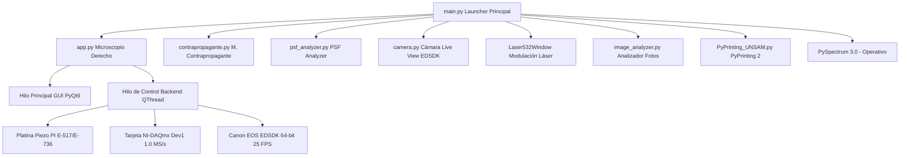
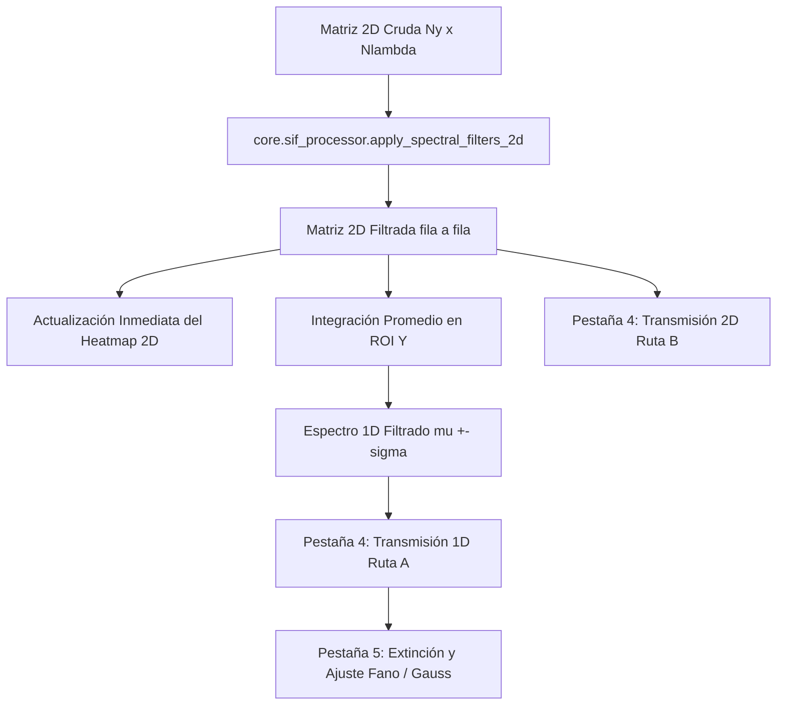
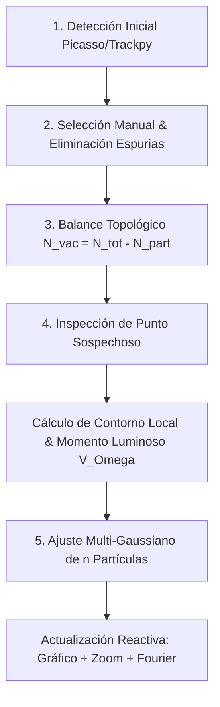

# Manual de Usuario Exhaustivo: PyPrinting 3.0 🔬
**Suite de Control, Espectroscopía Confocal, Caracterización de PSF y Nanofabricación Óptica**
*Laboratorio de Nanofotónica — Instituto de Nanosistemas (INS-UNSAM)*
*Autor Principal: José Luis González Peñafiel (Becario Doctoral CONICET)*

---

> [!TIP]
> 📂 **Documentación Modular Detallada**: Para consultar la ficha técnica, maqueta visual y especificación de controles I/O de cada módulo por separado, visitá la carpeta [**`docs/modulos/` (Índice de Módulos)**](file:///c:/Users/josel/Documents/Obsidian_Vault/printing3/docs/modulos/README.md).

## 📖 Índice General

0. [Biblioteca de Fundamentos Físicos, Electrodinámica y Nanomateriales](#0-biblioteca-de-fundamentos-físicos-electrodinámica-y-nanomateriales)
1. [Panel de Inicio Principal (`main.py` — "Bienvenidos al printing")](#1-panel-de-inicio-principal-mainpy--bienvenidos-al-printing)
   - [1.1 Visión General, Filosofía de Diseño y Arquitectura Multihilo](#11-visión-general-filosofía-de-diseño-y-arquitectura-multihilo)
   - [1.2 Selección Global de Modo Seguro (`SAFE_MODE`) vs. Modo Laboratorio Real](#12-selección-global-de-modo-seguro-safe_mode-vs-modo-laboratorio-real)
   - [1.3 Navegación e Índice de Módulos en Grilla Simétrica $3 \times 3$](#13-navegación-e-índice-de-módulos-en-grilla-simétrica-3-times-3)
   - [1.4 Ruta Pedagógica de Aprendizaje Gradual (3 Niveles de Usuario)](#14-ruta-pedagógica-de-aprendizaje-gradual-3-niveles-de-usuario)
2. [Fundamentos Físicos, Formulación Matemática & Mapeo de Hardware](#2-fundamentos-físicos-formulación-matemática--mapeo-de-hardware)
   - [2.1 Impresión Óptica Fototérmica de Nanopartículas Coloidales](#21-impresión-óptica-fototérmica-de-nanopartículas-coloidales)
   - [2.2 Ensamblado Guiado de Nanodímeros Plasmónicos y Campo Cercano](#22-ensamblado-guiado-de-nanodímeros-plasmónicos-y-campo-cercano)
   - [2.3 Modelo Analítico Gaussiano 2D Anisotrópico de 7 Parámetros](#23-modelo-analítico-gaussiano-2d-anisotrópico-de-7-parámetros)
   - [2.4 Modelo Analítico Haz Vortex / Donut (Laguerre-Gauss $LG_{01}$)](#24-modelo-analítico-haz-vortex--donut-laguerre-gauss-lg_01)
   - [2.5 Métricas Analíticas y Alineación Sub-nanométrica de PSF](#25-métricas-analíticas-y-alineación-sub-nanométrica-de-psf)
   - [2.6 Operación de Umbralización No Lineal de Ruido ($P\%$)](#26-operación-de-umbralización-no-lineal-de-ruido-p)
   - [2.7 Algoritmo de Estabilización Z Axial por Autocorrelación de Pearson](#27-algoritmo-de-estabilización-z-axial-por-autocorrelación-de-pearson)
   - [2.8 Mapeo Físico de Coordenadas, Regímenes de Referencia e Invariancia Cinemática](#28-mapeo-físico-de-coordenadas-regímenes-de-referencia-e-invariancia-cinemática)
   - [2.9 Formulación Matemática y Análisis de los 5 Criterios de Parada (Modos 0 a 4)](#29-formulación-matemática-y-análisis-de-los-5-criterios-de-parada-modos-0-a-4)
   - [2.10 Control Adaptativo de Deriva Termomecánica ($\vec{v}_{\text{drift}}$) y Estimador de Tiempo Restante (ETA)](#210-control-adaptativo-de-deriva-termomecánica-vecv_textdrift-y-estimador-de-tiempo-restante-eta)
3. [Módulo 01: Microscopio Derecho (`app.py` — PyPrinting 3.0 Suite Completa)](#3-módulo-1-microscopio-derecho-apppy--pyprinting-30-suite-completa)
   - [3.1 Menú Principal (`Files`, `Tools`, `Measurements`, `Help`)](#31-menú-principal-files-tools-measurements-help)
   - [3.2 Dock: Confocal (Mapeo 2D/3D & Algoritmos de Centrado)](#32-dock-confocal-mapeo-2d3d--algoritmos-de-centrado)
   - [3.3 Dock: Trace (Trazas Temporales & Calibración Power BS)](#33-dock-trace-trazas-temporales--calibración-power-bs)
   - [3.4 Dock: Focus z (Autofoco Axial Dinámico)](#34-dock-focus-z-autofoco-axial-dinámico)
   - [3.5 Dock: Shutters / Flipper (Seguridad Óptica & Modo Alineación)](#35-dock-shutters--flipper-seguridad-óptica--modo-alineación)
   - [3.6 Dock: Nanopositioning (Platina Piezoeléctrica PI)](#36-dock-nanopositioning-platina-piezoeléctrica-pi)
   - [3.7 Ventana de Mediciones (MOD-02: Printing Automatizado de Grillas, Healing Pass & Dímeros)](#37-ventana-de-mediciones-printing-automatizado-de-grillas--dímeros)
4. [Módulo 06: PySpectrum 3.0 (`pyspectrum.py` — Espectroscopía, Step & Glue y Mapeo Hiperespectral)](#4-módulo-2-pyspectrum-30-pyspectrumpy--espectroscopía-step--glue-y-mapeo-hiperespectral)
5. [Módulo 03: Microscopio Contrapropagante (`contrapropagante.py`)](#5-módulo-3-microscopio-contrapropagante-contrapropagantepy)
6. [Módulo 15: PyPrinting 2 Legacy (`PyPrinting_UNSAM.py`)](#6-módulo-4-pyprinting-2-legacy--pyprinting_unsampy)
7. [Módulo 04: Cámara Live View (`camera.py` — Suite Canon EDSDK & Microfotónica)](#7-módulo-5-cámara-live-view-camerapy--suite-canon-edsdk--microfotónica)
8. [Módulo 05: Modulación Láser 532 nm (`Laser532Window`)](#8-módulo-6-modulación-láser-532-nm-laser532window)
9. [Módulo 09: PSF Analyzer (`psf_analyzer.py`)](#9-módulo-7-psf-analyzer-psf_analyzerpy)
10. [Módulo 10: Analizador de Imágenes Estáticas (`image_analyzer.py`)](#10-módulo-8-analizador-de-imágenes-estáticas-image_analyzerpy)
11. [Módulo 11: Suite de Análisis Espectral y Quimiometría Raman (`raman_analyzer.py`)](#11-módulo-13-suite-de-análisis-espectral-y-quimiometría-raman-raman_analyzerpy)
12. [Módulo 12: Analizador y Procesador Avanzado de Espectros SIF (Andor Solis — `sif_analyzer.py`)](#12-módulo-14-analizador-y-procesador-avanzado-de-espectros-sif-andor-solis--sif_analyzerpy)
13. [Módulo 08: Analizador de Desorden y Estructura de Redes Cristalinas 2D (`lattice_disorder_gui.py`)](#13-módulo-15-analizador-de-desorden-y-estructura-de-redes-cristalinas-2d-lattice_disorder_guipy)
14. [Módulo 07: Diseñador Universal de Redes Cristalinas 2D (`grid_generator.py`)](#14-módulo-11-diseñador-universal-de-redes-cristalinas-2d-grid_generatorpy)
15. [Módulo 14: Procedimientos Operativos Estandarizados (SOP) y Protocolos Paso a Paso](#15-módulo-12-procedimientos-operativos-estandarizados-sop-y-protocolos-paso-a-paso)
16. [Módulo 13: Tablero de Seguridad de Hardware y Asistente de Presets (`hardware_dashboard.py` / `preset_wizard.py`)](#19-protección-de-exclusión-mutua-en-hardware-real-modo-laboratorio)
17. [Tabla Completa de Parámetros Globales (`config.py`)](#16-tabla-completa-de-parámetros-globales-configpy)
18. [Flujos de Trabajo Experimentales (Protocolos Paso a Paso)](#17-flujos-de-trabajo-experimentales-protocolos-paso-a-paso)
19. [Modelo Metrológico de Incertidumbre y Criterios Sub-píxel (Norma ISO/GUM)](#18-modelo-metrológico-de-incertidumbre-y-criterios-sub-píxel-norma-isogum)
20. [Protección de Exclusión Mutua en Hardware Real (Modo Laboratorio)](#19-protección-de-exclusión-mutua-en-hardware-real-modo-laboratorio)
21. [Arquitectura de Hilos, Concurrencia y Estabilidad en Tiempo Real](#20-arquitectura-de-hilos-concurrencia-y-estabilidad-en-tiempo-real)
22. [Tabla de Atajos de Teclado (Shortcuts)](#21-tabla-de-atajos-de-teclado-shortcuts)
23. [Guía de Resolución de Problemas y Diagnóstico (Troubleshooting)](#22-guía-de-resolución-de-problemas-y-diagnóstico-troubleshooting)
24. [Preguntas Frecuentes (FAQ)](#23-preguntas-frecuentes-faq)
25. [Guía de Referencia de Archivos y Reportes Metrológicos](#24-guía-de-referencia-de-archivos-y-reportes-metrológicos)

---

## 1. Panel de Inicio Principal (`main.py` — "Bienvenidos al printing")

### 1.1 Visión General, Filosofía de Diseño y Arquitectura Multihilo
La suite **PyPrinting 3.0** está construida sobre una arquitectura modular desacoplada basada en **Python 3 / PyQt6** y **`pyqtgraph`**. Para evitar cuelgues de la interfaz gráfica durante operaciones de hardware de alta frecuencia (como el escaneo por rampa a $10\ \text{kHz}$ o la transmisión de video réflex), la aplicación utiliza un patrón **Frontend / Backend** con hilos dedicados (`QThread` y `moveToThread`).



---

### 1.2 Selección Global de Modo Seguro (`SAFE_MODE`) vs. Modo Laboratorio Real
En la barra superior del panel principal **`main.py`** se encuentra el selector interactivo **`Modo Seguro (Simulación)`**:

* **Modo Seguro Activado (`PYPRINTING_SAFE=1`)**:
  - Habilita la Capa de Abstracción de Hardware Mock (`nidaq._MockNITask` y `_MockPIStage`).
  - Genera ruido gaussiano síncrono con pulsos sintéticos de trigger para simular perfiles confocales 2D/3D y trazas temporales.
  - Habilita una cámara sintética basada en patrones fotónicos móviles para probar la interfaz gráfica sin instrumentos físicos.
* **Modo Laboratorio Real (`PYPRINTING_SAFE=0`)**:
  - Inicializa la comunicación por socket C/DLL con la controladora PI E-517/E-736.
  - Conecta la tarjeta **National Instruments PCIe-6323 / USB-6343** (Dispositivo `Dev1`).
  - Abre la sesión nativa **Canon EDSDK v13.x** para la cámara réflex.

---

### 1.3 Navegación e Índice de Módulos en el Lanzador Principal (`main.py`)
El lanzador organiza las 12 aplicaciones del laboratorio estructuradas visualmente en **3 bloques temáticos** delimitados por subtítulos estilizados con gradientes Catppuccin Mocha:

```
┌─────────────────────────────────────────────────────────────────────────────────────────────────┐
│ 🔬 APLICACIONES INSTRUMENTALES Y CONTROL DE HARDWARE                                            │
│ Estaciones de nanofabricación asistida por luz, espectroscopía confocal y visión en vivo        │
├───────────────────────────────┬───────────────────────────────┬─────────────────────────────────┤
│ 🔬 Microscopio Derecho        │ 🌈 PySpectrum 3.0             │ 🔍 M. Contrapropagante          │
│ PyPrinting 3.0 Suite Completa │ Espectrometría Shamrock+CCD   │ Pinzas Ópticas Duales TOP/BOT   │
├───────────────────────────────┼───────────────────────────────┼─────────────────────────────────┤
│ 📷 Cámara Live View           │ ⚡ Láser 532 nm               │ 🕸️ Diseñador de Redes 2D        │
│ Réflex Canon EOS 500D (EDSDK) │ Control Analógico DAC ao2     │ Cristalográfica & Síntesis      │
└───────────────────────────────┴───────────────────────────────┴─────────────────────────────────┘

┌─────────────────────────────────────────────────────────────────────────────────────────────────┐
│ 📊 HERRAMIENTAS DE ANÁLISIS, ESPECTROSCOPÍA Y PROCESAMIENTO                                     │
│ Suites especializadas de álgebra espectral, quimiometría, metrología de PSF y microscopía      │
├───────────────────────────────┬───────────────────────────────┬─────────────────────────────────┤
│ 🌈 Analizador SIF (Andor)     │ 🔬 Analizador Raman & SERS    │ 🎯 PSF Analyzer                 │
│ Decodificador SIF 1D/2D, Fano │ Desconvolución & PCA Quimiom. │ Gauss 2D Anisotrópico / Donut   │
├───────────────────────────────┴───────────────────────────────┼─────────────────────────────────┤
│ 🖼️ Analizador de Imágenes                                      │ (Espacio reservado              │
│ Campo Amplio, Richardson-Lucy, Métricas SNR y FWHM            │  para expansión)                │
└───────────────────────────────────────────────────────────────┴─────────────────────────────────┘

┌─────────────────────────────────────────────────────────────────────────────────────────────────┐
│ ⚙️ DOCUMENTACIÓN, DIAGNÓSTICOS Y CONFIGURACIÓN                                                  │
│ Tablero de salud de instrumentos, telemetría USB, manuales operativos y créditos científicos    │
├───────────────────────────────────────────────────────────────┬─────────────────────────────────┤
│ 🎛️ Tablero de Hardware & Conexiones                           │ 📚 Documentación y Créditos     │
│ Perfiles de Inicio, Aislamiento y Reconexión USB              │ Manuales, Papers y Referencias  │
└───────────────────────────────────────────────────────────────┴─────────────────────────────────┘
```


---

### 1.4 Ruta Pedagógica de Aprendizaje Gradual (3 Niveles de Usuario)

Para garantizar la autosuficiencia formativa del laboratorio, el manual y la arquitectura de PyPrinting 3.0 están diseñados para acompañar al operador en tres fases de madurez experimental:

#### 🟢 Nivel 1: Principiante / Becario Inicial
* **Enfoque**: Adquisición visual intuitiva, aprendizaje seguro sin riesgo de daño y familiarización con el instrumental.
* **Flujo Recomendado**:
  1. Iniciar el software en **Modo Seguro** (`SAFE_MODE = True`).
  2. Explorar el lanzador `main.py` y abrir la **Cámara Live View** (`camera.py`).
  3. Practicar el centrado de muestras con las reglas en micrómetros.
  4. Abrir el **Microscopio Derecho** (`app.py`), observar trazas en vivo con **F1** y ejecutar un autofoco Z con **F8**.
  5. Cargar un preset básico en la ventana de **Printing** y seguir el [[MOD-14_Protocolos_Laboratorio_SOP|Protocolo Básico de Impresión (MOD-14)]].

#### 🟡 Nivel 2: Intermedio / Investigador Experimental
* **Enfoque**: Operación de nanofabricación en laboratorio real, optimización de parámetros y caracterización espectral.
* **Flujo Recomendado**:
  1. Conmutar a **Modo Real** tras estabilizar la temperatura del laboratorio ($21\ ^\circ\text{C}$).
  2. Ejecutar **Lock Focus (F9)** en vidrio limpio y activar la casilla **`📐 Inclinación Z (4 esquinas)`** en el Dock Confocal para corregir cubreobjetos inclinados.
  3. En la ventana de impresión, activar **`🔄 Autocompletitud de redes (Healing Pass)`** para garantizar redes al $100\%$ sin vacancias.
  4. Seleccionar el criterio de parada adecuado: **Modo 1** (salto relativo + absoluto + filtro anti-paso $N_{\text{hold}}$) o **Modo 4** (híbrido tri-factor).
  5. En **PySpectrum 3.0**, verificar el centrado de orden cero de la ranura y ejecutar **Step & Glue** con normalización por lámpara halógena.
  6. Procesar espectros Raman en **Raman Analyzer** con sustracción de línea base (Modo 1 de blanco o Modo 2 AsLS/AirPLS).

#### 🔴 Nivel 3: Avanzado / Físico e Ingeniero de Instrumentación
* **Enfoque**: Metrología de alta precisión, calibración a bajo nivel, análisis quimiométrico y diagnóstico del sistema.
* **Flujo Recomendado**:
  1. Ajuste analítico no lineal de PSF (Gaussiana elíptica 2D de 7 parámetros y Donut Laguerre-Gauss $LG_{01}$) en `psf_analyzer.py`.
  2. Evaluación del balance de incertidumbre según norma **ISO/GUM** ($u_c \le 6.55\ \text{nm}$).
  3. Calibración fina del espectrógrafo Shamrock mediante offsets de rejilla y detector por Ctypes nativas (`ShamrockSetGratingOffset`, `ShamrockSetDetectorOffset`) en el dock de calibración.
  4. Diagnóstico de la arquitectura de señales multihilo, gestión de tareas analógicas y digitales NI-DAQmx (resiliencia ante tareas zombi en `nidaq.py`) y sincronización por triggers CTO a 10 kHz.
  5. Análisis multivariado de series temporales SERS mediante **PCA** (Scores y Loadings) y termometría óptica Anti-Stokes / Stokes.

## 2. Fundamentos Físicos, Formulación Matemática & Mapeo de Hardware

> [!NOTE] Compendio Teórico y Biblioteca Científica Rigurosa
> Para preservar la naturaleza operativa del presente manual de usuario, las deducciones electrodinámicas analíticas, formulaciones de mecánica cuántica y demostraciones formales completas han sido desacopladas y residen en los reportes canónicos de la biblioteca científica:
> - **Electrodinámica y Fuerzas Ópticas**: `[[CAT-109_Electrodinamica_Fuerzas_Opticas_y_Termoplasmonica_Printing|CAT-109: Electrodinámica, Fuerzas Ópticas y Termoplasmónica]]`
> - **Fisicoquímica de Coloides y Silanización**: `[[CAT-110_Fisicoquimica_Coloides_DLVO_y_Funcionalizacion_Superficies|CAT-110: Fisicoquímica de Coloides, DLVO y Silanización]]`
> - **Resonancia Plasmónica y Dímeros**: `[[CAT-103_Control_Lazo_Cerrado_Fototermico_y_Sintesis_Dimeros|CAT-103: Control de Lazo Cerrado y Síntesis de Dímeros]]`
> - **Alineación y Modelado Analítico de PSF**: `[[CAT-202_Derivacion_Matematica_Cota_Cramer_Rao_Localizacion_Optica|CAT-202: Cota de Cramér-Rao en Localización Óptica]]` y `[[CAT-108_Teoria_Optica_Telescopio_Rele_4f_y_Canales_Confocales|CAT-108: Teoría Óptica Relé 4f y Canales Confocales]]`
> - **Regímenes Cinemáticos y Coordenadas**: `[[SYS-103_Regimenes_Coordenadas_e_Invariancia_Cinematica|SYS-103: Regímenes de Coordenadas e Invariancia Cinemática]]`
> - **Criterios de Parada y Control Adaptativo**: `[[CAT-101_Protocolo_Operativo_Impresion_Fototermica_Grillas_2D|CAT-101: Protocolo de Impresión Fototérmica]]`

### 2.1 Impresión Óptica Fototérmica de Nanopartículas Coloidales

> [!NOTE] Deducción Teórica Formal
> Para el tratamiento electromagnético detallado, tensores de Maxwell, ecuación de Smoluchowski y fuerzas de dispersión/gradiente completas, consultar **`[[CAT-109_Electrodinamica_Fuerzas_Opticas_y_Termoplasmonica_Printing]]`** y la química superficial DLVO en **`[[CAT-110_Fisicoquimica_Coloides_DLVO_y_Funcionalizacion_Superficies]]`**.

La **impresión óptica** logra la deposición espacial dirigida de nanopartículas coloidales metálicas (Au, Ag) desde una solución líquida sobre sustratos de vidrio funcionalizados con APTES. La interacción electromagnética está dominada por:
1. **Fuerza de Gradiente Óptico** ($\mathbf{F}_{\text{grad}} \propto \operatorname{Re}(\alpha) \nabla |\mathbf{E}|^2$): Atrae la nanopartícula hacia el punto de máxima intensidad en el foco del láser ($\approx 532\ \text{nm}$, sintonizado con la resonancia LSPR del oro).
2. **Fuerza de Dispersión y Radiación** ($\mathbf{F}_{\text{scat}} \propto |\alpha|^2 \mathbf{S}$): Empuja la partícula en la dirección de propagación del haz hacia el sustrato.
3. **Anclaje Irreversible por Potencial DLVO**: Superada la barrera electrostática gracias a la presión de radiación y el calentamiento local plasmotérmico, la partícula colapsa en el pozo de Van der Waals superficial.

---

### 2.2 Ensamblado Guiado de Nanodímeros Plasmónicos y Campo Cercano

> [!NOTE] Fundamento Físico de Hot-Spots y Polarización
> Para la teoría de acoplamiento plasmónico dipolar, hibridación de plasmones y amplificación SERS $\mathbf{E}^4$, consultar **`[[CAT-103_Control_Lazo_Cerrado_Fototermico_y_Sintesis_Dimeros]]`** y el manual operativo **`[[MOD-02_Measurements_Printing_y_Dimeros]]`**.

La fabricación de **nanodímeros plasmónicos** consiste en posicionar una segunda nanopartícula a una distancia de separación (*gap*) sub-100 nm de una primera partícula previamente fijada. Al aproximarse a distancias nanométricas, el acoplamiento de campo cercano crea un punto caliente plasmónico (*hot-spot*) que amplifica exponencialmente la intensidad Raman (SERS). La secuencia de impresión guiada sigue el protocolo:

```
[Partícula 1 Fijada] ──► [Escaneo Confocal Local] ──► [Fit Sub-píxel (x1, y1)] ──► [Offset Vectorial Δx, Δy] ──► [Impresión Partícula 2]
```

---

### 2.3 Modelo Analítico Gaussiano 2D Anisotrópico de 7 Parámetros

> [!NOTE] Formulación Matemática y Algoritmo de Ajuste
> Para las ecuaciones analíticas completas de la matriz de curvatura elíptica y los límites de incertidumbre Cramér-Rao, consultar **`[[CAT-202_Derivacion_Matematica_Cota_Cramer_Rao_Localizacion_Optica]]`** y el manual **`[[MOD-09_PSF_Analyzer_Optica_Difraccion]]`**.

Para caracterizar la distribución de intensidad en el plano focal horizontal ($XY$), el sistema ajusta una Gaussiana 2D elíptica inclinada en un ángulo $\theta$ mediante mínimos cuadrados no lineales (`scipy.optimize.curve_fit`):
$$G(x, y) = Z_{\text{offset}} + A \cdot \exp\left( -\left[ a(x - x_0)^2 + 2b(x - x_0)(y - y_0) + c(y - y_0)^2 \right] \right)$$
El software extrae automáticamente los centroides sub-píxel $(x_0, y_0)$, la rotación elíptica $\theta$ y los anchos a media altura $\text{FWHM}_x \approx 2.3548 \cdot \sigma_x$ y $\text{FWHM}_y \approx 2.3548 \cdot \sigma_y$.

---

### 2.4 Modelo Analítico Haz Vortex / Donut (Laguerre-Gauss $LG_{01}$)

> [!NOTE] Óptica de Haces Singulares y STED
> Para la teoría de orden topológico, carga de vórtice y propagación en relé 4f, consultar **`[[CAT-108_Teoria_Optica_Telescopio_Rele_4f_y_Canales_Confocales]]`** y **`[[MOD-09_PSF_Analyzer_Optica_Difraccion]]`**.

Para caracterizar haces con singularidad de fase espiral ($e^{i l \phi}$) o donas de depleción en nanoscopía STED, el módulo **PSF Analyzer** y el widget **Confocal** ajustan la distribución analítica Laguerre-Gauss $LG_{01}$:
$$I_{\text{donut}}(x, y) = Z_{\text{offset}} + A \cdot r_n^2(x, y) \cdot \exp\left( - r_n^2(x, y) \right) \quad \text{con} \quad r_n^2 = \frac{(x - x_0)^2}{2\sigma_x^2} + \frac{(y - y_0)^2}{2\sigma_y^2}$$

---

### 2.5 Métricas Analíticas y Alineación Sub-nanométrica de PSF

> [!NOTE] Parámetros de Calidad y Benchmarking
> Consultar el reporte metrológico **`[[CAT-202_Derivacion_Matematica_Cota_Cramer_Rao_Localizacion_Optica]]`** para la justificación de umbrales.

El módulo **PSF Analyzer** computa cuantitativamente:
1. **Desalineación Vectorial Dual ($\Delta r_{\text{nm}}$)**: $\Delta r_{\text{nm}} = \sqrt{(x_1 - x_2)^2 + (y_1 - y_2)^2} \times 1000$ [nm].
2. **Radio del Anillo Donut ($r_0$)**: $r_0 = \sqrt{\sigma_x \cdot \sigma_y}$ [$\mu\text{m}$].
3. **Elipticidad del Donut**: $\sigma_x/\sigma_y$.
4. **Calidad del Cero Central ($I_{\min}/I_{\max}$)**: Intensidad residual en el nulo central dividida por el pico del anillo ($<0.05$ representa alta calidad óptica).
5. **Bondad de Ajuste**: Coeficiente de determinación $R^2$ y residuo cuadrático medio $\text{RMS}$.

---

### 2.6 Operación de Umbralización No Lineal de Ruido ($P\%$)
El casillero **`Filtro (%)`** aplica un operador no lineal por corte de umbral sobre la matriz normalizada $Z_n \in [0.0, 1.0]$:
$$Z_f[x, y] = \begin{cases} Z_n[x, y] & \text{si } Z_n[x, y] \ge \frac{P}{100} \\ 0.0 & \text{si } Z_n[x, y] < \frac{P}{100} \end{cases}$$

---

### 2.7 Algoritmo de Estabilización Z Axial por Autocorrelación de Pearson

> [!NOTE] Arquitectura y Temporización
> Para la orquestación del hilo axial y prevención de colisión con el cubreobjetos, consultar **`[[SYS-101_Arquitectura_Hilos_Concurrencia_QThread]]`** y el manual **`[[MOD-01_Microscopio_Derecho_App]]`**.

Para corregir la deriva térmica del plano de enfoque axial ($Z$), el sistema adquiere un perfil de intensidad $I(z)$ y calcula el coeficiente de correlación cruzada normalizado de Pearson respecto a la firma congelada de referencia $I_{\text{ref}}(z)$:
$$r(z) = \frac{\sum (I(z) - \bar{I})(I_{\text{ref}}(z) - \bar{I}_{\text{ref}})}{\sqrt{\sum (I(z) - \bar{I})^2 \sum (I_{\text{ref}}(z) - \bar{I}_{\text{ref}})^2}}$$
El desplazamiento óptimo en Z corresponde al máximo de $r(z)$, garantizando enfoque sub-micrométrico continuo durante toda la jornada experimental.

---

### 2.8 Mapeo Físico de Coordenadas, Regímenes de Referencia e Invariancia Cinemática

> [!NOTE] Especificación Formal de Cinemática y Metadatos
> Para la deducción matricial completa de las transformaciones afines y la sincronización inter-módulos, consultar el reporte canónico **`[[SYS-103_Regimenes_Coordenadas_e_Invariancia_Cinematica]]`**.

En la plataforma **PyPrinting 3.0**, la muestra se encuentra montada sobre una platina piezoeléctrica triaxial Physik Instrumente (PI E-517/E-736, rango $0.0 - 100.0\ \mu\text{m}$), mientras que el haz láser focalizado se mantiene estático en el espacio del laboratorio.

#### 1. Cinemática de Movimiento Relativo (Muestra vs. Láser)
Cuando la platina desplaza mecánicamente la muestra con velocidad $\mathbf{v}_{\text{sample}}$, el punto focal del láser respecto al sustrato se mueve con velocidad exactamente opuesta:
$$\mathbf{v}_{\text{laser}/\text{sample}} = -\mathbf{v}_{\text{sample}/\text{lab}}$$
- **Desplazamiento hacia la Derecha ($+X_{\text{laser}}$)** $\iff$ La platina mueve la muestra a la izquierda (Eje 2 PI).
- **Desplazamiento hacia Abajo ($+Y_{\text{laser}}$)** $\iff$ La platina mueve la muestra hacia arriba (Eje 1 PI).
- **Eje Axial Óptico ($Z_{\text{óptico}}$)** $\iff$ Movimiento del foco hacia el interior de la muestra (Eje 3 PI).

#### 2. Los 3 Regímenes de Coordenadas Seleccionables
| Régimen | Perspectiva Metrológica | Casilla 1 (Eje 1 PI) | Casilla 2 (Eje 2 PI) | Casilla 3 (Eje 3 PI) | Aplicación Típica |
| :--- | :--- | :--- | :--- | :--- | :--- |
| **`Legacy`** | Convención histórica PyPrinting 2 | `X =` (Vertical en pantalla) | `Y =` (Horizontal en pantalla) | `Z =` (Axial) | Compatibilidad retrospectiva estricta con protocolos 2017-2024. |
| **`Laser Ref`** | Marco visual del monitor / cámara | `Y (Vert) =` (Eje vertical hacia abajo) | `X (Horiz) =` (Eje horizontal a derecha) | `Z (Axial) =` | **Recomendado**: Alineación óptica directa, confocal y cámara. |
| **`Sample Ref`** | Marco intrínseco del sustrato de vidrio | `Y (Muestra) =` | `X (Muestra) =` | `Z (Axial) =` | Metasuperficies, correlación con AFM, SEM y litografía. |

> [!IMPORTANT]
> **Invariancia Cinemática Absoluta**: La selección del régimen de coordenadas **NO modifica en un solo nanómetro la actuación física ni las señales enviadas a la controladora PI**. Las casillas gobiernan siempre los mismos canales físicos de hardware (Casilla 1 $\to$ Eje 1, Casilla 2 $\to$ Eje 2, Casilla 3 $\to$ Eje 3).

---

### 2.9 Formulación Matemática y Análisis de los 5 Criterios de Parada (Modos 0 a 4)

> [!NOTE] Justificación Experimental y Protocolos
> Para el análisis estadístico de eficiencia de parada y curvas de deposición, consultar **`[[CAT-101_Protocolo_Operativo_Impresion_Fototermica_Grillas_2D]]`** y el manual **`[[MOD-02_Measurements_Printing_y_Dimeros]]`**.

1. **Modo 0: Legacy (Salto Relativo Estándar)**: Cierre si $I_{\text{new}}[t] > \text{Umbral} \cdot I_{\text{old}}$. Mantiene $100\%$ compatibilidad con rutinas históricas.
2. **Modo 1: Salto Relativo + Umbral Absoluto & Anti-Paso ($N_{\text{hold}}$ Steps)**: 
   $$\text{Condición}(t) = \left( \frac{I_{\text{new}}[t]}{I_{\text{old}}} > \text{Umbral} \right) \;\mathbf{OR}\; \left( I_{\text{new}}[t] > V_{\text{abs}} \right) \quad \text{sostenido durante } N_{\text{hold}} \text{ pasos}$$
   Elimina fallas a $t=0$ y evita falsos cierres por partículas flotantes.
3. **Modo 2: Derivada Temporal Adaptativa & Aplanamiento ($dI/dt$)**: Gatilla cuando la tasa de crecimiento fototérmico se aplana ($dI/dt < \text{Slope\_Flat}$), indicando acomodamiento final.
4. **Modo 3: Calibración Confocal Raw & Umbral Absoluto Reescalado ($K_{\text{scale}}, P\%$)**: Automatiza el voltaje de corte relacionando la potencia de escaneo $P_{\text{scan}}$ con la potencia de impresión $P_{\text{print}}$.
5. **Modo 4: Criterio Híbrido Tri-Factor (All-In-One)**: Combina Modo 1 y Modo 2 bajo filtro sostenido $N_{\text{hold}}$, ofreciendo la máxima robustez en muestras ruidosas.

---

### 2.10 Control Adaptativo de Deriva Termomecánica ($\vec{v}_{\text{drift}}$) y Estimador de Tiempo Restante (ETA)

> [!NOTE] Algoritmos de Compensación In-Situ
> Para el modelo físico de deriva y la autocompletitud por *Healing Pass*, consultar **`[[CAT-101_Protocolo_Operativo_Impresion_Fototermica_Grillas_2D]]`** y **`[[CAT-104_Compensacion_Inclinacion_Z_Confocal_y_Healing_Pass]]`**.

1. **Estimación Temporal de Velocidad de Deriva ($\vec{v}_{\text{drift}}$)**: Registra la desviación $(\Delta x, \Delta y)$ en la Partícula Ancla $P_0$ entre cuadrugaciones sucesivas:
   $$\vec{v}_{\text{drift}}(t_k) = \frac{(\Delta x_k - \Delta x_{k-1}, \Delta y_k - \Delta y_{k-1})}{t_k - t_{k-1}}$$
2. **Periodo de Corrección Adaptativo ($T_{\text{drift}}$)**: Modula dinámicamente la frecuencia de centrado: $T_{\text{drift}} = \max\left( T_{\text{min}}, \min\left( T_{\text{max}}, \frac{\epsilon_{\text{tol}}}{|\vec{v}_{\text{drift}}|} \right) \right)$.
3. **Estimador Predictivo de Tiempo Restante (ETA)**: Computa en vivo el tiempo para finalizar el lote:
   $$\text{ETA}(k) = \bar{t}_{\text{raw}} \cdot (N_{\text{total}} - k) + N_{\text{drift\_checks\_rem}} \cdot t_{\text{confocal\_scan}}$$

---

## 3. Módulo 01: Microscopio Derecho (`app.py` — PyPrinting 3.0 Suite Completa)

> 📖 **Manual de Usuario Dedicado**: Consultar [[MOD-01_Microscopio_Derecho_App|MOD-01: Microscopio Derecho — Suite Principal (app.py)]] para la maqueta visual ASCII completa, catálogo I/O y modos de falla.

### 3.1 Menú Principal (`Files`, `Tools`, `Measurements`, `Help`)
* **Menú `Files`**:
  - `Select Base Path (Ctrl+A)`: Selecciona la carpeta raíz de trabajo.
  - `Create Daily Dir (Ctrl+S)`: Crea automáticamente la subcarpeta del día (`YYYY-MM-DD`).
  - `Open Working Directory (Ctrl+D)`: Abre la carpeta actual en el Explorador de Windows.
* **Menú `Tools`**:
  - `Tablero de Conexiones (Ctrl+H)`: Matriz interactiva de estado y seguridad I/O de instrumentos.
  - `Diseñador de Redes 2D (Ctrl+G)`: Síntesis de redes cristalinas 2D (Bravais, Moiré, Grafeno, Kagome), máscaras por figuras geométricas y cuadratura con Partícula Ancla $P_0$.
  - Acceso directo a la ventana de `Cámara`, `Analizador de Imágenes`, `PSF Analyzer` y `Modulación Láser 532 nm`.
* **Menú `Measurements`**:
  - `Printing`: Abre la ventana de impresión automatizada de grillas.
  - `Dimers`: Abre la ventana de ensamblado guiado de dímeros plasmónicos.

---

### 3.2 Dock: Confocal (Mapeo 2D/3D & Algoritmos de Centrado)
| Control | Tipo | Rango / Opciones | Descripción |
|---|---|---|---|
| **`Laser`** | `QComboBox` | `532 nm`, `637 nm`, `592 nm` | Línea de excitación láser para la iluminación confocal. |
| **`Range x / y`** | `QDoubleSpinBox` | $0.100 - 100.000\ \mu\text{m}$ | Dimensión física del área cuadrada/rectangular a escanear. Sus etiquetas cambian reactivamente: `Range X/Y` (Legacy), `Range Y (Vert) / Range X (Horiz)` (Laser Ref), o `Range Y / Range X (Muestra)` (Sample Ref). |
| **`Pixels x / y`** | `QSpinBox` | $10 - 500$ | Resolución en píxeles de la matriz de adquisición confocal. Rótulos reactivos sincronizados con el régimen activo. |
| **`Scan mode`** | `QComboBox` | `Ramp`, `Step by step` | `Ramp`: Lectura síncrona continua a $10\ \text{kHz}$ por hardware NI-DAQ. `Step`: Paso a paso por software. |
| **`Scan projection`**| `QComboBox` | Ver opciones dinámicas | Plano ortogonal de escaneo confocal. Los textos se adaptan ergonómicamente al régimen (`x/y` $\leftrightarrow$ `Y/X (Vert/Horiz)` $\leftrightarrow$ `Y/X (Muestra)`), emitiendo de forma determinista la clave canónica al backend para garantizar 0% de regresión. |
| **`Scan Image`** | `QComboBox` | `NPs maximum`, `NPs minimum` | `NPs maximum`: Partículas brillantes (fluorescencia/scattering). `NPs minimum`: Partículas oscuras (absorción). |
| **`method_center`** | `QComboBox` | `center of mass`, `center of gauss`, `two NP: center of gauss`, `donut (Laguerre-Gauss)` | Algoritmo de centrado analítico para calcular la posición de la partícula. |
| **`Auto CM`** | `QCheckBox` | `True` / `False` | Si está marcado, desplaza automáticamente la platina PI al centro calculado tras finalizar el escaneo. |
| **`📐 Inclinación Z`**| `QCheckBox` | `True` / `False` | Activa la compensación de inclinación del cubreobjetos (*Confocal Tilt*). Mide el foco axial con autocorrelación en las 4 esquinas del área perimetral y modula dinámicamente el eje Z durante el barrido raster para mantener el plano focal dentro del rango de Rayleigh ($\pm 350\ \text{nm}$). Requiere Lock Focus (F9) previo sobre vidrio limpio. |
| **`Filtro (%)`** | `QLineEdit` | $0.0 - 99.0\%$ | Porcentaje de umbral de filtrado de ruido para la eliminación de fondo. |
| **`Start Scan`** | `QPushButton` | Exec | Inicia la rutina de escaneo confocal síncrono. |

---

### 3.3 Dock: Trace (Trazas Temporales & Calibración Power BS)
* **Monitoreo de Fotoluminiscencia**:
  - Graficado temporal continuo de intensidad en Volts ($V$) emitidos por los fotodiodos.
  - Tecla **F1**: Inicia la adquisición continua (*Play*).
  - Tecla **F2**: Detiene la adquisición y guarda la traza en disco (*Stop & Save*).
  - **Renovación Activa de Heartbeat (Watchdog-Aware)**: Al presionar *Play*, el bucle de actualización gráfica emite periódicamente cada segundo la señal de latido `heartbeat_shutter(30.0)` al daemon de seguridad de la NI-DAQmx. Esto garantiza que durante las tareas de alineación manual con el fotodiodo el obturador permanezca abierto de manera ininterrumpida sin sufrir cortes prematuros a los 30 s. Al pulsar *Stop & Save*, el obturador se cierra de forma inmediata y se desarma el temporizador de seguridad.
* **Ventana `PowerBSWindow`**:
  - Monitoreo continuo de la potencia reflejada en el fotodiodo divisor (*Beam Splitter*).
  - Permite ingresar lecturas de potencia comercial (`High power`, `Low power`) y ejecutar **`Set Calibration`** para obtener la constante de conversión en $\text{mW/V}$.

---

### 3.4 Dock: Focus z (Autofoco Axial Dinámico)
| Control | Tecla | Función |
|---|---|---|
| **`Go to maximum`** | **F8** | Ejecuta un barrido axial rápido en Z y desplaza el piezo al pico de máxima intensidad. |
| **`Lock Focus`** | **F9** | Registra y congela el perfil $I_{\text{ref}}(z)$ como referencia de enfoque. |
| **`Autocorrelation ×2`**| **F10** | Ejecuta la correlación de Pearson y corrige la deriva axial en Z. |

---

### 3.5 Dock: Shutters / Flipper (Seguridad Óptica & Modo Alineación)
El dock **`Shutters / Flipper`** centraliza la conmutación digital por relés y líneas TTL de las fuentes láser y elementos móviles de la trayectoria óptica:

* **Obturadores Digitales de Excitación (Líneas TTL NI-DAQmx `port0/line0:3`)**:
  - **`Shutter 532 nm`**: Conmuta el obturador del láser verde ($\lambda = 532\ \text{nm}$, bomba fototérmica).
  - **`Shutter 637 nm`**: Conmuta el obturador del láser rojo ($\lambda = 637\ \text{nm}$, excitación confocal/Raman).
  - **`Shutter 592 nm`**: Conmuta el obturador del láser amarillo ($\lambda = 592\ \text{nm}$).
  - **`Shutter 808 nm`**: Conmuta el obturador del láser infrarrojo ($\lambda = 808\ \text{nm}$, pinzas ópticas/termometría).
* **Flippers Motorizados (Actuadores Biestables `Dev1/ao0`, `Dev1/ao1` y `line7`)**:
  - **`Power Flipper (Low/High power)`**: Checkbox reactivo con retroalimentación cromática (rojo = alta potencia, normal = baja potencia con filtro ND). Conectado a la señal `clicked` de PyQt6 para responder exclusivamente a acciones directas del usuario, evitando bucles recursivos de señal. Actúa mediante pulsos analógicos de $5\ \text{V} \times 100\ \text{ms}$ en `Dev1/ao0` (Up/Low) y `Dev1/ao1` (Down/High).
  - **Desacoplamiento Estricto del Watchdog**: El flipper de potencia es un atenuador de densidad óptica y **no un obturador de corte de radiación**. Por tanto, el disparo del watchdog cierra los obturadores pero no altera la posición del flipper, preservando la configuración deseada por el operador.
  - **Auto-Recuperación de Tareas Zombi DAQ**: `core/nidaq.py` valida activamente el estado de las tareas de National Instruments (`is_task_done()`) y resetea las referencias a `None` tras `close_all_tasks()`, permitiendo reintentos automáticos sin lanzar excepciones `-200088`.
  - **`Notch 532 Flipper (Mirror up/down)`**: Conmuta el espejo de desviación hacia el filtro Notch de 532 nm mediante la línea digital `Dev1/port0/line7` (`set_notch532`).
* **Sistema de Auto-Cierre de Seguridad & Watchdog**:
  - **Casilla `Auto-cierre de seguridad`**: Activa o desactiva la protección contra radiación desatendida mediante un daemon independiente (`daemon=True`) que no se bloquea ante cálculos intensivos en la GUI.
  - **Selector de Tiempo Máximo**: Menú desplegable con tiempos límite de radiación continua:
    - `30s (Estándar)`: Protección estricta contra evaporación y foto-daño.
    - `60s (1 min)`: Procedimientos de inspección rápida.
    - `300s (5 min)`: Ajustes ópticos intermedios.
    - `600s (10 min)`: Búsqueda exploratoria extensa.
    - `Sin límite (Modo Alineación)`: Desactiva el corte por tiempo para sesiones de alineación óptica manual y colimación de cavidades.
  - **Indicador Dinámico de Estado**: Muestra en tiempo real la cuenta regresiva hacia el corte (`⏱️ Auto-cierre en: Xs`), el modo seguro armado (`⏱️ Auto-cierre activo (Xs)`) o el modo alineación continua (`⚠️ MODO ALINEACIÓN (Sin auto-cierre)`).
  - **Botón `🚨 Cerrar Todos`**: Pulsador de corte de emergencia en un clic que fuerza el cierre inmediato de los 4 obturadores digitales.
  - **Sincronización Bidireccional Hardware-GUI**: Si el watchdog en la NI-DAQ fuerza un cierre de emergencia por expiración de tiempo o bloqueo de software, una señal Qt interrumpe la UI y desmarca automáticamente los botones activos de obturador, garantizando sincronismo absoluto entre el hardware real y la interfaz visual.

> [!IMPORTANT]
> **El selector de auto-cierre gobierna a TODO el software, no solo a este dock.** Antes, elegir `30s`, `60s`, `300s`, `600s` o `Sin límite (Modo Alineación)` solo afectaba a los 4 obturadores manuales de este panel — cualquier rutina automatizada (Confocal, Impresión, Espectroscopía) que abriera un láser internamente ignoraba la elección y volvía a aplicar 30 s por defecto. Esto ya no ocurre: la política elegida aquí se propaga de inmediato a **todos** los módulos del software en tiempo real, sin necesidad de reiniciar ninguna rutina en curso ni de reabrir ningún dock. Si necesita alinear manualmente durante minutos sin interrupciones, seleccionar `Sin límite (Modo Alineación)` aquí es suficiente — ya no es necesario preocuparse por que una rutina en segundo plano rearme el corte a 30 s.
* **Modulación Analógica de Potencia**: El control de voltaje analógico DAC ($0.0 - 5.0\ \text{V}$, canal `ao2`) para el láser verde se encuentra desacoplado de este panel y se opera desde su ventana especializada **`Laser532Window`** (disponible desde el Lanzador Principal y menú **`Tools → Láser 532`**).

---

### 3.6 Dock: Nanopositioning (Platina Piezoeléctrica PI)
* **Selector Global de Régimen de Coordenadas (`Régimen: [ ... ▼ ]`)**:
  - Permite conmutar en caliente entre `Legacy (Histórico)`, `Laser Ref (Cámara/Monitor)` y `Sample Ref (Muestra)`.
  - Actualiza de forma reactiva todas las etiquetas del dock, del escaneo confocal, de la previsualización de impresión y del mapeo espectral, preservando 100% la invariancia del hardware.
* **Lectura Continua de Sensores Capacitivos (`Read Position`)**:
  - Visualiza en tiempo real la posición física absoluta en micrómetros leída por `pi.qPOS()` a través de sensores capacitivos de bucle cerrado.
  - Sus rótulos cambian automáticamente: `X, Y, Z` (Legacy), `Y (Vert), X (Horiz), Z (Axial)` (Laser Ref), o `Y (Muestra), X (Muestra), Z (Axial)` (Sample Ref).
* **Casillas de Desplazamiento Absoluto (`Go To`)**:
  - Permiten ingresar valores directos en micrómetros ($0.0 - 100.0\ \mu\text{m}$).
  - Las etiquetas de cabecera (`X =`, `Y =`, `Z =`) se actualizan al unísono con el régimen activo, incorporando tooltips explicativos que indican la dirección física de movimiento.
* **Control Paso a Paso Relativo y Navegación por Teclado (`Arrow Keys Navigation`)**:
  - Botones relativos de salto rápido ($\pm 0.1\ \mu\text{m}$, $\pm 1.0\ \mu\text{m}$, $\pm 10.0\ \mu\text{m}$).
  - **Navegación Fluida con Flechas de Teclado**: Al hacer foco en el dock de Nanoposicionamiento, es posible desplazar la platina interactiva y suavemente paso a paso utilizando el teclado:
    - **`Flecha Arriba (↑)`**: Desplaza en $-\Delta$ sobre el Eje 1 (en Laser Ref: el láser sube en la cámara).
    - **`Flecha Abajo (↓)`**: Desplaza en $+\Delta$ sobre el Eje 1 (en Laser Ref: el láser baja en la cámara).
    - **`Flecha Derecha (→)`**: Desplaza en $+\Delta$ sobre el Eje 2 (en Laser Ref: el láser va a la derecha en la cámara).
    - **`Flecha Izquierda (←)`**: Desplaza en $-\Delta$ sobre el Eje 2 (en Laser Ref: el láser va a la izquierda en la cámara).
    - **`Re Pág (PgUp) / Av Pág (PgDn)`**: Desplaza el eje axial Z en $\pm \Delta z$.
    - El valor de $\Delta$ respeta el casillero `Step X-Y` o `Step Z`.
* **Telemetría y Estado Físico en Tiempo Real**:
  - `🟢 PI Física (SN: 0119048050)`: La controladora física responde activamente mediante health-check periódico basado en el estado de conexión en memoria del lado del host, sin saturar el bus USB con consultas de identidad (`*IDN?`) repetidas durante movimiento activo.
  - `🟡 Modo Virtual (Desconectada)`: Advierte explícitamente si el hardware está apagado o desconectado, imprimiendo en consola `[PI VIRTUAL] MOV ...` para no confundir desplazamientos numéricos de GUI con movimiento mecánico real.
  - **Botón `🔌 Reconectar` Directo**: Permite inicializar la conexión física en caliente tras encender la controladora E-517 en la mesa óptica, sin necesidad de reiniciar la aplicación ni perder el plano focal ni el origen de coordenadas.

> [!NOTE]
> **Resiliencia ante rechazos de comando (`SYS-205`)**: un intento de mover la platina a una coordenada fraccionalmente fuera de $[0, 100]\ \mu\text{m}$ (por ejemplo, por una corrección de deriva acumulada) ya **no** provoca una desconexión — el driver clampea automáticamente el valor al límite físico válido más cercano y continúa operando con normalidad. Del mismo modo, una colisión transitoria de lectura durante un movimiento activo se reintenta automáticamente y nunca conmuta el indicador a `🟡 Modo Virtual` por sí sola. Solo una pérdida de comunicación física genuina (cable USB, alimentación de la controladora) activa ese indicador, y solo después de que el propio software intente una reconexión automática transparente sin éxito.
* **Perfil de Conexión de Inicio (`pyprinting`)**:
  - Al abrir `PyPrinting 3.0` (`app.py`), el sistema aísla el bus USB activando únicamente la **Platina PI** y la **Tarjeta NI-DAQmx**. Los periféricos pesados (cámara réflex Canon y espectrómetros Andor) se mantienen desconectados por defecto y en espera de activación bajo demanda, garantizando un arranque ultrarrápido y previniendo colisiones de puertos USB.

---

### 3.7 Ventana de Mediciones (MOD-02: Printing Automatizado de Grillas & Dímeros)

> 📖 **Manual de Usuario Dedicado**: Consultar [[MOD-02_Measurements_Printing_y_Dimeros|MOD-02: Measurements, Optical Printing y Dímeros]] para especificaciones de criterios de parada, deriva y autocompletitud.
> 🔬 **Protocolo Experimental Completo**: Consultar [[CAT-101_Protocolo_Operativo_Impresion_Fototermica_Grillas_2D|CAT-101: Protocolo Operativo de Impresión Fototérmica de Grillas 2D]].

La ventana emergente de **Mediciones** (`measurements.py`) coordina la impresión automatizada nodo a nodo de arrays de nanopartículas y el ensamblado de nanoestructuras acopladas.

#### 3.7.1 Controles Principales de `Printing` y `Dimers`
- **`Custom Name` (Nombre Personalizado de Lote)**: Casilla interactiva de texto para asignar un nombre descriptivo a la subcarpeta del lote y a los reportes de optimización (ej. `AuNP_60nm_BatchA`). Si se deja vacía, se utiliza automáticamente el nombre de la grilla (`<GridName>`, ej. `5x5_drift_5.0umx5.0um`).
- **`Create Grid`**: Configura la matriz simétrica definiendo número de partículas por columna (`NPs/col`), número de columnas (`Cols`), espaciamiento entre nanopartículas (`Dist NP µm`) y espaciamiento entre columnas (`Dist Col µm`).
- **`Load Grid`**: Carga una matriz de posiciones personalizadas $(X, Y)$ desde un archivo de texto plano `.txt`.
- **`Set reference`**: Captura la posición actual de los sensores capacitivos de la platina PI como origen absoluto de la grilla $(X_0, Y_0, Z_0)$ y cambia a color verde de confirmación.
- **`Go to reference`**: Retorna inmediatamente la platina a las coordenadas origen.
- **`Reset all 🔄`**: Restablecimiento atómico completo que devuelve el origen a $\text{NaN}$, limpia acumuladores de deriva lateral y axial, reinicia el botón de referencia a naranja, vacía la casilla de nombre custom y restablece la grilla interactiva.
- **`Display 2D del Patrón & Camino (`Grid Pattern & Path Viewer 🗺️`)**:
  - **Dock Desplegable Integrado con Ejes Dinámicos (`InteractiveGridWidget`)**: Previsualización gráfica 2D interactiva de la matriz completa ajustada a la orientación del sistema de coordenadas:
    - **Ejes Reactivos al Régimen**: Las leyendas de los ejes `bottom` y `left` se actualizan automáticamente según el régimen activo (`X / Y` en Legacy; `X Horiz / Y Vert` en Laser Ref; `X Muestra / Y Muestra` en Sample Ref).
    - **Coincidencia Visual con la Cámara (Laser Ref)**: En el régimen `Laser Ref`, la previsualización coincide exactamente con la vista de la cámara réflex: la partícula 2 se grafica verticalmente debajo de la partícula 1 (eje vertical $Y_{\text{Vert}}$), y las columnas sucesivas se despliegan hacia la derecha (eje horizontal $X_{\text{Horiz}}$).
    - ⚪ **Pendiente** (Gris): Nodos futuros.
    - 🟡 **En Proceso** (Amarillo brillante pulsante): Nodo activo en impresión o autofoco.
    - 🟢 **Impresa** (Verde esmeralda): Nanopartícula impresa con éxito.
    - 🔴 **Timeout** (Rojo carmesí): Nodo donde expiró $T_{\text{max}}$.
  - **Camino del Microscopio**: Línea de trayectoria punteada que muestra el recorrido secuencial de la platina PI.
  - **Controles Interactivos**:
    - `[ 🏷️ Números ]`: Muestra u oculta los números de los nodos.
    - `[ 🛤️ Camino ]`: Muestra u oculta la línea de trayectoria.
    - `[ 🎯 Reset View ]`: Auto-centrado y ajuste de escala 1:1.
    - **Click en Nodo**: Al presionar cualquier partícula en la gráfica 2D, el casillero `Target Index` se actualiza inmediatamente a ese nodo.
- **`🔄 Autocompletitud de redes (Healing Pass)`**:
  - Casilla de verificación interactiva que activa el algoritmo de dos fases para la fabricación de redes sin vacancias.
  - Si al concluir el recorrido primario de la grilla existen nodos donde se agotó $T_{\text{max}}$ sin registrar deposición, el sistema encola automáticamente los nodos no impresos en `healing_failed_queue` y ejecuta un reintento focalizado.
  - Durante el Healing Pass, cada nodo recibe: (1) extensión de tiempo de captura a $\tau_{\text{safe}} = 30\ \text{s}$, (2) autofoco local in-situ en las coordenadas de la celda antes de abrir el obturador, y (3) compensación de deriva cruzada con la Partícula Ancla $P_0$.
  - En la gráfica 2D, las celdas en proceso de curación se destacan en color naranja cálido (`#fab387`), consolidando el estado final en el archivo `reporte_parametros_<red>.txt`.
- **`Barra de Progreso`**: Indicador gráfico (`QProgressBar`) del avance porcentual del lote ($i / N_{\text{total}}$).
- **`T max (s)`**: Tiempo máximo de residencia por nodo (segundos) antes de abortar por tiempo agotado (*timeout*) si no se gatilla la condición de parada.
  - *Fundamento Físico (Tesis Gargiulo 2017, Cap. 3)*: A concentraciones coloidales nominales ($C \sim 5 \times 10^9\ \text{NP/mL}$), el tiempo medio de arribo por difusión browniana de Smoluchowski es $\langle \tau_{\text{wait}} \rangle = (4\pi D C R_{\text{cap}})^{-1} \approx 8.9\ \text{s}$. Un valor de $T_{\text{max}} = 20.0\ \text{s}$ cubre el $89\%$ de la distribución acumulada de Poisson, evitando tiempos muertos prolongados y derivando los nodos rezagados al *Healing Pass*.
- **`N hold steps` (Filtro Anti-Partículas de Paso)**:
  - Exige que la señal de fotodiodo se mantenga por encima de la condición de detección durante $N$ lecturas consecutivas ($\sim 30 - 50\ \text{ms}$ para $N=5$).
  - Si una nanopartícula en suspensión browniana solo cruza el haz de forma transitoria (duración $\sim 10\ \text{ms}$), el contador `hold_counter` se reinicia inmediatamente a 0, evitando el cierre erróneo del obturador en falsos positivos.
- **`Steps before / after`**:
  - `Steps before`: Muestras analógicas adquiridas antes de abrir el obturador para calcular la línea base $I_{\text{old}}$.
  - `Steps after`: Muestras adicionales adquiridas inmediatamente después del cierre del obturador para registrar la meseta post-impresión.
- **`Protocolo de Doble Autofoco con Desplazamiento Seguro`**:
  - **Etapa 1/4**: Desplazamiento a zona limpia desplazada $(-1, -1)\ \mu\text{m}$ de la Partícula Ancla $P_0$ $\rightarrow$ Autofoco axial 1 a baja potencia.
  - **Etapa 2/4**: Microescaneo confocal 2D de $P_0$ a baja potencia $\rightarrow$ Cálculo del centro de masa y deriva lateral $(\Delta x, \Delta y)$.
  - **Etapa 3/4**: Retorno al sitio del nodo $i$ compensado + $(\text{shift}_x, \text{shift}_y)$ $\rightarrow$ Autofoco in-situ (Autofoco 2) en zona limpia contigua.
  - **Etapa 4/4**: Conmutación estricta a alta potencia (`down_flipper()`) $\rightarrow$ Apertura de obturador y adquisición de la traza fototérmica.
- **`Tracking Multimodal y Control Adaptativo`**:
  - **`Track Drift XY?`**: Registra la deriva lateral en cada nodo, genera `drift_tracking_xy.txt` (con columna de velocidad $V_{xy}\ \text{nm/s}$) y abre la ventana 2D interactiva `DriftTrackingDialog` (guardando `drift_map.png` con promedios $\langle v_{xy} \rangle, \langle v_z \rangle$).
  - **`Track Drift Z?`**: Registra la deriva axial tras cada autofoco y genera `drift_tracking_z.txt` (con columna de velocidad $V_z\ \text{nm/s}$).
  - **`Adaptive AF? 🧠` (Control Adaptativo en Lazo Cerrado)**:
    - Sintoniza dinámicamente el intervalo efectivo de partículas entre autofocos $N_{\text{eff}} = \text{clamp}(\lfloor \tau_{\text{safe}} / \langle t_{\text{node}} \rangle \rfloor, 1, 15)$ según la velocidad instantánea de deriva $v_{\text{eff}} = \max(v_{xy}, v_z)$.
    - Implementa **disparo dual (híbrido)**: activa el ciclo de foco/deriva si se supera el conteo $N_{\text{eff}}$ O si el tiempo transcurrido excede $\tau_{\text{safe}} = \delta_{\text{tol}} / v_{\text{eff}}$.
  - **`Drift Tol (nm)`**: Tolerancia espacial máxima deseada antes de forzar una corrección (por defecto $25.0\ \text{nm}$).
  - **Telemetría Cinética (`v_drift_label`)**: Muestra en vivo la velocidad instantánea estimada y el $N_{\text{eff}}$ activo (`v_xy:..|v_z:.. nm/s | N_eff:..`).
  - **`Track Time-Volt?`**: Al concluir la grilla, ajusta la función salto en todas las trazas fototérmicas ($V_{\text{low}}, V_{\text{high}}, \Delta V, t_{\text{step}}, t_{\text{raw}}, \Delta t$), despliega la ventana interactiva de 3 paneles con histogramas (`TimeVoltTrackingDialog`), auto-exporta `time_volt_distributions.png` y genera el informe **`reporte_parametros_<nombre_red>.txt`** conteniendo la **Sección 4 de Cinética de Deriva y Recomendaciones de $N_{\text{sugerido}}$**.
  - **`Time Remaining ⏱️ (ETA Dinámico)`**:
    - Indicador en tiempo real que estima el tiempo restante para concluir el lote.
    - **Valor Inicial ($i=0$)**: Asume $\tau_0 = 15.0\ \text{s}$ por partícula ($\text{ETA}_0 = N_{\text{totales}} \times 15.0\ \text{s}$).
    - **Actualización Dinámica**: Con cada partícula procesada, calcula el promedio acumulado real $\langle t_{\text{raw}} \rangle$ y actualiza $\text{ETA} = N_{\text{restantes}} \times \langle t_{\text{raw}} \rangle$.
    - **Finalización**: Muestra `Completado 🎉` al finalizar la última partícula.
  - **Llenado Dinámico de `NP events` y `NP success`**: Actualización en tiempo real y post-procesamiento del porcentaje de partículas impresas con éxito ($N_{\text{éxito}} / N_{\text{totales}}\ [\%]$) y exportación directa en `grid_info.txt`.

#### 3.7.2 Pestaña `Dimers` (Ensamblado Guiado de Nanodímeros Plasmónicos)
- Permite la fabricación guiada de nanodímeros con separación interpartícula (*gap*) sub-100 nm.
- Incorpora opciones para activar **Pre-Scan Confocal** (escaneo 2D de la nanopartícula 1 antes de imprimir la nanopartícula 2) y **Post-Scan Confocal** (escaneo de verificación final del dímero formado).
- **`dx / dy (µm)`**: Vector de desplazamiento offset deseado para la colocación de la segunda nanopartícula respecto al centro ajustado de la primera.
- **Regla de Polarización Óptica (Tesis Gargiulo Cap. 6 & Martínez Cap. 4)**:
  - Para gaps ultra-estrechos ($s < 15\ \text{nm}$), alinear el vector de polarización del láser ($\mathbf{E}$) en forma paralela al eje del dímero $(\mathbf{E} \parallel \hat{\mathbf{r}}_{AB})$. La interacción dipolo-dipolo resultante genera una **fuerza óptica atractiva mutua** que facilita el confinamiento nanométrico de la segunda partícula.
  - La polarización perpendicular $(\mathbf{E} \perp \hat{\mathbf{r}}_{AB})$ genera fuerzas repulsivas que dispersan lateralmente a la segunda partícula.

#### 3.7.3 Configuración de los 5 Criterios de Parada Seleccionables
El menú desplegable **`Criterio Parada`** permite seleccionar dinámicamente el algoritmo de interrupción en tiempo real:

| Modo Seleccionable | Nombre en Interfaz | Parámetros que Habilita en la UI | Archivos e Información Generados |
|---|---|---|---|
| **Modo 0** | `Legacy (Relativo)` | `Umbral` (salto relativo, ej. 1.20) | Trazas de intensidad `.txt` en la carpeta del lote (`NP_001.txt`). |
| **Modo 1** | `Relativo + Absoluto + AntiPaso` | `Umbral`, `Umbral Absoluto (V)`, `N_hold` (pasos anti-paso) | Traza temporal con confirmación de $N_{\text{hold}}$ pasos sostenidos. |
| **Modo 2** | `Derivada dI/dt (Aplanamiento)` | `Slope Min (V/s)`, `Slope Flat (V/s)`, `V_abs` | Registro de derivada instantánea $dI/dt$ y meseta detectada. |
| **Modo 3** | `Confocal Raw & Rescaled` | `Ratio K (P_print/P_scan)`, `Umbral P%` (ej. 50%) | Mapas confocales reescalados `NPscan_rescaled_00i.txt` y `NPscan_rescaled_00i.tiff`. |
| **Modo 4** | `Híbrido Tri-Factor (All-In-One)` | `Umbral`, `V_abs`, `N_hold`, `Slope_Flat`, `Ratio_K`, `P%` | Log integral de triple verificación y resumen de parada. |

#### 3.7.4 Flujo de Datos, Salida en Disco y Contenedor Científico HDF5 (`.h5`)

PyPrinting 3.0 implementa una **arquitectura híbrida inteligente** de almacenamiento que optimiza el espacio y la trazabilidad metrológica sin perjudicar la inmediatez de la inspección experimental:

##### 1. Eventos Stand-Alone / Exploratorios (Fuera del Contenedor):
Las acciones libres y de calibración rápida se almacenan **directamente como archivos tradicionales sueltos**:
- **Escaneo Confocal Manual (Dock Confocal)**: Genera `confocal_scan_YYYYMMDD_HHMMSS.tiff` (abrible con doble click en ImageJ / Fiji).
- **Osciloscopio / Traza Libre (Dock Trace)**: Genera `trace_free_YYYYMMDD_HHMMSS.txt` (importable en Origin / Excel).
- **Fotografía de Cámara Réflex (Live View)**: Genera `Canon_IMG_YYYYMMDD_HHMMSS.jpg` / `.cr2`.
- **Espectro Manual (PySpectrum)**: Genera `spectrum_raw_YYYYMMDD_HHMMSS.csv`.

##### 2. Lotes Estructurados (Dentro del Contenedor HDF5):
Al iniciar una rutina automatizada con el botón **`Play ►`** (`Printing` o `Dimers`):
1. Se crea la subcarpeta del lote: `YYYYMMDD-HHMMSS_Printing_<CustomName>` o `YYYYMMDD-HHMMSS_Dimers_<CustomName>`.
2. Se genera el **Contenedor Científico Unificado `YYYYMMDD-HHMMSS_Printing_<CustomName>.h5`** conteniendo:
   - `/metadata`: Metadatos globales inalterables (láser, umbrales, sustrato, coloide, operario).
   - `/recipe`: Coordenadas teóricas y Partícula Ancla $P_0$.
   - `/telemetry`: Tablas de deriva lateral $X-Y$ (`drift_xy`), axial $Z$ (`drift_z`) y estadísticas `time_volt_stats`.
   - `/nodes/node_00i`: Datasets individuales de traza fototérmica $10\ \text{kHz}$ (`photothermal_trace`), mapas confocales (`confocal_scan`) y parámetros de ajuste.
3. Se conservan como respaldo local los archivos `NP_00i.txt`, `NPscan_00i.tiff`, `drift_tracking_xy.txt`, `drift_tracking_z.txt`, `drift_map.png` y el informe estadístico `reporte_parametros_<nombre_red>.txt`.
4. El botón **`Save Grid Info`** exporta `grid_info.txt` con la metainformación del lote.

##### 3. Desempaquetador 1-Click (`unpack_to_legacy`):
Al finalizar el lote, el diálogo emergente ofrece el botón **`📦 Desempaquetar HDF5`**, que en $< 1\ \text{s}$ extrae todos los datasets del archivo `.h5` a carpetas estándar para su procesamiento por colaboradores externos que no dispongan de herramientas HDF5.

> [!NOTE]
> Para consultar el informe técnico completo sobre compresión *lossless* `shuffle+gzip` y benchmarks de velocidad, consulte:  
> [[CAT-401_Estandar_Serializacion_Jerarquica_Contenedor_HDF5|CAT-401: Estándar de Serialización Jerárquica en Contenedor HDF5 (.h5)]].

#### 3.7.5 Seguridad y Resiliencia ante Fallas de Comunicación con la Platina PI

> 🔩 **Referencia Técnica**: Consultar [[SYS-205_Resiliencia_Platina_PI_y_Tolerancia_Fallas|SYS-205: Resiliencia del Driver de Platina PI E-517 y Tolerancia a Fallas]] para el detalle arquitectónico completo.

**Alerta Previa de Rango de Platina (Pre-flight Warning)**

Al presionar **`Play ►`** para iniciar una grilla nueva, el software calcula la caja envolvente total del experimento (posición de referencia `startX`/`startY` más la extensión completa de la grilla, con un margen de seguridad de $3\ \mu\text{m}$ para deriva térmica) **antes** de mover la platina o abrir ningún láser. Si esa caja excede el rango físico $[0, 100]\ \mu\text{m}$ en cualquier eje, aparece un cuadro de diálogo de advertencia:

> ⚠️ *"La grilla configurada excede el rango físico de la platina ([x_min, x_max] µm en X, [y_min, y_max] µm en Y). Ajuste la posición inicial (startX, startY) o reduzca el tamaño de la grilla antes de iniciar."*

La grilla **no arranca** — ningún láser se abre ni la platina se mueve. Para resolverlo:
1. Presionar **`Go to reference`** y volver a capturar `Set reference` en una posición más centrada de la platina, o
2. Reducir el número de partículas por columna/columnas (`NPs/col`, `Cols`) o el espaciamiento (`Dist NP µm`, `Dist Col µm`) en **`Create Grid`**.

> [!NOTE]
> Este chequeo se suma al clampeo automático que ya protege el hardware físico (Sección 3.6): la diferencia es que el clampeo evita dañar la platina, mientras que esta alerta evita imprimir una grilla geométricamente distorsionada sin que el operador lo note hasta procesar los datos.

**Protocolo de Recuperación en Mediciones Nocturnas**

Si durante un experimento no supervisado (impresión de grilla larga, seguimiento de deriva de varias horas) la platina física pierde comunicación real con el software — por ejemplo, un corte de alimentación o un cable USB que se suelta — aparece un diálogo modal:

> ⚠️ *"Comunicación con la platina interrumpida en la partícula N. Se cerraron los obturadores por seguridad. Verifique el equipo y presione 'Reconectar y Reanudar' para continuar el experimento."*

Qué hace el sistema automáticamente, sin intervención del operador, en el instante en que detecta la falla:
1. **Cierra todos los obturadores** de inmediato, protegiendo la muestra de irradiación desatendida.
2. **Pausa el experimento** conservando exactamente dónde estaba: el índice de la partícula pendiente, todas las partículas ya impresas exitosamente y los registros de deriva permanecen intactos — nada se reinicia ni se pierde.

Qué debe hacer el operador al ver este diálogo:
1. Verificar físicamente el cable USB y la alimentación eléctrica de la controladora PI E-517.
2. Presionar el botón **`🔌 Reconectar y Reanudar`** del propio diálogo.
3. Si la reconexión es exitosa, el experimento **continúa automáticamente desde la partícula exacta donde se detuvo** — no es necesario, ni recomendable, volver a crear o cargar la grilla, ni presionar `Play ►` de nuevo.
4. Si la reconexión falla (el mensaje se repite), revisar la conexión física nuevamente antes de reintentar.

> [!WARNING]
> No cierre la ventana de Mediciones ni presione `Reset all 🔄` mientras este diálogo esté visible — eso sí descartaría el progreso del lote. El botón `🔌 Reconectar y Reanudar` es la única acción necesaria para retomar el experimento sin pérdidas.

---

#### 3.8 Tablero de Conexiones & Seguridad de Hardware (`HardwareDashboardWindow`, `HardwareDashboardWidget` & `HardwareManager`)
El **Tablero de Conexiones y Seguridad de Hardware** constituye el centro neurálgico de telemetría y aislamiento del sistema. Se encuentra configurado como una **ventana independiente flotante** (`HardwareDashboardWindow`) accesible desde:
1. **Lanzador Principal (`main.py`)**: Tarjeta activa **`🛡️ Tablero de Conexiones`** (Fila 1, Columna 2).
2. **Microscopio Derecho (`app.py`)**: Menú **`Tools → Tablero de Conexiones`** (`Ctrl+H`) y menú **`Docks`**.
3. **Microscopio Contrapropagante (`contrapropagante.py`)**: Menú **`Tools → Tablero de Conexiones`** (`Ctrl+H`) y menú **`Docks`**.

- **Matriz de Estado LED por Instrumento**:
  - 🟢 **Verde (Conectado)**: Dispositivo físico detectado, inicializado y respondiendo nominalmente (NI-DAQmx Dev1, PI Piezo E-517/E-727, Cámara Thorlabs/USB, Láser 532 nm).
  - 🟡 **Amarillo (Simulado)**: Dispositivo operando en modo Mock transparente bajo `SAFE_MODE`.
  - 🔴 **Rojo (Error / Desconectado)**: Fallo de puerto USB/GPIB o ausencia de comunicación.
  - ⚪ **Gris (Inactivo)**: Dispositivo presente pero deshabilitado temporalmente.
- **Canal de Espectrómetro Inactivo**:
  - Siguiendo la especificación del laboratorio, el canal del espectrómetro se encuentra registrado como `⚪ Inactivo — Pendiente de integración con PySpectrum`, con sus casilleros de interacción bloqueados hasta la incorporación oficial de la suite `PySpectrum`.
- **Aislamiento por Software (*Soft Disconnect / Mock Isolation*)**:
  - Cada instrumento cuenta con una casilla de verificación individual (*Soft Isolation*). Al marcar un equipo, el sistema interrumpe la comunicación física e ingresa en un estado de simulación local sin detener el resto de los hilos de adquisición ni congelar la GUI.
- **Selector de Cinemática y Régimen de Coordenadas (`Kinematics / Coordinate Regime`)**:
  - Desplegable central sincronizado bidireccionalmente con el resto del sistema (`Legacy`, `Laser Ref`, `Sample Ref`).
  - Proporciona una etiqueta de estado descriptiva en tiempo real sobre la correspondencia física de los ejes Eje 1 (PI), Eje 2 (PI) y Eje 3 (PI) frente a la cámara réflex y la muestra.
- **Bitácora I/O en Tiempo Real y Re-scan en Caliente**:
  - Consola gráfica de registros con marcas de tiempo (`HH:MM:SS.mmm`) que registra eventos I/O.
  - Botón **`🔄 Re-scan Hardware`**: Ejecuta un ping síncrono a todos los puertos físicos sin necesidad de reiniciar la aplicación.

#### 3.9 Transformada de Fourier (FFT) en Tiempo Real para Trazas (`TraceFFTWindow`)
El módulo de trazas temporales incluye análisis espectral en tiempo real para caracterizar ruidos ópticos y mecánicos:
- **Formulación Matemática de la Densidad Espectral de Potencia (PSD)**:
  $$S(f) = \frac{|\operatorname{FFT}((I(t) - \bar{I}) \cdot w(t))|^2}{N \cdot f_s} \quad [\text{V}^2/\text{Hz}]$$
  Donde $I(t)$ es la traza de fotodiodo adquirida a $f_s = 10\ \text{kHz}$, $\bar{I}$ es el valor medio substraído para eliminar la componente DC, y $w(t)$ es una **ventana de Hanning** aplicada para suprimir la fuga espectral (*spectral leakage*):
  $$w(n) = 0.5 \left( 1 - \cos\left(\frac{2\pi n}{N-1}\right) \right)$$
- **Marcador de Referencia de 50 Hz**:
  - Cada ventana FFT despliega una línea vertical punteada en **50 Hz** (y sus armónicos de 100 Hz y 150 Hz) para la identificación inmediata de acoples de zumbido de la red eléctrica.
- **Ventanas Flotantes Independientes**:
  - Botones dedicados `📊 FFT L1` (en traza de Láser 1), `📊 FFT L2` (en traza de Láser 2) y `📊 FFT Power BS` (en la ventana de calibración del Beam Splitter).

#### 3.10 Presets Persistentes en Archivos `.txt` y Wizard Guiado (`PresetManager` & `PresetWizardDialog`)
- **Archivos de Configuración `.txt` en `presets/`**:
  - Todos los conjuntos de parámetros experimentales (modo de parada, umbrales $V_{\text{abs}}$, $N_{\text{hold}}$, $T_{\text{max}}$, $M_{\text{before}}$, $M_{\text{after}}$, intervalos de autofoco y deriva) se almacenan en texto plano en la carpeta `presets/` con formato `clave = valor`.
  - El menú desplegable **Preset** en `MeasFrontend` escanea dinámicamente este directorio.
- **Asistente Guiado Multipaso (Wizard)**:
  - Botón **`🧙 Wizard`**: Inicia un diálogo estructurado en 5 etapas (`QWizard`):
    - *Paso 1*: Nombre del preset y notas del operador.
    - *Paso 2*: Selección de Criterio de Parada (Modos 0 a 4) y umbrales.
    - *Paso 3*: Temporización $T_{\text{max}}$ y muestras de integración (*Steps Before / After*).
    - *Paso 4*: Autofoco Z, desplazamientos X/Y y corrección de deriva.
    - *Paso 5*: Vista previa del archivo `.txt` y guardado automatizado.
- **Botones `📂 Cargar` y `💾 Guardar`**: Permiten abrir o guardar directamente cualquier archivo `.txt` personalizado.

#### 3.11 Exportación Multimaterial Trío, Barra de Estado Global y Auto-Recuperación
- **Exportación Multimaterial Trío (`.tiff`, `.npy`, `.csv`)**:
  - Cada imagen confocal 2D se exporta simultáneamente en **TIFF 16-bit uint** (imagen primaria para `image_analyzer.py` y `psf_analyzer.py`), **`.npy` binario NumPy** (matriz cruda de intensidades) y **`.csv` tabular** (matriz delimitada por comas).
- **Barra de Estado Global de Procesos (`self.statusBar()`)**:
  - Barra inferior en `app.py` y `contrapropagante.py` que transmite mensajes en tiempo real sobre el estado del microscopio (`📍 Posicionando e imprimiendo...`, `🔍 Autofoco Z...`, `⚡ Adquiriendo traza...`, `🔬 Escaneo confocal 2D...`, `🎉 Patrón completado`).
- **Resguardo Automático ante Corte Eléctrico (`LAST_POS_FILE`)**:
  - Actualización continua del archivo `Last_position.txt` tras cada nanopartícula impresa, guardando el índice $i_{\text{global}}$ y las coordenadas piezo para permitir la reanudación inmediata del experimento.

---

#### 3.12 Diseñador Universal de Redes Cristalinas 2D (`grid_generator.py` & `core/lattice_generator.py`)
- **Acceso Directo**:
  - Desde el **Lanzador Principal** (`main.py`): Tarjeta `📐 Diseñador de Redes 2D`.
  - Desde **`app.py`**: Menú `Tools -> Diseñador de Redes 2D` (`Ctrl+G`).
  - Desde el dock **`Grid`** de `measurements.py`: Botón `📐 Diseñador 2D`.
- **Capacidades Cristalográficas y Geométricas**:
  - **Redes de Bravais 2D**: Cuadrada, rectangular, hexagonal/triangular ($60^\circ$), rómbica y oblicua general.
  - **Bases Complejas**: Grafeno/Honeycomb (2 átomos), red de Kagome (3 átomos), red de Lieb (3 átomos), nitruro de boro (h-BN) y celdas centradas.
  - **Multicapa y Multimaterial**: Soporte para hasta 3 soluciones coloidales diferenciadas (Material 1: Au 60nm cian, Material 2: Ag 40nm verde, Material 3: Au 100nm rosa).
  - **Superredes Moiré**: Rotaciones angulares relativas ($\theta$) entre capas y desplazamientos $(\Delta x, \Delta y)$.
  - **Máscaras de Delimitación Espacial**: Hexágono regular (definido por apotema $a_p$ o radio exterior $R$), disco circular, rectángulo/caja, corona circular (anillo) y triángulo equilátero.
  - **Cuadratura con Partícula Ancla ($P_0$)**: Hito de referencia espacial único en el nodo 0 para alineación confocal sub-nanométrica entre pasos sucesivos de deposición.
  - **Optimización de Trayectoria**: Modos *Snake* (serpiente/zig-zag por filas alternadas), *Espiral* y *TSP Euclidiano* para minimizar la deriva mecánica de la platina PI.
  - **Exportación Dual**: Archivo `.txt` unificado para impresión directa en `measurements.py` y paquete completo de recetas multi-paso (`Layer1_MatA_con_P0.txt`, `Layer2_MatB_ref_P0.txt`, `recipe_metadata.json`).

---

## 4. Módulo 06: PySpectrum 3.0 (`pyspectrum.py` — Espectroscopía, Step & Glue y Mapeo Hiperespectral)

> 📖 **Manual de Usuario Dedicado**: Consultar [[MOD-06_PySpectrum_Espectroscopia_Shamrock|MOD-06: PySpectrum 3.0 — Espectroscopía y Mapeo Hiperespectral]] para Shamrock 500i, Step & Glue y calibración en hardware.

El panel **`🌈 PySpectrum 3.0`** (Fila 1, Columna 2 del lanzador `main.py`) es la estación central para la caracterización espectral de nanopartículas, cosido de banda ancha (*Step and Glue*), mapeo hiperespectral 2D/3D y cinéticas nanofotónicas.

### 4.1 Arquitectura y Conexión de Hardware
- **Espectrógrafo Andor Shamrock (SR-303i / SR-500i)**: Control de redes de difracción (150 l/mm, 1200 l/mm, espejo), ranuras micrométricas motorizadas (10 a 2500 µm), obturador interno y flippers de puerto (fibra vs ranura).
- **Detector Andor iXon3 EMCCD**: Enfriamiento criogénico Peltier hasta $-65\ ^\circ\text{C} / -80\ ^\circ\text{C}$, doble canal de salida (EMCCD multiplicador $1\times-1000\times$ y convencional de ultra-bajo ruido), visualización en vivo 2D a 30 FPS ($1002 \times 1002$ px, $13.0\,\mu\text{m}$) y perfil espectral 1D (FVB / Single Track).
- **Modo Seguro y Simulación Transparente**: Controladores `_MockShamrock` y `_MockAndorCCD` que permiten operar sin hardware físico conectado, generando perfiles plasmónicos sintéticos con ruido instrumental.

### 4.2 Modos de Operación y Algoritmos
1. **Espectro Simple**: Adquisición monocanal en torno a $\lambda_{\text{center}}$ fija.
2. **Step & Glue (Cosido Continuo Multirango)**:
   - Adquisición concatenada de múltiples bandas (ej. 450 a 950 nm) con solapamiento angular suave ($20\%$).
   - **Control de Aborto Limpio (`⏹ Detener Escaneo`)**: Permite interrumpir la secuencia multi-ventana entre pasos espectrales de manera cooperativa sin descalibrar el goniómetro.
   - **Exportación Directa (`💾 Guardar Espectro...`)**: Guarda el espectro cosido activo en formatos ASCII (`.txt`, `.csv`) con cabeceras completas o contenedor NumPy binario (`.npz`).
   - **Normalización Halógena**: Corrección de la eficiencia de red y respuesta cuántica del detector dividiendo por el perfil de referencia de la lámpara halógena (`pyspectrum/calibration/data/`).
3. **Ajustes Analíticos en Tiempo Real**:
   - **Ajuste Polinomial SPR**: Detección automática del pico de resonancia plasmónica ($\lambda_{\text{max}}$, FWHM y amplitud).
   - **Ajuste Raman de Agua**: Deconvolución Lorentziana de la banda OH (~3300 cm⁻¹) para calibración y termometría óptica.
4. **Mapeo Confocal Hiperespectral $(X, Y, \lambda)$**:
   - Coordinación síncrona de la platina piezoeléctrica PI con el detector Andor CCD para construir cubos de datos tridimensionales de $N_x \times N_y$ espectros.
5. **Rutinas Nanofotónicas Especializadas**:
   - *Fotoluminiscencia & Anti-Stokes*: Registro temporal $I(\lambda, t)$ bajo excitación láser con control de obturador TTL.
   - *Cinética de Crecimiento*: Seguimiento continuo del desplazamiento del pico plasmónico $\lambda_{\text{max}}(t)$ durante síntesis fototérmica.
   - *Dímeros Plasmónicos*: Espectros dependientes de la polarización (paralela vs perpendicular) y cálculo de acoplamiento de campo cercano.

### 4.3 Dock: Calibraciones del Sistema (`calibration_dock.py`)
Ubicado como pestaña en el área de trabajo (junto a Step & Glue y Raman) y en el menú `🔧 Herramientas`, centraliza los ajustes de metrología física y metrología instrumental del espectrógrafo Andor Shamrock:
1. **Alineación de Ranura (Slit) & Centroide Óptico X**:
   - Botón directo `🎯 Mover a Orden Cero (0.0 nm)` para visualización especular de la rendija en el plano focal del detector.
   - Control micrométrico de apertura de ranura (10 a 2500 µm).
   - Calibración y almacenamiento del pixel central del slit (`SLIT_CENTER_PIXEL_X`, 501.0 px).
   - **Auto-Calibración de Centroide X**: Ajuste gaussiano no lineal automatizado sobre el perfil horizontal en orden cero que determina con precisión subpíxel el centroide $x_0$ y el FWHM.
2. **Offsets de Rejilla & Detector (SDK Oficial Andor)**:
   - Lectura y escritura directa en hardware mediante llamadas Ctypes nativas a `ShamrockCIF.dll`:
     - `ShamrockGetGratingOffset` y `ShamrockSetGratingOffset` (para red 150 l/mm, 1200 l/mm y Espejo).
     - `ShamrockGetDetectorOffset` y `ShamrockSetDetectorOffset` (ajuste fino del plano focal de la CCD).
     - `ShamrockGetSlitZeroPosition` y `ShamrockSetSlitZeroPosition` (cero mecánico de ranura).
3. **Calibración Cúbica de Longitud de Onda**:
   - Inspección directa de los polinomios de dispersión de fábrica almacenados en la EEPROM: $\lambda(p) = a + bp + cp^2 + dp^3$.
4. **Respuesta Instrumental Halógena**:
   - Carga y verificación de curvas de corrección de sensibilidad óptica espectral.

### 4.4 Sistema Integral de Seguridad Física e Instrumentación

Para garantizar la integridad mecánica y óptica del espectrómetro Shamrock 500i y el detector Andor iXon3 EMCCD, PySpectrum 3.0 incorpora un subsistema de seguridad multinivel:

1. **Árbitro Central de Hardware (`HardwareSessionManager`)**:
   - **Exclusión Mutua**: Evita colisiones por acceso concurrente entre rutinas (Step & Glue, Mapeo Confocal, Fotoluminiscencia, Cinética, Dímeros y Calibraciones). Solo un módulo puede poseer el control del hardware a la vez.
   - **Auto-Pausa de Previsualización Live**: Al iniciar cualquier rutina de medición batch, el árbitro pausa automáticamente las vistas en vivo activas (`Live CCD` y `Live Raman`), evitando conflictos de lectura en el buffer del detector.
   - **Badge de Estado en Tiempo Real**: Informa visualmente el estado del instrumento (`🟢 Sesión: Hardware Disponible`, `🟠 En Ejecución: [Rutina]`, `🚨 E-STOP ACTIVO`).

2. **Parada de Emergencia Global (🚨 E-STOP)**:
   - Botón rojo de alta visibilidad ubicado en la barra de herramientas superior de PySpectrum 3.0.
   - **Acción Inmediata**: Cierra instantáneamente todos los obturadores láser vía NI-DAQmx (`close_all_shutters()`), aborta la adquisición del sensor Andor CCD y cancela las rutinas en curso.
   - **Enclavamiento de Seguridad**: Impide iniciar cualquier adquisición posterior hasta que el operador verifique la seguridad física y presione explícitamente `🔄 Rearmar Sistema`.

3. **Regla de Clampeo de Fotoflux (Protección del Registro EMCCD)**:
   - Para prevenir la degradación acelerada del registro de multiplicación por avalancha del detector Andor iXon3, el sistema aplica un límite estricto: **la ganancia EM no puede superar $5\times$ si el tiempo de exposición es mayor a $1.0\ \text{s}$**.
   - Si el usuario incrementa la exposición por encima de $1.0\ \text{s}$ teniendo una ganancia mayor, el controlador reduce de forma transparente la ganancia a $5\times$ y emite una alerta de seguridad.

4. **Interlock Óptico de Orden Cero (0.0 nm y Posición Espejo)**:
   - Al posicionar la longitud de onda central en $0.0\ \text{nm}$ o seleccionar la posición de espejo plano (reflexión especular completa sin dispersión angular), el sistema fuerza automáticamente la ganancia EM a $0\times$ y cierra todos los obturadores láser para evitar quemaduras irreversibles en el chip CCD.

5. **Tiempos de Asentamiento Mecánico y Exclusión Multihilo (`RLock`)**:
   - Bloqueo reentrante de hilo (`threading.RLock`) en los controladores de bajo nivel para Shamrock y Andor CCD.
   - Tiempos de amortiguación física calibrados:
     - Rotación de torreta de redes: **$4.0\ \text{s}$** (`GRATING_SETTLING_TIME_S`).
     - Traslación de ranuras micrométricas: **$0.8\ \text{s}$** (`SLIT_SETTLING_TIME_S`).
     - Desplazamiento de longitud de onda: **$0.3\ \text{s}$** (`WAVELENGTH_SETTLING_TIME_S`).
   - Métodos `is_moving()` y `wait_until_ready()` para garantizar que ninguna adquisición comience mientras los componentes ópticos se encuentren vibrando o en transición motriz.

### 4.5 Procedimiento Operativo Estandarizado (SOP del Escaneo Lineal Espectral)

> [!CAUTION]
> **Checklist previo:** obturador de la lámpara verificado en el Tablero de Conexiones; recta de barrido dentro de $0$–$100\ \mu\text{m}$; botón global **`🚨 PARADA DE EMERGENCIA (E-STOP)`** de la barra superior accesible y sin diálogos modales encima.

Protocolo de 8 pasos para un barrido lineal de transmisión/extinción (`[[MOD-06_PySpectrum_Espectroscopia_Shamrock#10. Escaneo Lineal Espectral (Transmisión/Extinción)|MOD-06 §10]]`):

1. **Abrir la rutina:** Menú **`🧪 Rutinas → Escaneo Lineal Espectral (Transmisión/Extinción)`**.
2. **Definir el ROI vertical:** Presionar **`🔍 Vista Previa del Sensor`** y arrastrar la banda horizontal sobre la vista previa (o editar **`Centro (px)`**/**`Altura (px)`**) hasta encuadrar la franja espectral.
3. **Configurar Adquisición:** Elegir **`Fuente (Lámpara)`**, **`Exp. 1D (s)`**/**`Exp. 2D (s)`** y **`Modo Espectral`** (si es "Espectro Completo (Step & Glue)", completar λ Inicial/λ Final/Solapamiento; opcionalmente abrir **`⚙️ Avanzado`** para el Multiplicador σ_dark).
4. **Marcar la Referencia:** Posicionar la muestra y presionar **`📍 Tomar Posición Actual`** (o cargar X_ref/Y_ref/Z_ref manualmente), luego **`📥 Tomar Referencia (Fase A)`**. Si aparece el banner ámbar de señal débil, no continuar: corregir lámpara/obturador/ROI y repetir este paso hasta que desaparezca.
5. **Fijar la recta de barrido:** Completar X inicial, X final, Y fijo, Z fijo y Paso ΔX en el grupo **`B. Recta de Barrido`**; revisar la etiqueta **`⏱ Tiempo estimado`**.
6. **Ejecutar:** Presionar **`🚀 Iniciar Escaneo`** (habilitado solo tras una Referencia válida). Si el tiempo estimado supera 10 minutos, confirmar el diálogo de escaneo prolongado.
7. **Supervisar:** Seguir la barra de progreso, **`Restante: ...`**, el plot 1D en vivo y el heatmap 2D acumulado. **`⏹ Cancelar Escaneo`** (cabecera local) detiene al finalizar el punto actual; **`🚨 PARADA DE EMERGENCIA (E-STOP)`** corta de inmediato ante cualquier anomalía.
8. **Exportar y archivar:** Al finalizar, registrar la ruta `.h5` informada en el diálogo "Escaneo Finalizado". Usar **`🎨 Exportar Curva`** para abrir el Estudio de Exportación (`FigureExportStudioDialog`) sobre el plot 1D.

> Tabla completa de límites de validez y modos de falla de esta rutina: `[[MOD-06_PySpectrum_Espectroscopia_Shamrock#10.1 Límites de Validez y Modos de Falla — Escaneo Lineal Espectral|MOD-06 §10.1]]`.

---

## 5. Módulo 03: Microscopio Contrapropagante (`contrapropagante.py`)

> 📖 **Manual de Usuario Dedicado**: Consultar [[MOD-03_Microscopio_Contrapropagante|MOD-03: Microscopio Contrapropagante]] para alineación dual TOP/BOT y trampas ópticas simétricas.

El microscopio contrapropagante dual (`contrapropagante.py`) representa una **suite de software equivalente al microscopio derecho (`app.py`)**, compartiendo exactamente la misma infraestructura multihilo, el motor de mediciones automatizadas (`measurements.py`), el Tablero de Conexiones de Hardware (`HardwareDashboardWidget`), la gestión de presets en archivos `.txt`, la Transformada de Fourier (FFT) de trazas y el sistema de auto-recuperación ante cortes eléctricos.

### 5.1 Especificidades del Sistema Contrapropagante Dual
A diferencia del microscopio monomodo de un solo objetivo, `contrapropagante.py` opera con excitación dual e iluminación síncrona superior e inferior:

1. **Visualización Simétrica Dual**:
   - Muestra de manera simultánea la imagen confocal **TOP** (objetivo superior seco o de inmersión) a la izquierda y la imagen confocal **BOT** (objetivo inferior invertido de agua $60\times$ $\text{NA}=1.0$) a la derecha, con un panel central de control unificado.
2. **Mapeo Multicanal de Fotodiodos**:
   - Asigna dinámicamente las lecturas analógicas según la línea láser activa en cada brazo:
     - `532 nm (Verde)` $\rightarrow$ Fotodiodo 0 (`ai0`).
     - `637 nm (Rojo)` $\rightarrow$ Fotodiodo 1 (`ai1`).
     - `592 nm (Amarillo)` $\rightarrow$ Fotodiodo 3 (`ai3`).
3. **Selección de Centroide y Referencia Espacial**:
   - Permite seleccionar el algoritmo de centrado de forma independiente para cada brazo (`center of mass`, `center of gauss` o `donut LG01` para el canal BOT).
   - Selector **`Ref. Preference`**: Permite elegir si la posición de referencia para el centrado automático y el desplazamiento de la platina PI se toma del canal **TOP** (Canal 0) o del canal **BOT** (Canal 1).
4. **Desalineación Espacial Vectorial ($\mathbf{\Delta r}_{\text{nm}}$)**:
   - Deducción e informe automático de la distancia entre los focos ópticos superior e inferior:
     $$\mathbf{\Delta r}_{\text{nm}} = \sqrt{(x_{\text{TOP}} - x_{\text{BOT}})^2 + (y_{\text{TOP}} - y_{\text{BOT}})^2} \times 1000 \quad [\text{nm}]$$
5. **Transferencia Directa a PSF Analyzer**:
   - Botón **`📊 Analyze with PSF Analyzer`**: Carga de forma automática ambas matrices confocales (TOP como Canal 1 y BOT como Canal 2) en `psf_analyzer.py` para la evaluación de residuales de ajuste y perfiles 1D comparativos.
6. **Ejecución de Grillas en Excitación Dual**:
   - Al iniciar secuencias en la pestaña `Printing` o `Dimers`, `contrapropagante.py` ejecuta el escaneo confocal dual emitiendo la señal `gridScanFinishedSignal` de 6 argumentos `(image_top, cm_top, image_gone, image_back, mode, number_scan)`, garantizando la sincronización completa con el motor de mediciones.

---

## 6. Módulo 15: PyPrinting 2 Legacy (`PyPrinting_UNSAM.py`)

> 📖 **Manual de Usuario Dedicado**: Consultar [[MOD-15_PyPrinting2_Legacy_Compatibilidad|MOD-15: PyPrinting 2 Legacy — Guía de Compatibilidad y Migración]] para compatibilidad retrospectiva y desempaquetado de datos.

El botón **`🏛️ Iniciar PyPrinting 2`** (Fila 2, Columna 1 del lanzador `main.py`) ejecuta la versión histórica del sistema situada en `../printing2/PyPrinting_UNSAM.py`:
* Permite a los investigadores ejecutar secuencias de impresión antiguas, verificar compatibilidad de archivos de datos `.txt` legacy y comparar el desempeño de algoritmos de centrado preexistentes.

---

## 7. Módulo 04: Cámara Live View (`camera.py` — Suite Canon EDSDK & Microfotónica)

> 📖 **Manual de Usuario Dedicado**: Consultar [[MOD-04_Camara_Live_View_Canon_EDSDK|MOD-04: Cámara Live View Canon EDSDK]] para integración réflex, calibración micrométrica y tracking SMLM.

El botón **`📷 Iniciar Cámara Live View`** (Fila 2, Columna 2 del lanzador `main.py`) o el comando `python camera.py` ejecutan la suite unificada resultante de la fusión de `canon_test.py` y `modules/camera.py`:

### 7.1 Motor de Transmisión Live View Adaptativo a 25 FPS y Simulación de Exposición EVF (`ISO 3200`)
- **Simulación de Exposición en Live View (`Evf_Mode = 1`)**:
  Al activar Live View, el controlador configura `kEdsPropID_Evf_Mode = 1` (*Exposure Simulation*). Esto elimina la ganancia automática EVF que producía ruido de patrón coloreado a baja señal, vinculando la vista previa directamente al ISO manual 3200, velocidad $T_v$ y apertura $A_v$ seleccionadas (igual que Canon EOS Utility).
- **Warm-up de 5 Segundos**: Durante los primeros 5 segundos tras presionar `Iniciar Cámara Canon`, las consultas de ISO y Tv se bloquean temporalmente mientras el hardware réflex inicializa el espejo y la salida de video. El sistema emite la lista completa de propiedades para asegurar disponibilidad inmediata en la UI.
- **Temporización Monodisparo Adaptativa (`_fetch_frame_adaptive`)**:
  Utiliza marcas de tiempo en microsegundos (`time.perf_counter()`) para calcular dinámicamente el tiempo de descanso:
  $$\text{delay\_ms} = \max\left(1, \text{int}(40.0 - t_{\text{procesamiento\_ms}})\right)$$
  Garantiza una velocidad constante de **25.0 FPS (40.0 ms por cuadro)** sin acumulación de cuadros en el búfer USB, eliminando congelamientos o aceleraciones bruscas.

### 7.2 Captura Fotográfica 15.1 MP Multi-Formato & Nombres Únicos
- **Resolución Nivel Réflex de 15.1 Megapíxeles (4752×3168)**:
  Soporta exportación en **JPG** (máxima resolución nativa), **PNG** (sin pérdida), **TIFF** (metrología óptica) y **BMP** (mapa de bits sin comprimir).
- **Pausa Automática del Stream Live View**: Al obturar, la emisión EVF se pausa automáticamente durante 350 ms para liberar recursos del chip DIGIC 4 y evitar bloqueos en el espejo mecánico réflex.
- **Garantía de Nombres Únicos (`get_unique_save_path`)**:
  Las fotos se nombran con fecha y hora (`CANON_EOS500D_YYYYMMDD_HHMMSS.[ext]`). Si ya existe un archivo con ese nombre en la carpeta seleccionada, el algoritmo añade automáticamente un prefijo contador (`_01`, `_02`), impidiendo la sobreescritura accidental.

### 7.3 Transferencia en RAM MemoryStream (Inmune a Errores `0x000000AB` y `0x00000061`)
- **Descarga Directa a Memoria RAM**: En lugar de requerir que el SDK de Canon abra y cree archivos de disco (lo cual provocaba errores de formato de ruta `0x000000AB` en Windows de 64 bits), la imagen se descarga directamente desde la cámara réflex a un `EdsCreateMemoryStream` en la memoria RAM del sistema.
- **Escritura Binaria Nativa en Python**: Python lee el arreglo de bytes de la RAM (`ctypes.string_at`) y escribe el archivo directamente en el disco duro (`open(save_path, "wb").write(raw_bytes)`), garantizando un 100% de confiabilidad en la transferencia de archivos.
- **Firma de Punteros de 64 Bits (`ctypes.c_wchar_p`)**: Se definieron firmas explícitas para la DLL C++ de Canon, evitando la truncación de punteros de memoria de 64 bits (`OverflowError`) y corrigiendo la excepción de tipos `c_char_p`.

### 7.4 Control de Ruido de Fondo, Zoom EDSDK y Miniatura PiP Interactiva
- **Supresión de Ruido de Fondo en Vivo**:
  - **Umbral de Fondo (*Noise Floor Threshold* $0-50$)**: Deslizador en la GUI que fuerza a cero absoluto $(0,0,0)$ los píxeles de ruido de lectura de sensor.
  - **Filtro Mediano 3x3 (`denoise`)**: Filtro espacial que remueve picos de ruido aislados de tipo sal y pimienta.
- **Zoom Hardware EDSDK (`1x`, `5x`, `10x`) y Magnificación**: Permite seleccionar aumentos nativos del sensor réflex enviando coordenadas `EdsPoint` al hardware de la cámara.
- **Miniatura PiP (Picture-in-Picture) de Navegación Espacial**:
  - Renderiza en vivo el plano completo a $1\times$ en la esquina inferior del visor.
  - Muestra un **recuadro dinámico cian (Bounding Box)** que indica la zona ampliada y el nivel de zoom actual.
  - Permite mover el centro de zoom $(c_x, c_y)$ en vivo haciendo clic o arrastrando con el mouse sobre la miniatura PiP.
- **Geometría Flush sin Marcos de ViewBox**:
  - Visor integrado al tema oscuro continuo (`#0b0f19`).
  - `OverlayWidget` reparentado a `self._view.viewport()` y delimitación de anchos en `QSplitter` con `setCollapsible(1, False)`, asegurando que el visor permanezca 100% centrado entre paneles sin desbordar ni meterse detrás del panel de mediciones.

### 7.5 Capa OverlayWidget: Reglas µm, Platina PI, ROI Confocal & Tracking
- **Reglas H/V en µm**: Reglas orientables en pantalla calibradas en micrómetros según `PIXEL_SIZE_UM`.
- **Cursor de Platina PI (`Cursor_pp`)**: Muestra en tiempo real la posición del cursor de la platina nano-posicionadora PI sobre la imagen.
- **Medición 2 Puntos**: Muestra la distancia proyectada ($\mu\text{m}$) y el ángulo ($\theta^\circ$) entre dos clics en pantalla.
- **ROI → Confocal**: Permite dibujar un rectángulo de interés y enviarlo directamente como coordenadas de escaneo al módulo confocal (`sendRoiSignal`).
- **Detección de Partículas**: Integra detección puntual (`psf.py` / `trackpy`) y tabla interactiva de coordenadas ($x, y, \sigma$).

### 7.6 Visor Emergente Desplegable de Diagnóstico EDSDK (`EDSDKLogDialog`)
- El panel de mensajes de diagnóstico EDSDK se aloja en una ventana modal emergente desplegable que no ocupa espacio en el panel principal. Se abre presionando el botón **`📜 Ver Log de Diagnóstico EDSDK`**.

### 7.7 Estabilidad de Hardware, Desacople de Eventos, Prevención de Cuelgues y Ciclo de Vida USB
Para garantizar una experiencia continua sin cuelgues en el laboratorio y proteger la electrónica de la Canon EOS 500D:
1. **Throttling USB en Panning y Navegación (~12 Hz):**
   - El arrastre interactivo con el mouse en el canvas o en la miniatura PiP puede generar más de 500 eventos por segundo. Para evitar colapsar el microprocesador DIGIC 4 de la cámara por el bus USB, las coordenadas de hardware se regulan con un temporizador de antirrebote (`_throttle_zoom_center_timer`, 80 ms). El canvas local responde de forma instantánea a 60 FPS.
2. **Temporizador de Adquisición Único y Controlado (25.0 FPS):**
   - El worker de cámara (`CanonWorker`) opera mediante un único `QTimer` periódico configurado a 40 ms (25.0 FPS) con guarda de exclusión `_is_fetching`. Se erradicó la recursión de llamadas `singleShot`, evitando que cambios rápidos de ISO o Tv dupliquen temporizadores en segundo plano.
3. **Aceleración Gráfica y Descarte de Cuadros (Frame-Dropping):**
   - Si la GPU o el hilo de GUI se encuentra ocupado renderizando o redimensionando la interfaz, la guarda `_is_rendering_frame` descarta fotogramas intermedios de forma automática, garantizando que la memoria de Qt no colapse.
   - En `pg.ImageItem`, se fuerza `autoLevels=False` y `levels=(0, 255)`, suprimiendo el cálculo intensivo de CPU que buscaba máximos y mínimos sobre 2.2 millones de elementos por cuadro.
4. **Desacople Reentrante en Pantalla Completa y Resize:**
   - La transición a pantalla completa o cambios de tamaño de ventana difieren el re-encuadre con un temporizador de 50 ms (`_resize_debounce_timer`), permitiendo que el gestor de ventanas de Windows complete el redibujado antes de calcular la geometría de aspecto fijo (`lockAspect=True`).
5. **Cierre Limpio y Descenso Forzado del Espejo Réflex (`Graceful Teardown`):**
   - Al cerrar la ventana (`closeEvent`), se emite la orden de apagado EVF para descender mecánicamente el espejo y liberar el obturador. El hilo se termina ordenadamente con `thread.quit()` y `thread.wait(2000)`. Además, un gancho global en `core/canon_edsdk.py` (`atexit`) garantiza la liberación del puerto USB ante salidas imprevistas.
6. **Clamping Metrológico de Coordenadas de Sensor (4752×3168):**
   - El controlador de bajo nivel valida y restringe estrictamente que las coordenadas solicitadas para zoom 5x y 10x se ubiquen dentro del plano físico del sensor de 15.1 MP, absorbiendo no-bloqueantemente estados de cámara ocupada (`EDS_ERR_DEVICE_BUSY`).
7. **Debounce en Detección de Partículas (`TrackpyDialog`):**
   - Los cambios de parámetros en los controles numéricos de Trackpy y Picasso se ejecutan con un retardo de 250 ms, permitiendo ingresar valores sin que el diálogo se bloquee calculando en cada dígito.

---

## 8. Módulo 05: Modulación Láser 532 nm (`Laser532Window`)

> 📖 **Manual de Usuario Dedicado**: Consultar [[MOD-05_Modulacion_Laser_Potencias|MOD-05: Modulación Láser de Potencias]] para atenuación analógica por DAC AO2 y disparo de obturadores TTL.

El botón **`⚡ Iniciar Control Láser 532`** (Fila 2, Columna 3 del lanzador `main.py`) despliega la ventana flotante de modulación analógica:
* **Control de Potencia por Voltaje DAC**:
  - Deslizador horizontal y `QDoubleSpinBox` con precisión de 3 decimales para enviar voltaje analógico ($1.000\ \text{V} - 5.000\ \text{V}$) a la línea `Dev1/ao2` de la tarjeta NI-DAQmx.
* **Accionamiento Directo del Shutter Verde (532 nm)**:
  - Botón de conmutación de estado:
    - **`► Abrir Shutter 532 nm (Cerrado)`** (Fondo verde `#2e7d32`): Ejecuta `open_shutter("532 nm (green)")`.
    - **`■ Cerrar Shutter 532 nm (Abierto)`** (Fondo rojo `#c62828`): Ejecuta `close_shutter("532 nm (green)")`.

---

## 9. Módulo 09: PSF Analyzer (`psf_analyzer.py`)

> 📖 **Manual de Usuario Dedicado**: Consultar [[MOD-09_PSF_Analyzer_Optica_Difraccion|MOD-09: PSF Analyzer & Óptica de Difracción]] para perfiles 1D, ajustes Gaussianos 2D y co-alineación de haces.

El botón **`📊 Iniciar PSF Analyzer`** (Fila 3, Columna 1 del lanzador `main.py`) o el comando `python psf_analyzer.py` abren la estación de metrología óptica de haces y nanopartículas. A partir de la versión 3.0, incorpora una **arquitectura bi-modal de dos pestañas**:

### 9.1 Pestaña 1: 📸 Foto Única & Líneas de Corte 1D (`SingleImageProfileWidget`)
Especialmente desarrollada para evaluar fotos microscópicas individuales (campo claro, fluorescencia, scattering de nanopartículas, perfiles de haz sobre cámara o escaneos confocales simples en formatos `.tiff, .png, .jpg, .bmp, .npy, .txt, .asc`):

- **Línea de Corte 2D Interactiva**:
  - **Línea Libre de 2 Puntos (Arrastrable)**: Extremos manipulables con el cursor del mouse (`pyqtgraph.LineSegmentROI`) para muestrear perfiles en cualquier orientación arbitraria.
  - **Atajos Ortogonales de 1 Clic**: Botones dedicados para cortes directos **Horizontal**, **Vertical**, **Diagonal 45°**, **Diagonal 135°** y **Perfil Radial Promediado 360°**.
  - **Espesor de Corte Transversal Promediado (1 a 31 px)**: Promedia bandas transversales para atenuar ruido shot/Poisson sin alterar el ancho del perfil.
- **Ajuste Gaussiano Analítico 1D**:
  - Ajusta el perfil $I(s)$ a:
    $$I(s) = I_0 + A \cdot \exp\left( -\frac{(s - s_0)^2}{2\sigma^2} \right)$$
  - **Parámetros Reportados**: $\text{FWHM}$ experimental en micrómetros ($\mu\text{m}$) y en píxeles ($\text{FWHM} \approx 2.35482\,\sigma$), centro $s_0$, amplitud $A$, fondo $I_0$, relación señal/fondo ($\text{SBR}$) y coeficiente $R^2$.
  - **Comparación con el Límite de Difracción de Abbe**:
    $$\text{FWHM}_{\text{difr}} = \frac{0.51 \lambda}{\text{NA}}$$
    Permite ingresar la longitud de onda ($\lambda$ en nm) y la apertura numérica ($\text{NA}$) para evaluar la calidad óptica del microscopio frente a la difracción ideal.
- **Reglas Verticales Duales (Cursores A y B)**:
  - Posicionamiento manual para medir distancias $\Delta X$, diferencia de cuentas $\Delta Y$ e integral de área bajo la curva.
- **Exportación Rápida**:
  - **Copiar TSV al Portapapeles**: Formateado en columnas tabulares listo para pegar directamente en **OriginLab**, **Excel** o **Prism**.
  - **Exportar CSV**: Guarda los datos del corte con metadatos metrológicos.

### 9.2 Pestaña 2: 🔬 Co-Alineación Dual Confocal (`PSFAnalyzerWidget`)
Permite la comparación síncrona entre los dos canales confocales del microscopio ($Z_1$ y $Z_2$):
- **Visualización Tri-Panel por Canal con Barras Z Dinámicas**: Imagen Original/Filtrada, Modelo Ajustado (Fit 2D Gaussiano o Donut $LG_{01}$) y Mapa de Residuales ($|Z_n - Z_{\text{fit}}|$).
- **Actualización Dinámica del Filtro de Ruido (`Filtro (%)`)**: Recalcula instantáneamente la matriz filtrada, el ajuste no lineal 2D y los residuales.
- **Informe Completo de Métricas Sub-nanométricas**: Centroides $(x_0, y_0)$, elipticidad, calidad del cero en donuts ($I_{\min}/I_{\max}$), $R^2$ y vector de desalineación dual $\Delta r_{\text{nm}}$.

---

## 10. Módulo 10: Analizador de Imágenes Estáticas (`image_analyzer.py`)

> 📖 **Manual de Usuario Dedicado**: Consultar [[MOD-10_Image_Analyzer_Tracking|MOD-10: Analizador de Imágenes Estáticas y Tracking Sub-Píxel]] para Deconvolución Richardson-Lucy en tiempo real y reglas $\mu\text{m}$.

El botón **`📐 Iniciar Analizador de Imágenes`** (Fila 3, Columna 2 del lanzador `main.py`) abre la herramienta de inspección gráfica sobre archivos en disco:
* **Calibración µm/píxel**: Carga imágenes `.tif`, `.png`, `.jpg` y permite definir la escala fotónica.
* **Reglas Tri-Estado & Tracking**: Incorpora las reglas dinámicas H/V, la medición de distancias y el tracking de partículas coloidales por `trackpy`.
* **Deconvolución Richardson-Lucy en Tiempo Real**: Algoritmo iterativo basado en FFT con regularización para reconstrucción de super-resolución.

---

## 11. Módulo 11: Suite de Análisis Espectral y Quimiometría Raman (`raman_analyzer.py`)

> 📖 **Manual de Usuario Dedicado**: Consultar [[MOD-11_Raman_Analyzer_Suite_Quimiometria|MOD-11: Suite Raman Analyzer & Quimiometría]] para desespicado MAD, AsLS/AirPLS/ModPoly y PCA SVD.

El módulo **Raman Analyzer** es la estación analítica integral para espectroscopía Raman y dispersión Raman amplificada por superficie (SERS). Se ejecuta mediante el botón dedicado en `main.py` o directamente con `python raman_analyzer.py`:

### 11.1 Modo Espectro Individual
- **Importador Inteligente Andor Solis**: Salta automáticamente las ~50 líneas iniciales de condiciones experimentales de Andor Solis y detecta delimitadores (tabs, comas, espacios).
- **Conversión Fotónica de Unidades en Vivo**:
  - Longitud de onda ($\text{nm}$).
  - Desplazamiento Raman ($\text{cm}^{-1}$): $\Delta\tilde{\nu} = (1/\lambda_{\text{laser}} - 1/\lambda) \times 10^7$ con $\lambda_{\text{laser}}$ configurable (532 nm, 632.8 nm, 785 nm o libre).
  - Energía fotónica ($\text{eV}$).
- **Herramientas de Recorte de Bordes (Trimming)**: Recorte interactivo arrastrando los cursores A y B, y atajo de 1 clic *"Recortar Rayleigh"* ($<150\text{ cm}^{-1}$).
- **5 Algoritmos de Corrección de Línea Base y Fluorescencia**:
  1. **AsLS (*Asymmetric Least Squares*)**: Suavizado asimétrico penalizado con $\lambda$ y $p$.
  2. **AirPLS (*Adaptive Iteratively Reweighted Penalized Least Squares*)**: Ponderación adaptativa libre de parámetros arbitrarios.
  3. **ModPoly (*Polinomio Modificado de Lieber*)**: Ajuste polinomial iterativo sin influencia de picos Raman.
  4. **Rolling Ball (*Esfera Rodante*)**: Morfología matemática para fondos con ondulaciones complejas.
  5. **Tercera Derivada & Splines Cúbicos**: Extracción de nodos de fondo libre de picos.
- **Filtros de De-noising y Rayos Cósmicos**: Savitzky-Golay, Fourier Pasa-Bajos FFT y extirpador estadístico de rayos cósmicos (*Cosmic Ray Despiking* por derivada y MAD).
- **Reglas Duales A/B & Deconvolución Multi-Pico**: Detección automática de picos (*Find Peaks*), medición de altura y área integrada entre reglas, y ajuste no lineal con perfiles Gaussianos, Lorentzianos y Pseudo-Voigt.

### 11.2 Suite Multi-Espectro & Series Temporales (`MultiSpectrumWidget`)
Diseñada para cinéticas químicas, series temporales SERS y comparaciones de lotes:
- **🔬 Láser de Excitación y Selector Tri-Modal de Unidades Espectrales**:
  - **Selector de Láser**: Longitudes de onda estándar (532.0 nm Verde, 632.8 nm Rojo He-Ne, 637.0 nm Diodo, 785.0 nm NIR, 592.0 nm Amarillo) o valor personalizado.
  - **Selector de Unidades Eje X**: Permite alternar de forma inmediata entre **Corrimiento Raman ($\text{cm}^{-1}$)**, **Longitud de Onda ($\text{nm}$)** y **Energía Relativa ($\text{eV}$)**.
  - **Efectos Globales**: Al cambiar de unidad, se actualiza el eje X de todos los gráficos (Superposición/Cascada, Promedio $\mu \pm \sigma$, Mapa de Calor 2D y Cargas PCA), la grilla común remuestreada `common_x`, los sufijos y resolución de los spinboxes (4 decimales en eV, 1 decimal en $\text{cm}^{-1}$ y $\text{nm}$), el corte de filtro Rayleigh y la sustracción de blanco en Modo 1.
  - **Sincronización Bidireccional**: La casilla `[X] Sincronizar con Espectro Individual` propaga tanto el láser como la unidad activa entre ambas pestañas instantáneamente.
- **✂️ Recorte de Región de Interés (ROI) y Poda de Bordes del Sensor CCD**:
  - Botón directo `✂️ Recortar a Cursores A y B`: Adopta el intervalo visual $[\min(A,B), \max(A,B)]$ arrastrado con las reglas A y B o la región sombreada en el gráfico y recorta todos los espectros del lote.
  - Atajo `⚡ Recortar Láser/Rayleigh (< 150 cm⁻¹)`: Poda el flanco del filtro de dispersión elástica en el inicio del espectro.
  - Campos numéricos exactos de rango $[X_{\min}, X_{\max}]\ \text{cm}^{-1}$ y poda de puntos (`trim_left_pts`, `trim_right_pts`) para descartar píxeles ciegos del CCD.
  - Botón `↺ Restaurar Rango Completo`: Recupera instantáneamente el 100% de la extensión espectral original.
- **📉 Arquitectura Bi-Modal de Sustracción de Línea Base**:
  - **Modo 1 (Archivo de Referencia / Blanco de Sustrato)**: Permite cargar un archivo externo de fondo (`.asc`, `.txt`, `.csv`, `.dat`) representativo del sustrato/solvente o seleccionar un espectro blanco del propio lote. El fondo se convierte dinámicamente con el láser activo, se interpola sobre la grilla común y se resta a todos los espectros.
  - **Modo 2 (Cálculo Individual Adaptativo por Espectro)**: Ejecuta un algoritmo de línea base independiente (AsLS, AirPLS, ModPoly o Rolling Ball) para cada curva individual del lote, adaptándose a variaciones espaciales o cinéticas de fluorescencia.
  - **Modo 3 (Sin Corrección)**: Representación de cuentas brutas.
- **Visualización en Superposición, Cascada (*Waterfall*) y Mapas de Calor 2D (*Heatmaps*)**.
- **Normalizaciones Espectroscópicas en Lote**: Al máximo ($0-1$), a un pico de referencia analítico, por área unitaria o centrado/escalado por varianza (SNV).
- **Herramientas Cuantitativas**:
  - **Espectro Promedio $\mu \pm \sigma$ & $\text{RSD}\%$**: Traza la curva promedio y banda de dispersión, reportando el porcentaje de desviación estándar relativa ($\text{RSD}\%$) para metrología lote a lote.
  - **Cinética de Banda**: Evolución temporal de la intensidad y área de una banda en el rango $[A, B]$.
  - **Quimiometría PCA (*Principal Component Analysis*)**: Descomposición por valores singulares (SVD) con gráficos interactivos de **Scores** ($\text{PC1}$ vs $\text{PC2}$) y **Loadings** (cargas espectrales).
- **Exportación Tabular**: Copiado al portapapeles en formato TSV (listo para OriginLab/Excel) y guardado en matrices CSV.

---

## 12. Módulo 12: Analizador y Procesador Avanzado de Espectros SIF (Andor Solis — `sif_analyzer.py`)

> 📖 **Manual de Usuario Dedicado**: Consultar [[MOD-12_Analizador_SIF_Andor_Solis|MOD-12: Analizador Espectral SIF]] para el protocolo de 7 pasos, ergonomía en 5 pestañas y modelos LSPR (Fano/Gauss).

El botón **`🌈 Iniciar Analizador SIF (Andor)`** o el comando `python sif_analyzer.py` despliegan la estación analítica especializada de PyPrinting 3.0 para archivos binarios nativos `.sif` adquiridos mediante cámaras EMCCD Andor iXon3 y espectrógrafos Andor Shamrock 500i bajo el entorno Andor Solis.

```
+----------------------------------------------------------------------------------------------------+
|                                      SIF ANALYZER SUITE                                            |
+-----------------------------------+----------------------------------------+-----------------------+
| GESTOR DE ARCHIVOS SIF (IZQ)      | 5 VENTANAS DE PROCESO (CENTRAL)        | PANEL INSTRUMENTAL    |
| - Archivo Maestro del Lote        | 1. Ruido / Dark (1D/2D, PSD, Filtros)  | - Torreta 5 Objetivos |
| - Tabla con scroll horizontal     | 2. Referencia (ROI, Wiener, Despike)   | - Calib. Externa      |
| - Nombre completo sin recortes    | 3. Live / Señal (Muestra, Copiar ROI)  | - Exportación Lote    |
| - Canales (1D/2D) y Roles         | 4. Transmisión (Panel 2D, Residuos)    | - Imagen 300 DPI/SVG  |
| - Tooltips con ruta completa      | 5. Extinción & Ajuste Picos Fano/Gauss | - Toggle [Ctrl+D]     |
+-----------------------------------+----------------------------------------+-----------------------+
```

### 12.1 Visión General, Filosofía y Capacidades Científicas
El módulo fue concebido para que cualquier operador, estudiante o investigador de laboratorio pueda:
1. **Inspeccionar espectros 1D y mapas 2D multicanal** sin requerir licencias privativas de Andor Solis.
2. **Acondicionar la señal con rigor físico**: supresión de corriente oscura, extirpación adaptativa de rayos cósmicos (*despiking* por MAD), filtro inverso de Wiener y filtros polinomiales Savitzky-Golay / Fourier.
3. **Calcular transmitancias exactas ($T_{\text{calc}}$)** eliminando la divergencia clásica (>6000%) provocada por la sustracción de fondo duplicada de Solis.
4. **Modelar resonancias plasmónicas (LSPR)** mediante ajustes analíticos no lineales (Gaussiano, Lorentziano, Asimétrico de Fano, Doble Pico) con reporte formal de incertidumbres según la norma internacional **ISO/IEC Guide 98-3 (GUM)**.
5. **Generar figuras vectoriales listas para publicación** (SVG, PDF, PNG a 300 DPI) y tablas de datos tabulares (CSV, TSV).

### 12.2 Estructura de Archivos SIF, Decodificación y Corrección de Longitud de Onda
Andor Solis genera dos modalidades fundamentales de archivos `.sif`:
* **Modo 1D Binned (FVB — Full Vertical Binning):** Integración física de cargas verticalmente en el sensor. Genera un vector unidimensional de $N_\lambda$ canales (ej. 1024 o 2048 puntos).
* **Modo 2D Multi-Pixel (Slit Imaging):** Mantiene la resolución espacial vertical ($Y$) a lo largo de la rendija del espectrógrafo, produciendo una matriz $N_y \times N_\lambda$ (típicamente $128 \times 1024$ píxeles).

> [!IMPORTANT]
> **Corrección Automática de la Dispersión en Archivos 2D:**  
> En lecturas 2D, las bibliotecas convencionales de código abierto confunden el número total de píxeles ($N_y \times N_\lambda$) con el eje espectral, derivando en longitudes de onda astronómicas e irreales ($>35,000\ \text{nm}$).  
> El motor `core/sif_processor.py` detecta automáticamente este caso y evalúa el polinomio cúbico de calibración del Shamrock exclusivamente sobre los $N_\lambda$ canales físicos:
> $$\lambda(p) = a_0 + a_1 p + a_2 p^2 + a_3 p^3 \quad \text{con } p \in [0, N_\lambda - 1]$$
> restituyendo con precisión sub-nanométrica el rango experimental verídico (ej. $450.0\ \text{nm} - 950.0\ \text{nm}$).

### 12.3 Canales Andor Solis y Formulación Matemática de Transmitancia
En adquisiciones multicanal de transmitancia de Andor Solis, el archivo `.sif` empaqueta 4 canales secuenciales:
- **Canal 0 (`Transmittance`):** Transmitancia interna calculada por Solis ($T_{\text{meas}}$).
- **Canal 1 (`Counts (Bg Corrected)`):** Canal de Referencia de la lámpara ($R$). **Andor Solis ya le ha sustraído internamente el Dark.**
- **Canal 2 (`Counts`):** Canal de Ruido / Dark ($D \approx 320\ \text{cuentas}$).
- **Canal 3 (`Counts`):** Canal de Señal Live de la muestra ($L$). **Cuentas brutas con el Dark sumado.**

Si el software aplicara la fórmula clásica de libro de texto:
$$T_{\text{erróneo}}(\lambda) = \frac{L(\lambda) - D(\lambda)}{R(\lambda) - D(\lambda)} \times 100\%$$
en las regiones de baja emisión de la lámpara (alas azul y NIR donde $R \approx 330\ \text{cuentas}$), el denominador $R - D \approx 330 - 320 = 10\ \text{cuentas}$ colapsa hacia cero, disparando la transmitancia al $300\% - 6000\%$.

El sistema identifica la marca `ref_is_bg_corrected` en la cabecera del canal 1 y aplica de manera matemáticamente rigurosa:
$$T_{\text{calc}}(\lambda) = \frac{L(\lambda) - D(\lambda)}{R(\lambda)} \times 100\%$$
garantizando una concordancia prácticamente indistinguible con la medición nativa:
* **Modo 1D (FVB):** Desviación mediana $|T_{\text{calc}} - T_{\text{meas}}| = \mathbf{0.0037\%}$.
* **Modo 2D (Slit):** Desviación mediana $|T_{\text{calc}} - T_{\text{meas}}| = \mathbf{0.29\%}$ ($<0.5\%$).

### 12.4 Las 5 Ventanas de Proceso en Secuencia Lógica

La interfaz organiza el análisis en 5 pestañas de progresión continua. Cada barra de herramientas cuenta con un diseño compacto de **dos filas temáticas** con un ancho mínimo optimizado ($\approx 550\ \text{px}$), permitiendo al usuario redimensionar cómodamente los paneles y desplegar el panel derecho sin bloqueos.

```
[⬛ 1. Ruido/Dark] ──> [💡 2. Referencia] ──> [🔴 3. Live/Señal] ──> [📊 4. Transmisión] ──> [🔬 5. Extinción]
```

#### Pestaña 1: ⬛ 1. Ruido / Dark
* **Propósito:** Medir e inspeccionar la corriente oscura y el sesgo electrónico (*bias*) del detector CCD iXon3 enfriado criogénicamente.
* **Fila 1 (Origen y Diagnóstico):**
  - `Origen Ruido`: Señala si el fondo proviene del archivo activo o del Archivo Maestro (`👑 Maestro`).
  - `[x] Despike`: Supresión estadística de rayos cósmicos píxel a píxel mediante umbral adaptativo $k \cdot \sigma_{\text{dark}}$.
  - `🔍 Ver PSD`: Despliega la Densidad Espectral de Potencia del ruido en frecuencia espacial y el perfil de dispersión $\sigma_{BG}(\lambda)$.
  - `↺ Raw`: Anula temporalmente los filtros para inspeccionar la señal pura del sensor.
  - `Auto-Escala`: Ajusta límites de ejes $X$ e $Y$.
* **Fila 2 (Suavizado):** Selector de filtro (`Ninguno`, `Savitzky-Golay`, `Fourier Lowpass`, `Media Móvil`) y tamaño de `Ventana` (impar, $3-51\ \text{px}$).
* **Salida Gráfica:** Mapa 2D del sensor y espectro 1D con tarjeta de métricas (Bias medio, $\sigma_{\text{dark}}$, cuentas Mín/Máx).

#### Pestaña 2: 💡 2. Referencia (Lámpara Halógena)
* **Propósito:** Caracterizar el espectro continuo de iluminación blanca de campo claro y delimitar la zona de incidencia en la ranura.
* **Fila 1 (Selección Espacial de Ranura):**
  - Spinboxes `ROI Y:` $[y_{\min}, y_{\max}]$ para acotar las filas verticales iluminadas y excluir píxeles oscuros de los extremos.
  - `[x] Sub Dark`: Sustrae la matriz de ruido caracterizada en la Pestaña 1.
  - `[x] Despike`: Elimina artefactos cósmicos sobre la lámpara.
  - `↺ Raw`: Restaura la referencia a cuentas brutas del detector.
* **Fila 2 (Acondicionamiento Espectral):**
  - `[x] Filtro Wiener`: Filtro estadístico adaptativo que atenúa el ruido blanco respetando la envolvente espectral.
  - `Filtro Suavizado` (`Savitzky-Golay` / `Fourier`) y spinbox de `Ventana`.
* **Salida Gráfica:** Mapa de calor 2D con líneas guía horizontales rojas y espectro 1D promediado con banda de dispersión $\mu \pm \sigma$.

#### Pestaña 3: 🔴 3. Live / Señal (Muestra con Nanopartículas)
* **Propósito:** Visualizar la luz transmitida a través de la nanopartícula o nanoestructura plasmónica.
* **Fila 1 (Encuadre Espacial & Atajo de Copiado):**
  - Spinboxes `ROI Y:` $[y_{\min}, y_{\max}]$.
  - **Botón `🔗 Copiar ROI Ref`:** Clona instantáneamente los límites verticales $[y_{\min}, y_{\max}]$ definidos en la Referencia, garantizando consistencia geométrica 1:1 en el cociente de transmitancia.
  - `[x] Sub Dark` y `[x] Despike`.
  - `↺ Raw`: Revierte a la señal directa sin procesar.
* **Fila 2 (Acondicionamiento Espectral):** `[x] Filtro Wiener`, selector de `Filtro Suavizado` y `Ventana`.
* **Propagación en Vivo:** La matriz 2D filtrada fila a fila actualiza instantáneamente el mapa de calor 2D y el promedio 1D, alimentando automáticamente las pestañas 4 y 5.

#### Pestaña 4: 📊 4. Transmisión ($T_{\text{calc}}$ vs $T_{\text{meas}}$)
* **Propósito:** Calcular la transmitancia espectral de la muestra respecto al sustrato, contrastar las dos rutas metodológicas 2D, ejecutar el pipeline de filtrado en cascada y evaluar los residuos instrumentales e incertidumbres.
* **Fila 1 (Configuración de Cálculo Físico & Pipeline de Filtrado en Cascada — Enfoque A):**
  - **Panel `⚙️ Opciones de Cálculo 2D`**:
    - `(●) Ruta A (Promedios 1D)`: Promedia primero las ROI verticales de señal y referencia y luego calcula el cociente:
      $$T_A(\lambda) = \frac{\langle L(y, \lambda) \rangle_Y - \langle D(y, \lambda) \rangle_Y}{\langle R(y, \lambda) \rangle_Y} \times 100\%$$
      *(Recomendada para máxima relación señal/ruido).*
    - `(○) Ruta B (Píxel a Píxel 2D)`: Evalúa la transmitancia local para cada píxel $(y, \lambda)$ en la matriz del sensor y luego promedia las filas del ROI:
      $$T_B(y, \lambda) = \frac{L(y, \lambda) - D(y, \lambda)}{R(y, \lambda)} \times 100\%, \quad T_B(\lambda) = \langle T_B(y, \lambda) \rangle_Y$$
      *(Exclusión mutua garantizada por `QButtonGroup`).*
    - `[x] Comparar A y B`: Superpone ambas curvas simultáneamente para validar uniformidad espacial y gradientes.
    - `Noise Gate`: Umbral mínimo de cuentas en la referencia ($R(\lambda) > \text{Gate}$) para evitar divergencias o división por cero en regiones sin emisión de lámpara.
  - **Panel `🧹 Pipeline de Filtrado en T(λ)` (Cadena Cascada Multietapa & Panel Contextual):**
    Permite aplicar secuencialmente hasta 3 fases de procesamiento sobre la transmitancia:
    1. **Fase 1 (Pre-acondicionamiento de Picos):** `[x] Despike` con selector de umbral $k_\sigma$ ($2.0 - 15.0$, defecto $4.0$). Elimina rayos cósmicos y transitorios espurios locales por mediana móvil o perfil adaptativo.
    2. **Fase 2 (Denoising Físico Instrumental):** `[x] Wiener` con factor de agresividad $\alpha$ ($0.1 - 10.0$, defecto $1.0$). Filtro inverso óptimo en el dominio frecuencial basado en la Densidad Espectral de Potencia (PSD) del Dark.
    3. **Fase 3 (Suavizado Espectral Matemático con Panel Sensible al Contexto):** Selector de método `[Ninguno, Savitzky-Golay, Fourier Lowpass, Media Móvil]`. Las casillas de parámetros se reconfiguran dinámicamente:
       - **Savitzky-Golay:** Despliega `Ventana (pts):` (número impar, 3 a 101) y `Orden p:` (grado del polinomio $p \in [1, 5]$, acotado automáticamente a $p < W$).
       - **Fourier Lowpass:** Despliega `Corte fc:` (frecuencia de corte relativa respecto a Nyquist, $0.01 - 0.50$).
       - **Media Móvil:** Despliega `Ventana (pts):` ($2 - 51$).
       - **Ninguno:** Oculta automáticamente los campos de parámetros para una interfaz limpia y minimalista.
* **Fila 2 (Curvas Visibles & Acciones):**
  - **Panel `👁️ Curvas Visibles`**: `[x] T_calc (%)` (verde), `[x] T_meas SIF (%)` (azul punteado) y `[x] Banda Incertidumbre (±σ_T)` (área sombreada semitransparente).
  - Botón `Auto-Escala`: Encuadre automático de los gráficos.
  - Botón **`⚡ Recalcular`**: Fuerza la actualización de todo el pipeline científico en las 5 ventanas.

> [!IMPORTANT]
> **Origen y Atribución Física de la Banda de Incertidumbre $\pm \sigma_T$ (ISO/GUM):**  
> * **¿A qué curva corresponde la banda de incertidumbre?** La banda sombreada $\pm \sigma_T(\lambda)$ corresponde **estricta y exclusivamente a $T_{\text{calc}}$**, NO a $T_{\text{meas}}$.
> * **¿Por qué no a $T_{\text{meas}}$?** $T_{\text{meas}}$ es un vector 1D precalculado por el firmware/software de Andor Solis y almacenado en el Canal 0 del archivo binario `.sif`. Dicho arreglo carece en su metadata de información de varianza, covarianza o dispersión instrumental píxel a píxel. Por tanto, sobre $T_{\text{meas}}$ es físicamente imposible computar una banda de incertidumbre sin asumir modelos heurísticos arbitrarios.
> * **Fundamentación Teórica de $T_{\text{calc}} \pm \sigma_T$:** Para $T_{\text{calc}}$, el motor científico evalúa analíticamente la propagación de errores conforme a la norma internacional **ISO/IEC Guide 98-3 (GUM)**:
>   $$\sigma_T^2(\lambda) = \left(\frac{\partial T}{\partial L}\right)^2 \sigma_L^2(\lambda) + \left(\frac{\partial T}{\partial R}\right)^2 \sigma_R^2(\lambda) + \left(\frac{\partial T}{\partial D}\right)^2 \sigma_D^2(\lambda)$$
>   donde $\sigma_L^2$ y $\sigma_R^2$ integran el ruido de disparo fotónico Poissoniano ($\sqrt{N/G}$) más el ruido de lectura electrónico del sensor EMCCD ($\sigma_{\text{readout}}$), mientras que $\sigma_D^2(\lambda)$ proviene de la varianza espectral empírica caracterizada en el canal Dark del detector criogénico. Gráficamente, el área se traza entre $[T_{\text{calc}}(\lambda) - \sigma_T(\lambda)]$ y $[T_{\text{calc}}(\lambda) + \sigma_T(\lambda)]$.

#### Pestaña 5: 🔬 5. Extinción & Ajuste Plasmónico
* **Propósito:** Computar la extinción óptica de la nanopartícula:
  $$\text{Ext}(\lambda) = -\log_{10}\left(\frac{T(\lambda)}{100}\right) = \log_{10}\left(\frac{100}{T(\lambda)}\right)$$
  y ajustar modelos analíticos para caracterizar la Resonancia Plasmónica de Superficie Localizada (LSPR).
* **Fila 1 (Modelos y Ajuste):**
  - `Modelo`: Selector de función matemática:
    * **Gaussiano:** Resonancias plasmónicas simétricas en nanopartículas coloidales homogéneas.
    * **Lorentziano:** Modos dipolares cuasiestáticos ideales.
    * **Asimétrico de Fano:** Interferencia cuántica/electrodinámica entre un continuo de dispersión y un modo plasmónico discreto:
      $$I(\lambda) = I_0 + A \cdot \frac{(q + \epsilon)^2}{1 + \epsilon^2}, \quad \epsilon = \frac{\lambda - \lambda_0}{\Gamma/2}$$
    * **Doble Pico Plasmónico:** Acoplamiento en dímeros o nanoestructuras anisótropas (modos longitudinal y transversal).
  - `Cursores A y B`: Permite arrastrar reglas verticales para confinar el ajuste a la banda de interés sin distorsión de los flancos.
  - Botón **`🚀 Ajustar Pico`**: Ejecuta la regresión no lineal por mínimos cuadrados ponderados (`scipy.optimize.curve_fit`).
* **Fila 2 (Acondicionamiento y Rango):** `[x] Filtro Wiener en Extinción`, `Filtro Suavizado`, `Ventana` y `↺ Restaurar Rango`.
* **Panel de Resultados Metrológicos (ISO/GUM):**
  - Longitud de onda de resonancia: $\lambda_{\text{res}} \pm u(\lambda_{\text{res}})\ [\text{nm}]$.
  - Ancho espectral FWHM: $\text{FWHM} \pm u(\text{FWHM})\ [\text{nm}]$.
  - Parámetro de asimetría $q$ (en modelos Fano).
  - Coeficiente de correlación $R^2$.

---

### 12.5 Flujo de Filtrado Unidireccional y Propagación en Cascada (2D → 1D → T → Ext)
Para erradicar inconsistencias entre representaciones gráficas y cálculos matemáticos, el módulo implementa una arquitectura de flujo unidireccional estricto:



Cualquier alteración en los filtros (dark, despike, Wiener o Savitzky-Golay) en las pestañas de Referencia (2) o Señal (3) transforma la matriz 2D completa, regenera el promedio 1D, actualiza la transmitancia en la pestaña 4 y recalcula la extinción en la pestaña 5 de forma totalmente transparente e instantánea.

---

### 12.6 Panel Instrumental, Torreta de 5 Objetivos y Calibración Externa
El panel lateral derecho (plegable/desplegable con el atajo **`Ctrl+D`**) reúne las herramientas de metrología física:
1. **Torreta de 5 Objetivos Microscópicos:**
   - Permite registrar el objetivo empleado:
     * `10x Plan N` ($\text{NA}=0.25$, aire)
     * `20x Plan Fluor` ($\text{NA}=0.50$, aire)
     * `40x Plan Apo` ($\text{NA}=0.95$, aire)
     * `50x BD Plan` ($\text{NA}=0.80$, campo oscuro / polarización)
     * `100x UPlanFLN Oil` ($\text{NA}=1.30$, inmersión en aceite $n=1.518$)
   - Al seleccionar un objetivo, se recalculan el límite de difracción de Abbe, el radio del disco de Airy y la apertura angular en los metadatos exportados.
2. **Calibración Espectral Externa:**
   - Permite cargar perfiles de lámparas espectrales (Hg-Ar o Neón) para sobreescribir o refinar el eje de longitud de onda si el espectrómetro Shamrock experimentó deriva mecánica.
3. **Exportación de Publicación:**
   - **`📸 Guardar Figura (300 DPI / SVG)`**: Exporta el gráfico activo en formato vectorial escalable (`.svg`, `.pdf`) o rasterizado a $300\ \text{DPI}$ listo para artículos científicos.
   - **`💾 Exportar Tabla`**: Guarda la matriz espectral con metadatos completos (`.csv`, `.txt`) compatible con OriginLab, Excel o Python.

---

### 12.7 Gestor de Archivos SIF, Desplazamiento Horizontal y Tabla Completa
El panel izquierdo permite la navegación eficiente por lotes experimentales:
* **`📂 Abrir Carpeta SIF`**: Indexa todos los archivos `.sif` del directorio.
* **`👑 Fijar como Maestro`**: Asigna el archivo seleccionado como referencia global. Sus canales Dark y Halógena son heredados automáticamente por todos los archivos del lote que carezcan de blancos propios.
* **Tabla con Scroll Horizontal**: Muestra el nombre completo de cada archivo sin truncamientos elípticos, los canales identificados (ej. `4 ch (Trans)`), el modo (`1D FVB` o `2D Slit`), dimensiones y estado de procesamiento. Cada celda dispone de un *tooltip* con su ruta absoluta en disco.

---

### 12.8 Procedimiento Operativo Estandarizado (SOP del Analizador SIF)

Cualquier operador puede procesar una serie espectral completa siguiendo este protocolo de 7 pasos:

1. **Abrir el Analizador:**
   - En el lanzador `main.py`, presionar **`🌈 Iniciar Analizador SIF (Andor)`** o ejecutar `python sif_analyzer.py`.
2. **Cargar la Carpeta:**
   - Presionar **`📂 Abrir Carpeta SIF`** y navegar hasta la carpeta de datos del día.
   - Si la medición comparte un único blanco de lámpara, seleccionar el archivo de referencia y pulsar **`👑 Fijar como Maestro`**.
   - Seleccionar en la tabla el archivo correspondiente a la nanopartícula bajo análisis.
3. **Validar el Ruido (Pestaña 1):**
   - Comprobar que el bias se encuentre en $\approx 300 - 350\ \text{cuentas}$. Activar `[x] Despike` si se observa un rayo cósmico aislado.
4. **Encuadrar la Referencia (Pestaña 2):**
   - En el mapa 2D, observar la banda vertical donde incide el haz de luz halógena. Ajustar los valores `ROI Y:` $[y_{\min}, y_{\max}]$ para encuadrar la zona luminosa.
   - Activar `[x] Sub Dark` y `[x] Filtro Wiener`.
5. **Alinear la Señal (Pestaña 3):**
   - Cambiar a la Pestaña 3.
   - Presionar **`🔗 Copiar ROI Ref`** para replicar con exactitud el rango vertical de la lámpara.
   - Activar `[x] Sub Dark` y `[x] Despike`. Verificar que el mapa 2D y el perfil 1D se limpien automáticamente.
6. **Inspeccionar la Transmitancia (Pestaña 4):**
   - Pasar a la Pestaña 4.
   - Verificar la superposición entre $T_{\text{calc}}$ (verde) y $T_{\text{meas}}$ (azul punteado).
   - En `⚙️ Opciones de Cálculo 2D`, seleccionar `Ruta A` para curvas promediadas de bajo ruido o `Ruta B` para evaluar homogeneidad espacial píxel a píxel.
7. **Ajustar la Extinción Plasmónica (Pestaña 5):**
   - Pasar a la Pestaña 5.
   - Arrastrar los cursores A y B sobre el gráfico para delimitar el pico de extinción plasmónica.
   - Seleccionar el `Modelo` (`Gaussiano` para partículas coloidales simples o `Fano` para nanoestructuras acopladas) y presionar **`🚀 Ajustar Pico`**.
   - En el panel lateral derecho (`Ctrl+D`), seleccionar el objetivo utilizado (ej. `100x Oil`) y presionar **`📸 Guardar Figura (300 DPI / SVG)`** y **`💾 Exportar Tabla`**.

> [!NOTE]
> Para consultar el informe técnico exhaustivo sobre la arquitectura, análisis de causa raíz y benchmarks de la herramienta, consulte:  
> [Reporte Técnico: Arquitectura, Ergonomía y Propagación de Filtros en el Analizador SIF (`reportes/sistema/SYS-304_Arquitectura_Analizador_SIF_y_Filtros_Cascada.md`)](file:///c:/Users/josel/Documents/Obsidian_Vault/printing3/reportes/sistema/SYS-304_Arquitectura_Analizador_SIF_y_Filtros_Cascada.md).

---

## 13. Módulo 08: Analizador de Desorden y Estructura de Redes Cristalinas 2D (`lattice_disorder_gui.py`)

> 📖 **Manual de Usuario Dedicado**: Consultar [[MOD-08_Analizador_Desorden_Redes_2D|MOD-08: Analizador de Desorden y Redes 2D]] para SMLM, NUFFT 2D por BLAS GEMM y calibración Monte Carlo Debye-Waller.

El botón **`✨ Analizador de Redes & Desorden`** (en la categoría de *Herramientas de Análisis y Procesamiento* del lanzador `main.py` o ejecutando directamente `python analysis/lattice_disorder_gui.py`) abre la suite metrológica dedicada a la caracterización cristalográfica de redes 2D nanofabricadas.

### 13.1 Arquitectura en 5 Pestañas Secuenciales (Workflow Wizard)

> [!IMPORTANT]
> **Fase 2:** desde esta actualización, la suite soporta además redes **hexagonales/triangulares**
> y **honeycomb/grafeno** (no sólo cuadradas/rectangulares), con registro rígido contra una
> plantilla ideal y desacople por subred A/B — ver §13.6 más abajo y [[MOD-08_Analizador_Desorden_Redes_2D|MOD-08]] §6.

Siguiendo la ergonomía modular de SIF Analyzer, la suite se estructura en un flujo secuencial continuo:
1. **Pestaña 1 (🔬 Detección, SMLM & Curación):** Carga dual de imágenes confocales (`.tiff`, `.png`, `.h5`) o tablas de coordenadas previas (`.csv`, `.txt`), configuración métrica ($\text{nm/px}$), panel dinámico de detección (Picasso / Trackpy), superposición de partículas detectadas (cian), pipeline de curación de clústeres e inspección manual de puntos sospechosos.
2. **Pestaña 2 (📐 Espacio Real & Topología):** Tipo de red (cuadrada/rectangular/hexagonal-triangular/honeycomb-grafeno), geometría envolvente y rotación (Fase 2); métricas de KDTree/registro rígido acotado, nodos vacantes (rojo), sub-panel interactivo de $g(r)$, y visor de topología (celdas de Voronoi, triangulación de Delaunay, campo de desplazamientos quiver y mapa de orden orientacional $\psi_n$).
3. **Pestaña 3 (📊 Espacio Recíproco & Fourier):** Mapa de difracción 2D continuo $S(f_x, f_y)$ mediante NUFFT acelerada por BLAS en $\log_{10}(1+S)$ con retículo en $\text{nm}^{-1}$, marcas de cruces en los picos de Bragg ajustados, perfiles transversales 1D integrados con ajuste gaussiano analítico en tiempo real, selector de tamaño de grilla ($256$ vs $512$), control reactivo de corte DC, tarjeta de parámetros de red ($a_x, a_y, a_{\text{mean}}$, anisotropía, alturas $H_x, H_y$, $\text{FWHM}$ y longitud de correlación $\xi$) y botón de propagación a Monte Carlo en 1 clic. En redes hexagonales/honeycomb, este mapa muestra automáticamente las 6 direcciones de Bragg correctas y el perfil radial azimutal $S(q)$ en su lugar.
4. **Pestaña 4 (🔄 Monte Carlo & Debye-Waller):** Simulación estocástica asíncrona en hilo dedicado (`QThread`) con barra de progreso interactiva, inyección explícita de la fracción de vacancias $p = f_{\text{vac}}$, soporte para anisotropía cristalográfica de red ($a_x \neq a_y$) con evaluación simultánea de curvas Debye-Waller duales para $X$ (azul) e $Y$ (rojo), muestreo continuo de alta resolución en la campana de Bragg (81 o 121 puntos continuos) para suprimir el error de cuantización por efecto peine (*picket-fence*), isomorfismo de cuadratura mediante integración de banda transversal idéntica a la Pestaña 3, proyección gráfica de las alturas experimentales e interpolación numérica de $\sigma_{\text{real}, x}, \sigma_{\text{real}, y} \pm \Delta \sigma$ junto a los dos coeficientes $R^2_x, R^2_y$, con persistencia completa en disco (`.npz`). Despacha automáticamente a la calibración hexagonal/honeycomb cuando corresponde.
5. **Pestaña 5 (📤 Ficha Metrológica & Exportación):** Ficha metrológica consolidada de parámetros cuantitativos, exportadores de coordenadas `.csv` (con parámetros extendidos de localización), resumen metrológico `.txt`, curva de calibración `.csv` y generador de galería de figuras científicas listas para publicación a 600 DPI (formatos SVG y PNG).

---

### 13.2 Ergonomía de Visualización: Barra de Capas Desacoplada en 2 Filas
Para evitar el solapamiento o truncamiento de controles al reducir el ancho de la ventana, la barra superior de visibilidad de capas se organiza en una grilla compacta de dos filas (`QGridLayout` integrado en `QScrollArea`):
* **Fila 1 (Capas Estructurales Principales):** `[x] Imagen Raw`, `[x] Partículas`, `[x] Vacancias`, `[x] Red Teórica`, `[x] Enlaces NN`.
* **Fila 2 (Capas de Diagnóstico & Herramientas):** `[x] Clústeres/Multímeros`, `[x] Contornos Clúster`, `[x] Residuos dx/dy`, `[x] Caja ROI`, `[✂️ Aplicar Recorte]`, `[🔍 Reset Zoom]`.

Esta disposición desacoplada permite redimensionar la ventana horizontalmente sin colapsar las casillas de verificación ni ocultar los selectores numéricos.

---

### 13.3 Pipeline de Curación Espacial, Balance Topológico y Desacople de Multímeros

El módulo implementa un flujo de curación en tres fases que combina la inspección global con la intervención localizada:



1. **Selección y Eliminación Manual de Partículas Espurias:**  
   El operador puede seleccionar partículas arrastrando un recuadro de selección o haciendo clic sobre detecciones erróneas (polvo, partículas fuera del array, artefactos de borde). El botón **`🗑️ Eliminar Selección`** purga las partículas marcadas y **`💾 Confirmar Curación`** consolida el conjunto activo.
2. **Determinación Rigurosa de Vacancias por Balance Topológico:**  
   A diferencia de los métodos heurísticos de asignación geométrica que introducen vacancias falsas ante la presencia de multímeros no resueltos, el sistema evalúa el número de vacancias estrictamente por el balance canónico:
   $$N_{\text{vac}} = N_x \times N_y - N_{\text{partículas}}$$
   Las coordenadas de las vacancias se proyectan sobre los nodos de la red ideal que quedan desprovistos de partículas tras la asignación por KDTree acotado (`distance_upper_bound = a/2`).
3. **Grupo 5: Inspección de Punto Sospechoso (Manual):**  
   Permite al operador resolver manualmente manchas complejas, dímeros coalescidos o cadenas de nanopartículas (patrones en "L" o "S") que los localizadores automáticos registraron como una sola partícula brillante:
   - **Selección Unitaria:** Al seleccionar una única partícula candidata en la tabla o en el gráfico, el panel calcula dinámicamente:
     * El contorno local $\Omega$ por umbralización de Otsu/Watershed.
     * El volumen luminoso integrado $V_\Omega = \sum_{p \in \Omega} I_p$ y el área $A_\Omega$.
     * El cociente respecto a la PSF calibrada de partículas aisladas: $V_\Omega / V_0$ y $A_\Omega / A_0$.
     * La estimación entera del número de partículas contenidas: $n = \text{round}(V_\Omega / V_0)$.
   - **Botón `🎯 Desacoplar Spot (Fit)`:**  
     Ejecuta una regresión no lineal por mínimos cuadrados amortiguados (Levenberg-Marquardt) ajustando $n$ gaussianas 2D anisotrópicas simultáneas dentro del parche:
     $$I(x, y) = I_{\text{bg}} + \sum_{k=1}^n A_k \exp\left( -\frac{(x - x_k)^2 + (y - y_k)^2}{2 w_0^2} \right)$$
     donde $w_0$ proviene de la anchura media de PSF calibrada.
   - **Comportamiento Reactivo Inmediato:**  
     Al resolverse el ajuste, el punto coalescido original se sustituye por las $n$ nuevas partículas localizadas, la escena gráfica se refresca instantáneamente, la cámara realiza un auto-enfoque con zoom en la región desacoplada, el balance de vacancias se actualiza de inmediato y el factor de estructura 2D de Fourier se propaga en tiempo real.

---

### 13.4 Espacio Recíproco & Fourier NUFFT 2D Acelerado por BLAS

La Pestaña 2 evalúa el factor de estructura estático continuo sobre las coordenadas de superresolución $\{(x_j, y_j)\}_{j=1}^N$ sin proyectar a grillas intermedias de píxeles:
$$S(\mathbf{q}) = \frac{1}{N} \left| \sum_{j=1}^N e^{-i \mathbf{q} \cdot \mathbf{r}_j} \right|^2$$

1. **Aceleración Tensorial BLAS GEMM ($M = E_y \cdot E_x^T$):**  
   Aprovechando la separabilidad de la base exponencial $e^{-2\pi i (f_x x + f_y y)} = e^{-2\pi i f_y y} \cdot e^{-2\pi i f_x x}$, el cálculo se formula como el producto matricial de dos matrices de dimensión $(N_{\text{bins}} \times N)$:
   $$E_x[u, j] = e^{-2\pi i f_x[u] x_j}, \quad E_y[v, j] = e^{-2\pi i f_y[v] y_j}$$
   $$M = E_y \cdot E_x^T \in \mathbb{C}^{N_{\text{bins}} \times N_{\text{bins}}}, \quad S(f_x, f_y) = \frac{1}{N} |M|^2$$
   Esto reduce la complejidad algorítmica de $O(N \cdot N_{\text{bins}}^2)$ a $O(N \cdot N_{\text{bins}})$, delegando la contracción tensorial a las rutinas vectorizadas de OpenBLAS/MKL.
2. **Selector de Grilla Espectral 2D (`combo_bins`):**  
   - `256 x 256 (Rápido)`: Tiempo de cálculo de $\approx 18\ \text{ms}$, ideal para exploración interactiva y actualización continua.
   - `512 x 512 (Alta Resolución)`: Tiempo de cálculo de $\approx 85\ \text{ms}$, duplica la densidad de muestreo frecuencial ($\Delta f = 2 f_{\max} / N_{\text{bins}}$), permitiendo resolver con máxima nitidez el perfil transversal y el FWHM de los picos de Bragg estrechos en redes ultra-ordenadas.
   - `1024 x 1024 (Ultra Resolución)`: Tiempo de cálculo de $\approx 190\ \text{ms}$, genera una matriz espectral continua de $10^6$ puntos, eliminando por completo cualquier sesgo por efecto *picket-fence* y estabilizando el ajuste no-lineal para publicaciones de alta exigencia metrológica.
3. **Corte DC Central (`spin_dc_cut`):**  
   En $f=(0,0)$, la suma coherente alcanza su máximo absoluto $S(0,0) = N \approx 850$. El lóbulo de difracción de la apertura cuadrada finita de la red ($\text{sinc}^2(f_x L_x) \text{sinc}^2(f_y L_y)$) posee colas que saturan la escala de color y oscurecen los picos de Bragg $(H \approx 30\text{--}200)$.  
   El control **`Corte DC`** (factor relativo respecto a la frecuencia fundamental $f_0 = 1/a$, por defecto $0.35$) excluye del percentil de auto-escalado la región $\|(f_x, f_y)\| < \text{Corte DC} \cdot f_0$, garantizando un contraste visual óptimo de la estructura cristalográfica.
4. **Reactividad Total en Controles:**  
   Cualquier modificación en el selector de grilla, el corte DC o el ancho de la banda de integración 1D actualiza y renderiza automáticamente el factor de estructura y los ajustes gaussianos de los perfiles transversales sin requerir clics adicionales.

---

### 13.5 Fundamentos Físicos y Mejoras Metrológicas Clave
- **Atenuación por Vacancias $(1-p)^2$ en Debye-Waller:**  
  La teoría cinemática de difracción con ocupación estocástica demuestra que la intensidad del pico coherente de Bragg escala estrictamente como:
  $$I(\mathbf{G}) = N_0^2 (1 - p)^2 e^{-G^2 \sigma^2} + N_0 (1 - p) [1 - (1 - p) e^{-G^2 \sigma^2}]$$
  Un $10\%$ de vacancias ($p = 0.10$) atenúa la altura del pico en $(0.9)^2 = 0.81$ (un $19\%$ de caída) **incluso con desorden cero ($\sigma = 0$)**. La nueva suite desacopla este factor incorporándolo explícitamente en el modelo analítico y removiendo esa misma fracción $p$ en las simulaciones Monte Carlo, aislando el desorden posicional puro $\sigma$.
- **Monte Carlo de Alta Densidad, Isomorfismo de Cuadratura y Anisotropía Dual ($a_x \neq a_y$):**  
  La calibración estocástica implementa un muestreo continuo de $81\text{--}121$ puntos en la campana de Bragg que elimina el efecto peine (*picket-fence*), incorpora la banda transversal de cuadratura ($[-\Delta f_\perp, +\Delta f_\perp]$) para compatibilidad física idéntica con la Pestaña 2, y genera curvas de calibración duales $H_x(\sigma, a_x)$ y $H_y(\sigma, a_y)$ con ajustes independientes para resolver desórdenes en redes anisotrópicas sin sesgo.
- **Exclusión Estricta de Richardson-Lucy (RL) en Picasso:**  
  Picasso asume una mancha de difracción óptica gaussiana no perturbada con estadística de Poisson/Gaussiana para el ajuste MLE/LQ. La deconvolución previa por RL destruye la física de la PSF e induce errores numéricos. En PyPrinting 3.0, RL se encuentra **restringido y aislado exclusivamente para el motor Trackpy**.
- **Compensación Nativa del Offset de Caja en Picasso (`box_radius = box // 2`):**  
  Corrige de forma transparente la omisión de `box_offset` en `picassosr` mediante la casilla configurable `[x] Compensar offset de caja (+box/2)`.
- **NUFFT 2D Continua vs. Discretización Histórica en Histogramas:**  
  El cálculo continuo sobre coordenadas nanométricas directas mediante factorización tensorial BLAS ($M = E_y \cdot E_x^T$, $\approx 18\ \text{ms}$) erradica el piso artificial de $14.4\ \text{nm}$ inyectado por `histogram2d` a $50\ \text{nm/px}$, preservando el mapa 2D de difracción y la detección de picos 2D.
- **Alineación por Fase Circular & Residuos Cartesianos No-Sesgados:**  
  La fase de traslación cristalina $(x_0, y_0)$ se calcula por media circular de Fourier (inmune a paridad par/impar de $N$), la cota `distance_upper_bound = a/2` elimina saltos espurios de vacancias a $450\ \text{nm}$, y el cálculo univariado $\sigma_x = \text{std}(\Delta x), \sigma_y = \text{std}(\Delta y)$ erradica la subestimación del $34.5\%$ inducida por la distribución de Rayleigh en distancias euclidianas 2D.
- **Presets de Operación de 1-Clic & ROI Interactivo de 4 Reglas:**  
  Incorpora un selector de configuraciones pre-calibradas (`✨ Confocal Estándar 30x30 (500 nm)`, `🔬 Alta Densidad`, `☀️ Fondo Claro`, `📷 Fluorescencia`) con serialización JSON, 4 reglas infinitas discontinuas para encuadre interactivo con recorte instantáneo sin relocalizar (`[✂️ Aplicar Recorte]`), auto-escalado dinámico a 16-bit (`uint16`) para imágenes float32 e inversión automática para microscopía de transmisión.

---

### 13.6 Caracterización de Muestras Hexagonales o Honeycomb (Fase 2)

> [!NOTE]
> Aplica a muestras impresas con simetría hexagonal/triangular (coordinación $Z=6$) o
> honeycomb/grafeno (base de 2 subredes A/B, coordinación de enlace $Z=3$). Para redes
> cuadradas/rectangulares, seguir el flujo estándar de §13.1 sin cambios.

**Procedimiento paso a paso:**

1. **Pestaña 1:** Cargar la imagen o tabla de coordenadas y detectar partículas exactamente
   igual que para una red cuadrada (§13.1, paso 1).
2. **Pestaña 2 → Grupo "0. Tipo de Red y Geometría Envolvente":**
   - Seleccionar `Hexagonal / Triangular` o `Honeycomb / Grafeno` en el selector de tipo de red.
   - Se revela un panel adicional:
     - **Geometría Envolvente:** `Hexagonal`, `Circular` o `Rectangular` — la forma del
       contorno usado para generar la plantilla ideal de referencia.
     - **Tamaño Envolvente (radio/lado, nm):** debe cubrir holgadamente el área real
       impresa (se recomienda 1.2–1.5× el radio de la muestra); si es demasiado chico, se
       perderán partículas reales cerca del borde de la plantilla como falsas vacancias.
     - **Rotación Automática (registro rígido):** activada por defecto — el software
       encuentra automáticamente el ángulo de desalineación de montaje de la muestra
       (tolerancia típica $1$–$5°$) sin intervención manual.
     - **Rotación Manual / Inicial (°):** si se desactiva la rotación automática, fija el
       ángulo exactamente a este valor; si permanece activa, se usa como punto de partida
       de la búsqueda (útil si se conoce aproximadamente la orientación de montaje).
3. **Pestaña 2 → Grupo "1. Parámetros Cristalográficos":** ingresar el período nominal `a`
   de la red de Bravais subyacente. **Para honeycomb, `a` es el período de red, no la
   distancia de enlace átomo-átomo** ($a/\sqrt{3}$, calculada automáticamente).
4. Presionar **`▶ Analizar Espacio Real y Topología`**. La tarjeta de métricas reporta:
   - El ángulo de registro rígido $\theta$ encontrado.
   - Orden orientacional $\langle\psi_6\rangle$ (hexagonal) o $\langle\psi_3\rangle$ (honeycomb).
   - Defectos topológicos de Voronoi ($Z \neq 6$ o $Z \neq 3$ según corresponda).
   - **Vacancias desglosadas por subred A y B independientemente** (sólo honeycomb) — permite
     detectar si una subred tiene una tasa de vacancias sistemáticamente mayor que la otra.
5. **Visor de Topología (Pestaña 2, derecha):** el selector permite alternar entre celdas de
   Voronoi (coloreadas por coordinación $Z$), triangulación de Delaunay, campo de
   desplazamientos (quiver, con escala de flecha ajustable) o el mapa de color del orden
   orientacional local. En honeycomb, las partículas de la subred A se muestran en azul y
   las de la subred B en rojo/rosa.
6. **Pestaña 3 (Espacio Recíproco):** el mapa $S(f_x,f_y)$ dibuja automáticamente las 6
   direcciones de Bragg hexagonales correctas (rotadas 30° respecto a los ejes reales, **no**
   sobre los ejes cartesianos $f_x/f_y$) y un anillo de referencia; la tarjeta de métricas
   reporta el radio de anillo detectado vía integración radial en vez de la jerarquía
   cartesiana de Bragg (que no aplica a esta simetría).
7. **Pestaña 4 (Monte Carlo):** al presionar `🚀 Iniciar Simulación Monte Carlo`, la suite
   despacha automáticamente a la calibración hexagonal/honeycomb (misma geometría envolvente
   configurada en el paso 2), sin necesidad de configuración adicional.
8. **Pestaña 5:** exportar la ficha metrológica y galería de figuras como de costumbre.

> [!WARNING]
> **Corrección de Base Honeycomb:** si se importa una plantilla o receta honeycomb generada
> con una versión anterior del **Diseñador de Redes** (`grid_generator.py`), verificar la
> distancia de enlace real de la muestra impresa contra $a/\sqrt{3}$ antes de confiar en el
> análisis — se detectó y documentó (`DEC-012`) que la base honeycomb del generador no
> produce geometría de enlace válida bajo su configuración por defecto. El analizador de
> desorden ya usa la base corregida internamente; el generador de redes está pendiente de
> corrección en una tarea de seguimiento.

---

### 13.7 Referencias Cruzadas y Reportes Científicos
Para una profundización exhaustiva en la teoría física, las derivaciones analíticas y los benchmarks computacionales, consulte los documentos complementarios en la suite:
* 📄 **Manual Técnico del Módulo 08:** [[MOD-08_Analizador_Desorden_Redes_2D|MOD-08: Analizador de Desorden y Redes 2D]].
* 🔬 **Reporte de Superresolución y Curación:** [[CAT-204_Curacion_Fotometrica_Desacople_MultiGaussiano_Consistencia|CAT-204: Curación Fotométrica y Desacople Multi-Gaussiano]].
* ⚡ **Reporte Teórico de NUFFT & BLAS GEMM:** [[CAT-307_Computacion_NUFFT_Factor_Estructura_Optimizacion_BLAS|CAT-307: Computación NUFFT 2D y Optimización BLAS]].
* 📐 **Metrología y Fundamentos de $g(r)$ en Redes 2D:** [[CAT-303_Derivacion_Matematica_Distribucion_Radial_gr_Correccion_Borde|CAT-303: Derivación Matemática g(r)]] y [[CAT-304_Metrologia_Experimental_Conchas_Coordinacion_gr_Redes_2D|CAT-304: Metrología Experimental de Conchas de Coordinación en Redes 2D]].

---

### 13.7 Documentación y Créditos del Autor (Lanzador)

El botón **`📚 Documentación y Créditos`** (Fila 3, Columna 3 del lanzador `main.py`) despliega el acceso rápido a los manuales del sistema y los créditos del autor:
* **Manual de Usuario**: Abre el presente archivo `MANUAL_USUARIO.md`.
* **README**: Abre la guía general `README.md`.
* **Créditos del Autor**:
  - **José Luis González Peñafiel** (Becario Doctoral CONICET, INS-UNSAM, San Martín, Buenos Aires, Argentina).
  - Dirección de investigación: Dr. Fernando Stefani / Dr. Julian Gargiulo.

---

## 14. Módulo 07: Diseñador Universal de Redes Cristalinas 2D (`grid_generator.py`)

> 📖 **Manual de Usuario Dedicado**: Consultar [[MOD-07_Disenador_Redes_2D_Grid_Generator|MOD-07: Diseñador de Redes 2D]] para las 15 familias cristalográficas, bases atómicas complejas, exclusión $d_{\min}$ y sincronización multirégimen.

El botón **`📐 Diseñador de Redes 2D`** (en la tarjeta del lanzador `main.py` o menú `Tools -> Diseñador de Redes 2D` en `app.py` con `Ctrl+G`) abre la aplicación especializada para la síntesis de redes periódicas:

- **15 Familias Cristalográficas**: Hexagonal ($60^\circ$), Cuadrada ($90^\circ$), Grafeno/Honeycomb, Nitruro de Boro (h-BN), Kagome, Lieb, Dice ($T_3$), TMD ($\text{MoS}_2$), Cuadrada Centrada, Rectangular Centrada, Triangular Decorada, Rectangular Simple, Rómbica, Oblicua General y Base Personalizada.
- **Control Paramétrico Total**: Vectores primitivos $\mathbf{a}_1, \mathbf{a}_2$ con longitudes $a, b$ independientes, deslizador continuo de ángulo $\gamma \in [5.0^\circ, 175.0^\circ]$ acoplado a spinbox, y posiciones fraccionales $(u_j, v_j)$ libremente desplazables para cada átomo de la celda.
- **Restricción Física de Distancia Mínima ($d_{\text{min}}$)**: Límite de exclusión espacial que descarta automáticamente cualquier partícula candidata cuya distancia euclídea a otra partícula existente sea $< d_{\text{min}}$, previniendo coalescencia coloidal y daño térmico por solapamiento de haz.
- **Sincronización Multirégimen e Isomorfismo Visual 1:1**: Selector interactivo de regímenes de coordenadas (`Laser Ref`, `Legacy`, `Sample Ref`) en la barra superior conectado al Event Bus global. La previsualización gráfica 2D es idéntica 1:1 a la de `InteractiveGridWidget` en `measurements.py`, adaptando automáticamente las etiquetas de ejes ($X_{\text{Horiz}}$, $Y_{\text{Vert}}$), parámetros afines y telemetría de dimensiones.
- **Acción Rápida de Carga Directa (1-Click)**: Botón `🚀 Cargar Directo en Measurements` que transfiere la matriz de coordenadas $(3, N)$ directamente a la memoria de impresión de `Measurements` sin necesidad de guardar o cargar archivos en disco.
- **Visualizador de Celda Unidad en Vivo**: Gráfico microscópico en el panel izquierdo que muestra el paralelogramo de la celda, los vectores base $\mathbf{a}_1, \mathbf{a}_2$ y los átomos coloreados según su material.
- **Generación de Recetas Multi-Paso y Encabezados Metrológicos**: Particionado automático de archivos `.txt` de impresión según los materiales únicos asignados, incorporando la **Partícula Ancla ($P_0$) en la primera fila** de cada archivo y encabezados comentados con `# Coordinate Regime: ...` (compatibles 100% con `np.loadtxt`).
- *Documentación Completa*: Consultar [[MOD-07_Disenador_Redes_2D_Grid_Generator|MOD-07: Diseñador de Redes 2D]].

---

## 15. Módulo 14: Procedimientos Operativos Estandarizados (SOP) y Protocolos Paso a Paso

> 📖 **Manual de Usuario Dedicado**: Consultar [[MOD-14_Protocolos_Laboratorio_SOP|MOD-14: Protocolos de Laboratorio SOP]] para el protocolo experimental paso a paso exhaustivo en 7 fases.

Para la operación completa del setup experimental en laboratorio, consulte el manual protocolar dedicado: [[MOD-14_Protocolos_Laboratorio_SOP|MOD-14: Protocolos de Laboratorio SOP]].

### Resumen de Fases Operativas:
1. **Fase 1: Pre-Vuelo**: Encendido y flotación de mesa óptica, estabilización térmica de láser 532 nm (20 min), inicio de chasis NI-DAQmx Dev1, controladora PI E-517 y cámara réflex Canon EOS 500D.
2. **Fase 2: Preparación de Celda de Fluido**: Limpieza Piranha de cubreobjetos #1.5, silanización con APTES al 1% (carga positiva $-\text{NH}_3^+$), inyección de coloide AuNPs ($C \sim 10^9 - 10^{10}\ \text{NP/mL}$) y sellado hermético.
3. **Fase 3: Calibración Óptica**: Gota de aceite de inmersión $n=1.518$, detección del pico de reflexión de la interfaz vidrio-agua en dock `Focus z`, verificación de cintura difractiva $w_0 \le 235\ \text{nm}$ en `PSF Analyzer`.
4. **Fase 4: Impresión de Grilla**: Carga de receta `.txt` en `Measurements`, fijación de $P_0$, ejecución desatendida con estimación en vivo de ETA y compensación adaptativa de velocidad de deriva ($\vec{v}_{\text{drift}}$).
5. **Fase 5: Nanofabricación Multi-Paso**: Lavado del canal con Milli-Q, inyección de coloide 2 (AgNPs 40nm), re-cuadratura confocal en $P_0$ y ejecución del Pase 2.
6. **Fase 6: Caracterización Espectral**: Caracterización LSPR en `PySpectrum 3.0` con sustracción de corriente oscura y Step & Glue normalizado por perfil de lámpara halógena.
7. **Fase 7: Apagado y Limpieza**: Cierre de obturadores, limpieza inmediata del objetivo con papel para lentes humedecido en alcohol isopropílico.

---

## 16. Tabla Completa de Parámetros Globales (`config.py`)

| Parámetro | Valor Típico | Unidad | Descripción |
|---|---|---|---|
| `SAFE_MODE` | `False` | Boolean | `True` para simulación Mock, `False` para hardware de laboratorio real. |
| `PI_SERIAL` | `"0119048050"` | String | Número de serie USB de la controladora PI E-517. |
| `PI_STAGE_RANGE_UM` | `100.0` | $\mu\text{m}$ | Rango de desplazamiento límite en bucle cerrado de la platina piezoeléctrica PI. |
| `PIXEL_SIZE_UM` | `0.059` | $\mu\text{m/px}$ | Calibración espacial de tamaño de píxel de la cámara. |
| `LASER_532_V_MIN` | `1.0` | Volts | Voltaje analógico DAC mínimo para modulación del láser verde. |
| `LASER_532_V_MAX` | `5.0` | Volts | Voltaje analógico DAC máximo para modulación del láser verde. |
| `DEFAULT_DATA_PATH` | `Path("C:/Data")` | Path | Ruta por defecto para el guardado de imágenes, trazas y fotografías. |

---

## 17. Flujos de Trabajo Experimentales (Protocolos Paso a Paso)

### 17.1 Protocolo de Impresión Óptica de Grillas Nanoparticuladas
1. Lanzar `main.py` y presionar **`🚀 Iniciar Microscopio Derecho (app.py)`**.
2. En el menú `Files`, presionar `Create Daily Dir (Ctrl+S)` para establecer la carpeta de guardado del día.
3. En el Dock `Nanopositioning`, desplazar la platina PI a la coordenada inicial de trabajo $(X_0, Y_0, Z_0)$.
4. En la barra superior, presionar `Measurements` $\rightarrow$ `Printing`.
5. En la pestaña `Printing`, presionar **`Set reference`** para congelar las coordenadas origen.
6. Ajustar las dimensiones de la grilla (ej. $5 \times 5$ nodos, espaciamiento $5.0\ \mu\text{m}$).
7. Definir el **`Umbral`** de salto de intensidad (ej. $1.5$) y el tiempo máximo de exposición **`T max`** (ej. $10\ \text{s}$).
8. Presionar **`Play ►`** para ejecutar la secuencia de impresión fototérmica automatizada.

### 17.2 Protocolo de Alineación Confocal y Caracterización de PSF
1. Lanzar `main.py` y presionar **`🔍 Iniciar Microscopio Contrapropagante`**.
2. Definir el rango de escaneo en $5.0\ \mu\text{m}$ con $100 \times 100$ píxeles.
3. Presionar **`Start Dual Scan`** para registrar las confocales síncronas TOP y BOT.
4. Presionar **`Analyze with PSF Analyzer`** para transferir automáticamente las imágenes a `psf_analyzer.py`.
5. En `psf_analyzer.py`, ajustar el casillero **`Filtro (%)`** al $30\%$ y presionar **`Enter`**.
6. Evaluar la desalineación vectorial $\Delta r_{\text{nm}}$, el cero central $I_{\min}/I_{\max}$ y el coeficiente de correlación $R^2$.

---

## 18. Modelo Metrológico de Incertidumbre y Criterios Sub-píxel (Norma ISO/GUM)

Para consultar el análisis físico formal y las derivaciones según la norma internacional **ISO/IEC Guide 98-3 (GUM)**, remítase al informe técnico del repositorio:
[[CAT-203_Presupuesto_Incertidumbre_Metrologica_ISOGUM_Microscopia|CAT-203: Presupuesto de Incertidumbre Metrológica ISO/GUM en Microscopía]].

### Resumen Metrológico con Hardware y Óptica Real:
* **Cadena Óptica Estándar de Nanofabricación**:
  - Objetivo de inmersión en agua **Olympus LUMPlanFLN 60x W** ($\text{NA}=1.0$, $f_{\text{obj}} = 3.0\,\text{mm}$, $WD = 2.0\,\text{mm}$).
  - Telescopio relé $4f$: Lente $f_1 = 250\,\text{mm} \to$ Lente $f_2 = 200\,\text{mm}$ (factor relé $1.25\times$).
  - Canal Verde 532 nm: Lente $f_3 = 200\,\text{mm} \to$ Pinhole de $50\,\mu\text{m}$.
  - Magnificación total efectiva: **$M_{\text{total}} = 83.33\times$**.
  - Diámetro del disco de Airy en el plano del pinhole: $d_{\text{Airy}} = 108.17\,\mu\text{m}$.
  - Apertura normalizada de pinhole: **$0.462\,\text{AU}$ (Régimen Super-Confocal)**, con seccionado axial de $z_{\text{confocal}} = 0.75\,\mu\text{m}$.
* **Incertidumbre Espacial Combinada Estándar ($u_c$)**:
  - Con **Olympus 60x W** ($\Delta x = 15\,\text{nm/px}$): **$u_c(x_0) = \mathbf{6.55\,\text{nm}}$**.
  - Con **Nikon 100x Oil** ($\text{NA}=1.30$, $\Delta x = 10\,\text{nm/px}$): **$u_c(x_0) = \mathbf{4.73\,\text{nm}}$**.
* **Incertidumbre Expandida ($U = k \cdot u_c$, $k=2$, $95\%$ nivel de confianza)**:
  - Olympus 60x W: **$U = 13.10\,\text{nm}$**.
  - Nikon 100x Oil: **$U = 9.46\,\text{nm}$**.
* **Incertidumbre de Visión Directa (Cámara Canon EOS 500D)**:
  - Magnificación $M_{\text{eff}} = 104.17\times$, píxel proyectado $p_{\text{proy}} = 45.12\,\text{nm/px}$ (ratio Nyquist $2.95\times$).
  - Precisión de ajuste analítico centroidal 2D en `psf_analyzer.py`: **$u_c \approx 2.35\,\text{nm}$**.
* **Incertidumbre Espectral (Espectrómetro Shamrock 500i / iXon3)**:
  - Red 1200 l/mm: Dispersión $0.0182\,\text{nm/px}$ $\implies$ Incertidumbre expandida de pico Raman **$U(\nu) = 0.46\,\text{cm}^{-1}$**.
* **Criterio de Muestreo Espacial Óptimo en Confocal**:
  - Para maximizar la precisión del ajuste sub-píxel ($u_{\text{fit}} \le 0.55\,\text{nm}$) y minimizar la cuantización discreta sin permitir que la deriva térmica domine el error, el tamaño de píxel debe configurarse en:
    $$\Delta x_{\text{óptimo}} \in [15, 25]\,\text{nm/píxel}$$

---

## 19. Protección de Exclusión Mutua en Hardware Real (Modo Laboratorio)

Cuando la casilla **`Modo Seguro (Simulación)`** en `main.py` se encuentra **desmarcada** (Modo Laboratorio):
* El sistema activa una regla de **exclusión mutua** entre `app.py` (Microscopio Derecho) y `contrapropagante.py` (Microscopio Contrapropagante).
* Si intenta lanzar `contrapropagante.py` mientras `app.py` está en ejecución (o viceversa), `main.py` desplegará un cuadro de advertencia bloqueando la apertura.
* **Motivo**: Ambos programas compiten directamente por las direcciones físicas de la platina PI E-517 y los canales de reloj/trigger de la tarjeta NI-DAQmx PCIe-6353.

---

## 20. Arquitectura de Hilos, Concurrencia y Estabilidad en Tiempo Real

Para un análisis detallado de la topología de hilos, consulte el reporte formal:  
[Arquitectura de Hilos y Concurrencia (reportes/sistema/SYS-101_Arquitectura_Hilos_Concurrencia_QThread.md)](file:///c:/Users/josel/Documents/Obsidian_Vault/printing3/reportes/sistema/SYS-101_Arquitectura_Hilos_Concurrencia_QThread.md)

### Resumen de la Topología Multihilo:
* **Main UI Thread (Hilo Principal)**: Maneja la interfaz gráfica PyQt6, gráficos PyQtGraph y eventos de usuario.
* **`cameraThread` (`QThread`)**: Dedicado exclusivamente al procesamiento de frames EVF de la Canon EOS 500D, filtros antiruido y emisión `fullFrameSignal`.
* **`confocalThread` (`QThread`)**: Ejecuta las rutinas de impresión de grillas, ensamblado de dímeros, muestreo analógico a 10 kHz NI-DAQmx y autofoco Z.
* **`instrumentThread` (`QThread`)**: Gestiona la comunicación serie/USB RS-232 con la platina piezoeléctrica PI E-517 y obturadores.
* **Hilos Nativos C++ (`EDSDK.dll` & `nicaiu.dll`)**: Manejan las transferencias DMA por hardware y el protocolo USB/PTP de la cámara.

**Garantía de Fluidez**: Toda la transferencia entre hilos utiliza señales asíncronas de Qt (`QueuedConnection`). Al realizar una impresión con la cámara encendida, operan entre 6 y 7 hilos concurrentes consumiendo $<15\%$ de CPU sin congelamientos de la interfaz.

---

## 21. Tabla de Atajos de Teclado (Shortcuts)

| Tecla de Acceso Directo | Acción Asociada | Ámbito / Módulo |
|---|---|---|
| **`Ctrl + A`** | Seleccionar la carpeta raíz de trabajo | Menú principal (`Files`) |
| **`Ctrl + S`** | Crear subcarpeta diaria automática (`YYYY-MM-DD`) | Menú principal (`Files`) |
| **`Ctrl + D`** | Abrir la carpeta de trabajo actual en el Explorador | Menú principal (`Files`) |
| **`Ctrl + D`** | Alternar visibilidad del panel instrumental derecho (Plegar / Desplegar) | Analizador SIF (`sif_analyzer.py`) |
| **`Ctrl + G`** | Abrir el Diseñador Universal de Redes 2D | Menú `Tools` (`grid_generator.py`) |
| **`Ctrl + H`** | Abrir Tablero de Conexiones y Seguridad de Hardware | Menú `Tools` / Global (`Ctrl+H`) |
| **`Ctrl + M`** | Abrir ventana de Mediciones Automatizadas (Printing / Dimers) | Menú `Measurements` |
| **`Ctrl + P`** | Abrir Caracterizador de PSF Analyzer | Menú `Tools` (`psf_analyzer.py`) |
| **`Shift + Click`** | Activar Snap magnético en herramientas de medición | Cámara / Analizador de Imágenes |
| **`F1`** | Iniciar adquisición continua de Trazas dobles (*Play*) | Dock: Trace |
| **`F2`** | Detener adquisición de Trazas y guardar datos (*Stop*) | Dock: Trace |
| **`F8`** | Ejecutar Autofoco Z al pico de intensidad (*Go to max*) | Dock: Focus z |
| **`F9`** | Congelar perfil Z actual como firma de referencia (*Lock*) | Dock: Focus z |
| **`F10`** | Ejecutar corrección de deriva Z por autocorrelación ($\times 2$) | Dock: Focus z |
| **`Flechas ↑ / ↓`** | Desplazamiento fino paso a paso en Eje 1 ($\pm \text{Step}$) | Dock: Nanopositioning |
| **`Flechas ← / →`** | Desplazamiento fino paso a paso en Eje 2 ($\pm \text{Step}$) | Dock: Nanopositioning |
| **`Re Pág / Av Pág`** | Desplazamiento fino axial Z ($\pm \text{Step Z}$) | Dock: Nanopositioning |

---

## 22. Guía de Resolución de Problemas y Diagnóstico (Troubleshooting)

### 22.1 La platina PI no responde, aparece desconectada o los números se mueven pero la platina física no se desplaza
* **Causa 1 (Modo Virtual Fantasma)**: Si el software se abrió con la controladora E-517 apagada o el cable USB desconectado, el driver entra en modo virtual interno. El badge en el dock de Nanoposicionamiento mostrará `🟡 Modo Virtual (Desconectada)` y la consola imprimirá `[PI VIRTUAL] MOV ...`.
  * **Solución**: Encienda la controladora física en la mesa óptica y presione el botón **`🔌 Reconectar`** directamente en el dock de Nanoposicionamiento (o en el Tablero de Hardware `Ctrl+H`). El badge cambiará inmediatamente a `🟢 PI Física (SN: 0119048050)`.
* **Causa 2 (Colisión por Puerto USB Ocupado)**: El driver FTDI/GCS requiere acceso exclusivo al puerto USB. Si intenta abrir el Tablero de Hardware o una segunda instancia mientras la ventana principal de `PyPrinting` tiene tomada la platina, el Tablero mostrará: `🔴 Desconectada — Puerto USB ocupado por otra ventana activa de PyPrinting`.
  * **Solución**: No intente reconectar desde dos procesos simultáneos. La platina ya está controlada y operativa en la ventana principal.
* **Causa 3 (Aislamiento por Perfil)**: Si abrió la app de Cámara (`camera.py`), la platina está desconectada por el perfil por defecto `camera`.
  * **Solución**: Si necesita la platina mientras usa la cámara, pulse **`Ctrl+H`** para abrir el Tablero de Hardware y presione el botón **`🔌 Conectar`** de la Platina PI para vincularla en caliente.

### 22.2 La cámara réflex Canon no inicia Live View o arroja error de sesión
* **Causa**: La cámara se apaga automáticamente por ahorro de energía o la sesión USB EDSDK se cerró incorrectamente.
* **Solución**: Apague y encienda la cámara Canon EOS 500D, verifique que el dial esté en modo **M (Manual)** y vuelva a presionar **`Iniciar Cámara Canon`**.

### 22.3 La foto tomada reporta un aviso pero se guarda en disco
* **Causa**: El sensor réflex tardó en liberar el evento de creación de archivo USB.
* **Solución**: El módulo unificado `camera.py` ejecuta automáticamente la exploración directa del volumen de la cámara réflex (`_download_newest_photo_from_camera`) y recupera la foto nativa en la PC sin pérdida de datos.

### 22.4 Al disparar una foto, el video en vivo se acelera brevemente
* **Causa**: Reinicio abrupto del reloj de cuadros en el hilo de trabajo.
* **Solución**: La versión actual resetea `_connect_time` y aplica una pausa de 400 ms post-captura, asegurando que la transmisión retome suavemente a 25 FPS sin ráfagas de aceleración.

### 22.5 El ajuste Gaussiano o Donut en PSF Analyzer devuelve valores irreales
* **Causa**: Ruido de fondo lejano distorsionando la optimización por mínimos cuadrados.
* **Solución**: Incremente el porcentaje en el casillero **`Filtro (%)`** (ej. de $10\%$ a $30\%$) y presione **`Enter`** para eliminar el fondo aleatorio.

### 22.6 El Flipper Óptico no conmuta o arroja error de recurso ocupado NI-DAQmx (-200088)
* **Causa 1 (Puntero C zombi en PyDAQmx)**: Tras invocar `task.close()`, el handle C subyacente es liberado pero la variable Python aún referencia el objeto primitivo. Al intentar reasignar canales analógicos `Dev1/ao0` o `Dev1/ao1`, el driver arroja `DAQmxError -200088: Task cannot be performed because specified resource is reserved`.
  * **Solución**: La arquitectura desacoplada de PyPrinting 3.0 gestiona esto reseteando explícitamente `_task_flipper_up = None` y `_task_flipper_down = None`, invocando `close_all_tasks()` de forma segura y validando el estado con `task.is_task_done()` antes de despachar el pulso de 5V x 100 ms. Para más detalles, consulte [Reporte Técnico: Actuación de Flipper y Watchdog Desacoplado](file:///c:/Users/josel/Documents/Obsidian_Vault/printing3/reportes/sistema/SYS-202_Actuacion_Flipper_y_Ciclo_Vida_DAQmx.md).
* **Causa 2 (Bucle infinito de señales Qt)**: Si el flipper se conmuta mediante `powerbutton.setChecked()`, Qt emite automáticamente la señal `toggled`, disparando un ciclo recursivo si el callback manipula el botón.
  * **Solución**: Utilice siempre la señal de usuario desacoplada `powerbutton.clicked` en lugar de `toggled`.
* **Causa 3 (Confusión de Canales Flipper vs Shutter)**: El Flipper de Potencia opera por pulsos analógicos de 5V en `ao0`/`ao1` (atenuador OD), mientras que los obturadores de seguridad operan en líneas digitales `port0/line0:3`. Nunca deben mezclarse en el software ni atarse al corte de emergencia del watchdog.

### 22.7 Advertencia "Lock Focus Requerido" al activar Compensación de Inclinación Z (Confocal Tilt)
* **Causa**: El usuario presiona el botón `📐 Inclinación Z` en el Dock Confocal sin haber calibrado previamente un perfil de enfoque de referencia mediante `Lock Focus` (`F9`).
  * **Solución**: El algoritmo de plano inclinado $z(x,y) = z_0 + \alpha(x-x_c) + \beta(y-y_c)$ requiere conocer la cota de máxima reflexión en el centro de la grilla ($z_0$) para calcular los desplazamientos relativos de las 4 esquinas. Ejecute primero `Go to max` (`F8`) sobre la interfaz vidrio-agua, luego `Lock focus` (`F9`), y finalmente presione `📐 Inclinación Z`. Consulte el informe [[CAT-104_Compensacion_Inclinacion_Z_Confocal_y_Healing_Pass|CAT-104: Compensación de Inclinación Z Confocal y Healing Pass]].

### 22.8 Nodos faltantes o timeout difusivo durante impresión de grillas (Uso del Healing Pass)
* **Causa**: Fluctuación local de concentración coloidal provocando que el tiempo browniano de llegada de una partícula exceda el límite de seguridad $\tau_{\text{safe}} = 10\ \text{s}$.
  * **Solución**: No aborte la impresión ni modifique manualmente la receta. Tras finalizar el barrido nominal, active la casilla `[X] Autocompletitud (Healing Pass)` en la pestaña de `Printing`. El sistema orquestará un segundo pase focalizado exclusivamente en los nodos omitidos, duplicando el tiempo de espera ($\tau_{\text{safe}} = 30\ \text{s}$), compensando la deriva térmica respecto a $P_0$ y ejecutando autofoco Z in-situ para garantizar el 100% de ocupación de la grilla.

### 22.9 Valores de Transmitancia Disparatados (>100% o miles por ciento) en Archivos SIF de Andor Solis
* **Causa**: Sustracción duplicada del fondo. En archivos multicanal de transmitancia de Solis, el Canal 1 (Referencia) ya tiene el fondo restado internamente por el firmware (`ref_is_bg_corrected = True`). Si se aplica la fórmula convencional $(L - D)/(R - D)$, en las regiones de baja emisión de la lámpara el denominador $R - D$ colapsa hacia cero o se hace negativo.
* **Solución**: El procesador `core/sif_processor.py` detecta automáticamente este flag y aplica la fórmula física correcta: $T_{\text{calc}} = (L - D) / R \times 100\%$. Si utiliza archivos personalizados, verifique que la casilla `Ruta A` o `Ruta B` esté activa en la Pestaña 4 y que la referencia no tenga sustracciones externas previas.

### 22.10 La Ventana Central del Analizador SIF no se puede achicar o el Panel Derecho queda comprimido
* **Causa**: En versiones anteriores, los botones de cada pestaña estaban en una sola fila extensa que forzaba un ancho mínimo $>1400\ \text{px}$.
* **Solución**: La suite actual organiza todos los controles en dos filas compactas, permitiendo achicar la ventana central hasta $\approx 550\ \text{px}$. Además, puede pulsar **`Ctrl+D`** en cualquier momento para alternar (plegar o desplegar) el panel lateral derecho instantáneamente.

---

## 23. Preguntas Frecuentes (FAQ)

### 23.1 ¿Cómo se determina la posición sub-píxel de una nanopartícula durante el escaneo confocal?
El sistema normaliza la matriz de intensidad entre $0.0$ y $1.0$, aplica el filtrado umbral no lineal al $30\%$ ($Z_f = 0$ si $Z_n < 0.30$) e integra un ajuste no lineal por mínimos cuadrados (`scipy.optimize.curve_fit`) sobre la función Gaussiana 2D anisotropica de 7 parámetros. Las coordenadas $(x_0, y_0)$ resultantes poseen precisión sub-nanométrica.

### 23.2 ¿Dónde se documenta el modelo metrológico de incertidumbre?
Se encuentra detallado en la norma metrológica del laboratorio: [[CAT-203_Presupuesto_Incertidumbre_Metrologica_ISOGUM_Microscopia|CAT-203: Presupuesto de Incertidumbre Metrológica ISO/GUM en Microscopía]], respaldando la resolución de $0.35\ \text{nm}$.

### 23.3 ¿Cómo funciona el botón de Shutter 532 nm en la ventana de Modulación Láser?
En la ventana flotante **`Laser532Window`** (accesible desde la Fila 2, Columna 2 del lanzador), el botón conmuta dinámicamente:
- **`► Abrir Shutter 532 nm (Cerrado)`** (Verde): Invoca `open_shutter("532 nm (green)")` enviando un nivel TTL alto a la tarjeta NI-DAQ.
- **`■ Cerrar Shutter 532 nm (Abierto)`** (Rojo): Invoca `close_shutter("532 nm (green)")` enviando un nivel TTL bajo.

---

### 23.4 Matriz Maestra de Límites de Validez y Modos de Falla del Sistema ⚠️

Cada módulo individual del sistema cuenta con su sección detallada de modos de falla. A continuación se presenta la **Matriz Maestra de Contingencias y Acciones Físicas Directas de Laboratorio**:

| Subsistema / Módulo | Condición de Borde (Ruptura) | Firma Experimental | Acción Correctiva Física (No sólo reiniciar software) |
| :--- | :--- | :--- | :--- |
| **[[CAT-109_Electrodinamica_Fuerzas_Opticas_y_Termoplasmonica_Printing\|Física & Termoplasmónica]]** | Cavitación térmica ($T > 280\ ^\circ\text{C}$). | Salto a $10\ \text{V}$ y caída a $0\ \text{V}$; microburbuja. | Bajar voltaje AO2 a $< 1.5\ \text{V}$ ($P < 8\ \text{mW}$) y cambiar cubreobjetos. |
| **[[CAT-110_Fisicoquimica_Coloides_DLVO_y_Funcionalizacion_Superficies\|Coloides & Sustrato]]** | Degradación de silano APTES. | Salto en fotodiodo sin fijación (rebote). | Limpieza Piranha fresca ($3:1\ \text{H}_2\text{SO}_4:\text{H}_2\text{O}_2$) y re-silanizar con APTES al $1\%$. |
| **[[MOD-01_Microscopio_Derecho_App\|MOD-01 Confocal]]** | Saturación de fotodiodo PDA. | Trazas/mapas recortados planos a $+10.0\ \text{V}$. | Conmutar ganancia PDA a un paso inferior ($20\ \text{dB}$ / $0\ \text{dB}$) o insertar filtro ND. |
| **[[MOD-01_Microscopio_Derecho_App\|MOD-01 Pinhole]]** | Desalineación de pinhole ($> 50\ \mu\text{m}$). | Fondo elevado, SNR $< 3$, PSF distorsionada. | Ajustar tornillos micrométricos $X-Y$ del pinhole sobre partícula fija hasta maximizar señal. |
| **[[MOD-02_Measurements_Printing_y_Dimeros\|MOD-02 Printing]]** | Falsos positivos por partículas de paso. | Salto transitorio $< 20\ \text{ms}$, nodo vacío. | Aumentar filtro $N_{\text{hold}}$ a $5 - 8$ muestras y fijar Modo 1 o Modo 4 en la GUI. |
| **[[MOD-02_Measurements_Printing_y_Dimeros\|MOD-02 Printing]]** | Timeout difusivo ($t > 20\ \text{s}$). | Traza plana en ruido basal sin salto. | Comprobar apertura física del obturador, subir ligeramente potencia o aplicar *Healing Pass*. |
| **[[MOD-03_Microscopio_Contrapropagante\|MOD-03 Contrapropagante]]** | Desalineación colineal ($\|\Delta \mathbf{r}\| > 100\ \text{nm}$). | Partícula expulsada lateralmente sin atrape 3D. | Ajustar espejos de acoplamiento superior hasta que residual $\|\Delta \mathbf{r}\| \le 20\ \text{nm}$. |
| **[[MOD-04_Camara_Live_View_Canon_EDSDK\|MOD-04 Cámara CMOS]]** | Bloqueo USB EDSDK / Sleep Mode. | Visor Live View congelado, 0 FPS. | Apagar *Auto Power Off* en el menú físico de la Canon réflex y conectar fuente continua. |
| **[[MOD-05_Modulacion_Laser_Potencias\|MOD-05 Láser 532 nm]]** | Inestabilidad térmica en DPSS Ventus. | Ruido $RMS > 5\%$ y saltos de modo en traza. | Esperar al menos $20\ \text{min}$ de calentamiento térmico tras encender la fuente láser. |
| **[[MOD-06_PySpectrum_Espectroscopia_Shamrock\|MOD-06 PySpectrum]]** | Saturación CCD Andor ($> 65535\ \text{ADU}$). | Picos espectrales truncados y *blooming*. | Reducir tiempo de exposición a $0.1\ \text{s}$ o estrechar ranuras de entrada a $\le 50\ \mu\text{m}$. |
| **[[MOD-07_Disenador_Redes_2D_Grid_Generator\|MOD-07 Diseñador 2D]]** | Violación de proximidad ($d < d_{\text{min}}$). | Superposición de partículas en canvas 2D. | Incrementar constantes de red $(a, b)$ o ajustar coordenadas fraccionales $(u, v)$ en base atómica. |
| **[[MOD-08_Analizador_Desorden_Redes_2D\|MOD-08 Redes 2D]]** | Asignación errónea por multímeros coalescidos. | Vacancias falsas en grilla ideal. | Aplicar desacople multi-gaussiano (Fit) y re-evaluar balance topológico $N_{\text{vac}}$. |
| **[[MOD-09_PSF_Analyzer_Optica_Difraccion\|MOD-09 PSF Analyzer]]** | Aberración esférica por cubreobjetos. | PSF asimétrica, $\text{FWHM} > 380\ \text{nm}$. | Ajustar collar de inmersión del objetivo a marca `#1.5` ($170\ \mu\text{m}$) y limpiar aceite. |
| **[[MOD-10_Image_Analyzer_Tracking\|MOD-10 Image Analyzer]]** | Artefactos de anillo (*Ringing* RL). | Halos oscuros concéntricos artificiales. | Limitar iteraciones Richardson-Lucy a $15 - 25$ y aplicar filtrado gaussiano previo. |
| **[[MOD-11_Raman_Analyzer_Suite_Quimiometria\|MOD-11 Raman Analyzer]]** | Rayos cósmicos sobre bandas analíticas. | Picos espurios agudos de 1 píxel. | Activar desespicado estadístico MAD y verificar con espectro promedio $\mu \pm \sigma$. |
| **[[MOD-12_Analizador_SIF_Andor_Solis\|MOD-12 Analizador SIF]]** | $R(\lambda) \le D(\lambda)$ o fondo duplicado. | Transmitancias disparadas $>1000\%$. | Activar flag `ref_is_bg_corrected` o seleccionar *Noise Gate* en la Pestaña 4. |
| **[[MOD-13_Hardware_Dashboard_y_Presets\|MOD-13 Dashboard]]** | Conflicto de tareas NI-DAQmx (-200088). | Error de recurso ocupado en consola. | Pulsar `Reset DAQ Tasks` en el Dashboard para invocar `task.stop()` / `task.close()` forzado. |
| **[[MOD-14_Protocolos_Laboratorio_SOP\|MOD-14 Operación Lab]]** | Rotura de cubreobjetos por sobre-carrera. | Derrame de aceite/líquido sobre objetivo. | Bajar macrométrico manual, limpiar con isopropanol y colocar nuevo cubreobjetos `#1.5`. |

---

### 23.5 ¿Qué diferencia física existe entre calcular la transmitancia por Ruta A o por Ruta B en el Analizador SIF?
* **Ruta A (Promedios 1D primero)**: Integra primero todos los píxeles de la región vertical iluminada (ROI $Y$) de la muestra y de la referencia para formar dos perfiles 1D limpios, y luego calcula el cociente $T_A(\lambda) = \langle L - D \rangle_Y / \langle R \rangle_Y \times 100\%$. Es la ruta recomendada para maximizar la relación señal-ruido en nanopartículas individuales o muestras homogéneas.
* **Ruta B (Píxel a Píxel 2D primero)**: Evalúa el cociente espacialmente para cada píxel $(y, \lambda)$ del sensor CCD y luego promedia el mapa bidimensional resultante: $T_B(\lambda) = \langle (L(y,\lambda) - D(y,\lambda)) / R(y,\lambda) \rangle_Y \times 100\%$. Es ideal para detectar inhomogeneidades espaciales transversales, gradientes de iluminación en la rendija o verificar la alineación confocal a lo largo del eje vertical.

---

## 24. Guía de Referencia de Archivos y Reportes Metrológicos

### 24.1 Función y Propósito de Cada Archivo del Sistema

| Directorio | Archivo | Propósito Técnico y Uso Principal |
|---|---|---|
| **Raíz** | [main.py](file:///c:/Users/josel/Documents/Obsidian_Vault/printing3/main.py) | **Lanzador Principal (Dashboard 3x3)**: Punto de inicio del laboratorio con control de exclusión mutua de hardware y selector de módulos. |
| **Raíz** | [app.py](file:///c:/Users/josel/Documents/Obsidian_Vault/printing3/app.py) | **Microscopio Derecho Principal**: Orquestador multihilo (`QThread`) de los 8 workers de hardware y dock layout. |
| **Raíz** | [grid_generator.py](file:///c:/Users/josel/Documents/Obsidian_Vault/printing3/grid_generator.py) | **Diseñador Universal de Redes 2D**: Síntesis cristalográfica, bases complejas, restricción física $d_{\text{min}}$ y recetas multi-paso $P_0$. |
| **Raíz** | [pyspectrum.py](file:///c:/Users/josel/Documents/Obsidian_Vault/printing3/pyspectrum.py) | **PySpectrum 3.0**: Espectroscopía confocal, Andor Shamrock/CCD, Step & Glue multirrango y calibración de lámpara halógena. |
| **Raíz** | [sif_analyzer.py](file:///c:/Users/josel/Documents/Obsidian_Vault/printing3/sif_analyzer.py) | **Analizador SIF Andor Solis**: Suite analítica de 5 pestañas, corrección de canales Solis, propagación 2D/1D y ajustes LSPR. |
| **Raíz** | [contrapropagante.py](file:///c:/Users/josel/Documents/Obsidian_Vault/printing3/contrapropagante.py) | **Microscopio Contrapropagante**: Interfaz para excitación dual superior/inferior y escaneos confocales simétricos. |
| **Raíz** | [config.py](file:///c:/Users/josel/Documents/Obsidian_Vault/printing3/config.py) | **Configuración Central**: Constantes de hardware (PI E-517, NI-DAQmx, límites $0-100\ \mu\text{m}$, MOCKs y `SAFE_MODE`). |
| **`modules/`** | [modules/confocal.py](file:///c:/Users/josel/Documents/Obsidian_Vault/printing3/modules/confocal.py) | **Escaneo Confocal 2D/3D**: Rampa galvo/step por NI-DAQmx, ajuste PSF sub-píxel, centrado de masa/Gauss y compensación de inclinación Z (Tilt). |
| **`modules/`** | [modules/measurements.py](file:///c:/Users/josel/Documents/Obsidian_Vault/printing3/modules/measurements.py) | **Mediciones Automatizadas (Printing & Dimers)**: Generación de grillas, 5 Criterios de Parada, deriva adaptativa, ETA y Healing Pass de autocompletitud. |
| **`modules/`** | [modules/focus.py](file:///c:/Users/josel/Documents/Obsidian_Vault/printing3/modules/focus.py) | **Estabilización de Foco Z**: Barrido axial (`Go to max`), registro de perfil (`Lock focus`) y autocorrelación dinámica ($\times 2$). |
| **`modules/`** | [modules/trace.py](file:///c:/Users/josel/Documents/Obsidian_Vault/printing3/modules/trace.py) | **Traza Analógica 10 kHz & Power BS**: Adquisición síncrona continuo de 2 láseres y fotodiodo divisor BS. |
| **`modules/`** | [modules/camera.py](file:///c:/Users/josel/Documents/Obsidian_Vault/printing3/modules/camera.py) | **Visión por Computadora & Canon EOS 500D**: Live View 25 FPS, foto 15 MP, overlay con reglas en $\mu\text{m}$ y `trackpy`. |
| **`core/`** | [core/sif_processor.py](file:///c:/Users/josel/Documents/Obsidian_Vault/printing3/core/sif_processor.py) | **Motor de Procesamiento SIF**: Decodificación binaria, corrección de longitud de onda cúbica, `apply_spectral_filters_2d` y álgebra espectral. |
| **`core/`** | [core/hdf5_container.py](file:///c:/Users/josel/Documents/Obsidian_Vault/printing3/core/hdf5_container.py) | **Contenedor Científico HDF5 (`.h5`)**: Serialización jerárquica de lotes, compresión lossless `shuffle+gzip` y desempaquetado 1-click. |
| **`core/`** | [core/lattice_generator.py](file:///c:/Users/josel/Documents/Obsidian_Vault/printing3/core/lattice_generator.py) | **Motor Cristalográfico 2D**: 15 redes canónicas, bases atómicas fraccionales $(u, v)$, exclusión $d_{\text{min}}$ y particionado multi-paso. |
| **`core/`** | [core/nanopositioning.py](file:///c:/Users/josel/Documents/Obsidian_Vault/printing3/core/nanopositioning.py) | **Platina Piezoeléctrica PI E-517**: Lectura/escritura capacitiva cerrada ($X, Y, Z$) con límites de seguridad $0-100\ \mu\text{m}$. |
| **`core/`** | [core/shutters.py](file:///c:/Users/josel/Documents/Obsidian_Vault/printing3/core/shutters.py) | **Control de Obturadores & Láser 532 nm**: Conmutación TTL de obturadores (`port0/line0:3`), modulación analógica AO2 y flippers desacoplados (`ao0`/`ao1`). |
| **`core/`** | [core/nidaq.py](file:///c:/Users/josel/Documents/Obsidian_Vault/printing3/core/nidaq.py) | **Capa HAL de National Instruments**: Generación/lectura de formas de onda por NI-DAQmx (multicanal $100\text{ kHz}$) y gestión limpia de tareas. |
| **`core/`** | [core/canon_edsdk.py](file:///c:/Users/josel/Documents/Obsidian_Vault/printing3/core/canon_edsdk.py) | **Wrapper C/Python Canon EDSDK**: Integración nativa a bajo nivel con la DLL de Canon (EVF live stream & propiedades ISO/Tv). |
| **`core/`** | [core/raman_engine.py](file:///c:/Users/josel/Documents/Obsidian_Vault/printing3/core/raman_engine.py) | **Motor Espectral y Quimiometría Raman**: Desespicado MAD, sustracción de línea base (AsLS, AirPLS, ModPoly) y descomposición multivariada PCA SVD. |
| **`core/`** | [core/localization_pipeline.py](file:///c:/Users/josel/Documents/Obsidian_Vault/printing3/core/localization_pipeline.py) | **Pipeline Unificado de Super-Resolución SMLM**: Localización sub-píxel por GaussMLE / Trackpy y Deconvolución Richardson-Lucy 2D con reescalado uint16. |
| **`analysis/`**| [analysis/multi_spectrum_widget.py](file:///c:/Users/josel/Documents/Obsidian_Vault/printing3/analysis/multi_spectrum_widget.py) | **Visualizador Multi-Espectral**: Superposición interactiva de espectros, cálculo de promedios con bandas $\pm \sigma$ e inspección multicanal. |
| **`analysis/`**| [analysis/psf.py](file:///c:/Users/josel/Documents/Obsidian_Vault/printing3/analysis/psf.py) | **Librería de Ajustes Fotométricos**: Modelos Gaussianos 2D, Donut Laguerre-Gauss 01 y estimación de centroide. |
| **`analysis/`**| [analysis/spiral.py](file:///c:/Users/josel/Documents/Obsidian_Vault/printing3/analysis/spiral.py) | **Trayectorias Helicoidales**: Algoritmo de transformación de matriz simétrica a espiral continua en sentido horario/antihorario. |
| **`analysis/`**| [analysis/image_analyzer.py](file:///c:/Users/josel/Documents/Obsidian_Vault/printing3/analysis/image_analyzer.py) | **Analizador Gráfico de Imágenes**: Herramienta de medición espacial y calibración en $\mu\text{m}/\text{px}$ sobre fotos guardadas. |
| **`analysis/`**| [analysis/psf_analyzer.py](file:///c:/Users/josel/Documents/Obsidian_Vault/printing3/analysis/psf_analyzer.py) | **Caracterizador de PSF**: Ajuste no lineal en tiempo real de funciones PSF sobre datos confocales exportados. |
| **`analysis/`**| [analysis/raman_analyzer.py](file:///c:/Users/josel/Documents/Obsidian_Vault/printing3/analysis/raman_analyzer.py) | **Suite Raman & SERS Analyzer 3.0**: Análisis individual, selector tri-modal de unidades (cm⁻¹, nm, eV), sustracción bi-modal de línea de base, recorte ROI CCD, PCA quimiométrico y exportación TSV/CSV/PNG. |

---

### 24.2 Índice Completo de Informes Metrológicos, Diagnósticos y Evaluación Arquitectónica

El laboratorio cuenta con un repositorio documental completo organizado en las carpetas [`reportes/sistema/`](file:///c:/Users/josel/Documents/Obsidian_Vault/printing3/reportes/sistema/) y [`reportes/cientificos/`](file:///c:/Users/josel/Documents/Obsidian_Vault/printing3/reportes/cientificos/) (ver índice general en [`reportes/README.md`](file:///c:/Users/josel/Documents/Obsidian_Vault/printing3/reportes/README.md)):

#### 🔬 A. Biblioteca de Reportes Científicos y Metrológicos (`reportes/cientificos/`)
- [[CAT-001_Apendice_Maestro_Compendio_e_Instructivo_Cientifico|📘 CAT-001: Apéndice Maestro, Compendio e Instructivo Científico]]
- [[CAT-101_Protocolo_Operativo_Impresion_Fototermica_Grillas_2D|🔬 CAT-101: Protocolo Operativo de Impresión Fototérmica de Grillas 2D]]
- [[CAT-102_Sintesis_Cristalografica_Redes_2D_y_Particula_Ancla|📐 CAT-102: Síntesis Cristalográfica de Redes 2D y Partícula Ancla]]
- [[CAT-103_Control_Lazo_Cerrado_Fototermico_y_Sintesis_Dimeros|🎯 CAT-103: Control de Lazo Cerrado Fototérmico y Síntesis de Dímeros]]
- [[CAT-104_Compensacion_Inclinacion_Z_Confocal_y_Healing_Pass|📐 CAT-104: Compensación de Inclinación Z Confocal y Healing Pass]]
- [[CAT-105_Compensacion_Deriva_Termomecanica_Particula_Ancla_P0|📍 CAT-105: Compensación de Deriva Termomecánica con Partícula Ancla P0]]
- [[CAT-106_Control_Adaptativo_Frecuencia_Autofoco_Gradiente_Deriva|⏱️ CAT-106: Control Adaptativo de Frecuencia de Autofoco y Deriva]]
- [[CAT-107_Cinetica_Captura_Fotodiodo_Time_Volt_Filtro_Nhold|📈 CAT-107: Cinética de Captura en Fotodiodo (Time-Volt) y Filtro Nhold]]
- [[CAT-108_Teoria_Optica_Telescopio_Rele_4f_y_Canales_Confocales|🔬 CAT-108: Teoría Óptica del Telescopio Relé 4f y Canales Confocales]]
- [[CAT-109_Electrodinamica_Fuerzas_Opticas_y_Termoplasmonica_Printing|⚡ CAT-109: Electrodinámica, Fuerzas Ópticas y Termoplasmónica en Optical Printing]]
- [[CAT-110_Fisicoquimica_Coloides_DLVO_y_Funcionalizacion_Superficies|🧪 CAT-110: Fisicoquímica de Coloides, Potencial DLVO y Silanización con APTES]]
- [[CAT-201_Deconvolucion_Optica_Richardson_Lucy_y_Tracking_Trackpy|🖼️ CAT-201: Deconvolución Óptica Richardson-Lucy y Tracking con Trackpy]]
- [[CAT-202_Derivacion_Matematica_Cota_Cramer_Rao_Localizacion_Optica|📏 CAT-202: Derivación Matemática de la Cota de Cramér-Rao en Localización Óptica]]
- [[CAT-203_Presupuesto_Incertidumbre_Metrologica_ISOGUM_Microscopia|📊 CAT-203: Presupuesto de Incertidumbre Metrológica ISO/GUM en Microscopía]]
- [[CAT-204_Curacion_Fotometrica_Desacople_MultiGaussiano_Consistencia|🔬 CAT-204: Curación Fotométrica, Desacople Multi-Gaussiano y Consistencia]]
- [[CAT-301_Algoritmos_Espacio_Real_KDTree_Asignacion_Monte_Carlo|💎 CAT-301: Algoritmos en Espacio Real: KDTree y Asignación Monte Carlo]]
- [[CAT-302_Caracterizacion_Fisica_Desorden_Defectos_Redes_SMLM|📊 CAT-302: Caracterización Física de Desorden y Defectos en Redes SMLM]]
- [[CAT-303_Derivacion_Matematica_Distribucion_Radial_gr_Correccion_Borde|📐 CAT-303: Derivación Matemática de la Distribución Radial g(r) y Corrección de Borde]]
- [[CAT-304_Metrologia_Experimental_Conchas_Coordinacion_gr_Redes_2D|🔬 CAT-304: Metrología Experimental de Conchas de Coordinación en Redes 2D]]
- [[CAT-305_Derivacion_Matematica_Factor_Estructura_Debye_Waller|📐 CAT-305: Derivación Matemática del Factor de Estructura y Atenuación Debye-Waller]]
- [[CAT-306_Metrologia_Optica_Difraccion_Bragg_y_Perfiles_Redes_2D|📏 CAT-306: Metrología Óptica de Difracción de Bragg y Perfiles en Redes 2D]]
- [[CAT-307_Computacion_NUFFT_Factor_Estructura_Optimizacion_BLAS|⚡ CAT-307: Computación NUFFT 2D del Factor de Estructura y Optimización BLAS]]
- [[CAT-308_Metrologia_Analitica_Directa_Picos_Bragg_Fourier_2D|📐 CAT-308: Metrología Analítica Directa de Picos de Bragg en Fourier 2D]]
- [[CAT-309_Teoria_Paracristal_Hosemann_Perdida_Orden_2D|💎 CAT-309: Teoría del Paracristal de Hosemann y Pérdida de Orden de Largo Alcance]]
- [[CAT-401_Estandar_Serializacion_Jerarquica_Contenedor_HDF5|📦 CAT-401: Estándar de Serialización Jerárquica en Contenedor HDF5 (.h5)]]

#### ⚙️ B. Biblioteca de Reportes de Sistema, Software e Instrumentación (`reportes/sistema/`)
- [[SYS-001_Estandares_Diseno_Arquitectura_PyPrinting3|🏛️ SYS-001: Estándares de Diseño y Arquitectura de PyPrinting 3.0]]
- [[SYS-002_Evaluacion_Arquitectonica_AST_y_Metricas_Graphify|🌳 SYS-002: Evaluación Arquitectónica AST y Métricas Graphify]]
- [[SYS-101_Arquitectura_Hilos_Concurrencia_QThread|🧵 SYS-101: Arquitectura de Hilos y Concurrencia QThread]]
- [[SYS-102_Senales_Slots_PyQt6_y_Temporizacion_DAQmx|🔌 SYS-102: Señales, Slots PyQt6 y Temporización DAQmx]]
- [[SYS-103_Regimenes_Coordenadas_e_Invariancia_Cinematica|🌐 SYS-103: Regímenes de Coordenadas e Invariancia Cinemática]]
- [[SYS-104_Matriz_Intercambio_Archivos_y_Formatos_IO|📑 SYS-104: Matriz de Intercambio de Archivos y Formatos I/O]]
- [[SYS-105_Pipeline_Unificado_Localizacion_Super_Resolucion|🔬 SYS-105: Pipeline Unificado de Localización Super-Resolución (SMLM)]]
- [[SYS-201_Seguridad_Optica_Watchdog_y_Obturadores|🛡️ SYS-201: Seguridad Óptica, Watchdog y Control de Obturadores]]
- [[SYS-202_Actuacion_Flipper_y_Ciclo_Vida_DAQmx|🔧 SYS-202: Actuación de Flipper y Ciclo de Vida DAQmx]]
- [[SYS-203_Control_Comunicaciones_Laseres_RS232_SCPI|💡 SYS-203: Control y Comunicaciones de Láseres (RS-232 / SCPI)]]
- [[SYS-204_Modulo_Camara_Canon_EDSDK_y_Buffer_RAM|📷 SYS-204: Módulo de Cámara Canon EDSDK y Búfer RAM]]
- [[SYS-301_Sistema_Espectrometro_Shamrock500i_iXon3|🔬 SYS-301: Sistema Espectrómetro Shamrock 500i y Cámara iXon3]]
- [[SYS-302_Calibracion_Espectral_y_Sincronizacion_Flippers|🌈 SYS-302: Calibración Espectral y Sincronización de Flippers]]
- [[SYS-303_Protocolo_Metrologico_Calibracion_Espectrometro|📏 SYS-303: Protocolo Metrológico de Calibración del Espectrómetro]]
- [[SYS-304_Arquitectura_Analizador_SIF_y_Filtros_Cascada|🔬 SYS-304: Arquitectura del Analizador SIF y Filtros en Cascada]]
- [[SYS-305_Arquitectura_Optomecanica_Microscopio_Derecho_y_Ruteo_Espectral|📐 SYS-305: Arquitectura Optomecánica del Microscopio Derecho y Ruteo Espectral]]
- [[SYS-306_Arquitectura_Motor_Raman_y_Quimiometria_Multiespectral|🧪 SYS-306: Arquitectura del Motor Raman y Quimiometría Multiespectral]]
- [[SYS-401_Auditoria_Comparativa_PyPrinting_v2_vs_v3|🔍 SYS-401: Auditoría Comparativa PyPrinting v2 vs v3]]
- [[SYS-402_Auditoria_Comparativa_Andor_Solis_vs_PySpectrum|⚖️ SYS-402: Auditoría Comparativa Andor Solis vs PySpectrum 3.0]]
- [[SYS-403_Registro_Bugs_Causa_Raiz_Rutina_Printing|🐞 SYS-403: Registro de Bugs y Causa Raíz en Rutina de Printing]]

#### 📚 C. Bibliografía Científica Fundacional (`docs/bibliografia/`)
1. 🎓 **Dr. Julián Gargiulo (2017)**: *Impresión óptica de nanopartículas metálicas*. Tesis Doctoral, FCEN, Universidad de Buenos Aires / CIBION-CONICET. [Archivo local: `docs/bibliografia/Julian_Gargiulo_2017.pdf`](file:///c:/Users/josel/Documents/Obsidian_Vault/printing3/docs/bibliografia/Julian_Gargiulo_2017.pdf).
   - Fundamento: Electrodinámica de fuerzas ópticas (Mie/Rayleigh), balance DLVO, física de captura por Smoluchowski y correlación espectral con precisión nanométrica.
2. 🎓 **Dra. Luciana Martínez**: *Impresión óptica de nanopartículas y nanoestructuras: ensamblado guiado, nanotermometría y plasmónica*. Tesis Doctoral, INS-UNSAM / CONICET. [Archivo local: `docs/bibliografia/Tesis%20Luciana%20Martinez.pdf`](file:///c:/Users/josel/Documents/Obsidian_Vault/printing3/docs/bibliografia/Tesis%20Luciana%20Martinez.pdf).
   - Fundamento: Nanotermometría por Raman de agua ($\sim 3300\ \text{cm}^{-1}$), disipación térmica asimétrica en interfase agua-vidrio, fabricación de dímeros y control de deriva.

---

*Manual de Usuario Exhaustivo de PyPrinting 3.0 — Laboratorio de Nanofotónica, Instituto de Nanosistemas (INS-UNSAM).*  
*Autor Principal: José Luis González Peñafiel (Becario Doctoral CONICET, INS-UNSAM).*
