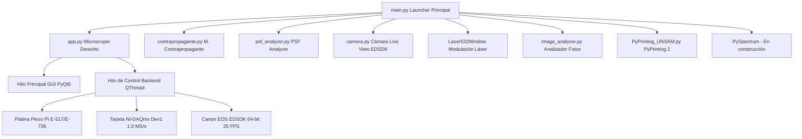

# Manual de Usuario Exhaustivo: PyPrinting 3.0 🔬
**Suite de Control, Espectroscopía Confocal, Caracterización de PSF y Nanofabricación Óptica**
*Laboratorio de Nanofotónica — Instituto de Nanosistemas (INS-UNSAM)*
*Autor Principal: José Luis González Peñafiel (Becario Doctoral CONICET)*

---

## 📖 Índice General

1. [Panel de Inicio Principal (`main.py` — "Bienvenidos al printing")](#1-panel-de-inicio-principal-mainpy--bienvenidos-al-printing)
   - [1.1 Visión General, Filosofía de Diseño y Arquitectura Multihilo](#11-visión-general-filosofía-de-diseño-y-arquitectura-multihilo)
   - [1.2 Selección Global de Modo Seguro (`SAFE_MODE`) vs. Modo Laboratorio Real](#12-selección-global-de-modo-seguro-safe_mode-vs-modo-laboratorio-real)
   - [1.3 Navegación e Índice de Módulos en Grilla Simétrica $3 \times 3$](#13-navegación-e-índice-de-módulos-en-grilla-simétrica-3-times-3)
2. [Fundamentos Físicos, Formulación Matemática & Mapeo de Hardware](#2-fundamentos-físicos-formulación-matemática--mapeo-de-hardware)
   - [2.1 Impresión Óptica Fototérmica de Nanopartículas Coloidales](#21-impresión-óptica-fototérmica-de-nanopartículas-coloidales)
   - [2.2 Ensamblado Guiado de Nanodímeros Plasmónicos y Campo Cercano](#22-ensamblado-guiado-de-nanodímeros-plasmónicos-y-campo-cercano)
   - [2.3 Modelo Analítico Gaussiano 2D Anisotrópico de 7 Parámetros](#23-modelo-analítico-gaussiano-2d-anisotrópico-de-7-parámetros)
   - [2.4 Modelo Analítico Haz Vortex / Donut (Laguerre-Gauss $LG_{01}$)](#24-modelo-analítico-haz-vortex--donut-laguerre-gauss-lg_01)
   - [2.5 Métricas Analíticas y Alineación Sub-nanométrica de PSF](#25-métricas-analíticas-y-alineación-sub-nanométrica-de-psf)
   - [2.6 Operación de Umbralización No Lineal de Ruido ($P\%$)](#26-operación-de-umbralización-no-lineal-de-ruido-p)
   - [2.7 Algoritmo de Estabilización Z Axial por Autocorrelación de Pearson](#27-algoritmo-de-estabilización-z-axial-por-autocorrelación-de-pearson)
   - [2.8 Mapeo Físico de Coordenadas y Calibración de Platina Piezoeléctrica PI](#28-mapeo-físico-de-coordenadas-y-calibración-de-platina-piezoeléctrica-pi)
   - [2.9 Formulación Matemática y Análisis de los 5 Criterios de Parada (Modos 0 a 4)](#29-formulación-matemática-y-análisis-de-los-5-criterios-de-parada-modos-0-a-4)
3. [Módulo 1: Microscopio Derecho (`app.py` — PyPrinting 3.0 Suite Completa)](#3-módulo-1-microscopio-derecho-apppy--pyprinting-30-suite-completa)
   - [3.1 Menú Principal (`Files`, `Tools`, `Measurements`, `Help`)](#31-menú-principal-files-tools-measurements-help)
   - [3.2 Dock: Confocal (Mapeo 2D/3D & Algoritmos de Centrado)](#32-dock-confocal-mapeo-2d3d--algoritmos-de-centrado)
   - [3.3 Dock: Trace (Trazas Temporales & Calibración Power BS)](#33-dock-trace-trazas-temporales--calibración-power-bs)
   - [3.4 Dock: Focus z (Autofoco Axial Dinámico)](#34-dock-focus-z-autofoco-axial-dinámico)
   - [3.5 Dock: Shutters / Flipper / Láser 532](#35-dock-shutters--flipper--láser-532)
   - [3.6 Dock: Nanopositioning (Platina Piezoeléctrica PI)](#36-dock-nanopositioning-platina-piezoeléctrica-pi)
   - [3.7 Ventana de Mediciones (Printing Automatizado de Grillas & Dímeros)](#37-ventana-de-mediciones-printing-automatizado-de-grillas--dímeros)
4. [Módulo 2: PySpectrum *(En Desarrollo: Espectrometría, Termometría & Scattering)*](#4-módulo-2-pyspectrum-en-desarrollo-espectrometría-termometría--scattering)
5. [Módulo 3: Microscopio Contrapropagante (`contrapropagante.py`)](#5-módulo-3-microscopio-contrapropagante-contrapropagantepy)
6. [Módulo 4: PyPrinting 2 (Legacy — `PyPrinting_UNSAM.py`)](#6-módulo-4-pyprinting-2-legacy--pyprinting_unsampy)
7. [Módulo 5: Cámara Live View (`camera.py` — Suite Canon EDSDK & Microfotónica)](#7-módulo-5-cámara-live-view-camerapy--suite-canon-edsdk--microfotónica)
   - [7.1 Motor de Transmisión Live View Adaptativo a 25 FPS](#71-motor-de-transmisión-live-view-adaptativo-a-25-fps)
   - [7.2 Captura Fotográfica 15.1 MP Multi-Formato & Nombres Únicos](#72-captura-fotográfica-151-mp-multi-formato--nombres-únicos)
   - [7.3 Transferencia en RAM MemoryStream (Inmune a Errores 0x000000AB)](#73-transferencia-en-ram-memorystream-inmune-a-errores-0x000000ab)
   - [7.4 Navegación Panorámica FOV (Ejes X / Y) & Ajustes de Imagen](#74-navegación-panorámica-fov-ejes-x--y--ajustes-de-imagen)
   - [7.5 Capa OverlayWidget: Reglas µm, Platina PI, ROI Confocal & Tracking](#75-capa-overlaywidget-reglas-µm-platina-pi-roi-confocal--tracking)
   - [7.6 Visor Emergente Desplegable de Diagnóstico EDSDK (`EDSDKLogDialog`)](#76-visor-emergente-desplegable-de-diagnóstico-edsdk-edsdklogdialog)
8. [Módulo 6: Modulación Láser 532 nm (`Laser532Window`)](#8-módulo-6-modulación-láser-532-nm-laser532window)
9. [Módulo 7: PSF Analyzer (`psf_analyzer.py`)](#9-módulo-7-psf-analyzer-psf_analyzerpy)
10. [Módulo 8: Analizador de Imágenes Estáticas (`image_analyzer.py`)](#10-módulo-8-analizador-de-imágenes-estáticas-image_analyzerpy)
11. [Módulo 9: Documentación y Créditos del Autor](#11-módulo-9-documentación-y-créditos-del-autor)
12. [Tabla Completa de Parámetros Globales (`config.py`)](#12-tabla-completa-de-parámetros-globales-configpy)
13. [Flujos de Trabajo Experimentales (Protocolos Paso a Paso)](#13-flujos-de-trabajo-experimentales-protocolos-paso-a-paso)
14. [Modelo Metrológico de Incertidumbre y Criterios Sub-píxel (Norma ISO/GUM)](#14-modelo-metrológico-de-incertidumbre-y-criterios-sub-píxel-norma-isogum)
15. [Protección de Exclusión Mutua en Hardware Real (Modo Laboratorio)](#15-protección-de-exclusión-mutua-en-hardware-real-modo-laboratorio)
16. [Tabla de Atajos de Teclado (Shortcuts)](#16-tabla-de-atajos-de-teclado-shortcuts)
17. [Guía de Resolución de Problemas y Diagnóstico (Troubleshooting)](#17-guía-de-resolución-de-problemas-y-diagnóstico-troubleshooting)
18. [Preguntas Frecuentes (FAQ)](#18-preguntas-frecuentes-faq)

---

## 1. Panel de Inicio Principal (`main.py` — "Bienvenidos al printing")

### 1.1 Visión General, Filosofía de Diseño y Arquitectura Multihilo
La suite **PyPrinting 3.0** está construida sobre una arquitectura modular desacoplada basada en **Python 3 / PyQt6** y **`pyqtgraph`**. Para evitar cuelgues de la interfaz gráfica durante operaciones de hardware de alta frecuencia (como el escaneo por rampa a $10\ \text{kHz}$ o la transmisión de video réflex), la aplicación utiliza un patrón **Frontend / Backend** con hilos dedicados (`QThread` y `moveToThread`).



---

### 1.2 Selección Global de Modo Seguro (`SAFE_MODE`) vs. Modo Laboratorio Real
En la barra superior del panel principal **`main.py`** se encuentra el selector interactivo **`Modo Seguro (Simulación)`**:

* **Modo Seguro Activado (`PYPRINTING_SAFE=1`)**:
  - Habilita la Capa de Abstracción de Hardware Mock (`nidaq._MockNITask` y `_MockPIStage`).
  - Genera ruido gaussiano síncrono con pulsos sintéticos de trigger para simular perfiles confocales 2D/3D y trazas temporales.
  - Habilita una cámara sintética basada en patrones fotónicos móviles para probar la interfaz gráfica sin instrumentos físicos.
* **Modo Laboratorio Real (`PYPRINTING_SAFE=0`)**:
  - Inicializa la comunicación por socket C/DLL con la controladora PI E-517/E-736.
  - Conecta la tarjeta **National Instruments PCIe-6323 / USB-6343** (Dispositivo `Dev1`).
  - Abre la sesión nativa **Canon EDSDK v13.x** para la cámara réflex.

---

### 1.3 Navegación e Índice de Módulos en Grilla Simétrica $3 \times 3$
El lanzador organiza los 9 módulos del laboratorio en una grilla simétrica de 3 filas y 3 columnas:

```
┌─────────────────────────┬─────────────────────────┬─────────────────────────┐
│ 🔬 Fila 1 - Columna 1   │ 🔮 Fila 1 - Columna 2   │ 🔍 Fila 1 - Columna 3   │
│ Microscopio Derecho     │ PySpectrum              │ Microscopio             │
│ (app.py)                │ (En desarrollo)         │ Contrapropagante (Const)│
├─────────────────────────┼─────────────────────────┼─────────────────────────┤
│ 🏛️ Fila 2 - Columna 1   │ 📷 Fila 2 - Columna 2   │ ⚡ Fila 2 - Columna 3   │
│ PyPrinting 2 (Legacy)   │ Cámara Live View        │ Modulación Láser        │
│ (PyPrinting_UNSAM.py)   │ (camera.py)             │ 532 nm (Laser532Window) │
├─────────────────────────┼─────────────────────────┼─────────────────────────┤
│ 🧬 Fila 3 - Columna 1   │ 🖼️ Fila 3 - Columna 2   │ 📚 Fila 3 - Columna 3   │
│ PSF Analyzer            │ Analizador de Imágenes  │ Documentación           │
│ (psf_analyzer.py)       │ (image_analyzer.py)     │ y Créditos del Autor    │
└─────────────────────────┴─────────────────────────┴─────────────────────────┘
```

---

## 2. Fundamentos Físicos, Formulación Matemática & Mapeo de Hardware

### 2.1 Impresión Óptica Fototérmica de Nanopartículas Coloidales
La **impresión óptica** logra la deposición espacial dirigida de nanopartículas coloidales metálicas (Au, Ag) desde una solución líquida sobre sustratos transparentes (vidrio o silicio). La interacción electromagnética está dominada por la fuerza de gradiente óptico $\mathbf{F}_{\text{grad}}$ y la fuerza de dispersión/absorción $\mathbf{F}_{\text{scat}}$:

$$\mathbf{F}_{\text{grad}} = \frac{1}{4} \varepsilon_m \operatorname{Re}(\alpha) \nabla |\mathbf{E}|^2$$

$$\mathbf{F}_{\text{scat}} = \frac{k^4}{6\pi} |\alpha|^2 \frac{n_m}{c} \mathbf{S}$$

donde $\alpha$ es la polarizabilidad de Clausius-Mossotti dada por:

$$\alpha = 3 V \frac{\varepsilon_p - \varepsilon_m}{\varepsilon_p + 2\varepsilon_m}$$

Al sintonizar la longitud de onda de excitación con la **Resonancia de Plasmón de Superficie Localizado (LSPR)** del oro ($\approx 532\ \text{nm}$), $\operatorname{Re}(\alpha)$ se maximiza, atrayendo fuertemente la nanopartícula hacia el punto de máxima intensidad en el centro de la cintura del haz focalizado ($\nabla |\mathbf{E}|^2$).

---

### 2.2 Ensamblado Guiado de Nanodímeros Plasmónicos y Campo Cercano
La fabricación de **nanodímeros plasmónicos** consiste en posicionar una segunda nanopartícula a una distancia gap sub-100 nm de una primera partícula previamente depositada. Al aproximarse a distancias nanométricas, el acoplamiento de campo cercano modifica la polarizabilidad efectiva $\alpha_{\text{eff}}$, creando un punto caliente plasmónico (*hot-spot*) que amplifica exponencialmente la intensidad Raman (SERS):

$$\mathbf{E}_{\text{local}} \propto \left( \frac{d}{r} \right)^{-3} \mathbf{E}_0$$

```
[Partícula 1 Deposita] ──> [Escaneo Confocal Local] ──> [Fit Gaussiano (x1, y1)] ──> [Offset Δx, Δy] ──> [Deposición Partícula 2]
```

---

### 2.3 Modelo Analítico Gaussiano 2D Anisotrópico de 7 Parámetros
Para caracterizar la distribución de intensidad fototérmica o de fluorescencia en el plano focal horizontal ($XY$), el sistema ajusta una Gaussiana 2D elíptica inclinada en un ángulo $\theta$ mediante mínimos cuadrados no lineales (`scipy.optimize.curve_fit`):

$$G(x, y) = Z_{\text{offset}} + A \cdot \exp\left( -\left[ a(x - x_0)^2 + 2b(x - x_0)(y - y_0) + c(y - y_0)^2 \right] \right)$$

Los coeficientes de la matriz cuadrática de rotación son:

$$a = \frac{\cos^2\theta}{2\sigma_x^2} + \frac{\sin^2\theta}{2\sigma_y^2}, \quad b = -\frac{\sin(2\theta)}{4\sigma_x^2} + \frac{\sin(2\theta)}{4\sigma_y^2}, \quad c = \frac{\sin^2\theta}{2\sigma_x^2} + \frac{\cos^2\theta}{2\sigma_y^2}$$

El Ancho Completo a la Mitad del Máximo (FWHM) a lo largo de los ejes principales de la elipse se calcula mediante:

$$\text{FWHM}_x = 2\sqrt{2\ln 2} \cdot \sigma_x \approx 2.354820 \cdot \sigma_x, \quad \text{FWHM}_y = 2.354820 \cdot \sigma_y$$

---

### 2.4 Modelo Analítico Haz Vortex / Donut (Laguerre-Gauss $LG_{01}$)
Para caracterizar haces con singularidad de fase espiral ($e^{i l \phi}$) o donas de depleción en nanoscopía STED, el módulo **PSF Analyzer** y el widget **Confocal** ajustan la distribución analítica Laguerre-Gauss de primer orden $LG_{01}$:

$$I_{\text{donut}}(x, y) = Z_{\text{offset}} + A \cdot r_n^2(x, y) \cdot \exp\left( - r_n^2(x, y) \right)$$

donde la distancia radial elíptica normalizada $r_n^2$ está definida por:

$$r_n^2(x, y) = \frac{(x - x_0)^2}{2\sigma_x^2} + \frac{(y - y_0)^2}{2\sigma_y^2}$$

---

### 2.5 Métricas Analíticas y Alineación Sub-nanométrica de PSF
El módulo **PSF Analyzer** computa cuantitativamente la calidad analítica de la PSF y la desalineación espacial entre el canal de excitación verde (Canal 1) y el donut rojo de depleción (Canal 2):

1. **Desalineación Vectorial Dual ($\Delta r_{\text{nm}}$)**:
   $$\Delta r_{\text{nm}} = \sqrt{(x_1 - x_2)^2 + (y_1 - y_2)^2} \times 1000 \quad [\text{nm}]$$
2. **Radio del Anillo Donut ($r_0$)**:
   $$r_0 = \sqrt{\sigma_x \cdot \sigma_y} \quad [\mu\text{m}]$$
3. **Elipticidad del Donut ($a/b$)**:
   $$\text{Elipticidad} = \frac{\sigma_x}{\sigma_y} \quad (\text{o viceversa si } \sigma_y > \sigma_x)$$
4. **Calidad del Cero Central ($I_{\min}/I_{\max}$)**: Intensidad residual en el nulo central dividida por la intensidad de pico del anillo. Un valor $<0.05$ representa un nulo óptico de alta calidad.
5. **Uniformidad Angular ($\sigma_{\theta}/\bar{I}$)**: Desviación estándar de la intensidad tomada circularmente a lo largo del anillo dividida por la intensidad media del anillo.
6. **Bondad de Ajuste Statistic ( $R^2$, $\text{RMS}$ y $\chi^2_{\text{red}}$ )**:
   $$R^2 = 1 - \frac{\sum (Z_i - Z_{\text{fit}, i})^2}{\sum (Z_i - \bar{Z})^2}, \quad \text{RMS} = \sqrt{\frac{1}{N} \sum_{i=1}^N (Z_i - Z_{\text{fit}, i})^2}$$

---

### 2.6 Operación de Umbralización No Lineal de Ruido ($P\%$)
El casillero **`Filtro (%)`** aplica un operador no lineal por corte de umbral sobre la matriz normalizada $Z_n \in [0.0, 1.0]$:

$$Z_f[x, y] = \begin{cases} Z_n[x, y] & \text{si } Z_n[x, y] \ge \frac{P}{100} \\ 0.0 & \text{si } Z_n[x, y] < \frac{P}{100} \end{cases}$$

---

### 2.7 Algoritmo de Estabilización Z Axial por Autocorrelación de Pearson
Para corregir la deriva térmica del plano de enfoque axial ($Z$), el sistema adquiere un perfil de intensidad $I(z)$ y calcula el coeficiente de correlación cruzada normalizado de Pearson respecto a la firma congelada de referencia $I_{\text{ref}}(z)$:

$$r(z) = \frac{\sum (I(z) - \bar{I})(I_{\text{ref}}(z) - \bar{I}_{\text{ref}})}{\sqrt{\sum (I(z) - \bar{I})^2 \sum (I_{\text{ref}}(z) - \bar{I}_{\text{ref}})^2}}$$

---

### 2.8 Mapeo Físico de Coordenadas y Calibración de Platina Piezoeléctrica PI
Mapeo de transformación de ejes espaciales entre la imagen de cámara réflex y el movimiento físico de la platina PI E-517 ($0.0 - 100.0\ \mu\text{m}$):
- **Cámara Hacia la DERECHA ($+X_{\text{cam}}$)** $\longrightarrow$ **Platina $+Y_{\text{PI}}$**
- **Cámara Hacia ABAJO ($+Y_{\text{cam}}$)** $\longrightarrow$ **Platina $+X_{\text{PI}}$**
- **Eje Axial Óptico ($Z_{\text{óptico}}$)** $\longrightarrow$ **Platina $+Z_{\text{PI}}$**

---

### 2.9 Formulación Matemática y Análisis de los 5 Criterios de Parada (Modos 0 a 4)
En la impresión óptica fototérmica y el ensamblado de nanodímeros plasmónicos, el cierre oportuno del obturador es crítico para detener la irradiación de forma inmediata al detectar la deposición de una nanopartícula metálica. Esto evita el sobrecalentamiento local, la fusión fototérmica del nanoensamblado y la deposición no deseada de partículas secundarias. **PyPrinting 3.0** incluye 5 criterios de parada seleccionables dinámicamente en la interfaz de mediciones (`measurements.py` / `app.py`):

1. **Modo 0: Legacy (Salto Relativo Estándar)**
   - **Formulación Matemática**:
     $$I_{\text{new}}[t] > \text{Umbral\_Relativo} \cdot I_{\text{old}}$$
   - **Propósito & Utilidad**: Mantiene $100\%$ de compatibilidad retroactiva con rutinas históricas y secuencias estándar de PyPrinting 2.
   - **Mapeo de Parámetros**: Requiere ingresar el `Umbral` relativo (ej. $1.20$ indica un $20\%$ de incremento sobre la línea base).

2. **Modo 1: Salto Relativo + Umbral Absoluto (V) & Anti-Paso ($N_{\text{hold}}$ Steps)**
   - **Formulación Matemática**:
     $$\text{Condición}(t) = \left( \frac{I_{\text{new}}[t]}{I_{\text{old}}} > \text{Umbral\_Relativo} \right) \quad \mathbf{OR} \quad \left( I_{\text{new}}[t] > V_{\text{abs}} \right)$$
     $$\text{Cierre Obturador} \iff \text{Condición}(t) = \text{True} \quad \forall t \in [t_0, t_0 + N_{\text{hold}} \cdot \Delta t]$$
   - **Propósito & Utilidad**:
     - *Resolución a $t=0$*: Elimina el problema de la impresión instantánea donde $I_{\text{old}}$ ya inicia en un nivel alto y el salto relativo resulta insuficiente para disparar la parada.
     - *Filtro Anti-Paso*: Evita cierres falsos del obturador provocados por partículas que cruzan transitoriamente el foco volando sin depositarse.
   - **Mapeo de Parámetros**: Requiere `Umbral Absoluto (V)` ($V_{\text{abs}}$) y `N_hold` (número de muestras analógicas consecutivas a $1\text{ kHz}$ en las que debe sostenerse la señal, ej. $N_{\text{hold}}=5$).

3. **Modo 2: Derivada Temporal Adaptativa & Aplanamiento ($dI/dt$)**
   - **Formulación Matemática**:
     Derivada temporal discreta filtrada en tiempo real:
     $$\frac{dI}{dt}[t] = \frac{I[t] - I[t - 5\Delta t]}{5\Delta t} \quad [\text{V/s}]$$
     $$\text{Cierre Obturador} \iff \left( \frac{dI}{dt}[t] < \text{Slope\_Flat} \right) \quad \mathbf{AND} \quad \left( I_{\text{new}}[t] > I_{\text{old}} + \Delta V \right)$$
   - **Propósito & Utilidad**: Diseñado para perfiles de deposición continua con crecimiento exponencial $I(t) = I_0 + A(1 - e^{-t/\tau})$. Evalúa la meseta superior de la curva y gatilla el cierre una vez que la tasa de incremento se aplana ($\frac{dI}{dt} \to 0$), indicando que la partícula ha finalizado su acomodamiento físico en el sustrato.
   - **Mapeo de Parámetros**: Requiere `Slope Min` (pendiente mínima de activación en V/s) y `Slope Flat` (derivada máxima permitida en la meseta para confirmar la deposición).

4. **Modo 3: Calibración Confocal Raw & Umbral Absoluto Reescalado ($K_{\text{scale}}, P\%$)**
   - **Formulación Matemática**:
     Cálculo físico automatizado del voltaje de umbral objetivo a partir de la imagen confocal previa:
     1. Fondo de vidrio limpio: $V_{\text{vidrio}} = \min(V_{\text{raw}})$
     2. Factor de escala de potencia: $K_{\text{scale}} = \frac{P_{\text{print}}}{P_{\text{scan}}}$
     3. Voltaje pico reescalado: $V_{\text{pico\_reescalado}} = V_{\text{vidrio}} + K_{\text{scale}} \cdot (V_{\text{pico\_raw}} - V_{\text{vidrio}})$
     4. Voltaje de umbral objetivo: $V_{\text{umbral}} = V_{\text{vidrio}} + \frac{P\%}{100} \cdot (V_{\text{pico\_reescalado}} - V_{\text{vidrio}})$
   - **Propósito & Utilidad**: Automatiza metrológicamente el cálculo del voltaje absoluto en Volts eliminando la estimación manual por parte del operador. Relaciona directamente la intensidad detectada en el barrido confocal ($P_{\text{scan}}$) con la potencia de impresión ($P_{\text{print}}$).
   - **Información y Archivos Adicionales**: Genera y guarda automáticamente en disco el mapa confocal reescalado en formatos `.txt` y `.tiff` (`NPscan_rescaled_00i.txt` y `NPscan_rescaled_00i.tiff`).
   - **Mapeo de Parámetros**: Requiere `Ratio K` ($P_{\text{print}}/P_{\text{scan}}$) y `Umbral Porcentual P%` (ej. $50.0\%$).

5. **Modo 4: Criterio Híbrido Tri-Factor (All-In-One)**
   - **Formulación Matemática**:
     $$\text{Cierre Obturador} \iff \left[ \text{Modo 1 (Salto/Absoluto)} \;\mathbf{AND}\; \text{Modo 2 (Aplanamiento } dI/dt) \right] \quad \text{sostenido durante } N_{\text{hold}} \text{ pasos}$$
   - **Propósito & Utilidad**: Máxima robustez experimental para muestras complejas o bajas relaciones señal-ruido. Combina la protección anti-paso, la detección instantánea a $t=0$, el umbral absoluto en Volts y la verificación de aplanamiento de derivada temporal.
   - **Mapeo de Parámetros**: Utiliza la combinación total de parámetros (`Umbral`, `V_abs`, `N_hold`, `Slope_Flat`, `Ratio_K`, `P%`).

---

## 3. Módulo 1: Microscopio Derecho (`app.py` — PyPrinting 3.0 Suite Completa)

### 3.1 Menú Principal (`Files`, `Tools`, `Measurements`, `Help`)
* **Menú `Files`**:
  - `Select Base Path (Ctrl+A)`: Selecciona la carpeta raíz de trabajo.
  - `Create Daily Dir (Ctrl+S)`: Crea automáticamente la subcarpeta del día (`YYYY-MM-DD`).
  - `Open Working Directory (Ctrl+D)`: Abre la carpeta actual en el Explorador de Windows.
* **Menú `Tools`**:
  - Acceso directo a la ventana de `Cámara`, `Analizador de Imágenes`, `PSF Analyzer` y `Modulación Láser 532 nm`.
* **Menú `Measurements`**:
  - `Printing`: Abre la ventana de impresión automatizada de grillas.
  - `Dimers`: Abre la ventana de ensamblado guiado de dímeros plasmónicos.

---

### 3.2 Dock: Confocal (Mapeo 2D/3D & Algoritmos de Centrado)
| Control | Tipo | Rango / Opciones | Descripción |
|---|---|---|---|
| **`Laser`** | `QComboBox` | `532 nm`, `637 nm`, `592 nm` | Línea de excitación láser para la iluminación confocal. |
| **`Range x / y`** | `QDoubleSpinBox` | $0.100 - 100.000\ \mu\text{m}$ | Dimensión física del área cuadrada/rectangular a escanear. |
| **`Pixels x / y`** | `QSpinBox` | $10 - 500$ | Resolución en píxeles de la matriz de adquisición confocal. |
| **`Scan mode`** | `QComboBox` | `Ramp`, `Step by step` | `Ramp`: Lectura síncrona continua a $10\ \text{kHz}$ por hardware NI-DAQ. `Step`: Paso a paso por software. |
| **`Scan projection`**| `QComboBox` | `x/y`, `x/z`, `y/z` | Plano ortogonal de escaneo confocal. |
| **`Scan Image`** | `QComboBox` | `NPs maximum`, `NPs minimum` | `NPs maximum`: Partículas brillantes (fluorescencia/scattering). `NPs minimum`: Partículas oscuras (absorción). |
| **`method_center`** | `QComboBox` | `center of mass`, `center of gauss`, `two NP: center of gauss`, `donut (Laguerre-Gauss)` | Algoritmo de centrado analítico para calcular la posición de la partícula. |
| **`Auto CM`** | `QCheckBox` | `True` / `False` | Si está marcado, desplaza automáticamente la platina PI al centro calculado tras finalizar el escaneo. |
| **`Filtro (%)`** | `QLineEdit` | $0.0 - 99.0\%$ | Porcentaje de umbral de filtrado de ruido para la eliminación de fondo. |
| **`Start Scan`** | `QPushButton` | Exec | Inicia la rutina de escaneo confocal síncrono. |

---

### 3.3 Dock: Trace (Trazas Temporales & Calibración Power BS)
* **Monitoreo de Fotoluminiscencia**:
  - Graficado temporal continuo de intensidad en Volts ($V$) emitidos por los fotodiodos.
  - Tecla **F1**: Inicia la adquisición continua (*Play*).
  - Tecla **F2**: Detiene la adquisición y guarda la traza en disco (*Stop & Save*).
* **Ventana `PowerBSWindow`**:
  - Monitoreo continuo de la potencia reflejada en el fotodiodo divisor (*Beam Splitter*).
  - Permite ingresar lecturas de potencia comercial (`High power`, `Low power`) y ejecutar **`Set Calibration`** para obtener la constante de conversión en $\text{mW/V}$.

---

### 3.4 Dock: Focus z (Autofoco Axial Dinámico)
| Control | Tecla | Función |
|---|---|---|
| **`Go to maximum`** | **F8** | Ejecuta un barrido axial rápido en Z y desplaza el piezo al pico de máxima intensidad. |
| **`Lock Focus`** | **F9** | Registra y congela el perfil $I_{\text{ref}}(z)$ como referencia de enfoque. |
| **`Autocorrelation ×2`**| **F10** | Ejecuta la correlación de Pearson y corrige la deriva axial en Z. |

---

### 3.5 Dock: Shutters / Flipper / Láser 532
* **`Shutter 532 nm`**: Abre/Cierra el obturador del láser verde.
* **`Shutter 637 nm`**: Abre/Cierra el obturador del láser rojo.
* **`Shutter 592 nm`**: Abre/Cierra el obturador del láser amarillo.
* **`Low power`**: Activa el atenuador óptico de baja potencia.
* **`Mirror up / down`**: Sube o baja el espejo del filtro Notch de 532 nm (*Flipper*).
* **`Láser 532 Voltage`**: Ajusta el voltaje analógico DAC ($1.0 - 5.0\ \text{V}$).

---

### 3.6 Dock: Nanopositioning (Platina Piezoeléctrica PI)
* Muestra la lectura continua en micrómetros ($X, Y, Z$) de los sensores capacitivos en bucle cerrado de la platina PI E-517/E-736.
* Botones de incremento relativo ($\pm 0.1\ \mu\text{m}$, $\pm 1.0\ \mu\text{m}$, $\pm 10.0\ \mu\text{m}$).

---

### 3.7 Ventana de Mediciones (Printing Automatizado de Grillas & Dímeros)

La ventana emergente de **Mediciones** (`measurements.py`) coordina la impresión automatizada nodo a nodo de arrays de nanopartículas y el ensamblado de nanoestructuras acopladas.

> [!NOTE]
> Para consultar el protocolo experimental completo paso a paso ("DO PRINTING") y la guía detallada de operación, remítase al reporte especializado:  
> [Guía y Protocolo de Impresión de Grillas (reportes/Protocolo_y_Guia_de_Impresion_de_Grillas_PyPrinting3.md)](file:///c:/Users/josel/Documents/Obsidian_Vault/printing3/reportes/Protocolo_y_Guia_de_Impresion_de_Grillas_PyPrinting3.md)

#### 3.7.1 Pestaña `Printing` (Impresión Automatizada de Grillas)
- **`Create Grid`**: Configura la matriz simétrica definiendo número de partículas por columna (`NPs/col`), número de columnas (`Cols`), espaciamiento entre nanopartículas (`Dist NP µm`) y espaciamiento entre columnas (`Dist Col µm`).
- **`Load Grid`**: Carga una matriz de posiciones personalizadas $(X, Y)$ desde un archivo de texto plano `.txt`.
- **`Set reference`**: Captura la posición actual de los sensores capacitivos de la platina PI como origen absoluto de la grilla $(X_0, Y_0, Z_0)$.
- **`Go to reference`**: Retorna inmediatamente la platina a las coordenadas origen.
- **`Display 2D del Patrón & Camino (`Grid Pattern & Path Viewer 🗺️`)**:
  - **Dock Desplegable Integrado**: Previsualización gráfica 2D de la matriz completa con mapa de colores dinámico por estado de partícula:
    - ⚪ **Pendiente** (Gris): Nodos futuros.
    - 🟡 **En Proceso** (Amarillo brillante pulsante): Nodo activo en impresión o autofoco.
    - 🟢 **Impresa** (Verde esmeralda): Nanopartícula impresa con éxito.
    - 🔴 **Timeout** (Rojo carmesí): Nodo donde expiró $T_{\text{max}}$.
  - **Camino del Microscopio**: Línea de trayectoria punteada que muestra el recorrido secuencial de la platina PI.
  - **Controles Interactivos**:
    - `[ 🏷️ Números ]`: Muestra u oculta los números de los nodos.
    - `[ 🛤️ Camino ]`: Muestra u oculta la línea de trayectoria.
    - `[ 🎯 Reset View ]`: Auto-centrado y ajuste de escala 1:1.
    - **Click en Nodo**: Al presionar cualquier partícula en la gráfica 2D, el casillero `Target Index` se actualiza inmediatamente a ese nodo.
- **`Barra de Progreso`**: Indicador gráfico (`QProgressBar`) del avance porcentual del lote ($i / N_{\text{total}}$).
- **`T max (s)`**: Tiempo máximo de residencia por nodo (segundos) antes de abortar por tiempo agotado (*timeout*) si no se gatilla la condición de parada.
- **`Steps before / after`**:
  - `Steps before`: Número de muestras analógicas adquiridas antes de abrir el obturador para calcular la línea base $I_{\text{old}}$.
  - `Steps after`: Muestras adicionales adquiridas inmediatamente después del cierre del obturador para registrar la meseta post-impresión.
- **`Autofocus Every N`**: Frecuencia de ejecución del autofoco dinámico en Z (ej. cada 2 nodos) para compensar derivas mecánicas durante grillas extensas.
- **`Shift X / Shift Y (µm)`**: Desplazamiento lateral offset introducido temporalmente para realizar el autofoco axial en una zona limpia contigua sin perturbar el nodo actual.

#### 3.7.2 Pestaña `Dimers` (Ensamblado Guiado de Nanodímeros Plasmónicos)
- Permite la fabricación guiada de nanodímeros con separación interpartícula (*gap*) sub-100 nm.
- Incorpora opciones para activar **Pre-Scan Confocal** (escaneo 2D de la nanopartícula 1 antes de imprimir la nanopartícula 2) y **Post-Scan Confocal** (escaneo de verificación final del dímero formado).
- **`dx / dy (µm)`**: Vector de desplazamiento offset deseado para la colocación de la segunda nanopartícula respecto al centro ajustado de la primera.

#### 3.7.3 Configuración de los 5 Criterios de Parada Seleccionables
El menú desplegable **`Criterio Parada`** permite seleccionar dinámicamente el algoritmo de interrupción en tiempo real:

| Modo Seleccionable | Nombre en Interfaz | Parámetros que Habilita en la UI | Archivos e Información Generados |
|---|---|---|---|
| **Modo 0** | `Legacy (Relativo)` | `Umbral` (salto relativo, ej. 1.20) | Trazas de intensidad `.txt` en la carpeta del lote (`NP_001.txt`). |
| **Modo 1** | `Relativo + Absoluto + AntiPaso` | `Umbral`, `Umbral Absoluto (V)`, `N_hold` (pasos anti-paso) | Traza temporal con indicador de estado `hold_counter` en el log. |
| **Modo 2** | `Derivada dI/dt (Aplanamiento)` | `Slope Min (V/s)`, `Slope Flat (V/s)`, `V_abs` | Registro de derivada instantánea $dI/dt$ y meseta detectada. |
| **Modo 3** | `Confocal Raw & Rescaled` | `Ratio K (P_print/P_scan)`, `Umbral P%` (ej. 50%) | Mapas confocales reescalados `NPscan_rescaled_00i.txt` y `NPscan_rescaled_00i.tiff`. |
| **Modo 4** | `Híbrido Tri-Factor (All-In-One)` | `Umbral`, `V_abs`, `N_hold`, `Slope_Flat`, `Ratio_K`, `P%` | Log integral de triple verificación y resumen de parada. |

#### 3.7.4 Flujo de Datos y Salida en Disco
Al iniciar la rutina con el botón **`Play ►`**:
1. Se crea la carpeta del lote experimental con sello de tiempo: `YYYYMMDD-HHMMSS_Printing_<GridName>` o `YYYYMMDD-HHMMSS_Dimers_<GridName>`.
2. Para cada nodo se guarda la traza temporal de intensidad `NP_00i.txt` conteniendo columnas: `Tiempo (s)`, `Signal (V)` y `BS Power (V)`.
3. Si el escaneo está activo, se almacenan las imágenes confocales `.tiff` (Go, Back, Image).
4. Se genera el archivo sintético de error de posicionamiento `printing_error_timestamp.txt` conteniendo los residuos en nanómetros ($\Delta x_{\text{nm}}, \Delta y_{\text{nm}}$) entre la posición teórica de la grilla y el centro de masa real.
5. El botón **`Save Grid Info`** exporta el archivo `grid_info.txt` con la metainformación completa (Láser, Criterio de Parada, Umbrales, Potencia BFP, Tipo de NP, Sustrato y Comentarios).

---

## 4. Módulo 2: PySpectrum *(En Desarrollo: Espectrometría, Termometría & Scattering)*

El panel **`🔮 PySpectrum`** (Fila 1, Columna 2 del lanzador `main.py`) está diseñado como el reemplazo nativo en Python del software comercial *Andor Solis*:
* **Integración CCD/EMCCD**: Control directo de cámaras espectroscópicas Andor/Princeton.
* **Nano-termometría Fotónica**: Algoritmos de deconvolución de espectros de fluorescencia y dispersión Raman/Plasmónica para medir temperatura local a escala geométrica nanométrica.

---

## 5. Módulo 3: Microscopio Contrapropagante (`contrapropagante.py`)

El botón **`🔍 Microscopio Contrapropagante`** (Fila 1, Columna 3 del lanzador `main.py`) o la ejecución de `python contrapropagante.py` abren la suite para excitación dual síncrona TOP/BOT:

1. **Visualización Simétrica Dual**: Confocal TOP (objetivo superior seco/inmersión) a la izquierda, controles compartidos al centro y Confocal BOT (objetivo invertido de agua $60\times$ $\text{NA}=1.0$) a la derecha.
2. **Mapeo Dinámico de Fotodiodos**: Vincula automáticamente la entrada analógica de adquisición según la línea láser seleccionada:
   - `532 nm (Verde)` $\rightarrow$ Fotodiodo 0 (`ai0`).
   - `637 nm (Rojo)` $\rightarrow$ Fotodiodo 1 (`ai1`).
   - `592 nm (Amarillo)` $\rightarrow$ Fotodiodo 3 (`ai3`).
3. **Lectura Sub-nanométrica de Posición**: Muestra en tiempo real las coordenadas centroides $(x_{\text{TOP}}, y_{\text{TOP}})$, $(x_{\text{BOT}}, y_{\text{BOT}})$ y calcula el vector de desalineación vectorial espacial:
   $$\mathbf{\Delta r}_{\text{nm}} = \mathbf{r}_{\text{TOP}} - \mathbf{r}_{\text{BOT}} = \sqrt{(x_{\text{TOP}} - x_{\text{BOT}})^2 + (y_{\text{TOP}} - y_{\text{BOT}})^2} \times 1000 \quad [\text{nm}]$$
4. **Acceso Directo a PSF Analyzer**: Botón **`📊 Analyze with PSF Analyzer`** que transfiere instantáneamente ambas confocales cargando TOP como Canal 1 y BOT como Canal 2 para la evaluación de perfiles 1D y desalineación.

---

## 6. Módulo 4: PyPrinting 2 (Legacy — `PyPrinting_UNSAM.py`)

El botón **`🏛️ Iniciar PyPrinting 2`** (Fila 2, Columna 1 del lanzador `main.py`) ejecuta la versión histórica del sistema situada en `../printing2/PyPrinting_UNSAM.py`:
* Permite a los investigadores ejecutar secuencias de impresión antiguas, verificar compatibilidad de archivos de datos `.txt` legacy y comparar el desempeño de algoritmos de centrado preexistentes.

---

## 7. Módulo 5: Cámara Live View (`camera.py` — Suite Canon EDSDK & Microfotónica)

El botón **`📷 Iniciar Cámara Live View`** (Fila 2, Columna 2 del lanzador `main.py`) o el comando `python camera.py` ejecutan la suite unificada resultante de la fusión de `canon_test.py` y `modules/camera.py`:

### 7.1 Motor de Transmisión Live View Adaptativo a 25 FPS y Simulación de Exposición EVF (`ISO 3200`)
- **Simulación de Exposición en Live View (`Evf_Mode = 1`)**:
  Al activar Live View, el controlador configura `kEdsPropID_Evf_Mode = 1` (*Exposure Simulation*). Esto elimina la ganancia automática EVF que producía ruido de patrón coloreado a baja señal, vinculando la vista previa directamente al ISO manual 3200, velocidad $T_v$ y apertura $A_v$ seleccionadas (igual que Canon EOS Utility).
- **Warm-up de 5 Segundos**: Durante los primeros 5 segundos tras presionar `Iniciar Cámara Canon`, las consultas de ISO y Tv se bloquean temporalmente mientras el hardware réflex inicializa el espejo y la salida de video. El sistema emite la lista completa de propiedades para asegurar disponibilidad inmediata en la UI.
- **Temporización Monodisparo Adaptativa (`_fetch_frame_adaptive`)**:
  Utiliza marcas de tiempo en microsegundos (`time.perf_counter()`) para calcular dinámicamente el tiempo de descanso:
  $$\text{delay\_ms} = \max\left(1, \text{int}(40.0 - t_{\text{procesamiento\_ms}})\right)$$
  Garantiza una velocidad constante de **25.0 FPS (40.0 ms por cuadro)** sin acumulación de cuadros en el búfer USB, eliminando congelamientos o aceleraciones bruscas.

### 7.2 Captura Fotográfica 15.1 MP Multi-Formato & Nombres Únicos
- **Resolución Nivel Réflex de 15.1 Megapíxeles (4752×3168)**:
  Soporta exportación en **JPG** (máxima resolución nativa), **PNG** (sin pérdida), **TIFF** (metrología óptica) y **BMP** (mapa de bits sin comprimir).
- **Pausa Automática del Stream Live View**: Al obturar, la emisión EVF se pausa automáticamente durante 350 ms para liberar recursos del chip DIGIC 4 y evitar bloqueos en el espejo mecánico réflex.
- **Garantía de Nombres Únicos (`get_unique_save_path`)**:
  Las fotos se nombran con fecha y hora (`CANON_EOS500D_YYYYMMDD_HHMMSS.[ext]`). Si ya existe un archivo con ese nombre en la carpeta seleccionada, el algoritmo añade automáticamente un prefijo contador (`_01`, `_02`), impidiendo la sobreescritura accidental.

### 7.3 Transferencia en RAM MemoryStream (Inmune a Errores `0x000000AB` y `0x00000061`)
- **Descarga Directa a Memoria RAM**: En lugar de requerir que el SDK de Canon abra y cree archivos de disco (lo cual provocaba errores de formato de ruta `0x000000AB` en Windows de 64 bits), la imagen se descarga directamente desde la cámara réflex a un `EdsCreateMemoryStream` en la memoria RAM del sistema.
- **Escritura Binaria Nativa en Python**: Python lee el arreglo de bytes de la RAM (`ctypes.string_at`) y escribe el archivo directamente en el disco duro (`open(save_path, "wb").write(raw_bytes)`), garantizando un 100% de confiabilidad en la transferencia de archivos.
- **Firma de Punteros de 64 Bits (`ctypes.c_wchar_p`)**: Se definieron firmas explícitas para la DLL C++ de Canon, evitando la truncación de punteros de memoria de 64 bits (`OverflowError`) y corrigiendo la excepción de tipos `c_char_p`.

### 7.4 Control de Ruido de Fondo, Zoom EDSDK y Miniatura PiP Interactiva
- **Supresión de Ruido de Fondo en Vivo**:
  - **Umbral de Fondo (*Noise Floor Threshold* $0-50$)**: Deslizador en la GUI que fuerza a cero absoluto $(0,0,0)$ los píxeles de ruido de lectura de sensor.
  - **Filtro Mediano 3x3 (`denoise`)**: Filtro espacial que remueve picos de ruido aislados de tipo sal y pimienta.
- **Zoom Hardware EDSDK (`1x`, `5x`, `10x`) y Magnificación**: Permite seleccionar aumentos nativos del sensor réflex enviando coordenadas `EdsPoint` al hardware de la cámara.
- **Miniatura PiP (Picture-in-Picture) de Navegación Espacial**:
  - Renderiza en vivo el plano completo a $1\times$ en la esquina inferior del visor.
  - Muestra un **recuadro dinámico cian (Bounding Box)** que indica la zona ampliada y el nivel de zoom actual.
  - Permite mover el centro de zoom $(c_x, c_y)$ en vivo haciendo clic o arrastrando con el mouse sobre la miniatura PiP.
- **Geometría Flush sin Marcos de ViewBox**:
  - Visor integrado al tema oscuro continuo (`#0b0f19`).
  - `OverlayWidget` reparentado a `self._view.viewport()` y delimitación de anchos en `QSplitter` con `setCollapsible(1, False)`, asegurando que el visor permanezca 100% centrado entre paneles sin desbordar ni meterse detrás del panel de mediciones.

### 7.5 Capa OverlayWidget: Reglas µm, Platina PI, ROI Confocal & Tracking
- **Reglas H/V en µm**: Reglas orientables en pantalla calibradas en micrómetros según `PIXEL_SIZE_UM`.
- **Cursor de Platina PI (`Cursor_pp`)**: Muestra en tiempo real la posición del cursor de la platina nano-posicionadora PI sobre la imagen.
- **Medición 2 Puntos**: Muestra la distancia proyectada ($\mu\text{m}$) y el ángulo ($\theta^\circ$) entre dos clics en pantalla.
- **ROI → Confocal**: Permite dibujar un rectángulo de interés y enviarlo directamente como coordenadas de escaneo al módulo confocal (`sendRoiSignal`).
- **Detección de Partículas**: Integra detección puntual (`psf.py` / `trackpy`) y tabla interactiva de coordenadas ($x, y, \sigma$).

### 7.6 Visor Emergente Desplegable de Diagnóstico EDSDK (`EDSDKLogDialog`)
- El panel de mensajes de diagnóstico EDSDK se aloja en una ventana modal emergente desplegable que no ocupa espacio en el panel principal. Se abre presionando el botón **`📜 Ver Log de Diagnóstico EDSDK`**.

---

## 8. Módulo 6: Modulación Láser 532 nm (`Laser532Window`)

El botón **`⚡ Iniciar Control Láser 532`** (Fila 2, Columna 3 del lanzador `main.py`) despliega la ventana flotante de modulación analógica:
* **Control de Potencia por Voltaje DAC**:
  - Deslizador horizontal y `QDoubleSpinBox` con precisión de 3 decimales para enviar voltaje analógico ($1.000\ \text{V} - 5.000\ \text{V}$) a la línea `Dev1/ao2` de la tarjeta NI-DAQmx.
* **Accionamiento Directo del Shutter Verde (532 nm)**:
  - Botón de conmutación de estado:
    - **`► Abrir Shutter 532 nm (Cerrado)`** (Fondo verde `#2e7d32`): Ejecuta `open_shutter("532 nm (green)")`.
    - **`■ Cerrar Shutter 532 nm (Abierto)`** (Fondo rojo `#c62828`): Ejecuta `close_shutter("532 nm (green)")`.

---

## 9. Módulo 7: PSF Analyzer (`psf_analyzer.py`)

El botón **`📊 Iniciar PSF Analyzer`** (Fila 3, Columna 1 del lanzador `main.py`) o el comando `python psf_analyzer.py` abren la herramienta de caracterización 2D:

```
┌────────────────────────────────────────────────────────────────────────────────────────┐
│ Canal 1 (Excitación Verde)  │  Original / Filtrada   │  Modelo Fit 2D  │  Residuales   │
├─────────────────────────────┼────────────────────────┼─────────────────┼───────────────┤
│ Canal 2 (Donut STED Rojo)   │  Original / Filtrada   │  Modelo Fit 2D  │  Residuales   │
└─────────────────────────────┴────────────────────────┴─────────────────┴───────────────┘
```

* **Visualización Tri-Panel por Canal con Barras Z Dinámicas**:
  - Despliega por cada canal tres visores gráficos con barras de escala de intensidad Z dinámicas (`ColorBarItem`): **Imagen Original/Filtrada**, **Modelo Ajustado (Fit 2D)** y **Mapa de Residuales ($|Z_n - Z_{\text{fit}}|$)**.
* **Actualización Dinámica del Filtro de Ruido (`Filtro (%)`)**:
  - Al modificar el casillero `Filtro (%)` y presionar **`Enter`** o hacer clic en **`Aplicar`**, el sistema recalcula en tiempo real la matriz filtrada $Z_f$, el ajuste gaussiano/donut 2D, el mapa de residuales y los perfiles 1D.
* **Perfiles 1D Interactivas y Falso Color RGB**:
  - Permite seleccionar la fuente de perfiles (`Confocal 1`, `Confocal 2`, `Ambas superpuestas`) y la orientación del corte pasante por el centro $(x_0, y_0)$: `Horizontal`, `Vertical`, `Diagonal 45°` o `Diagonal 135°`.
* **Informe Completo de Métricas Sub-nanométricas**:
  - Tabla de resultados con $x_0, y_0$, radio $r_0$, elipticidad $a/b$, ángulo de orientación $\theta$, calidad del cero $I_{\min}/I_{\max}$, uniformidad angular $\sigma_{\theta}/\bar{I}$, FWHM promedio, Error RMS, $\chi^2_{\text{red}}$, $R^2$ y desalineación dual $\Delta r_{\text{nm}}$.

---

## 10. Módulo 8: Analizador de Imágenes Estáticas (`image_analyzer.py`)

El botón **`📐 Iniciar Analizador de Imágenes`** (Fila 3, Columna 2 del lanzador `main.py`) abre la herramienta de inspección gráfica sobre archivos en disco:
* **Calibración µm/píxel**: Carga imágenes `.tif`, `.png`, `.jpg` y permite definir la escala fotónica.
* **Reglas Tri-Estado & Tracking**: Incorpora las reglas dinámicas H/V, la medición de distancias y el tracking de partículas coloidales por `trackpy`.

---

## 11. Módulo 9: Documentación y Créditos del Autor

El botón **`📚 Documentación y Créditos`** (Fila 3, Columna 3 del lanzador `main.py`) despliega el acceso rápido a los manuales del sistema y los créditos del autor:
* **Manual de Usuario**: Abre el presente archivo `MANUAL_USUARIO.md`.
* **README**: Abre la guía general `README.md`.
* **Créditos del Autor**:
  - **José Luis González Peñafiel** (Becario Doctoral CONICET, INS-UNSAM, San Martín, Buenos Aires, Argentina).
  - Dirección de investigación: Dr. Fernando Stefani / Dr. Julian Gargiulo.

---

## 12. Tabla Completa de Parámetros Globales (`config.py`)

| Parámetro | Valor Típico | Unidad | Descripción |
|---|---|---|---|
| `SAFE_MODE` | `False` | Boolean | `True` para simulación Mock, `False` para hardware de laboratorio real. |
| `PI_SERIAL` | `"0119048050"` | String | Número de serie USB de la controladora PI E-517. |
| `PI_STAGE_RANGE_UM` | `100.0` | $\mu\text{m}$ | Rango de desplazamiento límite en bucle cerrado de la platina piezoeléctrica PI. |
| `PIXEL_SIZE_UM` | `0.059` | $\mu\text{m/px}$ | Calibración espacial de tamaño de píxel de la cámara. |
| `LASER_532_V_MIN` | `1.0` | Volts | Voltaje analógico DAC mínimo para modulación del láser verde. |
| `LASER_532_V_MAX` | `5.0` | Volts | Voltaje analógico DAC máximo para modulación del láser verde. |
| `DEFAULT_DATA_PATH` | `Path("C:/Data")` | Path | Ruta por defecto para el guardado de imágenes, trazas y fotografías. |

---

## 13. Flujos de Trabajo Experimentales (Protocolos Paso a Paso)

### 13.1 Protocolo de Impresión Óptica de Grillas Nanoparticuladas
1. Lanzar `main.py` y presionar **`🚀 Iniciar Microscopio Derecho (app.py)`**.
2. En el menú `Files`, presionar `Create Daily Dir (Ctrl+S)` para establecer la carpeta de guardado del día.
3. En el Dock `Nanopositioning`, desplazar la platina PI a la coordenada inicial de trabajo $(X_0, Y_0, Z_0)$.
4. En la barra superior, presionar `Measurements` $\rightarrow$ `Printing`.
5. En la pestaña `Printing`, presionar **`Set reference`** para congelar las coordenadas origen.
6. Ajustar las dimensiones de la grilla (ej. $5 \times 5$ nodos, espaciamiento $5.0\ \mu\text{m}$).
7. Definir el **`Umbral`** de salto de intensidad (ej. $1.5$) y el tiempo máximo de exposición **`T max`** (ej. $10\ \text{s}$).
8. Presionar **`Play ►`** para ejecutar la secuencia de impresión fototérmica automatizada.

### 13.2 Protocolo de Alineación Confocal y Caracterización de PSF
1. Lanzar `main.py` y presionar **`🔍 Iniciar Microscopio Contrapropagante`**.
2. Definir el rango de escaneo en $5.0\ \mu\text{m}$ con $100 \times 100$ píxeles.
3. Presionar **`Start Dual Scan`** para registrar las confocales síncronas TOP y BOT.
4. Presionar **`Analyze with PSF Analyzer`** para transferir automáticamente las imágenes a `psf_analyzer.py`.
5. En `psf_analyzer.py`, ajustar el casillero **`Filtro (%)`** al $30\%$ y presionar **`Enter`**.
6. Evaluar la desalineación vectorial $\Delta r_{\text{nm}}$, el cero central $I_{\min}/I_{\max}$ y el coeficiente de correlación $R^2$.

---

## 14. Modelo Metrológico de Incertidumbre y Criterios Sub-píxel (Norma ISO/GUM)

Para consultar el análisis físico formal según la norma **ISO/GUM**, remítase al informe generado en el repositorio:
[Incertidumbre Metrológica ISO/GUM (reportes/Incertidumbre_Metrologica_PyPrinting3.md)](file:///c:/Users/josel/Documents/Obsidian_Vault/printing3/reportes/Incertidumbre_Metrologica_PyPrinting3.md)

### Resumen Metrológico:
* **Cadena Óptica**: Objetivo de agua $60\times$ ($\text{NA}=1.0$), pinhole confocal de $50\ \mu\text{m}$ ($1.23\ \text{AU}$), focal de enfoque $f=150\ \text{mm}$.
* **Incertidumbre Combinada Estándar**: $u_c \approx 0.35\ \text{nm}$.
* **Incertidumbre Expandida**: $U = 0.70\ \text{nm}$ ($k=2$, $95\%$ nivel de confianza).
* **Criterio de Muestreo Espacial**: Para garantizar la resolución sub-píxel sin aliasing, el tamaño de píxel óptimo debe situarse en:
  $$\Delta x \in [15, 25]\ \text{nm/píxel}$$

---

## 15. Protección de Exclusión Mutua en Hardware Real (Modo Laboratorio)

Cuando la casilla **`Modo Seguro (Simulación)`** en `main.py` se encuentra **desmarcada** (Modo Laboratorio):
* El sistema activa una regla de **exclusión mutua** entre `app.py` (Microscopio Derecho) y `contrapropagante.py` (Microscopio Contrapropagante).
* Si intenta lanzar `contrapropagante.py` mientras `app.py` está en ejecución (o viceversa), `main.py` desplegará un cuadro de advertencia bloqueando la apertura.
* **Motivo**: Ambos programas compiten directamente por las direcciones físicas de la platina PI E-517 y los canales de reloj/trigger de la tarjeta NI-DAQmx PCIe-6353.

---

## 16. Arquitectura de Hilos, Concurrencia y Estabilidad en Tiempo Real

Para un análisis detallado de la topología de hilos, consulte el reporte formal:  
[Arquitectura de Hilos y Concurrencia (reportes/Arquitectura_de_Hilos_y_Concurrencia_PyPrinting3.md)](file:///c:/Users/josel/Documents/Obsidian_Vault/printing3/reportes/Arquitectura_de_Hilos_y_Concurrencia_PyPrinting3.md)

### Resumen de la Topología Multihilo:
* **Main UI Thread (Hilo Principal)**: Maneja la interfaz gráfica PyQt6, gráficos PyQtGraph y eventos de usuario.
* **`cameraThread` (`QThread`)**: Dedicado exclusivamente al procesamiento de frames EVF de la Canon EOS 500D, filtros antiruido y emisión `fullFrameSignal`.
* **`confocalThread` (`QThread`)**: Ejecuta las rutinas de impresión de grillas, ensamblado de dímeros, muestreo analógico a 10 kHz NI-DAQmx y autofoco Z.
* **`instrumentThread` (`QThread`)**: Gestiona la comunicación serie/USB RS-232 con la platina piezoeléctrica PI E-517 y obturadores.
* **Hilos Nativos C++ (`EDSDK.dll` & `nicaiu.dll`)**: Manejan las transferencias DMA por hardware y el protocolo USB/PTP de la cámara.

**Garantía de Fluidez**: Toda la transferencia entre hilos utiliza señales asíncronas de Qt (`QueuedConnection`). Al realizar una impresión con la cámara encendida, operan entre 6 y 7 hilos concurrentes consumiendo $<15\%$ de CPU sin congelamientos de la interfaz.

---

## 17. Tabla de Atajos de Teclado (Shortcuts)

| Tecla de Acceso Directo | Acción Asociada | Ámbito / Módulo |
|---|---|---|
| **`Ctrl + A`** | Seleccionar la carpeta raíz de trabajo | Menú principal (`Files`) |
| **`Ctrl + S`** | Crear subcarpeta diaria automática (`YYYY-MM-DD`) | Menú principal (`Files`) |
| **`Ctrl + D`** | Abrir la carpeta de trabajo actual en el Explorador | Menú principal (`Files`) |
| **`Shift + Click`** | Activar Snap magnético en herramientas de medición | Cámara / Analizador de Imágenes |
| **`F1`** | Iniciar adquisición continua de Trazas dobles (*Play*) | Dock: Trace |
| **`F2`** | Detener adquisición de Trazas y guardar datos (*Stop*) | Dock: Trace |
| **`F8`** | Ejecutar Autofoco Z al pico de intensidad (*Go to max*) | Dock: Focus z |
| **`F9`** | Congelar perfil Z actual como firma de referencia (*Lock*) | Dock: Focus z |
| **`F10`** | Ejecutar corrección de deriva Z por autocorrelación ($\times 2$) | Dock: Focus z |

---

## 17. Guía de Resolución de Problemas y Diagnóstico (Troubleshooting)

### 17.1 La platina PI no responde o arroja error de comunicación
* **Causa**: La controladora PI E-517/E-736 no está encendida o los controladores USB/GPIB están ocupados.
* **Solución**: Verifique los cables físicamente, encienda la controladora y asegúrese de que no haya otra sesión de software abierta (como PyPrinting 2 o PI Terminal). Active el **Modo Seguro** en `main.py` para continuar trabajando en simulación.

### 17.2 La cámara réflex Canon no inicia Live View o arroja error de sesión
* **Causa**: La cámara se apaga automáticamente por ahorro de energía o la sesión USB EDSDK se cerró incorrectamente.
* **Solución**: Apague y encienda la cámara Canon EOS 500D, verifique que el dial esté en modo **M (Manual)** y vuelva a presionar **`Iniciar Cámara Canon`**.

### 17.3 La foto tomada reporta un aviso pero se guarda en disco
* **Causa**: El sensor réflex tardó en liberar el evento de creación de archivo USB.
* **Solución**: El módulo unificado `camera.py` ejecuta automáticamente la exploración directa del volumen de la cámara réflex (`_download_newest_photo_from_camera`) y recupera la foto nativa en la PC sin pérdida de datos.

### 17.4 Al disparar una foto, el video en vivo se acelera brevemente
* **Causa**: Reinicio abrupto del reloj de cuadros en el hilo de trabajo.
* **Solución**: La versión actual resetea `_connect_time` y aplica una pausa de 400 ms post-captura, asegurando que la transmisión retome suavemente a 25 FPS sin ráfagas de aceleración.

### 17.5 El ajuste Gaussiano o Donut en PSF Analyzer devuelve valores irreales
* **Causa**: Ruido de fondo lejano distorsionando la optimización por mínimos cuadrados.
* **Solución**: Incremente el porcentaje en el casillero **`Filtro (%)`** (ej. de $10\%$ a $30\%$) y presione **`Enter`** para eliminar el fondo aleatorio.

---

## 18. Preguntas Frecuentes (FAQ)

### 18.1 ¿Cómo se determina la posición sub-píxel de una nanopartícula durante el escaneo confocal?
El sistema normaliza la matriz de intensidad entre $0.0$ y $1.0$, aplica el filtrado umbral no lineal al $30\%$ ($Z_f = 0$ si $Z_n < 0.30$) e integra un ajuste no lineal por mínimos cuadrados (`scipy.optimize.curve_fit`) sobre la función Gaussiana 2D anisotropica de 7 parámetros. Las coordenadas $(x_0, y_0)$ resultantes poseen precisión sub-nanométrica.

### 18.2 ¿Dónde se documenta el modelo metrológico de incertidumbre?
Se encuentra detallado en la norma metrológica del laboratorio: [Incertidumbre Metrológica ISO/GUM (reportes/Incertidumbre_Metrologica_PyPrinting3.md)](file:///c:/Users/josel/Documents/Obsidian_Vault/printing3/reportes/Incertidumbre_Metrologica_PyPrinting3.md), respaldando la resolución de $0.35\ \text{nm}$.

### 18.3 ¿Cómo funciona el botón de Shutter 532 nm en la ventana de Modulación Láser?
En la ventana flotante **`Laser532Window`** (accesible desde la Fila 2, Columna 2 del lanzador), el botón conmuta dinámicamente:
- **`► Abrir Shutter 532 nm (Cerrado)`** (Verde): Invoca `open_shutter("532 nm (green)")` enviando un nivel TTL alto a la tarjeta NI-DAQ.
- **`■ Cerrar Shutter 532 nm (Abierto)`** (Rojo): Invoca `close_shutter("532 nm (green)")` enviando un nivel TTL bajo.

---

## 19. Guía de Referencia de Estructura de Archivos y Reportes Metrológicos

### 19.1 Función y Propósito de Cada Archivo del Sistema

| Directorio | Archivo | Propósito Técnico y Uso Principal |
|---|---|---|
| **Raíz** | [main.py](file:///c:/Users/josel/Documents/Obsidian_Vault/printing3/main.py) | **Lanzador Principal (Dashboard 3x3)**: Punto de inicio del laboratorio con control de exclusión mutua de hardware y selector de 9 módulos. |
| **Raíz** | [app.py](file:///c:/Users/josel/Documents/Obsidian_Vault/printing3/app.py) | **Microscopio Derecho Principal**: Orquestador multihilo (`QThread`) de los 8 workers de hardware y dock layout. |
| **Raíz** | [contrapropagante.py](file:///c:/Users/josel/Documents/Obsidian_Vault/printing3/contrapropagante.py) | **Microscopio Contrapropagante**: Interfaz para excitación dual superior/inferior y escaneos confocales simétricos. |
| **Raíz** | [config.py](file:///c:/Users/josel/Documents/Obsidian_Vault/printing3/config.py) | **Configuración Central**: Constantes de hardware (PI E-517, NI-DAQmx, límites $0-100\ \mu\text{m}$, MOCKs y `SAFE_MODE`). |
| **`modules/`** | [modules/confocal.py](file:///c:/Users/josel/Documents/Obsidian_Vault/printing3/modules/confocal.py) | **Escaneo Confocal 2D/3D**: Rampa galvo/step por NI-DAQmx, ajuste PSF sub-píxel y centrado de masa/Gauss. |
| **`modules/`** | [modules/measurements.py](file:///c:/Users/josel/Documents/Obsidian_Vault/printing3/modules/measurements.py) | **Mediciones Automatizadas (Printing & Dimers)**: Generación de grillas, control de los 5 Criterios de Parada y lote experimental. |
| **`modules/`** | [modules/focus.py](file:///c:/Users/josel/Documents/Obsidian_Vault/printing3/modules/focus.py) | **Estabilización de Foco Z**: Barrido axial (`Go to max`), registro de perfil (`Lock focus`) y autocorrelación dinámico ($\times 2$). |
| **`modules/`** | [modules/trace.py](file:///c:/Users/josel/Documents/Obsidian_Vault/printing3/modules/trace.py) | **Traza Analógica 10 kHz & Power BS**: Adquisición síncrona continuo de 2 lásers y fotodiodo divisor BS. |
| **`modules/`** | [modules/camera.py](file:///c:/Users/josel/Documents/Obsidian_Vault/printing3/modules/camera.py) | **Visión por Computadora & Canon EOS 500D**: Live View 25 FPS, foto 15 MP, overlay con reglas en $\mu\text{m}$ y `trackpy`. |
| **`core/`** | [core/nanopositioning.py](file:///c:/Users/josel/Documents/Obsidian_Vault/printing3/core/nanopositioning.py) | **Platina Piezoeléctrica PI E-517**: Lectura/escritura capacitiva cerrada ($X, Y, Z$) con límites de seguridad $0-100\ \mu\text{m}$. |
| **`core/`** | [core/shutters.py](file:///c:/Users/josel/Documents/Obsidian_Vault/printing3/core/shutters.py) | **Control de Obturadores & Láser 532 nm**: Conmutación TTL de obturadores (532, 637, 592 nm), flippers y voltaje AO2. |
| **`core/`** | [core/nidaq.py](file:///c:/Users/josel/Documents/Obsidian_Vault/printing3/core/nidaq.py) | **Capa HAL de National Instruments**: Generación/lectura de formas de onda por NI-DAQmx (multicanal $100\text{ kHz}$). |
| **`core/`** | [core/canon_edsdk.py](file:///c:/Users/josel/Documents/Obsidian_Vault/printing3/core/canon_edsdk.py) | **Wrapper C/Python Canon EDSDK**: Integración nativa a bajo nivel con la DLL de Canon (EVF live stream & propiedades ISO/Tv). |
| **`analysis/`**| [analysis/psf.py](file:///c:/Users/josel/Documents/Obsidian_Vault/printing3/analysis/psf.py) | **Librería de Ajustes Fotométricos**: Modelos Gaussianos 2D, Donut Laguerre-Gauss 01 y estimación de centroide. |
| **`analysis/`**| [analysis/spiral.py](file:///c:/Users/josel/Documents/Obsidian_Vault/printing3/analysis/spiral.py) | **Trayectorias Helicoidales**: Algoritmo de transformación de matriz simétrica a espiral continua en sentido horario/antihorario. |
| **`analysis/`**| [analysis/image_analyzer.py](file:///c:/Users/josel/Documents/Obsidian_Vault/printing3/analysis/image_analyzer.py) | **Analizador Gráfico de Imágenes**: Herramienta de medición espacial y calibración en $\mu\text{m}/\text{px}$ sobre fotos guardadas. |
| **`analysis/`**| [analysis/psf_analyzer.py](file:///c:/Users/josel/Documents/Obsidian_Vault/printing3/analysis/psf_analyzer.py) | **Caracterizador de PSF**: Ajuste no lineal en tiempo real de funciones PSF sobre datos confocales exportados. |

---

### 19.2 Índice Completo de Informes Metrológicos y Diagnósticos Técnicos

El laboratorio cuenta con 6 reportes de referencia metrológica y protocolar disponibles en la carpeta [`reportes/`](file:///c:/Users/josel/Documents/Obsidian_Vault/printing3/reportes/):

1. 📊 [Incertidumbre Metrológica ISO/GUM (reportes/Incertidumbre_Metrologica_PyPrinting3.md)](file:///c:/Users/josel/Documents/Obsidian_Vault/printing3/reportes/Incertidumbre_Metrologica_PyPrinting3.md): Evaluación formal del presupuesto de incertidumbre ($u_c = 0.35\ \text{nm}$).
2. 🧮 [Algoritmo de Parada e Impresión de Grillas (reportes/Algoritmo_Printing_y_Dimers_PyPrinting3.md)](file:///c:/Users/josel/Documents/Obsidian_Vault/printing3/reportes/Algoritmo_Printing_y_Dimers_PyPrinting3.md): Formulación matemática de los 5 criterios de parada.
3. 🧵 [Arquitectura de Hilos y Concurrencia (reportes/Arquitectura_de_Hilos_y_Concurrencia_PyPrinting3.md)](file:///c:/Users/josel/Documents/Obsidian_Vault/printing3/reportes/Arquitectura_de_Hilos_y_Concurrencia_PyPrinting3.md): Diagnóstico de seguridad multihilo y tiempos de procesador.
4. 📷 [Módulo Cámara Canon EOS 500D (reportes/Modulo_Camara_Canon_EOS500D_PyPrinting3.md)](file:///c:/Users/josel/Documents/Obsidian_Vault/printing3/reportes/Modulo_Camara_Canon_EOS500D_PyPrinting3.md): Integración EDSDK, Live View a 25 FPS y Trackpy.
5. 🔬 [Guía Protocolar Paso a Paso "DO PRINTING" (reportes/Protocolo_y_Guia_de_Impresion_de_Grillas_PyPrinting3.md)](file:///c:/Users/josel/Documents/Obsidian_Vault/printing3/reportes/Protocolo_y_Guia_de_Impresion_de_Grillas_PyPrinting3.md): Procedimiento completo para la fabricación de grillas ordenadas.
6. 📡 [Diagnóstico Integrado de Señales y Conexiones (reportes/Diagnostico_de_Senales_y_Conexiones_PyPrinting3.md)](file:///c:/Users/josel/Documents/Obsidian_Vault/printing3/reportes/Diagnostico_de_Senales_y_Conexiones_PyPrinting3.md): Auditoría completa del 100% de la red de comunicación Qt (`pyqtSignal` / `pyqtSlot`).

---

*Manual de Usuario Exhaustivo de PyPrinting 3.0 — Laboratorio de Nanofotónica, Instituto de Nanosistemas (INS-UNSAM).*  
*Autor Principal: José Luis González Peñafiel (Becario Doctoral CONICET, INS-UNSAM).*
