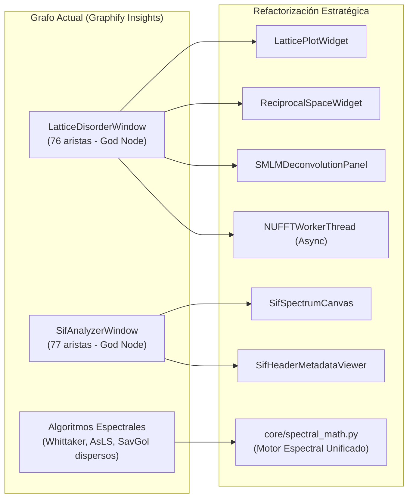

# 🔮 Perspectivas, Objetivos Logrados y Nuevas Fronteras — PyPrinting 3.0

**Laboratorio de Nanofotónica — Instituto de Nanosistemas (INS-UNSAM / CONICET)**  
**Investigador Principal:** José Luis González Peñafiel (*Físico EPN, Doctorando INS-UNSAM / CONICET, Sorbonne Université*)  
**Directores de Investigación:** Dr. Fernando Stefani / Dr. Julián Gargiulo  
**Ubicación:** `docs/PERSPECTIVAS.md`  
**Última Actualización:** 13 de Septiembre de 2026  

---

## 📖 Estado del Desarrollo y Hoja de Ruta

En concordancia con los principios de evolución continua y la **Directiva Máxima de Preservación Absoluta del Conocimiento (Pilar #1)** de **PyPrinting 3.0**, este documento mantiene el registro de las funcionalidades completadas y proyecta las futuras metas de investigación en nanofotónica experimental, óptica cuántica, nanolitografía fototérmica y arquitectura de software científico.

```
┌─────────────────────────────────────────────────────────────────────────────────────────────────────────┐
│                                     HITOS LOGRADOS (100% COMPLETOS)                                     │
├─────────────────────────────────────────────────────────────────────────────────────────────────────────┤
│ [x] Suite PySpectrum 3.0 (Shamrock Andor, Step & Glue, calibración halógena y espectro oscuro).         │
│ [x] Diseñador Universal de Redes 2D (15 familias, slider γ continuo, bases fraccionales y d_min).        │
│ [x] Protocolo Multi-Paso de Cuadratura por Partícula Ancla (P0) y recetas empaquetadas.                │
│ [x] Estimador Predictivo de Tiempo Restante (ETA dinámico con promedio acumulativo de trazas).         │
│ [x] Control Adaptativo de Frecuencia de Autofoco según velocidad de deriva instantánea v_drift.        │
│ [x] Suite Integral de Pruebas Automatizadas Unitarias (36 / 36 tests superados en tests/).             │
│ [x] Compendio Físico Riguroso, Manual Maestro (21 Secciones) y Protocolos SOP Estandarizados.           │
│ [x] Watchdog de Seguridad por Hardware Heartbeat para Obturadores Láser (fail-safe 500 ms desacoplado).│
│ [x] Contenedor Unificado HDF5 (.h5) con compresión shuffle+gzip para sesiones experimentales completas. │
│ [x] Suite Analítica de Desorden de Redes 2D (Hungarian/KDTree, g(r), S(q) Debye-Waller, NUFFT Tipo 1,   │
│     ajuste Levenberg-Marquardt de picos de Bragg, Paracristal de Hosemann y exportación vectorial SVG). │
│ [x] Analizador SIF Andor Solis multicanal nativo con calibración de 4to orden y filtros en cascada.     │
│ [x] Suite Raman y Quimiometría Multiespectral con deconvolución y sustracción de fluorescencia.        │
│ [x] Streaming Live View Cámara Canon EOS 500D (EDSDK) con doble buffer RAM a 30 fps sin fugas.         │
│ [x] Constitución de IA, Catálogo de Roles, Panel de 4 Expertos y Grafo AST Graphify (8278 nodos).      │
└─────────────────────────────────────────────────────────────────────────────────────────────────────────┘
```

---

## 🎯 1. Nuevas Metas y Fronteras Científicas

### 1.1 Mapeo Hiperespectral SERS Automatizado en Coordenadas de Grilla
- **Concepto**: Acoplar de manera directa la lista de coordenadas de la grilla impresa (`printing_results.txt` o dataset `session_data.h5`) con la rutina de escaneo confocal de `pyspectrum.py`.
- **Objetivo**: Posicionar secuencialmente la platina piezoeléctrica PI sobre cada nanopartícula o nanodímero impreso, adquirir automáticamente el espectro Raman / SERS con sustracción de fondo y reconstruir mapas hiperespectrales 3D $(X, Y, \lambda)$ de dispersión inelástica.
- **Módulos Vinculados**: [[MOD-02_Measurements_Printing_y_Dimeros|MOD-02]], [[MOD-06_PySpectrum_Espectroscopia_Shamrock|MOD-06]], [[SYS-301_Sistema_Espectrometro_Shamrock500i_iXon3|SYS-301]], [[CAT-205_Mapeo_Hiperespectral_SERS_Confocal_Automatizado|CAT-205]].

### 1.2 Nanotermometría Experimental por Variaciones DLS y Detección de Lente Térmica (*Thermal Lens Effect*)
- **Concepto**: Extender las técnicas de Dispersión Dinámica de Luz (DLS) y fototermia para la caracterización física *in-situ* de parámetros termodinámicos locales durante la iluminación óptica:
  1. **Nanotermometría Óptica Local por DLS**: En lugar de limitarse a la medición estática del tamaño coloidal, utilizar las fluctuaciones brownianas de nanopartículas sonda de radio hidrodinámico $R_h$ conocido para deducir la temperatura local del solvente $T$ a escala nanométrica mediante la relación de Stokes-Einstein generalizada:
     $$D(T) = \frac{k_B T}{6 \pi \eta(T) R_h}$$
     donde $\eta(T)$ es la viscosidad dependiente de la temperatura del medio líquido.
  2. **Detección y Monitoreo del Efecto Lente Térmica (*Photothermal Lens*)**: El calentamiento plasmónico Joule generado por el haz de impresión crea un perfil estacionario de temperatura $\nabla T(\mathbf{r})$ en el solvente circundante. Dado el coeficiente termo-óptico del medio ($dn/dT < 0$ para agua a temperatura ambiente), este gradiente térmico induce un perfil de índice de refracción $\nabla n = (dn/dT)\nabla T$ que actúa como una lente divergente microscópica. Se proyecta integrar la detección sincrónica o mediante fotodiodo confocal de la distorsión del frente de onda de la lente térmica para:
     - Cuantificar la absorción óptica absoluta de nanoestructuras individuales sin depender de modelos teóricos de esparcimiento.
     - Monitorear en tiempo real la transición térmica y prevenir fenómenos indeseados de ebullición microscópica (*nanobubbles*) o desorción de surfactantes/ligandos.
     - Modelar y compensar micro-corrientes termocapilares (convección de Marangoni) que alteran la estabilidad del coloide previo a la adhesión.
- **Módulos Vinculados**: [[CAT-109_Electrodinamica_Fuerzas_Opticas_y_Termoplasmonica_Printing|CAT-109]], [[CAT-110_Fisicoquimica_Coloides_DLVO_y_Funcionalizacion_Superficies|CAT-110]], [[CAT-111_Nanotermometria_DLS_y_Dinamica_Fluctuaciones_Brownianas|CAT-111]], [[CAT-112_Teoria_Lente_Termica_Gradientes_Indice_y_Marangoni|CAT-112]], [[SYS-102_Senales_Slots_PyQt6_y_Temporizacion_DAQmx|SYS-102]].

### 1.3 Inferencia Bayesiana y MCMC para la Matriz de Desorden del Paracristal 2D de Hosemann
- **Concepto**: Transicionar del ajuste analítico puntual por mínimos cuadrados de las matrices de distorsión $\mathbf{\Phi}_{10}(\mathbf{q})$ y $\mathbf{\Phi}_{01}(\mathbf{q})$ a una estimación probabilística Bayesiana mediante cadenas de Markov Monte Carlo (MCMC, e.g. `emcee`).
- **Objetivo**: Determinar las distribuciones de probabilidad a posteriori y las regiones de credibilidad del tensor de desorden reticular acumulativo de segundo orden:
  $$\mathbf{\Phi}_{10}(\mathbf{q}) = \exp\left[ i \mathbf{q} \cdot \mathbf{a}_1 - \frac{1}{2} \mathbf{q}^T \mathbf{\Sigma}_{10} \mathbf{q} \right]$$
  desacoplando de forma inequívoca el desorden térmico o vibracional aparente de la anisotropía mecánica introducida por la platina piezoeléctrica o la hidrodinámica del menisco líquido.
- **Módulos Vinculados**: [[CAT-309_Teoria_Paracristal_Hosemann_Perdida_Orden_2D|CAT-309]], [[CAT-305_Derivacion_Matematica_Factor_Estructura_Debye_Waller|CAT-305]], [[CAT-310_Derivacion_Matematica_Paracristal_2D_Hosemann_Anisotropo|CAT-310]], [[CAT-311_Inferencia_Bayesiana_MCMC_Desorden_Paracristal|CAT-311]], [[MOD-08_Analizador_Desorden_Redes_2D|MOD-08]].

### 1.4 Lazo Cerrado de Retroalimentación Metrológica In-Situ (*Active Metrological Feedback Loop*)
- **Concepto**: Integrar el pipeline de super-resolución y localización sub-píxel de [`core/localization_pipeline.py`](file:///c:/Users/josel/Documents/Obsidian_Vault/printing3/core/localization_pipeline.py) directamente en la rutina cíclica de impresión de `measurements.py`.
- **Objetivo**: Tras imprimir cada sub-bloque o fila de la red cristalina 2D, ejecutar un barrido confocal de dispersión interferométrica (iSCAT) o reflectometría rápida, localizar las posiciones reales $\{ \mathbf{r}_i^{\text{real}} \}$, evaluar el tensor de deformación afín y error de colocación local $\mathbf{e}_i = \mathbf{r}_i^{\text{real}} - \mathbf{r}_i^{\text{ideal}}$, y aplicar correcciones compensatorias adaptativas en las coordenadas objetivo de los siguientes nodos, alcanzando tolerancias de colocación reticular sub-5 nm.
- **Módulos Vinculados**: [[SYS-105_Pipeline_Unificado_Localizacion_Super_Resolucion|SYS-105]], [[CAT-202_Derivacion_Matematica_Cota_Cramer_Rao_Localizacion_Optica|CAT-202]], [[CAT-113_Lazo_Cerrado_Metrologico_InSitu_y_Control_Predictivo|CAT-113]], [[MOD-02_Measurements_Printing_y_Dimeros|MOD-02]].

### 1.5 Pinzas Ópticas Holográficas mediante Modulador Espacial de Luz (LCoS-SLM)
- **Concepto**: Integrar el control de un modulador espacial de luz basado en cristal líquido sobre silicio (LCoS-SLM) en el trayecto de iluminación confocal / contrapropagante.
- **Objetivo**: Generar frentes de onda estructurados con momento angular orbital (haces tipo vórtice / Laguerre-Gauss $LG_{pl}$ y haces Bessel no difractantes) para realizar atrapamiento, rotación óptica y guiado simultáneo de múltiples nanopartículas plasmónicas y nanoestructuras quirales.
- **Módulos Vinculados**: [[MOD-03_Microscopio_Contrapropagante|MOD-03]], [[CAT-108_Teoria_Optica_Telescopio_Rele_4f_y_Canales_Confocales|CAT-108]].

### 1.6 Clasificación en Tiempo Real de Trazas mediante Redes Neuronales Profundas (Edge AI)
- **Concepto**: Entrenar un modelo de inferencia ligero (e.g. 1D-CNN o Transformer temporal compilado a ONNX Runtime) sobre el flujo DMA a $10\ \text{kHz}$ del fotodiodo de avalancha / balanceado.
- **Objetivo**: Discriminar en $< 0.5\ \text{ms}$ entre eventos de adhesión de monómeros, agregados coloidales indeseados o impurezas, modulando dinámicamente la potencia de corte del láser para maximizar la pureza monodispersa de la grilla.
- **Módulos Vinculados**: [[CAT-107_Cinetica_Captura_Fotodiodo_Time_Volt_Filtro_Nhold|CAT-107]], [[SYS-102_Senales_Slots_PyQt6_y_Temporizacion_DAQmx|SYS-102]].

### 1.7 Nanofabricación Tridimensional Quiral Multi-Capa (3D Optical Printing)
- **Concepto**: Extender el compositor de redes 2D hacia la tercera dimensión axial $Z$ acoplando el piezoeléctrico en $Z$ con matrices de soporte polimérico o espaciadores dieléctricos.
- **Objetivo**: Fabricar hélices plasmónicas tridimensionales, meta-átomos quirales y metasuperficies bi-capa con propiedades de dicroísmo circular óptico gigante.
- **Módulos Vinculados**: [[MOD-07_Disenador_Redes_2D_Grid_Generator|MOD-07]], [[CAT-102_Sintesis_Cristalografica_Redes_2D_y_Particula_Ancla|CAT-102]].

---

## 💡 2. Hoja de Ruta de Arquitectura de Software e Ingeniería (Insights de Graphify)

El análisis topológico del grafo de conocimiento AST (`graphify-out/GRAPH_REPORT.md`) con 8,278 nodos y 407 comunidades ha revelado cuellos de botella estructurales y oportunidades críticas de desacoplamiento:



### 2.1 Modularización y Desacople de "God Nodes" Monolíticos
- **Diagnóstico**: Las clases `LatticeDisorderWindow` (76 aristas) y `SifAnalyzerWindow` (77 aristas) actúan como nodos de altísima centralidad y tamaño excesivo (~5000 líneas en `analysis/lattice_disorder_gui.py`).
- **Solución Proyectada**: Subdividir la suite en componentes `QWidget` / `QFrame` independientes, auto-contenidos y testeables:
  1. `LatticePlotWidget`: Canvas 2D de espacio real con herramientas de selección y zoom.
  2. `ReciprocalSpaceWidget`: Renderizador interactivo del factor de estructura $S(q)$ 2D y perfiles de línea de Bragg.
  3. `SMLMDeconvolutionPanel`: Interfaz para deconvolución Richardson-Lucy y detección Trackpy/Picasso.
  4. `RealSpaceMetricsPanel`: Cálculo y visualización de $g(r)$, función de orientación $\psi_6$ y estadísticas de Voronoi.
  5. `NUFFTWorkerThread`: Hilo `QThread` dedicado para el cómputo no bloqueante de la transformada no uniforme.

### 2.2 Motor Matemático Espectral Unificado (`core/spectral_math.py`)
- **Diagnóstico**: Las rutinas de corrección de línea base asimétrica (AsLS), filtro Whittaker-Eilers, suavizado Savitzky-Golay, sustracción polinomial de fluorescencia y ajuste multigaussiano/Lorentziano están duplicadas entre `sif_analyzer.py`, `pyspectrum.py` y `raman_analyzer.py`.
- **Solución Proyectada**: Crear el módulo desacoplado `core/spectral_math.py`, conteniendo implementaciones puras y testeables unitariamente de todos los operadores espectrales, consumidas uniformemente por las tres aplicaciones.

### 2.3 Aceleración por GPU / CUDA para la NUFFT 2D y Deconvolución Richardson-Lucy
- **Diagnóstico**: En muestras con $> 50,000$ localizaciones SMLM o matrices de difracción de $2048 \times 2048$, el cálculo en CPU (incluso con BLAS optimizado) requiere entre 100 ms y 800 ms.
- **Solución Proyectada**: Implementar un backend acelerado por hardware con PyTorch / CUDA o CuPy:
  - Cálculo de la NUFFT Tipo 1 en $< 15\ \text{ms}$, permitiendo re-cálculo continuo en tiempo real mientras el usuario manipula sliders de filtrado fotométrico.
  - Deconvolución Richardson-Lucy 2D basada en convoluciones FFT en GPU con aceleración tensorial de punto flotante de 32 y 16 bits.
- **Módulos Vinculados**: [[CAT-307_Computacion_NUFFT_Factor_Estructura_Optimizacion_BLAS|CAT-307]], [[CAT-312_Computacion_Tensorial_GPU_CUDA_NUFFT_y_Deconvolucion|CAT-312]].

### 2.4 Estandarización de Archivos según Formato NeXus / HDF5 y Principios FAIR
- **Diagnóstico**: La plataforma ya cuenta con serialización HDF5 en `core/hdf5_container.py`, pero la jerarquía de grupos es interna de PyPrinting.
- **Solución Proyectada**: Alinear los contenedores `.h5` con el estándar internacional **NeXus Data Format** (`NXdata`, `NXsample`, `NXinstrument`, `NXentry`), adoptado por instalaciones de sincrotrón y centros de nanofotónica globales:
  - Facilitar la interoperabilidad con herramientas analíticas estándar (PyMca, Dawn, JupyterHub).
  - Cumplir con los principios **FAIR** (*Findable, Accessible, Interoperable, Reusable*) para la publicación abierta de datasets experimentales de SMLM y optical printing en repositorios como Zenodo o figshare.
- **Módulos Vinculados**: [[CAT-401_Estandar_Serializacion_Jerarquica_Contenedor_HDF5|CAT-401]], [[CAT-402_Estandar_Datos_FAIR_y_Serializacion_NeXus_HDF5|CAT-402]].

### 2.5 Capa Vectorial de Deriva en Tiempo Real en el Visor de Grilla (`InteractiveGridWidget`)
- **Diagnóstico**: Aunque la deriva termomecánica acumulada $(\Delta x, \Delta y)$ se calcula en `DriftTrackingDialog` y se registra en los archivos de log y HDF5, el visor gráfico `InteractiveGridWidget` no dibuja la capa de flechas vectoriales durante la impresión.
- **Solución Proyectada**: Superponer un `ArrowItem` o capa quiver vectorial de color sobre el canvas `pyqtgraph` de `InteractiveGridWidget`, donde la magnitud y dirección de cada flecha señale el desplazamiento de deriva compensado en cada nodo de la grilla en vivo.
- **Módulos Vinculados**: [[MOD-02_Measurements_Printing_y_Dimeros|MOD-02]], [[SYS-103_Regimenes_Coordenadas_e_Invariancia_Cinematica|SYS-103]].
