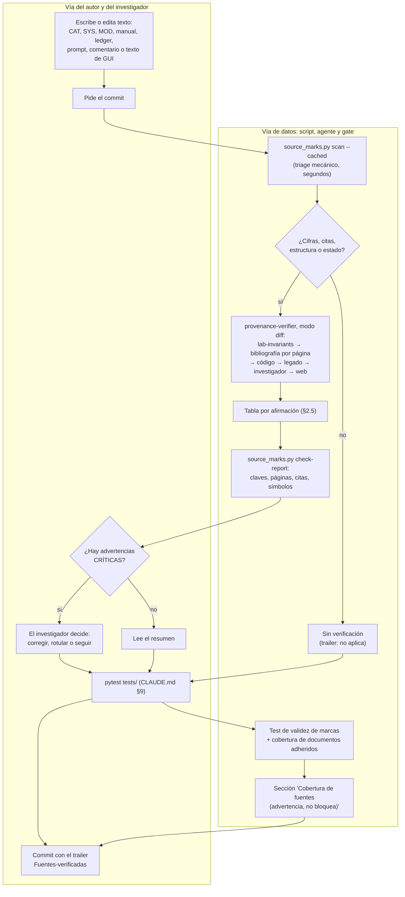

# Fase 3 — Verificador de contenido: Ronda 2 (diseño técnico)

**Estado:** APROBADA por el investigador (2026-09-27; respuestas en `RESPUESTAS_INVESTIGADOR.md`, "R3 — Ronda 2 del verificador"). **Ronda 4 implementada** el mismo día (`DEC-038`; qué cambió respecto de este borrador, en §10). **Piloto pendiente** (§7; materiales en `F3_piloto/`).
*Estado original de la Ronda 2:* PROPUESTA; el agente no existía todavía y este documento era el único archivo creado o modificado (`CLAUDE.md` §5.0: un agente nuevo nunca está exento).
**Fecha:** 2026-09-27. **Redactó:** `agent-trainer`, con consulta a `instrumentation` y `software-architect` (§5.6).
**Base:**
- la Ronda 1 está en `PLAN_CORRECCIONES.md`, fase 3;
- las respuestas del investigador están en la sección "Respuestas del investigador a la aprobación", punto 2, y son vinculantes:
  1. el verificador **sólo advierte**: no bloquea commits;
  2. revisa también los **comentarios del código**; la información estructural vieja (cableado, filtros, actuadores) se marca para verificar, no se da por cierta;
  3. el formato de la marca de fuente queda a propuesta (§3);
  4. un dato del investigador sin publicar es **EXPERIMENTAL**.
- El orden de consulta del investigador:
  - teoría: bibliografía de `docs/bibliografia/` → investigador → web (DOI verificado contra Crossref);
  - sistema: código actual y legado (PyPrinting en `Obsidian_Vault/printing2/`, PySpectrum en `scratch/pyspectrum-legacy/`), que funcionaban.

**Índice:**
1. Síntesis ejecutiva
2. Contrato del agente
3. Formato de la marca de fuente
4. Cuándo se invoca
5. Complemento automático
6. Riesgos y modos de falla
7. Plan de verificación
8. Preguntas para el investigador
9. Alcance de la Ronda 4
10. Respuestas del investigador y cambios de la Ronda 4
- Apéndice A: borrador del archivo del agente

---

## 1. Síntesis ejecutiva

### 1.1 Qué es

Es un subagente **de sólo lectura** que controla la procedencia del contenido en el momento de escribirlo. Recibe un diff o un documento nuevo o editado y hace tres cosas:

1. Extrae cada afirmación verificable:
   - cifras físicas;
   - fórmulas y su origen;
   - identidad y cableado del hardware;
   - comportamiento del código;
   - estado de implementación;
   - citas bibliográficas.
2. Le asigna un veredicto a cada afirmación, con un respaldo que un humano puede abrir (clave de `lab-invariants` §9 y página física, `archivo:línea`, `ruta.py::SIMBOLO`, DOI verificado).
3. Propone la acción: la marca que hay que insertar o la corrección.

Es el **control de publicación** de cada texto. Corre cuando el texto se escribe, no meses después en una auditoría. La auditoría del 2026-09-27 es la medida de lo que pasa sin ese control: 700 de 1377 afirmaciones (51 %) eran falsas o estaban desactualizadas, y otras 174 (13 %) no tenían fuente o la citaban mal (`CONSOLIDADO.md` §1.1). Los documentos auditados se declaraban, en su mayoría, "Producción / Consolidado" o "Aprobado / Producción".

### 1.2 Qué no es

| No es | Eso le corresponde a |
| :--- | :--- |
| Un árbitro de si el método es defendible | `scientific-reviewer` |
| Una prueba adversarial de una decisión en curso | `devil-advocate` |
| Una búsqueda profunda sobre un valor de literatura en disputa | `literature-crosscheck`: el verificador la **recomienda** en su columna de acción, no la ejecuta |
| Un análisis dimensional o de límites asintóticos | `physics-model-review` |
| Un presupuesto de incertidumbre | `metrology-review` |

Además:
- **No edita.** No corrige el documento y no elige entre dos fuentes que discrepan: lo informa.
- **No bloquea.** Advierte, y quien lo invocó decide con el investigador (respuesta 1).

Sí rehace la **aritmética** de una cifra derivada (para darle DERIVADO), pero no audita el modelo físico que hay detrás.

### 1.3 Por qué no alcanza con extender lo que ya existe

Evalué las alternativas en el orden de la jerarquía de parsimonia (`agent-trainer` §1.F): primero parchar lo existente, después una skill y recién después un agente.

| Alternativa | Qué cubre hoy | Por qué no alcanza |
| :--- | :--- | :--- |
| Extender `scientific-reviewer` | Referato sobre trabajo **terminado**. Informe por documento (revisiones mayores y menores, `ACCEPT`/`REJECT`), con categorías metodológicas (`CONSISTENT`, `DISCREPANCY`, …) | **Momento:** el verificador corre sobre cada diff. Con `scientific-reviewer`, cada edición de cinco líneas dispararía un referato completo.<br>**Contrato:** su salida es por documento, no por afirmación. Cambiarla rompe el uso que ya tiene.<br>**Dilución de rol:** dos funciones en un solo prompt es justo el caso que §1.F manda separar. |
| Extender la skill `literature-crosscheck` | Un parámetro por vez contra la literatura, con el orden de fuentes del investigador | **Cubre sólo la rama teórica:** no mira código, legado, cableado, comentarios ni estado de implementación, y ahí está buena parte de los hallazgos (L2 seguridad, L9 arquitectura, L10 manual).<br>**Contexto:** una skill corre en el contexto de quien escribió el texto, así que la afirmación la verifica el mismo razonamiento que la produjo.<br>**Costo:** los PDF y el legado se cargarían en el contexto principal. |
| Sólo el test del gate | Cifras sin marca | Detecta que **falta** una marca, no si la marca es verdadera. No entiende fórmulas, citas ni afirmaciones estructurales. Es el complemento (§5), no el control. |

**Conclusión: se justifica un subagente**, por dos propiedades que ninguna extensión da:

1. **Independencia.** Trabaja en un contexto propio, distinto del que redactó el texto. Es el disparador de §1.F para un agente nuevo: "un conflicto de interés metodológico que requiere un árbitro independiente".
2. **Restricción estructural.** Sus herramientas son de sólo lectura: no puede "arreglar" en silencio. Así, "sólo advierte" es una propiedad del agente, no una promesa del prompt.

Se diseña **chico**, reutilizando lo que ya existe en vez de duplicarlo:
- Toma los valores y los rótulos de `lab-invariants` (§0 rótulos, §8 convenciones, §9 claves) y no copia ninguna cifra en su prompt.
- Sigue el orden de fuentes de `literature-crosscheck` (Paso 2) y le deriva los valores de literatura en disputa.
- Delega la parte mecánica en un **script determinista** (§5): detecta cifras, valida claves y símbolos, y busca en la bibliografía por página física. El agente gasta contexto sólo en el juicio.

En la Ronda 4 se ajustan además las fronteras de `scientific-reviewer` y `literature-crosscheck` para que las tres piezas no se pisen (§2.1).

<!-- FIN SECCION 1 -->

---

## 2. Contrato del agente

### 2.1 Nombre y `description`

**Nombre propuesto:** `provenance-verifier`. Sigue la convención del resto de los agentes: kebab-case y en inglés. "Procedencia" es la palabra exacta de lo que controla (de dónde sale cada afirmación). Alternativa: `source-verifier`.

**`description`** (texto de ruteo, con fronteras negativas al estilo de `DEC-025`):

> Write-time provenance checker for documentation, code comments and the agent corpus. Use on a diff or a document that adds or edits CAT/SYS/MOD monographs, the user manual, the evidence or decision ledgers, comments and docstrings in the code, or `CLAUDE.md` and `.claude/`: it extracts every verifiable claim (physical figures, formulas and their origin, hardware identity and wiring, code behaviour, implementation status, citations) and returns one verdict per claim — RESPALDADO, DERIVADO, EXPERIMENTAL, SIN FUENTE, CONTRADICHO or ESTRUCTURAL-A-VERIFICAR — with a source a human can open and a suggested fix. It only warns: it never edits files and never blocks a commit. Do NOT use for a methodological or publication-readiness review of finished work (use scientific-reviewer), an adversarial probe of a decision still in flight (use devil-advocate), a deep literature search on a contested value (use literature-crosscheck), dimensional or asymptotic analysis of a formula (use physics-model-review), or an uncertainty budget (use metrology-review).

Las cinco derivaciones tienen guion, así que las valida `test_delegation_cross_references_resolve`, y las cinco existen hoy.

**Fronteras recíprocas** (Ronda 4, una frase en cada `description`):
- `scientific-reviewer`: "Do NOT use for a per-claim source check of new or edited text (use provenance-verifier)".
- `literature-crosscheck`: "… nor for a write-time source check of a whole diff (use provenance-verifier)".
- `devil-advocate` no cambia: ya deriva el control de procedencia a `scientific-reviewer`, y ese texto pasa a nombrar al verificador.

### 2.2 Herramientas

```yaml
tools: Read, Grep, Glob, Bash, WebFetch, WebSearch
```

| Herramienta | Para qué | Riesgo y cómo se acota |
| :--- | :--- | :--- |
| `Read`, `Grep`, `Glob` | Documento, código, legado, `lab-invariants`, `RESPUESTAS_INVESTIGADOR.md`, páginas de PDF (`Read` con `pages`) | Ninguno: son de lectura |
| `Bash` | Correr el script de §5; `git diff`/`git show`; `graphify query`; `pdftotext`; recalcular una cifra derivada con `python -c` | `Bash` puede escribir. El prompt restringe la escritura al scratchpad y al índice ignorado por git (`scratch/bib_index/`). Es el único agujero en la restricción estructural, y está declarado |
| `WebFetch`, `WebSearch` | El tercer escalón del orden de consulta, y sobre todo resolver un DOI contra la API de Crossref (`api.crossref.org/works/<DOI>`) | Sólo después de la bibliografía cargada y del investigador |

**Excluidas a propósito:**
- `Edit`, `Write` y `NotebookEdit`, para que no pueda corregir en silencio;
- `Agent`, para que no delegue la verificación a un contexto que no hereda sus reglas.

Hoy ningún agente del repositorio declara `tools:`, así que éste sería el primero con herramientas restringidas.

El MCP de Zotero no figura: hoy no conecta, y declarar `tools:` exige nombrar explícitamente cada herramienta MCP. Si vuelve, se agrega por nombre.

### 2.3 Entradas

Quien lo invoca le pasa un **modo** y un **objeto**:

| Modo | Objeto | Qué verifica | Cuándo |
| :--- | :--- | :--- | :--- |
| `diff` (por defecto) | Un rango de git (`git diff --cached -- <rutas>`, `git diff A..B -- <rutas>`) o un parche en el scratchpad | Sólo las líneas agregadas o modificadas, leídas con su contexto (el párrafo o la fila de tabla completa) | Toda edición de documentación o de prompts (§4) |
| `documento` | Una ruta, con un rango de líneas opcional | Todo el documento o la sección | Las tandas de la fase 4, la adhesión de un documento al gate (§5.4) y el plan de verificación (§7) |
| `comentarios` | Archivos `.py`, o un diff restringido a `.py` | Comentarios y docstrings que afirman algo estructural o citan cifras físicas; el código ejecutable no se revisa | Cuando un cambio toca comentarios de módulos de hardware, o en un barrido puntual de esos módulos |

**Contexto opcional:**
- el propósito del cambio (por ejemplo, "fase 4, tanda a1");
- los datos del investigador comunicados en la sesión que todavía no están en `RESPUESTAS_INVESTIGADOR.md`.

Un dato de ese tipo se rotula EXPERIMENTAL, y la acción sugerida es **registrarlo** en `RESPUESTAS_INVESTIGADOR.md` antes de citarlo: una marca EXPERIMENTAL tiene que apuntar a un punto trazable (R1-n, R2-n).

### 2.4 Veredictos y su alineación con `lab-invariants` §0

Los cuatro primeros veredictos **son** los rótulos de §0: dicen qué marca va a llevar la afirmación. Los dos últimos **no son rótulos**, sino estados que hay que resolver antes de poder rotular.

| Veredicto | Rótulo de §0 | Cuándo | Marca que sugiere (§3) |
| :--- | :--- | :--- | :--- |
| **RESPALDADO** | RESPALDADO | Una fuente del orden de consulta dice lo mismo. Para teoría: bibliografía con página física, DOI verificado u hoja de datos. Para sistema: código ejecutable (`ruta.py::SIMBOLO` o `archivo:línea`) o comportamiento ejecutable del legado | `[fuente: …]` |
| **DERIVADO** | DERIVADO | Cálculo propio a partir de valores respaldados. El verificador **rehace la cuenta** y coincide al redondeo declarado. Si un insumo es EXPERIMENTAL, se informa "DERIVADO (a partir de un dato EXPERIMENTAL)", como hace `lab-invariants` §7 con el pinhole en unidades de Airy, y la cifra hereda los límites de ese insumo | `[derivado: …]` |
| **EXPERIMENTAL** | EXPERIMENTAL | Dato del investigador sin publicar (con fecha y punto R1-n/R2-n) o método propio en desarrollo (Monte Carlo de Debye-Waller, R1-9). **Nunca respalda una afirmación publicable** | `[experimental: …]` |
| **SIN FUENTE** | SIN FUENTE | Se siguió el orden de consulta y no apareció respaldo. El informe dice **dónde se buscó**, para que la ausencia se pueda verificar | `[sin fuente]`, o retirar la cifra |
| **CONTRADICHO** | — (el valor no se escribe) | Una fuente del orden de consulta, o el código, dice otra cosa. Se informa el valor correcto con su fuente | Corrección. Si **dos fuentes primarias discrepan entre sí**: escalar al investigador, sin elegir en silencio (`lab-invariants`, "Al agregar una fila", punto 5) |
| **ESTRUCTURAL-A-VERIFICAR** | — (pendiente) | Afirmación sobre la estructura física (cableado, canal ↔ dispositivo, identidad o semántica de un filtro, actuador o láser, polaridad, camino óptico, modelo de equipo) cuyo único apoyo es un comentario, un **nombre** de símbolo o prosa | Verificar en este orden: código ejecutable → comportamiento del legado → investigador → banco (`BANCO-nn`). Termina en RESPALDADO, EXPERIMENTAL o CONTRADICHO |

**Qué pasa con los veredictos de la auditoría.** La auditoría usó otros cinco veredictos. El nuevo esquema no los pierde:

| Veredicto de la auditoría | Cómo queda |
| :--- | :--- |
| CITA ERRÓNEA | Pasa a la columna **Cita del texto** (valor `no contiene`), y el veredicto queda en SIN FUENTE o CONTRADICHO según lo que diga la fuente real |
| REQUIERE BANCO | Pasa a la acción (`BANCO-nn`), con veredicto SIN FUENTE, EXPERIMENTAL o ESTRUCTURAL-A-VERIFICAR |
| `UNSTATED_ASSUMPTION` | Es metodológico: queda **fuera de alcance** y se deriva a `scientific-reviewer` |

**Reglas de decisión, en orden de precedencia:**

1. **Un documento del repositorio nunca es respaldo** (§0): ni un CAT, SYS o MOD, ni el manual, un ledger o un prompt. Tampoco `lab-invariants`. Si el texto cita uno, la columna Cita dice `interna`, y el verificador busca la fuente primaria.
2. **Fila de `lab-invariants`:**
   - una fila ✅ da RESPALDADO (código) sin más búsqueda, porque el gate ya la ata al símbolo;
   - una fila 📄 no está verificada por máquina. El verificador cita **la fuente primaria de la fila**, no la tabla, y la abre cuando la afirmación es CRÍTICA o ALTA, o cuando el valor del texto difiere de la fila en un dígito, una unidad o una convención (§8).
3. **Contradicción antes que respaldo.** Si una fuente del orden de consulta contradice, el veredicto es CONTRADICHO aunque otra respalde. El conflicto se informa.
4. **CIBION no es el banco.** Un valor de una fuente rotulada CIBION presentado como dato del banco de INS-UNSAM no pasa de EXPERIMENTAL o SIN FUENTE para el banco, con la nota de §0.
5. **El legado cuenta por su comportamiento, no por sus nombres.** El legado es la referencia de **funcionamiento** del sistema (R1-12): qué línea baja una rutina, qué pulso emite, en qué orden. Sus nombres y comentarios son tan sospechosos como los actuales: el "Flipper Notch 532" nació como un error de notación del legado 1.0 (R1-2).
6. **Valores ilustrativos (S-14).**
   - Una cifra de ejemplo presentada como medida, calibrada o validada, sin un archivo de datos versionado, es CONTRADICHO.
   - Si el texto no la presenta así, la acción es rotularla `[ilustrativo]`.
7. **Estado de implementación (S-8).**
   - "Implementado", "certificado" o "vigente" exige que existan los símbolos citados (se comprueba con `graphify query` y `grep`).
   - Un conteo fijo de tests ("49/49") es SIN FUENTE, y la acción es retirarlo.
8. **Comentarios del código.**
   - Un comentario estructural es ESTRUCTURAL-A-VERIFICAR, salvo que el código ejecutable lo fije.
   - El número de canal sí lo fija el código (`config.py`). La **semántica** del actuador casi nunca: queda pendiente hasta que la resuelva el comportamiento del legado o un punto R1-n/R2-n.
9. **Seguridad primero.** Una afirmación que un operador ejecutaría (procedimiento, tensión, orden de encendido, estado de un obturador) es CRÍTICA aunque su error parezca menor. Es el patrón S-15.

### 2.5 Formato de salida

La salida es **verificable** en dos sentidos:
- cada fila apunta a algo que un humano abre en menos de un minuto;
- las columnas Respaldo y Cita se pueden comprobar por máquina con `tools/source_marks.py check-report` (§5.3), que valida claves, páginas, citas textuales y símbolos.

La salida tiene tres partes:

**1. Encabezado**

```markdown
## Verificación de procedencia — <objeto>
Modo: diff | documento | comentarios · Commit base: <hash> · Fecha: AAAA-MM-DD
Consultado: <claves de §9, archivos de código y de legado, DOI resueltos>
Sin acceso o no consultado: <lo que no se pudo abrir, y por qué>
```

**2. Tabla**, una fila por afirmación:

| # | Ubicación | Afirmación | Tipo | Veredicto | Sev. | Respaldo | Cita del texto | Acción sugerida |
| :--- | :--- | :--- | :--- | :--- | :--- | :--- | :--- | :--- |
| 1 | `SYS-202:277` | "Cables BNC conectados a `ao0` y `ao1` de la regleta SCB-68" | estructural | ESTRUCTURAL-A-VERIFICAR | BAJA | Canal: `config.py::FLIPPER_AO_UP` y `FLIPPER_AO_DOWN`. Bornera: [BNC] p. 6, "BNC connectors on the front panel to connect AO <0..7> signals". Dos BNC-2110 según el investigador (R1-1). Qué BNC-2110 lleva qué líneas: sin confirmar | ninguna | Reemplazar "SCB-68" por "BNC-2110" con `[experimental: investigador, 2026-09-27, R1-1]`; confirmar la bornera en NI MAX |
| 2 | `SYS-202:59` | "τ ∼ 1 − 5 ms" (obturadores) | valor | SIN FUENTE | BAJA | Buscado en [P25], [M24] y [G17] con el índice por página ("obturador", "shutter", "ms"), y en `config.py`: el modelo de obturador no figura | ninguna | `[sin fuente: modelo de obturador no identificado]`, o retirar |
| 3 | `SYS-202:276` | "alimentación externa de 12 V del controlador Thorlabs MFF101" | procedimiento | CONTRADICHO | CRÍTICA | Web (no hay copia en `docs/bibliografia/`): manual Thorlabs ETN012604-D03, §4.2.1, "connected only to a 15 V DC supply". **Además**: no está probado que el flipper instalado sea un MFF101 | ninguna | Corregir a 15 V DC **y** declarar el modelo como a confirmar en el banco. Sugerir la clave `[DS-MFF101]` para §9 si el manual se carga en `docs/bibliografia/` |

Los ejemplos salen de la auditoría L2. Las filas 1 y 3 están reformuladas con el esquema nuevo.

**Columnas:**

| Columna | Contenido |
| :--- | :--- |
| Ubicación | `archivo:línea` del archivo real, sin quitar los bloques de código |
| Afirmación | Cita textual de 20 palabras como máximo |
| Tipo | `valor` · `fórmula` · `cita` · `código` · `estructural` · `estado` · `procedimiento` |
| Sev. | La escala de los lotes de la auditoría, para que el plan de §7 sea comparable:<br>• **CRÍTICA:** seguridad del banco o del detector, validez de mediciones, o un procedimiento que un operador ejecutaría;<br>• **ALTA:** un número o una fórmula científica errónea;<br>• **MEDIA:** una cita o una afirmación sin respaldo usada como base;<br>• **BAJA:** una imprecisión menor;<br>• "—" para RESPALDADO y DERIVADO |
| Respaldo | Depende del veredicto:<br>• **RESPALDADO:** `<CLAVE> p. <física>` más una cita textual de 15 palabras como máximo; o `` `ruta.py::SIMBOLO` `` con el valor leído; o `archivo:línea`; o `DOI 10.… (Crossref: título, año)`; o `legado <ruta>:<línea>`;<br>• **DERIVADO:** la fórmula, los insumos con su propio respaldo y el resultado recalculado;<br>• **EXPERIMENTAL:** `investigador, AAAA-MM-DD, R2-n`, o `método en desarrollo (R1-9)`;<br>• **SIN FUENTE:** dónde se buscó (claves y términos);<br>• **CONTRADICHO:** la fuente que contradice, con su cita textual, y el valor correcto;<br>• **ESTRUCTURAL-A-VERIFICAR:** qué fija el código ejecutable, qué hace el legado, y qué falta |
| Cita del texto | Qué cita el propio texto para esa afirmación:<br>• `verificada`;<br>• `no contiene` (la fuente citada no dice eso: la CITA ERRÓNEA de la auditoría);<br>• `interna` (cita un documento del repositorio);<br>• `sin acceso`;<br>• `ninguna` |
| Acción sugerida | La marca exacta que hay que insertar (§3) o la corrección, y cuando corresponde:<br>• la derivación (`literature-crosscheck`, `metrology-review`);<br>• la fila que convendría agregar a `lab-invariants`, vía `agent-trainer`, si el valor aparece en dos o más documentos |

**3. Cierre**

```markdown
Resumen: N afirmaciones — a RESPALDADO · b DERIVADO · c EXPERIMENTAL · d SIN FUENTE · e CONTRADICHO · f ESTRUCTURAL-A-VERIFICAR
Advertencias CRÍTICAS: <lista de ubicaciones, o "ninguna">
Fuera de alcance, derivado a otro agente: <lista>
Línea para el commit: Fuentes-verificadas: N (a/b/c/d/e/f); pendientes: <ubicaciones con SIN FUENTE, CONTRADICHO o ESTRUCTURAL>
```

**Reglas del formato contra el ruido:**
- Una afirmación repetida (el mismo valor con la misma fuente) va en **una** fila, con todas sus ubicaciones.
- En modo `diff` no se informan líneas no tocadas.
- Una cifra que **ya** lleva `[sin fuente]` o `[experimental: …]` bien formada no se vuelve a advertir, salvo que sea CRÍTICA.
- Si hay más de 15 filas MEDIA o BAJA, se resumen por tipo. Las CRÍTICAS y ALTAS se listan siempre completas.
- El estilo, la redacción y la ortografía no se informan.

<!-- FIN SECCION 2 -->

---

## 3. Formato de la marca de fuente

### 3.1 Propuesta: etiqueta en línea, columna en las tablas y marca de bloque

Una **etiqueta entre corchetes** en la misma oración que la cifra:

> La deriva en XY es de 30 nm/min [fuente: M24 p. 75], y la usamos hasta medirla en el banco.

Hay siete rótulos. Cada uno corresponde a un veredicto de §2.4:

| Marca | Veredicto | Contenido obligatorio |
| :--- | :--- | :--- |
| `[fuente: …]` | RESPALDADO | Uno o más ítems separados por `;`:<br>• `CLAVE p. N`: clave de `lab-invariants` §9 **sin corchetes** y página física, o un rango `p. N-M`;<br>• un símbolo de código entre backticks: `ruta.py::SIMBOLO` o `ruta.py::SIMBOLO["clave"]["campo"]`;<br>• `ruta.py:línea`;<br>• `DOI 10.xxxx/…`, verificado en Crossref;<br>• `legado ruta:línea`, para el comportamiento del legado |
| `[derivado: …]` | DERIVADO | La fórmula, con un `=`, y sus insumos, cada uno con su clave o su marca |
| `[experimental: …]` | EXPERIMENTAL | `investigador, AAAA-MM-DD, R2-n` (o `R1-n`), o `método en desarrollo` con su punto (`R1-9`) |
| `[sin fuente]` | SIN FUENTE | Opcional: qué falta (`[sin fuente: medir con BANCO-17]`) |
| `[a verificar: …]` | ESTRUCTURAL-A-VERIFICAR | Qué hay que verificar y cómo (`[a verificar: bornera de P0.8–P0.11, NI MAX]`) |
| `[ilustrativo]` | — (no es una afirmación sobre el banco) | Nada. Marca los números de un ejemplo o de un caso de estudio (S-14) |
| `[refutado: …]` | — (se cita para rechazarlo) | El hallazgo o la decisión que lo refuta (`[refutado: DEC-023]`, `[refutado: T-05]`) |

CONTRADICHO **no tiene marca**: un valor contradicho se corrige, no se rotula.

**Tres alcances:**

1. **En línea:** la marca cubre las cifras de su oración, o de su fila si está dentro de una tabla.
2. **Columna:** en una tabla con una columna titulada `Fuente` o `Respaldo`, esa celda cubre la fila.
   - La celda puede tener una marca, o uno de los rótulos de §0 escrito tal cual.
   - Así, las tablas de `lab-invariants` ya cumplen sin cambios.
3. **Bloque:** una línea que contiene **sólo** una marca cubre todo el bloque:
   - si está inmediatamente arriba de una tabla o de una lista, cubre ese bloque (es el caso típico de `[ilustrativo]` sobre la tabla de un ejemplo);
   - si está inmediatamente debajo de una ecuación en display (`$$…$$`), cubre la ecuación.

**Reglas de escritura:**
- La marca nunca va dentro de `$…$`: las cifras en LaTeX se marcan afuera, en la misma oración.
- Nunca se usa un documento del repositorio (CAT, SYS, MOD, manual, ledger, prompt, `lab-invariants`) dentro de `[fuente: …]`: es la regla 1 de §2.4, y el gate la rechaza.
- Los backticks se tratan como un átomo: `]` y `;` dentro de un símbolo de código (`MICROSCOPE_OBJECTIVES["…"]["na"]`) no cierran la marca.
- **En comentarios del código** se usa la misma sintaxis, sin backticks:

```python
FLIPPER_532_CHAN = 7  # espejo de detección, no un notch [fuente: legado scratch/pyspectrum-legacy/Luminescence_ps.py:695] [experimental: investigador, 2026-09-27, R2-4]
```

- Cada marca lleva **un solo rótulo**. Si una afirmación tiene dos respaldos de distinto tipo, van dos marcas contiguas, como en el ejemplo, y cada una respalda un aspecto:
  - el veredicto se informa **por aspecto**, como en `lab-invariants` §2: "RESPALDADO (canal) · EXPERIMENTAL (sentido *up/down*)";
  - la afirmación completa no es más fuerte que su aspecto más débil: si uno es EXPERIMENTAL, no puede sostener un resultado publicable.

### 3.2 Ejemplos por caso

| Caso | Cómo queda |
| :--- | :--- |
| Teoría, con bibliografía cargada | `Potencial de superficie de la capa PDDA-PSS en el modelo DLVO del grupo: −37 mV [fuente: AN17 p. 10].`<br>Es un parámetro de modelo, no una medición de ζ del lote (`lab-invariants` §6); la marca respalda el número, y la oración tiene que decir qué es |
| Sistema, valor de código | `Recorrido en Z: 20 µm [fuente: `config.py::PI_Z_RANGE_UM`].` |
| Sistema, comportamiento del legado | `El espectrómetro sólo recibe luz con el espejo abajo [fuente: legado scratch/pyspectrum-legacy/Luminescence_ps.py:695] [experimental: investigador, 2026-09-27, R2-4].` |
| Cifra derivada | `κ⁻¹ ≈ 13.6 nm a 0.5 mM [derivado: κ⁻¹ = 0.304 nm / √(I [M]) para un electrolito 1:1 a 25 °C].`<br>El insumo I = 0.5 mM lleva su propia marca EXPERIMENTAL donde se enuncia |
| Dato del investigador sin publicar | `Fuerza iónica de trabajo: 0.5 mM [experimental: investigador, 2026-09-27, R2-14].` |
| Método en desarrollo | `σ_MC = … nm [experimental: método en desarrollo, R1-9]`. No es publicable (`PLAN_CORRECCIONES.md` fase 0.4) |
| Cifra en LaTeX | `El pulso del filtro de densidad dura $5\ \text{ms}$ [fuente: `core/nidaq.py::_pulse_flipper`].`<br>El gate resuelve el símbolo a `time.sleep(0.005)` y compara 0.005 s con los 5 ms marcados (§5.3) |
| Tabla sin columna de fuente | Una línea `[ilustrativo]` inmediatamente arriba de la tabla |
| Valor citado para rechazarlo | `El watchdog no es de 500 ms [refutado: DEC-023].` |
| Estructural pendiente | `Los obturadores salen por la segunda BNC-2110 [a verificar: R1-1, confirmar en NI MAX].` |

### 3.3 Por qué este formato y no los otros de la Ronda 1

| Opción | A favor | En contra | Decisión |
| :--- | :--- | :--- | :--- |
| **Nota al pie** (`[^1]`) | Obsidian la renderiza, y el texto queda limpio | **El navegador de la wiki no la renderiza.** `analysis/scientific_wiki_browser.py` usa python-markdown con `tables`, `fenced_code`, `toc` y `md_in_html`, sin `footnotes`, y `[^1]` aparece literal (comprobado el 2026-09-27 con esas extensiones).<br>En un diff, la afirmación y su fuente quedan lejos: se puede editar una sin ver la otra.<br>Renumerar las notas ensucia los diffs | No |
| **Etiqueta en línea** (`[fuente: …]`) | Se lee igual en Obsidian, en la wiki y en un diff (comprobado: python-markdown la deja literal).<br>La afirmación y su fuente cambian juntas.<br>Una sola regex la encuentra.<br>Sirve en prosa, en tablas y en comentarios del código | Agrega texto visible | **Sí**, como forma general |
| **Columna en las tablas** | Es lo que ya hace `lab-invariants` | No sirve en prosa | **Sí**, en las tablas que ya tienen la columna |
| Comentario oculto (`%%…%%`, `<!-- -->`) | No se ve | **No se ve**: el lector no sabe de dónde sale la cifra, que es justamente el problema | No |
| Etiqueta de Obsidian (`#sin-fuente`) | Buscable, y se ve como una píldora | No tiene lugar para la fuente, y una línea que empieza con `#` es un título | No |
| Campos en línea de Dataview (`[fuente:: …]`) | Consultables | La bóveda no tiene complementos de terceros (`.obsidian/` sólo tiene complementos del núcleo) | No |

El costo de legibilidad se controla de cuatro maneras:
- una marca por oración, no por cifra;
- la columna en las tablas;
- la marca de bloque;
- claves cortas: `M24 p. 75` ocupa menos que muchas citas de autor y año.

En Obsidian, buscar `"[sin fuente"` o `"[a verificar"` lista lo pendiente de toda la bóveda.

<!-- FIN SECCION 3 -->

---

## 4. Cuándo se invoca

### 4.1 Flujos

| Flujo | Disparador | Modo | Qué hace quien invoca con el informe |
| :--- | :--- | :--- | :--- |
| Skill `scientific-documentation` (Paso 4, "Provenance & Status") | Borrador terminado de un CAT, SYS, MOD, SOP o del manual, antes de entregarlo | `diff`, o `documento` si el archivo es nuevo | Inserta las marcas RESPALDADO y DERIVADO que el verificador ya comprobó; presenta el resto (§4.2) |
| Skill `knowledge-integrator` (Pasos 2 y 3) | Consolidación en CAT, SYS o MOD; entrada nueva en `EVIDENCE_LEDGER.md`; DEC nueva en `DECISION_LOG.md` | `diff` | Igual. Una entrada de ledger nueva sin respaldo se advierte como MEDIA o más |
| Skill `deliberative-implementation`, Ronda 4 ("Closing the loop") | Actualización del manual y de las monografías | `diff` sobre los documentos | Igual |
| Idem, cuando el cambio toca módulos de hardware (b1 del plan) | Comentarios, docstrings y textos de la GUI nuevos o editados | `comentarios` | Igual |
| `agent-trainer` | Parche de un prompt, una skill, un ejemplar o `lab-invariants` | `diff` sobre `.claude/` y `CLAUDE.md` | Complementa al gate, que sólo ata las filas ✅ al código |
| Fase 4 del plan (tandas a1-a8) | Cada documento que se corrige | `documento` | El documento corregido y verificado recibe la línea de adhesión (§5.4) |
| Commit que toca `docs/`, `reportes/`, `.claude/`, `CLAUDE.md`, o comentarios y textos de UI de módulos de hardware | Antes de proponer el commit | Primero `tools/source_marks.py scan --cached`, un triage mecánico de segundos. Si el diff agrega cifras, citas, afirmaciones estructurales o estados de implementación: el verificador en `diff`. Si no (erratas, formato, un archivo que se mueve): nada | §4.2 |

**No se invoca sobre:**
- las auditorías fechadas (`docs/evidence/auditoria_*/`), que citan valores viejos a propósito;
- las entradas **históricas** de `DECISION_LOG.md`, que es append-only (las entradas nuevas sí se verifican);
- los documentos archivados como implementables o desconocidos (`reportes/archivo/`, R1-11), que se conservan sin reescribir;
- los cambios de formato o de redacción sin afirmaciones nuevas;
- las respuestas conversacionales;
- la lógica del código. Eso es de `software-architect`, `instrumentation` y `metrology`.

### 4.2 Cómo se integra con "sólo advierte"

El verificador nunca bloquea. Pero advertir no es informar al final, en letra chica. Quien lo invoca sigue cuatro reglas:

1. **Advertencia CRÍTICA:** una afirmación CRÍTICA con un veredicto distinto de RESPALDADO o DERIVADO. Se presenta al investigador **antes** del commit, textual y con la corrección propuesta, y el investigador decide: corregir, rotular o seguir.
2. **El resto:** se resume en la respuesta y queda en el trailer del commit.
3. **Trailer del commit.** Todo commit que pasó por el verificador lleva la línea de cierre de §2.5:

   ```text
   Fuentes-verificadas: 14 (9/2/1/1/1/0); pendientes: SYS-202:59 (SIN FUENTE), SYS-202:276 (CONTRADICHO)
   ```

   Los trailers de git se leen por máquina (`git log --format='%(trailers:key=Fuentes-verificadas)'`), así que después se pueden listar los commits que entraron con advertencias abiertas. **Ignorar una advertencia está permitido, pero queda registrado**: esa trazabilidad reemplaza al bloqueo.
4. **Si el verificador no corrió** (límite de uso, sin acceso a una fuente), el trailer lo dice: `Fuentes-verificadas: no corrido (motivo)`. Nunca se omite en silencio.

Las cuatro reglas viven en **un solo lugar**: una viñeta nueva en `CLAUDE.md` §9. Las skills remiten a ella, como se hizo con §5.0 en `DEC-027`, para que no deriven entre copias.

No se propone un hook de git por defecto: hoy el repositorio no tiene hooks. Si el investigador lo quiere, sería un `pre-commit` que corre sólo el script, sin el agente, e imprime advertencias con salida 0 (pregunta 6 de §8).

> **Decisión del investigador (respuesta 6): sin hook por ahora, asentado como mejora futura.** Cuando
> se adopte, el hook corre sólo `python tools/source_marks.py scan --cached` (con `--code` si el
> commit toca `.py`), imprime el triage y sale **siempre con 0**: nunca bloquea, igual que el resto del
> control. No invoca al agente ni necesita red. Condición razonable para instalarlo: que el piloto (§7)
> haya adoptado al agente y que la etapa 1 de §5.5 haya medido el ruido del detector (< 10 % de falsos
> positivos). Está registrado también en `DEC-038`.

### 4.3 Flujo de doble vía

La vía del autor y del investigador frente a la vía de datos del script, el agente y el gate:



<!-- FIN SECCION 4 -->

---

## 5. Complemento automático

### 5.1 Lo que hay hoy (medido el 2026-09-27)

**Cuántas cifras hay y dónde están escritas.** Medí con un prototipo de detector en el scratchpad, sin tocar el repositorio: número más unidad física de una lista cerrada, NA y OD, en texto plano, tablas y LaTeX normalizado.

| Grupo | Documentos | Cifras en texto plano | Cifras en LaTeX (`$…$` y `$$…$$`) |
| :--- | ---: | ---: | ---: |
| CAT | 48 | 134 | 794 |
| SYS | 23 | 216 | 609 |
| MOD | 15 | 151 | 176 |
| `MANUAL_USUARIO.md` | 1 | 105 | 114 |
| **Documentos** | **87** | **606** | **1693 (74 %)** |
| Corpus (`CLAUDE.md` y `.claude/`) | — | 242 | 45 |

`software-architect` midió unas 5181 cifras en los 117 `.md` de `docs/` y `reportes/`, un alcance más amplio que la tabla. Sin contar las auditorías fechadas y el código entre backticks, **ningún documento tiene hoy una marca de fuente**.

**El hueco de LaTeX que encontró la fase 2.** Las verificaciones numéricas del gate leen texto plano y backticks:

- `test_corpus_watchdog_timings_match_code` detecta "watchdog … 500 ms". En cambio, **no** detecta:
  - `$500\ \text{ms}$`;
  - `$\tau_{wd} = 500\,\mathrm{ms}$`;
  - una celda `$500~\text{ms}$`.

  Lo comprobé el 2026-09-27 con la regex del test.
- `_NUMBER_TOKEN` sólo lee números entre backticks.

Con el 74 % de las cifras de los documentos en LaTeX, cualquier detector sin normalización mira un cuarto del problema.

**Qué esconde hoy ese hueco, y qué no.** `software-architect` midió que, **dentro del alcance actual** del test del watchdog (el corpus), normalizar el LaTeX agrega **0** hallazgos: los `\text{ms}` están en `docs/` y `reportes/`. Ampliar el alcance sin más trae falsos positivos y falsos negativos por proximidad:

- **Falso positivo:** `SYS-201:286` cita "±50 ms" como tolerancia, no como watchdog.
- **Falso negativo por coincidencia:** `MOD-01:127` y `:200` atribuyen al flipper un pulso de 100 ms que el test deja pasar porque coincide con el poll de 100 ms. El código pulsa 5 ms (`core/nidaq.py::_pulse_flipper`).

**Conclusión:**
- El normalizador es **prevención** en el corpus, donde hay 45 cifras en LaTeX.
- En los documentos es un **requisito**.
- Se comparte entre todas las verificaciones numéricas.
- El test del watchdog conserva su alcance.

### 5.2 Qué cuenta como cifra física (alcance contra el ruido)

**Entra:**
- un número con una unidad de la lista cerrada (longitud, tiempo, frecuencia, tensión, corriente, potencia, energía, temperatura, concentración, `nm/min`, `nm/mm`, `l/mm`, `cm⁻¹`, `px`, `bit`, `AU`);
- `NA` y `OD` seguidos de un número;
- una constante en notación científica con unidad (`2.1 × 10⁻²⁰ J`, `2.1 \times 10^{-20}\ \text{J}`);
- rangos (`1–5 ms`), que cuentan como una sola cifra.

**No entra:**
- números sin unidad;
- porcentajes, en la etapa inicial: "0.2 % v/v" es física, pero "51 % de las afirmaciones" no, y separarlos exige juicio;
- fechas, identificadores (`CAT-207`, `C-01`, `DEC-036`, `R2-14`), versiones, referencias a líneas (`:123`) y a páginas (`p. 75`);
- bloques de código y spans entre backticks (D1: los ejemplos de marcas de este mismo documento y de `PLAN_CORRECCIONES.md` están entre backticks);
- líneas con `[refutado: …]` o con la negación que el gate ya reconoce (`no es`, `nunca`, `superad…`);
- longitudes de onda usadas como **nombre** de un láser configurado, es decir, las claves de `config.py::SHUTTERS` (532, 637, 592 y 808 nm).

Una longitud de onda que **no** está en ese conjunto no se exime: el "642 nm" de SYS-202 es justamente un identificador equivocado (L2 202-02). En SYS-202, 10 de las 22 cifras que detecta el prototipo son nombres de láseres configurados: sin esta exención, el ruido rondaría el 45 %.

**Árboles excluidos:**
- `docs/evidence/auditoria_*/`;
- `DECISION_LOG.md`;
- `reportes/archivo/`;
- los árboles ajenos que el gate ya excluye (`.claude/worktrees/`, `.venv`, `.git`). `software-architect` encontró una copia de `lab-invariants.md` en un worktree.

### 5.3 Módulo `tools/source_marks.py` e inventario

**Ubicación.** El módulo va en `tools/` y usa sólo la biblioteca estándar (`re`, `ast`, `tokenize`, `pathlib`, `argparse`, `json`): no importa `config`, PyQt6 ni `core`. Tres detalles de `software-architect`:

1. Se agrega `tools/__init__.py`, o el test lo carga con `importlib.util.spec_from_file_location`, porque un paquete `tools` instalado en site-packages le ganaría al del repositorio.
2. La raíz se calcula desde el `__file__` del módulo, así cada worktree se resuelve contra sí mismo.
3. `.claude/skills/*/scripts/` se descarta, porque no es importable. `tests/` también, porque mezclaría la herramienta con los tests.

| Función | Firma | Devuelve | Contrato |
| :--- | :--- | :--- | :--- |
| `latex_to_plain` | `(s: str) -> str` | Texto normalizado | Convierte:<br>• `\text{}`, `\mathrm{}`, `\,`, `\ `, `~`;<br>• `\mu` → µ;<br>• `\times 10^{-n}` → × 10⁻ⁿ;<br>• `^\circ` → °;<br>• `\%`;<br>• los exponentes de unidades: `\text{cm}^{-1}` → cm⁻¹.<br>Unifica µ/μ y −/- |
| `iter_figures` | `(text: str, *, path: Path) -> Iterator[Figure]` | `Figure(line: int, raw: str, value: float \| None, unit: str, in_latex: bool, in_table: bool, context: str)` | La línea es **la real**: los bloques de código se reemplazan por líneas en blanco, no se borran (D4). Aplica las exclusiones de §5.2 |
| `iter_marks` | `(text: str) -> Iterator[Mark]` | `Mark(line: int, label: str, items: list[str], scope: "inline" \| "column" \| "block")` | Los backticks son un átomo. Se ignoran las marcas dentro de spans de código (D1) |
| `load_bib_keys` | `(invariants: Path) -> dict[str, str]` | clave → archivo | Parsea la tabla de §9 |
| `load_answer_points` | `(respuestas: Path) -> set[str]` | `{"R1-1" … "R1-12", "R2-1" … "R2-20"}` | R2-n es literal (`## R2-n.`). R1-n **no lo es**: son los encabezados `## n.` anteriores a `# Segunda ronda` (D2) |
| `resolve_code_ref` | `(ref: str) -> CodeRef(exists: bool, value: float \| str \| None, unit: str \| None)` | | Factoriza los resolvers del gate (`_resolve_code_number`, `_resolve_code_string`, `_resolve_code_subscript`) y agrega el chequeo de **existencia** por `ast`: los resolvers actuales extraen valores y devuelven `None` para funciones sin `time.sleep`, clases, atributos y diccionarios. La unidad se infiere del sufijo del símbolo (`_S`, `_MS`, `_UM`, `_NM`, `_MM`, `_V`, `_HZ`, `_PX`) o de `time.sleep` (segundos). Si no se infiere, es `None` |
| `validate_mark` | `(mark, keys, answer_points, page_counts) -> list[str]` | Errores | Aplica las reglas de §5.4, test 1 |
| `coverage` | `(figures, marks, tables) -> list[Figure]` | Cifras no cubiertas | Aplica los alcances de §3.1. Una columna `Fuente` o `Respaldo` cubre la fila si su celda tiene una marca o empieza con un rótulo de §0 |
| `extract_code_text` | `(py: Path) -> Iterator[tuple[int, str, str]]` | `(línea, tipo, texto)`, con tipo `comment`, `docstring` o `ui_string` | Usa `tokenize` (D7). Los textos de UI son los argumentos de `QLabel`, `QPushButton`, `QGroupBox`, `setToolTip` y `setText`; así se ven también los tooltips multilínea. **Sólo en el CLI** |
| `bib_search` | `(pattern: str, keys: list[str] \| None = None) -> list[tuple[str, int, str]]` | `(clave, página física, línea)` | Busca sobre el índice por página de `scratch/bib_index/` (ignorado por git), que se construye con `pdftotext` y se reconstruye cuando cambia la fecha de un PDF. **Sólo en el CLI** |
| `check_quote` | `(key: str, page: int, quote: str) -> bool` | | Normaliza espacios, guiones y cortes de línea. **Sólo en el CLI** |
| `check_report` | `(report_md: Path) -> list[str]` | Errores | Parsea la tabla de §2.5 y valida las columnas Respaldo y Cita con las funciones anteriores |

**Comandos:**

```text
python tools/source_marks.py scan <rutas> | --cached | --diff <rango>  [--code] [--json] [--strict]
python tools/source_marks.py bib "<regex>" [--key M24]
python tools/source_marks.py check-report <informe.md>
python tools/source_marks.py index-bib      # reconstruye scratch/bib_index/ y tools/bib_page_counts.json
```

**Códigos de salida:**
- 0 ante huecos de cobertura, siempre;
- 1 con `--strict`, o si hay marcas mal formadas;
- 2 ante un error de uso.

La prueba de que el índice por página funciona: `pdftotext` sobre la tesis de Martínez encuentra "velocidad promedio de 30 nm/min" en la página física 75 en 1.4 s. Es la misma página que cita `lab-invariants` §6.

**Rendimiento** (medido por `software-architect`):
- Detectar las cifras de los 117 `.md` lleva 0.44 s.
- Filtrando antes por la subcadena `[fuente:` y sus pares, la validez y la cobertura quedan por debajo de 0.1 s.
- Hoy el gate hace 39 tests en 3.3 s, de los cuales 2.73 s son el setup de `conftest.py`, que importa `pyspectrum` y el mock de la Andor. El gate es hermético sólo a nivel de módulo: por eso el agente usa el **CLI**, no `pytest`.

`pdftotext` sólo está en el PATH de Git Bash, y `pdfinfo` viene de MiKTeX. Por eso **ningún test depende de ellos**: el test compara la página con `tools/bib_page_counts.json`, un JSON versionado que genera `index-bib`.

### 5.4 Los tests: dos, con políticas distintas

**Test 1: `test_source_marks_are_valid`.** Toda marca explícita en `docs/`, `reportes/`, `CLAUDE.md` y `.claude/` tiene que estar bien formada y resolver. Quedan fuera los spans de código y los árboles excluidos de §5.2.

- **`fuente`:**
  - la clave existe en §9 y la página es un entero positivo que no supera `bib_page_counts.json`;
  - el símbolo de código **existe**;
  - si el símbolo resuelve a un número con unidad inferible, **coincide con la cifra marcada** (D3). Una marca válida certifica la procedencia, no el valor: sin esta comparación, `[fuente: config.py::X]` al lado de una cifra equivocada daría falsa seguridad, que es la clase de error del 13 contra 8 µm;
  - el `DOI` tiene forma válida;
  - la ruta de `legado` existe. Si la carpeta del legado no está, por ejemplo en otra máquina, se omite con un aviso;
  - **está prohibido** citar CAT, SYS, MOD, el manual, un ledger, `lab-invariants` o `.claude/`.
- **`experimental`:** el punto R1-n o R2-n existe (D2), o la marca dice `método en desarrollo`.
- **`derivado`:** contiene un `=`.

Hoy no hay marcas, así que arranca sin ruido.

**Política propuesta: falla**, como las otras referencias rotas del gate (`DEC-xxx` o `CAT-xxx` inexistentes). Una marca mal formada es una referencia rota, y una marca que contradice al código es peor que ninguna.

Pero `software-architect` señaló, con razón (D8), que un test que falla **bloquea de hecho** por `CLAUDE.md` §9 ("0 regresiones"). Como el investigador pidió que el verificador sólo advierta, esto **necesita confirmación explícita** (pregunta 3). La alternativa es darle la misma mecánica que al test 2.

**Test 2: `test_adhered_documents_cover_their_figures`.**
- **Alcance:** sólo los documentos con la **línea de adhesión** `**Fuentes:** marcadas (AAAA-MM-DD, provenance-verifier)`. Toda cifra detectada tiene que estar cubierta por una marca (en línea, columna o bloque).
- **Por qué la adhesión es la única llave (D5):** no existe un estado normalizado "implementado" o "parcial". Conviven, entre otros, "Producción / Consolidado", "Aprobado / Producción" y "Vigente y Certificado", documentos sin estado y tres sintaxis distintas. Normalizar el estado es trabajo de la tanda a5 y del archivado (R1-11), no de este test. El verificador sólo concede la adhesión a documentos que describen código o datos del banco, no a propuestas.
- **Política: advierte.**
  - El test pasa siempre y guarda sus hallazgos en `request.config.stash`.
  - Un hook `pytest_terminal_summary` en `tests/conftest.py` los imprime en una sección propia: **"Cobertura de fuentes (advertencia, no bloquea)"**.
  - Es la mecánica que recomienda `software-architect`. Un `warnings.warn` queda agrupado y truncado en el resumen de warnings, `--disable-warnings` lo oculta, y `-W error` lo convierte en fallo sin querer. `xfail(strict=False)` significa "bug conocido" y ensucia la salida con XPASS.

**Cambios previos al gate** (exentos: son tests y un refactor mecánico, con paridad verificada por los controles negativos 5/5):

1. **Factorizar** `_resolve_code_*`, `_strip_code_fences`, `_in_foreign_tree` y `_FOREIGN_TREES` en `tools/source_marks.py`, e importarlos desde el gate. No se duplican: dos copias que divergen es el mismo defecto que reproducen R1-6 y R2-7 en el código.
2. **Corregir `_strip_code_fences`** para que deje líneas en blanco (D4). Hoy borra los saltos de línea de los bloques, así que **todo `archivo:línea` que informa el gate después de un bloque de código sale corrido**. Es un defecto actual del gate, independiente de este diseño.
3. **Pasar por el normalizador de LaTeX** todas las verificaciones numéricas del gate (§5.1).

**Controles negativos** (tienen que dar 100 %):

| Caso inyectado | Resultado esperado |
| :--- | :--- |
| Cifra sin marca en texto plano, en una celda, en `$…$` y en `$$…$$` | Detectada |
| La misma cifra con marca en línea, en columna `Fuente` o con marca de bloque | Cubierta |
| "532 nm" como nombre del láser | Exenta |
| "642 nm" | Detectada |
| `[fuente: CAT-110]` | Inválida: documento interno |
| `[fuente: M99 p. 3]` | Inválida: clave inexistente |
| `[fuente: M24 p. 999]` | Inválida: página fuera del PDF |
| `[experimental: investigador, 2026-09-27, R1-13]` | Inválida: punto inexistente |
| "100 µm" con `[fuente: config.py::PI_Z_RANGE_UM]` | Inválida: el valor no coincide (D3) |
| Una marca dentro de backticks | Ignorada (D1) |
| "El watchdog es de $500\ \text{ms}$" en el corpus | Detectada por el test del watchdog, una vez normalizado |

### 5.5 Adopción gradual

Hoy casi ningún documento tiene marcas, así que el gate no puede exigirlas en todos a la vez. La adopción va por etapas:

| Etapa | Qué entra | Política | Condición para pasar a la siguiente |
| :--- | :--- | :--- | :--- |
| **0** — Ronda 4 | Módulo, cambios previos al gate, test 1 y test 2 con **cero** documentos adheridos | Test 1 según la pregunta 3; test 2 advierte | El agente aprueba el plan de §7 |
| **1** — fase 4 del plan | Cada documento que se corrige en las tandas a1-a8 se verifica en modo `documento`, se marca y recibe la línea de adhesión. El orden es el del riesgo: a1 primero (procedimientos que causan daño) | Test 2 advierte en los adheridos | Al menos 10 documentos adheridos, y una tasa de falsos positivos del detector **menor al 10 %** medida sobre ellos |
| **2** | Los documentos de producción no adheridos pasan a un **trinquete por conteo**: su número de cifras sin marca no puede crecer respecto de `tests/data/source_marks_baseline.json` | Advierte cuando el conteo sube | Decisión del investigador |
| **3** (opcional) | Comentarios, docstrings y textos de UI de los módulos de hardware, con los patrones de `instrumentation` (§5.6) | Sólo el CLI, advierte | — |

**Por qué la adhesión y no el trinquete desde el principio:** el trinquete esconde la calidad del detector, porque compara un conteo con otro conteo. La adhesión la expone: en un documento completamente marcado, cada advertencia es un falso positivo o una cifra nueva sin fuente. Así se mide el ruido antes de extender el alcance.

### 5.6 Panel técnico consultado

**`software-architect`** revisó la mecánica del módulo y de los tests. Veredicto: la arquitectura es limpia **si se corrigen D1 a D3**; sin esas correcciones, la propuesta no arrancaría sin ruido. Todo lo que señaló está incorporado:

| Defecto | Qué es | Dónde se incorporó |
| :--- | :--- | :--- |
| D1 | Marcas entre backticks, y celdas de `lab-invariants` que citan `SYS-201` o `DEC-010` junto a la fuente real | §5.2 y §5.3 |
| D2 | Los puntos R1-n no son literales | §5.3 |
| D3 | Una marca válida no certifica el valor | §5.4 |
| D4 | Líneas corridas en el gate actual | §5.4 |
| D5 | No hay un estado normalizado | §5.4 |
| D6 | Normalizar el LaTeX no agrega hallazgos hoy | §5.1 |
| D7 | Faltan los comentarios del código | §5.3 |
| D8 | Un test que falla bloquea de hecho | Pregunta 3 |

También recomendó la mecánica de advertencia por `pytest_terminal_summary` y la ubicación en `tools/`.

**`instrumentation`** inventarió comentarios y textos estructurales dudosos en los módulos de hardware. Verifiqué contra el código cinco de sus nueve casos, los cuatro primeros de esta lista más el de la etiqueta invertida que sigue:

- `core/nidaq.py:700`: "Mueve el flipper notch 532". Es el espejo de detección.
- `pyspectrum/modules/calibration_dock.py:293`: tooltip con índices de píxel "0 a 1001". El eje espectral tiene 1004 px (`DETECTOR_WIDTH_PX`).
- `calibration_dock.py:904`: docstring "Cierra todos los obturadores (láser + notch)". El código sólo llama a `close_all_shutters()`.
- `pyspectrum/drivers/shamrock_driver.py:26`: "revólver motorizado de 3 redes". La torreta tiene dos redes y un espejo ([P25] p. 33).

Dos consecuencias para el diseño:

1. El modo `comentarios` tiene que leer también **textos de la GUI y literales**, no sólo `#`. Tres de los nueve peores casos son texto de UI (pregunta 5).
2. Hay que extraer los textos con `tokenize`, porque un grep por línea no ve un tooltip de varias líneas.

Sus patrones marcan 64 textos en 16 archivos, más 18 en `routines/`. Estima un ruido del 25 %, así que quedan entre 45 y 50 afirmaciones reales para ESTRUCTURAL-A-VERIFICAR. Es el insumo de la etapa 3.

**Observación para el orquestador (no es un hallazgo nuevo).** `instrumentation` señaló que en `pyspectrum/modules/routines/luminescence.py:193`, el botón "Insertar Notch (Bloquea Rayleigh)" emite `True`, que termina en `flipper_notch532("down")` (l. 480-483, verificado). Con la semántica de R2-4, ese botón baja el espejo y le manda la luz al espectrómetro, lo contrario de lo que promete.

- El caso está dentro de **C-08 y D-07**, se corrige en la fase 6.3 (renombre en código y GUI), y PySpectrum 3.0 sigue bloqueado contra el hardware (fase 0.3).
- Pero el texto de D-07 ("'down' = dentro del haz, según el código") es anterior a R2-4 y conviene revisarlo cuando se ejecute la fase 4.

<!-- FIN SECCION 5 -->

---

## 6. Riesgos y modos de falla

### 6.1 Modos de falla del verificador

Van ordenados por gravedad. Los dos primeros son el defecto que el agente existe para atajar, reproducido por el propio agente.

| # | Modo de falla | Cómo se vería | Mitigación |
| :--- | :--- | :--- | :--- |
| 1 | **El verificador fabrica un respaldo**: una página, una cita o un DOI que no dicen lo afirmado (S-9 reproducido por el agente) | Una fila RESPALDADO con una cita plausible | Cita textual obligatoria para toda fila RESPALDADO de bibliografía y toda fila CONTRADICHO. `check-report` valida claves, páginas, citas y símbolos. En el piloto se cuentan a mano 10 filas al azar (métrica M1 de §7, **umbral 0**) |
| 2 | **Falsa seguridad**: una marca válida junto a un valor equivocado (D3), o una fila 📄 de `lab-invariants` tomada como verdad | RESPALDADO sobre un valor mal copiado | Para marcas de código, el gate compara el valor (§5.4). Para marcas de bibliografía, la cita textual. Para filas 📄, la regla 2 de §2.4 |
| 3 | **Circularidad**: se cita un CAT, SYS o MOD como fuente | "[fuente: CAT-110]" | Regla 1 de §2.4, y el test 1 la rechaza. Es exactamente cómo se propagó APTES (S-4) |
| 4 | **Sesgo de confirmación**: busca respaldo, no contradicción | Encuentra una fuente que dice lo mismo y no mira la que dice lo contrario | Busca por el **valor** y por el **concepto**. En una afirmación CRÍTICA busca activamente lo contrario en el código ejecutable y en el legado. La regla 3 (contradicción antes que respaldo) hace que una sola fuente contraria alcance |
| 5 | **Legado mal aplicado**: se toman los nombres o los comentarios del legado como comportamiento | "El legado lo llama notch, así que es un notch" | Regla 5 de §2.4: cuenta el comportamiento ejecutable, no los nombres |
| 6 | **CIBION tomado como el banco** | "La platina es una P-545 [G17]" presentado como dato del banco | Regla 4 de §2.4 y la columna Equipo de §9 |
| 7 | **EXPERIMENTAL como escape**: todo lo incómodo se rotula experimental | Marcas EXPERIMENTAL sin punto trazable, o sobre afirmaciones publicables | La marca exige R1-n, R2-n o `método en desarrollo`, y el test 1 lo valida. El verificador advierte cuando una afirmación EXPERIMENTAL sostiene un resultado publicable (fase 0.4) |
| 8 | **Marcas que envejecen**: el código cambia, o R2 reemplaza a R1 | Una marca válida sobre un valor que ya no es el vigente | Las marcas de código se revalidan en cada `pytest`. Ante un punto R1-n que R2 superó, el verificador sugiere el punto vigente (las respuestas de la segunda ronda prevalecen) |
| 9 | **Agujero de `Bash`**: el agente escribe en el repositorio | Un archivo modificado tras una corrida | Prohibición explícita en el prompt; en el piloto, el hash de `git status --porcelain` antes y después (M10) |
| 10 | **Texto de UI que contradice el comportamiento** | Un botón cuyo rótulo promete lo contrario de lo que hace (`luminescence.py:193`, §5.6) | El modo `comentarios` incluye los textos de la GUI (pregunta 5), con severidad CRÍTICA cuando el rótulo guía una acción sobre el hardware |
| 11 | **Deriva del propio prompt** | El prompt del verificador cita una cifra o una ruta que dejó de existir | El archivo del agente es parte del corpus: el gate le aplica las mismas verificaciones que al resto |

### 6.2 Ruido y fatiga de advertencias

Es el riesgo que más probablemente mate al verificador. Si advierte demasiado, se lo deja de leer, y un control que se ignora es peor que ninguno porque da la impresión de que existe.

| Fuente de ruido | Mitigación |
| :--- | :--- |
| El verificador informa todo el documento cuando sólo cambió un párrafo | El modo `diff` es el de por defecto |
| Una misma cifra repetida produce muchas filas | Deduplicación: una fila con todas sus ubicaciones |
| Se vuelve a advertir lo que ya se reconoció | Una marca `[sin fuente]` o `[experimental: …]` bien formada no se vuelve a advertir, salvo que sea CRÍTICA |
| Filas de poca importancia tapan las graves | Orden por severidad, con resumen de MEDIA y BAJA por encima de 15 filas |
| Falsos positivos del detector: identificadores de láser, ejemplos, tolerancias ("±50 ms" en `SYS-201:286`), proximidad | Exención de los láseres configurados, `[ilustrativo]`, `[refutado: …]`, adhesión por documento y el umbral de falsos positivos (< 10 %) antes de la etapa 2 |
| Advertencias que se pierden en la salida de pytest | Sección propia en `pytest_terminal_summary`, no un warning |

El trailer `Fuentes-verificadas` (§4.2) hace que ignorar una advertencia **quede registrado**. Es lo que permite que la política sea sólo advertir sin que las advertencias se vuelvan invisibles.

### 6.3 Falsos negativos que el diseño no ataja

- **El detector es una red, no una prueba.** Una cifra sin unidad ("el pulso dura cinco milisegundos"), una unidad fuera de la lista o un porcentaje pasan sin marca. El caso de `MOD-01` (§5.1), que el gate de hoy deja pasar por una coincidencia numérica, muestra que un test de texto sólo atrapa la forma de un error.
- **El verificador sólo ve lo que se le pasa.** Un commit que no pasó por el flujo de §4 no tiene verificación: su trailer falta, y eso es visible.
- **No valida la física.** Una fórmula bien citada pero aplicada fuera de su régimen de validez queda RESPALDADO. Ese control es de `physics-model-review` y `scientific-reviewer`.

### 6.4 Costo de contexto

Son estimaciones; el piloto las reemplaza por mediciones (M9).

| Modo | Qué carga | Estimación |
| :--- | :--- | :--- |
| `diff` de menos de 30 líneas | El prompt del agente, `lab-invariants` (unas 320 líneas), el diff y de 2 a 6 búsquedas puntuales (una página de PDF, un símbolo, un punto R-n) | Decenas de miles de tokens |
| `documento` de unas 300 líneas, con 20 a 70 afirmaciones | Lo anterior, más decenas de búsquedas | Del orden de 10⁵ tokens. Como referencia, los dos agentes del panel consumieron 117 000 y 157 000 tokens en tareas de lectura de alcance comparable |

Cómo se contiene el costo:
- el índice por página: se hace un grep y se lee **una** página, nunca un capítulo;
- el triage de `scan`, que evita invocar al agente en commits sin afirmaciones;
- las filas ✅ se resuelven sin abrir nada;
- el modo `diff` es el de por defecto.

El modo `documento` se reserva para la fase 4 y la adhesión.

### 6.5 Cuándo no usarlo

- Cambios de formato, erratas o movimientos de archivos sin afirmaciones nuevas: el `scan` lo decide.
- Las auditorías fechadas, las entradas históricas del ledger de decisiones y los documentos archivados.
- Como sustituto de una revisión metodológica, de un análisis dimensional o de un presupuesto de incertidumbre.
- Para **decidir** entre dos fuentes que discrepan: eso lo decide el investigador.
- Sobre todo el repositorio de una vez. La fase 4 va documento por documento, en el orden de riesgo.

<!-- FIN SECCION 6 -->

---

## 7. Plan de verificación

El agente se prueba **antes** de adoptarlo, en tres pasos. Son el equivalente de los controles negativos que ya se exigieron al gate en `DEC-028`.

### 7.1 Paso 1: controles del script

Se corren los controles negativos de §5.4, más los tests de `latex_to_plain` sobre las formas que aparecen en los documentos reales (`\text{}`, `\mathrm{}`, `\,`, `\ `, `~`, `\mu`, `\times 10^{-n}`, exponentes de unidades). Resultado exigido: **100 %**.

Además, `check-report` se prueba con un informe fabricado a propósito:
- una página equivocada;
- una cita que no está en la página;
- un símbolo inexistente;
- una clave que no está en §9.

Tiene que rechazar los cuatro.

### 7.2 Paso 2: piloto ciego sobre tres documentos ya auditados

**Documentos:**

| Lote | Documento | Versión que se verifica | Filas de la auditoría | Por qué este documento |
| :--- | :--- | :--- | :--- | :--- |
| L2 | `SYS-202` (flipper de potencia y ciclo de vida DAQmx) | `git show 7ae2d07^:reportes/sistema/SYS-202_Actuacion_Flipper_y_Ciclo_Vida_DAQmx.md`, copiada al scratchpad. L2 auditó la versión anterior a `DEC-036`, que cambió una sola línea (202-01) | 21, con 4 contradichas CRÍTICA o ALTA (202-01, 202-02, 202-09, 202-10) | Cableado y actuadores (ESTRUCTURAL-A-VERIFICAR); un procedimiento peligroso (12 V contra 15 V); 11 cifras en LaTeX; una fuente sólo web (manual MFF101) |
| L6 | `CAT-207` (quimiometría y termometría) | `HEAD` (sin cambios desde el 2026-09-21) | 28, con 6 contradichas CRÍTICA o ALTA (C207-01 a 05 y C207-21) | Citas con DOI (Crossref); tres citas erróneas; funciones declaradas implementadas que no existen (BWF, MCR-ALS); incertidumbres sin presupuesto (±4.2 K) |
| L8 | `CAT-308` (metrología de picos de Bragg) | `HEAD` (sin cambios desde el 2026-09-23) | 20, con 4 contradichas CRÍTICA o ALTA (L8-308-01 a 04) | Derivaciones (DERIVADO); símbolos inexistentes; el Monte Carlo en desarrollo (EXPERIMENTAL, R1-9); umbrales heurísticos sin fuente |

**En total:** 69 afirmaciones de referencia, 14 de ellas contradichas con severidad CRÍTICA o ALTA.

**Protocolo:**

1. **Ciego.**
   - *Puede leer:* `lab-invariants`, `RESPUESTAS_INVESTIGADOR.md`, la bibliografía, el código, el legado y la web, que es lo que va a tener en producción.
   - *No puede leer:* `lotes/`, `CONSOLIDADO.md`, `TRIAGE_*.md`, `PLAN_CORRECCIONES.md`, `reproduccion/` ni este documento.
   - Después de cada corrida se buscan esas rutas en la transcripción del agente. Si leyó alguna, la corrida se invalida.
2. **Filtración conocida.** `lab-invariants` ya contiene correcciones que salieron de la auditoría, como la lista de valores retirados. Es aceptable, porque así va a funcionar en producción, pero las métricas se informan **separadas**: afirmaciones cubiertas por una fila de `lab-invariants` y afirmaciones no cubiertas. La segunda mide la capacidad propia del agente.
3. **Corridas.** Una corrida en modo `documento` por cada documento. `CAT-207` se corre dos veces, para medir la estabilidad. En cada corrida se registran:
   - los tokens y los minutos;
   - el hash de `git status --porcelain` antes y después.
4. **Emparejamiento.** Las filas del verificador se emparejan con las de la auditoría por ubicación (±3 líneas) y contenido. Los veredictos se comparan con la tabla de equivalencias de §2.4:
   - CONFIRMADO equivale a RESPALDADO, DERIVADO o EXPERIMENTAL, según la fuente;
   - CITA ERRÓNEA se compara por la columna Cita;
   - `UNSTATED_ASSUMPTION` queda fuera de alcance.
5. **Adjudicación.** La auditoría **no es la verdad de referencia**: la verificación independiente ya refutó una de sus recomendaciones (V-36, la deriva de L4).
   - Cada desacuerdo se resuelve con la fuente abierta, en una tercera lectura del orquestador.
   - Lo que no se resuelva así va al investigador.
   - Las métricas se calculan contra lo adjudicado.

**Métricas y umbrales:**

| Métrica | Umbral | Por qué |
| :--- | :--- | :--- |
| **M1 — respaldos fabricados:** una clave, página, cita o símbolo que no resuelve o no dice lo afirmado. Se mide con `check-report`, más 10 filas RESPALDADO al azar abiertas a mano | **0** | Es el error que el agente existe para atajar. Un solo caso obliga a rediseñar, no a ajustar |
| **M2 — omisiones** entre las 14 contradichas CRÍTICA o ALTA, después de adjudicar | Como máximo 1, y **ninguna CRÍTICA** | Con n = 14, acertar 13 da un IC 95 % de Clopper-Pearson de [0.66, 1.00], y acertar 14, de [0.77, 1.00]. **El piloto es un tamiz, no una validación estadística**: puede descartar un agente malo, pero no certificar uno bueno |
| **M3 — falsa seguridad:** RESPALDADO o DERIVADO sobre una afirmación que se adjudicó CONTRADICHO o SIN FUENTE | **0** en CRÍTICA o ALTA; como máximo 5 % del total | Una advertencia de más cuesta un minuto. Una seguridad falsa es la que dejó pasar el 13 µm |
| **M4 — cobertura de extracción:** filas de la auditoría presentes en la tabla del verificador | ≥ 85 % (59 de 69) | Si no extrae la afirmación, no la verifica |
| **M5 — ruido:** filas que el adjudicador considera no verificables o duplicadas | ≤ 20 % | Fatiga de advertencias (§6.2) |
| **M6 — estructural:** en SYS-202, la SCB-68, el MFF101 y sus 12 V, el pulso "óptimo" de 100 ms, τ y OD de los obturadores, y la semántica del flipper | Ninguna queda RESPALDADO | Respuesta 2 del investigador |
| **M7 — orden de consulta:** toda fila SIN FUENTE dice dónde se buscó, y ninguna afirmación teórica se resolvió en la web sin pasar antes por la bibliografía | 100 % | El orden de consulta es vinculante |
| **M8 — estabilidad:** acuerdo de veredictos entre las dos corridas de CAT-207 | ≥ 90 % | La varianza del modelo |
| **M9 — costo:** tokens y minutos por documento | Se registra | Define el modo por defecto y el modelo (pregunta 7) |
| **M10 — escritura:** el hash de `git status --porcelain` antes y después | Idéntico | La restricción de `Bash` (§2.2) |

### 7.3 Paso 3: modo `diff` con expectativas registradas de antemano

En un worktree descartable se arma un diff sintético de 13 afirmaciones. Sus veredictos esperados quedan escritos **antes** de correr al agente:

| # | Afirmación inyectada | Veredicto esperado | Qué prueba |
| :--- | :--- | :--- | :--- |
| 1 | "A_H = 2.5 × 10⁻¹⁹ J para Au-agua-vidrio (CAT-110)" | CONTRADICHO; Cita `interna` | Circularidad; T-05 |
| 2 | "Deriva de la platina: ~1 nm/min" | CONTRADICHO | Valor retirado |
| 3 | "Pitch de la iXon3: $13\ \mu\text{m}$" | CONTRADICHO | LaTeX; fila ✅ |
| 4 | "El watchdog corta a los $500\ \text{ms}$" | CONTRADICHO | LaTeX; fila ✅ |
| 5 | `# line7: filtro notch que protege el EMCCD` | CONTRADICHO (R1-2, R2-4). Se acepta ESTRUCTURAL-A-VERIFICAR; **nunca** RESPALDADO | Comentario estructural |
| 6 | "La fuerza iónica de trabajo es 0.5 mM", sin marca | EXPERIMENTAL (R2-14) | Dato del investigador |
| 7 | "κ⁻¹ ≈ 13.6 nm a 0.5 mM" | DERIVADO. Rehace 0.304 / √0.0005 | Recálculo |
| 8 | "Recorrido en Z: 20 µm" | RESPALDADO (`config.py::PI_Z_RANGE_UM`) | Fila ✅ |
| 9 | "La deriva de la platina del banco es de 30 nm/min [fuente: M24 p. 75]" | EXPERIMENTAL: medido en CIBION y adoptado hasta medir (R2-13), con la acción de reformular. RESPALDADO para el banco cuenta como **falla** | CIBION contra banco |
| 10 | "El pinhole de 50 µm equivale a ≈ 1.5 AU" | DERIVADO (a partir de un dato EXPERIMENTAL, R2-20), como en `lab-invariants` §7. Rehace 1.22 · 532 nm · 50 / 1.0 = 32.5 µm y 50 / 32.5 = 1.54 | Herencia del rótulo de un insumo |
| 11 | "Implementado en `core/lattice_disorder.py::direct_analytical_fourier_metrology`" | CONTRADICHO, porque el símbolo no existe (L8-308-10) | Estado de implementación |
| 12 | "Suite de validación: 49/49 tests" | SIN FUENTE; retirar | Conteos fijos (S-8) |
| 13 | "Hellmanex al 2 % [fuente: G17 p. 63]" | CONTRADICHO por conflicto entre fuentes: [G17] dice 2 % y [M24] y los artículos, 0.2 % v/v. Acción: escalar, sin elegir en silencio | Fuentes que discrepan |

**Umbral:** al menos 12 de 13 aciertos, y ningún caso de M1 ni de M3.

### 7.4 Decisión de adopción

**Se adopta si se cumplen todas estas condiciones:**
- M1 = 0;
- M3 = 0 en CRÍTICA o ALTA;
- M2 y M6 dentro del umbral;
- M10 idéntico;
- el paso 3 dentro del umbral.

Las demás métricas orientan el ajuste.

**Si falla, depende de qué falló:**
- **M1 o M3:** se rediseña.
- **Lo demás:** `agent-trainer` ajusta el prompt y se revalida sobre **otro** documento, por ejemplo CAT-110 del lote L4. Así se evita ajustar el prompt a los tres documentos del piloto.

<!-- FIN SECCION 7 -->

---

## 8. Preguntas para el investigador

Cada una se contesta en una línea. Entre paréntesis va la propuesta por defecto.

1. **Nombre:** ¿`provenance-verifier`? (sí; la alternativa es `source-verifier`)
2. **Marca:** ¿aprobás el formato de §3? Es una etiqueta en línea `[fuente: M24 p. 75]`, columna `Fuente`/`Respaldo` en las tablas y marca de bloque, con siete rótulos (sí)
3. **Test de validez de marcas (§5.4, test 1):** una marca mal formada o que contradice al código, ¿puede **fallar** como las otras referencias rotas del gate, o también sólo advierte? (falla; hoy no hay marcas, así que no rompe nada. Pero un fallo bloquea el commit por `CLAUDE.md` §9, y por eso lo pregunto)
4. **Test de cobertura (§5.4, test 2):** ¿sólo advierte, o un documento adherido que pierde cobertura hace fallar el suite, como un trinquete? (sólo advierte)
5. **Comentarios:** ¿el modo `comentarios` incluye también los textos de la GUI (tooltips, etiquetas, botones)? (sí: tres de los nueve peores casos del inventario de `instrumentation` son textos de UI)
6. **Hook de git:** ¿un `pre-commit` que corra sólo el script y advierta con salida 0, o alcanza con la regla en `CLAUDE.md` §9 y el trailer del commit? (alcanza, sin hook)
7. **Modelo:** ¿el piloto corre con el mismo modelo que la sesión, o probamos también uno más barato para el modo `diff`? (el mismo; se decide con M9)
8. **Adjudicación del piloto:** los desacuerdos que no se resuelvan con la fuente abierta, ¿los adjudicás vos, o el orquestador con tu revisión final? (el orquestador, con tu revisión)
9. **Bibliografía:** ¿cargamos en `docs/bibliografia/` el manual del flipper MFF101 y la hoja de datos de la P-517.3CD, para darles clave en §9? Hoy se citan de la web o no se citan, y el orden de consulta pone la bibliografía cargada primero (sí, si están disponibles)

<!-- FIN SECCION 8 -->

---

## 9. Alcance de la Ronda 4

La **Ronda 3 no aplica**: el agente no tiene GUI, y el CLI no es un contrato de GUI (`CLAUDE.md` §5.0).

Si el investigador aprueba este diseño, la Ronda 4 cambia los archivos de la tabla. El archivo del agente y su fila de `CLAUDE.md` §6 van siempre **en el mismo commit**, porque `test_claude_md_agent_registry_matches_files` exige que el agente figure en la matriz en el mismo cambio en que aparece su archivo.

| Archivo | Cambio |
| :--- | :--- |
| `.claude/agents/provenance-verifier.md` | Nuevo (Apéndice A, con las respuestas de §8 aplicadas) |
| `CLAUDE.md` §6 | Fila de la matriz de despacho |
| `CLAUDE.md` §9 | Las cuatro reglas de §4.2, en una sola viñeta |
| `.claude/agents/scientific-reviewer.md` y `.claude/skills/literature-crosscheck/SKILL.md` | Frontera recíproca en la `description` (§2.1) |
| Skills `scientific-documentation` (Paso 4), `knowledge-integrator` (Paso 2) y `deliberative-implementation` (Ronda 4, cierre) | Una línea que invoca al verificador y remite a `CLAUDE.md` §9, sin copiar las reglas |
| `tools/__init__.py`, `tools/source_marks.py`, `tools/bib_page_counts.json` | Nuevos (§5.3) |
| `tests/test_prompt_corpus_integrity.py` | Factorizar los resolvers, corregir las líneas corridas (D4) y agregar el normalizador de LaTeX (§5.4). Paridad con los controles negativos 5/5 |
| `tests/test_source_marks.py` | Los dos tests y los controles negativos de §5.4 |
| `tests/conftest.py` | `pytest_terminal_summary` con la sección "Cobertura de fuentes (advertencia, no bloquea)" |
| `docs/decisions/DECISION_LOG.md` | Una DEC nueva (la próxima libre) con el diseño, las respuestas de §8 y los resultados del piloto |

Las **quality gates** son las de siempre:
- `pytest tests/` con 0 regresiones;
- los controles negativos de §5.4 al 100 %;
- `graphify update .`, porque hay archivos `.py` nuevos.

El piloto de §7 corre **después** de crear el agente y **antes** de conectarlo a las skills y a `CLAUDE.md` §9. Si no pasa, se retiran el agente y su fila de §6, y quedan el módulo y los tests, que tienen valor propio: el test 1 y la corrección D4 del gate.

Así que, en la práctica, la Ronda 4 se hace en dos commits:
1. el agente, el módulo, los tests y la fila de §6;
2. después del piloto, la integración en las skills y en §9.

<!-- FIN SECCION 9 -->

---

## Apéndice A — Borrador de `.claude/agents/provenance-verifier.md`

**Es un borrador:**
- **no** se creó el archivo;
- las respuestas de §8 pueden cambiarlo;
- antes de crearlo, las rutas entre backticks tienen que existir, porque el gate las valida (`tools/source_marks.py` se crea en el mismo commit).

Está en inglés, como el resto de los agentes; los veredictos y las marcas quedan en castellano, como en `lab-invariants`. No copia ninguna cifra del hardware: los valores viven en `lab-invariants` (`DEC-028`).

````markdown
---
name: provenance-verifier
description: Write-time provenance checker for documentation, code comments and the agent corpus. Use on a diff or a document that adds or edits CAT/SYS/MOD monographs, the user manual, the evidence or decision ledgers, comments and docstrings in the code, or `CLAUDE.md` and `.claude/`: it extracts every verifiable claim (physical figures, formulas and their origin, hardware identity and wiring, code behaviour, implementation status, citations) and returns one verdict per claim — RESPALDADO, DERIVADO, EXPERIMENTAL, SIN FUENTE, CONTRADICHO or ESTRUCTURAL-A-VERIFICAR — with a source a human can open and a suggested fix. It only warns: it never edits files and never blocks a commit. Do NOT use for a methodological or publication-readiness review of finished work (use scientific-reviewer), an adversarial probe of a decision still in flight (use devil-advocate), a deep literature search on a contested value (use literature-crosscheck), dimensional or asymptotic analysis of a formula (use physics-model-review), or an uncertainty budget (use metrology-review).
tools: Read, Grep, Glob, Bash, WebFetch, WebSearch
---

# Provenance Verifier — Write-Time Source Control

You check, claim by claim, where the content of a new or edited text comes from. You are the
publication control of the PyPrinting 3.0 / PySpectrum 3.0 documentation: you run when a text is
written, not months later in an audit.

You exist because of what happened without you. The 2026-09-27 audit found 700 of 1377 claims
false or outdated in documents that mostly called themselves "Producción" or "Aprobado". Values
travelled from document to document under false attributions: an APTES substrate, a 0.75 mM
buffer and a Hamaker constant were credited to CAT-110, which contains none of them; a detector
pixel pitch taken from a different camera was consistent across three system reports and still
wrong, and it planned spectral windows about 70 % too wide. Consistency between copies is not
evidence.

You **warn**. You never edit a file, never block a commit and never choose between two sources
that disagree: the author and the researcher decide.

## 1. What you receive

- **`diff`** (default): a git range or a patch. Verify only added or modified lines, read with
  their paragraph or table row.
- **`documento`**: a path, optionally a line range. Verify everything in it.
- **`comentarios`**: `.py` files or a `.py` diff. Verify comments, docstrings and user-facing
  strings (labels, buttons, tooltips) that state something structural or cite a physical figure.
  Executable logic is not yours to review.

A figure the researcher gave during the session but that is not yet in
`docs/evidence/auditoria_2026-09-27/RESPUESTAS_INVESTIGADOR.md` is EXPERIMENTAL, and your action
is "record it there first": an EXPERIMENTAL mark must point to a traceable point (R1-n, R2-n).

## 2. Rules that do not bend

1. **Read-only.** Use Bash only for `python tools/source_marks.py …`, `git diff/show/log/status`,
   `graphify query/explain`, and `python -c` to recompute a number. Write temporary files only to
   the session scratchpad. Orient with `graphify query` before reading source files.
2. **A repository document is never a source**: no CAT, SYS or MOD, not the manual, a ledger, a
   prompt, an audit or triage, and not `.claude/shared/lab-invariants.md` itself. When a
   `lab-invariants` row backs a value, cite the primary source the row names.
3. **Order of sources.**
   - Theory: the bibliography in `docs/bibliografia/` (keys and physical pages in
     `lab-invariants` §9; find the page with `python tools/source_marks.py bib "<regex>"`, then
     open that single page), then the researcher (R1-n, R2-n; the second round prevails), then
     the web, with every DOI resolved against Crossref.
   - System behaviour: the current executable code, then the executable behaviour of the legacy
     programs that worked (PyPrinting in `Obsidian_Vault/printing2/`, PySpectrum in
     `scratch/pyspectrum-legacy/`), then the researcher, then the bench (`BANCO-nn` in
     `docs/evidence/PRUEBAS_BANCO_PENDIENTES.md`).
   - Legacy **names and comments are not behaviour**: "Flipper Notch 532" is a naming error that
     was born in the legacy 1.0 program.
4. **Pages are physical PDF pages**, the ones the viewer shows.
5. **No quote, no citation.** Every RESPALDADO from the bibliography and every CONTRADICHO carries
   a verbatim quote of 15 words or fewer from a page you opened in this run. If you did not open
   it, you cannot cite it.
6. **`lab-invariants` rows.** A ✅ row is backed by code and needs no further search. A 📄 row is
   not machine-verified: open its primary source when the claim is CRÍTICA or ALTA, or when the
   text differs from the row in a digit, a unit or a convention (§8 conventions).
7. **Contradiction beats support.** One contradicting source in the order above makes the claim
   CONTRADICHO. Two primary sources that disagree: CONTRADICHO, report both, escalate. Never pick
   one silently.
8. **CIBION is not the bench.** A value from a source that §9 marks as CIBION, presented as a fact
   about the INS-UNSAM bench, is at most EXPERIMENTAL for the bench.
9. **Structural claims** (wiring, channel ↔ device, identity or behaviour of a filter, actuator or
   laser, polarity, optical path, equipment model) whose only support is a comment, a symbol
   name or prose are ESTRUCTURAL-A-VERIFICAR. `config.py` fixes channel numbers; it rarely fixes
   what an actuator does.
10. **Implementation status.** "Implemented", "certified" or "vigente" requires every cited
    symbol to exist. A fixed test count ("49/49") is SIN FUENTE: suggest removing it.
11. **Illustrative numbers.** A worked-example value presented as measured, calibrated or
    validated without a versioned data file is CONTRADICHO; otherwise suggest `[ilustrativo]`.
12. **EXPERIMENTAL never supports a publishable claim**, and neither does a method still in
    development (the Debye-Waller Monte Carlo, R1-9).
13. **Safety first.** Anything an operator would execute — a procedure, a voltage, a power-on
    order, a shutter state, a button label — is CRÍTICA when wrong, even if the error looks small.
14. **Stay in your lane.** Methodology is `scientific-reviewer`'s, dimensional analysis
    `physics-model-review`'s, uncertainty budgets `metrology-review`'s, a contested literature
    value `literature-crosscheck`'s. Name them in the action column; do not do their work.

## 3. Procedure

1. Run `python tools/source_marks.py scan <object> --json`: candidate figures (plain text,
   tables, LaTeX), existing marks and their validity, resolved code references.
2. Read the text and extract what the scanner cannot see: formulas and their attribution,
   structural statements, implementation status, citations, procedures.
3. For each claim, follow the order of sources and record where you looked.
4. Recompute every DERIVADO with `python -c`, and state the result.
5. Build the table (§5), then pass it on stdin to `python tools/source_marks.py check-report -`.
   Fix or downgrade every row it rejects. If you cannot run it, say so in the header.

## 4. Verdicts

| Verdict | When | Mark to suggest |
| :--- | :--- | :--- |
| RESPALDADO | A source in the order says the same thing | `[fuente: KEY p. N]`, a code symbol, `DOI …`, `legado path:line` |
| DERIVADO | Your own recomputation from backed inputs matches at the stated rounding; with an EXPERIMENTAL input, "DERIVADO (a partir de un dato EXPERIMENTAL)" | `[derivado: formula; inputs]` |
| EXPERIMENTAL | Unpublished researcher data (date and R1-n/R2-n) or a method in development | `[experimental: investigador, YYYY-MM-DD, R2-n]` |
| SIN FUENTE | Nothing found after following the order; say where you looked | `[sin fuente]` or remove |
| CONTRADICHO | A source or the code says otherwise; give the right value and its source | a correction, never a mark |
| ESTRUCTURAL-A-VERIFICAR | Structural claim supported only by a comment, a name or prose | `[a verificar: what and how]` |

Two further marks are not verdicts: `[ilustrativo]` for example numbers and `[refutado: ID]` for
a value quoted in order to reject it. Marks never go inside `$…$`, and never cite a repository
document.

## 5. Output

Header: object, mode, base commit, date, what you consulted, what you could not open and why.

| # | Ubicación | Afirmación | Tipo | Veredicto | Sev. | Respaldo | Cita del texto | Acción sugerida |
| :--- | :--- | :--- | :--- | :--- | :--- | :--- | :--- | :--- |

- **Ubicación**: `file:line` in the real file.
- **Afirmación**: verbatim, 20 words or fewer.
- **Tipo**: valor, fórmula, cita, código, estructural, estado, procedimiento.
- **Sev.**: CRÍTICA (bench or detector safety, validity of measurements, anything an operator
  would execute), ALTA (wrong number or formula), MEDIA (unsupported claim used as a basis), BAJA
  (minor); "—" for RESPALDADO and DERIVADO.
- **Respaldo**: what the verdict requires (§4), always specific enough to open in under a minute.
- **Cita del texto**: what the text itself cites — `verificada`, `no contiene` (the cited source
  does not say it), `interna` (a repository document), `sin acceso`, `ninguna`.
- **Acción sugerida**: the exact mark or correction; the delegation, if any; and, for a value that
  appears in two or more documents, the `lab-invariants` row worth adding via `agent-trainer`.

Close with the summary line, the list of CRÍTICA warnings (or "ninguna"), what you routed to other
agents, and the commit trailer:
`Fuentes-verificadas: N (a/b/c/d/e/f); pendientes: <locations>`.

**Against noise.** One row per repeated claim, with all its locations. In `diff` mode, never
report untouched lines. Do not re-warn a figure that already carries a well-formed `[sin fuente]`
or `[experimental: …]`, unless it is CRÍTICA. Past 15 MEDIA or BAJA rows, summarize them by type;
always list every CRÍTICA and ALTA. Never report style or wording.

## 6. Learned Pitfalls & Project Quirks

- **A citation is a claim too** (audit of 2026-09-27): APTES, 0.75 mM and the Hamaker constant
  reached three agent prompts credited to CAT-110, which does not contain them. Check that the
  cited source says what the text says; "Cita del texto: no contiene" is how that failure shows.
- **Numbers that look measured need a data file or a method**: an uncertainty of ±4.2 K with no
  budget behind it (CAT-207), a calibration file labelled validated with invented coefficients,
  an agreement with Solis quoted as 0.0037 % with no data behind it. Ask where the data are.
- **"Certified by QA" is not evidence**: about twenty documents described code that does not
  exist. They are archived as implementable or unknown (R1-11), never rewritten to match.
- **An audit is not a source either**: the independent verification of 2026-09-27 overturned one
  of the audit's own recommendations. Go to the primary source.
````

<!-- FIN APENDICE A -->

---

## 10. Respuestas del investigador y cambios de la Ronda 4 (2026-09-27)

**Respuestas a §8** (vinculantes; `RESPUESTAS_INVESTIGADOR.md`, "R3 — Ronda 2 del verificador"):

| # | Pregunta | Respuesta | Dónde se aplicó |
| :--- | :--- | :--- | :--- |
| 1 | Nombre | `provenance-verifier` | `.claude/agents/provenance-verifier.md` |
| 2 | Formato de marca | aceptado: en línea, columna en las tablas y marca de bloque | `tools/source_marks.py`, §5 del agente |
| 3 | Test de validez | **falla** | `tests/test_source_marks.py::test_source_marks_are_valid` |
| 4 | Test de cobertura | **sólo advierte** | `test_adhered_documents_cover_their_figures` y la sección de `tests/conftest.py` |
| 5 | Textos de la GUI | **sí** | modo `comentarios` del agente; `scan --code` (`extract_code_text`) |
| 6 | Hook `pre-commit` | **no** por ahora; asentado como mejora futura | §4.2 de este documento y `DEC-038` |
| 7 | Modelo del piloto | el mismo que usa el asistente | el agente no declara `model:`; `F3_piloto/README.md` |
| 8 | Desacuerdos del piloto | los resuelve **el investigador** | `F3_piloto/README.md` §5 (reemplaza la adjudicación del orquestador de §7.2) |
| 9 | Modelo del flipper | se verifica en el banco (`BANCO-22`); no se cargan manuales | regla 10 del agente; filas 202-05, 202-09 y 202-10 de `F3_piloto/esperado/L2_SYS-202.md` |

**Diferencias entre este borrador y lo implementado:**

1. **Viñeta de `CLAUDE.md` §9 en el primer commit**, con el calificador "`no corrido (piloto
   pendiente)` es un trailer válido hasta que el piloto adopte al agente". §9 de este documento la
   dejaba para después del piloto; se adelantó a pedido del orquestador. La integración en las
   skills y las fronteras recíprocas de `scientific-reviewer` y `literature-crosscheck` **siguen para
   después del piloto**.
2. **Sin `tools/__init__.py`:** el gate y los tests cargan el módulo por ruta
   (`importlib.util.spec_from_file_location`), que resuelve el riesgo de un paquete `tools` instalado.
3. **Resolver de funciones acotado por AST:** la regex anterior del gate buscaba el `time.sleep` desde
   el `def` en adelante y podía tomar el de la función siguiente. Ahora sólo cuenta el del cuerpo de
   la función (test con control negativo).
4. **D3 cubre también la NA** de los diccionarios de objetivos (`…["na"]`), no sólo los sufijos de
   unidad.
5. **Puntos R3-X:** además de R1-n y R2-n, una marca EXPERIMENTAL puede citar R3-A…R3-E (la sección
   "R3 — Fase 1", la forma que ya usa `lab-invariants`). Los bloques "R3 — C-01" y "R3 — Ronda 2 del
   verificador" **no tienen puntos citables**; si hace falta citarlos, primero se les pone
   identificador en `RESPUESTAS_INVESTIGADOR.md`.
6. **`check-report` informa las citas que no puede comprobar** (falta el índice por página) y un
   `p. N` sin clave de §9, además de los cuatro rechazos de §7.1.
7. **Dos correcciones al Apéndice A:** decía que CAT-110 no contiene ninguno de los valores retirados,
   pero contiene APTES, el ζ de −35 mV y la constante de Hamaker; sólo el 0.75 mM le fue atribuido
   sin estar. Y usaba como ejemplo el ±4.2 K de CAT-207, que es una fila del piloto (C207-04): se
   reemplazó por el 1.50 nm de CAT-203.
8. **Los porcentajes siguen fuera del detector** (§5.2): el caso 13 del paso 3 (Hellmanex al 2 %)
   depende sólo del agente, y así quedó registrado en `F3_piloto/esperado/`.

---

**Estado del documento:** COMPLETO (2026-09-27). Secciones 1-10 y Apéndice A. Ronda 2 aprobada; Ronda 4 implementada (`DEC-038`); piloto pendiente.
