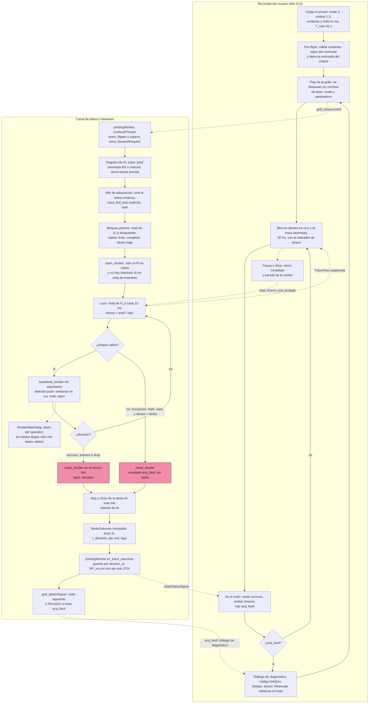

# C-01 — Ronda 2 — Arquitectura de software (líder del panel de ingeniería)

Estado: COMPLETO (2026-09-27). No se modificó nada del repositorio salvo este archivo. Árbol: `main`
con `DEC-037` aplicado (lectura finita por tick). Todo lo que se cita del código está verificado en
las líneas indicadas.

Marcas: **[CÓDIGO]** leído en la línea citada · **[MEDIDO-R1]** medido en la Ronda 1 ·
**[INFERIDO]** razonamiento no probado · **[PROPUESTA]** diseño de esta ronda · **[BANCO]** depende
de una medición en el banco.

Orden de las secciones: 1 síntesis · 0 hechos del código · 2 hilos y señales · 3 diagrama ·
4 parámetros del motor y presupuesto de latencia · 5 verificación y rollback · 6 GUI y
documentación · 7 riesgos, preguntas y veredicto.

---

## 1. Síntesis ejecutiva

- **Qué se diseña.** La opción E. Por cada nodo, una **sesión** con su propio `threading.Thread`:
  - tarea DAQmx continua a 10 kS/s por canal, con buffer explícito de 10 s;
  - `read` bloqueante de bloques de 100 muestras, es decir, 10 ms pautados por el reloj de la placa;
  - el atraso se mide en cada bloque.

  El detector y el `close_shutter` corren en ese mismo hilo. La GUI recibe una vista coalescida
  (≤ 30 Hz, ≤ 1 pendiente), y la grilla, un único `NodeOutcome` inmutable en `confocalThread`. El
  motor vive en `core/`, sin PyQt6; `modules/trace.py` queda como adaptador.
- **Lo que corrige de lo que hay hoy** (§0):
  - la decisión deja de correr en el hilo GUI, detrás de una cola sin cota;
  - el obturador ya no se abre (dos veces) antes de adquirir;
  - una lectura fallida deja de valer 0.0 V;
  - el latido deja de salir de datos inválidos, y el `heartbeat_shutter(30.0)` explícito (C-29)
    desaparece;
  - `grid_trace_detect` gana una guarda de reentrada;
  - `_save_trace` deja de romperse con más de 2000 ticks, que es justo lo que pasaría con bloques en
    ms.
- **Requisitos comunes de la Ronda 1, todos cubiertos:**
  - adquirir antes de exponer (3 bloques válidos antes de abrir);
  - una lectura fallida cierra el obturador y el resultado es `acq_fault`, con pausa;
  - el latido sale sólo con un bloque válido;
  - un único dueño de las AI, que cierra las tareas previas y preempta Power BS y la traza manual;
  - latch, más una guarda por `session_id`, contra el doble despacho;
  - contraste negativo en los modos 0 y 1;
  - un doble de tarea con reloj virtual, que extiende el de `test_trace_acquisition_freshness.py`
    en un módulo compartido.
- **Ventanas en ms.** Los presets en uso se conservan convirtiendo con la cadencia real de
  producción, `T_ref` = 47 ms: `steps` 10 → 470 ms, `N_hold` 3 → 94 ms, `dI/dt` → 188 ms. La paridad
  del criterio se prueba contra el código actual con `assert_allclose` (Strangler Fig).
- **Hallazgo central de latencia (§4.6).** E baja la latencia de sistema a ≈ 7-17 ms. Pero con el
  preset en uso (modo 1, umbral 1.5, ventanas de 470 ms, hold de 94 ms), el **criterio** tarda
  ≈ 335 ms para un escalón ×2, hoy y con E. El objetivo de la Ronda 1 (mediana ≤ 50 ms) no depende
  de la adquisición, sino de las ventanas que elija el operador. Se propone parametrizarlo en dos
  niveles: sistema (garantizado) y proceso (con un aviso), y preguntarlo en Q1.
- **Rollback.** `config.TRACE_ACQ_BACKEND` elige entre `"legacy_timer"` (el código de `DEC-037` sin
  tocar), `"stream"` (E) y `"stream_latest"` (C, la alternativa, que usa la misma sesión con otra
  fuente). La Ronda 4 entra con `"legacy_timer"` por defecto; `"stream"` pasa a ser el valor por
  defecto recién después de BANCO-26 a 32.
- **La Ronda 3 es obligatoria**, porque cambian las unidades y los parámetros expuestos (§6.1).
- **Veredicto:** `main` está en `CONCURRENCY_RISK`; el diseño propuesto es `CLEAN_ARCHITECTURE`,
  condicionado a la paridad y al banco (§7.4).

---

## 0. Hechos del código que condicionan el diseño

### 0.1 Topología actual (con `DEC-037`)

| Pieza | Dónde corre | Referencia |
|---|---|---|
| `trace.Backend` (`traceWorker`): `QTimer.start(35)` Coarse (≈ 47 ms reales, [MEDIDO-R1]), una tarea FINITE de 10 muestras × 5 canales a 10 kS/s creada y cerrada en cada tick | `confocalThread` | `trace.py:600, 656-661`; `app.py:639` |
| `focusWorker`, `confocalWorker`, `printingWorker`, `dimersWorker` | el mismo `confocalThread` | `app.py:638-642` |
| `app.Backend._dispatch_trace` (método Python del contenedor, que **no** se mueve de hilo) | **hilo GUI** (conexión encolada desde `confocalThread`) | `app.py:473, 530-538, 625-644` |
| `printingWorker.grid_trace_detect(payload)`: criterio, `close_shutter`, `_save_trace`, ETA | **hilo GUI**, aunque el objeto tiene afinidad con `confocalThread` | `app.py:536`; `measurements.py:2325-2439` |
| `contrapropagante.py`: el mismo esquema con un cierre (`def _dispatch_trace`) conectado en el hilo principal | hilo GUI | `contrapropagante.py:1219-1229, 1287` |
| Watchdog `ShutterWatchdog` | hilo `threading` propio, sondeo cada 100 ms | `nidaq.py:165-201` |
| Cámara | `cameraThread`; el dibujo del cuadro, en el hilo GUI | `app.py:644` |

### 0.2 Secuencia de un nodo de impresión hoy

1. `measurements._grid_trace()` (`confocalThread`): `down_flipper(); sleep(0.5)`, **`open_shutter(self.laser); sleep(0.01)`**, `timer_inicio = time.time()`, `grid_traceSignal.emit(laser, mode)` (`measurements.py:2317-2322`).
2. `trace.trace_configuration()` → `_start()`: **vuelve a abrir** el obturador (`open_shutter(self.laser1)`, `trace.py:583`), llama `heartbeat_shutter(30.0)` con valor explícito (`:586`, pisa "Sin límite": C-29) y arranca el `QTimer` (`:600`). La primera muestra llega ≈ 47 ms después de la apertura: **se expone antes de adquirir** (requisito común R1-3).
3. Cada tick (`trace.py:638-734`): lectura finita; una excepción deja **0.0 V en los tres canales** (`:692-694`); calcula `I_old`/`I_new` con ventanas en **ticks** (`M = steps_after`, `M2 = steps_before`, `:705-717`); emite `dataSignal` (plot) y `data_printingSignal` (criterio) con el payload acotado a `SEND_WINDOW = 2000` muestras (`:727-734`). `heartbeat_shutter(30.0)` cada 30 ticks (`:640-641`).
4. `grid_trace_detect` (hilo GUI, `measurements.py:2325-2439`): `heartbeat_shutter()` **en cada llamada, sin mirar si el dato es válido** (`:2333`); `dI_dt` sobre 4 ticks (`:2349-2351`); modos 0-4; `hold_counter` en ticks (`:2392-2399`); `slope_min` es en realidad un umbral mínimo absoluto en V (`:2388`); caída `I_new < I_old·umbral_down` → **"timeout"** (`:2408, 2416-2418`), nunca "success"; `T_max` por reloj de pared desde `timer_inicio` (`:2346, 2406-2408`).
5. Parada: `grid_trace_stopSignal.emit()` (encolada a `traceWorker.stop` en `confocalThread`), `close_shutter(self.laser)` en el hilo GUI, `_save_trace()`, ETA, `grid_detectSignal.emit()` (`:2409-2439`). **No hay guarda de reentrada**: los `data_printingSignal` ya encolados en el hilo GUI antes de que `stop()` corra en `confocalThread` vuelven a evaluar el criterio sobre el mismo nodo (N1 del abogado del diablo).
6. `_save_trace` (`measurements.py:2968-2981`): eje **sintético** `np.linspace(0.01, timer_real, ptr)` con `ptr = data[0] = self._n` (contador global), pero `data1` y `data_BS` son el **recorte** de `SEND_WINDOW`. Si un nodo supera 2000 ticks, `np.transpose([t, data1, data_BS])` recibe listas de distinto largo y lanza `ValueError` en el hilo GUI, después de `close_shutter` y **antes** de `grid_detectSignal` → la grilla queda detenida. Con 47 ms y `T_max` = 40 s son ≈ 850 ticks (no ocurre); con bloques de 10 ms son 4000 (ocurre). **Cualquier diseño en ms tiene que cambiar esto** (§4).

### 0.3 Parámetros del criterio: unidades reales hoy

| Parámetro (GUI → backend) | Unidad real | Valor en uso (investigador, R3) | Equivalente a ≈ 47 ms/tick |
|---|---|---|---|
| `steps_before` → `trace.steps_before` = M2 (ventana de `I_old`) | ticks | 10 (default; el investigador no lo cambió) | ≈ 470 ms |
| `steps_after` → `trace.steps_after` = M (ventana de `I_new`) | ticks | 10 | ≈ 470 ms |
| `n_hold_steps` (modos 1-4) | ticks consecutivos | **3** | ≈ 141 ms |
| `dI_dt` (modos 2, 4) | V/s sobre 4 ticks | — | Δt ≈ 188 ms |
| `SEND_WINDOW` | ticks | 2000 | ≈ 94 s |
| `timemax` | s de reloj de pared | **40** | — |
| `umbral` | adimensional | **1.5** | — |
| `umbral_down` | adimensional | **0.5** (no se usa) | — |
| modo | — | **1** ("salto relativo + umbral absoluto & anti-paso") | — |

Los tooltips de `steps_before`/`steps_after` (`measurements.py:685, 687`) describen algo que el código
no hace ("muestras adquiridas antes de abrir el obturador" / "tras cerrarlo"): son las ventanas M2 y M
del cociente móvil. Hay que corregirlos en la Ronda 3.

### 0.4 Capa DAQ (`core/nidaq.py`)

- `channels_photodiodos(rate, samps_per_chan, continuous=False)` (`:729-776`): 5 canales AI
  (`PD_CHANS_LIST = [0, 1, 2, 3, 6]`, `config.py:87`); en `SAFE_MODE` o aislado devuelve un
  `_MockNITask` (`read()` sin estado temporal, `:42-66`); fuera de `SAFE_MODE`, si la tarea no se puede
  crear, activa el interlock `"NI-DAQmx"`, cierra todo y devuelve `_UnavailableNITask` (lee NaN,
  `:69-80`). **No cubre** el caso de una tarea que se crea bien pero cuyo `read()` falla: eso queda en
  manos del llamador, y hoy el llamador escribe 0.0 V.
- `heartbeat_shutter(timeout_s=_SENTINEL)` (`:204-216`) renueva **un único plazo global**
  (`_watchdog_deadline`); con `None` desarma. No sabe quién late ni por qué: cualquier llamada renueva
  la vida de todos los obturadores. Es el "latido del obturador", no todavía el "latido de la rutina"
  de R2-8.
- `open_shutter`/`close_shutter` devuelven `bool` confirmado y toman `_nidaq_lock` (`RLock`,
  `:447-522`); un cierre sin confirmar se reintenta 3 veces con 50 ms (`SHUTTER_CLOSE_RETRIES`,
  `SHUTTER_RETRY_DELAY_S`, `:123-124`): **peor caso de un cierre fallido ≈ 100 ms + 3 escrituras**, que
  entra en el presupuesto de latencia.
- No existe hoy ningún registro de "quién tiene las entradas analógicas": cada módulo crea su tarea
  (`confocal`, `focus`, `contrapropagante`, PySpectrum `read_photodiode_level`) y `close_all_tasks()`
  (`:814-827`) sólo conoce las tareas de salida.

### 0.5 Otros hechos que pesan en el diseño

- **Doble apertura.** En impresión, el obturador lo abre `measurements._grid_trace` (`:2319`) y lo
  vuelve a abrir `trace._start` (`:583`). Tiene que quedar un solo lugar que abra, y que abra recién
  después de la primera lectura válida.
- **Con `DEC-037` no hay −50103 dentro del proceso.** La traza y Power BS crean y cierran su tarea
  finita dentro del mismo slot y en el mismo hilo (`confocalThread`), así que nunca hay dos tareas AI
  vivas a la vez. El conflicto aparece **en cuanto una tarea queda viva durante todo el nodo**, que es
  lo que hace la opción E. Por eso, con E, el "único dueño de las AI" deja de ser opcional.
- **El puente de fallas de obturador es seguro desde cualquier hilo.** `core/shutters.py:87-103`
  (`_watchdog_callback_bridge`, `_shutter_fault_bridge`) sólo emite señales, así que `close_shutter()`
  puede llamarse desde el hilo de adquisición sin tocar widgets.
- **`hardware_session` es de PySpectrum** (`pyspectrum/modules/hardware_session.py:58-61`) e importa
  los drivers Andor. El motor de la traza vive en `core/` y no puede importarlo (checklist 3,
  dirección de dependencias). La parada de emergencia de PySpectrum en modo satélite (`DEC-019`) se
  inyecta como predicado.
- **El reporte Time-Volt lee los `NP_xxx.txt`** con `np.loadtxt(..., unpack=True)` y calcula
  `latency = t_raw − t_step` sobre el eje de tiempo del archivo (`measurements.py:2600-2670`). Hoy ese
  eje es sintético, así que la "latencia" del reporte no mide nada. Con un eje real pasa a ser una
  medición. Hay que conservar las tres columnas (`Time_s`, `Photodiode_V`, `Photodiode_BS_V`) y agregar
  los metadatos sólo como líneas de encabezado `#`, que `loadtxt` ignora.
- **`contrapropagante.py` importa la misma `trace.Backend`** (`:51, 1188`) y repite el
  `_dispatch_trace` en el hilo GUI (`:1219-1229`). Lo que se decida acá le aplica también, y conviene
  reutilizarlo en vez de copiarlo (R2-7).

---

## 2. Topología de hilos y señales [PROPUESTA]

### 2.1 Decisión de concurrencia

El exemplar `pyqt_routine_concurrency_gold.md` fija como opción por defecto el `QTimer` en el hilo GUI
y sólo admite un hilo real con una razón registrada. Esta sería la **cuarta excepción**, con esta razón:

> La decisión de fin de impresión tiene que estar pautada por el reloj de la placa y no puede pasar
> por ninguna cola de eventos de Qt. Hoy pasa por dos: el `QTimer` Coarse del `confocalThread`
> (≈ 47 ms medidos) y la cola del hilo GUI, que compite con la cámara en vivo y con pyqtgraph y no
> tiene cota (C-01, Ronda 1).

Forma elegida: **un `threading.Thread` por sesión**, dentro de un motor en `core/` que no importa
PyQt6, más un **adaptador Qt delgado** en `modules/trace.py`.

¿Por qué no un `QObject` con `moveToThread`? El lazo se bloquea en `read()` y nunca vuelve a un event
loop, así que un slot encolado a ese hilo no se entregaría nunca: es la trampa que documenta el
exemplar. `threading.Thread`, en cambio:
- permite probar el motor sin Qt;
- deja el lazo cubierto por el `threading.excepthook` de `DEC-036` como última barrera;
- cumple la regla "subclasear `QThread.run()` sólo para sondeo de bajo nivel" sin mezclar el ciclo
  de vida de la tarea con el de Qt.

### 2.2 Dueños

| Recurso | Dueño único | Quién más lo toca | Cómo |
|---|---|---|---|
| Tarea DAQmx de AI de una sesión (continua, 5 canales) | el hilo de adquisición de esa sesión: la crea, la arranca, la lee, **la detiene y la cierra él mismo** | nadie | `stop()` desde otro hilo sólo pone un `threading.Event`. Nunca se llama `task.close()` fuera de ese hilo (evita −200088) |
| Derecho a crear tareas de AI en el proceso | registro `analog_inputs` en `core/nidaq.py` (§4.1) | confocal, foco, contrapropagante, PySpectrum | todo pasa por `channels_photodiodos(..., owner=...)`, que ya es el único punto de creación |
| Obturador del láser de impresión durante el nodo | la sesión. **Abre** después de los bloques previos válidos y **cierra** en la decisión o ante una falla | watchdog (cierre forzado), `grid_pause`, panel de obturadores, E-STOP | `open_shutter` y `close_shutter` ya son seguras entre hilos (`_nidaq_lock`, `RLock`) e idempotentes |
| Criterio de parada (estado de ventanas, `hold`) | `PrintStopDetector`, instancia privada de la sesión | nadie | objeto puro, sin hilos; sólo lo llama el lazo |
| Registro completo del nodo (bloques, tiempos, lags) | la sesión, en buffers preasignados | GUI, que lee copias decimadas | se entrega **una sola vez**, inmutable, en `NodeOutcome` |
| Estado de la grilla (`i_global`, `node_results`, archivos, ETA) | `printingWorker` / `dimersWorker`, en `confocalThread` | — | reciben `NodeOutcome` por una señal encolada. Ya **no** corren en el hilo GUI |
| Widgets de la traza y de Power BS | hilo GUI | — | reciben un `TraceView` coalescido (≤ 1 pendiente, ≤ 30 Hz) |

### 2.3 Qué cruza de un hilo a otro

| Origen → destino | Qué | Mecanismo | Cota |
|---|---|---|---|
| `printingWorker` → `traceWorker` (ambos en `confocalThread`) | `SessionRequest` (dataclass inmutable) | señal `grid_traceRequestSignal(object)`; directa, porque es el mismo hilo | una por nodo |
| `traceWorker` → hilo de adquisición | arranque | `TraceSession.start(request)` crea e inicia el hilo | una por sesión |
| hilo de adquisición → watchdog | latido | `heartbeat_shutter()` **sin argumento**, sólo después de un bloque válido y con el obturador abierto | 100 Hz; llamada O(1) bajo un `Lock` |
| hilo de adquisición → placa DO | cierre del obturador | `close_shutter(laser)`, **en el mismo hilo y en la misma iteración** que la decisión | ≈ 0.1-1 ms. Si falla, ≈ 100 ms más 3 escrituras (`nidaq.py:498-503`) |
| hilo de adquisición → `printingWorker` | `NodeOutcome` (dataclass inmutable, con copias propias de los arrays) | `TraceStreamBridge.outcomeReady(object)` con `QueuedConnection` explícita | **exactamente uno por sesión** (latch) |
| hilo de adquisición → hilo GUI | `TraceView`: los últimos `view_window_s`, decimados | buzón de un solo lugar más `viewReady()`, que se emite sólo si ya se consumió la vista anterior | ≤ 30 Hz y ≤ 1 pendiente. Evita la inundación de la cola de `DEC-013` y la cola sin límite de la opción D |
| cualquier hilo → hilo de adquisición | parada | `TraceSession.stop(reason)`: pone un `Event` y hace un `join(timeout)` acotado | vuelve en ≤ `read_timeout_s` + 50 ms |
| watchdog, interlock o E-STOP → hilo de adquisición | aborto | predicados que se consultan **entre bloques**: `get_shutter_interlocks()`, la bandera que pone el callback del watchdog, `is_emergency_stopped` inyectado | ≤ 1 bloque (10 ms) |

### 2.4 Cómo se evitan la reentrada y el doble despacho

1. **Por construcción.** La decisión y el cierre ocurren en el mismo hilo que lee, así que no hay
   una cola de ticks pendientes que vuelva a evaluar el criterio. Tras la primera decisión, el lazo
   pone `_decided = True` antes de `close_shutter()` y sale: no evalúa ningún bloque más.
2. **Latch de salida.** `on_outcome` se llama una sola vez por sesión. Si un `stop()` llega al mismo
   tiempo que la decisión, gana el primero que toma el `Lock` del latch; el otro sólo ve que la sesión
   ya terminó y no produce un segundo resultado.
3. **Guarda por identificador.** `printingWorker.on_trace_outcome(outcome)` acepta un resultado sólo
   si `outcome.session_id == self._active_session_id`, y lo marca como consumido. Un resultado
   duplicado o viejo (por ejemplo, de una sesión que detuvo la Pausa) se registra en el log y se
   descarta. Así `grid_detectSignal` se emite una vez e `i_global` avanza una vez.
4. **Camino heredado** (bandera de rollback, §5.4). `grid_trace_detect` gana la guarda
   `if self._node_decided: return`: la bandera se pone en la decisión y se limpia en `_grid_trace()`.
   Es el test F4 del abogado del diablo, que hoy **falla** en `main`. Conviene aplicarla también al
   camino de `DEC-037` mientras siga en uso.

### 2.5 Convivencia con el resto del sistema

- **Confocal y foco.**
  - Dentro de la rutina todo es secuencial (autofoco → traza → escaneo): la sesión de un nodo empieza
    y termina entre ellos.
  - Antes de crear su tarea, la sesión pide el registro de AI, que **cierra toda tarea previa** de
    otro dueño; por ejemplo, un `_step_task` del confocal que haya quedado abierto (`confocal.py:817`).
    Ese cierre se hace desde `confocalThread`, el mismo hilo que usa esas tareas, así que nunca se
    cierra una tarea en plena lectura.
  - Si durante una sesión de impresión alguien pide foco o confocal a mano, el pedido **se rechaza**
    con `AnalogInputBusyError`: ni simulador ni NaN. Además la GUI deshabilita esos botones mientras
    dure la sesión (config-lock, checklist 11; se define en la Ronda 3).
- **Cámara en vivo.**
  - Corre en `cameraThread` y dibuja en el hilo GUI. La sesión no depende de ninguno de los dos
    event loops: el único acoplamiento es el GIL.
  - `read_many_sample` es una llamada ctypes, que libera el GIL mientras bloquea [INFERIDO; se
    verifica en BANCO-28 con la cámara encendida y apagada].
  - El despertar después de `read()` puede atrasarse unos cuantos intervalos de conmutación de Python
    (`sys.getswitchinterval()` = 5 ms por defecto) si el hilo GUI retiene el GIL con numpy o
    pyqtgraph. Por eso ese término figura en el presupuesto (§4.6) y se mide.
  - La vista se coalesce: si la GUI va lenta, la traza pierde cuadros, pero la decisión no se atrasa.
- **Power BS.**
  - Deja de tener una tarea propia. Si hay una sesión corriendo, la ventana BS se alimenta del canal
    BS de las vistas de esa sesión.
  - Si no hay ninguna, abre una sesión `purpose="bs_monitor"` sin obturador ni detector, y
    **preemptible**: el registro de AI la detiene (con `join` acotado) cuando arranca una sesión de
    impresión o una tarea de foco o de confocal.
  - Así se corrigen a la vez el defecto de C-01 en `_bs_only_update` y el −50103 que traería E.
- **Traza manual (Play / F1).** Es una sesión `purpose="manual"`: la misma lógica sin detector. Abre
  los obturadores después de los bloques previos, late con cada bloque válido y, ante una falla, cierra
  y avisa. Es preemptible, porque es un monitor.
- **Watchdog.**
  - Su política no cambia; eso corresponde a la tanda b1 (R2-8) y nunca es exento. La sesión sólo
    decide **de dónde sale el latido**: de cada bloque válido, nunca del reloj ni de un bloque fallido.
  - Hoy el latido es `heartbeat_shutter()` sin argumento. Cuando exista el latido de vida de rutina,
    se cambia el callable `on_liveness` y nada más.
  - Si el watchdog dispara (no debería, con latidos cada 10 ms), su callback pone una bandera que la
    sesión ve en el bloque siguiente. El nodo termina como `aborted` ("watchdog") y no queda esperando
    un escalón que ya no puede ocurrir: la situación que describe `measurements.py:2326-2331`.
  - Una lectura que no vuelve la corta el propio `read_timeout_s`. Eso es el manejo de una falla
    conocida, no un mecanismo de watchdog.
  - Un hilo colgado **dentro** del driver, más allá de ese timeout, deja de latir, y sólo lo protege
    la política del watchdog. En modo "Sin límite" hoy no lo protege nada. Ese hueco es de R2-8 y queda
    registrado en §7.
- **Interlocks y E-STOP.**
  - Un interlock activo (`"NI-DAQmx"`, `"Platina PI"`) o el E-STOP de PySpectrum en modo satélite
    abortan la sesión en el bloque siguiente: el obturador se cierra y el resultado es `acq_fault` o
    `aborted`.
  - `open_shutter` ya se niega a abrir con un interlock activo, y la sesión trata ese `False` como
    una falla **antes** de exponer.
- **Contrapropagante.** Usa la misma `trace.Backend` y adopta la misma API. Se eliminan su
  `_dispatch_trace` (`contrapropagante.py:1219-1229`) y el de `app.py:530-538`.

---

## 3. Diagrama de doble carril [PROPUESTA]

Carril izquierdo: lo que hace y ve el operador. Carril derecho: hilos, hardware y datos. Las
flechas punteadas cruzan de carril. Las cajas rojas son los puntos donde se cierra el obturador.



Lectura del diagrama, en orden de seguridad:
- el obturador sólo se abre en P4, después de que la tarea arrancó y entregó bloques válidos;
- sólo se cierra en P9 y PF, las dos en el hilo de adquisición;
- el latido (P7 → W) sale únicamente de un bloque válido;
- el hilo GUI recibe sólo copias (vistas y resultados) y no decide nada.

---

## 4. Inventario de parámetros del motor [PROPUESTA]

Tres módulos nuevos en `core/` que no importan PyQt6. El orden de la lista es el de las dependencias,
y ninguna dependencia es circular:
- `core/print_stop_detector.py` sólo usa numpy;
- `core/photodiode_stream.py` usa `core.nidaq` y `config`;
- `core/trace_session.py` usa los dos anteriores.

El adaptador Qt va en `modules/trace.py`. Las firmas de abajo son de diseño, no código de producción.

### 4.1 `core/nidaq.py`: registro de dueño de las AI y fábrica de tareas

```python
class AnalogInputBusyError(RuntimeError):
    owner: str                      # quién tiene las AI; se usa en el mensaje al operador

def claim_analog_inputs(owner: str, *, preemptible: bool,
                        preempt: Callable[[float], bool] | None = None,
                        timeout_s: float = 0.5) -> None:
    """Reserva las AI del proceso para `owner`.
    - Si las tiene un dueño preemptible, llama a su preempt(timeout_s), que detiene su sesión y
      hace join; si devuelve False, lanza AnalogInputBusyError.
    - Si las tiene un dueño no preemptible, lanza AnalogInputBusyError.
    - Cierra las tareas finitas registradas de otros dueños que sigan abiertas, pero sólo si se
      crearon en el hilo llamador. Una tarea de otro hilo nunca se cierra desde acá: lanza."""

def release_analog_inputs(owner: str) -> None: ...        # idempotente
def analog_inputs_owner() -> str | None: ...

def channels_photodiodos(rate: float, samps_per_chan: int, continuous: bool = False, *,
                         owner: str = "legacy",
                         buffer_samps_per_chan: int | None = None):
    """Igual que hoy, más dos cosas:
    (a) registra la tarea bajo `owner` en un registro de weakrefs; si hay un dueño no preemptible
        distinto, lanza AnalogInputBusyError en vez de crear la tarea;
    (b) con continuous=True y buffer_samps_per_chan, fija task.in_stream.input_buf_size de forma
        explícita, así el buffer no depende de la tabla ambigua de NI (BANCO-26)."""
```

**Invariantes:**
- `SAFE_MODE` y "aislado" siguen devolviendo `_MockNITask`;
- una tarea que no se puede crear sigue activando el interlock `"NI-DAQmx"` y devolviendo
  `_UnavailableNITask` (`DEC-036` sin cambios);
- `owner="legacy"` conserva exactamente el comportamiento actual para los llamadores que todavía no
  migraron.

Llamadores que pasan a declarar su dueño (Ronda 4):

| Llamador | `owner` |
|---|---|
| `focus.py:430` | `"focus"` |
| `confocal.py:817, 938, 947` | `"confocal"` |
| `contrapropagante.py:722` | `"contrapropagante"` |
| `optical_support.py:81` | `"pyspectrum"` |

### 4.2 `core/print_stop_detector.py` (puro: sin hilos, sin hardware, sin Qt)

```python
@dataclass(frozen=True)
class StopCriterion:
    mode: int = 0                    # 0..4, misma semántica que measurements.py:2358-2384
    umbral: float = 1.2              # adimensional, > 1
    umbral_down: float = 0.0         # adimensional; 0 = desactivado; con contrast_sign = -1 se ignora
    umbral_abs_v: float = 2.5        # V (modos 1, 3, 4)
    umbral_min_v: float = 0.0        # V; hoy `slope_min`, mal nombrado (measurements.py:2388)
    slope_flat_v_s: float = 2.0      # V/s (modos 2, 4)
    v_peak_scaled_v: float = 3.5     # V (modo 3)
    percent_thresh: float = 50.0     # % (modo 3)
    win_old_ms: float = 470.0        # ventana de I_old (hoy steps_before = 10 ticks)
    win_new_ms: float = 470.0        # ventana de I_new (hoy steps_after = 10 ticks)
    hold_ms: float = 188.0           # duración continua mínima de la condición (modos 1-4)
    slope_window_ms: float = 188.0   # base de dI/dt (hoy 4 ticks)
    t_max_s: float = 20.0            # s, contados en el reloj de muestreo desde la apertura confirmada
    contrast_sign: int = +1          # +1 escalón hacia arriba; -1 hacia abajo (sólo modos 0 y 1)

    def validate(self, block_ms: float) -> list[str]: ...          # errores de pre-flight; vacío = OK
    def blocks(self, block_ms: float) -> "CriterionBlocks": ...    # conversión a bloques (§4.5)
    @classmethod
    def from_legacy_ticks(cls, params: Sequence[float], stopping_mode: int,
                          t_ref_ms: float) -> "StopCriterion": ...  # grid_parameters() de hoy

@dataclass(frozen=True)
class Decision:
    kind: Literal["success", "timeout", "drop"]   # "drop" hoy se guarda como "timeout" (compatibilidad)
    t_s: float                                     # reloj de muestreo, t = 0 en la apertura
    i_old: float
    i_new: float
    n_blocks: int

class PrintStopDetector:
    def __init__(self, criterion: StopCriterion, block_ms: float,
                 capacity_blocks: int) -> None: ...   # buffers preasignados; sumas acumuladas O(1)
    def reset(self) -> None: ...
    def push(self, v_pd: float, t_s: float) -> Decision | None: ...  # un bloque ya validado (finito)
    def window_means(self) -> tuple[float, float]: ...               # (I_old, I_new) para la vista
```

**Reglas de `push`, heredadas bit a bit de `trace.py:705-717` y `measurements.py:2349-2418`:**
- con n bloques válidos y `M = n_new`, `M2 = n_old`:
  - si n < M, `I_new = I_old = mean(x[0:n])`;
  - si n ≥ M, `I_new = mean(x[n−M:n])` e `I_old = mean(x[max(0, n−M−M2) : n−M])`.
- La condición relativa se arma recién con n ≥ M + 1. Así desaparece el `mean([])` = NaN del caso
  n = M (abogado del diablo §0.7), y la decisión es la misma que hoy, porque hoy ese NaN ya hacía
  falsa la comparación.
- `c_abs` se evalúa desde el primer bloque, igual que hoy.
- `hold` se cuenta en bloques consecutivos.
- `T_max` se compara contra `t_s`.
- Entrada NaN: **no existe**. La sesión nunca empuja un bloque inválido; es una precondición, y
  `push` la verifica con un `assert`.

**Contraste negativo** (`contrast_sign = -1`, sólo modos 0 y 1):
- `c_rel = I_old > 0 and I_new < I_old / umbral`;
- `c_abs = I_new < umbral_abs_v`;
- `umbral_down` y `umbral_min_v` no se aplican.

Con los modos 2, 3 y 4 y signo −1, `validate()` rechaza el criterio antes de abrir nada.

### 4.3 `core/photodiode_stream.py`: fuentes de bloques

```python
@dataclass(frozen=True)
class StreamConfig:
    rate_hz: float = 10_000.0        # FIJO: RATE_MULTICHANNEL / 100, por canal (hoy trace.py:501)
    block_ms: float = 10.0           # FIJO en config (TRACE_BLOCK_MS); 20.0 si el banco muestra 50 Hz
    buffer_s: float = 10.0           # FIJO: input_buf_size = rate · buffer_s = 100 000 muestras por canal
    read_timeout_s: float = 0.2      # FIJO: = techo de latencia; una lectura que no vuelve es una falla
    lag_catchup_ms: float = 20.0     # FIJO: si el atraso > 2·T_b, se vacía lo disponible (sin huecos)
    lag_fault_ms: float = 150.0      # FIJO: atraso por encima del cual la decisión ya no es válida → falla
    channels: tuple[int, ...] = (0, 1, 2, 3, 6)   # PD_CHANS_LIST

    @property
    def block_samples(self) -> int: ...          # round(rate · block_ms / 1000) = 100

@dataclass(frozen=True)
class Block:
    index: int                       # bloque k desde start()
    t_center_s: float                # (k·N_b + N_b/2) / rate: eje exacto del reloj de muestreo
    means: NDArray[np.float64]       # (n_ch,), promedio de N_b muestras por canal
    lag_ms: float                    # avail_samp_per_chan / rate después de leer
    read_ms: float                   # duración de la llamada read (diagnóstico, BANCO-28)
    wake_mono_s: float               # perf_counter al volver (jitter de despertar)

class AcquisitionFault(Exception):
    kind: Literal["start", "read", "timeout", "nan", "short", "lag", "overflow"]
    daqmx_code: int | None           # p. ej. -50103, -200279, -200284
    block_index: int | None

class BlockSource(Protocol):
    def start(self) -> None: ...                      # AcquisitionFault("start") si falla
    def read_block(self) -> Block: ...                # bloqueante; AcquisitionFault ante cualquier falla
    def drain(self) -> list[Block]: ...               # bloques completos ya disponibles (catch-up)
    def close(self) -> None: ...                      # idempotente; se llama SIEMPRE en el hilo dueño

class ContinuousBlockSource:    ...  # opción E: CONTINUOUS, buffer explícito, CURRENT_READ_POSITION,
                                     # AnalogMultiChannelReader.read_many_sample sobre un array preasignado
class LatestSamplesSource:      ...  # opción C: OVERWRITE_UNREAD_SAMPLES + MOST_RECENT_SAMPLE, offset −N;
                                     # pautada por time.sleep hasta el próximo múltiplo de T_b (Python ≥ 3.11
                                     # usa en Windows un temporizador de alta resolución [INFERIDO; BANCO-28]);
                                     # t = (total_samp_per_chan_acquired − N/2) / rate
class SimulatedBlockSource:     ...  # SAFE_MODE: reloj real pautado por perf_counter, señal guionada
                                     # (base, ruido, escalón opcional); reemplaza al _MockNITask en la traza
```

`validate_block(block, channels_used) -> None` lanza `AcquisitionFault("nan")` si hay un valor no
finito en un canal usado, y `("short")` si se leyeron menos de `N_b` muestras.

### 4.4 `core/trace_session.py`: la sesión

```python
@dataclass(frozen=True)
class SessionRequest:
    session_id: int                               # monotónico por proceso
    purpose: Literal["print", "manual", "bs_monitor"]
    lasers_to_open: tuple[str, ...]               # SHUTTERS; () para bs_monitor
    pd_index: int                                 # índice en PD_CHANS_LIST (exacto; sin el match
                                                  # por subcadenas de trace.py:663-670)
    bs_index: int
    criterion: StopCriterion | None               # None en manual y bs_monitor
    node_index: int | None = None
    pre_open_blocks: int = 3                      # FIJO: 30 ms de datos válidos antes de abrir
    open_settle_ms: float = 50.0                  # FIJO: bloques excluidos del detector tras abrir
                                                  # (≈ los 57 ms de hoy; BANCO-30 lo ajusta)

@dataclass(frozen=True)
class NodeOutcome:
    session_id: int
    node_index: int | None
    kind: Literal["success", "timeout", "drop", "acq_fault", "aborted"]
    reason: str                                   # texto para el operador y el log
    fault: AcquisitionFault | None
    t_open_s: float | None                        # reloj de muestreo; None si nunca se abrió
    exposure_s: float                             # t_decisión − t_open = hoy `timer_real`
    close_confirmed: bool                         # retorno de close_shutter()
    close_sw_ms: float                            # último bloque leído → close_shutter devuelto
    time_s: NDArray[np.float64]                   # eje real, t = 0 en la apertura, desde t ≥ open_settle
    pd_v: NDArray[np.float64]
    bs_v: NDArray[np.float64]
    pre_open: NDArray[np.float64]                 # (n_pre, n_ch): oscuro o base antes de abrir (HDF5)
    lag_ms_p50: float
    lag_ms_p95: float
    lag_ms_max: float
    i_old: float
    i_new: float
    criterion: StopCriterion | None

@dataclass(frozen=True)
class TraceView:                                  # lo único que ve la GUI
    session_id: int
    time_s: NDArray[np.float64]
    pd_v: NDArray[np.float64]
    pd2_v: NDArray[np.float64]
    bs_v: NDArray[np.float64]
    i_old: float
    i_new: float
    mean_bs_v: float
    lag_ms: float

class TraceSession:
    def __init__(self, stream_cfg: StreamConfig, source_factory: Callable[[StreamConfig], BlockSource],
                 *, on_view: Callable[[TraceView], None],
                 on_outcome: Callable[[NodeOutcome], None],
                 on_liveness: Callable[[], None] = heartbeat_shutter,     # sin argumento (C-29)
                 abort_predicates: Sequence[Callable[[], str | None]] = (),
                 shutter_open: Callable[[str], bool] = open_shutter,
                 shutter_close: Callable[[str], bool] = close_shutter,
                 view_rate_hz: float = 30.0, view_window_s: float = 40.0,
                 threaded: bool = True) -> None: ...
    def start(self, request: SessionRequest) -> None: ...   # no bloquea; las fallas llegan por on_outcome
    def stop(self, reason: str, timeout_s: float = 0.5) -> bool: ...   # seguro entre hilos; idempotente
    def run_blocking(self, request: SessionRequest) -> NodeOutcome: ...  # threaded=False: para los tests
    @property
    def is_running(self) -> bool: ...
```

**Orden dentro del hilo** (es el contrato que se prueba en §5):
1. `claim_analog_inputs`;
2. `source.start()`;
3. `pre_open_blocks` bloques válidos;
4. `shutter_open` para cada láser. Si alguno devuelve `False`, se cierran todos y el resultado es
   `acq_fault`, sin exposición;
5. el lazo:
   - `read_block`, o `drain` si hay atraso;
   - validar;
   - `on_liveness()`;
   - `detector.push`;
   - vista decimada;
   - predicados de aborto;
6. al decidir o ante una falla, `shutter_close` en la misma iteración y el latch;
7. `source.close()` en este hilo;
8. `release_analog_inputs`;
9. `on_outcome`, una sola vez.

Cualquier excepción que no sea `AcquisitionFault` dentro del lazo se convierte en `acq_fault` con el
tipo de excepción en `reason`. El `threading.excepthook` de `DEC-036` queda como barrera de último
recurso, no como el camino normal.

### 4.5 Parámetros hoy en ticks, en ms y en bloques (conservando los presets en uso)

**Referencia de conversión.** Se usa `T_ref = 47 ms`, la cadencia real medida del `QTimer` de
35 ms en la PC de desarrollo [MEDIDO-R1]. Es la cadencia con la que se ajustaron los presets de
producción (`7f5d10a`). Queda como `config.TRACE_LEGACY_TICK_MS` hasta que BANCO-24/28 la confirmen en
la PC del banco, que puede tener otra resolución de temporizador.

**Conversión a bloques** (`T_b` = duración del bloque):

| Parámetro en ms | Bloques |
|---|---|
| `win_*_ms` | `n = max(1, round(win_ms / T_b))` |
| `hold_ms` | `n_hold = 1 + ceil(hold_ms / T_b − 1e-9)`. La tolerancia hace falta porque, sin ella, `(N − 1)·47/47` en punto flotante puede dar N − 1 + ε y el `ceil` sumaría un bloque |
| `slope_window_ms` | `n_slope = max(1, round(slope_ms / T_b))` intervalos |

Con `T_b = T_ref` la conversión es la identidad: es la condición del test de paridad (§5.1).

| Parámetro de hoy (unidad) | Nuevo parámetro | Conversión | Preset en uso → ms | → bloques de 10 ms | Otros presets del repo (N_hold 5, M 10) |
|---|---|---|---|---|---|
| `steps_before` (ticks) | `win_old_ms` | × T_ref | 10 → **470 ms** | 47 | 470 ms → 47 |
| `steps_after` (ticks) | `win_new_ms` | × T_ref | 10 → **470 ms** | 47 | 470 ms → 47 |
| `n_hold_steps` (ticks) | `hold_ms` | (N − 1) × T_ref | 3 → **94 ms** | 11 | 5 → 188 ms → 20 |
| base de `dI/dt`: 4 ticks, fija (`measurements.py:2350`) | `slope_window_ms` | 4 × T_ref | **188 ms** | 19 | igual |
| `timemax` (s de reloj de pared) | `t_max_s` (s del reloj de muestreo) | igual | **40 s** | 4000 | 15-20 s |
| `SEND_WINDOW` (ticks; lo usa también el criterio vía `_save_trace`) | se separan: `view_window_s` para la GUI y la capacidad del registro del nodo para el criterio | capacidad = ceil((t_max_s + 12 s) / T_b) | — | 5200 (40 s + margen de Healing +10 s) | — |
| latido cada 30 ticks con `heartbeat_shutter(30.0)` (`trace.py:640-641`) | `on_liveness()` en cada bloque válido, sin argumento | — | — | 100 Hz | — |
| `umbral`, `umbral_abs_v`, `umbral_min_v`, `umbral_down`, `slope_flat`, `v_peak_scaled`, `percent_thresh` | sin cambio | — | 1.5 / ? / ? / 0.5 / — | — | — |

**Por qué `hold_ms = (N − 1) · T_ref`.** Hoy la parada llega en el N-ésimo tick consecutivo que
cumple la condición, (N − 1) · T_ref después del primero. Con esta conversión se conservan dos
cosas:
- la demora que agrega el hold: 94 ms hoy, 100 ms con bloques de 10 ms;
- el transitorio más corto que se rechaza: hoy, uno que abarque menos de N muestras de 1 ms
  tomadas cada 47 ms, o sea ≲ 94-141 ms según la fase; con bloques, uno de menos de ≈ 100-110 ms.

La diferencia está en el ruido. Cada bloque promedia 100 muestras en lugar de 10, así que σ baja
≈ √10 con ruido blanco. Una condición que hoy parpadea por ruido cerca del umbral va a parpadear
menos, y `hold` va a cumplirse con más facilidad sobre una captura real. Es el cambio de estadística
que anticipó la Ronda 1 (opción B), y lo revalida BANCO-32. Los umbrales relativos no cambian de
sentido; `slope_flat` (V/s) sí se vuelve menos ruidoso.

**Presets.** Los `.txt` pasan a guardar claves en ms: `win_old_ms`, `win_new_ms`, `hold_ms` y,
opcional, `slope_window_ms`.
- El lector acepta las claves viejas (`steps_before`, `steps_after`, `n_hold`), las convierte con
  `T_ref` y avisa una vez en el log.
- El guardado escribe sólo las claves nuevas.
- `modules/preset_wizard.py` y `core/preset_manager.py` se migran en la Ronda 4.
- Los presets propios de la PC del banco (`7f5d10a`) se convierten con la misma regla (pregunta Q5).

### 4.6 Presupuesto de latencia: del escalón físico al haz bloqueado

La latencia se descompone en tres partes que tienen dueños distintos:
- `L_sis`, la del sistema: la fija este diseño;
- `L_crit`, la del criterio: la fija el operador con sus ventanas;
- `L_mec`, la mecánica: la fija el obturador.

`L_total = L_sis + L_crit + L_mec`

| Etapa | E, T_b = 10 ms (estimado) | Hoy, `DEC-037` (≈ 47 ms/tick) | Cómo se mide |
|---|---|---|---|
| Amplificador del fotodiodo | ≲ 1 ms [BANCO-22: modelo y ganancia] | igual | hoja de datos |
| Esperar el fin del bloque o del tick | U[0, T_b]: media 5 ms, p95 9.5 ms | U[0, 47] ms más la ráfaga de 1 ms | cálculo |
| Transferencia DMA a la PC (PCIe) | < 1 ms [INFERIDO] | incluida en crear, leer y cerrar | BANCO-29 |
| Despertar del hilo y GIL | mediana < 1 ms; p95 ≲ 5 ms con la cámara en vivo [INFERIDO] | — | BANCO-28 (`wake_mono_s`) |
| Crear, leer y cerrar la tarea | — | ms por tick, sin medir | BANCO-28 |
| Cola del hilo GUI hasta `grid_trace_detect` | **0**: no se pasa por ahí | sin cota (cámara y plots) | BANCO-29 |
| Detector | < 0.5 ms (O(1)) | < 1 ms | test |
| `close_shutter`: escritura DO | ≈ 0.1-1 ms; si falla, +100 ms | igual | BANCO-29 |
| **`L_sis` (suma)** | **mediana ≈ 7-8 ms, p95 ≈ 17 ms** (9.5 + 1 + 5 + 0.5 + 1) [a confirmar en BANCO-29] | mediana ≈ 25-30 ms más la cola GUI, p95 ≳ 50 ms más la cola | BANCO-29 |
| `L_crit`: ventana, relativo | f · `win_new_ms`, con f = (u − 1)/(r − 1) | igual, cuantizado a ticks | fórmula (§4.2) |
| `L_crit`: hold | `hold_ms` (modos 1-4) | (N − 1) · 47 ms | fórmula |
| `L_mec`: carrera del obturador (fabricación propia) | **desconocida** [BANCO-30] | igual | BANCO-30 |

**La consecuencia que decide.** Con el preset en uso (modo 1, u = 1.5, `win_new` = 470 ms,
`hold` = 94 ms), la parte del criterio es:

| Escalón | `L_crit` hoy (en ticks de 47 ms) | `L_crit` en E (misma ventana en ms) |
|---|---|---|
| r = 2 | 8 ticks tras el escalón ≈ 330-376 ms | 0.5 · 470 + 100 ≈ 335 ms |
| r = 1.4 | la condición relativa nunca se cumple (1.4 < 1.5); decide `c_abs` si `umbral_abs_v` está bien puesto, o `T_max` | igual |

**El objetivo propuesto en la Ronda 1 (mediana ≤ 50 ms, p95 ≤ 100 ms) no se alcanza con esas
ventanas, con ninguna adquisición.** La opción E baja `L_sis` de ≈ 30-50 ms más una cola GUI sin
cota a ≈ 7-17 ms, pero `L_crit` ≈ 335 ms domina. Con r = 2 y u = 1.5, para llegar a una mediana de
50 ms habría que bajar `win_new` a ≈ 40 ms (f · 40 = 20 ms) y `hold` a ≈ 10-20 ms. Eso cambia la tasa de falsos positivos y exige recalibrar en el banco
(BANCO-32). Por eso el objetivo se parametriza en dos niveles:
- **Requisito de diseño (fijo, lo garantiza la arquitectura):** `L_sis` p95 ≤ 20 ms y máximo
  ≤ `lag_fault_ms` + 20 ms. Si se supera, es una falla (`acq_fault` por `lag`), nunca una decisión
  tardía silenciosa.
- **Objetivo de proceso (lo elige el investigador, pregunta Q1):** `L_total` mediana ≤ X ms y p95 ≤
  Y ms para un escalón r_esperado. El pre-flight calcula `L_crit` estimada = f · `win_new_ms` +
  `hold_ms` con los parámetros cargados y la muestra junto a X. Avisa, pero no bloquea: es una
  decisión científica, no de seguridad. El techo duro de 200 ms se aplica sólo a `L_sis` + `L_mec`.

Constantes propuestas en `config.py`:
- `TRACE_LATENCY_TARGET_MS = {"median": 50.0, "p95": 100.0, "ceiling": 200.0}`
- `TRACE_EXPECTED_STEP_RATIO = 2.0`

### 4.7 Capa Qt: firmas antes y después

| Dónde | Antes | Después |
|---|---|---|
| `trace.Backend` | `QTimer` + `_trace_update()` + `_bs_only_update()`; `trace_configuration(laser, mode)` abre el obturador y arranca el timer | fachada con una `TraceSession` y un `TraceStreamBridge`. Nuevos: `@pyqtSlot(object) start_print_node(request: SessionRequest)`, `stop()` → `session.stop("stop")`; `play_pause` → sesión `manual`; `set_bs_only_active` → sesión `bs_monitor`. `trace_configuration` y `_trace_update` quedan **sólo** bajo `TRACE_ACQ_BACKEND == "legacy_timer"` |
| `TraceStreamBridge(QObject)` (nuevo, `modules/trace.py`) | — | `outcomeReady = pyqtSignal(object)` (NodeOutcome), `viewReady = pyqtSignal()` (el buzón se lee con `take_view() -> TraceView \| None`), `faultNotice = pyqtSignal(str)`. Los callbacks del motor sólo emiten |
| `trace.Backend.dataSignal(list)` | `[n, t, i1, i2, I_old, I_new, bs, mean_bs]` | **el mismo contrato de 8 elementos**, armado a partir de `TraceView` para que `Frontend.get_data` no cambie en la Ronda 4 (si se cambia, se decide en la Ronda 3) |
| `trace.Backend.data_printingSignal(list)` | emitida en cada tick hacia `_dispatch_trace` | **se elimina** en modo `stream`; queda en `legacy_timer` |
| `measurements.Backend._grid_trace()` | `down_flipper(); sleep(0.5); open_shutter(); sleep(0.01)`; `grid_traceSignal.emit(laser, mode)` | `down_flipper(); sleep(0.5)`; construye `StopCriterion` + `SessionRequest` (pre-flight con `validate()`; si hay error: pausa con diálogo, **sin abrir**); `grid_traceRequestSignal.emit(request)`. **No abre el obturador** |
| `measurements.Backend.grid_trace_detect(data)` | decide en el hilo GUI | queda para `legacy_timer`, con la guarda `_node_decided`. Su lógica de decisión pasa a `PrintStopDetector` (Strangler Fig con paridad numérica, §5.1) |
| `measurements.Backend.on_trace_outcome(outcome)` (nuevo, `@pyqtSlot(object)`, `confocalThread`) | — | guarda por `session_id`; `node_results`; `nodeStatusSignal`; `_save_trace(outcome)` con el eje real; ETA; `grid_detectSignal` o, si fue `acq_fault`, `grid_pause()` más `acquisitionFaultSignal(str)` hacia el diálogo |
| `measurements.Backend.grid_pause()` | `close_shutter` + `grid_trace_stopSignal` | lo mismo, más `session.stop("pause")`. El cierre inmediato se conserva: no espera al hilo |
| `measurements.Backend._save_trace()` | `linspace(0.01, timer_real, ptr)` sobre un recorte de 2000 muestras | `_save_trace(outcome)`: `outcome.time_s`, `pd_v` y `bs_v` (mismo largo por construcción), las 3 mismas columnas, y encabezado `#` con T_b, ventanas en ms, lags y `close_confirmed` |
| `app.Backend._dispatch_trace` y `contrapropagante._dispatch_trace` | reenvían en el hilo GUI | **se eliminan** (en `legacy_timer` se conservan). Se cablea `traceWorker.bridge.outcomeReady` a `printingWorker.on_trace_outcome` y a `dimersWorker.on_trace_outcome`; cada uno acepta sólo el `session_id` que él mismo pidió (la guarda de §2.4 sirve también de ruteo) |

### 4.8 Qué configura el operador y qué es fijo

| Capa (`interactive-tool-design`) | Parámetros | Dónde vive |
|---|---|---|
| Invariantes (nunca configurables) | adquirir antes de exponer; cerrar ante una falla; latido sólo con dato válido; un único dueño de las AI; decisión en el hilo de adquisición; `read_timeout_s`; `lag_fault_ms` | código + `config.py` |
| Capa 0 (automática) | `pre_open_blocks`, `open_settle_ms`, `buffer_s`, `lag_catchup_ms`, capacidad del registro, decimación de la vista | `config.py` (valores de banco) |
| Capa 1 (visual) | `view_window_s`, `view_rate_hz`, qué curvas se muestran | GUI (Ronda 3) |
| Capa 2 (paramétrica, del operador) | `mode`, `umbral`, `umbral_abs_v`, `umbral_min_v`, `umbral_down`, `win_old_ms`, `win_new_ms`, `hold_ms`, `t_max_s`, `contrast_sign`; avanzados: `slope_window_ms`, `slope_flat_v_s`, `v_peak_scaled_v`, `percent_thresh` | preset `.txt` + GUI (Ronda 3) |
| Capa 3 (algorítmica, de configuración y no de la GUI) | `TRACE_ACQ_BACKEND` = `"stream"` (E) \| `"stream_latest"` (C) \| `"legacy_timer"` (`DEC-037`); `TRACE_BLOCK_MS` = 10 \| 20 | `config.py`; cambiarlo es un rollback, no un ajuste de operador |

### 4.9 Impacto en el grafo (Graphify)

- **Nodos nuevos**: `StopCriterion`, `PrintStopDetector`, `Decision`, `StreamConfig`, `Block`,
  `AcquisitionFault`, las tres `*BlockSource`, `SessionRequest`, `NodeOutcome`, `TraceView`,
  `TraceSession`, `TraceStreamBridge`, `claim/release_analog_inputs`, `AnalogInputBusyError`.
- **Aristas nuevas**: `trace.py → core.trace_session`; `measurements.py → core.print_stop_detector`
  (sólo tipos y `from_legacy_ticks`); `core.trace_session → core.photodiode_stream → core.nidaq`;
  los cinco llamadores de `channels_photodiodos` pasan a declarar `owner=`.
- **Se reduce**: `measurements.Backend` (el god node del archivo de 3062 líneas) pierde el criterio y
  pasa a delegarlo; `app.Backend` y `contrapropagante` pierden `_dispatch_trace`; `trace.Backend`
  pierde la adquisición.
- **Ciclos**: ninguno. `core/*` no importa `modules/*` ni PyQt6; se verifica con `graphify path
  "core.trace_session" "modules.trace"` (sólo debe existir la dirección modules → core).
- `graphify update .` después de cada paso de la Ronda 4.

---

## 5. Estrategia de verificación [PROPUESTA]

Todos los tests corren con `pytest` (nunca `python tests/x.py`, `DEC-010`) y usan el `conftest.py`
existente.

Tres reglas para los tests con hilos:
- toda espera está acotada: `threading.Event.wait(timeout)`, o el idiom `_wait_for_signal` de
  `tests/test_growth_kinetics_routine.py:30-41` cuando hay señales Qt;
- todo diálogo que el camino de `acq_fault` pueda levantar se parchea con `monkeypatch`: el diálogo
  de diagnóstico es `critical()`, y `closeEvent` usa `question()`;
- ningún test toca hardware.

### 5.1 Paridad numérica con el criterio actual (Strangler Fig)

`tests/test_print_stop_detector_parity.py` genera series de ticks sintéticas:
- base con ruido;
- escalón hacia arriba y hacia abajo (r = 0.6, 1.2, 1.4, 1.5, 2, 2.5);
- transitorios de 1 a 5 ticks;
- rampas lentas;
- 0 V en la base.

Cada serie pasa por **dos caminos**:
- (a) el camino vigente: `trace.Backend._trace_update` con `SAFE_MODE` parcheado para inyectar la
  serie, seguido de `measurements.Backend.grid_trace_detect`, con las señales capturadas;
- (b) `PrintStopDetector` con `T_b = T_ref` y `StopCriterion.from_legacy_ticks(...)`.

**Aceptación:** en los modos 0 a 4, con los cuatro presets del repositorio y con el preset del
investigador, se comparan:
- el mismo tick de decisión y el mismo `kind` (con `drop` equivalente a `timeout`);
- las series `I_old` e `I_new` con `assert_allclose(rtol=0, atol=1e-12)`, salvo el tick con `NaN` de
  n = M, que se compara como "sin decisión relativa".

Sólo cuando este test pasa se permite que el camino nuevo reemplace la decisión. Es la lección del
14 de septiembre (`software-architect.md` §5).

Complementos:
- **Invariancia en el tiempo:** el mismo escalón físico, con T_b = 10, 20 y 47 ms, se decide en el
  mismo instante ± T_b.
- **Contraste negativo:** r = 0.6 con signo −1 da `success`. Con signo +1 da `timeout`, o `drop` si
  `umbral_down` está activo. `validate()` rechaza el signo −1 en los modos 2 a 4.

### 5.2 El doble de tarea que modela buffer y tiempo (reutilizar, no copiar)

Los dobles `_Bench` y `_ContinuousTask` de `tests/test_trace_acquisition_freshness.py` pasan a un
módulo compartido, `tests/daq_doubles.py`, que importan los tests viejos y los nuevos. Ahí se
extienden como `ClockedDAQTask`, con **reloj virtual**:
- `read(n, timeout)` avanza el reloj hasta que haya n muestras: t += max(0, n − avail) / rate, que es
  el bloqueo pautado por la placa;
- `stall(ms)` avanza el reloj sin leer (el hilo se atrasó): `avail` crece; si supera
  `input_buf_size`, la tarea queda en −200279 permanente;
- `in_stream`: `avail_samp_per_chan`, `total_samp_per_chan_acquired`, `input_buf_size` (asignable),
  `relative_to`, `offset` y `over_write` (para C, con la semántica de NI de la Ronda 1 §1.2-1.3);
- el nivel de señal es `level(t)`, guionado: base, escalón en `t_step`, transitorio, 50 Hz;
- inyección de fallas: `start()` → −50103; la k-ésima `read` → −200279, −200284 o timeout; un bloque
  NaN, que imita a `_UnavailableNITask`; un bloque corto;
- registro de llamadas con el hilo que las hizo (`threading.get_ident()`), para verificar quién cierra.

### 5.3 Tests del motor (deterministas, `run_blocking`, sin hilos)

| # | Test | Qué falsa |
|---|---|---|
| E1 | El orden de llamadas es `claim → start → read × pre_open → open_shutter`; con `start()` = −50103, `open_shutter` **no se llama** y el resultado es `acq_fault` | "adquirir antes de exponer" (R1-3) |
| E2 | Una `read` que falla a mitad del nodo lleva a `close_shutter` en la misma iteración, resultado `acq_fault`, ningún 0.0 V en el registro y ningún latido después de la falla | R1-1 y R1-2 |
| E3 | Un bloque NaN (placa no disponible) produce lo mismo que E2 | R1-1 con `_UnavailableNITask` |
| E4 | Latidos = cantidad de bloques válidos con el obturador abierto; cero durante una lectura que no vuelve (timeout) | R2-8: el latido sale sólo con datos válidos |
| E5 | Frescura: un escalón en `t_step` aparece en el primer bloque que lo contiene, con atraso < 2·T_b; el instante de decisión es el analítico de §4.6 ± T_b | C-01 (el test que faltaba, S-6/S-12) |
| E6 | `stall(60 ms)` provoca catch-up por `drain` sin huecos (índices contiguos) y registra el atraso; `stall(200 ms)` da `acq_fault` "lag"; `stall(> buffer)` da `acq_fault` "overflow", nunca ceros | frescura medida, no supuesta |
| E7 | Un nodo de 40 s termina en `timeout` con 4000 bloques, y `time_s`, `pd_v` y `bs_v` tienen el mismo largo; `_save_trace(outcome)` escribe sin `ValueError` | el defecto de `SEND_WINDOW` en `_save_trace` (§0.2.6) |
| E8 | Con un interlock activo a mitad del nodo, o con el callback del watchdog disparado, el resultado es `aborted`, con cierre confirmado | convivencia (§2.5) |
| E9 | `open_shutter` devuelve `False` (interlock): no hay exposición y el resultado es `acq_fault` | `DEC-036` |
| E10 | `TraceView` se emite a ≤ 30 Hz; con un consumidor que no lee, el buzón mantiene 1 pendiente y el detector sigue decidiendo a tiempo | `DEC-013`, cola sin límite (opción D) |

### 5.4 Tests de reentrada y de hilos (reales, con espera acotada)

| # | Test | Qué falsa |
|---|---|---|
| R1 | `stop()` concurrente con la decisión, repetido 200 veces con `ClockedDAQTask` en tiempo real escalado: exactamente un `NodeOutcome` por sesión | latch |
| R2 | `on_trace_outcome` recibe el mismo resultado dos veces más uno de una sesión vieja: `grid_detectSignal` una vez, `i_global` + 1 | doble despacho (N1) |
| R3 | Camino heredado: dos `grid_trace_detect` seguidos con un payload que dispara. **Hoy falla en `main`**: es el control negativo de F4. Después, un solo `grid_detectSignal` | guarda `_node_decided` |
| R4 | `task.close()` y `task.stop()` se llaman sólo desde el hilo de adquisición, aun cuando `stop()` viene del hilo GUI o de `confocalThread` | −200088 |
| R5 | `stop()` vuelve en ≤ `read_timeout_s` + 50 ms; un `stop()` sobre una sesión ya terminada es un no-op | parada acotada |
| R6 | Registro de AI: (a) una sesión `bs_monitor` se preempta al arrancar una de impresión, y su tarea se cierra antes de crear la nueva; (b) con una sesión de impresión viva, `channels_photodiodos(owner="focus")` lanza `AnalogInputBusyError` y el obturador no se toca; (c) al terminar, `analog_inputs_owner()` es `None` | "único dueño" |
| R7 | Una excepción no prevista dentro del lazo se convierte en `acq_fault` y cierra el obturador (el `excepthook` queda como respaldo, ya cubierto por `tests/test_safety_excepthook.py`) | contención de excepciones |

### 5.5 `SAFE_MODE`

- `SimulatedBlockSource` alimenta una grilla de 3 nodos con escalones guionados (captura a 1.2 s,
  sin captura, captura con signo −1) y un `T_max` corto (2 s). Se verifica: estados `success`,
  `timeout` y `success`; archivos `NP_*.txt` con eje real; reporte Time-Volt generado. Duración < 10 s.
- La GUI completa se arranca en `SAFE_MODE` (skill `run`) para la revisión manual de la Ronda 3.

### 5.6 Controles de mutación (como en `DEC-036`)

Se rompe a propósito cada garantía, se verifica que al menos un test falle y se restaura el
archivo:
- latido en un bloque inválido;
- apertura antes del primer bloque;
- 0.0 V ante una falla;
- sin latch;
- sin guarda por `session_id`;
- eje de tiempo de reloj de pared;
- `close()` desde otro hilo;
- `hold` contado en ms pero comparado en ticks;
- signo −1 aceptado en el modo 2.

### 5.7 Nivel intermedio sin banco: dispositivo simulado de NI

En la PC de desarrollo se crea un PCIe-6353 **simulado** en NI MAX y se corre
`ContinuousBlockSource` contra él. No valida tiempos ni el comportamiento del driver real ante un
desborde (el simulador puede no modelarlo), pero sí la API:
- `input_buf_size` asignable;
- `avail_samp_per_chan`;
- `read_many_sample` con timeout;
- −200088 al usar una tarea cerrada;
- −50103 con dos tareas.

Detecta errores de uso de `nidaqmx` antes de llevar nada al banco. Se registra como prueba de
desarrollo, no como BANCO.

### 5.8 Conexión con el banco (Grupo G de `PRUEBAS_BANCO_PENDIENTES.md`)

Cada sesión escribe, con la opción `TRACE_DIAG_LOG = True` (por defecto `False`), un CSV de
diagnóstico con estas columnas: `block_index`, `t_center_s`, `lag_ms`, `read_ms`, `wake_jitter_ms`,
`pd_v`, `bs_v`, `decision`, `t_close_cmd`. Todas las mediciones de abajo salen de ese archivo más
el osciloscopio.

| Ítem | Qué agrega el diseño E | Aceptación para pasar a `stream` |
|---|---|---|
| BANCO-26 | se lee el `input_buf_size` por defecto y se verifica que la asignación explícita (100 000) queda | valor leído = el asignado |
| BANCO-27 | A/B `legacy_timer` contra `stream` con una cuadrada de 1 Hz durante 60 s | período aparente 1.000 s ± T_b; atraso p99 < 2·T_b; sin errores |
| BANCO-28 | intervalo entre bloques (reloj de muestreo, exacto por construcción), `read_ms` y jitter de despertar p50/p95/p99, con la cámara en vivo encendida y apagada | `L_sis` estimado p95 ≤ 20 ms; confirma o corrige `T_ref` = 47 ms |
| BANCO-29 | escalón → línea DO en modo `print` con los láseres apagados, ≥ 100 eventos (r = 2, r = 1.4, r = 0.6 con signo −1), con el preset en ms convertido y con ventanas cortas | `L_sis` medido p95 ≤ 20 ms; `L_crit` dentro de ± T_b de la fórmula de §4.6 |
| BANCO-30 | `L_mec` | define si el objetivo de proceso es alcanzable (§4.6) |
| BANCO-31 | congelar la GUI no cambia el atraso (queda < 2·T_b). Abrir Power BS durante una impresión: no hay segunda tarea (la sesión la alimenta). Retener la AI desde el panel de prueba de NI MAX: la sesión no arranca y **el obturador no se abre** | ningún 0.0 V; ningún obturador abierto sin adquisición |
| BANCO-32 (láser, con aprobación) | A/B de `legacy_timer` contra `stream` sobre la misma muestra, con el preset convertido | tasa de éxito ≥ la de `legacy_timer`; sin dobletes; distribución de `exposure_s` comparable |
| BANCO-24 | Δt de producción | fija `T_ref` |

### 5.9 Rollback

- **Mecanismo.** `config.TRACE_ACQ_BACKEND`:
  - `"legacy_timer"` ejecuta **el código de `DEC-037` sin tocar**: `_trace_update`, `QTimer` y
    `grid_trace_detect`, más la guarda de reentrada;
  - `"stream"` es E;
  - `"stream_latest"` es C, la alternativa aprobada. Usa la misma sesión con otra fuente, así que
    si en el banco falla sólo la fuente continua, se prueba C sin tocar el resto.
- **Qué pasa con los parámetros.** La GUI y los presets quedan en ms para los tres backends. El
  backend heredado los vuelve a convertir a ticks: `ticks = max(1, round(ms / T_ref))` y
  `N_hold = 1 + round(hold_ms / T_ref)`. La conversión ida y vuelta es exacta para los presets en uso.
  Volver atrás no exige otros presets ni cambiar la GUI.
- **Fases:**
  - (a) Ronda 4: se integra el motor con `"legacy_timer"` por defecto, así que producción no cambia
    de comportamiento. Se agrega la guarda R3.
  - (b) En el banco, con los láseres apagados, se cambia a `"stream"` en la PC del banco y se corren
    BANCO-26 a 31.
  - (c) Con BANCO-32 aprobado, `"stream"` pasa a ser el valor por defecto.
  - (d) Después de N sesiones reales sin incidentes (Q9), se borra el camino heredado en un commit
    propio. Revertir ese commit está exento según §5.0.
- **Criterio para volver atrás en el banco.** Cualquier `acq_fault` inexplicado, atraso p99 > 2·T_b,
  un solo 0.0 V registrado o una apertura sin bloque previo. Se vuelve a `"legacy_timer"` (una línea
  y reiniciar) y se abre el incidente con el CSV de diagnóstico.
- **Regla R2-2.** `main` no se despliega en la PC del laboratorio hasta pasar los Grupos E y G.

### 5.10 Tests existentes afectados

- `tests/test_trace_acquisition_freshness.py`:
  - los 4 tests quedan como están bajo `legacy_timer`: codifican `DEC-037`;
  - `test_trace_and_power_bs_do_not_use_a_continuous_task` se parametriza por backend. En `stream`
    la tarea continua es intencional, así que la aserción pasa a ser "la tarea continua se lee sin
    atraso" (E5, E6);
  - sus dobles se mudan a `tests/daq_doubles.py`.
- `tests/test_trace.py`: los tests de `channels_photodiodos(..., continuous=True)` (`:40-45`) ganan
  el caso `buffer_samps_per_chan`.
- `tests/test_hardware_session_master_slave.py`, `tests/test_roi_to_confocal.py` y
  `tests/test_confocal.py` importan `trace` y tienen que seguir en verde sin cambios. Los que
  construyen `contrapropagante` ejercitan su cableado nuevo.

---

## 6. Impacto en la GUI y en la documentación

### 6.1 La Ronda 3 es obligatoria

Cambia el conjunto de parámetros expuestos y sus unidades (`CLAUDE.md` §5.0). Para la Ronda 3 quedan
estos puntos (`scientific-gui-designer` diseña, `qa-ux-auditor` revisa):

1. **Unidades.** `Steps before`, `Steps after` y `N hold steps` pasan a ser campos en **ms**, con
   rango y paso definidos, por ejemplo:
   - ventanas de 10 a 2000 ms, en pasos de T_b;
   - `hold` de 0 a 1000 ms.

   Se muestra al lado el equivalente en bloques ("= 47 bloques de 10 ms"). Los tooltips actuales
   son incorrectos (`measurements.py:685, 687`, §0.3) y se reescriben con la fórmula del cociente
   móvil de Martínez p. 69.
2. **Signo del contraste**, `contrast_sign`: un selector ↑/↓, habilitado sólo en los modos 0 y 1,
   con un tooltip que explica cuándo el iSCAT da un escalón hacia abajo (Martínez p. 57; ACS Nano
   2017 p. E). Queda por decidir si el valor por defecto va por láser (Q4).
3. **Latencia estimada del criterio**: un rótulo que se recalcula con los parámetros, con la
   fórmula f · `win_new` + `hold` para `TRACE_EXPECTED_STEP_RATIO`, y un color según el objetivo de
   proceso (§4.6). Es un aviso, no un bloqueo.
4. **Estado `acq_fault`**: color propio en la grilla y en la cámara, distinto del ámbar de
   `timeout`, y un diálogo de diagnóstico con el código DAQmx, el bloque, el atraso y el botón
   Reanudar (reintenta el nodo). Hoy la grilla no tiene un estado de pausa por falla de adquisición.
5. **Indicador de atraso** en el widget de la traza (`lag_ms` de la última vista) y, en la barra de
   estado, "adquisición: E, 10 ms/bloque", o el backend activo.
6. **Config-lock** (checklist 11): mientras haya una sesión se deshabilitan:
   - los combos `trace_laser1` y `trace_laser2` y el botón Play, en impresión;
   - el selector de modo y los parámetros del criterio;
   - los botones de foco y confocal manuales.

   Stop y Pausa resuelven **la sesión en curso** (`TraceSession`), no la que implica el combo.
7. **Power BS**: sin sesión, "Active Power BS" abre una sesión `bs_monitor`; con una sesión de
   impresión o manual, la ventana muestra el canal BS de esa sesión y el botón queda informativo.
8. **Vista**: `view_window_s` (40 s por defecto). Hoy se ven 1000 puntos, ≈ 47 s a 47 ms; en E
   1000 puntos serían sólo 10 s, así que hay que decidir cuántos puntos se dibujan y cómo se decima
   (`setDownsampling`, `setClipToView`).
9. **Presets y wizard**: claves en ms, conversión de los `.txt` viejos con aviso visible, y
   guardado en el formato nuevo.

### 6.2 Documentación que se actualiza en la Ronda 4 (atómicamente, `knowledge-integrator`)

- `docs/decisions/DECISION_LOG.md`: **DEC-038** (opción E, dueño único de las AI, ventanas en ms,
  cuarta excepción de hilo real). También una nota en `DEC-037` que diga qué parte queda como
  backend de rollback.
- `.claude/agents/exemplars/pyqt_routine_concurrency_gold.md`: una fila nueva en la tabla de
  excepciones (la traza de impresión, con la razón de §2.1). Es el lugar donde el próximo agente la
  va a buscar.
- `.claude/shared/lab-invariants.md`:
  - filas ✅ nuevas, verificadas contra `config.py` por `tests/test_prompt_corpus_integrity.py`:
    `TRACE_BLOCK_MS`, `TRACE_BUFFER_S`, la tasa por canal de la traza y el backend por defecto;
  - `TRACE_LEGACY_TICK_MS` = 47 ms queda 📄 hasta BANCO-24/28.
- `docs/MANUAL_USUARIO.md`, `MOD-02` (Measurements), `MOD-13` (presets), `MOD-01` y `MOD-03`
  (la traza en los dos microscopios).
- `CAT-107`: la tabla de N_hold con "dt ≈ 10 ms", ya señalada como falsa en la Ronda 1, se
  reescribe en ms.
- `CAT-101`, `CAT-103`, `SYS-201` (de dónde sale el latido), `SYS-305`, `SYS-403` y `SYS-001`
  (la topología de hilos). Cada cifra se cita con su fuente (memoria del proyecto: verificar
  contra fuentes primarias).
- `docs/evidence/PRUEBAS_BANCO_PENDIENTES.md`, Grupo G: los criterios de aceptación de §5.8 y el
  CSV de diagnóstico.
- `docs/evidence/EVIDENCE_LEDGER.md`: la afirmación "latencia de sistema p95 ≤ 20 ms" entra como
  **no verificada** hasta BANCO-29.

---

## 7. Riesgos y preguntas para el investigador

### 7.1 Riesgos

| # | Riesgo | Mitigación | Dónde se resuelve |
|---|---|---|---|
| K1 | **El criterio domina la latencia** (≈ 335 ms con el preset en uso). E no la baja si no se acortan las ventanas | objetivo en dos niveles y latencia estimada visible (§4.6) | Q1, BANCO-29/32 |
| K2 | Con la cámara en vivo, el GIL o una pausa del recolector atrasan el despertar del hilo | arrays preasignados; ninguna asignación en el lazo; `lag_fault_ms` convierte un atraso grave en falla, no en una decisión tardía | BANCO-28 |
| K3 | El tiempo mecánico del obturador (de fabricación propia) supera todo el presupuesto de software | se mide aparte y se suma | BANCO-30 |
| K4 | Otra estadística por punto: un bloque promedia 100 muestras donde hoy hay una ráfaga de 10. `hold` y los falsos positivos cambian aunque el tiempo sea el mismo | paridad en el tiempo, no en el ruido; A/B | BANCO-32 |
| K5 | Un hilo colgado **dentro** del driver después de `read_timeout_s` no late, y en "Sin límite" nada lo corta | fuera del alcance de C-01: es de R2-8 (tanda b1). Queda registrado | b1 |
| K6 | Mientras convivan dos caminos pueden divergir (la lección de R1-6) | el criterio heredado y el nuevo comparten el test de paridad; hay un criterio de borrado con fecha (§5.9 d) | Ronda 4 |
| K7 | `AnalogInputBusyError` no capturada en un slot: el `excepthook` de seguridad cierra **todos** los obturadores, incluido el de la impresión | los llamadores la capturan (Ronda 4); el bloqueo en la GUI (config-lock) es la primera barrera | Ronda 3/4 |
| K8 | PySpectrum como **proceso aparte** no ve el registro de AI | −50103 al arrancar lleva a `acq_fault` **antes** de exponer (seguro). En modo satélite (`DEC-019`) comparten proceso y el registro sí los ve | BANCO-31 |
| K9 | `open_settle_ms` = 50 ms es una estimación: si el obturador tarda más en abrir, la base `I_old` queda baja y puede dar un "success" espurio (abogado del diablo, S4) | se ajusta con la medición | BANCO-30 |
| K10 | Los `NP_xxx.txt` nuevos tienen eje real: la "latencia" del reporte Time-Volt cambia de valor respecto de las grillas viejas, cuyo eje era sintético | nota en el encabezado y en `MOD-02` | Ronda 4 |
| K11 | Versión de `nidaqmx` y del driver en la PC del banco desconocidas | nivel de dispositivo simulado (§5.7) y BANCO-23 | BANCO-23 |

### 7.2 La pregunta de latencia, explicada

El investigador pidió que se le explique mejor la pregunta 2 de la Ronda 1.

Desde que la NP queda fija hasta que el haz se corta pasan tres cosas:
1. **El programa se entera** (`L_sis`). Hoy tarda entre 25 y 50 ms más lo que tarde la GUI, sin
   cota. Con E, unos 10-20 ms.
2. **El criterio se convence** (`L_crit`). Espera a que el promedio de la ventana "después" supere
   `umbral` × la ventana "antes", y que la condición se sostenga durante `hold`. Con ventanas de
   470 ms y umbral 1.5, un escalón ×2 tarda ≈ 335 ms en convencerlo, con E o sin E.
3. **El obturador se mueve** (`L_mec`). Sin medir.

Durante todo ese tiempo la NP impresa sigue a temperatura de impresión. El grupo midió entre 10 y
100 ms de latencia total con el legado (Martínez, p. 112). La pregunta es cuánto se tolera en total
y cuánto de eso se le asigna al criterio.

### 7.3 Preguntas (se contestan en una línea)

1. **Q1.** ¿El objetivo de latencia vale para el sistema (E garantiza ≤ 20 ms p95) y las ventanas
   quedan a tu criterio con un aviso, o querés un preset por defecto con ventanas cortas que cumpla
   ≤ 50 ms de mediana en total?
2. **Q2.** Con el preset "umbral + valor absoluto", ¿qué `umbral_abs_v` usás? Con escalones de ×1.4
   y umbral 1.5 la condición relativa nunca se cumple y decide el absoluto.
3. **Q3.** ¿`Steps before` y `Steps after` están en 10/10 (el valor por defecto) o los cambiaste?
4. **Q4.** ¿Algún láser o NP que uses da un escalón hacia abajo (por ejemplo, 808 nm)? ¿El signo
   por defecto va por láser?
5. **Q5.** ¿Hay presets propios en la PC del banco que haya que convertir a ms?
6. **Q6.** Ante una falla de adquisición, ¿la grilla se pausa (y Reanudar reintenta el nodo) o sigue
   con el nodo siguiente marcado como fallido?
7. **Q7.** ¿Aceptás que foco y confocal manuales queden bloqueados durante un nodo, y que al
   arrancar detengan la traza manual o Power BS?
8. **Q8.** ¿Bloque de 10 ms (menos latencia) o de 20 ms (rechaza 50 Hz)? La propuesta es 10 ms,
   salvo que el banco muestre zumbido.
9. **Q9.** ¿Cuántas grillas reales sin incidentes antes de borrar el camino heredado? La propuesta
   es 5.
10. **Q10.** ¿Guardamos también en el HDF5 las muestras crudas a 10 kS/s (≈ 16 MB por nodo de 40 s),
    o alcanzan los bloques de 10 ms?
11. **Q11.** ¿Los bloques previos a la apertura (oscuro y flanco del obturador) van también en
    `NP_xxx.txt`, o sólo en el HDF5?

### 7.4 Veredicto

- **`main` actual (con `DEC-037`): `CONCURRENCY_RISK`.**
  - La decisión y el cierre corren en el hilo GUI, detrás de una cola sin cota.
  - `grid_trace_detect` no tiene guarda de reentrada.
  - `_save_trace` mezcla un contador global con un recorte, y detiene la grilla con más de 2000
    ticks.
  - El latido sale aunque el dato sea inválido.
  - Se expone antes de adquirir.
- **Diseño propuesto: `CLEAN_ARCHITECTURE`, condicionado** a tres cosas:
  - que la paridad numérica de §5.1 pase antes de reemplazar el criterio;
  - que BANCO-28/29 confirmen `L_sis`;
  - que se contesten Q1 y Q6.

  El motor queda en `core/`, sin Qt. Tiene un único dueño por recurso, contratos inmutables entre
  etapas, la decisión en el hilo que lee, y un rollback a `DEC-037` que se hace con una línea de
  configuración.
