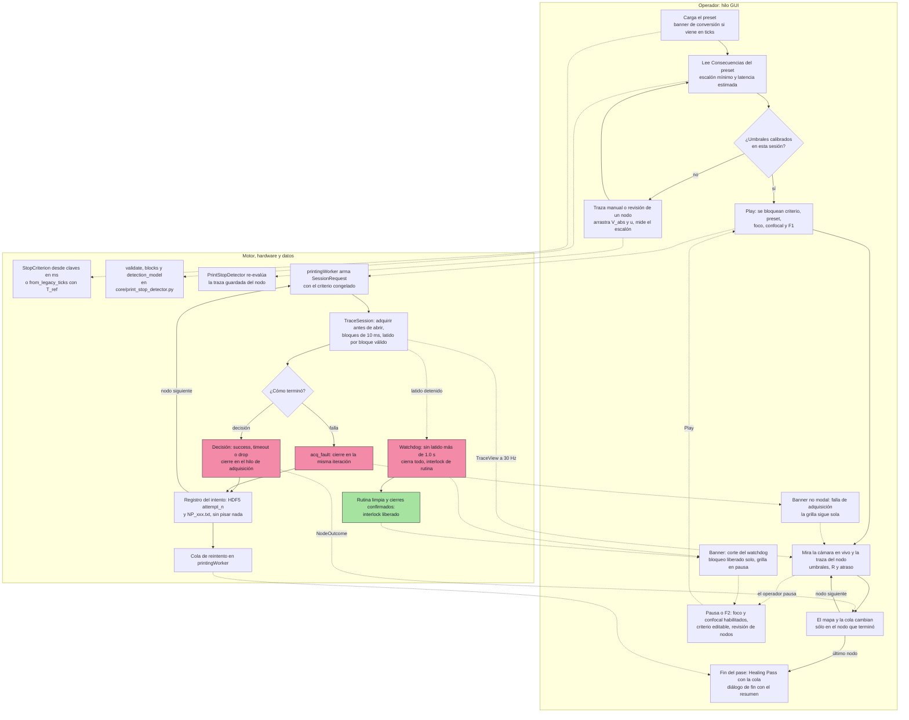

# C-01 — Ronda 3 — Diseño de GUI y ergonomía (líder: `scientific-gui-designer`)

Estado: COMPLETO (2026-09-27), secciones 0 a 8 y veredicto. No se modificó ningún archivo del
repositorio salvo este. No hay código de producción: los fragmentos de código son contratos de
diseño para la Ronda 4.

**Marcas.**
- **[CÓDIGO]**: leído en la línea citada.
- **[R2-ARQ]**, **[R2-MET]**, **[R2-INS]**: `c01_ronda2/architecture.md`, `metrology.md` e
  `instrumentation.md`.
- **[INV]**: decisión del investigador (`RESPUESTAS_INVESTIGADOR.md`, rondas 3 a 5). Es vinculante.
- **[FUENTE]**: verificado por mí en una fuente primaria de `docs/bibliografia/`, con la página física
  del PDF.
- **[DERIVADO]**: cálculo propio a partir de lo anterior. El script está en el scratchpad de la
  sesión (`r3_indicators.py`) y aplica las fórmulas de [R2-MET] §2.1.
- **[PROPUESTA]**: diseño de esta ronda.
- **[FALTA-CONTRATO]**: la GUI lo necesita y el contrato del motor de la Ronda 2 no lo tiene. Va a
  la matriz de reconciliación de la Ronda 4 (§8).

**Orden.** 0 hechos de la GUI actual · 1 arquitectura de la información · 2 inventario de
parámetros · 3 micro-interacciones · 4 tooltips y ayuda · 5 resiliencia del estado · 6 diagrama ·
7 verificación manual y preguntas · 8 preparación de la reconciliación.

---

## 0. Hechos de la GUI actual que condicionan el diseño

Todo lo de esta sección está leído en `main` con `DEC-037` aplicado. Los hallazgos **G-n** son
nuevos respecto de la Ronda 2, salvo donde se indica.

### 0.1 El panel de impresión hoy

- **Disposición.** `modules/measurements.py` arma el "Printing Control Panel" como una grilla de
  14 filas sin grupos (`:890-974`) [CÓDIGO]:
  - fila 1: presets;
  - fila 2: modo de parada;
  - filas 3 a 8: umbrales, T max, `Steps before` / `Steps after`;
  - filas 9 a 13: checks, Play / Pause / Next, Healing Pass, contadores y progreso.
- **Widgets.** Todos los parámetros numéricos son `QLineEdit` de 44-55 px (`:678-702`). No hay
  unidades en los rótulos salvo "Umbral Abs (V)", "Umbral Mín (V)" y "T max (s)". Un texto no
  numérico explota en `float()` al pulsar Play (`:1267-1294`).
- **Transporte.** Los parámetros viajan como **una lista posicional de 26 elementos**
  (`_emit_parameters`, `:1264-1297` → `grid_parameters`, `:1907-1963`). Un índice corrido cambia de
  sentido un parámetro sin que nada falle.
- **Visibilidad por modo.** `_on_stopping_mode_changed` (`:1205-1226`) muestra u oculta campos según
  el modo. `Steps before/after`, `Umbral down` y `T max` quedan siempre visibles.

### 0.2 Textos que describen algo que el código no hace

| # | Dónde | Qué dice | Qué hace el código |
|---|---|---|---|
| G-1a | `measurements.py:685` (tooltip de `Steps before`) | "Muestras analógicas adquiridas antes de abrir obturador para calcular la línea base (I_old)" | Es M2, la ventana de `I_old` del cociente móvil, contada en ticks **después** de abrir (`trace.py:711-723`). Señalado en [R2-ARQ] §0.3 y [R2-MET] §1.2 |
| G-1b | `measurements.py:687` (tooltip de `Steps after`) | "Muestras analógicas adicionales adquiridas tras cerrar el obturador" | Es M, la ventana de `I_new`. No se adquiere nada tras cerrar |
| G-1c | `modules/preset_wizard.py:120-121` | rótulos "Steps Before (Base)" y "Steps After (Post)" | El mismo malentendido que G-1a y G-1b, en el asistente |
| G-1d | `preset_wizard.py:96` | "Modo 1: Requiere **tanto** el salto relativo **como** superar un voltaje absoluto" (un Y) | Es un **O**: `condition = c_rel or c_abs` (`measurements.py:2366`). El umbral absoluto hace la parada más fácil, no más estricta. También lo nota [R2-MET] §1.3 |
| G-1e | `measurements.py:693` (tooltip de `N hold`) | "Número de pasos continuos de confirmación" | Correcto como conteo, pero sin unidad de tiempo: 3 pasos son ≈ 94 ms de persistencia con los ticks de 47 ms de 3.0. El legado no tiene N_hold (§0.4, §2.6) |

### 0.3 Defectos de la GUI que el diseño nuevo tiene que evitar

- **G-2. El Healing Pass borra los datos crudos del primer pase.**
  - `_save_trace` escribe `NP_{i:03d}.txt` con el mismo nombre en el pase principal y en el
    reintento (`measurements.py:2969-2981`).
  - `BatchHDF5Container.add_node_data` hace `del node_grp["photothermal_trace"]` antes de escribir
    (`core/hdf5_container.py:162-163`).
  - Resultado: el reintento **pisa** la traza de 40 s del primer intento. Es justo la traza que
    permitiría ver un escalón de ×1.4-1.5 no detectado ([R2-MET] §2.3, hipótesis a descartar) y la
    que pide guardar el investigador para el análisis posterior (Q10).
- **G-3. El mapa de la grilla pinta de verde un nodo sin resultado.** `set_node_status`
  (`measurements.py:224-227`) pasa a `"success"` todo nodo que estaba en `"active"` cuando se activa
  otro. La condición `self.node_states[i] not in ("timeout", "pending")` es siempre verdadera, porque
  `st == "active"`. Si un nodo termina en falla o en aborto y nadie emite su estado final, el mapa lo
  muestra como impreso.
- **G-4. La leyenda del mapa está incompleta.** Tiene 4 entradas (`:162-165`) para 5 estados: falta
  "retrying" (`:254`). Además, TIMEOUT usa el rojo `#f38ba8`, que en la paleta del laboratorio es el
  color de error o interlock (skill `scientific-gui-implementation` §7). Un TIMEOUT es un resultado
  normal de la estadística de captura ([INV] R3), no una falla.
- **G-5. El bloqueo de foco existente se saltea con el teclado.**
  - `set_actuators_enabled` (`focus.py:90-95`, `confocal.py:433-438`) deshabilita sólo los botones.
  - Los atajos `F8`, `F9` y `F10` llaman directo a `_go_max`, `_lock` y `_autocorr_x2`
    (`focus.py:50-52`), que emiten la señal sin mirar si el foco está bloqueado (`:103-113`).
  - Pasa hoy con la subyugación a PySpectrum (`DEC-019`, `app.py:115-125`), y pasaría igual con el
    bloqueo durante la impresión si se implementa del mismo modo.
- **G-6. Play y Next durante un nodo lanzan una segunda secuencia.**
  - Play con la grilla corriendo, sin pausa, llama otra vez a `_grid_move()`
    (`measurements.py:1976-1978`).
  - `Next index` llama a `_grid_move()` sin cerrar el obturador ni detener la traza (`:2948-2952`).
- **G-7. El widget de la traza no sabe que está imprimiendo.**
  - `trace_configuration` cambia `laser1` en el backend sin tocar el combo `trace_laser1`, ni el
    título, ni el estado del botón Play (`trace.py:625-633`). El combo puede mostrar un láser distinto
    del que está abierto.
  - Con un nodo en curso, `F1` (`trace.py:332-333`) vuelve a llamar a `_start()`: reabre el
    obturador y borra el historial.
  - `F2` (`:334-335`) llama a `stop()`: cierra el obturador, pero la grilla no se entera. En
    `legacy_timer` el nodo deja de recibir datos y nunca decide, porque `T_max` sólo se evalúa cuando
    llega un dato (`measurements.py:2406-2408`).
- **G-8. El asistente y el panel numeran los modos distinto.**
  - El asistente tiene 4 modos y su índice 3 es "Criterio Híbrido Tri-Factor"
    (`preset_wizard.py:54-59`).
  - En el panel, el índice 3 es "Calibración Confocal Raw" y el Híbrido es el 4
    (`measurements.py:667-673`).
  - El preset se guarda por índice (`stop_mode`), así que un preset "Híbrido" creado con el asistente
    carga en el panel como Modo 3. El preset del repositorio `presets/Grilla_Extensa_10x10.txt` se
    llama "(Criterio Híbrido)" y tiene `stop_mode = 3`.
- **G-9. Los metadatos de la muestra son texto libre.** "Power BFP (mW)", "NP type" y "Substrate"
  son `QLineEdit` con "—" (`measurements.py:837-839`), y no existe un campo para la concentración de
  NaCl. Así no sirven como variables de un análisis multivariado (Q10).
- **G-10. Los valores de la traza no tienen rótulo.** `PointLabel` muestra `"<b>I_old | I_new</b>"`
  sin nombres ni unidades (`trace.py:372, 454`).

### 0.4 "Hoy" tiene dos significados

Esto afecta la conversión de los presets.

- **PyPrinting legacy** (`printing2/`), que según la quinta ronda es lo que usa hoy el banco:
  - tiene `Steps after umbral` y `Steps before umbral` (10/10 por defecto) y **no tiene N_hold**
    (`printing2/Trace_pp.py:90-94`);
  - su criterio es el modo 0 con la rama de caída (`printing2/Printing_pp.py:793`);
  - su traza corre con `pointtimer.start(0)` (`Trace_pp.py:373`), y un comentario de 2019 dice
    "mean value of time step = 10 ms" (`Trace_pp.py:392`). Es un comentario, no una medición en la PC
    actual.
- **PyPrinting 3.0** (`7f5d10a`) usa ticks de ≈ 47 ms ([R2-ARQ] §4.5, medido en la PC de desarrollo;
  `BANCO-24/28` lo confirma en la del banco) y tiene N_hold.

La práctica que describe el investigador (umbral 1.5, N_hold 3, 20/20) sólo puede ser de 3.0,
porque el legado no tiene N_hold. Pero si el hábito de 20/20 viene del legado, ahí valía ≈ 200 ms, y
en 3.0 los mismos números valen ≈ 940 ms: **4.7 veces más**. Con u = 1.5 la latencia del criterio
para un escalón ×2 pasa de ≈ 100-110 ms a ≈ 564-574 ms [DERIVADO]. Mostrar las ventanas en ms
elimina esta trampa, que existió sin que nadie la viera. Queda una pregunta (§7.2, P1).

### 0.5 Lo que ya funciona y no se toca

- **La traza durante la impresión** ([INV] R3): la cámara queda en vivo y la traza se activa sola
  en su widget, un gráfico de V contra t que se reinicia en cada nodo (`trace.py:591-596`). El
  diseño **agrega** capas y rótulos que se pueden apagar, pero no cambia la disposición del widget,
  ni sus curvas, ni sus colores, ni sus atajos fuera de la impresión.
- **La cámara** (`modules/camera.py`) no se toca en C-01.
- **Power BS** se usa poco ([INV] R3). Sólo cambia de dónde saca los datos ([R2-ARQ] §2.5); la
  ventana queda igual.
- **El patrón de ayuda.** `_open_wiki_note(note_id, anchor)`, con un `ScientificWikiBrowserDialog`
  único por ventana, ya existe en `analysis/lattice_disorder_gui.py:2737` y `sif_analyzer.py:2592`.
  El diálogo acepta `initial_note_id` e `initial_anchor` (`analysis/scientific_wiki_browser.py:607-645`).
  Se reutiliza tal cual.
- **El bloqueo por subyugación.** `set_actuators_enabled` ya existe en foco, confocal, platina y
  obturadores (`DEC-019`). Se extiende con motivos (§3.6), sin reemplazarlo.

---

## 1. Arquitectura de la información [PROPUESTA]

### 1.1 Principios

1. **Lo que decide un nodo va junto.** El modo, los umbrales, las ventanas, la persistencia y
   `T_max` forman un solo bloque: "Criterio de fin de impresión".
2. **Cada parámetro muestra su consecuencia al lado.** Una ventana en ms muestra su equivalente en
   bloques. El preset completo muestra el escalón mínimo que detecta y cuánto tarda (§3.2).
3. **Lo que sólo se mira va en la traza**: niveles, cociente, atraso, marcas de apertura y de
   decisión. **Lo que se configura va en el panel.** Las líneas de umbral de la traza son la única
   excepción: se arrastran, pero sólo con la grilla en pausa o sin grilla (§3.1).
4. **No se rompe lo que funciona.** La traza conserva sus dos gráficos, sus combos, sus colores y
   sus atajos. Todo lo nuevo es una capa que se apaga o un rótulo en un lugar que ya existe.
5. **Dos niveles de detalle.** La vista básica muestra lo que se usa en la práctica ([INV] R3: modo
   0 o 1, umbral, umbral absoluto, ventanas, persistencia, `T_max`). Un cajón "Avanzado" plegable,
   cerrado por defecto, guarda el resto: umbral mínimo, corte por caída, pendiente, modo confocal y
   la conversión desde ticks.

### 1.2 Panel de impresión (dock "Printing Control Panel")

Se reemplaza la grilla plana de 14 filas por cuatro `QGroupBox` apilados. Las filas de lote y de
preset quedan arriba, como hoy.

```
┌ Printing Control Panel ──────────────────────────────────────────────────────────┐
│ [Printing folder] [Nombre de lote______]  20260927-1432_Printing_AuNP60 (verde)   │
│ Preset [AuNP 60 nm — umbral + absoluto ▾] (modificado)  [Asistente] [Cargar] [Guardar] │
│ ┌ Criterio de fin de impresión ────────────────────────────────── [📖 Ayuda] ┐ │
│ │ Modo [1 · Legacy + voltaje absoluto ▾]  Láser [532 ▾]  Contraste [↑ sube ▾]  │ │
│ │ Umbral relativo u   [ 1.50 ]  ×         Umbral absoluto V_abs [ 2.500 ] V    │ │
│ │ Ventana vieja W_old [  940 ] ms  94 bl. Ventana nueva W_new   [   940 ] ms  94 bl. │ │
│ │ Persistencia τ_hold [   94 ] ms  → efectiva 100 ms (11 evaluaciones seguidas) │ │
│ │ Tiempo máximo T_max [ 40.0 ] s   → en el Healing Pass: 50.0 s                │ │
│ │ ▸ Avanzado: umbral mínimo · corte por caída · pendiente · confocal · conversión │ │
│ └──────────────────────────────────────────────────────────────────────────┘ │
│ ┌ Consecuencias del preset ────────────────────────────────────── [📖 Ayuda] ┐ │
│ │ Escalón mínimo que detecta la rama relativa:  ×1.53                          │ │
│ │ Latencia del criterio:  ×2.0 → 570 ms   ×1.6 → 890 ms   ×1.4 → no detecta    │ │
│ │ + sistema ≤ 20 ms (garantizado)  + obturador: sin medir (BANCO-30)           │ │
│ │ ┌ latencia (ms) vs escalón (×) ───────────────────────────────────────────┐ │ │
│ │ │ ▓▓ no detecta ▓▓│╲                                                     │ │ │
│ │ │                 │  ╲___  ░░░ rango observado ×1.4–2.0 ░░░               │ │ │
│ │ └─────────────────────────────────────────────────────────────────────────┘ │ │
│ │ (!) Los escalones de ×1.40 a ×1.53 sólo los detecta el umbral absoluto.      │ │
│ └──────────────────────────────────────────────────────────────────────────┘ │
│ ┌ Confirmación después del corte ──────────────────────────────── [📖 Ayuda] ┐ │
│ │ [ ] Confirmar a baja potencia    R mínimo [1.20] ×    Lectura [100] ms       │ │
│ └──────────────────────────────────────────────────────────────────────────┘ │
│ ┌ Ejecución ─────────────────────────────────────────────────────────────────┐ │
│ │ [x] Scan pre-print  [x] Track Drift XY  [x] Track Drift Z  [x] Track Time-Volt │ │
│ │ [Play ►] [Pausa ‖] [Saltar nodo ►|]     [x] Healing Pass (reintento al final) │ │
│ │ Nodo 17 / 64 · pase principal · exponiendo 3.4 s                             │ │
│ │ 12 impresas · 3 sin captura · 1 falla de adquisición · cola de reintento: 4  │ │
│ │ ETA 04m 12s   [██████████████░░░░░░░░░░░░░░░░░░] 27 %                         │ │
│ │ ┌ banner (oculto si no hay nada que avisar; §3.4 y §3.7) ─────────────────┐ │ │
│ │ └──────────────────────────────────────────────────────────────────────────┘ │ │
│ └──────────────────────────────────────────────────────────────────────────┘ │
└──────────────────────────────────────────────────────────────────────────────┘
```

Decisiones de detalle:
- **Nombres de los modos.** Se usa el vocabulario del investigador ("legacy" y "legacy + voltaje
  absoluto", [INV] R3) y se dice qué hace cada uno:
  - `0 · Legacy: salto relativo`;
  - `1 · Legacy + voltaje absoluto (con persistencia)`;
  - `2 · Meseta dI/dt → 0, o voltaje absoluto`;
  - `3 · Confocal reescalado, o voltaje absoluto`;
  - `4 · Híbrido: relativo, o meseta, o absoluto`.

  El preset guarda el modo por **clave estable** (`legacy`, `legacy_abs`, `meseta`, `confocal`,
  `hibrido`) y además el índice, por compatibilidad. Así se corrige G-8.
- **El contraste** ("↑ sube" / "↓ baja") sólo está habilitado en los modos 0 y 1. En los otros
  queda fijo en "↑", con el motivo en el tooltip ([R2-ARQ] §4.2: `validate()` rechaza el signo −1
  en los modos 2 a 4).
- **Los campos que el modo no usa se deshabilitan, no se ocultan.** Hoy se ocultan
  (`measurements.py:1218-1226`) y el panel cambia de forma al cambiar de modo. Deshabilitados, el
  operador ve que existen y el tooltip dice qué modo los usa. Es un cambio menor: si el
  investigador prefiere el ocultamiento, se mantiene.
- **"(modificado)"** aparece junto al nombre del preset en cuanto un campo difiere del archivo
  cargado. Así se sabe si lo que corre es el preset o una variante (§5).
- **"Next index ►"** pasa a llamarse **"Saltar nodo ►|"** y cierra el obturador antes de moverse
  (§3.8). Es lo que ya promete su tooltip (`measurements.py:763`).

### 1.3 Mapa de la grilla (dock "Printing Pattern & Path Viewer")

- El dock gana dos pestañas: **"Mapa"**, que es el visor actual, y **"Cola de reintento"**, una
  tabla (§3.5).
- La leyenda pasa a tener todos los estados, cada uno con color **y forma**, para que se distingan
  en un laboratorio a oscuras y con daltonismo (§3.3).

### 1.4 Widget de la traza (dock "Trace")

Se conservan la barra y los dos gráficos. Cambian tres cosas: el rótulo de valores, un indicador
nuevo en la barra y el título del gráfico, que ya es dinámico.

```
┌ Trace ────────────────────────────────────────────────────────────────────────────┐
│ Láser 1 [532 ▾] [FFT L1]  Láser 2 [R = I_new/I_old ▾] [FFT L2]  [► Play / ■ Stop (F1/F2)] │
│ I_old 1.82 V · I_new 2.71 V · R ×1.49    [stream · 10 ms · atraso 2 ms]            │
│ [Save trace] [View Power BS] [Capas ▾] [Medir escalón] [📖]                        │
│ ┌ Trace 532 — impresión · nodo 17/64 · pase principal ─┐┌ R = I_new/I_old ─────────┐│
│ │ V                                        ┆ SUCCESS   ││ ×                         ││
│ │ ─ ─ ─ ─ ─ V_abs 2.500 V ─ ─ ─ ─ ─ ─ ─ ─ ┆ 3.42 s    ││ ─ ─ ─ u = 1.50 ─ ─ ─ ─ ─  ││
│ │                    ╱‾‾‾‾‾‾‾‾‾‾‾‾‾‾‾‾‾‾‾ ┆           ││       ╱╲                  ││
│ │ ▒▒ ‾‾‾‾‾‾‾‾‾‾‾‾‾‾‾╯                      ┆           ││ ░░░░╱  ╲___               ││
│ │ ▒▒ asentamiento   (gris: antes de abrir) ┆           ││ ░ciego░                   ││
│ │ |0 apertura confirmada          decisión ┆ cierre    ││                           ││
│ └───────────────────────────────────────────────────────┘└──────────────────────────┘│
└──────────────────────────────────────────────────────────────────────────────────┘
```

- **Rótulo de valores.** `PointLabel` pasa de `"0.00 | 0.00"` a `"I_old 1.82 V · I_new 2.71 V · R
  ×1.49"` (G-10). Mismo lugar, mismo estilo.
- **Indicador de adquisición**, nuevo, a la derecha del rótulo: backend activo, duración del
  bloque y atraso de la última vista, con color según el estado (§3.9).
- **Título del gráfico 1.** Durante la impresión dice "Trace 532 — impresión · nodo 17/64 · pase
  principal" (o "· Healing Pass, reintento 2/4"), y el combo `Láser 1` muestra el láser que se está
  imprimiendo (G-7).
- **El combo `Láser 2` gana la opción "R = I_new/I_old".** Reutiliza el segundo gráfico, que ya
  existe y hoy se oculta con "None" (`trace.py:288-290`), para mostrar el cociente con la línea del
  umbral u. No agrega filas ni achica el gráfico principal. Es una opción de visualización: no abre
  ningún obturador. Durante la impresión, `Láser 2` sólo ofrece "None", "BS" y "R", porque elegir
  otro láser abriría su obturador (`trace.py:587-588`).
- **Menú "Capas"**, casillas que se recuerdan por sesión:
  - umbrales (`V_abs` y `V_min` sobre V; u y d sobre R): **encendido** por defecto, en líneas finas
    y punteadas;
  - medias de ventana `I_old(t)` e `I_new(t)`: apagado;
  - marcas de apertura, asentamiento, zona ciega, decisión y cierre: **encendido**;
  - traza del nodo anterior en gris: apagado.
- **"Medir escalón"** abre la herramienta de calibración sobre la traza (§3.1.3).
- **Eje de tiempo.** Cada nodo empieza en 0 en la apertura **confirmada** del obturador, con los
  bloques previos en gris a la izquierda (t < 0). Hoy empieza en el primer tick (`trace.py:592,
  705`).
- **Ventana visible.** Cubre el nodo entero: 40 s, o 50 s en el Healing Pass, ≈ 4000-5000 puntos.
  pyqtgraph los dibuja sin decimar a ≤ 30 Hz; se activan `setClipToView(True)` y
  `setDownsampling(auto=True, mode="peak")` para no perder picos ([R2-ARQ] §6.1, punto 8).
- **Al terminar un nodo la traza queda congelada**, con la marca de decisión, hasta que arranca el
  siguiente. El operador ve el resultado sin abrir el archivo.

### 1.5 Qué ve el operador, dónde y cuándo

| Información | Dónde | Cuándo | Fuente del dato |
|---|---|---|---|
| Parámetros del criterio en ms | panel, "Criterio de fin de impresión" | siempre | preset + edición |
| Equivalente en bloques y persistencia efectiva | junto a cada campo | siempre | `StopCriterion.blocks()` del motor; la GUI nunca lo recalcula por su cuenta |
| Escalón mínimo detectable y latencia estimada | panel, "Consecuencias del preset" | siempre; se recalcula al editar | fórmulas de [R2-MET] §2.1 (§3.2) |
| Umbral absoluto expresado como razón sobre la base medida | "Consecuencias", línea adicional | después del primer nodo o de una traza manual | `i_old` del último `NodeOutcome` o `TraceView` |
| Niveles `I_old`, `I_new` y R | rótulo de la traza | 30 Hz durante una sesión | `TraceView` |
| Atraso de adquisición y backend | indicador de la traza | durante una sesión | `TraceView.lag_ms`, `config.TRACE_ACQ_BACKEND` |
| Latencia de sistema medida del nodo (p50, p95) | tooltip del indicador y encabezado del `NP_xxx.txt` | al cerrar cada nodo | `NodeOutcome.lag_ms_p50`, `lag_ms_p95` |
| Estado de cada nodo | mapa, con color y forma | siempre | `NodeOutcome.kind` y la confirmación |
| Cola de reintento | pestaña "Cola de reintento" | siempre | resultados de la grilla |
| Falla de adquisición, corte del watchdog, bloqueo | banner del panel "Ejecución" y barra de estado | mientras dure, y 10 s después | `NodeOutcome.fault`, callbacks del watchdog |
| Por qué foco y confocal no responden | tooltip y rótulo en esos paneles | mientras la grilla corre | motivo de bloqueo (§3.6) |

---

## 2. Inventario de parámetros expuestos (DoF) [PROPUESTA]

### 2.1 Reglas generales de los widgets

- **Adiós al `QLineEdit` numérico.** Todo parámetro numérico pasa a `QSpinBox` (enteros en ms) o
  `QDoubleSpinBox`, con rango, paso, sufijo de unidad y `setKeyboardTracking(False)`. Así el valor se
  confirma con Enter o al salir del campo, y no en cada tecla. Un texto inválido deja de ser posible,
  y con eso el `ValueError` al pulsar Play (§0.1).
- **Valores especiales.** Un umbral en 0 que significa "desactivado" usa `setSpecialValueText
  ("desactivado")`. El operador ve la palabra, no un 0 ambiguo.
- **Paso de las ventanas = T_b.** El paso de las flechas es la duración del bloque (10 ms). Igual se
  puede escribir cualquier entero; al lado se muestra lo que el motor va a usar de verdad.
- **Lo "efectivo" lo calcula el motor.** La etiqueta de bloques y la persistencia efectiva salen de
  `StopCriterion.blocks(block_ms)` ([R2-ARQ] §4.2). La GUI no reimplementa la conversión: si se
  reimplementara, habría dos verdades que pueden divergir (la lección de R1-6).
- **Transporte.** El panel arma un `StopCriterion` (dataclass inmutable) y un objeto de ejecución
  con los checks, no la lista posicional de 26 elementos (§0.1). La lista queda sólo como
  adaptador del camino `legacy_timer` mientras exista.
- **Congelado por nodo.** Los parámetros que usa un nodo son los del `SessionRequest` con que
  arrancó. Editar el panel con la grilla en pausa cambia los nodos siguientes, nunca el que ya
  corrió. Con la grilla corriendo, el bloque "Criterio" está bloqueado (§3.6).

### 2.2 Capas de la escalera (skill `interactive-tool-design`)

| Capa | Qué tiene en C-01 | Quién la toca |
|---|---|---|
| Invariantes | adquirir antes de exponer; cerrar ante una falla; latido sólo con un bloque válido; un único dueño de las AI; decisión en el hilo de adquisición; `read_timeout_s`; `lag_fault_ms` ([R2-ARQ] §4.8) | nadie; código |
| Capa 0 (automática) | `T_b`, tasa, buffer, bloques previos a la apertura, asentamiento, capacidad del registro, base a baja potencia para la confirmación, extensión de `T_max` en el Healing Pass (+10 s), plazo del latido (1.0 s) | `config.py`; la GUI sólo los muestra |
| Capa 1 (visual y gestual) | capas de la traza, opción "R" en `Láser 2`, líneas de umbral arrastrables, herramienta "Medir escalón", vista del nodo anterior | operador, en la traza |
| Capa 2 (paramétrica) | modo, contraste, u, `V_abs`, `W_old`, `W_new`, `τ_hold`, `T_max`; en "Avanzado": `V_min`, corte por caída, pendiente y su ventana, K y P % del modo 3, confirmación | operador, en el panel y en el preset |
| Capa 3 (algorítmica, no está en la GUI) | `TRACE_ACQ_BACKEND`, `TRACE_BLOCK_MS` | `config.py`; cambiarlos es un rollback, no un ajuste. La GUI sólo los muestra (§3.9) |

### 2.3 Parámetros de Capa 2: el criterio

Columnas: rótulo en la GUI · campo del motor · widget · unidad · rango · paso · valor por defecto
(sin preset → P0 del investigador) · modos donde se usa · notas.

| Rótulo | Campo del motor | Widget | Unidad | Rango | Paso | Defecto → P0 | Modos | Notas |
|---|---|---|---|---|---|---|---|---|
| Modo | `mode` | `QComboBox` con clave estable | — | 0-4 | — | 0 → **1** | todos | clave en el preset (G-8) |
| Láser | `SessionRequest.lasers_to_open`, `pd_index` | `QComboBox` (`SHUTTERS`) | nm | 532/637/592/808 | — | 532 → 532 | todos | colores actuales (`_color_menu`) |
| Contraste | `contrast_sign` | `QComboBox`: "↑ sube (+1)" / "↓ baja (−1)" | — | ±1 | — | +1 → +1 | 0, 1 | fijo en +1 en los modos 2-4 ([INV] Q3: lo elige cada preset) |
| Umbral relativo u | `umbral` | `QDoubleSpinBox`, sufijo " ×" | adimensional | 1.01-5.00 | 0.01 | 1.20 (`config.DEFAULT_PRINTING_UMBRAL`) → **1.50** | 0, 1, 4 | desigualdad estricta: R = u no dispara ([R2-MET] §1.3) |
| Umbral absoluto V_abs | `umbral_abs_v` | `QDoubleSpinBox`, sufijo " V", 3 decimales | V | 0.000-10.000 | 0.010 | 2.500 → **a calibrar** | 1, 2, 3, 4 | el tope real es el rango de la AI, que se lee en BANCO-26 ([R2-INS] §1.1) |
| Ventana vieja W_old | `win_old_ms` | `QSpinBox`, sufijo " ms" + etiqueta "= N bl." | ms | 10-2000 | 10 (T_b) | 470 → **940** | 0, 1, 4 | la base del cociente |
| Ventana nueva W_new | `win_new_ms` | ídem | ms | 10-2000 | 10 | 470 → **940** | 0, 1, 4 | la que fija la latencia |
| Persistencia τ_hold | `hold_ms` | `QSpinBox`, sufijo " ms" + etiqueta "efectiva X ms (N evaluaciones)" | ms | 0-1000 | 10 | 188 → **94** | 1-4 | el modo 0 para en la primera evaluación verdadera, sin persistencia ([R2-MET] §1.3.4) |
| Tiempo máximo T_max | `t_max_s` | `QDoubleSpinBox`, sufijo " s", 1 decimal + etiqueta "Healing: T_max + 10 s" | s | 1.0-60.0 | 1.0 | 20.0 (`config.DEFAULT_PRINTING_TMAX`) → **40.0** | todos | se cuenta en el reloj de muestreo desde la apertura confirmada ([R2-ARQ] §4.2) |
| Umbral mínimo V_min (Avanzado) | `umbral_min_v` | `QDoubleSpinBox`, 0 = "desactivado" | V | 0.000-10.000 | 0.010 | 0 → 0 | todos | veto: por debajo, ninguna condición para. Hoy se llama `slope_min` (mal nombre) |
| Corte por caída d (Avanzado) | `umbral_down` | `QDoubleSpinBox`, 0 = "desactivado", sufijo " ×" | adimensional | 0.00-0.99 | 0.05 | 0 (`config`) → **0.50** | todos, con contraste +1 | cierra y rotula "caída"; hoy se guarda como TIMEOUT ([R2-ARQ] §4.2). Con contraste −1 se deshabilita |
| Ventana de pendiente (Avanzado) | `slope_window_ms` | `QSpinBox`, " ms" | ms | 20-1000 | 10 | 188 → 188 | 2, 4 | hoy es fija en 4 ticks (`measurements.py:2350`) |
| Pendiente de meseta (Avanzado) | `slope_flat_v_s` | `QDoubleSpinBox`, " V/s" | V/s | 0.0-100.0 | 0.1 | 2.0 → 2.0 | 2, 4 | — |
| K de escala confocal (Avanzado) | *(la GUI)* `ratio_k` → `v_peak_scaled_v` por nodo | `QDoubleSpinBox` | adimensional | 0.1-100.0 | 0.1 | 10.0 → 10.0 | 3 | el motor recibe V, calculado del escaneo de cada nodo (`measurements.py:2507`). **No** es un campo 1:1 (§8) |
| Umbral P % (Avanzado) | `percent_thresh` | `QSpinBox`, " %" | % | 1-100 | 1 | 50 → 50 | 3 | — |

**Por qué estos rangos.**
- **Ventanas de 10 a 2000 ms.** El piso es un bloque. El techo duplica la ventana más larga en uso
  (940 ms) y queda muy por encima de los 10-100 ms del legado de CIBION ([FUENTE] [M24] p. 69:
  "dt es del orden de 10 a 100 ms, ajustándose libremente para cada experimento").
- **`T_max` de 1 a 60 s.** Una captura tarda de 1 a 20 s en las peores condiciones ([INV] R3), y hoy
  se usan 40 s. El tope de 60 s (70 s con el Healing Pass) acota la dosis sobre una NP ya impresa
  si el criterio no la detecta: a ≈ 570 °C ([FUENTE] [M24] p. 112, CIBION, 10 mW/µm²), 60 s ya es
  una exposición prolongada. Es una propuesta: `qa-ux-auditor` y el investigador pueden moverla.
- **u desde 1.01.** Un u = 1 dispararía con el ruido. El piso físico lo pone el ruido correlacionado
  (≈ 1.2 con ventanas cortas, [R2-MET] §3.2), pero con las ventanas de P0 es inofensivo, así que no
  se fuerza.

### 2.4 Parámetros de Capa 2: confirmación después del corte [FALTA-CONTRATO]

El investigador aceptó cortar ante un posible transitorio y confirmar después con una lectura a
baja potencia ([INV] Q2). El contrato de la Ronda 2 no la tiene: `SessionRequest.purpose` sólo
admite `"print" | "manual" | "bs_monitor"`, y `NodeOutcome` no tiene un campo de confirmación
([R2-ARQ] §4.4). La GUI propone esto y lo manda a la reconciliación (§8, R4-3).

| Rótulo | Campo propuesto | Widget | Unidad | Rango | Paso | Defecto | Notas |
|---|---|---|---|---|---|---|---|
| Confirmar a baja potencia | `confirm_enabled` | `QCheckBox` | — | — | — | **apagado** en P0 | con ventanas largas (P0) el rechazo de transitorios ya lo da la ventana ([R2-MET] §3.3); tiene sentido con ventanas cortas |
| R mínimo de confirmación | `confirm_ratio_min` | `QDoubleSpinBox`, " ×" | adimensional | 1.01-3.00 | 0.01 | 1.20 | R_baja = nivel a baja potencia después / base a baja potencia antes del nodo. Una NP impresa conserva R ≈ r si la detección es lineal ([R2-MET] §4.3.4, EXPERIMENTAL). 1.20 queda por debajo de todo el rango observado (×1.4-2); se calibra en BANCO-32 |
| Duración de la lectura | `confirm_read_ms` | `QSpinBox`, " ms" | ms | 20-500 | 10 | 100 | 10 bloques |
| Base a baja potencia | *(Capa 0)* | — | V | — | — | se toma sola antes de subir la potencia | es una exposición a baja potencia, como las del autofoco |

El costo por nodo (≈ 1-1.5 s por los cambios del filtro, [R2-MET] §4.3.4) se muestra en
"Consecuencias" y en la ETA (§3.2).

### 2.5 Lo que se calcula solo y se muestra, sin widget de entrada

| Qué | Valor | Dónde se muestra | Fuente |
|---|---|---|---|
| Duración del bloque T_b | 10 ms | indicador de adquisición; sufijo "bl." de las ventanas | `config.TRACE_BLOCK_MS` ([INV] Q7) |
| Bloques previos a la apertura | 3 (30 ms) | tooltip de la marca "apertura" | `SessionRequest.pre_open_blocks` |
| Asentamiento tras abrir | 50 ms (excluido del criterio) | zona sombreada en la traza | `open_settle_ms`; se ajusta con BANCO-30 |
| Zona ciega del criterio relativo | de 0 a W_new (R ≡ 1 mientras no hay M bloques), y base creciente hasta W_new + W_old | sombreado en "R" | regla de `push` ([R2-ARQ] §4.2) |
| `T_max` del Healing Pass | `T_max` + 10 s | etiqueta junto a `T_max` | `measurements.py:2860` |
| Plazo del latido de vida | 1.0 s | tooltip del indicador de adquisición | [INV] quinta ronda, punto 2 |
| Escalón mínimo detectable, latencia del criterio, umbral absoluto como razón | §3.2 | "Consecuencias del preset" | [R2-MET] §2.1 |
| T_ref de la conversión | 47 ms (📄 hasta BANCO-24/28) | diálogo de conversión y encabezado del preset convertido | [R2-ARQ] §4.5 |

### 2.6 Conversión de los presets de ticks a ms

**Regla** ([R2-MET] §2.4, igual a [R2-ARQ] §4.5):
- `W_old = steps_before · T_ref`;
- `W_new = steps_after · T_ref`;
- `τ_hold = (N_hold − 1) · T_ref`.

La persistencia es (N − 1)·T_ref porque la parada llega en la N-ésima evaluación consecutiva, que
está (N − 1) intervalos después de la primera.

| Origen | T_ref | Steps before / after | N_hold | W_old / W_new (ms) | τ_hold (ms) | En bloques de 10 ms | Escalón mínimo (rama relativa) | Latencia del criterio: ×2 / ×1.6 / ×1.4 |
|---|---|---|---|---|---|---|---|---|
| **3.0, práctica del investigador** (u = 1.5, modo 1) | 47 ms | 20 / 20 | 3 | **940 / 940** | **94** | 94 / 94 bloques; persistencia efectiva **100 ms** (11 evaluaciones) | **×1.53** | **570-580 ms / 883-893 ms / no detecta** |
| 3.0, preset del repo "Alta Potencia" (u = 1.35, modo 1) | 47 ms | 10 / 10 | 5 | 470 / 470 | 188 | 47 / 47; efectiva 190 ms (20 evaluaciones) | ×1.45 | 352-362 / 462-472 / no detecta |
| 3.0, preset del repo "Impresión Rápida" (u = 1.2, modo 0) | 47 ms | 10 / 10 | (no aplica en el modo 0) | 470 / 470 | 0 | 47 / 47 | ×1.20 | 94-104 / 157-167 / 235-245 ms |
| Legado `printing2`, si 20/20 se usaba ahí (u = 1.5, modo 0) | ≈ 10 ms, **sin medir** (comentario de 2019, §0.4) | 20 / 20 | no existe | 200 / 200 | 0 | 20 / 20 | ×1.50 | 100-110 / 167-177 / no detecta |

Todas las cifras son del modelo determinista sin ruido de [R2-MET] §2.1 [DERIVADO]. El intervalo
es la fase del escalón respecto del bloque (+0 a +T_b). Para la práctica del investigador coinciden
con su simulación con ruido (≈ 0.60 s para ×2 y ≈ 0.88 s para ×1.6, [INV] Q11). No incluyen el
sistema (≤ 20 ms) ni el obturador (sin medir).

**Cómo se ve la conversión.**
1. Al cargar un preset con claves viejas (`steps_before`, `steps_after`, `n_hold`), el panel lo
   convierte y muestra un banner no modal, color Peach `#fab387`:
   > "Preset en formato de ticks. Se convirtió con T_ref = 47 ms (PyPrinting 3.0):
   > Steps before 20 → 940 ms · Steps after 20 → 940 ms · N_hold 3 → 94 ms.
   > [Guardar en ms]  [Cambiar T_ref…]  [Ver detalle]"
2. **"Cambiar T_ref…"** abre un diálogo chico con el origen de los números:
   - "PyPrinting 3.0, tick ≈ 47 ms" (defecto);
   - "PyPrinting legacy (`printing2`), tick ≈ 10 ms, sin medir";
   - "Otro: [__] ms".

   Recalcula en vivo, con la tabla de consecuencias. Es la herramienta para el operador que llega
   con sus números del legado (§0.4).
3. **"Guardar en ms"** escribe `win_old_ms`, `win_new_ms` y `hold_ms`, y agrega
   `converted_from = "ticks"`, `t_ref_ms = 47`, la fecha y los valores originales como comentario
   `#`. La conversión nunca es silenciosa ([R2-MET] §2.4) y deja rastro.
4. El log registra la conversión una vez por archivo.
5. El asistente (`preset_wizard.py`) pasa a pedir las ventanas en ms, con los mismos widgets, y el
   modo por clave (G-1c, G-1d, G-8).

**Cuantización de la persistencia.** Con bloques de 10 ms, 94 ms no es un múltiplo. Los dos paneles
de la Ronda 2 difieren:
- [R2-ARQ] §4.5 redondea **hacia arriba**: 11 evaluaciones, 100 ms;
- [R2-MET] §2.4 toma el múltiplo **más cercano**: 90 ms.

Recomiendo hacia arriba: así el tooltip puede decir, sin excepción, "la condición se sostuvo **al
menos** τ_hold". La diferencia en latencia es de 10 ms (570-580 contra 560-570 ms para ×2) y en el
escalón mínimo, de ×0.004. Va a la reconciliación (§8, R4-1).

---

## 3. Micro-interacciones [PROPUESTA]

### 3.1 Calibración de los umbrales sobre la traza

El investigador calibra los umbrales absoluto y relativo mirando la traza, según el tipo de
partícula y la alineación ([INV] Q11). La GUI le da cuatro herramientas, de la más pasiva a la más
activa.

#### 3.1.1 Líneas de umbral arrastrables

| Línea | Gráfico | Qué representa | Arrastrable | Visible |
|---|---|---|---|---|
| `V_abs` | 1 (V) | umbral absoluto, en V | sí, eje vertical, paso 0.01 V | modos 1-4 |
| `V_min` | 1 (V) | veto: por debajo no para | sí | si `V_min` > 0 |
| `u` | 2, con "R" elegido | umbral relativo (con contraste −1 se dibuja en 1/u y se rotula "R < 1/u") | sí, paso 0.01 | modos 0, 1, 4 |
| `d` | 2, con "R" elegido | corte por caída | sí, paso 0.05 | si d > 0 y el contraste es +1 |

Cada línea es un `pg.InfiniteLine(angle=0, movable=...)` con un `pg.InfLineLabel` que dice nombre,
valor y unidad ("V_abs = 2.500 V"). Colores: `V_abs` Peach `#fab387`, `V_min` Overlay0 `#6c7086`,
`u` Mauve `#cba6f7`, `d` Red `#f38ba8`. Todas son punteadas y de 1 px, para no tapar la traza.

**Cuándo se pueden arrastrar.**
- Sin grilla, con traza manual, con la grilla en pausa o revisando un nodo terminado: **sí**.
- Con un nodo en curso: **no**. La línea queda fija, atenuada al 60 %, y su tooltip dice: "Es el
  valor que usa el nodo 17. Se cambia con la grilla en pausa." El nodo usa los parámetros
  congelados en su `SessionRequest`: mover la línea no puede cambiar lo que decide el hilo de
  adquisición, y la GUI no debe sugerir lo contrario.

**Sincronización en los dos sentidos** (skill `scientific-gui-implementation` §2). El spinbox es
la única fuente del valor; la línea es una vista.

```python
# Contrato de diseño para la Ronda 4 (no es código de producción)
def _on_vabs_line_moved(self):                       # sigPositionChanged, durante el arrastre
    v = round(self.line_vabs.value(), 2)             # paso del spinbox
    self.spin_vabs.blockSignals(True)
    try:
        self.spin_vabs.setValue(v)
    finally:
        self.spin_vabs.blockSignals(False)
    self._mark_modified("umbral_abs_v", source="traza")  # provenance (§3.1.4)
    self._consequences_debounce.start(150)           # QTimer singleShot: recalcula §3.2 una vez

def _on_vabs_spin_changed(self, v: float):           # valueChanged del spinbox
    self.line_vabs.blockSignals(True)
    try:
        self.line_vabs.setValue(v)
    finally:
        self.line_vabs.blockSignals(False)
    self._mark_modified("umbral_abs_v", source="panel")
    self._consequences_debounce.start(150)
```

Como el spinbox tiene las señales bloqueadas durante el arrastre, el recálculo de §3.2 se pide
explícitamente, con un temporizador de 150 ms que agrupa los movimientos.

#### 3.1.2 Revisar un nodo y re-evaluarlo con el criterio del panel

- **Abrir un nodo.** Con la grilla en pausa o terminada, un clic en un nodo del mapa (o en una fila
  de la cola, §3.5) carga su traza en el widget de la traza. Sale del `NodeOutcome` en memoria para
  los nodos de esta sesión, o del `NP_xxx.txt` / HDF5 para los anteriores. El título pasa a
  "Revisión — nodo 12 (SUCCESS, 3.42 s)" en Sapphire `#74c7ec`, para que no se confunda con una
  traza en vivo.
- **Re-evaluar.** El botón "Re-evaluar con el panel" pasa la traza guardada por
  `PrintStopDetector` con el `StopCriterion` que hay ahora en el panel. Dibuja una segunda marca de
  decisión, fantasma:
  - "con el criterio actual: pararía en 2.97 s (SUCCESS)", o
  - "con el criterio actual: no para (T_max)".
- **Cuánto cuesta.** El detector es una función pura de O(1) por bloque ([R2-ARQ] §4.2): 4000
  bloques son del orden de milisegundos en el hilo GUI. Se usa **la misma clase** del motor, no una
  copia en la GUI.
- **Para qué sirve.**
  - Es la calibración con datos reales que pide el investigador: se mueve u o `V_abs` y se ve en
    qué nodos cambia la decisión.
  - Con un TIMEOUT, muestra si había un escalón que el criterio no alcanzó. Es la hipótesis del
    hueco de ×1.4-1.53 ([R2-MET] §2.3).
- **Límite.** Los `NP_xxx.txt` anteriores a C-01 tienen un eje sintético (`np.linspace`,
  `measurements.py:2971`). Con esos archivos el botón queda deshabilitado, con el tooltip "Archivo
  con eje de tiempo sintético (anterior a C-01): no se puede re-evaluar".

#### 3.1.3 "Medir escalón"

Herramienta de la barra de la traza, sobre el gráfico 1:
1. Aparecen dos `pg.LinearRegionItem` arrastrables: **"base"** (Sapphire `#74c7ec`, 15 % de
   opacidad) y **"meseta"** (Green `#a6e3a1`). Se colocan solos en el primer y el último 20 % de lo
   visible, y el operador los ajusta.
2. Una etiqueta flotante muestra:
   - base b = media ± desvío (V, n bloques);
   - meseta p;
   - ΔV = p − b;
   - **r = p / b**.
3. Debajo, el veredicto frente al preset:
   - "r = ×1.47 < ×1.53 (mínimo de la rama relativa): con este preset **no** se detecta por la rama
     relativa", o bien "r = ×1.82: se detecta en ≈ 690 ms";
   - en el modo 1, además: "la meseta 2.68 V supera V_abs = 2.50 V: dispara por la rama absoluta".
4. **"Agregar a la muestra de la sesión"** guarda (r, b, p, nodo, hora). Con 3 o más medidas, la
   banda "rango observado" del gráfico de consecuencias (§3.2) deja de usar el ×1.4-2 que informó
   el investigador ([INV] R3) y pasa a [mín, máx] de la sesión, rotulada "medido en esta sesión
   (n = 5)". Las medidas van al HDF5 del lote como calibración de la sesión.
5. `Esc` cierra la herramienta sin cambiar nada.

**Lo que no hace.** No propone un valor de u ni de `V_abs`. Elegir el margen entre la base, la
meseta y los transitorios es una decisión científica del operador ([INV] Q11). La herramienta
muestra números; no decide.

#### 3.1.4 Procedencia de cada umbral

Junto a u, `V_abs` y `V_min` hay una marca chica de procedencia:
- "preset" (Overlay0);
- "editado 14:05" (Text);
- "calibrado en la traza, nodo 3" (Sapphire).

La marca va al encabezado de cada `NP_xxx.txt` y al HDF5 como `dof_provenance` (skill
`interactive-tool-design`, fase 5). Si al arrancar una grilla `V_abs` sigue en "preset" y el modo lo
usa, "Consecuencias" muestra una nota informativa, no un bloqueo: "V_abs sin calibrar en esta
sesión".

### 3.2 Indicadores de latencia y de escalón mínimo detectable

**Qué calcula.** Para el criterio del panel y el T_b activo:
- escalón mínimo de la rama relativa, con base viva: A = W_new + W_old/u y
  r_min = (u·A − τ_hold) / (A − τ_hold);
- latencia del criterio para un escalón persistente r > max(r_min, u), con
  t_c = W_new·(u − 1)/(r − 1): L_crit ∈ [t_c + τ_hold, t_c + τ_hold + T_b].

Las dos fórmulas son de [R2-MET] §2.1, del modelo determinista sin ruido. Coinciden con la
simulación con ruido dentro de ±2 ms en los criterios por bloques ([R2-MET] §4.2).

**Dónde se calcula** [FALTA-CONTRATO]. La GUI llama a un método del motor,
`StopCriterion.detection_model(r, block_ms) -> (detectable, L_lo_ms, L_hi_ms)`, y a
`StopCriterion.min_detectable_step(block_ms) -> float | None`, en `core/print_stop_detector.py`.
Tres razones:
1. los casos de contraste −1 y de persistencia cuantizada viven en el motor;
2. el test T-1 de [R2-MET] §6.2 los verifica contra el detector real;
3. la GUI no tiene física propia que pueda divergir.

Va a la reconciliación (§8, R4-4).

**Qué muestra, en "Consecuencias del preset".**

| Línea | Ejemplo (práctica del investigador) | Cuándo | Color |
|---|---|---|---|
| Escalón mínimo | "Escalón mínimo que detecta la rama relativa: ×1.53" | modos 0, 1, 4 | Text |
| Latencias | "Latencia del criterio: ×2.0 → 570-580 ms · ×1.6 → 883-893 ms · ×1.4 → no detecta" | modos 0, 1, 4 | Text; "no detecta" en Red |
| Presupuesto | "+ sistema ≤ 20 ms (garantizado) + obturador: sin medir (BANCO-30)" | siempre | Overlay |
| Sistema medido | "sistema medido: p50 7 ms, p95 15 ms (últimos 10 nodos)" | después de ≥ 1 nodo con `stream` | Green si p95 ≤ 20 ms; Red si no, y además el aviso "se superó la garantía de sistema: revisar el indicador de adquisición" |
| Umbral absoluto como razón | "V_abs = 2.50 V ≡ ×1.37 sobre la base del último nodo (1.82 V)" | modos 1-4, con una base medida | Text |
| Aviso de hueco | "(!) Los escalones de ×1.40 a ×1.53 del rango observado sólo los detecta el umbral absoluto" | si r_min cae dentro de la banda observada | Peach `#fab387` |
| Modos sin fórmula | "El modo 2 (meseta) no tiene una latencia en forma cerrada: se mide (BANCO-29)" | modos 2 y 3 | Overlay |
| Costo de la confirmación | "+ ≈ 1-1.5 s por nodo (dos cambios del filtro de densidad)" | con la confirmación activa | Overlay |

**Mini-gráfico** (pyqtgraph, 110 px de alto, sin interacción salvo el cursor):
- eje x: escalón r (×), de 1.0 a 2.5; eje y: latencia del criterio (ms);
- banda de la latencia (L_lo a L_hi), en Mauve `#cba6f7`;
- zona r < r_min sombreada en Red al 15 %, rotulada "no detecta (rama relativa)";
- banda del rango observado sombreada en Sapphire al 15 %;
- recta de referencia en 100 ms, punteada, rotulada "legado CIBION: 10-100 ms de respuesta de la
  detección [M24] p. 112". Es contexto, no un objetivo (ver abajo);
- el cursor dice "×1.6 → 883-893 ms".

**Sin semáforo de latencia de proceso.** El investigador fijó dos niveles: el sistema garantiza
≤ 20 ms, y la latencia del proceso la fija la ventana del preset, empezando en P0 y afinando con
datos de banco ([INV] Q1). No fijó un número para el proceso. Pintar la latencia de verde o de rojo
impondría un objetivo que nadie decidió. Por eso sólo tiene color lo que sí es una garantía (el
sistema) y lo que es un hueco de detección (r_min dentro del rango observado). Queda una pregunta
(§7.2, P6).

**Aviso, nunca bloqueo.** Ningún indicador impide pulsar Play. La única validación que bloquea es
`StopCriterion.validate()`, que rechaza combinaciones imposibles, como el contraste −1 en el modo 2
o una ventana de 0 ms ([R2-ARQ] §4.2). Ese error se muestra en el panel antes de abrir nada, con el
campo culpable marcado en Red.

### 3.3 Estados del nodo en el mapa

Cada estado tiene color **y forma**, para que se distinga con poca luz y con daltonismo.

| Estado | Relleno | Símbolo y borde | Leyenda | Cuándo | ¿Va a la cola de reintento? |
|---|---|---|---|---|---|
| pendiente | Surface1 `#45475a` | círculo | "Pendiente" | antes de imprimirse | — |
| imprimiendo | Yellow `#f9e2af` | círculo + anillo Yellow | "Imprimiendo" | sesión en curso | — |
| reintentando | Yellow | círculo + anillo Peach `#fab387` | "Reintentando (Healing)" | sesión del Healing Pass | — |
| impresa | Green `#a6e3a1` | círculo | "Impresa" | `success` (y confirmada, si la confirmación está activa) | no |
| impresa en el Healing | Green | círculo + borde Teal `#94e2d5` | "Impresa en el reintento" | `success` en el Healing Pass | no |
| impresa según el operador | Green | estrella | "Impresa (operador)" | la marca el operador (§3.5) | no; la saca de la cola |
| sin confirmar | Lavender `#b4befe` | rombo | "Parada sin confirmar" | el criterio paró, pero la lectura a baja potencia no vio la NP | sí |
| sin captura | Peach `#fab387` | cuadrado | "Sin captura (T_max)" | `timeout` | sí, como hoy |
| caída de señal | Peach | triángulo hacia abajo | "Cortada por caída" | `drop` (hoy se guarda como TIMEOUT) | sí, como hoy |
| falla sin exposición | Red `#f38ba8` | cruz (×) | "Falla de adquisición (sin exponer)" | `acq_fault` con `t_open_s is None` | sí ([INV] quinta ronda, 1) |
| falla con exposición | Red | cruz + anillo Peach | "Falla de adquisición (expuesta X s)" | `acq_fault` con `t_open_s` definido | sí, con la salvedad de §3.4 |
| abortada | Overlay0 `#6c7086` | cruz + anillo Red | "Abortada (motivo)" | `aborted`: watchdog, interlock o parada de emergencia | según §3.7 |
| salteada | Overlay0 | más (+) | "Salteada (operador)" | "Saltar nodo" | no |

- **Sin cambios en el significado:** "impresa" sigue siendo verde, y "pendiente", gris.
- **Cambio:** "sin captura" pasa del rojo al Peach y a un cuadrado (G-4). El rojo queda para las
  fallas del instrumento. Un TIMEOUT es un resultado normal de la estadística de captura ([INV] R3);
  una falla de adquisición no lo es.
- **Se elimina** la promoción implícita de `"active"` a `"success"` (G-3). Un nodo sólo cambia de
  estado con un resultado explícito. Si al activarse el nodo siguiente el anterior sigue en
  "imprimiendo", el mapa lo pinta como "abortada (sin resultado)" y lo registra como defecto en el
  log. Nunca lo pinta verde.
- **Tooltip de cada punto:** "Nodo 17 · sin captura · 40.0 s de exposición · pase principal ·
  intento 1 de 2 · en la cola de reintento".
- **Contadores.** `NP events` y `NP success` (`measurements.py:1376-1380`) cuentan sólo "impresa" en
  sus tres variantes. La fila de resumen del panel desglosa todos los estados (§1.2).

### 3.4 Falla de adquisición en un nodo: seguir y reintentar

Decisión del investigador: se sigue con el próximo nodo y el fallido se reintenta en el Healing
Pass ([INV] quinta ronda, 1). Esto cambia el diseño de [R2-ARQ] §3 y §4.7 y de [R2-INS] §1.4, que
pausaban la grilla con un diálogo (§8, R4-5).

**Secuencia que ve el operador.**
1. El hilo de adquisición cierra el obturador en la misma iteración de la falla ([R2-ARQ] §4.4).
2. El nodo se pinta con la cruz roja. Se agrega a la cola de reintento, y su traza parcial y su
   diagnóstico se guardan (§5).
3. En el panel "Ejecución" aparece un **banner no modal**, en Red:
   > "Nodo 17: falla de adquisición (DAQmx −200279, 'samples no longer available'; bloque 812,
   > atraso 160 ms). Obturador cerrado y confirmado. Se sigue con el nodo 18; el 17 se reintenta
   > al final. [Ver detalle] [Ocultar]"
4. La barra de estado repite una línea corta, y la fila de resumen suma "1 falla de adquisición".
5. "Ver detalle" abre un diálogo **no modal** con el diagnóstico completo: tipo, código DAQmx,
   bloque, atraso p50/p95/máx, exposición, `close_confirmed`, backend, T_b. Tiene un botón
   "Copiar", para pegarlo en un incidente.
6. La grilla sigue sola. El banner queda hasta que se oculte o hasta la próxima falla, que lo
   reemplaza y suma al contador.

**Cuándo sí se pausa**, con un diálogo, porque seguir no tiene sentido o no es seguro:

| Situación | Por qué | Mensaje |
|---|---|---|
| 3 fallas de adquisición seguidas [PROPUESTA; pregunta P3] | falla sistemática (placa ocupada por otro proceso, driver caído): seguir sólo movería la platina de nodo en nodo sin imprimir | "3 nodos seguidos fallaron al adquirir (…). La grilla quedó en pausa en el nodo 20. Revisá NI MAX o que no haya otro programa usando Dev1." |
| Interlock `"NI-DAQmx"` activo | `open_shutter` se niega a abrir ([R2-ARQ] §2.5): la grilla no puede imprimir | el del interlock, más "La grilla quedó en pausa" |
| `close_confirmed = False` | el obturador puede estar abierto: rige el camino de `DEC-036` (reintentos y banner persistente) | banner Red persistente del panel de obturadores; la grilla se pausa |

**Falla con el obturador ya abierto.** Si la falla ocurre después de la apertura (`t_open_s`
definido), el nodo estuvo expuesto `exposure_s` segundos y **pudo haber impreso**. Reintentarlo a
ciegas puede depositar una segunda NP en el mismo sitio (el mismo riesgo que [R2-MET] §1.3 señala
para los TIMEOUT que el Healing Pass reexpone 50 s). Propuesta:
- si la confirmación a baja potencia está disponible, se usa como **verificación previa** en el
  reintento: si ve la NP, el nodo pasa a "impresa (verificada tras la falla)" y no se reexpone;
- si no está disponible, el nodo entra igual a la cola, pero marcado "expuesto X s: revisar", y el
  tooltip lo dice.

Es una pregunta para el investigador (§7.2, P4).

**Healing Pass apagado.** Si al terminar el pase principal hay nodos con falla y el Healing Pass
está apagado, el diálogo de fin de patrón (`_show_pattern_finished_dialog`,
`measurements.py:1443-1473`) suma una línea y un botón: "2 nodos tuvieron una falla de adquisición
y no se reintentaron. [Reintentar ahora] [Terminar así]". Pregunta P5.

### 3.5 Healing Pass y cola de reintento

**Composición.** Hoy la cola son los nodos en TIMEOUT (`measurements.py:2828`). Pasa a ser:
- sin captura;
- caída de señal;
- falla de adquisición (§3.4);
- sin confirmar, si la confirmación está activa.

El orden sigue siendo el índice del nodo, como hoy: minimiza el recorrido de la platina.

**Pestaña "Cola de reintento"** del dock del mapa:

| Nodo | Motivo | Exposición previa | Intentos | Estado |
|---|---|---|---|---|
| 3 | sin captura | 40.0 s | 1 | pendiente |
| 17 | falla de adquisición (con exposición) | 2.3 s | 1 | pendiente, revisar |
| 22 | sin captura | 40.0 s | 1 | reintentando |
| 9 | sin captura | 40.0 s | 2 | impresa en el reintento |

- **Cola de trabajo** (skill `scientific-gui-implementation` §1.3):
  - lo pendiente, arriba;
  - el reintento en curso, resaltado en Yellow;
  - lo resuelto baja al final: en verde `#a6e3a1` con texto oscuro si imprimió, en Peach si volvió
    a fallar.
- **Actualización unitaria.** La tabla se actualiza fila por fila, con un mapa nodo → fila. Nunca
  se vacía con `setRowCount(0)`. La cola de verdad vive en `printingWorker` (`confocalThread`);
  la tabla es su vista y recibe cambios por señal (`queueItemChanged(node, fields)`).
- **Altura.** Al menos 280 px, unas 10 filas (skill §3).
- **Teclado.** `currentCellChanged`, además de `cellClicked`: con ↑/↓ se resalta el nodo en el mapa
  y, con la grilla en pausa o terminada, se carga su traza en revisión (§3.1.2).
- **Menú contextual** (clic derecho), que también está en el punto del mapa:

  | Acción | Cuándo | Efecto |
  |---|---|---|
  | Ver traza del nodo | en pausa o terminada | revisión (§3.1.2) |
  | Marcar como impresa (operador) | siempre, salvo el nodo en curso | estado "impresa (operador)" y sale de la cola. Es para cuando la cámara en vivo muestra la NP aunque el criterio dijo TIMEOUT: evita reimprimir sobre una NP |
  | Quitar de la cola | siempre, salvo el nodo en curso | queda con su estado y no se reintenta |
  | Volver a la cola | nodo resuelto o quitado | vuelve como pendiente |
  | Reintentar primero | en pausa o antes de empezar el Healing | lo sube al primer lugar |

  Cada acción va como un pedido encolado a `printingWorker`, que lo aplica **entre** nodos, nunca
  durante una sesión. La GUI muestra "(se aplica al terminar el nodo en curso)" hasta que llega la
  confirmación.
- **Clic en el mapa.** Hoy un clic fija el próximo nodo a imprimir (`_on_grid_node_clicked`,
  `measurements.py:1106-1108`). Se conserva en pausa y sin grilla, porque es el hábito. Con la
  grilla corriendo, el clic sólo selecciona e informa; el backend ya rechaza el cambio de índice
  (`measurements.py:2960-2963`), y ahora la GUI tampoco lo sugiere.

### 3.6 Bloqueo de foco y confocal manuales

Decisión del investigador: bloqueados **mientras se imprime**; con la grilla **en pausa**, se
pueden usar ([INV] Q6).

**Qué se bloquea y cuándo.**

| Control | Dónde | Grilla corriendo | Grilla en pausa | Sin grilla |
|---|---|---|---|---|
| Go to maximum (F8), Lock Focus (F9), Autocorrelation ×2 (F10) | `modules/focus.py:60-66` | bloqueado | habilitado | habilitado |
| Start Scan, Go to NP1, Go to NP2, DRIFT measurement | `modules/confocal.py:247, 299-300, 339` | bloqueado | habilitado | habilitado |
| Stop del confocal, Save Frame, Plot Autocorr | ídem | **siempre habilitados**: detener y guardar son acciones seguras (como en `DEC-019`) | — | — |
| Play de la traza (F1), `Láser 1`, láseres físicos en `Láser 2` | `modules/trace.py` | bloqueado (§3.8) | habilitado | habilitado |
| Bloque "Criterio", preset (combo, asistente, cargar) | panel de impresión | bloqueado | habilitado; aplica desde el nodo siguiente | habilitado |
| Play de la grilla | panel de impresión | deshabilitado (G-6) | habilitado, salvo que haya un foco o un confocal manual en curso | habilitado |
| Target Index, Create grid, Load grid, Reset all | panel de impresión | bloqueado | habilitado; Reset all pide confirmación (§5) | habilitado |
| Movimientos manuales de la platina, Go reference, Set reference | `core/nanopositioning.py`, panel de impresión | **propuesta: bloqueado** (mover la muestra bajo el haz durante un nodo) | habilitado | habilitado |

La última fila extiende la decisión del investigador, que nombró sólo foco y confocal. Queda como
pregunta (§7.2, P7).

**Cómo se ve.**
- Los botones quedan deshabilitados, y debajo de cada panel bloqueado aparece un rótulo de una
  línea, en Overlay0:
  > "Bloqueado mientras se imprime (nodo 17/64). Pausá la grilla para usarlo."
- El tooltip de cada botón bloqueado dice el motivo **y** cómo liberarlo. Si hay más de un motivo,
  los lista: "Bloqueado: (1) impresión en curso, nodo 17; (2) subyugado a PySpectrum 3.0".

**Cómo se implementa sin romper lo que existe.**
- **Motivos componibles.** `set_actuators_enabled(enabled)` (`DEC-019`) pasa a
  `set_actuators_enabled(enabled, reason="pyspectrum")`. Cada panel guarda un conjunto de motivos y
  se habilita sólo si está vacío. Sin esto, terminar una grilla rehabilitaría el foco aunque
  PySpectrum siga teniendo el control, o al revés.
- **Los atajos también** (corrige G-5):
  - `_go_max`, `_lock` y `_autocorr_x2` consultan el conjunto de motivos antes de emitir. Si está
    bloqueado, muestran el motivo en la barra de estado y no hacen nada;
  - además, los `QShortcut` se guardan en atributos y se deshabilitan con `setEnabled(False)`.

  Son dos barreras independientes. Aplica también a la subyugación de hoy.
- **Tercera barrera: el árbitro de las AI.** Si un pedido pasa igual, el motor lo rechaza con
  `AnalogInputBusyError` ([R2-ARQ] §4.1). El slot que llama lo **captura** y lo muestra: "Foco
  rechazado: la placa la tiene la traza de impresión (nodo 17)". Nunca se deja escapar la
  excepción: el `excepthook` de seguridad cerraría **todos** los obturadores, incluido el de la
  impresión (riesgo K7 de [R2-ARQ] §7.1).
- **Reanudar con un foco manual en curso.** Play de la grilla queda deshabilitado, con el tooltip
  "Esperá a que termine (o detené) el escaneo confocal manual para reanudar". Si igual llega un
  pedido de impresión, el árbitro lo rechaza y el nodo no abre ([R2-INS] §4.2).
- **Traza manual y Power BS.** Son monitores: un foco o un confocal manual los desaloja ([R2-INS]
  §4.2). La traza muestra entonces "Traza en pausa: la placa la usa el confocal" y vuelve sola
  cuando el confocal libera. No hace falta bloquear nada.

### 3.7 Corte del watchdog y liberación automática del bloqueo

Decisión del investigador: la liberación es **automática** cuando la rutina cortada terminó de
limpiar y los obturadores quedaron confirmados cerrados. El plazo del latido de vida es 1.0 s
([INV] quinta ronda, 2).

**El banner del panel "Ejecución" pasa por estos estados:**

| Paso | Condición | Banner | Color |
|---|---|---|---|
| 1 | el latido se detuvo más de 1.0 s; el watchdog cerró todo y activó el interlock `"Rutina: Traza de impresión"` ([R2-INS] §3.2) | "Corte de seguridad: la rutina de impresión dejó de latir hace 1.0 s (nodo 17). Se cerraron todos los obturadores." | Red `#f38ba8` |
| 2 | la rutina todavía está saliendo, o algún cierre se está confirmando | "Limpiando: esperando que la rutina termine y confirmando el cierre de los obturadores (reintento 2/3)…" | Red |
| 3a | la rutina terminó de limpiar **y** los cuatro obturadores están confirmados cerrados → el interlock se libera solo | "Bloqueo liberado automáticamente a las 14:32:07: la rutina terminó y los obturadores están confirmados cerrados. La grilla quedó en pausa en el nodo 17." Se oculta a los 15 s; queda en el log y en el registro del nodo | Green `#a6e3a1` |
| 3b | algún cierre no se confirmó | "El obturador de 532 nm no confirmó el cierre. El bloqueo sigue. Revisalo en el banco." Persistente; rige `DEC-036` | Red, persistente |

- **Estado de la grilla.** Interpreto que la liberación automática es la del **interlock**, no la
  reanudación de la grilla. Una rutina que dejó de latir no está en condiciones de seguir sola, así
  que la grilla queda **en pausa**, con todo su estado (§5), y el operador pulsa Play. Pregunta P8.
- **El nodo** queda "abortada (watchdog)", con su exposición. Entra a la cola de reintento con la
  misma salvedad que una falla con exposición (§3.4).
- **El panel de obturadores** ya muestra sus indicadores (SYS-201 §4.2). No se duplican: el banner
  remite a él ("ver panel de obturadores").

### 3.8 Controles de ejecución y la traza durante la impresión

**Botones del panel.**

| Botón | Sin grilla | Corriendo | En pausa |
|---|---|---|---|
| Play ► | arranca | **deshabilitado** (hoy relanza el nodo, G-6) | reanuda desde el nodo pendiente, con los parámetros del panel |
| Pausa ‖ | deshabilitado | cierra ya, detiene la sesión y pausa (como hoy, `measurements.py:2937-2946`) | deshabilitado |
| Saltar nodo ►\| | deshabilitado | **primero** cierra y detiene la sesión; el nodo queda "salteada"; recién después mueve la platina (hoy mueve sin cerrar, G-6) | marca el nodo pendiente como salteada y pasa al siguiente |

- **Pausa a mitad de un nodo.** El nodo vuelve a "pendiente", con la marca "interrumpido por pausa,
  expuesto X s". Al reanudar se reimprime, como hoy. El registro conserva el intento interrumpido
  (§5).
- **Sin diálogo de confirmación** en Pausa ni en Saltar: son acciones que cierran el haz, y la
  velocidad importa más que la confirmación.

**El widget de la traza durante la impresión** ([INV] R3: activa por defecto; así es útil y no hay
que romperlo):
- se activa sola en cada nodo, como hoy, y dibuja la vista de la sesión;
- el combo `Láser 1` muestra el láser que se imprime y queda bloqueado;
- el título lleva nodo y pase (§1.4);
- `Láser 2` ofrece sólo "None", "BS" y "R";
- el botón Play/Stop cambia de texto a **"■ Pausar grilla (F2)"**:
  - `F1` queda deshabilitado;
  - `F2` **pausa la grilla**: cierra el obturador y detiene la sesión.

  Hoy `F2` cierra el obturador sin que la grilla se entere (G-7). "Parar" sigue significando
  "cortar el haz ya" en los dos contextos, y ahora además deja la grilla en un estado coherente.
- "Save trace" sigue habilitado: guarda la vista actual en un archivo y no interfiere con la sesión;
- al terminar la grilla, el widget vuelve a su estado manual: botón sin marcar y combos libres.

**Power BS durante la impresión.** La ventana dibuja el canal BS de la sesión. El botón "Active
Power BS" queda marcado y deshabilitado, con el texto "Alimentado por la sesión de impresión".
"Set High" y "Set Low" siguen funcionando, porque sólo leen `mean_BS`.

### 3.9 Indicador de adquisición y visibilidad del camino viejo

**Indicador** (barra de la traza, §1.4):

| Estado | Texto | Color |
|---|---|---|
| `stream`, atraso ≤ 2·T_b | "stream · 10 ms · atraso 2 ms" | Green `#a6e3a1` |
| `stream`, atraso > 2·T_b, poniéndose al día | "stream · 10 ms · atraso 60 ms (recuperando)" | Yellow `#f9e2af` |
| `stream`, falla por atraso | "stream · falla: atraso 160 ms" | Red |
| `stream_latest` (alternativa C) | "latest · 10 ms · atraso 3 ms" | Green / Yellow / Red |
| `legacy_timer` | "legacy · ≈ 47 ms/tick · atraso no medido" | Overlay0 |
| sin sesión | "adquisición inactiva" | Overlay0 |

- Los umbrales del color salen del motor (`StreamConfig.lag_catchup_ms` y `lag_fault_ms`). Los dos
  paneles de la Ronda 2 dan valores distintos para la falla por atraso: 150 ms en [R2-ARQ] §4.3 y
  500 ms en [R2-INS] §1.3 (§8, R4-2).
- **Tooltip:** backend, T_b, tasa por canal, buffer, atraso p50/p95/máx del último nodo, "garantía
  de sistema: ≤ 20 ms", "plazo del latido: 1.0 s", y "grillas con `stream` registradas: 3".

**¿El operador ve el camino viejo?** **Lo ve, pero no lo elige.**
- **No es elegible desde la GUI.** Cambiar de backend es un rollback, no un ajuste ([R2-ARQ] §4.8,
  Capa 3): se hace en `config.py` y se reinicia. Un combo en la GUI invitaría a usarlo como perilla
  y mezclaría grillas con estadísticas distintas ([R2-ARQ] §4.5, K4).
- **Pero se ve**, en solo lectura, por tres razones:
  1. los archivos y la latencia difieren según el backend: el encabezado de cada `NP_xxx.txt`, el
     HDF5 y `grid_info.txt` lo registran;
  2. contar las **10 grillas sin incidentes** que exige el investigador para borrar el camino viejo
     ([INV] Q9) requiere saber con qué backend corrió cada grilla;
  3. si algo se ve raro, el operador puede reportar qué backend estaba activo.
- **El conteo.** Al terminar cada grilla, el software anota un resumen de salud en
  `logs/trace_backend_health.csv` y en `grid_info.txt`: backend, nodos, `acq_fault` por tipo,
  atraso p99, cantidad de 0.0 V registrados (debe ser 0) y aperturas sin bloque previo (debe ser
  0). **El software no decide qué es un incidente**: una falla porque alguien abrió NI MAX no es un
  defecto del backend. Lo firma el investigador. Pregunta P9.
- **En `legacy_timer`**, las etiquetas "efectivo" muestran ticks ("940 ms → 20 ticks de 47 ms"),
  porque ese backend reconvierte ([R2-ARQ] §5.9). La GUI y los presets siguen en ms.
- Cuando el camino viejo se borre, el indicador pierde esa fila y nada más cambia.

### 3.10 Presets con la grilla en marcha

- **Corriendo:** combo, asistente, cargar y guardar quedan bloqueados, como el resto del bloque
  "Criterio" (§3.6).
- **En pausa:** cargar un preset rellena los campos, muestra el banner de conversión si hace falta
  (§2.6) y marca "aplica desde el nodo 18" junto al nombre. Al reanudar, `grid_parameters` recibe
  los valores nuevos, como hoy (`measurements.py:1966-1972`), y el registro de cada nodo guarda el
  criterio que usó (§5).
- **"(modificado)"** se calcula comparando campo por campo con el preset cargado. Guardar escribe
  un preset nuevo en ms (§2.6); nunca pisa el archivo cargado sin preguntar.

### 3.11 Resumen de teclado y menús contextuales

| Entrada | Contexto | Acción |
|---|---|---|
| `F1` | traza, sin grilla | Play/Stop de la traza manual (como hoy) |
| `F1` | traza, grilla corriendo | deshabilitado |
| `F2` | traza, sin grilla | Stop (como hoy) |
| `F2` | traza, grilla corriendo | pausa la grilla (cierra ya) |
| `F8`, `F9`, `F10` | foco | como hoy, salvo con un motivo de bloqueo: no hacen nada y muestran el motivo |
| `Esc` | herramienta "Medir escalón" o revisión de un nodo | cierra la herramienta o vuelve a la vista en vivo |
| ↑ / ↓ | cola de reintento | cambia la fila: resalta el nodo y, en pausa, carga su traza |
| `Enter` | spinbox del panel | confirma el valor (`keyboardTracking` apagado) |
| clic derecho | punto del mapa o fila de la cola | menú de §3.5 |
| clic derecho | gráfico de la traza | "Medir escalón", "Re-evaluar con el panel", "Copiar valores del cursor", "Exportar figura…" |

`Ctrl+E` y `F12`, la parada de emergencia de PySpectrum (`lab-invariants` §4), no cambian.

---

## 4. Tooltips y enlaces de ayuda [PROPUESTA]

### 4.1 Reglas

- **Cada tooltip dice cuatro cosas:**
  1. qué magnitud es y en qué unidad;
  2. la condición exacta que evalúa el código;
  3. qué efecto tiene sobre la latencia o la detección;
  4. un valor de referencia **con su fuente**.
- **Las cifras de un tooltip son de tres clases, nunca inventadas:**
  - calculadas en vivo con los parámetros del panel (se rellenan al mostrarlo, en cursiva);
  - leídas de `config.py`;
  - de una fuente verificada ([INV], [FUENTE] o el código).

  Los textos de la GUI pasan por `provenance-verifier` ([INV] R3, fase 3, punto 5), así que cada
  cifra fija lleva su `[fuente: …]` en este documento. En el tooltip real se muestra abreviada al
  final, en gris.
- **Formato:** `QToolTip` con HTML simple. Título en negrita, cuerpo de 3 a 6 líneas y fórmula en
  monoespaciado. Sin LaTeX: el tooltip de Qt no lo dibuja. Las fórmulas largas quedan para la ayuda.

### 4.2 Textos corregidos (G-1)

| Campo | Texto actual (incorrecto) | Texto nuevo |
|---|---|---|
| `Steps before` → **Ventana vieja W_old** (`measurements.py:685`) | "Muestras analógicas adquiridas antes de abrir obturador para calcular la línea base (I_old)." | ver §4.3, W_old |
| `Steps after` → **Ventana nueva W_new** (`measurements.py:687`) | "Muestras analógicas adicionales adquiridas tras cerrar el obturador." | ver §4.3, W_new |
| Asistente: "Steps Before (Base)" / "Steps After (Post)" (`preset_wizard.py:120-121`) | rótulos | "Ventana vieja W_old (ms)" / "Ventana nueva W_new (ms)", con los mismos tooltips |
| Asistente, explicación del modo 1 (`preset_wizard.py:96`) | "Requiere tanto el salto relativo como superar un voltaje absoluto…" | "Para cuando el salto relativo **o** el voltaje absoluto se cumplen, sostenidos durante τ_hold. El absoluto hace la parada más fácil, no más estricta." [fuente: `measurements.py:2366`] |
| `N hold steps` → **Persistencia τ_hold** (`measurements.py:693`) | "Número de pasos continuos de confirmación (anti-paso)…" | ver §4.3, τ_hold |
| `Healing Pass` (`measurements.py:957`) | "reintenta automáticamente los nodos con TIMEOUT…" | ver §4.3, Healing Pass |

### 4.3 Textos nuevos

**Modo** (un texto por opción, que se muestra según la elegida):
> **Modo 1 · Legacy + voltaje absoluto (con persistencia)**
> Para el nodo cuando `I_new > u·I_old` **o** `I_new > V_abs`, y la condición se sostiene
> durante τ_hold.
> I_new es la media de los últimos W_new ms; I_old, la de los W_old ms anteriores. Se evalúa cada
> 10 ms.
> El absoluto es un **o**: hace la parada más fácil, no más estricta.
> *[fuente: `measurements.py:2362-2366`, 2392-2399]*

> **Modo 0 · Legacy: salto relativo**
> Para en la **primera** evaluación en que `I_new > u·I_old`. No usa persistencia ni umbral
> absoluto.
> Es el criterio de PyPrinting legacy y el de la tesis de Martínez: u(t) = I(t+dt)/I(t−dt), con dt
> "del orden de 10 a 100 ms".
> *[fuente: `printing2/Printing_pp.py:793`; [M24] p. 69, CIBION]*

Los modos 2 a 4 conservan el texto de su condición (`measurements.py:2368-2384`), reescrito con
el mismo formato.

**Contraste**:
> **Contraste esperado del escalón**
> ↑ sube: la señal aumenta al capturar la NP. Es lo que se observa en este banco: ×1.4 a ×2.
> ↓ baja: la señal disminuye, cuando la NP da menos señal que el sustrato (puede pasar fuera de
> resonancia; en este banco no se observó).
> Con ↓ la condición es `I_new < I_old/u`.
> Sólo en los modos 0 y 1. Lo elige cada preset.
> *[fuente: [INV] R3 y Q3, Q13; [M24] p. 69: "u > 1 si la señal es máxima en la NP o u < 1 si es
> mínima"]*

**Umbral relativo u**:
> **Umbral relativo u (×)**
> Condición: `R = I_new / I_old > u`, estricta (R = u no dispara).
> Un escalón persistente de razón r dispara esta rama sólo si r supera el mínimo del preset,
> *hoy ×1.53*.
> Las capturas en este banco dan ×1.4 a ×2: con *u = 1.50* y ventanas de *940 ms*, las de
> *×1.40-1.53* sólo las detecta el umbral absoluto.
> Se calibra mirando R en la traza (`Láser 2` → "R").
> *[fuente: [INV] R3; [R2-MET] §2.1]*

**Umbral absoluto V_abs**:
> **Umbral absoluto V_abs (V)**
> Condición: `I_new > V_abs`. En los modos 1 a 4 se suma con un **o** a las otras ramas.
> Depende de la potencia, la alineación y la ganancia del fotodiodo: se calibra sobre la traza.
> Arrastrá la línea naranja con la grilla en pausa.
> Sobre la base del último nodo (*1.82 V*) equivale a *×1.37*.
> *[fuente: [INV] Q11; `measurements.py:2365`]*

**Ventana vieja W_old**:
> **Ventana vieja W_old (ms)**
> I_old es la media de los W_old ms que terminan donde empieza la ventana nueva.
> **Avanza con el tiempo**: no es una base fija. Un escalón persistente termina entrando en ella, y R
> vuelve a 1.
> No son muestras antes de abrir el obturador (el texto anterior de este campo era incorrecto).
> *= 94 bloques de 10 ms.*
> *[fuente: `trace.py:711-723`; [R2-MET] §1.2]*

**Ventana nueva W_new**:
> **Ventana nueva W_new (ms)**
> I_new es la media de los últimos W_new ms.
> **Fija la latencia**: un escalón de razón r cruza el umbral
> `t_c = W_new · (u − 1) / (r − 1)` después de ocurrir
> (*940 ms, u = 1.5, r = 2 → 470 ms*).
> El legado de CIBION usaba ventanas de 10 a 100 ms.
> Un múltiplo de 20 ms anula el zumbido de 50 Hz.
> No son muestras tras cerrar el obturador (el texto anterior era incorrecto).
> *[fuente: [R2-MET] §2.1 y §3.2; [M24] p. 69]*

**Persistencia τ_hold**:
> **Persistencia τ_hold (ms)**
> La condición tiene que cumplirse en todas las evaluaciones durante **al menos** τ_hold:
> `N = 1 + ⌈τ_hold / 10 ms⌉` evaluaciones seguidas (*94 ms → 11, efectiva 100 ms*).
> Descarta NPs de paso y transitorios cortos, y suma τ_hold a la latencia.
> En PyPrinting 3.0, N_hold = 3 ticks equivalía a ≈ 94 ms.
> No se usa en el modo 0.
> *[fuente: `measurements.py:2392-2399`; [R2-ARQ] §4.5]*

**Tiempo máximo T_max**:
> **Tiempo máximo por nodo (s)**
> Se cuenta con el reloj de la placa desde la apertura confirmada del obturador.
> Si se alcanza sin detección, se cierra y el nodo queda "sin captura".
> En el Healing Pass se usa T_max + 10 s (*50 s*).
> Una captura tarda de 1 a 20 s en las peores condiciones.
> *[fuente: [INV] R3; `measurements.py:2860`]*

**Umbral mínimo V_min**:
> **Umbral mínimo (V): veto**
> Si `I_new < V_min`, ninguna condición para el nodo, en ningún modo. 0 = desactivado.
> Antes se llamaba `slope_min`.
> *[fuente: `measurements.py:2386-2403`]*

**Corte por caída d**:
> **Corte por caída d (×)**
> Si `I_new < d · I_old`, se cierra el obturador y el nodo queda "caída de señal". Se reintenta como
> un "sin captura".
> Con contraste ↑, una caída **no** es una captura: indica pérdida de señal (láser, obturador,
> alineación).
> 0 = desactivado. Con contraste ↓ no se usa.
> *[fuente: `measurements.py:2408, 2416-2418`; [R2-MET] §5.2]*

**Confirmación a baja potencia**:
> **Confirmar a baja potencia**
> Después del corte, el filtro de densidad pasa a baja potencia y el obturador se abre durante
> *100 ms*.
> Se compara con la base a baja potencia tomada antes del nodo:
> `R_baja = nivel después / base antes`.
> - `R_baja ≥ R mínimo`: la NP está → "impresa".
> - Si no: fue un transitorio → "sin confirmar", y se reintenta en el Healing Pass.
>
> Supone detección lineal, sin verificar en el banco. Cuesta ≈ 1-1.5 s por nodo.
> *[fuente: [INV] Q2; [R2-MET] §4.3.4 (EXPERIMENTAL)]*

**Healing Pass**:
> **Autocompletitud de redes (Healing Pass)**
> Al terminar el pase principal, reintenta los nodos "sin captura", "caída de señal", "falla de
> adquisición" y "sin confirmar", con autofoco en el sitio y T_max + 10 s.
> No reimprime los que marcaste "impresa (operador)".
> La cola se ve y se edita en la pestaña "Cola de reintento".
> *[fuente: `measurements.py:2817-2885`; [INV] quinta ronda, 1]*

**Tarjeta "Consecuencias del preset"**:
> **Qué implica este preset** (modelo sin ruido)
> Escalón mínimo de la rama relativa: `r_min = (u·A − τ) / (A − τ)`, con `A = W_new + W_old/u`.
> Latencia del criterio para un escalón r: `W_new·(u−1)/(r−1) + τ_hold`, más hasta un bloque.
> No incluye el sistema (≤ 20 ms, garantizado) ni el obturador (sin medir).
> *[fuente: [R2-MET] §2.1; [INV] Q1]*

**Gráfico "R = I_new/I_old"**:
> **Cociente R(t) = I_new / I_old**
> Línea violeta: el umbral u. Zona gris: los primeros W_new ms, en los que R ≡ 1 porque las
> ventanas se están llenando.
> Un escalón limpio de razón r hace subir R hasta ≈ r. Si ese pico no pasa la línea, esta rama no
> lo detecta.

**Indicador de adquisición**:
> **Adquisición: stream (tarea continua), bloques de 10 ms**
> Atraso: cuánto de lo ya adquirido falta leer. Verde: ≤ 20 ms.
> Garantía de sistema: ≤ 20 ms desde el escalón hasta la orden de cierre.
> Si el atraso supera el límite de falla, el nodo se cierra como falla de adquisición.
> Plazo del latido de vida: 1.0 s.
> Último nodo: *p50 7 ms, p95 15 ms, máx 31 ms*.
> *[fuente: [INV] Q1, Q7 y quinta ronda, 2; `config.TRACE_ACQ_BACKEND`]*

**Rótulo de bloqueo** (foco y confocal):
> **Bloqueado mientras se imprime (nodo 17/64)**
> La traza de impresión está usando las entradas analógicas. Una segunda tarea sobre la placa
> fallaría (DAQmx −50103) o cortaría el nodo.
> Pausá la grilla (Pausa o F2) para usarlo; al reanudar se vuelve a bloquear.
> *[fuente: [INV] Q6; [R2-INS] §4]*

### 4.4 Botones `[📖 Ayuda]`

Siguen el patrón que ya existe, `_open_wiki_note(note_id, anchor)` con un
`ScientificWikiBrowserDialog` no modal y único por ventana (`analysis/lattice_disorder_gui.py:2737`).

| Botón | Nota | Sección | Estado de la sección hoy |
|---|---|---|---|
| "Criterio de fin de impresión" | `CAT-107` | §2, filtro N_hold → reescrito como "Criterio en ms: ventanas, persistencia y signo" | **Incorrecta**: tabla de N_hold con "dt ≈ 10 ms" ([R2-ARQ] §6.2). Se reescribe en la Ronda 4 |
| "Consecuencias del preset" | `CAT-107` | sección nueva: "Escalón mínimo detectable y latencia del criterio" | no existe; se crea en la Ronda 4 con las fórmulas de [R2-MET] §2.1 |
| "Confirmación después del corte" | `CAT-107` | sección nueva: "Confirmación a baja potencia" | no existe; se crea en la Ronda 4 (EXPERIMENTAL) |
| "Healing Pass" (tooltip del check + pestaña de la cola) | `CAT-104` | §4.2 "Flujo algorítmico del Healing Pass" y §4.4 "Codificación cromática" | desactualizada: faltan los estados nuevos. Se actualiza en la Ronda 4 |
| Indicador de adquisición | `SYS-201` | §3.2 "Mecanismo de temporización y latido" → sumar el latido de vida | describe el latido global de 30 s; se actualiza en la Ronda 4 |
| Traza, botón "📖" de la barra | `MOD-02` | §5 y §7 (N_hold y los 5 criterios) → reescritos en ms | en ticks; se reescribe en la Ronda 4 |
| Rótulo de bloqueo de foco y confocal | `MOD-02` | §6.1 "Manejo de excepciones de hardware y reanudación" → sumar el bloqueo | se completa en la Ronda 4 |

**Regla: ningún botón enlaza a una sección que se sabe incorrecta.**
- Los botones se agregan en el mismo commit que reescribe su sección (`knowledge-integrator`), no
  antes.
- Cada sección enlazada lleva un ancla explícita (`<a id="c01-criterio-ms"></a>`), y no depende del
  texto del encabezado, que puede cambiar.
- Un test, como `tests/test_lattice_disorder_wiki_integration.py`, verifica que cada par (nota,
  ancla) de la GUI exista en el archivo.
- Las cifras de esas secciones se verifican contra las fuentes antes de escribirlas (memoria del
  proyecto: los documentos del repositorio no son fuente).

---

## 5. Resiliencia del estado [PROPUESTA]

### 5.1 Qué no se pierde ante cada evento

La regla es la del skill `scientific-gui-implementation` §1: una acción sobre un elemento cambia
ese elemento y nada más. La única invalidación global es "Reset all", y exige intención explícita.

| Evento | Qué cambia (unitario) | Qué se conserva |
|---|---|---|
| Editar un parámetro (sin grilla o en pausa) | ese campo, su marca de procedencia, "(modificado)" y la tarjeta de consecuencias | resultados de los nodos, cola, carpeta, referencia, historial de deriva. El nodo que ya corrió conserva su criterio congelado |
| Cargar un preset en pausa | los campos del criterio y la nota "aplica desde el nodo 18" | todo lo demás. El registro de cada nodo guarda el criterio que usó |
| Termina un nodo (cualquier resultado) | su estado en el mapa, los contadores y, si corresponde, su fila en la cola | los demás nodos. Nunca se reconstruye el mapa ni la tabla (se corrige G-3) |
| Falla de adquisición | estado del nodo, contador y fila de la cola; la traza parcial y el diagnóstico van a disco | la grilla sigue sola, con todo su estado ([INV] quinta ronda, 1) |
| Corte del watchdog | nodo "abortada (watchdog)"; la grilla queda en pausa | todo; el interlock se libera solo al terminar la limpieza (§3.7) |
| Pausa a mitad de un nodo | el intento interrumpido se registra con su exposición; el nodo vuelve a pendiente | todo; Play reanuda en ese nodo, como hoy |
| Saltar nodo | nodo "salteada" | todo |
| La GUI se congela (arrastrar la ventana, un diálogo modal) | nada: el hilo de adquisición sigue decidiendo y latiendo ([R2-INS] §3.3) | todo. La vista se pone al día sola; el registro completo del nodo viaja en `NodeOutcome`, no en la vista |
| Capas de la traza, "R" en `Láser 2`, revisión de un nodo | sólo lo que se dibuja | todo; son de Capa 1 y no tocan datos |
| Reintento en el Healing Pass | un intento **nuevo** del nodo | el intento anterior, en disco y en el HDF5 (se corrige G-2) |
| Marcar, quitar o reordenar en la cola | esa fila, aplicada entre nodos por `printingWorker` | el resto de la cola |
| Cierre forzado del programa a mitad de la grilla | se pierde el nodo en curso; el watchdog o el `excepthook` cierran los obturadores (`DEC-036`) | cada nodo terminado ya está en disco: `NP_xxx.txt` y el HDF5, que ya hace `flush()` al agregar cada nodo (`core/hdf5_container.py:185`) |
| Reset all, Create grid o Load grid con resultados | todo el estado de la grilla | **pide confirmación**: "Hay 17 nodos con resultado y 4 en la cola. ¿Borrar el estado de la grilla? Los archivos del lote no se borran." |

**Opcional, fuera del alcance mínimo de C-01:** un `grid_state.json` en la carpeta del lote, que se
reescribe después de cada nodo (resultados, cola, índice, criterio). Al reabrir el programa
permitiría "Se encontró una grilla sin terminar (nodo 17/64). [Retomar] [Descartar]". Lo dejo
anotado para una fase posterior; no bloquea nada.

### 5.2 Registro por intento: los datos crudos del investigador (Q10)

El investigador pide guardar las trazas de impresión, los voltajes y las correcciones de deriva,
para optimizar después las condiciones (por ejemplo, la concentración de NaCl) con PCA u otra
herramienta ([INV] Q10). Para que sirva, **la unidad de registro es el intento, no el nodo**, y
nada pisa lo anterior.

**HDF5 del lote** (`core/hdf5_container.py`): `/nodes/node_017/attempt_1/`, `attempt_2/`, …

| Contenido | Qué | Fuente |
|---|---|---|
| `time_s`, `pd_v`, `bs_v` | bloques de 10 ms, eje real (t = 0 en la apertura confirmada) | `NodeOutcome` |
| `pre_open` | los bloques previos a la apertura, 5 canales: oscuro y base | `NodeOutcome.pre_open` |
| `raw_samples` (opcional) | muestras a 10 kS/s | pregunta P10 (tamaño abajo) |
| atributos del resultado | `kind`, `reason`, pase (principal o Healing), número de intento, `t_open_s`, `exposure_s`, instante de la decisión, `i_old` e `i_new` al decidir, `close_confirmed`, `close_sw_ms` | `NodeOutcome` |
| atributos del criterio | todos los campos de `StopCriterion` en ms, su `dof_provenance` (§3.1.4) y, si vino de ticks, `t_ref_ms` | panel |
| atributos de adquisición | backend, T_b, atraso p50/p95/máx, falla (tipo, código DAQmx, bloque) | `NodeOutcome` |
| confirmación | R_baja, base a baja potencia, resultado | [FALTA-CONTRATO] (§2.4) |
| "voltajes" | tensión de modulación del láser de 532 nm (`ao2`), media del BS y su conversión a mW (pendiente e intercepto de la calibración) | `set_laser532_voltage`, Power BS. Pregunta P11: qué quiso decir con "voltajes" |
| deriva | corrección XY y Z acumulada en ese nodo, la última corrección aplicada y la Z del autofoco | historial de deriva de `measurements.Backend` |
| posición | objetivo XY del nodo y posición medida por los sensores de la platina | platina PI |

**Atributos del lote** (las condiciones de la muestra, estructuradas; se corrige G-9):
- NP: tipo (Au / Ag) y diámetro (nm);
- NaCl (mM): `QDoubleSpinBox` de 0.00 a 10.00 en pasos de 0.05, con 0.50 por defecto, que es el
  protocolo vigente ([INV] R2-14 y R3-A);
- sustrato: combo "PDDA/PSS" u "otro", con texto libre ([INV] §3);
- potencia en la pupila (mW), numérica;
- comentarios, libres.

Salen del dock "Extra info", que pasa de texto libre a campos tipados. Van al HDF5 y a
`grid_info.txt`.

**Archivos de texto.**
- `NP_017.txt` sigue siendo el primer intento: 3 columnas (`Time_s`, `Photodiode_V`,
  `Photodiode_BS_V`), con los metadatos como líneas `#` que `np.loadtxt` ignora ([R2-ARQ] §0.5).
- Cada reintento escribe `NP_017_intento2.txt`. Nunca se pisa un archivo.
- El reporte Time-Volt (`measurements.py:2596-2670`) tiene que aprender a leer los intentos, y a
  distinguirlos por el nombre o por el encabezado. Es impacto de la Ronda 4 (§8, R4-8).

**Tabla de intentos para el análisis posterior** [PROPUESTA]. Al terminar la grilla se escribe
`intentos_<lote>.csv`, una fila por intento:
- las condiciones del lote;
- el criterio;
- el resultado;
- rasgos medidos sobre la traza: base, meseta, r, desvío de la base, instante del escalón, exposición;
- latencia y atraso.

Es la entrada directa para un PCA. La herramienta de análisis en sí queda para después.

**Tamaño, para decidir P10.**
- Bloques de 10 ms, 5 canales, float64: ≈ 160 kB por nodo de 40 s.
- Muestras crudas a 10 kS/s, 5 canales: ≈ 16 MB por nodo en float64 (8 MB en float32), ≈ 1 GB en
  una grilla de 64 nodos que no capture nunca.

### 5.3 Reglas de mutación para la Ronda 4

1. Un estado de nodo sólo cambia con un resultado explícito (`NodeOutcome` o una acción del
   operador). No hay promociones implícitas (G-3).
2. La cola y los resultados viven en `printingWorker`. La GUI los refleja y pide cambios por señal;
   nunca los muta directamente.
3. Todo widget que se actualiza desde una señal del motor o desde el gráfico se envuelve en
   `blockSignals(True)` / `blockSignals(False)`, con `try/finally`. Aplica a los spinbox desde las
   líneas, a las líneas desde los spinbox, a los combos de la traza durante la impresión y al índice
   del nodo, que ya lo hace (`measurements.py:1354-1356`).
4. Ninguna tabla se vacía para redibujarse. Las filas se actualizan por clave (nodo).
5. Ningún archivo de datos se sobrescribe. Un reintento es un archivo y un grupo HDF5 nuevos.
6. Los parámetros de un nodo se congelan en su `SessionRequest`. La GUI nunca muestra como "en uso"
   un valor distinto del congelado (§3.1.1).

---

## 6. Diagrama de doble carril de la interacción [PROPUESTA]

Complementa el diagrama de [R2-ARQ] §3, que se centra en los hilos. Este se centra en lo que hace
el operador y en qué pieza del motor responde a cada gesto. Las flechas punteadas cruzan de carril.
Las cajas rojas son los lugares donde se cierra un obturador; la verde, donde se libera el bloqueo.



Cómo leerlo, en orden de seguridad:
- el operador nunca abre ni cierra el obturador de impresión: lo hacen D5, D7, D8 y D9, fuera del
  hilo GUI;
- la calibración (U4 → D3) trabaja sobre trazas guardadas o sobre la traza manual, nunca sobre el
  nodo en curso;
- una falla (D8) no detiene la grilla (U8 vuelve a U6); un corte del watchdog (D9) sí la deja en
  pausa (U9 → U10), con el bloqueo ya liberado;
- lo único que la GUI recibe del motor son copias: `TraceView`, `NodeOutcome` y la cola.

---

## 7. Verificación manual y preguntas para el investigador

### 7.1 Lista de verificación manual (Ronda 4, en `SAFE_MODE`)

Se corre con la GUI completa en `SAFE_MODE` (skill `run`). La `SimulatedBlockSource` va guionada
con una grilla de 6 nodos: captura a 1.2 s; sin captura; falla antes de abrir; falla a los 2 s de
exposición; captura con contraste −1; captura ×1.45 con un preset de u = 1.5 ([R2-ARQ] §5.5,
ampliado). `qa-ux-auditor` la revisa y la completa.

**Presets y conversión**
- [ ] Cargar `presets/AuNP_60nm_AltaPotencia.txt` (en ticks) muestra el banner: 470 / 470 / 188 ms.
- [ ] Con ese preset, "Consecuencias" dice ×1.45 y 352-362 ms para ×2.
- [ ] "Guardar en ms" escribe las claves nuevas, `t_ref_ms` y los valores originales como
      comentario. Al recargar ya no aparece el banner.
- [ ] "Cambiar T_ref…" a 10 ms lleva las ventanas a 100 / 100 y la tarjeta se recalcula al instante.
- [ ] Un preset "Híbrido" creado con el asistente carga en el modo Híbrido (G-8).

**Widgets y validación**
- [ ] No se puede escribir texto en ningún campo numérico. Fuera de rango, el valor se ajusta al
      límite. El valor se confirma con Enter o al salir del campo.
- [ ] En el modo 2, contraste queda en "↑" y deshabilitado, con el motivo en el tooltip. Los
      campos que el modo no usa se ven deshabilitados.
- [ ] Una combinación imposible (ventana 0, signo −1 en el modo 2) marca el campo en rojo, y Play
      no abre el obturador.

**Consecuencias del preset**
- [ ] Con u = 1.5, 940 / 940 / 94 ms: ×1.53; 570-580 ms / 883-893 ms / "no detecta"; aviso Peach
      del hueco; zona roja y banda observada en el mini-gráfico.
- [ ] Con W_new = 940, el aviso de 50 Hz no aparece. Con W_new = 30 ms, sí.

**Calibración sobre la traza**
- [ ] Sin grilla, arrastrar `V_abs` mueve el spinbox, marca "(modificado)" y la procedencia
      "calibrado en la traza". Escribir en el spinbox mueve la línea. No hay bucle: el CPU queda
      quieto y no hay recursión.
- [ ] Con un nodo en curso las líneas no se arrastran, se ven atenuadas y el tooltip lo explica.
- [ ] "Medir escalón" da r, ΔV y el veredicto. Después de 3 medidas, la banda pasa a "medido en
      esta sesión (n = 3)". `Esc` cierra sin cambiar nada.
- [ ] "Re-evaluar con el panel" sobre el nodo de ×1.45: con u = 1.5 dice "no para"; con u = 1.3,
      dibuja la marca fantasma en el instante esperado.

**Ejecución**
- [ ] Con la grilla corriendo: Play deshabilitado; F1 deshabilitado; F2 pausa la grilla; el combo
      `Láser 1` muestra el láser de impresión; `Láser 2` ofrece sólo None, BS y R; el título lleva
      nodo y pase.
- [ ] "Saltar nodo" durante una exposición: el obturador se cierra **antes** de que la platina se
      mueva (se ve en el log con marcas de tiempo) y el nodo queda "salteada".
- [ ] Cada estado del mapa se reconoce **sólo por la forma**, con la pantalla en escala de grises.
      La leyenda los tiene todos.
- [ ] Ningún nodo queda verde sin un resultado `success` (control de G-3).

**Fallas, watchdog y Healing Pass**
- [ ] Falla antes de abrir: cruz roja, banner no modal, la grilla sigue sola, el nodo entra a la
      cola. "Ver detalle" se copia al portapapeles.
- [ ] Falla con exposición: cruz con anillo Peach, "expuesto 2.0 s: revisar" en la cola.
- [ ] Tres fallas seguidas pausan la grilla con un diálogo.
- [ ] Con un gancho de depuración que detiene el latido: banner rojo, luego verde "bloqueo liberado
      automáticamente", la grilla en pausa y el nodo "abortada (watchdog)".
- [ ] Healing Pass: la cola sigue el orden de los nodos. "Marcar como impresa (operador)" saca un
      nodo antes de que se reintente. El reintento escribe `NP_xxx_intento2.txt` y `attempt_2`, y
      el primer intento queda intacto (control de G-2).
- [ ] En la cola, ↑/↓ resalta el nodo en el mapa; en pausa, carga su traza. La tabla nunca parpadea
      ni se vacía.

**Bloqueos**
- [ ] Con la grilla corriendo, F8, F9 y F10 no hacen nada y muestran el motivo (control de G-5);
      los botones están deshabilitados, con el rótulo de bloqueo.
- [ ] En pausa, foco y confocal funcionan. Con un escaneo confocal manual en curso, Play de la
      grilla queda deshabilitado hasta que termina.
- [ ] Con subyugación a PySpectrum **y** grilla a la vez: al terminar la grilla, el foco sigue
      bloqueado por PySpectrum, y el tooltip lista ese motivo.

**Robustez y persistencia**
- [ ] Arrastrar la ventana 5 s durante un nodo: la decisión llega en el instante del guion (reloj
      simulado) y la vista se pone al día.
- [ ] Con `TRACE_ACQ_BACKEND = "legacy_timer"`, el indicador dice "legacy · ≈ 47 ms/tick", las
      etiquetas muestran ticks, y las funciones que ese backend no tiene aparecen como "no disponible
      en legacy" (§8, R4-15).
- [ ] Reset all con resultados pide confirmación y no borra archivos.
- [ ] NaCl (mM) y los demás campos tipados llegan a los atributos del HDF5 y a `grid_info.txt`.
- [ ] Cada botón `[📖 Ayuda]` abre la nota y el ancla correctas (después de reescribir los
      documentos, §4.4).
- [ ] Laboratorio a oscuras: con el brillo de la pantalla al mínimo, los banners, los umbrales y los
      estados se leen a 1 m.

### 7.2 Preguntas para el investigador (se contestan en una línea)

1. **P1.** Los 20/20 que usás, ¿son de PyPrinting 3.0 (≈ 940 ms) o del legado `printing2`
   (≈ 200 ms, con un tick de ≈ 10 ms)? Define qué reproduce P0 (§0.4).
2. **P2.** ¿P0 se distribuye con `V_abs` = 2.5 V marcado "a calibrar en esta sesión" (propuesta), o
   preferís que Play exija calibrarlo antes de arrancar?
3. **P3.** ¿Con 3 fallas de adquisición seguidas se pausa la grilla (propuesta)? Si preferís otro
   número, ¿cuál?
4. **P4.** Una falla con el obturador ya abierto (pudo imprimir), ¿se reintenta igual en el Healing
   Pass, o sólo si una lectura a baja potencia no ve la NP?
5. **P5.** Con el Healing Pass apagado, ¿el diálogo de fin ofrece reintentar las fallas de
   adquisición (propuesta)?
6. **P6.** ¿Querés un objetivo de latencia de proceso dibujado en el gráfico (por ejemplo,
   ≤ 100 ms), o sólo los valores?
7. **P7.** ¿Bloqueamos también los movimientos manuales de la platina y Go/Set reference mientras
   se imprime?
8. **P8.** Después de un corte del watchdog, ¿la grilla queda en pausa y reanudar es manual
   (propuesta), o debe seguir sola una vez liberado el bloqueo?
9. **P9.** ¿El conteo de las 10 grillas sin incidentes lo arma el software con un log de salud por
   grilla, y lo firmás vos (propuesta)?
10. **P10.** "Datos crudos": ¿alcanzan los bloques de 10 ms (≈ 160 kB por nodo), o querés también
    las muestras a 10 kS/s (≈ 16 MB por nodo)?
11. **P11.** Cuando decís "voltajes", ¿es la tensión de modulación del láser (`ao2`), la del
    fotodiodo, o las dos?
12. **P12.** ¿Pasamos "Extra info" a campos tipados (NP y diámetro, NaCl en mM, sustrato,
    potencia en mW) para el análisis posterior?
13. **P13.** La confirmación a baja potencia, ¿activada por defecto sólo en los presets de ventana
    corta (propuesta) o en todos?
14. **P14.** Los campos que el modo no usa, ¿deshabilitados y visibles (propuesta) u ocultos como
    hoy?
15. **P15.** ¿Te sirve un tope de 60 s para `T_max` (70 s en el Healing Pass)?

---

## 8. Preparación de la reconciliación de contratos (Ronda 4)

### 8.1 Control de la GUI → argumento del motor

Estado: **OK** (1:1 con el contrato de la Ronda 2) · **DIFIERE** (existe con otra forma o valor) ·
**FALTA** (el motor no lo tiene) · **CAMBIA** (una decisión del investigador cambia el contrato).

| Control o dato de la GUI | Argumento del motor | Tipo y unidad | Defecto GUI / motor | Estado |
|---|---|---|---|---|
| Modo | `StopCriterion.mode` | `int` 0-4 | 0 / 0 | OK. La clave estable (`legacy_abs`, …) vive en la capa de presets, no en el motor |
| Láser | `SessionRequest.lasers_to_open`, `pd_index` | `tuple[str]`, `int` | — | OK |
| Contraste | `contrast_sign` | `int` ±1 | +1 / +1 | OK |
| u | `umbral` | `float`, × | 1.2 / 1.2 | OK |
| V_abs | `umbral_abs_v` | `float`, V | 2.5 / 2.5 | OK |
| V_min | `umbral_min_v` | `float`, V | 0 / 0 | OK (renombra `slope_min`) |
| d | `umbral_down` | `float`, × | 0 / 0.0 | OK. Ojo: los presets del repo traen 0.80 y el investigador usa 0.50 |
| W_old, W_new | `win_old_ms`, `win_new_ms` | `float`, ms (la GUI da enteros) | 470 / 470 | OK |
| τ_hold | `hold_ms` | `float`, ms | 188 / 188.0 | OK; la regla de cuantización difiere (R4-1) |
| T_max | `t_max_s` | `float`, s | 20 / 20.0 | OK |
| Ventana de pendiente | `slope_window_ms` | `float`, ms | 188 / 188.0 | OK |
| Pendiente de meseta | `slope_flat_v_s` | `float`, V/s | 2.0 / 2.0 | OK |
| K de escala confocal | (ninguno) → `v_peak_scaled_v` | `float`, × → V | 10 / 3.5 V | **DIFIERE** (R4-6) |
| P % | `percent_thresh` | `float`, % | 50 / 50.0 | OK |
| Confirmación: activar, R mínimo, lectura | — | `bool`, ×, ms | apagado, 1.20, 100 | **FALTA** (R4-3) |
| Bloques y persistencia efectiva | `StopCriterion.blocks(block_ms)` | — | — | OK |
| Escalón mínimo y latencia estimada | — | — | — | **FALTA** (R4-4) |
| Re-evaluar un nodo guardado | `PrintStopDetector(criterion, block_ms, capacity)`, `push` | — | — | OK |
| Conversión con T_ref elegido | `StopCriterion.from_legacy_ticks(params, mode, t_ref_ms)` | ms | 47 | OK: la GUI pasa el T_ref elegido |
| Falla con o sin exposición | `NodeOutcome.t_open_s`, `exposure_s` | s | — | OK |
| Cierre confirmado | `NodeOutcome.close_confirmed` | `bool` | — | OK |
| Colores del indicador de atraso | `StreamConfig.lag_catchup_ms`, `lag_fault_ms` | ms | — | **DIFIERE** entre paneles (R4-2) |
| Ventana visible de la traza | `TraceSession.view_window_s` | s | T_max efectivo / 40.0 | **DIFIERE** (R4-7) |
| Indicador de backend | `config.TRACE_ACQ_BACKEND` | `str` | — / `"legacy_timer"` en la fase (a) | OK, sólo lectura |
| Nodo y pase en el título de la traza | `SessionRequest.node_index` + el pase, en `printingWorker` | — | — | OK. `TraceView` no trae el pase; la GUI lo toma de `indexSignal` |
| Cola de reintento | `printingWorker` (rutina, no motor) | — | — | **CAMBIA** (R4-5) |
| Liberación automática del bloqueo | interlock `"Rutina: Traza de impresión"` y la concesión ([R2-INS] §3.2) | — | — | **CAMBIA** (R4-9) |
| Registro por intento | `NodeOutcome` → `BatchHDF5Container` | — | — | **CAMBIA** (R4-8) |
| Metadatos tipados del lote | atributos del HDF5 y `grid_info.txt` | NaCl en mM, diámetro en nm, potencia en mW | — | **FALTA** (R4-10; depende de P12) |
| Motivos de bloqueo | `set_actuators_enabled(enabled, reason)` | — | — | **CAMBIA** (R4-11) |
| Healing Pass, activado | `printingWorker.auto_complete_enabled` | `bool` | apagado | OK |
| Extensión de T_max en el Healing | fija, `measurements.py:2860` | s | +10 | OK (Capa 0) |

### 8.2 Discrepancias que la Ronda 4 tiene que resolver antes de escribir código

| # | Tema | Qué dice cada fuente | Propuesta de esta ronda |
|---|---|---|---|
| R4-1 | Cuantización de τ_hold | [R2-ARQ] §4.5: hacia arriba (94 → 100 ms). [R2-MET] §2.4: el múltiplo más cercano (94 → 90 ms) | hacia arriba, para que "al menos τ_hold" sea cierto (§2.6). Diferencia de 10 ms |
| R4-2 | Atraso que vuelve inválida la decisión | [R2-ARQ] §4.3: `lag_fault_ms` = 150 ms, `lag_catchup_ms` = 20 ms. [R2-INS] §1.3: `LAG_WARN_S` = 50 ms, `LAG_FAULT_S` = 500 ms | un solo par de valores en `StreamConfig`; la GUI los lee de ahí. La elección es de instrumentación: tiene que ser menor que el plazo del latido (1.0 s) |
| R4-3 | Confirmación a baja potencia | aceptada por el investigador ([INV] Q2); ausente del contrato ([R2-ARQ] §4.4) | agregar un propósito `"confirm"` a `SessionRequest` (o una sesión corta a baja potencia después del corte), los campos `confirm_*` y un resultado de confirmación en `NodeOutcome`. Pasa por las mismas garantías: adquirir antes de abrir, latido, cierre en el hilo. Es **nunca exento** (abre un obturador): Rondas 1-2 de instrumentación para la secuencia del filtro |
| R4-4 | Indicadores de consecuencias | fórmulas en [R2-MET] §2.1; no hay una función en el motor | `StopCriterion.min_detectable_step(block_ms)` y `detection_model(r, block_ms)` en `core/print_stop_detector.py`, verificados con el test T-1 de [R2-MET] §6.2. La GUI no tiene fórmulas propias |
| R4-5 | Qué hacer ante `acq_fault` | [R2-ARQ] §3, §4.7 y [R2-INS] §1.4: pausar con un diálogo. [INV] quinta ronda, 1: seguir y reintentar en el Healing Pass | lo del investigador, con las excepciones de §3.4: 3 fallas seguidas, interlock NI-DAQmx o cierre sin confirmar → pausa. La cola incluye `acq_fault` y, con confirmación, "sin confirmar" |
| R4-6 | Modo 3 | la GUI expone K (`ratio_k`); el motor recibe `v_peak_scaled_v` en V, calculado del escaneo de cada nodo (`measurements.py:2507`) | la rutina calcula `v_peak_scaled_v` y lo pone en el `StopCriterion` de cada nodo; la GUI muestra el valor usado en el registro del nodo |
| R4-7 | Ventana visible | [R2-ARQ] §4.4: `view_window_s` = 40 s fijo | igual a T_max efectivo: 50 s en el Healing Pass. Si no, el primer tramo de un reintento largo sale de la vista |
| R4-8 | El Healing Pass pisa datos (G-2) | `_save_trace` y `add_node_data` sobrescriben | intentos numerados (`attempt_n`, `NP_xxx_intento2.txt`). El reporte Time-Volt aprende a leerlos |
| R4-9 | Liberación del interlock tras un corte | [R2-INS] §6.2, pregunta 10: propuesta "lo libera el operador". [INV] quinta ronda, 2: automática al terminar la limpieza con los obturadores confirmados | automática; la grilla queda en pausa (P8). El banner de §3.7 muestra cada paso |
| R4-10 | Metadatos para el análisis posterior | [INV] Q10 pide datos crudos y menciona el NaCl | campos tipados en "Extra info" y en el HDF5 (P12) |
| R4-11 | Bloqueo componible y atajos | `set_actuators_enabled(bool)` sin motivos; los atajos lo saltean (G-5) | conjunto de motivos, guarda en los slots y `QShortcut.setEnabled` |
| R4-12 | Numeración de los modos (G-8) | el asistente y el panel difieren; los presets guardan índices | clave estable en el preset, con lectura por índice por compatibilidad y aviso si no coinciden |
| R4-13 | Presets P1 y P2 de ventana corta | [R2-MET] §4.2 exige base congelada; [R2-INS] §2.2, una guarda entre ventanas. Ninguna está en `StopCriterion` | no se exponen en la GUI hasta que el motor las tenga. P0 no las necesita ([INV] Q1: se arranca en P0) |
| R4-14 | Base del cálculo de las ventanas | [R2-MET] §4.3.1: sumas por bin de 1 ms, independientes de T_b. [R2-ARQ] §4.5: bloques | decisión de metrología y arquitectura. La GUI muestra lo que devuelva `blocks()`, sea cual sea |
| R4-15 | La GUI con `legacy_timer` | la Ronda 4 entra con `legacy_timer` por defecto ([R2-ARQ] §5.9 a); ese camino no mide atraso, no tiene bloques previos a la apertura ni eje real, y ante una falla sigue escribiendo 0.0 V | matriz de disponibilidad: parámetros en ms (reconvertidos a ticks), consecuencias y bloqueos sí; atraso, re-evaluación, `acq_fault` y confirmación, "no disponible en legacy", **a la vista**. La GUI no debe fingir garantías que ese backend no da |

### 8.3 Lo que esta ronda no decide

- La física y los números del criterio: son de las Rondas 1-2 y de los datos de banco (BANCO-29,
  30 y 32).
- La secuencia de hardware de la confirmación a baja potencia (R4-3): requiere su propia
  deliberación de instrumentación.
- El diseño de P1 y P2 (R4-13).

---

## Veredicto de la ronda

- **Diseño listo para la auditoría de `qa-ux-auditor`**, condicionado a las respuestas P1-P15 y a
  cerrar R4-1 a R4-15 en la reconciliación.
- **Hallazgos de la GUI actual que conviene no perder**, aunque C-01 se demore:
  - G-2: el Healing Pass pisa los datos del primer intento;
  - G-3: el mapa pinta verde un nodo sin resultado;
  - G-5: los atajos de foco saltean el bloqueo de `DEC-019`;
  - G-6: Play y Next relanzan un nodo en curso;
  - G-8: el asistente y el panel numeran los modos distinto.

  Cuatro de ellos (G-2, G-3, G-5, G-6) se pueden fijar con un test que falla antes del arreglo, así
  que califican como exentos según `CLAUDE.md` §5.0, si el investigador quiere adelantarlos.
