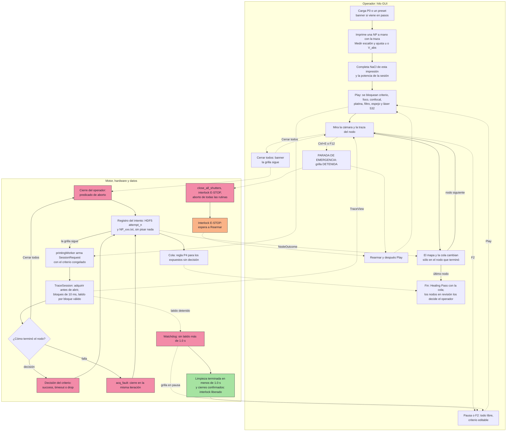

# C-01 — Ronda 3 — Diseño de GUI y ergonomía, versión 2 (líder: `scientific-gui-designer`)

Estado: COMPLETO (2026-09-27), secciones 0 a 12 y veredicto. Reemplaza a `gui_design.md` (v1), que
se conserva sin cambios como registro. No se modificó ningún otro archivo del repositorio. No hay
código de producción: los fragmentos de código son contratos de diseño para la Ronda 4.

**Qué incorpora.**
- La auditoría independiente de `qa-ux-auditor` (`c01_ronda3/qa_ux_audit.md`): 42 hallazgos
  (3 críticos, 17 altos, 18 medios, 4 bajos), las observaciones D-1 a D-14 sobre P0 y las filas
  R4-16 a R4-23.
- Las respuestas del investigador de la sexta ronda (P1 a P15) y de la séptima (P-C a P-L)
  (`RESPUESTAS_INVESTIGADOR.md`). **Son vinculantes y prevalecen sobre la v1 y sobre la auditoría.**

**Marcas.** Las de la v1: [CÓDIGO], [R2-ARQ], [R2-MET], [R2-INS], [INV], [FUENTE], [DERIVADO],
[PROPUESTA], [FALTA-CONTRATO]. Además:
- **[INV6] Pn** y **[INV7] P-x**: respuesta del investigador en la sexta o la séptima ronda;
- **[QA-nn]** y **[QA D-n]**: hallazgo de la auditoría;
- **[v1 §n]**: sección de la versión 1.

**Orden.** 0 qué cambió · 1 disposición de cada hallazgo de la auditoría · 2 hechos de la GUI
actual · 3 arquitectura de la información · 4 inventario de parámetros · 5 cortes del haz: parada de
emergencia, "Cerrar todos" y política por causa · 6 micro-interacciones · 7 tooltips y ayuda ·
8 resiliencia del estado y datos · 9 diagrama · 10 verificación manual · 11 reconciliación R4-1 a
R4-24 · 12 preguntas que siguen abiertas · veredicto.

---

## 0. Qué cambió respecto de la v1

### 0.1 Decisiones vinculantes nuevas y dónde impactan

| Decisión | Fuente | Impacto en el diseño |
|---|---|---|
| **P0 reproduce el legado**: los 20/20 se calibraron en PyPrinting legacy, a ≈ 10 ms por paso → ventanas de ≈ 200 ms. Con 10/10 la detección no era confiable. Hay que volver a calibrar con los modelos nuevos | [INV6] P1 | P0 = modo 0, u = 1.5, d = 0.5, W_old = W_new = 200 ms, sin persistencia (§4.3). La v1 usaba 940/940/94 ms: pasa a ser sólo el **vector de prueba A** |
| En el legado, u = 1.5 y d = 0.5, igual que en 3.0 | [INV7] P-C | valores de P0 |
| El umbral siempre se calibra con la traza: se imprime una NP a mano y se mide el escalón | [INV6] P2 | "Medir escalón" pasa a ser el flujo principal de calibración, también sobre la traza manual (§6.1) |
| No se pausa por fallas de adquisición seguidas; siguen las pausas de seguridad de `DEC-036` (interlock activo, cierre sin confirmar) | [INV6] P3 | se elimina la regla de "3 fallas seguidas" de la v1 (§5.3) |
| Una falla con el obturador abierto se reintenta sólo si la lectura a baja potencia no ve la NP | [INV6] P4 | regla única para todo nodo **expuesto sin decisión** (§5.3, §6.4) |
| Con el Healing Pass apagado, el diálogo de fin ofrece reintentar las fallas | [INV6] P5 | §6.4 |
| Sólo valores de latencia, sin objetivo dibujado | [INV6] P6 | §6.2 |
| Platina y Go/Set reference bloqueadas mientras se imprime; libres en pausa | [INV6] P7 | §6.5 |
| Tras un corte del watchdog, la grilla queda en pausa y se reanuda a mano | [INV6] P8 | §5.3, §6.6 |
| El software cuenta las 10 grillas sin incidentes y el investigador firma | [INV6] P9 | §6.8 |
| Por defecto se guardan bloques de 10 ms; las muestras a 10 kS/s son opcionales | [INV6] P10 | §8.2 |
| "Voltajes" = los del fotodiodo; el de modulación del láser no hace falta si se guarda el BS | [INV6] P11 | §8.2: no se registra `ao2` |
| "Extra info" pasa a campos tipados | [INV6] P12 | §8.3 |
| La confirmación a baja potencia viene activada por defecto sólo en los presets de ventana corta | [INV6] P13 | §4.4 |
| Los campos que el modo no usa quedan deshabilitados pero visibles | [INV6] P14 | §3.2 |
| Tope de `T_max`: 60 s, y 70 s en el Healing Pass | [INV6] P15 | §4.3 |
| Los legados del banco tienen los obturadores actualizados; las copias locales sirven para algoritmos, no para la configuración de hardware | [INV6] BANCO-35 | en la v2 no se cita ningún canal de las copias de `printing2/` |
| **"Cerrar todos" no pausa la grilla**: cierra los obturadores sin detener la rutina. La parada es la parada de emergencia. La diferencia tiene que quedar explícita en el rótulo, el tooltip y el manual. El nodo interrumpido sigue la regla de P4 | [INV7] P-H | §5.2 |
| **PyPrinting tiene su propia parada de emergencia** (`Ctrl+E` / `F12`). Después de accionarla, la grilla queda **detenida** y el operador reconoce el bloqueo | [INV7] P-E | §5.1 |
| Con 5 nodos seguidos sin captura, un aviso sin pausa | [INV7] P-D | §5.4 |
| Los presets "AgNP 80 nm — Nanodímeros" y "Grilla Extensa 10×10" (`stop_mode = 3`) son **Confocal reescalado** | [INV7] P-F | §6.9 |
| La potencia del 532, el filtro y el espejo no se tocan durante una grilla: bloqueados durante el nodo, libres en pausa | [INV7] P-G | §6.5 |
| **Separador decimal: punto**, por el teclado numérico, sin importar la región de Windows | [INV7] P-J | §4.1 |
| **El modo dímeros queda fuera del rediseño**: se conserva y no se rediseña | [INV7] P-K | §3.5 |
| **NaCl se ingresa en cada impresión** (es del lote de solución); **la potencia en la pupila, una vez por sesión** | [INV7] P-L | §8.3 |

### 0.2 Correcciones de la v1 que vienen de la auditoría

- **La cita de [M24] p. 69 estaba mal leída** [QA-39]. `u(t) = I(t+dt)/I(t−dt)` con dt de 10 a
  100 ms: dt es la **semiseparación** entre dos lecturas. Con dos ventanas contiguas de ancho W,
  2·dt ≈ W, así que el método documentado usa ventanas de **≈ 20 a 200 ms**, no de 10 a 100 ms. Lo
  verifiqué de nuevo en la página física 69 del PDF: el texto no dice que dt sea el ancho de una
  ventana. Se corrige en los tooltips y en los rangos (§4.3, §7).
- **El "≤ 20 ms" del sistema es un objetivo, no una garantía** [QA-15]: [R2-ARQ] §6.2 lo registra
  como no verificado hasta BANCO-29.
- **Exenciones** [QA-41]: G-2 y G-3 califican como exentas (test que falla, sin tocar obturadores ni
  platina). G-5 y G-6 **no**: cambian cuándo se abre un obturador y cuándo se mueve la platina, y eso
  nunca es exento (`CLAUDE.md` §5.0).
- **La tabla de estados no aprobaba su propia prueba de escala de grises** [QA-29]. Se rehace con un
  glifo por estado (§6.3).

---

## 1. Disposición de los hallazgos de la auditoría

**Aceptado** (A): cambia el diseño donde se indica. **Aceptado con cambios** (A*): se acepta el
problema y se resuelve de otra forma, por una decisión del investigador o por una razón que se da.
**Rechazado** (R): con la razón. **Resuelto por el investigador** (INV): la respuesta decide.

### 1.1 Seguridad, pánico y bloqueos (QA-01 a QA-10)

| ID | Sev. | Disposición | Cómo queda en la v2 |
|---|---|---|---|
| QA-01 | CRÍTICA | **A + INV** ([INV7] P-E) | PyPrinting gana su parada de emergencia: botón rojo siempre visible en el panel de impresión, en la barra de la traza y junto a "Cerrar todos"; `Ctrl+E` y `F12` con alcance de aplicación. La grilla queda **detenida** y el operador **rearma** (§5.1). Toca obturadores: antes de implementarla pasa por las Rondas 1-2 de instrumentación (R4-17) |
| QA-02 | CRÍTICA | **A* por el investigador** ([INV7] P-H) | Se acepta el problema (el gesto de pánico lo deshacía el nodo siguiente sin que el operador lo supiera) y **se rechaza la solución propuesta** (pausar la grilla), porque el investigador decidió lo contrario. "Cerrar todos" cierra sin detener la rutina; el nodo en curso termina "interrumpido por el operador" y sigue la regla P4. La diferencia con la parada de emergencia se hace explícita en el rótulo, el tooltip, un banner y el manual (§5.2) |
| QA-03 | CRÍTICA | **A** | Tabla de política por causa: estado de la grilla, del nodo, reintento y liberación del bloqueo para cada forma de terminar un nodo (§5.3). La liberación automática vale sólo para el watchdog |
| QA-04 | ALTA | **A + INV** ([INV7] P-G) | Se bloquean durante la grilla: los botones por láser, "Low power" y "Mirror up" del panel de obturadores, `Laser532Window` (que gana `set_actuators_enabled` con motivos) y el Play de dímeros. En pausa quedan libres. "Cerrar todos" y la parada de emergencia nunca se bloquean (§6.5) |
| QA-05 | ALTA | **A** | `F2` (pausar la grilla) y la parada de emergencia con alcance de aplicación, en todas las ventanas de PyPrinting. `F1` conserva su alcance de ventana, porque abre un obturador. En modo satélite hay que evitar el atajo ambiguo con PySpectrum (§5.1, R4-17) |
| QA-06 | ALTA | **A** | "Saltar nodo" en pausa sólo marca y avanza el índice: no mueve la platina, no cambia ninguna línea DO y la grilla sigue en pausa (§6.7) |
| QA-07 | ALTA | **A**, primera opción | Play de la grilla deshabilitado mientras haya una traza manual activa ("Detené la traza manual (F2) para reanudar"). Power BS en modo monitor no abre obturadores y puede seguir (§6.5) |
| QA-08 | ALTA | **A** | El paso "Limpiando" tiene plazo: 1.0 s (`stop` de 0.5 s más `read_timeout_s` de 0.2 s, con margen). Vencido, el banner dice que el hilo quedó colgado y pide reiniciar; el bloqueo sigue (§6.6) |
| QA-09 | ALTA | **A** | Con el backend de tick finito (`legacy_timer`) no hay concesión ni latido de vida: la GUI nunca muestra "1.0 s" ni el objetivo de ≤ 20 ms, y rige el plazo global del panel de obturadores (§6.8, R4-15) |
| QA-10 | MEDIA | **A** | Con una concesión activa, el rótulo del panel de obturadores dice "532 nm: en uso por la traza de impresión · latido OK · el plazo global no aplica" (§6.6) |

### 1.2 Valores, unidades, rangos y validación (QA-11 a QA-15)

| ID | Sev. | Disposición | Cómo queda en la v2 |
|---|---|---|---|
| QA-11 | ALTA | **A*** | (a) `V_abs` con mínimo de 0.010 V y una casilla "Usar umbral absoluto" (R4-18). (b) El motor rotula "parada sin escalón (V_abs)" cuando `c_abs` ya es verdadera en el primer bloque evaluado. (c) La razón `V_abs`/base se pinta de rojo cerca de 1. **Cambio respecto de la auditoría:** dos paradas sin escalón seguidas dan un **aviso**, no una pausa, por coherencia con [INV6] P3 y [INV7] P-D, que prefieren avisar antes que pausar. Queda como pregunta (§12, Q-3) |
| QA-12 | ALTA | **A + INV** ([INV7] P-J) | `QLocale.c()` en todos los spinbox: se muestra y se guarda siempre con punto. Una coma tecleada se toma como punto, para que la tecla decimal del teclado numérico funcione con cualquier distribución. Los separadores de miles se rechazan (§4.1, R4-21) |
| QA-13 | MEDIA | **A** | Aviso de pre-flight si `T_max` < W_new + W_old. Lo calcula el motor: `validate()` devuelve advertencias además de errores (R4-4) |
| QA-14 | MEDIA | **A** | (a) El tooltip y el rótulo de `V_abs` muestran la condición del contraste activo. (b) R4-20: se mantiene 1/u fijo mientras no haya presets de contraste negativo ([INV] Q13) |
| QA-15 | MEDIA | **A** | "objetivo de sistema ≤ 20 ms (sin verificar: BANCO-29)", y el valor medido después del primer nodo. El umbral de color se calcula desde `StreamConfig` (§6.2, §6.8) |

### 1.3 Presets y conversión (QA-16 a QA-21, D-1 a D-14)

| ID | Sev. | Disposición | Cómo queda en la v2 |
|---|---|---|---|
| QA-16 | ALTA | **A** | El cargador devuelve valores, procedencia por clave y una lista de problemas; detecta el formato por las claves crudas; escribe `format_version = 2` y un aviso de versión mínima; los presets por defecto se regeneran en ms (§6.9, R4-19) |
| QA-17 | ALTA | **A* por el investigador** ([INV7] P-F) | Los dos presets del repositorio con `stop_mode = 3` son Confocal reescalado, así que un índice sin clave se lee con la numeración del **panel**, que además es la que ejecutaba el código. **No se bloquea Play** (la auditoría lo proponía): hay un aviso si el nombre sugiere otro modo. En la Ronda 4 se corrige el nombre de "Grilla Extensa 10×10 (Criterio Híbrido)" (§6.9) |
| QA-18 | ALTA | **A + INV** ([INV6] P1) | P0 = el legado: 200 / 200 ms, modo 0, sin persistencia. Se distribuye un solo preset de paridad, "P0 — paridad con PyPrinting legacy". El 940/940/94 queda como vector de prueba A (§4.3) |
| QA-19 | MEDIA | **A** | Botón visible "Tengo valores en pasos…" junto a las ventanas, con el origen "PyPrinting legacy" por defecto (§4.6) |
| QA-20 | MEDIA | **A** | El backend `legacy_timer` se muestra como "tick finito (`DEC-037`)", con su cadencia medida en vivo. "Legacy" queda sólo en los nombres de los modos, que es el vocabulario del investigador (§6.8) |
| QA-21 | MEDIA | **A** | "1 · Legacy o voltaje absoluto (con persistencia)" (§3.2) |
| D-1, D-14 | — | **Resuelto por el investigador** ([INV6] P1) | §2.2 ya no supone que los números vienen de 3.0 |
| D-2, D-3, D-12 | — | **A** | Las cifras de las maquetas se rotulan "(ejemplo)" y los vectores de prueba A y L van a la lista de verificación (§3, §10) |
| D-4 | — | **A**, se mantiene | Todo archivo en pasos es de 3.0 (el legado no escribe presets), así que el banner de archivos convierte con 47 ms por defecto (§4.6) |
| D-5 | — | **A** | = QA-19 |
| D-6 | — | **A**, pendiente de datos | El T_ref del legado se mide con los `NP_xxx.txt` que ya existen en la PC del banco. Hasta tenerlos, "≈ 10 ms, sin medir". Pregunta abierta (§12, Q-1) |
| D-7 | — | **A** | El banner de conversión dice qué se conserva (la duración de las ventanas) y qué no (el ruido por punto) (§4.6) |
| D-8 | — | **A** | El tooltip de τ_hold aclara que el legado no tenía persistencia (§7) |
| D-9 | — | **A** | = QA-39 |
| D-10 | — | **Resuelto por el investigador** ([INV6] P13) | La confirmación viene activada sólo en los presets de ventana corta; P0 (200 ms) no la trae activada |
| D-11 | — | **A** | = QA-20 |
| D-13 | — | **A** | Con el tick finito, 200 ms → 4 pasos de 47 ms = 188 ms (−6 %). La etiqueta "efectiva" lo muestra (§4.2, §10) |

### 1.4 Fallas, reintentos y datos (QA-22 a QA-28)

| ID | Sev. | Disposición | Cómo queda en la v2 |
|---|---|---|---|
| QA-22 | ALTA | **A*** ([INV7] P-D, [INV6] P3) | Cinco "sin captura" seguidos: aviso sin pausa (P-D). Tres "caídas de señal" seguidas: **aviso** con el nivel del BS, no pausa. La pausa que proponía la auditoría choca con P3; queda como pregunta (§12, Q-3) |
| QA-23 | ALTA | **A + INV** ([INV6] P4, [INV7] P-H) | Todo nodo **expuesto sin decisión** se reintenta sólo si la lectura a baja potencia no ve la NP. Mientras esa lectura no exista (R4-3), el nodo queda "en revisión" y el Healing Pass lo saltea salvo que el operador lo pase a pendiente (§6.4) |
| QA-24 | MEDIA | **A** | Pausa a mitad de un nodo: la misma regla. Al reanudar aparece una línea no modal: "¿Reimprimir el nodo 17 (expuesto 12.3 s)? [Sí] [Marcar impresa] [Saltar]" (§6.7) |
| QA-25 | ALTA | **A** | R4-16: `TraceView` trae las series de las ventanas, la fase y `t_open`; `NodeOutcome` conserva los bloques de asentamiento marcados como excluidos. Hasta entonces, la opción "R" queda deshabilitada: la GUI no recalcula nada (§6.1) |
| QA-26 | MEDIA | **A** | El grupo de confirmación no muestra controles hasta que el motor la tenga: un rótulo gris "Confirmación a baja potencia: en diseño (R4-3)" (§3.2) |
| QA-27 | MEDIA | **A** | Contadores definidos: "paradas del criterio", "impresas" y "marcadas por el operador", por separado (§6.3) |
| QA-28 | ALTA | **A + INV** ([INV7] P-L) | Nada arranca con un número por defecto: NaCl empieza "no informado" en **cada impresión** y la potencia en la pupila, en cada sesión. Play pide completarlo o elegir "sin informar", que queda registrado (§8.3) |

### 1.5 Accesibilidad, ergonomía y documentación (QA-29 a QA-42)

| ID | Sev. | Disposición | Cómo queda en la v2 |
|---|---|---|---|
| QA-29 | ALTA | **A** | Un glifo distinto por estado, verificado con filtros de escala de grises y de deuteranopía (§6.3) |
| QA-30 | MEDIA | **A** | Líneas de 2 px, trazo largo, rótulo con fondo opaco. El estado "fija" va en el texto del rótulo (§6.1) |
| QA-31 | MEDIA | **A** | "Autofocus every N", "Shift x/y", la corrección de deriva, la referencia y la creación de grilla quedan bloqueados con la grilla corriendo y editables en pausa, con efecto desde el nodo siguiente. "Consecuencias" se pliega a una línea durante la corrida (§3.2, §6.5) |
| QA-32 | MEDIA | **Resuelto por el investigador** ([INV7] P-K) | Dímeros queda fuera del rediseño. Sí le aplican los arreglos de código compartido y la seguridad del proceso: parada de emergencia, "Cerrar todos" y bloqueos (§3.5, R4-22) |
| QA-33 | MEDIA | **A** | "Target Index" pasa a `QSpinBox` en [0, N−1], sin seguimiento por tecla, bloqueado con la grilla corriendo (§4.3) |
| QA-34 | MEDIA | **A** | "Set reference" en pausa con resultados pide confirmación, con el desplazamiento que va a sufrir el resto de los nodos (§6.5) |
| QA-35 | BAJA | **A** | Marca de cambio de criterio en el tooltip del nodo y en `grid_info.txt` (§6.9) |
| QA-36 | BAJA | **A** | Rótulo de sólo lectura en la barra de la traza durante la impresión: "ventanas 200 / 200 ms · τ 0 ms" (§3.4) |
| QA-37 | ALTA | **A** | `docs/MANUAL_USUARIO.md` entra en el plan de documentación, sección por sección, en el mismo commit que la GUI (§7.4) |
| QA-38 | MEDIA | **A** | Filas nuevas en `lab-invariants`: ✅ para la parada de emergencia de PyPrinting y 📄 para la cadencia medida del legado. Las escribe la Ronda 4 (§7.4) |
| QA-39 | MEDIA | **A** | Corregido (§0.2) |
| QA-40 | BAJA | **A** | "Arrastrá la línea rotulada V_abs" (§7) |
| QA-41 | MEDIA | **A** | Veredicto corregido: G-2 y G-3 exentos; G-5 y G-6 no (§0.2) |
| QA-42 | BAJA | **A** | Aviso de 50 Hz especificado: W_new < 200 ms y no múltiplo de 20 ms, con el residuo \|sinc(π·50 Hz·W)\| (§6.2) |

### 1.6 Observaciones de la auditoría sobre los hallazgos G y sobre R4-1 a R4-15

- **G-2 es más amplio** (A): `add_node_data` también borra `confocal_scan` y pisa los atributos del
  nodo (`core/hdf5_container.py:150-181`). R4-8 cubre los tres.
- **G-5 tiene un defecto aparte** (A, fuera de C-01): `F9` emite `isChecked()` sin alternar el
  botón (`focus.py:106-110`), así que desde el teclado nunca bloquea el foco. Se registra como
  hallazgo propio; la guarda por motivos va antes de esa lectura.
- **G-6 es más amplio** (A): "Next" en pausa arranca el nodo siguiente con exposición. Es QA-06.
- **G-8** queda resuelto por [INV7] P-F.
- **R4-15**: con el tick finito, la forma cerrada no vale y el cruce se cuantiza a pasos enteros
  (A): `detection_model` necesita una versión discreta para ese backend, o la cifra se rotula
  "±1 paso". Va a R4-4 y R4-15.

**Resultado: 42 de 42 hallazgos con disposición.** Aceptados tal cual: 31. Aceptados con cambios:
4 (QA-02, QA-11, QA-17, QA-22). Resueltos por el investigador sin cambio propio: 1 (QA-32).
Aceptados y además confirmados por el investigador: 6 (QA-01, QA-04, QA-12, QA-18, QA-23, QA-28).
Rechazado sin más: ninguno. La única propuesta que se rechaza es la **solución** de QA-02, y por
decisión del investigador.

---

## 2. Hechos de la GUI actual que condicionan el diseño

Los hallazgos G-1 a G-10 de [v1 §0] siguen en pie: la auditoría los confirmó todos en el código
([QA] §3.1). Se resumen con sus ampliaciones.

### 2.1 Hallazgos G, con su estado

| G | Qué | Dónde | Estado en la v2 |
|---|---|---|---|
| G-1a, G-1b | Los tooltips de `Steps before/after` dicen "antes de abrir" y "tras cerrar"; son las ventanas del cociente móvil | `measurements.py:685, 687`; también `MANUAL_USUARIO.md:476-478` | textos nuevos en §7 |
| G-1c, G-1d | El asistente repite el error y describe el modo 1 como un Y (el código hace un O) | `preset_wizard.py:96, 120-121` | §7 |
| G-1e | `N hold` sin unidad de tiempo | `measurements.py:693` | §7 (τ_hold en ms; el legado no tenía persistencia) |
| G-2 | El Healing Pass pisa la traza, el escaneo confocal y los atributos del primer intento | `measurements.py:2969-2981`; `hdf5_container.py:150-181` | §8.1; **exento** (test que falla) |
| G-3 | El mapa pinta de verde un nodo sin resultado | `measurements.py:224-227` | §6.3; **exento** |
| G-4 | Leyenda incompleta; TIMEOUT en el rojo de las fallas | `measurements.py:161-165, 254` | §6.3 |
| G-5 | `F8`, `F9` y `F10` saltean el bloqueo de `DEC-019`. Aparte: `F9` no alterna el botón | `focus.py:50-52, 90-95, 103-113` | §6.5; **no exento**: cambia si el foco puede mover Z y abrir |
| G-6 | Play relanza el nodo en curso; "Next" mueve sin cerrar, y en pausa arranca el nodo siguiente con exposición | `measurements.py:1976-1978, 2948-2952` | §6.7; **no exento**: cambia cuándo se abre y cuándo se mueve |
| G-7 | La traza no sabe que imprime: combo desincronizado, `F1` reabre, `F2` cuelga el nodo | `trace.py:332-335, 625-633` | §6.7 |
| G-8 | El asistente y el panel numeran los modos distinto | `preset_wizard.py:54-59`; `measurements.py:667-673` | resuelto por [INV7] P-F (§6.9) |
| G-9 | Metadatos en texto libre, sin NaCl | `measurements.py:837-839` | §8.3 |
| G-10 | `PointLabel` sin rótulos ni unidades | `trace.py:372, 454` | §3.4 |

### 2.2 El legado y P0 (reemplaza a [v1 §0.4])

- **Los 20/20 se calibraron en PyPrinting legacy**, a ≈ 10 ms por paso: ventanas de ≈ 200 ms
  ([INV6] P1). Con 10/10 (≈ 100 ms) la detección no era confiable.
- **El legado no guarda los pasos.** No tiene presets y `grid_info.txt` no los lista
  (`printing2/Printing_pp.py:468-471`, [QA] §1.1). Un 20/20 del legado vive en la cabeza del
  operador, no en un archivo. Por eso el conversor de pasos de la v2 es, ante todo, para **números
  que trae el operador** (§4.6).
- **Todo preset en pasos que exista en disco es de 3.0**, a ≈ 47 ms por paso ([QA D-4]).
- **Criterio del legado**: `I_new > u·I_old` o `I_new < d·I_old` o `T_max`, en la primera
  evaluación, sin persistencia ni umbral absoluto (`printing2/Printing_pp.py:793`). Con u = 1.5 y
  d = 0.5 ([INV7] P-C).
- **La cadencia del legado no está medida.** Los ≈ 10 ms salen de un comentario de 2019
  (`printing2/Trace_pp.py:398`); son casi todo el costo de crear y cerrar la tarea finita en cada
  paso, así que dependen de la PC ([QA] §1.1). Se puede medir sin hardware con el eje de los
  `NP_xxx.txt` del legado: cadencia media = (t_final − 0.01 s) / (n − 1). Queda pendiente (§12,
  Q-1).
- **Las copias locales del legado no son referencia de hardware** ([INV6], BANCO-35). La v2 las cita
  sólo por su algoritmo y su comportamiento.

### 2.3 Lo que no se toca

- La traza durante la impresión: se activa sola en cada nodo, con la cámara en vivo ([INV] R3). Sólo
  se agregan capas que se pueden apagar y rótulos en lugares que ya existen.
- La cámara en vivo (la ventana y su adquisición, `modules/camera.py`). La parada de emergencia la
  cubre con un atajo de alcance de aplicación registrado en la ventana principal, sin tocar su
  código (§5.1). `Laser532Window`, que vive en el mismo archivo pero es otra ventana, sí gana el
  bloqueo con motivos (§6.5).
- El panel de dímeros (§3.5).
- Power BS, salvo de dónde saca los datos ([R2-ARQ] §2.5).

---

## 3. Arquitectura de la información [PROPUESTA]

### 3.1 Principios (los de [v1 §1.1], con dos agregados)

1. Lo que decide un nodo va junto.
2. Cada parámetro muestra su consecuencia al lado, calculada por el motor.
3. Lo que se configura va en el panel; lo que se mira, en la traza.
4. No se rompe lo que funciona.
5. Dos niveles de detalle: básico y "Avanzado".
6. **Nuevo: los tres cortes del haz se distinguen a simple vista.** Pausa, "Cerrar todos" y la
   parada de emergencia hacen cosas distintas con la grilla (§5). Cada uno tiene su rótulo, su color
   y su lugar, y ningún rótulo promete lo que el botón no hace.
7. **Nuevo: ningún dato de análisis nace de un valor por defecto.** Un campo que no se completó dice
   "no informado", y así se guarda.

### 3.2 Panel de impresión

Las cifras son **de ejemplo** y corresponden a P0 (paridad con el legado). En la implementación
salen en vivo del motor.

```
┌ Printing Control Panel ──────────────────────────────────────────────────────────────┐
│ [■ PARADA DE EMERGENCIA  Ctrl+E · F12]                         (rojo, siempre visible) │
│ [Printing folder] [Nombre de lote______]  20260927-1432_Printing_AuNP60 (verde)       │
│ Preset [P0 — paridad con PyPrinting legacy ▾] (modificado) [Asistente] [Cargar] [Guardar] │
│ ┌ Criterio de fin de impresión ───────────────────────────────────── [📖 Ayuda] ┐ │
│ │ Modo [0 · Legacy: salto relativo ▾]   Láser [532 ▾]   Contraste [↑ sube ▾]      │ │
│ │ Umbral relativo u   [ 1.50 ] ×    [ ] Usar umbral absoluto  V_abs [ 2.500 ] V (gris) │ │
│ │ Ventana vieja W_old [  200 ] ms  20 bl.    Ventana nueva W_new [  200 ] ms  20 bl. │ │
│ │                                  [Tengo valores en pasos…]                        │ │
│ │ Persistencia τ_hold [    0 ] ms  (el modo 0 no la usa: gris)                      │ │
│ │ Tiempo máximo T_max [ 40.0 ] s   → en el Healing Pass: 50.0 s                    │ │
│ │ ▸ Avanzado: umbral mínimo · corte por caída · pendiente · confocal · datos crudos  │ │
│ └──────────────────────────────────────────────────────────────────────────────┘ │
│ ┌ Consecuencias del preset ──────────────────────────────────────── [📖 Ayuda] ┐ │
│ │ Escalón mínimo de la rama relativa: ×1.50                                        │ │
│ │ Latencia del criterio: ×2.0 → 100-110 ms · ×1.6 → 167-177 ms · ×1.4 → no detecta │ │
│ │ + sistema: objetivo ≤ 20 ms (sin verificar: BANCO-29) + obturador: sin medir     │ │
│ │ [mini-gráfico: latencia vs escalón, zona "no detecta", banda observada]          │ │
│ │ (!) Los escalones de ×1.40 a ×1.50 no se detectan: el modo 0 no tiene umbral absoluto │ │
│ └──────────────────────────────────────────────────────────────────────────────┘ │
│  Confirmación a baja potencia: en diseño (R4-3)                          (rótulo gris) │
│ ┌ Condiciones de esta impresión ───────────────────────────────────────────────┐ │
│ │ NaCl [ no informado ] mM   NP [Au ▾] [ 60 ] nm   Sustrato [PDDA/PSS ▾]           │ │
│ │ Potencia en la pupila (sesión): 12.4 mW, medida a las 13:52  [Cambiar]            │ │
│ └──────────────────────────────────────────────────────────────────────────────┘ │
│ ┌ Ejecución ─────────────────────────────────────────────────────────────────┐ │
│ │ [x] Scan pre-print  [x] Track Drift XY  [x] Track Drift Z  [x] Track Time-Volt     │ │
│ │ [Play ►] [Pausa ‖ F2] [Saltar nodo ►|]     [x] Healing Pass (reintento al final)    │ │
│ │ Nodo 17 / 64 · pase principal · exponiendo 3.4 s · grilla CORRIENDO               │ │
│ │ 12 impresas · 1 marcada por el operador · 3 sin captura · 1 en revisión · cola: 5  │ │
│ │ ETA 04m 12s   [██████████████░░░░░░░░░░░░░░░░░] 27 %                               │ │
│ │ ┌ banner (oculto si no hay nada que avisar; §5 y §6) ────────────────────────┐ │ │
│ │ └──────────────────────────────────────────────────────────────────────────────┘ │ │
│ └──────────────────────────────────────────────────────────────────────────────┘ │
└──────────────────────────────────────────────────────────────────────────────────┘
```

Cambios respecto de [v1 §1.2]:
- **Botón de parada de emergencia arriba de todo**, rojo `#f38ba8` con texto oscuro `#1e1e2e`, en
  negrita, de al menos 32 px de alto. No se desplaza ni se pliega nunca (§5.1).
- **Nombres de los modos** ([QA-21]):
  - `0 · Legacy: salto relativo`;
  - `1 · Legacy o voltaje absoluto (con persistencia)`;
  - `2 · Meseta dI/dt → 0, o voltaje absoluto`;
  - `3 · Confocal reescalado, o voltaje absoluto`;
  - `4 · Híbrido: relativo, o meseta, o absoluto`.
- **"Usar umbral absoluto"** es una casilla ([QA-11]). Sin marcar, `V_abs` queda en gris. En el modo
  0 no aplica.
- **Los campos que el modo no usa quedan deshabilitados y visibles** ([INV6] P14), con el tooltip
  "El modo 0 no usa la persistencia".
- **"Tengo valores en pasos…"** queda a la vista, debajo de las ventanas ([QA-19]).
- **Confirmación a baja potencia**: un rótulo gris, sin controles, hasta que el motor la tenga
  ([QA-26], R4-3).
- **"Condiciones de esta impresión"** es un grupo nuevo con los metadatos tipados ([INV6] P12,
  [INV7] P-L; §8.3).
- **Contadores definidos** ([QA-27]; §6.3).
- **Estado de la grilla en palabras** ("CORRIENDO", "EN PAUSA", "DETENIDA por parada de
  emergencia", "TERMINADA"), no sólo por el estado de los botones (§5.3).
- **Con la grilla corriendo**, "Consecuencias" se pliega a una línea ("×1.50 · ×2 → 100-110 ms") y
  "Ejecución" gana la altura ([QA-31]).

### 3.3 Mapa de la grilla

Igual que [v1 §1.3]: pestañas "Mapa" y "Cola de reintento". La leyenda usa los glifos de §6.3.

### 3.4 Widget de la traza

Igual que [v1 §1.4], con cuatro cambios:
- **Un botón de parada de emergencia** chico en la barra, a la derecha, rojo, con el rótulo
  "EMERGENCIA" ([QA-01]).
- **La opción "R = I_new/I_old" del combo `Láser 2`** queda **deshabilitada** hasta que `TraceView`
  traiga las series de las ventanas (R4-16), con el tooltip "Se habilita cuando el motor entregue
  las ventanas del detector". Mientras tanto, la GUI no recalcula las ventanas por su cuenta
  ([QA-25]).
- **Rótulo de sólo lectura durante la impresión** ([QA-36]): "ventanas 200 / 200 ms · τ 0 ms". El
  operador del legado buscaba las ventanas en la traza (`printing2/Trace_pp.py:90-95`).
- **El indicador de adquisición** muestra "tick finito (`DEC-037`) · 11 ms medidos", no "legacy"
  ([QA-20]; §6.8).

`PointLabel` pasa a "I_old 1.82 V · I_new 2.71 V · R ×1.49" (G-10), como en la v1.

### 3.5 Alcance: el modo dímeros queda afuera ([INV7] P-K)

`MeasFrontend` sirve a los dos modos (`app.py:224-225`). En la v2:
- **El panel de dímeros conserva su disposición y sus campos actuales**, en pasos. No recibe
  ventanas en ms, ni "Consecuencias", ni la cola, ni los estados nuevos. Todo lo nuevo del panel se
  construye sólo con `mode == "printing"`.
- **Sí le aplican**, porque son del proceso o del código compartido:
  - la parada de emergencia y la semántica de "Cerrar todos" (§5);
  - los bloqueos de actuadores mientras cualquiera de las dos rutinas corre (§6.5);
  - los arreglos de defectos en código compartido: G-3 (`InteractiveGridWidget`) y G-6
    (`grid_measurment`, `grid_next_index`).
- **Queda abierta para la Ronda 4** (R4-22) la ruta de adquisición de dímeros: el camino de tick
  finito se borra después de 10 grillas sin incidentes ([INV] Q9). Antes de borrarlo hay que decidir
  si dímeros pasa al motor nuevo, con sus pasos convertidos internamente, o si conserva el camino
  viejo.

---

## 4. Inventario de parámetros expuestos (DoF) [PROPUESTA]

### 4.1 Reglas de los widgets

- **Spinbox para todo número**: `QSpinBox` (enteros en ms) o `QDoubleSpinBox`, con rango, paso,
  sufijo de unidad y `setKeyboardTracking(False)`. El valor se confirma con Enter o al salir del
  campo. Como en [v1 §2.1].
- **Punto decimal fijo** ([INV7] P-J, [QA-12]):
  - todos los spinbox del panel, del asistente, del diálogo de conversión y de "Condiciones de esta
    impresión" usan `QLocale.c()`: muestran y aceptan el **punto**, sin importar la región de
    Windows;
  - se rechazan los separadores de miles (`QLocale.NumberOption.RejectGroupSeparator`): "1.500"
    nunca puede leerse como 1500;
  - una **coma** tecleada se reemplaza por un punto antes de validar, con un validador propio. Así
    la tecla decimal del teclado numérico funciona con cualquier distribución de teclado, que es el
    uso que describe el investigador;
  - los presets se escriben y se leen siempre con punto.
- **"Desactivado"** con `setSpecialValueText` sólo en `V_min` y d, donde 0 significa de verdad
  "sin veto" o "sin corte". `V_abs` **no** tiene valor especial: su mínimo es 0.010 V y se apaga con
  la casilla "Usar umbral absoluto" ([QA-11]).
- **"Target Index"** pasa a `QSpinBox` acotado a [0, N−1], sin seguimiento por tecla ([QA-33]).
  Hoy emite en cada tecla y acepta cualquier número (`measurements.py:795-797, 1238-1240`).
- **Lo efectivo lo calcula el motor**: `StopCriterion.blocks(block_ms)` para el backend de bloques,
  y su equivalente en pasos para el de tick finito ([QA] R4-1, R4-15).
- **Transporte**: un `StopCriterion` inmutable, no la lista posicional de 26 elementos.
- **Congelado por nodo**: los parámetros de un nodo son los de su `SessionRequest`.

### 4.2 Capas

| Capa | Qué tiene | Quién la toca |
|---|---|---|
| Invariantes | adquirir antes de exponer; cerrar ante una falla; latido sólo con un bloque válido; un único dueño de las AI; la decisión en el hilo de adquisición; la parada de emergencia y "Cerrar todos" nunca se bloquean | nadie; código |
| Capa 0 | T_b, tasa, buffer, bloques previos, asentamiento, capacidad, base a baja potencia, +10 s del Healing Pass, plazo del latido (sólo con el backend de bloques) | `config.py`; la GUI los muestra |
| Capa 1 | capas de la traza, opción "R" (cuando exista R4-16), líneas arrastrables, "Medir escalón", "Re-evaluar", nodo anterior | operador, en la traza |
| Capa 2 | el criterio; en "Avanzado", `V_min`, corte por caída, pendiente, modo confocal y guardado de muestras completas; la confirmación cuando exista | operador, en el panel y en el preset |
| Capa 3 | `TRACE_ACQ_BACKEND`, `TRACE_BLOCK_MS` | `config.py`; la GUI los muestra en sólo lectura |

### 4.3 Parámetros del criterio

Columnas: rótulo · campo del motor · widget · unidad · rango · paso · valor sin preset → **P0** ·
modos · notas.

| Rótulo | Campo | Widget | Unidad | Rango | Paso | Sin preset → P0 | Modos | Notas |
|---|---|---|---|---|---|---|---|---|
| Modo | `mode` | combo con clave estable | — | 0-4 | — | 0 → **0** | todos | clave en el preset (§6.9) |
| Láser | `lasers_to_open`, `pd_index` | combo | nm | `SHUTTERS` | — | 532 → 532 | todos | — |
| Contraste | `contrast_sign` | combo ↑ / ↓ | — | ±1 | — | +1 → +1 | 0, 1 | fijo en +1 en los modos 2-4 |
| Umbral relativo u | `umbral` | `QDoubleSpinBox` " ×" | adimensional | 1.01-5.00 | 0.01 | 1.20 → **1.50** | 0, 1, 4 | desigualdad estricta; [INV7] P-C |
| Usar umbral absoluto | `umbral_abs_enabled` [FALTA-CONTRATO] | `QCheckBox` | — | — | — | marcado → **no aplica** (modo 0) | 1-4 | R4-18 |
| Umbral absoluto V_abs | `umbral_abs_v` | `QDoubleSpinBox` " V" | V | **0.010**-10.000 | 0.010 | 2.500 → — | 1-4 | se calibra con la traza ([INV6] P2) |
| Ventana vieja W_old | `win_old_ms` | `QSpinBox` " ms" + "= N bl." | ms | 10-2000 | 10 | 470 → **200** | 0, 1, 4 | base del cociente |
| Ventana nueva W_new | `win_new_ms` | ídem | ms | 10-2000 | 10 | 470 → **200** | 0, 1, 4 | fija la latencia |
| Persistencia τ_hold | `hold_ms` | `QSpinBox` " ms" + "efectiva X ms (N evaluaciones)" | ms | 0-1000 | 10 | 188 → **0** | 1-4 | el legado no tenía persistencia |
| Tiempo máximo T_max | `t_max_s` | `QDoubleSpinBox` " s" | s | 1.0-**60.0** (Healing: 70.0) | 1.0 | 20.0 → **40.0** | todos | [INV6] P15; 40 s según la práctica ([INV] R3); el legado trae 20 s por defecto (`printing2/Printing_pp.py:73`); pregunta Q-2 |
| Umbral mínimo V_min (Avanzado) | `umbral_min_v` | `QDoubleSpinBox`, 0 = "desactivado" | V | 0.000-10.000 | 0.010 | 0 → 0 | todos | veto |
| Corte por caída d (Avanzado) | `umbral_down` | `QDoubleSpinBox`, 0 = "desactivado" | adimensional | 0.00-0.99 | 0.05 | 0 → **0.50** | todos, con ↑ | [INV7] P-C |
| Ventana de pendiente (Avanzado) | `slope_window_ms` | `QSpinBox` " ms" | ms | 20-1000 | 10 | 188 → 188 | 2, 4 | — |
| Pendiente de meseta (Avanzado) | `slope_flat_v_s` | `QDoubleSpinBox` " V/s" | V/s | 0.0-100.0 | 0.1 | 2.0 → 2.0 | 2, 4 | — |
| K de escala confocal (Avanzado) | `ratio_k` → `v_peak_scaled_v` por nodo | `QDoubleSpinBox` | adimensional | 0.1-100.0 | 0.1 | 10.0 → 10.0 | 3 | no es 1:1 (R4-6) |
| Umbral P % (Avanzado) | `percent_thresh` | `QSpinBox` " %" | % | 1-100 | 1 | 50 → 50 | 3 | — |
| Guardar muestras completas (Avanzado) | opción de registro | `QCheckBox` | — | — | — | apagado → apagado | todos | [INV6] P10; ≈ 16 MB por nodo de 40 s |
| Target Index | índice de la rutina | `QSpinBox` | — | 0-(N−1) | 1 | 0 | — | bloqueado con la grilla corriendo |

**Por qué estos rangos.**
- **Ventanas de 10 a 2000 ms.** El método documentado en CIBION usa ventanas de ≈ 20 a 200 ms: [M24]
  p. 69 da dt de 10 a 100 ms como semiseparación, y 2·dt ≈ W ([FUENTE], releído; [QA-39]). P0 (200
  ms) queda en el borde superior de ese rango. El techo de 2000 ms deja lugar al vector A (940 ms).
- **`T_max` de 1 a 60 s**, y 70 s en el Healing Pass ([INV6] P15).
- **u desde 1.01**, como en la v1.

### 4.4 Confirmación a baja potencia: no se expone todavía

- **No aparece en la GUI hasta que el motor la tenga** ([QA-26]; R4-3, nunca exenta). Mientras
  tanto, un rótulo gris: "Confirmación a baja potencia: en diseño (R4-3)".
- **Cuando exista**: los campos de [v1 §2.4] (activar, R mínimo = 1.20 ×, lectura = 100 ms), con
  estos valores por defecto:
  - **activada sólo en los presets de ventana corta** ([INV6] P13);
  - apagada en P0.
- **De ella dependen tres reglas que ya decidió el investigador** ([INV6] P4, [INV7] P-H):
  - reintentar una falla con el obturador abierto;
  - reintentar un nodo cortado con "Cerrar todos";
  - reanudar un nodo pausado a mitad de la exposición.

  Hasta que exista, esos nodos quedan "en revisión" (§6.4). Por eso R4-3 pasa a ser la dependencia
  de mayor prioridad de la Ronda 4 después de la parada de emergencia.

### 4.5 Lo que se calcula solo y se muestra

Igual que [v1 §2.5], con tres cambios:
- **Sistema**: "objetivo ≤ 20 ms (sin verificar: BANCO-29)", nunca "garantizado" ([QA-15]). Con el
  tick finito, "no aplica".
- **Plazo del latido de vida (1.0 s)**: sólo con el backend de bloques. Con el tick finito, rige el
  plazo global del panel de obturadores ([QA-09]).
- **T_ref de cada programa**, con su procedencia:
  - 3.0: 47 ms, medido en la PC de desarrollo; 📄 hasta BANCO-24/28;
  - legado: ≈ 10 ms, de un comentario de 2019; 📄 hasta medirlo con sus `NP_xxx.txt` (§12, Q-1;
    R4-23).

### 4.6 Conversión desde pasos: dos puertas

**Puerta 1: los números que trae el operador** ([QA-19], [QA D-5]). Es la puerta principal, porque
los 20/20 del legado no están en ningún archivo (§2.2).
- El botón **"Tengo valores en pasos…"**, a la vista debajo de las ventanas, abre un diálogo con:
  - Steps before, Steps after y, opcional, N_hold;
  - el origen de los números, con **"PyPrinting legacy (≈ 10 ms por paso, sin medir)"** por
    defecto; las otras opciones son "PyPrinting 3.0 (≈ 47 ms por paso)" y "Otro: [__] ms";
  - las consecuencias de cada origen, **lado a lado**, calculadas por el motor.
- "Aplicar" rellena los campos en ms y deja en la procedencia de cada campo "convertido desde pasos
  (legado, T_ref 10 ms)".
- Con el origen "legado" y un N_hold escrito, el diálogo avisa: "El legado no tenía persistencia: si
  el número viene del legado, dejalo vacío" (D-8).

**Puerta 2: los archivos en pasos.** Todo `.txt` en pasos es de 3.0 ([QA D-4]), así que el banner
de [v1 §2.6] convierte con **47 ms** por defecto, con "Cambiar T_ref…". El banner dice además qué se
conserva ([QA D-7]):

> "Preset en formato de pasos (PyPrinting 3.0, T_ref = 47 ms): Steps before 10 → 470 ms · Steps
> after 10 → 470 ms · N_hold 5 → 188 ms. **Se conserva la duración de las ventanas, no el ruido por
> punto**: antes cada paso promediaba 1 ms de señal; ahora cada bloque promedia 10 ms.
> [Guardar en ms] [Cambiar T_ref…] [Ver detalle]"

**Vectores de referencia** [DERIVADO], modelo sin ruido de [R2-MET] §2.1, T_b = 10 ms:

| Vector | Origen | W_old / W_new | τ_hold | Modo, u | Escalón mínimo | Latencia ×2 / ×1.6 / ×1.4 | Uso |
|---|---|---|---|---|---|---|---|
| **P0** (vector L) | legado, 20/20 a ≈ 10 ms ([INV6] P1) | **200 / 200 ms** | 0 | 0, 1.5 | **×1.50** | **100-110 / 167-177 ms / no detecta** | preset de paridad distribuido |
| A | los mismos números leídos como 3.0 a 47 ms | 940 / 940 ms | 94 (efectiva 100) | 1, 1.5 | ×1.53 | 570-580 / 883-893 ms / no detecta | sólo vector de prueba |
| Repo "Alta Potencia" | 3.0, 10/10/5 a 47 ms | 470 / 470 ms | 188 (190) | 1, 1.35 | ×1.45 | 352-362 / 462-472 ms / no detecta | preset del repositorio, convertido |
| Repo "Impresión Rápida" | 3.0, 10/10 a 47 ms | 470 / 470 ms | — | 0, 1.2 | ×1.20 | 94-104 / 157-167 / 235-245 ms | preset del repositorio, convertido |

- **P0 no detecta los escalones de ×1.40 a ×1.50** por la rama relativa, y el modo 0 no tiene umbral
  absoluto. Es el comportamiento del legado, que "no funcionaba siempre" ([INV6] P1). P0 es el punto
  de partida para recalibrar, no el objetivo.
- **Con el tick finito** (backend de rollback, 47 ms por paso), P0 queda en 4 pasos = 188 ms (−6 %)
  ([QA D-13]). Las consecuencias salen de la versión discreta de `detection_model`, con cruces
  cuantizados a pasos enteros, del orden de 94-141 ms para ×2 ([QA] R4-15). La etiqueta "efectiva"
  lo muestra.
- **La regla de conversión no cambia**: W = pasos · T_ref y τ_hold = (N_hold − 1) · T_ref.

---

## 5. Cortes del haz: parada de emergencia, "Cerrar todos" y política por causa [PROPUESTA]

Resuelve QA-01, QA-02 y QA-03 con las decisiones [INV7] P-E y P-H. Todo lo de esta sección toca
obturadores: **nunca es exento**. La secuencia de hardware de la parada de emergencia se valida en
las Rondas 1-2 de instrumentación antes de la Ronda 4 (R4-17). Acá se define lo que ve y hace el
operador, y lo que la GUI promete.

### 5.1 Parada de emergencia propia de PyPrinting ([INV7] P-E, [QA-01], [QA-05])

**Dónde está.**
- Un botón **"■ PARADA DE EMERGENCIA · Ctrl+E · F12"** arriba de todo en el panel de impresión
  (§3.2), rojo `#f38ba8` con texto `#1e1e2e`, en negrita, de 32 px de alto como mínimo.
- Un botón chico **"EMERGENCIA"**, del mismo rojo, en la barra de la traza (§3.4).
- Otro, junto a "Cerrar todos", en el dock de obturadores de la ventana principal. La vecindad
  enseña la diferencia (§5.2).
- Los atajos **`Ctrl+E` y `F12`**, con `Qt.ShortcutContext.ApplicationShortcut`, registrados una
  sola vez en la ventana principal. Funcionan con el foco en cualquier ventana de PyPrinting:
  principal, impresión, dímeros, cámara y Láser 532. No hace falta tocar el código de la cámara.
- Son los mismos atajos que PySpectrum (`pyspectrum/window.py:543-546`, `lab-invariants` §4): el
  operador aprende uno solo.

**Qué hace**, en este orden (la validan instrumentación y arquitectura en R4-17):
1. **Cierra los cuatro obturadores ya**, desde el hilo GUI: `close_all_shutters()`, una escritura
   con la polaridad de cada línea (el 532 nm queda en ALTO; `DEC-036`). Es seguro entre hilos por
   `_nidaq_lock` ([R2-ARQ] §2.5). No espera a ningún hilo.
2. **Activa el interlock `"E-STOP"`**: `open_shutter` se niega a abrir mientras exista.
3. **Aborta todo lo que corre en PyPrinting**: la sesión de la traza (predicado de aborto, [R2-ARQ]
   §2.3), la grilla, la traza manual, Power BS, y los escaneos confocales y de foco.
4. **La grilla queda DETENIDA**, que es distinto de "en pausa":
   - Play queda deshabilitado hasta rearmar;
   - el estado de la grilla (resultados, cola, índice, criterio) se **conserva entero**;
   - el nodo en curso queda "expuesto sin decisión (parada de emergencia)" y sigue la regla P4
     (§5.3).
5. **Aparece un banner persistente**, rojo, en el panel de impresión y en la barra de estado de la
   ventana principal. No es un diálogo modal: la cámara y los paneles siguen a la vista.
   > "PARADA DE EMERGENCIA 14:31:52 — obturadores: 4 de 4 confirmados cerrados. La grilla quedó
   > DETENIDA en el nodo 17. Revisá el banco y pulsá [Rearmar] para habilitar la apertura."

**Rearmar** es el reconocimiento del operador que pide el investigador:
- el botón "Rearmar" se habilita sólo cuando los cuatro obturadores están **confirmados cerrados**
  y los hilos de las rutinas abortadas terminaron (con el plazo de §6.6);
- rearmar libera el interlock `"E-STOP"`. La grilla pasa de DETENIDA a EN PAUSA, y reanudar sigue
  siendo un Play aparte. Son **dos acciones deliberadas**, nunca una;
- si algún cierre no se confirma, "Rearmar" queda deshabilitado y rige el banner de `DEC-036`;
- la **liberación automática del bloqueo no aplica nunca** a la parada de emergencia ([QA] R4-9).

Si después de rearmar se puede reanudar la grilla o hay que empezarla de nuevo, es una pregunta
(§12, Q-4). La propuesta es que se pueda reanudar, porque el estado sagrado de la grilla no se tira
por un reflejo de seguridad.

**Modo satélite** (`DEC-019`: PyPrinting dentro del proceso de PySpectrum). Si los dos programas
registran `Ctrl+E` en el mismo proceso, con la ventana de PySpectrum activa el atajo de ventana de
PySpectrum y el de aplicación de PyPrinting chocan: Qt emite `activatedAmbiguously` y **ninguno de
los dos dispara**. Por eso:
- en modo satélite hay **una sola** parada de emergencia del proceso, con un único registro de
  atajos, que llama a la de los dos programas;
- un test verifica que, en modo satélite, `Ctrl+E` desde cualquier ventana dispara exactamente una
  vez y detiene los dos.

Queda como R4-17 y como pregunta (§12, Q-5).

**Lo que no hace.** No envía ningún comando de detención a la platina PI, porque eso es decisión de
instrumentación (R4-17). La grilla detenida simplemente no emite más movimientos.

### 5.2 "Cerrar todos" no detiene la grilla ([INV7] P-H, [QA-02])

**Qué hace.** Cierra los cuatro obturadores ya, igual que hoy (`core/nidaq.py:525-556`, llamado
desde `core/shutters.py:308-315`). **No pausa ni detiene la grilla.** Con una sesión de impresión
activa:
1. la sesión se entera: un **predicado de aborto** nuevo, "cierre del operador", la termina en el
   bloque siguiente. El nodo no queda 40 s leyendo oscuridad ni termina como una falsa "caída";
2. el nodo en curso queda "expuesto sin decisión (cierre del operador)", con su exposición, y sigue
   la regla P4 (§5.3);
3. **la grilla sigue** con el nodo siguiente, que vuelve a abrir su obturador de la forma normal.

**La diferencia tiene que ser explícita** ([INV7] P-H):
- **Rótulo.** Con una grilla corriendo, el botón pasa de "Cerrar Todos" a **"Cerrar todos · la
  grilla sigue"**. Sin grilla, conserva su texto.
- **Tooltip**:
  > **Cerrar todos los obturadores**
  > Cierra los cuatro ahora. **No detiene la grilla**: el nodo en curso termina como "interrumpido"
  > y el siguiente vuelve a abrir en unos segundos.
  > Para detener todo: **PARADA DE EMERGENCIA** (`Ctrl+E` / `F12`). Para detener sólo la grilla:
  > **Pausa** (`F2`).
- **Banner** al usarlo durante un nodo, en Peach, 20 s:
  > "Cerraste los obturadores en el nodo 17. La grilla **sigue** con el nodo 18. Para detenerla:
  > Pausa (F2) o PARADA DE EMERGENCIA (Ctrl+E / F12)."
- **Manual**: una tabla como la de abajo en `MANUAL_USUARIO.md`, y corregir `:394` y `:815`, que
  dicen que "Cerrar Todos" funciona "desde cualquier ventana" ([QA-37]).

**Los cuatro cortes, lado a lado** (va en el manual, en la ayuda y en los tooltips):

| | Pausa (`F2`) | Cerrar todos | Parada de emergencia (`Ctrl+E`, `F12`) | Saltar nodo |
|---|---|---|---|---|
| Qué cierra | el obturador de impresión | los cuatro | los cuatro, con interlock | el obturador del nodo |
| La grilla | queda **en pausa** | **sigue** | queda **detenida** | sigue, o sigue en pausa |
| El nodo en curso | expuesto sin decisión (pausa) | expuesto sin decisión (cierre del operador) | expuesto sin decisión (parada de emergencia) | salteada |
| Para volver a abrir | Play | nada: el nodo siguiente abre solo | Rearmar y después Play | — |
| Alcance del atajo | todas las ventanas de PyPrinting | sólo el botón, en el dock de obturadores | todas las ventanas de PyPrinting | sólo el botón |
| Se puede bloquear | no | **nunca** | **nunca** | no |

### 5.3 Política por causa: qué pasa después de cada forma de terminar un nodo ([QA-03])

**Definición.** Un nodo **expuesto sin decisión** es el que tuvo el obturador abierto
(`t_open_s` definido) y terminó sin que el criterio decidiera. Pudo haber impreso.

**Regla P4** ([INV6] P4, [INV7] P-H): un nodo expuesto sin decisión se reintenta en el Healing Pass
**sólo si una lectura a baja potencia no ve la NP**. Mientras esa lectura no exista (R4-3), queda
"en revisión": el Healing Pass lo saltea y el operador decide desde la cola, mirando la cámara
(§6.4).

| Causa | Obturadores | La grilla | El nodo | Reintento | Bloqueo y cómo se libera |
|---|---|---|---|---|---|
| Decisión: `success` | cerrados por el hilo de adquisición | sigue | impresa | no | — |
| Decisión: `timeout` o `drop` | ídem | sigue | sin captura / caída de señal | sí, en el Healing Pass (como hoy) | — |
| `acq_fault` **sin** exposición | nunca se abrió | **sigue** ([INV] quinta ronda, 1; [INV6] P3: no se pausa por fallas seguidas) | falla sin exposición | sí, en el Healing Pass | — |
| `acq_fault` **con** exposición | cerrados en la misma iteración | sigue | expuesto sin decisión | regla P4 | — |
| Cierre del operador ("Cerrar todos") | cerrados por el operador | **sigue** ([INV7] P-H) | expuesto sin decisión | regla P4 | — |
| Pausa (`F2` o botón) | cerrado el de impresión | **en pausa** | expuesto sin decisión si ya había abierto; si no, vuelve a pendiente | regla P4 al reanudar (§6.7) | — |
| Corte del watchdog (latido detenido, sólo con el backend de bloques) | todos, por el watchdog | **en pausa**; se reanuda a mano ([INV6] P8) | expuesto sin decisión | regla P4 | interlock de rutina, **liberado solo** cuando la rutina terminó de limpiar y los cierres están confirmados, con plazo (§6.6) |
| Interlock `"NI-DAQmx"` o `"Platina PI"` | todos (`DEC-036`) | **en pausa** | expuesto sin decisión, o falla sin exposición | regla P4, o sí | **no** se libera solo: rige `DEC-036` |
| Cierre sin confirmar | reintentos de `DEC-036` | **en pausa** | el que corresponda | el que corresponda | banner persistente de `DEC-036` |
| Parada de emergencia | los cuatro, con interlock `"E-STOP"` | **detenida** ([INV7] P-E) | expuesto sin decisión, o pendiente | regla P4 | interlock `"E-STOP"`; lo libera **sólo el operador** con "Rearmar" |
| Saltar nodo | cerrado el del nodo | sigue, o sigue en pausa (§6.7) | salteada | no | — |
| Parada sin escalón por `V_abs` ([QA-11]) | cerrados por el hilo | sigue, con aviso (§5.4) | parada sin escalón | regla P4 (estuvo expuesto, pero no hubo escalón) | — |

**Invariante que se prueba** ([QA-03]): salvo en las filas en las que la grilla "sigue" por decisión
del investigador, **ninguna causa lleva a un `open_shutter` sin una acción del operador**. Test de
mutación: para cada causa, verificar en el log de escrituras DO cuál es la primera apertura
siguiente y quién la provocó.

**Con el backend de tick finito** (`legacy_timer`): no hay `acq_fault` (ese camino sigue escribiendo
0.0 V ante una falla, `DEC-037`), ni concesión, ni latido de vida. Rige el watchdog global. La tabla
vale para la parada de emergencia, "Cerrar todos", la pausa y los interlocks. Las filas que no
aplican se muestran como "no disponible con el tick finito" (R4-15).

### 5.4 Avisos por rachas, sin pausa ([INV7] P-D, [INV6] P3, [QA-22])

El investigador prefiere avisar antes que pausar. Los avisos son banners **no modales** en
"Ejecución", en Peach, que quedan hasta que se ocultan. La grilla sigue.

| Racha | Aviso | Fuente |
|---|---|---|
| 5 nodos seguidos "sin captura" | "5 nodos seguidos sin captura (13 a 17). Causas probables: foco, coloide agotado, potencia, alineación. La grilla sigue; pausala (F2) si querés revisar." | [INV7] P-D |
| 3 "caídas de señal" seguidas | "3 nodos seguidos perdieron la señal. BS: 0.02 V (en los nodos anteriores, ≈ 1.1 V). Revisá láser, espejo y filtro. La grilla sigue." | [QA-22]; el BS ve la apertura y el cierre ([INV] Q14) |
| 2 "paradas sin escalón" seguidas | "V_abs (1.50 V) está por debajo de la base (1.80 V): los nodos paran sin escalón. Revisá V_abs." | [QA-11] |

- **Las fallas de adquisición seguidas no pausan ni avisan en rachas**: para eso está el Healing
  Pass ([INV6] P3). Cada falla tiene su banner (§6.4).
- **La auditoría proponía pausar** con las caídas y con las paradas sin escalón. Adopto el aviso por
  coherencia con P3 y P-D, y lo dejo como pregunta (§12, Q-3).
- El conteo de rachas lo lleva `printingWorker`, que es el dueño de los resultados.

---

## 6. Micro-interacciones [PROPUESTA]

### 6.1 Calibración de los umbrales con la traza

El investigador lo dice así: el preset se carga con un valor, pero el umbral **siempre** se calibra
con la traza; se imprime una NP a mano y se mide el escalón ([INV6] P2). La GUI sigue ese flujo.

**Flujo de calibración "imprimir una NP a mano"**:
1. Sin grilla, con la potencia en alta, el operador arranca la traza manual (`F1`) sobre un sitio
   limpio, como hoy.
2. Cuando ve la captura en la traza (y en la cámara), la corta con `F2`, como hoy. La traza queda
   **congelada** en el gráfico.
3. "Medir escalón" (§6.1.2) sobre esa traza da la base, la meseta y la razón r.
4. Con esos números a la vista, ajusta u (y `V_abs`, si el modo lo usa) arrastrando las líneas o en
   los spinbox. "Consecuencias" dice si el escalón medido se detecta y en cuánto tiempo.
5. Las medidas quedan en la muestra de la sesión, que alimenta la banda "rango observado".

#### 6.1.1 Líneas de umbral arrastrables

Como [v1 §3.1.1], con estos cambios ([QA-30], [QA-14]):
- **2 px, trazo discontinuo largo y rótulo con fondo opaco** (`#1e1e2e` al 85 %), legible a 1 m con
  el brillo bajo.
- **El estado "fija" va en el texto del rótulo**, no sólo en la opacidad: "V_abs = 2.500 V · fija:
  nodo 17".
- **El rótulo y el tooltip muestran la condición del contraste activo**: "I_new > V_abs" con ↑ y
  "I_new < V_abs" con ↓.
- La línea de `V_abs` sólo aparece con "Usar umbral absoluto" marcado.
- Las líneas de u y d viven en el gráfico "R", que queda deshabilitado hasta R4-16 (§6.1.4). Hasta
  entonces, u se calibra con "Medir escalón" y con el spinbox.
- La sincronización es la de [v1 §3.1.1]: el spinbox es la única fuente del valor, y la línea y el
  spinbox se actualizan con `blockSignals(True)` / `blockSignals(False)` dentro de `try/finally`.

#### 6.1.2 "Medir escalón"

Como [v1 §3.1.3], con dos cambios:
- **Funciona sobre la traza manual congelada**, que es el caso principal ([INV6] P2), además de
  sobre un nodo en revisión.
- El veredicto usa las consecuencias del preset **en el modo activo**. Con P0 dice, por ejemplo: "r =
  ×1.47 < ×1.50: con este preset **no** se detecta. El modo 0 no tiene umbral absoluto; considerá el
  modo 1 o bajar u."

No propone valores. Muestra números y consecuencias; decide el operador.

#### 6.1.3 Revisar un nodo y re-evaluarlo con el criterio del panel

Como [v1 §3.1.2]: la misma clase del motor, `PrintStopDetector`, pasa la traza guardada con el
criterio del panel y dibuja una marca de decisión fantasma. Deshabilitado para los archivos con eje
sintético, anteriores a C-01.

#### 6.1.4 La opción "R = I_new/I_old", en espera de R4-16

`TraceView` hoy trae `i_old` e `i_new` escalares ([R2-ARQ] §4.4). Dibujar R(t) exigiría recalcular
las ventanas en la GUI, que es la física propia que el diseño prohíbe ([QA-25]). La opción queda
**visible y deshabilitada**, con su tooltip, hasta que el motor entregue las series de
`window_means()` bloque a bloque, la fase y `t_open` (R4-16). Cuando existan, se verifica que la
curva coincida bloque a bloque con el detector (§10).

### 6.2 Indicadores de latencia y de escalón mínimo

Como [v1 §3.2], con estos cambios:
- **Sólo valores, sin objetivo dibujado** ([INV6] P6). Sale del mini-gráfico la recta de referencia
  de 100 ms. La cita de [M24] p. 112 (10 a 100 ms de respuesta de la detección, CIBION) queda en la
  ayuda, no en el gráfico.
- **Sistema**: "objetivo de sistema ≤ 20 ms (sin verificar: BANCO-29)". Después del primer nodo con
  el backend de bloques, se agrega el valor medido ("p50 7 ms, p95 15 ms"). Con el tick finito, "no
  aplica" ([QA-15], [QA-09]).
- **Con el tick finito**, las cifras salen de la versión discreta de `detection_model` y se rotulan
  "±1 paso" ([QA] R4-15).
- **Advertencias de pre-flight del motor** ([QA-13]), en Peach, sin bloquear: "T_max (1.5 s) es
  menor que el armado del criterio relativo (W_new + W_old = 0.40 s)…" y equivalentes.
- **Aviso de 50 Hz** ([QA-42]), especificado:
  - condición: W_new < 200 ms y W_new no múltiplo de 20 ms;
  - texto: "W_new = 30 ms deja pasar el 21 % del zumbido de 50 Hz. Con un múltiplo de 20 ms se
    anula." El porcentaje es \|sinc(π · 50 Hz · W_new)\|, calculado en vivo [fuente: [R2-MET] §2.4
    y §3.2];
  - con P0 (200 ms) no aparece.
- **La razón `V_abs`/base** pasa a Red si queda en ≤ 1.05 (o ≥ 0.95 con contraste ↓): "V_abs está
  casi en la base: los nodos van a parar sin escalón" ([QA-11] c).
- **Aviso de hueco con P0**: "(!) Los escalones de ×1.40 a ×1.50 no se detectan: el modo 0 no tiene
  umbral absoluto."

### 6.3 Estados del nodo y contadores

**Un glifo por estado** ([QA-29]). Todos los símbolos existen en `pyqtgraph.ScatterPlotItem`.

| Estado | Glifo | Relleno | Borde | Leyenda | Reintento |
|---|---|---|---|---|---|
| pendiente | círculo chico (10 px) | Surface1 `#45475a` | — | "Pendiente" | — |
| imprimiendo | círculo (14 px) | Yellow `#f9e2af` | anillo continuo Yellow | "Imprimiendo" | — |
| reintentando | hexágono (`h`) | Yellow | anillo Peach `#fab387` | "Reintentando (Healing)" | — |
| impresa | círculo (14 px) | Green `#a6e3a1` | — | "Impresa" | no |
| impresa en el reintento | pentágono (`p`) | Green | — | "Impresa en el reintento" | no |
| impresa según el operador | estrella (`star`) | Green | — | "Marcada impresa por el operador" | no |
| sin confirmar | rombo (`d`) | Lavender `#b4befe` | — | "Parada sin confirmar" (cuando exista la confirmación) | regla P4 |
| sin captura | cuadrado (`s`) | Peach | — | "Sin captura (T_max)" | sí |
| caída de señal | triángulo hacia abajo (`t`) | Peach | — | "Caída de señal" | sí |
| parada sin escalón | triángulo a la derecha (`t2`) | Peach | — | "Parada sin escalón (V_abs)" | regla P4 |
| falla o aborto sin exposición | cruz (`x`) | Red `#f38ba8` | — | "Falla sin exposición" | sí |
| expuesto sin decisión | triángulo hacia arriba (`t1`) | Red | anillo Peach | "Expuesto sin decisión: en revisión" | regla P4 |
| salteada | más (`+`) | Overlay0 `#6c7086` | — | "Salteada" | no |

- **Cada forma aparece una sola vez**, salvo el círculo. Pendiente, imprimiendo e impresa se
  distinguen por el tamaño, la luminancia del relleno y el anillo: el contraste de luminancia entre
  `#45475a` y `#a6e3a1` es alto, y el anillo sólo lo tiene el nodo activo. Se verifica con capturas
  pasadas por filtros de escala de grises y de deuteranopía (§10).
- **"Expuesto sin decisión" junta** las causas que siguen la regla P4: falla con exposición, cierre
  del operador, pausa a mitad de un nodo, watchdog, interlock y parada de emergencia. El tooltip dice
  la causa y la exposición: "Nodo 17 · expuesto 2.3 s sin decisión (cierre del operador) · en
  revisión".
- **Sin promociones implícitas** (G-3). Un nodo que queda "imprimiendo" cuando se activa otro se
  pinta "expuesto sin decisión (sin resultado)", se registra como defecto y nunca queda verde.

**Contadores** ([QA-27]). La fila de resumen y `grid_info.txt` separan:
- **"paradas del criterio"**: `success` que decidió el detector;
- **"impresas"**: paradas del criterio confirmadas, o todas si no hay confirmación, más las impresas
  en el reintento;
- **"marcadas por el operador"**: siempre aparte (`kind = "success_operator"` en el registro), con
  un comentario opcional sobre la evidencia.

La eficiencia de impresión, que el investigador reporta por conteo ([INV] R2-17), se calcula con
"impresas" y, por separado, con "impresas + marcadas por el operador". Nunca se mezclan sin decirlo.
Los campos "NP events" y "NP success" de hoy, que muestran el mismo número con nombres distintos
(`measurements.py:1376-1380`), pasan a "Paradas del criterio" e "Impresas".

### 6.4 Fallas, cola de reintento y Healing Pass

**Falla de adquisición** ([INV] quinta ronda, 1; [INV6] P3): la grilla sigue sola. Cada falla muestra
el banner no modal de [v1 §3.4], con "Ver detalle" y "Copiar". **No hay pausa por fallas seguidas.**
Sólo pausan las condiciones de `DEC-036`: un interlock activo o un cierre sin confirmar.

**La cola de reintento** es la de [v1 §3.5], con la regla P4:
- **Entran**: sin captura, caída de señal, falla sin exposición, y todo nodo expuesto sin decisión o
  sin confirmar.
- **Columna "Estado de la fila"**:
  - "pendiente": el Healing Pass lo va a reintentar;
  - **"en revisión"**: un nodo expuesto sin decisión mientras no exista la lectura a baja potencia.
    El Healing Pass lo **saltea**; el operador lo pasa a "pendiente" o lo marca impresa desde el
    menú contextual, mirando la cámara ([INV6] P4; [QA-23]);
  - "verificación automática": cuando exista la confirmación (R4-3), el Healing Pass hace primero la
    lectura a baja potencia. Si ve la NP, el nodo pasa a "impresa (verificada)" y no se reexpone; si
    no, se reintenta.
- **Menú contextual**: el de [v1 §3.5], más **"Pasar a pendiente (reintentar)"** para los nodos en
  revisión. Cada acción se aplica entre nodos, en `printingWorker`.
- **Actualización fila por fila**, con un mapa nodo → fila; nunca `setRowCount(0)`. La tabla mide al
  menos 280 px. `currentCellChanged` y `cellClicked` hacen lo mismo con el teclado y con el ratón.

**Healing Pass apagado** ([INV6] P5). Si al terminar quedan nodos con falla o en revisión, el
diálogo de fin de patrón suma:
> "2 nodos tuvieron una falla de adquisición y 1 quedó en revisión; no se reintentaron. [Reintentar
> las fallas ahora] [Terminar así]"

Los nodos en revisión no se reintentan desde ahí sin que el operador los pase a pendiente, por la
regla P4.

### 6.5 Bloqueos mientras la grilla corre

"Grilla corriendo" va de Play a Pausa, Detenida o Terminada, **entre nodos incluido**: el autofoco y
los movimientos de la platina entre nodos también son parte de la rutina. En pausa todo queda libre
([INV] Q6, [INV6] P7, [INV7] P-G).

| Control | Dónde | Corriendo | En pausa | Sin grilla |
|---|---|---|---|---|
| **Parada de emergencia**, **"Cerrar todos"** | panel de impresión, traza, dock de obturadores | **siempre habilitados** | habilitados | habilitados |
| Go to maximum (F8), Lock Focus (F9), Autocorrelation ×2 (F10) | `modules/focus.py` | bloqueado | libre | libre |
| Start Scan, Go to NP1/NP2, DRIFT measurement | `modules/confocal.py` | bloqueado | libre | libre |
| Stop del confocal, Save Frame, Plot Autocorr | ídem | siempre habilitados | — | — |
| Movimientos manuales de la platina, Go reference, Set reference | `core/nanopositioning.py`, panel de impresión | bloqueado ([INV6] P7) | libre; "Set reference" con resultados pide confirmación ([QA-34]) | libre |
| Botones por láser, "Low power" (filtro), "Mirror up" (espejo) | dock de obturadores (`core/shutters.py:372, 377`) | bloqueado ([INV7] P-G, [QA-04]) | libre | libre |
| Potencia del 532: deslizador y campo | `Laser532Window` (`modules/camera.py:3686-3774`) | bloqueado ([INV7] P-G) | libre | libre |
| Play de dímeros (con la grilla de impresión corriendo), y al revés | la otra instancia de `MeasFrontend` | bloqueado ([QA-04]) | libre | libre |
| Play de la traza (F1), `Láser 1`, láseres físicos en `Láser 2` | `modules/trace.py` | bloqueado | libre | libre |
| Bloque "Criterio", preset (combo, asistente, cargar) | panel de impresión | bloqueado | libre; aplica desde el nodo siguiente | libre |
| Autofocus every N, Shift x/y, Drift Correction, Start X/Y, Adaptive AF, Drift Tol | dock "Focus shift & Drift" | bloqueado ([QA-31]) | libre; aplica desde el nodo siguiente | libre |
| Target Index, Create grid, Load grid, Diseñador 2D, Reset all | panel de impresión | bloqueado | libre; Reset all, Create y Load piden confirmación si hay resultados | libre |
| Condiciones de esta impresión (NaCl, NP, sustrato) | panel de impresión | bloqueado | libre | libre |
| Play de la grilla | panel de impresión | deshabilitado (G-6) | habilitado, salvo con un foco o un confocal manual en curso, **o con una traza manual activa** ([QA-07]) | habilitado |

**Cómo se implementa** (el mecanismo de [v1 §3.6]):
- **Motivos componibles**: `set_actuators_enabled(enabled, reason)`. Cada panel guarda un conjunto
  de motivos y se habilita sólo si está vacío. Se extiende al dock de obturadores (el mecanismo ya
  existe, `core/shutters.py:468-477`), a `Laser532Window` (que hoy no tiene ninguno) y a la
  instancia de dímeros.
- **Los atajos también**: los slots de los atajos consultan los motivos, y los `QShortcut` se
  deshabilitan (G-5). La guarda va antes de la lectura defectuosa de `F9`.
- **Tercera barrera**: el árbitro de las AI rechaza con `AnalogInputBusyError`, y el slot lo captura
  y lo muestra. Nunca llega al `excepthook`, que cerraría todo.
- **"Cerrar todos" y la parada de emergencia nunca entran en el conjunto de motivos**: no hay
  motivo que los deshabilite.

**Rótulo de bloqueo**, debajo de cada panel bloqueado:
> "Bloqueado mientras la grilla corre (nodo 17/64). Pausá la grilla (F2) para usarlo."

Si hay varios motivos, el tooltip los lista, por ejemplo "(1) impresión en curso; (2) subyugado a
PySpectrum 3.0".

### 6.6 Corte del watchdog y liberación del bloqueo

Sólo con el backend de bloques, que es el que tiene concesión y latido de vida ([QA-09]). La
secuencia de banners es la de [v1 §3.7], con un plazo en el paso de limpieza ([QA-08]):

| Paso | Condición | Banner | Color |
|---|---|---|---|
| 1 | latido detenido más de 1.0 s; el watchdog cerró todo y activó el interlock de rutina | "Corte de seguridad: la rutina de impresión dejó de latir hace 1.0 s (nodo 17). Se cerraron todos los obturadores." | Red |
| 2 | esperando que la rutina termine y que los cierres se confirmen, **hasta 1.0 s** | "Limpiando: esperando que la rutina termine y confirmando los cierres…" | Red |
| 3a | la rutina terminó y los cuatro cierres están confirmados | "Bloqueo liberado automáticamente a las 14:32:07. La grilla quedó **en pausa** en el nodo 17: se reanuda con Play." Se oculta a los 15 s | Green |
| 3b | un cierre no se confirmó | banner persistente de `DEC-036`; el bloqueo sigue | Red |
| 3c | **venció el plazo** y la rutina no terminó | "La rutina de impresión no terminó: el hilo de adquisición quedó colgado. Los obturadores están confirmados cerrados; el bloqueo sigue. Guardá los datos y reiniciá PyPrinting." El interlock queda hasta reiniciar | Red, persistente |

- La grilla queda en pausa y se reanuda a mano ([INV6] P8).
- El plazo de 1.0 s es `TraceSession.stop(timeout_s=0.5)` más `read_timeout_s` (0.2 s) con margen.
  Se ajusta en R4-17 junto con R4-2.

**Rótulo del panel de obturadores durante una rutina sana** ([QA-10]). Hoy `lbl_security_status`
muestra la cuenta regresiva del plazo **global** (`core/shutters.py:317-331`), que con la concesión
no aplica al obturador de impresión ([R2-INS] §3.2). Mientras haya una concesión:
> "532 nm: en uso por la traza de impresión · latido OK (hace 10 ms) · plazo 1.0 s · el plazo global
> no aplica"

Cambiar a "Sin límite" a mitad de un nodo no toca la concesión, y el tooltip lo dice. Con el tick
finito, el rótulo sigue como hoy.

### 6.7 Controles de ejecución

| Botón o atajo | Sin grilla | Corriendo | En pausa | Detenida |
|---|---|---|---|---|
| Play ► | arranca, después de pedir las condiciones de la impresión (§8.3) | deshabilitado | reanuda (§ abajo) | deshabilitado hasta Rearmar |
| Pausa ‖ y `F2` | `F2` detiene la traza manual, como hoy | cierra, detiene la sesión, **en pausa** | — | — |
| Saltar nodo ►\| | deshabilitado | cierra y detiene la sesión; el nodo queda "salteada"; **después** mueve la platina y sigue | **sólo marca y avanza el índice**: no mueve la platina, no cambia ninguna línea DO, la grilla sigue en pausa ([QA-06]) | deshabilitado |
| Parada de emergencia, `Ctrl+E`, `F12` | detiene todo | detiene todo: **detenida** | detiene todo: **detenida** | — |

- **El tooltip de "Saltar nodo" dice lo que va a pasar** según el estado: "Corriendo: cierra el
  obturador, marca el nodo 17 como salteado y sigue con el 18" o "En pausa: marca el nodo 17 como
  salteado; no abre ni mueve nada".
- **`F2` tiene alcance de aplicación** ([QA-05]), con un único manejador:
  - grilla corriendo → pausa;
  - sin grilla y con traza manual → la detiene, como hoy;
  - si no, nada.

  Funciona con el foco en la cámara. `F1` conserva su alcance de ventana, porque abre un obturador.
- **Reanudar un nodo interrumpido** ([QA-24], regla P4). Si el nodo pendiente estuvo expuesto, al
  pulsar Play aparece una línea no modal en "Ejecución":
  > "El nodo 17 estuvo expuesto 12.3 s antes de la pausa. ¿Reimprimirlo? [Sí] [Marcar impresa]
  > [Saltar]"

  La cámara en vivo está al lado para decidir. Cuando exista la confirmación a baja potencia, la
  pregunta se reemplaza por la lectura automática.
- **Con una traza manual activa**, Play de la grilla queda deshabilitado, con el tooltip "Detené la
  traza manual (F2) para reanudar" ([QA-07]).
- **La traza durante la impresión** es la de [v1 §3.8]: se activa sola, el combo muestra el láser
  de impresión, el título lleva nodo y pase, el botón dice "■ Pausar grilla (F2)", y "Save trace"
  sigue funcionando.

### 6.8 Indicador de adquisición y visibilidad del camino viejo

Como [v1 §3.9], con estos cambios ([QA-20], [QA-09], [QA-15]):

| Backend | Texto del indicador | Latido de vida y liberación automática | "Objetivo de sistema" |
|---|---|---|---|
| `stream` | "bloques · 10 ms · atraso 2 ms" | sí | "≤ 20 ms (sin verificar: BANCO-29)" y el valor medido |
| `stream_latest` | "últimas muestras · 10 ms · atraso 3 ms" | sí | ídem |
| `legacy_timer` | **"tick finito (`DEC-037`) · 11.2 ms medidos"**, con la media de Δt de la sesión, nunca una cifra fija | **no**: rige el plazo global del panel de obturadores (30 s o "Sin límite") | "no aplica" |

- "Legacy" ya no aparece en el indicador: significaba a la vez el programa viejo (≈ 10 ms), dos
  modos y este backend (≈ 47 ms).
- Los umbrales de color del atraso salen de `StreamConfig` (R4-2).
- **Registro de salud por grilla** ([INV6] P9): al terminar cada grilla se anota en
  `logs/trace_backend_health.csv` y en `grid_info.txt`: backend, nodos, fallas por tipo, atraso p99,
  0.0 V registrados (debe ser 0) y aperturas sin bloque previo (debe ser 0). **El software cuenta;
  el investigador firma** qué grillas fueron sin incidentes. El tooltip del indicador dice "grillas
  con `stream` registradas: 3 de 10".
- El backend sigue sin poder elegirse desde la GUI.

### 6.9 Presets

**Cargador** ([QA-16]; R4-19):
- devuelve valores, procedencia por clave y una lista de problemas: claves desconocidas, valores
  inválidos, valores recortados al rango, modo sin clave;
- detecta el formato por las **claves crudas del archivo**, no por el diccionario con valores por
  defecto (`core/preset_manager.py:114-131` hoy inyecta 10/10/5);
- si hay claves en ms y en pasos, ganan las de ms y se avisa;
- escribe `format_version = 2` y la línea `# Requiere PyPrinting con C-01: las versiones anteriores
  ignoran las claves en ms`;
- los presets por defecto se regeneran en ms (`preset_manager.py:57-112`);
- el banner lista cada problema con su valor original: "tmax = 90 se recortó a 60 s (tope)".

**Modo** ([INV7] P-F, [QA-17]):
- el preset guarda la clave estable (`legacy`, `legacy_abs`, `meseta`, `confocal`, `hibrido`) y el
  índice;
- un archivo **sin clave** se lee con la numeración del **panel**. Es la que ejecutaba el código, y
  el investigador confirmó que los dos presets con `stop_mode = 3` son Confocal reescalado;
- si el nombre sugiere otro modo ("Híbrido" con índice 3), se avisa sin bloquear: "El nombre dice
  Híbrido, pero el modo guardado es el 3, Confocal reescalado: es el que se usaba."

  En la Ronda 4 se corrige el nombre de "Grilla Extensa 10×10 (Criterio Híbrido)".

**Cambios de criterio durante la grilla** ([QA-35]): el tooltip del nodo dice "criterio 2 de 2,
desde el nodo 18", y `grid_info.txt` suma una fila por cambio.

**P0 se distribuye** como `presets/P0_paridad_legacy.txt`, en ms y con `format_version = 2`: modo 0,
u = 1.5, d = 0.5, 200 / 200 ms, `T_max` = 40 s. Su descripción dice de dónde sale ([INV6] P1,
[INV7] P-C) y que es un punto de partida para recalibrar.

### 6.10 Teclado y menús contextuales

| Entrada | Alcance | Contexto | Acción |
|---|---|---|---|
| `Ctrl+E`, `F12` | aplicación | siempre | parada de emergencia (§5.1) |
| `F2` | aplicación | grilla corriendo | pausa la grilla |
| `F2` | aplicación | sin grilla, con traza manual | detiene la traza manual, como hoy |
| `F1` | ventana principal | sin grilla | Play/Stop de la traza manual, como hoy |
| `F1` | — | grilla corriendo | deshabilitado |
| `F8`, `F9`, `F10` | ventana de foco | con un motivo de bloqueo | no hacen nada y muestran el motivo |
| `Esc` | traza | "Medir escalón" o revisión | cierra la herramienta |
| ↑ / ↓ | cola de reintento | — | cambia de fila: resalta el nodo y, en pausa, carga su traza |
| `Enter` | spinbox | — | confirma el valor |
| clic derecho | mapa o cola | — | menú de §6.4 |
| clic derecho | gráfico de la traza | — | "Medir escalón", "Re-evaluar con el panel", "Copiar valores del cursor", "Exportar figura…" |

---

## 7. Tooltips y enlaces de ayuda [PROPUESTA]

Rigen las reglas de [v1 §4.1]: magnitud y unidad, condición exacta, efecto y referencia con fuente;
las cifras se calculan en vivo, se leen de `config.py` o vienen de una fuente verificada. Los textos
pasan por `provenance-verifier`. Los textos de [v1 §4.3] siguen valiendo salvo los que cambian acá.

### 7.1 Textos que cambian

**Ventana nueva W_new** (corrige [QA-39] y [QA D-9]):
> **Ventana nueva W_new (ms)**
> I_new es la media de los últimos W_new ms.
> **Fija la latencia**: un escalón de razón r cruza el umbral `t_c = W_new · (u − 1) / (r − 1)`
> después de ocurrir (*200 ms, u = 1.5, r = 2 → 100 ms*).
> En CIBION el método usaba u(t) = I(t+dt)/I(t−dt) con dt de 10 a 100 ms, que con ventanas contiguas
> equivale a W ≈ 20-200 ms.
> Un múltiplo de 20 ms anula el zumbido de 50 Hz.
> No son muestras tras cerrar el obturador (el texto anterior era incorrecto).
> *[fuente: [R2-MET] §2.1 y §3.2; [M24] p. 69]*

**Persistencia τ_hold** (agrega [QA D-8]):
> **Persistencia τ_hold (ms)**
> La condición tiene que cumplirse en todas las evaluaciones durante **al menos** τ_hold:
> `N = 1 + ⌈τ_hold / 10 ms⌉` evaluaciones seguidas.
> Descarta NPs de paso y transitorios cortos, y suma τ_hold a la latencia.
> PyPrinting legacy no tenía persistencia: paraba en la primera evaluación (τ_hold = 0). En 3.0,
> N_hold = 3 pasos de ≈ 47 ms equivalía a ≈ 94 ms.
> No se usa en el modo 0.
> *[fuente: `printing2/Printing_pp.py:793`; `measurements.py:2392-2399`]*

**Umbral absoluto V_abs** ([QA-14], [QA-40], [QA-11]):
> **Umbral absoluto V_abs (V)**
> Condición: `I_new > V_abs` (con contraste ↓, `I_new < V_abs`). Se suma con un **o** a las otras
> ramas.
> Si ya se cumple al abrir el obturador, el nodo para **sin escalón** y se rotula así.
> Se calibra con la traza: imprimí una NP a mano y usá "Medir escalón".
> Arrastrá la línea rotulada V_abs con la grilla en pausa.
> Sobre la base del último nodo (*1.82 V*) equivale a *×1.37*.
> *[fuente: [INV6] P2; `measurements.py:2365`]*

**Modo 1** ([QA-21]): el título pasa a "Legacy **o** voltaje absoluto (con persistencia)". El
cuerpo de [v1 §4.3] no cambia.

**Parada de emergencia**:
> **PARADA DE EMERGENCIA (Ctrl+E · F12)**
> Cierra los cuatro obturadores, bloquea la apertura y detiene la grilla y las rutinas de
> PyPrinting.
> Para seguir: revisá el banco, pulsá **Rearmar** y después **Play**.
> No es lo mismo que "Cerrar todos", que **no** detiene la grilla.

**"Cerrar todos"**: el texto de §5.2.

**Pausa**:
> **Pausa (F2)**
> Cierra el obturador de impresión y deja la grilla en pausa, con todo su estado.
> Foco, confocal, platina, filtro y espejo quedan libres.
> Si el nodo ya estaba expuesto, al reanudar se pregunta si reimprimirlo.

**Indicador de adquisición**: el de [v1 §4.3], con "objetivo de sistema ≤ 20 ms (sin verificar:
BANCO-29)" en lugar de "garantía". Con el tick finito, no menciona ni el 1.0 s ni los 20 ms.

**"Tengo valores en pasos…"**:
> **Convertir valores en pasos a ms**
> Para los números que traés de PyPrinting legacy (≈ 10 ms por paso, sin medir) o de 3.0 (≈ 47 ms
> por paso).
> Se conserva la duración de las ventanas, no el ruido por punto.

**NaCl (mM)**:
> **Concentración de NaCl de esta impresión (mM)**
> Se ingresa en **cada impresión**; es la del lote de solución que estás usando.
> Si no la informás, queda registrada como "no informado", nunca como un número.
> Protocolo vigente: 0.5 mM (es un dato de referencia, no un valor por defecto).
> *[fuente: [INV7] P-L; [INV] R2-14, R3-A]*

### 7.2 Botones `[📖 Ayuda]`

Rige la tabla de [v1 §4.4] y la regla de que ningún botón enlaza a una sección que se sabe
incorrecta: los botones se agregan en el mismo commit que reescribe su sección, con un ancla
explícita y un test que verifica que cada par (nota, ancla) existe. Se suman:

| Botón | Nota | Sección |
|---|---|---|
| Parada de emergencia y "Cerrar todos" (tooltip y banner) | `SYS-201` | sección nueva: "Parada de emergencia de PyPrinting y diferencia con Cerrar todos" |
| Política por causa (banner de cada corte) | `MOD-02` | sección nueva con la tabla de §5.3 |

### 7.3 Documentación que se actualiza en el mismo commit que la GUI

`knowledge-integrator`, Ronda 4. Las cifras nuevas se verifican contra las fuentes antes de
escribirlas: los documentos del repositorio no son fuente.

| Documento | Qué cambia | Hallazgo |
|---|---|---|
| `docs/MANUAL_USUARIO.md:293` | nombre del modo 1 ("o", no "+") | QA-21, QA-37 |
| `:394`, `:815` | "Cerrar Todos": no funciona "desde cualquier ventana" (está en el dock de la ventana principal) y **no detiene la grilla**. Se suma la tabla de los cuatro cortes | [INV7] P-H, QA-02 |
| `:458` | colores y glifos de los estados | G-4, QA-29 |
| `:465-468`, `:1732` | el Healing Pass usa T_max + 10 s (`measurements.py:2860`), no "τ_safe = 30 s" | QA-37 |
| `:471-472` | la justificación de T_max con τ ≈ 8.9 s y "89 % de Poisson" no está verificada; se reemplaza por la práctica del banco ([INV] R3) o se verifica contra [G17] | QA-37 |
| `:473-475`, `:1769` | N_hold en ms; "∼ 30-50 ms" y "< 20 ms" suponían pasos de ≈ 10 ms | QA-37, [INV6] P1 |
| `:476-478` | ventanas W_old y W_new, sin la descripción falsa | G-1a, G-1b |
| `:514`, `:634` | el asistente en ms y con el modo por clave | G-1c, G-1d, G-8 |
| `:1682-1683` | `F2` pausa la grilla durante la impresión; `Ctrl+E` y `F12` son la parada de emergencia de PyPrinting | QA-05, QA-01 |
| sección nueva | calibración "imprimir una NP a mano y medir el escalón" | [INV6] P2 |
| `.claude/shared/lab-invariants.md` §4 | fila ✅ con el símbolo de los atajos de la parada de emergencia de PyPrinting, verificable por `tests/test_prompt_corpus_integrity.py` | QA-38 |
| `lab-invariants` §2 | fila 📄 "cadencia de `printing2` medida en N archivos (fecha)", junto a `TRACE_LEGACY_TICK_MS` | QA-38, D-6 |
| `CAT-107`, `CAT-104`, `SYS-201`, `MOD-02` | los de [v1 §4.4] | — |

---

## 8. Resiliencia del estado y datos [PROPUESTA]

### 8.1 Qué no se pierde

Rige la tabla de [v1 §5.1], con estos cambios:
- **Parada de emergencia**: la grilla queda detenida con todo su estado. Rearmar y Play la reanudan
  desde el nodo pendiente (pregunta Q-4).
- **"Cerrar todos"**: sólo cambia el nodo en curso, que queda "expuesto sin decisión"; la grilla
  sigue.
- **Healing Pass** (G-2 ampliado): cada reintento es un intento nuevo. **El primer intento conserva
  su traza, su `confocal_scan` y sus atributos** (`status`, `t_print_s`) en el HDF5, y su
  `NP_xxx.txt`. Hoy `add_node_data` borra y pisa los tres (`core/hdf5_container.py:150-181`).
- **"Set reference" en pausa con resultados**: pide confirmación y muestra el desplazamiento que van
  a sufrir los nodos que faltan ([QA-34]).
- **Reset all, Create grid y Load grid con resultados**: piden confirmación, como en la v1.

### 8.2 Registro por intento

El esquema de [v1 §5.2] (`/nodes/node_017/attempt_n/`), con los cambios que decidió el investigador:
- **Por defecto se guardan los bloques de 10 ms** (≈ 160 kB por nodo de 40 s). Las muestras
  completas a 10 kS/s (≈ 16 MB por nodo) son una opción de "Avanzado", apagada por defecto ([INV6]
  P10).
- **"Voltajes" = los del fotodiodo** ([INV6] P11): `pd_v`, `bs_v` y los bloques previos a la apertura
  en los cinco canales. **No se registra la tensión de modulación del láser (`ao2`)**: el BS alcanza,
  y además `ao2` queda bloqueada durante la grilla ([INV7] P-G), así que es la misma en todo el
  intento.
- **Se conservan los bloques de asentamiento**, marcados `excluded_from_criterion` ([QA-25],
  R4-16). Son el único registro de rutina del flanco de apertura que ve el BS, útil para BANCO-30.
- **Causa de cada intento**: `kind`, la causa de §5.3 y la exposición.
- **Criterio, procedencia, adquisición y deriva**: como en la v1.
- **Contadores separados**: "marcada por el operador" queda como `kind = "success_operator"`, con su
  comentario ([QA-27]).

### 8.3 Condiciones de la impresión: metadatos tipados ([INV6] P12, [INV7] P-L, [QA-28])

| Campo | Widget | Unidad y rango | Cuándo se ingresa | Valor inicial | Se guarda en |
|---|---|---|---|---|---|
| NaCl | `QDoubleSpinBox`, punto decimal fijo | mM, 0.00-10.00, paso 0.05 | **en cada impresión** ([INV7] P-L) | **"no informado"**; no se hereda de la impresión anterior | atributos del lote en el HDF5, `grid_info.txt`, `intentos_<lote>.csv` |
| Potencia en la pupila | `QDoubleSpinBox` | mW, 0.0-500.0, paso 0.1 | **una vez por sesión**; vale para todas las impresiones de la sesión ([INV7] P-L) | "no informado" al abrir el programa | ídem, con la hora de la medida ("12.4 mW, medida a las 13:52") |
| NP: material y diámetro | combo (Au / Ag / otro) y `QSpinBox` | nm, 1-500 | por impresión | la de la impresión anterior, **marcada "heredado de 14:05"** | ídem |
| Sustrato | combo (PDDA/PSS / otro) y texto | — | por impresión | ídem, heredado y marcado | ídem |
| Comentarios | texto libre | — | por impresión | vacío | ídem |

**Al pulsar Play en una impresión nueva** (no al reanudar), si NaCl o la potencia en la pupila están
"no informado", la grilla no arranca todavía. En "Ejecución" aparece una línea no modal:
> "Faltan datos de esta impresión: NaCl [____] mM · potencia en la pupila [____] mW.
> [Imprimir con estos datos] [Imprimir sin informarlos]"

- Con los datos completos, la línea no aparece.
- "Imprimir sin informarlos" deja registrado "no informado", nunca un número por defecto ([QA-28]).
- No es un bloqueo de seguridad: es un paso explícito para que un dato de análisis no nazca de un
  descuido.

---

## 9. Diagrama de doble carril [PROPUESTA]

Actualiza [v1 §6] con la parada de emergencia, "Cerrar todos" y la política por causa. Las cajas
rojas cierran un obturador; la verde libera un bloqueo sola; la naranja espera al operador.



Cómo leerlo:
- "Cerrar todos" (U8 → D6) termina el nodo y la grilla sigue (D9 → D1), como decidió el
  investigador.
- La parada de emergencia (U9 → D7 → D12) no se libera sola: espera "Rearmar" (U10).
- El watchdog (D8) deja la grilla en pausa y libera su bloqueo solo (D11), con plazo.
- Un nodo expuesto sin decisión nunca se reexpone sin la lectura a baja potencia o sin el operador
  (D10 → U11).

---

## 10. Verificación manual en `SAFE_MODE`

Se corre con la GUI completa en `SAFE_MODE`, **dos veces**: con `TRACE_ACQ_BACKEND = "stream"` y con
`"legacy_timer"` ([QA] §4). Todo punto que toca obturadores se verifica **en el log de escrituras
DO**, con la marca de tiempo y el nivel de cada escritura: la GUI sola no alcanza como evidencia.

**Guion de `SimulatedBlockSource`** (11 nodos, [QA] §4): (1) captura ×2 a 1.2 s; (2) sin captura;
(3) falla antes de abrir; (4) falla a los 2 s de exposición; (5) captura con contraste −1;
(6) captura ×1.45 con u = 1.5; (7) base de 1.8 V con V_abs = 1.5 V; (8) transitorio ×2 de 300 ms sin
captura; (9-11) señal que cae a 0.02 V.

**Vectores de "Consecuencias"** [DERIVADO]:

| Vector | Backend | Escalón mínimo | ×2 | ×1.6 | ×1.4 |
|---|---|---|---|---|---|
| L = P0: 200 / 200 / 0 ms, modo 0, u = 1.5 | `stream` | ×1.50 | 100-110 ms | 167-177 ms | no detecta |
| L | tick finito (47 ms: 4 pasos, 188 ms) | ×1.50 | ≈ 94-141 ms (±1 paso, versión discreta) | la versión discreta del motor | no detecta |
| A: 940 / 940 / 94 ms, modo 1, u = 1.5 | `stream` | ×1.53 | 570-580 ms | 883-893 ms | no detecta |
| A | tick finito | ×1.53 | 564-611 ms ([QA] R4-15) | la versión discreta del motor | no detecta |

### 10.1 Cortes del haz (nuevos)

- [ ] El botón de parada de emergencia se ve en el panel de impresión, en la barra de la traza y en
      el dock de obturadores, sin desplazar nada.
- [ ] `Ctrl+E` y `F12` funcionan con el foco en cada ventana: principal, impresión, dímeros, cámara
      y Láser 532.
- [ ] Después de la parada: el log muestra `close_all_shutters` con el 532 nm en ALTO; la grilla dice
      "DETENIDA"; Play está deshabilitado; "Rearmar" se habilita recién con los cuatro cierres
      confirmados.
- [ ] Después de rearmar, la grilla queda en pausa, y la primera apertura del log es posterior al
      Play del operador.
- [ ] Modo satélite: `Ctrl+E` desde la ventana de PySpectrum dispara **una vez** y detiene los dos
      programas. No hay `activatedAmbiguously` en el log.
- [ ] "Cerrar todos" durante el nodo 1: el log muestra el cierre, el nodo queda "expuesto sin
      decisión (cierre del operador)" **en el bloque siguiente** (no 40 s después), la grilla sigue
      con el nodo 2, y el banner lo dice.
- [ ] Con la grilla corriendo, el botón dice "Cerrar todos · la grilla sigue", y su tooltip nombra la
      parada de emergencia y la pausa.
- [ ] Para cada causa de §5.3, el nodo siguiente hace lo que dice la tabla, y ninguna causa que deja
      la grilla en pausa o detenida lleva a una apertura sin acción del operador.
- [ ] `F2` con el foco en la cámara pausa la grilla; `F1` ahí no hace nada.
- [ ] En pausa, "Saltar nodo" avanza el índice sin ninguna escritura DO y sin mover la platina.
- [ ] En pausa, con una traza manual activa, Play de la grilla está deshabilitado. Al detenerla, los
      bloques previos del nodo siguiente se registran con el obturador cerrado.

### 10.2 Bloqueos

- [ ] Con la grilla corriendo están bloqueados, con su motivo:
  - foco (incluidos F8, F9 y F10);
  - confocal;
  - platina, Go reference y Set reference;
  - botones por láser, "Low power" y "Mirror up";
  - el deslizador y el campo de `Laser532Window`;
  - "Focus shift & Drift";
  - el Play de dímeros;
  - el criterio y el preset.

  "Cerrar todos" y la parada de emergencia siguen habilitados.
- [ ] Entre nodos (autofoco, movimiento) los bloqueos siguen.
- [ ] En pausa todo queda libre. "Set reference" con resultados pide confirmación.
- [ ] Con subyugación a PySpectrum y grilla a la vez: al terminar la grilla, el foco sigue bloqueado
      por PySpectrum.

### 10.3 Watchdog y backends

- [ ] Gancho que detiene el latido: banners 1 → 2 → 3a; la grilla en pausa; Play la reanuda.
- [ ] Gancho que cuelga el hilo y no lo deja salir: al vencer el plazo de 1.0 s, el banner 3c; el
      bloqueo sigue.
- [ ] Rutina sana larga: Healing Pass con T_max de 50 s y captura a los 45 s. El watchdog no corta
      ([INV] §10).
- [ ] Con `stream`, el rótulo del panel de obturadores dice "en uso por la traza de impresión ·
      latido OK". Cambiar a "Sin límite" a mitad de un nodo no lo corta.
- [ ] Con `legacy_timer`: el indicador dice "tick finito (`DEC-037`)" con la cadencia medida, ningún
      texto dice "1.0 s" ni "≤ 20 ms", y las funciones que no existen dicen "no disponible con el
      tick finito".

### 10.4 Valores, presets y conversión

- [ ] Con la región de Windows en Español (Argentina): `1.5` y `1,5` en u dan 1.50; "1.500" en
      `V_abs` da 1.500, nunca 1500. Lo mismo en `T_max` y en NaCl.
- [ ] `V_abs` no baja de 0.010 V. Nodo 7: "parada sin escalón (V_abs)", no "success". Dos seguidas:
      aviso, sin pausa. El nodo 1 no lo dispara.
- [ ] `T_max` = 0.3 s con P0: aparece la advertencia del armado (0.40 s).
- [ ] P0 carga sin banner, con las cifras del vector L.
- [ ] "Tengo valores en pasos…": con el origen legado, 20 / 20 da 200 / 200 ms, con las
      consecuencias de los dos orígenes lado a lado. Con un N_hold escrito y origen legado, aparece
      el aviso.
- [ ] `presets/AuNP_60nm_AltaPotencia.txt` (en pasos): banner con 470 / 470 / 188 ms y la frase de
      qué se conserva.
- [ ] Presets armados a propósito, uno por problema (clave desconocida, `umbral_rel = 1,5`,
      `tmax = 90`, claves en ms y en pasos, sólo ms): cada uno con su mensaje. El de sólo ms no
      muestra el banner de pasos.
- [ ] `Grilla_Extensa_10x10.txt` carga como Confocal reescalado, con el aviso por el nombre, y sin
      bloquear Play.

### 10.5 Estados, cola, avisos y datos

- [ ] Los 13 estados en una captura, pasada por filtros de escala de grises y de deuteranopía: se
      distinguen todos, en especial impresa / impresa en el reintento, imprimiendo / reintentando y
      falla sin exposición / expuesto sin decisión.
- [ ] Nodo 4 (falla con exposición): "expuesto sin decisión", en la cola como "en revisión". El
      Healing Pass lo saltea salvo que el operador lo pase a pendiente.
- [ ] Nodo 3 (falla sin exposición): en la cola como pendiente; el Healing Pass lo reintenta.
- [ ] Nodos 9 a 11: aviso de caídas con el nivel del BS, sin pausa. Cinco "sin captura" seguidos:
      aviso, sin pausa.
- [ ] Pausa a los 3 s de un nodo y Play: la línea "¿Reimprimirlo?" con la exposición.
- [ ] Healing Pass apagado con fallas: el diálogo de fin ofrece reintentarlas.
- [ ] El primer intento conserva traza, `confocal_scan` y atributos en el HDF5, y su `NP_xxx.txt`.
- [ ] Sin tocar NaCl: Play pide completarlo; con "Imprimir sin informarlos", `grid_info.txt` y el
      HDF5 dicen "no informado". La potencia en la pupila se pide una vez por sesión.
- [ ] "Marcar como impresa (operador)" se cuenta aparte.
- [ ] La opción "R" de `Láser 2` está deshabilitada hasta R4-16. Cuando exista, coincide bloque a
      bloque con `window_means()`.

### 10.6 Lo que no se tiene que perder

- [ ] Durante una grilla, la cámara sigue en vivo con la misma cadencia que sin grilla.
- [ ] En cada nodo la traza se activa sola. Curvas, colores y botones FFT, como hoy.
- [ ] "Save trace" funciona durante la impresión; Power BS muestra el canal BS de la sesión.
- [ ] Fuera de la impresión, `F1`, `F2`, `F8`, `F9` y `F10` hacen lo mismo que hoy (con el defecto
      aparte de `F9`).
- [ ] El panel de dímeros se ve y funciona como hoy.
- [ ] Laboratorio a oscuras, con el brillo al mínimo, a 1 m: se leen los banners, las líneas de
      umbral con su estado y los glifos.

---

## 11. Reconciliación para la Ronda 4: R4-1 a R4-24

**Estado.**
- **CERRADA**: decidida por el investigador, o resuelta en este diseño sin dependencias abiertas. La
  Ronda 4 la implementa.
- **ABIERTA**: falta una decisión técnica de un panel.
- **BLOQUEANTE**: exige una deliberación previa nunca exenta, o un dato.

| # | Tema | Estado | Qué quedó decidido y qué falta | Dueño | Hallazgos y decisiones |
|---|---|---|---|---|---|
| R4-1 | Cuantización de τ_hold | ABIERTA | Hacia arriba con el backend de bloques. Con el tick finito, la reconversión de [R2-ARQ] §5.9. La etiqueta "efectiva" sale del backend activo. P0 no la usa (τ = 0) | arquitectura + metrología | QA R4-1 |
| R4-2 | Atraso que invalida la decisión | ABIERTA | Un solo par de valores en `StreamConfig` (150 o 500 ms), menor que el latido de 1.0 s. La GUI lee los umbrales de ahí | instrumentación | QA-15 b |
| R4-3 | Confirmación a baja potencia | **BLOQUEANTE** | Ahora la necesitan cuatro decisiones: [INV6] P4 (falla con exposición), [INV7] P-H ("Cerrar todos"), la reanudación tras una pausa (QA-24) y [INV6] P13 (activada por defecto en los presets de ventana corta). Abre un obturador: nunca exenta. Hace falta un propósito `"confirm"` o una sesión corta a baja potencia, la base a baja potencia antes del nodo, `confirm_ratio_min` y `confirm_read_ms`, y un resultado en `NodeOutcome`. Hasta que exista: "en revisión" y un rótulo gris en la GUI | instrumentación (Rondas 1-2) + arquitectura | QA-23, QA-26 |
| R4-4 | Modelo de detección en el motor | ABIERTA | `min_detectable_step`, `detection_model(r, block_ms)`, una versión discreta para el tick finito, y advertencias de `validate()` (T_max < armado, V_abs casi en la base) | metrología + arquitectura | QA-13, QA R4-15 |
| R4-5 | Qué hacer ante `acq_fault` | CERRADA | Sigue con el próximo nodo; no hay pausa por fallas seguidas ([INV6] P3); sólo pausan las condiciones de `DEC-036`. Sin exposición → cola; con exposición → regla P4 | — | [INV] quinta ronda, 1; [INV6] P3, P4 |
| R4-6 | Modo 3: K → `v_peak_scaled_v` | ABIERTA | La rutina calcula el valor en V por nodo y lo pone en el `StopCriterion`; el registro del nodo lo guarda | arquitectura | — |
| R4-7 | Ventana visible | CERRADA | `view_window_s` = T_max efectivo (50 s en el Healing Pass) | — | — |
| R4-8 | Registro por intento | CERRADA | Traza, `confocal_scan` y atributos por intento (`attempt_n`); `NP_xxx_intento2.txt`; el reporte Time-Volt los lee. G-2 es exento (test que falla) | arquitectura | G-2 ampliado |
| R4-9 | Liberación automática del bloqueo | CERRADA | Sólo para el corte del watchdog, con plazo de limpieza de 1.0 s; la grilla queda en pausa y se reanuda a mano. **Nunca** para la parada de emergencia ni para los interlocks de hardware. No existe con el tick finito | — | [INV] quinta ronda, 2; [INV6] P8; QA-03, QA-08, QA-09 |
| R4-10 | Metadatos tipados | CERRADA | NaCl por impresión, potencia en la pupila por sesión, "no informado" como valor inicial, heredados marcados; Play los pide (§8.3) | — | [INV6] P12; [INV7] P-L; QA-28 |
| R4-11 | Bloqueos con motivos | CERRADA en diseño | Conjunto de motivos, extendido al dock de obturadores, `Laser532Window`, dímeros, platina y "Focus shift & Drift". Guardas en los atajos. "Cerrar todos" y la parada de emergencia, nunca. **G-5 no es exento**: pasa por Rondas 1-2 cortas | arquitectura; instrumentación para G-5 | [INV6] P7; [INV7] P-G; QA-04, QA-41 |
| R4-12 | Modo por clave | CERRADA | Clave estable; un archivo sin clave se lee con la numeración del panel; aviso si el nombre no coincide; se corrige el nombre del preset "Grilla Extensa" | — | [INV7] P-F; QA-17 |
| R4-13 | Presets de ventana corta (P1, P2) | ABIERTA | No se exponen hasta que el motor tenga base congelada o guarda. Cuando existan, traen la confirmación activada ([INV6] P13) | metrología | — |
| R4-14 | Base del cálculo de las ventanas | ABIERTA | Bins de 1 ms o bloques. La GUI muestra lo que devuelva `blocks()` | metrología + arquitectura | — |
| R4-15 | La GUI con el tick finito | CERRADA en diseño | Matriz de disponibilidad (§5.3, §6.8): sin `acq_fault`, sin latido de vida, sin liberación automática, sin objetivo de ≤ 20 ms; nombre "tick finito (`DEC-037`)" con la cadencia medida; consecuencias con la versión discreta | arquitectura | QA-09, QA-20 |
| R4-16 | Series de las ventanas, fase y `t_open` | ABIERTA | `TraceView.i_old_v` e `i_new_v` bloque a bloque (de `window_means()`), `phase`, `t_open_s`. `NodeOutcome` conserva los bloques de asentamiento marcados. Hasta entonces, la opción "R" queda deshabilitada | arquitectura | QA-25 |
| R4-17 | Parada de emergencia, "Cerrar todos" y política por causa | **BLOQUEANTE** | Diseño de la GUI cerrado (§5): parada de emergencia propia con `Ctrl+E` / `F12` de alcance de aplicación; grilla detenida; "Rearmar". "Cerrar todos" como predicado de aborto del nodo, con la grilla que sigue. Tabla por causa. Una sola parada en modo satélite. **Toca obturadores: nunca exenta.** Instrumentación valida la secuencia (orden de cierre, interlock, aborto de las rutinas, qué pasa con la platina) | instrumentación (Rondas 1-2) + arquitectura | [INV7] P-E, P-H; QA-01, QA-02, QA-03, QA-05 |
| R4-18 | `umbral_abs_enabled` y parada sin escalón | ABIERTA | Casilla en la GUI; el motor rotula "parada sin escalón" si `c_abs` se cumple en el primer bloque evaluado tras el asentamiento. Aviso a las 2 seguidas (§5.4; pregunta Q-3) | metrología + arquitectura | QA-11 |
| R4-19 | Cargador de presets | CERRADA en diseño | Claves crudas, `format_version = 2`, lista de problemas, recortes informados, presets por defecto en ms, P0 distribuido | arquitectura | QA-16 |
| R4-20 | `u_down` | CERRADA | 1/u fijo mientras no haya presets de contraste negativo | — | [INV] Q13; QA-14 |
| R4-21 | Separador decimal | CERRADA | `QLocale.c()`, la coma se toma como punto, sin separadores de miles, en todos los spinbox y en los presets | — | [INV7] P-J; QA-12 |
| R4-22 | Modo dímeros | ABIERTA | Fuera del rediseño; le aplican la seguridad del proceso y los arreglos compartidos (G-3, G-6). **Antes de borrar el camino de tick finito** hay que decidir la ruta de adquisición de dímeros | arquitectura | [INV7] P-K; QA-32 |
| R4-23 | T_ref medido de los dos programas | **BLOQUEANTE** (dato) | Medir la cadencia con el eje de los `NP_xxx.txt` existentes: el legado para el conversor, y 3.0 en `7f5d10a` para adelantar BANCO-24. Con procedencia en `config` y en `lab-invariants` (📄). Hasta tenerlo: "≈ 10 ms, sin medir" | investigador (archivos) + metrología | D-6; QA-38; pregunta Q-1 |
| R4-24 | Máquina de estados de la grilla (**nueva**) | ABIERTA | Estados sin grilla / corriendo / en pausa / detenida / terminada, con las transiciones de §5.3 y §6.7, en `printingWorker`. La GUI habilita los botones según el estado, no según banderas sueltas. Es lo que evita la clase de defectos de G-6 | arquitectura | QA-06, QA-07, G-6 |

**Orden sugerido para la Ronda 4.**
1. **Ya, exentos** (test que falla, sin tocar obturadores ni platina): G-2 (R4-8) y G-3.
2. **Rondas 1-2 de instrumentación**, nunca exentas, antes de integrar la GUI nueva: R4-17 (parada de
   emergencia y "Cerrar todos"), R4-3 (confirmación) y G-5/G-6 (R4-11, R4-24).
3. **El resto**, en la reconciliación normal.

---

## 12. Preguntas que siguen abiertas (se contestan en una línea)

Las respuestas de la sexta y la séptima ronda cerraron P1-P15 y P-A, P-C a P-H y P-J a P-L. **P-I**
se considera contestada por P4 y P-H: un nodo expuesto sin decisión se reintenta sólo si la lectura a
baja potencia no ve la NP, y mientras esa lectura no exista, queda en revisión. Quedan:

1. **Q-1 (era P-B).** ¿Podés copiar 5 a 10 `NP_xxx.txt` recientes del legado (y, si hay, de 3.0 en
   `7f5d10a`)? De su eje sale la cadencia real de cada programa en la PC del banco, sin tocar el
   hardware.
2. **Q-2.** En el legado, ¿el `T_max` también es 40 s? El legado trae 20 s por defecto; P0 usa 40 s
   por la práctica que describiste en la tercera ronda.
3. **Q-3.** Tres caídas de señal seguidas, o dos paradas sin escalón: ¿aviso sin pausa (propuesta,
   como P-D) o pausa (propuesta de la auditoría)?
4. **Q-4.** Después de rearmar una parada de emergencia, ¿la grilla se puede reanudar desde el nodo
   pendiente (propuesta) o hay que empezarla de nuevo?
5. **Q-5.** En modo satélite (PyPrinting dentro de PySpectrum), ¿una sola parada de emergencia
   detiene los dos programas (propuesta)?

---

## Veredicto de la ronda

- **Los tres hallazgos críticos quedan resueltos en el diseño de la GUI**, con las decisiones del
  investigador:
  - la parada de emergencia propia (QA-01, [INV7] P-E);
  - la semántica explícita de "Cerrar todos" (QA-02, [INV7] P-H);
  - la política por causa (QA-03).
- **QA-04 a QA-09 están incorporados.** El supuesto de P0 está corregido: P0 reproduce el legado
  ([INV6] P1).
- **Los 42 hallazgos tienen disposición** (§1): 31 aceptados tal cual, 6 aceptados y además
  confirmados por el investigador, 4 aceptados con cambios, 1 resuelto por el investigador. Sólo se
  rechaza la solución que proponía QA-02, porque el investigador decidió otra.
- **Pido una segunda pasada de `qa-ux-auditor`** sobre §1, §5 y §6 antes de la Ronda 4.
- **La Ronda 4 queda condicionada** a las Rondas 1-2 de instrumentación de R4-17 y R4-3 (nunca
  exentas), al dato de R4-23 y a las respuestas Q-1 a Q-5.
