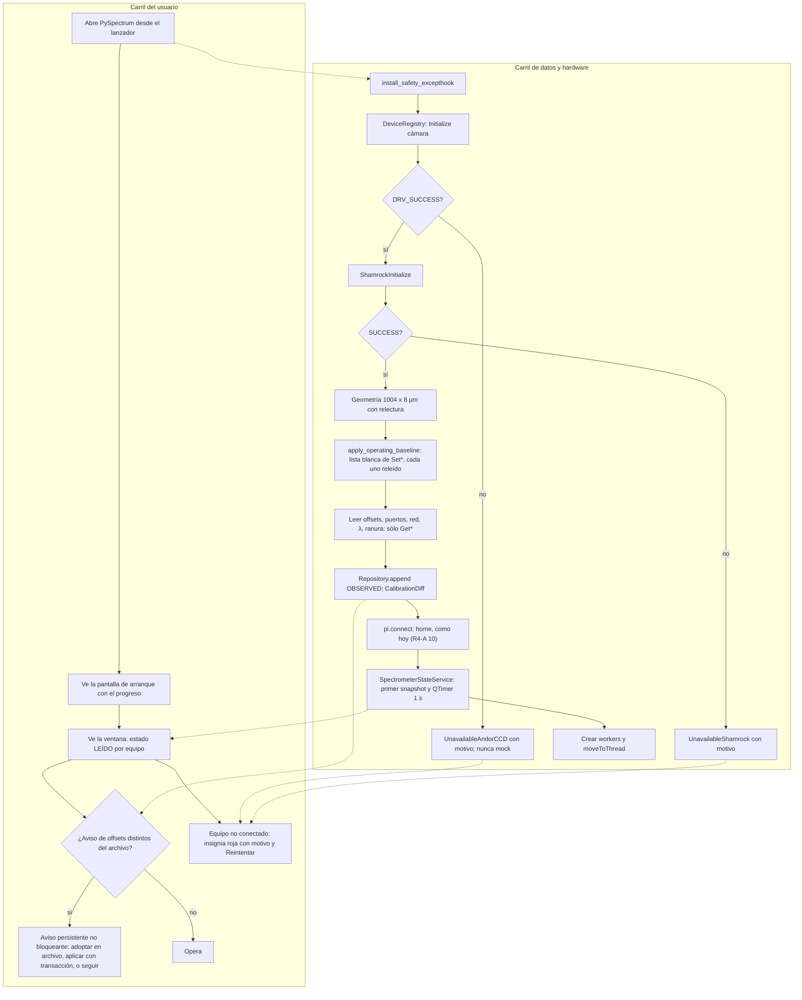
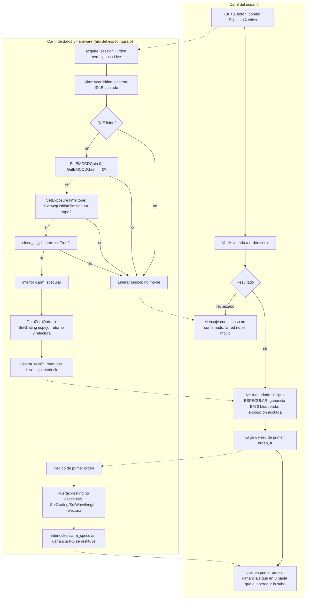
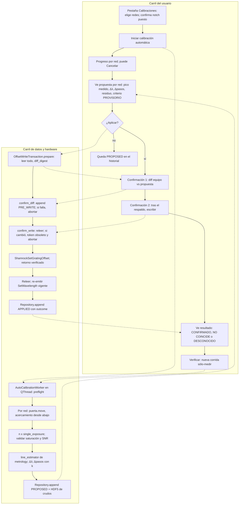
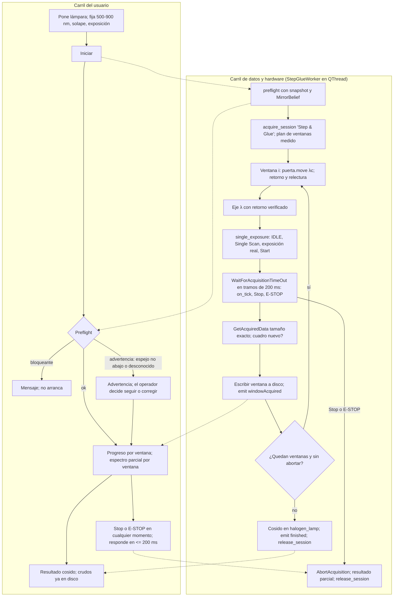

# PySpectrum 3.0, bloque A (primer arranque seguro): Ronda 2, arquitectura de software

- **Fecha:** 2026-09-28. **Agente:** `software-architect`. **Ronda:** 2 ("Engine Round", `CLAUDE.md` §5).
- **Alcance:** primer arranque seguro, orden cero, calibración de offsets (con rutina automática) y Step & Glue; convivencia en el mismo proceso con el satélite PyPrinting; eliminación del simulador silencioso.
- **Método:** Graphify primero (`graphify query` sobre orden cero y espectrógrafo; `graphify explain PySpectrumWindow`; `graphify affected` sobre `get_andor_ccd()`, `get_shamrock()`, `SpectroscopyContext` y `CalibrationBackend`); después, lectura sólo de los archivos señalados. No se ejecutó nada contra hardware y **no se escribió código de producción**: aquí hay diseño, firmas y pseudocódigo corto.
- **Entradas vinculantes:** `RESPUESTAS_INVESTIGADOR.md` §R4, §R4-A, R4-2b, R2-4, R2-5, R2-8 y §10; `DECISION_LOG.md` DEC-006, DEC-019, DEC-036, DEC-037; memoria del proyecto (sin simulador fuera de SAFE_MODE; el watchdog nunca corta una rutina sana).

## Rótulos de evidencia

| Rótulo | Significado |
| :--- | :--- |
| **[V-código]** | Verificado leyendo el código actual (archivo:línea) en esta ronda. |
| **[R1-x]** | Hallazgo de la Ronda 1 (`pyspectrum_A_ronda1/`: I = instrumentación, E = experimentalista, D = abogado del diablo), no re-verificado por mí. |
| **[V-SDK p.N]** | Andor SDK2 v2.104, citado por la Ronda 1 con página. No lo re-leí. |
| **[I]** | Inferencia mía, con el razonamiento a la vista. |
| **[SDK-confirmar]** | Nombre o semántica de una función del SDK que el diseño necesita y que nadie verificó todavía en el manual: lo confirma `instrumentation` antes de la Ronda 4. |

---

## 0. Qué se entendió (paráfrasis del encargo)

El motor tiene que garantizar, con código y no con disciplina del operador:

1. **Arranque sin escrituras de calibración.** PySpectrum 3.0 lee el equipo, fija un estado operativo base (no de calibración) con relectura, compara los offsets leídos con un archivo local y avisa. La GUI muestra lo **leído**, con su procedencia.
2. **Un único camino a la condición especular** (orden cero, red "Espejo", |λc| < W/2), automático sobre el detector y que falle cerrado; se usa seguido ("espejo rápido"), así que tiene que ser rápido y sin diálogo rutinario.
3. **Offsets escritos sólo por una transacción explícita** leer → diff → respaldo → escribir → releer, con doble confirmación, y una **rutina automática de calibración** por red (algoritmo de `metrology`; aquí: hilo, señales, estado, persistencia y cancelación).
4. **Step & Glue en un worker propio**, con una exposición real por ventana, espera acotada, latido, Stop/E-STOP efectivos, retornos verificados y advertencia si el espejo de detección no está abajo.
5. **Mismo proceso con el satélite PyPrinting** sin que uno le desconecte, reconfigure o cuelgue al otro.
6. **Sin simulador fuera de SAFE_MODE**: un equipo que no inicializa se ve como "no conectado".

---

## 1. Verificación de los hallazgos de la Ronda 1 que tocan la arquitectura

| # | Hallazgo | Veredicto | Evidencia |
| :-- | :--- | :--- | :--- |
| V1 | Cerrar el satélite desconecta la platina compartida | **Confirmado**, y es peor: además **mueve la platina a (0, 0, 0)** antes de desconectar, cierra las tareas DAQmx compartidas y pulsa el espejo de detección | [V-código] `app.py:577-602` (`close_all`: `close_all_tasks()`, `flipper_notch532("down")`, `pi.disconnect()`); `config.py` `disconnect()` hace `MOV(PI_AXES, [0,0,0])` antes de cerrar. Las tareas DAQ se recrean de forma perezosa (`core/nidaq.py` `_get_shutter_task`), así que ese punto es recuperable; la platina no, porque DEC-036 prohíbe la reconexión automática |
| V2 | PyPrinting cambia el perfil global | **Confirmado**, efecto acotado: `set_profile(..., rescan=False)` sólo cambia `active_profile`; el daño aparece en el próximo `rescan_hardware()` (tablero), que marca la Andor y el Shamrock "desconectados por perfil" aunque estén en uso | [V-código] `app.py:429`, `core/hardware_manager.py:74-80, 336-363` |
| V3 | Cerrar PySpectrum con el satélite abierto cuelga | **Confirmado por lectura** (deadlock determinista, no probabilístico) | [V-código] `window.py:811-816`: primero `quit()`+`wait()` de los tres hilos del satélite y **después** `satellite.close()`. Eso abre **un segundo diálogo modal** ("¿Cerrar PyPrinting?", `app.py:281-288`); con "Sí", `closeSignal` → `Backend.close_all` (vive en el hilo GUI, conexión directa) → `invokeMethod(cameraWorker, BlockingQueuedConnection)` (`app.py:596`) sobre un objeto cuyo hilo ya terminó: el evento se encola en un hilo sin event loop y el hilo GUI espera para siempre [I, semántica documentada de `BlockingQueuedConnection`]. Con "No", PySpectrum sigue cerrando con el satélite vivo pero sin hilos. Los obturadores ya se cerraron al principio (`hardware_session.emergency_stop()`, `window.py:777`), así que el cuelgue no deja láser abierto; sí impide el cierre del proceso |
| V4 | El latido del watchdog es global al proceso | **Confirmado** | [V-código] `core/nidaq.py:204-216`: un único `_watchdog_deadline` de módulo |
| V5 | El tablero reinicia cámara y Shamrock | **Confirmado**, y deja **referencias colgadas** | [V-código] `modules/hardware_dashboard.py:95` → `rescan_hardware()` → `connect_device` → `get_shamrock(reset=True)` / `get_andor_ccd(reset=True)` (`core/hardware_manager.py:223, 247`) → `close()` de la instancia vieja (`ShutDown` / `ShamrockClose`) y una instancia nueva. `PySpectrumWindow` y **todos** los backends conservan la instancia vieja, ya cerrada (`window.py:471-472`, repartida en `:592-640`). Además el `ShutDown` apaga el enfriador (`SetCoolerMode(0)` en `andor_ccd_driver.py:400`) |
| V6 | Simulador silencioso fuera de SAFE_MODE | **Confirmado** | [V-código] `andor_ccd_driver.py:743-750`, `shamrock_driver.py:780-787`; y `andor_ccd_driver.py:378-379` si falta la DLL |
| V7 | Step & Glue corre en el hilo GUI y lee sin adquirir | **Confirmado** | [V-código] `window.py:605-606` (sin `moveToThread`); `step_and_glue.py:572-584` (sin `StartAcquisition` ni espera); `:413-429` (`heartbeat_shutter(30.0)`, retorno de `SetWavelength` ignorado) |
| V8 | **Nuevo:** el escaneo lineal **no** reutiliza Step & Glue; tiene su propia copia del bucle, que duerme `exp + margen` y lee el último cuadro | **Confirmado** | [V-código] `linescan_spectroscopy.py:685-714` (`_sleep_with_heartbeat` + `get_1d_spectrum()`, sin `StartAcquisition`); sólo comparte `measured_window_nm` y `compute_step_centers`. Cose con `glue_steps`, mientras Step & Glue usa `sigmoidal_step_and_glue`: **dos cosidos distintos** para "el mismo" Step & Glue. Es exactamente la trampa "herramientas duplicadas divergen" (R1-6, R2-7) |
| V9 | **Nuevo:** el cierre de PySpectrum nunca llama a `ShutDown` ni a `ShamrockClose` | **Confirmado** | [V-código] `window.py:770-821`. Un arranque siguiente puede encontrar la cámara tomada si el proceso no terminó limpio [R1-D F11] |
| V10 | **Nuevo:** cargar o "recargar" un archivo de calibración **escribe** al equipo, no sólo el constructor | **Confirmado** | [V-código] `calibration_dock.py:1010-1017` está dentro de `load_calibration_from_txt`, conectado a `loadCalibrationTxtSignal` y `reloadLastCalibrationSignal` (`:659-660`). Cualquier "Cargar" es una escritura de offsets sin confirmación |
| V11 | **Nuevo:** abrir el satélite llama a `pi.connect()` | **Confirmado** | [V-código] `app.py:430` dentro de `Backend.__init__`. Con la platina sana es inocuo (`config.py:374-379`); con el interlock "Platina PI" disparado **hace home y libera el interlock** sin que el operador lo pida (conflicto con DEC-036). El home al abrir **PySpectrum** lo mantuvo el investigador (R4-A 10); el del satélite no está pedido |
| V12 | **Nuevo:** la E-STOP no baja la ganancia EM y toma la cámara con `get_andor_ccd()` | **Confirmado** | [V-código] `hardware_session.py:152-158`. Tras un reset del tablero (V5) aborta la instancia nueva, no la que usan las rutinas |

**Consecuencia de diseño.** V5, V9 y V12 tienen la misma raíz: **nadie es dueño de las instancias de los drivers**. Un *factory* con `reset=True` las destruye mientras otros las usan. El diseño de §2 introduce un dueño único (registro de dispositivos) y hace que los consumidores guarden una referencia estable al registro, no al driver.

---

## 2. Topología propuesta

### 2.1 Principios

1. **El motor no sabe de Qt.** Todo lo que decide seguridad o escribe al equipo vive en módulos sin PyQt6 (`pyspectrum/engine/`), testeables sin `QApplication` y usables desde un script de banco. Los `QObject` son cáscaras finas que eligen el hilo y traducen resultados a señales (checklist §3.3 de mi rol).
2. **Un solo dueño por recurso** (§2.2). Nadie más crea, reinicia ni cierra un driver.
3. **Una sola puerta por acción peligrosa**: movimientos del espectrógrafo (orden cero incluido), ganancia EM, escritura de offsets. Los widgets y las rutinas llaman a la puerta; la puerta llama al driver.
4. **Una sola implementación de cada rutina de hardware**: la exposición única y el bucle de Step & Glue se escriben una vez y los usan Step & Glue, el escaneo lineal, la calibración automática y, después del bloque A, Raman y luminiscencia (R4-5).
5. **Estado leído con procedencia**: cada valor mostrado lleva `READ_OK`, `READ_FAILED(código)` o `NOT_READ`, y la hora de lectura. Un valor viejo nunca se muestra como leído.
6. **Toda espera acotada**, en tramos, consultando `hardware_session.is_emergency_stopped` entre tramos (DEC-006), con el latido inyectado como `on_tick` (el mecanismo de R2-8 no se diseña aquí: queda para la tanda b1).

### 2.2 Componentes nuevos o modificados

| Componente | Tipo | Hilo | Ubicación propuesta | Responsabilidad |
| :--- | :--- | :--- | :--- | :--- |
| `DeviceRegistry` | nuevo, `QObject` delgado sobre estado sin Qt | GUI (sólo estado; sus llamadas al driver son cortas) | `pyspectrum/engine/device_registry.py` | **Dueño único** de las instancias `AndorCCDDriver` y `ShamrockDriver`. Estado por equipo: `CONNECTED`, `NOT_CONNECTED(code, reason)`, `SIMULATED` (sólo SAFE_MODE/tests). `reconnect(dev)` explícito y rechazado si hay una sesión activa. Reemplaza a `get_*(reset=True)` |
| `DeviceRef` | nuevo | cualquiera | ídem | Referencia estable que guardan los consumidores (`ref.driver`, `ref.status`). Tras un `reconnect` todos ven la instancia nueva; nadie queda con una cerrada (V5) |
| `UnavailableAndorCCD` / `UnavailableShamrock` | nuevos (análogo de `_UnavailableNITask`, DEC-036) | — | en cada driver | Lo que el registro entrega cuando el equipo no inicializa fuera de SAFE_MODE: **ningún dato sintético**; setters devuelven `NOT_INITIALIZED`; getters `(código, None)`; adquisición → `AcquisitionFailure` (§4) |
| `SpectrometerStateService` | nuevo, `QObject` | GUI; sondeo con `QTimer` de 1 s | `pyspectrum/services/spectrometer_state.py` | **Única fuente de verdad leída**: publica `SpectrometerSnapshot` inmutable (cámara + Shamrock + espejo de detección). Reemplaza el sondeo directo del panel izquierdo (`left_hardware_panel.py:331-343`) y la posición que hoy escribe cualquiera en `spectroscopy_context`. Mientras una rutina tiene la sesión, no sondea el Shamrock (la rutina publica lo que lee con `publish_reading`) |
| `apply_operating_baseline()` | nuevo, función pura | el que llama (arranque: GUI, antes de mostrar la ventana) | `pyspectrum/engine/baseline.py` | Fija el estado operativo base con relectura (§6.2): modo de adquisición y de lectura, VS speed, ventilador, enfriador a −60 °C, ganancia EM 0, puertos. **Lista blanca** de `Set*` permitidos al arrancar; nada de calibración |
| `SpecularInterlock` | nuevo, sin Qt, thread-safe (`RLock`) | compartido | `pyspectrum/drivers/specular_interlock.py` | Red de seguridad mínima **dentro de los drivers** (opción 2 de R1-I §5.5): el Shamrock rechaza un movimiento a condición especular sin la precondición del detector confirmada; la cámara rechaza `SetEMCCDGain(g > 0)` mientras la condición especular está activa. Un objeto de estado compartido evita acoplar un driver al otro |
| `SpectrographMotionEngine` | nuevo, sin Qt | el del llamador | `pyspectrum/engine/spectrograph_motion.py` | **La puerta**: `move(target)` para λ, red y orden cero. Clasifica el destino (especular o no), aplica la secuencia protegida, verifica retornos y relee. Lo usan el servicio de orden cero y las rutinas |
| `SpectrographWorker` | nuevo, `QObject` en `QThread` propio | "hilo del espectrógrafo" | `pyspectrum/services/spectrograph_worker.py` | Serializa los movimientos **manuales** (panel izquierdo, Ctrl+0, combo "Espejo", dock, diálogo de compatibilidad). Un cambio de red puede tardar segundos (espera de 4 s del driver, BANCO-39), así que no va en el hilo GUI (criterio del exemplar de concurrencia). Rechaza órdenes mientras una rutina tiene la sesión |
| `ZeroOrderService` | nuevo, fachada fina sobre el worker | GUI (API) → hilo del espectrógrafo | ídem | "Espejo rápido": `enter_specular()` / `leave_specular(λ, red)`. Pausa el Live, llama a la puerta, reanuda el Live con ganancia bloqueada en 0. **Sin diálogo** (R4-A 3) |
| `single_exposure()` | nuevo, función pura | el del llamador | `pyspectrum/engine/single_exposure.py` | Una exposición real: verificar IDLE → modo Single Scan → exposición → leer exposición real → `StartAcquisition` → espera en tramos → leer con tamaño exacto → verificar cuadro nuevo. Nunca ceros de relleno (R4-5) |
| `StepGlueEngine` | nuevo, sin Qt (Strangler Fig sobre `step_and_glue.Backend`) | el del llamador | `pyspectrum/engine/step_glue.py` | Plan de ventanas (reusa `compute_step_centers`/`measured_window_nm`) y bucle por ventana (`SpectrographMotionEngine.move` + `single_exposure`). Devuelve `StepGlueResult` con los crudos. El cosido queda donde está (`halogen_lamp.py`) |
| `StepGlueWorker` | nuevo, `QObject` en `QThread` | hilo propio | `pyspectrum/modules/step_and_glue.py` (reemplaza la parte de adquisición de `Backend`) | Cáscara del motor: señales de progreso, resultado, error; Stop por bandera thread-safe; E-STOP por `is_emergency_stopped` |
| `LineScanSpectroscopyWorker` | modificado | su `QThread` (DEC-006) | `linescan_spectroscopy.py` | Borra su copia del bucle (`_acquire_glued_spectrum`, `_acquire_glued_2d`, `_settle_wavelength`, `_sleep_with_heartbeat`) y llama a `StepGlueEngine.run_windows`. El cosido común se decide con paridad numérica (§7.4) |
| `CalibrationRepository` | nuevo, sin Qt | cualquiera (escritura con lock de archivo) | `pyspectrum/calibration/repository.py` | Archivo **local a la PC, fuera de git**, append-only, con historial (§2.5) |
| `OffsetWriteTransaction` | nuevo, sin Qt, máquina de estados | hilo del espectrógrafo | `pyspectrum/engine/offset_transaction.py` | Leer → diff → confirmación 1 → respaldo → confirmación 2 → escribir → releer. Única ruta de `ShamrockSet*Offset` y `SetSlitZeroPosition` (§2.6) |
| `AutoCalibrationEngine` + `AutoCalibrationWorker` | nuevos | `QThread` propio | `pyspectrum/engine/auto_calibration.py`, `pyspectrum/modules/calibration_dock.py` | Rutina automática por red (R4-A 1). El estimador de centro de línea es un `Callable` que entrega `metrology`. Propone; escribir va por la transacción (§2.7) |
| `CalibrationBackend` | modificado | GUI | `calibration_dock.py` | Se queda con la vista: sin escrituras en el constructor ni en "Cargar" (V10); los setters directos (`:737-779`) se reemplazan por pedidos a la transacción |
| `LeftHardwarePanel` | modificado | GUI | `ui/left_hardware_panel.py` | Muestra el `SpectrometerSnapshot` (lo leído) y envía pedidos a `SpectrographWorker`/`ZeroOrderService`; deja de llamar a los drivers directamente |
| `SpectrumBackend` (legado) | modificado | GUI | `spectrum_control.py` | Su salvaguarda (`:249-270`, falla abierta) se borra; delega a la puerta. Su `update_calibration` deja de devolver un eje falso |
| `ZeroOrderSafetyDialog` | retirado | — | `ui/zero_order_dialog.py` | Reemplazado por el servicio automático (R4-A 3). Su "Override experto" desaparece (ver pregunta Q-A en §8) |
| `HardwareSessionManager` | modificado | GUI + lecturas thread-safe | `hardware_session.py` | E-STOP también fuerza ganancia EM 0 a través de la puerta y usa `DeviceRef` (V12). Agrega `session_owner_token` para que el worker que libera sea el que tomó |
| `HardwareManager` / tablero | modificado | GUI | `core/hardware_manager.py`, `modules/hardware_dashboard.py` | En un proceso con registro, Andor y Shamrock **no se reinician** al abrir el tablero: se lee el estado del registro. "Reconectar" es un botón explícito, rechazado con sesión activa (§4.3) |
| `app.Backend` / `create_app_satellite` | modificado | — | `app.py` | Modo **hospedado**: sin `set_profile`, sin `pi.connect`, cierre sin `pi.disconnect`/`close_all_tasks`/pulso del espejo (§3) |

> *Ubicación de `engine/`.* El rol pide que el motor sea "headless-CLI-capable". Propongo `pyspectrum/engine/` y no `core/` porque todo esto depende de los drivers de `pyspectrum/drivers/`; `core/` hoy no importa de `pyspectrum/` y conviene no invertir esa dirección. Si el investigador prefiere `core/`, sólo cambian los imports.

### 2.3 Hilos

| Hilo | Qué corre | Qué **no** corre |
| :--- | :--- | :--- |
| GUI | widgets, `SpectrometerStateService` (lecturas de ≤ ms), `DeviceRegistry`, `CalibrationRepository` (append de una línea), arranque (`apply_operating_baseline` antes de `show()`) | nada que espere un motor o una exposición |
| Espectrógrafo | `SpectrographWorker`: movimientos manuales, `ZeroOrderService`, `OffsetWriteTransaction` | adquisiciones largas |
| Exploración (existente) | Live View | movimientos (se pausa vía sesión antes de cualquiera) |
| Step & Glue (nuevo) | `StepGlueWorker` | — |
| Calibración automática (nuevo) | `AutoCalibrationWorker` | la escritura de offsets (se delega a la transacción, que pide las confirmaciones en el hilo GUI) |
| Escaneo lineal, confocal (existentes) | sin cambios de topología | — |

**Concurrencia sobre la DLL.** El Live de Exploración, el sondeo de estado y los workers llaman a la misma DLL desde hilos distintos. Hoy el `RLock` del driver Andor cubre algunos métodos y otros no (`start_acquisition`, `get_most_recent_image`, `get_status` van sin lock, [V-código] `andor_ccd_driver.py:510-611`). Propuesta:
- **todos** los métodos del driver toman el `RLock`;
- la espera de fin de exposición **no** lo retiene durante todo el tramo: `WaitForAcquisitionTimeOut` en tramos de ≤ 200 ms, cada tramo con el lock tomado sólo mientras dura la llamada, para que `GetTemperature` del sondeo no espere una exposición de 10 s [I; que `GetTemperature` sea válido durante una adquisición es **[SDK-confirmar]**];
- la exclusión de *uso* (quién adquiere) la da `hardware_session`, no el lock: el lock sólo evita llamadas simultáneas a la DLL.

### 2.4 Estado leído: `SpectrometerSnapshot`

Contrato inmutable entre el servicio de estado y cualquier consumidor (panel, pestañas, metadatos de archivo):

```python
class ReadStatus(Enum): READ_OK; READ_FAILED; NOT_READ; NOT_CONNECTED

@dataclass(frozen=True)
class Reading(Generic[T]):
    value: T | None          # None salvo READ_OK
    status: ReadStatus
    code: int | None         # código crudo del SDK
    t_read: float | None     # time.monotonic() de la lectura

@dataclass(frozen=True)
class CameraState:
    connection: DeviceStatus
    temperature_c: Reading[float]; temperature_status: Reading[int]   # DRV_TEMP_* crudo
    cooler_on: Reading[bool]                                          # IsCoolerOn [SDK-confirmar]
    em_gain: Reading[int]; em_gain_mode: Reading[int]
    exposure_s_actual: Reading[float]                                 # de GetAcquisitionTimings
    read_mode: Reading[int]; acquisition_mode: Reading[int]; vs_speed_us: Reading[float]
    fan_mode: Reading[int] | None      # sin getter de ventilador en el SDK [SDK-confirmar]: se muestra "fijado", no "leído"
    acquiring: Reading[bool]

@dataclass(frozen=True)
class SpectrographState:
    connection: DeviceStatus
    serial: Reading[str]
    grating: Reading[int]; grating_lines_per_mm: Reading[float]
    wavelength_nm: Reading[float]
    at_zero_order: Reading[bool]                     # ShamrockAtZeroOrder [R1-I §3.2-4]
    specular: SpecularCondition                      # derivado: red espejo, |λc| < W/2 + margen, o at_zero_order
    grating_offsets: Mapping[int, Reading[int]]
    detector_offset: Reading[int]
    ports: Reading[tuple[int, int]]                  # ShamrockGetFlipperMirror, no la función inexistente (C-07)
    slit_width_um: Reading[float]                    # ShamrockGetAutoSlitWidth (C-06)
    geometry: Reading[tuple[int, float]]             # 1004 px x 8 µm, verificado

@dataclass(frozen=True)
class SpectrometerSnapshot:
    camera: CameraState
    spectrograph: SpectrographState
    detection_mirror: MirrorBelief                   # §2.10
    calibration_diff: CalibrationDiff | None         # equipo vs archivo (§2.5)
    seq: int                                         # monotónico
```

- Señales: `SpectrometerStateService.snapshotChanged(object)`, `specularChanged(bool)`, `calibrationMismatch(object)`.
- **Regla de presentación:** la GUI pinta cada campo según `status`. `READ_FAILED` o `NOT_READ` se ve como tal ("—" y el motivo), nunca con el valor del widget. El botón "Enfriador: ON" deja de ser un estado inicial del widget y pasa a reflejar `cooler_on`.
- `spectroscopy_context` conserva su papel de bus de la UI (ROI, colormap, subyugación). Sus campos de hardware (`wavelength_nm`, `grating`, `read_mode`, `slit_*`) pasan a alimentarse **sólo** desde el servicio; los consumidores dejan de llamar a esos setters (`left_hardware_panel.py:309-343`, `calibration_dock.py:686-690`).

### 2.5 `CalibrationRepository`: archivo local con historial

- **Ubicación:** fuera del repositorio. Default `%LOCALAPPDATA%\PyPrinting\pyspectrum\shamrock_calibration.jsonl`, sobreescribible con `config.SHAMROCK_CALIBRATION_PATH`. El constructor **rechaza** una ruta dentro del árbol de git (test). En el repo queda sólo una plantilla y el esquema, sin valores que parezcan reales. El archivo actual `pyspectrum/calibration/pyspectrum_calibration_last.txt` (offsets inventados, "CALIBRADO_VALIDADO" falso) se archiva como "desconocido" (§11 de las respuestas del investigador), no se migra.
- **Formato:** JSON Lines, append-only, una entrada por evento, con `schema_version`. Append con `flush` y `os.fsync`; lock de archivo contra dos escritores. Nunca se reescribe una línea: la corrección de un error es otra línea.
- **Clave:** `(shamrock_serial, grating_index, grating_lines_per_mm, entrance_port, exit_port)`. El número de líneas se lee con `ShamrockGetGratingInfo`, así que un orden distinto en la torreta no aplica un offset a la red equivocada (R1-D S3.3).
- **Tipos de entrada:**

| `kind` | Cuándo | Campos propios |
| :--- | :--- | :--- |
| `OBSERVED` | cada arranque, al leer el equipo | valores leídos por red y detector, con sus códigos |
| `MANUAL_ENTRY` | carga de un valor del investigador (p. ej. 150 l/mm = 85, leído en Solis) | `provenance: EXPERIMENTAL`, `source`, geometría con que se midió si se conoce (1002 o 1004 px, BANCO-14) |
| `PROPOSED` | resultado de la calibración automática | valor propuesto, residuo, λ de referencia, n cuadros, criterio de aceptación **provisorio** (R4-A 9), ruta de los crudos |
| `PRE_WRITE` | paso "respaldo" de la transacción | valores leídos justo antes de escribir |
| `APPLIED` | después de escribir y releer | escrito, releído, `outcome: CONFIRMED / MISMATCH / WRITE_FAILED / READBACK_FAILED` |

- Campos comunes: `ts` (ISO 8601 con zona), `operator` (usuario de Windows), `software` (commit), `method`, `note`.
- **Estado de referencia** = el `APPLIED(CONFIRMED)` más reciente por clave, o si no hay, el `MANUAL_ENTRY` más reciente. `CalibrationDiff` lo compara con el `OBSERVED` del arranque. El detector se compara contra 0 por convención (R4-A 2).
- **Al arrancar:** leer → registrar `OBSERVED` → comparar → si difiere, `calibrationMismatch`; la GUI muestra un aviso persistente no bloqueante (forma: Ronda 3). **Nunca se escribe.**

```python
class CalibrationRepository:
    def __init__(self, path: Path): ...                     # ValueError si path está dentro del repo
    def append(self, entry: CalibrationEntry) -> None: ...  # OSError se propaga: sin registro no hay escritura
    def reference_state(self, key: CalibrationKey) -> ReferenceValue | None: ...
    def history(self, key: CalibrationKey | None = None) -> list[CalibrationEntry]: ...
```

### 2.6 `OffsetWriteTransaction`: la única escritura de offsets

Máquina de estados sin Qt; el diálogo de la Ronda 3 sólo la conduce.

```
IDLE → READ → DIFF_READY --confirm_diff(token1)--> BACKED_UP --confirm_write(token2)--> WRITTEN → VERIFIED
         |          |                                   |                                   |
    READ_FAILED  CANCELLED                    BACKUP_FAILED (no escribe)            MISMATCH / UNKNOWN
```

- `prepare(targets) -> OffsetDiff`: lee **todos** los offsets en juego, arma el diff y un `diff_digest` (hash del estado leído y del destino).
- `confirm_diff(token)` — **primera confirmación**; el token lleva el `diff_digest`. Registra `PRE_WRITE`; si el append falla, aborta sin escribir.
- `confirm_write(token)` — **segunda confirmación**. Antes de escribir **vuelve a leer**; si el equipo cambió desde `prepare`, el token queda obsoleto y aborta: nadie escribe sobre un estado que el operador no vio.
- Escribe verificando el retorno de cada `Set*`, relee y registra `APPLIED`.
- Precondiciones: sesión tomada como `"Calibración — escritura"`, cámara IDLE, sin E-STOP. Corre en el hilo del espectrógrafo.
- Tras escribir un offset de red **re-emite `SetWavelength` a la λc vigente**, porque no sabemos si `SetGratingOffset` mueve el motor o sólo cambia el cálculo [R1-I §3.2-2, BANCO-40]. Es inocuo si no hacía falta.
- Errores: `WRITE_FAILED` en un offset deja los siguientes sin escribir y se informa "estado parcial, releído: …". `READBACK_FAILED` deja el campo "desconocido" en el snapshot hasta la próxima lectura exitosa.
- **Todos** los caminos que hoy escriben (constructor y "Cargar" del dock, V10; setters directos `calibration_dock.py:737-779`) pasan por aquí o desaparecen. Test de arquitectura: ningún módulo fuera de `offset_transaction.py` llama a `ShamrockSet*Offset` ni a `ShamrockSetSlitZeroPosition` (búsqueda en el AST).

### 2.7 Calibración automática por red

El algoritmo (estimador del centro, criterio de aceptación, cuántas λc) es de `metrology`. La arquitectura lo recibe como un `Callable` y aporta hilo, estado, persistencia y cancelación.

```python
@dataclass(frozen=True)
class AutoCalibrationPlan:
    gratings: tuple[int, ...]                      # p. ej. (1, 2)
    reference_nm: float                            # 532 nominal; λ real del láser a confirmar (R4-A 8)
    centers_nm: Mapping[int, tuple[float, ...]]    # λc por red; metrology decide cuántas
    exposure_s: float; n_frames: int
    approach_from_below_nm: float                  # acercamiento siempre desde abajo (R1-E)
    line_estimator: Callable[[NDArray, NDArray], LineEstimate]   # de metrology
    acceptance: AcceptanceCriterion                # provisorio (R4-A 9)
    steps_per_nm: Mapping[int, float] | None       # k de BANCO-40; None = desconocido

class AutoCalibrationEngine:
    def run(self, plan, *, cam: DeviceRef, spec: DeviceRef, motion: SpectrographMotionEngine,
            should_abort: Callable[[], bool], on_tick: Callable[[], None],
            on_progress: Callable[[CalibrationProgress], None]) -> AutoCalibrationResult: ...
```

- **Hilo:** `AutoCalibrationWorker` en `QThread` propio (cada red: movimiento más n exposiciones).
- **Preflight.** Bloqueantes: cámara o Shamrock no conectados; ganancia EM distinta de 0 leída; geometría no verificada. Advertencias: espejo de detección no "abajo" según el software (§2.10). El notch puesto es un supuesto del método (R4-A 1) que el software no puede leer: se le pregunta al operador en la GUI de la Ronda 3.
- **Por red:** mover (puerta) → n × `single_exposure` → validación del cuadro (no saturado, SNR mínima; umbrales de `metrology`) → estimador → `LineEstimate(px, σ_px, λ_eje(px), residuo)` → `Δλ`.
- **Salida:** una entrada `PROPOSED` por red, con los crudos en un HDF5 de calibración junto al repositorio. **No escribe.** Con `k` conocido propone `Δpasos = round(Δλ · k)`; sin `k`, la propuesta queda en nm y la escritura no se ofrece.
- **Cierre del lazo:** "Aplicar" abre la transacción de §2.6. Después de `VERIFIED`, "Verificar" corre la rutina otra vez en modo sólo-medir, que debe caer en la tolerancia provisoria.
- **Cancelación:** `threading.Event` más `is_emergency_stopped`, consultadas entre tramos; al cancelar, `AbortAcquisition`, y la red queda donde esté.
- **Riesgo abierto (Q1, §8):** la práctica en Solis es **iterativa**. Un lazo automático iterativo escribiría varias veces; con doble confirmación por escritura sería inusable, y sin ella viola R4-A 5.

### 2.8 Orden cero y condición especular: un único camino

**Condición especular** (se deriva en el motor, no en la GUI): la red es el espejo (índice identificado con `GetGratingInfo`, no el literal 3), o `|λc| < W(red)/2 + margen`, o `ShamrockAtZeroOrder == 1`. `W(red)` es la ventana medida; si no se puede medir, la nominal (`nominal_window_nm`). El margen lo fija BANCO-42.

**Secuencia de la puerta** (`SpectrographMotionEngine.move(target)`), en pseudocódigo:

```python
def move(self, target, *, should_abort, on_tick) -> MotionResult:
    dst_specular = self.classify(target).specular
    if dst_specular:
        # precondición del detector: cada paso confirmado o no se mueve (falla cerrado)
        cam.abort_acquisition(); require(wait_idle(cam, IDLE_TIMEOUT_S))           # IDLE leído, no supuesto
        cam.set_emccd_gain(0);   require(cam.get_emccd_gain() == (DRV_SUCCESS, 0))
        cam.set_exposure_time(SPECULAR_MAX_EXPOSURE_S)
        require(actual_exposure(cam) <= SPECULAR_MAX_EXPOSURE_S)                    # GetAcquisitionTimings
        require(close_all_shutters() is True)                                       # DEC-036
        interlock.arm_specular()          # desde acá la cámara rechaza EM > 0 y exposición > tope
    require(spec.set_target(target) == SHAMROCK_SUCCESS)
    require(readback_matches(spec, target))                                         # GetGrating / GetWavelength
    if not dst_specular and interlock.specular_armed:
        interlock.disarm_specular()       # la ganancia NO vuelve sola: la sube el operador
    return MotionResult(...)
```

- Si un `require` falla, no se mueve, el interlock queda como estaba y el resultado dice qué no se confirmó ("ganancia leída 12, no 0"; "cierre del obturador 532 no confirmado"). Una lectura fallida de la ganancia es "ganancia desconocida", nunca 0.
- **Red de seguridad dentro de los drivers** (`SpecularInterlock`): `set_grating`, `set_wavelength` y `goto_zero_order` del Shamrock preguntan `interlock.authorize_move(dst_specular)` con una clasificación conservadora (red espejo, λ < W_nominal/2 + margen, orden cero). Si no está armado, devuelven un código propio `SPECULAR_INTERLOCK_REFUSED` sin llamar a la DLL. `set_emccd_gain(g > 0)` y `set_exposure_time(t > tope)` de la cámara, con la condición especular activa, devuelven `EM_GAIN_INTERLOCK_REFUSED`. Es la misma idea que el recorte de la platina dentro de `MOV` (DEC-011): nada lo esquiva, ni una rutina nueva ni un script.
- **"Espejo rápido"** (R4-A 3): `ZeroOrderService.enter_specular()` = tomar la sesión `"Orden cero"` (pausa el Live) → puerta → liberar → reanudar el Live que corría, ahora bajo el interlock. No hay diálogo; la única espera es la del motor. `leave_specular(λ, red)` = puerta hacia el primer orden. Ctrl+0, el botón del panel, el combo "Espejo", el campo λ y el dock llaman **todos** a la puerta a través del worker. Se borran `spectrum_control._apply_zero_order_detector_safeguard` (falla abierta), `CalibrationBackend.goto_zero_order`, `ZeroOrderSafetyDialog` y los `ShamrockSet*` directos del panel.
- **E-STOP:** además de lo actual, `set_emccd_gain(0)` con el retorno registrado y el interlock en "sólo ganancia 0" hasta el rearme (V12).
- El tope de exposición en especular es un parámetro físico que fijan `experimentalist` e `instrumentation`; vive en `config.py`.

### 2.9 Step & Glue en worker propio

```python
@dataclass(frozen=True)
class StepGlueRequest:
    start_nm: float; end_nm: float; overlap_frac: float     # 0 < overlap < 1
    exposure_s: float                                        # 1e-4 ≤ t ≤ config.MAX_ROUTINE_EXPOSURE_S (10 s, R4-4)
    read_mode: ReadMode                                      # del snapshot, no del literal (C-05)
    use_optical_core: bool
    background: BackgroundPolicy                             # hoy, un solo cuadro para todas las ventanas (R1)
    normalize_with_lamp: bool; lamp_file: Path | None        # sin archivo → error, nunca cuerpo negro sintético
    check_water: bool

@dataclass(frozen=True)
class WindowResult:
    index: int; center_nm_requested: float; center_nm_read: float
    wavelength_axis: NDArray[np.float64]; axis_source: AxisSource   # GetCalibration o cúbico, registrado
    data: NDArray[np.float64]; exposure_s_actual: float; frame_id: int
    t_start: float; t_end: float

@dataclass(frozen=True)
class StepGlueResult:
    windows: tuple[WindowResult, ...]; complete: bool
    stop_reason: StopReason     # COMPLETED, USER_STOP, ESTOP, MOTION_FAILED, ACQUISITION_FAILED, DEVICE_LOST
    plan: StepGluePlan; snapshot_at_start: SpectrometerSnapshot; warnings: tuple[str, ...]
```

- **Worker:** `StepGlueWorker(QObject)` movido a un `QThread` en `window.py`, con el patrón de `create_linescan_routine`. Señales: `progress(int, int, float)`, `windowAcquired(object)` (un `WindowResult` por ventana, nunca por tramo: DEC-013), `finished(object)`, `failed(str)`. Slots: `start(object)` con el `StepGlueRequest`, `request_stop()`.
- **Preflight** (`StepGlueEngine.preflight(request, snapshot) -> PreflightReport(blockers, warnings)`):
  - bloqueantes: cámara o Shamrock no conectados; geometría no verificada; exposición fuera de rango; rango fuera de los límites de la red (`GetWavelengthLimits`); alguna ventana planificada en condición especular; normalización pedida sin archivo de lámpara;
  - advertencias: **espejo de detección no "abajo"** según el software (R4-A 4), o "desconocido"; offsets del equipo distintos del archivo; calibración con procedencia EXPERIMENTAL.
  - La forma de la advertencia la decide la Ronda 3; el motor sólo la entrega.
- **Bucle por ventana:** `motion.move(λc)` (retorno y relectura) → eje λ en esa posición con el retorno verificado (si falla, `MOTION_FAILED`; nunca el eje falso 400-700) → `single_exposure` → `windowAcquired`. Entre sub-pasos, `should_abort()`.
- **Stop:** `threading.Event` y además `cam.abort_acquisition()` desde el hilo GUI (el SDK admite `AbortAcquisition`/`CancelWait` desde otro hilo, [V-SDK p.326-329] según R1-I). El worker lo ve en el tramo siguiente (≤ 200 ms). **E-STOP:** `is_emergency_stopped` en cada tramo.
- **Datos parciales:** con Stop o falla se entrega lo adquirido con `complete=False`, y cada ventana se escribe a disco al terminar (hoy quedan en memoria hasta "Exportar", R1-I §1.5-5).
- **Latido:** con lámpara no abre obturadores DAQ. `on_tick` se inyecta; qué hace ese latido cuando la rutina no tiene obturadores abiertos es Q2 (§8). En ningún caso lleva argumento (C-29).
- **Escaneo lineal:** su worker llama a `StepGlueEngine.run_windows(centers, …)` por punto espacial, con la misma `single_exposure`; se borra su copia (V8).

### 2.10 Espejo de detección: lo que Step & Glue necesita de C-08

El espejo es un conmutador sin realimentación (R2-4, R2-5). Step & Glue sólo **lee** una creencia; persistirla y resincronizarla es de `instrumentation` (C-08). Interfaz mínima, en `core/nidaq.py`:

```python
@dataclass(frozen=True)
class MirrorBelief:
    position: Literal["up", "down", "unknown"]
    source: Literal["persisted", "commanded", "resynced", "none"]
    since: datetime | None

def get_detection_mirror_belief() -> MirrorBelief: ...
```

- Si C-08 no está hecho cuando llega Step & Glue, `position = "unknown"` y la advertencia dice que el software no sabe dónde está el espejo.
- Cerrar el satélite **no** pulsa el espejo (§3).

### 2.11 Impacto en el AST (Graphify)

- `graphify affected "get_andor_ccd()"` y `"get_shamrock()"`: 15 módulos de producción (`hardware_manager`, `calibration_dock`, `camera_andor`, `hardware_session`, `hyperspectral_confocal`, `dimers`, `growth_kinetics`, `linescan_spectroscopy`, `luminescence`, `spectrum_control`, `static_raman`, `step_and_glue`, `exploration_tab`, `window`, `drivers/__init__`) y los tests de rutinas. **Migración sin Big Bang:** el factory sigue existiendo y devuelve `registry.ref(dev).driver`; sólo desaparece `reset=True`, que pasa a ser `registry.reconnect(dev)`. Ningún constructor cambia de firma en el bloque A.
- `PySpectrumWindow` tiene grado 111: es un nodo dios. El bloque A no debe hacerlo crecer. La construcción de servicios y workers sale a `build_pyspectrum_services(registry) -> PySpectrumServices`, y el cierre a un `ShutdownCoordinator` (§3.3); `window.py` sólo conecta.
- `graphify affected SpectroscopyContext`: impacto chico (el panel y `test_pyspectrum_shell_and_panel.py`).
- `graphify affected CalibrationBackend`: `window.py` y siete archivos de test. Algunos probablemente **codifican el defecto** (p. ej. `TestShamrockSDKOffsets` de `test_pyspectrum_calibration_and_fixes.py`, a revisar en la Ronda 4). Si un test exige que "Cargar" escriba offsets, se reescribe, como se hizo en DEC-036 con los tests de reconexión.
- Sin ciclos nuevos: `engine/` importa de `drivers/` y `core/nidaq`; `services/` y `modules/` importan de `engine/`; `engine/` no importa Qt ni `modules/`.

---

## 3. Mismo proceso con el satélite PyPrinting

### 3.1 Propiedad de recursos

PySpectrum es el **anfitrión** del proceso (R4, R4-2b: PyPrinting sólo se abre desde su menú). El satélite es **huésped**: usa recursos del anfitrión y nunca los crea, reconfigura ni destruye.

| Recurso | Dueño | Qué puede hacer el huésped | Qué no puede |
| :--- | :--- | :--- | :--- |
| Platina PI (`config.pi`) | anfitrión (conecta y hace home al abrir PySpectrum, R4-A 10) | mover bajo sus reglas (subyugación DEC-019, `wait_on_target`) | `connect()` (V11), `disconnect()` (V1) |
| Tareas DAQmx de obturadores, flippers y láser | módulo `core/nidaq` (del proceso) | abrir y cerrar **sus** obturadores | `close_all_tasks()` (V1) |
| Espejo de detección `line7` | anfitrión | nada en el bloque A | pulsarlo al cerrar (V1) |
| Watchdog y su política | proceso (`core/nidaq`) | renovar el latido mientras tiene obturadores abiertos | cambiar la política global |
| Perfil de `hardware_manager` | anfitrión | nada | `set_profile("pyprinting")` (V2) |
| Andor y Shamrock | `DeviceRegistry` del anfitrión | nada (PyPrinting no los usa, R1-D S6) | — |
| Cámara Canon/USB y sus hilos | huésped | todo | — |

**Implementación propuesta (firmas):**

```python
# app.py
@dataclass(frozen=True)
class HostContext:
    name: str                        # "PySpectrum 3.0"
    owns_stage: bool = True
    owns_daq_tasks: bool = True
    owns_detection_mirror: bool = True

class Backend(QObject):
    def __init__(self, *args, host: HostContext | None = None, **kwargs): ...
        # host is None  → standalone: comportamiento actual (set_profile, pi.connect)
        # host not None → hospedado: ni set_profile ni pi.connect; si la platina no está
        #                 conectada, el huésped la ve "no conectada" y bloquea sus movimientos

    def close_all(self) -> None: ...          # standalone: sin cambios salvo el orden (§3.3)
    def release_as_guest(self, timeout_s: float = 3.0) -> GuestShutdownReport: ...
        # hospedado: detiene sus workers en SUS hilos mientras siguen vivos, cierra sus
        # obturadores (resultado confirmado), guarda la posición, no toca platina/DAQ/espejo

def create_app_satellite(parent=None, host: HostContext | None = None) -> tuple[Frontend, Backend, list[QThread]]: ...
```

- El anfitrión crea el satélite con `host=HostContext("PySpectrum 3.0")`.
- `Frontend.closeEvent` del satélite hospedado **no** pregunta si lo cierra el anfitrión: `Frontend.close_from_host()` pone una bandera que omite el `QMessageBox` (un segundo modal durante el cierre es otra forma de cuelgue y, en tests sin pantalla, un cuelgue seguro; §6 de mi rol).
- Si el operador cierra el satélite solo, se ejecuta `release_as_guest()` y después el `quit()`/`wait()` de sus hilos: la platina queda conectada para PySpectrum.

### 3.2 El latido compartido

- Hoy cualquier `heartbeat_shutter()` del proceso renueva el único plazo (V4). Una rutina de PySpectrum que no tiene láser abierto (Step & Glue con lámpara) mantiene vivo un obturador que otro abrió y olvidó; y la traza de PyPrinting enmascararía una rutina de PySpectrum colgada.
- Resolverlo es **política del watchdog** (R2-8, tanda b1, nunca exenta). Lo que este bloque puede hacer sin decidir la política es **no empeorarlo** y dejar el enchufe listo:
  - todas las rutinas nuevas reciben el latido como `on_tick: Callable[[], None]` inyectado por la cáscara; ningún motor importa `heartbeat_shutter`;
  - la cáscara decide qué inyectar. Propuesta para decidir en Q2: `on_tick = heartbeat_shutter` sólo si la rutina abrió un obturador; si no, `on_tick = no-op`. Cuando b1 defina el latido de vida por dueño, se cambia la cáscara y no el motor.

### 3.3 Orden de cierre (`ShutdownCoordinator`)

Una sola confirmación del operador y una secuencia en la que **ninguna espera es infinita**:

1. Confirmación única ("¿Cerrar PySpectrum y el Microscopio Derecho?").
2. `hardware_session.emergency_stop()`: obturadores cerrados (resultado registrado), cámara abortada, ganancia 0 (V12).
3. **Rutinas y workers de PySpectrum**, cada uno detenido **en su hilo mientras el hilo vive**: pedido de stop (bandera), `invokeMethod(..., BlockingQueuedConnection)` **sólo** si `thread.isRunning()` y el hilo no es el actual; si no, se registra y se sigue. Después `quit()` y `wait(timeout)`; si vence, se registra "hilo X no terminó" y se sigue.
4. **Satélite**: `release_as_guest()` (sus workers en sus hilos vivos) → `quit()`/`wait()` de sus hilos → `close_from_host()`. Es la inversión del orden actual, que causa el deadlock de V3.
5. `close_all_shutters()` de nuevo; si no confirma, el diálogo final lo dice (DEC-036: no confirmado = abierto).
6. `DeviceRegistry.shutdown()`: Shamrock → `ShamrockClose`; cámara → `AbortAcquisition`, `ShutDown` (V9). El enfriador vuelve a ambiente por `SetCoolerMode(0)` [R1-I §3.1]. Orden: el inverso del de apertura (Shamrock primero), por la nota del SDK de que versiones viejas de `ShamrockClose` cerraban la cámara [V-SDK p.14 según R1-I]; lo confirma BANCO-23.
7. Platina: sin cambios respecto de hoy (PySpectrum no la desconecta al cerrar; el proceso termina). Ver Q3.

Regla transversal: **ningún `BlockingQueuedConnection` hacia un hilo que no se verificó vivo**, y todo `wait()` con timeout. Test headless de cierre con satélite abierto, corrido en un subproceso con timeout para que un deadlock falle en vez de colgar la suite (§7.2).

---

## 4. Sin simulador fuera de SAFE_MODE, y qué se ve cuando un equipo no está

### 4.1 Drivers y registro

```python
# andor_ccd_driver.py / shamrock_driver.py
class UnavailableAndorCCD:
    is_mock = False
    available = False
    def __init__(self, reason: str, code: int | None): ...
    # cada setter → DRV_NOT_INITIALIZED; cada getter → (DRV_NOT_INITIALIZED, None)
    # get_*_image / get_1d_spectrum / get_acquired_data → raise DeviceUnavailable(reason)
    # jamás un array (ni ceros ni sintético)

def get_andor_ccd(force_mock: bool = False) -> AndorCCDDriver | _MockAndorCCD | UnavailableAndorCCD:
    # SAFE_MODE o force_mock (sólo con SAFE_MODE o bajo pytest; si no, ValueError) → _MockAndorCCD
    # si no: AndorCCDDriver().initialize() ok → driver; falla → UnavailableAndorCCD(motivo, código)
```

- Lo mismo para el Shamrock (`UnavailableShamrock`), incluida la rama "falta la DLL" (`andor_ccd_driver.py:378-379`).
- Motivo legible por código: `Initialize` distinto de `DRV_SUCCESS` → "La cámara no respondió (código N). ¿Solis o el PySpectrum legado están abiertos? Sólo un programa puede usar la cámara" (BANCO-03, R1-D F1). Falta de `SPECTROG.INI` → la ruta buscada.
- **Sin mezclas:** si la cámara no está y el Shamrock sí (o al revés), el registro lo informa por equipo, y las rutinas que necesitan ambos quedan bloqueadas con el motivo. No existe "Shamrock real + cámara simulada" fuera de SAFE_MODE.
- `DeviceRegistry.reconnect(dev)` es la única manera de reintentar: acción explícita, rechazada con una sesión activa o con E-STOP, y con aviso si implica `ShutDown` de la cámara (el enfriador se apaga).

### 4.2 Qué ve la GUI y qué hacen las rutinas

| Lugar | Equipo "no conectado" |
| :--- | :--- |
| Barra superior | insignia roja por equipo: "Cámara Andor: no conectada — <motivo>"; botón "Reintentar" |
| Panel izquierdo | el sub-panel del equipo se deshabilita entero y muestra el motivo; nada muestra valores por defecto |
| Pestañas y rutinas | "Iniciar" deshabilitado con el motivo en el tooltip; el preflight devuelve el bloqueante `DEVICE_NOT_CONNECTED`; Live no arranca |
| Datos | ninguna ruta produce un espectro; `single_exposure` devuelve `AcquisitionFailure(DEVICE_NOT_CONNECTED)` |
| Título | como PyPrinting en SAFE_MODE: "[MODO SEGURO — sin hardware]" sólo en SAFE_MODE; fuera de él, nunca "simulación" |

La forma exacta es de la Ronda 3; el motor sólo garantiza que el estado exista y que no haya datos sintéticos.

### 4.3 Tablero de hardware

- **Hoy** abrirlo reinicia la cámara y el Shamrock y deja a todos los backends con instancias cerradas (V5), y el perfil que dejó PyPrinting falsea el estado (V2).
- **Propuesta:**
  - `HardwareManager.connect_device()` para Andor y Shamrock **consulta** `DeviceRegistry.status(dev)` cuando hay un registro instalado (proceso PySpectrum); no llama a `get_*(reset=True)`. En un proceso PyPrinting puro, esos equipos siguen fuera de perfil, como hoy.
  - El constructor del tablero no hace un `rescan_hardware()` que conecte: hace un **refresco de estado sin efectos** (`refresh_status()`), y "Reescanear" pasa a ser un botón explícito.
  - "Reconectar" de Andor y Shamrock llama a `DeviceRegistry.reconnect(dev)` con las mismas reglas de §4.1.
  - La platina en el tablero: "Conectar" es la acción del operador que DEC-036 admite; se mantiene. Con el satélite hospedado, el botón de la platina del tablero del satélite (si lo abre desde su menú) se deshabilita.
  - `set_profile` deja de ser global de facto: el perfil se fija una vez por el anfitrión; el huésped no lo toca (§3.1).

---

## 5. Diagramas duales (carril del usuario vs carril de datos y hardware)

Las flechas punteadas cruzan de un carril al otro. Los rombos son decisiones que fallan cerrado.

### 5.a Arranque



Invariante verificable: entre `D1` y `D12` el registro de llamadas a la DLL no contiene `ShamrockSetGratingOffset`, `ShamrockSetDetectorOffset`, `ShamrockSetSlitZeroPosition`, `ShamrockSetGrating`, `ShamrockSetWavelength` ni `ShamrockGotoZeroOrder` (§7.2). El legado movía la torreta a la red de 150 en cada arranque (R1-I §1.2-3); 3.0 **no**, porque mover no es "estado base" y lo que haya quedado se muestra leído.

### 5.b Ir al orden cero y volver ("espejo rápido")



### 5.c Calibración automática y escritura con doble confirmación



### 5.d Step & Glue



---

## 6. Inventario de parámetros del motor

### 6.1 Convenciones

- **Resultados, no excepciones, a través de hilos.** Los motores devuelven `Frame | AcquisitionFailure`, `MotionResult`, `TransactionResult`; una excepción que cruce una frontera de hilo termina en el excepthook (DEC-036), que es la última barrera y no el mecanismo. Excepción dentro del motor: `DeviceUnavailable` (se captura en la cáscara y se convierte en resultado).
- **Unidades en el nombre:** `_s`, `_ms`, `_nm`, `_um`, `_c`, `_steps`, `_px`.
- **Parámetros de seguridad** (topes, márgenes, timeouts) viven en `config.py` y se leen en el momento de uso, nunca como default de función congelado al importar (regla de mi rol: nada de sombras locales de la política central).

### 6.2 Estado operativo base al arrancar (`apply_operating_baseline`)

```python
class FanMode(IntEnum): FULL = 0; LOW = 1; OFF = 2          # [V-SDK p.273 según R1-I]

@dataclass(frozen=True)
class CameraBaseline:
    acquisition_mode: int = 1                  # Single Scan [V-SDK p.240]
    read_mode: int = 4                         # Image, como el legado [V-SDK p.305]
    image: tuple[int, int, int, int, int, int] = (1, 1, 1, 1004, 1, 1002)   # hbin, vbin, hstart, hend, vstart, vend
    em_gain_mode: int | None = None            # None = no tocar; decide instrumentation (R1-I R9)
    em_gain: int = 0                           # R4-A 6
    vs_speed_us: float = 1.9                   # como el legado; el índice se resuelve con la tabla GetVSSpeed
    vs_speed_tol_us: float = 0.05
    fan_mode: FanMode = FanMode.LOW            # "high" = FanMode.FULL, opción del operador (R4-A 6)
    cooler_on: bool = True
    temperature_setpoint_c: int = -60          # R4-A 6

@dataclass(frozen=True)
class SpectrographBaseline:
    entrance_port: int = 1                     # Side (R2-11, R4-A 8); sólo si FlipperMirrorIsPresent(1)
    exit_port: int = 0                         # Direct; sólo si FlipperMirrorIsPresent(2)
    geometry: tuple[int, float] = (1004, 8.0)  # ya se hace hoy (configure_detector_geometry)

def apply_operating_baseline(cam: DeviceRef, spec: DeviceRef,
                             cam_profile: CameraBaseline, spec_profile: SpectrographBaseline,
                             ) -> BaselineReport: ...

@dataclass(frozen=True)
class BaselineItem:
    name: str; requested: object; set_code: int | None; readback: Reading; outcome: Literal["OK", "SET_FAILED", "READBACK_MISMATCH", "NOT_READABLE", "SKIPPED_ABSENT"]

@dataclass(frozen=True)
class BaselineReport:
    items: tuple[BaselineItem, ...]
    blocks_acquisition: bool        # True si falló la ganancia 0, el modo de lectura o el de adquisición
```

- **Lista blanca de `Set*` al arrancar** (lo que el test de §7.2 admite): `SetAcquisitionMode`, `SetReadMode`, `SetImage`, `SetEMCCDGain(0)`, `SetEMGainMode` (sólo si el perfil lo fija), `SetVSSpeed`, `SetFanMode`, `CoolerON`, `SetTemperature`, `SetCoolerMode(0)` (ya existe), `ShamrockSetNumberPixels`, `ShamrockSetPixelWidth`, `ShamrockSetFlipperMirror`. **Todo lo demás está prohibido al arrancar**, en particular offsets, cero de ranura, red, λ y orden cero.
- `SetVSSpeed`: el legado usaba `vsspeed = 2` con la etiqueta "1.9 µs". Aquí el índice no es un literal: se busca en la tabla `GetNumberVSSpeeds`/`GetVSSpeed(i)` el que da 1.9 µs; si ninguno coincide dentro de la tolerancia, **no se fija** y el ítem queda `SET_FAILED` con la tabla leída en el detalle (BANCO-38 lo resuelve en el equipo). Paridad con el legado: el test de §7.4 comprueba que con la tabla de la hoja de datos el índice elegido es 2.
- Obturador de la cámara, obturador propio del Shamrock, pre-amp y HS speed: **fuera** de la lista blanca hasta que `instrumentation` lo decida (BANCO-09, BANCO-22, BANCO-38). El legado los fijaba (pre-amp 0, obturador del Shamrock abierto; R1-D S2); queda registrado como diferencia deliberada.
- Una falla de un ítem no aborta el arranque: se muestra; sólo `blocks_acquisition` bloquea las rutinas.

### 6.3 Exposición única (`single_exposure`)

```python
@dataclass(frozen=True)
class ExposureRequest:
    exposure_s: float                  # 1e-4 ≤ t ≤ config.MAX_ROUTINE_EXPOSURE_S (10 s, R4-4)
    read_mode: ReadMode                # del snapshot
    shape: tuple[int, ...]             # (1004,) en FVB/Single-Track; (n, 1004) en tracks; (1002, 1004) en Image

@dataclass(frozen=True)
class Frame:
    data: NDArray[np.float64]; read_mode: ReadMode
    exposure_s_actual: float           # GetAcquisitionTimings [V-SDK p.117]
    frame_index: int                   # contador de imágenes del SDK [SDK-confirmar: GetTotalNumberImagesAcquired]
    t_start: float; t_end: float       # monotonic

class AcquisitionFailureKind(Enum):
    DEVICE_NOT_CONNECTED; NOT_IDLE; SETTER_REJECTED; START_FAILED; TIMEOUT; USER_STOP; ESTOP
    READ_FAILED; STALE_FRAME; SIZE_MISMATCH; INTERLOCK_REFUSED

@dataclass(frozen=True)
class AcquisitionFailure:
    kind: AcquisitionFailureKind; code: int | None; call: str | None; detail: str

def single_exposure(cam: DeviceRef, req: ExposureRequest, *,
                    should_abort: Callable[[], bool],
                    on_tick: Callable[[], None],
                    clock: Callable[[], float] = time.monotonic,
                    ) -> Frame | AcquisitionFailure: ...
```

Contrato:
1. `GetStatus` con el código crudo: si no es `DRV_SUCCESS`, es `READ_FAILED`, nunca IDLE (hoy una falla se traduce en IDLE, `andor_ccd_driver.py:602-611`, R1-I R11). Si está adquiriendo, `NOT_IDLE`.
2. `SetAcquisitionMode(1)`, `SetExposureTime(req.exposure_s)`: retorno verificado (`DRV_ACQUIRING` → `SETTER_REJECTED`).
3. `exposure_s_actual` leído; si difiere del pedido más de lo que redondea el SDK, se registra (no falla).
4. Contador de imágenes antes → `StartAcquisition` verificado.
5. Espera en tramos `config.WAIT_TRANCHE_S` (0.2 s) con `WaitForAcquisitionTimeOut`; en cada tramo, `on_tick()`, `should_abort()` y `hardware_session.is_emergency_stopped`. Tope total: `exposure_s_actual + config.READOUT_MARGIN_S` (readout ≈ 0.08 s a cuadro completo, R1-I §4.2; margen propuesto 2 s). Vencido → `TIMEOUT`.
6. `GetAcquiredData` con el tamaño exacto de `req.shape`: código distinto de éxito → `READ_FAILED` (nunca ceros); contador no avanzó exactamente 1 → `STALE_FRAME`.
7. **En todo camino de salida** (incluidas excepciones) la cámara no queda adquiriendo: `finally` con `AbortAcquisition` si `GetStatus` dice adquiriendo.

### 6.4 Movimiento del espectrógrafo

```python
@dataclass(frozen=True)
class MotionTarget:
    grating: int | None = None                 # índice; None = no cambiar
    wavelength_nm: float | None = None         # None = no cambiar
    zero_order: bool = False                   # GotoZeroOrder

@dataclass(frozen=True)
class MotionResult:
    ok: bool; target: MotionTarget
    grating_read: Reading[int]; wavelength_read: Reading[float]
    specular_after: bool
    failure: Literal[None, "PRECONDITION_NOT_CONFIRMED", "SET_FAILED", "READBACK_MISMATCH",
                     "TIMEOUT", "INTERLOCK_REFUSED", "DEVICE_NOT_CONNECTED", "USER_STOP", "ESTOP"]
    detail: str

class SpectrographMotionEngine:
    def __init__(self, cam: DeviceRef, spec: DeviceRef, interlock: SpecularInterlock,
                 window_nm: Callable[[int], float]): ...
    def classify(self, target: MotionTarget) -> SpecularCondition: ...
    def move(self, target: MotionTarget, *, should_abort: Callable[[], bool],
             on_tick: Callable[[], None]) -> MotionResult: ...
```

- Tolerancia de relectura de λ: `config.WAVELENGTH_READBACK_TOL_NM`, del orden de la repetibilidad nominal (10 pm, R1-I §1.4); la fija `instrumentation`. La relectura es coherencia, no medición: el SDK probablemente devuelve su propio objetivo (R1-I §4.1).
- Timeout por movimiento: `config.GRATING_MOVE_TIMEOUT_S` y `config.WAVELENGTH_MOVE_TIMEOUT_S`. Si `ShamrockSetWavelength` bloquea hasta terminar el giro (hipótesis [R1-I §1.5]; BANCO-39), ninguna espera puede interrumpir esa llamada: una llamada bloqueante de la DLL no se corta desde Python. Por eso el movimiento corre fuera del hilo GUI, y el timeout es un vigía que, si la llamada no vuelve, informa "espectrógrafo sin respuesta" y rechaza órdenes nuevas. Si BANCO-39 muestra que no bloquea, el mismo timeout acota un sondeo de relectura.
- `SPECULAR_MAX_EXPOSURE_S`, `SPECULAR_MARGIN_NM`, `IDLE_TIMEOUT_S` (propuesta 2 s): `config.py`.

### 6.5 Calibración y offsets

| Firma | Tipos y unidades | Contrato y errores |
| :--- | :--- | :--- |
| `CalibrationKey(serial: str, grating_index: int, lines_per_mm: float, entrance_port: int, exit_port: int)` | — | hashable; igualdad exacta salvo `lines_per_mm` (tolerancia 0.5) |
| `CalibrationRepository.append(entry)` | `CalibrationEntry` | append atómico + fsync; `OSError` se propaga |
| `OffsetWriteTransaction.prepare(targets: Mapping[CalibrationKey, int]) -> OffsetDiff` | offsets en **pasos** (`_steps`) | `READ_FAILED` si alguna lectura falla |
| `confirm_diff(token: ConfirmationToken) -> TransactionState` | token con `diff_digest` | `BACKUP_FAILED` si el append falla |
| `confirm_write(token: ConfirmationToken) -> TransactionResult` | — | `STALE_TOKEN` si el equipo cambió; `WRITE_FAILED`, `READBACK_FAILED`, `MISMATCH`, `CONFIRMED` |
| `AutoCalibrationEngine.run(plan, …) -> AutoCalibrationResult` | ver §2.7 | nunca escribe; `PROPOSED` por red o `FAILED(motivo)` por red |
| `LineEstimate(center_px: float, sigma_px: float, wavelength_at_center_nm: float, residual: float, saturated: bool, snr: float)` | lo define `metrology` | — |

### 6.6 Step & Glue

| Firma | Contrato |
| :--- | :--- |
| `StepGlueEngine.plan(request, snapshot) -> StepGluePlan` | reusa `compute_step_centers`/`resolve_step_window_nm`/`measured_window_nm`; `plan.window_source` registrado (DEC-033) |
| `StepGlueEngine.preflight(request, snapshot) -> PreflightReport` | §2.9 |
| `StepGlueEngine.run_windows(plan, *, should_abort, on_tick, on_window) -> StepGlueResult` | una `single_exposure` por ventana; `on_window(WindowResult)` una vez por ventana |
| `StepGlueWorker.start(request: object)` / `request_stop()` | slots; el worker vive en su `QThread` |
| Señales | `progress(int, int, float)`, `windowAcquired(object)`, `finished(object)`, `failed(str)` |

### 6.7 Nuevos métodos de driver que el motor necesita

La semántica exacta la confirma `instrumentation` con el manual (el del Shamrock SDK falta, R1).

| Driver | Método | Llamada SDK | Estado de la fuente |
| :--- | :--- | :--- | :--- |
| Andor | `set_acquisition_mode(m) -> int` | `SetAcquisitionMode` | [V-SDK p.240] |
| Andor | `set_image(hbin, vbin, hs, he, vs, ve) -> int` | `SetImage` | [SDK-confirmar] |
| Andor | `wait_for_acquisition_timeout(ms) -> int` | `WaitForAcquisitionTimeOut` | [V-SDK p.326] |
| Andor | `cancel_wait() -> int` | `CancelWait` | [V-SDK p.329] |
| Andor | `get_acquisition_timings() -> tuple[int, float, float, float]` | `GetAcquisitionTimings` | [V-SDK p.117] |
| Andor | `get_status_checked() -> tuple[int, int]` (el `get_status()` actual queda para compatibilidad y se depreca) | `GetStatus` | [V-código] defecto R11 |
| Andor | `get_acquired_data_checked(shape) -> tuple[int, NDArray | None]` | `GetAcquiredData` | [V-SDK p.180 para el tamaño] |
| Andor | `get_images_acquired() -> tuple[int, int]` | `GetTotalNumberImagesAcquired` | [SDK-confirmar] |
| Andor | `set_fan_mode(m) -> int` | `SetFanMode` | [V-SDK p.273] |
| Andor | `is_cooler_on() -> tuple[int, bool]` | `IsCoolerOn` | [SDK-confirmar] |
| Andor | `get_number_vs_speeds()`, `get_vs_speed(i)`, `set_vs_speed(i)` | `GetNumberVSSpeeds`, `GetVSSpeed`, `SetVSSpeed` | [V-SDK p.189, 205 según R1-I] |
| Shamrock | `get_grating_info(g) -> tuple[int, float, str, int, int]` | `ShamrockGetGratingInfo` | existe en el mock (`shamrock_driver.py:179`); real [2ª-Shamrock] |
| Shamrock | `get_wavelength_limits(g) -> tuple[int, float, float]` | `ShamrockGetWavelengthLimits` | [2ª-Shamrock] |
| Shamrock | `at_zero_order() -> tuple[int, bool]` | `ShamrockAtZeroOrder` | [2ª-Shamrock] |
| Shamrock | `flipper_mirror_is_present(f)`, `get_flipper_mirror(f)`, `set_flipper_mirror(f, port)` | `ShamrockFlipperMirror*` | [2ª-Shamrock]; reemplaza C-07 |
| Shamrock | `get_auto_slit_width(i)`, `set_auto_slit_width(i, w_um)` | `ShamrockGet/SetAutoSlitWidth` | [2ª-Shamrock]; reemplaza C-06 |

Todos con `argtypes` declarados (la causa de C-06 fue una llamada sin `argtypes`).

### 6.8 Matriz de grados de libertad (capas de personalización)

| Capa | Qué | Quién lo fija |
| :--- | :--- | :--- |
| Invariantes fijos | no escribir calibración al arrancar; un único camino a la condición especular; ganancia 0 confirmada antes de un movimiento especular; cierre no confirmado = abierto; sin simulador fuera de SAFE_MODE; una exposición real por ventana; toda espera acotada | código + tests de arquitectura |
| Capa 0 (automática) | índice de VS speed desde la tabla; ventana W por red medida; clasificación especular; reanudación del Live tras "espejo rápido"; diff de calibración al arrancar | motor |
| Capa 1 (visual) | cómo se muestran lecturas fallidas, advertencias de espejo y diff | Ronda 3 |
| Capa 2 (paramétrica, operador) | ventilador low/high; setpoint (default −60 °C); exposición, rango y solape de Step & Glue; redes y λc de la calibración | GUI |
| Capa 2 (paramétrica, `config.py`, no GUI) | `SPECULAR_MAX_EXPOSURE_S`, `SPECULAR_MARGIN_NM`, `WAIT_TRANCHE_S`, `READOUT_MARGIN_S`, `IDLE_TIMEOUT_S`, timeouts de movimiento, `MAX_ROUTINE_EXPOSURE_S`, ruta del repositorio | instrumentación / experimentalista |
| Capa 3 (algorítmica) | estimador de centro de línea y criterio de aceptación; cosido (sigmoidal vs `glue_steps`) | metrology / paridad §7.4 |

---

## 7. Estrategia de verificación

### 7.1 Dobles que modelan el SDK

El patrón ya existe (`tests/test_shamrock_driver_error_propagation.py:40-68`: un driver real con `_dll` falso). Se extiende a dobles **con estado** para que corra el código de producción del driver, como el `nidaqmx` falso de DEC-036:

- `tests/fakes/andor_sdk.py::FakeAndorDll`
  - máquina de estados `IDLE → ACQUIRING → IDLE` con reloj inyectable: `StartAcquisition` arranca una exposición de duración `exposure_actual`; `WaitForAcquisitionTimeOut(ms)` devuelve `DRV_NO_NEW_DATA` hasta que el reloj la supera;
  - **todo setter durante `ACQUIRING` devuelve `DRV_ACQUIRING`** (`SetEMCCDGain`, `SetExposureTime`, `SetReadMode`, `SetVSSpeed`, `SetShutter`, `SetOutputAmplifier`, [V-SDK] según R1-I §3.1);
  - fallas programables por función y por n-ésima llamada (`fail("SetEMCCDGain", code=…, times=1)`);
  - `GetEMCCDGain` que devuelve un valor distinto del escrito (modo "EEPROM terca") o un código de error con valor 0 (el caso que hoy se lee como "ganancia 0 segura");
  - contador de imágenes y opción "cuadro no nuevo" (`GetAcquiredData` éxito con el mismo contador, o `DRV_NO_NEW_DATA`);
  - `GetStatus` que falla (para R11);
  - registro de llamadas `calls: list[tuple[str, tuple]]`.
- `tests/fakes/shamrock_sdk.py::FakeShamrockDll`
  - offsets en una "EEPROM" del doble (valores iniciales 85 / 0 / 0, R4-3);
  - `SetGratingOffset` que falla o que "no persiste" (relectura distinta);
  - `SetWavelength` con duración configurable (bloqueante o no) y relectura con error;
  - `GetGratingInfo` con torreta en orden no estándar (para la clave de §2.5);
  - `GetSlit` con la firma real de dos argumentos: una llamada con tres falla el test (C-06);
  - registro de llamadas.

### 7.2 Tests que definen el bloque A (cada uno falla primero sobre el código actual)

| Test | Qué comprueba | Falla hoy porque… |
| :--- | :--- | :--- |
| `test_startup_writes_no_calibration` | construir `PySpectrumWindow` con `SAFE_MODE=False` y los dobles; el registro de llamadas **no** contiene `ShamrockSet*Offset`, `SetSlitZeroPosition`, `SetGrating`, `SetWavelength`, `GotoZeroOrder`, y todo `Set*` está en la lista blanca de §6.2 | el constructor escribe 12 / −35 / 5 / 0 (C-04, V10) |
| `test_startup_reads_before_anything_and_logs_observed` | el primer contacto con los offsets es un `Get*`; el repositorio tiene un `OBSERVED` | no hay repositorio; se escribe antes de leer |
| `test_load_calibration_file_does_not_write` | "Cargar" y "Recargar" no llaman a ningún `Set*Offset` | V10 |
| `test_no_offset_setter_outside_transaction` | búsqueda en el AST: `ShamrockSet*Offset`/`SetSlitZeroPosition` sólo en `offset_transaction.py` | hay llamadas en `load_calibration_from_txt` y en tres setters de `calibration_dock.py` (`:1010-1017`, `:737-779`) |
| `test_transaction_requires_two_confirmations_and_backup` | sin `confirm_diff` no hay `PRE_WRITE`; sin `confirm_write` no hay `Set*`; si el equipo cambió entre `prepare` y `confirm_write`, `STALE_TOKEN` y ningún `Set*` | no existe |
| `test_transaction_readback_mismatch_is_reported` | doble "EEPROM terca" → `MISMATCH`, `APPLIED(outcome=MISMATCH)` | no existe |
| `test_repository_rejects_path_inside_repo` y `test_repository_is_append_only` | — | no existe |
| `test_no_mock_outside_safe_mode` (Andor y Shamrock, con `Initialize` fallando y con la DLL ausente) | el factory devuelve `Unavailable*`, `is_mock` es False, ninguna adquisición devuelve un array | cae al mock (V6) |
| `test_specular_move_refused_while_acquiring` | con el doble en `ACQUIRING` y `AbortAcquisition` que no lo detiene, la puerta no llama a `GotoZeroOrder` | la salvaguarda traga el `DRV_ACQUIRING` |
| `test_specular_move_refused_if_gain_readback_nonzero` / `…_if_gain_read_fails` | `GetEMCCDGain` → 12, o `(error, 0)` → no se mueve | se lee `val[1]` sin mirar el código |
| `test_specular_move_refused_if_shutter_close_unconfirmed` | `close_all_shutters()` → False → no se mueve | se ignora el retorno |
| `test_every_specular_path_goes_through_gate` (parametrizado: Ctrl+0, botón, combo Espejo, λ = 40 nm con 150 l/mm, dock, diálogo legado) | cada camino termina en la puerta; ninguno llama directo a la DLL | cinco caminos sin protección (R1) |
| `test_driver_interlock_refuses_gain_in_specular` | con la condición especular armada, `set_emccd_gain(50)` no llega a la DLL | no existe |
| `test_single_exposure_waits_for_the_frame` | con exposición de 2 s en el doble, el cuadro devuelto tiene el contador nuevo; nunca un cuadro previo ni ceros | se lee el último cuadro sin adquirir (V7, V8) |
| `test_single_exposure_rejects_stale_frame` / `…_read_failure_is_failure_not_zeros` | — | `get_most_recent_image` devuelve ceros |
| `test_single_exposure_bounded_and_beats` | con un doble que nunca termina, vuelve `TIMEOUT` en ≤ exposición + margen; `on_tick` se llamó en cada tramo; no queda `ACQUIRING` | no existe |
| `test_step_glue_runs_off_gui_thread` y `test_step_glue_stop_responds_within_tranche` | el worker vive en su `QThread`; Stop durante una exposición de 5 s termina en ≤ 0.5 s con `USER_STOP` y los datos parciales | corre en el hilo GUI |
| `test_step_glue_estop_mid_exposure` | E-STOP durante la exposición → `ESTOP`, `AbortAcquisition` en el registro | no se consulta |
| `test_step_glue_aborts_on_setwavelength_failure` / `…_on_calibration_failure_no_fake_axis` | — | retornos ignorados; eje 400-700 |
| `test_step_glue_never_passes_explicit_heartbeat_timeout` | `heartbeat_shutter` nunca se llama con argumento | `heartbeat_shutter(30.0)` (C-29) |
| `test_step_glue_warns_when_mirror_not_down` | `MirrorBelief("up")` o `"unknown"` → advertencia en el preflight | no existe |
| `test_linescan_uses_step_glue_engine` | el worker del escaneo lineal llama a `StepGlueEngine.run_windows` y no tiene bucle propio | duplicado (V8) |
| `test_dashboard_open_does_not_reset_devices` | abrir el tablero no llama a `ShutDown` ni a `ShamrockClose`; las `DeviceRef` de los backends siguen apuntando al driver vivo | V5 |
| `test_estop_forces_em_gain_zero` | — | V12 |
| `test_close_with_satellite_does_not_hang` | en un **subproceso** con timeout de 20 s: PySpectrum con el satélite hospedado abierto, `close()` con todos los `QMessageBox` parcheados (`question`, `information`, `warning`, `critical`); el subproceso termina | deadlock (V3) |
| `test_hosted_satellite_close_keeps_stage_and_daq` | cerrar el satélite hospedado no llama a `pi.disconnect`, `close_all_tasks` ni `flipper_notch532` | V1 |
| `test_hosted_satellite_does_not_connect_stage_or_change_profile` | con el interlock "Platina PI" disparado, abrir el satélite no hace home ni lo libera; `active_profile` sigue en `"pyspectrum"` | V2, V11 |
| `test_gui_shows_read_values_not_widget_defaults` | con `GetTemperature` fallando, el panel no muestra "−65 °C"; con el enfriador apagado, no dice "ON" | valores de widget (R1-I §1.1-3) |

Riesgos de los tests sin pantalla (§6 de mi rol): todo `QMessageBox` que el camino pueda abrir se parchea con `monkeypatch` (los cuatro puntos de entrada); toda espera sobre un `QThread` o `QTimer` va con `_wait_for_signal(signal, timeout_s)`; el test del cierre corre en subproceso porque un deadlock en proceso colgaría la suite entera.

### 7.3 Controles negativos (mutaciones)

Como en DEC-036, se rompen a propósito y se verifica que al menos un test falle: (1) volver a leer `val[1]` sin mirar el código de la ganancia; (2) quitar el `require` del cierre de obturadores; (3) aceptar `DRV_NO_NEW_DATA` como cuadro; (4) restaurar el `heartbeat_shutter(30.0)`; (5) restaurar el orden de cierre actual (hilos del satélite antes de su `close`); (6) volver a escribir al cargar un archivo; (7) permitir el mock fuera de SAFE_MODE.

### 7.4 Paridad con el legado y del refactor

- **Secuencia por ventana** (legado `StepandGlue_ps.py:623-712`, R1-I §1.5): el registro de llamadas de una ventana contiene, en orden, `SetWavelength`, `GetWavelength`, calibración, `SetExposureTime`, `StartAcquisition`, espera, lectura. La única diferencia admitida es el chequeo de retornos y la espera en tramos.
- **Planificación de ventanas:** mismos centros que hoy para los casos de `tests/test_spectral_geometry_and_step_coverage.py` (DEC-033 no cambia).
- **Cosido (Strangler Fig):** `StepGlueEngine` más el cosido actual reproducen con `assert_allclose` la salida de `step_and_glue.Backend.measure_step_and_glue` con datos del mock en SAFE_MODE, antes de borrar el código viejo. Para el escaneo lineal, que cosía con `glue_steps`, se mide la diferencia entre los dos cosidos sobre los mismos crudos y se decide con `metrology` cuál queda (no se cambia en silencio: es una fórmula, nunca exenta).
- **VS speed:** con la tabla de la hoja de datos del 885 (0.5-1.9 µs, R1-I §3.1) el índice elegido es 2, como el legado.

### 7.5 Qué queda para el banco

Se unifican con los de la Ronda 1 en `PRUEBAS_BANCO_PENDIENTES.md` al cerrar la Ronda 2; los que el diseño necesita son BANCO-23 (versiones de DLL), BANCO-25 (respaldo de offsets, **antes de todo**), BANCO-36/37/38 (lecturas ampliadas; persistencia; tabla de VS), BANCO-39 (¿bloquea `SetWavelength`?; fija los timeouts de §6.4), BANCO-40 (`k` pasos → nm; habilita la escritura desde la calibración automática), BANCO-41 (`DRV_ACQUIRING` en `SetEMCCDGain`), BANCO-42 (margen especular). Nuevos, de arquitectura:
- **BANCO-A1** (sólo lectura, sin luz): `GetTemperature` e `IsCoolerOn` durante una adquisición larga devuelven éxito (sustenta el sondeo concurrente de §2.3).
- **BANCO-A2** (sin luz): `AbortAcquisition` desde otro hilo durante `WaitForAcquisitionTimeOut` corta la espera (sustenta el Stop de §2.9).
- **BANCO-A3** (sin láser): arranque completo de 3.0 con el registro de llamadas a la DLL guardado en un log; se compara con la lista blanca.

### 7.6 Orden de implementación (pasos atómicos, cada uno con su test que falla primero)

Precondición del investigador: Grupo E (BANCO-15 a BANCO-19) en el banco antes que el bloque A (R4-A 11). BANCO-25 antes del primer arranque de 3.0 contra el equipo.

1. **Dobles del SDK** (`tests/fakes/`) y el test de arranque sin escrituras, en rojo. Sin cambios de producción.
2. **Arranque sin escrituras de calibración:** borrar las escrituras de `load_calibration_from_txt` y del constructor; archivar el archivo inventado. Test 1 en verde. (Paso de seguridad inmediato, candidato a hacerse primero y por separado.)
3. **Sin simulador fuera de SAFE_MODE:** `Unavailable*` y factories. Tests de §7.2 fila "no mock".
4. **`DeviceRegistry` + `DeviceRef`**, factory sin `reset`, tablero sin reinicio. Test del tablero.
5. **Métodos de driver de §6.7** con `argtypes`, incluidas las correcciones C-05, C-06 y C-07 y `get_status_checked`. Tests de driver con los dobles.
6. **`single_exposure`**. Tests de espera, cuadro nuevo, timeout, latido.
7. **`SpecularInterlock` + `SpectrographMotionEngine` + `SpectrographWorker` + `ZeroOrderService`**; borrar los caminos viejos. Tests de la puerta y del parametrizado de caminos.
8. **`apply_operating_baseline` + `SpectrometerStateService`**; el panel izquierdo pasa a mostrar el snapshot. Tests de lista blanca y de "lo leído".
9. **`CalibrationRepository`** y el diff al arrancar. Tests de repositorio.
10. **`OffsetWriteTransaction`**; los setters del dock pasan por ella. Tests de transacción y de AST.
11. **`StepGlueEngine` + `StepGlueWorker`** (paridad primero, después el corte del código viejo). Tests de Step & Glue.
12. **Escaneo lineal sobre `StepGlueEngine`** (paridad del cosido con `metrology`).
13. **Satélite hospedado y `ShutdownCoordinator`**. Tests de cierre en subproceso y de platina/DAQ.
14. **`AutoCalibrationEngine` + worker**, con el estimador de `metrology`. Sólo-medir primero; la escritura desde la propuesta se habilita cuando exista `k` (BANCO-40).

Los pasos 2 y 3 son chicos y reducen el riesgo del primer arranque por sí solos. El 7 es el de mayor valor para el uso diario ("espejo rápido"). La GUI de los pasos 7, 8, 10, 11 y 14 requiere la Ronda 3. Después de cada paso: `pytest tests/` sin regresiones y `graphify update .`.

---

## 8. Riesgos y decisiones abiertas

### 8.1 Riesgos

1. **Semántica del Shamrock sin manual.** Persistencia de offsets, si `SetGratingOffset` mueve el motor, si `SetWavelength` bloquea, convención del polinomio. El diseño las rodea (releer, re-emitir `SetWavelength`, movimiento fuera del hilo GUI, vigía), pero los timeouts y `k` no se pueden fijar sin BANCO-37/39/40.
2. **Concurrencia sobre `atmcd64d.dll`.** El sondeo de temperatura durante una adquisición es una inferencia (BANCO-A1). Si falla, el servicio de estado deja de sondear la cámara mientras hay una sesión y la temperatura la publica la rutina.
3. **Tests que codifican el defecto.** Varios de los 7 archivos de test del dock de calibraciones probablemente exigen la escritura al cargar; reescribirlos es parte del paso 2 y debe quedar explícito en la decisión, como en DEC-036.
4. **Nodo dios `PySpectrumWindow`** (grado 111). Si los servicios se construyen dentro de `window.py`, crece; §2.11 lo evita.
5. **Dos cosidos distintos** (V8): unificarlos cambia resultados del escaneo lineal; es un cambio de fórmula y necesita `metrology` y paridad.
6. **La advertencia del espejo depende de C-08.** Sin persistencia, la advertencia de Step & Glue siempre dirá "desconocido" y se volverá ruido; conviene que C-08 entre antes del paso 11.

### 8.2 Preguntas para el investigador (máximo 5)

1. **Q1 — Calibración automática: ¿propuesta única o lazo iterativo?** Hoy ajusta el offset en Solis de a poco hasta que el pico cae en 532. Propongo: medir una vez en el banco cuántos pasos equivalen a un nm (BANCO-40) y que la rutina proponga un valor, se aplique con la doble confirmación y se verifique con otra medición. La alternativa es una "sesión de calibración autorizada" con **una** doble confirmación que permita varias escrituras dentro de un rango acotado (p. ej. ±50 pasos del valor inicial) y restaure el valor original si se cancela. *Desbloquea:* el paso 14.
2. **Q2 — Latido cuando Step & Glue usa la lámpara.** La rutina no abre ningún láser. Si renueva el latido, mantiene vivo cualquier obturador que alguien haya dejado abierto a mano (el watchdog no lo cierra mientras dure el barrido, hasta ≈ 10 min con la red de 1200). Si no lo renueva, un láser abierto a mano durante el barrido se cierra al vencer el plazo (30 s por defecto). ¿Prefiere que las rutinas que no usan láser **no** renueven el latido? *Desbloquea:* la cáscara de §3.2 (es política del watchdog; se registra para la tanda b1).
3. **Q3 — Cerrar PyPrinting dentro de PySpectrum.** Hoy cerrar la ventana de PyPrinting lleva la platina a (0, 0, 0), la desconecta, cierra las tareas de la placa y baja el espejo de detección, y PySpectrum se queda sin platina. Propongo que, abierto desde PySpectrum, PyPrinting al cerrarse **no toque** la platina, la placa ni el espejo. ¿De acuerdo? ¿Y al cerrar PySpectrum, quiere que la platina vaya a (0, 0, 0) como hace PyPrinting, o que quede donde está (como hoy)? *Desbloquea:* §3.1 y §3.3.
4. **Q4 — Reconectar la cámara o el Shamrock desde el tablero.** Reconectar la cámara implica `ShutDown`: el enfriador se apaga y hay que volver a enfriar (minutos). ¿Lo mantenemos como botón explícito, con aviso y sólo sin rutinas activas, o lo quitamos de PySpectrum (se cierra y se vuelve a abrir el programa)? *Desbloquea:* §4.3.
5. **Q5 — "Espejo rápido" con Live.** Al ir al orden cero, el Live se pausa un instante y **se reanuda solo** con la ganancia EM bloqueada en 0 y la exposición acotada, para que vea la imagen de inmediato. Al volver al primer orden la ganancia **no** se restituye sola: la sube usted. ¿Así, o prefiere que la ganancia anterior vuelva sola al salir del orden cero? (El "Override experto" del diálogo actual desaparece; si alguna vez necesita ganancia > 0 en orden cero, dígalo.) *Desbloquea:* el paso 7.

---

## 9. Veredicto

**`CONCURRENCY_RISK`** para el código actual (V3 deadlock al cerrar, V5 referencias colgadas, V7 rutina de minutos en el hilo GUI sin E-STOP, lecturas a la DLL desde varios hilos sin serializar) con **`MONOLITHIC_SMELL`** secundario (V8 bucle duplicado, `PySpectrumWindow` de grado 111, seis caminos a la condición especular).

El diseño propuesto llega a **`CLEAN_ARCHITECTURE`** si se respetan tres cosas: un dueño único por recurso (`DeviceRegistry`, anfitrión/huésped), una puerta única por acción peligrosa (movimiento del espectrógrafo, ganancia, offsets) con la red mínima dentro de los drivers, y una sola implementación de la exposición y del bucle de Step & Glue, con motores sin Qt y cáscaras que eligen el hilo.
