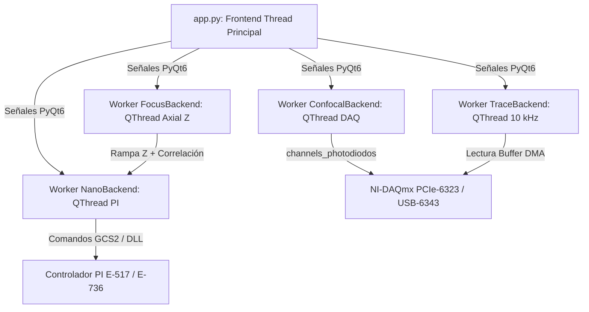

# 🔬 Módulo 01: Microscopio Derecho (`app.py`)

**Laboratorio de Nanofotónica — Instituto de Nanosistemas (INS-UNSAM / CONICET)**  
**Archivo Fuente**: [`app.py`](file:///c:/Users/josel/Documents/Obsidian_Vault/printing3/app.py)  
**Lanzador Rápido**: Botón 1 en [`main.py`](file:///c:/Users/josel/Documents/Obsidian_Vault/printing3/main.py) o `python app.py`

---

## 1. 🏷️ Resumen y Rol en el Sistema

El **Microscopio Derecho (`app.py`)** es la estación central de control y adquisición de **PyPrinting 3.0**. Integra en una sola ventana desacoplada y multihilo (`PyQt6.QtCore.QThread` + `pyqtgraph.dockarea`) la orquestación de:
- **Escaneo Confocal 2D/3D por Fotodiodos**: Barrido piezoeléctrico continuo con rampa triangular y adquisición sincronizada NI-DAQmx.
- **Adquisición de Trazas Fototérmicas a $10\ \text{kHz}$**: Monitoreo continuo de fotodiodo con cálculo de espectro FFT en tiempo real y potencia de referencia *Beam Splitter* (BS).
- **Autofoco Axial Z Automático**: Algoritmo de correlación cuadrática en ventana axial de $2\ \mu\text{m}$.
- **Control de Nanoposicionamiento PI**: Control de la platina piezoeléctrica cerrada PI E-517 / E-736 ($100 \times 100 \times 100\ \mu\text{m}$).
- **Obturadores TTL y Flipper Motorizado**: Manejo de láseres de 532 nm, 637 nm y 592 nm.

---

## 2. 🖼️ Maqueta de la Interfaz Visual (ASCII Layout)

```
┌──────────────────────────────────────────────────────────────────────────────────────────────────────────────────┐
│  PyPrinting 3.0 — Microscopio Derecho  [MODO SEGURO / HARDWARE NOMINAL]                               -  □  ×    │
├──────────────────────────────────────────────────────────────────────────────────────────────────────────────────┤
│  Files   Tools   Measurements   Docks   Help                                                                     │
├───────────────────────────────────────────────────────────────────────┬──────────────────────────────────────────┤
│  DOCK: CONFOCAL 2D / 3D (pyqtgraph ImageView)                         │  DOCK: TRACE & FFT (10 kHz)              │
│  ┌─────────────────────────────────────────────────────────────────┐ │  ┌─────────────────────────────────────┐  │
│  │                                                                 │ │  │ V (Fotodiodo)                      │  │
│  │   [ Imagen Confocal 2D en Falso Color ]                         │ │  │  5.0|       /\                      │  │
│  │   Resolución: Nx x Ny (px)                                      │ │  │  2.5|______/  \____________________ │  │
│  │   Campo: Lx x Ly (µm)                                           │ │  │  0.0└─────────────────────────────  │  │
│  │                                                                 │ │  │     0.0      1.0      2.0    t (s)  │  │
│  │   Centro de Masa: (+12.450 µm, +34.120 µm)                      │ │  ├─────────────────────────────────────┤  │
│  │   Pico Máximo: 8.42 V  |  FWHM: 285 nm                          │ │  │ FFT (dB): [Espectro de Ruido en Vivo]│  │
│  └─────────────────────────────────────────────────────────────────┘ │  └─────────────────────────────────────┘  │
│  Láser: [532 nm ▼]   Modo: [2D Fast ▼]  Rango: [ 5.0 ] µm  N: [ 50 ] │  Láser: [532 nm ▼]  Freq: [ 10000 ] Hz    │
│  [ ▶ Start Scan ]  [ ⏹ Stop ]  [ 🎯 Go to Max ]  [ 📊 Fit PSF ]       │  [ ▶ Live Trace ]  [ 💾 Save Trace ]       │
├───────────────────────────────────────────────────────────────────────┼──────────────────────────────────────────┤
│  DOCK: FOCUS Z (Autofoco Axial)                                       │  DOCK: NANOPOSITIONING & SHUTTERS        │
│  ┌─────────────────────────────────────────────────────────────────┐ │  Eje X: [ 25.400 ] µm  [ ◄ ] [ ► ] Step: 1.0│
│  │  Curva Axial I(z):              Pico: z = +14.250 µm            │ │  Eje Y: [ 30.120 ] µm  [ ▲ ] [ ▼ ] Step: 1.0│
│  │  4.0|        /\                                                 │ │  Eje Z: [ 15.000 ] µm  [ ▲ ] [ ▼ ] Step: 0.1│
│  │  0.0└───────/──\──────────────── z (µm)                         │ │  [ 📍 Set Reference (X0,Y0,Z0) ]         │
│  └─────────────────────────────────────────────────────────────────┘ │  Shutters: [ 532 ON/OFF ] [ 637 ON/OFF ]  │
│  Rango Z: [ 2.0 ] µm  Puntos: [ 40 ]  [ 🔍 Autofoco Z ] [ 🔒 Lock ]   │  Flipper:  [ ⬆ Baja Pot. ] [ ⬇ Alta Pot. ]│
├───────────────────────────────────────────────────────────────────────┴──────────────────────────────────────────┤
│  🟢 PyPrinting listo | Ejes PI: X=25.400 µm, Y=30.120 µm, Z=15.000 µm | DAQ: Dev1 Conectado | FPS: 30 Hz        │
└──────────────────────────────────────────────────────────────────────────────────────────────────────────────────┘
```

---

## 3. 🎛️ Catálogo Detallado de Botones, Menús y Controles

### Menú Superior
| Menú | Acción | Atajo | Función Técnica |
|---|---|:---:|---|
| **Files** | Seleccionar directorio | `Ctrl+A` | Define el directorio base de la sesión experimental mediante `QFileDialog`. |
| **Files** | Crear directorio diario | `Ctrl+S` | Crea automáticamente la carpeta `YYYYMMDD-HHMMSS_Session` con metadatos. |
| **Files** | Cargar última posición | — | Lee `Last_position.txt` y mueve la platina PI a las coordenadas previas. |
| **Tools** | Tablero de Conexiones | `Ctrl+H` | Abre el Tablero de Seguridad de Hardware ([`hardware_dashboard.py`](file:///c:/Users/josel/Documents/Obsidian_Vault/printing3/modules/hardware_dashboard.py)). |
| **Tools** | Diseñador de Redes 2D | `Ctrl+G` | Abre el Diseñador Universal de Redes Cristalinas 2D ([`grid_generator.py`](file:///c:/Users/josel/Documents/Obsidian_Vault/printing3/grid_generator.py)). |
| **Tools** | Cámara Live View | — | Abre la ventana de Live View EDSDK de la Canon EOS 500D. |
| **Tools** | Analizador de Imágenes | — | Abre la herramienta de deconvolución y análisis estático ([`image_analyzer.py`](file:///c:/Users/josel/Documents/Obsidian_Vault/printing3/analysis/image_analyzer.py)). |
| **Tools** | PSF Analyzer | `Ctrl+P` | Abre la ventana de ajuste 2D Gaussiano y Donut ([`psf_analyzer.py`](file:///c:/Users/josel/Documents/Obsidian_Vault/printing3/analysis/psf_analyzer.py)). |
| **Measurements** | Printing / Dimers | `Ctrl+M` | Abre la estación de nanofabricación y criterios de parada ([`measurements.py`](file:///c:/Users/josel/Documents/Obsidian_Vault/printing3/modules/measurements.py)). |

### Dock Confocal (Mapeo 2D/3D)
| Control / Botón | Tipo de Widget | Valores / Rango | Descripción y Efecto en Hardware |
|---|---|---|---|
| `Laser Combo` | `QComboBox` | `532 nm`, `637 nm`, `592 nm` | Selecciona la línea láser de excitación y el canal de fotodiodo mapeado. |
| `Modo Scan` | `QComboBox` | `2D Fast`, `2D Slow`, `3D Stack` | Configura el tipo de rampa analógica en el eje X y paso escalonado en Y/Z. |
| `Rango X/Y` | `QLineEdit` | $0.1$ a $50.0\ \mu\text{m}$ | Ancho físico del área de escaneo sobre la platina piezoeléctrica. |
| `Nx / Ny` | `QLineEdit` | $10$ a $200\ \text{píxeles}$ | Número de píxeles por línea y número de líneas de barrido. |
| `Start Scan` | `QPushButton` | — | Inicia la generación de rampa `pi.WAV_LIN` y adquisición por `Dev1/ai0:3`. |
| `Stop Scan` | `QPushButton` | — | Detiene inmediatamente el escaneo y cierra los obturadores por seguridad. |
| `Go to Max` | `QPushButton` | — | Calcula el baricentro 2D o píxel máximo y desplaza la platina al centro óptico. |

---

## 4. 📥 Archivos de Entrada que Solicita

1. **Archivo de Posición Previa (`Last_position.txt`)**:
   - *Ubicación*: Raíz del proyecto o carpeta seleccionada.
   - *Estructura*: 3 valores flotantes separados por saltos de línea o tabuladores representando las coordenadas piezoeléctricas $[X, Y, Z]$ en $\mu\text{m}$.
2. **Archivos de Grilla de Impresión Externa (`*.txt`)**:
   - *Estructura*: Matriz $2 \times N$ o $3 \times N$ de coordenadas relativas de partículas $[x_i, y_i, z_i]$.

---

## 5. 📤 Archivos de Salida que Genera

Al completar un escaneo confocal manual o automatizado, el sistema exporta el **trío de datos multi-material**:

1. **Imagen TIFF de Alta Resolución (`NPscan_00i.tiff`)**:
   - *Formato*: TIFF de 16 bits sin compresión con dimensiones $N_y \times N_x$.
   - *Contenido*: Matriz de intensidades fototérmicas en Volts reescaladas linealmente a rango `uint16` ($0 - 65535$).
2. **Matriz Numérica NumPy (`NPscan_00i.npy`)**:
   - *Formato*: Archivo binario serializado NumPy `ndarray` ($N_y \times N_x$, `dtype=float64`).
   - *Contenido*: Valores brutos de voltaje del fotodiodo en Volts ($0.0 - 10.0\ \text{V}$).
3. **Tabla de Datos CSV (`NPscan_00i.csv`)**:
   - *Formato*: Texto delimitado por comas con cabecera de metadatos.
   - *Estructura*:
     ```csv
     # PyPrinting 3.0 Confocal Scan Export
     # Laser: 532 nm | Range_X: 5.0 um | Range_Y: 5.0 um | Center_X: 25.400 | Center_Y: 30.120
     Pixel_X,Pixel_Y,Coord_X_um,Coord_Y_um,Intensity_V
     0,0,22.900,27.620,0.1245
     0,1,23.000,27.620,0.1382
     ...
     ```
4. **Registro de Última Posición (`Last_position.txt`)**:
   - Se sobreescribe automáticamente tras cada movimiento seguro de la platina PI.

---

## 6. ⚙️ Funcionalidades y Arquitectura de Hilos



- **Mapeo Confocal Continuo**: Utiliza el generador de formas de onda `pi.WAV_LIN` coordinado con triggers digitales de hardware (`CTO`) en el eje X, eliminando el retardo de comunicación por comandos serie/USB paso a paso.
- **Trazas Fototérmicas Multicanal**: El búfer circular de `TraceBackend` calcula la media móvil $I_{\text{old}}$ e $I_{\text{new}}$, monitorea la señal de potencia del divisor de haz (BS) y computa la FFT en tiempo real para alertar sobre vibraciones mecánicas del laboratorio.

---

## 7. ⚠️ Límites de Validez y Modos de Falla

| Condición de Borde (Fallo de Algoritmo / Instrumento) | Firma Experimental (Traza / Confocal / Telemetría) | Acción Correctiva Física (Procedimiento en Laboratorio) |
| :--- | :--- | :--- |
| **Saturación del Fotodiodo / Preamplificador PDA** ($V_{\text{in}} \ge +10.00\ \text{V}$). | Traza fototérmica o mapa confocal 2D recortados en una línea horizontal plana a $+10.00\ \text{V}$ (pérdida total de contraste y PSF truncada). | Conmutar el selector de ganancia del preamplificador Thorlabs PDA a un escalón inferior (ej. de $40\ \text{dB}$ a $20\ \text{dB}$ o $0\ \text{dB}$) o intercalar un filtro de densidad neutra (ND) en el puerto de detección. |
| **Desalineación Mecánica del Pinhole Confocal** ($r_{\text{pinhole}} > 50\ \mu\text{m}$). | Fondo de dispersión elevado con relación señal/ruido degradada ($SNR < 3$), PSF 2D asimétrica o comática y pérdida del $70\%$ de la intensidad máxima esperada. | Ajustar micrométricamente los tornillos $X-Y$ de la montura del pinhole bajo iluminación continua de una nanopartícula patrón de Au 60 nm fija, hasta maximizar la tensión leída en el fotodiodo. |
| **Pérdida de Comunicación USB/RS232 con Platina PI** (Timeout de controladora E-517/E-736). | Diálogo modal de error `PI Timeout / Controller not responding`, los ejes no responden a los botones de movimiento en la GUI. | Apagar la fuente de alimentación de la controladora PI durante 5 segundos, encenderla nuevamente, verificar la conexión del cable USB y pulsar `Reset All / Conectar PI` en el Tablero de Hardware. |
| **Deriva Térmica Axial Severa durante Autofoco Z** ($v_z > 50\ \text{nm/s}$). | Curva de autofoco $I(z)$ deformada o no convergente; el ajuste cuadrático ubica el foco en los bordes del rango ($z = 0\ \mu\text{m}$ o $z = 2\ \mu\text{m}$). | Comprobar que no haya corrientes de aire directo sobre la platina; encender el sistema de aire acondicionado del laboratorio a $21\ ^\circ\text{C}$ con $30\ \text{min}$ de anticipación y ampliar el rango axial de búsqueda a $3.0\ \mu\text{m}$. |

---

## 8. 🔗 Referencias Cruzadas
- [📘 Manual de Usuario — Sección 3: Microscopio Derecho (`app.py`)](file:///c:/Users/josel/Documents/Obsidian_Vault/printing3/docs/MANUAL_USUARIO.md#3-módulo-1-microscopio-derecho-apppy--pyprinting-30-suite-completa)
- [🔬 Fundamentos Físicos & Nanomateriales (Módulo 00)](file:///c:/Users/josel/Documents/Obsidian_Vault/printing3/docs/modulos/00_Fundamentos_Fisicos_Optical_Printing_y_Nanomateriales.md)
- [📐 Diseñador Universal de Redes 2D (Módulo 11)](file:///c:/Users/josel/Documents/Obsidian_Vault/printing3/docs/modulos/11_Disenador_Redes_2D_Grid_Generator.md)
- [📋 Protocolos y SOP de Laboratorio (Módulo 12)](file:///c:/Users/josel/Documents/Obsidian_Vault/printing3/docs/modulos/12_Protocolos_Operacion_Paso_a_Paso_Laboratorio.md)
- [📑 Reporte de Metrología y Calibración (`reportes/sistema/Calibracion_Metrologica_y_Exactitud_Posicionamiento.md`)](file:///c:/Users/josel/Documents/Obsidian_Vault/printing3/reportes/sistema/Calibracion_Metrologica_y_Exactitud_Posicionamiento.md)

