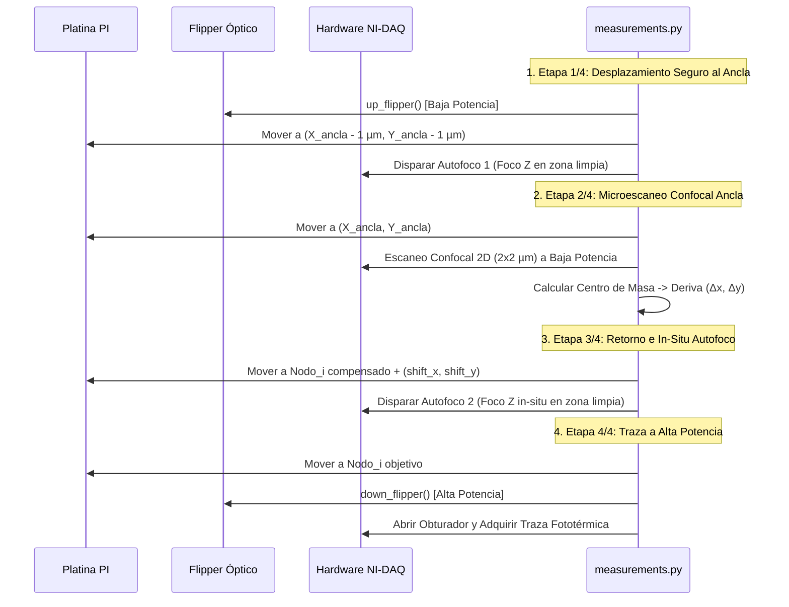

# 🔬 Módulo 02: Rutinas de Impresión y Dímeros (`modules/measurements.py`)

**Laboratorio de Nanofotónica — Instituto de Nanosistemas (INS-UNSAM / CONICET)**  
**Archivo Fuente**: [`modules/measurements.py`](file:///c:/Users/josel/Documents/Obsidian_Vault/printing3/modules/measurements.py)  
**Acceso en GUI**: Menú `Measurements -> Printing` o `Measurements -> Dimers` desde [`app.py`](file:///c:/Users/josel/Documents/Obsidian_Vault/printing3/app.py) o [`contrapropagante.py`](file:///c:/Users/josel/Documents/Obsidian_Vault/printing3/contrapropagante.py)

---

## 1. 🏷️ Resumen y Rol en el Sistema

El módulo **Measurements** es el motor principal de **nanofabricación óptica y ensamblado coloidal guiado por luz**. Permite imprimir matrices regulares $N \times M$ de nanopartículas individuales o pares de nanopartículas (*dímeros plasmónicos*) con control nanométrico, incorporando:
- **5 Criterios de Parada Seleccionables**: Salto relativo legacy, umbral absoluto, derivada $dI/dt$, calibración confocal raw e híbrido tri-factor.
- **Protección Anti-Partículas de Paso ($N_{\text{hold}}$)**: Conteo consecutivo en tiempo real para evitar falsas paradas por partículas flotantes en tránsito libre.
- **Protocolo de Doble Autofoco con Desplazamiento Seguro**: Rutina de 4 etapas que realiza autofoco en zona limpia desplazada $(-1, -1)\ \mu\text{m}$ de la partícula ancla, microescaneo confocal de deriva en baja potencia, retorno al nodo con corrección acumulada, autofoco in-situ y conmutación estricta a alta potencia para la traza.
- **Tracking Multimodal Avanzado**:
  1. `Track Drift XY`: Registro continuo de derivas laterales $(\Delta x, \Delta y, r)$ en nanómetros, archivo `drift_tracking_xy.txt` y mapa 2D interactivo (`DriftTrackingDialog`).
  2. `Track Drift Z`: Registro de derivas axiales tras cada autofoco, archivo `drift_tracking_z.txt` y curva temporal.
  3. `Track Time-Volt`: Ajuste post-impresión de función salto ($V_{\text{low}}, V_{\text{high}}, \Delta V, t_{\text{step}}, t_{\text{raw}}$) en todas las trazas del lote, cálculo de latencias de obturación y generación de `reporte_parametros_<nombre_red>.txt` con recomendaciones de optimización.
- **Nombre de Lote Personalizado (`Custom Name`)**: Campo interactivo para asignar prefijos y nombres específicos a las carpetas de lotes y reportes (con fallback automático al nombre de la grilla si se deja vacío).
- **Botón `Reset all 🔄`**: Restablecimiento atómico de referencias $(X_0, Y_0, Z_0)$, contadores, grilla interactiva, visualizadores de deriva y estados a reposo.
- **Gestor de Presets Experimentales (`.txt`)**: Carga y guardado de recetas precalibradas y Asistente Guiado multipaso.
- **Widget de Grilla Interactiva 2D (`InteractiveGridWidget`)**: Visualización en tiempo real orientada a $+90^\circ$ con retroalimentación por nodo (*Pendiente*, *Activo*, *Impreso*, *Fallo*).

---

## 2. 🖼️ Maqueta de la Interfaz Visual (ASCII Layout)

```
┌──────────────────────────────────────────────────────────────────────────────────────────────────────────────────┐
│  PyPrinting 3.0 — Estación de Impresión de Nanopartículas (Printing / Dimers)                         -  □  ×    │
├──────────────────────────────────────────────────────────────────────────────────────────────────────────────────┤
│  [ Printing folder ]  [ Nombre lote (ej: AuNP_60nm) ]  [ C:/.../20260831-144000_Printing_AuNP_60nm ]            │
│  Preset: [ 📄 Oro_60nm_532nm_Absoluto ▼ ]  [ 🧙 Lanzar Asistente ]  [ 📂 Cargar .txt ]  [ 💾 Guardar .txt ]       │
├───────────────────────────────────────┬───────────────────────────────────────┬──────────────────────────────────┤
│  DOCK: GRILLA DE IMPRESIÓN            │  DOCK: CRITERIO Y PARÁMETROS          │  DOCK: REFERENCIA & DRIFT        │
│  Columnas n: [ 5 ]  Filas N: [ 5 ]    │  Criterio: [ Modo 1: Salto+Abs+Hold▼] │  Xref: [ 50.120 ] Yref:[ 50.340 ]│
│  Paso dx: [ 3.0 ] µm  dy: [ 3.0 ] µm  │  Láser: [ 532 nm ] Umbral rel: [1.30] │  Zref: [ 10.450 ]                │
│  Offset X0: [ 2.0 ] µm Y0: [ 2.0 ] µm │  Umbral Abs (V):    [ 2.50 ]          │  [ Set reference ] [Go reference]│
│  Partículas Totales: 26 (1 Ancla+25)  │  N hold steps:      [ 5 ]             │  [ Reset all 🔄 ]                │
│  [ 📐 Crear Grilla ] [ 📂 Load Grid ] │  Umbral down: [0.0] T max (s): [20.0] │  Drift XY: (+12.4, -8.1)nm|r=14.8│
│  Índice Actual: [ 1 ]  Partícula: 1/26│  Steps before: [10] Steps after: [10] │  Drift Z:  +45.2 nm              │
│  [X] Drift check (Ancla P0)           │  [X] Scan pre-print? [X] Track XY     │  [ 🔍 Test Drift P0 ]            │
│                                       │  [X] Track Z         [X] Track T-Volt │                                  │
├───────────────────────────────────────┴───────────────────────────────────────┴──────────────────────────────────┤
│  DOCK: GRILLA INTERACTIVA 2D (Orientación física de platina: Eje X horizontal, Eje Y vertical)                   │
│  ┌────────────────────────────────────────────────────────────────────────────────────────────────────────────┐  │
│  │    Y (µm)                                                                                                  │  │
│  │    12.0|   ⚪ (P21)    ⚪ (P22)    ⚪ (P23)    ⚪ (P24)    ⚪ (P25)                                          │  │
│  │     9.0|   🟢 (P16)    🟢 (P17)    🟢 (P18)    🟢 (P19)    ⚪ (P20)                                          │  │
│  │     6.0|   🟢 (P11)    🟢 (P12)    🟢 (P13)    🟢 (P14)    🟢 (P15)                                          │  │
│  │     3.0|   🟢 (P6)     🟢 (P7)     🟢 (P8)     🟢 (P9)     🟢 (P10)     Leyenda de Nodos:                    │  │
│  │     0.0|   ⭐ (P0 Ancla) 🟢 (P1)   🟢 (P2)     🟢 (P3)     🟢 (P4)      ⭐ Ancla | 🟢 Impreso | 🔵 Activo   │  │
│  │        └────────────────────────────────────────────────────────── X(µm) ⚪ Pendiente | 🔴 Fallo          │  │
│  │           0.0         3.0         6.0         9.0        12.0                                              │  │
│  └────────────────────────────────────────────────────────────────────────────────────────────────────────────┘  │
│  Progreso: [████████████████████████████████████░░░░░░░░░░░░] 76% (19/25 partículas completadas)                │
│  [ Play ► ]     [ Pause ]     [ Next index ► ]                                                                   │
└──────────────────────────────────────────────────────────────────────────────────────────────────────────────────┘
```

---

## 3. 🎛️ Catálogo Completo de Botones y Controles de la Interfaz

| Control / Parámetro | Widget | Rango / Opciones | Descripción Técnica |
|---|---|---|---|
| `Custom Name` | `QLineEdit` | Texto libre | Nombre personalizado para la carpeta del lote y reportes. Si está vacío usa `<GridName>`. |
| `Preset Combo` | `QComboBox` | Presets `.txt` disponibles | Carga instantáneamente todos los parámetros numéricos y opciones. |
| `Wizard Presets` | `QPushButton` | Diálogo multipaso | Abre el Asistente Guiado para crear nuevas recetas experimentales. |
| `Criterio Parada` | `QComboBox` | Modos 0 a 4 | Conmuta la visibilidad dinámica y el algoritmo evaluador en el Backend. |
| `Umbral Relativo` | `QLineEdit` | $1.05 - 10.0$ | Factor multiplicador de salto de señal respecto a la línea base previa ($I_{\text{new}} / I_{\text{old}}$). |
| `Umbral Abs (V)` | `QLineEdit` | $0.05 - 10.0\ \text{V}$ | Nivel absoluto en Volts para detección instantánea al abrir el obturador ($t=0$). |
| `N hold steps` | `QLineEdit` | $1 - 50\ \text{pasos}$ | Número de lecturas consecutivas que deben satisfacer el criterio para confirmar adhesión física (filtro anti-partículas de paso). |
| `Slope Flat` | `QLineEdit` | $0.001 - 1.0\ \text{V/s}$ | Pendiente máxima permitida para detectar meseta en Modo 2 e Híbrido ($|dI/dt| < \text{Slope\_Flat}$). |
| `Ratio K (P_print/P_scan)`| `QLineEdit` | $1.0 - 500.0$ | Relación de potencias entre impresión y escaneo para reescalar mapa confocal en Modo 3. |
| `Umbral (%)` | `QLineEdit` | $1.0 - 100.0\ \%$ | Porcentaje de la intensidad máxima confocal reescalada fijado como corte de voltaje. |
| `Scan pre-print?` | `QCheckBox` | `ON / OFF` | Ejecuta un escaneo confocal antes de imprimir cada nodo para validar zona limpia. |
| `Drift Check` | `QCheckBox` | `ON / OFF` | Activa la generación de la Partícula Ancla $P_0$ y la corrección de deriva termomecánica. |
| `Track Drift XY?` | `QCheckBox` | `ON / OFF` | Registra las derivas laterales en cada corrección, genera `drift_tracking_xy.txt` y abre el visor 2D. |
| `Track Drift Z?` | `QCheckBox` | `ON / OFF` | Registra las derivas axiales tras cada autofoco y genera `drift_tracking_z.txt`. |
| `Track Time-Volt?`| `QCheckBox` | `ON / OFF` | Ajusta la función salto en todas las trazas y genera `reporte_parametros_<nombre_red>.txt`. |
| `Post scan?` | `QCheckBox` | `ON / OFF` | (Solo Dimers) Ejecuta un escaneo confocal posterior para confirmar el dímero ensamblado. |
| `dx / dy (µm)` | `QLineEdit` | $-50.0 - +50.0\ \mu\text{m}$ | (Solo Dimers) Desplazamiento relativo para posicionar la segunda nanopartícula del par. |
| `Set reference` | `QPushButton` | — | Fija la posición actual de la platina PI como origen $(X_0, Y_0, Z_0)$ (botón verde). |
| `Go reference` | `QPushButton` | — | Desplaza la platina PI inmediatamente al punto de referencia $(X_0, Y_0, Z_0)$. |
| `Reset all 🔄` | `QPushButton` | — | Restaura a cero todas las referencias, acumuladores de deriva, estados y casillas. |
| `Play ►` / `Pause`| `QPushButton` | — | Inicia, pausa o reanuda la secuencia automatizada de nanoposicionamiento e impresión. |
| `Next index ►` | `QPushButton` | — | Salta inmediatamente el nodo actual y avanza a la siguiente partícula de la grilla. |

---

## 4. 📥 Archivos de Entrada que Solicita

1. **Archivos de Preset de Impresión (`presets/*.txt`)**:
   - *Formato*: Archivo de texto plano clave-valor estándar `key=value` o `clave: valor`.
   - *Ejemplo*:
     ```ini
     name=Oro_60nm_532nm_Absoluto
     stop_mode=1
     umbral_rel=1.50
     umbral_abs=2.50
     n_hold=5
     tmax=20.0
     autofocus_every=5
     drift_correction=True
     ```
2. **Archivos de Grilla de Coordenadas Externa (`Load_grid`)**:
   - *Formato*: Archivo de texto (`.txt`) con matriz $2 \times N$ de posiciones $[X_i, Y_i]$ en $\mu\text{m}$.

---

## 5. ⚙️ Funcionamiento de `N hold steps` (Filtro Anti-Partículas de Paso)

En soluciones coloidales, las nanopartículas cruzan aleatoriamente el haz láser por movimiento browniano sin fijarse al sustrato. Estas partículas en tránsito libre producen picos de voltaje transitorios breves ($\sim 10 - 20\ \text{ms}$).

### Algoritmo Evaluador:
```python
if condition:
    self.hold_counter += 1
else:
    self.hold_counter = 0    # Reinicio instantáneo si la partícula sigue de largo

should_stop = (self.hold_counter >= self.n_hold_steps)
```
- **$N = 1$**: Sin protección. Cualquier destello transitorio apaga el láser en falso.
- **$N = 3 - 5$ (Recomendado)**: Requiere $\sim 30 - 50\ \text{ms}$ sostenidos de señal alta. Filtra partículas de paso y confirma inmovilización real.
- **$N = 10 - 15$**: Máxima rigurosidad para concentraciones coloidales muy elevadas.

---

## 6. 🔬 Protocolo de Doble Autofoco con Desplazamiento Seguro

Cuando `Drift check` está activo y se alcanza el intervalo de autofoco:



---

## 7. ⚙️ Algoritmos de los 5 Criterios de Parada

```mermaid
graph TD
    A[Señal Fototérmica I_new, I_old, dI/dt] --> B{Selección de Criterio}
    
    B -->|Modo 0: Legacy| C[I_new > I_old * Umbral_Rel]
    B -->|Modo 1: Rel+Abs+Hold| D[I_new > I_old * Umbral_Rel Ó I_new > Umbral_Abs]
    B -->|Modo 2: Derivada dI/dt| E[|dI/dt| < Slope_Flat Y I_new > I_old + 0.1V]
    B -->|Modo 3: Confocal Raw| F[I_new > V_thresh_rescaled Y I_new > I_old * Umbral_Rel]
    B -->|Modo 4: Híbrido Tri-Factor| G[Evalúa Relativo Ó Derivada Ó Absoluto]
    
    C --> H{¿Cumple Slope Min?}
    D --> I{¿Sostenido N_hold pasos?}
    E --> I
    F --> I
    G --> I
    
    I -- Sí --> H
    I -- No --> J[Incrementar hold_counter / Reset]
    
    H -- Sí --> K[CIERRE INMEDIATO DE SHUTTER < 1 ms]
    H -- No --> L[Continuar Adquisición]
```

---

## 8. 📊 Análisis `Track Time-Volt`, Histogramas y Reporte de Optimización

Al finalizar el lote, si `Track Time-Volt?` está activo, se analizan todas las trazas `NP_*.txt`:
1. **$V_{\text{low}}$**: Promedio de los primeros 10 puntos de la traza (línea base).
2. **$V_{\text{high}}$**: Promedio de los últimos 10 puntos de la traza (post-adhesión).
3. **$\Delta V$ y Ratio**: $\Delta V = V_{\text{high}} - V_{\text{low}}$, $\text{Ratio} = V_{\text{high}} / V_{\text{low}}$.
4. **$t_{\text{step}}$**: Tiempo en el que $V(t) \ge V_{\text{low}} + 0.5 \Delta V$ (momento real de adhesión).
5. **Latencia de Obturación**: $\Delta t = t_{\text{raw}} - t_{\text{step}}$.

Se generan automáticamente dos salidas complementarias:
* **Ventana Interactiva y Gráfico (`TimeVoltTrackingDialog` / `time_volt_distributions.png`)**:
  - **Panel 1 (Izquierda)**: Histogramas superpuestos de distribución temporal $t_{\text{raw}}$ (tiempo total) vs $t_{\text{step}}$ (tiempo de salto), con líneas guía de promedios $\langle t_{\text{raw}} \rangle$ y $\langle t_{\text{step}} \rangle$.
  - **Panel 2 (Centro)**: Histogramas de voltajes $V_{\text{low}}$ (línea base) vs $V_{\text{high}}$ (post-adhesión) y salto $\Delta V$.
  - **Panel 3 (Derecha)**: Diagrama de dispersión $t_{\text{step}}$ vs $\Delta V$ para analizar la correlación entre cinética de adhesión e intensidad óptica.
* **Informe Tabular (`reporte_parametros_<nombre_red>.txt`)**:
  - Tabla partícula a partícula con métricas individuales y estado (`SUCCESS` / `TIMEOUT`).
  - Estadísticas globales ($\langle t_{\text{raw}} \rangle$, $\langle t_{\text{step}} \rangle$, $\langle V_{\text{low}} \rangle$, $\langle V_{\text{high}} \rangle$, $\langle \Delta V \rangle$, $\langle \text{Ratio} \rangle$, tasa de éxito).
  - Diagnóstico de relación señal/fondo (SBR) y recomendación del umbral óptimo de trabajo.

---

## 9. 📤 Archivos de Salida Generados por Lote

En la carpeta `YYYYMMDD-HHMMSS_Printing_<CustomName>/`:
1. **Trazas de Impresión (`NP_001.txt`, `NP_002.txt`, ...)**:
   - Formato de 3 columnas numéricas a $10\ \text{kHz}$: `Tiempo (s)`, `Señal Fototérmica (V)` y `Beam Splitter BS (V)`.
2. **Escaneo Confocal Pre/Post-Impresión (`NPscan_001.tiff`, `.npy`, `.csv`)**:
   - Guarda el mapa confocal 2D de confirmación óptica si `Scan pre-print?` está activo.
3. **Escaneo Confocal Reescalado (`NPscan_rescaled_00i.txt` / `.tiff`)** *(Modo 3)*:
   - Guarda la matriz reescalada por $K_{\text{scale}}$ con el umbral absoluto en la cabecera.
4. **Tablas de Tracking de Deriva**:
   - `drift_tracking_xy.txt`: Historial numérico de deriva lateral $(\Delta x, \Delta y, r)$ en nanómetros.
   - `drift_tracking_z.txt`: Historial numérico de deriva axial $(\Delta z)$ en nanómetros.
   - `drift_map.png`: Gráfico 2D de trayectoria y evolución temporal de deriva.
5. **Reportes y Gráficos Time-Volt**:
   - `reporte_parametros_<nombre_red>.txt`: Informe estadístico y diagnóstico de optimización Time-Volt.
   - `time_volt_distributions.png`: Figura PNG con los 3 paneles de histogramas de tiempos, voltajes y diagrama de dispersión.
6. **Metadatos y Parámetros Experimentales (`grid_info.txt`)**:
   - Registra fecha, tipo de nanopartícula, sustrato, potencia BFP, criterio de parada, nombre custom y derivas.
7. **Subcarpetas en Modo Dímeros**:
   - `Pree_Scan/`: Escaneos de la primera partícula del par coloidal.
   - `Dimer_Scan/`: Escaneos del dímero ensamblado final.

---

## 10. 🔗 Referencias Cruzadas
- [📘 Manual de Usuario — Sección 3.7: Ventana de Mediciones](file:///c:/Users/josel/Documents/Obsidian_Vault/printing3/docs/MANUAL_USUARIO.md#37-ventana-de-mediciones-printing-automatizado-de-grillas--dímeros)
- [📘 Manual de Usuario — Sección 2.9: Criterios de Parada](file:///c:/Users/josel/Documents/Obsidian_Vault/printing3/docs/MANUAL_USUARIO.md#29-formulación-matemática-y-análisis-de-los-5-criterios-de-parada-modos-0-a-4)
- [📑 Reporte Científico: Análisis Time-Volt y Tracking Avanzado](file:///c:/Users/josel/Documents/Obsidian_Vault/printing3/reportes/cientificos/Analisis_Time_Volt_y_Tracking_Avanzado_PyPrinting3.md)
- [📑 Reporte Algorítmico (`reportes/cientificos/Algoritmo_Printing_y_Dimers_PyPrinting3.md`)](file:///c:/Users/josel/Documents/Obsidian_Vault/printing3/reportes/cientificos/Algoritmo_Printing_y_Dimers_PyPrinting3.md)
- [📑 Reporte Metrológico de Deriva (`reportes/cientificos/Correccion_de_Deriva_Termomecanica_Drift_Correction_PyPrinting3.md`)](file:///c:/Users/josel/Documents/Obsidian_Vault/printing3/reportes/cientificos/Correccion_de_Deriva_Termomecanica_Drift_Correction_PyPrinting3.md)
