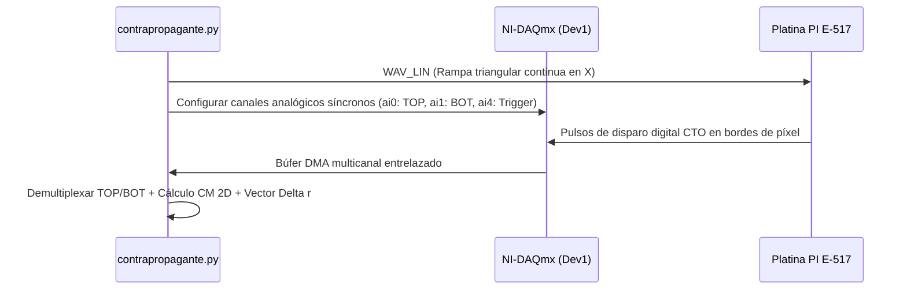

# 🔬 Módulo 03: Microscopio Contrapropagante (`contrapropagante.py`)

**Laboratorio de Nanofotónica — Instituto de Nanosistemas (INS-UNSAM / CONICET)**  
**Archivo Fuente**: [`contrapropagante.py`](file:///c:/Users/josel/Documents/Obsidian_Vault/printing3/contrapropagante.py)  
**Lanzador Rápido**: Botón 3 en [`main.py`](file:///c:/Users/josel/Documents/Obsidian_Vault/printing3/main.py) o `python contrapropagante.py`

---

## 1. 🏷️ Resumen y Rol en el Sistema

El **Microscopio Contrapropagante (`contrapropagante.py`)** controla la estación óptica de **excitación dual contrapropagante** (*dual-beam counterpropagating excitation*). Integra dos objetivos idénticos de alta apertura numérica ($60\times$, inmersión en agua, $\text{NA} = 1.0$) enfrentados axialmente a lo largo del eje óptico Z.

Sus capacidades clave incluyen:
- **Escaneo Confocal Sincronizado Dual (TOP / BOT)**: Adquiere simultáneamente los mapas de dispersión/fluorescencia provenientes del canal superior (TOP) e inferior (BOT).
- **Cálculo en Tiempo Real del Vector de Desalineación Espacial**:
  $$\Delta \mathbf{r} = \mathbf{r}_{\text{TOP}} - \mathbf{r}_{\text{BOT}} = (\Delta x_{\text{nm}}, \Delta y_{\text{nm}}) \quad \text{con} \quad \|\Delta \mathbf{r}\| = \sqrt{\Delta x^2 + \Delta y^2}\ \text{nm}$$
- **Ajuste y Caracterización de Haces Gaussianos y Donuts ($LG_{01}$)**: Permite verificar la superposición nanométrica entre el haz de atrapamiento/impresión y el haz donas de depleción o manipulación fototérmica.
- **Exclusión Mutua de Hardware**: Controlada por `main.py` para evitar colisiones de recursos DAQ y PI con `app.py`.

---

## 2. 🖼️ Maqueta de la Interfaz Visual (ASCII Layout)

```
┌──────────────────────────────────────────────────────────────────────────────────────────────────────────────────┐
│  PyPrinting 3.0 — Microscopio Contrapropagante (Excitación Dual TOP / BOT)                            -  □  ×    │
├──────────────────────────────────────────────────────────────────────────────────────────────────────────────────┤
│  Files   Tools   Measurements   Docks   Help                                                                     │
├──────────────────────────────────────────────────────────────────────────────────────────────────────────────────┤
│  DOCK: CONFOCAL CONTRAPROPAGANTE DUAL (TOP / CONTROLES / BOT)                                                    │
│  ┌───────────────────────────────┬───────────────────────────────┬───────────────────────────────┐               │
│  │ CANAL TOP (Superior)          │ PANEL CENTRAL DE CONTROL      │ CANAL BOT (Inferior)          │               │
│  │ ┌───────────────────────────┐ │ Láser TOP: [ 532 nm (Verde)▼] │ ┌───────────────────────────┐ │               │
│  │ │                           │ │ Láser BOT: [ 637 nm (Rojo) ▼] │ │                           │ │               │
│  │ │  [ Mapa Confocal TOP ]    │ │ Rango X: [ 5.0 ] µm           │ │  [ Mapa Confocal BOT ]    │ │               │
│  │ │                           │ │ Rango Y: [ 5.0 ] µm           │ │                           │ │               │
│  │ │  CM: (+25.412, +30.155) µm│ │ Nx / Ny: [ 60 ] px            │ │  CM: (+25.398, +30.162) µm│ │               │
│  │ └───────────────────────────┘ │ Freq:    [ 10000 ] Hz         │ └───────────────────────────┘ │               │
│  │ Pico: 8.95 V | FWHM: 278 nm │ [ ▶ Dual Scan ] [ ⏹ Stop ]    │ Pico: 7.62 V | FWHM: 284 nm │               │
│  ├─────────────────────────────┤ ├─────────────────────────────┤ ├─────────────────────────────┤               │
│  │ Perfil 1D X / Y (TOP)       │ │ VECTOR DE DESALINEACIÓN:    │ │ Perfil 1D X / Y (BOT)       │               │
│  │ 4.0|   /\                   │ │ Δx = +14.0 nm               │ │ 4.0|   /\                   │               │
│  │ 0.0└──/──\───────────────   │ │ Δy = -7.0 nm                │ │ 0.0└──/──\───────────────   │               │
│  │                             │ │ ‖Δr‖ = 15.65 nm [🟢 ÓPTIMO] │ │                             │               │
│  └─────────────────────────────┴─┴─────────────────────────────┴─┴─────────────────────────────┘               │
├───────────────────────────────────────┬──────────────────────────────────────────────────────────────────────────┤
│  DOCK: FOCUS Z AXIAL                  │  DOCK: NANOPOSITIONING & SHUTTERS DUAL                                   │
│  Rango Z: [ 2.0 ] µm  Puntos: [ 40 ]  │  Platina PI: X=[ 25.400 ] µm  Y=[ 30.150 ] µm  Z=[ 15.000 ] µm          │
│  [ 🔍 Autofoco Z ]  [ 🔒 Lock Focus ] │  Láseres: [ 532 ON/OFF ] [ 637 ON/OFF ] [ 592 ON/OFF ]  Flipper: [ ⬇ ]   │
├───────────────────────────────────────┴──────────────────────────────────────────────────────────────────────────┤
│  🟢 Contrapropagante listo | Ejes: X=25.400, Y=30.150, Z=15.000 | NI-DAQ: Dev1 Sincronizado | Desalineación: 15.7 nm│
└──────────────────────────────────────────────────────────────────────────────────────────────────────────────────┘
```

---

## 3. 🎛️ Catálogo de Botones y Controles Específicos

| Control / Botón | Tipo de Widget | Valores / Opciones | Función en el Sistema |
|---|---|---|---|
| `Láser TOP Combo` | `QComboBox` | `532 nm`, `637 nm`, `592 nm` | Selecciona la línea láser enfocada por el objetivo superior. |
| `Láser BOT Combo` | `QComboBox` | `532 nm`, `637 nm`, `592 nm` | Selecciona la línea láser enfocada por el objetivo inferior. |
| `Dual Scan` | `QPushButton` | — | Dispara la adquisición sincronizada por hardware de ambos canales. |
| `Align Centers` | `QPushButton` | — | Desplaza la platina al centro medio geométrico $\frac{1}{2}(\mathbf{r}_{\text{TOP}} + \mathbf{r}_{\text{BOT}})$. |
| `Fit Dual PSF` | `QPushButton` | — | Ajusta modelos Gaussianos 2D en ambos canales y grafica los residuos. |
| `Threshold Overlap`| `QLineEdit` | $5.0 - 50.0\ \text{nm}$ | Umbral de tolerancia de desalineación óptica para considerar alineación óptima. |

---

## 4. 📥 Archivos de Entrada que Solicita

1. **Archivo de Calibración de Fase/Offset (`contra_offset.txt`)**:
   - Offset fijo entre las señales de sincronismo digital `CTO` y los relojes de muestreo analógico de `Dev1`.
2. **Archivos de Grilla de Impresión Externa (`*.txt`)**:
   - Compatible con el formato estándar de grillas de `measurements.py`.

---

## 5. 📤 Archivos de Salida que Genera

1. **Par de Imágenes TIFF Duales (`NPscan_top_00i.tiff` y `NPscan_bot_00i.tiff`)**:
   - Imágenes de 16 bits sin compresión para los canales superior e inferior respectivamente.
2. **Matrices Serializadas NumPy (`NPscan_top_00i.npy` y `NPscan_bot_00i.npy`)**:
   - Matrices flotantes en Volts brutos.
3. **Registro Metrológico de Desalineación (`alignment_vector_00i.csv`)**:
   - *Estructura*:
     ```csv
     # PyPrinting 3.0 Dual Counterpropagating Alignment Log
     Timestamp,Laser_TOP,Laser_BOT,CM_Top_X_um,CM_Top_Y_um,CM_Bot_X_um,CM_Bot_Y_um,Delta_X_nm,Delta_Y_nm,Norm_Delta_R_nm
     2026-08-26 15:30:12,532nm,637nm,25.412,30.155,25.398,30.162,+14.0,-7.0,15.65
     ```

---

## 6. ⚙️ Funcionalidades y Sincronismo Hardware



---

## 7. ⚠️ Límites de Validez y Modos de Falla

| Condición de Borde (Fallo Óptico / Hardware) | Firma Experimental (Confocal Dual / Telemetría) | Acción Correctiva Física (Procedimiento en Laboratorio) |
| :--- | :--- | :--- |
| **Desalineación Colineal entre Haces Superior e Inferior** ($\|\Delta \mathbf{r}\| > 100\ \text{nm}$). | Los centros de masa $CM_{\text{top}}$ y $CM_{\text{bot}}$ no coinciden; la partícula oscila erráticamente o es eyectada lateralmente fuera del eje óptico sin atrapar en 3D. | Ajustar los espejos de acoplamiento cinemáticos de la rama superior hasta que el vector residual $\|\Delta \mathbf{r}\| = \sqrt{\Delta x^2 + \Delta y^2} \le 20\ \text{nm}$ en la GUI. |
| **Desbalance de Potencia Óptica Axial** ($P_{\text{top}} \gg P_{\text{bot}}$ o viceversa). | La partícula colapsa contra el cubreobjetos superior o inferior en lugar de levitar de forma estable en la cintura focal intermedia. | Equilibrar las placas retardadoras $\lambda/2$ o los atenuadores polarizantes de ambas ramas hasta igualar las lecturas en los medidores de potencia antes de ingresar a los objetivos. |
| **Desincronización de Trigger Digital CTO en Platina PI**. | Mapas confocales distorsionados con corrimiento en peine (*shearing*) entre líneas de ida y vuelta en la rampa continua. | Verificar el cable BNC de disparo digital conectado entre la salida `CTO` de la controladora PI y la entrada `PFI0/TRIG` de la tarjeta NI-DAQmx. |

---

## 8. 🔗 Referencias Cruzadas
- [📘 Manual de Usuario — Sección 4.7: Microscopio Contrapropagante](file:///c:/Users/josel/Documents/Obsidian_Vault/printing3/docs/MANUAL_USUARIO.md#47-microscopio-contrapropagante-excitación-dual)
- [📑 Reporte de Metrología y Presupuesto de Incertidumbre GUM (`reportes/sistema/Calibracion_Metrologica_y_Exactitud_Posicionamiento.md`)](file:///c:/Users/josel/Documents/Obsidian_Vault/printing3/reportes/sistema/Calibracion_Metrologica_y_Exactitud_Posicionamiento.md)
