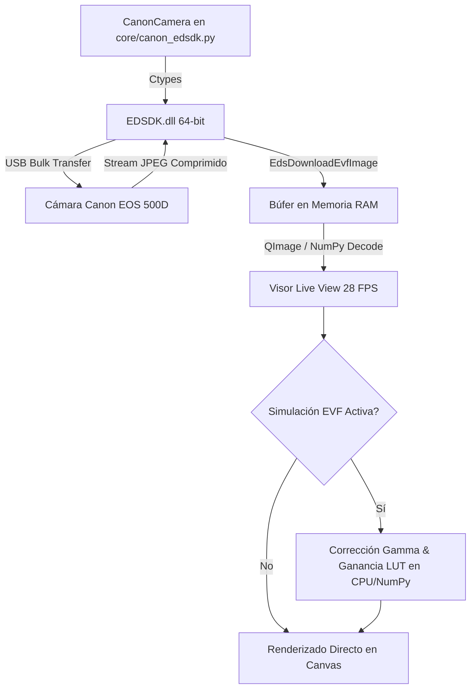

# 📷 Módulo 04: Cámara Live View EDSDK (`modules/camera.py`)

**Laboratorio de Nanofotónica — Instituto de Nanosistemas (INS-UNSAM / CONICET)**  
**Archivo Fuente**: [`modules/camera.py`](file:///c:/Users/josel/Documents/Obsidian_Vault/printing3/modules/camera.py) / [`core/canon_edsdk.py`](file:///c:/Users/josel/Documents/Obsidian_Vault/printing3/core/canon_edsdk.py)  
**Lanzador Rápido**: Botón 5 en [`main.py`](file:///c:/Users/josel/Documents/Obsidian_Vault/printing3/main.py) o `Tools -> Cámara` desde `app.py`

---

## 1. 🏷️ Resumen y Rol en el Sistema

El módulo **Cámara Live View** proporciona la interfaz visual directa de campo amplio (*widefield*) del microscopio mediante una cámara réflex **Canon EOS 500D** (sensor APS-C CMOS de $15.1\ \text{MP}$).

Funcionalidades centrales:
- **Control Nativo por EDSDK 64-bit (`ctypes`)**: Comunicación directa con `EDSDK.dll` sin puentes intermedios lentos, permitiendo transmisión continua a **$25-30\ \text{FPS}$** y captura a resolución completa ($4752 \times 3168\ \text{px}$).
- **Simulación de Exposición EVF en Tiempo Real**: Aplica curvas de corrección gamma y ganancia digital en software para visualizar campos oscuros de baja fluorescencia o dispersión antes de capturar la fotografía final.
- **Ventana Miniatura Picture-in-Picture (PiP)**: Inset flotante en la esquina del visor para zoom digital o monitor secundario.
- **Capa Interactiva de Anotaciones (`OverlayWidget`)**: Definición de escala nanométrica ($\mu\text{m}/\text{px}$), punto de referencia cruzada, región de interés (ROI), reglas milimétricas y marcas de texto.
- **Motor Dual de Detección de Partículas**: Integración con **Trackpy** (Crocker-Grier) y **Picasso (SMLM MLE / LQ)** con renderizado directo sobre el canvas.

---

## 2. 🖼️ Maqueta de la Interfaz Visual (ASCII Layout)

```
┌──────────────────────────────────────────────────────────────────────────────────────────────────────────────────┐
│  PyPrinting 3.0 — Cámara Réflex Canon EOS 500D (Live View EDSDK 64-bit)                               -  □  ×    │
├──────────────────────────────────────────────────────────────────────────────────────────────────────────────────┤
│  PANEL SUPERIOR DE CONTROL ÓPTICO Y EXPOSICIÓN                                                                   │
│  [ ▶ LIVE VIEW (F1) ]  [ 📸 SNAP (F8) ]  [ ⏺ REC VIDEO ]  │  ISO: [ 800 ▼]  Tv: [ 1/30s ▼]  Zoom: [ 5x (EVF) ▼]  │
│  Simulación EVF: [X] Activa  Brillo: [───●─────] +1.2 EV  Gamma: [───●─────] 1.4  AE Mode: Manual (M)            │
├──────────────────────────────────────────────────────────────────────────────────────────────────────────────────┤
│  CANVAS DE VIDEO PRINCIPAL (PyQt6 GraphicsView + OverlayWidget)                                                  │
│  ┌────────────────────────────────────────────────────────────────────────────────────────────────────────────┐  │
│  │                                                                ┌──────────────────────────────────────┐    │  │
│  │     + (Cruz de Referencia PI: X=25.400, Y=30.120 µm)           │ MINIATURA PiP (Zoom Digital 10x)     │    │  │
│  │                                                                │  [ Detalle Ampliado de Partícula ]   │    │  │
│  │        ┌─────────────────────────┐                             │  FWHM: 282 nm | SNR: 18.4 dB         │    │  │
│  │        │ ROI Seleccionado        │                             └──────────────────────────────────────┘    │  │
│  │        │ 🟡 NP #1 (x=12.4,y=15.1)│                                                                         │  │
│  │        │ 🟡 NP #2 (x=18.2,y=15.0)│                                                                         │  │
│  │        └─────────────────────────┘                                                                         │  │
│  │                                                                                                            │  │
│  │                                                                                                            │  │
│  │  ├── 10.0 µm ──┤ [Escala: 0.0842 µm/px]                                                                    │  │
│  └────────────────────────────────────────────────────────────────────────────────────────────────────────────┘  │
├──────────────────────────────────────────────────────────────────────────────────────────────────────────────────┤
│  HERRAMIENTAS DE ANÁLISIS RÁPIDO: [ 📏 Regla ]  [ 📐 Set Scale ]  [ 🔍 Detectar Partículas (Trackpy/Picasso) ]    │
│  🟢 Canon EOS 500D Conectada | Live View: 28.5 FPS | Batería: 85% | 4752x3168 RAW+JPEG | Directorio: C:/Data    │
└──────────────────────────────────────────────────────────────────────────────────────────────────────────────────┘
```

---

## 3. 🎛️ Catálogo de Botones y Controles de la Cámara

| Control / Botón | Tipo de Widget | Atajo | Rango / Opciones | Descripción Técnica |
|---|---|:---:|---|---|
| `LIVE VIEW` | `QPushButton` | `F1` | `ON / OFF` | Activa o pausa la descarga continua de frames EVF desde la memoria de la Canon. |
| `SNAP` | `QPushButton` | `F8` | — | Dispara el obturador mecánico a máxima resolución ($15.1\ \text{MP}$) y descarga el archivo. |
| `ISO Combo` | `QComboBox` | — | `100, 200, 400, 800, 1600, 3200, 6400, 12800` | Modifica la ganancia analógica del sensor mediante `kEdsPropID_ISOSpeed`. |
| `Tv Combo` | `QComboBox` | — | `1/4000s` a `30s`, `Bulb` | Tiempo de exposición mecánico mediante `kEdsPropID_Tv`. |
| `Zoom Combo` | `QComboBox` | — | `1x`, `5x`, `10x` | Controla el zoom digital óptico nativo del visor réflex (`kEdsPropID_Evf_Zoom`). |
| `Set Scale` | `QPushButton` | — | Diálogo con regla | Calibra la relación de píxeles a micrómetros reales ($\mu\text{m}/\text{px}$). |
| `Detect Particles`| `QPushButton` | — | Diálogo multimotor | Abre el diálogo `TrackpyDialog` / Picasso para detección y conteo sub-píxel. |

---

## 4. 📥 Archivos de Entrada que Solicita

1. **Imágenes de Referencia para Calibración de Escala (`*.tif`, `*.jpg`, `*.png`)**:
   - Imágenes de micropatrones de calibración (ej. regla de $10\ \mu\text{m}$ Ronchi o patrón de calibración Thorlabs).

---

## 5. 📤 Archivos de Salida que Genera

1. **Fotografía de Alta Resolución (`Foto_YYYYMMDD_HHMMSS.tiff` / `.jpg`)**:
   - *Resolución*: $4752 \times 3168\ \text{píxeles}$ en color RGB de 24 o 48 bits.
   - *Metadatos EXIF*: ISO, velocidad de obturación, apertura del objetivo y marca temporal.
2. **Fotografía con Anotaciones Superpuestas (`Foto_annotated_*.jpg`)**:
   - Incluye barra de escala grabada, cruces de partículas detectadas y coordenadas.
3. **Tabla de Partículas Detectadas (`tracking_particles_*.csv`)**:
   - *Estructura*:
     ```csv
     # PyPrinting 3.0 Particle Detection Export (Picasso GaussMLE)
     # Scale: 0.0842 um/px | ROI: (120, 80, 450, 380) px
     Particle_ID,X_px,Y_px,Coord_X_um,Coord_Y_um,Photons,Sigma_X_px,Sigma_Y_px
     1,215.42,148.11,18.14,12.47,48520,1.42,1.39
     2,340.85,210.63,28.70,17.73,52140,1.38,1.41
     ```

---

## 6. ⚙️ Arquitectura del Wrapper EDSDK 64-bit



---

## 7. 🔗 Referencias Cruzadas
- [📘 Manual de Usuario — Sección 4.3: Cámara Live View](file:///c:/Users/josel/Documents/Obsidian_Vault/printing3/docs/MANUAL_USUARIO.md#43-cámara-live-view-réflex-canon-eos-500d-edsdk)
- [📘 Manual de Usuario — Sección 6: Analizador de Imágenes y Detección](file:///c:/Users/josel/Documents/Obsidian_Vault/printing3/docs/MANUAL_USUARIO.md#6-analizador-de-imágenes-y-deconvolución-richardson-lucy)
- [📑 Reporte de Cámara y Visión (`reportes/sistema/PyPrinting_3_0_PyQt6_Migracion.md`)](file:///c:/Users/josel/Documents/Obsidian_Vault/printing3/reportes/sistema/PyPrinting_3_0_PyQt6_Migracion.md)
