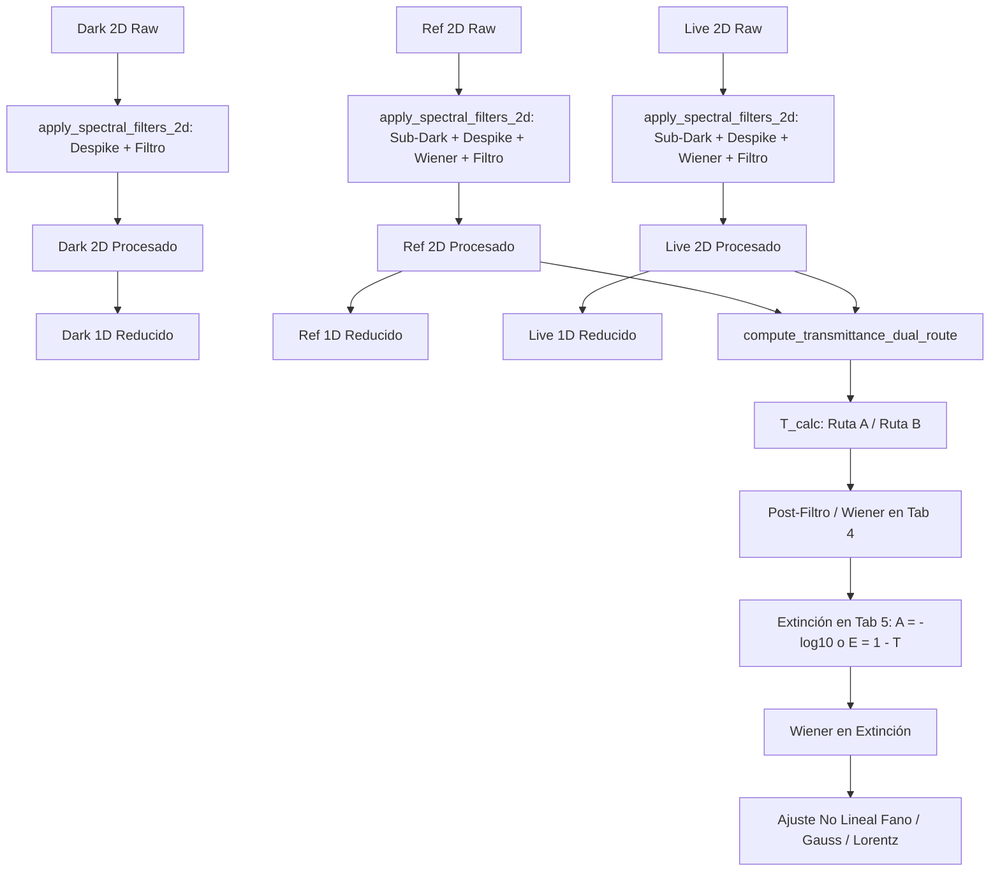

# Módulo 12 — Analizador y Procesador Espectral SIF (Andor Solis)

## 1. Descripción General y Propósito Científico
El **Analizador y Procesador de Espectros SIF** (`sif_analyzer.py` y `core/sif_processor.py`) es la suite de software especializada de PyPrinting 3.0 para la inspección visual, acondicionamiento de señales, álgebra espectral, ajuste no lineal de resonancias plasmónicas y exportación metrológica de archivos `.sif` generados por el software **Andor Solis** con cámaras EMCCD iXon3 y espectrógrafos Czerny-Turner Shamrock 500i.

El módulo está diseñado para que cualquier investigador, estudiante o técnico de laboratorio pueda cargar espectros crudos, pre-procesarlos físicamente, calcular transmitancias exactas y ajustar picos plasmónicos (LSPR / Fano) con precisión nanométrica e incertidumbres certificadas bajo normas ISO/GUM.

```
+----------------------------------------------------------------------------------------------------+
|                                      SIF ANALYZER SUITE                                            |
+-----------------------------------+----------------------------------------+-----------------------+
| GESTOR DE ARCHIVOS SIF (IZQ)      | 5 VENTANAS DE PROCESO (CENTRAL)        | PANEL INSTRUMENTAL    |
| - Archivo Maestro del Lote        | 1. Ruido / Dark (1D/2D, PSD, Filtros)  | - Torreta 5 Objetivos |
| - Tabla con scroll horizontal     | 2. Referencia (ROI, Wiener, Despike)   | - Calib. Externa      |
| - Nombre completo sin recortes    | 3. Live / Señal (Muestra, Copiar ROI)  | - Exportación Lote    |
| - Canales (1D/2D) y Roles         | 4. Transmisión (Panel 2D, Residuos)    | - Imagen 300 DPI/SVG  |
| - Tooltips con ruta completa      | 5. Extinción & Ajuste Picos Fano/Gauss | - Toggle [Ctrl+D]     |
+-----------------------------------+----------------------------------------+-----------------------+
```

---

## 2. Tipos de Archivos SIF y Corrección de Calibración

Andor Solis adquiere datos espectrales en dos modalidades físicas principales:

| Modo de Adquisición | Dimensiones del Sensor | Estructura en Memoria | Significado Físico y Manejo en el Módulo |
|---|---|---|---|
| **1D Binned (FVB)** | `(1, 1, N_λ)` | Vector 1D de $N_\lambda$ puntos (ej. 1024 o 2048 canales). | Integración física de cargas por hardware (*Full Vertical Binning*). Se despliega en 1D y como una franja térmica 2D continua a lo largo de $\lambda$. |
| **2D Multi-Pixel (Slit Imaging)** | `(1, N_y, N_λ)` | Matriz 2D de $N_y$ píxeles verticales $\times$ $N_\lambda$ canales espectrales. | Dispersión resuelta verticalmente a lo largo de la ranura de entrada ($Y$). Permite selección de ROI vertical interactivo y cálculo píxel a píxel. |

### Corrección Automática de la Discrepancia en Longitud de Onda
En archivos 2D multi-pixel, los decodificadores estándar de código abierto interpretan erróneamente la longitud total de la imagen ($N_y \times N_\lambda$) como el número de píxeles espectrales, generando ejes de longitud de onda astronómicos e irreales (hasta 35,000 nm).
El motor `core/sif_processor.py` detecta automáticamente este caso y evalúa el polinomio cúbico de dispersión espectral del espectrógrafo únicamente sobre el ancho real $N_\lambda$:
$$\lambda(p) = a + b \cdot p + c \cdot p^2 + d \cdot p^3 \quad \text{con } p \in [0, N_\lambda - 1]$$
restituyendo con precisión sub-nanométrica el rango experimental genuino (ej. 450.0 nm a 950.0 nm).

---

## 3. Estructura Multi-Canal de Andor Solis y Resolución de la Transmitancia

### La Causa Raíz de las Transmitancias Disparatadas (>6000%)
En archivos SIF multi-canal generados en mediciones de transmitancia por Andor Solis, la cámara adquiere 4 canales secuenciales:
* **Canal 0 (`Transmittance`)**: Transmitancia calculada internamente por Andor Solis ($T_{\text{meas}}$).
* **Canal 1 (`Counts (Bg Corrected)`)**: Canal de Referencia de la lámpara ($R$). **Andor Solis ya le ha sustraído internamente el Dark/Fondo.**
* **Canal 2 (`Counts`)**: Canal de Ruido / Dark de fondo ($D \approx 320\text{ cuentas}$).
* **Canal 3 (`Counts`)**: Canal de Señal Live de la muestra ($L$). **Contiene las cuentas brutas con el Dark sumado.**

Si el software aplicara ciegamente la fórmula clásica de libro de texto:
$$T_{\text{erróneo}}(\lambda) = \frac{L(\lambda) - D(\lambda)}{R(\lambda) - D(\lambda)} \times 100\%$$
al restar $D \approx 320$ cuentas de una referencia que ya fue restada por fondo ($R \approx 10 \sim 350$ cuentas en las alas de baja emisión), el denominador se convertía en un número ínfimo o negativo, disparando la transmitancia calculada a valores absurdos del $300\%$ al $6000\%$.

### Solución Física Implementada
El sistema analiza la cabecera del canal 1 buscando la propiedad `ref_is_bg_corrected` (`b'Counts (Bg Corrected)'`). Si está presente, aplica automáticamente la fórmula matemáticamente consistente:
$$T_{\text{calc}}(\lambda) = \frac{L(\lambda) - D(\lambda)}{R(\lambda)} \times 100\%$$
Esto produce una concordancia prácticamente perfecta con la medición nativa de Solis:
* Archivo 1D (`Fbin`): Diferencia mediana $|T_{\text{calc}} - T_{\text{meas}}| = \mathbf{0.0037\%}$.
* Archivo 2D (`oblicua`): Diferencia mediana $|T_{\text{calc}} - T_{\text{meas}}| = \mathbf{0.29\%}$ ($<0.5\%$).

---

## 4. Arquitectura de las 5 Ventanas de Proceso

La interfaz central está dividida en 5 pestañas de proceso ordenadas según la secuencia experimental lógica:

```
[⬛ 1. Ruido / Dark] ➔ [💡 2. Referencia] ➔ [🔴 3. Live / Señal] ➔ [📊 4. Transmisión] ➔ [🔬 5. Extinción y Ajuste]
```

Cada pestaña cuenta con un diseño ergonómico en **dos filas compactas** con anchos mínimos optimizados ($\approx 550\text{ px}$), permitiendo angostar el panel central y desplegar holgadamente el panel lateral derecho.

---

### Pestaña 1: ⬛ 1. Ruido / Dark (Caracterización de Fondo)

#### Propósito:
Visualizar e inspeccionar el sesgo electrónico y térmico del detector CCD (Dark) y modelar su estadística para la limpieza adaptativa de las siguientes pestañas.

#### Controles:
* **Fila 1 (Origen y Diagnóstico)**:
  * `Origen Ruido`: Informa si el ruido proviene del archivo activo o si fue heredado del Archivo Maestro (`👑 Maestro`).
  * `[x] Despike`: Elimina rayos cósmicos píxel a píxel mediante el umbral adaptativo $k \cdot \sigma_{BG}(\lambda)$ o MAD.
  * `🔍 Ver PSD`: Abre una ventana modal de diagnóstico con la **Densidad Espectral de Potencia (PSD)** del ruido en el dominio de frecuencias espaciales y el perfil $\sigma_{BG}(\lambda)$.
  * `↺ Raw`: Desactiva instantáneamente los filtros para inspeccionar la señal cruda del detector.
  * `Auto-Escala`: Ajusta automáticamente los límites de los ejes $X$ e $Y$.
* **Fila 2 (Suavizado)**:
  * `Filtro Suavizado`: Selector de algoritmo (Ninguno, Savitzky-Golay, Fourier Lowpass, Media Móvil).
  * `Ventana`: Longitud de ventana móvil en píxeles espectrales (número impar, ej. 15 px).
* **Gráficos**:
  * **Mapa Espacial 2D**: Heatmap viridis de la matriz $N_y \times N_\lambda$ del sensor.
  * **Espectro 1D**: Perfil de cuentas de ruido vs longitud de onda con leyenda y tarjeta de métricas (Bias Medio, $\sigma_{\text{dark}}$, Mín, Máx).

---

### Pestaña 2: 💡 2. Referencia (Lámpara Halógena / Fondo Óptico)

#### Propósito:
Extraer la envolvente espectral de la fuente de iluminación de campo claro, aislar la región vertical iluminada de la ranura (ROI) y filtrar el ruido de alta frecuencia sin alterar la forma del espectro.

#### Controles en Secuencia Lógica:
* **Fila 1 (Entrada y Región Espacial ROI)**:
  * `Origen Referencia`: Indica si la lámpara proviene del archivo local o del Maestro.
  * `Fuente`: Selector de prioridad (`Auto (Propia o Maestro)`, `Forzar Propia del Archivo`, `Forzar 👑 Maestro`).
  * `ROI Y Min` / `ROI Y Max`: Píxeles verticales inferior y superior de la ranura CCD a integrar (ej. de 10 a 50 px).
  * `Modo`: Método de reducción vertical (`Promedio` normalizado por fila o `Suma` acumulada de fotones).
  * `Auto-Escala`: Ajusta los ejes visuales.
* **Fila 2 (Acondicionamiento Físico y Filtros Espectrales)**:
  * `[x] Restar Ruido Dark`: Resta la matriz 2D y el espectro 1D de ruido (se omite automáticamente si el canal ya viene corregido por Solis).
  * `[x] Despike`: Remoción de artefactos cósmicos espurios.
  * `[x] Wiener Adaptativo`: Filtro óptimo en frecuencia basado en la PSD del detector.
  * `α`: Factor de agresividad del filtro Wiener (0.5 suave, 1.0 estándar, 2.0 agresivo).
  * `Filtro` y `Ventana`: Suavizado espectral tradicional (Savitzky-Golay / Fourier).
  * `↺ Raw`: Reinicia temporalmente los filtros a estado crudo.
* **Sub-Pestañas**:
  * **📊 Espectro y Región 2D**: Muestra el mapa 2D con la región arrastrable horizontal (`LinearRegionItem`) y el espectro 1D promediado.
  * **📈 Comparador de Referencias**: Superpone todas las referencias cargadas en el lote normalizadas al máximo para verificar estabilidad temporal de la lámpara.

---

### Pestaña 3: 🔴 3. Live / Señal (Muestra Nanométrica)

#### Propósito:
Inspeccionar la señal transmitida o dispersada por la muestra coloidal, nanopartícula o red cristalina, asegurando que el ROI espacial coincida exactamente con la referencia.

#### Controles en Secuencia Lógica:
* **Fila 1 (Entrada y Selección de Muestra)**:
  * `Muestra Activa`: Combo desplegable para alternar rápidamente entre todas las muestras del lote cargado.
  * `ROI Y Min` / `ROI Y Max`: Límites espaciales verticales.
  * `Modo`: Promedio o Suma.
  * `🔗 Copiar ROI Ref`: **Botón de 1-Click** que clona los límites $Y_{\text{min}}, Y_{\text{max}}$ y el modo de integración definidos en la Pestaña 2 hacia la muestra activa, garantizando coincidencia espacial perfecta.
  * `Auto-Escala`: Encuadre automático.
* **Fila 2 (Acondicionamiento y Filtrado)**:
  * `[x] Restar Ruido Dark`, `[x] Despike`, `[x] Wiener Adaptativo` con selector $\alpha$, `Filtro` y `Ventana`.
  * `↺ Raw`: Reinicia los filtros de señal a estado crudo.
* **Gráficos**:
  * Mapa 2D con selector visual arrastrable.
  * Espectro 1D con tarjeta de métricas que reporta Cuentas Medias, Longitud de onda del pico de la muestra ($\lambda_{\text{peak}}$) y Relación Señal/Ruido (**SBR**).

---

### Pestaña 4: 📊 4. Transmisión (Cálculo Físico y Residuos)

#### Propósito:
Calcular la transmitancia óptica espectral $T(\lambda)$, contrastar las dos rutas metodológicas 2D, comparar contra la curva de Andor Solis y evaluar la banda de incertidumbre combinada.

#### Controles Organizados en Paneles Lógicos:
* **Fila 1 (Configuración de Cálculo Físico & Post-Filtros)**:
  * **Panel `⚙️ Opciones de Cálculo 2D`**:
    * `(●) Ruta A (Pixel 2D)`: Calcula $T(y, \lambda) = \frac{\text{Live}(y, \lambda)}{\text{Ref}(y, \lambda)} \times 100\%$ píxel a píxel en la matriz bidimensional del sensor y luego promedia las filas del ROI. Es la ruta recomendada para muestras espacialmente homogéneas, ya que cancela aberraciones ópticas del slit antes de integrar.
    * `(○) Ruta B (Promedios ROI)`: Promedia verticalmente las cuentas del ROI de Live y Ref por separado y luego efectúa el cociente $T(\lambda) = \frac{\langle\text{Live}\rangle}{\langle\text{Ref}\rangle} \times 100\%$. Es más robusta frente a condiciones de muy baja señal fotónica.
    * `[ ] Comparar A y B`: Superpone en tiempo real la curva de Ruta B (trazo discontinuo amarillo) sobre la Ruta A para evidenciar divergencias espaciales o gradientes.
    * `Noise Gate`: Umbral mínimo de cuentas en la referencia (ej. 5.0 cuentas). Píxeles con cuentas inferiores se descartan para prevenir asíntotas o divisiones por cero en los extremos del espectro.
  * **Panel `🧹 Post-Filtro Espectral en T(λ)`**:
    * `Filtro`: Savitzky-Golay, Fourier Lowpass, Media Móvil o Wiener.
    * `Ventana`: Longitud de ventana de suavizado.
    * `Wiener` y `α`: Limpieza adaptativa aplicada directamente sobre la curva de transmitancia.
* **Fila 2 (Curvas Visibles & Acciones)**:
  * **Panel `👁️ Curvas Visibles`**:
    * `[x] T_calc (%)`: Curva verde calculada físicamente por el módulo.
    * `[x] T_meas SIF (%)`: Curva azul punteada adquirida originalmente por Andor Solis.
    * `[x] Banda Incertidumbre (±σ_T)`: Área sombreada semitransparente que representa la incertidumbre combinada a $\pm 1\sigma_T$.
  * `Auto-Escala`: Re-escala los ejes de transmitancia y residuos.
  * `⚡ Recalcular`: Fuerza la re-evaluación inmediata de todo el pipeline científico en las 5 ventanas.
* **Gráficos Splitter Vertical**:
  * **Gráfico Superior**: Espectro de transmitancia óptica $T(\lambda)$ [%]. Incluye retículo en cruz interactivo (crosshairs) que reporta $\lambda$ y $T$ al mover el puntero.
  * **Gráfico Inferior**: Espectro de residuos $\Delta T(\lambda) = T_{\text{meas}}(\lambda) - T_{\text{calc}}(\lambda)$ con línea de referencia cero punteada.
  * **Tarjeta de Métricas**: Reporta $T_{\text{media}}$, $T_{\text{mín}}$, $T_{\text{máx}}$, Discrepancia RMS con Solis e Incertidumbre Media $\bar{\sigma}_T$.

---

### Pestaña 5: 🔬 5. Extinción y Ajuste de Picos Plasmónicos (LSPR / Fano)

#### Propósito:
Convertir la transmitancia en absorbancia/extinción óptica, aislar la banda plasmónica y ajustar funciones teóricas (Gauss, Lorentz, Fano) mediante optimización no lineal por mínimos cuadrados (Levenberg-Marquardt), calculando la incertidumbre combinada instrumental $u_c(\lambda)$.

#### Controles:
* **Fila 1 (Modelo de Extinción)**:
  * `Fórmula`:
    * $\text{Absorbancia } A = -\log_{10}(T / 100)$: Conforme a la Ley de Beer-Lambert.
    * $\text{Extinción } E = 1 - (T / 100)$: Extinción normalizada complementaria.
  * `[x] Pre-filtrado Wiener en Extinción` + `α`: Limpia el espectro de extinción antes del ajuste para evitar que ruido residual atrape al optimizador en mínimos locales.
  * `Auto-Escala`: Encuadre del gráfico.
* **Fila 2 (Modelo de Ajuste y ROI Espectral)**:
  * `Modelo Ajuste`:
    * **Gaussiano**: Perfiles dominados por ensanchamiento inhomogéneo o dispersión de tamaños coloidales:
      $$y(\lambda) = y_0 + A \cdot \exp\left(-\frac{(\lambda - \lambda_0)^2}{2\sigma^2}\right)$$
    * **Lorentziano**: Resonancia plasmónica dipolar homogénea (LSPR de nanopartículas esféricas individuales):
      $$y(\lambda) = y_0 + \frac{A}{\pi} \frac{\gamma}{(\lambda - \lambda_0)^2 + \gamma^2}$$
    * **Resonancia de Fano**: Interferencia cuántica/electrodinámica asimétrica entre un continuo y un modo discreto (típica en dímeros plasmónicos y nanoestructuras oligoméricas):
      $$y(\lambda) = y_0 + A \cdot \frac{(q + \epsilon)^2}{1 + \epsilon^2}, \quad \text{donde } \epsilon = \frac{\lambda - \lambda_0}{\Gamma / 2}$$
      donde $q$ es el **parámetro de asimetría de Fano**.
  * `ROI λ Min` / `ROI λ Max`: Límites espectrales inferior y superior del intervalo de ajuste (sincronizados bidireccionalmente con las reglas arrastrables moradas `LinearRegionItem` del gráfico).
  * `Ranura (µm)`: Ancho físico de la ranura de entrada del Shamrock 500i (leído del SIF o editable) para propagar la resolución instrumental.
  * `⚡ Ajustar Pico en ROI`: Ejecuta el ajuste no lineal y computa la matriz de covarianza de los parámetros.
  * `💾 Exportar Ajuste`: Guarda la curva experimental, la curva ajustada, los residuos y la ficha metrológica completa en `.txt` o `.csv`.
* **Gráficos Splitter Vertical**:
  * **Gráfico Superior**: Espectro de extinción con la curva experimental (blanca), curva de ajuste teórica (morada) y reglas arrastrables de intervalo.
  * **Gráfico Inferior**: Residuos del ajuste ($y_{\text{exp}} - y_{\text{pred}}$).
  * **Tarjeta de Resultados Detallada**: Muestra $\lambda_0 \pm u_c(\lambda_0)$, $\text{FWHM} \pm u(\text{FWHM})$, Amplitud, $R^2$, factor $q$ de Fano, incertidumbre de ranura $u_{\text{slit}}$ e incertidumbre de píxel $u_{\text{pixel}}$.

---

## 5. Gestor de Archivos (Panel Izquierdo)

El panel izquierdo administra el lote experimental con máxima ergonomía visual:
* **Archivo Maestro (`👑 Archivo Maestro del Lote`)**:
  * Muestra el nombre del archivo designado como Maestro y la lista de canales que contiene.
  * Botón `👑 Designar como Maestro`: Asigna el archivo seleccionado en la tabla para que comparta su referencia y su ruido con las muestras incompletas del lote.
* **Tabla de Archivos con Desplazador Horizontal**:
  * **Columna 0 (`Sel`)**: Casilla de verificación para incluir o excluir el archivo en los cálculos globales.
  * **Columna 1 (`Archivo`)**: Nombre completo del archivo. Gracias a `ResizeToContents` y un ancho mínimo de 180 px, **el nombre nunca se corta con puntos suspensivos**.
  * **Columna 2 (`Canales`)**: Cantidad de canales y dimensión espacial (`4 ch (2D)` o `1 ch (1D)`).
  * **Columna 3 (`Rol / Estado`)**: Función semántica (`👑 Maestro`, `Muestra Completa`, `Hereda Maestro`).
  * **Barra de Scroll Horizontal Suave**: Permite deslizarse libremente si el panel lateral está contraído.
  * **Tooltips en Cada Celda**: Al posar el puntero se muestra la ruta absoluta del archivo en disco (`C:\Users\...`), los nombres de canales y su estado.
* **Botones de Control**:
  * `📂 Añadir .SIF`: Incorpora uno o múltiples archivos al lote.
  * `📁 Cargar Carpeta`: Escanea e importa en bloque todos los archivos `.sif` de un directorio.
  * `Eliminar`: Remueve el archivo seleccionado.
  * `Auto-Roles`: Heurística inteligente que identifica automáticamente el archivo con 4 canales completos y lo designa como Maestro.

---

## 6. Panel Derecho y Configuración Instrumental

El panel derecho se puede colapsar o expandir en cualquier momento pulsando el botón **`◀ Panel / ▶ Panel`** del encabezado central o mediante el atajo de teclado **`Ctrl+D`**.

Contiene:
1. **Óptica y Torreta Instrumental de 5 Objetivos**:
   Permite seleccionar el objetivo del microscopio en uso para calcular la magnificación real hacia la ranura del espectrógrafo ($M_{\text{spec}} = \frac{312.5\,\text{mm}}{f_{\text{obj}}}$) y la escala espacial absoluta:
   * **Olympus 10x MPLN** (NA 0.25): Escala **0.7488 µm/px**
   * **Olympus 20x** (NA 0.40): Escala **0.3744 µm/px**
   * **Nikon 40x CFI S Plan Fluor** (NA 0.60): Escala **0.2080 µm/px**
   * **Olympus 60x W LUMPlanFLN** (NA 1.00): Escala **0.1248 µm/px**
   * **Nikon 100x Oil S Plan Fluor** (NA 1.30): Escala **0.0832 µm/px**
2. **Calibración Externa de Longitud de Onda**:
   * Permite inyectar archivos de dispersión polinomial externa (`pyspectrum_calibration_last.txt`), tablas `[pixel, lambda]` o vectores ASCII de calibración en caso de que el archivo SIF requiera re-calibración.
   * Botón `Restablecer`: Regresa a la calibración nativa guardada en la cabecera SIF.
3. **Exportación Científica Avanzada**:
   * **`💾 Exportar Curvas Activas`**: Genera un archivo `.dat`, `.txt` o `.csv` con encabezados metrológicos comentados (`#`) listos para importar en OriginLab, Python o MATLAB, incluyendo columnas de $\lambda$, $T_{\text{calc}}$, $\sigma_T$, $T_{\text{meas}}$, Extinción, Residuos y $u_c(\lambda)$.
   * **`📦 Exportar Lote Completo (Batch)`**: Itera por todas las muestras cargadas, calcula su transmitancia con las opciones activas y las guarda automáticamente en una subcarpeta.
   * **`📷 Guardar Imagen (PNG/SVG)`**: Exporta la gráfica activa a resolución de publicación científica (PNG a 300 DPI o vectores SVG escalables).

---

## 7. Cadena de Propagación Estricta de Filtros 2D a 1D

Para garantizar rigor físico experimental:



1. **Filtrado Bidimensional Fila a Fila**: `apply_spectral_filters_2d` procesa cada fila del chip CCD a lo largo de la dispersión espectral $\lambda$.
2. **Equivalencia Matemática**: La reducción espacial (`_reduce_matrix`) sobre la matriz 2D filtrada coincide exactamente con el espectro 1D filtrado.
3. **Transmitancia sin Doble Resta**: Al pasar las matrices ya acondicionadas a `compute_transmittance_dual_route`, se especifica `dark=None` y `ref_is_bg_subtracted=True`, asegurando que el cálculo de cocientes 2D y 1D se efectúe sobre datos limpios sin doble sustracción destructiva de ruido.
4. **Encadenamiento a Extinción**: La Pestaña 5 calcula la extinción directamente a partir del $T_{\text{calc}}$ resultante de la Pestaña 4.
5. **Mapas de Calor en Vivo**: Los plots 2D muestran en tiempo real las matrices filtradas.

---

## 8. Protocolo de Operación Paso a Paso (Guía Rápida para el Usuario)

A continuación se detalla el procedimiento estándar para procesar un conjunto de espectros de nanopartículas:

### Paso 1: Cargar Archivos
1. Abra el Analizador SIF desde el lanzador `main.py` pulsando **`🔬 Iniciar Analizador SIF`** (o ejecutando `python sif_analyzer.py`).
2. Pulse **`📂 Añadir .SIF`** y seleccione los archivos de su medición (o pulse **`📁 Cargar Carpeta`**).
3. Si cargó un set donde un archivo contiene los 4 canales completos (ruido, lámpara, transmitancia y muestra), selecciónelo en la tabla y pulse **`👑 Designar como Maestro`** (o pulse **`Auto-Roles`**).

### Paso 2: Verificar Ruido y Lámpara (Pestañas 1 y 2)
1. Vaya a la **Pestaña 1 (Ruido / Dark)**:
   - Verifique que el nivel medio esté en torno a las cuentas de bias del CCD (~300–350 cuentas).
   - Opcionalmente pulse **`🔍 Ver PSD`** para inspeccionar las componentes de frecuencia del ruido.
2. Vaya a la **Pestaña 2 (Referencia)**:
   - En el mapa 2D superior, arrastre la regla horizontal (`LinearRegionItem`) para delimitar el haz iluminado de la lámpara.
   - Ajuste `ROI Y Min` y `ROI Y Max` si prefiere valores numéricos exactos.
   - Deje activo `[x] Restar Ruido Dark` y `[x] Despike`.
   - Si la lámpara tiene ruido de alta frecuencia, active `[x] Wiener Adaptativo` con $\alpha = 1.0$.

### Paso 3: Configurar Señal de Muestra (Pestaña 3)
1. Vaya a la **Pestaña 3 (Live / Señal)**.
2. Pulse **`🔗 Copiar ROI Ref`**: los límites de integración vertical de la lámpara se clonarán instantáneamente a la muestra.
3. Use el combo `Muestra Activa` para alternar entre las diferentes partículas o posiciones medidas.

### Paso 4: Inspeccionar Transmitancia (Pestaña 4)
1. Vaya a la **Pestaña 4 (Transmisión)**.
2. En el panel **`⚙️ Opciones de Cálculo 2D`**:
   - Deje seleccionada **`Ruta A (Pixel 2D)`** para máxima fidelidad espacial.
   - Active temporalmente **`Comparar A y B`** para verificar que ambas rutas coincidan.
   - Verifique que `Noise Gate` esté en $\approx 5.0$ cuentas.
3. En el panel **`👁️ Curvas Visibles`**, active `T_calc (%)`, `T_meas SIF (%)` y `Banda Incertidumbre (±σ_T)`.
4. Observe en el gráfico inferior el residuo $\Delta T$: en condiciones normales la discrepancia es $<0.5\%$.
5. Si desea suavizar la transmitancia para eliminar ruido fotónico residual antes del ajuste, configure el **`Post-Filtro Espectral`** (ej. Savitzky-Golay con ventana 15).

### Paso 5: Ajustar Resonancia Plasmónica y Exportar (Pestaña 5)
1. Vaya a la **Pestaña 5 (Extinción y Ajuste)**.
2. Seleccione la fórmula deseada (habitualmente `Absorbancia A = -log10(T/100)`).
3. Seleccione el modelo espectral:
   - `Lorentziano` para nanopartículas individuales esféricas.
   - `Resonancia de Fano` para nanodímeros o acoplamiento plasmónico asimétrico.
4. En el gráfico de extinción, arrastre las barras moradas para enmarcar el pico de interés (o ajuste `ROI λ Min` y `ROI λ Max`).
5. Pulse **`⚡ Ajustar Pico en ROI`**.
6. Revise la tarjeta inferior: obtendrá $\lambda_0$ (longitud de onda de resonancia en nm), el ancho a media altura (FWHM), la bondad de ajuste $R^2$ y la incertidumbre instrumental combinada $u_c(\lambda_0)$.
7. Pulse **`💾 Exportar Ajuste`** para guardar los resultados en un archivo de texto tabulado listo para graficar en OriginLab.
8. En el panel derecho (despliéguelo con `Ctrl+D` si está oculto), pulse **`💾 Exportar Curvas Activas`** para guardar la transmitancia y extinción completas, o **`📷 Guardar Imagen`** para exportar la figura en alta resolución a 300 DPI.

---

## 9. Atajos de Teclado y Ayuda Rápida

| Atajo de Teclado | Acción en la Suite |
|---|---|
| **`Ctrl+D`** | Alterna la visibilidad del panel derecho (Colapsar / Desplegar) para ganar espacio en el panel central. |
| **`Ctrl+O`** | Abre el diálogo para añadir archivos `.sif`. |
| **`Ctrl+Shift+O`** | Abre el diálogo para cargar una carpeta completa con archivos SIF. |
| **`Ctrl+S`** | Exporta las curvas procesadas de la muestra activa a `.dat`/`.txt`/`.csv`. |
| **`Ctrl+Shift+S`** | Exporta en lote (Batch) todas las muestras del conjunto. |
| **`Ctrl+I`** | Exporta la gráfica activa a imagen PNG (300 DPI) o vector SVG. |
| **`F5`** | Fuerza el recálculo integral de todas las curvas (`⚡ Recalcular`). |
| **`Puntero sobre control`** | Muestra el cartelito de ayuda flotante (*Tooltip*) con la función física de la perilla o casilla. |
