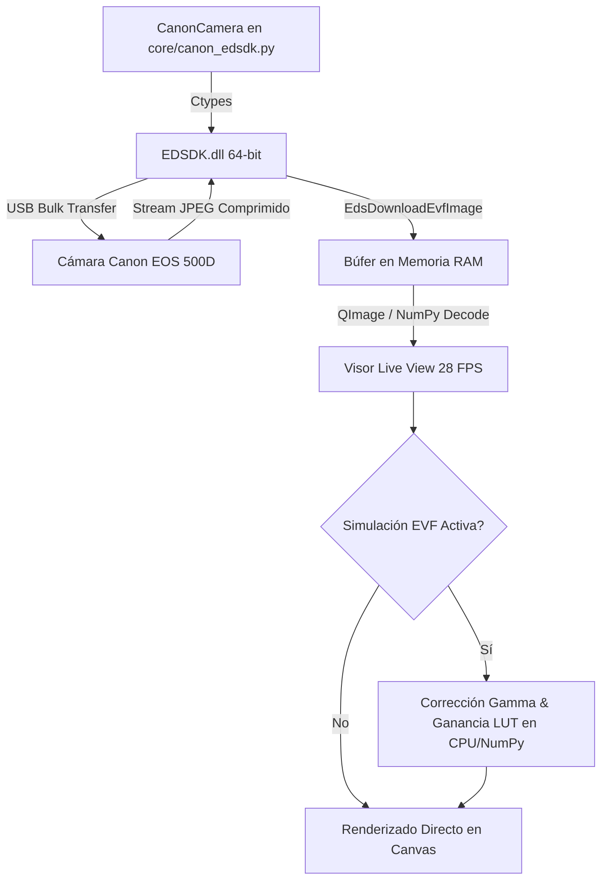

# MOD-04: Cámara Live View (Canon EOS EDSDK) 📷

**PyPrinting 3.0 — Suite de Nanofotónica y Control Instrumental**  
**Laboratorio de Nanofotónica — Instituto de Nanosistemas (INS-UNSAM / CONICET)**  
**Manual de Usuario Canónico** | **Código:** `MOD-04` | **Nivel de Usuario:** Básico / Operador  
**Archivos Fuente Asociados:**
- [`modules/camera.py`](file:///c:/Users/josel/Documents/Obsidian_Vault/printing3/modules/camera.py) (Interfaz de visualización en vivo, PiP, zoom y overlays)
- [`core/canon_edsdk.py`](file:///c:/Users/josel/Documents/Obsidian_Vault/printing3/core/canon_edsdk.py) (Wrapper nativo 64-bit ctypes sobre EDSDK.dll de Canon)

---

## 🔗 Matriz de Referencias Cruzadas

* **Reportes de Sistema Conexos:**
  * `[[SYS-204_Modulo_Camara_Canon_EDSDK_y_Buffer_RAM]]`
  * `[[SYS-101_Arquitectura_Hilos_Concurrencia_QThread]]`
  * `[[SYS-104_Matriz_Intercambio_Archivos_y_Formatos_IO]]`
* **Fundamentos Científicos Asociados:**
  * `[[CAT-108_Teoria_Optica_Telescopio_Rele_4f_y_Canales_Confocales]]`
  * `[[CAT-203_Presupuesto_Incertidumbre_Metrologica_ISOGUM_Microscopia]]`
* **Manuales de Usuario Conexos:**
  * `[[MOD-01_Microscopio_Derecho_App]]`
  * `[[MOD-10_Image_Analyzer_Tracking]]`

---

## 1. Resumen y Rol en el Sistema


El módulo **Cámara Live View** proporciona la interfaz visual directa de campo amplio (*widefield*) del microscopio mediante una cámara réflex **Canon EOS 500D** (sensor APS-C CMOS de $15.1\ \text{MP}$).

Funcionalidades centrales:
- **Control Nativo por EDSDK 64-bit (`ctypes`)**: Comunicación directa con `EDSDK.dll` sin puentes intermedios lentos, permitiendo transmisión continua a **$25-30\ \text{FPS}$** y captura a resolución completa ($4752 \times 3168\ \text{px}$).
- **Simulación de Exposición EVF en Tiempo Real**: Aplica curvas de corrección gamma y ganancia digital en software para visualizar campos oscuros de baja fluorescencia o dispersión antes de capturar la fotografía final.
- **Ventana Miniatura Picture-in-Picture (PiP)**: Inset flotante en la esquina del visor para zoom digital o monitor secundario.
- **Capa Interactiva de Anotaciones (`OverlayWidget`)**: Definición de escala nanométrica ($\mu\text{m}/\text{px}$), punto de referencia cruzada, región de interés (ROI), reglas milimétricas y marcas de texto.
- **Motor Dual de Detección de Partículas**: Integración con **Trackpy** (Crocker-Grier) y **Picasso (SMLM MLE / LQ)** con renderizado directo sobre el canvas.

---

## 2. 🖼️ Maqueta de la Interfaz Visual (ASCII Layout)

```
┌──────────────────────────────────────────────────────────────────────────────────────────────────────────────────┐
│  PyPrinting 3.0 — Cámara Réflex Canon EOS 500D (Live View EDSDK 64-bit)                               -  □  ×    │
├──────────────────────────────────────────────────────────────────────────────────────────────────────────────────┤
│  PANEL SUPERIOR DE CONTROL ÓPTICO Y EXPOSICIÓN                                                                   │
│  [ ▶ LIVE VIEW (F1) ]  [ 📸 SNAP (F8) ]  [ ⏺ REC VIDEO ]  │  ISO: [ 800 ▼]  Tv: [ 1/30s ▼]  Zoom: [ 5x (EVF) ▼]  │
│  Simulación EVF: [X] Activa  Brillo: [───●─────] +1.2 EV  Gamma: [───●─────] 1.4  AE Mode: Manual (M)            │
├──────────────────────────────────────────────────────────────────────────────────────────────────────────────────┤
│  CANVAS DE VIDEO PRINCIPAL (PyQt6 GraphicsView + OverlayWidget)                                                  │
│  ┌────────────────────────────────────────────────────────────────────────────────────────────────────────────┐  │
│  │                                                                ┌──────────────────────────────────────┐    │  │
│  │     + (Cruz de Referencia PI: X=25.400, Y=30.120 µm)           │ MINIATURA PiP (Zoom Digital 10x)     │    │  │
│  │                                                                │  [ Detalle Ampliado de Partícula ]   │    │  │
│  │        ┌─────────────────────────┐                             │  FWHM: 282 nm | SNR: 18.4 dB         │    │  │
│  │        │ ROI Seleccionado        │                             └──────────────────────────────────────┘    │  │
│  │        │ 🟡 NP #1 (x=12.4,y=15.1)│                                                                         │  │
│  │        │ 🟡 NP #2 (x=18.2,y=15.0)│                                                                         │  │
│  │        └─────────────────────────┘                                                                         │  │
│  │                                                                                                            │  │
│  │                                                                                                            │  │
│  │  ├── 10.0 µm ──┤ [Escala: 0.0842 µm/px]                                                                    │  │
│  └────────────────────────────────────────────────────────────────────────────────────────────────────────────┘  │
├──────────────────────────────────────────────────────────────────────────────────────────────────────────────────┤
│  HERRAMIENTAS DE ANÁLISIS RÁPIDO: [ 📏 Regla ]  [ 📐 Set Scale ]  [ 🔍 Detectar Partículas (Trackpy/Picasso) ]    │
│  🟢 Canon EOS 500D Conectada | Live View: 28.5 FPS | Batería: 85% | 4752x3168 RAW+JPEG | Directorio: C:/Data    │
└──────────────────────────────────────────────────────────────────────────────────────────────────────────────────┘
```

---

## 3. 🎛️ Catálogo de Botones y Controles de la Cámara

| Control / Botón | Tipo de Widget | Atajo | Rango / Opciones | Descripción Técnica |
|---|---|:---:|---|---|
| `LIVE VIEW` | `QPushButton` | `F1` | `ON / OFF` | Activa o pausa la descarga continua de frames EVF desde la memoria de la Canon. |
| `SNAP` | `QPushButton` | `F8` | — | Dispara el obturador mecánico a máxima resolución ($15.1\ \text{MP}$) y descarga el archivo. |
| `ISO Combo` | `QComboBox` | — | `100, 200, 400, 800, 1600, 3200, 6400, 12800` | Modifica la ganancia analógica del sensor mediante `kEdsPropID_ISOSpeed`. |
| `Tv Combo` | `QComboBox` | — | `1/4000s` a `30s`, `Bulb` | Tiempo de exposición mecánico mediante `kEdsPropID_Tv`. |
| `Zoom Combo` | `QComboBox` | — | `1x`, `5x`, `10x` | Controla el zoom digital óptico nativo del visor réflex (`kEdsPropID_Evf_Zoom`). |
| `Set Scale` | `QPushButton` | — | Diálogo con regla | Calibra la relación de píxeles a micrómetros reales ($\mu\text{m}/\text{px}$). |
| `Detect Particles`| `QPushButton` | — | Diálogo multimotor | Abre el diálogo `TrackpyDialog` / Picasso para detección y conteo sub-píxel. |

---

## 4. 📥 Archivos de Entrada que Solicita

1. **Imágenes de Referencia para Calibración de Escala (`*.tif`, `*.jpg`, `*.png`)**:
   - Imágenes de micropatrones de calibración (ej. regla de $10\ \mu\text{m}$ Ronchi o patrón de calibración Thorlabs).

---

## 5. 📤 Archivos de Salida que Genera

1. **Fotografía de Alta Resolución (`Foto_YYYYMMDD_HHMMSS.tiff` / `.jpg`)**:
   - *Resolución*: $4752 \times 3168\ \text{píxeles}$ en color RGB de 24 o 48 bits.
   - *Metadatos EXIF*: ISO, velocidad de obturación, apertura del objetivo y marca temporal.
2. **Fotografía con Anotaciones Superpuestas (`Foto_annotated_*.jpg`)**:
   - Incluye barra de escala grabada, cruces de partículas detectadas y coordenadas.
3. **Tabla de Partículas Detectadas (`tracking_particles_*.csv`)**:
   - *Estructura*:
     ```csv
     # PyPrinting 3.0 Particle Detection Export (Picasso GaussMLE)
     # Scale: 0.0842 um/px | ROI: (120, 80, 450, 380) px
     Particle_ID,X_px,Y_px,Coord_X_um,Coord_Y_um,Photons,Sigma_X_px,Sigma_Y_px
     1,215.42,148.11,18.14,12.47,48520,1.42,1.39
     2,340.85,210.63,28.70,17.73,52140,1.38,1.41
     ```

---

## 6. ⚙️ Arquitectura del Wrapper EDSDK 64-bit



---

## 7. ⚠️ Límites de Validez y Modos de Falla

| Condición de Borde (Fallo de Cámara / SDK) | Firma Experimental (Live View / Captura) | Acción Correctiva Física (Procedimiento en Laboratorio) |
| :--- | :--- | :--- |
| **Bloqueo de Búfer USB o Auto-Apagado de Cámara Canon** (`EDSDK_ERR_DEVICE_BUSY 0x82`). | El visor Live View se congela por completo (`Freeze Frame`), el contador de FPS cae a 0; error en consola al intentar disparar foto. | Desactivar la función *Auto Power Off* (ajustar a `OFF`) en el menú físico de la cámara réflex, comprobar el acoplamiento del eliminador de batería a $220\ \text{V}$ y reiniciar el flujo con `Reiniciar Cámara`. |
| **Saturación de Píxeles por Iluminación de Campo Oscuro** (Píxeles blancos $= 255$). | Fondo blanco brillante saturado que impide localizar centroides en Trackpy/Picasso; pérdida de contraste de las nanopartículas. | Reducir la intensidad de la lámpara halógena de campo oscuro, cerrar ligeramente el diafragma iris del condensador o ajustar el tiempo de exposición / ISO en la interfaz. |
| **Pérdida de Calibración de Escala Espacial ($\mu\text{m/px}$)** tras cambio de objetivo. | Las dimensiones de las partículas o grillas medidas en la imagen no coinciden con las distancias de la platina piezoeléctrica PI. | Cargar el patrón de rejilla micrométrica calibrada ($10\ \mu\text{m/div}$) y recalibrar el factor de escala $\mu\text{m/px}$ para el objetivo activo ($60\times$ o $100\times$) en el menú de configuración. |

---

## 8. 🛡️ Arquitectura de Estabilidad, Concurrencia y Cuidado de Hardware

Para erradicar cuelgues durante el uso intensivo en el laboratorio y prolongar la vida útil del sensor y obturador réflex, el módulo implementa salvaguardas arquitectónicas integradas:

### 8.1 Throttling USB en Panning y Navegación Dinámica (~12 Hz)
Durante el arrastre del ratón con el botón presionado en el canvas o en la miniatura PiP, los eventos de movimiento `mouseMoveEvent` pueden superar los $500\ \text{Hz}$.
* **Desacople Óptico Inmediato:** El canvas redibuja localmente el área visible a **60 FPS** sin latencia perceptible.
* **Rate-Limiting hacia la Cámara:** Las coordenadas de centrado de zoom de hardware hacia la réflex se encolan mediante un temporizador monodisparo (`_throttle_zoom_center_timer`, intervalo $80\ \text{ms}$, máx $\approx 12.5\ \text{Hz}$). Esto impide saturar el búfer USB de la cámara y previene el error `EDS_ERR_DEVICE_BUSY`.

### 8.2 Bucle de Adquisición con Temporizador Único Periódico (25.0 FPS)
* Se eliminó la recursión de `QTimer.singleShot` por un único `QTimer` (`_frame_timer`, período $40\ \text{ms}$).
* Cuenta con una guarda de reentrancia no bloqueante (`_is_fetching`). Si un cuadro tarda más de $40\ \text{ms}$, el siguiente tick se omite limpiamente en lugar de encadenar temporizadores concurrentes que dupliquen los FPS y saturen el hilo de Qt.
* Los cambios de ISO y Tv pausan temporalmente y reanudan de forma segura la misma instancia del temporizador.

### 8.3 Aceleración Gráfica y Frame-Dropping en la Interfaz
* **Frame-Dropping Adaptativo:** Si el hilo de interfaz (GUI) está ocupado renderizando o redibujando gráficos pesados, la guarda `_is_rendering_frame` descarta el cuadro intermedio y procesa directamente el último recibido.
* **Optimización Raster en Pantalla Completa:** En `pg.ImageItem`, se definen explícitamente `autoLevels=False` y `levels=(0, 255)`. Esto elimina el escaneo por software en CPU de mínimos y máximos sobre los $2.2\ \text{millones}$ de valores por cuadro a resoluciones elevadas (1080p / 1440p / 4K).

### 8.4 Desacople Reentrante en Redimensionamiento y Pantalla Completa
* Al maximizar la ventana o pasar a pantalla completa, la señal `resizeEvent` difiere el recálculo geométrico del encuadre (`_fit_camera_view_lateral`) mediante un temporizador de antirrebote (`_resize_debounce_timer`, $50\ \text{ms}$). Esto permite que el gestor de ventanas del sistema operativo finalice el layout antes de ajustar el `ViewBox(lockAspect=True)`, evitando congelamientos por bucle reentrante.

### 8.5 Cuidado del Hardware: Ciclo de Vida Limpio (`Graceful Teardown`)
* **Descenso Mecánico del Espejo:** Al cerrar la ventana (`closeEvent`), se ejecuta la secuencia formal de apagado de Live View (`kEdsEvfOutputDevice_Off`), forzando el retorno del espejo réflex y el obturador a su posición de reposo.
* **Terminación Controlada del Hilo:** Se invoca `thread.quit()` y `thread.wait(2000)`, garantizando que el proceso no finalice abruptamente mientras la DLL C++ de Canon ejecuta llamadas USB. Esto evita que el puerto USB quede trabado para la siguiente apertura de la aplicación.
* **Seguro Global `atexit`:** Un handler de salida en `core/canon_edsdk.py` captura cierres forzados de Python para asegurar la liberación del puerto USB en cualquier circunstancia.

### 8.6 Clamping Metrológico en Sensor de 15.1 MP
* En `set_live_view_zoom_position`, las coordenadas del recorte en zoom $5\times$ y $10\times$ se acotan estrictamente dentro de la matriz física de $4752 \times 3168\ \text{píxeles}$, descartando desbordes negativos o excesivos que disparaban el error de hardware `EDS_ERR_INVALID_PARAMETER (0x07)`.

---

## 9. 🔗 Referencias Cruzadas
- [[MOD-01_Microscopio_Derecho_App]] — Control del escáner confocal y sincronización de platina PI.
- [[MOD-10_Image_Analyzer_Tracking]] — Analizador de imágenes capturadas con la cámara Canon.
- [[SYS-204_Modulo_Camara_Canon_EDSDK_y_Buffer_RAM]] — Arquitectura del módulo de cámara Canon, buffer RAM y EDSDK.
- [[CAT-108_Teoria_Optica_Telescopio_Rele_4f_y_Canales_Confocales]] — Trazado de rayos y óptica 4f hacia el sensor réflex.
- [[CAT-203_Presupuesto_Incertidumbre_Metrologica_ISOGUM_Microscopia]] — Calibración de escala nanométrica $\mu\text{m/px}$ y presupuesto GUM.

