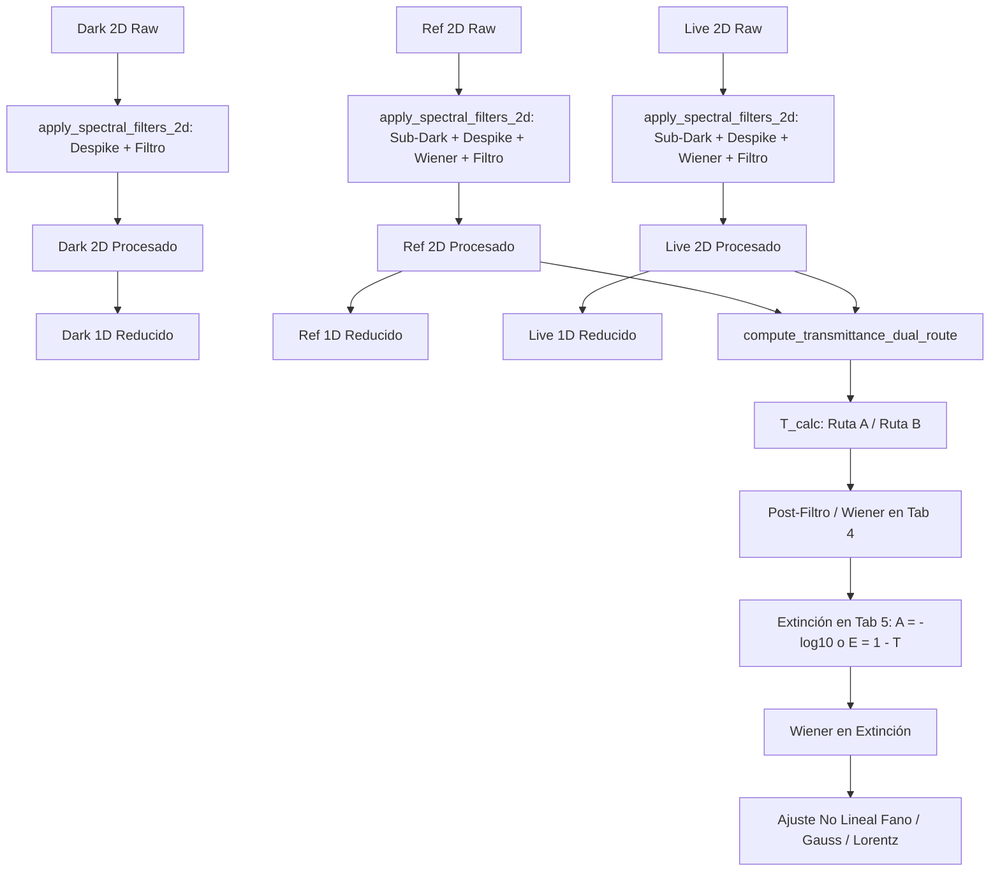

# MOD-12: Analizador y Procesador Avanzado de Espectros SIF (Andor Solis) 📈

**PyPrinting 3.0 — Suite de Nanofotónica y Control Instrumental**  
**Laboratorio de Nanofotónica — Instituto de Nanosistemas (INS-UNSAM / CONICET)**  
**Manual de Usuario Canónico** | **Código:** `MOD-12` | **Nivel de Usuario:** Intermedio / Operador / Experto  
**Archivos Fuente**: [`sif_analyzer.py`](file:///c:/Users/josel/Documents/Obsidian_Vault/printing3/sif_analyzer.py) | [`core/sif_processor.py`](file:///c:/Users/josel/Documents/Obsidian_Vault/printing3/core/sif_processor.py)  
**Lanzador Rápido**: `python sif_analyzer.py` o desde Menú Herramientas en [`main.py`](file:///c:/Users/josel/Documents/Obsidian_Vault/printing3/main.py)

---

## 🔗 Matriz de Referencias Cruzadas

* **Reportes de Sistema Conexos:**
  * `[[SYS-304_Arquitectura_Analizador_SIF_y_Filtros_Cascada]]`
  * `[[SYS-104_Matriz_Intercambio_Archivos_y_Formatos_IO]]`
  * `[[SYS-402_Auditoria_Comparativa_Andor_Solis_vs_PySpectrum]]`
  * `[[SYS-301_Sistema_Espectrometro_Shamrock500i_iXon3]]`
* **Fundamentos Científicos Asociados:**
  * `[[CAT-103_Control_Lazo_Cerrado_Fototermico_y_Sintesis_Dimeros]]`
  * `[[CAT-108_Teoria_Optica_Telescopio_Rele_4f_y_Canales_Confocales]]`
  * `[[CAT-401_Estandar_Serializacion_Jerarquica_Contenedor_HDF5]]`
* **Manuales de Usuario Conexos:**
  * `[[MOD-06_PySpectrum_Espectroscopia_Shamrock]]`
  * `[[MOD-11_Raman_Analyzer_Suite_Quimiometria]]`
  * `[[MOD-01_Microscopio_Derecho_App]]`
  * `[[MOD-14_Protocolos_Laboratorio_SOP]]`

---
El **Analizador y Procesador de Espectros SIF** (`sif_analyzer.py` y `core/sif_processor.py`) es la suite de software especializada de PyPrinting 3.0 para la inspección visual, acondicionamiento de señales, álgebra espectral, ajuste no lineal de resonancias plasmónicas y exportación metrológica de archivos `.sif` generados por el software **Andor Solis** con cámaras EMCCD iXon3 y espectrógrafos Czerny-Turner Shamrock 500i.

El módulo está diseñado para que cualquier investigador, estudiante o técnico de laboratorio pueda cargar espectros crudos, pre-procesarlos físicamente, calcular transmitancias exactas y ajustar picos plasmónicos (LSPR / Fano) con precisión nanométrica e incertidumbres certificadas bajo normas ISO/GUM.

```
+----------------------------------------------------------------------------------------------------+
|                                      SIF ANALYZER SUITE                                            |
+-------------------------------------------------+--------------------------------------------------+
| PANEL IZQUIERDO DE PARÁMETROS (QScrollArea)      | PANEL CENTRAL — 100% LIENZO DE GRÁFICOS           |
| - Archivo Maestro del Lote                       | 7 Pestañas sin barras de control (Fase 4):        |
| - Gestor de Archivos (tabla navegable c/teclado) | 1. Ruido / Dark (1D/2D, PSD)                      |
| - Metadatos Activos: insignia 🗺️ 2D / 📊 1D-FVB   | 2. Referencia (ROI 2D, Comparador)                |
| - Instrumentación: Escala y Óptica (Torreta,     | 3. Live / Señal (Muestra, ROI 2D)                  |
|   Calib. Externa, Propagación ±σ_T)              | 4. Transmisión (Panel 2D, Residuos)               |
| - ⚙️ Opciones del Panel Activo (QStackedWidget,  | 5. Extinción & Ajuste Multi-Pico (Fano/Voigt)     |
|   sincronizado con la pestaña central activa)    | 6. Multi-Espectro & Polarización (Malus, g)       |
| - 📖 Wiki Científica (barra superior)             | 7. Ficha Metrológica & FAIR (HDF5/NeXus)          |
+-------------------------------------------------+--------------------------------------------------+
```

> [!NOTE]
> **Fase 1 — Reestructuración Ergonómica (2026):** el antiguo `QSplitter` de 3 hojas (Izquierda / Central / Derecha) fue consolidado en un `QSplitter` de 2 hojas. La instrumentación óptica y de calibración, antes en un panel derecho colapsable, vive ahora en el panel izquierdo junto a los archivos y metadatos. Los controles de cada una de las 5 pestañas centrales (antes apretados en 2 filas de botones sobre cada gráfico) se movieron a un panel contextual `⚙️ Opciones del Panel Activo` que cambia de contenido automáticamente según la pestaña central seleccionada, liberando el 100% del lienzo central para los gráficos.

---

## 2. Tipos de Archivos SIF y Corrección de Calibración

Andor Solis adquiere datos espectrales en dos modalidades físicas principales:

| Modo de Adquisición | Dimensiones del Sensor | Estructura en Memoria | Significado Físico y Manejo en el Módulo |
|---|---|---|---|
| **1D Binned (FVB)** | `(1, 1, N_λ)` | Vector 1D de $N_\lambda$ puntos (ej. 1024 o 2048 canales). | Integración física de cargas por hardware (*Full Vertical Binning*). Se despliega en 1D y como una franja térmica 2D continua a lo largo de $\lambda$. |
| **2D Multi-Pixel (Slit Imaging)** | `(1, N_y, N_λ)` | Matriz 2D de $N_y$ píxeles verticales $\times$ $N_\lambda$ canales espectrales. | Dispersión resuelta verticalmente a lo largo de la ranura de entrada ($Y$). Permite selección de ROI vertical interactivo y cálculo píxel a píxel. |

### Corrección Automática de la Discrepancia en Longitud de Onda
En archivos 2D multi-pixel, los decodificadores estándar de código abierto interpretan erróneamente la longitud total de la imagen ($N_y \times N_\lambda$) como el número de píxeles espectrales, generando ejes de longitud de onda astronómicos e irreales (hasta 35,000 nm).
El motor `core/sif_processor.py` detecta automáticamente este caso y evalúa el polinomio cúbico de dispersión espectral del espectrógrafo únicamente sobre el ancho real $N_\lambda$:
$$\lambda(p) = a + b \cdot p + c \cdot p^2 + d \cdot p^3 \quad \text{con } p \in [0, N_\lambda - 1]$$
restituyendo con precisión sub-nanométrica el rango experimental genuino (ej. 450.0 nm a 950.0 nm).

---

## 3. Estructura Multi-Canal de Andor Solis y Resolución de la Transmitancia

### La Causa Raíz de las Transmitancias Disparatadas (>6000%)
En archivos SIF multi-canal generados en mediciones de transmitancia por Andor Solis, la cámara adquiere 4 canales secuenciales:
* **Canal 0 (`Transmittance`)**: Transmitancia calculada internamente por Andor Solis ($T_{\text{meas}}$).
* **Canal 1 (`Counts (Bg Corrected)`)**: Canal de Referencia de la lámpara ($R$). **Andor Solis ya le ha sustraído internamente el Dark/Fondo.**
* **Canal 2 (`Counts`)**: Canal de Ruido / Dark de fondo ($D \approx 320\text{ cuentas}$).
* **Canal 3 (`Counts`)**: Canal de Señal Live de la muestra ($L$). **Contiene las cuentas brutas con el Dark sumado.**

Si el software aplicara ciegamente la fórmula clásica de libro de texto:
$$T_{\text{erróneo}}(\lambda) = \frac{L(\lambda) - D(\lambda)}{R(\lambda) - D(\lambda)} \times 100\%$$
al restar $D \approx 320$ cuentas de una referencia que ya fue restada por fondo ($R \approx 10 \sim 350$ cuentas en las alas de baja emisión), el denominador se convertía en un número ínfimo o negativo, disparando la transmitancia calculada a valores absurdos del $300\%$ al $6000\%$.

### Solución Física Implementada
El sistema analiza la cabecera del canal 1 buscando la propiedad `ref_is_bg_corrected` (`b'Counts (Bg Corrected)'`). Si está presente, aplica automáticamente la fórmula matemáticamente consistente:
$$T_{\text{calc}}(\lambda) = \frac{L(\lambda) - D(\lambda)}{R(\lambda)} \times 100\%$$
Esto produce una concordancia prácticamente perfecta con la medición nativa de Solis:
* Archivo 1D (`Fbin`): Diferencia mediana $|T_{\text{calc}} - T_{\text{meas}}| = \mathbf{0.0037\%}$.
* Archivo 2D (`oblicua`): Diferencia mediana $|T_{\text{calc}} - T_{\text{meas}}| = \mathbf{0.29\%}$ ($<0.5\%$).

---

## 4. Arquitectura de las 7 Ventanas de Proceso (Fase 4)

La interfaz central está dividida en 5 pestañas de proceso ordenadas según la secuencia experimental lógica:

```
[⬛ 1. Ruido / Dark] ➔ [💡 2. Referencia] ➔ [🔴 3. Live / Señal] ➔ [📊 4. Transmisión] ➔ [🔬 5. Extinción y Ajuste]
```

Cada pestaña cuenta con un diseño ergonómico en **dos filas compactas** con anchos mínimos optimizados ($\approx 550\text{ px}$), permitiendo angostar el panel central y desplegar holgadamente el panel lateral derecho.

---

### Pestaña 1: ⬛ 1. Ruido / Dark (Caracterización de Fondo)

#### Propósito:
Visualizar e inspeccionar el sesgo electrónico y térmico del detector CCD (Dark) y modelar su estadística para la limpieza adaptativa de las siguientes pestañas.

#### Controles:
* **Fila 1 (Origen y Diagnóstico)**:
  * `Origen Ruido`: Informa si el ruido proviene del archivo activo o si fue heredado del Archivo Maestro (`👑 Maestro`).
  * `[x] Despike`: Elimina rayos cósmicos píxel a píxel mediante el umbral adaptativo $k \cdot \sigma_{BG}(\lambda)$ o MAD.
  * `🔍 Ver PSD`: Abre una ventana modal de diagnóstico con la **Densidad Espectral de Potencia (PSD)** del ruido en el dominio de frecuencias espaciales y el perfil $\sigma_{BG}(\lambda)$.
  * `↺ Raw`: Desactiva instantáneamente los filtros para inspeccionar la señal cruda del detector.
  * `Auto-Escala`: Ajusta automáticamente los límites de los ejes $X$ e $Y$.
* **Fila 2 (Suavizado)**:
  * `Filtro Suavizado`: Selector de algoritmo (Ninguno, Savitzky-Golay, Fourier Lowpass, Media Móvil).
  * `Ventana`: Longitud de ventana móvil en píxeles espectrales (número impar, ej. 15 px).
* **Fila 3 (Fase 2 — Contraste 2D)**:
  * `Contraste 2D`: Preset de clipping por percentiles robustos para el mapa de calor (por defecto `✨ Auto-Robusto 1%-99%`; ver §7.5).
  * `📊 Histograma/LUT`: Muestra/oculta el editor interactivo de niveles y gamma junto al mapa 2D.
* **Gráficos**:
  * **Mapa Espacial 2D**: Heatmap viridis de la matriz $N_y \times N_\lambda$ del sensor, con cursor en cruz y lectura HUD ($\lambda$, $Y$, Intensidad) al pie.
  * **Espectro 1D**: Perfil de cuentas de ruido vs longitud de onda con leyenda y tarjeta de métricas (Bias Medio, $\sigma_{\text{dark}}$, Mín, Máx).

---

### Pestaña 2: 💡 2. Referencia (Lámpara Halógena / Fondo Óptico)

#### Propósito:
Extraer la envolvente espectral de la fuente de iluminación de campo claro, aislar la región vertical iluminada de la ranura (ROI) y filtrar el ruido de alta frecuencia sin alterar la forma del espectro.

#### Controles en Secuencia Lógica:
* **Fila 1 (Entrada y Región Espacial ROI)**:
  * `Origen Referencia`: Indica si la lámpara proviene del archivo local o del Maestro.
  * `Fuente`: Selector de prioridad (`Auto (Propia o Maestro)`, `Forzar Propia del Archivo`, `Forzar 👑 Maestro`).
  * `ROI Y Min` / `ROI Y Max`: Píxeles verticales inferior y superior de la ranura CCD a integrar (ej. de 10 a 50 px).
  * `Modo`: Método de reducción vertical (`Promedio` normalizado por fila o `Suma` acumulada de fotones).
  * `Auto-Escala`: Ajusta los ejes visuales.
* **Fila 2 (Acondicionamiento Físico y Filtros Espectrales)**:
  * `[x] Restar Ruido Dark`: Resta la matriz 2D y el espectro 1D de ruido (se omite automáticamente si el canal ya viene corregido por Solis).
  * `[x] Despike`: Remoción de artefactos cósmicos espurios.
  * `[x] Wiener Adaptativo`: Filtro óptimo en frecuencia basado en la PSD del detector.
  * `α`: Factor de agresividad del filtro Wiener (0.5 suave, 1.0 estándar, 2.0 agresivo).
  * `Filtro` y `Ventana`: Suavizado espectral tradicional (Savitzky-Golay / Fourier).
  * `↺ Raw`: Reinicia temporalmente los filtros a estado crudo.
* **Fila 3 (Fase 2 — Contraste 2D)**: `Contraste 2D` y `📊 Histograma/LUT`, idénticos en función a la Pestaña 1 (ver §7.5).
* **Sub-Pestañas**:
  * **📊 Espectro y Región 2D**: Muestra el mapa 2D con la región arrastrable horizontal (`LinearRegionItem`), sincronizada bidireccionalmente con `ROI Y Min/Max`, cursor en cruz con lectura HUD, y el espectro 1D promediado.
  * **📈 Comparador de Referencias**: Superpone todas las referencias cargadas en el lote normalizadas al máximo para verificar estabilidad temporal de la lámpara.

---

### Pestaña 3: 🔴 3. Live / Señal (Muestra Nanométrica)

#### Propósito:
Inspeccionar la señal transmitida o dispersada por la muestra coloidal, nanopartícula o red cristalina, asegurando que el ROI espacial coincida exactamente con la referencia.

#### Controles en Secuencia Lógica:
* **Fila 1 (Entrada y Selección de Muestra)**:
  * `Muestra Activa`: Combo desplegable para alternar rápidamente entre todas las muestras del lote cargado.
  * `ROI Y Min` / `ROI Y Max`: Límites espaciales verticales.
  * `Modo`: Promedio o Suma.
  * `📋 Copiar ROI de Referencia`: **Botón de 1-Click** que clona los límites $Y_{\text{min}}, Y_{\text{max}}$ y el modo de integración definidos en la Pestaña 2 hacia la muestra activa, garantizando coincidencia espacial perfecta.
  * `Auto-Escala`: Encuadre automático.
* **Fila 2 (Acondicionamiento y Filtrado)**:
  * `[x] Restar Ruido Dark`, `[x] Despike`, `[x] Wiener Adaptativo` con selector $\alpha$, `Filtro` y `Ventana`.
  * `↺ Raw`: Reinicia los filtros de señal a estado crudo.
* **Fila 3 (Fase 2 — Contraste 2D)**: `Contraste 2D` y `📊 Histograma/LUT`, idénticos en función a la Pestaña 1 (ver §7.5).
* **Gráficos**:
  * Mapa 2D con selector visual arrastrable, cursor en cruz y lectura HUD.
  * Espectro 1D con tarjeta de métricas que reporta Cuentas Medias, Longitud de onda del pico de la muestra ($\lambda_{\text{peak}}$) y Relación Señal/Ruido (**SBR**).

---

### Pestaña 4: 📊 4. Transmisión (Cálculo Físico y Residuos)

#### Propósito:
Calcular la transmitancia óptica espectral $T(\lambda)$, contrastar las dos rutas metodológicas 2D, comparar contra la curva de Andor Solis y evaluar la banda de incertidumbre combinada.

#### Controles Organizados en Paneles Lógicos:
* **Fila 1 (Configuración de Cálculo Físico & Post-Filtros)**:
  * **Panel `⚙️ Opciones de Cálculo 2D`**:
    * `(●) Ruta A (Pixel 2D)`: Calcula $T(y, \lambda) = \frac{\text{Live}(y, \lambda)}{\text{Ref}(y, \lambda)} \times 100\%$ píxel a píxel en la matriz bidimensional del sensor y luego promedia las filas del ROI. Es la ruta recomendada para muestras espacialmente homogéneas, ya que cancela aberraciones ópticas del slit antes de integrar.
    * `(○) Ruta B (Promedios ROI)`: Promedia verticalmente las cuentas del ROI de Live y Ref por separado y luego efectúa el cociente $T(\lambda) = \frac{\langle\text{Live}\rangle}{\langle\text{Ref}\rangle} \times 100\%$. Es más robusta frente a condiciones de muy baja señal fotónica.
    * `[ ] Comparar A y B`: Superpone en tiempo real la curva de Ruta B (trazo discontinuo amarillo) sobre la Ruta A para evidenciar divergencias espaciales o gradientes.
    * `Noise Gate`: Umbral mínimo de cuentas en la referencia (ej. 5.0 cuentas). Píxeles con cuentas inferiores se descartan para prevenir asíntotas o divisiones por cero en los extremos del espectro.
  * **Panel `🧹 Pipeline de Filtrado en T(λ)` (Enfoque A — Cadena Cascada de 3 Fases)**:
    * **Fase 1 (`[x] Despike` + `k`):** Supresión estadística de rayos cósmicos y artefactos espurios en $T(\lambda)$ mediante umbral $k \cdot \sigma$.
    * **Fase 2 (`[x] Wiener` + `α`):** Filtro óptimo de Wiener en el dominio espectral/frecuencial utilizando la PSD experimental de ruido del canal Dark.
    * **Fase 3 (`Suavizado` con Panel Sensible al Contexto):** Selector exclusivo `[Ninguno, Savitzky-Golay, Fourier Lowpass, Media Móvil]`. Sus controles y etiquetas se adaptan dinámicamente:
      * **Savitzky-Golay:** `Ventana:` (impar, 3 a 101 px) y `Orden p:` (grado 1 a 5, con salvaguarda $p < W$).
      * **Fourier Lowpass:** `Corte fc:` (frecuencia de corte relativa respecto a Nyquist $0.01 - 0.50$).
      * **Media Móvil:** `Ventana:` (2 a 51 px).
      * **Ninguno:** Ocultamiento automático de parámetros.
* **Fila 2 (Curvas Visibles & Acciones)**:
  * **Panel `👁️ Curvas Visibles`**:
    * `[x] T_calc (%)`: Curva verde calculada físicamente por el módulo tras las 3 fases de filtrado.
    * `[x] T_meas SIF (%)`: Curva azul punteada adquirida originalmente por Andor Solis.
    * `[x] Banda Incertidumbre (±σ_T)`: Área sombreada semitransparente que representa la incertidumbre combinada a $\pm 1\sigma_T$.
  * `Auto-Escala`: Re-escala los ejes de transmitancia y residuos.
  * `⚡ Recalcular`: Fuerza la re-evaluación inmediata de todo el pipeline científico en las 5 ventanas.

#### Metrología Física: Atribución de la Banda $\pm \sigma_T$ a $T_{\text{calc}}$ vs $T_{\text{meas}}$ (ISO/GUM):
1. **$T_{\text{meas}}$ (Solis Nativo):** Es un vector 1D pre-procesado en el firmware/software de Andor Solis que carece en su registro binario de matrices de dispersión o varianza. Por tanto, sobre $T_{\text{meas}}$ no es posible evaluar físicamente una incertidumbre experimental sin conjeturas empíricas.
2. **$T_{\text{calc}}$ (Cálculo Físico):** Posee trazabilidad completa de cada fotón adquirido en el detector. La banda sombreada $\pm \sigma_T$ pertenece **exclusiva y rigurosamente a $T_{\text{calc}}$**, obtenida por propagación analítica de errores de primer orden bajo la guía internacional **ISO/IEC Guide 98-3 (GUM)**:
   $$\sigma_T^2(\lambda) = \left(\frac{\partial T}{\partial L}\right)^2 \sigma_L^2(\lambda) + \left(\frac{\partial T}{\partial R}\right)^2 \sigma_R^2(\lambda) + \left(\frac{\partial T}{\partial D}\right)^2 \sigma_D^2(\lambda)$$
   donde $\sigma_L^2 = L/G + \sigma_{\text{readout}}^2$, $\sigma_R^2 = R/G + \sigma_{\text{readout}}^2$ y $\sigma_D^2(\lambda) = \sigma_{\text{dark}}^2(\lambda)$.

* **Gráficos Splitter Vertical**:
  * **Gráfico Superior**: Espectro de transmitancia óptica $T(\lambda)$ [%]. Incluye retículo en cruz interactivo (crosshairs) que reporta $\lambda$ y $T$ al mover el puntero.
  * **Gráfico Inferior**: Espectro de residuos $\Delta T(\lambda) = T_{\text{meas}}(\lambda) - T_{\text{calc}}(\lambda)$ con línea de referencia cero punteada.
  * **Tarjeta de Métricas**: Reporta $T_{\text{media}}$, $T_{\text{mín}}$, $T_{\text{máx}}$, Discrepancia RMS con Solis e Incertidumbre Media $\bar{\sigma}_T$.

---

### Pestaña 5: 🔬 5. Extinción y Ajuste Multi-Pico (LSPR / Fano / Pseudo-Voigt)

#### Propósito:
Convertir la transmitancia en absorbancia/extinción óptica, sustraer un fondo de fluorescencia o dispersión no resonante del sustrato, y **deconvolucionar simultáneamente de 1 a 5 resonancias plasmónicas superpuestas** (Gauss, Lorentz, Pseudo-Voigt, Fano) mediante optimización no lineal por mínimos cuadrados, calculando la incertidumbre combinada instrumental $u_c(\lambda)$ de cada pico.

> [!IMPORTANT]
> **Fase 3 (2026):** el ajuste de un único pico fue generalizado a una deconvolución multi-pico completa (`core.sif_processor.fit_extinction_multi_peak`), con sustracción de línea base explícita AsLS Whittaker (reutilizando `core.raman_engine.baseline_asls`) previa al ajuste, y una tabla de parámetros con una fila por cada pico detectado. Ver §7.6 más abajo.

#### Controles:
* **Fila 1 (Modelo de Extinción)**:
  * `Fórmula`: $\text{Absorbancia } A = -\log_{10}(T / 100)$ (Beer-Lambert) o $\text{Extinción } E = 1 - (T / 100)$.
  * `[x] Pre-filtrado Wiener` + `α`: Limpia el espectro de extinción antes del ajuste.
  * `Auto-Escala`: Encuadre del gráfico.
* **Fila 2 (Deconvolución Multi-Pico)**:
  * `N° de Picos`: 1 a 5 resonancias a ajustar simultáneamente. El semillado automático detecta los máximos locales más prominentes (`scipy.signal.find_peaks`) y espacia el resto equitativamente en el ROI.
  * `Modelo Ajuste`: **Gaussiano**, **Lorentziano**, **Pseudo-Voigt** ($PV(\lambda) = \eta \cdot L(\lambda) + (1-\eta) \cdot G(\lambda)$, $\eta \in [0,1]$, por defecto) o **Resonancia de Fano** ($F(\lambda) = A \frac{(q+\epsilon)^2}{1+\epsilon^2}$, $\epsilon = \frac{2(\lambda-\lambda_0)}{\Gamma}$).
  * `Línea Base`: **Ninguno**, **Constante** (promedio de bordes), **Lineal** (interpolación entre bordes) o **AsLS Whittaker** (por defecto) — con parámetros `λ (rigidez)` ($10^2$–$10^7$) y `p (asimetría)` ($0.001$–$0.05$), visibles sólo con AsLS activo.
  * `ROI λ Min` / `ROI λ Max`: Límites espectrales (sincronizados con las reglas arrastrables moradas).
  * `Ranura (µm)`: Ancho físico de la ranura de entrada para propagar la resolución instrumental.
  * `⚡ Ajustar Modelo en ROI`: Ejecuta el ajuste conjunto no lineal de los N picos.
  * `🧹 Limpiar Ajuste`: Descarta el ajuste actual y limpia tabla y curvas superpuestas.
  * `💾 Exportar Ajuste`: Guarda la curva experimental, el modelo global, la línea base, cada componente individual, los residuos y la ficha metrológica por pico en `.txt` o `.csv`.
* **Gráficos Splitter Vertical**:
  * **Gráfico Superior**: Curva experimental (cian), ajuste global (rojo/rosa), línea base (gris punteada) y cada componente individual $1..N$ superpuesto sobre la línea base en colores Catppuccin (`#f38ba8`, `#fab387`, `#a6e3a1`, `#89dceb`, `#cba6f7`), además de las reglas arrastrables de intervalo.
  * **Gráfico Inferior**: Residuos globales ($y_{\text{exp}} - y_{\text{modelo}}$).
  * **Tabla de Parámetros de Ajuste Multi-Pico**: una fila por pico con columnas `[Pico #, λ_pico (nm), FWHM (nm), Amplitud H, Área, Hᵢ/H₀, Parámetro (q o η), R²]`; `Hᵢ/H₀` compara cada pico contra el de mayor amplitud (principal).
  * **Cuadro de Metrología Unitaria**: $OD_{\text{max}}$ (siempre visible, incluso sin ajuste), y tras ajustar: $\lambda_{\text{res}} \pm u_c$ y FWHM del pico principal, factor de calidad $Q = \lambda_{\text{res}}/\text{FWHM}$, $R^2$, $\chi^2_{\text{red}}$ y la razón cruzada $H_2/H_1$ cuando hay 2 o más picos.

---

### Pestaña 6: 📈 6. Multi-Espectro & Polarización (Fase 4)

#### Propósito:
Comparar visualmente múltiples archivos del lote a la vez (superposición o cascada), y caracterizar el dicroísmo/anisotropía óptica plasmónica ajustando cómo varía la señal con el ángulo del polarizador incidente.

#### Controles:
* `Modo`: **Superposición (Overlay)** — todas las curvas sobre los mismos ejes — o **Cascada (Waterfall 2.5D)** — la curva $k$-ésima desplazada $(k\cdot\Delta X, k\cdot\Delta Y)$.
* `Curva`: Transmitancia T_calc, Extinción/Absorbancia, Señal Live (Counts) o Transmitancia T_meas — calculada de forma ligera (sin cascada de filtros) reutilizando el ROI vertical compartido de la Pestaña 3, igual que el Comparador de Referencias de la Pestaña 2.
* `Normalización`: Ninguna, Normalizar [0,1] o Dividir por Máximo.
* `🔄 Actualizar Multi-Espectro`: redibuja con los archivos actualmente marcados (columna `Sel`) en la tabla de archivos.
* `λ_res (nm)` y **`⚡ Ajustar Ley de Malus`**: fija la longitud de onda de interés y ejecuta el ajuste de polarización.

#### Física — Detección de Ángulo y Ley de Malus:
* `core.sif_processor.extract_polarization_angle_from_name()` reconoce patrones `_XXdeg`, `polXX`/`pol_XX` en el nombre de archivo; `nopol` se excluye explícitamente del análisis.
* `core.sif_processor.fit_malus_law()` ajusta $I(\theta) = I_{\min} + (I_{\max}-I_{\min})\cos^2(\theta-\theta_0)$ y calcula:
  $$g = \frac{2(I_{\parallel} - I_{\perp})}{I_{\parallel} + 2I_{\perp}}, \qquad C = \frac{I_{\max}-I_{\min}}{I_{\max}+I_{\min}}$$
  con $I_{\parallel}=I_{\max}$, $I_{\perp}=I_{\min}$ (definidos por construcción del ajuste). Requiere ≥3 archivos con ángulo reconocible.

#### Gráficos:
* **Sub-Pestaña A (Visualizador Multi-Curva)**: overlay/cascada de las curvas seleccionadas, coloreadas con la paleta Catppuccin.
* **Sub-Pestaña B (Dicroísmo y Polarización)**: proyección polar $(I\cos\theta, I\sin\theta)$ con puntos experimentales, curva ajustada y anillos de referencia concéntricos; Cuadro de Metrología Unitaria con $I_{\max}$, $I_{\min}$, $\theta_0$, $g$, $C$ y $R^2$.

---

### Pestaña 7: 📋 7. Ficha Metrológica & FAIR (Fase 4)

#### Propósito:
Compilar en un único visor (`QTextBrowser`) la trazabilidad metrológica completa del espectro activo y exportarla en formatos abiertos y reutilizables (principios FAIR).

#### Controles:
* **`💾 Exportar Sesión HDF5 / NeXus`**: serializa la sesión activa (`core.sif_processor.export_sif_session_to_hdf5()`) en un `.h5` con ontología NeXus (`NXroot/NXentry/NXinstrument/NXdata/NXprocess`), comprimido gzip nivel 4 + shuffle, consistente con `core/hdf5_container.py` y `[[CAT-402_Estandar_Datos_FAIR_y_Serializacion_NeXus_HDF5|CAT-402]]`. Degrada de forma segura (no escribe nada, sin excepción) si `h5py` no está instalado.
* **`📋 Copiar Ficha al Portapapeles`** / **`📥 Exportar Ficha (.md)`**: la misma ficha en texto Markdown, lista para un cuaderno de laboratorio o repositorio.

#### Contenido de la Ficha:
* **Hardware**: modelo de detector, temperatura, ganancia EM, binning, exposición.
* **Óptica**: objetivo, apertura numérica NA, escala µm/px, campo de visión vertical (si es 2D).
* **Calibración Espectral**: ranura, origen de calibración (nativo/externo), dispersión media nm/px.
* **Protocolo de Procesamiento**: estado de despike/Wiener/noise gate por ventana, línea base y modelo de ajuste activos.
* **Resultados del Ajuste Multi-Pico** (si existe): tabla completa $\lambda_0\pm u_c$, FWHM$\pm u_c$, Área, $H_i/H_0$ de la Pestaña 5.

---

## 5. Gestor de Archivos (Panel Izquierdo)

El panel izquierdo administra el lote experimental con máxima ergonomía visual:
* **Archivo Maestro (`👑 Archivo Maestro del Lote`)**:
  * Muestra el nombre del archivo designado como Maestro y la lista de canales que contiene.
  * Botón `👑 Designar como Maestro`: Asigna el archivo seleccionado en la tabla para que comparta su referencia y su ruido con las muestras incompletas del lote.
* **Tabla de Archivos con Desplazador Horizontal**:
  * **Columna 0 (`Sel`)**: Casilla de verificación para incluir o excluir el archivo en los cálculos globales.
  * **Columna 1 (`Archivo`)**: Nombre completo del archivo. Gracias a `ResizeToContents` y un ancho mínimo de 180 px, **el nombre nunca se corta con puntos suspensivos**.
  * **Columna 2 (`Canales`)**: Cantidad de canales y dimensión espacial (`4 ch (2D)` o `1 ch (1D)`).
  * **Columna 3 (`Rol / Estado`)**: Función semántica (`👑 Maestro`, `Muestra Completa`, `Hereda Maestro`).
  * **Barra de Scroll Horizontal Suave**: Permite deslizarse libremente si el panel lateral está contraído.
  * **Tooltips en Cada Celda**: Al posar el puntero se muestra la ruta absoluta del archivo en disco (`C:\Users\...`), los nombres de canales y su estado.
* **Botones de Control**:
  * `📂 Añadir .SIF`: Incorpora uno o múltiples archivos al lote.
  * `📁 Cargar Carpeta`: Escanea e importa en bloque todos los archivos `.sif` de un directorio.
  * `Eliminar`: Remueve el archivo seleccionado.
  * `Auto-Roles`: Heurística inteligente que identifica automáticamente el archivo con 4 canales completos y lo designa como Maestro.

---

## 6. Instrumentación Óptica y Calibración (Panel Izquierdo)

El panel izquierdo reúne de manera ergonómica la entrada de datos y los parámetros instrumentales fijos de hardware: el selector y tabla de archivos, la tarjeta de metadatos (distinguiendo espectros 1D-FVB de imágenes 2D) y el grupo `Instrumentación: Escala y Óptica`.

Contiene:
1. **Óptica y Torreta Instrumental de 5 Objetivos**:
   Permite seleccionar el objetivo del microscopio en uso para calcular la magnificación real hacia la ranura del espectrógrafo ($M_{\text{spec}} = \frac{312.5\,\text{mm}}{f_{\text{obj}}}$) y la escala espacial absoluta:
   * **Olympus 10x MPLN** (NA 0.25): Escala **0.7488 µm/px**
   * **Olympus 20x** (NA 0.40): Escala **0.3744 µm/px**
   * **Nikon 40x CFI S Plan Fluor** (NA 0.60): Escala **0.2080 µm/px**
   * **Olympus 60x W LUMPlanFLN** (NA 1.00): Escala **0.1248 µm/px**
   * **Nikon 100x Oil S Plan Fluor** (NA 1.30): Escala **0.0832 µm/px**
2. **Calibración Externa de Longitud de Onda**:
   * Permite inyectar archivos de dispersión polinomial externa (`pyspectrum_calibration_last.txt`), tablas `[pixel, lambda]` o vectores ASCII de calibración en caso de que el archivo SIF requiera re-calibración.
   * Botón `Restablecer`: Regresa a la calibración nativa guardada en la cabecera SIF.
3. **Propagación de Incertidumbres ISO/GUM**:
   * Casilla `Propagación de Incertidumbres ±σ_T`: evalúa en tiempo real las bandas de confianza derivadas del ruido de lectura y fotónico.

---

## 6.5 Panel Derecho: Opciones Contextuales de la Ventana Activa (⚙️ Opciones)

Para garantizar un área de trabajo espaciosa y un lienzo gráfico 100% despejado en el panel central, todas las opciones y perillas de modelado y procesamiento se concentran en el **Panel Derecho** (`self.right_panel`).

* **QStackedWidget Sincronizado**:
  El panel derecho cambia automáticamente su contenido de forma reactiva según la pestaña seleccionada en el panel central (Páginas 0 a 6: Ruido, Referencia, Live, Transmisión, Extinción/Ajuste Multi-Pico, Multi-Espectro/Polarización y Ficha Metrológica FAIR).
* **Control de Visibilidad y Colapso Ergónomico**:
  * **Botón `👁️ Opciones`**: Ubicado en la barra superior del panel central junto a `📖 Wiki Científica`. Permite ocultar o mostrar el panel derecho con un solo clic.
  * **Atajo de Teclado `Ctrl+D`**: Conmuta la visibilidad del panel derecho al instante.
  * **Menú `Ver -> 👁️ Opciones del Panel Activo`**: Acción verificable en la barra de menú para alternar el panel.
  * Al colapsar el panel de opciones, el panel central se expande automáticamente ocupando todo el ancho de la pantalla, ideal para inspeccionar mapas 2D de alta resolución o sutiles hombros plasmónicos.

---

## 7. Cadena de Propagación Estricta de Filtros 2D a 1D

Para garantizar rigor físico experimental:



1. **Filtrado Bidimensional Fila a Fila**: `apply_spectral_filters_2d` procesa cada fila del chip CCD a lo largo de la dispersión espectral $\lambda$.
2. **Equivalencia Matemática**: La reducción espacial (`_reduce_matrix`) sobre la matriz 2D filtrada coincide exactamente con el espectro 1D filtrado.
3. **Transmitancia sin Doble Resta**: Al pasar las matrices ya acondicionadas a `compute_transmittance_dual_route`, se especifica `dark=None` y `ref_is_bg_subtracted=True`, asegurando que el cálculo de cocientes 2D y 1D se efectúe sobre datos limpios sin doble sustracción destructiva de ruido.
4. **Encadenamiento a Extinción**: La Pestaña 5 calcula la extinción directamente a partir del $T_{\text{calc}}$ resultante de la Pestaña 4.
5. **Mapas de Calor en Vivo**: Los plots 2D muestran las matrices filtradas — desde la Fase 2, sólo se redibuja de inmediato la textura de la pestaña central activa (ver §7.5); las otras dos quedan pendientes y se renderizan al conmutar hacia ellas, sin afectar el resultado numérico ya calculado.

---

## 7.5 Fase 2: Rendimiento 2D, Lazy Rendering, Auto-Contraste y Manipulación Directa

### El Problema: Latencia por Renderizado Incondicional de 3 Mapas 2D

Antes de la Fase 2, `_recalculate_all()` invocaba siempre `ImageItem.setImage(matriz.T, autoLevels=True)` en las 3 pestañas con mapa de calor (Ruido, Referencia, Live), sin importar cuál estuviera visible. Para matrices grandes ($256\times1024$ o $1024\times1024$), esto forzaba transposiciones, cálculo de min/max global (`autoLevels=True`) y subida de textura OpenGL/Qt en cada cambio de slider — incluso para pestañas que el operador ni siquiera estaba mirando. Además, `autoLevels=True` es "ciego": un único rayo cósmico o píxel caliente de decenas de miles de cuentas satura la escala de colores y esconde el resto del espectro útil.

### Renderizado Perezoso (Lazy Rendering)

`_recalculate_all()` sigue calculando siempre el pipeline numérico completo (reducciones 1D, $T_{\text{calc}}$, extinción, métricas — operaciones NumPy vectoriales de $<1\ \text{ms}$), pero el renderizado costoso del mapa de calor 2D (`ImageItem.setImage`) sólo se ejecuta para la **pestaña central activa** en ese instante. Las otras dos pestañas 2D se marcan como "sucias" (`self._tab_2d_dirty[i] = True`) en lugar de redibujarse. Al conmutar `tabs_process` hacia una pestaña marcada como sucia, `_on_main_tab_changed()` dispara su renderizado bajo demanda (`_render_tab_2d(idx)`) usando la matriz 2D ya procesada y cacheada (`self._current_dark_2d_processed` / `_ref_2d_processed` / `_live_2d_processed`), y limpia la bandera — sin recalcular nada del pipeline numérico, que ya estaba listo de antemano.

### Contraste Robusto por Percentiles (`compute_robust_contrast_levels`)

`core/sif_processor.py::compute_robust_contrast_levels(data_2d, p_low, p_high)` calcula los niveles $[v_{\min}, v_{\max}]$ como los percentiles $p_{\text{low}}$/$p_{\text{high}}$ de la distribución de intensidades finitas (ignorando `NaN`/`Inf`), en lugar del mínimo/máximo crudo. Cada página de opciones (Ruido, Referencia, Live) ofrece un selector `Contraste 2D` con 5 presets:

| Preset | Percentiles | Uso Recomendado |
|---|---|---|
| `✨ Auto-Robusto (1% - 99%)` | $p=[1,99]$ | Modo por defecto; robusto a rayos cósmicos y píxeles muertos aislados. |
| `🔍 Alto Contraste (2% - 98%)` | $p=[2,98]$ | Muestras con más outliers dispersos. |
| `🌟 Resaltar Señal Débil (5% - 95%)` | $p=[5,95]$ | Realza variaciones sutiles en señales de bajo contraste. |
| `🎯 Rango Completo (0% - 100% Raw)` | $p=[0,100]$ | Equivalente al mínimo/máximo crudo (diagnóstico, sin clipping). |
| `⚙️ Manual / LUT` | — | Cede el control de niveles al `HistogramLUTWidget` interactivo. |

Cambiar de preset sólo llama a `img.setLevels([v_min, v_max])` sobre la textura ya renderizada — **no** dispara un recálculo del pipeline numérico ni un nuevo `setImage`.

### Histograma/LUT Interactivo y Cursor en Cruz (Crosshair HUD)

Cada uno de los 3 mapas 2D incorpora:
* **`📊 Histograma/LUT`**: casilla que despliega a la derecha del mapa un `pg.HistogramLUTWidget` acoplado al `ImageItem`, permitiendo arrastrar manualmente los cursores de nivel y la curva de transferencia (gamma).
* **Cursor en Cruz con Lectura HUD**: al mover el mouse sobre cualquier mapa 2D, dos líneas (`pg.InfiniteLine`) siguen el puntero y una etiqueta al pie reporta en vivo $\lambda$ (nm), $Y$ (px y µm según el objetivo activo en el panel izquierdo) e Intensidad (cuentas) del píxel bajo el cursor.

### Manipulación Directa de ROI

Las reglas horizontales arrastrables (`roi_ref_region`, `roi_live_region`) y los spinboxes `ROI Y Min/Max` permanecen sincronizados en ambos sentidos mediante `blockSignals(True)` durante la actualización cruzada, evitando bucles de eventos. El botón **`📋 Copiar ROI de Referencia`** (Pestaña 3) replica instantáneamente $Y_{\min}, Y_{\max}$ de la lámpara hacia la muestra.

---

## 7.6 Fase 3: Deconvolución Multi-Pico, Sustracción AsLS y Metrología Unitaria

> [!IMPORTANT]
> **Fase 3 (2026):** el Analizador SIF alcanza la misma profundidad analítica que el Analizador de Desorden en Redes: deconvolución simultánea de 1 a 5 resonancias superpuestas, sustracción de línea base configurable, y cuadros de Metrología Unitaria estandarizados al pie de los 5 gráficos 1D.

### Deconvolución Multi-Pico (`core.sif_processor.fit_extinction_multi_peak`)

Generaliza el ajuste de un único pico (`fit_peak_advanced`, aún disponible para uso programático) a $N \in [1,5]$ resonancias ajustadas conjuntamente:

1. **Sustracción de línea base** sobre el ROI activo, según el modo elegido (`Ninguno`/`Constante`/`Lineal`/`AsLS Whittaker`).
2. **Semillado automático**: hasta $N$ centros iniciales se detectan como los máximos locales más prominentes de la señal ya corregida (`scipy.signal.find_peaks`); si se detectan menos, el resto se distribuye equiespaciado en el ROI.
3. **Ajuste conjunto no lineal** (`scipy.optimize.curve_fit`) de un modelo compuesto $\sum_{i=1}^{N} \text{perfil}_i(\lambda)$, reutilizando los perfiles `model_gaussian`/`model_lorentzian`/`model_pseudo_voigt` de `core.raman_engine` (más un `model_fano` propio, no presente en Raman).
4. **Incertidumbre combinada** por pico, idéntica metodología GUM que `fit_peak_advanced`: $u_c^2(\lambda_0) = u_{\text{fit}}^2 + u_{\text{slit}}^2 + u_{\text{pixel}}^2$.
5. **Áreas** analíticas para Gauss/Lorentz/Pseudo-Voigt (fórmulas cerradas estándar); integración numérica (`np.trapezoid`) para Fano, que no admite forma cerrada.
6. **Ratios**: $H_i/H_0$ (cada pico contra el de mayor amplitud, "principal") y $H_2/H_1$ (cuando $N \ge 2$, entre el primer y segundo pico ordenados por posición espectral).

### Sustracción de Línea Base AsLS Whittaker (`core.raman_engine.baseline_asls`)

Algoritmo pentadiagonal de Eilers & Boelens (2005), ya validado en el motor Raman (`core/raman_engine.py`) y reutilizado sin duplicar código: minimiza $\sum w_i(y_i-z_i)^2 + \lambda\sum(\Delta^2 z_i)^2$ con pesos asimétricos $w_i = p$ si $y_i>z_i$ (picos) o $1-p$ en caso contrario, iterado hasta convergencia. Resuelto vía `scipy.sparse.linalg.spsolve` en $O(N)$.

### Tabla de Parámetros y Colores de Componentes

La tabla `table_fit_peaks` (Pestaña 5) muestra una fila por pico deconvolucionado; el gráfico superpone cada componente individual (más la línea base) en los colores Catppuccin `#f38ba8`, `#fab387`, `#a6e3a1`, `#89dceb`, `#cba6f7` (hasta 5 picos, ciclando si se repitiera).

### Cuadros de Metrología Unitaria (`📐 Metrología Unitaria`)

Cada una de las 5 pestañas centrales aloja al pie de su gráfico un `QGroupBox("📐 Metrología Unitaria")`:

| Pestaña | Métricas |
|---|---|
| 1. Ruido | Bias Medio, Desvío $\sigma_{\text{dark}}$, Mín/Máx, Ruido de Lectura RMS ($\text{std}(\Delta y)/\sqrt{2}$), Píxeles Calientes ($>\mu+5\sigma$) |
| 2. Referencia | Cuentas Medias ROI, Pico Lámpara, Llenado Dinámico CCD (% del rango ADC de 16-bit), Estabilidad Espectral (CV% del pico entre archivos del lote) |
| 3. Live/Señal | Cuentas Medias ROI, SBR, Señal Neta Máx, SNR Pico ($H_{\text{peak}}/\sigma_{\text{dark}}$), SNR Integrado |
| 4. Transmisión | $T_{\text{media}}$, $T_{\text{mín}}$, $T_{\text{máx}}$, Contraste $\Delta T$, Incertidumbre Combinada Media $\bar{u}_T$, Discrepancia RMS |
| 5. Extinción | $OD_{\text{máx}}$ (siempre), y tras ajustar: $\lambda_{\text{res}} \pm u_c$ del pico principal, FWHM, $Q=\lambda_{\text{res}}/\text{FWHM}$, $R^2$, $\chi^2_{\text{red}}$, $H_2/H_1$ |

---

## 7.7 Fase 4 (Final): Multi-Espectro, Polarización, FAIR y Editorial

> [!IMPORTANT]
> **Fase 4 (2026, cierre del Plan Maestro):** la suite alcanza 7 pestañas homogéneas con `lattice_disorder_gui.py`, incorporando comparación multi-archivo con análisis de polarización plasmónica, exportación de sesión FAIR/NeXus, y el mismo ecosistema editorial (`FigureExportStudio`, Wiki Científica) del Analizador de Desorden en Redes.

### Comparador Multi-Espectro y Polarización (Pestaña 6)

Reutiliza sin cambios la casilla `Sel` de la tabla de archivos (presente desde la arquitectura original) para determinar qué espectros comparar. `_compute_multi_curve_for_spectrum()` calcula cada curva con una reducción ligera (sin cascada de filtros, mismo criterio que el Comparador de Referencias de la Pestaña 2) sobre el ROI vertical compartido de la Pestaña 3. El análisis de polarización combina `extract_polarization_angle_from_name()` (regex sobre el nombre de archivo) con `fit_malus_law()` (ajuste no lineal `scipy.optimize.curve_fit`) para recuperar $I_{\max}$, $I_{\min}$, $\theta_0$, y derivar el factor de anisotropía $g$ y el contraste $C$.

### Exportación FAIR a HDF5/NeXus (Pestaña 7)

`export_sif_session_to_hdf5()` sigue la misma disciplina de compresión (`gzip` nivel 4 + `shuffle`) que `core/hdf5_container.py::write_linescan_spectroscopy_hdf5()`, y adopta la ontología NeXus formalizada en `[[CAT-402_Estandar_Datos_FAIR_y_Serializacion_NeXus_HDF5|CAT-402]]`: grupo raíz `NXroot`, entrada `entry1` (`NXentry`) con subgrupos `instrument` (`NXinstrument`, con `detector_emccd`/`optics`/`spectrometer`), `sample`, `process` (`NXprocess`, incluyendo el ajuste multi-pico por subgrupo `peak_N`) y `data` (`NXdata`, con subgrupos `1d`/`2d`). Degrada de forma segura (sin excepción, sin escribir nada) si el paquete opcional `h5py` no está instalado, igual que el resto de exportadores HDF5 del proyecto.

### Menú Contextual Universal: Exportación Científica y Control de Escala Vertical (Eje Y)

Los 13 `PlotWidget` principales de la suite (los 10 heredados de las Pestañas 1-5 más `plot_multi_curves`/`plot_multi_polar` de la Pestaña 6) cuentan con un menú contextual inteligente accesible mediante **clic derecho** sobre el gráfico:

1. **Estudio Editorial de Publicación**:
   * **`🎨 Abrir en Estudio de Exportación Científica`**: Invoca `FigureExportStudioDialog` (idéntico al usado en `analysis/lattice_disorder_gui.py`) para formatear títulos, leyendas, paletas y tipografías para *Nature* / *ACS* / *RSC*.
   * **`💾 Exportar Rápido`**: Genera de forma inmediata una imagen PNG a 600 DPI o vector SVG escalable vía `QSvgGenerator`.
2. **Auto-Rango Flexible**:
   * **`🔍 Restablecer Vista (Auto-Rango X & Y)`**: Ajusta ambos ejes a los datos completos (`enableAutoRange`).
   * **`↕️ Auto-Rango Solo Eje Y`**: Reajusta la escala vertical sin alterar el zoom horizontal en longitud de onda $\lambda$ seleccionado por el usuario.
3. **Submenú `📐 Escala del Eje Y` (Presets Semánticos Especializados)**:
   * **Para Extinción (`extinction`)**:
     * `0% a 100% (Escala Completa)`: Visión global estándar de laboratorio.
     * `0% a 50% (Resonancias Fuertes / Películas)`: Ideal para sustratos de alta densidad plasmónica.
     * `0% a 25% (Plasmónica Confocal Típica)`: Zoom óptimo para resonancias individuales y dímeros.
     * `0% a 10% (Nanopartículas Débiles / Single-NP)`: Inspección de partículas aisladas sub-50 nm.
     * `0 a Máximo (Base anclada en 0)`: Fija $Y_{\min} = 0$ y escala dinámicamente hasta el pico con un 5% de margen superior.
   * **Para Transmitancia (`transmittance`)**:
     * `0% a 100% (Nominal Estándar)`: Escala física integral 0 a 100%.
     * `50% a 100% (Alta Transmisión / Dieléctricos)`: Evita la compresión de contrastes en muestras poco absorbentes.
     * `0% a 50% (Muestras Densas / Filtros)`: Análisis de absorción profunda o filtros ópticos.
     * `0% a 120% (Con margen de lámpara)`: Tolera oscilaciones y overshoots de lámpara sin recortar curvas.
     * `0 a Máximo (Base anclada en 0)`.
   * **Para Espectros Puros en Cuentas CCD (`counts` — Ruido, Referencia, Señal)**:
     * `0 a Máximo (Base anclada en 0 cuentas)`: Elimina el offset flotante visual.
     * `0 a 65,535 cuentas (Rango 16-bit EMCCD)`: Monitorea directamente la cercanía a la saturación del detector Andor Newton/iXon.
     * `0 a 10,000 cuentas` y `0 a 5,000 cuentas`: Enfoque en regiones de baja intensidad.
   * **Para Residuos de Ajuste (`residuals`)**:
     * Rangos simétricos centrados en cero: `Simétrico [-10%, +10%]`, `[-5%, +5%]`, `[-2%, +2%]` y `[-1%, +1%]`.
   * **Para Multi-Espectro y Polarización (`multi`/`polar`)**:
     * `0.0 a 1.0 (Normalizado)`, `0% a 100%` y `0 a Máximo`.
   * **`✏️ Rango Manual Y...`**: Diálogo compacto emergente (`CustomYRangeDialog`) con spinboxes para fijar numéricamente $[Y_{\min}, Y_{\max}]$ con precisión decimal.
4. **Para Mapas Espaciales 2D (`image`)**:
   * Submenú `🗺️ Geometría de Vista 2D` con **`Bloquear Aspecto 1:1 (Cuadrado)`** y **`Aspecto Libre (Ajustar a Ventana)`**.

### Botón `📖 Wiki Científica`

En la barra superior del panel central, reutiliza el patrón singleton exacto de `lattice_disorder_gui.py::_open_wiki_note()`: una única instancia no modal de `ScientificWikiBrowserDialog` por sesión de la ventana, reabierta/reenfocada en lugar de duplicarse, navegando por defecto a `CAT-108`.

---

## 8. Protocolo de Operación Paso a Paso (Guía Rápida para el Usuario)

A continuación se detalla el procedimiento estándar para procesar un conjunto de espectros de nanopartículas:

### Paso 1: Cargar Archivos
1. Abra el Analizador SIF desde el lanzador `main.py` pulsando **`🔬 Iniciar Analizador SIF`** (o ejecutando `python sif_analyzer.py`).
2. Pulse **`📂 Añadir .SIF`** y seleccione los archivos de su medición (o pulse **`📁 Cargar Carpeta`**).
3. Si cargó un set donde un archivo contiene los 4 canales completos (ruido, lámpara, transmitancia y muestra), selecciónelo en la tabla y pulse **`👑 Designar como Maestro`** (o pulse **`Auto-Roles`**).

### Paso 2: Verificar Ruido y Lámpara (Pestañas 1 y 2)
1. Vaya a la **Pestaña 1 (Ruido / Dark)**:
   - Verifique que el nivel medio esté en torno a las cuentas de bias del CCD (~300–350 cuentas).
   - Opcionalmente pulse **`🔍 Ver PSD`** para inspeccionar las componentes de frecuencia del ruido.
2. Vaya a la **Pestaña 2 (Referencia)**:
   - En el mapa 2D superior, arrastre la regla horizontal (`LinearRegionItem`) para delimitar el haz iluminado de la lámpara.
   - Ajuste `ROI Y Min` y `ROI Y Max` si prefiere valores numéricos exactos.
   - Deje activo `[x] Restar Ruido Dark` y `[x] Despike`.
   - Si la lámpara tiene ruido de alta frecuencia, active `[x] Wiener Adaptativo` con $\alpha = 1.0$.

### Paso 3: Configurar Señal de Muestra (Pestaña 3)
1. Vaya a la **Pestaña 3 (Live / Señal)**.
2. Pulse **`📋 Copiar ROI de Referencia`**: los límites de integración vertical de la lámpara se clonarán instantáneamente a la muestra.
3. Use el combo `Muestra Activa` para alternar entre las diferentes partículas o posiciones medidas.

### Paso 4: Inspeccionar Transmitancia (Pestaña 4)
1. Vaya a la **Pestaña 4 (Transmisión)**.
2. En el panel **`⚙️ Opciones de Cálculo 2D`**:
   - Deje seleccionada **`Ruta A (Pixel 2D)`** para máxima fidelidad espacial.
   - Active temporalmente **`Comparar A y B`** para verificar que ambas rutas coincidan.
   - Verifique que `Noise Gate` esté en $\approx 5.0$ cuentas.
3. En el panel **`👁️ Curvas Visibles`**, active `T_calc (%)`, `T_meas SIF (%)` y `Banda Incertidumbre (±σ_T)`.
4. Observe en el gráfico inferior el residuo $\Delta T$: en condiciones normales la discrepancia es $<0.5\%$.
5. Si desea suavizar la transmitancia para eliminar ruido fotónico residual antes del ajuste, configure el **`Post-Filtro Espectral`** (ej. Savitzky-Golay con ventana 15).

### Paso 5: Ajustar Resonancia Plasmónica y Exportar (Pestaña 5)
1. Vaya a la **Pestaña 5 (Extinción y Ajuste)**.
2. Seleccione la fórmula deseada (habitualmente `Absorbancia A = -log10(T/100)`).
3. Elija `N° de Picos` (1 si hay una única resonancia, 2-5 si sospecha modos acoplados superpuestos) y el modelo espectral:
   - `Lorentziano` para nanopartículas individuales esféricas; `Pseudo-Voigt` si ni Gauss ni Lorentz solos ajustan bien.
   - `Resonancia de Fano` para nanodímeros o acoplamiento plasmónico asimétrico.
4. Si el fondo no es plano (fluorescencia, dispersión del sustrato), seleccione `Línea Base: AsLS Whittaker` y ajuste `λ (rigidez)`/`p (asimetría)` si el resultado por defecto no separa bien el fondo de los picos.
5. En el gráfico de extinción, arrastre las barras moradas para enmarcar el ROI de interés (o ajuste `ROI λ Min` y `ROI λ Max`).
6. Pulse **`⚡ Ajustar Modelo en ROI`**.
7. Revise la **tabla de parámetros** (una fila por pico: $\lambda_{\text{pico}}$, FWHM, Amplitud, Área, $H_i/H_0$, $q$ o $\eta$, $R^2$) y el cuadro de Metrología Unitaria ($OD_{\text{max}}$, $\lambda_{\text{res}}$ del pico principal, factor de calidad $Q$, $R^2$, $\chi^2_{\text{red}}$). Use **`🧹 Limpiar Ajuste`** para descartar y reintentar con otros parámetros.
8. Pulse **`💾 Exportar Ajuste`** para guardar los resultados en un archivo de texto tabulado listo para graficar en OriginLab.
9. Desde el menú `Archivo`, pulse **`💾 Exportar Espectro Activo (.dat)`** (`Ctrl+S`) para guardar la transmitancia y extinción completas, o **`📷 Exportar Gráfico como Imagen (PNG/SVG)`** para exportar la figura en alta resolución a 300 DPI.

---

## 9. Atajos de Teclado y Ayuda Rápida

| Atajo de Teclado | Acción en la Suite |
|---|---|
| **`↑` / `↓` / `RePág` / `AvPág`** | Cambia el espectro activo del lote (con la tabla de archivos enfocada). |
| **`Ctrl+O`** | Abre el diálogo para añadir archivos `.sif`. |
| **`Ctrl+Shift+O`** | Abre el diálogo para cargar una carpeta completa con archivos SIF. |
| **`Ctrl+S`** | Exporta las curvas procesadas de la muestra activa a `.dat`/`.txt`/`.csv`. |
| **`Ctrl+Shift+S`** | Exporta en lote (Batch) todas las muestras del conjunto. |
| **`Ctrl+I`** | Exporta la gráfica activa a imagen PNG (300 DPI) o vector SVG. |
| **`Ctrl+D`** | Alterna la visibilidad del Panel Derecho de Opciones (`👁️ Opciones`). |
| **`F5`** | Fuerza el recálculo integral de todas las curvas (`⚡ Recalcular`). |
| **`Puntero sobre control`** | Muestra el cartelito de ayuda flotante (*Tooltip*) con la función física de la perilla o casilla. |

---

## 10. ⚠️ Límites de Validez y Modos de Falla

| Condición de Borde (Fallo Espectral / SIF) | Firma Experimental (Gráfica / Tabla) | Acción Correctiva Física (Procedimiento en Laboratorio) |
| :--- | :--- | :--- |
| **Transmitancia Divergente ($T > 1000\%$)**. | La curva de transmitancia calculada se dispara verticalmente a valores $> 100\%$. | Se aplicó sustracción de fondo duplicada a una referencia ya corregida por Andor Solis (`b'Counts (Bg Corrected)'`). El procesador activa automáticamente la Ruta B consistente. |
| **Eje de Longitud de Onda Irreal en Archivo 2D ($\lambda > 10000\ \text{nm}$)**. | El eje horizontal abarca miles de nanómetros debido a colapso de dimensiones sensor $N_y \times N_\lambda$. | El motor `sif_processor.py` evalúa el polinomio cúbico de dispersión únicamente sobre la coordenada espectral horizontal $N_\lambda$. |
| **Ruido Divisorio en Extremos Espectrales ($\lambda < 420\ \text{nm}$ o $\lambda > 900\ \text{nm}$)**. | Oscilaciones violentas de alta frecuencia por baja emisión de la lámpara halógena de referencia ($R \to 0$). | Activar la compuerta de ruido (`Noise Gate` $\approx 5.0$ cuentas) o delimitar el ROI de ajuste espectral al rango de alta relación señal-ruido. |

---

## 11. 🔗 Referencias Cruzadas
- [[SYS-304_Arquitectura_Analizador_SIF_y_Filtros_Cascada|🔬 SYS-304: Arquitectura del Analizador SIF y Filtros en Cascada]]
- [[SYS-104_Matriz_Intercambio_Archivos_y_Formatos_IO|📑 SYS-104: Matriz de Intercambio de Archivos y Formatos I/O]]
- [[SYS-402_Auditoria_Comparativa_Andor_Solis_vs_PySpectrum|📊 SYS-402: Auditoría Comparativa Andor Solis vs PySpectrum 3.0]]
- [[SYS-301_Sistema_Espectrometro_Shamrock500i_iXon3|📘 SYS-301: Sistema Espectrómetro Shamrock 500i e iXon3]]
- [[CAT-103_Control_Lazo_Cerrado_Fototermico_y_Sintesis_Dimeros|🎯 CAT-103: Control en Lazo Cerrado Fototérmico y Síntesis de Dímeros]]
- [[MOD-06_PySpectrum_Espectroscopia_Shamrock|🌈 MOD-06: PySpectrum 3.0 — Espectroscopía y Mapeo Hiperespectral]]
- [[MOD-11_Raman_Analyzer_Suite_Quimiometria|🧪 MOD-11: Suite Raman Analyzer & Quimiometría]]
- [[MANUAL_USUARIO|📘 Manual de Usuario Principal]]
