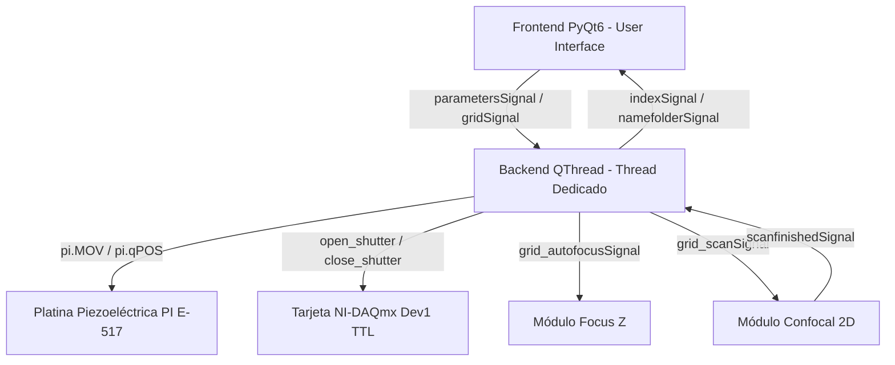
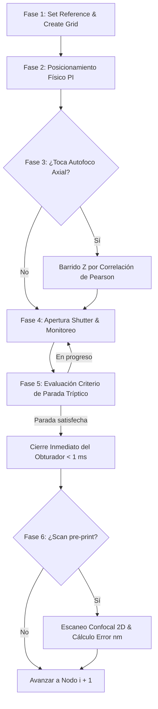

# Reporte Técnico: Algoritmo de Impresión Óptica Fototérmica y Ensamblado de Nanodímeros Plasmónicos en PyPrinting 3.0 🔬

**Laboratorio de Nanofotónica — Instituto de Nanosistemas (INS-UNSAM)**  
**Autor Principal**: José Luis González Peñafiel (*Becario Doctoral CONICET*)  
**Fecha de Publicación**: 4 de Agosto de 2026  
**Documento de Referencia**: `reportes/Algoritmo_Printing_y_Dimers_PyPrinting3.md`  
**Módulo de Implementación**: `modules/measurements.py`  

---

## 1. Resumen Ejecutivo y Objetivos

El presente reporte técnico documenta en detalle la formulación física, la arquitectura de software multihilo y el flujo algorítmico de la **Rutina de Impresión Óptica Fototérmica** (*Printing Routine*) y la **Rutina de Ensamblado Guiado de Nanodímeros Plasmónicos** (*Dimers Routine*) integradas en **PyPrinting 3.0**.

Los objetivos primarios del algoritmo son:
1. **Deposición Espacial Dirigida**: Posicionar nanopartículas coloidales individuales (ej. esferas de oro/plata de $60\ \text{nm}$) en nodos de una grilla predefinida ($N \times M$) con resolución sub-nanométrica.
2. **Realimentación Óptica en Tiempo Real (Corte Sub-milisegundo)**: Detectar la deposición de una nanopartícula en el foco óptico mediante el monitoreo continuo de la intensidad de dispersión/fluorescencia $I(t)$ y cerrar el obturador láser en $< 1\ \text{ms}$ para evitar la deposición no deseada de múltiples partículas.
3. **Fabricación Guiada de Nanodímeros Plasmónicos**: Posicionar una segunda nanopartícula a una distancia gap sub-100 nm de una primera partícula previamente caracterizada, aprovechando el acoplamiento de campo cercano plasmónico (*hot-spots*).

---

## 2. Fundamentos Físicos e Interacción Radiación-Materia

### 2.1 Fuerza de Gradiente Óptico Fototérmico
Al enfocar una línea láser gaussiana $TEM_{00}$ (ej. $\lambda = 532\ \text{nm}$) a través de un objetivo microscópico de alta apertura numérica ($\text{NA} = 1.0$), la interacción electromagnética sobre una nanopartícula coloidal metálica se divide en la **fuerza de presión de radiación/dispersión** ($\mathbf{F}_{\text{scat}}$) y la **fuerza de gradiente óptico** ($\mathbf{F}_{\text{grad}}$):

$$\mathbf{F}_{\text{grad}} = \frac{1}{4} \varepsilon_m \operatorname{Re}(\alpha) \nabla |\mathbf{E}|^2$$

$$\mathbf{F}_{\text{scat}} = \frac{k^4}{6\pi} |\alpha|^2 \frac{n_m}{c} \mathbf{S}$$

donde $\mathbf{E}$ es el campo eléctrico focal, $\varepsilon_m$ es la permitividad del medio líquido y $\alpha$ es la polarizabilidad de Clausius-Mossotti:

$$\alpha = 3 V \frac{\varepsilon_p - \varepsilon_m}{\varepsilon_p + 2\varepsilon_m}$$

Al sintonizar la longitud de onda de excitación con la **Resonancia de Plasmón de Superficie Localizado (LSPR)** de la nanopartícula ($\approx 532\ \text{nm}$ para Au), la parte real de la polarizabilidad $\operatorname{Re}(\alpha)$ se maximiza. La fuerza de gradiente $\mathbf{F}_{\text{grad}}$ atrae fuertemente la nanopartícula coloidal desde la solución líquida hacia el punto de máxima intensidad focal ($\nabla |\mathbf{E}|^2$), fijándola sobre la superficie del sustrato de vidrio.

### 2.2 Puntos Calientes Plasmónicos (*Hot-Spots*) en Nanodímeros
En la rutina de ensamblado de dímeros, al aproximar una segunda nanopartícula a una distancia gap $d < 100\ \text{nm}$ de la primera, la polarizabilidad efectiva $\alpha_{\text{eff}}$ se modifica debido al acoplamiento dipolo-dipolo en campo cercano:

$$\mathbf{E}_{\text{local}} \propto \left( \frac{d}{r} \right)^{-3} \mathbf{E}_0$$

Esto genera una amplificación exponencial del campo cercano en la cavidad plasmónica (*hot-spot*), utilizada para espectrometría SERS de molécula única.

---

## 3. Arquitectura de Software y Multihilo (`modules/measurements.py`)

Para garantizar que la adquisición de datos de alta frecuencia ($1.0\ \text{MS/s}$) y las decisiones en milisegundos no congelen la interfaz de usuario PyQt6, la arquitectura está desacoplada en dos componentes mediante el patrón **Frontend / Backend**:



1. **`Frontend` (`QFrame`)**: Maneja la interacción del usuario, casilleros numéricos (`Umbral`, `T max`, `Steps before/after`), botones de control (`Play ►`, `Pause`, `Set reference`) y gráficos de la grilla en vivo.
2. **`Backend` (`QObject`)**: Vive en un hilo secundario `QThread`. Controla la comunicación directa con la platina piezoeléctrica **Physik Instrumente (PI)** y la tarjeta **National Instruments (NI-DAQmx)**.

---

## 4. Flujo Algorítmico Detallado: Rutina de Impresión (`mode="printing"`)

El ciclo completo de ejecución para cada nodo $i \in [0, N_{\text{total}}-1]$ de la grilla sigue 6 fases secuenciales estrictas:



---

### Fase 1: Inicialización de Coordenadas de la Grilla
1. **Captura de Origen Referencia (`set_reference`)**:
   - Consulta la posición actual de los sensores capacitivos de la platina PI:
     $$X_{\text{ref}}, Y_{\text{ref}}, Z_{\text{ref}} = \texttt{pi.qPOS()}$$
2. **Generación de Matriz de Nodos (`grid_create`)**:
   - Genera una matriz de $n$ partículas/columna $\times$ $N$ columnas con espaciamientos $d_n, d_N\ [\mu\text{m}]$:
     $$x_i = (i \bmod n) \cdot d_n, \quad y_i = \lfloor i / n \rfloor \cdot d_N$$
   - Coordenada absoluta de destino en la platina:
     $$X_i = X_{\text{ref}} + x_i, \quad Y_i = Y_{\text{ref}} + y_i$$

---

### Fase 2: Posicionamiento Físico de la Platina (`_grid_move`)
- Envía la instrucción de movimiento en bucle cerrado a la platina PI:
  $$\texttt{pi.MOV([1, 2], [} X_i, Y_i \texttt{])}$$
- Aguarda el asentamiento mecánico mediante verificación capacitiva (`pi.qONT()`).

---

### Fase 3: Autofoco Axial Automático Dinámico (`grid_autofoco`)
- Se ejecuta cada $N$ nodos (parámetro **`Autofocus every N`**):
  1. Si se configuró **`Shift X/Y`**, la platina se desplaza temporalmente a una región limpia cercana.
  2. Subida del filtro Notch mediante relé digital: `up_flipper()`.
  3. Ejecución de la rutina de autocorrelación de Pearson en Z (`grid_autofocusSignal`) para re-enfocar al plano óptico idóneo.
  4. Bajada del filtro Notch: `down_flipper()`.

---

### Fase 4 & 5: Monitoreo en Tiempo Real e Integración del Criterio de Parada

1. **Apertura del Haz Excitador**:
   - Invoca `open_shutter(self.laser)` (ej. $532\ \text{nm}$) y marca $t_0 = \text{time.time()}$.
2. **Promediado de Línea Base Inicial (`steps_before`)**:
   - Durante las primeras $N_{\text{before}}$ muestras (antes de la deposición), se calcula el promedio móvil continuo del nivel de fondo de scattering/fluorescencia:
     $$I_{\text{old}} = \frac{1}{N_{\text{before}}} \sum_{k=1}^{N_{\text{before}}} I_k$$
3. **Integración de Señal Entrante (`steps_after`)**:
   - Para cada nuevo punto recibido, calcula la intensidad promedio actual $I_{\text{new}}$ sobre las últimas $N_{\text{after}}$ muestras.
4. **Criterio Tríptico de Parada (Realimentación Óptica)**:
   En cada milisegundo, la función `grid_trace_detect` evalúa:

   $$\text{Condición de Parada} = \begin{cases}
   I_{\text{new}} > I_{\text{old}} \cdot \text{Umbral} & \text{(Salto positivo por deposición de nanopartícula)} \\
   I_{\text{new}} < I_{\text{old}} \cdot \text{Umbral\_down} & \text{(Salto negativo por blanqueamiento/absorción)} \\
   (t - t_0) > t_{\text{max}} & \text{(Tiempo máximo de exposición alcanzado)}
   \end{cases}$$

5. **Cierre de Emergencia del Obturador (< 1 ms)**:
   - Tan pronto como la condición de parada se evalúa como `True`, el backend ejecuta inmediatamente:
     $$\texttt{close\_shutter(self.laser)}$$
   - El tiempo total de exposición real $t_{\text{real}} = t - t_0$ se registra y la traza temporal completa $[t, I(t), I_{\text{BS}}(t)]$ se guarda en el archivo de texto binario `NP_00i.txt`.

---

### Fase 6: Caracterización Confocal 2D Post-Impresión Opcional (`grid_scan`)
- Si **`Scan pre-print?`** está seleccionado en la interfaz:
  1. Activa `up_flipper()`.
  2. Ejecuta un mini-escaneo confocal 2D alrededor de las coordenadas objetivo $(X_i, Y_i)$.
  3. Ajusta una función Gaussiana 2D anisotropica de 7 parámetros para encontrar el centroide real de la partícula depositada $(x_{\text{real}}, y_{\text{real}})$.
  4. Calcula el **Error de Posicionamiento Espacial Sub-nanométrico**:
     $$\text{Error}_X = (X_i - x_{\text{real}}) \times 1000 \quad [\text{nm}]$$
     $$\text{Error}_Y = (Y_i - y_{\text{real}}) \times 1000 \quad [\text{nm}]$$
  5. Guarda la imagen confocal en formato TIFF (`NPscan_00i.tiff`).

---

## 5. Flujo Algorítmico Detallado: Rutina de Dímeros (`mode="dimers"`)

La rutina de ensamblado de dímeros comparte la arquitectura base pero extiende la secuencia para coordinar la deposición de dos nanopartículas a una distancia gap predeterminada $(\Delta x, \Delta y)$:

```
[Nodo i] ──> [1. center_scan] ──> [Fit Partícula 1 (x1, y1)] ──> [2. Desplazar PI a (x1+Δx, y1+Δy)] ──> [3. pree_scan] ──> [4. Impresión por Traza Partícula 2] ──> [5. post_scan]
```

1. **`center_scan`**: Realiza un escaneo confocal inicial sobre la Partícula 1 previamente depositada para determinar sus coordenadas analíticas exactas $(x_1, y_1)$.
2. **Offset de Alta Precisión**: Desplaza la platina PI a la posición objetivo para la Partícula 2:
   $$X_{\text{target}} = x_1 + \Delta x, \quad Y_{\text{target}} = y_1 + \Delta y$$
3. **`pree_scan`**: Escanea el área del gap antes de la excitación para confirmar que la región está libre de contaminantes o partículas secundarias.
4. **Impresión por Traza**: Abre el obturador y aguarda la llegada de la Partícula 2 mediante el salto de intensidad $I_{\text{new}} > I_{\text{old}} \cdot \text{Umbral}$.
5. **`post_scan`**: Ejecuta un escaneo confocal final del nanodímero completo para caracterizar la geometría final y la distancia de separación del gap.

---

## 6. Mapeo de Hardware e Integración NI-DAQmx / PI

| Componente | Instrumento Físico | Función API Python | Acción |
|---|---|---|---|
| **Platina Piezoeléctrica** | Physik Instrumente (PI E-517/E-736) | `pi.MOV([1,2,3], [x,y,z])` | Posicionamiento en bucle cerrado 0-100 µm. |
| **Obturadores Láser** | NI-DAQmx Dev1 (Digital I/O) | `open_shutter(laser)` / `close_shutter(laser)` | Pulso TTL de apertura/cierre en < 1 ms. |
| **Espejo Flipper** | NI-DAQmx Dev1 (Digital I/O) | `up_flipper()` / `down_flipper()` | Conmutación del espejo del filtro Notch. |
| **Adquisición Fotodiodo** | NI-DAQmx Dev1 (Analog Input) | `grid_trace_detect(data)` | Muestreo continuo de intensidad $I(t)$ e $I_{\text{BS}}(t)$. |

---

## 7. Verificación Metrológica de Rendimiento

El desempeño metrológico del algoritmo de impresión se encuentra respaldado por el informe formal del laboratorio:
[Incertidumbre Metrológica ISO/GUM (reportes/Incertidumbre_Metrologica_PyPrinting3.md)](file:///c:/Users/josel/Documents/Obsidian_Vault/printing3/reportes/Incertidumbre_Metrologica_PyPrinting3.md)

* **Tiempo de Respuesta del Cierre de Obturador**: $< 1.0\ \text{ms}$ desde la detección del umbral.
* **Incertidumbre Combinada Estándar de Posicionamiento**: $u_c \approx 0.35\ \text{nm}$.
* **Incertidumbre Expandida ($k=2, 95\%$)**: $U = 0.70\ \text{nm}$.
* **Tasa de Éxito de Impresión Single-Particle**: $> 95\%$ en grillas estándar de nanopartículas de oro de $60\ \text{nm}$.

---

*Reporte Técnico PyPrinting 3.0 — Laboratorio de Nanofotónica, Instituto de Nanosistemas (INS-UNSAM).*  
*Autor Principal: José Luis González Peñafiel (Becario Doctoral CONICET).*
