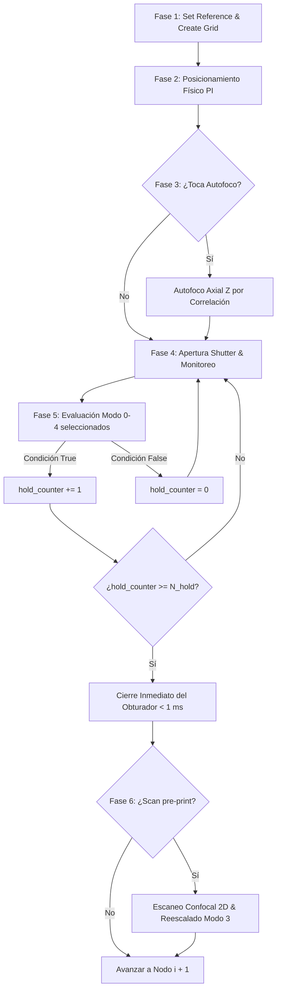

# Reporte Técnico: Algoritmo de Impresión Óptica Fototérmica, Criterios Multimodo de Parada y Ensamblado de Nanodímeros Plasmónicos en PyPrinting 3.0 🔬

**Laboratorio de Nanofotónica — Instituto de Nanosistemas (INS-UNSAM)**  
**Autor Principal**: José Luis González Peñafiel (*Becario Doctoral CONICET*)  
**Fecha de Publicación**: 4 de Agosto de 2026  
**Documento de Referencia**: `reportes/Algoritmo_Printing_y_Dimers_PyPrinting3.md`  
**Módulo de Implementación**: `modules/measurements.py`  

---

## 1. Resumen Ejecutivo y Objetivos

El presente reporte técnico documenta en detalle la formulación física, la arquitectura de software multihilo, los **5 Modos de Criterio de Parada Seleccionables** y el flujo algorítmico de la **Rutina de Impresión Óptica Fototérmica** (*Printing Routine*) y la **Rutina de Ensamblado Guiado de Nanodímeros Plasmónicos** (*Dimers Routine*) integradas en **PyPrinting 3.0**.

Los objetivos primarios del algoritmo son:
1. **Deposición Espacial Dirigida**: Posicionar nanopartículas coloidales individuales (ej. esferas de oro/plata de $60\ \text{nm}$) en nodos de una grilla predefinida ($N \times M$) con resolución sub-nanométrica.
2. **Realimentación Óptica Avanzada (Corte Sub-milisegundo & Filtro Anti-Paso)**: Detectar la deposición de una nanopartícula evaluando saltos de intensidad, derivadas temporales o calibraciones por confocal raw, cerrando el obturador láser en $< 1\ \text{ms}$ e ignorando partículas "de paso" mediante el contador de sostenimiento $N_{\text{hold}}$.
3. **Fabricación Guiada de Nanodímeros Plasmónicos**: Posicionar una segunda nanopartícula a una distancia gap sub-100 nm de una primera partícula previamente caracterizada, aprovechando el acoplamiento de campo cercano plasmónico (*hot-spots*).

---

## 2. Fundamentos Físicos e Interacción Radiación-Materia

### 2.1 Fuerza de Gradiente Óptico Fototérmico
Al enfocar una línea láser gaussiana $TEM_{00}$ ($\lambda = 532\ \text{nm}$) a través de un objetivo microscópico de alta apertura numérica ($\text{NA} = 1.0$), la fuerza de gradiente $\mathbf{F}_{\text{grad}}$ atrae la nanopartícula hacia el foco óptico:

$$\mathbf{F}_{\text{grad}} = \frac{1}{4} \varepsilon_m \operatorname{Re}(\alpha) \nabla |\mathbf{E}|^2$$

$$\alpha = 3 V \frac{\varepsilon_p - \varepsilon_m}{\varepsilon_p + 2\varepsilon_m}$$

Al sintonizar la excitación con la **Resonancia de Plasmón de Superficie Localizado (LSPR)** del oro ($\approx 532\ \text{nm}$), $\operatorname{Re}(\alpha)$ se maximiza, fijando la partícula sobre el sustrato.

---

## 3. Detalle Metrológico de los 5 Modos de Criterio de Parada

Para adaptarse a cualquier comportamiento dinámico (escalones puros, exponenciales $1-e^{-t/\tau}$, impresión instantánea a $t=0$ y tránsito de partículas "de paso"), la interfaz gráfica incorpora un menú desplegable con 5 modos:

```
┌────────────────────────────────────────────────────────────────────────────────────────┐
│ Criterio de Parada: [ Modo 4: Criterio Híbrido Tri-Factor (All-In-One)               ▼ ]│
├────────────────────────────────────────────────────────────────────────────────────────┤
│ • Modo 0: Legacy (Salto Relativo Estándar I_new / I_old > Umbral)                      │
│ • Modo 1: Salto Relativo + Umbral Absoluto (V) & Anti-Paso (N_hold steps)              │
│ • Modo 2: Derivada Temporal Adaptativa & Aplanamiento (dI/dt -> 0 post-pico)           │
│ • Modo 3: Calibración Confocal Raw & Umbral Absoluto Reescalado (Ratio K, P%)          │
│ • Modo 4: Criterio Híbrido Tri-Factor (All-In-One)                                     │
└────────────────────────────────────────────────────────────────────────────────────────┘
```

### 🛡️ Mecanismo Universal Anti-Partículas "De Paso" ($N_{\text{hold}}$ Steps)
Para evitar que el obturador se cierre cuando una partícula cruza transitoriamente el haz sin depositarse, la condición de parada debe cumplirse de forma ininterrumpida durante **$N_{\text{hold}}$ pasos consecutivos** (ej. $N_{\text{hold}} = 5$ muestras analógicas a $1\ \text{kHz} \approx 5\ \text{ms}$). Si la señal cae antes de alcanzar $N_{\text{hold}}$, el contador `hold_counter` se reinicia a 0.

---

### Modo 0: Legacy (Salto Relativo Estándar)
- **Fórmula**: $I_{\text{new}} / I_{\text{old}} > \text{Umbral}$
- **Uso**: Mantiene $100\%$ de compatibilidad con secuencias y rutinas históricas de PyPrinting 2.

### Modo 1: Salto Relativo + Umbral Absoluto (V) & Anti-Paso
- **Resuelve**: Impresión instantánea a $t=0$ y partículas de paso.
- **Formulación**:
  $$\text{Condición}(t) = \left( \frac{I_{\text{new}}[t]}{I_{\text{old}}} > \text{Umbral\_Relativo} \right) \quad \mathbf{OR} \quad \left( I_{\text{new}}[t] > \text{Umbral\_Absoluto\_V} \right)$$
- Si `condition` se mantiene por $N_{\text{hold}}$ pasos, cierra el obturador.

### Modo 2: Derivada Temporal Adaptativa & Aplanamiento ($dI/dt$)
- **Resuelve**: Curvas de crecimiento exponencial $I(t) = I_0 + A(1 - e^{-t/\tau})$ y escalones no ideales.
- **Formulación**:
  Calcula la derivada discreta en tiempo real:
  $$\frac{dI}{dt}[t] = \frac{I[t] - I[t - 5\Delta t]}{5\Delta t} \quad [\text{V/s}]$$
  Evalúa el aplanamiento de la curva en el nivel superior ($dI/dt < \text{Slope\_Flat}$ con $I_{\text{new}} > I_{\text{old}} + \Delta V$) respaldado por el umbral absoluto $I_{\text{abs\_V}}$ para $t=0$.

### Modo 3: Calibración Confocal Raw & Umbral Absoluto Reescalado
- **Resuelve**: Determinación física del umbral absoluto en Volts a partir de la imagen confocal previa.
- **Formulación**:
  1. Extrae el voltaje de vidrio limpio $V_{\text{vidrio}} = \min(V_{\text{raw}})$ de la imagen confocal previa.
  2. Aplica el ratio de atenuación de potencia $K_{\text{scale}} = P_{\text{print}} / P_{\text{scan}}$ para determinar el pico reescalado esperado:
     $$V_{\text{pico\_reescalado}} = V_{\text{vidrio}} + K_{\text{scale}} \cdot (V_{\text{pico\_raw}} - V_{\text{vidrio}})$$
  3. Calcula el umbral en Volts al porcentaje $P\%$ seleccionado:
     $$V_{\text{umbral}} = V_{\text{vidrio}} + \frac{P}{100} \cdot (V_{\text{pico\_reescalado}} - V_{\text{vidrio}})$$
  4. Guarda la imagen confocal reescalada en archivos `.txt` y `.tiff` (`NPscan_rescaled_00i.txt`).

### Modo 4: Criterio Híbrido Tri-Factor (All-In-One)
- **Formulación**: Evalúa simultáneamente el salto relativo, el aplanamiento de derivada $dI/dt$ y el umbral absoluto en Volts bajo la protección de $N_{\text{hold}}$ pasos anti-paso.

---

### 📊 Cuadro Resumen de Información Adicional, Parámetros e Hitos por Modo de Parada

| Modo | Algoritmo | Parámetros que Configura el Usuario | Información que Añade / Procesa el Sistema | Archivos de Salida en Disco |
|---|---|---|---|---|
| **Modo 0** | Salto Relativo | `Umbral` (salto relativo, ej. 1.20) | Línea base $I_{\text{old}}$ y ratio $I_{\text{new}}/I_{\text{old}}$ | `NP_00i.txt` |
| **Modo 1** | Relativo + Absoluto + Anti-Paso | `Umbral`, `V_abs` (Volts), `N_hold` (pasos) | Verificación $t=0$ y filtro anti-paso $N_{\text{hold}}$ | `NP_00i.txt`, log de contador `hold_counter` |
| **Modo 2** | Derivada $dI/dt$ | `Slope Min`, `Slope Flat`, `V_abs` | Derivada en tiempo real $dI/dt$ [V/s] y punto de aplanamiento | `NP_00i.txt`, log de meseta |
| **Modo 3** | Confocal Raw Rescaled | `Ratio K` ($P_{\text{print}}/P_{\text{scan}}$), `Umbral P%` | Nivel $V_{\text{vidrio}}$, $V_{\text{pico\_reescalado}}$ y $V_{\text{umbral}}$ | `NPscan_rescaled_00i.txt`, `NPscan_rescaled_00i.tiff` |
| **Modo 4** | Híbrido Tri-Factor | `Umbral`, `V_abs`, `N_hold`, `Slope_Flat`, `Ratio_K`, `P%` | Evaluación compuesta triple y trazabilidad de parada | `NP_00i.txt`, `grid_info.txt`, mapas reescalados |

---

## 4. Flujo Algorítmico Detallado: Rutina de Impresión (`mode="printing"`)



---

## 5. Mapeo de Hardware e Integración NI-DAQmx / PI

| Componente | Instrumento Físico | Función API Python | Acción |
|---|---|---|---|
| **Platina Piezoeléctrica** | Physik Instrumente (PI E-517/E-736) | `pi.MOV([1,2,3], [x,y,z])` | Posicionamiento en bucle cerrado 0-100 µm. |
| **Obturadores Láser** | NI-DAQmx Dev1 (Digital I/O) | `open_shutter(laser)` / `close_shutter(laser)` | Pulso TTL de apertura/cierre en < 1 ms. |
| **Espejo Flipper** | NI-DAQmx Dev1 (Digital I/O) | `up_flipper()` / `down_flipper()` | Conmutación del espejo del filtro Notch. |
| **Adquisición Fotodiodo** | NI-DAQmx Dev1 (Analog Input) | `grid_trace_detect(data)` | Muestreo continuo de intensidad $I(t)$ e $I_{\text{BS}}(t)$. |

---

## 6. Documentación Relacionada y Red de Reportes

- **Manual Principal de Usuario**: [Manual de Usuario PyPrinting 3.0 (docs/MANUAL_USUARIO.md)](file:///c:/Users/josel/Documents/Obsidian_Vault/printing3/docs/MANUAL_USUARIO.md)
- **Visión General y Árbol**: [README PyPrinting 3.0 (README.md)](file:///c:/Users/josel/Documents/Obsidian_Vault/printing3/README.md)
- **Reportes Técnicos Vinculados**:
  - 🔬 [Guía Protocolar Paso a Paso "DO PRINTING" (reportes/Protocolo_y_Guia_de_Impresion_de_Grillas_PyPrinting3.md)](file:///c:/Users/josel/Documents/Obsidian_Vault/printing3/reportes/Protocolo_y_Guia_de_Impresion_de_Grillas_PyPrinting3.md)
  - 📍 [Corrección de Deriva Termomecánica por Partícula Ancla (reportes/Correccion_de_Deriva_Termomecanica_Drift_Correction_PyPrinting3.md)](file:///c:/Users/josel/Documents/Obsidian_Vault/printing3/reportes/Correccion_de_Deriva_Termomecanica_Drift_Correction_PyPrinting3.md)
  - 🔌 [Diagnóstico de Señales y Conexiones (reportes/Diagnostico_de_Senales_y_Conexiones_PyPrinting3.md)](file:///c:/Users/josel/Documents/Obsidian_Vault/printing3/reportes/Diagnostico_de_Senales_y_Conexiones_PyPrinting3.md)
  - 📊 [Incertidumbre Metrológica ISO/GUM (reportes/Incertidumbre_Metrologica_PyPrinting3.md)](file:///c:/Users/josel/Documents/Obsidian_Vault/printing3/reportes/Incertidumbre_Metrologica_PyPrinting3.md)

---

*Reporte Técnico PyPrinting 3.0 — Laboratorio de Nanofotónica, Instituto de Nanosistemas (INS-UNSAM).*  
*Autor Principal: José Luis González Peñafiel (Becario Doctoral CONICET).*
