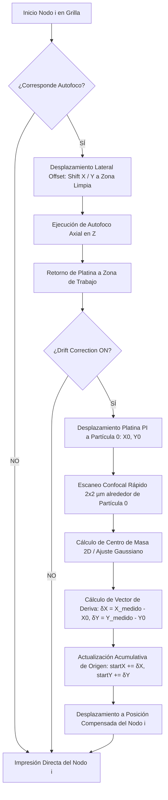

# Corrección de Deriva Termomecánica mediante Partícula Ancla (Drift Correction) en PyPrinting 3.0

**Autor**: Equipo de Desarrolladores & Investigadores de Nanofotónica (INS-UNSAM / CONICET)  
**Fecha**: 6 de Agosto de 2026  
**Módulo**: `modules/measurements.py` & `modules/confocal.py`  
**Versión de Software**: PyPrinting 3.0  

---

## 1. Introducción y Planteo del Problema

La impresión óptica de nanopartículas metálicas individuales (AuNPs, AgNPs) mediante fototermia y fuerzas de radiación láser permite la fabricación de arreglos plasmónicos periódicos (metamateriales, redes de acoplamiento de modos y superficies nanoestructuradas). Para aplicaciones en nanoplazmónica cuantitativa, el control posicional interpartícula requiere una precisión sub-10 nm.

Sin embargo, en sesiones experimentales prolongadas (que pueden durar desde decenas de minutos hasta varias horas al imprimir grillas extensas de $10 \times 10$ o $20 \times 20$ nanopartículas), el sistema óptico-mecánico sufre desviaciones laterales en los ejes $X$ e $Y$. Estas desviaciones provocan que los nodos de la grilla impresa pierdan su periodicidad geométrica, generando distorsiones acumulativas en la celda unidad de la nanoestructura.

Para solucionar este problema de forma automatizada y sin intervención manual durante la corrida, se incorpora en **PyPrinting 3.0** la rutina de **Drift Correction (Corrección de Deriva por Partícula Ancla)**.

---

## 2. Origen Físico de la Deriva Lateral ($X-Y$)

La deriva lateral en un microscopio confocal de super-resolución proviene de tres fuentes físicas fundamentales:

### 2.1 Fluctución y Gradientes Térmicos Ambientales ($\Delta T$)
Incluso en laboratorios con aire acondicionado de precisión ($\pm 0.5^\circ\text{C}$), el flujo de aire y la disipación térmica del instrumental eléctrico generan variaciones locales de temperatura en el cuerpo del microscopio invertido, la platina piezoeléctrica y el objetivo de inmersión en aceite (100x, NA 1.4).
Dado el coeficiente de expansión térmica del bronce/aluminio ($\alpha \approx 18-23 \times 10^{-6} \text{K}^{-1}$), un cambio de temperatura de tan solo $\Delta T = 0.1^\circ\text{C}$ a lo largo de un camino mecánico de $10\text{ cm}$ produce una dilatación lineal de:
$$\Delta L = L \cdot \alpha \cdot \Delta T = 100\text{ mm} \times 20 \times 10^{-6}\text{ K}^{-1} \times 0.1\text{ K} = 200\text{ nm}$$
Una deriva de $200\text{ nm}$ es un orden de magnitud mayor que el límite de tolerancia nanométrico deseado ($< 10\text{ nm}$).

### 2.2 Relajación Mecánica y Fluencia Piezoeléctrica (*Piezo Creep*)
Los actuadores piezoeléctricos de flexión (como la platina PI P-545) exhiben una respuesta viscoelástica no lineal ante saltos abruptos de posición. Tras realizar desplazamientos laterales extensos, los cristales de titanato zirconato de plomo (PZT) continúan acomodándose microscópicamente durante minutos (*creep* logarítmico), lo que deriva en un desplazamiento lento continuado.

### 2.3 Dinámica del Aceite de Inmersión y Deriva de Tensión Superficial
El menisco de aceite de inmersión atrapado entre el cubreobjetos de vidrio y la lente frontal del objetivo ejerce fuerzas viscosas y de tensión superficial. A medida que la platina se desplaza, la cizalladura del fluido genera fuerzas laterales reactivas que deforman el soporte del portaobjetos.

---

## 3. Principio del Método de Partícula Ancla (Partícula 0)

Para compensar la deriva lateral sin necesidad de marcadores externos de litografía previa, el protocolo utiliza una **Partícula Ancla (Partícula 0)** fabricada al inicio del experimento.

```
       (+) X (Hacia Abajo)
        │
        ▼
   (0,0) [Partícula 0 - Ancla]  ◄── Impresa manualmente en Origen de Referencia (X0, Y0)
        │
        │   Offset de Separación (2.0 µm, 2.0 µm)
        │ ┌────────────────────────────────────────────────────────┐
        └─► (2,2) [Partícula 1] ───► (2,7) [Partícula 2] ...       │
          │                                                        │
          │ (7,2) [Partícula 5] ───► (7,7) [Partícula 6] ...       │  Arreglo de Impresión
          │                                                        │  (Grilla Principal)
          └────────────────────────────────────────────────────────┘
```

### 3.1 Geometría del Sistema
1. **Partícula 0 (Nodo Reference/Anchor)**: Es la primera nanopartícula impresa manualmente sobre el sustrato. Se fija formalmente como el origen de coordenadas de la grilla $(0, 0)\,\mu\text{m}$.
2. **Inicio del Arreglo Regulado**: El arreglo de impresión de grillas no comienza en $(0, 0)$, sino con un desplazamiento offset predeterminado de $(X_{\text{start}}, Y_{\text{start}}) = (2.0, 2.0)\,\mu\text{m}$ (o configurable por el usuario). Esto garantiza que la Partícula 0 permanezca aislada y no interfiera ópticamente con la celda unidad de la red.

---

## 4. Algoritmo y Protocolo de Corrección de Deriva

La rutina de **Drift Correction** se integra de manera armónica con el bucle de **Autofoco Axial Dinámico en Z** (`Autofocus Every N`).

### 4.1 Secuencia Paso a Paso



1. **Gatillado de Autofoco & Baja Potencia**: Cada $N$ partículas (definido por `Autofocus Every N`), el espejo flipper conmuta a posición arriba (`up_flipper()`) a **baja potencia de láser** para realizar el autofoco axial en Z sobre una zona limpia.
2. **Escaneo Confocal de Drift en Baja Potencia**: Al finalizar el autofoco Z, la platina se desplaza a la coordenada nominal de la **Partícula 0** $(X_0, Y_0)$ manteniendo el flipper arriba a baja potencia para prevenir cualquier fotodestrucción o foto-impresión indeseada sobre el ancla.
3. **Escaneo Confocal Rápido 2D**: Se ejecuta un escaneo 2D sobre una ventana de $2.0 \times 2.0\,\mu\text{m}$ centrada en la Partícula 0.
4. **Determinación del Centro de la Partícula 0**: Se aplica el algoritmo de **Centro de Masa 2D (CM)** o **Ajuste Gaussiano 2D** sobre la imagen obtenida:
   $$x_{\text{CM}} = \frac{\sum_{x,y} I(x,y) \cdot x}{\sum_{x,y} I(x,y)}, \quad y_{\text{CM}} = \frac{\sum_{x,y} I(x,y) \cdot y}{\sum_{x,y} I(x,y)}$$
5. **Actualización de Posición Absoluta del Ancla**:
   La coordenada física medida $X_{\text{CM}}, Y_{\text{CM}}$ se almacena directamente como la nueva posición absoluta del ancla:
   $$X_{\text{start}} = X_{\text{CM}}, \quad Y_{\text{start}} = Y_{\text{CM}}$$
   Esto garantiza estabilidad perfecta sin acumulación espuria en escaneos subsecuentes.
6. **Cálculo del Desplazamiento Vectorial Acumulado en Nanómetros**:
   $$\Delta x_{\text{nm}} = (X_{\text{start}} - X_{\text{ref}} - X_{\text{offset}}) \cdot 1000, \quad \Delta y_{\text{nm}} = (Y_{\text{start}} - Y_{\text{ref}} - Y_{\text{offset}}) \cdot 1000$$
   $$\|\vec{D}\|_{\text{nm}} = \sqrt{\Delta x_{\text{nm}}^2 + \Delta y_{\text{nm}}^2}$$
   El vector se presenta en tiempo real expresado en nanómetros ($\text{nm}$) en la casilla **Desplazamiento acumulado** del panel *Extra info*.
7. **Conmutación a Alta Potencia e Impresión del Nodo**: El flipper baja a alta potencia (`down_flipper()`), la platina se desplaza a la posición compensada del nodo $i$ (`grid_x[i] + X_start`, `grid_y[i] + Y_start`) y continúa la impresión.

---

## 5. Formulación Matemática Rigurosa y Propagación de Errores

### 5.1 Modelado Estocástico de Deriva
La deriva termomecánica en el tiempo $t$ se compone de un término determinista de fluencia/expansión y un proceso estocástico gaussiano de ruido térmico:
$$\vec{r}_{\text{real}}(t) = \vec{r}_{\text{nominal}} + \vec{v}_{\text{drift}} \cdot t + \vec{\eta}(t)$$
donde $\vec{v}_{\text{drift}} = (v_x, v_y)$ es la velocidad media de deriva ($\approx 0.1 - 0.5\text{ nm/s}$) y $\langle \vec{\eta}(t) \vec{\eta}(t') \rangle = 2 D_{\text{th}} \delta(t-t')$.

Al aplicar la corrección discreta en los instantes $t_k = k \cdot \Delta t_{\text{autofoco}}$, la posición efectiva compensada en el nodo $i$ es:
$$\vec{r}_{\text{comp}}(t) = \vec{r}_{\text{nominal}}(i) + \sum_{k=1}^{M(t)} \vec{D}_k$$
La incertidumbre residual en la posición corregida de la partícula impresa queda acotada por el error de ajuste del centro de masa:
$$\sigma_{\text{pos}} = \sqrt{\sigma_{\text{fit}}^2 + \sigma_{\text{stage\_repeatability}}^2}$$
Para nanopartículas de oro de $60\text{ nm}$ registradas con una relación señal-ruido $\text{SNR} > 30$, la incertidumbre de localización por centro de masa es:
$$\sigma_{\text{fit}} \approx \frac{\text{FWHM}}{\text{SNR} \cdot \sqrt{N_{\text{photons}}}} \approx \frac{250\text{ nm}}{30 \cdot \sqrt{1000}} \approx 0.26\text{ nm}$$
Esto demuestra que el método de corrección alcanza una precisión sub-nanométrica, eliminando por completo la deriva acumulativa del experimento.

---

## 6. Resumen de Parámetros y Componentes en Software

En `modules/measurements.py`:
- **Casilla de Selección (`QCheckBox`)**: `[ ] Drift Correction (Partícula 0)`
- **Casilleros de Posición de Inicio**: `Start X (µm)` (def: 2.0), `Start Y (µm)` (def: 2.0).
- **Rango del Escaneo de Drift**: $2.0 \times 2.0\,\mu\text{m}$.
- **Conexión de Señales**: `Backend` $\leftrightarrow$ `ConfocalWorker` (reutiliza la canalización de escaneo confocal rápida de `modules/confocal.py`).

---

## 7. Conclusión

La incorporación de **Drift Correction** mediante Partícula Ancla otorga a **PyPrinting 3.0** la capacidad de mantener una precisión espacial nanométrica constante durante corridas de impresión de larga duración. Al desacoplar la deriva térmica y la fluencia mecánica de la platina, se garantiza la perfecta periodicidad geométrica en la fabricación de redes y metamateriales plasmónicos.

---

## 8. Documentación Relacionada y Red de Reportes

- **Manual Principal de Usuario**: [Manual de Usuario PyPrinting 3.0 (docs/MANUAL_USUARIO.md)](file:///c:/Users/josel/Documents/Obsidian_Vault/printing3/docs/MANUAL_USUARIO.md)
- **Visión General y Árbol**: [README PyPrinting 3.0 (README.md)](file:///c:/Users/josel/Documents/Obsidian_Vault/printing3/README.md)
- **Reportes Técnicos Vinculados**:
  - 🔬 [Protocolo y Guía de Impresión de Grillas (reportes/Protocolo_y_Guia_de_Impresion_de_Grillas_PyPrinting3.md)](file:///c:/Users/josel/Documents/Obsidian_Vault/printing3/reportes/Protocolo_y_Guia_de_Impresion_de_Grillas_PyPrinting3.md)
  - 📊 [Incertidumbre Metrológica ISO/GUM (reportes/Incertidumbre_Metrologica_PyPrinting3.md)](file:///c:/Users/josel/Documents/Obsidian_Vault/printing3/reportes/Incertidumbre_Metrologica_PyPrinting3.md)
  - 🧮 [Algoritmo de Parada e Impresión de Grillas y Dímeros (reportes/Algoritmo_Printing_y_Dimers_PyPrinting3.md)](file:///c:/Users/josel/Documents/Obsidian_Vault/printing3/reportes/Algoritmo_Printing_y_Dimers_PyPrinting3.md)
  - 🔌 [Diagnóstico de Señales y Conexiones (reportes/Diagnostico_de_Senales_y_Conexiones_PyPrinting3.md)](file:///c:/Users/josel/Documents/Obsidian_Vault/printing3/reportes/Diagnostico_de_Senales_y_Conexiones_PyPrinting3.md)
