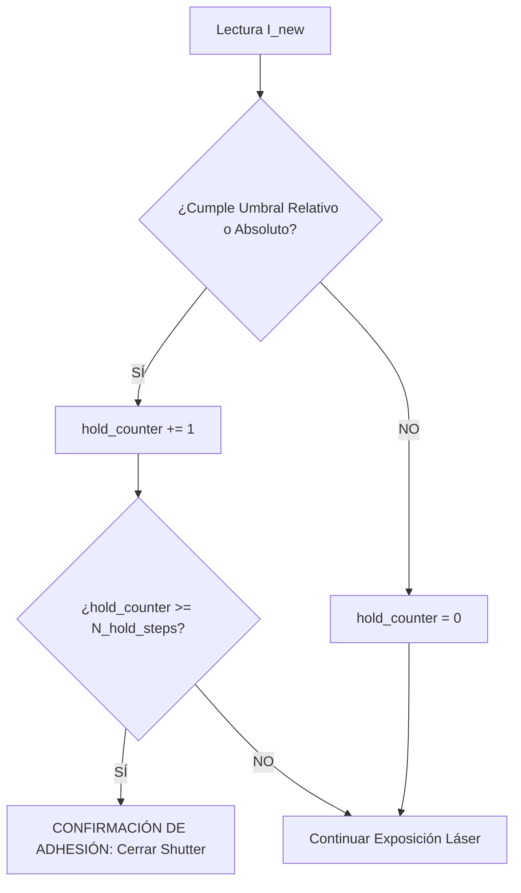
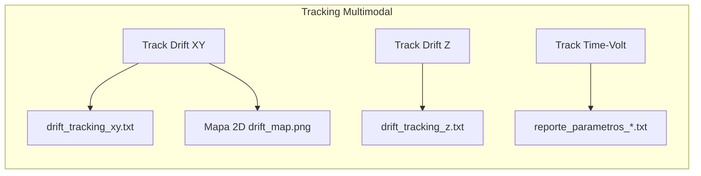

# 📊 Análisis Time-Volt, Filtro $N_{\text{hold}}$, Tracking Multimodal y Doble Autofoco — PyPrinting 3.0

**Laboratorio de Nanofotónica — Instituto de Nanosistemas (INS-UNSAM / CONICET)**  
**Autor**: José Luis González Peñafiel (Becario Doctoral CONICET)  
**Fecha**: Agosto 2026  
**Módulos Asociados**: [`modules/measurements.py`](file:///c:/Users/josel/Documents/Obsidian_Vault/printing3/modules/measurements.py), [`app.py`](file:///c:/Users/josel/Documents/Obsidian_Vault/printing3/app.py)

---

## 1. 🎯 Introducción y Fundamentos Físicos

En la técnica de **impresión óptica fototérmica** (*optical printing*), un haz láser enfocado por un objetivo de alta apertura numérica ($NA \ge 1.3$) genera fuerzas ópticas de radiación y gradientes térmicos locales que impulsan a una nanopartícula metálica o dieléctrica suspendida en solución coloidal hacia un sustrato funcionalizado.

El evento de adhesión física e inmovilización de la nanopartícula sobre el sustrato se detecta mediante el monitoreo en tiempo real del voltaje $V(t)$ de un fotodiodo que capta la luz transmitida / dispersada por la partícula.

```
       Voltaje [V]
          ▲
  V_high ─┼─────────────────────────────┐   (Partícula Adherida e Inmovilizada)
          │                             │
          │                   ┌─────────┘
          │                  /│ ▲
   V_mid ─┼                 / │ │ ΔV = V_high - V_low
          │                /  │ │
   V_low ─┼───────────────┘   │ ▼
          │  (Línea Base)     │
          └───────────────────┼──────────┼──────────────► Tiempo [s]
                              t_step     t_raw
                              ◄──────────►
                                Latencia (Δt)
```

---

## 2. 🛡️ Filtro Anti-Partículas de Paso ($N_{\text{hold}}$)

### A. La Problemática de los Falsos Positivos por Partículas en Tránsito
Durante la irradiación láser, nanopartículas que se desplazan por difusión browniana cruzan transitoriamente el foco del haz sin quedar atrapadas ni fijadas en el vidrio. 
* **Duración de un cruce libre**: $\tau_{\text{tránsito}} \sim 5 - 20\ \text{ms}$ (1 a 2 muestras del conversor analógico-digital a $10\ \text{kHz}$).
* **Efecto sin filtro**: La señal supera el umbral instantáneo $\rightarrow$ el software cierra el obturador creyendo erróneamente que hubo una impresión $\rightarrow$ **el sitio de la grilla queda vacío**.

### B. Formulación Algorítmica y Lógica de Conteo Consecutivo
El parámetro **$N_{\text{hold}}$** (`self.n_hold_steps`) impone una ventana temporal de confirmación. Para que el sistema decrete el cierre del láser, la condición de parada debe cumplirse de manera **ininterrumpida durante $N$ lecturas consecutivas**:

```python
# Evaluación en cada ciclo de adquisición
if condition:
    self.hold_counter += 1
else:
    self.hold_counter = 0    # ¡Reinicio instantáneo si la señal cae!

should_stop = (self.hold_counter >= self.n_hold_steps)
```



### C. Guía de Selección de $N_{\text{hold}}$

| Valor $N_{\text{hold}}$ | Tiempo de Confirmación ($dt \approx 10\ \text{ms}$) | Comportamiento Experimental |
| :---: | :---: | :--- |
| **$N = 1$** | $\sim 10\ \text{ms}$ | **Modo Legacy (Sin Filtro)**: Susceptible a disparos en falso por ruido o partículas en tránsito. |
| **$N = 3 - 5$** *(Recomendado)* | $\sim 30 - 50\ \text{ms}$ | **Filtrado Óptimo**: Inmune a partículas de paso; confirma adhesión con mínima latencia. |
| **$N = 10 - 20$** | $\sim 100 - 200\ \text{ms}$ | **Ultra-Conservador**: Ideal para coloides ultra-concentrados con alta frecuencia de colisiones. |

---

## 3. 🔬 Protocolo de Doble Autofoco con Desplazamiento Seguro

Para garantizar máxima reproducibilidad en redes extensas sin perturbar los sitios de impresión ni deteriorar la partícula de referencia:

1. **Etapa 1/4 (Desplazamiento Seguro a la Partícula Ancla $P_0$)**:
   - Conmuta a **baja potencia** (`up_flipper()`).
   - Mueve la platina PI a $(X_{\text{ancla}} - 1.0\ \mu\text{m}, Y_{\text{ancla}} - 1.0\ \mu\text{m})$.
   - **Autofoco 1**: Ejecuta el barrido axial en Z sobre sustrato limpio para evitar fotoblanqueo o empuje sobre el ancla.
2. **Etapa 2/4 (Microescaneo Confocal de Deriva)**:
   - Desplaza la platina al centro nominal de $P_0$.
   - Realiza un escaneo confocal $2 \times 2\ \mu\text{m}$ a baja potencia.
   - Calcula el Centro de Masa (CM) sub-nanométrico y extrae el vector de deriva lateral $(\Delta x, \Delta y)$.
3. **Etapa 3/4 (Retorno al Nodo Objetivo & Autofoco In-Situ)**:
   - Desplaza la platina a la coordenada corregida $\mathbf{r}_i + \Delta \mathbf{r} + (\text{shift}_x, \text{shift}_y)$.
   - **Autofoco 2**: Ajuste fino in-situ en Z en zona limpia contigua al nodo $i$.
4. **Etapa 4/4 (Traza a Alta Potencia)**:
   - Reposiciona exactamente en el nodo $i$.
   - Conmuta estrictamente a **alta potencia** (`down_flipper()`).
   - Abre el obturador del láser e inicia la traza fototérmica.

---

## 4. 🧭 Tracking Multimodal (XY, Z y Time-Volt)

PyPrinting 3.0 implementa tres canales independientes de monitoreo y diagnóstico:



### A. `Track Drift XY` y `Track Drift Z`
* Registran cronológicamente cada corrección con marca temporal, desplazamientos $\Delta x, \Delta y, \Delta z$ en $\text{nm}$, magnitud radial $r = \sqrt{\Delta x^2 + \Delta y^2}$ y coordenadas absolutas de la platina PI.
* Al finalizar el lote, se despliega la ventana interactiva **`DriftTrackingDialog`** con:
  - **Gráfico Izquierdo**: Trayectoria 2D $(\Delta X, \Delta Y)$ partiendo desde el origen $(0,0)\ \text{nm}$.
  - **Gráfico Derecho**: Evolución temporal continua $\Delta X(t)$, $\Delta Y(t)$ y $\Delta Z(t)$.
  - Auto-guardado de `drift_map.png` en la carpeta del lote.

---

## 5. ⚡ Ajuste de Función Salto y Reporte de Optimización Time-Volt

Al completarse el lote, si `Track Time-Volt?` está activo, el sistema ajusta la curva $V(t)$ de cada partícula:

### A. Fórmulas de Ajuste
* **Línea base previa**:
  $$V_{\text{low}} = \frac{1}{K} \sum_{k=0}^{K-1} V_k \quad (K = \min(10, N))$$
* **Nivel post-impresión**:
  $$V_{\text{high}} = \frac{1}{K} \sum_{k=N-K}^{N-1} V_k$$
* **Salto de voltaje**: $\Delta V = V_{\text{high}} - V_{\text{low}}$
* **Ratio de salto**: $\text{Ratio} = \frac{V_{\text{high}}}{V_{\text{low}}}$
* **Instante real de adhesión ($t_{\text{step}}$)**: Primer punto donde $V(t) \ge V_{\text{low}} + 0.5 \Delta V$.
* **Latencia de obturación**: $\Delta t_{\text{latencia}} = t_{\text{raw}} - t_{\text{step}}$.

### B. Histogramas Gráficos y Ventana Interactiva (`TimeVoltTrackingDialog`)
Al finalizar el lote experimental, se despliega automáticamente la ventana interactiva `TimeVoltTrackingDialog` y se auto-guarda la imagen **`time_volt_distributions.png`** con 3 paneles de análisis:
1. **Panel 1 (Histogramas de Tiempos)**:
   - Distribución de $t_{\text{raw}}$ (tiempo total de exposición con obturador abierto) en color azul/cian (`#89b4fa`).
   - Distribución de $t_{\text{step}}$ (instante real del salto de adhesión coloidal) en color verde esmeralda (`#a6e3a1`).
   - Líneas punteadas verticales marcando los promedios $\langle t_{\text{raw}} \rangle$ y $\langle t_{\text{step}} \rangle$.
2. **Panel 2 (Histogramas de Voltajes)**:
   - Distribución de la línea base $V_{\text{low}}$ (amarillo `#f9e2af`) vs nivel post-adhesión $V_{\text{high}}$ (coral `#f38ba8`).
   - Líneas de media $\langle V_{\text{low}} \rangle$ y $\langle V_{\text{high}} \rangle$.
3. **Panel 3 (Diagrama de Dispersión / Correlación $t_{\text{step}}$ vs $\Delta V$)**:
   - Puntos verdes (`o`) para impresiones exitosas y cruces rojas (`x`) para eventos de timeout, permitiendo correlacionar la cinética de captura con el tamaño/intensidad plasmónica de cada nanopartícula.

### C. Diagnóstico Automático en `reporte_parametros_<nombre_red>.txt`
El reporte incluye recomendaciones automatizadas para la calibración del sistema:
* **Relación Señal/Fondo (SBR)**: Evalúa si $\langle \text{Ratio} \rangle$ supera con holgura el `Umbral Relativo` configurado.
* **Margen de Seguridad**: Si $\langle \text{Ratio} \rangle \gg \text{Umbral}$, sugiere un umbral superior para maximizar la selectividad.
* **Respuesta de Hardware**: Compara la latencia media $\langle \Delta t \rangle$ con los `steps_after` para validar que el tiempo de obturación mecánico sea conforme.

---

## 6. 🏷️ Nombres de Lote Personalizados y Botón `Reset all 🔄`

1. **Casilla `Custom Name`**:
   - Permite etiquetar muestras experimentales (ej. `AuNP_60nm_BatchA`).
   - La carpeta se genera como `YYYYMMDD-HHMMSS_Printing_AuNP_60nm_BatchA`.
   - Si se deja vacía, el sistema recurre al nombre de la grilla por defecto (`5x5_drift_5.0umx5.0um`).
2. **Botón `Reset all 🔄`**:
   - Limpia de forma atómica todas las referencias fijadas (`Xref`, `Yref`, `Zref` $\rightarrow \text{NaN}$).
   - Restablece el color del botón `Set reference` a naranja.
   - Pone a cero los acumuladores de deriva y el visor numérico.
   - Reinicia la grilla interactiva a estado *Pending* y borra el texto del campo *Custom Name*.

---

## 7. 📚 Conclusiones y Buenas Prácticas

1. **Calibración Previa**: Utilice el asistente de presets o cargue un preset validado antes de iniciar el lote.
2. **Filtro Anti-Paso**: Mantenga siempre $N_{\text{hold}} \ge 3$ para evitar huecos en la grilla por nanopartículas flotantes.
3. **Análisis de Calidad**: Revise el archivo `reporte_parametros_*.txt` al finalizar cada corrida para ajustar potencias y umbrales en lotes posteriores.
