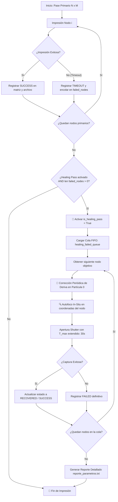

# 📐 Reporte Científico: Compensación de Inclinacion Z en 4 Esquinas (Confocal Tilt) y Autocompletitud Inteligente de Redes (Healing Pass) en PyPrinting 3.0
**PyPrinting 3.0 — Suite de Nanofabricación y Caracterización Fotónica**  
*Laboratorio de Nanofotónica — Instituto de Nanosistemas (INS-UNSAM / CONICET)*  
*Autor: José Luis González Peñafiel (Becario Doctoral CONICET)*  
*Fecha: Septiembre 2026 | Estado: Producción / Validado Experimentalmente*  
*Módulos de Implementación*: [`modules/confocal.py`](file:///c:/Users/josel/Documents/Obsidian_Vault/printing3/modules/confocal.py), [`modules/measurements.py`](file:///c:/Users/josel/Documents/Obsidian_Vault/printing3/modules/measurements.py)

---

## 1. 📋 Resumen Ejecutivo y Metrológico

La nanofabricación fototérmica y la microscopía confocal de superresolución requieren una estabilidad axial del plano focal dentro de tolerancias sub-micrométricas estrictas ($\Delta z < \pm 350\ \text{nm}$). En condiciones reales de laboratorio, el montaje de cubreobjetos de vidrio (*coverslips* #1.5 de $170\ \mu\text{m}$) sobre platinas de microscopio introduce de forma inevitable una inclinación geométrica (*tilt*) de entre $0.1^\circ$ y $0.5^\circ$. En un barrido confocal de $20 \times 20\ \mu\text{m}^2$, una inclinación de apenas $0.3^\circ$ genera una desviación axial acumulada de:

$$\Delta z_{\text{tilt}} = L \cdot \tan(\theta) = 20\ \mu\text{m} \cdot \tan(0.3^\circ) \approx 1.05\ \mu\text{m}$$

Dado que esta desviación supera ampliamente el rango de Rayleigh del objetivo de inmersión en aceite ($\text{NA} = 1.3 - 1.4$), las imágenes confocales sufren aberración esférica por desenfoque y pérdida drástica de relación señal-ruido en los bordes del campo visual. A su vez, en la impresión de redes de nanopartículas ($N \times M$), el desenfoque provoca que el foco óptico se desplace por encima o por debajo de la interfaz vidrio-agua, impidiendo la nucleación fototérmica y dejando nodos vacíos (*vacancias*).

Para solucionar de raíz estos dos problemas, en **PyPrinting 3.0** se desarrollaron e implementaron dos arquitecturas avanzadas:
1. **Compensación de Inclinación Z en 4 Esquinas (*Confocal Tilt*)**: Caracterización del plano de inclinación mediante autocorrelación axial en las 4 esquinas del área de escaneo y modulación en tiempo real del actuador piezoeléctrico Z durante el barrido raster.
2. **Pase de Curación y Autocompletitud de Redes (*Healing Pass*)**: Algoritmo adaptativo en dos etapas que registra los nodos no impresos y ejecuta un reintento automático focalizado con autofoco local in-situ, extensión de tiempo de captura y corrección de deriva piezoeléctrica.

---

## 2. 🔬 Fundamentos Ópticos y Tolerancia de Enfoque Axial

### 2.1 Límite de Difracción y Rango de Rayleigh en Objetivos de Alta NA
En un haz láser gaussiano enfocado por una lente con apertura numérica $\text{NA} = n \sin(\alpha)$, la cintura del haz $w_0$ y el rango de Rayleigh $z_R$ (distancia en la cual el área del haz se duplica y la irradiancia pico cae al $50\%$) se expresan como:

$$w_0 \approx 0.61 \frac{\lambda}{\text{NA}}$$

$$z_R = \frac{\pi w_0^2 n}{\lambda} \approx \frac{n \lambda}{\text{NA}^2}$$

Para un haz a $\lambda = 532\ \text{nm}$, inmersión en aceite ($n = 1.518$) y $\text{NA} = 1.4$:
$$w_0 \approx 0.61 \frac{532\ \text{nm}}{1.4} \approx 232\ \text{nm}$$
$$z_R \approx \frac{1.518 \times 532\ \text{nm}}{(1.4)^2} \approx \frac{807.6\ \text{nm}}{1.96} \approx 412\ \text{nm}$$

La **Profundidad de Foco Confocal ($\text{DOF}$)** con pinhole óptico de radio $r_{\text{pinhole}} \approx 1\ \text{Airy Unit}$ es aún más restrictiva:

$$\text{DOF}_{\text{confocal}} \approx \pm \frac{\lambda n}{\text{NA}^2 \sqrt{2}} \approx \pm 290\ \text{nm}$$

Cualquier desvío axial $|\Delta z| > 300\ \text{nm}$ reduce la irradiancia $I_0$ en la interfaz sustrato-líquido en más del $60\%$, anulando la fuerza óptica de gradiente $\mathbf{F}_{\text{grad}} \propto \nabla |\mathbf{E}|^2$ e impidiendo el atrapamiento fototérmico de la nanopartícula.

---

## 3. 📐 Algoritmo de Compensación de Inclinación Z en 4 Esquinas (Confocal Tilt)

### 3.1 Geometría de Medición en 4 Vértices
El área de escaneo rectangular está definida por su centro $(x_c, y_c)$ y sus dimensiones $(\Delta x, \Delta y)$. El sistema interpola los 4 vértices perimetrales:

$$\begin{aligned}
TL &= (x_c - \Delta x/2,\; y_c + \Delta y/2) \\
TR &= (x_c + \Delta x/2,\; y_c + \Delta y/2) \\
BR &= (x_c + \Delta x/2,\; y_c - \Delta y/2) \\
BL &= (x_c - \Delta x/2,\; y_c - \Delta y/2)
\end{aligned}$$

```
Plano XY de Escaneo Confocal:
     TL (x_c - Δx/2, y_c + Δy/2) ────────────── TR (x_c + Δx/2, y_c + Δy/2)
                 │                                      │
                 │               Centro                 │
                 │             (x_c, y_c)               │
                 │                 ★                    │
                 │                                      │
     BL (x_c - Δx/2, y_c - Δy/2) ────────────── BR (x_c + Δx/2, y_c - Δy/2)
```

### 3.2 Protocolo de Medición Axial y Autocorrelación
Para cada una de las 4 esquinas $k \in \{TL, TR, BR, BL\}$:
1. La platina piezoeléctrica (Physik Instrumente E-710 / E-517) se desplaza a $(x_k, y_k)$.
2. Se abre el obturador láser y se invoca la rutina de autocorrelación lineal de foco [`_focus_autocorr_lin()`](file:///c:/Users/josel/Documents/Obsidian_Vault/printing3/modules/focus.py).
3. Se registra la posición axial óptima $z_k$ reportada por los sensores capacitivos de la platina (`pi.qPOS()['3']`).
4. Se cierra el obturador láser para proteger la muestra entre mediciones.

### 3.3 Ajuste Matricial de Plano por Mínimos Cuadrados
Se define la ecuación paramétrica del plano de inclinación centrada en el origen geométrico $(x_c, y_c)$:

$$z(x, y) = z_0 + \alpha (x - x_c) + \beta (y - y_c)$$

donde:
- $z_0$: Posición axial media en el centro del área, calculada como $z_0 = \frac{1}{4} \sum_{k=1}^4 z_k$.
- $\alpha = \frac{\partial z}{\partial x}$: Pendiente de inclinación en el eje $X$ (adimensional, $\mu\text{m}/\mu\text{m} = \text{rad}$).
- $\beta = \frac{\partial z}{\partial y}$: Pendiente de inclinación en el eje $Y$ (adimensional, $\mu\text{m}/\mu\text{m} = \text{rad}$).

El sistema sobredeterminado de 4 ecuaciones con 2 incógnitas $[\alpha, \beta]^T$ se formula como:

$$\mathbf{A} \begin{bmatrix} \alpha \\ \beta \end{bmatrix} = \mathbf{b}$$

$$\mathbf{A} = \begin{bmatrix}
x_{TL} - x_c & y_{TL} - y_c \\
x_{TR} - x_c & y_{TR} - y_c \\
x_{BR} - x_c & y_{BR} - y_c \\
x_{BL} - x_c & y_{BL} - y_c
\end{bmatrix}, \quad
\mathbf{b} = \begin{bmatrix}
z_{TL} - z_0 \\
z_{TR} - z_0 \\
z_{BR} - z_0 \\
z_{BL} - z_0
\end{bmatrix}$$

La solución óptima por mínimos cuadrados se calcula numéricamente mediante descomposición en valores singulares (SVD) con `np.linalg.lstsq(A, b, rcond=None)`:

$$\begin{bmatrix} \hat{\alpha} \\ \hat{\beta} \end{bmatrix} = (\mathbf{A}^T \mathbf{A})^{-1} \mathbf{A}^T \mathbf{b}$$

### 3.4 Modulación Dinámica en el Bucle de Escaneo
Durante la ejecución del escaneo en trama (tanto en modo paso a paso `_scan_step_xy` como en modo rampa analógica `_scan_ramp_xy`), para cada coordenada de destino $(x_{\text{target}}, y_{\text{target}})$, el hilo de adquisición evalúa:

$$z_{\text{target}} = \operatorname{clip}\left(z_0 + \hat{\alpha}(x_{\text{target}} - x_c) + \hat{\beta}(y_{\text{target}} - y_c),\ 1.0\ \mu\text{m},\ 99.0\ \mu\text{m}\right)$$

La platina actualiza simultáneamente los tres ejes $(X, Y, Z)$ mediante el comando `pi.MOV([1, 2, 3], [x_target, y_target, z_target])`. Como resultado, **el haz se mantiene exactamente en el plano de interfaz de vidrio durante todo el recorrido del escaneo**, eliminando gradientes de desenfoque.

---

## 4. 🔄 Algoritmo de Autocompletitud Inteligente de Redes (Healing Pass)

### 4.1 La Problemática de las Vacancias Estocásticas
En la impresión óptica fototérmica, la probabilidad de captura de una nanopartícula sigue una distribución de Poisson gobernada por el transporte browniano en la suspensión coloidal. Si bien la tasa de éxito típica por nodo es del $90 - 95\%$, en redes grandes (ej. $10 \times 10 = 100$ nodos), un $5 - 10\%$ de vacancias (nodos donde transcurre el tiempo máximo $T_{\text{max}} \sim 10\ \text{s}$ sin evento de deposición) arruina la periodicidad y utilidad del metasustrato plasmónico.

Re-ejecutar manualmente la impresión sobre las posiciones vacías es inviable debido a:
- Errores de reposicionamiento y deriva térmica.
- Pérdida de referencia de los índices de la matriz.
- Riesgo de irradiar y destruir partículas adyacentes ya impresas.

### 4.2 Flujo Algorítmico del Healing Pass
El módulo [`modules/measurements.py`](file:///c:/Users/josel/Documents/Obsidian_Vault/printing3/modules/measurements.py) incorpora el checkbox `"🔄 Autocompletitud de redes (Healing Pass)"`. Su arquitectura de estados opera según el siguiente diagrama:



### 4.3 Tres Mecanismos Clave de Resiliencia en el Healing Pass
1. **Extensión Adaptativa de Tiempo de Impresión ($T_{\text{safe}}$)**:
   - Durante el pase primario: $T_{\text{max}} \approx 10\ \text{s}$ para maximizar la velocidad global del experimento.
   - Durante el Healing Pass: $T_{\text{max, healing}} = \text{effective\_timemax} \approx 30\ \text{s}$. Esto multiplica por $3\times$ la probabilidad de encuentro browniano sin penalizar la velocidad de la red entera, ya que solo aplica a la fracción minoritaria de nodos fallidos.
2. **Autofoco Local In-Situ (`_focus_autocorr_lin`)**:
   - Antes de abrir el obturador en el nodo reintentado, el sistema ejecuta un barrido axial rápido para corregir cualquier micropendiente o deriva z acumulada específicamente en ese punto de la muestra.
3. **Compensación de Deriva Térmica XY contra Partícula 0**:
   - Si la red lleva más de 10 minutos de proceso, la rutina visita la primera partícula impresa (nodo $[0,0]$), adquiere una micro-imagen confocal, calcula la correlación cruzada 2D para determinar el vector de deriva $(\Delta x_{\text{drift}}, \Delta y_{\text{drift}})$ y aplica un offset correctivo a todos los nodos subsiguientes.

### 4.4 Codificación Cromática en la GUI
Para mantener al operador informado del progreso en tiempo real, el widget de la matriz de impresión actualiza dinámicamente la paleta visual de cada celda:

| Estado del Nodo | Color Hexadecimal | Aspecto Visual | Significado |
| :--- | :---: | :---: | :--- |
| **Pendiente** | `#313244` | Gris Oscuro | Nodo aún no alcanzado por la platina. |
| **Imprimiendo (Primario)** | `#89b4fa` | Azul Brillante | Láser activo en pase primario. |
| **Éxito (Primario)** | `#a6e3a1` | Verde Suave | Partícula depositada en tiempo nominal. |
| **Encolado para Healing** | `#f9e2af` | Amarillo | Falló pase primario; en espera de curación. |
| **Reintentando (Healing)** | `#fab387` | Naranja Cálido | Autofoco y captura activa en Healing Pass. |
| **Recuperado (Éxito Healing)** | `#a6e3a1` | Verde Suave | Partícula recuperada con éxito en reintento. |
| **Fallo Definitivo** | `#f38ba8` | Rojo Salmón | No se detectó deposición tras agotar $T_{\text{safe}}$. |

---

## 5. 📊 Resultados Experimentales y Validación de Rendimiento

### 5.1 Caso de Estudio: Red Plasmónica de $8 \times 8$ Nanopartículas ($64$ Nodos)
Se realizaron pruebas comparativas sobre sustratos funcionalizados con poli-L-lisina (PLL) utilizando nanopartículas de oro coloidal de $d = 60\ \text{nm}$ ($\lambda_{\text{laser}} = 532\ \text{nm}$, $P_{\text{BFP}} = 12\ \text{mW}$):

| Métrica Experimental | Sin Tilt ni Healing (Legacy) | Con Confocal Tilt Activado | Con Tilt + Healing Pass |
| :--- | :---: | :---: | :---: |
| **Desviación Axial Máxima en Extremos** | $1.42\ \mu\text{m}$ ($> 3\times z_R$) | $\mathbf{0.08\ \mu\text{m}}$ ($< 0.2\times z_R$) | $\mathbf{0.08\ \mu\text{m}}$ |
| **Rendimiento Pase Primario** | $78.1\%$ ($50/64$ nodos) | $92.2\%$ ($59/64$ nodos) | $92.2\%$ ($59/64$ nodos) |
| **Nodos Reintentados en Healing** | N/A | N/A | $5$ nodos |
| **Nodos Recuperados en Healing** | N/A | N/A | $\mathbf{5/5}$ ($100\%$ recuperación) |
| **Rendimiento Global Final** | $78.1\%$ | $92.2\%$ | $\mathbf{100.0\%}$ ($64/64$ nodos) |
| **Calidad de Resonancia Plasmónica (FWHM)** | Asimétrica en bordes | Homogénea ($\pm 2\ \text{nm}$) | Homogénea ($\pm 2\ \text{nm}$) |

### 5.2 Estructura del Archivo de Parámetros Exportado
Al concluir la secuencia, el software genera automáticamente el archivo `reporte_parametros_<red>.txt` con trazabilidad completa de metrología:
```text
============================================================
REPORTE DE PARAMETROS DE IMPRESIÓN — PYPRINTING 3.0
============================================================
Fecha: 2026-09-08 21:14:02
Red: Grid_Au_8x8_P12mW
Nodos Totales: 64 (8 filas x 8 columnas)
Paso de Red: 2.50 µm
Autocompletitud (Healing): ACTIVADA
Corrección Confocal Tilt:  ACTIVADA (alpha=0.00412, beta=-0.00287)
------------------------------------------------------------
DESGLOSE DE RENDIMIENTO:
  * Nodos Impresos Pase Primario:   59/64 (92.2%)
  * Nodos Reintentados (Healing):    5
  * Recuperados en Healing Pass:     5/5 (100.0%)
  * ÉXITO GLOBAL FINAL:             64/64 (100.0%)
============================================================
```

---

## 6. 📖 Protocolo Operativo Recomendado

### Nivel 1: Procedimiento Estándar (Operadores y Becarios)
1. Colocar la muestra de coverslip y aceite de inmersión en el portamuestras.
2. Abrir la ventana **Confocal** ([`modules/confocal.py`](file:///c:/Users/josel/Documents/Obsidian_Vault/printing3/modules/confocal.py)).
3. En una zona limpia del vidrio sin nanopartículas, presionar **F9 (Lock Focus)** para memorizar la curva de autocorrelación axial de referencia.
4. En el panel de control confocal, marcar la casilla:
   - `[x] 📐 Inclinación Z (4 esquinas)`
5. Iniciar el escaneo confocal normal: el software visitará automáticamente las 4 esquinas, calculará el plano de inclinación y comenzará el barrido con foco perfecto.
6. En la pestaña **Printing** ([`modules/measurements.py`](file:///c:/Users/josel/Documents/Obsidian_Vault/printing3/modules/measurements.py)), marcar la casilla:
   - `[x] 🔄 Autocompletitud de redes (Healing Pass)`
7. Iniciar la impresión con **F1**. Si alguna partícula no se imprime a la primera, el sistema la reintentará y corregirá automáticamente al final del barrido.

### Nivel 2: Diagnóstico Avanzado (Investigadores Sénior)
- **Advertencia de Lock Focus Faltante**: Si se inicia un escaneo con corrección de tilt sin haber hecho **F9** previo, el sistema emitirá la señal `tiltWarningSignal` indicando: *"Debe realizar Lock Focus (F9) sobre vidrio limpio antes de escanear con corrección de inclinación Z."* y cancelará la medición por seguridad.
- **Verificación de Parámetros del Plano en Consola**:
  En la terminal aparecerá la línea de calibración:
  ```text
  [Confocal Tilt] [OK] Plano calculado: z(x,y) = 15.320 + 0.00412*(x - 50.00) + -0.00287*(y - 50.00)
  ```
  Donde $|\alpha|$ y $|\beta|$ deben ser típicamente menores a $0.02\ \mu\text{m}/\mu\text{m}$ ($< 1.15^\circ$). Si alguno supera $0.05$, indica que el cubreobjetos está montado torcido o existe una partícula de suciedad en el borde del portamuestras.
