# CAT-203 [FIS]: Presupuesto de Incertidumbre Metrológica ISO/GUM en Microscopía Confocal, iSCAT y Espectrometría
## Balances Experimentales, Cadena Transductora de 5 Objetivos, Filtrado Super-Confocal (0.46 AU) y Resolución Sub-nanométrica

---

**Signatura Bibliotecaria:** `CAT-203`  
**Clasificación Temática:** `[FIS]` Fenomenología Física y Metrología Experimental  
**Pilar:** II — Super-Resolución Óptica, Detección Sub-píxel y Curación Espacial  
**Autoría:** José Luis González Peñafiel (INS-UNSAM / CONICET) — PyPrinting 3.0  
**Fecha de Publicación:** Septiembre 2026  
**Estado:** Producción / Consolidado  
**Documentos Vinculados:**  
- [[CAT-202_Derivacion_Matematica_Cota_Cramer_Rao_Localizacion_Optica]] (Deducción formal de la cota CRLB y matrices de Fisher)  
- [[CAT-105_Compensacion_Deriva_Termomecanica_Particula_Ancla_P0]] (Algoritmo de seguimiento y mitigación de deriva térmica)  
- [[CAT-104_Compensacion_Inclinacion_Z_Confocal_y_Healing_Pass]] (Mapeo de inclinación focal en 4 esquinas)  
- [[CAT-401_Estandar_Serializacion_Jerarquica_Contenedor_HDF5]] (Preservación metrológica y serialización)  

---

> [!NOTE] Fundamentación Matemática Formal
> Las deducciones analíticas rigurosas de la cota de Cramér-Rao, la varianza de pixelación uniforme ($\Delta x^2/12$) y la matriz de covarianza de mínimos cuadrados provienen de:  
> 👉 **[[CAT-202_Derivacion_Matematica_Cota_Cramer_Rao_Localizacion_Optica]]**  
> **Resultado gobernante asumido:** La incertidumbre mínima de ajuste está dada por $\sigma_{x,\text{CRLB}} \approx \frac{\text{FWHM}_{\text{psf}}}{2.355 \sqrt{N}}$. En este reporte se integra dicho resultado en el presupuesto metrológico global bajo las directrices de la guía internacional **ISO/IEC Guide 98-3 (GUM)**.

---

### Resumen Ejecutivo

Este reporte establece el marco metrológico y experimental estandarizado para la evaluación cuantitativa de la incertidumbre en la suite de microscopía confocal, interferometría de dispersión (iSCAT) y espectrometría de **PyPrinting 3.0**. 

Siguiendo las directrices internacionales de la **Guía para la Expresión de la Incertidumbre de Medición (ISO/IEC Guide 98-3: GUM)**, se cuantifican, evalúan y combinan las fuentes de error espacial (sensores capacitivos piezoeléctricos, discretización de píxel, deriva térmica, filtrado espacial por pinhole), óptico (difracción, aumentos del telescopio relé 4f), espectral (dispersión de red en Shamrock 500i) y fotométrico (ruido de disparo Poissoniano, ruido térmico del fotodiodo y cuantización ADC de 16 bits).

Para la configuración primaria de **inmersión directa en agua** (Olympus LUMPlanFLN 60x W, $\text{NA}=1.0$, observando la muestra en medio líquido sin cruzar vidrio, $u_{\text{aberration}} = 0$) y paso de muestreo optimizado $\Delta x = 15 - 25\,\text{nm/px}$, el sistema alcanza una **incertidumbre espacial combinada de $u_c(x_0) = \mathbf{6.55\,nm}$** ($U = 13.10\,\text{nm}$ expandida al $95.45\%$). Con el objetivo **Nikon 100x Oil** ($\text{NA}=1.30$), la incertidumbre combinada se reduce a **$u_c(x_0) = \mathbf{4.73\,nm}$** ($U = 9.46\,\text{nm}$).

---

## 1. Arquitectura del Tren Óptico y Cadena Transductora Real

La plataforma física de microscopía confocal y espectrometría cuantifica la distribución espacial de intensidad de dispersión elástica o fotoluminiscencia $Z[x,y]$ producida por nanoestructuras individuales bajo excitación láser sintonizable ($\lambda = 532\,\text{nm}, 592\,\text{nm}, 637\,\text{nm}, 808\,\text{nm}$).

```mermaid
flowchart LR
    subgraph Posicionamiento["1. Posicionamiento Piezoeléctrico"]
        PI["Platina PI E-517/E-736 (0-100 µm)"]
        CAP["Sensores Capacitivos Bucle Cerrado (u_piezo = 1.5 nm)"]
    end

    subgraph Optica["2. Tren Óptico y Detección"]
        OBJ["Torreta 5 Objetivos (60xW, 100xOil, 40xAir, 20xAir, 10xAir)"]
        RELE["Relé 4f: L1 (250 mm) + L2 (200 mm)"]
        BS["Divisor de Haz BS (Inyección Láser)"]
        FLIP{"Flipper Mirror"}
    end

    subgraph Canales["3. Filtrado Espacial & Detección"]
        CONF532["Confocal 532 nm: L(200mm) + Pinhole 50 µm (0.46 AU)"]
        CONF592["Confocal 592 nm: L(250mm) + Pinhole 50 µm (0.33 AU)"]
        CONF637["Confocal 637 nm: L(250mm) + Pinhole 100 µm (0.62 AU)"]
        CAM["Cámara Canon EOS 500D (CMOS 4.7 µm)"]
        SPEC["Shamrock 500i (f/9.7, 1200 l/mm) + iXon3"]
    end

    subgraph DAQ["4. Muestreo Digital"]
        NIDAQ["NI-DAQmx Dev1 (16-bit ADC, 10 kHz, ai0:3)"]
    end

    Posicionamiento --> Optica --> Canales --> DAQ
```



### Especificaciones de la Cadena de Detección:
1. **Torreta de 5 Objetivos:**
   - **Olympus LUMPlanFLN 60x W:** Inmersión directa en agua ($\text{NA}=1.00$, $f_{\text{obj}}=3.0\,\text{mm}$).
   - **Nikon S Plan Fluor 100x Oil:** Inmersión en aceite ($\text{NA}=0.50-1.30$, iris variable, $f_{\text{obj}}=2.0\,\text{mm}$).
   - **Nikon CFI S Plan Fluor 40x Aire:** Con collar corrector micrométrico $0-2\,\text{mm}$ para compensación de vidrio ($\text{NA}=0.60$, $f_{\text{obj}}=5.0\,\text{mm}$).
   - **Olympus 20x Aire:** $\text{NA}=0.40$, $f_{\text{obj}}=9.0\,\text{mm}$.
   - **Olympus MPLN 10x Aire:** $\text{NA}=0.25$, $f_{\text{obj}}=18.0\,\text{mm}$.
2. **Telescopio Relé 4f Intermedio:** Lente $f_1 = 250\,\text{mm}$ y Lente $f_2 = 200\,\text{mm}$, que introduce un factor de aumento intrínseco:
   $$\Gamma = \frac{f_1}{f_2} = \frac{250\,\text{mm}}{200\,\text{mm}} = 1.25\times$$
3. **Magnificación Total en Cada Puerto ($M_{\text{total}}$):**
   $$M_{\text{total}} = 1.25 \times \frac{f_{\text{final}}}{f_{\text{obj}}}$$
   - **Canal Verde 532 nm ($f_{\text{final}} = 200\,\text{mm}$):** $M_{\text{total}} = \frac{250\,\text{mm}}{f_{\text{obj}}}$.
   - **Canales 592, 637 nm, Cámara y Espectrómetro ($f_{\text{final}} = 250\,\text{mm}$):** $M_{\text{total}} = \frac{312.5\,\text{mm}}{f_{\text{obj}}}$.

---

## 2. Aumentos Efectivos y Régimen de Filtrado Espacial por Pinholes

### Tabla 1: Magnificaciones Reales para los 5 Objetivos

| Objetivo | Medio ($n$) | $\text{NA}$ | $f_{\text{obj}}$ [mm] | Canal Confocal 532 nm ($f=200\,\text{mm}$) | Canales 592/637, Cámara y Espectrómetro ($f=250\,\text{mm}$) |
| :--- | :---: | :---: | :---: | :---: | :---: |
| **Olympus 10x Aire** | $1.000$ | $0.25$ | $18.00$ | **$13.89\times$** | **$17.36\times$** |
| **Olympus 20x Aire** | $1.000$ | $0.40$ | $9.00$ | **$27.78\times$** | **$34.72\times$** |
| **Nikon 40x Aire** | Collar | $0.60$ | $5.00$ | **$50.00\times$** | **$62.50\times$** |
| **Olympus 60x W** | Agua ($1.333$) | $1.00$ | $3.00$ | **$83.33\times$** | **$104.17\times$** |
| **Nikon 100x Oil** | Aceite ($1.515$) | $1.30$ | $2.00$ | **$125.00\times$** | **$156.25\times$** |

---

### 2.1 Unidades de Airy ($AU$) y Regímenes Confocales
El diámetro del disco de Airy en el plano del pinhole es $d_{\text{Airy}} = 2.44 \frac{\lambda \cdot M_{\text{total}}}{\text{NA}}$. La apertura normalizada es:
$$AU = \frac{d_{\text{pinhole}}}{d_{\text{Airy}}}$$

- **Canal Verde ($\lambda = 532\,\text{nm}$, Pinhole $50\,\mu\text{m}$, Olympus 60x W):**  
  $d_{\text{Airy}} = 2.44 \frac{532\,\text{nm} \cdot 83.33}{1.0} = 108.17\,\mu\text{m} \implies AU = \frac{50}{108.17} = \mathbf{0.462\,AU}$ (**Régimen Super-Confocal**).  
  *Efecto:* Estrechamiento lateral de la PSF en un factor $\approx 1.25\times$ y filtrado axial estricto ($z_{\text{confocal}} \approx 0.75\,\mu\text{m}$).
- **Canal Amarillo ($\lambda = 592\,\text{nm}$, Pinhole $50\,\mu\text{m}$, Olympus 60x W):**  
  $d_{\text{Airy}} = 150.47\,\mu\text{m} \implies AU = \mathbf{0.332\,AU}$ (**Régimen Ultra-Confocal**).  
  *Efecto:* Supresión superior al $96\%$ del fondo de fluorescencia volumétrico fuera de foco.
- **Canal Rojo ($\lambda = 637\,\text{nm}$, Pinhole $100\,\mu\text{m}$, Olympus 60x W):**  
  $AU = \mathbf{0.618\,AU}$ (**Alta Transmisión**). Transmisión fotónica $> 82\%$, maximizando la SNR en espectroscopía Raman/SERS.

---

## 3. Presupuesto de Incertidumbre Espacial ISO/GUM ($u_c$)

Siguiendo la norma **ISO/IEC Guide 98-3 (GUM)**, la incertidumbre estándar combinada $u_c(x_0)$ se calcula como la suma en cuadratura de las fuentes independientes:

$$u_c(x_0) = \sqrt{u_{\text{piezo}}^2 + u_{\text{pix}}^2 + u_{\text{fit}}^2 + u_{\text{drift}}^2 + u_{\text{pinhole\_shift}}^2}$$

### Cuantificación Experimental de Fuentes:
1. **Platina Piezoeléctrica PI E-517 ($u_{\text{piezo}}$):**  
   Sensores capacitivos integrados en bucle cerrado. Ruido estocástico evaluado: **$u_{\text{piezo}} = 1.50\,\text{nm}$**.
2. **Cuantización de Píxel ($u_{\text{pix}}$):**  
   Distribución uniforme en $[-\Delta x/2, \Delta x/2]$: **$u_{\text{pix}} = \frac{\Delta x}{\sqrt{12}}$**.  
   Para $\Delta x = 15.0\,\text{nm/px} \implies u_{\text{pix}} = \mathbf{4.33\,\text{nm}}$.  
   Para $\Delta x = 25.0\,\text{nm/px} \implies u_{\text{pix}} = \mathbf{7.22\,\text{nm}}$.
3. **Ajuste Analítico Gaussiano / Donut ($u_{\text{fit}}$):**  
   Evaluado a partir de la matriz de covarianza $\mathbf{PCov}$ en `psf_analyzer.py` para $\text{SNR} = 40$ y $N = 10^4$ fotones: **$u_{\text{fit}} = 0.55\,\text{nm}$**.
4. **Deriva Térmica Residual ($u_{\text{drift}}$):**  
   Velocidad de deriva experimental $v_{\text{drift}} \approx 15 - 25\,\text{nm/min}$. En escaneo confocal de 2 minutos compensado por Partícula Ancla $P_0$ y módulo de autofoco F10: **$u_{\text{drift}} = 3.10\,\text{nm}$** (para $\Delta x = 15\,\text{nm}$).
5. **Desalineación Mecánica del Pinhole ($u_{\text{ph}}$):**  
   Para una deriva mecánica residual del pinhole de $\delta x_{\text{ph}} = \pm 1.0\,\mu\text{m}$ en el detector:  
   $$u_{\text{ph}} = \frac{1.0\,\mu\text{m}}{M_{\text{total}} \cdot \sqrt{12}} = \frac{1000\,\text{nm}}{83.33 \cdot 3.464} = \mathbf{3.46\,\text{nm}} \quad (\text{Olympus 60x W})$$
   $$u_{\text{ph}} = \frac{1000\,\text{nm}}{125.0 \cdot 3.464} = \mathbf{2.31\,\text{nm}} \quad (\text{Nikon 100x Oil})$$

---

## 4. Matriz Metrológica Comparativa para los 5 Objetivos

| Objetivo | Medio | $\text{NA}$ | $M_{\text{eff}}$ (532 nm) | $\Delta x$ Óptimo | $u_{\text{pix}}$ [nm] | $u_{\text{ph}}$ [nm] | $u_{\text{piezo}}$ [nm] | $u_{\text{drift}}$ [nm] | $u_{\text{fit}}$ [nm] | **Incertidumbre Combinada $u_c$** | **Incertidumbre Expandida $U$ ($k=2$, $95\%$)** |
| :--- | :--- | :---: | :---: | :---: | :---: | :---: | :---: | :---: | :---: | :---: | :---: |
| **Nikon 100x Oil** | Aceite | $1.30$ | **$125.0\times$** | $10.0\,\text{nm/px}$ | $2.89$ | **$2.31$** | $1.50$ | $2.50$ | $0.40$ | **$\mathbf{4.73\,\text{nm}}$** | **$\mathbf{9.46\,\text{nm}}$** |
| **Olympus 60x W** | Agua | $1.00$ | **$83.33\times$** | $15.0\,\text{nm/px}$ | $4.33$ | **$3.46$** | $1.50$ | $3.10$ | $0.55$ | **$\mathbf{6.55\,\text{nm}}$** | **$\mathbf{13.10\,\text{nm}}$** |
| **Nikon 40x Aire** | Collar | $0.60$ | **$50.00\times$** | $25.0\,\text{nm/px}$ | $7.22$ | **$5.77$** | $1.50$ | $2.50$ | $0.85$ | **$\mathbf{9.73\,\text{nm}}$** | **$\mathbf{19.46\,\text{nm}}$** |
| **Olympus 20x Aire** | Aire | $0.40$ | **$27.78\times$** | $40.0\,\text{nm/px}$ | $11.55$ | **$10.39$** | $1.50$ | $2.00$ | $1.20$ | **$\mathbf{15.75\,\text{nm}}$** | **$\mathbf{31.50\,\text{nm}}$** |
| **Olympus 10x Aire** | Aire | $0.25$ | **$13.89\times$** | $70.0\,\text{nm/px}$ | $20.21$ | **$20.78$** | $1.50$ | $1.80$ | $2.10$ | **$\mathbf{29.12\,\text{nm}}$** | **$\mathbf{58.24\,\text{nm}}$** |

---

## 5. Curva de Optimización del Tamaño de Píxel ($\Delta x$)

Existe un compromiso metrológico fundamental entre la resolución de pixelación y la deriva térmica:

```
                                  INCERTIDUMBRE COMBINADA u_c(Δx)
                                                 │
   PÍXEL MUY GRANDE (Δx > 80 nm)                 │                 PÍXEL MUY PEQUEÑO (Δx < 10 nm)
   ───────────────┬───────────────               │                 ───────────────┬───────────────
   • u_pix domina (Δx / √12 > 23 nm)             │                 • u_pix es mínimo (< 2.8 nm)
   • Pocos píxeles en FWHM (< 3 px)               │                 • Matriz enorme (1000x1000 px)
   • Pobre convergencia de fit                   │                 • Tiempo de escaneo largo (T_scan)
                                                 │                 • Deriva térmica u_drift domina!
                                                 │                 • Riesgo de fotocalentamiento
                                                 ▼
                               ZONA ÓPTIMA: Δx = 15 nm a 25 nm/px
```

Para el objetivo Olympus 60x W:
- **$\Delta x = 100\,\text{nm/px}$:** $u_{\text{pix}} = 28.87\,\text{nm} \implies u_c = \mathbf{29.43\,\text{nm}}$.
- **$\Delta x = 50\,\text{nm/px}$:** $u_{\text{pix}} = 14.43\,\text{nm} \implies u_c = \mathbf{15.07\,\text{nm}}$.
- **$\Delta x = 25\,\text{nm/px}$:** $u_{\text{pix}} = 7.22\,\text{nm} \implies u_c = \mathbf{8.55\,\text{nm}}$.
- **$\Delta x = 15\,\text{nm/px}$ (ÓPTIMO):** $u_{\text{pix}} = 4.33\,\text{nm} \implies u_c = \mathbf{6.55\,\text{nm}}$ ($U = 13.10\,\text{nm}$).
- **$\Delta x = 5\,\text{nm/px}$:** $u_{\text{pix}} = 1.44\,\text{nm}$, pero el tiempo de escaneo se multiplica por 9, haciendo que la deriva térmica escale a $u_{\text{drift}} = 12.50\,\text{nm} \implies u_c = \mathbf{13.08\,\text{nm}}$ (degradación por deriva).

---

## 6. Incertidumbre en Visión Directa (Cámara Canon EOS 500D) y Espectrometría (Shamrock 500i)

### 6.1 Cámara Canon EOS 500D (Sensor CMOS APS-C, $4.70\,\mu\text{m/px}$)
- **Aumento Efectivo:** $M_{\text{eff}} = 104.17\times$ (con Olympus 60x W).
- **Paso de Píxel Proyectado en Muestra:** $p_{\text{proy}} = \frac{4.70\,\mu\text{m}}{104.17} = \mathbf{45.12\,\text{nm/px}}$.
- **Sobremuestreo de Nyquist:** $\frac{\text{FWHM}_{\text{spot}}}{p_{\text{proy}}} = \frac{266\,\text{nm}}{45.12\,\text{nm}} \approx 5.9\,\text{píxeles}$ ($2.95\times$ sobre el límite de Nyquist).
- **Incertidumbre Combinada de Localización Centroidal:**
  $$u_c(\text{Centroide Cámara}) = \sqrt{u_{\text{fit, cam}}^2 + u_{\text{vib}}^2 + \left(\frac{u_{\text{pix, cam}}}{N_{\text{span}}}\right)^2} \approx \mathbf{2.35\,\text{nm}}$$

### 6.2 Espectrómetro Andor Shamrock 500i + Cámara EMCCD iXon3
- **Acoplamiento de Apertura ($f/\#$-matching):** Cono de entrada $f/52.1$ frente a apertura interna $f/9.7$, garantizando **cero sobrellenado y mínima luz difusa**.
- **Dispersión Recíproca Lineal (Red de $1200\,\text{l/mm}$):** $D_{\lambda} \approx 1.40\,\text{nm/mm}$.
- **Dispersión por Píxel (iXon3 $13.0\,\mu\text{m/px}$):** $\Delta \lambda_{\text{px}} = 1.40 \times 0.013 = \mathbf{0.0182\,\text{nm/px}}$.
- **Incertidumbre de Calibración Absoluta (Fonón Silicio Monocristalino $520.7\,\text{cm}^{-1}$):** $u_{\text{calib}} = 0.120\,\text{cm}^{-1}$.
- **Incertidumbre Espectral Combinada Raman:**
  $$u_c(\nu) = \sqrt{u_{\text{calib}}^2 + u_{\nu, \text{fit}}^2 + u_{\nu, \text{pix}}^2} = \sqrt{(0.120)^2 + (0.065)^2 + (0.187)^2} = \mathbf{0.231\,\text{cm}^{-1}}$$
  $$\text{Incertidumbre Expandida } U(\nu) = 2 \cdot u_c = \mathbf{0.46\,\text{cm}^{-1}} \quad (k=2, 95.45\%)$$

---

## 7. Buenas Prácticas Metrológicas para el Operador

1. **Selección del Paso de Escaneo:** Configurar en el dock `Confocal` un paso de muestreo **$\Delta x \in [15, 25]\,\text{nm/px}$** para el objetivo 60x W o **$\Delta x \in [10, 15]\,\text{nm/px}$** para el 100x Oil.
2. **Ajuste del Umbral de Filtrado No Lineal (`Filtro (%)`):** Mantener el parámetro `Filtro (%)` en el rango de **$25\% - 30\%$** en `confocal.py` y `psf_analyzer.py` para evitar distorsiones en las alas de Airy o sesgos por ruido de fondo.
3. **Centrado Periódico de Pinholes:** Verificar el centrado micrométrico $X-Y$ del pinhole de $50\,\mu\text{m}$ antes de tandas críticas de impresión.
4. **Compensación Activa de Deriva:** Presionar la tecla **F10** (`Autocorrelation x2`) cada 15 minutos o activar el lazo adaptativo sobre la Partícula Ancla $P_0$ para mantener $z_{\text{drift}} < 5\,\text{nm}$.
5. **Calibración Espectral:** Adquirir el espectro de Silicio centrado en $520.7\,\text{cm}^{-1}$ al inicio de cada jornada en `pyspectrum`.
