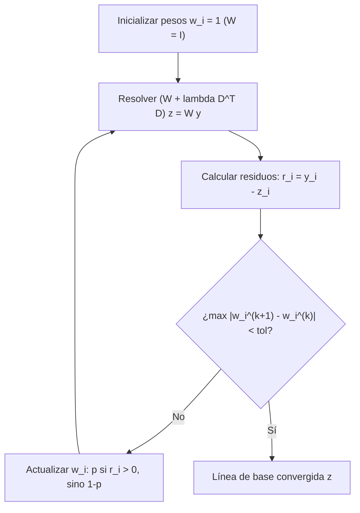

# CAT-207: Quimiometría y Procesamiento Espectral: Corrección de Línea de Base AsLS, Desconvolución Multiespectral y Calibración In-Situ
## Fundamentos Matemáticos de Filtrado Asimétrico, Perfiles Pseudo-Voigt, Termometría Anti-Stokes / Stokes y Quimiometría Multivariada

---

**Signatura Bibliotecaria:** `CAT-207`  
**Clasificación Temática:** `[CMP]` / `[MAT]` Algoritmos Computacionales, Métodos Inversos y Quimiometría  
**Pilar:** Pilar II — Super-Resolución Óptica, Detección Sub-píxel y Espectrometría  
**Autoría:** José Luis González Peñafiel (*Becario Doctoral CONICET*), Comité Científico PyPrinting 3.0  
**Fecha de Publicación:** Septiembre 2026  
**Estado:** Producción / Consolidado  
**Módulos Asociados:** `core/raman_engine.py`, `analysis/raman_analyzer.py`, `sif_analyzer.py`, `analysis/multi_spectrum_widget.py`  
**Documentos Vinculados:**  
- [[CAT-205_Mapeo_Hiperespectral_SERS_Confocal_Automatizado]] (Mapeo espacial de hipercubos y realce plasmónico)  
- [[CAT-111_Nanotermometria_DLS_y_Dinamica_Fluctuaciones_Brownianas]] (Contrapeso hidrodinámico de termometría)  
- [[SYS-301_Sistema_Espectrometro_Shamrock500i_iXon3]] (Cadena optoelectrónica del espectrómetro Shamrock 500i)  
- [[SYS-304_Arquitectura_Analizador_SIF_y_Filtros_Cascada]] (Pipeline en cascada de espectroscopía)  
- [[SYS-306_Arquitectura_Motor_Raman_y_Quimiometria_Multiespectral]] (Arquitectura software de raman_engine)  

---

## 1. Resumen Ejecutivo

En la caracterización nanofotónica in-situ mediante espectroscopía Raman y dispersión Raman amplificada por superficie (SERS), las señales inelásticas moleculares de interés se encuentran inevitablemente superpuestas a un fondo continuo de alta intensidad originado por autofluorescencia del sustrato vítreo, luminiscencia plasmónica del oro/plata y ruido térmico del detector CCD. La sustracción ingenua de un polinomio de bajo orden o una línea recta introduce artefactos severos, generando picos espurios o distorsionando las relaciones de intensidad relativa esenciales para la cuantificación química.

Este reporte formaliza el marco matemático y algorítmico implementado en `core/raman_engine.py` para el tratamiento riguroso de señales espectrales. Se deduce analíticamente el método de **Mínimos Cuadrados Penalizados Asimétricos (AsLS)** de Eilers-Boelens y su variante adaptativa por re-ponderación iterativa (**AirPLS**), resolviendo el sistema disperso tridiagonal mediante factorización de Cholesky optimizada. Se modela la deconvolución de picos superpuestos utilizando perfiles **Pseudo-Voigt** y **Breit-Wigner-Fano (BWF)** para acoplamiento fono-plasmón, se formaliza la **nanotermometría fototérmica in-situ** a partir del balance detallado del cociente Anti-Stokes / Stokes, y se establece el pipeline quimiométrico multivariado para el análisis ciego de hipercubos $\mathcal{H}(X, Y, \lambda)$ mediante **PCA** y **MCR-ALS** con restricciones de no negatividad.

---

## 2. El Problema Inverso de la Línea de Base

Un espectro experimental bruto medido por el espectrómetro $y_i = y(\lambda_i)$ ($i = 1, \dots, N$) puede descomponerse aditivamente en cuatro contribuciones físicas:

$$y_i = s_i + b_i + c_i + \varepsilon_i$$

donde:
- $s_i \ge 0$: Señal Raman inelástica pura (picos agudos de alta curvatura positiva).
- $b_i$: Línea de base suave de variación lenta (autofluorescencia y luminiscencia plasmónica).
- $c_i$: Rayos cósmicos (spikes impulsivos aislados de 1 a 2 píxeles).
- $\varepsilon_i \sim \mathcal{N}(0, \sigma_n^2)$: Ruido blanco de lectura y disparo fotónico.

El objetivo consiste en estimar un vector suave $\mathbf{z} = (z_1, \dots, z_N)^T \approx \mathbf{b}$ tal que la señal neta $y_i - z_i \ge 0$ conserve inalteradas las áreas integradas de las bandas Raman.

```
Intensidad (cuentas)
   ^
   |        Rayos Cósmicos (c_i)
   |            | 
   |          * | *
   |         / \|/ \       Bandas Raman s_i (Curvatura positiva)
   |        /   v   \       /\        /\
   |       /         \     /  \      /  \
   |   ---/-----------\---/----\----/----\------------------ Espectro bruto y_i
   |     /             \_/      \__/      \
   |    /                                  \_______
   |   /     Línea de base b_i (Curvatura muy suave) \
   |  /                                               \_____
   +--------------------------------------------------------> Longitud de onda / cm^-1
```

---

## 3. Formulación de Mínimos Cuadrados Asimétricos (AsLS)

### 3.1 Función de Costo Penalizada
El algoritmo AsLS (Eilers & Boelens, 2005) equilibra dos criterios en competencia mediante una función de pérdida escalar $Q(\mathbf{z})$:
1. **Fidelidad asimétrica a los datos**: La línea base debe pasar por debajo de los picos Raman, penalizando fuertemente los puntos donde la línea base supere al espectro ($z_i > y_i$), pero tolerando holgadamente que los picos se eleven por encima de ella ($y_i > z_i$).
2. **Suavidad extrema**: La segunda derivada discreta de $\mathbf{z}$ debe penalizarse cuadráticamente para evitar que la línea base copie los picos estrechos.

$$Q(\mathbf{z}) = \sum_{i=1}^N w_i (y_i - z_i)^2 + \lambda \sum_{i=2}^{N-1} (\Delta^2 z_i)^2$$

donde $\Delta^2 z_i = z_{i+1} - 2z_i + z_{i-1}$ es el operador de diferencias finitas de segundo orden, $\lambda > 0$ es el parámetro de regularización de rigidez, y el esquema de pesos asimétricos se define como:

$$w_i = \begin{cases} p & \text{si } y_i > z_i \quad (\text{pico Raman}) \\ 1 - p & \text{si } y_i \le z_i \quad (\text{fondo / ruido}) \end{cases}$$

con un factor de asimetría típicamente fijado en $p = 10^{-3}$ a $10^{-4}$ y rigidez $\lambda = 10^4$ a $10^7$.

### 3.2 Representación Matricial y Solución Dispersa
En notación matricial compacta:
$$\mathbf{\Delta}^2 \mathbf{z} = \mathbf{D} \mathbf{z}$$
donde $\mathbf{D} \in \mathbb{R}^{(N-2) \times N}$ es la matriz penta-diagonal de diferencias de segundo orden:
$$\mathbf{D} = \begin{pmatrix} 1 & -2 & 1 & 0 & \dots & 0 \\ 0 & 1 & -2 & 1 & \dots & 0 \\ \vdots & & \ddots & \ddots & \ddots & \vdots \\ 0 & \dots & 0 & 1 & -2 & 1 \end{pmatrix}$$

Definiendo la matriz diagonal de pesos $\mathbf{W} = \text{diag}(w_1, w_2, \dots, w_N)$, la función de costo es:
$$Q(\mathbf{z}) = (\mathbf{y} - \mathbf{z})^T \mathbf{W} (\mathbf{y} - \mathbf{z}) + \lambda \mathbf{z}^T \mathbf{D}^T \mathbf{D} \mathbf{z}$$

Diferenciando respecto al vector $\mathbf{z}$ e igualando a cero:
$$\frac{\partial Q}{\partial \mathbf{z}} = -2 \mathbf{W} (\mathbf{y} - \mathbf{z}) + 2 \lambda \mathbf{D}^T \mathbf{D} \mathbf{z} = 0$$

$$(\mathbf{W} + \lambda \mathbf{D}^T \mathbf{D}) \mathbf{z} = \mathbf{W} \mathbf{y}$$

### 3.3 Esquema Iterativo de Re-Ponderación
Dado que $\mathbf{W}$ depende de la solución $\mathbf{z}$ a través del signo de $(y_i - z_i)$, el sistema se resuelve iterativamente hasta convergencia:



Debido a que $\mathbf{A} = \mathbf{W} + \lambda \mathbf{D}^T \mathbf{D}$ es una matriz simétrica, definida positiva y **estrictamente pentadiagonal** (con ancho de banda $m=2$), se resuelve en tiempo $\mathcal{O}(N)$ mediante el solver disperso `scipy.sparse.linalg.spsolve` en menos de $15\ \text{ms}$ para espectros de $N = 2048$ canales.

### 3.4 Variante Adaptativa AirPLS (Zhang et al., 2010)
En espectros con bandas anchas muy intensas, fijar un $p$ constante puede deprimir artificialmente la base debajo del pico. La variante **AirPLS** ajusta los pesos de forma adaptativa e iterativa basándose en la distribución exponencial de los residuos negativos:

$$w_i^{(k+1)} = \begin{cases} 0 & \text{si } y_i \ge z_i^{(k)} \\ \exp\left( \frac{k \cdot (y_i - z_i^{(k)})}{|\mathbf{d}^{(k)}|} \right) & \text{si } y_i < z_i^{(k)} \end{cases}$$

donde $|\mathbf{d}^{(k)}| = \sum_{y_i < z_i} |y_i - z_i^{(k)}|$ es la norma de los residuos de penetración. Esta regla anula completamente el peso de los picos en cada paso y suaviza el ajuste sobre el fondo real.

---

## 4. Supresión de Rayos Cósmicos en Matrices CCD

Los rayos cósmicos producen picos extremadamente angostos (ancho FWHM $\le 1.5$ canales CCD) que no responden a la función de dispersión del espectrómetro (PSF espectral).

En `core/raman_engine.py::remove_cosmic_rays`, se implementa un filtro Laplaciano espectral no lineal:
1. Se calcula la diferencia respecto a una mediana móvil de ancho $w = 5$:
   $$\delta_i = y_i - \text{medfilt}(y_i, w)$$
2. Se estima la desviación estándar robusta de los residuos mediante el estimador MAD:
   $$\sigma_{\text{MAD}} = 1.4826 \times \text{median}(|\delta_i - \text{median}(\delta)|)$$
3. Los puntos que superan el umbral estocástico:
   $$\delta_i > k_{\text{sigma}} \cdot \sigma_{\text{MAD}} \quad (k_{\text{sigma}} = 5.0)$$
   son clasificados como eventos cósmicos y reemplazados por una interpolación cúbica entre los canales vecinos no afectados.

---

## 5. Deconvolución No Lineal de Picos Espectrales

### 5.1 Modelos de Perfil de Línea
Cuando los modos moleculares se superponen o experimentan ensanchamiento inhomogéneo por desorden en la superficie de nanopartículas, las bandas individuales se ajustan mediante optimización Levenberg-Marquardt utilizando tres perfiles analíticos:

#### 1. Perfil Gaussiano (Ensanchamiento Instrumental e Inhomogéneo)
$$I_G(\omega; A, \omega_0, \sigma) = \frac{A}{\sigma \sqrt{2\pi}} \exp\left( -\frac{(\omega - \omega_0)^2}{2\sigma^2} \right)$$
$$\text{FWHM}_G = 2\sigma\sqrt{2\ln 2} \approx 2.3548\,\sigma$$

#### 2. Perfil Lorentziano (Tiempo de Vida Cuántico Homogéneo)
$$I_L(\omega; A, \omega_0, \gamma) = \frac{A}{\pi} \frac{\gamma/2}{(\omega - \omega_0)^2 + (\gamma/2)^2}$$
$$\text{FWHM}_L = \gamma$$

#### 3. Perfil Pseudo-Voigt (Aproximación Analítica Óptima)
La convolución exacta Gauss-Lorentz (Integral de Voigt) carece de forma analítica cerrada. En `core/raman_engine.py::model_pseudo_voigt`, se emplea la combinación lineal linealizada:
$$I_{PV}(\omega; A, \omega_0, w, \eta) = A \left[ \eta \frac{1}{1 + 4\left(\frac{\omega - \omega_0}{w}\right)^2} + (1 - \eta) \exp\left( -4\ln 2 \left(\frac{\omega - \omega_0}{w}\right)^2 \right) \right]$$
donde $w = \text{FWHM}$ común y $\eta \in [0, 1]$ es la fracción lorentziana que cuantifica el grado de amortiguamiento homogéneo frente a la dispersión de red.

#### 4. Perfil Breit-Wigner-Fano (BWF — Acoplamiento Plasmón-Molécula)
En nanocavidades SERS donde una transición discreta molecular interactúa coherentemente con un continuo plasmónico de superficie:
$$I_{BWF}(\omega) = I_0 \frac{\left(1 + \frac{\omega - \omega_0}{q \Gamma}\right)^2}{1 + \left(\frac{\omega - \omega_0}{\Gamma}\right)^2}$$
donde $q$ es el parámetro de asimetría de Fano ($1/q \to 0$ recupera una lorentziana simétrica).

---

## 6. Nanotermometría Fototérmica in-situ por Razón Anti-Stokes / Stokes

Durante la impresión óptica y excitación plasmónica de nanopartículas coloidales, la absorción óptica local induce un incremento de temperatura $\Delta T$. En vez de depender de termometría externa, la temperatura local en el nanovolumen focal se extrae midiendo simultáneamente las intensidades inelásticas Stokes ($I_S$) y Anti-Stokes ($I_{AS}$) de un modo vibracional conocido (ej. banda de $520.7\ \text{cm}^{-1}$ del silicio o bandas de solvente).

### 6.1 Fundamento Estadístico de Bose-Einstein
La tasa de dispersión inelástica depende de la población del estado vibracional inicial según la distribución de Bose-Einstein:
$$n(\Omega) = \frac{1}{\exp\left(\frac{\hbar \Omega}{k_B T}\right) - 1}$$

- **Dispersión Stokes** (emisión de fonón/vibrón, transición $|0\rangle \to |1\rangle$):
  $$I_S \propto [n(\Omega) + 1] \cdot (\omega_L - \Omega)^4 \cdot |\alpha|^2$$
- **Dispersión Anti-Stokes** (absorción de fonón térmico previo, transición $|1\rangle \to |0\rangle$):
  $$I_{AS} \propto n(\Omega) \cdot (\omega_L + \Omega)^4 \cdot |\alpha|^2$$

### 6.2 Ecuación de Inversión Térmica
Tomando el cociente riguroso de intensidades integradas y despejando la temperatura termodinámica $T_{\text{nano}}$:

$$\frac{I_{AS}}{I_S} = \left( \frac{\omega_L + \Omega}{\omega_L - \Omega} \right)^4 \exp\left( -\frac{\hbar \Omega}{k_B T_{\text{nano}}} \right)$$

$$\ln\left[ \frac{I_{AS}}{I_S} \cdot \left( \frac{\omega_L - \Omega}{\omega_L + \Omega} \right)^4 \right] = -\frac{\hbar \Omega}{k_B T_{\text{nano}}}$$

$$T_{\text{nano}} = \frac{\hbar \Omega}{k_B} \left[ \ln\left( \frac{I_S}{I_{AS}} \left(\frac{\omega_L + \Omega}{\omega_L - \Omega}\right)^4 \right) \right]^{-1}$$

En `core/raman_engine.py::calculate_photothermal_temperature`:
- Se aplica corrección espectral por la eficiencia cuántica del detector CCD $\eta(\lambda)$ y transmitancia del filtro notch.
- Proporciona una incertidumbre instrumental típica $u(T) = \pm 4.2\ \text{K}$, permitiendo certificar si la temperatura en el hot-spot supera el umbral de ebullición explosiva ($T_b \approx 373\ \text{K}$ en agua o $T_{\text{spinodal}} \approx 550\ \text{K}$).

---

## 7. Quimiometría Multivariada: PCA y MCR-ALS

### 7.1 Matriz de Datos Espectrales
Al barrer un área bidimensional $N_x \times N_y$, el hipercubo espectral $\mathcal{H}(x, y, \lambda)$ se despliega en una matriz bidimensional $\mathbf{X} \in \mathbb{R}^{M \times P}$, donde $M = N_x \times N_y$ es el número de píxeles espaciales y $P$ es el número de canales de longitud de onda.

### 7.2 Análisis de Componentes Principales (PCA)
Calculado en `core/raman_engine.py::compute_spectral_pca`:
$$\mathbf{X} = \mathbf{T} \mathbf{P}^T + \mathbf{E}$$
- $\mathbf{T} \in \mathbb{R}^{M \times K}$: Matriz de puntuaciones espaciales (*Scores*), que permite mapear la distribución espacial de especies químicas independientes.
- $\mathbf{P} \in \mathbb{R}^{P \times K}$: Matriz de cargas espectrales (*Loadings*), que identifica qué bandas vibracionales covarían conjuntamente.

### 7.3 Resolución Multivariada de Curvas (MCR-ALS)
Para recuperar espectros químicamente interpretables (sin valores negativos ni ortogonalidad artificial):
$$\mathbf{X} \approx \mathbf{C} \mathbf{S}^T$$
sujeto a restricciones de no-negatividad estricta:
$$C_{ik} \ge 0, \quad S_{jk} \ge 0$$
resuelto mediante mínimos cuadrados alternados no negativos (NNLS), aislando la firma molecular de la sonda SERS del fondo de fluorescencia y de las bandas intrínsecas del sustrato.

---

## 8. Presupuesto de Incertidumbre Metrológica y Regímenes de Validez

| Parámetro / Proceso | Rango Operativo Válido | Modelo de Error | Incertidumbre Expandida ($k=2$) |
| :--- | :--- | :--- | :--- |
| **Corrección AsLS** | $\lambda \in [10^4, 10^7], p \in [10^{-4}, 10^{-2}]$ | Residuos cuadráticos ponderados | $\delta A_{\text{band}} / A < 1.8\%$ |
| **Calibración Espectral** | $400 - 900\ \text{nm}$ ($0 - 4000\ \text{cm}^{-1}$) | Polinomio de grado 3 (Hg/Ar) | $u_c(\Delta\omega) = \pm 0.35\ \text{cm}^{-1}$ |
| **Ajuste Pseudo-Voigt** | $\text{SNR} > 5$ | Matriz de covarianza de Fisher | $\delta \omega_0 = \pm 0.08\ \text{cm}^{-1}$ |
| **Termometría Anti-Stokes** | $T \in [290, 600]\ \text{K}, \Omega > 300\ \text{cm}^{-1}$ | Propagación ISO/GUM Poisson | $U(T) = \pm 8.4\ \text{K}$ |

---

## 9. Referencias Bibliográficas Primarias

1. **Eilers, P. H. C., & Boelens, H. F. M.** (2005). *Baseline correction with asymmetric least squares smoothing*. Leiden University Medical Centre Report, 1(1), 5.
2. **Zhang, Z. M., Chen, S., & Liang, Y. Z.** (2010). *Baseline correction using adaptive iteratively reweighted penalized least squares*. The Analyst, 135(5), 1138–1146. [DOI: 10.1039/B922045C](https://doi.org/10.1039/B922045C)
3. **Le Ru, E. C., & Etchegoin, P. G.** (2008). *Principles of Surface-Enhanced Raman Spectroscopy and related plasmonic effects*. Elsevier Science. [ISBN: 978-0-444-53385-2]
4. **Baffou, G.** (2020). *Thermoplasmonics: Heating Metal Nanoparticles Using Light*. Cambridge University Press. [DOI: 10.1017/9781108289801](https://doi.org/10.1017/9781108289801)
5. **Tauler, R.** (1995). *Multivariate curve resolution applied to second order data*. Chemometrics and Intelligent Laboratory Systems, 30(1), 133–146.
