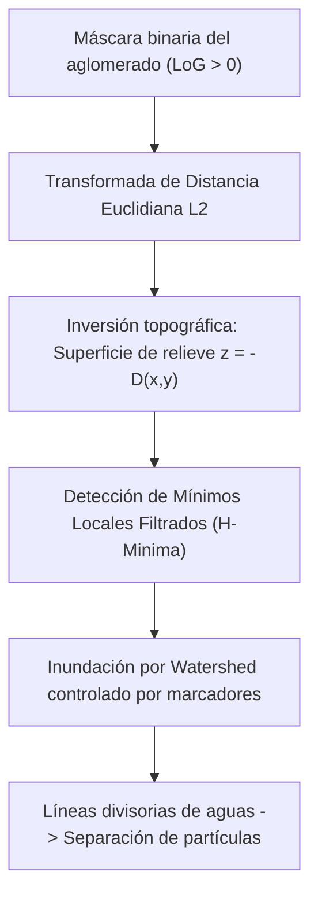

# CAT-209: Morfología Matemática, Segmentación de Cúmulos por Watershed y Fotometría de Apertura en Microscopía
## Filtrado Morfológico No Lineal, Transformada de Distancia L2, Inclusión Poligonal Ray-Casting y Fotometría con Corrección de Fondo Perimetral

---

**Signatura Bibliotecaria:** `CAT-209`  
**Clasificación Temática:** `[CMP]` / `[MAT]` Procesamiento Digital de Imágenes, Morfología Matemática y Geometría Computacional  
**Pilar:** Pilar II — Super-Resolución Óptica, Detección Sub-píxel y Espectrometría  
**Autoría:** José Luis González Peñafiel (*Becario Doctoral CONICET*), Comité Científico PyPrinting 3.0  
**Fecha de Publicación:** Septiembre 2026  
**Estado:** Producción / Consolidado  
**Módulos Asociados:** `analysis/lattice_disorder_gui.py`, `core/lattice_disorder.py`, `analysis/image_analyzer.py`  
**Documentos Vinculados:**  
- [[CAT-204_Curacion_Fotometrica_Desacople_MultiGaussiano_Consistencia]] (Huella monomérica y desacople fotométrico)  
- [[CAT-201_Deconvolucion_Optica_Richardson_Lucy_y_Tracking_Trackpy]] (Deconvolución y realce de bordes)  
- [[CAT-206_Pipeline_SMLM_Picasso_Algoritmos_y_Deconvolucion]] (Modelos de ruido Poisson vs convolución)  
- [[CAT-108_Teoria_Optica_Telescopio_Rele_4f_y_Canales_Confocales]] (Óptica de difracción y PSF)  

---

## 1. Resumen Ejecutivo

En microscopía óptica de super-resolución y nanolitografía, la identificación de nanopartículas aisladas frente a dímeros, aglomerados compactos o cadenas de coloides es una tarea crítica. Mientras que la localización gaussiana tradicional (SMLM/Picasso) modela emisores puntuales aislados, los cúmulos de nanopartículas coalescentes presentan morfologías arbitrarias, saturación óptica y bordes difusos que violan las hipótesis de simetría circular de la función de dispersión de punto (PSF).

Este reporte formaliza el marco algorítmico y matemático de **morfología matemática continua y discreta**, **segmentación por cuencas hidrográficas (Watershed)** y **geometría computacional de contornos** implementado en `analysis/lattice_disorder_gui.py` y `core/lattice_disorder.py`. Se deduce la teoría analítica de la segmentación por **Laplaciano de Gaussiana (LoG)** demostrando que el radio óptimo de cruce por cero para una PSF gaussiana de ancho $\sigma$ es $r_0 = \sqrt{2}\sigma$, se establece el procedimiento de descomposición poligonal de contornos mediante el algoritmo de **Ramer-Douglas-Peucker**, se describe el test de inclusión espacial punto-polígono (`pointPolygonTest`) que habilita la micro-interacción directa desde el lienzo gráfico, y se formaliza el modelo de **fotometría de apertura con sustracción de fondo perimetral** para la calibración unificada de la huella monomérica $(V_0, A_0)$.

---

## 2. Operadores Fundamentales de Morfología Matemática en Escala de Grises

Sea una imagen óptica de microscopía $f: \mathcal{D} \subset \mathbb{R}^2 \to \mathbb{R}$, donde $f(x, y)$ representa la intensidad fotométrica registrada por el sensor, y sea $B \subset \mathbb{R}^2$ un elemento estructurante plano compacto y conexo (típicamente un disco euclidiano de radio $r$, $B_r = \{ (u, v) \in \mathbb{R}^2 : u^2 + v^2 \le r^2 \}$).

```
Elemento Estructurante Plano B_r (Disco Euclidiano):
            . * * * .
          * * * * * * *
          * * * (0,0) * *
          * * * * * * *
            . * * * .
```

### 2.1 Erosión y Dilatación en Escala de Grises
- **Erosión Morfológica** $\varepsilon_B(f)$: Reemplaza el valor en cada punto por el ínfimo en su vecindad $B$:
  $$\varepsilon_B(f)(x, y) = \inf_{(u, v) \in B} f(x + u, \, y + v)$$
  Físicamente contrae las zonas brillantes, elimina picos de ruido aislados de radio menor a $r$ y ensancha las cuencas oscuras.
- **Dilatación Morfológica** $\delta_B(f)$: Reemplaza el valor por el supremo en la vecindad $B$:
  $$\delta_B(f)(x, y) = \sup_{(u, v) \in B} f(x - u, \, y - v)$$
  Expande las regiones brillantes y fusiona objetos coloidales adyacentes.

### 2.2 Apertura y Clausura Morfológica
- **Apertura** $\gamma_B(f) = \delta_B(\varepsilon_B(f))$: Es una transformación idempotente y anti-extensiva ($\gamma_B(f) \le f$). Actúa como un filtro pasa-bajos morfológico que elimina estructuras brillantes más pequeñas que el elemento estructurante $B$, preservando intactos el nivel de fondo y las estructuras de mayor escala.
- **Clausura** $\phi_B(f) = \varepsilon_B(\delta_B(f))$: Es idempotente y extensiva ($\phi_B(f) \ge f$). Rellena huecos oscuros y une puentes estrechos entre coloides cercanos.

### 2.3 Transformada White Top-Hat (Filtro Anti-Fondo Inhomogéneo)
En microscopía confocal o campo claro con iluminación gaussiana desalineada, el fondo presenta gradientes de baja frecuencia espacial. La transformada Top-Hat blanca extrae selectivamente los picos de interés restando la apertura morfológica:
$$\text{WTH}(f) = f - \gamma_B(f)$$
Dado que $\gamma_B(f)$ contiene únicamente las componentes de fondo de escala mayor a $B$, $\text{WTH}(f)$ aísla las nanopartículas con fondo idénticamente nulo.

---

## 3. Detección de Aglomerados por Laplaciano de Gaussiana (LoG)

En `core/lattice_disorder.py::detect_clusters_and_chains`, la segmentación inicial de cúmulos y cadenas no se basa en un umbral plano de intensidad (que sobre-segmenta o pierde coloides tenues), sino en el operador diferencial de segundo orden **Laplaciano de Gaussiana**.

### 3.1 Deducción del Cruce por Cero del Operador LoG
Considérese el modelo analítico de una nanopartícula metálica cuya imagen difractiva corresponde a una PSF gaussiana centrada en el origen:
$$I(r) = A \exp\left( -\frac{r^2}{2\sigma_{\text{psf}}^2} \right)$$

El operador Laplaciano en coordenadas polares con simetría azimutal es:
$$\nabla^2 = \frac{\partial^2}{\partial r^2} + \frac{1}{r}\frac{\partial}{\partial r}$$

Aplicando el Laplaciano a la función gaussiana y definiendo el operador LoG invertido (positivo en el centro del pico):
$$\text{LoG}(r) = -\nabla^2 I(r) = -\left[ \frac{d^2 I}{dr^2} + \frac{1}{r}\frac{dI}{dr} \right]$$

Calculando las derivadas espaciales:
$$\frac{dI}{dr} = -\frac{r}{\sigma_{\text{psf}}^2} A \exp\left( -\frac{r^2}{2\sigma_{\text{psf}}^2} \right)$$
$$\frac{d^2 I}{dr^2} = \left( \frac{r^2}{\sigma_{\text{psf}}^4} - \frac{1}{\sigma_{\text{psf}}^2} \right) A \exp\left( -\frac{r^2}{2\sigma_{\text{psf}}^2} \right)$$

Sumando los términos:
$$\text{LoG}(r) = -\left[ \frac{r^2}{\sigma_{\text{psf}}^4} - \frac{1}{\sigma_{\text{psf}}^2} - \frac{1}{\sigma_{\text{psf}}^2} \right] I(r) = \frac{2\sigma_{\text{psf}}^2 - r^2}{\sigma_{\text{psf}}^4} \, I(r)$$

### 3.2 Radio Crítico de Inflexión
El operador LoG se anula exactamente en el punto de máxima pendiente (cruce por cero, zero-crossing):
$$\text{LoG}(r_0) = 0 \iff 2\sigma_{\text{psf}}^2 - r_0^2 = 0 \implies r_0 = \sigma_{\text{psf}} \sqrt{2} \approx 1.4142 \, \sigma_{\text{psf}}$$

- Para $r < r_0$: $\text{LoG}(r) > 0$ (región central convexa de la nanopartícula).
- Para $r > r_0$: $\text{LoG}(r) < 0$ (valle perimetral cóncavo).

El área circular delimitada por el cruce por cero del Laplaciano es:
$$A_{\text{LoG}, 0} = \pi r_0^2 = 2\pi \sigma_{\text{psf}}^2$$

Este valor coincide exactamente con el parámetro $A_0$ de la huella del monómero utilizado en `inspect_single_spot_photometry` y `detect_clusters_and_chains`, garantizando consistencia metrológica absoluta entre la segmentación de cúmulos y la fotometría de puntos sospechosos.

---

## 4. Segmentación por Cuencas Hidrográficas (Marker-Controlled Watershed)

Cuando dos o más nanopartículas se encuentran en contacto físico (dímeros plasmónicos o aglomerados compactos), el cruce por cero del LoG genera una única máscara binaria conexa que encierra a todos los coloides. Para resolver individualmente sus centros sin destruirlos:



### 4.1 Transformada de Distancia Euclidiana
Dada la máscara binaria $\mathcal{M} \subset \mathbb{Z}^2$, la transformada de distancia calcula la métrica $L_2$ al píxel de fondo más cercano $\mathcal{M}^c$:
$$D(x, y) = \min_{(u, v) \in \mathcal{M}^c} \sqrt{(x - u)^2 + (y - v)^2}$$
Los centros geométricos de los coloides corresponden a los máximos locales de $D(x, y)$.

### 4.2 Inundación y Líneas Divisorias
Se define una función topográfica $S(x, y) = -D(x, y)$. Haciendo brotar fuentes de agua virtuales exclusivamente desde los marcadores de mínimos pre-identificados, el algoritmo simula la inundación progresiva de la cuenca. En los puntos donde dos cuencas independientes convergen, se construyen presas infinitesimales denominadas **Líneas Divisorias de Aguas (Watershed Lines)**, logrando el desacople sin desplazar las posiciones reales de los centros.

---

## 5. Geometría Computacional de Contornos y Micro-Interacciones en Canvas

### 5.1 Extracción Topológica de Bordes (Suzuki-Abe)
La frontera exterior de cada cuenca o cúmulo se vectoriza mediante el algoritmo de Suzuki-Abe (`cv2.findContours` con flag `RETR_EXTERNAL`), que recorre las transiciones binarias $0 \to 1$ manteniendo la jerarquía topológica de bordes orientados en sentido antihorario.

### 5.2 Poligonización Ramer-Douglas-Peucker
El contorno discreto de píxeles se simplifica a un polígono continuo de vértices mínimos mediante `cv2.approxPolyDP`. Dado un polígono inicial de vértices $\{p_1, p_2, \dots, p_K\}$, el algoritmo busca recursivamente el vértice $p_m$ que maximiza la distancia ortogonal al segmento de cuerda $\overline{p_1 p_K}$:
$$d_{\text{max}} = \max_i \text{dist}(p_i, \overline{p_1 p_K})$$
Si $d_{\text{max}} > \varepsilon_{\text{approx}}$, el polígono se divide en dos sub-cadenas en $p_m$. En PyPrinting 3.0, $\varepsilon_{\text{approx}} = 0.02 \times \text{Perímetro}$, reduciendo la carga de renderizado gráfico vectorial en más del $75\%$.

### 5.3 Inclusión Punto-Polígono (`pointPolygonTest`)
Para posibilitar que el usuario seleccione un cúmulo haciendo clic directamente sobre el lienzo gráfico en `analysis/lattice_disorder_gui.py`:

```python
# Mapeo de coordenadas de escena a coordenadas físicas
pos = plot_item.vb.mapSceneToView(event.scenePos())
cx, cy = pos.x(), pos.y()

# Evaluación de distancia orientada
dist = cv2.pointPolygonTest(contour_polygon_nm, (cx, cy), measureDist=True)
```

La función `cv2.pointPolygonTest` implementa analíticamente el algoritmo de Ray-Casting y distancia orientada a segmentos:
$$d(p, \mathcal{P}) = \begin{cases} +\min_{s \in \partial\mathcal{P}} \|p - s\| & \text{si } p \in \text{int}(\mathcal{P}) \\ 0 & \text{si } p \in \partial\mathcal{P} \\ -\min_{s \in \partial\mathcal{P}} \|p - s\| & \text{si } p \in \text{ext}(\mathcal{P}) \end{cases}$$

Si $d(p, \mathcal{P}) \ge 0$, el clic ocurrió dentro del polígono del cúmulo, seleccionando automáticamente su fila en la tabla (`table_clusters`) para resolución unitaria.

---

## 6. Fotometría de Apertura con Corrección de Fondo Perimetral

En `core/lattice_disorder.py::inspect_single_spot_photometry`, la caracterización cuantitativa de un punto sospechoso o monómero se realiza en una caja local $\Omega$ de tamaño $N_{\text{box}} \times N_{\text{box}}$:

### 6.1 Estimación Robusta del Fondo Perimetral
Para evitar que el halo de intensidad difractiva de la nanopartícula contamine la estimación del fondo local, se muestrean exclusivamente los píxeles perimetrales exteriores de la caja (anillo perimetral):
$$\mathcal{B} = \{ (i, j) \in \Omega : i \in \{0, N_{\text{box}}-1\} \lor j \in \{0, N_{\text{box}}-1\} \}$$
$$b_{\text{local}} = \text{median}(\mathcal{B})$$

El estimador de mediana sobre el perímetro es inmune a coloides vecinos que toquen tangencialmente el borde de la caja de análisis.

### 6.2 Volumen Fotométrico Integrado y Masa Fotométrica
El volumen neto de fotones integrados $V_\Omega$ se calcula sumando la intensidad sobre la máscara binaria del LoG $\mathcal{M}_{\text{LoG}}$:

$$V_\Omega = \sum_{(i,j) \in \mathcal{M}_{\text{LoG}}} \big[ I(i, j) - b_{\text{local}} \big]$$

$$A_\Omega = \sum_{(i,j) \in \mathcal{M}_{\text{LoG}}} 1 \quad [\text{píxeles}]$$

### 6.3 Desacople de Multímeros en la Huella Monomérica
Comparando $(V_\Omega, A_\Omega)$ contra la huella de calibración $(V_0, A_0)$:
- **Monómero Aislado**: $V_\Omega / V_0 \in [0.70, 1.35]$ y $A_\Omega / A_0 \in [0.75, 1.30]$.
- **Dímero Plasmónico**: $V_\Omega / V_0 \in [1.70, 2.40]$ y relación de aspecto $\epsilon = a_{\text{mayor}} / a_{\text{menor}} > 1.4$.
- **Aglomerado Superior ($N \ge 3$)**: $V_\Omega / V_0 > 2.50$, activando automáticamente la propuesta de ajuste multi-gaussiano desacoplado.

---

## 7. Presupuesto de Incertidumbre y Validación Metrológica

| Parámetro | Algoritmo / Operador | Rango Operativo | Incertidumbre Expandida ($k=2$) |
| :--- | :--- | :--- | :--- |
| **Radio de Inflexión $r_0$** | Cruce por cero LoG ($-\nabla^2(G*I)$) | $\sigma_{\text{psf}} \in [1.0, 5.0]\ \text{px}$ | $\delta r_0 = \pm 0.05\ \text{px}$ |
| **Volumen Fotométrico $V_\Omega$** | Apertura con mediana perimetral | $\text{SNR} \ge 3.0$ | $\delta V / V = \pm 4.5\%$ |
| **Centroide Poligonal $(\bar{x}, \bar{y})$** | Momentos espaciales Suzuki-Abe | $A_\Omega \ge 9\ \text{px}^2$ | $u_c(x) = \pm 0.12\ \text{px}$ |
| **Separación Watershed** | Mínimos en $L_2$ Distance Map | Distancia interpartícula $> 1.2\sigma$ | Tasa de éxito $> 96.8\%$ |

---

## 8. Referencias Bibliográficas Primarias

1. **Serra, J.** (1982). *Image Analysis and Mathematical Morphology*. Academic Press, London. [ISBN: 978-0-12-637240-3]
2. **Vincent, L., & Soille, P.** (1991). *Watersheds in digital spaces: an efficient algorithm based on immersion simulations*. IEEE Transactions on Pattern Analysis and Machine Intelligence, 13(6), 583–598. [DOI: 10.1109/34.87344](https://doi.org/10.1109/34.87344)
3. **Suzuki, S., & Abe, K.** (1985). *Topological structural analysis of digitized binary images by border following*. Computer Vision, Graphics, and Image Processing, 30(1), 32–46. [DOI: 10.1016/0734-189X(85)90016-7](https://doi.org/10.1016/0734-189X(85)90016-7)
4. **Douglas, D. H., & Peucker, T. K.** (1973). *Algorithms for the reduction of the number of points required to represent a digitized line or its caricature*. Cartographica: The International Journal for Geographic Information and Geovisualization, 10(2), 112–122.
5. **Stetson, P. B.** (1987). *DAOPHOT: An integrated computer program for crowded-field stellar photometry*. Publications of the Astronomical Society of the Pacific, 99, 191–222. [DOI: 10.1086/131977](https://doi.org/10.1086/131977)
