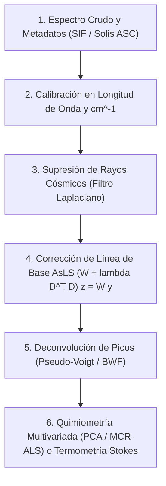

# CAT-250: Marco Unificado de Espectroscopía Óptica, Efecto SERS y Quimiometría Multivariada
## Tratado Rector de Dispersión Raman Inelástica, Resonancias Plasmónicas SERS/SLR, Instrumentación Shamrock 500i / iXon3 y Algoritmos Quimiométricos AsLS/PCA/MCR-ALS

---

**Signatura Bibliotecaria:** `CAT-250`  
**Clasificación Temática:** `[FIS]` / `[CMP]` Espectrometría Óptica, Nanofotónica Vibracional y Quimiometría Multivariada  
**Pilar:** Pilar II — Super-Resolución Óptica, Detección Sub-píxel y Espectrometría (NODO RECTOR ESPECTRAL)  
**Autoría:** José Luis González Peñafiel (*Becario Doctoral CONICET*), Comité Científico PyPrinting 3.0  
**Fecha de Publicación:** Septiembre 2026  
**Estado:** Producción / Consolidado  
**Módulos Asociados:** `raman_analyzer.py`, `core/raman_engine.py`, `sif_analyzer.py`, `pyspectrum.py`, `analysis/multi_spectrum_widget.py`  
**Documentos Vinculados:**  
- [[CAT-205_Mapeo_Hiperespectral_SERS_Confocal_Automatizado]] (Barrido 3D y desmezclado MCR-ALS)  
- [[CAT-207_Quimiometria_Procesamiento_Espectral_AsLS_Voigt_Calibracion]] (AsLS, AirPLS, Pseudo-Voigt y termometría)  
- [[CAT-208_Electrodinamica_Nanocavidades_Plasmicas_SLR_y_SERS]] (Electrodinámica de hot-spots y SLR)  
- [[SYS-301_Sistema_Espectrometro_Shamrock500i_iXon3]] (Hardware Shamrock 500i y cámara iXon3)  
- [[SYS-304_Arquitectura_Analizador_SIF_y_Filtros_Cascada]] (Arquitectura software del analizador SIF)  
- [[SYS-306_Arquitectura_Motor_Raman_y_Quimiometria_Multiespectral]] (Arquitectura del motor raman_engine)  

---

## 1. Resumen Ejecutivo

La espectroscopía óptica es la técnica de diagnóstico químico por excelencia en PyPrinting 3.0. Mientras que la microscopía revela la morfología y posición de las nanopartículas, la espectrometría identifica su composición molecular, el campo electromagnético en sus nanouniones y la temperatura termodinámica alcanzada durante la irradiación láser.

Este reporte constituye el **Nodo Rector de Espectrometría y Quimiometría**. Unifica los fundamentos cuánticos de la dispersión inelástica de fotones (efecto Raman espontáneo), la amplificación de campo por plasmones superficiales (**SERS**) y modos colectivos de red (**SLR**), la física del espectrómetro Czerny-Turner (Andor Shamrock 500i) con detección EMCCD (Andor iXon3), y el pipeline quimiométrico avanzado implementado en `core/raman_engine.py` para la corrección de líneas de base por splines penalizados asimétricos (**AsLS**), ajuste de perfiles **Pseudo-Voigt / BWF**, eliminación de rayos cósmicos y desmezclado ciego de hipercubos por **PCA** y **MCR-ALS**.

---

## 2. Fundamentos Cuánticos de la Dispersión Inelástica Raman

Cuando un fotón incidente de energía $\hbar \omega_L$ interactúa con una molécula, la gran mayoría de los eventos son dispersiones elásticas Rayleigh ($\omega_S = \omega_L$). Aproximadamente uno de cada $10^7$ fotones incidentes intercambia un cuanto de energía vibracional $\hbar \Omega$ con la red molecular:

$$P_{\text{ind}}(t) = \alpha(t) E(t) = \left( \alpha_0 + \left.\frac{\partial\alpha}{\partial q}\right|_0 q_0 \cos(\Omega t) \right) E_0 \cos(\omega_L t)$$

Desarrollando el producto trigonométrico:
$$P_{\text{ind}}(t) = \alpha_0 E_0 \cos(\omega_L t) + \frac{1}{2}\left.\frac{\partial\alpha}{\partial q}\right|_0 q_0 E_0 \left[ \cos((\omega_L - \Omega)t) + \cos((\omega_L + \Omega)t) \right]$$

- **Dispersión Stokes** ($\omega_S = \omega_L - \Omega$): Emisión de fonón (molécula pasa del estado fundamental al excitado).
- **Dispersión Anti-Stokes** ($\omega_{AS} = \omega_L + \Omega$): Absorción de fonón térmico previo.

```
       Rayleigh             Stokes Raman             Anti-Stokes Raman
   ----------------     --------------------        -------------------
         | ^                    | ^                         | ^
         | |                    | |                         | |
         | |                    | | h(w_L - Omega)          | | h(w_L + Omega)
    hw_L | | hw_L          hw_L | |                    hw_L | |
         | |                    | |                         | |
         v |                    v |                         v |
   ----------------     --------------------        -------------------  v=1
                                 ^                           |
                                 | h*Omega                   | h*Omega
                                 |                           v
                        --------------------        -------------------  v=0
```

---

## 3. El Flujo Metodológico Quimiométrico en PyPrinting 3.0

El procesamiento de señales en `raman_analyzer.py` y `sif_analyzer.py` sigue un pipeline determinista de cinco etapas:



---

## 4. Mapa de Navegación Espectrométrica

```
                                  MAPA DE NAVEGACIÓN — ESPECTROMETRÍA
                                                
                                   CAT-250 (ESTE DOCUMENTO)
                                        [NODO RECTOR]
                                              │
         ┌───────────────────┬────────────────┴───────────────────┐
         ▼                   ▼                                    ▼
    [ELECTRODINÁMICA]   [QUIMIOMETRÍA Y FILTRADO]           [INSTRUMENTACIÓN Y MAPEO]
      CAT-208 (Hot-spots) CAT-207 (AsLS / Voigt / Temp)       CAT-205 (Mapeo SERS 3D)
      CAT-109 (Mie)       SYS-304 (Filtros en cascada SIF)    SYS-301 (Shamrock / iXon3)
                          SYS-306 (Motor Raman Engine)        SYS-303 (Calibración Hg/Ar)
```

---

## 5. Referencias Bibliográficas Primarias

1. **Raman, C. V., & Krishnan, K. S.** (1928). *A New Type of Secondary Radiation*. Nature, 121(3048), 501–502. [DOI: 10.1038/121501a0](https://doi.org/10.1038/121501a0)
2. **Moskovits, M.** (1985). *Surface-enhanced spectroscopy*. Reviews of Modern Physics, 57(3), 783–826. [DOI: 10.1103/RevModPhys.57.783](https://doi.org/10.1103/RevModPhys.57.783)
3. **Eilers, P. H. C.** (2003). *A perfect smoother*. Analytical Chemistry, 75(14), 3631–3636. [DOI: 10.1021/ac034100m](https://doi.org/10.1021/ac034100m)
