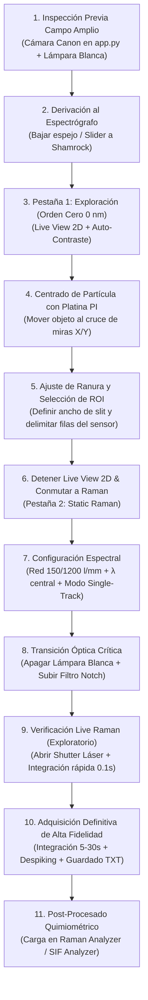

# CAT-251: Protocolo Operativo Estándar (SOP) — Espectroscopía Raman Estática, Alineación Óptica y Micro-Espectrometría Confocal
## Procedimiento Normalizado de Trabajo en Mesa Óptica: Cámara Canon, Espectrógrafo Shamrock 500i, Detector Andor iXon3 EMCCD y Platina Nanométrica PI

---

**Signatura Bibliotecaria:** `CAT-251`  
**Clasificación Temática:** `[MET]` / `[FIS]` Metrología Experimental, Micro-Espectrometría Raman Confocal y Seguridad Óptica  
**Pilar:** Pilar II — Super-Resolución Óptica, Detección Sub-píxel y Espectrometría  
**Autoría:** José Luis González Peñafiel (*Becario Doctoral CONICET*), Dra. Ianina L. Violi, Dr. Julián Gargiulo  
**Fecha de Publicación:** Septiembre 2026  
**Estado:** Producción / Validado para Laboratorio  
**Módulos Asociados:** `pyspectrum.py`, `app.py`, `raman_analyzer.py`, `core/raman_engine.py`, `pyspectrum/modules/static_raman.py`  
**Documentos Vinculados:**  
- [[CAT-250_Marco_Unificado_Espectroscopia_Optica_SERS_y_Quimiometria]] (Fundamentos teóricos de dispersión inelástica y SERS)  
- [[SYS-301_Sistema_Espectrometro_Shamrock500i_iXon3]] (Especificaciones físicas de espectrógrafo y cámara CCD)  
- [[SYS-302_Calibracion_Espectral_y_Sincronizacion_Flippers]] (Calibración de longitudes de onda y control de actuadores)  
- [[SYS-306_Arquitectura_Motor_Raman_y_Quimiometria_Multiespectral]] (Pipeline algorítmico AsLS, AirPLS y Pseudo-Voigt)  
- [[SYS-307_Auditoria_Factibilidad_Flujo_Raman_y_Bugs_Pipeline]] (Auditoría de software, verificación de pasos y registro de bugs)

---

## 1. Resumen Ejecutivo y Alcance

El presente Procedimiento Operativo Estándar (SOP) establece la secuencia metrológica y operativa rigurosa para la adquisición de espectros Raman y micro-fotoluminiscencia en nanopartículas individuales y nanoestructuras plasmónicas mediante la integración de:
1. **Microscopio Óptico Invertido** con iluminación halógena de transmisión y canal de excitación láser epi-iluminado (532 nm / 637 nm / 592 nm / 808 nm).
2. **Cámara CMOS Canon** (visualización de campo amplio en `app.py`).
3. **Platina de Nanoposicionamiento Piezoeléctrica PI E-727 / E-517** sobre platina micrométrica manual.
4. **Espectrógrafo Czerny-Turner Andor Shamrock SR-500i** con ranura de entrada motorizada y torreta de 3 redes.
5. **Detector Andor iXon3 885 EMCCD** (cabezal `DU8285_VP`, 1004 × 1002 px de $8\,\mu\text{m}$ — `DEC-033`) enfriado por efecto Peltier a temperatura criogénica ($-60\,^\circ\text{C}$).

> [!CAUTION]
> **REGLA DE ORO DE SEGURIDAD DEL DETECTOR EMCCD:**
> La cámara Andor iXon3 es un sensor de fotomultiplicación de electrones de ultra-alta sensibilidad. **NUNCA** incida el haz láser directo ni reflejado especularmente sobre el detector con la red en **Orden Cero (0.0 nm)** o con **EM Gain mayor a 0x**, bajo riesgo de daño permanente por saturación fotónica irreparable en el registro de multiplicación (costo de reposición ~USD 40,000).

---

## 2. Preparación Pre-Experimental y Puesta a Punto de Instrumentación

Antes de iniciar la manipulación de muestras, el operador debe verificar las siguientes condiciones previas de laboratorio:

### 2.1. Termorregulación del Detector Andor EMCCD
1. Encender el controlador de la cámara Andor iXon3 y verificar el flujo del circuito de recirculación de agua de refrigeración.
2. Iniciar `PySpectrum 3.0` (`python pyspectrum.py`).
3. En el **Panel Izquierdo Permanente**, verificar el grupo `❄️ Cámara Andor iXon3`:
   - Fijar temperatura objetivo en: `spin_temp = -60.0 °C`.
   - Activar el botón `❄️ Enfriador CCD: ACTIVO`.
   - Esperar a que el distintivo de estado pase de `🟡 Temp: ... °C (Enfriando…)` a `🟢 Temp: -60.0 °C (Estabilizado)` (tiempo típico: 10 a 15 minutos).
   - *Fundamento Físico:* La estabilización a $-60\,^\circ\text{C}$ reduce la corriente oscura térmica a $< 0.001\,e^-/\text{píxel/s}$, imprescindible para medir bandas Raman débiles con tiempos de integración de varios segundos.

### 2.2. Pre-Calentamiento y Estabilización de Láseres
1. Encender la fuente láser deseada (ej. diodo bombeado por estado sólido DPSS 532 nm).
2. Dejar calentar el láser en emisión continua interna por al menos 20 minutos para alcanzar estabilidad en longitud de onda ($\Delta \lambda < 0.01\,\text{nm}$) y potencia óptica ($\text{RMS} < 0.5\%$).
3. **Mantener el obturador láser electromecánico CERRADO** en todo momento mediante el controlador NIDAQmx (`close_shutter("532 nm (green)")`).

### 2.3. Filtros de Rechazo Rayleigh (Notch) y Flipper de Atenuación de Excitación
1. **Filtros Notch Manuales (Camino de Detección):**
   - Siempre se colocan manualmente **2 filtros Notch** consecutivos en el camino de detección justo antes de la ranura de entrada del espectrógrafo Shamrock 500i.
   - *Fundamento Metrológico:* La combinación en serie de estos 2 filtros Notch garantiza una densidad óptica acumulada $\text{OD} > 12$ para la línea de excitación láser (ej. 532 nm), extinguiendo la dispersión elástica Rayleigh por un factor $> 10^{12}$ para proteger el detector y permitir la detección clara de bandas inelásticas Raman a partir de $\sim 100\,\text{cm}^{-1}$.
2. **Flipper de Atenuación de Excitación (Línea de Bombeo Láser):**
   - El actuador motorizado (`flipper`) actúa como un **conmutador de intensidad para el haz de excitación/bombeo láser** (interponiendo un filtro atenuador o permitiendo el paso a potencia plena).
   - **Nota de Configuración Óptica:** El flipper **NO está en el camino de detección**, sino en la línea de iluminación del láser. Su función es reducir drásticamente la irradiancia sobre la muestra durante la etapa de búsqueda y alineación para evitar la fotodesorción o daño térmico de las moléculas y nanopartículas, pasando a transmisión completa solo al momento de la integración Raman definitiva.

---

## 3. Protocolo Operativo Paso a Paso

---

### Paso 1: Inspección de Muestra en Campo Amplio (Cámara Canon)
1. Colocar el portaobjetos con la muestra sobre la platina micrométrica manual.
2. Asegurar que el selector óptico del microscopio (slider/espejo abatible) dirija la luz hacia la cámara Canon (**Mirror UP**).
3. Encender la lámpara halógena de transmisión del microscopio con flujo regulado moderado.
4. En `app.py`, activar el Live View de la cámara Canon (`Live View Canon`).
5. Enfocar la superficie de la muestra y localizar la región de nanopartículas o grillas de interés.
6. Ajustar los tornillos micrométricos manuales $X-Y$ para posicionar la estructura de interés en el centro del campo de visión (coordenadas aproximadas de reposo de la platina piezoeléctrica: $X=50\,\mu\text{m}, Y=50\,\mu\text{m}$).

---

### Paso 2: Derivación del Haz hacia el Espectrógrafo Andor Shamrock
1. Conmutar el selector óptico manual del microscopio para derivar el 100% de la emisión hacia la salida lateral/espectrógrafo (**Mirror DOWN**).
2. Constatar que la imagen en la cámara Canon se oscurece por completo (comportamiento normal por desvío del haz).
3. En `PySpectrum`, verificar en el Panel Izquierdo que el puerto de entrada sea:
   - `Puerto Entrada (Flipper IN): Direct (Axial)` (conexión de espacio libre desde el microscopio).

---

### Paso 3: Exploración y Enfoque en Orden Cero (Pestaña 1: Exploración)
1. Ir a la pestaña **`🔭 1. Exploración`** en `PySpectrum`.
2. Verificar que el espectrógrafo esté en **Orden Cero**:
   - Presionar `🪞 Ir a Orden Cero (0 nm)`. Se abrirá el cuadro de diálogo de seguridad `ZeroOrderSafetyDialog`, que confirma el apagado de láseres y la ganancia EM en 0x.
   - La red de difracción actúa ahora como un espejo plano directo proyectando la imagen del plano focal del objetivo sobre el detector Andor EMCCD.
3. Configurar en el Panel Izquierdo los parámetros de cámara para imagen clara:
   - `Tiempo Exposición:` $0.05\,\text{s}$ a $0.1\,\text{s}$ (para tasa de refresco fluida de 10 a 20 FPS).
   - `EMCCD Gain:` **0x (Apagado)**.
   - `Ganancia Pre-amp:` $1.0\text{x}$ o $2.4\text{x}$.
4. Abrir la ranura de entrada Shamrock a apertura amplia:
   - `Ranura Entrada:` $2500\,\mu\text{m}$ (para campo de visión máximo).
   - En la pestaña de Exploración, fijar en `🎯 Slit Objetivo:` el ancho final con el que se medirá Raman (ej. $50\,\mu\text{m}$). La franja punteada rosada (`LinearRegionItem`) mostrará la zona física del sensor donde se cerrarán las cuchillas mecánicas.
5. Iniciar la transmisión continua: pulsar **`▶️ Iniciar Live View`**.
   - *Automatización de Obturación:* El sistema ejecuta internamente `ShamrockSetShutter(DEVICE, 1)` para abrir el obturador electromecánico del espectrógrafo al comenzar el Live View, y lo cerrará (`ShamrockSetShutter(DEVICE, 0)`) al presionar Detener.
6. Ajustar el micrométrico $Z$ del microscopio para lograr foco nítido de las partículas observadas en la matriz 2D.
7. Si el fondo encandila o los objetos se saturan, pulsar **`🎚️ Auto-Contraste`** o seleccionar la paleta **`Viridis`** / **`Inferno`** desde el selector maestro del panel izquierdo.

---

### Paso 4: Centrado Fino de la Partícula con la Platina Piezoeléctrica PI
1. Activar las miras cruzadas en Exploración pulsando **`🎯 Mira Cruzada`**.
   - La línea vertical indica el pixel central calibrado del slit ($X \approx 501.25\,\text{px}$).
   - La franja sombreada indica la proyección de la ranura de $50\,\mu\text{m}$.
2. Control de la platina piezoeléctrica PI E-727:
   - **Prevención de Bloqueo USB:** No ejecutar `app.py` en una consola externa independiente. Acceder a la cámara Canon y los controles de nanoposicionamiento desde `Menú Herramientas -> Microscopio Derecho / PyPrinting (Ventana Satélite Subyugada)` para compartir el mismo lazo de control sin conflictos de puerto serie ni colisión de driver.
   - Desplazar la nanopartícula seleccionada exactamente al cruce central entre la mira vertical y la región de la ranura.
3. *Criterio de Aceptación:* La partícula debe quedar contenida dentro de la franja del Slit Objetivo.

---

### Paso 5: Cierre de Ranura y Delimitación del ROI Vertical
1. En el Panel Izquierdo, reducir el ancho de ranura a su valor de trabajo Raman:
   - Modificar `Ranura Entrada (µm):` a $50.0\,\mu\text{m}$ (o $40.0\,\mu\text{m}$).
   - Se escuchará el motor de pasos de la ranura cerrando las cuchillas. En pantalla, el campo de visión se restringirá a una franja horizontal brillante.
2. Delimitar el **ROI Vertical (Single-Track / Imagen 2D)**:
   - Mover la región sombreada verde horizontal (`roi_region`) en la pestaña de Exploración para englobar el perfil espacial de la partícula iluminada (típicamente $Y \approx [480 : 520]$, altura $\Delta Y \approx 40\,\text{px}$).
   - La barra de estado mostrará: `ROI Slit: [480 : 520] (Centro: 500, Alto: 40 px)`.
   - Este intervalo se publica de manera automática en el bus `SpectroscopyContext` y es consumido tanto por Single-Track como por el modo Imagen 2D.
3. Detener la transmisión continua: pulsar **`⏹️ Detener Live View`** (el obturador Shamrock se cierra automáticamente).

---

### Paso 6: Configuración del Modo Raman (Pestaña 2: Static Raman)
1. Conmutar a la pestaña **`🔬 2. Static Raman`**.
2. **Modo de Lectura Andor:**
   - **`Single-Track (Hardware ROI)`**: Integra por hardware las filas seleccionadas entregando un espectro 1D optimizado con mínimo ruido de lectura y corriente oscura.
   - **`Imagen 2D (Hardware ROI)`**: Si se requiere inspección bidimensional espacialmente resuelta (o adquisición de referencias de transmisión multicanal), este modo se encuentra **acotado estrictamente al ROI vertical** delimitado en el Paso 5 (`SetImage(1, 1, 1, 1004, vstart, vend)`). Esto evita transferir filas oscuras fuera de la ranura, reduce la latencia de adquisición y acota de manera exacta tanto la medición como la referencia.
   - En ambos modos se muestra la insignia de confirmación: `ROI heredado: [480:520] (Centro: 500, Alto: 40 px)`.
3. **Selección de Red de Difracción y Ventana Espectral:**
   - Para inspección general amplia (Stokes + Anti-Stokes simultáneos): seleccionar **`150 l/mm (Blaze 800 nm)`**.
   - Para alta resolución Raman / fonones finos: seleccionar **`1200 l/mm (Blaze 500 nm)`**.
   - Ajustar la longitud de onda central deseada en `Longitud de Onda Central (nm)`.
   - **Cartel Dinámico de Cobertura:** Directamente debajo del selector de $\lambda$, un cartel reactivo informa en tiempo real los límites alcanzados por la dispersión:
     - En nm: `📊 Rango Espectral Cubierto: [477.2 a 652.9] nm (Δλ ≈ 175.7 nm)`.
     - En cm⁻¹: `📊 Rango Espectral Cubierto: [-1984.2 a +3470.5] cm⁻¹ (λ: 477.2 a 652.9 nm)`.
   - Presionar **`🚀 Sintonizar Espectrógrafo`** para fijar la posición de la torreta.

---

### Paso 7: Transición Óptica a Excitación Láser (Zona Oscura)
> [!IMPORTANT]
> **SECUENCIA ESTRICTA DE CONMUTACIÓN DE ILUMINACIÓN:**
> 1. **Apagar por completo la lámpara halógena de transmisión del microscopio** (o cerrar su diafragma).
> 2. **Verificar los 2 Filtros Notch de detección** colocados manualmente antes de la ranura para supresión Rayleigh.
> 3. **Configurar el flipper de atenuación láser** en posición atenuada para la búsqueda preliminar.
> 4. Verificar cortinas cerradas de la mesa óptica para blindaje contra luz parásita ambiental.
> 5. **Abrir el obturador del láser de 532 nm** mediante el panel de control de obturadores en PySpectrum o NIDAQmx.

---

### Paso 8: Verificación en Vivo (Live Raman) & Ajuste de Parámetros
1. En el Panel Izquierdo, configurar una exposición exploratoria corta ($0.1\,\text{s}$ a $0.2\,\text{s}$).
2. Presionar **`▶️ Live Raman (Continuo)`** (o usar el atajo `Ctrl+Space`).
   - *Automatización de Obturación:* El obturador del espectrógrafo se abre de forma automática (`ShamrockSetShutter(DEVICE, 1)`).
3. En el visor gráfico interactivo:
   - Activar la casilla **`Mostrar Raman Shift (cm⁻¹)`** (el cartel inferior de cobertura se actualizará instantáneamente a cm⁻¹).
   - Activar **`Despiking Rayos Cósmicos`** para limpiar trazas espurias.
   - Activar opcionalmente **`Sustraer Línea Base (AsLS)`** para ver los picos emergentes sobre la fluorescencia.
4. Ajustar finamente la platina nanométrica $X-Y$ y el enfoque $Z$ con pasos de $50\,\text{nm}$ hasta maximizar la altura del pico Raman característico en la curva en tiempo real.
5. Conmutar el flipper de atenuación láser a potencia nominal si se requiere mayor tasa de cuentas.
6. Al verificar que la señal es óptima, presionar **`⏹️ Detener Live Raman`** (el obturador Shamrock se cerrará automáticamente).

---

### Paso 9: Adquisición Definitiva de Alta Fidelidad y Guardado
1. En el Panel Izquierdo, configurar los parámetros definitivos ($5.0\,\text{s}$ a $30.0\,\text{s}$ de integración).
2. Presionar **`📸 Capturar Espectro Único`** (o atajo `Ctrl+R`).
   - El sistema abre el shutter del espectrógrafo, efectúa la adquisición con temporización determinista, lo cierra en el bloque `finally` y actualiza la curva en pantalla.
3. Telemetría in-situ:
   - Ubicar el **Cursor A (azul)** en el pico Raman principal y el **Cursor B (rojo)** en la banda Anti-Stokes para obtener telemetría instantánea de cociente de intensidades y temperatura fototérmica.
4. Presionar **`💾 Guardar Espectro (.txt)`**:
   - El archivo exporta directamente los arreglos en memoria visualizados en pantalla (`_raw_counts`, `_raw_wl`, `_processed_x`, etc.), evitando re-adquisiciones espurias y garantizando compatibilidad 1D y 2D sin excepciones de dimensionalidad.
5. Presionar **`📋 Copiar Datos (TSV)`** si se desea exportar inmediatamente al portapapeles.
6. **Cierre de Seguridad Post-Medición:**
   - Cerrar el obturador del láser inmediatamente (`close_shutter("532 nm (green)")`).

---

### Paso 10: Post-Procesado Quimiométrico en Raman Analyzer & SIF Analyzer
1. Abrir **`Raman Analyzer`** (`python raman_analyzer.py`).
2. Cargar el archivo exportado mediante `📁 Cargar Espectro`.
3. Aplicar el pipeline quimiométrico avanzado:
   - Desconvolución de picos multivariables con perfiles **Pseudo-Voigt** o **Lorentzianos**.
   - Sustracción de línea base por penalización asimétrica **AsLS** ($\lambda = 10^5, p = 0.01$).
   - Extracción de FWHM, área integrada analítica y cociente de intensidades (ej. bandas $I_D/I_G$).
   - Exportación de figuras de publicación a 600 DPI vectoriales vía `FigureExportStudio`.

---

## 4. Matriz de Control de Riesgos y Errores Operativos Frecuentes

| Error Común | Causa Raíz | Consecuencia Experimental | Acción Correctiva Inmediata |
|---|---|---|---|
| **Espectro completamente saturado a 65,535 cuentas** | Lámpara blanca de transmisión encendida durante la medición Raman | Encandilamiento masivo del CCD, sin señal molecular | Apagar la lámpara halógena y cerrar su diafragma antes de abrir el obturador láser. |
| **Pico láser de 532 nm gigantesco saturando el centro** | Filtro Notch 532 nm no interpuesto en el haz | La dispersión Rayleigh ciega el sensor e impide ver picos Stokes $< 1000\,\text{cm}^{-1}$ | Subir el flipper del Notch (`flipper_notch532("up")`) antes de irradiar con el láser. |
| **Ruido térmico excesivo (> 2000 cuentas de fondo)** | Sensor Andor no enfriado o cooler apagado | Relación señal/ruido (SNR) degradada en picos débiles | Verificar que la temperatura esté estabilizada a $-60\,^\circ\text{C}$ en el panel izquierdo. |
| **No se ve señal Raman a pesar de enfocar bien la partícula** | La ranura está cerrada fuera de la posición del objeto | El haz emitido no entra por la apertura del espectrógrafo | Volver a Orden Cero (0 nm) y usar las miras de Exploración para asegurar que el objeto caiga dentro de la ranura. |
| **Modo FVB genera espectros con fondo ruidoso** | Se está binnizando todo el sensor vertical | Integración de 1000 filas de corriente oscura | Conmutar el modo de lectura a `Single-Track` para integrar exclusivamente el ROI vertical de la partícula. |
