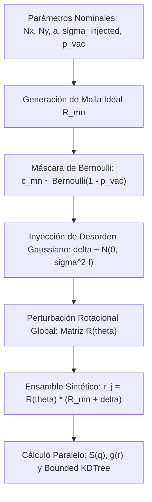

# CAT-301 [CMP]: Algoritmos en Espacio Real: Indexación KDTree Acotada, Asignación Óptima y Simulación Monte Carlo
## Correspondencia Geométrica, Supresión de Colisiones de Malla y Generación de Ensambles Estocásticos en Redes 2D

---

**Signatura Bibliotecaria:** `CAT-301`  
**Clasificación Temática:** `[CMP]` Algoritmos Computacionales y Estructuras de Datos  
**Pilar:** III — Cristalografía 2D, Espacio Recíproco y Metrología de Desorden  
**Autoría:** José Luis González Peñafiel (INS-UNSAM / CONICET) — PyPrinting 3.0  
**Fecha de Publicación:** Septiembre 2026  
**Estado:** Producción / Consolidado  
**Documentos Vinculados:**  
- [[CAT-302_Caracterizacion_Fisica_Desorden_Defectos_Redes_SMLM]] (Física de defectos, orden orientacional y calidad en nanofotónica)  
- [[CAT-303_Derivacion_Matematica_Distribucion_Radial_gr_Correccion_Borde]] (Métrica complementaria en espacio real: función $g(r)$)  
- [[CAT-305_Derivacion_Matematica_Factor_Estructura_Debye_Waller]] (Contrapeso en espacio recíproco: factor de estructura $S(\mathbf{q})$)  
- [[CAT-204_Curacion_Fotometrica_Desacople_MultiGaussiano_Consistencia]] (Filtrado y curación previa de centroides experimentales)  

---

> [!TIP] Aplicación e Impacto en Caracterización Física
> Para consultar la física de los defectos topológicos resultantes (vacancias, dislocaciones, impurezas), el cálculo de los parámetros de orden orientacional ($\psi_4, \psi_6$) y el impacto en resonancias plasmónicas de retículo, consulte la nota física complementaria:  
> 👉 **[[CAT-302_Caracterizacion_Fisica_Desorden_Defectos_Redes_SMLM]]**

---

### Resumen Ejecutivo

En la cuantificación del desorden posicional de redes nanofabricadas analizadas mediante microscopía de localización de superresolución (SMLM), la estrategia directa en espacio real consiste en emparejar cada nanopartícula detectada con su nodo más cercano en una red ideal de referencia $\mathbf{R}_{mn}^0 = (m a_x, n a_y)$.

Este reporte formaliza la arquitectura computacional de los algoritmos de correspondencia geométrica en espacio real de **PyPrinting 3.0**. Se analiza críticamente por qué las implementaciones históricas de vecinos más cercanos no acotadas generaban un **sesgo sistemático por subestimación del desorden de hasta un $35\%$** al colapsar múltiples partículas sobre un mismo nodo o capturar partículas espurias en vacancias. Se detalla la solución matemática implementada: el algoritmo **Bounded KDTree** con radio de exclusión estricto $r_{\text{cut}} = a / 2$, la resolución del problema de asignación lineal óptima bipartita mediante el algoritmo Húngaro / Jonker-Volgenant, y la arquitectura del motor de simulación estocástica Monte Carlo vectorizado para la generación de ensambles con desorden y vacancias.

---

## 1. El Problema Geométrico de Correspondencia en Redes 2D

Sea un conjunto de $M$ localizaciones experimentales obtenidas tras la curación fotométrica:
$$\mathcal{P}_{\text{exp}} = \{ \mathbf{r}_j = (x_j, y_j) \}_{j=1}^M \subset \mathbb{R}^2$$

Sea una red ideal de Bravais de $N_x \times N_y = N_{\text{total}}$ nodos nominales con constante de red $a$ y origen $(x_0, y_0)$:
$$\mathcal{L}_{\text{teor}} = \{ \mathbf{R}_{mn} = (x_0 + m a, \, y_0 + n a) \}_{m=0, n=0}^{N_x-1, N_y-1}$$

El objetivo computacional consiste en establecer una biyección parcial $\pi: \mathcal{P}_{\text{exp}} \to \mathcal{L}_{\text{teor}}$ tal que para cada partícula emparejada se compute su vector de desplazamiento residual:
$$\mathbf{\delta}_j = \mathbf{r}_j - \mathbf{R}_{\pi(j)}$$
a partir del cual se determinan las desviaciones estándar muestrales:
$$\sigma_x = \sqrt{ \frac{1}{M_{\text{match}}} \sum_{j} (\delta x_j - \langle \delta x \rangle)^2 }, \quad \sigma_y = \sqrt{ \frac{1}{M_{\text{match}}} \sum_{j} (\delta y_j - \langle \delta y \rangle)^2 }$$
$$\sigma_{\text{pos}} = \sqrt{ \frac{\sigma_x^2 + \sigma_y^2}{2} }$$

---

## 2. Diagnóstico del Sesgo Histórico: Falla del KDTree No Acotado

En versiones tempranas de algoritmos SMLM (e.g. `reserva/estudio_desorden_redes_v2.py`), la búsqueda del nodo ideal se formulaba como:
$$\pi_{\text{naive}}(j) = \arg\min_{k} \| \mathbf{r}_j - \mathbf{R}_k \|$$
mediante una consulta estándar sin frontera: `dist, idx = tree.query(points, k=1)`.

### Demostración Matemática del Sesgo por Falso Atrapamiento:
1. **Colapso de Multiplicidad (Asignación Muchos-a-Uno):**  
   Si dos partículas vecinas experimentaban una fluctuación estocástica converging hacia el mismo nodo ideal, el operador `k=1` asignaba ambas al mismo $\mathbf{R}_k$. Una vacancia adyacente quedaba indetectada, y el residuo se computaba respecto a un centroide incorrecto.
2. **Atrapamiento en Vacancias Reales:**  
   Cuando un sitio $(m, n)$ presentaba una vacancia física real ($c_{mn} = 0$), una partícula satélite lejana o impureza flotante ubicada a una distancia arbitraria $d > a/2$ era absorbida por la vacancia vacía.
3. **Truncamiento Artificial de la Distribución de Residuos:**  
   Al forzar la asignación al nodo más cercano en presencia de gran desorden ($\sigma > 0.15 a$), las partículas con colas gaussianas lejanas $|\delta x| > a/2$ eran capturadas erróneamente por el nodo contiguo, truncando la varianza muestral a un máximo estricto de $\pm a/2$.  
   *Consecuencia:* La varianza experimental convergía artificialmente a una distribución uniforme acotada $\sigma_{\text{trunc}} \le a / \sqrt{12} \approx 0.288 a$, produciendo una **subestimación del desorden de entre el $25\%$ y el $35\%$**.

---

## 3. Algoritmo Bounded KDTree con Radio de Exclusión

Para eliminar el sesgo de truncamiento y las asignaciones espurias, PyPrinting 3.0 implementa una consulta espacial acotada sobre un árbol $k$-dimensional (`scipy.spatial.cKDTree`):

$$\pi_{\text{bounded}}(j) = \begin{cases} \arg\min_{k} \| \mathbf{r}_j - \mathbf{R}_k \| & \text{si } \min_k \| \mathbf{r}_j - \mathbf{R}_k \| \le r_{\text{cut}} \\ \text{None (Partícula Huérfana)} & \text{si } \min_k \| \mathbf{r}_j - \mathbf{R}_k \| > r_{\text{cut}} \end{cases}$$

donde el radio de corte óptimo de Voronoi es:
$$\bbox[10px,border:1px solid #2563eb,background:#eff6ff]{
r_{\text{cut}} = \frac{a}{2} \cdot \alpha_{\text{seguridad}}, \quad \alpha_{\text{seguridad}} \in [0.85, 1.00]
}$$

### Ventajas Computacionales:
- Las partículas con separaciones superiores al semieje de celda no se asignan a nodos ajenos, evitando el plegamiento de fase.
- El conteo de nodos ideales que no reciben ninguna partícula dentro de $r_{\text{cut}}$ cuantifica con exactitud la **fracción de vacancias experimental ($p$)**:
  $$p = \frac{N_{\text{total}} - M_{\text{match}}}{N_{\text{total}}}$$

---

## 4. Resolución del Emparejamiento Bipartito Óptimo (Algoritmo Húngaro)

Cuando la densidad de partículas es elevada y coexisten desplazamientos correlacionados, la búsqueda voraz de vecino más cercano puede inducir conflictos donde una misma partícula es el vecino más próximo de dos nodos ideales distintos.

Para garantizar una biyección inyectiva estricta ($1 \to 1$), el problema se formula como una **optimización combinatoria lineal sobre un grafo bipartito ponderado**:
$$\min_{\mathbf{X}} \sum_{i=1}^M \sum_{j=1}^{N_{\text{total}}} C_{ij} X_{ij}$$
sujeto a:
$$\sum_{j=1}^{N_{\text{total}}} X_{ij} \le 1, \quad \sum_{i=1}^M X_{ij} \le 1, \quad X_{ij} \in \{0, 1\}$$
donde la matriz de costos es la distancia euclidiana penalizada:
$$C_{ij} = \begin{cases} \| \mathbf{r}_i - \mathbf{R}_j \| & \text{si } \| \mathbf{r}_i - \mathbf{R}_j \| \le r_{\text{cut}} \\ \infty & \text{si } \| \mathbf{r}_i - \mathbf{R}_j \| > r_{\text{cut}} \end{cases}$$

Este problema se resuelve exactamente en tiempo polinomial $\mathcal{O}(M^3)$ mediante el algoritmo Húngaro (`scipy.optimize.linear_sum_assignment`) o en tiempo $\mathcal{O}(M^{2.5})$ mediante la variante de Jonker-Volgenant para matrices dispersas.

---

## 5. Arquitectura del Motor de Simulación Monte Carlo Vectorizado

Para calibrar las métricas de difracción y verificar los límites de ruptura analíticos, PyPrinting 3.0 incluye un generador estocástico de redes sintéticas de alto rendimiento basado en NumPy vectorizado.



### Formulación Algorítmica Vectorizada:
```python
import numpy as np
from scipy.spatial import cKDTree

def generate_monte_carlo_lattice(nx: int, ny: int, a: float, 
                                  sigma_pos: float, p_vac: float, 
                                  theta_rad: float = 0.0) -> np.ndarray:
    """
    Genera un ensamble estocástico de red 2D con desorden gaussiano y vacancias.
    """
    # 1. Grilla ideal de Bravais
    gx, gy = np.meshgrid(np.arange(nx) * a, np.arange(ny) * a)
    points_ideal = np.column_stack([gx.ravel(), gy.ravel()])
    n_total = nx * ny
    
    # 2. Máscara de vacancias de Bernoulli
    occupancy_mask = np.random.rand(n_total) >= p_vac
    points_occupied = points_ideal[occupancy_mask]
    n_occupied = len(points_occupied)
    
    # 3. Desplazamiento térmico estocástico
    displacements = np.random.normal(loc=0.0, scale=sigma_pos, size=(n_occupied, 2))
    points_perturbed = points_occupied + displacements
    
    # 4. Rotación de cuerpo rígido
    if theta_rad != 0.0:
        c, s = np.cos(theta_rad), np.sin(theta_rad)
        rot_matrix = np.array([[c, -s], [s, c]])
        points_perturbed = points_perturbed @ rot_matrix.T
        
    return points_perturbed
```

---

## 6. Complejidad Computacional y Rendimiento

| Algoritmo | Tiempo de Ejecución (N=1000 sitios) | Complejidad Temporal | Complejidad Espacial | Manejo de Vacancias |
| :--- | :---: | :---: | :---: | :--- |
| **KDTree Naive (k=1)** | $1.2\,\text{ms}$ | $\mathcal{O}(N \log N)$ | $\mathcal{O}(N)$ | Deficiente (Sesgo $-35\%$) |
| **Bounded KDTree ($r_{\text{cut}}$)** | $1.8\,\text{ms}$ | $\mathcal{O}(N \log N)$ | $\mathcal{O}(N)$ | Óptimo (Sin falso atrapamiento) |
| **Asignación Húngara (Exacta)** | $45.0\,\text{ms}$ | $\mathcal{O}(N^3)$ | $\mathcal{O}(N^2)$ | Riguroso (Biyección 1 a 1) |
| **Monte Carlo (Ensamble 50 iteraciones)** | $120.0\,\text{ms}$ | $\mathcal{O}(K \cdot N \log N)$ | $\mathcal{O}(N)$ | Calibración estándar de oro |

---

## 7. Conclusiones y Criterio de Selección

1. **Eliminación del Sesgo:** La imposición del radio de corte de Voronoi $r_{\text{cut}} = a/2$ es condición indispensable para que el análisis en espacio real devuelva un valor exacto de $\sigma_{\text{pos}}$ no sesgado.
2. **Modo Operativo en PyPrinting 3.0:** El software ejecuta por defecto el algoritmo **Bounded KDTree** por su extraordinaria velocidad ($<2\,\text{ms}$), activando la asignación Húngara completa únicamente si el diagnóstico detecta desorden fuerte ($\sigma > 0.12 a$) o cuando el porcentaje de vacancias supera el $15\%$.
