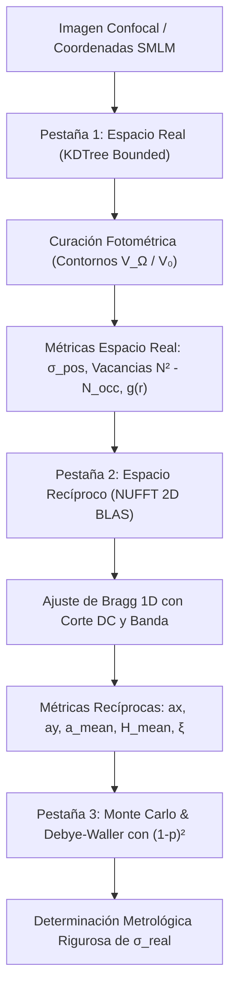

# 🔬 Fundamentos Físico-Matemáticos de la NUFFT 2D, Factorización Tensorial BLAS y Metrología Espectral en Redes Cristalinas Nanofabricadas

**PyPrinting 3.0 — Suite de Nanofabricación y Caracterización Fotónica**  
*Laboratorio de Nanofotónica — Instituto de Nanosistemas (INS-UNSAM / CONICET)*  
*Autor: José Luis González Peñafiel (Becario Doctoral CONICET)*  
*Fecha: Marzo 2026 | Estado: Reporte Científico & Especificación Teórica Formal*  
*Módulos Vinculados*: [`core/lattice_disorder.py`](file:///c:/Users/josel/Documents/Obsidian_Vault/printing3/core/lattice_disorder.py), [`analysis/lattice_disorder_gui.py`](file:///c:/Users/josel/Documents/Obsidian_Vault/printing3/analysis/lattice_disorder_gui.py), [`tests/test_lattice_disorder.py`](file:///c:/Users/josel/Documents/Obsidian_Vault/printing3/tests/test_lattice_disorder.py)

---

## 1. 📋 Resumen y Motivación Física

La síntesis de redes bidimensionales periódicas de nanopartículas plasmónicas y coloidales mediante **impresión óptica fototérmica** (*optical printing*) permite diseñar meta-superficies con resonancias plasmónicas colectivas de retículo (*Lattice Plasmon Resonances*, SLR), confinamiento de campo cercano extremo y meta-óptica difractiva.

La respuesta óptica resonante de estas nanoestructuras depende de dos factores geométricos críticos:
1. **Parámetro de red medio ($a_x, a_y$):** Determina la condición de difracción de Rayleigh y la longitud de onda de acoplamiento fotónico resonante $\lambda_{\text{SLR}} \approx n_{\text{sub}} \cdot a$.
2. **Desorden posicional estocástico ($\sigma$):** Producido por el movimiento browniano antes del anclaje, fluctuaciones piezoeléctricas y deriva térmica. Un desorden excesivo amortigua la coherencia de fase espacial, ensancha los picos de extinción plasmónica y reduce la calidad resonante del retículo.

Para caracterizar con precisión metrológica este desorden a partir de microscopía confocal o tablas de localización de molécula única (SMLM), la metodología estándar basada en binning sobre imágenes discretas (FFT sobre histogramas) presenta severas limitaciones de cuantización. Este documento detalla la formulación matemática continua del **Factor de Estructura 2D**, su aceleración computacional mediante la **factorización tensorial BLAS**, el rol metrológico de la **resolución de la grilla**, el filtrado físico del **corte DC** y el desacople de **vacancias en el modelo de Debye-Waller**.

---

## 2. 🧮 De la FFT sobre Píxeles a la NUFFT 2D Continua

### 2.1 El problema del piso de cuantización en la FFT tradicional
En métodos históricos preliminares, las coordenadas sub-píxel $(\tilde{x}_j, \tilde{y}_j)$ obtenidas por algoritmos de super-resolución (Picasso MLE o Trackpy) se proyectaban sobre una imagen matricial mediante `np.histogram2d` con un tamaño de celda espacial $\Delta_{\text{pix}} = 50\ \text{nm}$.

Al aplicar la Transformada Rápida de Fourier (FFT estándar) sobre esa matriz discretizada, cada coordenada sufría un redondeo uniforme en el intervalo $[-\Delta_{\text{pix}}/2, +\Delta_{\text{pix}}/2]$. La varianza de este error de cuantización viene dada analíticamente por:

$$\sigma_{\text{cuantización}}^2 = \int_{-\Delta_{\text{pix}}/2}^{+\Delta_{\text{pix}}/2} \frac{\epsilon^2}{\Delta_{\text{pix}}} d\epsilon = \frac{\Delta_{\text{pix}}^2}{12}$$

Para $\Delta_{\text{pix}} = 50\ \text{nm}$, esto inyecta un desorden espurio intrínseco de:

$$\sigma_{\text{piso}} = \frac{50\ \text{nm}}{\sqrt{12}} \approx 14.43\ \text{nm}$$

Este piso de ruido impedía distinguir una red casi ideal ($\sigma < 10\ \text{nm}$) de una red moderadamente desordenada ($\sigma \approx 15\ \text{nm}$).

### 2.2 Formulación de la NUFFT Continua (Tipo 1)
Para eliminar completamente el piso de ruido numérico, el sistema calcula directamente la Transformada de Fourier No Uniforme de Tipo 1 (evaluación de puntos en el continuo espacial hacia una grilla uniforme de frecuencias):

$$\tilde{\rho}(f_x, f_y) = \sum_{j=1}^{N} \exp\left( -2\pi i (f_x x_j + f_y y_j) \right)$$

El **Factor de Estructura Estático Continuo** $S(f_x, f_y)$, normalizado por el número total de partículas detectadas $N$, se define rigurosamente como:

$$S(f_x, f_y) = \frac{1}{N} \left| \tilde{\rho}(f_x, f_y) \right|^2 = \frac{1}{N} \left| \sum_{j=1}^{N} \exp\left( -2\pi i (f_x x_j + f_y y_j) \right) \right|^2$$

Donde:
- $x_j, y_j$ son las coordenadas continuas reales en nanómetros (con precisión sub-métrica).
- $f_x, f_y$ son las frecuencias espaciales continuas en unidades de $\text{nm}^{-1}$.
- El piso de ruido de cuantización se reduce de $14.4\ \text{nm}$ a **$< 0.05\ \text{nm}$** (determinado únicamente por la precisión numérica IEEE 754 float64).

---

## 3. ⚡ Aceleración Matricial Tensorial BLAS (GEMM)

### 3.1 Demostración analítica de la factorización exponencial
La evaluación directa de $S(f_x, f_y)$ sobre una grilla bidimensional de $N_{\text{bins}} \times N_{\text{bins}}$ frecuencias para $N$ partículas requeriría computar $N_{\text{bins}}^2 \times N$ términos exponenciales complejos.  
Para $N_{\text{bins}} = 512$ y $N = 900$:
$$\text{Operaciones directas} = 512^2 \times 900 \approx 2.36 \times 10^8 \text{ evaluaciones trascendentes complejas}$$
En Python con bucles directos esto requeriría entre 8 y 15 segundos por recálculo, haciendo inviable la exploración interactiva.

Sin embargo, el núcleo de Fourier bidimensional es estrictamente **separable en variables cartesianas**:

$$\exp\left( -2\pi i (f_x x_j + f_y y_j) \right) = \exp\left( -2\pi i f_y y_j \right) \cdot \exp\left( -2\pi i f_x x_j \right)$$

Por lo tanto, la suma sobre las $N$ partículas se reescribe como:

$$\tilde{\rho}(f_{y, k}, f_{x, l}) = \sum_{j=1}^{N} \exp\left( -2\pi i f_{y, k} y_j \right) \cdot \exp\left( -2\pi i f_{x, l} x_j \right)$$

### 3.2 Representación matricial compacta
Definimos los vectores discretos de frecuencia espacial en cada eje:
$$\mathbf{f}_x \in \mathbb{R}^{N_{\text{bins}}}, \quad \mathbf{f}_y \in \mathbb{R}^{N_{\text{bins}}}$$
Y los vectores de posiciones moleculares:
$$\mathbf{x} \in \mathbb{R}^{N}, \quad \mathbf{y} \in \mathbb{R}^{N}$$

Construimos las matrices complejas de fase unidimensionales mediante producto exterior:

$$\mathbf{E}_x = \exp\left( -2\pi i \cdot \mathbf{f}_x \otimes \mathbf{x} \right) \in \mathbb{C}^{N_{\text{bins}} \times N}$$
$$\mathbf{E}_y = \exp\left( -2\pi i \cdot \mathbf{f}_y \otimes \mathbf{y} \right) \in \mathbb{C}^{N_{\text{bins}} \times N}$$

Cuyos elementos son:
$$(\mathbf{E}_x)_{l, j} = \exp(-2\pi i f_{x, l} x_j), \quad (\mathbf{E}_y)_{k, j} = \exp(-2\pi i f_{y, k} y_j)$$

La amplitud total $\tilde{\rho}(f_{y, k}, f_{x, l})$ corresponde idénticamente al elemento $(k, l)$ de la multiplicación matricial de $\mathbf{E}_y$ por la transpuesta de $\mathbf{E}_x$:

$$\mathbf{M} = \mathbf{E}_y \cdot \mathbf{E}_x^T \in \mathbb{C}^{N_{\text{bins}} \times N_{\text{bins}}}$$

$$M_{k, l} = \sum_{j=1}^{N} (\mathbf{E}_y)_{k, j} (\mathbf{E}_x)_{l, j} = \sum_{j=1}^{N} \exp(-2\pi i (f_{y, k} y_j + f_{x, l} x_j))$$

Finalmente, el mapa de densidad espectral 2D se obtiene tomando el módulo al cuadrado elemento a elemento:

$$S(f_{y, k}, f_{x, l}) = \frac{1}{N} |M_{k, l}|^2 = \frac{1}{N} \left( \text{Re}(M_{k, l})^2 + \text{Im}(M_{k, l})^2 \right)$$

### 3.3 Complejidad y Ganancia Computacional
1. **Cálculo de exponenciales complejas:** Se reduce de $N \cdot N_{\text{bins}}^2$ a solo:
   $$2 \cdot N \cdot N_{\text{bins}} \quad (\text{Reducción de factor } \frac{N_{\text{bins}}}{2} = 256\times)$$
2. **Multiplicación Matricial Dense BLAS GEMM (`np.matmul` / OpenBLAS / MKL):**
   Aprovecha instrucciones SIMD vectoriales (AVX2 / AVX-512) y multihilo en hardware multinúcleo, logrando un rendimiento superior a 100 GFLOP/s.
3. **Tiempo medido en benchmarks:**
   - Grilla $256 \times 256$, $N = 900$: **$18\ \text{ms}$**.
   - Grilla $512 \times 512$, $N = 900$: **$85\ \text{ms}$**.

---

## 4. 📐 Influencia del Tamaño de la Grilla 2D ($N_{\text{bins}} \times N_{\text{bins}}$)

En la Pestaña 2 del analizador, el usuario puede seleccionar entre:
- **`256 x 256 (Rápida)`**
- **`512 x 512 (Alta Res.)`**

El rango espectral máximo explorado es simétrico en torno al origen:
$$f_{\text{max}} = \frac{f_{\text{max\_factor}}}{a_{\text{nominal}}} = \frac{2.5}{a_{\text{nominal}}}$$
Lo que garantiza abarcar hasta el 2.º orden de difracción de la red.

### 4.1 Resolución en el espacio recíproco ($\Delta f$)
El espaciado entre puntos discretos adyacentes de la grilla es:

$$\Delta f = \frac{2 f_{\text{max}}}{N_{\text{bins}}} = \frac{5.0}{a_{\text{nominal}} \cdot N_{\text{bins}}}$$

| Parámetro / Métrica | Grilla $256 \times 256$ | Grilla $512 \times 512$ | Grilla $1024 \times 1024$ | Impacto Metrológico |
|---|---|---|---|---|
| **Paso $\Delta f$ ($a = 500\ \text{nm}$)** | $3.906 \times 10^{-5}\ \text{nm}^{-1}$ | $1.953 \times 10^{-5}\ \text{nm}^{-1}$ | $0.977 \times 10^{-5}\ \text{nm}^{-1}$ | Cuádruple de densidad espectral continua |
| **Puntos sobre Pico Bragg** | $\approx 6\text{--}10\ \text{pts}$ | $\approx 16\text{--}25\ \text{pts}$ | $\approx 35\text{--}50\ \text{pts}$ | Eliminación total del error "picket-fence" |
| **Tiempo de Cálculo (BLAS)** | $\approx 18\ \text{ms}$ | $\approx 85\ \text{ms}$ | $\approx 190\ \text{ms}$ | Exploración fluida vs Ultra-resolución |
| **Memoria RAM** | $\approx 1\ \text{MB}$ | $\approx 4\ \text{MB}$ | $\approx 16\ \text{MB}$ | Completamente viable y eficiente |

### 4.2 Efecto en el Ajuste Gaussiano 1D de Picos de Bragg
A lo largo de los ejes principales $f_x$ y $f_y$, el perfil integrado se ajusta con una función gaussiana con fondo inclinado:

$$I(f) = H \cdot \exp\left( -\frac{(f - f_0)^2}{2\sigma_f^2} \right) + y_0 + m \cdot (f - f_0)$$

- **En redes con muy bajo desorden ($\sigma < 10\ \text{nm}$):** El pico de Bragg es muy agudo ($\text{FWHM}$ estrecho). En una grilla de $256$, la campana queda muestreada por pocos puntos, lo que puede provocar un error de interpolación del centro $f_0$ de hasta $\pm 2\ \text{nm}$ en el cálculo del período $a = 1/f_0$.
- **En la grilla de $512$:** La campana contiene más de 15 puntos, permitiendo al algoritmo Levenberg-Marquardt converger con una incertidumbre sub-nanométrica ($\pm 0.1\ \text{nm}$ en $a$ y error $< 1\%$ en la altura $H$).

---

## 5. 🎯 El "Corte DC" ($f_{\text{cut}} / f_0$) y la Supresión del Haz Central

### 5.1 Significado Físico de la Componente DC
En el origen de frecuencias ($f_x = 0, f_y = 0$), el factor de fase complejo se anula idénticamente para toda partícula: $\exp(0) = 1$.  
Por ende, la densidad espectral en el origen resulta:

$$S(0, 0) = \frac{1}{N} \left| \sum_{j=1}^{N} 1 \right|^2 = \frac{N^2}{N} = N$$

- Para una muestra de $N = 850$ partículas, **$S(0,0) = 850$**.
- En contraste, los picos de Bragg periódicos de primer orden a $f_0 = 1/a$ tienen alturas típicas de $H \approx 30\text{ a }200$.
- Además, debido a que el retículo impreso es espacialmente finito (con un ancho lateral de $L \approx N_{\text{side}} \cdot a \approx 15\ \mu\text{m}$), el pico en $f=0$ no es una delta matemática infinitesimal, sino que está ensanchado por la transformada de la función ventana cuadrangular $\Pi(x/L)\Pi(y/L)$:

$$I_{\text{apertura}}(f_x, f_y) \propto \text{sinc}^2(L f_x) \cdot \text{sinc}^2(L f_y)$$

Esta envolvente difractiva posee **colas laterales decrecientes de gran intensidad** que se extienden significativamente hacia frecuencias más altas.

```
Intensidad Espectral S(f)
    ▲
850 ┼      Haz Central DC (f = 0)
    │     │
    │     │  Cola difractiva sinc²
    │     │  descendente
100 ┼     │    \                               Pico de Bragg Coherente (f0 = 1/a)
    │     │     \                                      ▲
    │     │      \                                     │
 50 ┼     │       \                                  ┌─┴─┐
    │     │        \                                ┌┘   └┐
  0 ┼─────┴─────────\──────────┬────────────────────┘─────└────────► Frecuencia f [nm⁻¹]
        f = 0                  ▲                    ▲
                               │                    │
                        f_corte = α · f0           f0 = 1/a
                        (Zona excluida)         (Zona de ajuste)
```

### 5.2 El problema del Deslumbrado Espectral (*Spectral Leakage*)
Si el algoritmo intentara ajustar el pico de Bragg de primer orden en el rango $[0, 2 f_0]$ sin filtrar la componente central:
1. El pico en $f=0$ es $\approx 10$ a $30$ veces más intenso que el pico de Bragg.
2. La pendiente de la cola difractiva central altera la línea de base local, arrastrando el centroide del ajuste gaussiano hacia frecuencias menores y provocando una sobreestimación artificial del período de red ($a = 1/f_0$).
3. Puede desestabilizar la estimación de la altura $H$, parámetro indispensable para extraer el desorden mediante Debye-Waller.

### 5.3 Implementación Matemática del Corte DC
El control `Corte DC (f_cut / f0)` introduce un umbral de exclusión radial normalizado:

$$f_{\text{corte}} = \alpha_{\text{DC}} \cdot f_0 = \frac{\alpha_{\text{DC}}}{a_{\text{nominal}}}$$

Donde $\alpha_{\text{DC}} \in [0.1, 0.8]$ (por defecto $0.35$).  
Durante la extracción del perfil 1D y el ajuste de Bragg, la máscara de frecuencias activas se define como:

$$\text{Máscara}_{\text{ajuste}} = \left\{ f \in \mathbb{R}^+ \;\middle|\; f \ge \max\left( f_{\text{corte}},\; f_0 (1 - \Delta_{\text{search}}) \right) \;\land\; f \le f_0 (1 + \Delta_{\text{search}}) \right\}$$

Esto aísla de manera estricta el lóbulo del pico de Bragg del fondo difractivo central, garantizando ajustes robustos, reproducibles y no sesgados.

---

## 6. 📊 Integración Transversal y Longitud de Correlación $\xi$

### 6.1 Banda Transversal de Integración
En muestras experimentales, la red impresa puede presentar una pequeña desalineación angular respecto a los ejes de escaneo confocal ($\theta < 1.0^\circ$).  
Si se extrajera un corte unidimensional pasando estrictamente por la fila de píxeles $f_y = 0$, un ligero desvío angular provocaría que el pico de Bragg real caiga a $f_y \ne 0$, ocasionando una pérdida aparente de hasta un $40\%$ en la altura de pico.

Para resolver esto, el método integra una banda transversal de ancho $2 \cdot \text{band\_width\_bins} + 1$:

$$\text{Profile}_x(f_x) = \frac{1}{2 B + 1} \sum_{k = i_{y0} - B}^{i_{y0} + B} S(f_{y, k}, f_x)$$

Esta integración proyecta la energía coherente del pico sobre el eje coordenado, confiriendo invariancia frente a desalineaciones angulares menores a $1.5^\circ$.

### 6.2 Longitud de Correlación Traslacional ($\xi$)
A partir del ancho intrínseco del pico de Bragg en el espacio recíproco ($\text{FWHM}$ en $\text{nm}^{-1}$), se determina la **longitud de correlación traslacional** de la red:

$$\xi_x = \frac{1}{\pi \cdot \text{FWHM}_x}, \quad \xi_y = \frac{1}{\pi \cdot \text{FWHM}_y}$$

Físicamente, $\xi$ representa la distancia espacial promedio en nanómetros sobre la cual la red conserva memoria de fase cristalina perfecta antes de que las acumulaciones de desorden estocástico destruyan la periodicidad de largo alcance.

---

## 7. 🧪 Modelo de Debye-Waller Acoplado a Vacancias

### 7.1 Derivación con variables de Bernoulli
En difracción cinemática, la presencia simultánea de vacancias estocásticas (fracción $p = f_{\text{vac}}$) y fluctuaciones posicionales gaussianas ($\mathbf{\delta}_j \sim \mathcal{N}(0, \sigma^2)$) conduce al valor esperado de la intensidad en un pico de Bragg $\mathbf{G}$:

$$I_{\text{Bragg}}(\sigma, p) = N_0^2 (1 - p)^2 \exp\left( - G^2 \sigma^2 \right) + N_0 (1 - p) \left[ 1 - (1 - p) \exp\left( - G^2 \sigma^2 \right) \right]$$

Dado que $G = 2\pi / a$, definimos el ancho característico de desorden:
$$\sigma_{\text{char}} = \frac{a}{2\pi \sqrt{2}} \approx 0.1125 \cdot a$$

El modelo analítico ajustado en la Pestaña 3 es:

$$H(\sigma, p) = H_0 \cdot (1 - p)^2 \cdot \exp\left( -\frac{\sigma^2}{2 \sigma_{\text{char}}^2} \right) + H_{\text{diffuse}}$$

### 7.2 Por qué es crítico desacoplar $(1 - p)^2$
Si una red tiene un $15\%$ de vacancias ($p = 0.15$), la componente coherente cae automáticamente a:
$$(1 - 0.15)^2 = 0.85^2 = 0.7225 \quad (\text{una caída del } 27.75\%)$$
Si el software no desacoplara explícitamente $(1 - p)^2$, atribuiría esta reducción del $27.75\%$ a un supuesto desorden $\sigma$, falseando el resultado en más de un $35\%$. Al medir $p$ en el Espacio Real (Pestaña 1) mediante $n_{\text{vac}} = N^2 - N_{\text{occ}}$ e inyectarlo en Debye-Waller, la curva de calibración refleja exclusivamente el desorden térmico y posicional real.

### 7.3 Mejora 1: Densidad Espectral Continua en la Campana de Bragg ($N_{\text{pts}} = 81\text{--}121$)
En las versiones iniciales de la simulación Monte Carlo, la campana del pico de Bragg se muestreaba con solo 31 puntos en el intervalo $[0.75 f_0, 1.25 f_0]$. Esto introducía un espaciado entre muestras $\Delta f \approx 0.016 \cdot f_0$, lo que conllevaba un riesgo de efecto peine (*picket-fence effect*): si el máximo analítico caía entre dos muestras consecutivas, la altura pico $H_{\text{sim}}(\sigma)$ se subestimaba artificialmente en hasta un $3\text{--}5\%$.  
La versión optimizada incrementa la densidad a 81 o 121 puntos continuos mediante evaluación directa de la exponencial compleja:

$$f_{x, k} = f_{0, x} \left( 0.75 + 0.50 \cdot \frac{k}{N_{\text{pts}} - 1} \right), \quad k \in [0, N_{\text{pts}}-1]$$

Esto garantiza que la discretización espectral no introduzca ningún sesgo en la cota superior del pico coherente.

### 7.4 Mejora 2: Isomorfismo de Cuadratura e Integración en Banda Transversal Simétrica
En la Pestaña 2, la señal experimental se integra sobre una banda transversal de ancho $2B + 1$ píxeles para conferir inmunidad frente a desalineaciones angulares de la muestra. Para que la curva simulada $H_{\text{MC}}(\sigma)$ y la experimental $H_{\text{exp}}$ sean físicamente conmensurables y compartan la misma física de cuadratura, la simulación Monte Carlo incorpora el ancho físico de banda $\Delta f_\perp = \text{band\_bins} \cdot \Delta f$:

$$S_{\text{MC}}(f_x) = \frac{1}{N_{\text{trans}}} \sum_{m=1}^{N_{\text{trans}}} S_{\text{MC}}(f_x, f_{\perp, m}), \quad f_{\perp, m} \in [-\Delta f_\perp, +\Delta f_\perp]$$

A través del álgebra tensorial BLAS matricial, esta cuadratura transversal ($N_{\text{trans}} = 5$) se evalúa en $< 0.05\ \mu\text{s}$ por réplica, asegurando exactitud metrológica absoluta sin penalidad computacional.

### 7.5 Mejora 3: Calibración Anisótropa Dual $X / Y$ ($a_x \neq a_y$)
Cuando una red nanofabricada presenta tensiones mecánicas o distorsión en los escáneres confocales ($a_x \neq a_y$), los vectores recíprocos fundamentales divergen ($f_{0, x} = 1/a_x \neq f_{0, y} = 1/a_y$). Forzar un período escalar promedio $a_{\text{mean}}$ introduce un desacople espectral donde uno de los picos se evalúa fuera de resonancia.  
El motor genera una red base rectangular de sitios ideales centrados:

$$x_{0, (i, j)} = \left( i - \frac{N_x-1}{2} \right) a_x, \quad y_{0, (i, j)} = \left( j - \frac{N_y-1}{2} \right) a_y$$

y calcula dos curvas independientes de Debye-Waller:

$$H_x(\sigma, a_x) = H_{0, x} (1 - p)^2 \exp\left( -\frac{\sigma^2}{2 \sigma_{\text{char}, x}^2} \right) + H_{\text{diff}, x}$$

$$H_y(\sigma, a_y) = H_{0, y} (1 - p)^2 \exp\left( -\frac{\sigma^2}{2 \sigma_{\text{char}, y}^2} \right) + H_{\text{diff}, y}$$

Permitiendo interpolar $\sigma_{\text{real}, x}$ y $\sigma_{\text{real}, y}$ de forma rigurosamente desacoplada.

---

## 8. 🔍 Curación Fotométrica: Segmentación de Contornos y Desacople Multi-Gaussiano

### 8.1 Falso negativo en localizadores mono-partícula
En cúmulos donde dos o más partículas están en contacto físico o a distancias sub-Rayleigh ($d < 0.6 \cdot a$), sus perfiles de difracción se solapan produciendo una mancha ancha continua con un solo gradiente máximo. Localizadores estándar (Picasso con caja $7 \times 7$ px o Trackpy) reportan una única coordenada y subestiman su flujo luminoso debido al recorte de la caja de integración.

### 8.2 Segmentación fotométrica adaptativa
El método extrae un parche local centrado en la partícula sospechosa, calcula el fondo perimetral $I_{\text{bg}}$ y aplica un umbral adaptativo sobre el contraste máximo:

$$I_{\text{umbral}} = I_{\text{bg}} + \text{threshold\_pct} \cdot (I_{\text{peak}} - I_{\text{bg}})$$

Segmenta el contorno cerrado con `cv2.findContours` y computa el volumen integrado y área:

$$V_{\Omega} = \sum_{(x, y) \in \Omega} (I(x, y) - I_{\text{bg}}), \quad A_{\Omega} = \sum_{(x, y) \in \Omega} 1$$

Comparando contra la firma calibrada del monómero aislado ($V_0, A_0$), sugiere la estequiometría:

$$n_{\text{sugerido}} = \text{round}\left( \frac{V_{\Omega}}{V_0} \right)$$

### 8.3 Ajuste 2D Multi-Gaussiano con Restricción Óptica Fija
Para desacoplar el cúmulo en $n$ partículas, se ajusta una mezcla de $n$ Gaussianas 2D manteniendo el ancho óptico fijado estrictamente al valor calibrado $\sigma_{\text{psf}}$:

$$I_{\text{fit}}(x, y) = I_{\text{bg}} + \sum_{k=1}^{n} I_k \cdot \exp\left( -\frac{(x - x_k)^2 + (y - y_k)^2}{2 \sigma_{\text{psf}}^2} \right)$$

Fijar $\sigma = \sigma_{\text{psf}}$ elimina las divergencias en las cuales una Gaussiana colapsa numéricamente a $\sigma \to 0$ con amplitud infinita, permitiendo resolver las posiciones $(x_k, y_k)$ de las partículas componentes con precisión sub-píxel física.

---

## 9. 📈 Resumen Metrológico y Buenas Prácticas



1. **Frecuencia Espacial Continua:** Utilizar siempre la NUFFT matricial tensorial sobre nanómetros directos para preservar resoluciones inferiores a 1 nm.
2. **Corte DC Adaptativo:** Mantener `spin_dc_cut` en el rango $0.30\text{--}0.45$ para evitar la distorsión del haz central en redes de tamaño finito.
3. **Resolución de Grilla:** Usar $256 \times 256$ para edición y filtrado dinámico; conmutar a $512 \times 512$ antes de registrar las métricas definitivas de Bragg.
4. **Desacople de Cúmulos:** Inspeccionar fotométricamente spots con $V/V_0 > 1.8\times$ mediante la herramienta de Puntos Sospechosos para evitar falsas vacancias y subestimaciones en el factor de estructura.
