# 🔬 Análisis Metrológico e Incertidumbre de Medición en Microscopía Confocal, iSCAT y Espectrometría

**Evaluación Cuantitativa de Errores Espaciales, Ópticos, Espectrales y Electrónicos — PyPrinting 3.0**

* **Institución:** Instituto de Nanosistemas (INS-UNSAM) | Laboratorio de Nanofotónica
* **Autor Principal:** José Luis González Peñafiel (Becario Doctoral CONICET)
* **Contacto:** `jose.lito.g.1999@gmail.com`
* **Repositorio:** [https://github.com/joselitog1999/pyprinting_3.0](https://github.com/joselitog1999/pyprinting_3.0)
* **Fecha:** Septiembre 2026 | Estado: Modelo Metrológico Integral Calibrado con Hardware Real

---

> [!IMPORTANT]
> **RESUMEN METROLÓGICO EJECUTIVO (CALIBRACIÓN CON ELEMENTOS ÓPTICOS REALES):**
> Este documento establece el marco teórico y experimental estandarizado para la evaluación de la incertidumbre de medición en la suite de microscopía confocal, iSCAT, caracterización analítica de PSF y espectroscopía (`PyPrinting 3.0`). De acuerdo con las guías internacionales **ISO/IEC Guide 98-3 (GUM)**, se analizan y combinan rigurosamente las fuentes de error espacial (resolución piezoeléctrica, cuantización de píxel, deriva térmica, ajuste gaussiano sub-píxel y filtrado espacial por pinhole confocal), óptico (difracción, convolución objeto-PSF, aumentos del telescopio relé 4f), espectral (dispersión de red, resolución de rendija) y de intensidad (ruido de disparo fotónico, ruido térmico y cuantización ADC).
>
> En el sistema real del laboratorio:
> 1. **Torreta de 5 Objetivos**: Olympus LUMPlanFLN 60x W ($\text{NA}=1.0$), Nikon S Plan Fluor 100x Oil ($\text{NA}=0.50-1.30$), Nikon CFI S Plan Fluor 40x Aire ($\text{NA}=0.60$ con collar corrector $0-2\,\text{mm}$), Olympus 20x Aire ($\text{NA}=0.40$) y Olympus MPLN 10x Aire ($\text{NA}=0.25$).
> 2. **Telescopio Relé 4f Intermedio**: Lente 1 ($f_1 = 250\,\text{mm}$) y Lente 2 ($f_2 = 200\,\text{mm}$), que introduce un factor de aumento intrínseco de $\Gamma = 1.25\times$.
> 3. **Canales Confocales con Filtros Notch y Pinholes Dedicados**:
>    - Canal Verde ($\lambda = 532\,\text{nm}$): Lente $f_3 = 200\,\text{mm}$, Pinhole $50\,\mu\text{m} \implies M_{\text{eff}} = \mathbf{83.33\times}$, apertura normalizada $\mathbf{0.462\,AU}$ (**Régimen Super-Confocal**).
>    - Canal Amarillo ($\lambda = 592\,\text{nm}$): Lente $f_3 = 250\,\text{mm}$, Pinhole $50\,\mu\text{m} \implies M_{\text{eff}} = \mathbf{104.17\times}$, apertura $\mathbf{0.332\,AU}$ (**Ultra-Confocal**).
>    - Canal Rojo ($\lambda = 637\,\text{nm}$): Lente $f_3 = 250\,\text{mm}$, Pinhole $100\,\mu\text{m} \implies M_{\text{eff}} = \mathbf{104.17\times}$, apertura $\mathbf{0.618\,AU}$ (alta transmisión fotométrica $82\%$).
> 4. **Cámara Réflex Canon EOS 500D**: Sensor CMOS ($4.7\,\mu\text{m/px}$), lente $f = 250\,\text{mm} \implies M_{\text{eff}} = 104.17\times$ (píxel proyectado de $45.12\,\text{nm/px}$, sobremuestreo Nyquist $2.95\times$).
> 5. **Espectrómetro Andor Shamrock 500i / iXon3**: Acoplamiento numérico libre de viñeteo ($f/52.1$ vs $f/9.7$) e incertidumbre espectral combinada de $\mathbf{0.23\,cm^{-1}}$ ($U = 0.46\,cm^{-1}$ expandida).
>
> Para la configuración primaria de **inmersión directa en agua** (Olympus 60x W observando la muestra en medio líquido sin cruzar vidrio, $u_{\text{aberration}} = 0$) y paso de muestreo optimizado $\Delta x = 15 - 25\,\text{nm/px}$, el sistema alcanza una **incertidumbre espacial combinada sub-nanométrica $u_c(x_0) = \mathbf{6.55\,nm}$** ($U = 13.10\,\text{nm}$ expandida al $95.45\%$). Con el objetivo **Nikon 100x Oil** ($\text{NA}=1.30$), la incertidumbre combinada se reduce a **$u_c(x_0) = \mathbf{4.73\,nm}$** ($U = 9.46\,\text{nm}$).

---

## 1. Arquitectura del Sistema de Medición y Cadena Transductora Real

El sistema de microscopía confocal, iSCAT y espectrometría **PyPrinting 3.0** cuantifica la distribución espacial de intensidad de dispersión elástica o fotoluminiscencia $Z[x,y]$ producida por nanoestructuras individuales (Au, Ag, arreglos plasmónicos y dímeros) bajo excitación láser sintonizable ($\lambda = 532\,\text{nm}, 592\,\text{nm}, 637\,\text{nm}, 808\,\text{nm}$). La cadena de medición comprende cuatro etapas transductoras físicamente acopladas:

```mermaid
flowchart LR
    subgraph Posicionamiento["1. Posicionamiento Piezoeléctrico"]
        PI["Platina PI E-517/E-736 (0-100 µm)"]
        CAP["Sensores Capacitivos Bucle Cerrado (u_piezo = 1.5 nm)"]
    end

    subgraph Optica["2. Tren Óptico y Detección"]
        OBJ["Torreta 5 Objetivos (60xW, 100xOil, 40xAir, 20xAir, 10xAir)"]
        RELE["Relé 4f: L1 (250 mm) + L2 (200 mm)"]
        BS["Divisor de Haz BS (Inyección Láser)"]
        FLIP{"Flipper Mirror"}
    end

    subgraph Canales["3. Filtrado Espacial & Detección"]
        CONF532["Confocal 532 nm: L(200mm) + Pinhole 50 µm (0.46 AU)"]
        CONF592["Confocal 592 nm: L(250mm) + Pinhole 50 µm (0.33 AU)"]
        CONF637["Confocal 637 nm: L(250mm) + Pinhole 100 µm (0.62 AU)"]
        CAM["Cámara Canon EOS 500D (CMOS 4.7 µm)"]
        SPEC["Shamrock 500i (f/9.7, 1200 l/mm) + iXon3"]
    end

    subgraph DAQ["4. Muestreo Digital"]
        NIDAQ["NI-DAQmx Dev1 (16-bit ADC, 10 kHz, ai0:3)"]
    end

    Posicionamiento --> Optica --> Canales --> DAQ
```



1. **Posicionamiento Espacial Piezoeléctrico:** Platina tridimensional $(X,Y,Z)$ Physik Instrumente (PI E-517/E-736) equipada con sensores capacitivos de posición en bucle cerrado ($0.0 - 100.0\,\mu\text{m}$).
2. **Tren Óptico y Magnificación Relé:** Torreta portaobjetivos combinada con un telescopio relé afocal 4f ($f_1 = 250\,\text{mm} \to f_2 = 200\,\text{mm}$) que transfiere la imagen intermedia con factor $\Gamma = 1.25\times$.
3. **Detección Óptica e iSCAT Independiente Multiespectral:**
   - Línea confocal reflejada por espejo rebatible hacia filtros Notch en cascada (532, 592, 637 nm) y pinholes dedicados con fotodiodos independientes de alta velocidad.
   - Línea de imagen directa a cámara réflex Canon EOS 500D ($f = 250\,\text{mm}$).
   - Línea transmitida hacia el espectrómetro Andor Shamrock 500i acoplado a cámara EMCCD iXon3 ($f = 250\,\text{mm}$).
4. **Muestreo Digital y Adquisición NI-DAQmx:** Tarjeta National Instruments PCIe-6323/USB-6343 (Dispositivo `Dev1`) ejecutando lecturas analógicas finitas a $10\,\text{kHz}$ con convertidor analógico-digital (ADC) de 16 bits.

---

## 2. Presupuesto de Incertidumbre Espacial Sub-nanométrica ($x_0, y_0, z_0$)

La determinación de la posición sub-píxel del baricentro de una nanopartícula $(x_0, y_0)$ mediante el ajuste no lineal de una función Gaussiana 2D o Donut $LG_{01}$ (en `psf_analyzer.py` y `modules/confocal.py`) está sujeta a múltiples fuentes de variabilidad independientes. Siguiendo la guía **ISO/IEC Guide 98-3 (GUM)**, la incertidumbre estándar combinada $u_c(x_0)$ se expresa analíticamente como:

$$u_c(x_0) = \sqrt{u_{\text{piezo}}^2 + u_{\text{pix}}^2 + u_{\text{fit}}^2 + u_{\text{drift}}^2 + u_{\text{pinhole\_shift}}^2}$$

### 2.1 Incertidumbre del Ajuste Analítico Gaussiano / Donut ($u_{\text{fit}}$)
La incertidumbre estándar devuelta por la matriz de covarianza de mínimos cuadrados no lineales (`scipy.optimize.curve_fit`) para las coordenadas del centro $x_0$ se deduce directamente de los elementos diagonales de la matriz de covarianza de parámetros $\mathbf{PCov}$:

$$u_{\text{fit}}(x_0) = \sqrt{\mathbf{PCov}[x_0, x_0]} = \sqrt{\left( \mathbf{J}^T \mathbf{W} \mathbf{J} \right)^{-1}_{x_0, x_0}}$$

donde $\mathbf{J}$ es la matriz Jacobiana de las derivadas parciales respecto a los parámetros del modelo y $\mathbf{W}$ es la matriz de pesos estocásticos. En el régimen limitado por ruido de disparo fotónico, la incertidumbre de centrado escala inversamente con la Relación Señal-Ruido ($\text{SNR}$) y la raíz del número total de fotones colectados $N_{\text{fotones}}$:

$$u_{\text{fit}}(x_0) \approx \frac{\text{FWHM}}{\text{SNR} \cdot \sqrt{N_{\text{fotones}}}}$$

> [!NOTE]
> **Ejemplo experimental calibrado:** Para una nanopartícula plasmónica brillante típica observada con el objetivo Olympus 60x W ($\text{FWHM}_{\text{efectivo}} \approx 284\,\text{nm}$, $\text{SNR} = 40$, $N_{\text{fotones}} = 10\,000$), la incertidumbre teórica de ajuste pura es $u_{\text{fit}}(x_0) = 0.071\,\text{nm}$. Al considerar fondos estocásticos y pequeñas aberraciones de frente de onda, la incertidumbre práctica de ajuste converge a $u_{\text{fit}} \approx \mathbf{0.55\,\text{nm}}$.

### 2.2 Incertidumbre por Cuantización Discreta de Píxel ($u_{\text{pix}}$)
Al mapear un campo óptico continuo mediante píxeles discretos de paso espacial $\Delta x = \frac{\text{Range}_X}{N_x}$, se introduce una incertidumbre de cuantización espacial con distribución uniforme de semiancho $\frac{\Delta x}{2}$, cuya varianza es $\frac{\Delta x^2}{12}$:

$$u_{\text{pix}} = \frac{\Delta x}{\sqrt{12}} \approx 0.2887 \cdot \Delta x$$

* Para $\Delta x = 50.0\,\text{nm/px}$: $u_{\text{pix}} = \mathbf{14.43\,\text{nm}}$.
* Para $\Delta x = 25.0\,\text{nm/px}$: $u_{\text{pix}} = \mathbf{7.22\,\text{nm}}$.
* Para $\Delta x = 15.0\,\text{nm/px}$ (Óptimo 60x W): $u_{\text{pix}} = \mathbf{4.33\,\text{nm}}$.
* Para $\Delta x = 10.0\,\text{nm/px}$ (Óptimo 100x Oil): $u_{\text{pix}} = \mathbf{2.89\,\text{nm}}$.

### 2.3 Incertidumbre Mecánica de la Platina Piezoeléctrica ($u_{\text{piezo}}$)
La controladora Physik Instrumente PI E-517 opera en bucle cerrado utilizando sensores capacitivos integrados de posición. El ruido analógico de alta frecuencia de estos sensores impone un límite de resolución posicional estocástica de:

$$u_{\text{piezo}} = \mathbf{1.50\,\text{nm}}$$

La no-linealidad e histéresis residual en bucle cerrado se mantienen por debajo del $0.02\%$ en todo el rango dinámico de $100\,\mu\text{m}$.

### 2.4 Deriva Térmica Axial y Espacial ($u_{\text{drift}}$)
Las fluctuaciones térmicas en el laboratorio ($\Delta T \le \pm 0.5^\circ\text{C}$) provocan la dilatación mecánica lineal de los objetivos y la platina ($v_{\text{drift}} \approx 15 - 25\,\text{nm/minuto}$). En un escaneo confocal rápido de 2 minutos compensado por el algoritmo adaptativo de Partícula Ancla $P_0$ y el módulo de autofoco Z por correlación de Pearson (`FocusFrontend` / atajo `F10`), la deriva residual no compensada contribuye con:

$$u_{\text{drift}} = \mathbf{3.10\,\text{nm}} \quad (\text{para } \Delta x = 15\,\text{nm}) \quad \text{y} \quad u_{\text{drift}} = \mathbf{2.50\,\text{nm}} \quad (\text{para } \Delta x = 25\,\text{nm})$$

---

## 3. Presupuesto de Incertidumbre en la Lectura de Intensidad ($Z[x,y]$)

La varianza total en la intensidad analógica detectada $\sigma_Z^2$ en cada coordenada comprende fuentes estocásticas fotónicas, electrónicas y de excitación:

$$\sigma_Z^2 = \sigma_{\text{shot}}^2 + \sigma_{\text{dark}}^2 + \sigma_{\text{laser}}^2 + \sigma_{\text{ADC}}^2$$

* **Ruido de Disparo Fotónico (Shot Noise / Poisson):** Es la fuente dominante en regiones de señal alta:
  $$\sigma_{\text{shot}} = \sqrt{\bar{N}_{\text{fotones}}} \propto \sqrt{V_{\text{fotodiodo}}}$$
* **Ruido Electrónico de Fondo (Dark Noise del Fotodiodo PDA):** $\sigma_{\text{dark}} \approx 1.20\,\text{mV}$, evaluado experimentalmente como la desviación estándar de la lectura con el haz bloqueado.
* **Fluctuación de Potencia Láser:** Estabilidad pico a pico $\frac{\delta P}{P} \approx 0.8\% \implies \sigma_{\text{laser}} = 0.008 \cdot \bar{Z}$.
* **Cuantización ADC NI-DAQmx (16 bits):** Para el rango dinámico $\pm 10\,\text{V}$, la resolución de paso es $q = \frac{20\,\text{V}}{65536} = 0.305\,\text{mV}$, resultando en:
  $$\sigma_{\text{ADC}} = \frac{q}{\sqrt{12}} = \frac{0.305\,\text{mV}}{\sqrt{12}} \approx \mathbf{0.088\,\text{mV}} \quad (\text{completamente despreciable})$$

---

## 4. Impacto Metrológico del Umbral de Filtrado No Lineal (`Filtro (%)`)

En la arquitectura de software de `modules/confocal.py` y `psf_analyzer.py`, el operador aplica un filtrado de umbral no lineal previo al ajuste analítico de la mancha para eliminar el ruido de fondo lejano:

$$Z_f[x, y] = \begin{cases} Z_n[x, y] & \text{si } Z_n[x, y] \ge \frac{P}{100} \\ 0.0 & \text{si } Z_n[x, y] < \frac{P}{100} \end{cases}$$

El valor del umbral porcentual $P$ afecta directamente la precisión metrológica del ajuste:

1. **Sub-filtrado ($P < 10\%$):** Las fluctuaciones estocásticas de ruido del fondo lejano entran al algoritmo de mínimos cuadrados, inflando artificialmente la cintura óptica ($\text{FWHM}$) e incrementando la incertidumbre $u_{\text{fit}}$.
2. **Sobre-filtrado ($P > 40\%$):** Se truncan las alas gaussianas reales de la PSF, subestimando artificialmente el $\text{FWHM}$ y distorsionando la relación de elipticidad axial $a/b$.
3. **Rango Óptimo Recomendado:** El análisis numérico sistemático demuestra que un umbral de **$P = 25\% - 30\%$** minimiza la varianza del ajuste sin sesgar el $\text{FWHM}$ ni la posición del baricentro.

---

## 5. Modelo Óptico del Sistema Confocal e iSCAT (5 Objetivos & Relé 4f)

### 5.1 Especificaciones de la Cadena Óptica de Detección e Inmersión

El sistema confocal e iSCAT utiliza de forma primaria el objetivo **Olympus LUMPlanFLN 60x W**, el cual **observa directamente las nanopartículas situadas sobre la superficie del cubreobjetos en medio líquido acuoso** (sin atravesar el vidrio). Por ende, el frente de onda no sufre la degradación por aberración esférica inducida por desacople de índice de refracción típica de objetivos secos mirando a través de cubreobjetos ($u_{\text{aberration}} = 0$).

Para los restantes objetivos del banco:
* **Nikon S Plan Fluor 100x Oil**: Inmersión directa en aceite ($n = 1.515$). Su iris de apertura variable ($\text{NA} = 0.50 - 1.30$) permite ajustar finamente la profundidad de campo axial o maximizar la resolución lateral.
* **Nikon CFI S Plan Fluor 40x Aire**: Incorpora un **collar corrector micrométrico ($0.0 - 2.0\,\text{mm}$)** que compensa exactamente el espesor del cubreobjetos de vidrio utilizado en la cámara de flujo.
* **Olympus 20x y 10x Aire**: Diseñados para alineación rápida, localización de grillas y registro visual de gran campo.

Cada canal láser posee su propia rama confocal alineada independientemente, con su propio filtro Notch en cascada, lente focalizadora, pinhole micrométrico y fotodiodo acoplado.

### 5.2 Magnificación Óptica Total en Cada Puerto ($M_{\text{total}}$)

El tren óptico de retransmisión 4f consta de una lente tubo intermedia $f_1 = 250\,\text{mm}$ y una lente colimadora $f_2 = 200\,\text{mm}$. La magnificación total hacia cualquier detector dotado de una lente focalizadora $f_{\text{final}}$ viene dada por:

$$M_{\text{total}} = \left(\frac{f_1}{f_{\text{obj}}}\right) \times \left(\frac{f_{\text{final}}}{f_2}\right) = \frac{250\,\text{mm} \cdot f_{\text{final}}}{200\,\text{mm} \cdot f_{\text{obj}}} = 1.25 \times \frac{f_{\text{final}}}{f_{\text{obj}}}$$

* **Canal Verde 532 nm ($f_{\text{final}} = 200\,\text{mm}$)**:
  $$M_{\text{conf532}} = 1.25 \times \frac{200\,\text{mm}}{f_{\text{obj}}} = \frac{250\,\text{mm}}{f_{\text{obj}}}$$
* **Canales 592 nm, 637 nm, Cámara Canon y Espectrómetro ($f_{\text{final}} = 250\,\text{mm}$)**:
  $$M_{\text{conf592, 637, Cam, Spec}} = 1.25 \times \frac{250\,\text{mm}}{f_{\text{obj}}} = \frac{312.5\,\text{mm}}{f_{\text{obj}}}$$

#### Tabla 1: Aumentos Efectivos Reales para los 5 Objetivos del Laboratorio

| Objetivo | $f_{\text{ref}}$ | $M_{\text{nom}}$ | $f_{\text{obj}}$ | $\text{NA}$ | Medio ($n$) | Canal Confocal 532 nm ($f=200\,\text{mm}$) | Canales 592/637, Cámara y Espectrómetro ($f=250\,\text{mm}$) |
| :--- | :---: | :---: | :---: | :---: | :---: | :---: | :---: |
| **Olympus 20x Aire** | $180\,\text{mm}$ | $20\times$ | $9.00\,\text{mm}$ | $0.40$ | Aire ($1.000$) | **$27.78\times$** | **$34.72\times$** |
| **Olympus 60x W** | $180\,\text{mm}$ | $60\times$ | $3.00\,\text{mm}$ | $1.00$ | Agua ($1.333$) | **$83.33\times$** | **$104.17\times$** |
| **Olympus 10x Aire** | $180\,\text{mm}$ | $10\times$ | $18.00\,\text{mm}$ | $0.25$ | Aire ($1.000$) | **$13.89\times$** | **$17.36\times$** |
| **Nikon 100x Oil (1.30)**| $200\,\text{mm}$ | $100\times$| $2.00\,\text{mm}$ | $1.30$ | Aceite ($1.515$)| **$125.00\times$** | **$156.25\times$** |
| **Nikon 100x Oil (0.50)**| $200\,\text{mm}$ | $100\times$| $2.00\,\text{mm}$ | $0.50$ | Aceite ($1.515$)| **$125.00\times$** | **$156.25\times$** |
| **Nikon 40x Aire** | $200\,\text{mm}$ | $40\times$ | $5.00\,\text{mm}$ | $0.60$ | Aire (Collar) | **$50.00\times$** | **$62.50\times$** |

---

## 6. Física de Difracción, Pinholes Reales ($50\,\mu\text{m}$ y $100\,\mu\text{m}$) e Incertidumbre de Alineación

### 6.1 Límite de Difracción de Abbe, Radio Rayleigh y Disco de Airy en Pinhole ($d_{\text{Airy}}$)

Para una longitud de onda de excitación $\lambda$ y apertura numérica $\text{NA}$:

1. **Límite de Difracción de Abbe en el Objeto (FWHM teórico del haz enfocado):**
   $$d_{\text{Abbe}} = \frac{\lambda}{2 \cdot \text{NA}}$$
   Para $\lambda = 532\,\text{nm}$ y $\text{NA} = 1.0$: $d_{\text{Abbe}} = \frac{532\,\text{nm}}{2.0} = \mathbf{266.0\,\text{nm}}$.
2. **Radio Rayleigh del Disco de Airy (en el objeto):**
   $$r_{\text{Airy, obj}} = \frac{0.61 \cdot \lambda}{\text{NA}} = \frac{0.61 \cdot 532\,\text{nm}}{1.0} = \mathbf{324.5\,\text{nm}}$$
3. **Diámetro del Disco de Airy en el Plano del Pinhole ($d_{\text{Airy}}$):**
   $$d_{\text{Airy}} = 2 \cdot r_{\text{Airy, obj}} \cdot M_{\text{total}} = 2.44 \frac{\lambda \cdot M_{\text{total}}}{\text{NA}}$$
4. **Fracción Normalizada de Apertura en Unidades de Airy ($AU$):**
   $$AU = \frac{d_{\text{pinhole}}}{d_{\text{Airy}}}$$

#### Tabla 2: Parámetros de Airy, Unidades Normalizadas ($AU$) y Régimen Metrológico en los Canales Confocales

| Canal Confocal | $\lambda$ | $f_{\text{final}}$ | $d_{\text{pinhole}}$ | Objetivo | $M_{\text{total}}$ | $d_{\text{Airy}}$ en Pinhole | Apertura $AU$ | Régimen Metrológico y Transmisión |
| :--- | :---: | :---: | :---: | :--- | :---: | :---: | :---: | :--- |
| **Canal Verde** | $532\,\text{nm}$ | $200\,\text{mm}$ | $50.0\,\mu\text{m}$ | **Olympus 60x W**<br>Nikon 100x (1.30)<br>Nikon 40x Aire<br>Olympus 20x<br>Olympus 10x | $83.33\times$<br>$125.00\times$<br>$50.00\times$<br>$27.78\times$<br>$13.89\times$ | **$108.17\,\mu\text{m}$**<br>$124.81\,\mu\text{m}$<br>$108.17\,\mu\text{m}$<br>$90.14\,\mu\text{m}$<br>$72.11\,\mu\text{m}$ | **$0.462\,AU$**<br>$0.401\,AU$<br>$0.462\,AU$<br>$0.555\,AU$<br>$0.693\,AU$ | **Super-Confocal ($AU < 1.0$)**: Filtrado axial estricto ($z_{\text{confocal}} \approx 0.75\,\mu\text{m}$), estrechamiento de PSF lateral en factor $\approx 1.25\times$. Óptimo para iSCAT y nanofabricación fototérmica. |
| **Canal Amarillo** | $592\,\text{nm}$ | $250\,\text{mm}$ | $50.0\,\mu\text{m}$ | **Olympus 60x W**<br>Nikon 100x (1.30)<br>Nikon 40x Aire | $104.17\times$<br>$156.25\times$<br>$62.50\times$ | **$150.47\,\mu\text{m}$**<br>$173.62\,\mu\text{m}$<br>$150.47\,\mu\text{m}$ | **$0.332\,AU$**<br>$0.288\,AU$<br>$0.332\,AU$ | **Ultra-Confocal**: Supresión superior al $96\%$ del fondo de fluorescencia volumétrico fuera de foco. |
> [!NOTE]
> **Comparativa de Régimen de Transmisión Fotónica ($AU$):**
> En la teoría estándar de microscopía confocal, una apertura de $1.0 - 1.23\,AU$ transmite aproximadamente el **$85\%$ de la energía fotónica del lóbulo central de Airy** con una profundidad de seccionado de $\text{FWHM}_z \approx 1.17\,\mu\text{m}$.
> En nuestra arquitectura real:
> - El **Canal Verde (532 nm, $50\,\mu\text{m}$, $f=200\,\text{mm}$)** opera a **$0.462\,AU$** (**Régimen Super-Confocal**), privilegiando la máxima resolución espacial axial ($z_{\text{confocal}} \approx 0.75\,\mu\text{m}$) y un estrechamiento lateral de la PSF de $\approx 1.25\times$, ideal para interferometría iSCAT y nano-impresión fototérmica.
> - El **Canal Rojo (637 nm, $100\,\mu\text{m}$, $f=250\,\text{mm}$)** opera a **$0.618 - 0.926\,AU$**, garantizando una transmisión elevada (**$> 82\%$**) para maximizar la relación señal-ruido ($\text{SNR}$) en detecciones fotoluminiscentes y espectroscopía Raman/SERS.

### 6.2 Incertidumbre por Desalineación Mecánica del Pinhole ($u_{\text{pinhole\_shift}}$)
Si la montura micrométrica del pinhole presenta una desalineación lateral o deriva mecánica de $\delta x_{\text{ph}} = \pm 1.0\,\mu\text{m}$ en el plano del detector, la perturbación espacial proyectada en la muestra es:

$$u_{\text{pinhole\_shift}} = \frac{\delta x_{\text{ph}}}{M_{\text{total}} \cdot \sqrt{12}}$$

* **Para Olympus 60x W en Canal Verde ($M_{\text{total}} = 83.33\times$)**:
  $$u_{\text{pinhole\_shift}} = \frac{1.0\,\mu\text{m}}{83.33 \cdot \sqrt{12}} = \frac{1000\,\text{nm}}{288.67} = \mathbf{3.46\,\text{nm}}$$
* **Para Nikon 100x Oil ($M_{\text{total}} = 125.00\times$)**:
  $$u_{\text{pinhole\_shift}} = \frac{1000\,\text{nm}}{125.00 \cdot 3.4641} = \mathbf{2.31\,\text{nm}}$$
* **Para Canales con $M_{\text{total}} = 104.17\times$ (Amarillo y Rojo con 60x W)**:
  $$u_{\text{pinhole\_shift}} = \frac{1000\,\text{nm}}{104.17 \cdot 3.4641} = \mathbf{2.77\,\text{nm}}$$

---

## 7. Dependencia del Tamaño de Píxel ($\Delta x$) con la Resolución Sub-píxel y la Incertidumbre Combinada

Esta sección analiza cuantitativamente cómo interactúan el tamaño de la mancha de iluminación, el diámetro real de la nanopartícula, los criterios de muestreo digital y las limitaciones de hardware/software para determinar la precisión posicional final.

### 7.1 Relación de Escala entre el Haz de Excitación y el Objeto Escaneado

En microscopía confocal e iSCAT:
* **Diámetro Físico Típico de la Nanopartícula:** $d_{\text{NP}} \approx 100\,\text{nm}$ (esferas coloidales de Au/Ag).
* **Diámetro Físico del Spot de Excitación ($\text{FWHM}_{\text{spot}}$):** $\approx 266\,\text{nm}$ ($\lambda = 532\,\text{nm}, \text{NA} = 1.0$).

El tamaño del haz enfocado es **aproximadamente $2.66$ veces mayor que la propia nanopartícula**. Por consiguiente, la imagen confocal resultante no es la geometría directa de la partícula, sino la **convolución espacial** de la respuesta al impulso del microscopio ($\text{PSF}$) con la función distribución de materia del objeto $O(x,y)$:

$$I_{\text{medido}}(x, y) = (\text{PSF} * O)(x, y)$$

Dado que tanto la PSF como la partícula pequeña pueden aproximarse por perfiles Gaussianos con desviaciones estándar $\sigma_{\text{PSF}} = \frac{\text{FWHM}_{\text{spot}}}{2\sqrt{2\ln 2}} \approx 112.95\,\text{nm}$ y $\sigma_{\text{NP}} = \frac{d_{\text{NP}}}{2\sqrt{2\ln 2}} \approx 42.47\,\text{nm}$, la señal convolucionada medida es un perfil Gaussiano efectivo con desviación estándar ampliada:

$$\sigma_{\text{efectivo}} = \sqrt{\sigma_{\text{PSF}}^2 + \sigma_{\text{NP}}^2} = \sqrt{(112.95)^2 + (42.47)^2} \approx \mathbf{120.67\,\text{nm}}$$

$$\text{FWHM}_{\text{efectivo}} = 2\sqrt{2\ln 2} \cdot \sigma_{\text{efectivo}} \approx \mathbf{284.16\,\text{nm}}$$

> [!IMPORTANT]
> **Conclusión Óptica:** Aunque la nanopartícula sea un objeto sub-difractivo de $100\,\text{nm}$, el microscopio registra una envolvente suave y continua de $\text{FWHM}_{\text{efectivo}} \approx 284\,\text{nm}$. Esta suavidad espacial es precisamente la que permite al software (`psf.py` / `confocal.py` / `psf_analyzer.py`) ajustar un perfil analítico de mínimos cuadrados y localizar el centro de masa $(x_0, y_0)$ con **resolución sub-píxel y precisión sub-nanométrica**.

### 7.2 Criterio de Muestreo Espacial: Nyquist-Shannon vs. Ajuste Sub-píxel Centroidal

Para determinar el tamaño de paso de píxel $\Delta x = \frac{\text{Range}_X}{N_x}$, existen dos criterios con objetivos complementarios:

1. **Criterio de Nyquist-Shannon (Reconstrucción Óptica sin Aliasing):**
   Para preservar todo el contenido frecuencial del haz sin solapamiento espectral, el píxel debe ser al menos la mitad del $\text{FWHM}_{\text{efectivo}}$:
   $$\Delta x_{\text{Nyquist}} \le \frac{\text{FWHM}_{\text{efectivo}}}{2} = \frac{284.16\,\text{nm}}{2} \approx \mathbf{142\,\text{nm/px}}$$
2. **Criterio de Localización Sub-píxel Sub-nanométrica ($u_{\text{fit}} < 1\,\text{nm}$):**
   Para que el algoritmo de ajuste no lineal Gaussiano/Donut converja con mínima covarianza $\mathbf{PCov}$, se requiere muestrear el lóbulo principal de la envolvente con **al menos 5 a 10 píxeles discretos a lo largo del FWHM**:
   $$\Delta x_{\text{sub-píxel}} \le \frac{\text{FWHM}_{\text{efectivo}}}{5 \sim 10} \approx \mathbf{28\,\text{nm/px} \sim 56\,\text{nm/px}}$$

### 7.3 Compromiso Metrológico: Incertidumbre de Discretización vs. Tiempo de Escaneo y Deriva Térmica

La elección del tamaño de píxel $\Delta x$ enfrenta dos fuerzas contrapuestas en el hardware y software:

```
                                  INCERTIDUMBRE COMBINADA u_c(Δx)
                                                 │
   PÍXEL MUY GRANDE (Δx > 80 nm)                 │                 PÍXEL MUY PEQUEÑO (Δx < 10 nm)
   ───────────────┬───────────────               │                 ───────────────┬───────────────
   • u_pix domina (Δx / √12 > 23 nm)             │                 • u_pix es mínimo (< 2.8 nm)
   • Pocos píxeles en FWHM (< 3 px)               │                 • Matriz enorme (1000x1000 px)
   • Pobre convergencia de fit                   │                 • Tiempo de escaneo largo (T_scan)
                                                 │                 • Deriva térmica u_drift domina!
                                                 │                 • Riesgo de fotocalentamiento
                                                 ▼
                              ZONA ÓPTIMA: Δx = 15 nm a 30 nm/px
```

1. **Si $\Delta x$ es muy grande (ej. $100\,\text{nm/px}$):**
   La incertidumbre de pixelación se dispara a $u_{\text{pix}} = \frac{100}{\sqrt{12}} = \mathbf{28.87\,\text{nm}}$. Además, con solo 2.8 píxeles sobre la mancha, el algoritmo `curve_fit` pierde información de la curvatura y $u_{\text{fit}}$ aumenta severamente.
2. **Si $\Delta x$ es extremadamente pequeño (ej. $2\,\text{nm/px}$):**
   $u_{\text{pix}}$ cae a $\mathbf{0.58\,\text{nm}}$. Sin embargo, para cubrir un campo de $20\,\mu\text{m}$, se requieren $N_x = 10,000\,\text{píxeles}$.
   - El tiempo total de escaneo $T_{\text{scan}}$ se multiplica drásticamente.
   - La **deriva térmica acumulada** $u_{\text{drift}} = v_{\text{drift}} \cdot T_{\text{scan}}$ se convierte en el término dominante ($>30\,\text{nm}$).
   - Aumenta la exposición térmica del láser sobre la nanopartícula, con riesgo de fotodaño o desorción.

### 7.4 Curva de Incertidumbre Combinada y Tamaño de Píxel Óptimo ($\Delta x_{\text{óptimo}}$)

Expresando la incertidumbre combinada $u_c$ en función explícita del paso de píxel $\Delta x$ bajo el hardware real (Olympus 60x W, $u_{\text{piezo}} = 1.50\,\text{nm}$, $u_{\text{ph}} = 3.46\,\text{nm}$):

$$u_c(\Delta x) = \sqrt{ u_{\text{piezo}}^2 + \left(\frac{\Delta x}{\sqrt{12}}\right)^2 + u_{\text{fit}}^2(\Delta x) + \left(v_{\text{drift}} \cdot T_{\text{scan}}(\Delta x)\right)^2 + u_{\text{pinhole\_shift}}^2 }$$

#### Tabla 3: Análisis Numérico de Incertidumbre según el Tamaño de Píxel (Olympus 60x W)

| Tamaño de Píxel $\Delta x$ | $u_{\text{pix}}$ [nm] | Píxeles en $\text{FWHM}$ | $u_{\text{fit}}$ [nm] | $u_{\text{drift}}$ [nm] | $u_{\text{ph}}$ [nm] | **Incertidumbre Combinada $u_c$** | Incertidumbre Expandida $U$ ($k=2$, $95\%$) |
| :---: | :---: | :---: | :---: | :---: | :---: | :---: | :---: |
| **$100.0\,\text{nm/px}$** | $28.87$ | $2.8\,\text{px}$ | $4.50$ | $1.20$ | $3.46$ | **$29.43\,\text{nm}$** | $58.86\,\text{nm}$ |
| **$50.0\,\text{nm/px}$** | $14.43$ | $5.7\,\text{px}$ | $1.20$ | $1.80$ | $3.46$ | **$15.07\,\text{nm}$** | $30.14\,\text{nm}$ |
| **$25.0\,\text{nm/px}$** | $7.22$ | $11.4\,\text{px}$ | $0.65$ | $2.50$ | $3.46$ | **$8.55\,\text{nm}$** | $17.10\,\text{nm}$ |
| **$15.0\,\text{nm/px}$** *(Óptimo)* | **$4.33$** | **$19.0\,\text{px}$** | **$0.55$** | **$3.10$** | **$3.46$** | **$\mathbf{6.55\,\text{nm}}$** | **$\mathbf{13.10\,\text{nm}}$** |
| **$5.0\,\text{nm/px}$** | $1.44$ | $56.8\,\text{px}$ | $0.50$ | $12.50$ | $3.46$ | **$13.08\,\text{nm}$** *(Dominado por deriva)* | $26.16\,\text{nm}$ |

> [!TIP]
> **RECOMENDACIÓN METROLÓGICA FINAL:**
> El tamaño de píxel óptimo para el sistema iSCAT/Confocal PyPrinting 3.0 se sitúa en **$\Delta x_{\text{óptimo}} = 15\,\text{nm/px} - 25\,\text{nm/px}$**. En este rango, se maximiza la precisión del fit sub-píxel ($u_{\text{fit}} < 0.6\,\text{nm}$) y se minimiza la discretización ($u_{\text{pix}} < 7.2\,\text{nm}$) sin permitir que la deriva térmica degrade la medición.

---

## 8. Presupuesto Completo de Incertidumbre Espacial Combinada ($u_c$)

### 8.1 Tabla Resumen Metrológica de Fuentes del Sistema Completo

Sumando todas las fuentes físicas, mecánicas, electrónicas y ópticas validadas para la configuración de inmersión directa en agua y canales confocales independientes:

| Fuente de Incertidumbre | Origen Físico / Óptico | Valor Típico | Distribución | $u_i$ [nm] | Coeficiente Sensibilidad $c_i$ | Estrategia de Mitigación |
|---|---|---|---|---|:---:|---|
| **Ajuste Gaussiano ($u_{\text{fit}}$)** | Ruido de disparo fotónico | $\text{SNR} = 40, N=10^4$ | Normal | $0.55$ | $1.0$ | Pinhole $0.46\,AU$ super-confocal |
| **Pixelación ($u_{\text{pix}}$)** | Discretización espacial | $\Delta x = 15\,\text{nm/px}$ | Rectangular | $4.33$ | $1.0$ | Muestreo óptimo $\Delta x \approx 15-25\,\text{nm}$ |
| **Piezoeléctrico PI ($u_{\text{piezo}}$)** | Ruido capacitivo PI E-517 | $0-100\,\mu\text{m}$ | Normal | $1.50$ | $1.0$ | Sensores capacitivos bucle cerrado |
| **Deriva Térmica ($u_{\text{drift}}$)** | Dilatación $15-25\,\text{nm/min}$ | Escaneo 2 minutos | Triangular | $3.10$ | $1.0$ | Autofoco Z por autocorrelación (F10) y Partícula Ancla |
| **Desalineación Pinhole ($u_{\text{ph}}$)** | Deriva mecánica $\pm 1\,\mu\text{m}$ | $M = 83.33\times$ | Rectangular | $3.46$ | $1.0$ | Montura micrométrica $X-Y$ conjugada |
| **Incertidumbre Combinada ($\Delta x = 50\text{nm}$)** | **GUM Combinada** | **Escaneo 50nm** | **Normal ($k=1$)** | **15.07** | **$1.0$** | **Limitado por el tamaño de píxel** |
| **Incertidumbre Combinada ($\Delta x = 15\text{nm}$)** | **GUM Combinada** | **Escaneo Óptimo** | **Normal ($k=1$)** | **6.55** | **$1.0$** | **Precisión sub-nanométrica garantizada** |

### 8.2 Matriz Metrológica Comparativa para los 5 Objetivos del Laboratorio

| Objetivo | Medio | $\text{NA}$ | $M_{\text{eff}}$ (532 nm) | $\Delta x$ Óptimo | $u_{\text{pix}}$ [nm] | $u_{\text{ph}}$ [nm] | $u_{\text{piezo}}$ [nm] | $u_{\text{drift}}$ [nm] | $u_{\text{fit}}$ [nm] | **Incertidumbre Combinada $u_c$** | **Incertidumbre Expandida $U$ ($k=2$)** |
| :--- | :--- | :---: | :---: | :---: | :---: | :---: | :---: | :---: | :---: | :---: | :---: |
| **Nikon 100x Oil** | Aceite | $1.30$ | **$125.0\times$** | $10.0\,\text{nm/px}$ | $2.89$ | **$2.31$** | $1.50$ | $2.50$ | $0.40$ | **$\mathbf{4.73\,\text{nm}}$** | **$\mathbf{9.46\,\text{nm}}$** |
| **Olympus 60x W** | Agua | $1.00$ | **$83.33\times$** | $15.0\,\text{nm/px}$ | $4.33$ | **$3.46$** | $1.50$ | $3.10$ | $0.55$ | **$\mathbf{6.55\,\text{nm}}$** | **$\mathbf{13.10\,\text{nm}}$** |
| **Nikon 40x Aire** | Aire | $0.60$ | **$50.00\times$** | $25.0\,\text{nm/px}$ | $7.22$ | **$5.77$** | $1.50$ | $2.50$ | $0.85$ | **$\mathbf{9.73\,\text{nm}}$** | **$\mathbf{19.46\,\text{nm}}$** |
| **Olympus 20x Aire** | Aire | $0.40$ | **$27.78\times$** | $40.0\,\text{nm/px}$ | $11.55$ | **$10.39$** | $1.50$ | $2.00$ | $1.20$ | **$\mathbf{15.75\,\text{nm}}$** | **$\mathbf{31.50\,\text{nm}}$** |
| **Olympus 10x Aire** | Aire | $0.25$ | **$13.89\times$** | $70.0\,\text{nm/px}$ | $20.21$ | **$20.78$** | $1.50$ | $1.80$ | $2.10$ | **$\mathbf{29.12\,\text{nm}}$** | **$\mathbf{58.24\,\text{nm}}$** |

---

## 9. Incertidumbre Metrológica en Visión Directa (Cámara Canon EOS 500D)

La cámara Canon EOS 500D cuenta con un sensor CMOS formato APS-C ($4752 \times 3168\,\text{píxeles}$, $p_{\text{sensor}} = 4.70\,\mu\text{m}$).

1. **Aumento Efectivo**: $M_{\text{eff}} = 104.17\times$ (con Olympus 60x W y lente $f = 250\,\text{mm}$).
2. **Paso de Píxel Proyectado en la Muestra**:
   $$p_{\text{proy}} = \frac{4.70\,\mu\text{m}}{104.17} = \mathbf{45.12\,\text{nm/píxel}}$$
3. **Incertidumbre de Cuantización Espacial del Sensor**:
   $$u_{\text{pix, cam}} = \frac{45.12\,\text{nm}}{\sqrt{12}} = \mathbf{13.02\,\text{nm}}$$
4. **Precisión de Localización Sub-píxel Centroidal en `psf_analyzer.py`**:
   Dado que el diámetro difractivo $\text{FWHM} = 266\,\text{nm}$ abarca $\approx 5.9\,\text{píxeles}$ (cumpliendo el criterio de Nyquist con ratio $2.95\times$), el algoritmo de ajuste analítico no lineal Gaussiano 2D alcanza una covarianza residual:
   $$u_{\text{fit, cam}} = \frac{\text{FWHM}}{\text{SNR} \cdot \sqrt{N_{\text{fotones}}}} \approx \mathbf{0.02 - 0.05\,\text{nm}} \quad (\text{para } N > 10^5 \text{ fotones})$$
5. **Incertidumbre Combinada de la Medición Óptica por Cámara**:
   Incorporando la no-uniformidad de respuesta fotoeléctrica (PRNU $\approx 1.5\%$) y microvibraciones mecánicas de la mesa óptica ($u_{\text{vib}} \approx 1.8\,\text{nm}$):
   $$u_c(\text{Centroide Cámara}) = \sqrt{u_{\text{fit, cam}}^2 + u_{\text{vib}}^2 + \left(\frac{u_{\text{pix, cam}}}{N_{\text{span}}}\right)^2} \approx \mathbf{2.35\,\text{nm}}$$

---

## 10. Incertidumbre Metrológica en Espectrometría (Shamrock 500i + iXon3)

Para medidas de fotoluminiscencia (PL), resonancia plasmónica superficial localizada (LSPR) y espectroscopía Raman/SERS:

1. **Acoplamiento de Apertura ($f/\#$-matching)**:
   Con lente focalizadora $f_{\text{spec}} = 250\,\text{mm}$ y pupila de salida del objetivo 60x W de $4.8\,\text{mm}$, el cono de entrada al espectrómetro es $f/52.1$. Dado que el Shamrock 500i posee una apertura interna de $f/9.7$, el haz queda holgadamente contenido dentro de la red y espejos colimadores, garantizando **cero sobrellenado (overfilling = 0) y mínima luz difusa**.
2. **Dispersión Recíproca Lineal (Red de $1200\,\text{l/mm}$)**:
   $$D_{\lambda} \approx 1.40\,\text{nm/mm}$$
3. **Dispersión por Píxel en el Sensor iXon3 ($13.0\,\mu\text{m/píxel}$)**:
   $$\Delta \lambda_{\text{px}} = 1.40\,\text{nm/mm} \times 0.013\,\text{mm} = \mathbf{0.0182\,\text{nm/píxel}}$$
4. **Incertidumbre de Cuantización Espectral**:
   $$u_{\lambda, \text{pix}} = \frac{0.0182\,\text{nm}}{\sqrt{12}} = \mathbf{0.0053\,\text{nm}}$$
5. **Conversión a Incertidumbre en Número de Onda Raman ($\Delta \nu$ a $\lambda_0 = 532\,\text{nm}$)**:
   $$\Delta \nu = 10^7 \left( \frac{1}{\lambda_0} - \frac{1}{\lambda} \right) \implies \frac{d\nu}{d\lambda} \approx \frac{10^7}{\lambda_0^2} = \frac{10^7}{(532)^2} \approx 35.33\,\text{cm}^{-1}/\text{nm}$$
   $$u_{\nu, \text{pix}} = 0.0053\,\text{nm} \times 35.33\,\text{cm}^{-1}/\text{nm} = \mathbf{0.187\,\text{cm}^{-1}}$$
6. **Incertidumbre por Ajuste de Pico (Lorentziano / Gaussiano en `raman_analyzer.py`)**:
   $$u_{\nu, \text{fit}} = \frac{\Gamma_{\text{pico}}}{\text{SNR} \cdot \sqrt{N}} \approx \mathbf{0.065\,\text{cm}^{-1}}$$
7. **Incertidumbre de Calibración Absoluta con Oblea de Silicio Monocristalino ($520.7\,\text{cm}^{-1}$)**:
   $$u_{\text{calib}} = \mathbf{0.120\,\text{cm}^{-1}}$$
8. **Incertidumbre Espectral Combinada Raman**:
   $$u_c(\nu) = \sqrt{u_{\text{calib}}^2 + u_{\nu, \text{fit}}^2 + u_{\nu, \text{pix}}^2} = \sqrt{(0.120)^2 + (0.065)^2 + (0.187)^2} = \mathbf{0.231\,\text{cm}^{-1}}$$
   $$\text{Incertidumbre Expandida } U(\nu) = 2 \cdot u_c = \mathbf{0.46\,\text{cm}^{-1}} \quad (k=2, 95.45\%)$$

---

## 11. Recomendaciones Experimentales y Buenas Prácticas Metrológicas para el Operador

1. **Selección del Paso de Escaneo ($\Delta x_{\text{óptimo}}$)**:
   Configurar en el dock `Confocal` un paso de muestreo **$\Delta x \in [15, 25]\,\text{nm/px}$** para el objetivo 60x W (ej. $\text{Range}_X = 1.5\,\mu\text{m}, N_x = 100 \implies \Delta x = 15\,\text{nm/px}$), o **$\Delta x \in [10, 15]\,\text{nm/px}$** para el objetivo 100x Oil. Pasos mayores a $50\,\text{nm}$ degradan la incertidumbre a $> 15\,\text{nm}$; pasos menores a $5\,\text{nm}$ disparan el tiempo de escaneo permitiendo que la deriva térmica domine el error.
2. **Ajuste del Umbral de Filtrado No Lineal (`Filtro (%)`)**:
   Fijar el parámetro `Filtro (%)` en el rango de **$25\% - 30\%$** en `confocal.py` y `psf_analyzer.py` para asegurar que el ajuste Gaussiano 2D converge sin sesgos por ruido de fondo lejano ni pérdida de las alas de Airy.
3. **Centrado Óptico Periódico de Pinholes**:
   Verificar el centrado micrométrico $X-Y$ del pinhole de $50\,\mu\text{m}$ (canales verde y amarillo) y $100\,\mu\text{m}$ (canal rojo) bajo el modo `Sin límite (Modo Alineación)` del watchdog antes de tandas críticas de impresión o caracterización espectral.
4. **Compensación Activa de Deriva Térmica Axial y Lateral**:
   Presionar la tecla **F10** (`Autocorrelation x2`) cada 15 minutos o activar la rutina periódica de control de deriva sobre la Partícula Ancla $P_0$ para mantener la incertidumbre axial por debajo de $z_{\text{drift}} < 5\,\text{nm}$.
5. **Calibración Espectral con Silicio**:
   Adquirir el espectro de Silicio monocristalino centrado en su fonón óptico a $520.7\,\text{cm}^{-1}$ al inicio de cada jornada en `pyspectrum` para garantizar que la incertidumbre de calibración absoluta sea $u_{\text{calib}} \le 0.12\,\text{cm}^{-1}$.

---

## 12. Red de Documentación y Reportes Vinculados

### Reportes Científicos Especializados (`reportes/cientificos/`)
- 📍 [Corrección de Deriva Termomecánica por Partícula Ancla (reportes/cientificos/Correccion_de_Deriva_Termomecanica_Drift_Correction_PyPrinting3.md)](file:///c:/Users/josel/Documents/Obsidian_Vault/printing3/reportes/cientificos/Correccion_de_Deriva_Termomecanica_Drift_Correction_PyPrinting3.md)
- 🔬 [Guía Protocolar Paso a Paso "DO PRINTING" (reportes/cientificos/Protocolo_y_Guia_de_Impresion_de_Grillas_PyPrinting3.md)](file:///c:/Users/josel/Documents/Obsidian_Vault/printing3/reportes/cientificos/Protocolo_y_Guia_de_Impresion_de_Grillas_PyPrinting3.md)
- 🧮 [Algoritmo de Parada e Impresión de Grillas (reportes/cientificos/Algoritmo_Printing_y_Dimers_PyPrinting3.md)](file:///c:/Users/josel/Documents/Obsidian_Vault/printing3/reportes/cientificos/Algoritmo_Printing_y_Dimers_PyPrinting3.md)
- 📈 [Análisis Time-Volt y Tracking Avanzado (reportes/cientificos/Analisis_Time_Volt_y_Tracking_Avanzado_PyPrinting3.md)](file:///c:/Users/josel/Documents/Obsidian_Vault/printing3/reportes/cientificos/Analisis_Time_Volt_y_Tracking_Avanzado_PyPrinting3.md)
- 💾 [Contenedor Científico HDF5 y Metadatos (reportes/cientificos/Contenedor_Cientifico_HDF5_PyPrinting3.md)](file:///c:/Users/josel/Documents/Obsidian_Vault/printing3/reportes/cientificos/Contenedor_Cientifico_HDF5_PyPrinting3.md)

### Reportes de Arquitectura e Instrumentación (`reportes/sistema/`)
- 📘 [Reporte Maestro de Arquitectura Óptica y Espectrometría (reportes/sistema/Reporte_Arquitectura_Optica_Microscopio_Derecho_y_Espectrometria.md)](file:///c:/Users/josel/Documents/Obsidian_Vault/printing3/reportes/sistema/Reporte_Arquitectura_Optica_Microscopio_Derecho_y_Espectrometria.md)
- 🛡️ [Reporte de Seguridad Óptica, Watchdog y Obturadores (reportes/sistema/Reporte_Seguridad_Optica_Watchdog_y_Control_de_Obturadores.md)](file:///c:/Users/josel/Documents/Obsidian_Vault/printing3/reportes/sistema/Reporte_Seguridad_Optica_Watchdog_y_Control_de_Obturadores.md)
- 🌈 [Reporte de Espectrómetro Shamrock 500i, iXon3 y PySpectrum (reportes/sistema/Reporte_Sistema_Espectrometro_Shamrock500i_iXon3_PySpectrum.md)](file:///c:/Users/josel/Documents/Obsidian_Vault/printing3/reportes/sistema/Reporte_Sistema_Espectrometro_Shamrock500i_iXon3_PySpectrum.md)
- 📷 [Módulo de Cámara Canon EOS 500D (reportes/sistema/Modulo_Camara_Canon_EOS500D_PyPrinting3.md)](file:///c:/Users/josel/Documents/Obsidian_Vault/printing3/reportes/sistema/Modulo_Camara_Canon_EOS500D_PyPrinting3.md)

### Manuales y Referencias Generales
- 📖 [Manual General de Usuario PyPrinting 3.0 (docs/MANUAL_USUARIO.md)](file:///c:/Users/josel/Documents/Obsidian_Vault/printing3/docs/MANUAL_USUARIO.md)
- 📑 [README Principal PyPrinting 3.0 (README.md)](file:///c:/Users/josel/Documents/Obsidian_Vault/printing3/README.md)

---

*Informe Metrológico e Instrumentación Científica — Laboratorio de Nanofotónica, INS-UNSAM.*
