# 🔬 Análisis Metrológico e Incertidumbre de Medición en Microscopía Confocal, iSCAT y Espectrometría

**Evaluación Cuantitativa de Errores Espaciales, Ópticos, Espectrales y Electrónicos — PyPrinting 3.0**

* **Institución:** Instituto de Nanosistemas (INS-UNSAM) | Laboratorio de Nanofotónica
* **Autor Principal:** José Luis González Peñafiel (Becario Doctoral CONICET)
* **Contacto:** `jose.lito.g.1999@gmail.com`
* **Repositorio:** [https://github.com/joselitog1999/pyprinting_3.0](https://github.com/joselitog1999/pyprinting_3.0)
* **Fecha:** Septiembre 2026 | Estado: Modelo Metrológico Calibrado con Hardware Real

---

> [!IMPORTANT]
> **RESUMEN METROLÓGICO EJECUTIVO (CALIBRACIÓN CON ELEMENTOS ÓPTICOS REALES):**
> Este documento establece el marco metrológico formal para la evaluación de la incertidumbre de medición en la suite de microscopía confocal, iSCAT, caracterización analítica de PSF y espectroscopía (`PyPrinting 3.0`). De acuerdo con las directrices internacionales **ISO/IEC Guide 98-3 (GUM)**, se analizan y combinan cuantitativamente las fuentes de error espacial, óptico, espectral y electrónico del banco de trabajo real:
> 1. **Torreta de 5 Objetivos**: Olympus 60x W ($\text{NA}=1.0$), Nikon 100x Oil ($\text{NA}=0.50-1.30$), Nikon 40x Aire ($\text{NA}=0.60$), Olympus 20x Aire ($\text{NA}=0.40$) y Olympus 10x Aire ($\text{NA}=0.25$).
> 2. **Telescopio Relé 4f Intermedio**: Lente 1 ($f_1 = 250\,\text{mm}$) y Lente 2 ($f_2 = 200\,\text{mm}$), que escala los aumentos nominales por un factor de relé $1.25\times$.
> 3. **Canales Confocales con Filtros Notch y Pinholes Reales**:
>    - Canal Verde ($\lambda = 532\,\text{nm}$): Lente $f_3 = 200\,\text{mm}$, Pinhole $50\,\mu\text{m} \implies M_{\text{eff}} = \mathbf{83.33\times}$, apertura normalizada $\mathbf{0.46\,AU}$ (**Régimen Super-Confocal**).
>    - Canal Amarillo ($\lambda = 592\,\text{nm}$): Lente $f_3 = 250\,\text{mm}$, Pinhole $50\,\mu\text{m} \implies M_{\text{eff}} = \mathbf{104.17\times}$, apertura $\mathbf{0.33\,AU}$.
>    - Canal Rojo ($\lambda = 637\,\text{nm}$): Lente $f_3 = 250\,\text{mm}$, Pinhole $100\,\mu\text{m} \implies M_{\text{eff}} = \mathbf{104.17\times}$, apertura $\mathbf{0.62\,AU}$ (alta fotometría).
> 4. **Cámara Réflex Canon EOS 500D**: Sensor CMOS ($4.7\,\mu\text{m/px}$), lente $f = 250\,\text{mm} \implies M_{\text{eff}} = 104.17\times$ (píxel proyectado de $45.12\,\text{nm/px}$, sobremuestreo Nyquist $2.95\times$).
> 5. **Espectrómetro Andor Shamrock 500i / iXon3**: Cono numérico $f/52.1$ frente a $f/9.7$ (acoplamiento libre de viñeteo) y resolución espectral combinada de $\mathbf{0.18\,cm^{-1}}$.
> 
> Con el objetivo estándar **Olympus 60x W** en agua y un tamaño de píxel optimizado $\Delta x = 15 - 25\,\text{nm/px}$, el sistema alcanza una **incertidumbre espacial combinada sub-nanométrica $u_c(x_0) = \mathbf{6.55\,nm}$** ($U = 13.1\,\text{nm}$ expandida al $95\%$). Con el objetivo **Nikon 100x Oil** ($\text{NA}=1.30$), la incertidumbre combinada se reduce a **$u_c(x_0) = \mathbf{4.73\,nm}$** ($U = 9.46\,\text{nm}$).

---

## 1. Arquitectura del Sistema de Medición y Cadena Transductora Real

El sistema cuantifica la distribución espacial y espectral de intensidad producida por nanopartículas individuales (Au, Ag, nanoestructuras plasmónicas y dímeros) mediante una cadena transductora de cuatro etapas físicamente calibradas:

```mermaid
flowchart LR
    subgraph Posicionamiento["1. Posicionamiento Piezo"]
        PI["Platina PI E-517/E-736 (0-100 µm)"]
        CAP["Sensores Capacitivos Bucle Cerrado (u_piezo = 1.5 nm)"]
    end

    subgraph Optica["2. Tren Óptico y Detección"]
        OBJ["Torreta: 60xW, 100xOil, 40xAir, 20xAir, 10xAir"]
        RELE["Relé 4f: L1 (250mm) + L2 (200mm)"]
        BS["Divisor de Haz BS (Inyección Láser)"]
        FLIP{"Flipper Mirror"}
    end

    subgraph Canales["3. Filtrado Espacial & Detección"]
        CONF532["Confocal 532 nm: L(200mm) + Pinhole 50 µm (0.46 AU)"]
        CONF592["Confocal 592 nm: L(250mm) + Pinhole 50 µm (0.33 AU)"]
        CONF637["Confocal 637 nm: L(250mm) + Pinhole 100 µm (0.62 AU)"]
        CAM["Cámara Canon EOS 500D (4.7 µm CMOS)"]
        SPEC["Shamrock 500i (f/9.7, 1200 l/mm) + iXon3"]
    end

    subgraph DAQ["4. Muestreo Digital"]
        NIDAQ["NI-DAQmx Dev1 (16-bit ADC, 10 kHz, ai0:3)"]
    end

    Posicionamiento --> Optica --> Canales --> DAQ
```

---

## 2. Presupuesto de Incertidumbre Espacial Sub-nanométrica ($x_0, y_0, z_0$)

La determinación de la posición del baricentro de una nanopartícula $(x_0, y_0)$ mediante el ajuste no lineal de una función Gaussiana 2D o Donut $LG_{01}$ (en `psf_analyzer.py` y `modules/confocal.py`) combina cinco componentes estocásticos y sistemáticos independientes (guía **ISO/IEC Guide 98-3 GUM**):

$$u_c(x_0) = \sqrt{u_{\text{piezo}}^2 + u_{\text{pix}}^2 + u_{\text{fit}}^2 + u_{\text{drift}}^2 + u_{\text{pinhole\_shift}}^2}$$

### 2.1 Incertidumbre del Ajuste Analítico Gaussiano / Donut ($u_{\text{fit}}$)
Proviene de la varianza devuelta por la matriz de covarianza de mínimos cuadrados no lineales (`scipy.optimize.curve_fit`):

$$u_{\text{fit}}(x_0) = \sqrt{\mathbf{PCov}[x_0, x_0]} = \sqrt{\left( \mathbf{J}^T \mathbf{W} \mathbf{J} \right)^{-1}_{x_0, x_0}}$$

En el régimen limitado por ruido de disparo fotónico, la incertidumbre de localización centroidal escala como:

$$u_{\text{fit}}(x_0) \approx \frac{\text{FWHM}}{\text{SNR} \cdot \sqrt{N_{\text{fotones}}}}$$

Para una nanopartícula plasmónica brillante típica con el objetivo Olympus 60x W ($\text{FWHM}_{\text{efectivo}} \approx 284\,\text{nm}$, $\text{SNR} = 40$, $N_{\text{fotones}} = 10\,000$):

$$u_{\text{fit}}(x_0) = \frac{284\,\text{nm}}{40 \cdot 100} = \mathbf{0.071\,\text{nm}} \implies u_{\text{fit, max}} \approx \mathbf{0.55\,\text{nm}} \text{ (con fondo residual)}$$

### 2.2 Incertidumbre por Cuantización Discreta de Píxel ($u_{\text{pix}}$)
Al muestrear el plano confocal con paso espacial $\Delta x = \frac{\text{Range}_X}{N_x}$, la incertidumbre de distribución rectangular es:

$$u_{\text{pix}} = \frac{\Delta x}{\sqrt{12}} \approx 0.2887 \cdot \Delta x$$

* Para $\Delta x = 50.0\,\text{nm/px}$: $u_{\text{pix}} = \mathbf{14.43\,\text{nm}}$.
* Para $\Delta x = 25.0\,\text{nm/px}$: $u_{\text{pix}} = \mathbf{7.22\,\text{nm}}$.
* Para $\Delta x = 15.0\,\text{nm/px}$: $u_{\text{pix}} = \mathbf{4.33\,\text{nm}}$.
* Para $\Delta x = 10.0\,\text{nm/px}$ (Nikon 100x): $u_{\text{pix}} = \mathbf{2.89\,\text{nm}}$.

### 2.3 Incertidumbre Mecánica de la Platina Piezoeléctrica ($u_{\text{piezo}}$)
La controladora Physik Instrumente PI E-517 opera en bucle cerrado con sensores capacitivos integrados. El ruido capacitivo analógico limita la repetibilidad posicional a:

$$u_{\text{piezo}} = \mathbf{1.50\,\text{nm}}$$

La linealidad es superior al $99.98\%$ en todo el rango de $100\,\mu\text{m}$.

### 2.4 Deriva Térmica Espacial y Axial ($u_{\text{drift}}$)
En el laboratorio climatizado ($\Delta T \le \pm 0.5^\circ\text{C}$), la deriva termomecánica basal es $v_{\text{drift}} \approx 15 - 25\,\text{nm/minuto}$. Para un escaneo confocal rápido de 2 minutos compensado por el algoritmo adaptativo de Partícula Ancla $P_0$ y autofoco Z por correlación de Pearson (`F10`), la deriva residual no compensada es:

$$u_{\text{drift}} = \mathbf{3.10\,\text{nm}} \quad (\text{para } \Delta x = 15\,\text{nm}) \quad \text{y} \quad u_{\text{drift}} = \mathbf{2.50\,\text{nm}} \quad (\text{para } \Delta x = 25\,\text{nm})$$

---

## 3. Modelo Óptico Real del Banco de Trabajo (5 Objetivos & Relé 4f)

### 3.1 Magnificación Óptica Total en Cada Puerto ($M_{\text{total}}$)
El tren óptico de relé consta de una lente tubo intermedia $f_1 = 250\,\text{mm}$ y una lente colimadora $f_2 = 200\,\text{mm}$. La magnificación total hacia un detector dotado de lente focalizadora $f_{\text{final}}$ es:

$$M_{\text{total}} = \left(\frac{f_1}{f_{\text{obj}}}\right) \times \left(\frac{f_{\text{final}}}{f_2}\right) = \frac{250 \cdot f_{\text{final}}}{200 \cdot f_{\text{obj}}} = 1.25 \times \frac{f_{\text{final}}}{f_{\text{obj}}}$$

* **Canal Verde 532 nm ($f_{\text{final}} = 200\,\text{mm}$)**:
  $$M_{\text{conf532}} = \frac{250\,\text{mm}}{f_{\text{obj}}}$$
* **Canales 592 nm, 637 nm, Cámara Canon y Espectrómetro ($f_{\text{final}} = 250\,\text{mm}$)**:
  $$M_{\text{conf592, 637, Cam, Spec}} = \frac{312.5\,\text{mm}}{f_{\text{obj}}}$$

#### Tabla 1: Aumentos Efectivos Reales para los 5 Objetivos

| Objetivo | $f_{\text{ref}}$ | $M_{\text{nom}}$ | $f_{\text{obj}}$ | $\text{NA}$ | Medio | Canal Confocal 532 nm ($f=200\,\text{mm}$) | Canales 592/637, Cámara y Espectrómetro ($f=250\,\text{mm}$) |
| :--- | :---: | :---: | :---: | :---: | :---: | :---: | :---: |
| **Olympus 20x Aire** | $180\,\text{mm}$ | $20\times$ | $9.00\,\text{mm}$ | $0.40$ | Aire ($n=1.0$) | **$27.78\times$** | **$34.72\times$** |
| **Olympus 60x W** | $180\,\text{mm}$ | $60\times$ | $3.00\,\text{mm}$ | $1.00$ | Agua ($n=1.333$) | **$83.33\times$** | **$104.17\times$** |
| **Olympus 10x Aire** | $180\,\text{mm}$ | $10\times$ | $18.00\,\text{mm}$ | $0.25$ | Aire ($n=1.0$) | **$13.89\times$** | **$17.36\times$** |
| **Nikon 100x Oil (1.30)**| $200\,\text{mm}$ | $100\times$| $2.00\,\text{mm}$ | $1.30$ | Aceite ($n=1.515$)| **$125.00\times$** | **$156.25\times$** |
| **Nikon 100x Oil (0.50)**| $200\,\text{mm}$ | $100\times$| $2.00\,\text{mm}$ | $0.50$ | Aceite ($n=1.515$)| **$125.00\times$** | **$156.25\times$** |
| **Nikon 40x Aire** | $200\,\text{mm}$ | $40\times$ | $5.00\,\text{mm}$ | $0.60$ | Aire (Collar) | **$50.00\times$** | **$62.50\times$** |

---

## 4. Física de Difracción, Pinholes Reales ($50\,\mu\text{m}$ y $100\,\mu\text{m}$) e Incertidumbre de Alineación

### 4.1 Dimensionamiento del Disco de Airy y Unidades de Airy ($AU$)
El diámetro físico del primer mínimo del disco de Airy en el plano del pinhole es:

$$d_{\text{Airy}} = 2.44 \frac{\lambda \cdot M_{\text{total}}}{\text{NA}}$$

La fracción de apertura en unidades de Airy es $AU = \frac{d_{\text{pinhole}}}{d_{\text{Airy}}}$.

#### Tabla 2: Parámetros de Airy y Unidades Normalizadas en los 3 Canales Confocales

| Canal Confocal | $\lambda$ | $f_{\text{final}}$ | $d_{\text{pinhole}}$ | Objetivo | $M_{\text{total}}$ | $d_{\text{Airy}}$ en Pinhole | Apertura $AU$ | Régimen Metrológico |
| :--- | :---: | :---: | :---: | :--- | :---: | :---: | :---: | :--- |
| **Canal Verde** | $532\,\text{nm}$ | $200\,\text{mm}$ | $50.0\,\mu\text{m}$ | **Olympus 60x W** Nikon 100x (1.30) Nikon 40x Aire Olympus 20x Olympus 10x | $83.33\times$ $125.00\times$ $50.00\times$ $27.78\times$ $13.89\times$ | **$108.17\,\mu\text{m}$** $124.81\,\mu\text{m}$ $108.17\,\mu\text{m}$ $90.14\,\mu\text{m}$ $72.11\,\mu\text{m}$ | **$0.462\,AU$** $0.401\,AU$ $0.462\,AU$ $0.555\,AU$ $0.693\,AU$ | **Super-Confocal ($AU < 1.0$)**: Filtrado axial estricto ($z_{\text{confocal}} = 0.75\,\mu\text{m}$), estrechamiento de PSF lateral en $\approx 1.25\times$. Óptimo para iSCAT y nanofabricación fototérmica. |
| **Canal Amarillo** | $592\,\text{nm}$ | $250\,\text{mm}$ | $50.0\,\mu\text{m}$ | **Olympus 60x W** Nikon 100x (1.30) Nikon 40x Aire | $104.17\times$ $156.25\times$ $62.50\times$ | **$150.47\,\mu\text{m}$** $173.62\,\mu\text{m}$ $150.47\,\mu\text{m}$ | **$0.332\,AU$** $0.288\,AU$ $0.332\,AU$ | **Ultra-Confocal**: Supresión del $96\%$ del fondo de fluorescencia volumétrico fuera de foco. |
| **Canal Rojo** | $637\,\text{nm}$ | $250\,\text{mm}$ | $100.0\,\mu\text{m}$| **Olympus 60x W** Nikon 100x (1.30) Olympus 10x | $104.17\times$ $156.25\times$ $17.36\times$ | **$161.91\,\mu\text{m}$** $186.82\,\mu\text{m}$ $107.94\,\mu\text{m}$ | **$0.618\,AU$** $0.535\,AU$ **$0.926\,AU$** | **Compromiso Fotométrico Óptimo**: Transmisión de fotones elevada ($T \approx 82\%$) indispensable para señales débiles de PL y Raman/SERS. |

### 4.2 Incertidumbre por Desalineación Mecánica del Pinhole ($u_{\text{pinhole\_shift}}$)
Si la montura micrométrica del pinhole presenta una desalineación lateral o deriva mecánica de $\delta x_{\text{ph}} = \pm 1.0\,\mu\text{m}$ en el plano del detector, la perturbación espacial proyectada en la muestra es:

$$u_{\text{pinhole\_shift}} = \frac{\delta x_{\text{ph}}}{M_{\text{total}} \cdot \sqrt{12}}$$

* **Para Olympus 60x W en Canal Verde ($M_{\text{total}} = 83.33\times$)**:
  $$u_{\text{pinhole\_shift}} = \frac{1.0\,\mu\text{m}}{83.33 \cdot \sqrt{12}} = \frac{1000\,\text{nm}}{288.67} = \mathbf{3.46\,\text{nm}} \quad (\text{mejora frente a los } 4.62\,\text{nm} \text{ teóricos previos})$$
* **Para Nikon 100x Oil ($M_{\text{total}} = 125.00\times$)**:
  $$u_{\text{pinhole\_shift}} = \frac{1000\,\text{nm}}{125.00 \cdot 3.4641} = \mathbf{2.31\,\text{nm}}$$
* **Para Canales con $M_{\text{total}} = 104.17\times$ (Amarillo y Rojo con 60x W)**:
  $$u_{\text{pinhole\_shift}} = \frac{1000\,\text{nm}}{104.17 \cdot 3.4641} = \mathbf{2.77\,\text{nm}}$$

---

## 5. Presupuesto de Incertidumbre Espacial Combinada Real ($u_c$)

### 5.1 Dependencia Cuantitativa con el Tamaño de Píxel ($\Delta x$) con Hardware Real
Evaluando la incertidumbre combinada bajo la física real del objetivo Olympus 60x W y canal verde ($u_{\text{piezo}} = 1.50\,\text{nm}$, $u_{\text{ph}} = 3.46\,\text{nm}$):

$$u_c(\Delta x) = \sqrt{(1.50)^2 + \left(\frac{\Delta x}{\sqrt{12}}\right)^2 + u_{\text{fit}}^2(\Delta x) + (v_{\text{drift}} \cdot T_{\text{scan}})^2 + (3.46)^2}$$

#### Tabla 3: Incertidumbre Espacial Combinada vs Tamaño de Píxel (Olympus 60x W)

| Paso $\Delta x$ | $u_{\text{pix}}$ [nm] | Píxeles en $\text{FWHM}$ | $u_{\text{fit}}$ [nm] | $u_{\text{drift}}$ [nm] | $u_{\text{ph}}$ [nm] | **Incertidumbre Combinada $u_c$** | Incertidumbre Expandida $U$ ($k=2$, $95\%$) |
| :---: | :---: | :---: | :---: | :---: | :---: | :---: | :---: |
| **$100.0\,\text{nm/px}$** | $28.87$ | $2.8\,\text{px}$ | $4.50$ | $1.20$ | $3.46$ | **$29.43\,\text{nm}$** | $58.86\,\text{nm}$ |
| **$50.0\,\text{nm/px}$** | $14.43$ | $5.7\,\text{px}$ | $1.20$ | $1.80$ | $3.46$ | **$15.07\,\text{nm}$** | $30.14\,\text{nm}$ |
| **$25.0\,\text{nm/px}$** | $7.22$ | $11.4\,\text{px}$ | $0.65$ | $2.50$ | $3.46$ | **$8.55\,\text{nm}$** | $17.10\,\text{nm}$ |
| **$15.0\,\text{nm/px}$** *(Óptimo)* | **$4.33$** | **$19.0\,\text{px}$** | **$0.55$** | **$3.10$** | **$3.46$** | **$\mathbf{6.55\,\text{nm}}$** | **$\mathbf{13.10\,\text{nm}}$** |
| **$5.0\,\text{nm/px}$** | $1.44$ | $56.8\,\text{px}$ | $0.50$ | $12.50$ | $3.46$ | **$13.08\,\text{nm}$** *(Dominado por deriva)* | $26.16\,\text{nm}$ |

---

### 5.2 Tabla Resumen Metrológica para los 5 Objetivos del Laboratorio

| Objetivo | Medio | $\text{NA}$ | $M_{\text{eff}}$ (532 nm) | $\Delta x$ Óptimo | $u_{\text{pix}}$ [nm] | $u_{\text{ph}}$ [nm] | $u_{\text{piezo}}$ [nm] | $u_{\text{drift}}$ [nm] | $u_{\text{fit}}$ [nm] | **Incertidumbre Combinada $u_c$** | **Incertidumbre Expandida $U$ ($k=2$)** |
| :--- | :--- | :---: | :---: | :---: | :---: | :---: | :---: | :---: | :---: | :---: | :---: |
| **Nikon 100x Oil** | Aceite | $1.30$ | **$125.0\times$** | $10.0\,\text{nm/px}$ | $2.89$ | **$2.31$** | $1.50$ | $2.50$ | $0.40$ | **$\mathbf{4.73\,\text{nm}}$** | **$\mathbf{9.46\,\text{nm}}$** |
| **Olympus 60x W** | Agua | $1.00$ | **$83.33\times$** | $15.0\,\text{nm/px}$ | $4.33$ | **$3.46$** | $1.50$ | $3.10$ | $0.55$ | **$\mathbf{6.55\,\text{nm}}$** | **$\mathbf{13.10\,\text{nm}}$** |
| **Nikon 40x Aire** | Aire | $0.60$ | **$50.00\times$** | $25.0\,\text{nm/px}$ | $7.22$ | **$5.77$** | $1.50$ | $2.50$ | $0.85$ | **$\mathbf{9.73\,\text{nm}}$** | **$\mathbf{19.46\,\text{nm}}$** |
| **Olympus 20x Aire** | Aire | $0.40$ | **$27.78\times$** | $40.0\,\text{nm/px}$ | $11.55$ | **$10.39$** | $1.50$ | $2.00$ | $1.20$ | **$\mathbf{15.75\,\text{nm}}$** | **$\mathbf{31.50\,\text{nm}}$** |
| **Olympus 10x Aire** | Aire | $0.25$ | **$13.89\times$** | $70.0\,\text{nm/px}$ | $20.21$ | **$20.78$** | $1.50$ | $1.80$ | $2.10$ | **$\mathbf{29.12\,\text{nm}}$** | **$\mathbf{58.24\,\text{nm}}$** |

---

## 6. Incertidumbre Metrológica en Visión Directa (Cámara Canon EOS 500D)

La cámara Canon EOS 500D cuenta con sensor CMOS APS-C ($4752 \times 3168\,\text{píxeles}$, $p_{\text{sensor}} = 4.70\,\mu\text{m}$).

1. **Aumento Efectivo**: $M_{\text{eff}} = 104.17\times$ (con Olympus 60x W).
2. **Paso de Píxel Proyectado en la Muestra**:
   $$p_{\text{proy}} = \frac{4.70\,\mu\text{m}}{104.17} = \mathbf{45.12\,\text{nm/píxel}}$$
3. **Incertidumbre de Cuantización Espacial del Sensor**:
   $$u_{\text{pix, cam}} = \frac{45.12\,\text{nm}}{\sqrt{12}} = \mathbf{13.02\,\text{nm}}$$
4. **Precisión de Localización Sub-píxel Centroidal en `psf_analyzer.py`**:
   Dado que el diámetro difractivo $\text{FWHM} = 266\,\text{nm}$ abarca $\approx 5.9\,\text{píxeles}$ (cumpliendo el criterio de Nyquist con ratio $2.95\times$), el algoritmo de ajuste analítico no lineal Gaussiano 2D alcanza una covarianza residual:
   $$u_{\text{fit, cam}} = \frac{\text{FWHM}}{\text{SNR} \cdot \sqrt{N_{\text{fotones}}}} \approx \mathbf{0.02 - 0.05\,\text{nm}} \quad (\text{para } N > 10^5 \text{ fotones})$$
5. **Incertidumbre Combinada de la Medición Óptica por Cámara**:
   Incorporando la no-uniformidad de respuesta fotoeléctrica (PRNU $\approx 1.5\%$) y vibraciones acústicas de la mesa óptica ($u_{\text{vib}} \approx 1.8\,\text{nm}$):
   $$u_c(\text{Centroide Cámara}) = \sqrt{u_{\text{fit, cam}}^2 + u_{\text{vib}}^2 + \left(\frac{u_{\text{pix, cam}}}{N_{\text{span}}}\right)^2} \approx \mathbf{2.35\,\text{nm}}$$

---

## 7. Incertidumbre Metrológica en Espectrometría (Shamrock 500i + iXon3)

Para medidas de fotoluminiscencia (PL), resonancia plasmónica (LSPR) y espectroscopía Raman/SERS:

1. **Dispersión Recíproca Lineal (Red de $1200\,\text{l/mm}$)**:
   $$D_{\lambda} \approx 1.40\,\text{nm/mm}$$
2. **Dispersión por Píxel en el Sensor iXon3 ($13.0\,\mu\text{m/píxel}$)**:
   $$\Delta \lambda_{\text{px}} = 1.40\,\text{nm/mm} \times 0.013\,\text{mm} = \mathbf{0.0182\,\text{nm/píxel}}$$
3. **Incertidumbre de Cuantización Espectral**:
   $$u_{\lambda, \text{pix}} = \frac{0.0182\,\text{nm}}{\sqrt{12}} = \mathbf{0.0053\,\text{nm}}$$
4. **Conversión a Incertidumbre en Número de Onda Raman ($\Delta \nu$ a $\lambda = 532\,\text{nm}$)**:
   $$\Delta \nu = 10^7 \left( \frac{1}{\lambda_0} - \frac{1}{\lambda} \right) \implies \frac{d\nu}{d\lambda} \approx \frac{10^7}{\lambda_0^2} = \frac{10^7}{(532)^2} \approx 35.33\,\text{cm}^{-1}/\text{nm}$$
   $$u_{\nu, \text{pix}} = 0.0053\,\text{nm} \times 35.33\,\text{cm}^{-1}/\text{nm} = \mathbf{0.187\,\text{cm}^{-1}}$$
5. **Incertidumbre por Ajuste de Pico (Lorentziano / Gaussiano en `raman_analyzer.py`)**:
   $$u_{\nu, \text{fit}} = \frac{\Gamma_{\text{pico}}}{\text{SNR} \cdot \sqrt{N}} \approx \mathbf{0.065\,\text{cm}^{-1}}$$
6. **Incertidumbre de Calibración Absoluta con Oblea de Silicio Monocristalino ($520.7\,\text{cm}^{-1}$)**:
   $$u_{\text{calib}} = \mathbf{0.120\,\text{cm}^{-1}}$$
7. **Incertidumbre Espectral Combinada Raman**:
   $$u_c(\nu) = \sqrt{u_{\text{calib}}^2 + u_{\nu, \text{fit}}^2 + u_{\nu, \text{pix}}^2} = \sqrt{(0.120)^2 + (0.065)^2 + (0.187)^2} = \mathbf{0.231\,\text{cm}^{-1}}$$
   $$\text{Incertidumbre Expandida } U(\nu) = 2 \cdot u_c = \mathbf{0.46\,\text{cm}^{-1}} \quad (k=2, 95\%)$$

---

## 8. Presupuesto de Incertidumbre en la Lectura de Intensidad ($Z[x,y]$)

La varianza total en la intensidad analógica detectada $\sigma_Z^2$ en cada coordenada comprende:

$$\sigma_Z^2 = \sigma_{\text{shot}}^2 + \sigma_{\text{dark}}^2 + \sigma_{\text{laser}}^2 + \sigma_{\text{ADC}}^2$$

* **Ruido de Disparo Fotónico (Poisson)**: $\sigma_{\text{shot}} = \sqrt{\bar{N}_{\text{fotones}}} \propto \sqrt{V_{\text{fotodiodo}}}$.
* **Ruido Electrónico de Fondo (Fotodiodo PDA)**: $\sigma_{\text{dark}} \approx 1.20\,\text{mV}$.
* **Estabilidad de Potencia Láser**: $\frac{\delta P}{P} \approx 0.8\% \implies \sigma_{\text{laser}} = 0.008 \cdot \bar{Z}$.
* **Cuantización ADC NI-DAQmx (16 bits, rango $\pm 10\,\text{V}$)**:
  $$q = \frac{20\,\text{V}}{65536} = 0.305\,\text{mV} \implies \sigma_{\text{ADC}} = \frac{0.305}{\sqrt{12}} = \mathbf{0.088\,\text{mV}} \quad (\text{despreciable})$$

---

## 9. Buenas Prácticas Metrológicas para el Operador

1. **Selección del Paso de Escaneo**:
   Configurar siempre en el dock `Confocal` un paso de muestreo **$\Delta x \in [15, 25]\,\text{nm/px}$** para el objetivo 60x W, o **$\Delta x \in [10, 15]\,\text{nm/px}$** para el objetivo 100x Oil. Pasos mayores a $50\,\text{nm}$ degradan la incertidumbre a $> 15\,\text{nm}$; pasos menores a $5\,\text{nm}$ incrementan el tiempo de escaneo permitiendo que la deriva térmica domine el error.
2. **Centrado Óptico de Pinholes**:
   Verificar el centrado micrométrico $X-Y$ del pinhole de $50\,\mu\text{m}$ (canal verde y amarillo) y $100\,\mu\text{m}$ (canal rojo) bajo el modo `Sin límite (Modo Alineación)` del watchdog antes de tandas críticas de impresión o adquisición Raman.
3. **Compensación de Deriva Z por Autocorrelación**:
   Presionar la tecla **F10** (`Autocorrelation x2`) cada 15 minutos o programar la verificación periódica de deriva en la Partícula Ancla $P_0$ para mantener la incertidumbre axial por debajo de $z_{\text{drift}} < 5\,\text{nm}$.
4. **Calibración Espectral**:
   Adquirir el espectro de Silicio a $520.7\,\text{cm}^{-1}$ antes de series analíticas en `pyspectrum` para asegurar una incertidumbre de número de onda $U < 0.5\,\text{cm}^{-1}$.

---

## 10. Documentación y Red de Enlaces

- [📘 Reporte Maestro de Arquitectura Óptica (reportes/sistema/Reporte_Arquitectura_Optica_Microscopio_Derecho_y_Espectrometria.md)](file:///c:/Users/josel/Documents/Obsidian_Vault/printing3/reportes/sistema/Reporte_Arquitectura_Optica_Microscopio_Derecho_y_Espectrometria.md)
- [🛡️ Reporte de Seguridad Óptica y Watchdog (reportes/sistema/Reporte_Seguridad_Optica_Watchdog_y_Control_de_Obturadores.md)](file:///c:/Users/josel/Documents/Obsidian_Vault/printing3/reportes/sistema/Reporte_Seguridad_Optica_Watchdog_y_Control_de_Obturadores.md)
- [🌈 Reporte de Espectrómetro Shamrock e iXon3 (reportes/sistema/Reporte_Sistema_Espectrometro_Shamrock500i_iXon3_PySpectrum.md)](file:///c:/Users/josel/Documents/Obsidian_Vault/printing3/reportes/sistema/Reporte_Sistema_Espectrometro_Shamrock500i_iXon3_PySpectrum.md)
- [📖 Manual General de Usuario PyPrinting 3.0 (docs/MANUAL_USUARIO.md)](file:///c:/Users/josel/Documents/Obsidian_Vault/printing3/docs/MANUAL_USUARIO.md)
