# 🔬 Reporte Técnico: Control por Software, Seguridad y Protocolos de la Tríada Láser

**Análisis de Conectividad, Control Vía Python, Protocolos de Seguridad y Mantenimiento**  
**PyPrinting 3.0 — Laboratorio de Nanofotónica (INS-UNSAM)**

* **Fecha:** Septiembre 2026
* **Estado:** Investigación Técnica y Factibilidad de Integración (Fase de Análisis — Sin Modificaciones de Código)
* **Láseres Analizados:**
  1. **Láser Rojo (637 nm):** Coherent OBIS 637-160C (160 mW)
  2. **Láser Amarillo (592 nm):** MPB Communications (MPBC) 2RU-VFL-Series (Fibra Visible CW)
  3. **Láser Verde (532 nm):** Spectra-Physics Excelsior EXLSR-532-150-CDRH (150 mW, DPSS)

---

## 1. Láser Rojo: Coherent OBIS 637-160C (637 nm, 160 mW)

### 1.1 ¿Se puede conectar y controlar vía Python?
**Sí, 100% nativo y completamente estandarizado.**
El modelo Coherent OBIS 637-160C incorpora internamente un controlador microprocesado con conectividad directa por puerto **USB** (emulación de puerto serie virtual CDC-ACM / VCP) y por interfaz **RS-232** (conector mini-D-sub o cable de señales integrado en la montura OBIS).

### 1.2 Parámetros de Comunicación Serie (RS-232 / Virtual COM)
* **Baud Rate:** `9600` (predeterminado de fábrica) o `115200` baud.
* **Formato de datos:** 8 bits de datos, sin paridad (None), 1 bit de parada (8N1).
* **Control de flujo:** Ninguno (None).
* **Terminador de comando:** Retorno de carro `\r` (`CR`, ASCII 13) o nueva línea `\n` (`LF`).

### 1.3 Protocolo de Comandos SCPI / ASCII
El protocolo de OBIS utiliza sintaxis estándar tipo SCPI (*Standard Commands for Programmable Instruments*):

| Comando | Tipo | Descripción y Ejemplo |
| :--- | :---: | :--- |
| `*IDN?` / `?SYSTem:INFormation:MODel?` | Consulta | Devuelve el modelo exacto (ej. `OBIS 637LX 160mW`). |
| `SOURce:AM:STATe ON` | Acción | Habilita la emisión del láser diodo. |
| `SOURce:AM:STATe OFF` | Acción | Deshabilita la emisión del diodo (modo seguro). |
| `SOURce:AM:STATe?` | Consulta | Devuelve `ON` o `OFF`. |
| `SOURce:POWer:NOMinal?` | Consulta | Devuelve la potencia óptica medida en tiempo real en Vatios (ej. `0.1500`). |
| `SOURce:POWer:LEVel:IMMediate:AMPLitude 0.050` | Control | Fija la potencia de salida a $50\,\text{mW}$ ($0.050\,\text{W}$). |
| `SOURce:POWer:LIMit:LOW?` / `:HIGH?` | Consulta | Consulta los límites de potencia nominal ($0.001\,\text{W}$ a $0.160\,\text{W}$). |
| `SOURce:AM:INTernal CWP` | Modo | Modo potencia constante continua (APC). |
| `SOURce:AM:EXTernal DIGital` / `ANALog` | Modo | Habilita modulación rápida externa por conectores SMB traseros. |
| `SYSTem:DIODe:CURRent?` | Telemetría | Corriente de operación del diodo láser en mA. |
| `SYSTem:TEMPerature:BASE?` | Telemetría | Temperatura del disipador/baseplate en °C. |

### 1.4 Ecosistema y Librerías Python Existentes
* **`pyserial`**: Control directo sin dependencias externas complejas.
* **`obis-laser-controller`** (PyPI): Wrapper orientado a objetos (`laser.on()`, `laser.set_power(100)`).
* **`storm-control`** (Zhuang Lab, Harvard University): Módulo `storm_control.sc_hardware.coherent.obis` utilizado internacionalmente en microscopía de super-resolución STORM/PALM.

---

## 2. Láser Amarillo: MPB Communications 2RU-VFL-Series (592 nm)

### 2.1 ¿Se puede conectar y controlar vía Python?
**Sí, 100% comprobado.**
Los láseres de fibra visible MPBC serie 2RU (unidad de rack de 19 pulgadas, 2 unidades de altura) cuentan con un puerto de servicio serie **RS-232** (conector hembra DB9) en su panel posterior o frontal (`Craft Port`), diseñado específicamente para control remoto industrial y de laboratorio.

### 2.2 Protocolo de Comunicación Serie
A través de la ingeniería inversa del driver oficial de Micro-Manager (`mm-adapter-mpb-laser` / `MPBLaser.cpp`) y el paquete `LidkeLab/matlab-instrument-control`, se ha identificado el protocolo exacto del firmware MPBC:

* **Baud Rate:** `9600` (o `115200` según configuración de dip switches / EEPROM).
* **Paridad / Bits:** 8N1 (8 bits, sin paridad, 1 stop bit).
* **Terminador:** Retorno de carro `\r`.
* **Prompt de respuesta:** ` >`.
* **Prefijo de validación:** 
  - Carácter `'D'` al inicio de la trama confirma comando **válido** y aceptado.
  - Carácter `'F'` indica comando **rechazado** o fuera de rango.

### 2.3 Comandos Nativos de Control MPBC 2RU-VFL

| Comando MPBC | Función | Parámetros / Respuesta |
| :--- | :--- | :--- |
| `setldenable 1` | Encendido de Diodo Láser | Activa la corriente a los diodos de bombeo de fibra. |
| `setldenable 0` | Apagado de Emisión | Corta la emisión del láser de inmediato. |
| `getldenable` | Consulta Estado Diodo | Retorna `1` (On) o `0` (Off). |
| `powerenable 1` | Modo Potencia Constante (APC) | Regula la potencia con fotodiodo interno en bucle cerrado. |
| `powerenable 0` | Modo Corriente Constante (ACC) | Regula la corriente de diodo sin compensación de potencia. |
| `getpowerenable` | Consulta Modo | Retorna `1` (APC) o `0` (ACC). |
| `setpower 0 <mW>` | Ajuste de Potencia Óptica | Ejemplo: `setpower 0 500` fija la potencia a $500\,\text{mW}$. |
| `getpower 0` | Lectura de Potencia | Retorna la potencia óptica real emitida en mW. |
| `getpowersetptlim 0` | Límites de Potencia | Retorna dos valores: `<P_min> <P_max>` (ej. `50.0 2000.0`). |
| `getlaserstate` | Código de Estado General | `0`=Off, `6`=Keylock, `7`=Interlock abierto, `8`=Falla, `20`=Startup (calentamiento), `31`=Encendido manual, `41`=Manual On, `42`=Auto On. |
| `getinput 2` | Estado de Llave de Bloqueo | Retorna `0` (llave puesta / activa) o `1` (bloqueado). |
| `getshgtemp` / `gettectemp` | Telemetría Térmica | Monitoreo del cristal de segunda armónica (SHG) y Peltier. |

---

## 3. Láser Verde: Spectra-Physics Excelsior EXLSR-532-150-CDRH (532 nm, 150 mW)

El **Spectra-Physics Excelsior 532-150-CDRH** es un láser de estado sólido bombeado por diodo (DPSS) de cavidad intracavidad duplicada a 532 nm (emisión $\text{TEM}_{00}$, $M^2 < 1.1$, ruido rms $< 0.5\%$). El sufijo **CDRH** indica cumplimiento estricto de las regulaciones de la FDA de EE.UU. (*Center for Devices and Radiological Health*) para láseres Clase 3B.

### 3.1 Interfaces Físicas de la Fuente de Alimentación Excelsior
La controladora de sobremesa Excelsior cuenta con los siguientes puertos traseros y controles:
1. **Conector `CONTROL` (D-Sub):**
   - **Pin 8 (Analog Power Control):** Entrada analógica ($1.0 - 5.0\,\text{V}$ o $0.0 - 5.0\,\text{V}$). Permite modular linealmente la potencia de salida entre el umbral y los $150\,\text{mW}$.  
     *(Esta es exactamente la línea conectada a la salida analógica `Dev1/ao2` de la NI-DAQ en PyPrinting).*
   - **Pin 2 (Remote On/Off):** Línea digital TTL para habilitar o inhabilitar la emisión remotamente.
   - **Líneas de interfaz RS-232:** Para comandos digitales y consulta de telemetría de horas de cabezal y corriente de bomba.
2. **Conector `REMOTE Interlock` (2 pines):** Lazo de seguridad cerrado.
3. **Llave Frontal CDRH (`Key Switch`):** Interruptor electromecánico de encendido/bloqueo.
4. **Obturador Mecánico (`Aperture Shutter`):** Palanca manual deslizante en la apertura del cabezal óptico.

---

### 3.2 Protocolos de Operación: Encendido y Apagado

```mermaid
flowchart TD
    subgraph Encendido["Protocolo de Encendido Secuencial (Start-up)"]
        E1["1. Verificación Visual & Mecánica<br>• Conexión de disipador térmico<br>• Jumper de Interlock conectado<br>• Gafas de protección 532 nm puestas"]
        E2["2. Abrir Obturador Manual del Cabezal"]
        E3["3. Encender Fuente de Alimentación & Girar Llave CDRH"]
        E4["4. Retardo de Seguridad CDRH (5 segundos)<br>LED ámbar parpadea avisando emisión inminente"]
        E5["5. Periodo de Estabilización Térmica (Warm-up)<br>10 a 15 minutos para estabilizar potencia y modo transversal"]
        E6["6. Control de Emisión Activo<br>Vía voltaje analógico Pin 8 (NI-DAQ ao2) o Shutter externo"]
        E1 --> E2 --> E3 --> E4 --> E5 --> E6
    end

    subgraph Apagado["Protocolo de Apagado Seguro (Shut-down)"]
        A1["1. Llevar Voltaje Analógico a 0 V / 1 V (Potencia Mínima)"]
        A2["2. Cerrar Shutter NI-DAQmx (Canal digital 11)"]
        A3["3. Cerrar Obturador Manual del Cabezal Óptico"]
        A4["4. Girar Llave CDRH a posición OFF"]
        A5["5. Dejar Ventilador de Fuente Activo 2-3 min (Disipación Residual)"]
        A6["6. Apagar Interruptor Principal AC"]
        A1 --> A2 --> A3 --> A4 --> A5 --> A6
    end
```



---

### 3.3 Normas de Seguridad Críticas (Láser Clase 3B)
1. **Riesgo Ocular Severo**: Una emisión de $150\,\text{mW}$ a $532\,\text{nm}$ (verde visible) supera el límite de emisión accesible de la córnea humana por un factor mayor a $10\,000$. El reflejo palpebral (0.25 s) **no protege** contra este nivel de potencia. Puede provocar quemaduras retinianas irreversibles por impacto directo o reflejo difuso/especular.
   - **Gafas requeridas:** Filtros certificados EN 207 con densidad óptica **$\text{OD} > 5.0$ a $532\,\text{nm}$**.
2. **Lazo de Interlock Remoto**: El conector trasero `REMOTE` debe estar conectado en serie a micro-switches de la cabina de protección o botón de parada de emergencia (*E-Stop*). Si se abre el circuito, la fuente interrumpe la corriente del diodo en menos de $10\,\text{ms}$.
3. **Retardo CDRH Obligatorio**: Entre que se acciona la llave y el cabezal emite fotones, existe un retraso forzado por hardware de $5\,\text{segundos}$ acompañado del encendido del indicador luminoso para permitir al personal apartar la vista del plano del haz.
4. **Manejo del Haz en Mesa**: Asegurar que las trampas de haz (*beam dumps*) absorban el haz no utilizado tras pasar por los cubos divisores.

---

### 3.4 Protocolo de Mantenimiento Preventivo
1. **Gestión Térmica del Cabezal (*Baseplate Cooling*)**:
   - El cabezal Excelsior no cuenta con ventilador propio para evitar vibraciones en la mesa óptica. Disipa el calor generado por el cristal de duplicación KTP y el diodo de 808 nm por conducción pura a través de su base de aluminio.
   - **Límite térmico:** La temperatura de la placa base debe mantenerse estrictamente entre **$15^\circ\text{C}$ y $35^\circ\text{C}$** (máximo admisible: $40^\circ\text{C}$).
   - **Mantenimiento:** Debe estar fijado rígidamente a la mesa óptica o a un bloque de aluminio con excelente contacto plano. Verificar anualmente que no haya acumulación de polvo en las aletas de los disipadores adyacentes.
2. **Limpieza Óptica de la Ventana de Salida**:
   - Nunca limpiar en seco ni con hisopos de algodón comunes.
   - Utilizar papel para óptica de alta pureza humedecido con metanol espectroscópico o isopropanol al $99.9\%$.
   - Aplicar el método de "gota y arrastre" (*drop and drag*) sin ejercer presión mecánica sobre la ventana de salida.
3. **Monitoreo de Envejecimiento del Diodo**:
   - Conforme el diodo de bombeo láser envejece (típicamente tras $>10\,000$ horas), el sistema de control de potencia incrementa automáticamente la corriente interna para sostener los $150\,\text{mW}$.
   - Consultar periódicamente la corriente de diodo (vía software o voltímetro de diagnóstico) para detectar saturación de corriente antes de que ocurra una falla catastrófica.

---

## 4. Comparativa Integral de la Tríada Láser

| Parámetro | Láser Verde (532 nm) | Láser Amarillo (592 nm) | Láser Rojo (637 nm) |
| :--- | :--- | :--- | :--- |
| **Fabricante / Modelo** | Spectra-Physics Excelsior 532-150-CDRH | MPB Communications 2RU-VFL-Series | Coherent OBIS 637-160C |
| **Tipo de Emisor** | DPSS (Nd:YVO4 + KTP intracavidad) | Láser de Fibra CW Raman/Doblado | Diodo Láser de Alta Brillantez |
| **Longitud de Onda** | $532.0\,\text{nm}$ (Verde) | $592.0\,\text{nm}$ (Amarillo) | $637.0\,\text{nm}$ (Rojo) |
| **Potencia Máxima** | $150\,\text{mW}$ | Alta potencia ($500\,\text{mW} - 2000\,\text{mW}$) | $160\,\text{mW}$ |
| **Calidad de Haz** | $\text{TEM}_{00}$, $M^2 < 1.1$, circular | $\text{TEM}_{00}$, monomodo por fibra ($M^2 < 1.1$) | Elíptico colimado ($M^2 < 1.2$) |
| **Control Actual en PyPrinting** | Analógico NI-DAQ (`Dev1/ao2`, $1-5\,\text{V}$) + Shutter (ch 11) | Shutter Digital NI-DAQ (ch 9) | Shutter Digital NI-DAQ (ch 8) |
| **Conectividad Digital Factible** | RS-232 / Analógico Pin 8 | RS-232 nativo (DB9 / Craft Port) | USB VCP nativo / RS-232 |
| **Control Python Nativo** | Factible vía RS-232 o analógico DAQ | **Sí** (`pyserial`, comandos MPBC) | **Sí** (`pyserial`, `storm-control`, SCPI) |
| **Lectura de Telemetría Real** | Vía RS-232 o fotodiodo monitor | Potencia real en mW, Temp TEC, Estados | Potencia real en mW, Horas, Temp base |

---

## 5. Oportunidades y Posibilidades Estratégicas para el Software

Aunque **no se implementará ningún cambio en el código en esta fase**, el análisis técnico revela oportunidades sobresalientes para una futura modernización de `PyPrinting 3.0`:

```
                                  ARQUITECTURA DE CONTROL HÍBRIDO FACTIBLE
                                                      │
                       ┌──────────────────────────────┼──────────────────────────────┐
                       ▼                              ▼                              ▼
             LÁSER VERDE (532 nm)          LÁSER AMARILLO (592 nm)          LÁSER ROJO (637 nm)
          Spectra-Physics Excelsior             MPBC 2RU-VFL               Coherent OBIS 637-160C
                       │                              │                              │
         Control: NI-DAQ ao2 (1-5V)      Control: RS-232 (pyserial)     Control: USB Virtual COM (pyserial)
         + Shutter Rápido (ch 11)        + Shutter Rápido (ch 9)        + Shutter Rápido (ch 8)
                       │                              │                              │
         • Respuesta sub-milisegundo    • Potencia digital precisa (mW)• Potencia digital precisa (mW)
         • Seguridad por Watchdog       • Telemetría de cristal SHG    • Telemetría de diodo y horas
```

### 1. Calibración Automatizada de Curvas de Potencia
Actualmente, el operador define el láser verde en voltios analógicos ($1.0 - 5.0\,\text{V}$) o fracciones porcentuales. Con el control serie del OBIS (637 nm) y MPBC (592 nm), el software puede:
- Mostrar controles directos en **$\text{mW}$ reales** (ej. $10\,\text{mW}$, $50\,\text{mW}$, $120\,\text{mW}$).
- Para el Excelsior (532 nm), ejecutar una rutina de auto-calibración utilizando el fotodiodo de monitoreo del divisor de haz (canal `Dev1/ai6` — `PD_CHAN_BS`) para generar una curva polinomial empírica $P[\text{mW}] = f(V_{\text{ao2}})$.

### 2. Automatización Multiespectral en Tandas de Impresión
En experimentos que combinan la impresión con 532 nm y la caracterización inmediata por fotoluminiscencia o Raman con 637 nm y 592 nm:
- La rutina de impresión podría conmutar longitudes de onda y regular automáticamente las potencias sin que el usuario deba manipular perillas físicas ni consolas externas.

### 3. Supervisión Térmica y Seguridad Integrada al Watchdog
El sistema de seguridad `OpticalWatchdog` actualmente monitorea los tiempos de apertura de obturadores mecánicos. Conectar los canales digitales de los láseres permitiría:
- Apagado automático de emergencia si el láser reporta temperaturas anormales o fallas de enclavamiento.
- Verificación cruzada: confirmar que el emisor esté en emisión (`Auto On` o `SOURce:AM:STATe ON`) antes de registrar una traza de fotodiodo.

---

*Reporte elaborado como base de análisis para la Dirección Científica del Laboratorio de Nanofotónica.*
