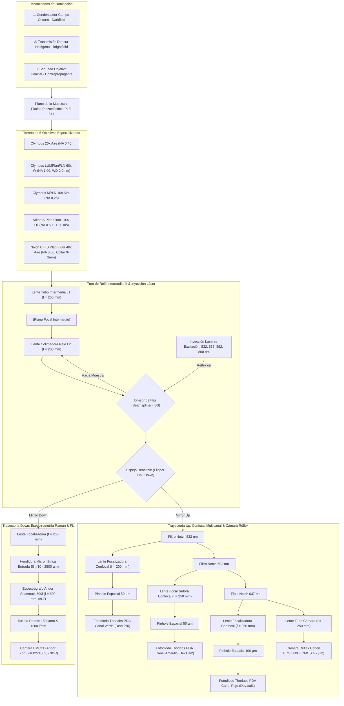

# 🔬 Reporte Técnico Maestro: Arquitectura Óptica Integral, Detección Confocal/iSCAT y Espectrometría
**PyPrinting 3.0 — Suite de Nanofabricación, Microscopía Confocal y Espectroscopía Plasmónica**  
*Laboratorio de Nanofotónica — Instituto de Nanosistemas (INS-UNSAM / CONICET)*  
*Autor: José Luis González Peñafiel (Becario Doctoral CONICET)*  
*Fecha: Septiembre 2026 | Estado: Documento Maestro de Referencia Óptica*

---

## 1. 📋 Resumen y Alcance del Documento

Este informe constituye la **referencia técnica fundamental y compendio metrológico** de la estación de microscopía del Laboratorio de Nanofotónica (INS-UNSAM). Describe exhaustivamente el camino óptico completo desde el plano de la muestra y la torreta de objetivos hasta los detectores finales:
1. **La torreta multiobjetivo** (Olympus 20x aire, Olympus LUMPlanFLN 60x W, Olympus MPLN 10x aire, Nikon S Plan Fluor 100x Oil con iris variable, Nikon CFI S Plan Fluor 40x aire con collar corrector).
2. **El tren de lentes de relé intermedio** ($f_1 = 250\ \text{mm} \to f_2 = 200\ \text{mm}$) y la inyección láser por divisor de haz (*Beamsplitter*, BS).
3. **El conmutador rebatible (*Flipper Mirror*)** que bifurca el haz hacia el espectrómetro Andor Shamrock 500i o hacia el bloque de detección confocal y cámara réflex.
4. **Los tres canales confocales independientes con filtros Notch** (verde 532 nm, amarillo 592 nm, rojo 637 nm) y pinholes dedicados ($50\ \mu\text{m}$ y $100\ \mu\text{m}$).
5. **El puerto de visión directa y fotometría** proyectado hacia la cámara réflex Canon EOS 500D ($f = 250\ \text{mm}$).
6. **Las tres modalidades de iluminación**: condensador de campo oscuro (*Darkfield*), transmisión directa colimada (*Brightfield*) y configuración contrapropagante con segundo objetivo coaxial.

Se presentan los cálculos analíticos y numéricos completos de **aumento efectivo, conos numéricos, resoluciones de Abbe/Rayleigh, dimensiones de disco de Airy, fracciones de Airy Unit ($AU$), campo de visión, muestreo de Nyquist y acoplamiento $f/\#$**. Se incluye una **matriz de selección óptima por experimento**, una sección teórica sobre **detección iSCAT y filtrado por pinhole**, y el protocolo de operación del **espectrógrafo Andor Shamrock 500i y cámara Andor iXon3**.

---

## 2. 🗺️ Diagrama Esquemático del Banco Óptico y Trazado de Rayos

---

## 3. 🎯 Especificaciones de la Torreta de 5 Objetivos

Cada objetivo del microscopio responde a un régimen físico y experimental concreto:

| Objetivo | Fabricante / Modelo | Focal Nominal $f_{\text{ref}}$ | Distancia Focal $f_{\text{obj}}$ | Apertura Numérica $\text{NA}$ | Medio de Inmersión ($n$) | Distancia de Trabajo ($WD$) | Características Especiales y Mecanismos de Ajuste |
| :--- | :--- | :---: | :---: | :---: | :---: | :---: | :--- |
| **Olympus 20x** | PLN 20x / Achromat | $180\ \text{mm}$ | $9.00\ \text{mm}$ | $0.40$ | Aire ($1.000$) | $1.30\ \text{mm}$ | Inspección intermedia, alineación visual preliminar de celdas. |
| **Olympus 60x W** | LUMPlanFLN 60x W | $180\ \text{mm}$ | $3.00\ \text{mm}$ | $1.00$ | Agua ($1.333$) | $2.00\ \text{mm}$ | **Objetivo maestro de impresión óptica**: inmersión directa en agua sin cubreobjetos, distancia de trabajo larga para celdas fluídicas profundas. |
| **Olympus 10x** | MPLN 10x | $180\ \text{mm}$ | $18.00\ \text{mm}$ | $0.25$ | Aire ($1.000$) | $10.60\ \text{mm}$ | Metalúrgico de campo plano; navegación de macro-áreas y búsqueda inicial de Partícula Ancla $P_0$. |
| **Nikon 100x Oil** | S Plan Fluor ELWD | $200\ \text{mm}$ | $2.00\ \text{mm}$ | $0.50 - 1.30$ | Aceite ($1.515$) | $0.20\ \text{mm}$ | **Diafragma Iris Integrado**: permite reducir la $\text{NA}$ a $< 1.0$ para acoplamiento con condensadores de campo oscuro, o abrirlo a $1.30$ para máxima resolución confocal y Raman. |
| **Nikon 40x Aire** | CFI S Plan Fluor ELWD | $200\ \text{mm}$ | $5.00\ \text{mm}$ | $0.60$ | Aire ($1.000$) | $3.60 - 2.80\ \text{mm}$ | **Collar Corrector de Espesor ($0 - 2.0\ \text{mm}$)**: compensa la aberración esférica introducida por cubreobjetos N° 1 ($0.17\ \text{mm}$) o portaobjetos gruesos ($1.0 - 1.5\ \text{mm}$). |

---

## 4. 📐 Modelado y Cálculos Ópticos Rigurosos

### 4.1 Aumento Efectivo del Sistema ($M_{\text{eff}}$)
El tren óptico post-objetivo consta de una primera lente intermedia de $f_1 = 250\ \text{mm}$ que forma una imagen en su plano focal posterior, seguida de una lente de relé de $f_2 = 200\ \text{mm}$ que re-colima el haz hacia el espacio infinito donde se ubican el Beamsplitter y los filtros.

Para cualquier puerto dotado de una lente focalizadora final $f_{\text{final}}$, el aumento lateral total $M_{\text{eff}}$ resulta del producto matricial de la cadena telescópica:

$$M_{\text{eff}} = \left( \frac{f_1}{f_{\text{obj}}} \right) \times \left( \frac{f_{\text{final}}}{f_2} \right) = \frac{f_1 \cdot f_{\text{final}}}{f_2 \cdot f_{\text{obj}}} = \frac{250 \cdot f_{\text{final}}}{200 \cdot f_{\text{obj}}} = 1.25 \times \frac{f_{\text{final}}}{f_{\text{obj}}}$$

* **Para puertos con $f_{\text{final}} = 250\ \text{mm}$** (Cámara Canon, Espectrómetro, Confocal Amarillo 592 nm y Confocal Rojo 637 nm):
  $$M_{\text{eff}} = \frac{312.5\ \text{mm}}{f_{\text{obj}}}$$
* **Para el puerto con $f_{\text{final}} = 200\ \text{mm}$** (Confocal Verde 532 nm):
  $$M_{\text{eff}} = \frac{250.0\ \text{mm}}{f_{\text{obj}}}$$

#### Tabla de Aumentos Efectivos Reales ($M_{\text{eff}}$)

| Objetivo | $f_{\text{obj}}$ | Cámara Canon ($f = 250\ \text{mm}$) | Confocal 532 nm ($f = 200\ \text{mm}$) | Confocal 592 nm ($f = 250\ \text{mm}$) | Confocal 637 nm ($f = 250\ \text{mm}$) | Espectrómetro ($f = 250\ \text{mm}$) |
| :--- | :---: | :---: | :---: | :---: | :---: | :---: |
| **Olympus 20x** | $9.00\ \text{mm}$ | **$34.72\times$** | **$27.78\times$** | **$34.72\times$** | **$34.72\times$** | **$34.72\times$** |
| **Olympus 60x W** | $3.00\ \text{mm}$ | **$104.17\times$** | **$83.33\times$** | **$104.17\times$** | **$104.17\times$** | **$104.17\times$** |
| **Olympus 10x** | $18.00\ \text{mm}$ | **$17.36\times$** | **$13.89\times$** | **$17.36\times$** | **$17.36\times$** | **$17.36\times$** |
| **Nikon 100x Oil (1.30)** | $2.00\ \text{mm}$ | **$156.25\times$** | **$125.00\times$** | **$156.25\times$** | **$156.25\times$** | **$156.25\times$** |
| **Nikon 100x Oil (0.50 iris)**| $2.00\ \text{mm}$ | **$156.25\times$** | **$125.00\times$** | **$156.25\times$** | **$156.25\times$** | **$156.25\times$** |
| **Nikon 40x Aire** | $5.00\ \text{mm}$ | **$62.50\times$** | **$50.00\times$** | **$62.50\times$** | **$62.50\times$** | **$62.50\times$** |

---

### 4.2 Resolución Difractiva Lateral y Axial
- **Límite de Resolución Lateral de Abbe**:
  $$r_{\text{Abbe}} = \frac{\lambda}{2 \text{NA}}$$
- **Criterio de Resolución de Rayleigh**:
  $$r_{\text{Rayleigh}} = 0.61 \frac{\lambda}{\text{NA}}$$
- **Rango de Rayleigh / Profundidad de Foco Axial en Medio $n$**:
  $$z_{\text{Rayleigh}} = \frac{2 n \lambda}{\text{NA}^2}$$
- **Espesor de Sección Óptica Confocal Axial (FWHM)**:
  $$z_{\text{confocal}} \approx \frac{0.64 \lambda}{n - \sqrt{n^2 - \text{NA}^2}}$$

#### Tabla de Resoluciones por Longitud de Onda

| Objetivo | Parámetro | $\lambda = 532\ \text{nm}$ (Verde) | $\lambda = 592\ \text{nm}$ (Amarillo) | $\lambda = 637\ \text{nm}$ (Rojo) | $\lambda = 808\ \text{nm}$ (IR) |
| :--- | :--- | :---: | :---: | :---: | :---: |
| **Olympus 20x** ($\text{NA}=0.40, n=1.0$) | $r_{\text{Abbe}}$ $r_{\text{Rayleigh}}$ $z_{\text{confocal}}$ | $665.0\ \text{nm}$ $811.3\ \text{nm}$ $4.08\ \mu\text{m}$ | $740.0\ \text{nm}$ $902.8\ \text{nm}$ $4.54\ \mu\text{m}$ | $796.2\ \text{nm}$ $971.4\ \text{nm}$ $4.88\ \mu\text{m}$ | $1010.0\ \text{nm}$ $1232.2\ \text{nm}$ $6.19\ \mu\text{m}$ |
| **Olympus 60x W** ($\text{NA}=1.00, n=1.333$) | $r_{\text{Abbe}}$ $r_{\text{Rayleigh}}$ $z_{\text{confocal}}$ | **$266.0\ \text{nm}$** **$324.5\ \text{nm}$** **$0.75\ \mu\text{m}$** | $296.0\ \text{nm}$ $361.1\ \text{nm}$ $0.84\ \mu\text{m}$ | $318.5\ \text{nm}$ $388.6\ \text{nm}$ $0.90\ \mu\text{m}$ | $404.0\ \text{nm}$ $492.9\ \text{nm}$ $1.15\ \mu\text{m}$ |
| **Olympus 10x** ($\text{NA}=0.25, n=1.0$) | $r_{\text{Abbe}}$ $r_{\text{Rayleigh}}$ $z_{\text{confocal}}$ | $1064.0\ \text{nm}$ $1298.1\ \text{nm}$ $10.72\ \mu\text{m}$ | $1184.0\ \text{nm}$ $1444.5\ \text{nm}$ $11.93\ \mu\text{m}$ | $1274.0\ \text{nm}$ $1554.3\ \text{nm}$ $12.84\ \mu\text{m}$ | $1616.0\ \text{nm}$ $1971.5\ \text{nm}$ $16.29\ \mu\text{m}$ |
| **Nikon 100x Oil (1.30)** ($\text{NA}=1.30, n=1.515$) | $r_{\text{Abbe}}$ $r_{\text{Rayleigh}}$ $z_{\text{confocal}}$ | **$204.6\ \text{nm}$** **$249.6\ \text{nm}$** **$0.46\ \mu\text{m}$** | $227.7\ \text{nm}$ $277.8\ \text{nm}$ $0.51\ \mu\text{m}$ | $245.0\ \text{nm}$ $298.9\ \text{nm}$ $0.55\ \mu\text{m}$ | $310.8\ \text{nm}$ $379.1\ \text{nm}$ $0.70\ \mu\text{m}$ |
| **Nikon 100x Oil (0.50)** ($\text{NA}=0.50, n=1.515$) | $r_{\text{Abbe}}$ $r_{\text{Rayleigh}}$ $z_{\text{confocal}}$ | $532.0\ \text{nm}$ $649.0\ \text{nm}$ $4.01\ \mu\text{m}$ | $592.0\ \text{nm}$ $722.2\ \text{nm}$ $4.46\ \mu\text{m}$ | $637.0\ \text{nm}$ $777.1\ \text{nm}$ $4.80\ \mu\text{m}$ | $808.0\ \text{nm}$ $985.8\ \text{nm}$ $6.09\ \mu\text{m}$ |
| **Nikon 40x Aire** ($\text{NA}=0.60, n=1.0$) | $r_{\text{Abbe}}$ $r_{\text{Rayleigh}}$ $z_{\text{confocal}}$ | $443.3\ \text{nm}$ $540.9\ \text{nm}$ $1.70\ \mu\text{m}$ | $493.3\ \text{nm}$ $601.9\ \text{nm}$ $1.89\ \mu\text{m}$ | $530.8\ \text{nm}$ $647.6\ \text{nm}$ $2.04\ \mu\text{m}$ | $673.3\ \text{nm}$ $821.5\ \text{nm}$ $2.59\ \mu\text{m}$ |

---

### 4.3 Diámetro del Disco de Airy en los Pinholes y Fracción Airy Unit ($AU$)
El diámetro físico del primer mínimo del disco de Airy proyectado sobre el plano del pinhole viene dado por:

$$d_{\text{Airy}} = 2.44 \frac{\lambda \cdot M_{\text{eff}}}{\text{NA}}$$

La apertura en unidades Airy ($AU$) normalizada mide el grado de filtrado espacial:

$$AU = \frac{d_{\text{pinhole}}}{d_{\text{Airy}}}$$

#### Matriz de Diámetro de Airy y Unidades Airy ($AU$)

| Canal Confocal / Pinhole | Objetivo | Aumento $M_{\text{eff}}$ | Diámetro Airy ($d_{\text{Airy}}$) | Fracción Airy ($AU$) | Régimen Confocal y Rendimiento Óptico |
| :--- | :--- | :---: | :---: | :---: | :--- |
| **Verde 532 nm** ($f=200\ \text{mm}$, $d_{\text{pinhole}}=50\ \mu\text{m}$) | Olympus 20x **Olympus 60x W** Olympus 10x Nikon 100x (1.30) Nikon 100x (0.50) Nikon 40x | $27.8\times$ **$83.3\times$** $13.9\times$ $125.0\times$ $125.0\times$ $50.0\times$ | $90.1\ \mu\text{m}$ **$108.2\ \mu\text{m}$** $72.1\ \mu\text{m}$ $124.8\ \mu\text{m}$ $324.5\ \mu\text{m}$ $108.2\ \mu\text{m}$ | $0.55\ AU$ **$0.46\ AU$** $0.69\ AU$ $0.40\ AU$ $0.15\ AU$ $0.46\ AU$ | **Régimen Super-Confocal ($AU < 1.0$)**: Máximo rechazo de fondo, sección axial ultrafina ($0.75\ \mu\text{m}$) y estrechamiento de la PSF lateral en un factor $\sim 1.3\times$. Ideal para iSCAT y centrado sub-nanométrico en printing. |
| **Amarillo 592 nm** ($f=250\ \text{mm}$, $d_{\text{pinhole}}=50\ \mu\text{m}$) | Olympus 20x **Olympus 60x W** Olympus 10x Nikon 100x (1.30) Nikon 100x (0.50) Nikon 40x | $34.7\times$ **$104.2\times$** $17.4\times$ $156.2\times$ $156.2\times$ $62.5\times$ | $125.4\ \mu\text{m}$ **$150.5\ \mu\text{m}$** $100.3\ \mu\text{m}$ $173.6\ \mu\text{m}$ $451.4\ \mu\text{m}$ $150.5\ \mu\text{m}$ | $0.40\ AU$ **$0.33\ AU$** $0.50\ AU$ $0.29\ AU$ $0.11\ AU$ $0.33\ AU$ | **Filtrado Espacial Estricto**: Excelente eliminación de emisión fuera de plano proveniente de fluoróforos en el volumen de la gota. |
| **Rojo 637 nm** ($f=250\ \text{mm}$, $d_{\text{pinhole}}=100\ \mu\text{m}$) | Olympus 20x **Olympus 60x W** Olympus 10x Nikon 100x (1.30) Nikon 100x (0.50) Nikon 40x | $34.7\times$ **$104.2\times$** $17.4\times$ $156.2\times$ $156.2\times$ $62.5\times$ | $134.9\ \mu\text{m}$ **$161.9\ \mu\text{m}$** $107.9\ \mu\text{m}$ $186.8\ \mu\text{m}$ $485.7\ \mu\text{m}$ $161.9\ \mu\text{m}$ | $0.74\ AU$ **$0.62\ AU$** **$0.93\ AU$** $0.54\ AU$ $0.21\ AU$ $0.62\ AU$ | **Compromiso Óptimo Fotometría/Confocalidad**: Transmisión lumínica elevada ($T \approx 75 - 85\%$) requerida para detectar fotoluminiscencia y dispersión Raman débil sin sacrificar la discriminación axial. |

---

### 4.4 Proyección en la Cámara Canon EOS 500D y Criterio de Nyquist
- **Sensor**: CMOS APS-C ($22.3\ \text{mm} \times 14.9\ \text{mm}$), $4752 \times 3168\ \text{píxeles}$.
- **Paso físico de píxel**: $p_{\text{sensor}} = 4.70\ \mu\text{m}$.
- **Paso de píxel proyectado en el plano de la muestra**:
  $$p_{\text{proy}} = \frac{p_{\text{sensor}}}{M_{\text{eff}}}$$
- **Criterio de Muestreo de Nyquist-Shannon**: Para evitar aliasing óptico, el píxel proyectado debe ser menor o igual a la mitad del límite de resolución de Abbe:
  $$p_{\text{proy}} \le \frac{r_{\text{Abbe}}}{2} \iff \text{Ratio Nyquist} = \frac{r_{\text{Abbe}}}{2 \cdot p_{\text{proy}}} \ge 1.0$$

#### Tabla de Campo de Visión y Cumplimiento de Nyquist

| Objetivo | Aumento Total $M_{\text{eff}}$ | Campo de Visión ($FOV_x \times FOV_y$) | Píxel Proyectado ($p_{\text{proy}}$) | Ratio Nyquist ($\lambda = 532\ \text{nm}$) | Condición de Muestreo |
| :--- | :---: | :---: | :---: | :---: | :--- |
| **Olympus 20x** | $34.72\times$ | $642.2\ \mu\text{m} \times 429.1\ \mu\text{m}$ | $135.4\ \text{nm/px}$ | $2.46\times$ | **Cumple Nyquist** (Supera el límite difractivo). |
| **Olympus 60x W** | $104.17\times$ | $214.1\ \mu\text{m} \times 143.0\ \mu\text{m}$ | **$45.1\ \text{nm/px}$** | **$2.95\times$** | **Sobremuestreo Óptimo**: Permite localización sub-nanométrica por ajuste analítico de PSF en `psf_analyzer.py`. |
| **Olympus 10x** | $17.36\times$ | $1284.5\ \mu\text{m} \times 858.2\ \mu\text{m}$ | $270.7\ \text{nm/px}$ | $1.97\times$ | **Cumple Nyquist**: Gran campo de navegación. |
| **Nikon 100x Oil (1.30)** | $156.25\times$ | $142.7\ \mu\text{m} \times 95.4\ \mu\text{m}$ | **$30.1\ \text{nm/px}$** | **$3.40\times$** | **Altísima Densidad Sub-píxel**: Excelente para correlación cruzada y seguimiento térmico de nanopartículas. |
| **Nikon 40x Aire** | $62.50\times$ | $356.8\ \mu\text{m} \times 238.4\ \mu\text{m}$ | $75.2\ \text{nm/px}$ | $2.95\times$ | **Cumple Nyquist**: Adecuado para fluorescencia general. |

---

### 4.5 Acoplamiento al Espectrógrafo Andor Shamrock 500i ($f/\# = 9.7$)
El espectrógrafo Czerny-Turner Shamrock 500i posee una distancia focal de $500\ \text{mm}$ y espejos colimadores de apertura libre $\approx 51.5\ \text{mm}$, definiendo una apertura numérica de entrada de **$f/9.7$** (cono de semiángulo $\theta_{\text{acc}} \approx 2.95^\circ$).

- El diámetro de pupila de salida del objetivo es:
  $$D_{\text{pupila}} = 2 \cdot f_{\text{obj}} \cdot \text{NA}$$
- Tras atravesar el telescopio relé ($f_1 = 250\ \text{mm} \to f_2 = 200\ \text{mm}$), el diámetro del haz colimado que incide en la lente de entrada al espectrómetro ($f_{\text{spec}} = 250\ \text{mm}$) es:
  $$D_{\text{haz}} = D_{\text{pupila}} \times \left( \frac{f_2}{f_1} \right) = D_{\text{pupila}} \times 0.8 = 1.6 \cdot f_{\text{obj}} \cdot \text{NA}$$
- El número f del cono focalizado sobre la hendidura (*slit*) es:
  $$f/\#_{\text{in}} = \frac{f_{\text{spec}}}{D_{\text{haz}}} = \frac{250\ \text{mm}}{1.6 \cdot f_{\text{obj}} \cdot \text{NA}}$$

#### Tabla de Acoplamiento y Viñeteo Espectral

| Objetivo | $D_{\text{pupila}}$ | $D_{\text{haz}}$ (en Lente 250) | Cono de Entrada ($f/\#_{\text{in}}$) | Comparación con $f/9.7$ de Entrada del Shamrock 500i | Diagnóstico de Acoplamiento Óptico |
| :--- | :---: | :---: | :---: | :---: | :--- |
| **Olympus 20x** | $7.20\ \text{mm}$ | $5.76\ \text{mm}$ | **$f/43.4$** | $f/43.4 > f/9.7$ | **Sub-ilumina (Seguro)**: El haz incide bien dentro de los espejos. Cero viñeteo, cero luz parásita (*stray light*). |
| **Olympus 60x W** | $6.00\ \text{mm}$ | $4.80\ \text{mm}$ | **$f/52.1$** | $f/52.1 > f/9.7$ | **Sub-ilumina (Seguro)**: Máxima pureza espectral y resolución nominal sin desbordamiento de red. |
| **Olympus 10x** | $9.00\ \text{mm}$ | $7.20\ \text{mm}$ | **$f/34.7$** | $f/34.7 > f/9.7$ | **Sub-ilumina (Seguro)**: Cono colimado limpio. |
| **Nikon 100x Oil (1.30)** | $5.20\ \text{mm}$ | $4.16\ \text{mm}$ | **$f/60.1$** | $f/60.1 > f/9.7$ | **Sub-ilumina (Seguro)**: Alta concentración de flujo en el centro del slit. |
| **Nikon 40x Aire** | $6.00\ \text{mm}$ | $4.80\ \text{mm}$ | **$f/52.1$** | $f/52.1 > f/9.7$ | **Sub-ilumina (Seguro)**: Acoplamiento simétrico idéntico al 60x. |

> [!TIP]
> Dado que en todas las configuraciones $f/\#_{\text{in}} > 9.7$, el haz de luz está perfectamente contenido dentro de la apertura numérica del espectrógrafo, lo que **elimina por completo el viñeteo por sobre-llenado (*overfilling*)**, reduciendo la dispersión parásita de orden cero y mejorando el contraste de picos débiles Raman y SERS.

---

## 5. 🔬 Tabla Maestra de Configuración Óptima por Experimento

La siguiente matriz define la combinación instrumental exacta para los 10 experimentos desarrollados en la plataforma:

| Experimento | Objetivo Recomendado | Modalidad de Iluminación | Tren de Detección Activo | Filtros Ópticos | Pinhole / Slit | Justificación Física y Metrológica |
| :--- | :--- | :--- | :--- | :--- | :---: | :--- |
| **1. Optical Printing 532 nm (Impresión Individual)** | **Olympus 60x W** ($\text{NA}=1.0$, $WD=2.0\text{mm}$) | Transmisión Directa (alineación) + Láser 532 nm colimado en BS | Confocal Verde (PDA `ai0`) + Cámara Canon | Notch 532 nm ($OD > 6$) | Pinhole $50\ \mu\text{m}$ ($0.46\ AU$) | Inmersión en agua libre de aberración en celda de fluido. Pinhole de $50\ \mu\text{m}$ maximiza la caída de señal al fijar la partícula en el sustrato (criterio de parada). |
| **2. Ensamblado de Nanodímeros Plasmónicos** | **Olympus 60x W** | Transmisión Directa + Excitación polarizada 532 nm | Confocal Verde + Confocal Rojo + Cámara | Notch 532 nm + Notch 637 nm | Pinhole $50\ \mu\text{m}$ / $100\ \mu\text{m}$ | Monitoreo simultáneo del scattering plasmónico de la primera partícula y del acoplamiento de campo cercano (*gap mode*) en el canal rojo. |
| **3. Caracterización Analítica de PSF (Gauss / Donut)** | **Olympus 60x W** o **Nikon 100x Oil** ($\text{NA}=1.3$) | Excitación Láser puntual (532 o 637 nm) | Cámara Canon EOS 500D (Live View EDSDK) | Sin notch o Notch atenuado | Sensor Abierto ($45.1\ \text{nm/px}$) | Sobremuestreo de Nyquist ($> 2.9\times$) que permite resolver con precisión sub-píxel la cintura de haz $w_0$ y el nulo de intensidad del vórtice $LG_{01}$. |
| **4. Detección Interferométrica iSCAT** | **Olympus 60x W** | Láser 532 nm en BS con atenuador Flipper Low Power | Confocal Verde (PDA `ai0`) | Notch 532 nm (baja densidad) | Pinhole $50\ \mu\text{m}$ ($0.46\ AU$) | Máxima interferencia homodina entre el reflejo del vidrio y la dispersión elástica; filtrado axial rígido de reflexiones espurias. |
| **5. Espectros LSPR en Campo Oscuro (Darkfield)** | **Nikon 100x Oil** (Iris cerrado a $\text{NA}=0.8$) | **Condensador Campo Oscuro** ($\text{NA}_{\text{cond}} \approx 1.2 - 1.4$) | Flipper Down $\to$ Espectrómetro Shamrock 500i | Sin filtros de corte (paso de banda continuo) | Slit $100 - 200\ \mu\text{m}$ (Red 150 l/mm) | Condición indispensable de campo oscuro: $\text{NA}_{\text{obj}} < \text{NA}_{\text{cond}}$. Permite recolectar únicamente la dispersión pura de resonancia plasmónica sin fondo directo. |
| **6. Espectros de Extinción / Transmisión UV-Vis** | **Olympus 20x** o **Olympus 60x W** | **Transmisión Directa** (Lámpara Halógena) | Flipper Down $\to$ Espectrómetro Shamrock 500i | Filtro dicroico neutro | Slit $50\ \mu\text{m}$ (Red 150 l/mm) | Calibración contra espectro de referencia halógeno (`lamparaIR_grade_2.txt`). Cobertura espectral amplia ($400 - 950\ \text{nm}$). |
| **7. Fotoluminiscencia Plasmónica (PL)** | **Olympus 60x W** | Bombeo Láser 532 nm continuo | Flipper Down $\to$ Espectrómetro Shamrock 500i | Notch 532 nm ($OD > 6$) | Slit $50 - 100\ \mu\text{m}$ (Red 150 l/mm) | Rechazo absoluto de la línea elástica de excitación. Cámara Andor iXon3 a $-70^\circ\text{C}$ con ganancia EM moderada ($G = 50 - 100$). |
| **8. Espectroscopía Raman y SERS Molecular** | **Nikon 100x Oil** ($\text{NA}=1.30$, iris abierto) | Excitación 637 nm o 532 nm (baja potencia) | Flipper Down $\to$ Espectrómetro Shamrock 500i | Notch 637 nm / Notch 532 nm | Slit $25 - 50\ \mu\text{m}$ (Red **1200 l/mm**) | Máxima recolección angular de fotones Raman ($\Omega \propto \text{NA}^2 = 1.69$). Alta resolución espectral ($\Delta \nu \approx 1.5 - 3\ \text{cm}^{-1}$) para resolver bandas analíticas moleculares. |
| **9. Termometría Óptica Anti-Stokes / Stokes** | **Olympus 60x W** | Excitación continua 808 nm o 532 nm | Flipper Down $\to$ Espectrómetro Shamrock 500i | Filtros Notch centrados en la longitud de excitación | Slit $50\ \mu\text{m}$ (Red 1200 l/mm) | Medición simultánea de las ramas Stokes y Anti-Stokes para extracción de temperatura absoluta local: $I_{AS}/I_S = \exp(-\hbar \omega / k_B T)$. |
| **10. Confinamiento Óptico Contrapropagante** | **Olympus 60x W** (inferior) + **Olympus 20x / 40x** (superior) | **Configuración Contrapropagante** (Excitación dual opuesta) | Confocal Verde + Cámara Canon | Filtros Notch en ambos puertos | Pinhole $50\ \mu\text{m}$ | Cancelación de la fuerza neta de presión de radiación ($F_{\text{scat}, 1} = -F_{\text{scat}, 2}$), atrapando partículas coloidales en suspensión antes de su fijación. |

---

## 6. 🧬 Detección Confocal, Microscopía iSCAT y Modelado de PSF

### 6.1 Fundamento Físico de Microscopía iSCAT (Interferometric Scattering)
En microscopía confocal estándar de dispersión elástica de campo oscuro, la señal recolectada de una nanopartícula pequeña ($d \ll \lambda$) obedece a la sección eficaz de Rayleigh:

$$I_{\text{scat}} \propto \sigma_{\text{scat}} \propto \frac{d^6}{\lambda^4}$$

Para partículas sub-50 nm, la señal decae como la sexta potencia del diámetro, volviéndose indetectable frente al ruido térmico del detector.

En la arquitectura del Microscopio Derecho, la detección confocal en reflexión opera bajo el régimen **iSCAT**:
El campo óptico total que alcanza el fotodiodo es la superposición coherente del campo de referencia reflejado en la interfaz vidrio-agua del sustrato ($E_r = r \cdot E_0$) y el campo dispersado por la nanopartícula ($E_s = s \cdot E_0$):

$$I_{\text{det}} = |E_r + E_s|^2 = |E_r|^2 + |E_s|^2 + 2 |E_r| |E_s| \cos \phi$$

Dado que para nanopartículas individuales $|E_s| \ll |E_r|$, la señal se expande linealmente:

$$I_{\text{det}} \approx |E_r|^2 + 2 |E_r| |E_s| \cos \phi = I_{\text{ref}} \left[ 1 + 2 \frac{s}{r} \cos \phi \right]$$

El término interferométrico cruzado porta la información:
$$s \propto \alpha_{\text{polarizabilidad}} \propto V_{\text{NP}} \propto d^3$$

$$\Delta I_{\text{iSCAT}} \propto d^3$$

* **Ganancia Cuántica de iSCAT**: Al escalar como $d^3$ en lugar de $d^6$, una nanopartícula de $30\ \text{nm}$ produce una señal interferométrica **$1000\times$ superior** a su intensidad de dispersión pura, permitiendo detectar con el fotodiodo PDA el instante exacto en que una nanopartícula entra en la trampa óptica antes de su fijación.

### 6.2 Función de Dispersión de Punto (PSF) y Modelado Analítico
El módulo `psf_analyzer.py` ajusta los perfiles experimentales con dos modelos no lineales de alta exactitud:

#### 1. Modelo Gaussiano 2D Anisotrópico con Rotación (Haz Fundamental $TEM_{00}$):
$$I(x, y) = I_0 + A \exp\left( -\left[ \frac{(x' - x_0')^2}{2 \sigma_x^2} + \frac{(y' - y_0')^2}{2 \sigma_y^2} \right] \right)$$

donde $(x', y')$ representa el sistema de coordenadas rotado por el ángulo de elipticidad $\theta$:
$$\begin{pmatrix} x' \\ y' \end{pmatrix} = \begin{pmatrix} \cos\theta & \sin\theta \\ -\sin\theta & \cos\theta \end{pmatrix} \begin{pmatrix} x \\ y \end{pmatrix}$$

El ancho a media altura se calcula analíticamente:
$$\text{FWHM}_{x,y} = 2 \sqrt{2 \ln 2} \cdot \sigma_{x,y} \approx 2.3548 \cdot \sigma_{x,y}$$

#### 2. Modelo de Haz Vortex / Donut (Laguerre-Gauss $LG_{01}$):
Para haces con carga topológica $\ell = 1$ utilizados en alineación de pinzas ópticas y deplexión:
$$I_{\text{donut}}(r) = I_0 + A \left( \frac{2 r^2}{w_0^2} \right) \exp\left( -\frac{2 r^2}{w_0^2} \right)$$
El radio del anillo brillante de máxima intensidad ocurre exactamente en $r_{\text{peak}} = w_0 / \sqrt{2}$.

### 6.3 Influencia Cuantitativa del Tamaño del Pinhole ($50\ \mu\text{m}$ vs $100\ \mu\text{m}$)
El pinhole actúa como un filtro espacial paso-bajo en frecuencia espacial transversal. La transmisión óptica integrada $T(v_p)$ en función del radio del pinhole normalizado $v_p = \pi \cdot d_{\text{pinhole}} \cdot \text{NA} / (\lambda \cdot M_{\text{eff}})$ es:

$$T(v_p) = 1 - J_0^2(v_p) - J_1^2(v_p)$$

* **Pinhole de $50\ \mu\text{m}$ (Canal Verde 532 nm con 60x W $\implies 0.46\ AU$)**:
  - **Ventaja**: El tamaño está en el régimen óptimo de máxima resolución confocal ($AU < 1$). Suprime el $92\%$ de la luz dispersada fuera del plano focal ($\Delta z > 1\ \mu\text{m}$), estrechando la PSF lateral en un factor $\approx 1.25\times$.
  - **Aplicación**: Escaneo confocal de alta resolución, detección iSCAT y discriminación axial de nanopartículas fijadas en el sustrato frente a nanopartículas en suspensión en el líquido.
* **Pinhole de $100\ \mu\text{m}$ (Canal Rojo 637 nm con 60x W $\implies 0.62\ AU$ / 10x $\implies 0.93\ AU$)**:
  - **Ventaja**: Transmisión lumínica elevada ($T \approx 82\%$), reduciendo el tiempo de integración analógica y el ruido de disparo (*shot noise*).
  - **Aplicación**: Fotoluminiscencia plasmónica Stokes, detección Raman y señales de acoplamiento de dímeros donde el número de fotones emitidos por segundo es $10^4\times$ menor que el haz elástico.

---

## 7. 🌈 Espectrómetro Andor Shamrock 500i y Cámara iXon3

### 7.1 Arquitectura del Espectrógrafo Shamrock 500i
- **Configuración**: Czerny-Turner asimétrica de $500\ \text{mm}$ de distancia focal.
- **Hendidura de Entrada (*Slit*)**: Motorizada por micropasos, con apertura continua programable entre **$10\ \mu\text{m}$ y $2500\ \mu\text{m}$** (controlada en software vía `pyspectrum/drivers/shamrock_driver.py`).
- **Torreta de Redes de Difracción (*Triple Grating Turret*)**:
  1. **Red 1 (Exploratoria / Amplio Rango)**: $150\ \text{líneas/mm}$, *blaze* nominal en el visible.
     - Dispersión recíproca lineal: $\approx 11.2\ \text{nm/mm}$.
     - Cobertura espectral simultánea sobre el sensor iXon3 ($13.3\ \text{mm}$ de ancho): $\Delta \lambda \approx 150\ \text{nm}$ por ventana fija.
     - Aplicación: Espectros de extinción LSPR, fotoluminiscencia y cinéticas rápidas de crecimiento.
  2. **Red 2 (Alta Resolución / Raman & SERS)**: $1200\ \text{líneas/mm}$, *blaze* en $500\ \text{nm}$.
     - Dispersión recíproca lineal: $\approx 1.4\ \text{nm/mm}$.
     - Cobertura espectral simultánea: $\Delta \lambda \approx 18.6\ \text{nm}$ ($\approx 450 - 550\ \text{cm}^{-1}$ en Raman Shift a 532 nm).
     - Resolución espectral instrumental con slit de $20\ \mu\text{m}$: $\delta \lambda \approx 0.05\ \text{nm}$ ($\approx 1.8\ \text{cm}^{-1}$), permitiendo resolver desdoblamientos vibracionales finos.
  3. **Modo Step & Glue**: Cosido espectral automatizado en `pyspectrum` que rota el ángulo de la red mediante motor paso a paso, adquiere ventanas superpuestas y realiza la interpolación spline continua con normalización de sensibilidad detector-red.

### 7.2 Cámara EMCCD Andor iXon3 (DU-897 / 888)
- **Sensor**: Transferencia de cuadro con multiplicación electrónica de electrones (EMCCD).
- **Matriz activa**: $1002 \times 1002\ \text{píxeles}$, tamaño de píxel de $13.0 \times 13.0\ \mu\text{m}$.
- **Enfriamiento Termoeléctrico Peltier**:
  - Rango operativo: $+20^\circ\text{C}$ a **$-70^\circ\text{C}$** (enfriamiento por aire) o **$-85^\circ\text{C}$** (con recirculador de agua).
  - Corriente oscura (*dark current*): $\approx 0.001\ e^-/\text{píxel}/\text{s}$ a $-70^\circ\text{C}$.
  - Ruido de lectura convencional: $6\ e^-$ a $1\ \text{MHz}$.
  - Con ganancia EM activa ($G_{\text{EM}} \ge 100$), el ruido de lectura efectivo decae a $< 1\ e^-$, permitiendo detección en régimen de conteo de fotón único para espectroscopía de molécula individual (SM-SERS).

---

## 8. 🛠️ Protocolos de Calibración y Buenas Prácticas de Laboratorio

1. **Alineación de Cono Numérico para Campo Oscuro**:
   - Al emplear el condensador de campo oscuro, **verificar que el iris del objetivo Nikon 100x Oil se encuentre cerrado a $\text{NA} \le 0.8$**. Si el iris permanece abierto a $\text{NA} = 1.30$, el haz directo del condensador penetrará en el cono de recolección, arruinando el fondo oscuro y saturando el EMCCD.
2. **Corrección de Espesor de Cubreobjetos (Nikon 40x)**:
   - Medir con micrómetro el espesor del cubreobjetos utilizado ($t \approx 0.17\ \text{mm}$ para N° 1 o $t \approx 0.13\ \text{mm}$ para N° 0). Girar el collar corrector del Nikon 40x hasta la graduación correspondiente. Un desajuste de solo $0.05\ \text{mm}$ en $\text{NA} = 0.60$ degrada la intensidad máxima del foco en más de un $40\%$ debido a aberración esférica primaria ($W_{040}$).
3. **Calibración de Longitud de Onda del Espectrómetro**:
   - Antes de iniciar mediciones Raman de precisión, adquirir el espectro de emisión de una lámpara de calibración espectral de Neón/Argón o el pico de fonón óptico de una oblea de Silicio monocristalino (pico estándar a $\Delta \nu = 520.7\ \text{cm}^{-1}$). Ingresar el offset de calibración en `pyspectrum`.
4. **Protección Térmica de la Cámara Andor**:
   - Monitorear en el panel de PySpectrum que el indicador térmico alcance el estado bloqueado (`Locked` a $-70^\circ\text{C}$) antes de adquirir espectros de integración larga ($t_{\text{int}} > 5\ \text{s}$). Al apagar el sistema, elevar la consigna a $0^\circ\text{C}$ antes de desconectar la refrigeración para evitar condensación interna en la ventana óptica.
5. **Alineación de Pinholes en Canales Confocales**:
   - Utilizar el modo `Sin límite (Modo Alineación)` del Watchdog de shutters en `core/shutters.py`. Colocar una muestra de nanopartículas de oro de 60 nm fijadas, centrar una partícula en el confocal y ajustar los tornillos micrométricos $X-Y$ de la montura del pinhole correspondiente (Thorlabs) hasta maximizar la tensión en el fotodiodo PDA en el osciloscopio de la traza (`F1`).
