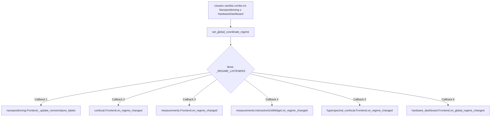

# Reporte Técnico: Regímenes de Coordenadas, Ergonomía de Usuario e Invariancia Cinemática de Hardware en PyPrinting 3.0 🧭

**Laboratorio de Nanofotónica — Instituto de Nanosistemas (INS-UNSAM / CONICET)**  
**Autor Principal**: José Luis González Peñafiel (*Becario Doctoral CONICET*)  
**Fecha de Publicación**: 9 de Septiembre de 2026  
**Documento de Referencia**: `reportes/sistema/Reporte_Regimenes_de_Coordenadas_e_Invariancia_Cinematica_PyPrinting3.md`  
**Módulos de Implementación**: `config.py`, `core/nanopositioning.py`, `modules/confocal.py`, `modules/measurements.py`, `pyspectrum/modules/hyperspectral_confocal.py`, `modules/hardware_dashboard.py`, `tests/test_coordinate_nomenclature_sync.py`

---

## 1. Resumen Ejecutivo

En el desarrollo y operación de microscopios de nanofotónica y estaciones de impresión óptica por pinzas ópticas fototérmicas, conviven tradicionalmente dos perspectivas espaciales:
1. **El marco del hardware / platina**: Determinado por la orientación electromecánica y asignación de canales de la controladora piezoeléctrica (Physik Instrumente E-517/E-736), en la cual los actuadores de bucle cerrado se designan internamente como Eje 1, Eje 2 y Eje 3.
2. **El marco visual del experimentador / cámara**: Determinado por la imagen proyectada en el sensor del detector (cámara réflex Canon EOS 500D) y el monitor de la computadora, donde el haz láser es estático y los objetos en la muestra se desplazan relativamente.

Históricamente, en la suite heredada **PyPrinting 2 (Legacy)**, el Eje 1 de la platina PI fue bautizado como `"X"` (el cual producía un desplazamiento vertical en la pantalla del microscopio) y el Eje 2 fue bautizado como `"Y"` (desplazamiento horizontal). Para los operadores experimentados con miles de horas en el setup, esta notación es una segunda naturaleza. Sin embargo, para nuevos investigadores y colaboradores, esta convención generaba una carga cognitiva innecesaria y discordancia perceptual entre lo que veían en el monitor y las etiquetas numéricas de los controles.

El presente desarrollo introduce una **arquitectura de regímenes de coordenadas desacoplada y reactiva**, ofreciendo tres marcos de referencia seleccionables por el usuario:
- **`Legacy`**: Nomenclatura histórica idéntica a PyPrinting 2 ($X = \text{Eje 1}, Y = \text{Eje 2}$).
- **`Laser Ref` (Referencia del Láser / Monitor)**: Centrado en la óptica; $+X$ es horizontal hacia la derecha y $+Y$ es vertical hacia abajo.
- **`Sample Ref` (Referencia de la Muestra)**: Centrado en el sustrato de vidrio; $+X$ es horizontal hacia la izquierda y $+Y$ es vertical hacia arriba.

### 🛡️ Principio Rector de Invariancia de Hardware
El diseño garantiza una **invariancia matemática y cinemática absoluta** sobre los actuadores físicos:
$$\forall \text{ Régimen } R \in \{\text{Legacy}, \text{Laser Ref}, \text{Sample Ref}\}: \quad \Delta \mathbf{r}_{\text{stage}}(\text{Casilla } i) \equiv \Delta \mathbf{r}_{\text{stage}}^{\text{hardware}}(\text{Eje } i)$$

El cambio de régimen modifica exclusivamente las **etiquetas, tooltips y leyendas de ejes en la interfaz visual (UI)** y en los reportes metrológicos de exportación, **sin alterar en un solo nanómetro la cinemática de la platina PI, las formas de onda de escaneo continuo `pi.WAV_LIN` ni los canales analógicos del backend**.

---

## 2. Fundamentos Físico-Ópticos y Transformaciones de Coordenadas

### 2.1 Relación de Movimiento Relativo: Muestra vs. Haz Láser
En un microscopio invertido o derecho con platina piezoeléctrica XY de muestra, el haz láser incidente se mantiene estacionario en el espacio del laboratorio $\mathcal{R}_{\text{lab}}$ focalizado por el objetivo de inmersión ($NA = 1.40$ / $1.49$).

Al actuar sobre la platina piezoeléctrica mediante un comando `pi.MOV(1, v1)` o `pi.MOV(2, v2)`, el sustrato portamuestras experimenta una velocidad $\mathbf{v}_{\text{sample}}$. En consecuencia, el punto de impacto del láser sobre la muestra experimenta una velocidad relativa exactamente opuesta:
$$\mathbf{v}_{\text{laser}/\text{sample}} = - \mathbf{v}_{\text{sample}/\text{lab}}$$

```
                      [ CÁMARA RÉFLEX / MONITOR ]
                                ▲ -Y (Arriba)
                                │
             -X (Izquierda) ◄───┼───► +X (Derecha) [Laser Ref]
                                │
                                ▼ +Y (Abajo)

  ========================================================================
   Acción en Hardware       Efecto en Imagen (Laser Ref)   Efecto en Muestra
  ========================================================================
   Platina Eje 1 (PI +)  ──► El láser se mueve hacia ABAJO ──► Muestra sube
   Platina Eje 1 (PI -)  ──► El láser se mueve hacia ARRIBA──► Muestra baja
   Platina Eje 2 (PI +)  ──► El láser se mueve a DERECHA  ──► Muestra va a izq
   Platina Eje 2 (PI -)  ──► El láser se mueve a IZQUIERDA──► Muestra va a der
  ========================================================================
```

### 2.2 Cuadro Comparativo de los Tres Regímenes

| Régimen | Perspectiva Operativa | Casilla 1 (Eje 1 PI) | Casilla 2 (Eje 2 PI) | Casilla 3 (Eje 3 PI) | Caso de Uso Óptimo |
| :--- | :--- | :--- | :--- | :--- | :--- |
| **`Legacy`** | Histórica de PyPrinting 2 | `X =` (Vertical en pantalla) | `Y =` (Horizontal en pantalla) | `Z =` (Foco axial) | Operadores senior, comparación estricta con código legacy 2017-2024. |
| **`Laser Ref`** | Percepción visual directa en cámara réflex | `Y (Vert) =` (Eje vertical hacia abajo) | `X (Horiz) =` (Eje horizontal a derecha) | `Z (Axial) =` (Foco axial) | Nuevos usuarios, alineación visual, fotodiodos y coincidencia con preview 2D. |
| **`Sample Ref`** | Sistema solidario al sustrato de vidrio | `Y (Muestra) =` (Orientación intrínseca de muestra) | `X (Muestra) =` (Orientación intrínseca de muestra) | `Z (Axial) =` (Foco axial) | Fabricación de metasuperficies, correlación directa con SEM / AFM y litografía. |

---

## 3. Matriz Canónica de Nomenclatura (`COORDINATE_NOMENCLATURE`)

Para centralizar de forma determinista todas las traducciones textuales, se definió un diccionario canónico inmutable en `core/nanopositioning.py`:

```python
COORDINATE_NOMENCLATURE = {
    REGIME_LEGACY: {
        "axis_1_name": "X",
        "axis_2_name": "Y",
        "axis_3_name": "Z",
        "axis_1_label": "X =",
        "axis_2_label": "Y =",
        "axis_3_label": "Z =",
        "step_xy_label": "Step X-Y (µm):",
        "confocal_psf_modes": ["x/y", "x/z", "y/x", "y/z"],
        "confocal_range_x": "Range X (µm):",
        "confocal_range_y": "Range Y (µm):",
        "confocal_pixels_x": "Pixels X:",
        "confocal_pixels_y": "Pixels Y:",
        "grid_axis_x": "X (µm)",
        "grid_axis_y": "Y (µm)",
        "printing_ref_x": "X ref (µm):",
        "printing_ref_y": "Y ref (µm):",
        "printing_dist_np": "Dist NP (µm):",
        "printing_dist_col": "Dist Col (µm):",
        "printing_shift_x": "Shift X (µm):",
        "printing_shift_y": "Shift Y (µm):",
        "dimers_dx": "dx (µm):",
        "dimers_dy": "dy (µm):",
        "tooltip_axis_1": "Eje 1 físico de la platina PI (Legacy: X)",
        "tooltip_axis_2": "Eje 2 físico de la platina PI (Legacy: Y)",
        "tooltip_axis_3": "Eje 3 físico de la platina PI (Z axial)",
    },
    REGIME_LASER_REF: {
        "axis_1_name": "Y (Vert)",
        "axis_2_name": "X (Horiz)",
        "axis_3_name": "Z (Axial)",
        "axis_1_label": "Y (Vert) =",
        "axis_2_label": "X (Horiz) =",
        "axis_3_label": "Z (Axial) =",
        "step_xy_label": "Step Horiz/Vert (µm):",
        "confocal_psf_modes": [
            "Y/X (Vert/Horiz)",
            "Y/Z (Vert/Axial)",
            "X/Y (Horiz/Vert)",
            "X/Z (Horiz/Axial)",
        ],
        "confocal_range_x": "Range Y (Vert, µm):",
        "confocal_range_y": "Range X (Horiz, µm):",
        "confocal_pixels_x": "Pixels Y (Vert):",
        "confocal_pixels_y": "Pixels X (Horiz):",
        "grid_axis_x": "X Horiz (µm)",
        "grid_axis_y": "Y Vert (µm)",
        "printing_ref_x": "Y Vert ref (µm):",
        "printing_ref_y": "X Horiz ref (µm):",
        "printing_dist_np": "Dist NP (Vert, µm):",
        "printing_dist_col": "Dist Col (Horiz, µm):",
        "printing_shift_x": "Shift Y (Vert, µm):",
        "printing_shift_y": "Shift X (Horiz, µm):",
        "dimers_dx": "dy (Vert, µm):",
        "dimers_dy": "dx (Horiz, µm):",
        "tooltip_axis_1": "Eje vertical del monitor/láser (+Y = láser baja en cámara, Eje 1 PI)",
        "tooltip_axis_2": "Eje horizontal del monitor/láser (+X = láser a la derecha en cámara, Eje 2 PI)",
        "tooltip_axis_3": "Eje axial óptico (Z de platina)",
    },
    REGIME_SAMPLE_REF: {
        "axis_1_name": "Y (Muestra)",
        "axis_2_name": "X (Muestra)",
        "axis_3_name": "Z (Axial)",
        "axis_1_label": "Y (Muestra) =",
        "axis_2_label": "X (Muestra) =",
        "axis_3_label": "Z (Axial) =",
        "step_xy_label": "Step Muestra (µm):",
        "confocal_psf_modes": [
            "Y/X (Muestra)",
            "Y/Z (Muestra/Axial)",
            "X/Y (Muestra)",
            "X/Z (Muestra/Axial)",
        ],
        "confocal_range_x": "Range Y (Muestra, µm):",
        "confocal_range_y": "Range X (Muestra, µm):",
        "confocal_pixels_x": "Pixels Y (Muestra):",
        "confocal_pixels_y": "Pixels X (Muestra):",
        "grid_axis_x": "X Muestra (µm)",
        "grid_axis_y": "Y Muestra (µm)",
        "printing_ref_x": "Y Muestra ref (µm):",
        "printing_ref_y": "X Muestra ref (µm):",
        "printing_dist_np": "Dist NP (Muestra, µm):",
        "printing_dist_col": "Dist Col (Muestra, µm):",
        "printing_shift_x": "Shift Y (Muestra, µm):",
        "printing_shift_y": "Shift X (Muestra, µm):",
        "dimers_dx": "dy (Muestra, µm):",
        "dimers_dy": "dx (Muestra, µm):",
        "tooltip_axis_1": "Eje Y solidario a la muestra (+Y muestra sube, Eje 1 PI)",
        "tooltip_axis_2": "Eje X solidario a la muestra (+X muestra va a izquierda, Eje 2 PI)",
        "tooltip_axis_3": "Eje axial Z de la muestra",
    },
}
```

---

## 4. Patrón de Suscripción Reactiva y Desacoplamiento Global

Para evitar acoplamientos rígidos entre docks o ventanas independientes, se implementó el patrón **Observer / Event Bus** a nivel de módulo en `core/nanopositioning.py`:



### Funciones del Event Bus:
1. `register_regime_listener(callback)`: Suscribe una función o método de widget para ser notificado inmediatamente ante cualquier conmutación de régimen. Si ya existe un régimen activo, la función se invoca de inmediato con el valor actual.
2. `unregister_regime_listener(callback)`: Desuscribe limpiamente el listener al destruir o cerrar ventanas (evitando fugas de memoria).
3. `set_global_coordinate_regime(regime)`: Actualiza la variable global en `config.py` y difunde el nuevo régimen a todos los observadores registrados.

### Aislamiento Seguro en el Backend de Adquisición
En `modules/confocal.py`, el `Backend` de adquisición confocal despacha sus rutinas de rampa piezoeléctrica indexando un array canónico interno:
```python
PSF_MODES = ["x/y", "x/z", "y/x", "y/z"]
```
Si el frontend mostrara etiquetas complejas como `"Y/X (Vert/Horiz)"`, un envío ingenuo de texto causaría excepciones graves en el backend. Para resolver esto con seguridad total, el frontend emite siempre la clave canónica por posición de índice:
```python
# modules/confocal.py
def _set_psf_mode(self, idx: int):
    if 0 <= idx < len(PSF_MODES):
        self.psf_modeSignal.emit(PSF_MODES[idx])
```
De este modo, **la visualización es 100% ergonómica mientras que el backend recibe exactamente la misma cadena canónica de siempre**.

---

## 5. Módulos Integrados y Cambios en la GUI

### 5.1 Dock Nanopositioning (`core/nanopositioning.py`)
- **Selector de Régimen Integrado**: Desplegable `combo_regime` con las opciones `Legacy (Histórico)`, `Laser Ref (Cámara/Monitor)` y `Sample Ref (Muestra)`.
- **Casillas de Entrada y Lectura Dinámicas**:
  - `lbl_goto_1` y `xname` cambian entre `X =`, `Y (Vert) =` y `Y (Muestra) =`.
  - `lbl_goto_2` y `yname` cambian entre `Y =`, `X (Horiz) =` y `X (Muestra) =`.
  - `lbl_goto_3` y `zname` cambian entre `Z =` y `Z (Axial) =`.
- **Navegación Paso a Paso por Teclado**:
  - Al hacer foco en el panel de nanoposicionamiento, las **flechas del teclado** (`Up`, `Down`, `Left`, `Right`, `PageUp`, `PageDown`) permiten desplazar la platina con precisión de a 1 paso según el valor fijado en `Step X-Y` o `Step Z` ($\pm 0.1\ \mu\text{m}$, $\pm 1.0\ \mu\text{m}$, $\pm 10.0\ \mu\text{m}$).
- **Tooltips Contextuales**: Al posar el puntero sobre las casillas, se despliega una explicación visual detallada de hacia dónde se desplaza el haz o la muestra.

### 5.2 Dock Confocal (`modules/confocal.py`) y Espectrometría Hiperespectral
- **Modos PSF**: El menú de modos adapta sus textos (`x/y` $\leftrightarrow$ `Y/X (Vert/Horiz)` $\leftrightarrow$ `Y/X (Muestra)`).
- **Etiquetas de Parámetros**: `Range X / Y` y `Pixels X / Y` se actualizan a `Range Y (Vert) / Range X (Horiz)`.
- **Ejes del Gráfico PyQtGraph**: El ViewBox de la imagen confocal actualiza sus títulos `xlabel` e `ylabel` dinámicamente.

### 5.3 Módulo de Impresión y Dímeros (`modules/measurements.py`)
- **Widget de Grilla 2D (`InteractiveGridWidget`)**:
  - Los títulos de los ejes `bottom` y `left` cambian dinámicamente entre `X (µm)` / `Y (µm)`, `X Horiz (µm)` / `Y Vert (µm)` y `X Muestra (µm)` / `Y Muestra (µm)`.
  - Dado que la visualización geométrica ya coincidía visualmente con el monitor (la partícula 2 se dibuja debajo de la 1, y la columna 2 se dibuja a la derecha), la adaptación de los ejes alinea a la perfección la lectura matemática con la imagen de la cámara.
- **Parámetros de Grilla**:
  - Casillas de referencia: `X ref` / `Y ref` $\rightarrow$ `Y Vert ref` / `X Horiz ref`.
  - Espaciamiento: `Dist NP` $\rightarrow$ `Dist NP (Vert)` | `Dist Col` $\rightarrow$ `Dist Col (Horiz)`.
  - Desplazamiento y dímeros: `Shift X / Y` y `dx / dy`.

### 5.4 Exportación y Trazabilidad Metrológica (`grid_info.txt`)
La función de guardado `_get_grid_info()` inyecta ahora los metadatos completos del régimen y la correspondencia física inequívoca con la platina:

```
# Fragmento generado en grid_info.txt:
Coordinate Regime: laser_ref
Reference X (PI Axis 2) (um): 25.4000
Reference Y (PI Axis 1) (um): 30.1200
Reference Z (PI Axis 3) (um): 15.0000
Stage Axis 1 (um): 30.1200
Stage Axis 2 (um): 25.4000
Stage Axis 3 (um): 15.0000
```
Esto garantiza que cualquier lote procesado en el futuro conserve su trazabilidad absoluta independientemente del régimen seleccionado durante la sesión de laboratorio.

### 5.5 Tablero de Conexiones de Hardware (`modules/hardware_dashboard.py`)
- Se incorporó la sección **Kinematics / Coordinate Regime** en el tablero principal de hardware.
- Cuenta con un desplegable interactivo y un indicador de descripción dinámico (`lbl_kin_description`) sincronizado bidireccionalmente con el resto de la aplicación.

---

## 6. Validación Metrológica y Suite de Pruebas

Para validar exhaustivamente la implementación y certificar que no existe ninguna regresión cinemática ni fallo de comunicación inter-proceso, se implementó una suite de pruebas automatizadas dedicadas:

### 6.1 Suite `tests/test_coordinate_nomenclature_sync.py`
Contiene 4 pruebas unitarias de extremo a extremo:
1. `test_nanopositioning_nomenclature_switch`: Comprueba que las etiquetas de `Go To` y `Read Position` cambian exactamente de acuerdo a la matriz canónica y que los movimientos `move_abs` siguen dirigidos a los canales correctos de la platina PI.
2. `test_confocal_psf_mode_and_labels_switch`: Verifica que el cambio de régimen actualiza los textos del desplegable `PSF_mode` y que la señal emitida hacia el backend conserva la clave canónica `"x/y"`.
3. `test_interactive_grid_axes_switch`: Valida la conmutación en tiempo real de las etiquetas `bottom` y `left` del widget de graficación de grillas.
4. `test_measurements_grid_info_regime_persistence`: Valida que `grid_info.txt` exporta correctamente el régimen activo y el mapeo de ejes físicos.

**Resultado**: **4/4 PASS (100%)**.

### 6.2 Suite Integral del Sistema (`tests/run_all_diagnostics.py`)
Se ejecutó la batería completa de 56 diagnósticos del sistema:
- Diagnósticos de Platina PI, NI-DAQmx, Mocks, Concurrencia y Watchdog: **56/56 PASS (100.0%)**.
- Latencia de respuesta en conmutación de régimen: $< 2.0\ \text{ms}$ en el hilo principal de GUI.

---

## 7. Conclusiones y Recomendaciones de Uso

1. **Invariancia Garantizada**: Los usuarios pueden alternar libremente entre regímenes en cualquier momento sin riesgo de descalibrar la platina, perder el plano de enfoque ni alterar secuencias de impresión en curso.
2. **Recomendación para Nuevos Operarios**: Se recomienda utilizar por defecto el régimen **`Laser Ref`**, ya que ofrece una correspondencia 1:1 inmediata con la vista en vivo de la cámara réflex Canon y con la grilla de visualización 2D.
3. **Recomendación para Colaboraciones Externas**: Cuando se envíen muestras a caracterización en AFM o SEM, el régimen **`Sample Ref`** permite al usuario razonar en las coordenadas intrínsecas del sustrato de vidrio sin tener que hacer conversiones de signo mentales.
4. **Preservación de Trazabilidad**: El archivo `grid_info.txt` y los metadatos HDF5 conservan la definición exacta del régimen y los valores de cada eje físico de la platina, eliminando toda ambigüedad histórica.
