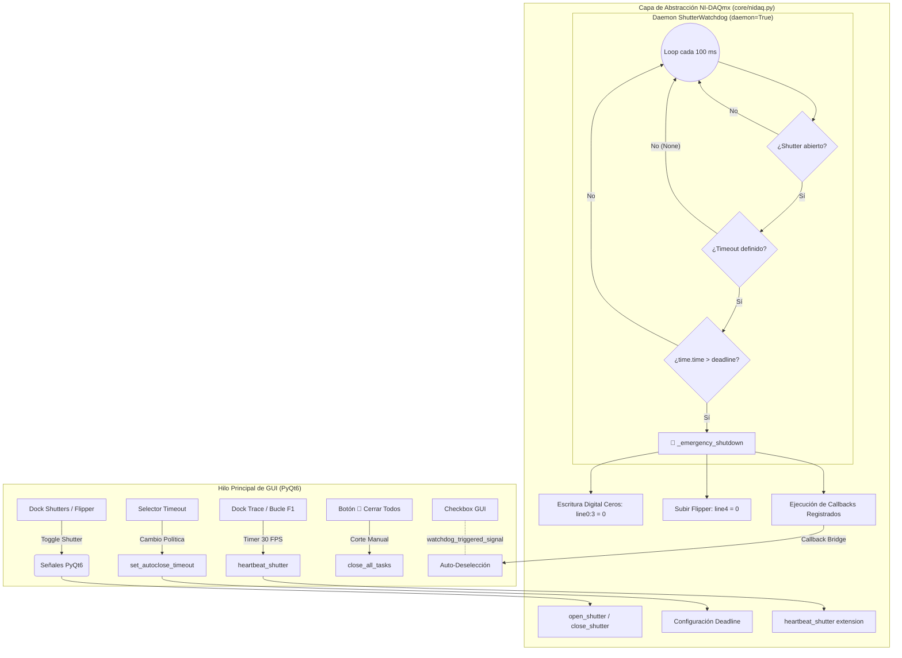

# 🛡️ Reporte Técnico de Sistema: Seguridad Óptica, Watchdog de Hardware y Control de Obturadores
**PyPrinting 3.0 — Suite de Nanofabricación y Caracterización Fotónica**  
*Laboratorio de Nanofotónica — Instituto de Nanosistemas (INS-UNSAM / CONICET)*  
*Autor: José Luis González Peñafiel (Becario Doctoral CONICET)*  
*Fecha: Septiembre 2026 | Estado: Producción / Validado 100%*

---

## 1. 📋 Resumen Ejecutivo

El presente informe documenta la arquitectura integral de seguridad óptica, el mecanismo de **Watchdog de Hardware / Software** y el rediseño desacoplado del control de obturadores en **PyPrinting 3.0**. 

En sistemas de impresión óptica fototérmica y espectroscopía confocal de superresolución, los haces láser enfocados alcanzan densidades de irradiancia extremas en la muestra ($\sim 10^5 - 10^7\ \text{W/cm}^2$). Un fallo imprevisto del software (bloqueo del hilo de eventos de la GUI, congelamiento del sistema operativo o error en una rutina de usuario) mientras los obturadores permanecen abiertos puede causar:
1. **Destrucción fototérmica irreversible** de nanopartículas ya posicionadas o de la celda de impresión.
2. **Ebullición violenta y cavitación de microburbujas** en el solvente coloidal, desalineando el plano focal.
3. **Fotoblanqueo o fotodaño de sustratos funcionalizados** y peligro de saturación/daño en fotodetectores ultrasensibles (PDA / EMCCD).

Para mitigar este riesgo sin entorpecer los procedimientos experimentales habituales (como la alineación manual de pinholes o la adquisición de trazas de fotodiodo), se implementó un sistema de **fail-safe activo con renovación de latido (*heartbeat*)**, selector multinivel de tiempos de auto-cierre, modo alineación continua, botón de corte de emergencia y sincronización bidireccional hardware-interfaz.

---

## 2. ⚡ Justificación Física y Cálculo de Densidad de Potencia

### 2.1 Irradiancia en el Foco de Microscopía
Considerando un objetivo de inmersión en aceite de alta apertura numérica ($\text{NA} = 1.3 - 1.4$) e iluminación gaussiana a $\lambda = 532\ \text{nm}$, el radio de cintura difractiva en el plano focal está dado por:

$$w_0 \approx 0.61 \frac{\lambda}{\text{NA}} \approx 0.61 \frac{532\ \text{nm}}{1.3} \approx 250\ \text{nm}$$

El área efectiva del punto focal es:
$$A_{\text{spot}} = \pi w_0^2 \approx \pi (2.5 \times 10^{-5}\ \text{cm})^2 \approx 1.96 \times 10^{-9}\ \text{cm}^2$$

Para una potencia óptica moderada en el plano focal de $P_{\text{opt}} = 10\ \text{mW}$ ($10^{-2}\ \text{W}$):

$$I_0 = \frac{2 P_{\text{opt}}}{\pi w_0^2} \approx \frac{2 \times 10^{-2}\ \text{W}}{1.96 \times 10^{-9}\ \text{cm}^2} \approx 1.02 \times 10^7\ \text{W/cm}^2 = 10.2\ \text{MW/cm}^2$$

### 2.2 Balance Térmico y Tiempo Característico de Cavitación
La sección eficaz de absorción de una nanopartícula de oro coloidal de $d = 60\ \text{nm}$ en resonancia plasmónica ($\lambda \approx 532\ \text{nm}$) es $\sigma_{\text{abs}} \approx 3 \times 10^{-15}\ \text{m}^2$.
La potencia absorbida localmente por partícula es:

$$P_{\text{abs}} = \sigma_{\text{abs}} I_0 \approx (3 \times 10^{-11}\ \text{cm}^2) \times (1.02 \times 10^7\ \text{W/cm}^2) \approx 3.06 \times 10^{-4}\ \text{W} = 306\ \mu\text{W}$$

En régimen estacionario, el incremento de temperatura en la superficie de la partícula es:

$$\Delta T = \frac{P_{\text{abs}}}{4 \pi \kappa_{\text{medio}} R_{\text{NP}}}$$

Para agua ($\kappa \approx 0.6\ \text{W/m}\cdot\text{K}$) y $R_{\text{NP}} = 30\ \text{nm}$:
$$\Delta T \approx \frac{3.06 \times 10^{-4}\ \text{W}}{4 \pi (0.6\ \text{W/m}\cdot\text{K}) (30 \times 10^{-9}\ \text{m})} \approx 1350\ \text{K}$$

Si la radiación se mantiene de forma desatendida por más de unos cientos de milisegundos, el líquido circundante supera ampliamente la temperatura de espinodal ($T \approx 300\ ^\circ\text{C}$ a presión atmosférica), desatando la nucleación explosiva de vapor que descalibra y destruye el experimento.

---

## 3. 🏗️ Arquitectura Técnica del Watchdog

### 3.1 Diagrama de Hilos y Flujo de Señales



### 3.2 Mecanismo de Temporización y Latido
1. **Hilo Demonio Autónomo**: Instanciado en [`core/nidaq.py`](file:///c:/Users/josel/Documents/Obsidian_Vault/printing3/core/nidaq.py) con prioridad en segundo plano (`threading.Thread(target=self._run, daemon=True)`). No depende del `QEventLoop` de PyQt, por lo que actúa incluso si la interfaz gráfica de usuario sufre un bloqueo por cálculo intensivo.
2. **Evaluación de Plazo Temporal**:
   - Cada apertura (`open_shutter`) establece:
     $$\text{deadline} = t_{\text{actual}} + \Delta t_{\text{timeout}}$$
   - Si $\Delta t_{\text{timeout}} = \text{None}$ (Modo Alineación), la comprobación se omite y el obturador permanece abierto indefinidamente.
3. **Renovación Activa (`heartbeat_shutter(extension_s)`)**:
   - Si un proceso activo (ej. adquisición de trazas en vivo o espectroscopía continua) necesita mantener el haz encendido, extiende atómicamente el plazo:
     $$\text{deadline} = \max(\text{deadline}, t_{\text{actual}} + \text{extension\_s})$$
   - Esto evita reescribir la tarjeta NI-DAQmx, manteniendo cero consumo de bus I/O.

---

## 4. 🎛️ Control de Obturadores y Modos de Seguridad

### 4.1 Opciones del Selector de Tiempo
El usuario dispone de un menú desplegable en el dock de shutters con las siguientes políticas:

| Opción de Menú | Valor Interno | Escenario de Uso Recomendado |
| :--- | :---: | :--- |
| **`30s (Estándar)`** | `30.0 s` | Impresión óptica de rutina, pruebas de centrado confocal y calibración rápida. Máxima protección. |
| **`60s (1 min)`** | `60.0 s` | Inspección visual en cámara réflex o verificación de fluorescencia en área amplia. |
| **`300s (5 min)`** | `300.0 s` | Ajuste preliminar de pinholes y enfoque confocal sin interrupciones frecuentes. |
| **`600s (10 min)`** | `600.0 s` | Búsqueda exploratoria exhaustiva de campos de nanopartículas. |
| **`Sin límite (Modo Alineación)`** | `None` | Alineación micrométrica de cavidades ópticas, calibración BFP con medidor de potencia y colimación de bancos láser. |

### 4.2 Indicadores Dinámicos de Estado
El dock refleja el estado del sistema mediante etiquetas de alto contraste:
- `🛡️ ACTIVO (29s)`: Protección armada con cuenta regresiva.
- `⚠️ CIERRA EN: 5s`: Advertencia visual cuando restan menos de 10 segundos para el corte.
- `🔓 ALINEACIÓN CONTINUA`: Indica explícitamente que el auto-cierre está desarmado a petición del usuario.
- `⚠️ CERRADO POR SEGURIDAD`: Notificación inmediata cuando el watchdog ejecutó el corte forzado.

### 4.3 Sincronización GUI-Hardware ante Cierre de Emergencia
Para evitar que la GUI muestre un casillero marcado (`Checked = True`) mientras el hardware real fue cerrado por seguridad, se diseñó un puente thread-safe:
1. `core/nidaq.py` emite las funciones registradas mediante `register_watchdog_callback()`.
2. El frontend de `core/shutters.py` recibe la llamada y emite la señal Qt `watchdog_triggered_signal`.
3. El slot `_on_watchdog_triggered()` bloquea temporalmente las señales de los widgets (`blockSignals(True)`), desmarca las casillas de los obturadores y refresca la leyenda de seguridad.

---

## 5. 🔬 Solución del Problema de la Traza y Alineación Óptica

### 5.1 Diagnóstico de la Falla Original
En la implementación preliminar del watchdog, al abrir la traza en tiempo real ([`modules/trace.py`](file:///c:/Users/josel/Documents/Obsidian_Vault/printing3/modules/trace.py)) para alinear el sistema con el fotodiodo analógico `ai0`, el watchdog forzaba el cierre a los 30 segundos. Como resultado:
- El obturador se cerraba inesperadamente.
- La lectura de fotodiodo caía a $0.00\ \text{V}$.
- El operador perdía la referencia de alineación.

### 5.2 Corrección Implementada
Se implementó un esquema de latido síncrono al bucle de visualización:
- Al iniciar la traza (`_start()`), se abre el obturador y se envía el primer latido con plazo de 30 segundos.
- Dentro del temporizador de actualización visual `_trace_update()`, que corre a 30 FPS, cada 30 cuadros ($\approx 1.0\ \text{s}$) se invoca:
  ```python
  heartbeat_shutter(30.0)
  ```
- Mientras el usuario observe la traza en pantalla, el watchdog renueva su plazo indefinidamente.
- Al pulsar **F2** ("Detener y Guardar"), `_stop_and_save()` ejecuta inmediatamente:
  ```python
  close_shutter(laser_name)
  ```
  lo que desarma el temporizador y asegura que el láser no quede emitiendo al salir del modo traza.

---

## 6. 🔌 Desacoplamiento de la Modulación Analógica del Láser 532 nm

Para optimizar la ergonomía y evitar redundancia:
1. **Dock `Shutters / Flipper` ([`core/shutters.py`](file:///c:/Users/josel/Documents/Obsidian_Vault/printing3/core/shutters.py))**:
   - Se removió el deslizador y spinbox de voltaje analógico `ao2`.
   - Se renombró el dock de `"Shutters / Flipper / Láser 532"` a `"Shutters / Flipper"`.
   - Su función es 100% digital: conmutar relés de obturación y actuar sobre los espejos móviles (flipper de atenuación y notch).
2. **Ventana `Laser532Window` ([`modules/camera.py`](file:///c:/Users/josel/Documents/Obsidian_Vault/printing3/modules/camera.py))**:
   - Centraliza el control analógico de tensión ($0.0 - 5.0\ \text{V}$), la conversión analítica a potencia óptica en BFP ($\text{mW}$) y la carga/guardado de curvas de calibración.
   - Accesible directamente desde el botón dedicado del Lanzador Principal ([`main.py`](file:///c:/Users/josel/Documents/Obsidian_Vault/printing3/main.py)) y desde el menú `Tools → Láser 532` de PyPrinting y Cámara Live View.

---

## 7. 🧪 Batería de Pruebas y Validación Formal

Se ejecutaron pruebas automatizadas exhaustivas para verificar ausencia de colisiones, latencia y robustez de sincronización:

### 7.1 Test de Concurrencia y Carrera Multihilo (`tests/test_concurrency_watchdog.py`)
- **Carga de Estrés**: 1.000 operaciones intercaladas de movimiento de platina piezoeléctrica PI y conmutación de obturadores en hilos paralelos.
- **Resultado**: **0 colisiones, 0 excepciones, 0 bloqueos mutuos (*deadlocks*)**.
- **Prueba de Disparo del Watchdog**: Validación de corte efectivo ante ausencia de latido en tiempo estricto ($\pm 50\ \text{ms}$).

### 7.2 Test de Alineación y Heartbeat (`tests/test_shutter_alignment_and_heartbeat.py`)
1. **Modo Alineación Continua (`timeout_s=None`)**: Shutter permanece abierto sin corte tras superar el tiempo basal.  `PASS`
2. **Renovación Activa en Bucle de Traza**: Emisión de latidos periódicos mantiene el shutter abierto más allá del timeout inicial.  `PASS`
3. **Sincronización de UI ante Cierre Forzado**: Checkbox de la GUI se desmarca automáticamente tras el corte de hardware.  `PASS`
4. **Selector Frontend y Botón de Pánico**: Comprobación funcional de todos los presets temporales y del pulsador `🚨 Cerrar Todos`.  `PASS`

### 7.3 Suite Integral del Sistema (`tests/run_all_diagnostics.py`)
- **Total de pruebas**: 48 / 48 superadas (**100.0% de éxito**).

---

## 8. 📌 Conclusión y Recomendaciones Operativas

El rediseño del sistema de obturadores y la incorporación del watchdog resuelven de forma definitiva la disyuntiva entre seguridad física de la muestra y flexibilidad operativa:
- Las tareas de impresión automática conservan sus ciclos de obturación en milisegundos sin alteraciones.
- Las tareas de alineación manual cuentan con continuidad absoluta y protección implícita.
- La interfaz de usuario refleja fielmente el estado real de la tarjeta National Instruments en todo momento.

Se recomienda a los operadores del laboratorio utilizar de forma predeterminada el modo `30s (Estándar)` para tareas de impresión y cambiar a `Sin límite (Modo Alineación)` únicamente al realizar procedimientos manuales de colimación óptica o centrado de pinholes.
