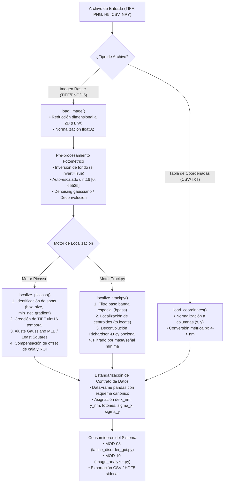

# SYS-105: Pipeline Unificado de Localización Super-Resolución y Procesamiento de Imágenes 🎯

**PyPrinting 3.0 / PySpectrum 3.0 — Suite de Nanofotónica y Control Instrumental**  
**Laboratorio de Nanofotónica — Instituto de Nanosistemas (INS-UNSAM / CONICET)**  
**Autor Principal:** José Luis González Peñafiel (*Becario Doctoral CONICET*)  
**Código del Documento:** `SYS-105` | **Eje Temático:** `[DAT] (Arquitectura de Datos, Procesamiento de Imágenes y Super-Resolución)`  
**Fecha de Emisión:** Septiembre 2026 | **Estado:** Aprobado / Producción  
**Módulos de Código Fuente:** `core/localization_pipeline.py`, `analysis/lattice_disorder_gui.py`, `analysis/image_analyzer.py`

---

## 🔗 Matriz de Referencias Cruzadas

* **Reportes de Sistema Conexos:**
  * `[[SYS-104_Matriz_Intercambio_Archivos_y_Formatos_IO]]`
  * `[[SYS-001_Estandares_Diseno_Arquitectura_PyPrinting3]]`
* **Fundamentos Científicos Asociados:**
  * `[[CAT-201_Deconvolucion_Optica_Richardson_Lucy_y_Tracking_Trackpy]]`
  * `[[CAT-202_Derivacion_Matematica_Cota_Cramer_Rao_Localizacion_Optica]]`
  * `[[CAT-204_Curacion_Fotometrica_Desacople_MultiGaussiano_Consistencia]]`
* **Manuales de Usuario de Módulos:**
  * `[[MOD-08_Analizador_Desorden_Redes_2D]]`
  * `[[MOD-10_Image_Analyzer_Tracking]]`

---

## 1. Resumen Ejecutivo

El módulo `core/localization_pipeline.py` constituye el **motor central desacoplado de ingestión, pre-procesamiento fotométrico y localización sub-píxel de super-resolución** de PyPrinting 3.0. Su propósito en la arquitectura del sistema es proveer una interfaz unificada, funcional y libre de dependencias de interfaz gráfica para extraer coordenadas de nanopartículas y fluoróforos a partir de imágenes confocales, de campo oscuro, de epifluorescencia o de archivos de coordenadas tabulares previamente procesados.

Este pipeline resuelve la duplicación histórica de código entre `lattice_disorder_gui.py` y `image_analyzer.py`, centralizando:
1. La carga universal multiformato (TIFF 16-bit, PNG, JPG, HDF5, CSV, TXT, NPY).
2. El auto-escalado dinámico a enteros sin signo de 16 bits (`uint16`) y la inversión fotométrica de fondo.
3. El enrutamiento transparente hacia motores de ajuste no lineal por Máxima Verosimilitud (**Picasso MLE**) o centroides por momentos de intensidad (**Trackpy**), integrando deconvolución previa por **Richardson-Lucy**.
4. La conversión unificada de unidades espaciales ($\text{píxeles} \leftrightarrow \text{nanómetros}$) bajo especificación estricta de incertidumbre metrológica.

---

## 2. Diagrama de Arquitectura del Pipeline

---

## 3. Especificación Funcional de Componentes

### 3.1 Carga Multiformato e Ingesta de Imágenes (`load_image`)

La función `load_image(file_path: str) -> np.ndarray` implementa una estrategia de carga escalonada que maneja anomalías de formato sin romper el flujo de adquisición:

* **Imágenes TIFF (`.tif`, `.tiff`)**: Leídas a través de `tifffile.imread()`. Preserva la profundidad radiométrica nativa de 16 bits (`uint16`) de los barridos confocales de PyPrinting 3.0.
* **Contenedores HDF5 (`.h5`, `.hdf5`)**: Inspecciona la raíz del archivo HDF5 y extrae el primer dataset bidimensional (`ndim == 2`) o tridimensional (`ndim == 3`) disponible (`[[CAT-401_Estandar_Serializacion_Jerarquica_Contenedor_HDF5]]`).
* **Formatos Raster Estándar (`.png`, `.jpg`, `.bmp`)**: Decodificados mediante PIL (`Pillow`). Si la imagen es RGB/RGBA, se convierte automáticamente a escala de grises mediante la ponderación fotométrica ITU-R BT.601:
  $$I_{\text{gray}} = 0.2989 R + 0.5870 G + 0.1140 B$$
* **Normalización Dimensional**: Todo array multidimensional es aplanado estrictamente a matriz 2D $(H, W)$ de tipo `np.float32`. Si se suministra una pila temporal o axial $(Z, H, W)$, se toma el primer plano representativo.

---

### 3.2 Ingesta y Normalización de Tablas de Coordenadas (`load_coordinates`)

Para flujos de trabajo donde la localización ya fue efectuada por software externo (ThunderSTORM, QuickPALM, Picasso Standalone):
* `load_coordinates(file_path: str) -> pd.DataFrame` detecta dinámicamente si el archivo es CSV, TSV, TXT plano o NumPy binario (`.npy`).
* Inspecciona las columnas y mapea variantes comunes (`['x', 'x [nm]', 'x_px', 'X', 'col']` $\implies$ `'x'`, `['y', 'y [nm]', 'y_px', 'Y', 'row']` $\implies$ `'y'`).
* Garantiza que el DataFrame retornado posea las columnas canónicas indexables `x` e `y`.

---

### 3.3 Motor Picasso: Máxima Verosimilitud Gaussiana (`localize_picasso`)

El motor **Picasso** (desarrollado por el grupo de Ralf Jungmann en MPI de Bioquímica) es el estándar internacional para microscopía de localización de molécula única (SMLM, DNA-PAINT).

#### Pasos de Ejecución en `core/localization_pipeline.py`:
1. **Normalización Radiométrica a uint16**: Picasso requiere estrictamente imágenes con enteros de 16 bits. La función mapea la imagen de entrada al rango $[0, 65535]$:
   $$I_{\text{u16}} = \left( \frac{I - I_{\text{min}}}{I_{\text{max}} - I_{\text{min}} + \epsilon} \times 65535 \right).\text{astype(np.uint16)}$$
2. **Buffer Temporal Seguro**: Escribe la matriz en un archivo temporal en disco (`tempfile.NamedTemporaryFile(suffix='.tif')`), permitiendo que el motor en C/Numba de Picasso consuma el archivo sin fugas de memoria.
3. **Identificación de Puntos Candidatos**:
   `picasso.localize.identify(image, min_net_gradient, box_size)` detecta máximos locales cuyo gradiente neto supera el umbral configurado por el usuario.
4. **Ajuste No Lineal por Máxima Verosimilitud (MLE)**:
   `picasso.localize.fit(image, spots, box_size, method='mle')` ajusta una PSF Gaussiana 2D simétrica con fondo plano:
   $$I(x, y) = B + \frac{N}{2\pi \sigma^2} \exp\left( -\frac{(x - x_0)^2 + (y - y_0)^2}{2\sigma^2} \right)$$
5. **Compensación de Offset de Caja y ROI**:
   Los ajustes devueltos por Picasso están referenciados a la esquina superior izquierda de cada caja de sub-región (`box_size`). El pipeline aplica la corrección cinemática rigurosa:
   $$x_{\text{global}} = x_{\text{picasso}} + x_{\text{offset\_ROI}}, \quad y_{\text{global}} = y_{\text{picasso}} + y_{\text{offset\_ROI}}$$
6. **Extracción de Incertidumbre Metrológica**: Extrae los parámetros de precisión de localización sub-píxel $(\sigma_x, \sigma_y)$ que saturan la Cota de Cramér-Rao (`[[CAT-202_Derivacion_Matematica_Cota_Cramer_Rao_Localizacion_Optica]]`).

---

### 3.4 Motor Trackpy: Centroides Ponderados y Deconvolución (`localize_trackpy`)

Para muestras donde las nanopartículas presentan tamaños variables o no satisfacen la aproximación Gaussiana pura:
1. **Pre-procesamiento con Deconvolución Richardson-Lucy (Opcional)**:
   Si el parámetro `deconvolve=True`, la imagen se deconvoluciona previamente mediante `skimage.restoration.richardson_lucy(img, psf, num_iter=15)`, contrayendo los lóbulos de difracción de Airy y mejorando la separabilidad de nanopartículas en redes densas (`[[CAT-201_Deconvolucion_Optica_Richardson_Lucy_y_Tracking_Trackpy]]`).
2. **Filtrado Bandpass Espacial (`tp.bandpass`)**:
   Elimina fluctuaciones de fondo de baja frecuencia espacial y ruido de disparo de alta frecuencia píxel a píxel.
3. **Localización de Centroides (`tp.locate`)**:
   Determina la posición sub-píxel mediante el cálculo de momentos de intensidad en la vecindad del máximo:
   $$x_c = \frac{\sum_{i} x_i I_i}{\sum_i I_i}, \quad y_c = \frac{\sum_i y_i I_i}{\sum_i I_i}$$
4. **Filtrado por Masa y Excentricidad**: Poda artefactos espurios exigiendo una masa integrada mínima (`min_mass`) y una relación de aspecto acotada.

---

## 4. Contrato Canónico de Datos de Salida

El DataFrame retornado por `run_localization(...)` cumple con el siguiente esquema formal:

| Columna | Tipo de Dato | Unidades | Descripción y Significado Físico |
|---|:---:|:---:|---|
| **`x`** / **`x_px`** | `float64` | $\text{píxeles}$ | Coordenada horizontal sub-píxel en el sistema de la imagen. |
| **`y`** / **`y_px`** | `float64` | $\text{píxeles}$ | Coordenada vertical sub-píxel en el sistema de la imagen. |
| **`x_nm`** | `float64` | $\text{nm}$ | Posición métrica calibrada: $x_{\text{nm}} = x_{\text{px}} \times \text{pixel\_size\_nm}$. |
| **`y_nm`** | `float64` | $\text{nm}$ | Posición métrica calibrada: $y_{\text{nm}} = y_{\text{px}} \times \text{pixel\_size\_nm}$. |
| **`photons`** / **`mass`** | `float64` | cuentas / fotones | Fotometría integrada del emisor (volumen Gaussiano o suma de cuentas). |
| **`bg`** | `float64` | cuentas / px | Nivel de fondo local estimado en la vecindad inmediata del spot. |
| **`lpx`** / **`sx`** | `float64` | $\text{píxeles}$ | Incertidumbre de localización estimada en X (ancho $\sigma_x$ o cota CRLB). |
| **`lpy`** / **`sy`** | `float64` | $\text{píxeles}$ | Incertidumbre de localización estimada en Y (ancho $\sigma_y$ o cota CRLB). |
| **`net_gradient`** | `float64` | cuentas | Contraste local respecto al fondo (específico de Picasso). |

---

## 5. Tolerancia a Fallos y Degradación Elegante

El módulo implementa mecanismos de control de excepciones que evitan el colapso del software ante fallas de entorno:
* Si la biblioteca externa `picasso` o `trackpy` no se encuentra instalada en el entorno virtual activo (`ImportError`), el pipeline captura la excepción y ofrece un fallback automático hacia el motor alternativo disponible.
* Si el archivo temporal de TIFF de Picasso falla en su creación o limpieza, se garantiza el cierre y liberación del handle mediante bloques `finally: os.remove(...)`.
* Si una ROI seleccionada no contiene ningún emisor que supere los umbrales configurados, se retorna un DataFrame vacío con las columnas del contrato formal, impidiendo errores de tipo `KeyError` o `IndexError` en los módulos consumidores aguas abajo.
