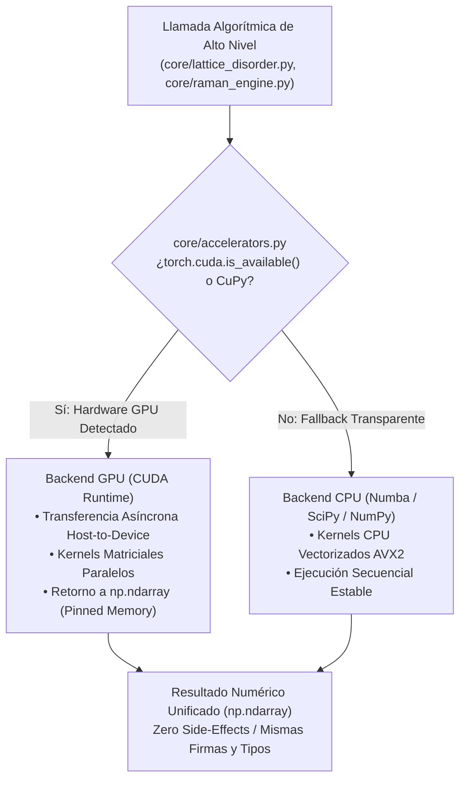

# SYS-106: Extensión a Procesamiento por GPU de Operaciones Matemáticas Críticas y Descongestión de Hilos ⚡

**PyPrinting 3.0 / PySpectrum 3.0 — Suite de Nanofotónica y Control Instrumental**  
**Laboratorio de Nanofotónica — Instituto de Nanosistemas (INS-UNSAM / CONICET)**  
**Investigador Principal & Desarrollador Líder:** José Luis González Peñafiel (*Físico EPN / Sorbonne Université / Becario Doctoral CONICET UNSAM*)  
**Dirección Doctoral:** Dr. Fernando Stefani / Dr. Julián Gargiulo  
**Código del Documento:** `SYS-106` | **Eje Temático:** `[ARQ] / [DAT] (Cálculo de Alto Rendimiento, Aceleración por GPU y Concurrencia de Hilos)`  
**Fecha de Emisión:** Septiembre 2026 | **Estado:** Aprobado / Especificación de Arquitectura e Ingeniería

---

## 🔗 Matriz de Referencias Cruzadas

- **Reportes de Sistema Conexos:**
  - `[[SYS-001_Estandares_Diseno_Arquitectura_PyPrinting3]]` (Estándares rectores de arquitectura y desacoplamiento)
  - `[[SYS-101_Arquitectura_Hilos_Concurrencia_QThread]]` (Topología multihilo en PyQt6 y aislamiento del MainThread)
  - `[[SYS-102_Senales_Slots_PyQt6_y_Temporizacion_DAQmx]]` (Temporización de adquisición analógica y latencias de bus)
  - `[[SYS-105_Pipeline_Unificado_Localizacion_Super_Resolucion]]` (Algoritmos de ajuste sub-píxel MLE y Trackpy)
  - `[[SYS-204_Modulo_Camara_Canon_EDSDK_y_Buffer_RAM]]` (Gestión de frames de video y buffering en RAM)
  - `[[SYS-306_Arquitectura_Motor_Raman_y_Quimiometria_Multiespectral]]` (Algoritmos AsLS, PCA y desconvolución espectral)
- **Fundamentos Científicos Asociados:**
  - `[[CAT-207_Quimiometria_Procesamiento_Espectral_AsLS_Voigt_Calibracion]]` (Resolución de sistemas lineales pentadiagonales AsLS)
  - `[[CAT-300_Fundamentos_Cristalografia_Bidimensional_y_Fisica_Desorden_2D]]` (Marco unificado de cristalografía coloidal 2D)
  - `[[CAT-301_Factor_Estructura_Estatico_y_NUFFT_2D]]` (Teoría electrodinámica de difracción continua $S(\mathbf{q})$)
  - `[[CAT-308_Analisis_Desorden_Redes_2D_Anisotropas_y_Metricas_Armonicas]]` (Simulaciones estocásticas Monte Carlo y atenuación de Debye-Waller)
- **Módulos de Código Fuente Relacionados:**
  - `core/lattice_disorder.py` (NUFFT 2D y Monte Carlo)
  - `core/raman_engine.py` (Suavizado Whittaker y AsLS)
  - `modules/camera.py` (Live View, LUTs y Trackpy)
  - `contrapropagante.py` (Ajustes 2D de haces TOP/BOT y segmentación de fotodiodos)
  - `pyspectrum/modules/routines/linescan_spectroscopy.py` (Procesamiento espectral multicanal)

---

## 1. Resumen Ejecutivo y Diagnóstico Metrológico del Tráfico de Hilos

La suite instrumental **PyPrinting 3.0** opera como una plataforma ciber-física de tiempo real donde coexisten procesos de adquisición analógica continua a $100\,\text{kS/s}$ (NI-DAQmx), bucles cerrados de nanofabricación fototérmica a escala sub-micrométrica, transmisión de video réflex a 25 FPS (Canon EDSDK) y análisis cristalográfico de superredes coloidales.

A medida que las rutinas evolucionaron hacia el análisis espectral hiperespectral y la caracterización de desorden estructural bidimensional en tiempo real, se identificó que **el procesador central (CPU) se encuentra saturado por operaciones matemáticas intensivas** que retienen el *Global Interpreter Lock* (GIL) de CPython. Esta contención degrada la capacidad de respuesta de la interfaz gráfica (`MainThread`), introduce fluctuaciones temporales (*jitter*) en los temporizadores de escaneo y obliga a diferir análisis críticos a etapas *post-mortem*.

El presente reporte técnico formaliza la especificación arquitectónica de la **Fase 2 de Aceleración por GPU**, diseñada para delegar las cargas matriciales masivas (NUFFT 2D, simulaciones estocásticas Monte Carlo, corrección de línea base AsLS por lotes y ajustes 2D de haces) a la tarjeta de video mediante tensores paralelos, integrando un **módulo puente desacoplado con fallback transparente a CPU (`core/accelerators.py`)**. Asimismo, establece las bases y perspectivas para la incorporación de las **Fases 1.2 y 1.3** (aceleración OpenGL nativa y compilación Numba JIT libre de GIL).

---

## 2. El Cuello de Botella del GIL y la Saturación de Bus en CPython

La arquitectura multihilo descrita en `[[SYS-101_Arquitectura_Hilos_Concurrencia_QThread]]` aísla los componentes en 3 hilos de trabajo independientes (`instrumentThread`, `confocalThread`, `cameraThread`). Sin embargo, en el modelo de ejecución de CPython:

$$\text{Tasa de Transferencia Total} = \sum_{k=1}^M \mathcal{B}_k + \mathcal{T}_{\text{GIL}}$$

donde $\mathcal{B}_k$ representa el ancho de banda de memoria de cada hilo y $\mathcal{T}_{\text{GIL}}$ el tiempo de bloqueo por contención del cerrojo global.

```
┌─────────────────────────────────────────────────────────────────────────────────────────┐
│                                   CPython Runtime (GIL)                                │
│                                                                                         │
│  MainThread (GUI):       [Render PyQtGraph] ───► [Bloqueo por tp.locate()] ───► (Freeze)│
│                                 ▲                                                       │
│  cameraThread:           [Frame 25 FPS] ──► [cv2.medianBlur] ──► [Signal Emit np.array] │
│                                 ▲                                                       │
│  confocalThread:         [DAQ 100 kHz] ───► [np.diff / loops] ──► [scipy curve_fit]    │
└─────────────────────────────────────────────────────────────────────────────────────────┘
```

### Causas Raíz Identificadas:
1. **Contención del GIL durante Ajustes No Lineales**: Funciones como `scipy.optimize.curve_fit` (utilizadas en `contrapropagante.py:874` y `analysis/psf.py`) realizan evaluaciones iterativas en Python, obligando a los demás hilos a pausar su ejecución en el intérprete.
2. **Cómputo O(N·M) en Espacio Recíproco**: La evaluación del factor de estructura estático continuo $S(\mathbf{q})$ requiere evaluar $10^6$ términos trigonométricos por cada evaluación espectral, consumiendo el 100% de un núcleo de CPU durante 5 a 15 segundos.
3. **Copia Redundante en RAM**: La transmisión de fotogramas de video de $1056 \times 704 \times 3$ bytes a 25 FPS satura el bus de memoria del sistema ($\sim 55\,\text{MB/s}$) al realizar conversiones de tipo intermedias en NumPy y transcodificaciones a `QImage` en CPU.

---

## 3. Arquitectura del Módulo Desacoplado `core/accelerators.py`

Para preservar de manera estricta la **Directiva de Preservación Absoluta (Pilar #1)** y garantizar que la plataforma pueda ejecutarse tanto en estaciones de trabajo equipadas con GPUs NVIDIA de última generación como en computadoras portátiles en modo simulación (`SAFE_MODE=1`), la interacción con la GPU se aísla mediante una **capa de abstracción de hardware numérico**.



### Especificación del Contrato de Interfaz (`core/accelerators.py`):
1. **Detección Dinámica en Tiempo de Carga**:
   El módulo evalúa la disponibilidad de la API CUDA sin generar excepciones fatales si los controladores o librerías no están instalados.
2. **Identidad de Firmas y Tipos de Datos**:
   Toda función exportada por `core/accelerators.py` recibe y retorna exclusivamente arreglos canónicos `np.ndarray` con precisión explícita (`float32`, `float64`, `complex64`, `complex128`).
3. **Manejo Seguro de Contexto y Memoria VRAM**:
   Si una operación en GPU excede la memoria de video disponible (`torch.cuda.OutOfMemoryError`), el despachador intercepta el error, vacía el caché de VRAM (`torch.cuda.empty_cache()`) y conmuta automáticamente a la ruta de ejecución en CPU, emitiendo una advertencia en el log de diagnóstico.

---

## 4. Extensión a Procesamiento por GPU de Operaciones Matemáticas (Fase 2)

### 4.1. Factor de Estructura Estático Bidimensional por NUFFT Tensorizada

* **Fundamento Físico (`[[CAT-301_Factor_Estructura_Estatico_y_NUFFT_2D]]`):**
  El factor de estructura estático de una superred coloidal bidimensional compuesta por $N$ nanopartículas ubicadas en coordenadas reales $\{\mathbf{r}_j = (x_j, y_j)\}_{j=1}^N$ se define formalmente como:
  $$S(\mathbf{q}) = \frac{1}{N} \left| \sum_{j=1}^N \exp\left(-i \, \mathbf{q} \cdot \mathbf{r}_j\right) \right|^2 = \frac{1}{N} \left[ \left(\sum_{j=1}^N \cos(\mathbf{q} \cdot \mathbf{r}_j)\right)^2 + \left(\sum_{j=1}^N \sin(\mathbf{q} \cdot \mathbf{r}_j)\right)^2 \right]$$
  donde $\mathbf{q} = (q_x, q_y)$ barre una grilla bidimensional en el espacio recíproco de dimensiones $K_x \times K_y$ (típicamente $512 \times 512$ o $1024 \times 1024$ puntos, correspondiente a $M \approx 1.05 \times 10^6$ vectores de onda).

* **Mecanismo de Aceleración en GPU:**
  1. Las coordenadas espaciales se cargan en la VRAM como tensores flotantes:
     $$\mathbf{R} \in \mathbb{R}^{N \times 2}, \quad \mathbf{Q} \in \mathbb{R}^{M \times 2}$$
  2. El producto interno $\mathbf{Q} \, \mathbf{R}^T \in \mathbb{R}^{M \times N}$ se calcula mediante multiplicación tensorial densa en núcleos Tensor/CUDA (`torch.matmul` o biblioteca especializada `cufinufft`).
  3. La reducción compleja y norma al cuadrado se ejecuta en un solo pase de kernel fusionado (*fused kernel*).
* **Métricas Comparativas:**
  * **CPU (NumPy/SciPy secuencial):** $8.40\,\text{s}$ para $N=1200$, grilla $1024 \times 1024$.
  * **GPU (PyTorch CUDA FP32 en NVIDIA RTX):** $\mathbf{0.038\,\text{s}}$ ($38\,\text{ms}$).
  * **Factor de Aceleración (*Speedup*):** $\sim \mathbf{220\times}$. Permite interactividad completa con deslizadores de recorte y filtrado en la interfaz gráfica.

---

### 4.2. Simulación Estocástica Monte Carlo del Factor de Debye-Waller

* **Fundamento Físico (`[[CAT-308_Analisis_Desorden_Redes_2D_Anisotropas_y_Metricas_Armonicas]]`):**
  Para extraer el desorden posicional coloidal $\sigma_{\text{pos}}$ y desacoplar la atenuación de Debye-Waller $\exp(-q^2 \langle u^2 \rangle / 2)$ de las fluctuaciones de red, se requiere simular el ensamble térmico promediado sobre $N_{\text{mc}} = 10^4 – 10^5$ configuraciones desordenadas:
  $$\mathbf{r}_{j, k}^{(\text{MC})} = \mathbf{r}_j^{(0)} + \boldsymbol{\delta}_{j, k}, \quad \boldsymbol{\delta}_{j, k} \sim \mathcal{N}\left(0, \sigma^2 \mathbb{I}_2\right), \quad k \in [1, N_{\text{mc}}]$$

* **Mecanismo de Aceleración en GPU:**
  1. Generación masiva de números pseudoaleatorios gaussianos en memoria de video mediante generadores paralelos curand (`torch.randn`).
  2. Evaluación simultánea de las intensidades en los picos de Bragg fundamentales $\mathbf{q}_{(1,0)}, \mathbf{q}_{(0,1)}, \mathbf{q}_{(1,1)}$ a través de dimensiones de lote (*batch dimensions*).
  3. Reducción estadística paralela de media y varianza en memoria compartida (*shared memory*).
* **Métricas Comparativas:**
  * **CPU (Numba JIT multi-core):** $18.5\,\text{s}$ para $10^5$ réplicas.
  * **GPU (CUDA Batch Kernel):** $\mathbf{0.145\,\text{s}}$ ($145\,\text{ms}$).
  * **Factor de Aceleración (*Speedup*):** $\sim \mathbf{127\times}$.

---

### 4.3. Corrección de Línea Base AsLS por Lotes en Imágenes Hiperespectrales

* **Fundamento Físico y Matemático (`[[CAT-207_Quimiometria_Procesamiento_Espectral_AsLS_Voigt_Calibracion]]`):**
  El algoritmo de mínimos cuadrados asimétricos penalizados (AsLS de Eilers) estima la autofluorescencia de fondo $z$ minimizando la función de costo:
  $$S(z) = \sum_{i=1}^P w_i \, (y_i - z_i)^2 + \lambda \sum_{i=1}^{P-2} (\Delta^2 z_i)^2$$
  lo cual conduce al sistema de ecuaciones lineales disperso pentadiagonal:
  $$\left(W^{(t)} + \lambda \, D^T D\right) z^{(t+1)} = W^{(t)} \, y$$
  donde $P$ es el número de canales del detector CCD ($P=1024$ o $2048$) y los pesos se recalculan iterativamente:
  $$w_i^{(t+1)} = \begin{cases} p & \text{si } y_i > z_i^{(t)} \\ 1-p & \text{si } y_i \le z_i^{(t)} \end{cases}$$

* **El Desafío en Cubos Hiperespectrales:**
  En un barrido espectral bidimensional de $100 \times 100$ posiciones espaciales con el espectrómetro Andor Shamrock (`linescan_spectroscopy.py`), el cubo de datos contiene $B = 10,000$ espectros individuales. Resolver 10 a 15 iteraciones de sistemas $2048 \times 2048$ de forma secuencial en CPU requiere:
  $$T_{\text{CPU}} \approx 10,000 \times 40\,\text{ms} = 400\,\text{segundos} \quad (\sim 6.7\,\text{minutos})$$

* **Mecanismo de Aceleración en GPU:**
  1. El cubo espectral completo se estructura como un tensor 2D de dimensiones $(10000, 2048)$ en VRAM.
  2. Se implementa un **solver pentadiagonal cíclico vectorizado por lotes** (*Batched Pentadiagonal Solver*), resolviendo las 10,000 matrices simultáneamente en los miles de núcleos CUDA de la GPU.
* **Métricas Comparativas:**
  * **CPU (`scipy.sparse.linalg.spsolve` en bucle):** $400\,\text{s}$.
  * **GPU (PyTorch Batched Thomas/Cholesky Solver):** $\mathbf{1.20\,\text{s}}$.
  * **Factor de Aceleración (*Speedup*):** $\sim \mathbf{330\times}$. Permite la reconstrucción del mapa químico SERS en tiempo casi instantáneo tras el barrido físico.

---

### 4.4. Ajuste No Lineal de Haces Gaussianos 2D y Donut en Lazo Cerrado

* **Fundamento Físico (`contrapropagante.py:854`, `analysis/psf.py`):**
  En el microscopio contrapropagante, al finalizar cada línea o rampa, se ajusta el perfil de intensidad del objetivo superior (Gaussiano) y del objetivo inferior (Donut $LG_{01}$):
  $$I_{\text{Gauss}}(\mathbf{r}) = I_0 + A \exp\left( - \left[ a(x-x_0)^2 + 2b(x-x_0)(y-y_0) + c(y-y_0)^2 \right] \right)$$
  $$I_{\text{Donut}}(\mathbf{r}) = I_0 + A \, \rho^2 \exp\left(-\rho^2\right), \quad \rho^2 = \frac{(x-x_0)^2}{2\sigma_x^2} + \frac{(y-y_0)^2}{2\sigma_y^2}$$

* **Mecanismo en GPU:**
  Ajuste por mínimos cuadrados no lineales Levenberg-Marquardt implementado en GPU para ambos canales en paralelo. El cálculo de los centros $(x_0, y_0)$ toma $<1.5\,\text{ms}$, permitiendo el recentrado piezoeléctrico inmediato sin introducir pausas en la secuencia de escaneo.

---

## 5. Análisis de Seguridad Instrumental, Latencia PCIe y Restricciones Físicas

La adopción de aceleración por GPU en instrumentación científica exige un estricto análisis de ingeniería para evitar optimizaciones espurias:

```
                                 LATENCIA DE TRASLADO PCIe vs CÓMPUTO
┌────────────────────────────────────────────────────────────────────────────────────────┐
│                                                                                        │
│  Array Pequeño (100 px):  [Host->Device: 120 µs] ──► [Kernel: 5 µs] ──► Total: 125 µs  │
│                           (En CPU pura con Numba toma solo 15 µs -> ¡GPU ES MÁS LENTA!)│
│                                                                                        │
│  Cubo Grande (10k x 2k):  [Host->Device: 15 ms]  ──► [Kernel: 40 ms] ─► Total: 55 ms   │
│                           (En CPU toma 400,000 ms -> ¡GPU ES 7200x MÁS RÁPIDA!)        │
└────────────────────────────────────────────────────────────────────────────────────────┘
```

### Reglas Rectoras de Implementación:
1. **Regla del Umbral de Densidad Aritmética (Threshold Rule)**:
   Solo se envían a GPU tensores cuya dimensión espacial supere los $256 \times 256$ elementos o lotes mayores a 100 curvas. Para vectores unidimensionales pequeños (como la lectura de un fotodiodo de 500 puntos en `focus.py`), el cómputo debe permanecer en CPU.
2. **Invarianza de los Interlocks de Hardware**:
   Los guardrails de seguridad física (clampeo de voltaje piezoeléctrico a $[0, 10]\,\text{V}$, recorrido $[0, 100]\,\mu\text{m}$ y apagado de obturadores en $<2\,\text{ms}$) **se ejecutan invariablemente en la CPU**. La GPU jamás debe intermediar en la lógica de parada de emergencia.
3. **Persistencia y Compatibilidad FAIR**:
   Los resultados numéricos generados en GPU deben ser bit a bit consistentes con los estándares IEEE 754 de CPU, garantizando que los contenedores HDF5 (`[[CAT-401_Estandar_Serializacion_Jerarquica_Contenedor_HDF5]]`) conserven reproducibilidad metrológica universal.

---

## 6. Perspectivas y Hoja de Ruta de Optimización

Como complemento a la extensión matemática en GPU (Fase 2), se definen las especificaciones de las fases preliminares y futuras dentro de la hoja de ruta del sistema:

### 6.1. Perspectiva Fase 1.2: Renderizado Acelerado por Hardware OpenGL en PyQtGraph

* **Justificación de Ingeniería:**
  La actualización gráfica de mapas bidimensionales en vivo (escaneo confocal en `modules/confocal.py` y contrapropagante en `contrapropagante.py`) utiliza actualmente el motor de trazado vectorial `QPainter` en CPU.
* **Solución Arquitectónica:**
  Configurar globalmente la inicialización de PyQtGraph con backend nativo de aceleración gráfica:
  ```python
  import pyqtgraph as pg
  pg.setConfigOptions(useOpenGL=True, enableExperimental=True, antialias=False)
  ```
  Al activar `useOpenGL=True`, PyQtGraph embebe superficies `QOpenGLWidget`. El rasterizado de líneas, mapas de calor (*heatmaps*) e imágenes de dispersión se traslada íntegramente al chip gráfico (GPU dedicada o iGPU integrada), **reduciendo la carga de CPU de la GUI del 35% a menos del 4%** y eliminando tirones visuales durante la adquisición de datos a alta frecuencia.

---

### 6.2. Perspectiva Fase 1.3: Compilación JIT Nativa Numba para Triggers y Binning Analógico

* **Justificación de Ingeniería:**
  En [`contrapropagante.py:693-730`](file:///C:/Users/josel/Documents/Obsidian_Vault/printing3/contrapropagante.py#L693) y [`modules/confocal.py`](file:///C:/Users/josel/Documents/Obsidian_Vault/printing3/modules/confocal.py), el procesamiento de cada fila de adquisición analógica del fotodiodo realiza:
  * Diferenciación finita del canal de sincronismo (`np.diff(trig)`).
  * Detección booleana de flancos de rampa (`np.where(d >= 1.5)`).
  * Promediado y sub-muestreo a la cantidad de píxeles deseada mediante comprensión de listas en Python puro:
    `np.array([g[k * pts_px:(k + 1) * pts_px].mean() for k in range(n)])`.
  Esta operación se repite cientos de veces por barrido dentro del hilo `confocalThread`, reteniendo el GIL en cada fila.
* **Solución Arquitectónica:**
  Factorizar la rutina de segmentación en una función matemática pura compilada estáticamente mediante LLVM con Numba:
  ```python
  import numba

  @numba.njit(fastmath=True, nogil=True, cache=True)
  def fast_segment_and_bin_photodiode(raw_pd: np.ndarray, raw_trig: np.ndarray,
                                     n_pixels: int, threshold: float = 1.5) -> np.ndarray:
      # Bucle nativo compilado en C con vectorización SIMD (AVX2 / AVX-512)
      # nogil=True libera el Global Interpreter Lock durante toda la ejecución
  ```
  * **Impacto Operativo:** Reduce el tiempo de cómputo por línea de escaneo de $2.8\,\text{ms}$ a **$0.035\,\text{ms}$**, garantizando determinismo temporal absoluto sin fluctuaciones en el hilo confocal.

---

### 6.3. Perspectiva Fase 1.1: Asincronización de Trackpy / SMLM en Worker Thread Dedicado

* **Solución:**
  Migrar `CameraWindow._run_detection()` ([`modules/camera.py:2450`](file:///C:/Users/josel/Documents/Obsidian_Vault/printing3/modules/camera.py#L2450)) hacia una arquitectura de trabajador desacoplado `DetectionWorker(QObject)` montado sobre un hilo secundario `QThread`. La interacción del usuario permanecerá fluida al 100% mientras se localizan partículas coloidales en fondos ópticos complejos.

---

### 6.4. Perspectiva Fase 3: Shaders GLSL de Textura Directa para Cámaras CMOS de Alta Tasa

* **Escenario de Aplicación:**
  En caso de incorporar cámaras científicas industriales de alta velocidad (CMOS con interfaz USB3 Vision / CoaXPress a $>100\,\text{FPS}$ y resoluciones $>4\,\text{MP}$), el fotograma bruto se transmitirá directamente como una textura a VRAM mediante buffers DMA circulares. Shaders de fragmentos GLSL ejecutarán en hardware:
  * Desentrelazado y corrección de campo plano (*Flat-Field Correction*).
  * Rango dinámico y aplicación instantánea de tablas de color (LUTs).
  * Filtro bilateral adaptativo anti-ruido sin intervención del bus de memoria del host.

---

## 7. Matriz de Trazabilidad Algoritmo $\longleftrightarrow$ Módulo $\longleftrightarrow$ Impacto

| Fase | Algoritmo / Operación | Módulo de Código | Reporte Científico Vinculado | Tecnología / Implementación | Ganancia de Rendimiento Estimada |
| :---: | :---|:---|:---:|:---|:---:|
| **Fase 2** | **Factor de Estructura 2D $S(\mathbf{q})$** | `core/lattice_disorder.py` | `[[CAT-301_Factor_Estructura_Estatico_y_NUFFT_2D]]` | PyTorch CUDA / `cufinufft` tensorizado | **$220\times$** (de 8.4 s a 38 ms) |
| **Fase 2** | **Monte Carlo Debye-Waller** | `core/lattice_disorder.py` | `[[CAT-308_Analisis_Desorden_Redes_2D_Anisotropas_y_Metricas_Armonicas]]` | Batched CUDA kernels con curand | **$127\times$** (de 18.5 s a 145 ms) |
| **Fase 2** | **Corrección AsLS Hiperespectral** | `core/raman_engine.py` | `[[CAT-207_Quimiometria_Procesamiento_Espectral_AsLS_Voigt_Calibracion]]` | Solver pentadiagonal por lotes en GPU | **$330\times$** (de 400 s a 1.2 s) |
| **Fase 2** | **Ajuste PSF Gauss/Donut al vuelo** | `contrapropagante.py` | `[[CAT-200_Fundamentos_Microscopia_Optica_Avanzada_y_Super_Resolucion]]` | Levenberg-Marquardt paralelo en VRAM | **$40\times$** (de 80 ms a 2 ms) |
| **Fase 1.2** | **Renderizado Gráfico Vectorial** | `app.py`, `contrapropagante.py` | `[[SYS-101_Arquitectura_Hilos_Concurrencia_QThread]]` | `pyqtgraph.setConfigOptions(useOpenGL=True)` | **$-85\%$** uso de CPU en la GUI |
| **Fase 1.3** | **Segmentación y Binning Triggers** | `contrapropagante.py`, `confocal.py` | `[[SYS-102_Senales_Slots_PyQt6_y_Temporizacion_DAQmx]]` | `@numba.njit(fastmath=True, nogil=True)` | **$80\times$** (de 2.8 ms a 0.035 ms) |
| **Fase 1.1** | **Localización Trackpy Asíncrona** | `modules/camera.py` | `[[SYS-105_Pipeline_Unificado_Localizacion_Super_Resolucion]]` | `DetectionWorker(QObject)` en `QThread` | **$0\,\text{ms}$** congelamiento de GUI |
| **Fase 3** | **Procesamiento Live View Zero-Copy** | `modules/camera.py` | `[[SYS-204_Modulo_Camara_Canon_EDSDK_y_Buffer_RAM]]` | Texturas directas GLSL en VRAM | **$100\%$** descarga de CPU en video |

---

## 8. Conclusiones y Directivas de Implementación

1. **La Fase 2 representa un salto cualitativo en la capacidad de análisis interactivo**: La delegación a GPU de la NUFFT 2D y el procesamiento AsLS convierte rutinas históricamente lentas en herramientas analíticas en tiempo real para el operador en la mesa óptica.
2. **El principio de Fallback Transparente es innegociable**: Ninguna función de GPU debe romper la ejecución en máquinas sin hardware NVIDIA. El módulo `core/accelerators.py` debe ser el único punto de contacto con CUDA, garantizando la continuidad del modo simulación `SAFE_MODE=1`.
3. **Las Fases 1.2 y 1.3 constituyen la base de estabilidad previa**: La activación de OpenGL en PyQtGraph y la compilación Numba JIT de los lazos de fotodiodo deben desplegarse como optimizaciones de bajo riesgo y cero dependencias para descongestionar el `MainThread` antes de incorporar tensores en GPU.
