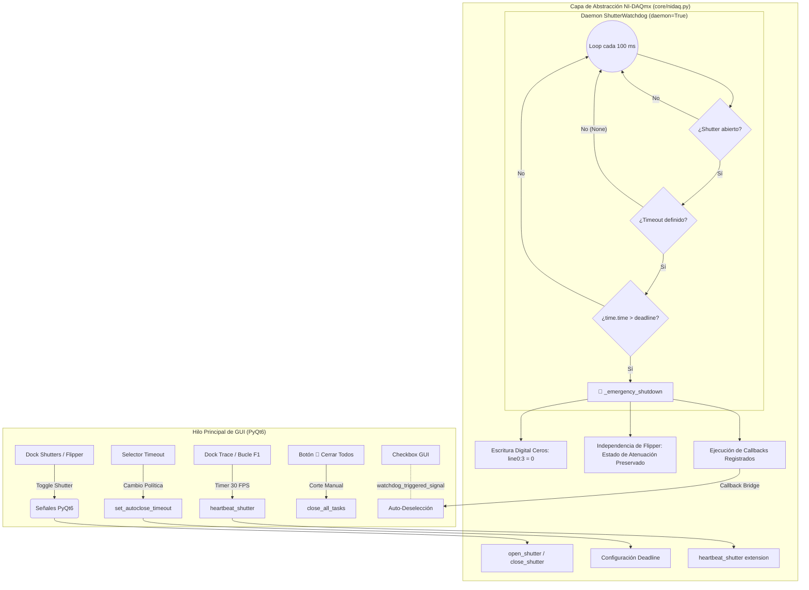

# SYS-201: Seguridad Óptica Activa, Watchdog por Heartbeat y Obturadores 🛡️

**PyPrinting 3.0 / PySpectrum 3.0 — Suite de Nanofotónica y Control Instrumental**  
**Laboratorio de Nanofotónica — Instituto de Nanosistemas (INS-UNSAM / CONICET)**  
**Autor Principal:** José Luis González Peñafiel (*Becario Doctoral CONICET*)  
**Código del Documento:** `SYS-201` | **Eje Temático:** `[SEG] (Seguridad Hardware y Enclavamientos Fail-Safe)`  
**Fecha de Emisión:** Septiembre 2026 | **Estado:** Aprobado / Producción

---

## 🔗 Matriz de Referencias Cruzadas

- **Reportes de Sistema Conexos:**
  - `[[SYS-101_Arquitectura_Hilos_Concurrencia_QThread]]`
  - `[[SYS-102_Senales_Slots_PyQt6_y_Temporizacion_DAQmx]]`
  - `[[SYS-202_Actuacion_Flipper_y_Ciclo_Vida_DAQmx]]`
  - `[[SYS-203_Control_Comunicaciones_Laseres_RS232_SCPI]]`
  - `[[SYS-205_Resiliencia_Platina_PI_y_Tolerancia_Fallas]]`
- **Fundamentos Científicos Asociados:**
  - `[[CAT-101_Protocolo_Operativo_Impresion_Fototermica_Grillas_2D]]`
  - `[[CAT-107_Cinetica_Captura_Fotodiodo_Time_Volt_Filtro_Nhold]]`
- **Decisiones Arquitectónicas:** `DEC-010` (`docs/decisions/DECISION_LOG.md`)
- **Módulos de Código Fuente:** `core/shutters.py`, `core/nidaq.py`, `app.py`, `modules/confocal.py`, `modules/focus.py`, `contrapropagante.py`

---

## 1. 📋 Resumen Ejecutivo

El presente informe documenta la arquitectura integral de seguridad óptica, el mecanismo de **Watchdog de Hardware / Software** y el rediseño desacoplado del control de obturadores en **PyPrinting 3.0**. 

En sistemas de impresión óptica fototérmica y espectroscopía confocal de superresolución, los haces láser enfocados alcanzan densidades de irradiancia extremas en la muestra ($\sim 10^5 - 10^7\ \text{W/cm}^2$). Un fallo imprevisto del software (bloqueo del hilo de eventos de la GUI, congelamiento del sistema operativo o error en una rutina de usuario) mientras los obturadores permanecen abiertos puede causar:
1. **Destrucción fototérmica irreversible** de nanopartículas ya posicionadas o de la celda de impresión.
2. **Ebullición violenta y cavitación de microburbujas** en el solvente coloidal, desalineando el plano focal.
3. **Fotoblanqueo o fotodaño de sustratos funcionalizados** y peligro de saturación/daño en fotodetectores ultrasensibles (PDA / EMCCD).

Para mitigar este riesgo sin entorpecer los procedimientos experimentales habituales (como la alineación manual de pinholes o la adquisición de trazas de fotodiodo), se implementó un sistema de **fail-safe activo con renovación de latido (*heartbeat*)**, selector multinivel de tiempos de auto-cierre, modo alineación continua, botón de corte de emergencia y sincronización bidireccional hardware-interfaz.

---

## 2. ⚡ Justificación Física y Cálculo de Densidad de Potencia

### 2.1 Irradiancia en el Foco de Microscopía
Considerando un objetivo de inmersión en aceite de alta apertura numérica ($\text{NA} = 1.3 - 1.4$) e iluminación gaussiana a $\lambda = 532\ \text{nm}$, el radio de cintura difractiva en el plano focal está dado por:

$$w_0 \approx 0.61 \frac{\lambda}{\text{NA}} \approx 0.61 \frac{532\ \text{nm}}{1.3} \approx 250\ \text{nm}$$

El área efectiva del punto focal es:
$$A_{\text{spot}} = \pi w_0^2 \approx \pi (2.5 \times 10^{-5}\ \text{cm})^2 \approx 1.96 \times 10^{-9}\ \text{cm}^2$$

Para una potencia óptica moderada en el plano focal de $P_{\text{opt}} = 10\ \text{mW}$ ($10^{-2}\ \text{W}$):

$$I_0 = \frac{2 P_{\text{opt}}}{\pi w_0^2} \approx \frac{2 \times 10^{-2}\ \text{W}}{1.96 \times 10^{-9}\ \text{cm}^2} \approx 1.02 \times 10^7\ \text{W/cm}^2 = 10.2\ \text{MW/cm}^2$$

### 2.2 Balance Térmico y Tiempo Característico de Cavitación
La sección eficaz de absorción de una nanopartícula de oro coloidal de $d = 60\ \text{nm}$ en resonancia plasmónica ($\lambda \approx 532\ \text{nm}$) es $\sigma_{\text{abs}} \approx 3 \times 10^{-15}\ \text{m}^2$.
La potencia absorbida localmente por partícula es:

$$P_{\text{abs}} = \sigma_{\text{abs}} I_0 \approx (3 \times 10^{-11}\ \text{cm}^2) \times (1.02 \times 10^7\ \text{W/cm}^2) \approx 3.06 \times 10^{-4}\ \text{W} = 306\ \mu\text{W}$$

En régimen estacionario, el incremento de temperatura en la superficie de la partícula es:

$$\Delta T = \frac{P_{\text{abs}}}{4 \pi \kappa_{\text{medio}} R_{\text{NP}}}$$

Para agua ($\kappa \approx 0.6\ \text{W/m}\cdot\text{K}$) y $R_{\text{NP}} = 30\ \text{nm}$:
$$\Delta T \approx \frac{3.06 \times 10^{-4}\ \text{W}}{4 \pi (0.6\ \text{W/m}\cdot\text{K}) (30 \times 10^{-9}\ \text{m})} \approx 1350\ \text{K}$$

Si la radiación se mantiene de forma desatendida por más de unos cientos de milisegundos, el líquido circundante supera ampliamente la temperatura de espinodal ($T \approx 300\ ^\circ\text{C}$ a presión atmosférica), desatando la nucleación explosiva de vapor que descalibra y destruye el experimento.

---

## 3. 🏗️ Arquitectura Técnica del Watchdog

### 3.1 Diagrama de Hilos y Flujo de Señales



### 3.2 Mecanismo de Temporización y Latido
1. **Hilo Demonio Autónomo**: Instanciado en [`core/nidaq.py`](file:///c:/Users/josel/Documents/Obsidian_Vault/printing3/core/nidaq.py) con prioridad en segundo plano (`threading.Thread(target=self._run, daemon=True)`). No depende del `QEventLoop` de PyQt, por lo que actúa incluso si la interfaz gráfica de usuario sufre un bloqueo por cálculo intensivo.
2. **Evaluación de Plazo Temporal**:
   - Cada apertura (`open_shutter`) establece:
     $$\text{deadline} = t_{\text{actual}} + \Delta t_{\text{timeout}}$$
   - Si $\Delta t_{\text{timeout}} = \text{None}$ (Modo Alineación), la comprobación se omite y el obturador permanece abierto indefinidamente.
3. **Renovación Activa (`heartbeat_shutter(extension_s)`)**:
   - Si un proceso activo (ej. adquisición de trazas en vivo o espectroscopía continua) necesita mantener el haz encendido, extiende atómicamente el plazo:
     $$\text{deadline} = \max(\text{deadline}, t_{\text{actual}} + \text{extension\_s})$$
   - Esto evita reescribir la tarjeta NI-DAQmx, manteniendo cero consumo de bus I/O.

### 3.3 Sincronización Centralizada de Política Global (Patrón Centinela)

> [!WARNING]
> **Trampa de Sobreescritura por Argumentos por Defecto Corregida (`DEC-010`)**
> Hasta esta corrección, `open_shutter(name, timeout_s=30.0)` y `heartbeat_shutter(timeout_s=30.0)` hardcodeaban `30.0` como valor de parámetro por defecto en `core/nidaq.py`. Cualquier rutina experimental que abriera un obturador **sin pasar `timeout_s` explícitamente** — el patrón de llamada usado por prácticamente todos los módulos (`modules/confocal.py`, `modules/focus.py`, `contrapropagante.py`, etc.) — recibía silenciosamente `30.0` en cuanto arrancaba, **sin importar qué política hubiera seleccionado el usuario en el dock** (incluyendo `Sin límite (Modo Alineación)`). El menú del dock solo gobernaba sus propios 4 botones de obturador (`shutter0()`–`shutter3()`), que sí pasaban `timeout_s=self.current_timeout` explícitamente.

Para eliminar esta trampa de raíz, `core/nidaq.py` introduce una **política global de módulo**, única fuente de verdad para todo el proceso:

```python
_default_timeout_s: float | None = 30.0
_SENTINEL = object()

def set_default_shutter_timeout(timeout_s: float | None) -> None:
    """None o <= 0 activa Modo Alineación continua de inmediato."""
    global _default_timeout_s, _watchdog_deadline
    with _watchdog_lock:
        if timeout_s is None or timeout_s <= 0:
            _default_timeout_s = None
            _watchdog_deadline = None
        else:
            _default_timeout_s = float(timeout_s)

def get_default_shutter_timeout() -> float | None:
    with _watchdog_lock:
        return _default_timeout_s
```

`open_shutter()` y `heartbeat_shutter()` reemplazan su valor por defecto hardcodeado por un **objeto centinela** (`_SENTINEL = object()`), distinguible tanto de un `float` explícito como de un `None` explícito (que sigue significando "sin límite" cuando se pasa deliberadamente):

```python
def heartbeat_shutter(timeout_s: float | None = _SENTINEL) -> None:
    with _watchdog_lock:
        effective = _default_timeout_s if timeout_s is _SENTINEL else timeout_s
        if effective is None or effective <= 0:
            _watchdog_deadline = None
        else:
            _watchdog_deadline = time.time() + max(0.1, float(effective))
```

Con este diseño: una llamada sin argumento (`open_shutter(self.laser)`) **hereda dinámicamente** la política global vigente en el instante de la llamada; una llamada con argumento explícito (`open_shutter(self.laser, timeout_s=0.2)`, usado en pruebas automatizadas) sigue teniendo prioridad absoluta y nunca se ve afectada por la política global.

### 3.4 Acoplamiento Bidireccional con la Interfaz de Usuario

`core/shutters.py::Backend.set_autoclose_timeout()` — el slot conectado a la señal `autoclose_timeout_signal` del dock — ahora propaga el cambio a la política global además de a su propio atributo de instancia:

```python
@pyqtSlot(object)
def set_autoclose_timeout(self, timeout_val: float | None):
    self.current_timeout = timeout_val
    set_default_shutter_timeout(timeout_val)          # ← impacta a TODO el proceso
    try:
        any_open = any(s == SHUTTER_POLARITY[sh] for s, sh in zip(_shutter_signal, SHUTTERS))
        if any_open:
            heartbeat_shutter(timeout_val)             # re-arma inmediatamente si ya hay algo abierto
    except Exception:
        pass
```

El resultado es que **cualquier cambio en el selector del dock surte efecto de inmediato sobre cualquier módulo del software** — Confocal, Impresión, Espectroscopía, Traza — sin que ese módulo necesite conocer la existencia del dock ni recibir ninguna señal Qt propia. La única fuente de verdad es el estado en memoria de `core/nidaq.py`, consultado de forma perezosa (*lazy*) en el instante exacto de cada apertura de obturador.

---

## 4. 🎛️ Control de Obturadores y Modos de Seguridad

### 4.1 Opciones del Selector de Tiempo
El usuario dispone de un menú desplegable en el dock de shutters con las siguientes políticas:

| Opción de Menú | Valor Interno | Escenario de Uso Recomendado |
| :--- | :---: | :--- |
| **`30s (Estándar)`** | `30.0 s` | Impresión óptica de rutina, pruebas de centrado confocal y calibración rápida. Máxima protección. |
| **`60s (1 min)`** | `60.0 s` | Inspección visual en cámara réflex o verificación de fluorescencia en área amplia. |
| **`300s (5 min)`** | `300.0 s` | Ajuste preliminar de pinholes y enfoque confocal sin interrupciones frecuentes. |
| **`600s (10 min)`** | `600.0 s` | Búsqueda exploratoria exhaustiva de campos de nanopartículas. |
| **`Sin límite (Modo Alineación)`** | `None` | Alineación micrométrica de cavidades ópticas, calibración BFP con medidor de potencia y colimación de bancos láser. |

### 4.2 Indicadores Dinámicos de Estado
El dock refleja el estado del sistema mediante etiquetas de alto contraste:
- `🛡️ ACTIVO (29s)`: Protección armada con cuenta regresiva.
- `⚠️ CIERRA EN: 5s`: Advertencia visual cuando restan menos de 10 segundos para el corte.
- `🔓 ALINEACIÓN CONTINUA`: Indica explícitamente### 4.3 Sincronización GUI-Hardware ante Cierre de Emergencia
Para evitar que la GUI muestre un casillero marcado (`Checked = True`) mientras el hardware real fue cerrado por seguridad, se diseñó un puente thread-safe:
1. `core/nidaq.py` emite las funciones registradas mediante `register_watchdog_callback()`.
2. El frontend de `core/shutters.py` recibe la llamada y emite la señal Qt `watchdog_triggered_signal`.
3. El slot `_on_watchdog_triggered()` bloquea temporalmente las señales de los widgets (`blockSignals(True)`), desmarca las casillas de los obturadores y refresca la leyenda de seguridad.

### 4.4 Desacoplamiento del Flipper de Potencia (Low/High Power) y Seguridad Óptica
A diferencia de los obturadores de radiación láser (`Dev1/port0/line0:3`), cuya función es el corte binario completo de fotones ($T \approx 0\%$), el **Flipper de Potencia** es una montura motorizada con un filtro de densidad neutra calibrado ($\text{OD} = 2.0 - 3.0$) gobernada por pulsos analógicos de $5\ \text{V}$ en `Dev1/ao0` y `Dev1/ao1`.

En la arquitectura definitiva de PyPrinting 3.0:
1. **Desacoplamiento Estricto del Watchdog**: El daemon de seguridad (`_watchdog_loop`) cierra **únicamente** los obturadores activos cuando vence el tiempo límite (`close_all_shutters()`). El flipper **no se modifica de forma forzada**, preservando la configuración elegida por el operador y evitando disparos analógicos concurrentes sobre la tarjeta NI-DAQmx.
2. **Puente de Notificación Thread-Safe (`register_flipper_callback`)**: Los cambios de estado de la montura analógica notifican a los observadores registrados mediante una lista protegida por cerrojos reentrantes (`_flipper_lock`).
3. **Manejo de Eventos en PyQt6 (`clicked` vs `setChecked`)**: En [`core/shutters.py`](file:///c:/Users/josel/Documents/Obsidian_Vault/printing3/core/shutters.py), la acción del operador se conecta a la señal `powerbutton.clicked`, garantizando que únicamente los clics directos del usuario emitan órdenes al hardware. Para la sincronización de retorno de hardware a GUI, el método `update_power_ui(is_high)` actualiza visualmente el casillero sin disparar recursiones de señal ni bloqueos.
4. **Referencia Técnica Exhaustiva**: Para el análisis detallado de causas raíz (tareas zombi en NI-DAQmx, trampa de polaridad en 532 nm y ciclo de vida de tareas), consúltese el documento dedicado: [`SYS-202_Actuacion_Flipper_y_Ciclo_Vida_DAQmx.md`](file:///c:/Users/josel/Documents/Obsidian_Vault/printing3/reportes/sistema/SYS-202_Actuacion_Flipper_y_Ciclo_Vida_DAQmx.md).

---

## 5. 🔬 Solución del Problema de la Traza y Alineación Óptica

### 5.1 Diagnóstico de la Falla Original
En la implementación preliminar del watchdog, al abrir la traza en tiempo real ([`modules/trace.py`](file:///c:/Users/josel/Documents/Obsidian_Vault/printing3/modules/trace.py)) para alinear el sistema con el fotodiodo analógico `ai0`, el watchdog forzaba el cierre a los 30 segundos. Como resultado:
- El obturador se cerraba inesperadamente.
- La lectura de fotodiodo caía a $0.00\ \text{V}$.
- El operador perdía la referencia de alineación.

### 5.2 Corrección Implementada
Se implementó un esquema de latido síncrono al bucle de visualización:
- Al iniciar la traza (`_start()`), se abre el obturador y se envía el primer latido con plazo de 30 segundos.
- Dentro del temporizador de actualización visual `_trace_update()`, que corre a 30 FPS, cada 30 cuadros ($\approx 1.0\ \text{s}$) se invoca:
  ```python
  heartbeat_shutter(30.0)
  ```
- Mientras el usuario observe la traza en pantalla, el watchdog renueva su plazo indefinidamente.
- Al pulsar **F2** ("Detener y Guardar"), `_stop_and_save()` ejecuta inmediatamente:
  ```python
  close_shutter(laser_name)
  ```
  lo que desarma el temporizador y asegura que el láser no quede emitiendo al salir del modo traza.

### 5.3 Auditoría de Cobertura de Latido Activo (`DEC-010`)

La falla documentada en 5.1 (cierre a los 30 s durante alineación con traza) resultó ser un caso particular de un problema más amplio: **cualquier** bucle de adquisición que abra un obturador una sola vez al inicio y nunca vuelva a renovar el latido queda expuesto al mismo corte intempestivo si su duración total supera el timeout vigente — de particular gravedad en escaneos confocales de área grande, corrección de inclinación de 4 esquinas y reintentos de autofoco, que pueden superar ampliamente los 30 s.

Se realizó un relevamiento exhaustivo de todos los bucles de adquisición del código base que controlan obturadores:

| Módulo / Método | Cadencia de Renovación de `heartbeat_shutter()` | Estado Previo a la Auditoría |
| :--- | :--- | :--- |
| `modules/trace.py` (`_trace_update`, 30 FPS) | Cada 30 cuadros ($\approx 1.0\ \text{s}$) | ✅ Ya correcto (patrón de referencia, Sección 5.2) |
| `pyspectrum/modules/routines/linescan_spectroscopy.py` (`_move_and_settle`, `_settle_wavelength`, `_sleep_with_heartbeat`) | Cada tick de polling (~10-100 ms) | ✅ Ya correcto (`DEC-006`/`DEC-009`) |
| `pyspectrum/modules/step_and_glue.py` (`_settle_wavelength`) | Cada tick de polling del asentamiento del grating | ✅ Corregido en `DEC-009` (reemplazó `time.sleep(0.05)` fijo) |
| `pyspectrum/modules/routines/growth_kinetics.py` / `luminescence.py` (paso de `QTimer`) | Una vez por paso de adquisición | ✅ Ya correcto |
| `modules/confocal.py` (`_scan_ramp_xy/_xz/_yx/_yz`) | Una vez por fila de la rampa | 🔴 Sin `heartbeat_shutter` importado — corregido |
| `modules/confocal.py` (`_scan_step_xy`) | Una vez por píxel | 🔴 Sin cobertura — corregido |
| `modules/confocal.py` (`_measure_4_corners_tilt`) | Una vez por esquina medida | 🔴 Sin cobertura — corregido |
| `modules/focus.py` (`focus_autocorr_lin_x2`) | Una vez por iteración del bucle `for _ in range(2)` | 🔴 El obturador permanecía abierto durante 2 iteraciones sin renovación — corregido |
| `modules/focus.py` (`_focus_autocorr_lin`, primitiva compartida) | Una vez por reintento del bucle `while flag` | 🔴 Sin cobertura (afecta también a `confocal.py::_measure_4_corners_tilt`) — corregido |
| `contrapropagante.py` (`_scan_ramp_xy`) | Una vez por fila de la rampa | 🔴 Sin `heartbeat_shutter` importado — corregido |
| `modules/measurements.py` (`_grid_trace`/`grid_trace_detect`) | N/A — delega en `trace.py` | ✅ Verificado: no requiere cobertura propia (el bucle real vive en `trace.py`, ya cubierto) |
| `pyspectrum/modules/hyperspectral_confocal.py` | N/A | ✅ Verificado: no controla obturadores en absoluto |
| `modules/camera.py` (botón manual `btn_shutter`) | N/A — no es un bucle | ✅ Verificado: se beneficia automáticamente de la política global (Sección 3.3), no requiere latido propio |

> [!NOTE]
> Todas las renovaciones periódicas nuevas usan `heartbeat_shutter(30.0)` con el valor explícito, replicando deliberadamente el patrón ya validado en `modules/trace.py` y `pyspectrum/modules/routines/linescan_spectroscopy.py` — esto es intencional y **no** contradice la política global de la Sección 3.3: el latido periódico de una rutina en ejecución es una renovación de seguridad acotada y de intervalo corto controlada por la propia rutina, mientras que la política global de la Sección 3.3 solo gobierna el valor con el que se **arma** el temporizador la primera vez que se abre el obturador (`open_shutter()` sin argumento).

Consúltese `docs/decisions/DECISION_LOG.md` (`DEC-010`) para el detalle completo de esta auditoría, incluyendo la corrección de infraestructura de pruebas (fixture `app` de pytest faltante y una ambigüedad de `sys.path` entre dos instalaciones de PyQt6 en el entorno de desarrollo) que enmascaraba parcialmente sus resultados de verificación.

---

## 6. 🔌 Desacoplamiento de la Modulación Analógica del Láser 532 nm

Para optimizar la ergonomía y evitar redundancia:
1. **Dock `Shutters / Flipper` ([`core/shutters.py`](file:///c:/Users/josel/Documents/Obsidian_Vault/printing3/core/shutters.py))**:
   - Se removió el deslizador y spinbox de voltaje analógico `ao2`.
   - Se renombró el dock de `"Shutters / Flipper / Láser 532"` a `"Shutters / Flipper"`.
   - Su función es 100% digital: conmutar relés de obturación y actuar sobre los espejos móviles (flipper de atenuación y notch).
2. **Ventana `Laser532Window` ([`modules/camera.py`](file:///c:/Users/josel/Documents/Obsidian_Vault/printing3/modules/camera.py))**:
   - Centraliza el control analógico de tensión ($0.0 - 5.0\ \text{V}$), la conversión analítica a potencia óptica en BFP ($\text{mW}$) y la carga/guardado de curvas de calibración.
   - Accesible directamente desde el botón dedicado del Lanzador Principal ([`main.py`](file:///c:/Users/josel/Documents/Obsidian_Vault/printing3/main.py)) y desde el menú `Tools → Láser 532` de PyPrinting y Cámara Live View.

---

## 7. 🧪 Batería de Pruebas y Validación Formal

Se ejecutaron pruebas automatizadas exhaustivas para verificar ausencia de colisiones, latencia y robustez de sincronización:

### 7.1 Test de Concurrencia y Carrera Multihilo (`tests/test_concurrency_watchdog.py`)
- **Carga de Estrés**: 1.000 operaciones intercaladas de movimiento de platina piezoeléctrica PI y conmutación de obturadores en hilos paralelos.
- **Resultado**: **0 colisiones, 0 excepciones, 0 bloqueos mutuos (*deadlocks*)**.
- **Prueba de Disparo del Watchdog**: Validación de corte efectivo ante ausencia de latido en tiempo estricto ($\pm 50\ \text{ms}$).

### 7.2 Test de Alineación y Heartbeat (`tests/test_shutter_alignment_and_heartbeat.py`)
1. **Modo Alineación Continua (`timeout_s=None`)**: Shutter permanece abierto sin corte tras superar el tiempo basal.  `PASS`
2. **Renovación Activa en Bucle de Traza**: Emisión de latidos periódicos mantiene el shutter abierto más allá del timeout inicial.  `PASS`
3. **Sincronización de UI ante Cierre Forzado**: Checkbox de la GUI se desmarca automáticamente tras el corte de hardware.  `PASS`
4. **Selector Frontend y Botón de Pánico**: Comprobación funcional de todos los presets temporales y del pulsador `🚨 Cerrar Todos`.  `PASS`
5. **Rutina Experimental Respeta la Política Global "Sin Límite"** (`DEC-010`): el dock se fija en Modo Alineación y una llamada `open_shutter(laser)` sin `timeout_s` explícito — la firma real usada por toda rutina experimental — hereda correctamente la política, sin rearmar el watchdog a 30 s.  `PASS`
6. **Rutina Experimental Respeta la Política Global de 30 s** (`DEC-010`): camino inverso — con la política global restaurada a 30 s, `open_shutter(laser)` sin argumento arma correctamente el watchdog.  `PASS`

### 7.3 Test de Reactividad y Desacoplamiento del Flipper (`tests/test_powerbutton_actuation.py`)
1. **Actuación Manual vía `clicked`**: Verificación de emisión analógica $5\ \text{V} \times 100\ \text{ms}$ ante clic de usuario.  `PASS`
2. **Puente de Callbacks de Hardware (`register_flipper_callback`)**: Notificación asíncrona desde el hilo de hardware hacia la GUI.  `PASS`
3. **Desacoplamiento Visual `update_power_ui`**: Actualización de casillero sin re-escritura ni recursión de eventos.  `PASS`
4. **Independencia del Watchdog**: El corte forzado de obturadores no altera la selección de potencia del flipper.  `PASS`
5. **Resiliencia ante Tareas Zombi**: Detección y recreación automática de tareas NI-DAQmx tras `close_all_tasks()`.  `PASS`
### 7.4 Suite Integral del Sistema (`tests/run_all_diagnostics.py`)
- **Total de pruebas**: 49 / 49 superadas (**100.0% de éxito**).

---

## 8. 📌 Conclusión y Recomendaciones Operativas

El rediseño del sistema de obturadores y la incorporación del watchdog resuelven de forma definitiva la disyuntiva entre seguridad física de la muestra y flexibilidad operativa:
- Las tareas de impresión automática conservan sus ciclos de obturación en milisegundos sin alteraciones.
- Las tareas de alineación manual cuentan con continuidad absoluta y protección implícita.
- La interfaz de usuario refleja fielmente el estado real de la tarjeta National Instruments en todo momento.

Se recomienda a los operadores del laboratorio utilizar de forma predeterminada el modo `30s (Estándar)` para tareas de impresión y cambiar a `Sin límite (Modo Alineación)` únicamente al realizar procedimientos manuales de colimación óptica o centrado de pinholes.
